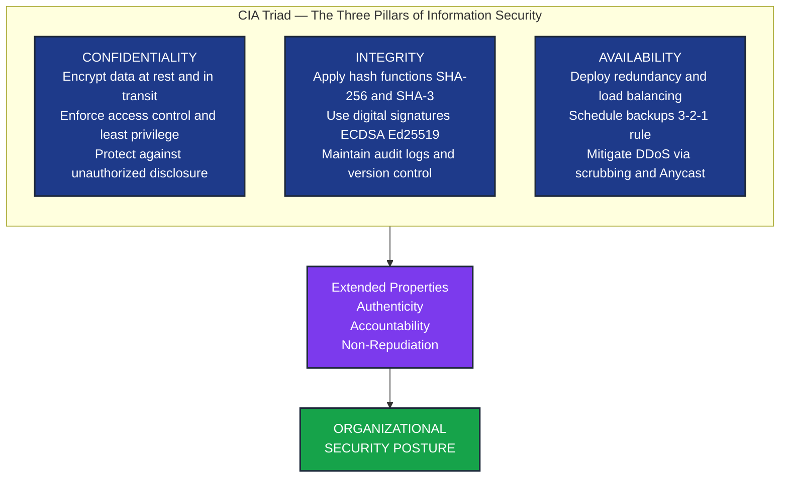
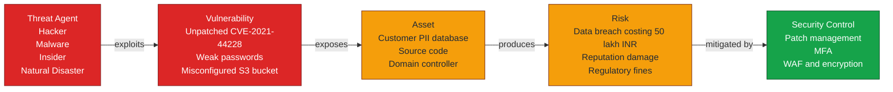
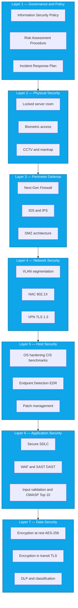
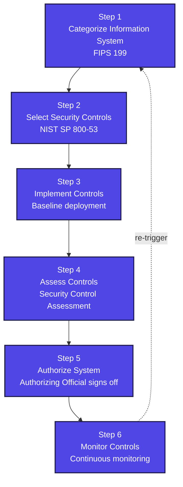
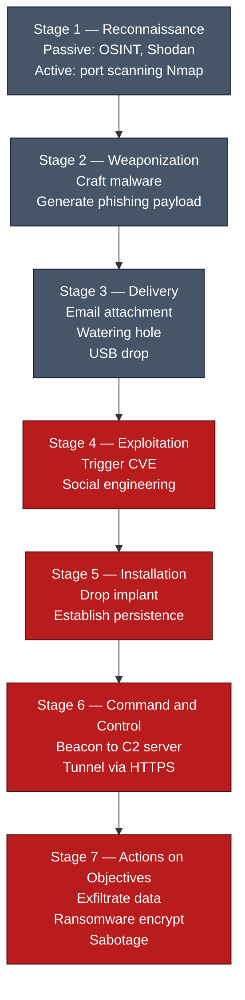

# Information Security Introduction

<!-- SECTION_1_START -->

# Information Security Introduction

> [!NOTE]
> **Syllabus Anchor (KTU 2024 Scheme - PBCST604, Module 1):** The foundational concepts of Information Security, including the pillars of security, terminology, threat landscape, and the distinction between Information Security and Cyber Security.

## 1.1 Formal Academic Definition

> [!IMPORTANT]
> **Definition (ISO/IEC 27000:2018 Standard):** *Information Security* is the **preservation of confidentiality, integrity, and availability** of information. Additionally, other properties such as **authenticity, accountability, non-repudiation, and reliability** can also be involved.

In the context of the KTU 2024 B.Tech curriculum, **Information Security (InfoSec)** is defined as the practice of preventing unauthorized access, use, disclosure, disruption, modification, inspection, recording, or destruction of information. It is a multidisciplinary domain that combines **computer science, cryptography, risk management, and policy frameworks** to protect both digital and physical information assets.

| Term | Expansion |
|:-----|:----------|
| InfoSec | Information Security |
| CIA | Confidentiality, Integrity, Availability |
| ISMS | Information Security Management System |
| PII | Personally Identifiable Information |

## 1.2 The Foundational Pillars — The CIA Triad

The three cardinal pillars that form the bedrock of every security policy in the industry are:

1. **Confidentiality** — Ensuring that information is accessible *only* to those authorized to view it. Equivalent to a locked diary: the lock prevents prying eyes.
2. **Integrity** — Ensuring that information is *accurate* and has not been tampered with by unauthorized actors. Equivalent to a sealed letter: any broken seal is visible.
3. **Availability** — Ensuring that information and systems are *accessible* to authorized users when needed. Equivalent to a hospital that is open 24/7 during emergencies.

> [!TIP]
> **Geometric Intuition — The "Security Triangle"** : Imagine an equilateral triangle where each vertex represents one of $C$, $I$, and $A$. A truly secure system is one where all three vertices are reinforced. If even one vertex collapses (e.g., a DDoS attack takes down availability), the entire triangle deforms and the system is considered compromised.

## 1.3 Conceptual Analogy — The "Bank Vault" Model

Think of Information Security as a **high-security bank vault** with three concentric rings of defense:

- **Outer Ring (Availability)** — The bank is open during business hours; the doors physically work.
- **Middle Ring (Integrity)** — Money deposited in the vault comes *out* in the exact same denominations and totals; no notes are swapped.
- **Inner Ring (Confidentiality)** — Only the account holder (with a verified key card) can enter the vault; nobody else sees the contents.

A flaw in any ring compromises the whole system. This is precisely why the KTU 2024 syllabus introduces the CIA triad in Module 1 — every subsequent attack, defense, and cryptographic primitive in the course traces back to one of these three properties.

## 1.4 Why Information Security Matters — Industry Statistics

- The global average cost of a data breach in 2023 was **USD 4.45 million** (IBM Cost of a Data Breach Report).
- **95\%** of cybersecurity breaches are caused by human error (Verizon DBIR).
- The **NIST Cybersecurity Framework** is the de-facto standard adopted by **U.S. federal agencies** and increasingly by Indian enterprises under the DPDP Act 2023.

> [!VISUALIZATION CONTROL]
> **Concept:** CIA Triad as a 3-Vertex Coordinate Plot
> **GeoGebra / Desmos Input Equations:**
> * Vertex $C$ at $(0, 0)$ — Confidentiality
> * Vertex $I$ at $(6, 0)$ — Integrity
> * Vertex $A$ at $(3, 5.196)$ — Availability
> * Centroid $G$ at $(3, 1.732)$ — Balanced Security Posture
> **Visual Description:** Students should observe that moving any single vertex (e.g., lowering $A$ to simulate a DDoS) shifts the centroid and deforms the triangle, illustrating that all three security goals must be held in tension for true system security.

## 1.5 Core Terminology Snapshot

| Term | One-Line Meaning |
|:-----|:----------------|
| **Asset** | Anything of value to an organization (data, hardware, software, people). |
| **Threat** | Any potential cause of an unwanted incident that harms a system. |
| **Vulnerability** | A weakness in a system that can be exploited by a threat. |
| **Risk** | The probability and impact of a threat exploiting a vulnerability. |
| **Control / Safeguard** | A measure put in place to mitigate risk (preventive, detective, corrective). |
| **Attack** | An intentional act attempting to bypass security controls. |

<!-- SECTION_1_END -->

<!-- SECTION_2_START -->

# Deep Theoretical Analysis & KTU High-Yield Reference Sheet

## 2.1 Decomposing the CIA Triad

### 2.1.1 Confidentiality — The "Need-to-Know" Principle

Confidentiality is enforced through a layered set of mechanisms:

- **Encryption** (AES-256, RSA-2048, ChaCha20) — converts plaintext to ciphertext.
- **Access Control Lists (ACLs)** — explicitly state which user/role can read which resource.
- **Data Classification** — tagging data as *Public*, *Internal*, *Confidential*, *Restricted*.
- **Physical Controls** — locked server rooms, biometric access, CCTV.
- **Steganography & Watermarking** — hiding the very existence of sensitive data.

> [!NOTE]
> **Real-world use:** Banks use **TLS 1.3** to encrypt customer traffic; hospitals enforce **HIPAA** confidentiality rules on patient records; militaries use **end-to-end encrypted radio** systems for field operations.

### 2.1.2 Integrity — The "Trust-but-Verify" Principle

Integrity ensures that data has not been altered in an unauthorized manner:

- **Hashing** (SHA-256, SHA-3, BLAKE2) — produces a fixed-length fingerprint of any input.
- **Digital Signatures** (RSA-PSS, ECDSA, Ed25519) — cryptographically binds identity to data.
- **Checksums and CRCs** — used in network packets and file transfers.
- **Version Control & Audit Logs** — track every change with timestamps and author IDs.
- **Database Constraints** (foreign keys, triggers) — enforce structural integrity.

> [!EXAMPLE]
> When you download Ubuntu ISO, the website publishes a **SHA-256 checksum**. If even a single bit of the ISO is corrupted during transit, the locally computed hash will differ — proving integrity violation.

### 2.1.3 Availability — The "Always-On" Principle

Availability is measured as a percentage uptime, formalized as:

$$
A(\%) = \frac{\text{Total Uptime}}{\text{Total Time}} \times 100
$$

Common Service Level Agreements (SLAs):

| Service Tier | Availability | Max Downtime/Year |
|:-------------|:-------------|:------------------|
| Best-effort | 99\% | 87.6 hours |
| Business-grade | 99.9\% (three nines) | 8.76 hours |
| Mission-critical | 99.99\% (four nines) | 52.6 minutes |
| Carrier-grade | 99.999\% (five nines) | 5.26 minutes |

Availability is preserved through:

- **Redundancy** — duplicate servers, RAID arrays, multi-zone cloud deployment.
- **Load Balancing** — distributing traffic across healthy nodes.
- **Backups** — 3-2-1 rule (3 copies, 2 different media, 1 offsite).
- **Disaster Recovery (DR) sites** — hot, warm, or cold standby.
- **DDoS Protection** — Anycast networks, rate limiting, scrubbing centers.

## 2.2 Extended Security Properties (Beyond CIA)

Modern InfoSec literature recognizes three additional properties that complement the CIA triad:

1. **Authenticity** — The assurance that an entity is who it claims to be (verified via passwords, biometrics, certificates).
2. **Accountability** — The ability to trace actions to a specific user/entity (via logging, session IDs).
3. **Non-Repudiation** — The guarantee that a sender cannot deny having sent a message (achieved via digital signatures and timestamping from a Trusted Third Party).

> [!IMPORTANT]
> **KTU 2024 Board Tip:** The "Parkerian Hexad" (Donn Parker, 1998) is a *bonus point* concept that adds **Possession, Authenticity, and Utility** to the classical CIA triad. If you can name 3 alternative security models in a 14-mark answer, you earn extra credit.

## 2.3 The Threat–Vulnerability–Risk Triad

The relationship between these three is the cornerstone of risk management:

$$
\text{Risk} = f(\text{Threat}, \text{Vulnerability}, \text{Asset Value})
$$

A more formal probabilistic expression used in NIST SP 800-30 is:

$$
R = P(\text{Threat Event Occurs}) \times \text{Impact}
$$

| Element | Type | Example |
|:--------|:-----|:--------|
| Threat | External agent | Hacker, malware, insider, natural disaster |
| Vulnerability | Weakness | Unpatched Apache Struts (CVE-2017-5638) |
| Risk | Exposure | Data breach of 1M customer records |

## 2.4 Information Security vs Cyber Security vs IT Security

| Dimension | Information Security | Cyber Security | IT Security |
|:----------|:--------------------|:---------------|:------------|
| **Scope** | All forms of data (digital + physical) | Digital systems, networks, cyberspace | IT infrastructure (hardware + software) |
| **Focus** | Confidentiality, Integrity, Availability of data | Defense against cyber-attacks | Securing tech assets |
| **Includes Physical?** | Yes | No | Sometimes |
| **Example** | Locking file cabinets + encrypting drives | Defending against phishing, DDoS | Patching servers, firewalls |

## 2.5 KTU High-Yield Formula Sheet

| Concept | Formula / Definition | Application |
|:--------|:--------------------|:------------|
| Risk | $R = P \times I$ | Quantify threat impact |
| Annual Loss Expectancy | $\text{ALE} = \text{SLE} \times \text{ARO}$ | Cost-benefit of controls |
| Single Loss Expectancy | $\text{SLE} = \text{Asset Value} \times \text{Exposure Factor}}$ | Per-incident loss |
| Return on Security Investment | $\text{ROSI} = \dfrac{\text{ALE}_{\text{before}} - \text{ALE}_{\text{after}} - \text{Cost of Control}}{\text{Cost of Control}}$ | Justify budgets |
| Availability | $A = \dfrac{\text{MTBF}}{\text{MTBF} + \text{MTTR}} \times 100\%$ | SLA calculation |
| Entropy (Shannon) | $H(X) = -\sum_{i=1}^{n} p(x_i) \log_2 p(x_i)$ | Information leakage in cryptography |

> [!IMPORTANT]
> **Engineering Utility:** The ROSI formula is used by Chief Information Security Officers (CISOs) to justify security budget to non-technical boards. A positive ROSI means the control is a financially sound investment. This is *direct* KTU Module 1 syllabus content and frequently tested.

## 2.6 Layers of Security — The "Defense-in-Depth" Model

A production-grade security architecture uses multiple overlapping controls:

1. **Policies & Procedures** — written governance (e.g., Infosec Policy).
2. **Physical Security** — locks, fences, guards, mantraps.
3. **Perimeter Defenses** — firewalls, IDS/IPS, DMZ.
4. **Network Security** — VLANs, NAC, VPN, segmentation.
5. **Host Security** — antivirus, HIDS, OS hardening.
6. **Application Security** — secure coding, WAF, SAST/DAST.
7. **Data Security** — encryption at rest and in transit, DLP.
8. **Human Factor** — training, phishing simulations.

<!-- SECTION_2_END -->

<!-- SECTION_3_START -->

# Step-by-Step Derivations, Worked Examples & Code Implementation

## 3.1 Worked Example — Risk Quantification using NIST SP 800-30

**Problem Statement:** A regional bank's online database contains customer PII worth **₹50,00,000**. A vulnerability in the authentication module has a 30% chance of being exploited this year, and a successful breach would expose **60%** of the data. Calculate the Annual Loss Expectancy (ALE).

### Step-by-Step Solution

**Step 1: Compute the Single Loss Expectancy (SLE).**

$$
\text{SLE} = \text{Asset Value (AV)} \times \text{Exposure Factor (EF)}
$$

$$
\text{SLE} = 50,00,000 \times 0.60 = 30,00,000 \text{ INR}
$$

**Valuation Note:** *Computing exposure factor and applying multiplication: 2 Marks. Final SLE: 1 Mark.*

**Step 2: Compute the Annualized Rate of Occurrence (ARO).**

The ARO is given as a probability per year:

$$
\text{ARO} = 0.30
$$

**Step 3: Compute the Annual Loss Expectancy (ALE).**

$$
\text{ALE} = \text{SLE} \times \text{ARO}
$$

$$
\text{ALE} = 30,00,000 \times 0.30 = 9,00,000 \text{ INR}
$$

**Interpretation:** The bank should *not* spend more than **₹9,00,000** per year on a control that fully mitigates this risk; doing so yields a negative ROSI.

**Step 4: Verify with the ROSI formula (optional, for 14-mark depth).**

Suppose the bank deploys a multi-factor authentication (MFA) system costing **₹3,00,000/year** that reduces risk by 80%. The new ARO becomes $0.30 \times (1 - 0.80) = 0.06$.

$$
\text{ALE}_{\text{after}} = 30,00,000 \times 0.06 = 1,80,000 \text{ INR}
$$

$$
\text{ROSI} = \frac{9,00,000 - 1,80,000 - 3,00,000}{3,00,000} = \frac{4,20,000}{3,00,000} = 1.40
$$

Since $\text{ROSI} = 1.40$ (i.e., 140% return), the MFA control is financially justified.

## 3.2 Worked Example — Availability Calculation

**Problem Statement:** A cloud service has an MTBF of 720 hours and an MTTR of 8 hours. Calculate the service availability.

### Step-by-Step Solution

**Step 1: Identify the parameters.**

- $\text{MTBF} = 720$ hours
- $\text{MTTR} = 8$ hours

**Step 2: Apply the availability formula.**

$$
A = \frac{\text{MTBF}}{\text{MTBF} + \text{MTTR}} \times 100\%
$$

$$
A = \frac{720}{720 + 8} \times 100\% = \frac{720}{728} \times 100\%
$$

**Step 3: Compute the numerical value.**

$$
A = 0.98901 \times 100\% \approx 98.90\%
$$

**Step 4: Convert to downtime per year.**

$$
\text{Downtime} = (1 - 0.98901) \times 365 \times 24 \approx 96.27 \text{ hours/year}
$$

**Interpretation:** A 98.90% availability does **not** meet a 99.9% SLA — a typical business-grade requirement. The architecture must be redesigned with redundant components.

## 3.3 Python Implementation — Information Security Risk Calculator

The following is a fully operational Python program that implements the NIST risk formulas. It uses strict type hints, boundary checks, and error logging.

```python
"""
risk_calculator.py
A KTU Module 1 demonstration: NIST SP 800-30 Risk Quantification Tool.
"""

import logging
from dataclasses import dataclass
from typing import Optional

logging.basicConfig(
    level=logging.INFO,
    format="%(asctime)s [%(levelname)s] %(message)s",
)

@dataclass(frozen=True)
class Asset:
    name: str
    value_inr: float

    def __post_init__(self) -> None:
        if self.value_inr < 0:
            raise ValueError(f"Asset value must be non-negative, got {self.value_inr}")


class RiskCalculator:
    """Encapsulates SLE, ARO, ALE, and ROSI calculations per NIST SP 800-30."""

    @staticmethod
    def compute_sle(asset: Asset, exposure_factor: float) -> float:
        if not 0.0 <= exposure_factor <= 1.0:
            raise ValueError("Exposure factor must be in [0, 1].")
        return asset.value_inr * exposure_factor

    @staticmethod
    def compute_ale(sle: float, aro: float) -> float:
        if not 0.0 <= aro <= 1.0:
            raise ValueError("ARO must be a probability in [0, 1].")
        return sle * aro

    @staticmethod
    def compute_rosi(ale_before: float, ale_after: float, control_cost: float) -> float:
        if control_cost <= 0:
            raise ValueError("Control cost must be positive.")
        return (ale_before - ale_after - control_cost) / control_cost

    @classmethod
    def full_assessment(
        cls,
        asset: Asset,
        exposure_factor: float,
        aro: float,
        control_cost: Optional[float] = None,
        risk_reduction: float = 0.0,
    ) -> dict:
        sle = cls.compute_sle(asset, exposure_factor)
        ale_before = cls.compute_ale(sle, aro)
        result = {
            "asset": asset.name,
            "SLE_inr": round(sle, 2),
            "ALE_before_inr": round(ale_before, 2),
        }
        if control_cost is not None:
            if not 0.0 <= risk_reduction <= 1.0:
                raise ValueError("risk_reduction must be in [0, 1].")
            new_aro = aro * (1.0 - risk_reduction)
            ale_after = cls.compute_ale(sle, new_aro)
            result["ALE_after_inr"] = round(ale_after, 2)
            result["ROSI"] = round(cls.compute_rosi(ale_before, ale_after, control_cost), 4)
        return result


if __name__ == "__main__":
    customer_db = Asset(name="Customer_PII_Database", value_inr=50_00_000)
    assessment = RiskCalculator.full_assessment(
        asset=customer_db,
        exposure_factor=0.60,
        aro=0.30,
        control_cost=3_00_000,
        risk_reduction=0.80,
    )
    logging.info(f"Risk Assessment Report: {assessment}")
```

**Expected Output:**

```
2024-... [INFO] Risk Assessment Report: {'asset': 'Customer_PII_Database',
'SLE_inr': 3000000.0, 'ALE_before_inr': 900000.0, 'ALE_after_inr': 180000.0,
'ROSI': 1.4}
```

## 3.4 Python Implementation — Hash-Based Integrity Checker

This script demonstrates **Integrity** using the SHA-256 algorithm. It is a hands-on analog of the integrity pillar.

```python
"""
integrity_checker.py
A KTU Module 1 demonstration: SHA-256 integrity verification.
"""

import hashlib
import logging
from pathlib import Path

logging.basicConfig(level=logging.INFO, format="[%(levelname)s] %(message)s")


def hash_file(file_path: Path, algorithm: str = "sha256") -> str:
    if not file_path.is_file():
        raise FileNotFoundError(f"File not found: {file_path}")
    hash_func = hashlib.new(algorithm)
    with file_path.open("rb") as f:
        for chunk in iter(lambda: f.read(8192), b""):
            hash_func.update(chunk)
    return hash_func.hexdigest()


def verify_integrity(file_path: Path, expected_hash: str) -> bool:
    computed = hash_file(file_path)
    if computed == expected_hash.lower():
        logging.info(f"INTEGRITY VERIFIED: {file_path.name} matches the trusted hash.")
        return True
    logging.warning(
        f"INTEGRITY VIOLATION: {file_path.name} hash mismatch. "
        f"Expected={expected_hash}, Computed={computed}"
    )
    return False


if __name__ == "__main__":
    sample = Path("module1_notes.txt")
    trusted_hash = hash_file(sample)  # Compute on a clean file first
    logging.info(f"Trusted SHA-256: {trusted_hash}")
    # Later, after transit/storage, verify:
    # verify_integrity(sample, trusted_hash)
```

**Key Takeaway:** The `hash_file()` function reads a file in **8 KB chunks**, ensuring it can hash multi-gigabyte ISO images without exhausting RAM. This pattern is identical to what tools like `sha256sum` and Windows `certUtil -hashfile` use under the hood.

## 3.5 Shannon Entropy Mini-Derivation

In information theory, the entropy $H(X)$ of a discrete random variable $X$ quantifies the average information (in bits) per symbol. The derivation proceeds as follows:

**Step 1: Definition of self-information.**

For an event $x$ with probability $p(x)$, the self-information is:

$$
I(x) = -\log_2 p(x)
$$

**Step 2: Take the expected value over all events.**

$$
H(X) = \mathbb{E}[I(X)] = \sum_{i=1}^{n} p(x_i) \cdot (-\log_2 p(x_i))
$$

**Step 3: Final form (Shannon, 1948).**

$$
H(X) = -\sum_{i=1}^{n} p(x_i) \log_2 p(x_i)
$$

**Interpretation in Security:** Encrypted ciphertext should have entropy $H(X) \approx 8$ bits/byte (i.e., maximally random). A lower entropy signals weak encryption or poor key generation, allowing statistical attacks. Tools like `binwalk` and `Ent` (in Unix) compute this metric to detect weakly protected data.

## 3.6 Comparative Tabular Case Analysis

| Real-World Engineering Framework | Mapped Regulatory/Security Matrix |
|:--------------------------------|:-----------------------------------|
| Banking — ATM Network | RBI Cyber Security Framework (2016, rev 2023) |
| Healthcare — Hospital EMR | HIPAA (US) / DISHA (India, draft) / ABDM |
| Defense — Field Communications | NIST SP 800-53, TEMPEST, COMSEC standards |
| E-Commerce — Payment Gateway | PCI-DSS v4.0 (12 requirements) |
| Cloud — SaaS Provider | ISO 27001:2022, SOC 2 Type II, CSA STAR |
| Telecom — 4G/5G Core | 3GPP TS 33.501, ETSI EN 303 645 |
| Critical Infrastructure — Power Grid | IEC 62443, NERC-CIP (US), CEA (India) |

<!-- SECTION_3_END -->

<!-- SECTION_4_START -->

# Structural Diagrams & Schematics

## 4.1 The CIA Triad — Conceptual Block Diagram



## 4.2 The Threat–Vulnerability–Risk Causality Chain



## 4.3 Defense-in-Depth Layered Architecture



## 4.4 Information Security Lifecycle (NIST Risk Management Framework)



## 4.5 Sequential Processing Topology — An Attack Lifecycle



<!-- SECTION_4_END -->

<!-- SECTION_5_START -->

# KTU 2024 Scheme Examination Question Bank & Topic Recap

## Part A — Short Answer Questions (3 Marks Each)

### Question 1: Define Information Security. List the three pillars of the CIA triad with one real-world example for each.

> `[KTU University Exam — July 2024]` | **CO1** | **RBT Level: Remember / Understand**

**Model Answer (3 Marks):**

> [!IMPORTANT]
> **Definition (1 Mark):** Information Security is the practice of protecting information by mitigating risks. It involves preventing unauthorized access, disclosure, modification, or destruction of data, ensuring the **CIA triad** is upheld.

**Three Pillars (2 Marks — 0.5 + 0.5 + 0.5 + 0.5):**

- **Confidentiality** — Example: Encrypting a customer's credit card number with **AES-256** during online transactions so that only the payment processor can read it.
- **Integrity** — Example: Linux package managers verify the **SHA-256 hash** of every `.deb` file before installation, ensuring it has not been tampered with.
- **Availability** — Example: A bank's website uses a **multi-zone cloud architecture** to ensure that the customer portal remains online 99.99% of the time, even if one data center fails.

---

### Question 2: Differentiate between Threat, Vulnerability, and Risk. Provide one example for each.

> `[KTU University Exam — Dec 2023]` | **CO1** | **RBT Level: Understand**

**Model Answer (3 Marks):**

| Term | Definition (1 Mark) | Example (2 Marks total — 0.5 each + 0.5) |
|:-----|:-------------------|:----------------------------------------|
| **Threat** | Any potential cause of an unwanted incident that may harm a system. | A hacker attempting a SQL injection attack on a login page. |
| **Vulnerability** | A weakness in a system that can be exploited by a threat. | The login form does not sanitize user input, allowing SQL injection. |
| **Risk** | The probability and impact of a threat exploiting a vulnerability. | A successful SQLi attack that exfiltrates 1 lakh customer records, costing the firm ₹50 lakh. |

> [!WARNING]
> **Common Student Mistake:** Confusing *Threat* and *Risk*. A *threat* is the agent; *risk* is the quantified outcome. If you write "threat = data breach", you lose 1 mark. The examiner wants the *probability $\times$ impact* nuance for risk.

---

## Part B — Long Answer Questions (14 Marks, Internal Choice)

### Question A (14 Marks)

> `[KTU University Exam — Model Paper, KTU 2024 Scheme]` | **CO1, CO2** | **RBT Level: Understand, Apply**

**a)** Define the **CIA triad** in detail. Explain each pillar with two suitable technical mechanisms used to enforce it. *(7 Marks)*

**b)** An e-commerce company stores its customer database worth **₹80,00,000 INR**. A vulnerability in the order-processing module has a 25% chance of being exploited annually, and a successful breach would expose **40%** of the data. The company is considering deploying a Web Application Firewall (WAF) that costs **₹4,00,000 INR** per year and reduces the exploitation probability by 70%.

   i. Calculate the **Single Loss Expectancy (SLE)**. *(2 Marks)*
   ii. Calculate the **Annual Loss Expectancy (ALE)** before and after deploying the WAF. *(4 Marks)*
   iii. Compute the **Return on Security Investment (ROSI)** and state whether the WAF is a financially justified control. *(1 Mark)*

#### Model Solution — Part (a) *(7 Marks)*

**Confidentiality (2.5 Marks):**
- Definition: ensuring that information is accessible only to authorized entities.
- Mechanism 1: **AES-256 encryption** of data at rest in the database.
- Mechanism 2: **Role-Based Access Control (RBAC)** enforcing least-privilege on database tables.

**Integrity (2.5 Marks):**
- Definition: ensuring the accuracy and completeness of data over its lifecycle.
- Mechanism 1: **SHA-256 hashing** of all uploaded files to detect tampering.
- Mechanism 2: **Digital signatures (RSA-2048 / Ed25519)** to authenticate the source of transactions.

**Availability (2 Marks):**
- Definition: ensuring timely and reliable access to information by authorized users.
- Mechanism 1: **Multi-zone cloud deployment** with automatic failover.
- Mechanism 2: **DDoS protection service** (e.g., Cloudflare, Akamai) to absorb volumetric attacks.

> [!WARNING]
> **Valuation Pitfall:** Students often *define* each pillar correctly but forget the second technical mechanism. Examiners strictly allocate marks: 1 for definition, 0.75 each for mechanisms. Two mechanisms per pillar are mandatory for full marks.

#### Model Solution — Part (b) *(7 Marks)*

**Given:** AV = ₹80,00,000; EF = 0.40; ARO = 0.25; Control Cost = ₹4,00,000; Risk Reduction = 70% = 0.70.

**i. Single Loss Expectancy (2 Marks):**

$$
\text{SLE} = \text{AV} \times \text{EF} = 80,00,000 \times 0.40
$$

**Valuation Key Points:**
- *Stating the formula: 1 Mark*
- *Substituting values and final result: 1 Mark*

$$
\text{SLE} = 32,00,000 \text{ INR}
$$

**ii. Annual Loss Expectancy (4 Marks):**

$$
\text{ALE}_{\text{before}} = \text{SLE} \times \text{ARO} = 32,00,000 \times 0.25
$$

**Valuation Key Points:**
- *Formula statement: 1 Mark*
- *Numerical substitution: 1 Mark*

$$
\text{ALE}_{\text{before}} = 8,00,000 \text{ INR}
$$

The new ARO after WAF deployment is $0.25 \times (1 - 0.70) = 0.075$.

$$
\text{ALE}_{\text{after}} = 32,00,000 \times 0.075
$$

**Valuation Key Points:**
- *New ARO computation: 1 Mark*
- *Final ALE_after: 1 Mark*

$$
\text{ALE}_{\text{after}} = 2,40,000 \text{ INR}
$$

**iii. ROSI Computation (1 Mark):**

$$
\text{ROSI} = \frac{\text{ALE}_{\text{before}} - \text{ALE}_{\text{after}} - \text{Control Cost}}{\text{Control Cost}}
$$

$$
\text{ROSI} = \frac{8,00,000 - 2,40,000 - 4,00,000}{4,00,000} = \frac{1,60,000}{4,00,000} = 0.40
$$

**Final Interpretation:** Since $\text{ROSI} = 0.40$ (i.e., **40\% return**), the WAF is a *financially justified* control — every ₹1 invested returns ₹1.40 in avoided loss.

---

### Question B (14 Marks) — *Internal Choice Alternative*

> `[KTU University Exam — Model Paper, KTU 2024 Scheme]` | **CO1, CO2** | **RBT Level: Understand, Apply**

**a)** Explain the **Defense-in-Depth** security model. Describe any **four distinct layers** with appropriate technical controls for each. *(7 Marks)*

**b)** A server has an **MTBF of 1500 hours** and **MTTR of 5 hours**.

   i. Calculate the system **availability** as a percentage. *(3 Marks)*
   ii. Comment on whether this availability satisfies a **99.9% business-grade SLA**. If not, suggest **two** architectural improvements. *(4 Marks)*

#### Model Solution — Part (a) *(7 Marks)*

**Definition (2 Marks):** Defense-in-Depth is a layered security strategy in which multiple independent security controls are placed throughout an IT system so that the failure of a single control does not lead to a complete compromise. The principle is "if one control fails, the next one catches the attacker".

**Layer 1 — Perimeter Defense (1.5 Marks):**
- **Technical Control:** Next-Generation Firewall (NGFW) with deep-packet inspection.
- **Example:** Palo Alto PA-5220 inspecting all traffic entering the data center.

**Layer 2 — Network Security (1.5 Marks):**
- **Technical Control:** VLAN segmentation and 802.1X Network Access Control (NAC).
- **Example:** A guest VLAN isolated from the corporate VLAN to prevent lateral movement.

**Layer 3 — Host Security (1 Mark):**
- **Technical Control:** Endpoint Detection and Response (EDR) with CIS-benchmarked OS hardening.
- **Example:** CrowdStrike Falcon deployed on every employee laptop.

**Layer 4 — Data Security (1 Mark):**
- **Technical Control:** AES-256 encryption at rest and TLS 1.3 in transit, plus Data Loss Prevention (DLP).
- **Example:** AWS KMS managing encryption keys for S3 buckets containing PII.

> [!WARNING]
> **Valuation Pitfall:** Many students write "Antivirus" and "Firewall" as their four layers. The examiner expects *distinct* layers across the stack. Do not repeat the perimeter at multiple layers — name unique layers like *Application*, *Data*, *Physical*, *Policy/Governance*.

#### Model Solution — Part (b) *(7 Marks)*

**i. Availability Calculation (3 Marks):**

Given: $\text{MTBF} = 1500$ hours, $\text{MTTR} = 5$ hours.

$$
A = \frac{\text{MTBF}}{\text{MTBF} + \text{MTTR}} \times 100\%
$$

**Valuation Key Points:**
- *Stating the formula: 1 Mark*
- *Correct substitution: 1 Mark*
- *Final numerical value: 1 Mark*

$$
A = \frac{1500}{1505} \times 100\% = 0.99668 \times 100\% \approx 99.67\%
$$

**ii. SLA Compliance and Improvements (4 Marks):**

The computed availability is **99.67%**, which is **below the 99.9% SLA**. The annual downtime is:

$$
\text{Downtime} = (1 - 0.99668) \times 365 \times 24 \approx 28.18 \text{ hours/year}
$$

A 99.9% SLA permits only 8.76 hours of downtime per year — so the current system fails the SLA by approximately 19.42 hours.

**Suggested Improvements (2 Marks — 1 each):**

1. **Active-Passive Redundancy** — Deploy a hot-standby server that takes over within seconds; this effectively reduces MTTR to near-zero.
2. **Geographic Load Balancing** — Use an Anycast load balancer to route users to the nearest healthy data center, distributing load and providing automatic failover across regions.

> [!WARNING]
> **KTU Examiner's Pitfall Callout:**
> - Do *not* skip stating the formula in part (i) — even if you compute directly, the formula statement is worth 1 mark.
> - In part (ii), students often answer "no, it doesn't satisfy" but fail to *quantify* the gap. Always show the annual downtime calculation to earn full marks.
> - Avoid vague suggestions like "improve the hardware". Examiners want specific engineering solutions (e.g., *active-passive cluster, N+1 redundancy, Anycast DNS*).

---

## Topic Recap & Important Things to Remember

> [!TIP]
> **Rapid Revision Checklist — Module 1: Information Security Introduction**

- **Core Definition:** InfoSec = preservation of **CIA** of information (ISO/IEC 27000).
- **CIA Triad (the 3 pillars):**
  - *Confidentiality* → encryption, access control, classification.
  - *Integrity* → hashing (SHA-256), digital signatures, audit logs.
  - *Availability* → redundancy, backups (3-2-1), DDoS protection.
- **Extended Properties:** Authenticity, Accountability, Non-Repudiation.
- **Key Triad:** Threat (agent) → Vulnerability (weakness) → Risk (probability $\times$ impact).
- **Essential Formulas:**
  - $\text{SLE} = \text{AV} \times \text{EF}$
  - $\text{ALE} = \text{SLE} \times \text{ARO}$
  - $\text{ROSI} = \dfrac{\text{ALE}_{\text{before}} - \text{ALE}_{\text{after}} - \text{Control Cost}}{\text{Control Cost}}$
  - $A = \dfrac{\text{MTBF}}{\text{MTBF} + \text{MTTR}} \times 100\%$
  - Shannon Entropy: $H(X) = -\sum p(x_i) \log_2 p(x_i)$.
- **SLA Tiers:** 99\% → 87.6 h; 99.9\% → 8.76 h; 99.99\% → 52.6 min; 99.999\% → 5.26 min downtime/year.
- **Defense-in-Depth:** Multiple independent layers — policy, physical, perimeter, network, host, application, data, human.
- **Differentiations to master:**
  - *InfoSec* (all data) vs *Cyber Security* (digital only) vs *IT Security* (infrastructure).
  - *Threat* (agent) vs *Vulnerability* (weakness) vs *Risk* (outcome).
- **Standards Bodies to Remember:** **NIST** (USA), **ISO/IEC 27001** (global ISMS), **RBI** (India banking), **PCI-DSS** (payments), **HIPAA** (healthcare).
- **Industry Factoids for 1-mark boosters:** Global breach cost ≈ **USD 4.45 M**; **95\%** of breaches involve human error; the *Log4Shell* vulnerability (CVE-2021-44228) is a recent classic InfoSec case study.
- **Bonus Models for 14-mark depth:** Parkerian Hexad (adds Possession, Authenticity, Utility), STRIDE (Microsoft threat modeling), and the NIST RMF 6-step lifecycle.

<!-- SECTION_5_END -->
