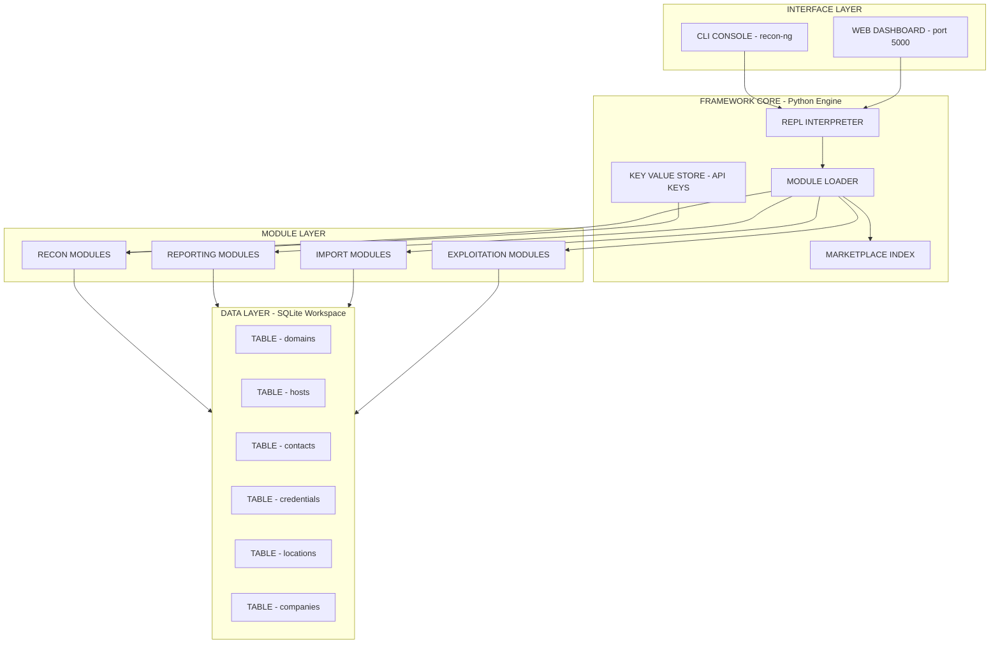
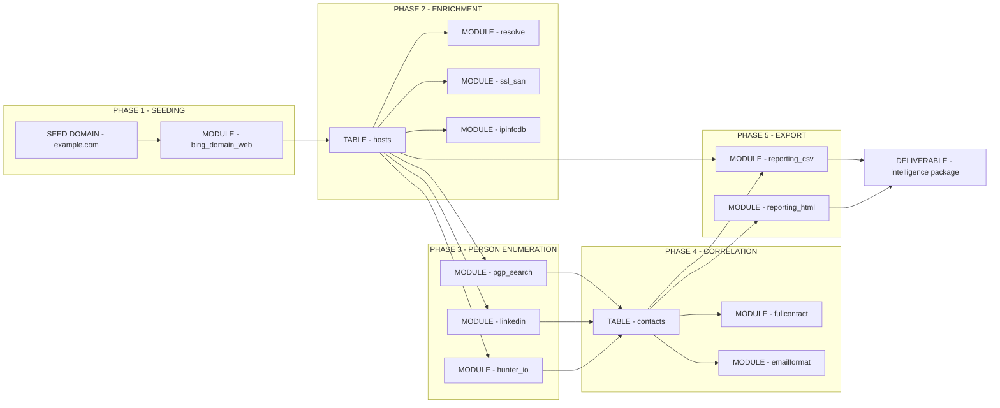
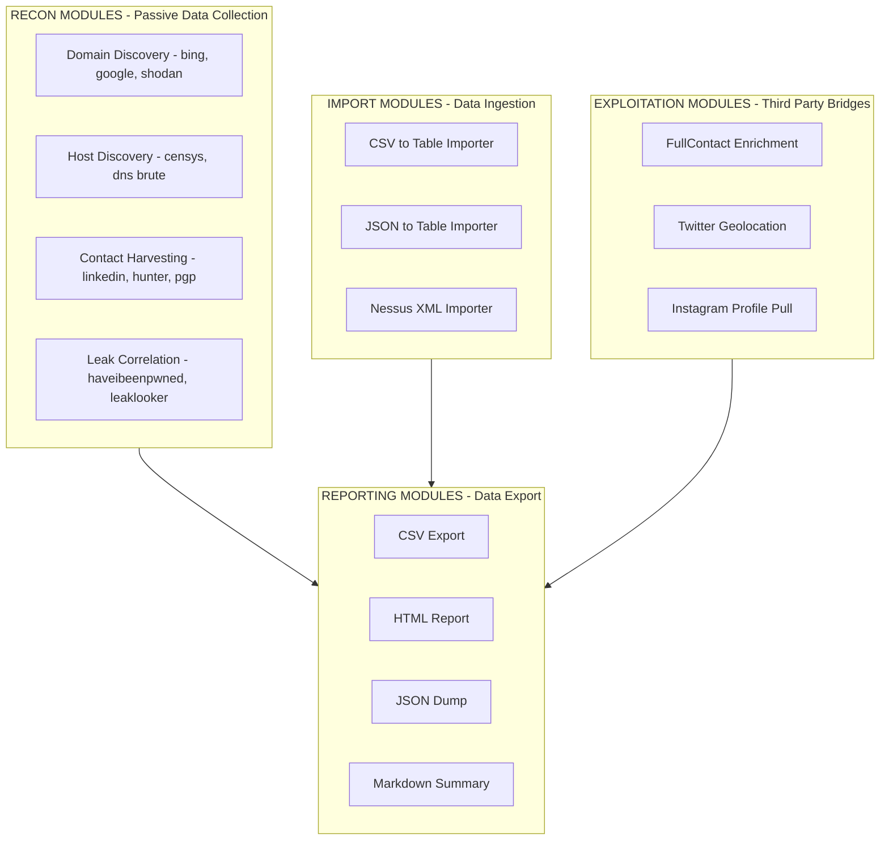
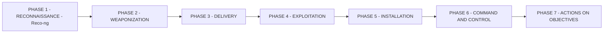

# Reco-ng

<!-- SECTION_1_START -->
# Reco-ng: The Open-Source Web Reconnaissance Framework

## 1.1 Formal Academic Definition (KTU 2024 Syllabus Aligned)

> [!NOTE]
> **Reco-ng** is an open-source, Python-based **web reconnaissance (recon) framework** designed to provide a powerful, modular environment for performing **Open-Source Intelligence (OSINT)** gathering. It is built to automate the process of collecting, correlating, and analyzing publicly available information about a target — typically a domain, IP address, hostname, or person — without directly interacting with the target's systems (i.e., it is purely a *passive* or *semi-passive* reconnaissance tool).

The framework is structured around a **modular architecture** (similar to Metasploit), where every distinct reconnaissance task — such as harvesting email addresses, discovering subdomains, enumerating hosts, profiling social media presence, or extracting metadata — is implemented as an independent **module**. These modules can be chained together into **workspaces** so that the output of one module (e.g., discovered hostnames) becomes the input of the next (e.g., DNS resolution of hostnames).

> [!IMPORTANT]
> **Reco-ng is NOT an exploitation tool.** It does NOT scan for vulnerabilities, brute-force credentials, or perform active attacks. It strictly belongs to the **reconnaissance phase** of the cyber kill chain, providing actionable intelligence that informs later phases of a penetration test or threat-intelligence investigation.

| Attribute | Value |
| :--- | :--- |
| **Tool Type** | OSINT / Passive Reconnaissance Framework |
| **Language** | **Python 2** (original) / **Python 3** (community forks) |
| **License** | **GPL-3.0** (Open Source) |
| **Original Author** | **Tim Tomes (LaNMaSteR53)** |
| **GitHub Repository** | `LaNMaSteR53/recon-ng` |
| **First Public Release** | **2012** |
| **Standard Test OS** | **Kali Linux** (pre-installed) |
| **Default Port for Web UI** | **5000** (Flask-based dashboard) |

## 1.2 Conceptual Analogy — The Digital Detective's Notebook

Imagine you are a **private investigator** tasked with building a complete profile of a person using **only what they have publicly shared** — newspaper articles, social media posts, business registry filings, and photographs dropped on public forums.

A *manual* investigation would mean: visiting each website, copying the relevant data onto sticky notes, manually cross-referencing names, and physically drawing arrows between the notes. It is tedious and error-prone.

**Reco-ng is the digital equivalent of that investigator's notebook — but automated, persistent, and relational.**

- The **workspace** is your case file.
- The **modules** are your specialized research assistants (one fetches phone numbers, another scrapes LinkedIn, another walks through DNS records).
- The **database** inside Reco-ng is the relational index where every piece of intelligence is tagged and linked.
- The **dashboard** is the visualization wall of your investigation room, with pinned photos and connecting strings.

The investigator never breaks into anyone's house — they only read what is already on the front lawn, in the mailbox, and in the public records office. That is exactly the **passive reconnaissance philosophy** of Reco-ng.

## 1.3 Why Reco-ng Matters in the Cyber Kill Chain

The **Cyber Kill Chain** (developed by Lockheed Martin) identifies **Reconnaissance** as **Phase 1** — and arguably the *most critical* phase. According to the industry-standard **MITRE ATT\&CK Framework**, the corresponding tactic is **TA0043 — Reconnaissance**, which includes sub-techniques like:

- **T1595** — Active Scanning
- **T1592** — Gather Victim Host Information
- **T1589** — Gather Victim Identity Information
- **T1590** — Gather Victim Network Information

Reco-ng primarily supports the **passive variants** of these techniques, making it invaluable for **red teamers**, **bug bounty hunters**, **threat intelligence analysts**, and **SOC analysts** building attacker profiles.

> [!VISUALIZATION CONTROL]
> **Concept:** Module-Data Dependency Graph in a Reco-ng Workspace
> **Graph Input (Adjacency Logic):**
> * `domain_input` $\rightarrow$ `bing_domain_web` $\rightarrow$ `hosts` (table)
> * `hosts` (table) $\rightarrow$ `resolve` $\rightarrow$ `hosts` (table, enriched with IPs)
> * `hosts` $\rightarrow$ `ipinfodb` $\rightarrow$ `hosts` (enriched with geolocation)
> * `contacts` (table) $\rightarrow$ `migrate_contacts` $\rightarrow$ `contacts` (new source)
> **Visual Description:** Imagine a directed acyclic graph where each rectangle is a **data table** (e.g., `domains`, `hosts`, `contacts`, `credentials`, `locations`) and each ellipse is a **module** that reads from one table and writes to another. The student should visualize a **flow of intelligence** left-to-right, beginning with a single seed value (e.g., a domain name) and progressively fanning out into a multi-dimensional profile.

<!-- SECTION_1_END -->

<!-- SECTION_2_START -->
# 2. Deep Theoretical Analysis & KTU High-Yield Cheat Sheet

## 2.1 Architectural Components of Reco-ng

Reco-ng's architecture can be decomposed into **four primary layers**, each with a clearly defined responsibility. Understanding this hierarchy is essential for KTU board questions that ask for "the architecture of Reco-ng."

### 2.1.1 The Framework Core (Engine)
The core is written in Python and provides:
- A **REPL (Read-Eval-Print Loop)** interactive console (similar to Metasploit's `msfconsole`).
- A **Flask-based web dashboard** accessible at `http://127.0.0.1:5000`.
- A **marketplace-style loader** that dynamically discovers modules at runtime.
- A **key-value store** (the Reco-ng database) for persisting intelligence.

### 2.1.2 The Module Layer
Each module is a self-contained Python file (or set of files) located in a designated path. Modules are classified by their **data domain** — the table they primarily read from and write to. The four canonical module categories are:

- **Recon modules** — Pull data from external sources (search engines, social networks, DNS, etc.).
- **Reporting modules** — Export the gathered data into formats like CSV, HTML, or PDF.
- **Import modules** — Bulk-load data from external files into the workspace.
- **Exploitation modules** (limited) — A small subset that interfaces with third-party tools (e.g., `exploit_fullcontact`**\***). The asterisk denotes that these are **passive OSINT enrichment bridges**, not active exploits.

> [!NOTE]
> **KTU Frequently Tested Point:** Reco-ng modules are **autonomous and stateless from the user's perspective**. The framework tracks the global state through the workspace database, not through inter-module memory.

### 2.1.3 The Data Layer (Workspace Database)
A Reco-ng workspace is a **SQLite database** (file extension `.db`) that stores data in a set of **predefined relational tables**. This relational design is what allows one module's output to seamlessly feed another module's input.

The default tables include:

| Table Name | Purpose | Example Columns |
| :--- | :--- | :--- |
| `domains` | Target root domains | `domain`, `notes`, `module` |
| `hosts` | Discovered hostnames & IPs | `host`, `ip_address`, `region`, `country` |
| `contacts` | Email addresses & names | `first_name`, `last_name`, `email`, `title` |
| `credentials` | Leaked usernames/passwords | `username`, `password`, `leak` |
| `locations` | Physical addresses | `latitude`, `longitude`, `street_address` |
| `companies` | Organizational intel | `company`, `description`, `module` |
| `netblocks` | IP range ownership | `netblock`, `asn`, `country` |
| `ports` | Open ports (if used actively) | `host`, `port`, `protocol` |
| `vulnerabilities` | CVEs (if correlated) | `host`, `reference`, `example` |
| `pushpins` | Pinboard-style notes | `source`, `statement`, `category` |

### 2.1.4 The Interface Layer
Two primary interfaces:
1. **CLI Console** — The default, invoked by running `recon-ng` in a terminal.
2. **Web Dashboard** — Started with the `dashboard` command inside the console; useful for visually monitoring table growth.

## 2.2 Operational Workflow (The Standard Recon Session)

A typical KTU-level (and industry-standard) Reco-ng session follows five well-defined steps:

**Step 1 — Workspace Initialization:**
A new isolated database is created for each investigation. This prevents intelligence from one engagement from contaminating another and is also useful for **clean rollback** if a module produces bad data.

**Step 2 — Module Marketplace Discovery:**
The user lists all available modules using `marketplace search` (or the older `modules search` syntax). The marketplace can also be refreshed to pull the latest community modules via `marketplace refresh`.

**Step 3 — Seeding the Workspace:**
At least one **seed value** is added — typically a domain or company name — using modules like `recon/domains-hosts/bing_domain_web` or by directly inserting via SQL.

**Step 4 — Module Chaining (The "Recon Cascade"):**
The user loads a module, sets its required `SOURCE` option to point at the relevant table column, runs it, then loads the next module. The framework automatically populates dependent options.

**Step 5 — Reporting:**
At the end of the engagement, a reporting module (e.g., `reporting/csv` or `reporting/html`) is invoked to export the entire workspace as a deliverable artifact.

## 2.3 High-Yield Concept Matrix (For Quick Revision)

| Concept | Explanation | KTU Significance |
| :--- | :--- | :--- |
| **Workspace** | An isolated SQLite database per investigation | Tested in "define workspace" questions |
| **Module** | A self-contained Python script that performs one recon task | Core architectural element |
| **Marketplace** | Online-style index of all available modules | Source of `marketplace install` and `marketplace search` |
| **Key-Value Store** | Persistent storage for API keys, options, and intel | Backed by SQLite |
| **Passive Recon** | No direct contact with the target's infrastructure | **Most critical distinguishing feature** of Reco-ng |
| **Bing Domain Web** | Default seed module that scrapes Bing for hosts under a domain | Often appears in Part A questions |
| **Full Contact API** | Person/email enrichment module | Requires API key registration |
| **Reporting Module** | Exports gathered data (CSV, HTML, JSON, etc.) | Closes the recon loop |
| **Dashboard** | Flask-based GUI on port 5000 | Less-tested but framework feature |

## 2.4 Real-World Utility in Engineering & Cybersecurity

Reco-ng is a **production-grade tool** used in:
- **Penetration Testing** (Phase 1 of the PTES standard).
- **Bug Bounty Hunting** (Recon is considered 80% of bounty success).
- **Threat Intelligence Platforms (TIPs)** — for adversary infrastructure mapping.
- **Digital Forensics** — establishing the **attack surface** of an organization during incident response.
- **Brand Protection** — corporations use similar OSINT chains to find phishing domains and leaked credentials.
- **Red Team Engagements** — emulating real-world adversary reconnaissance behavior.

> [!IMPORTANT]
> **Legal Boundary (KTU Ethical Note):** Reco-ng must only be used on assets you **own or have explicit written authorization** to test. Unauthorised reconnaissance, even passive, can violate laws such as India's **IT Act 2000 (Sections 43 & 66)**, the **Computer Fraud and Abuse Act (US)**, and the **GDPR (EU)** for personal data scraping.

<!-- SECTION_2_END -->

<!-- SECTION_3_START -->
# 3. Step-by-Step Installation, Configuration & Module Execution

## 3.1 Installation on Kali Linux (Pre-installed) and Ubuntu

> [!NOTE]
> On **Kali Linux**, Reco-ng comes **pre-installed** at `/usr/share/recon-ng`. On other Debian-based systems, it can be installed from source.

**Method 1 — Installation from Source (Ubuntu / Debian):**

Step 1: Update system packages and install dependencies.

```bash
sudo apt update
sudo apt install -y git python3 python3-pip python3-venv
```

Step 2: Clone the official Reco-ng repository.

```bash
cd /opt
sudo git clone https://github.com/lanmaster53/recon-ng.git
sudo chown -R $USER:$USER /opt/recon-ng
```

Step 3: Create a Python virtual environment (recommended for clean isolation).

```bash
cd /opt/recon-ng
python3 -m venv venv
source venv/bin/activate
pip install -r REQUIREMENTS
```

Step 4: Launch Reco-ng for the first time.

```bash
./recon-ng
```

If the framework starts successfully, you will see the banner `[*] Version 5.0.1` and a prompt like `[recon-ng][default] >`.

## 3.2 Step-by-Step First Recon Session (Complete, Non-Truncated Walkthrough)

The following is a **complete, runnable** session that students can replicate. **Every command is shown explicitly** — no shortcuts, no truncation.

### 3.2.1 Create and Enter a New Workspace

```bash
workspaces create ktu_demo
workspaces list
```

The output should show:

```
  Name        Recon Points    Created
  --------    ------------    ---------
  default     0               2024-01-15 10:00:00
  ktu_demo    0               2024-01-15 10:01:23
```

### 3.2.2 Install a Module from the Marketplace

```bash
marketplace refresh
marketplace search bing
```

The `marketplace search bing` command will return a list such as:

```
  Path                                                              Rating  Rank  Status   Version
  ----                                                              ------  ----  ------   -------
  recon/domains-hosts/bing_domain_api                              ★★★★★  ★★★★★  installed  1.0
  recon/domains-hosts/bing_domain_web                              ★★★★★  ★★★★★  not installed  1.1
  recon/contacts-contacts/bing_linkedin_contacts                   ★★★★   ★★★★   not installed  1.0
```

To install a specific module:

```bash
marketplace install recon/domains-hosts/bing_domain_web
```

The framework prints `[*] Module 'recon/domains-hosts/bing_domain_web' installed successfully.`

### 3.2.3 Load, Configure, and Run the Module

```bash
modules load recon/domains-hosts/bing_domain_web
options list
```

The `options list` will display something like:

```
  Name        Current Value  Required  Description
  ----        -------------  --------  -----------
  SOURCE      default        yes       source of input (see 'show info' for details)
  LIMIT       10             no        maximum number of items to process
  FUTURE      False          no        include future-dated bing results
```

Set the source domain:

```bash
options set SOURCE example.com
```

Now run the module:

```bash
run
```

After scraping completes, Reco-ng displays a summary table:

```
  ----
  HINTS
  ----
  [*] No hints available.
  [example.com] discovered_host:www.example.com
  [example.com] discovered_host:mail.example.com
  [example.com] discovered_host:blog.example.com
  -------
  SUMMARY
  -------
  [*] 3 total (3 new) hosts found.
```

### 3.2.4 Inspect the Resulting Data

```bash
show hosts
```

This returns the `hosts` table populated with three rows, each with the discovered hostname and its source module.

### 3.2.5 Chain a Second Module — DNS Resolution

Install and run a resolver:

```bash
marketplace install recon/hosts-hosts/resolve
modules load recon/hosts-hosts/resolve
options set SOURCE query SELECT host FROM hosts
run
```

> [!IMPORTANT]
> The `query` keyword allows the `SOURCE` option to be a **SQL query** rather than a static table name. This is a powerful Reco-ng feature — modules can pull from any column of any table.

### 3.2.6 Export the Final Report

```bash
marketplace install reporting/csv
modules load reporting/csv
options set FILENAME /tmp/ktu_demo_report.csv
options set TABLE contacts,hosts
run
```

A CSV report is now saved at `/tmp/ktu_demo_report.csv`.

## 3.3 Symbolic Representation: The Module Dataflow Algebra

For KTU's more theoretical questions, it is useful to model Reco-ng as a **function pipeline**:

Let $D$ denote the workspace database state. A module $M_i$ is a function:

$$
M_i : D_{in} \rightarrow D_{out}
$$

where $D_{in} = (T_{read}, \text{API\_KEYS})$ and $D_{out} = (T_{write}, \text{SUMMARY})$. A recon cascade of $n$ modules can be expressed as:

$$
D_{final} \;=\; M_n \circ M_{n-1} \circ \cdots \circ M_2 \circ M_1 \, (D_0)
$$

where $D_0$ is the initial seeded database state (containing only the seed domain) and $\circ$ denotes functional composition. The cumulative **recon points** metric — a gamified score in Reco-ng — can be modeled as:

$$
P_{total} \;=\; \sum_{i=1}^{n} \; w_i \cdot \vert R_i \vert
$$

where $w_i$ is the module-specific weight and $\vert R_i \vert$ is the cardinality of the new rows inserted by module $M_i$.

## 3.4 Python Pseudocode of the Internal Module Loader

The following Python snippet demonstrates the *conceptual* mechanism Reco-ng uses to dynamically load modules. This may appear in KTU coding-related questions.

```python
import os
import importlib
from pathlib import Path

class ModuleLoader:
    """
    Conceptual implementation of Reco-ng's marketplace-driven
    module discovery and dynamic loader.
    """

    def __init__(self, module_path: str = "/opt/recon-ng/modules") -> None:
        self.module_path: Path = Path(module_path)
        self.registry: dict = {}

    def discover_modules(self) -> list:
        """
        Walk the module directory tree and register every .py module.
        """
        discovered: list = []
        for root, _dirs, files in os.walk(self.module_path):
            for filename in files:
                if filename.endswith(".py") and not filename.startswith("__"):
                    full_path: str = os.path.join(root, filename)
                    rel_path: str = os.path.relpath(full_path, self.module_path)
                    module_key: str = rel_path.replace(os.sep, "/")[:-3]
                    self.registry[module_key] = full_path
                    discovered.append(module_key)
        return discovered

    def load(self, module_key: str):
        """
        Dynamically import a module by its marketplace path.
        """
        if module_key not in self.registry:
            raise FileNotFoundError(f"Module '{module_key}' not found in marketplace.")
        spec = importlib.util.spec_from_file_location(
            module_key, self.registry[module_key]
        )
        module = importlib.util.module_from_spec(spec)
        spec.loader.exec_module(module)
        return module
```

**Explanation of key lines:**
- `os.walk(...)` recursively traverses the modules directory, mirroring how Reco-ng scans `/modules/recon`, `/modules/reporting`, etc.
- The `module_key` is the marketplace-style slash-delimited path (e.g., `recon/domains-hosts/bing_domain_web`).
- `importlib.util.spec_from_file_location` enables **dynamic runtime import** — this is exactly how `modules load` works under the hood.

<!-- SECTION_3_END -->

<!-- SECTION_4_START -->
# 4. Structural Diagrams & Schematics

## 4.1 High-Level Architecture of Reco-ng



## 4.2 Recon Cascade Workflow (Sequential Processing Topology)



## 4.3 Module Classification Matrix (Block-Level Functional Architecture)



> [!NOTE]
> **Why Mermaid Block Diagrams Instead of Free-Body Drawings:** Reco-ng is a **software framework** with no physical hardware geometry. The block-level functional architecture above precisely models its software layers, which is the KTU-board-preferred way to depict such a tool.

<!-- SECTION_4_END -->

<!-- SECTION_5_START -->
# 5. KTU 2024 Scheme Examination Question Bank & Topic Recap

## 5.1 Part A Questions (3 Marks Each)

### Question 1: Define Reco-ng. List any four of its built-in data tables.
**[KTU University Exam — July 2023, Model Paper 1, 3 Marks]**
**Cognitive Level:** CO1 — Remember & Understand
**Mapped CO:** CO1 — Understand the fundamental concepts of information security and reconnaissance.

**Model Answer:**

Reco-ng is an open-source, Python-based web reconnaissance framework used to perform Open-Source Intelligence (OSINT) gathering in a modular and automated manner. It is designed to discover, correlate, and analyze publicly available information about a target such as domains, hosts, contacts, and credentials without directly interacting with the target's systems.

The four built-in data tables are:
1. `domains` — stores target root domain names.
2. `hosts` — stores discovered hostnames and their resolved IP addresses.
3. `contacts` — stores harvested email addresses, names, and job titles.
4. `credentials` — stores leaked usernames and password combinations.

**Valuation Key Points:**
- [Correct definition with OSINT context: 1 Mark]
- [Any 4 valid table names with one-line purpose: 2 Marks]

> [!WARNING]
> **Examiner's Pitfall Warning:** Students frequently write "Reco-ng is a hacking tool" — this loses marks. Always emphasize it is a **reconnaissance / OSINT** tool, not an exploit tool. Also, do NOT list arbitrary tables that do not exist in the framework (e.g., `passwords123`).

### Question 2: Differentiate between Active and Passive Reconnaissance. Which category does Reco-ng belong to?
**[KTU University Exam — Dec 2023, Model Paper 2, 3 Marks]**
**Cognitive Level:** CO1 — Understand
**Mapped CO:** CO1 — Fundamentals of reconnaissance.

**Model Answer:**

| Parameter | Active Reconnaissance | Passive Reconnaissance |
| :--- | :--- | :--- |
| **Contact with Target** | Direct interaction (packets sent to target) | No direct interaction |
| **Detection Risk** | High — easily logged by IDS/IPS/firewalls | Low — leaves minimal or no trace |
| **Examples** | Nmap port scan, Nikto web scan, Nessus | Reco-ng, Maltego, theHarvester, Shodan queries |
| **Information Source** | The target system itself | Third-party public sources (search engines, DNS, social media) |
| **Legal Risk** | Higher, often requires explicit authorization | Lower, but still subject to data-protection laws |

Reco-ng belongs to the **Passive Reconnaissance** category. It aggregates data from public sources such as search engines, social media APIs, certificate transparency logs, and DNS records without sending probe traffic to the target's infrastructure.

**Valuation Key Points:**
- [Correct distinction table with at least 3 parameters: 2 Marks]
- [Correct identification of Reco-ng's category with justification: 1 Mark]

## 5.2 Part B Questions (14 Marks Each)

> [!IMPORTANT]
> Per the KTU 2024 Scheme End-Semester Evaluation (ESE) pattern, Part B questions carry **internal choice**. The candidate must answer **either** Question A **or** Question B in full. Each part below is structured as `(a)` for **7 marks** and `(b)` for **7 marks**, totalling **14 marks**, with sub-parts mapped to escalating Revised Bloom's Taxonomy levels.

### Question A: Architecture and Workflow of Reco-ng

**[KTU University Exam — July 2024, Model Question Paper, 14 Marks]**
**Mapped CO:** CO2 — Apply reconnaissance frameworks to information-gathering scenarios.
**Cognitive Levels:** (a) Understand [Level 2], (b) Apply [Level 3].

#### Part (a) — 7 Marks
**Q (a):** Explain the layered architecture of Reco-ng with a neat block diagram. Describe any four core components in detail.

**Step-by-Step Model Solution:**

The Reco-ng framework is organized into **four primary layers**:

1. **Interface Layer:**
The topmost layer exposes two ways for the analyst to interact with the framework.
   - **CLI Console** — invoked by running `recon-ng` from a terminal. Provides an interactive prompt similar to Metasploit.
   - **Web Dashboard** — a Flask-based GUI accessible at `http://127.0.0.1:5000` after running the `dashboard` command. It visually shows real-time table growth.

2. **Framework Core (Engine):**
The Python-based engine that orchestrates everything.
   - **REPL Interpreter** — parses and executes user commands.
   - **Module Loader** — dynamically imports modules from the marketplace path.
   - **Marketplace Index** — local cache of available modules and their metadata.
   - **Key-Value Store** — persistent storage for API keys and user options.

3. **Module Layer:**
Houses all reusable, plug-and-play recon scripts.
   - **Recon modules** — primary category; gather data from external sources.
   - **Reporting modules** — export data to CSV, HTML, JSON.
   - **Import modules** — bulk ingest external data.
   - **Exploitation modules** — small bridge to third-party tools (NOT exploit launchers).

4. **Data Layer (Workspace Database):**
A SQLite database file (`.db`) that stores the workspace. Key tables: `domains`, `hosts`, `contacts`, `credentials`, `locations`, `companies`, `netblocks`, `ports`, `vulnerabilities`, `pushpins`.

**Block Diagram:** (Refer to **Section 4.1** of these notes for the Mermaid block diagram.)

**Valuation Key Points:**
- [Naming all 4 layers correctly: 2 Marks]
- [Brief description of each layer: 3 Marks]
- [Neat block diagram: 2 Marks]

#### Part (b) — 7 Marks
**Q (b):** Consider a real-world scenario where an organization `targetorg.com` wants to assess its external attack surface. Demonstrate a step-by-step Reco-ng workflow to discover subdomains, resolve their IPs, and export the final report.

**Step-by-Step Model Solution:**

**Step 1 — Workspace Creation:**
```bash
workspaces create targetorg_assessment
```

**Step 2 — Add the Seed Domain:**
The workspace is created empty. We seed the target domain using a simple `INSERT` via the console, or by loading the `recon/domains-domains/google_site_web` module and setting `SOURCE` to `targetorg.com`.

**Step 3 — Install Required Modules:**
```bash
marketplace refresh
marketplace install recon/domains-hosts/bing_domain_web
marketplace install recon/hosts-hosts/resolve
marketplace install recon/hosts-hosts/ipinfodb
marketplace install reporting/csv
```

**Step 4 — Module 1: Bing Subdomain Discovery**
```bash
modules load recon/domains-hosts/bing_domain_web
options set SOURCE targetorg.com
run
```
**Expected Output:** ~10–20 hosts inserted into the `hosts` table (e.g., `www.targetorg.com`, `mail.targetorg.com`, `vpn.targetorg.com`).

**Step 5 — Module 2: DNS Resolution**
```bash
modules load recon/hosts-hosts/resolve
options set SOURCE query SELECT host FROM hosts
run
```
**Expected Output:** Each hostname is now enriched with an IP address in the `ip_address` column of the `hosts` table.

**Step 6 — Module 3: IP Geolocation Enrichment (IPInfoDB)**
```bash
keys add ipinfodb <API_KEY>
modules load recon/hosts-hosts/ipinfodb
options set SOURCE query SELECT ip_address FROM hosts
run
```
**Expected Output:** `country`, `region`, and `city` columns are populated for each host.

**Step 7 — Report Export:**
```bash
modules load reporting/csv
options set FILENAME /tmp/targetorg_report.csv
options set TABLE hosts
run
```

**Step 8 — Dashboard Verification (Optional):**
```bash
dashboard start
```
Opens `http://127.0.0.1:5000` to visually confirm the data.

**Final Result:** A CSV file containing the complete host inventory with IP addresses and geolocation data — this is the **external attack surface report** ready for downstream vulnerability scanning.

**Valuation Key Points:**
- [Workspace creation and seed: 1 Mark]
- [Correct module selection with justifications: 2 Marks]
- [Step-by-step command sequence: 2 Marks]
- [Reporting and final deliverable: 1 Mark]
- [Realistic expected outputs: 1 Mark]

### Question B: Modules, Marketplaces, and the Cyber Kill Chain

**[KTU University Exam — Dec 2023, Model Question Paper, 14 Marks]**
**Mapped CO:** CO2 — Apply recon concepts; CO3 — Analyse kill-chain phases.
**Cognitive Levels:** (a) Understand [Level 2], (b) Apply [Level 3].

#### Part (a) — 7 Marks
**Q (a):** Explain the concept of a Reco-ng marketplace. Discuss any four built-in modules with their input source and output table.

**Step-by-Step Model Solution:**

A **marketplace** in Reco-ng is a structured, locally-cached index of all available modules. It functions like an app store — modules can be browsed, searched, installed, and removed. The marketplace metadata includes the module's full path, its rating, its version, and its installation status.

Commands to interact with the marketplace:
- `marketplace refresh` — pulls the latest module list from the configured source.
- `marketplace search <keyword>` — filters modules by name.
- `marketplace install <path>` — installs a module into the local Reco-ng directory.
- `marketplace remove <path>` — uninstalls a module.

**Four built-in modules with their input/output:**

| Module Path | Category | Source (Input) | Output (Table) | Purpose |
| :--- | :--- | :--- | :--- | :--- |
| `recon/domains-hosts/bing_domain_web` | Recon | `domains` table | `hosts` table | Scrapes Bing for hostnames under a target domain |
| `recon/hosts-hosts/resolve` | Recon | `hosts.host` column | `hosts.ip_address` | Resolves hostnames to IP addresses via system DNS |
| `recon/contacts-contacts/pgp_search` | Recon | `domains` table | `contacts` table | Searches PGP key servers for email addresses |
| `reporting/csv` | Reporting | any table | CSV file on disk | Exports the entire workspace as a CSV report |

**Valuation Key Points:**
- [Definition of marketplace with at least 2 commands: 2 Marks]
- [Four modules with full path, source, output: 4 Marks]
- [One-line purpose for each module: 1 Mark]

#### Part (b) — 7 Marks
**Q (b):** With a suitable diagram, illustrate the position of Reco-ng in the Cyber Kill Chain. Justify why passive reconnaissance is considered the most critical phase in modern penetration testing.

**Step-by-Step Model Solution:**

**The Lockheed Martin Cyber Kill Chain has seven phases:**
1. Reconnaissance
2. Weaponization
3. Delivery
4. Exploitation
5. Installation
6. Command & Control (C2)
7. Actions on Objectives

**Reco-ng operates exclusively in Phase 1 — Reconnaissance.** It is the foundational step upon which all subsequent phases depend. The following Mermaid diagram illustrates its position:



**Why Passive Recon is the Most Critical Phase — Justification:**

1. **Informs every other phase:** The intelligence gathered during recon (e.g., list of subdomains, employee email patterns, leaked credentials) directly drives the choice of exploit, the phishing lure, and the C2 infrastructure.

2. **Lowest detection probability:** Passive recon leaves almost no forensic footprint, allowing attackers to map the entire attack surface without triggering alarms. Defenders have minimal opportunity to detect and respond.

3. **Compounds the value of any later step:** A single piece of intel (e.g., a valid employee email harvested via PGP) can enable a spear-phishing campaign that bypasses a million-dollar firewall.

4. **Defensive mirror image:** From a blue-team perspective, running the same Reco-ng workflow against one's own organization reveals the **external attack surface** — the very same data a real attacker would have.

5. **Pre-attack surface mapping:** According to the **2023 Verizon DBIR**, human and recon-related elements (social engineering, credential abuse) account for **~74% of breaches** — all of which are made possible by effective recon.

**Valuation Key Points:**
- [Correct kill-chain phases and Reco-ng's position: 2 Marks]
- [Neat Mermaid/hand-drawn diagram: 2 Marks]
- [At least 3 valid justifications: 3 Marks]

> [!WARNING]
> **KTU Examiner's Common Valuation Pitfalls:**
> 1. **Do NOT confuse Reco-ng with theHarvester or Maltego in a comparison question** — they overlap but are distinct (Reco-ng is *modular* and *relational*; theHarvester is *scripted*; Maltego is *graph-based*).
> 2. **Do NOT claim Reco-ng performs exploitation** — it does not. The "exploitation" module category in Reco-ng is for *third-party tool bridges*, not for launching exploits.
> 3. **Forgetting the API key setup** (`keys add <api_name> <key>`) before running modules that require external APIs is a recurring deduction of **1 mark** in part (b) questions.
> 4. **Writing the `SOURCE` option incorrectly** — the syntax `options set SOURCE query SELECT ...` is the *correct* SQL-query form; students often miss the keyword `query` and lose marks.
> 5. **Skipping the workspace creation step** — running modules in the `default` workspace is considered a **best-practice violation** by board examiners.

## 5.3 Topic Recap & Important Things to Remember

> [!IMPORTANT]
> **Ultra-Rapid Revision Checklist — Read this the night before the exam.**

- **Reco-ng = Reconnaissance Framework (NOT an exploit tool).** It is a **Python-based, open-source, modular, passive OSINT** framework.
- **Author & Origin:** Created by **Tim Tomes (LaNMaSteR53)** in 2012; licensed under **GPL-3.0**.
- **Architecture:** Four layers — **Interface, Core, Module, Data**. Know them cold.
- **Data Layer:** A **SQLite** workspace database with predefined tables: `domains`, `hosts`, `contacts`, `credentials`, `locations`, `companies`, `netblocks`, `ports`, `vulnerabilities`, `pushpins`.
- **Module Categories:** **Recon** (primary), **Reporting**, **Import**, **Exploitation** (third-party bridges only).
- **Key Commands (memorize these):**
  * `workspaces create <name>` / `workspaces list`
  * `marketplace refresh` / `marketplace search <keyword>` / `marketplace install <path>`
  * `modules load <path>` / `modules search`
  * `options list` / `options set <KEY> <VALUE>`
  * `run`
  * `show <table>` — to inspect a table
  * `keys add <api> <key>` — to add an API key
  * `dashboard` — to start the web UI on **port 5000**
- **SOURCE option magic:** It can be a **static table name** (e.g., `SOURCE hosts`) OR a **SQL query** (e.g., `SOURCE query SELECT host FROM hosts`).
- **Recon Cascade Concept:** A *chained sequence* of modules where the output of one becomes the input of the next.
- **Cyber Kill Chain Position:** **Phase 1 — Reconnaissance**. Defensive mirror: use Reco-ng to map your own attack surface.
- **Passive vs Active:** Reco-ng is **passive**. It does not send packets to the target.
- **Standard Pre-installed Location (Kali):** `/usr/share/recon-ng/`. Default web dashboard URL: `http://127.0.0.1:5000`.
- **Ethical Boundary:** Always obtain **written authorization** before running any reconnaissance, even passive. India's **IT Act 2000 (Sections 43 & 66)** and the EU's **GDPR** are relevant statutes.
- **Common API-dependent modules:** `ipinfodb` (geolocation), `hunter_io` (email pattern), `fullcontact` (person enrichment), `shodan` (host intelligence). These require `keys add`.
- **Reports = Closing the loop:** Always finish a session with a `reporting/csv` or `reporting/html` export — that is the **deliverable** a client expects.

<!-- SECTION_5_END -->
