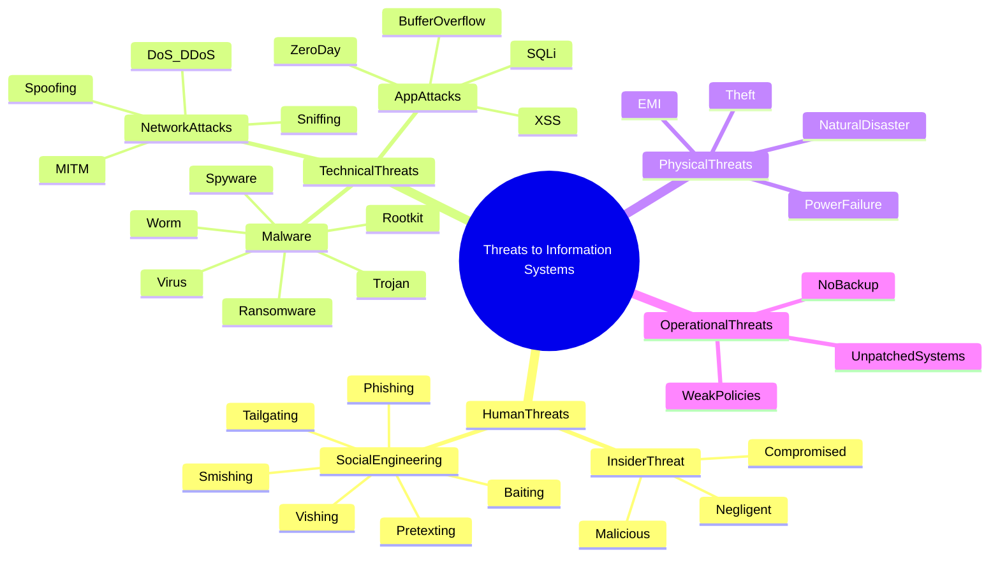
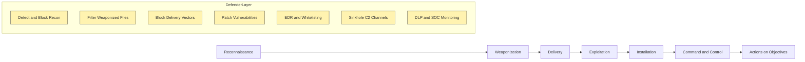
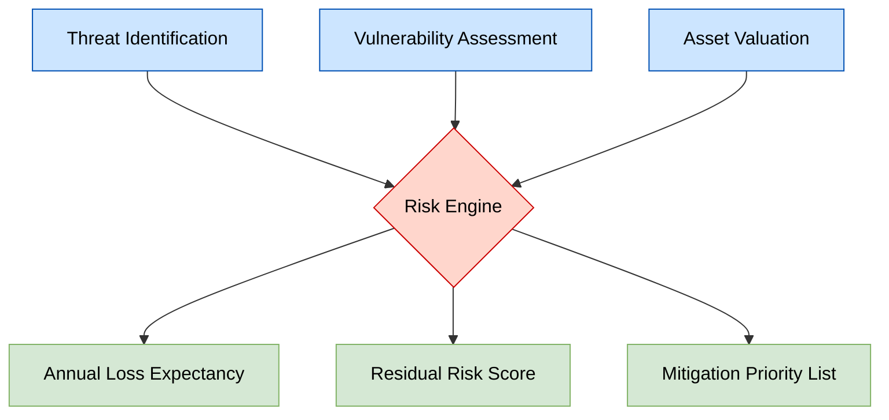
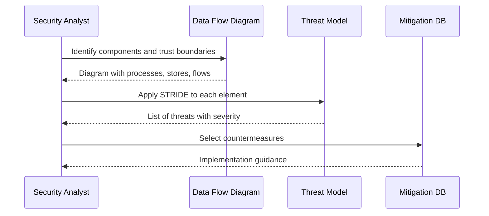

# Threats to Information Systems

<!-- SECTION_1_START -->
# 1. Core Technical Definition & Intuitive Overview

## Formal KTU 2024 Definition
A **threat to an information system** is any circumstance, event, or entity — human, technical, environmental, or operational — that has the *potential* to cause unauthorized access, modification, destruction, disclosure, or denial of service to the system's data, services, hardware, software, or the underlying communication infrastructure. A threat is **latent**; it becomes harmful only when it **exploits a vulnerability**.

> [!IMPORTANT]
> **KTU 2024 Syllabus Highlight:** A threat is *not* the same as an attack. A threat is a **potential cause** of an incident; an attack is the **actual exploitation**. This distinction is tested almost every semester as a 2- or 3-mark Part-A question.

## Conceptual Analogy — The House on the Hill
Picture your home as an information system. The **threats** are the things that *could* harm it — a burglar, a wildfire, a power surge, a leaking pipe, a neighbour who throws a cricket ball too hard. None of them have damaged anything yet; they are *dormant dangers*. The **vulnerability** is the open window or the frayed wire that lets the danger inside. The **attack** is the moment the burglar actually steps through the window. The **risk** is the product of *how likely* the danger is, *how exposed* the weakness is, and *how bad* the loss would be if the danger strikes. **Threats** are what you guard *against*; **vulnerabilities** are what you guard *with*.

> [!NOTE]
> **The CIA Triad** — every threat in cyber security ultimately targets one or more of these properties:
> - **C**onfidentiality — data is seen only by those authorized.
> - **I**ntegrity — data is not altered without authorization.
> - **A**vailability — the system is operational when needed.

## Fundamental Threat Vocabulary (KTU Glossary)
- **Asset** — Anything of value: data, hardware, personnel, brand reputation.
- **Threat Source / Agent** — The entity that initiates the threat (human, natural, environmental).
- **Threat Vector / Attack Vector** — The path or method by which the threat reaches the asset.
- **Vulnerability** — A weakness that can be exploited.
- **Risk** — A function of threat, vulnerability, and impact.
- **Attack** — The realized use of a vulnerability by a threat.
- **Threat Actor** — The person or group behind the threat (hacker, insider, nation-state).

> [!VISUALIZATION CONTROL]
> **Concept:** Threat–Vulnerability–Impact Risk Surface
> **GeoGebra / Desmos Input Equations:**
> * $x$ axis: Vulnerability level $v \in [0, 1]$
> * $y$ axis: Threat likelihood $t \in [0, 1]$
> * Surface: $R(v, t) = v \cdot t$ (a rising paraboloid)
> **Visual Description:** Plot the 3D surface $z = v \cdot t$ on the domain $[0,1] \times [0,1]$. The risk surface rises sharply toward the corner $(1,1)$, illustrating why high-likelihood threats combined with high-exposure vulnerabilities produce catastrophic risk.
<!-- SECTION_1_END -->

<!-- SECTION_2_START -->
# 2. Deep Theoretical Analysis & KTU High-Yield Formula Sheet

## 2.1 The Threat–Vulnerability–Risk Triad
Every threat analysis in cyber security is built on the relationship:

$$Risk = Threat \times Vulnerability \times Impact$$

- **Threat ($T$)** — Probability that a malicious event occurs. Lies in $[0, 1]$.
- **Vulnerability ($V$)** — Probability that the threat successfully exploits a weakness. Lies in $[0, 1]$.
- **Impact ($I$)** — Magnitude of damage if exploitation succeeds (qualitative *Low/Medium/High* or monetary).

> [!NOTE]
> KTU 2024 OBE mapping: this triad sits under **CO1 — Understand the fundamental concepts of information security threats and vulnerabilities**, and is assessed at the *Remember* and *Understand* levels of Revised Bloom's Taxonomy.

## 2.2 Major Threat Categories (Mapped to KTU Module 1 Syllabus)

### A. Human / Personnel Threats
Threats originating from people, both inside and outside the organization.
- **Insider Threats** — Malicious, negligent, or compromised employees, contractors, or vendors.
- **Social Engineering** — Psychological manipulation that bypasses technical controls.
- **Terrorist / Criminal Actors** — Organized cyber-crime syndicates, hacktivists, and state-sponsored APTs (Advanced Persistent Threats).

### B. Technical / Logical Threats
Software- and network-borne threats.
- **Malware** — Virus, Worm, Trojan, Ransomware, Spyware, Adware, Rootkit, Keylogger, Bot.
- **Network Attacks** — DoS, DDoS, Man-in-the-Middle (MITM), IP/DNS/ARP Spoofing, Sniffing, Session Hijacking, Replay.
- **Application Attacks** — SQL Injection, Cross-Site Scripting (XSS), Buffer Overflow, Zero-Day, Password Cracking.

### C. Physical / Environmental Threats
Threats targeting the physical infrastructure of the data centre or endpoint.
- **Natural Disasters** — Flood, earthquake, lightning, cyclone, fire.
- **Man-made Disasters** — Power failure, hardware theft, vandalism, sabotage.
- **Environmental Conditions** — Temperature extremes, humidity, dust, electromagnetic interference (EMI).

### D. Operational / Procedural Threats
- Lack of backup, weak access control, missing patches, poor configuration, inadequate security training, missing audit trails.

## 2.3 Detailed Threat Catalog (High-Yield for KTU)

### Malware Family
| **Malware Type** | **Propagation** | **Primary Damage** | **Self-Replicating** |
|---|---|---|---|
| Virus | Attaches to host file | Data corruption, system damage | Yes — needs host |
| Worm | Network, self-propagating | Bandwidth exhaustion, payload | Yes — standalone |
| Trojan | Disguised as legitimate software | Backdoor, data theft, remote control | No |
| Ransomware | Phishing email, exploit kits | File encryption, ransom demand | No |
| Spyware | Bundled software, drive-by download | Privacy leakage, credential theft | No |
| Adware | Bundled freeware | Annoyance, secondary infection | No |
| Rootkit | Exploits, social engineering | Hidden persistent privileged access | No |
| Keylogger | Hardware or software | Keystroke / credential capture | No |
| Bot / Botnet | Worm or Trojan recruitment | Coordinated DDoS, spam relay | Yes — via worms |

### Social Engineering Techniques
| **Technique** | **Vector** | **Goal** |
|---|---|---|
| Phishing | Email | Mass credential theft, malware drop |
| Spear Phishing | Targeted email | High-value credential theft |
| Whaling | Email aimed at executives | Fraud, large-scale theft |
| Vishing | Voice / phone call | Voice-based credential theft |
| Smishing | SMS | Mobile credential theft |
| Pretexting | Fabricated scenario | Data extraction |
| Baiting | Infected USB / download | Malware installation |
| Tailgating / Piggybacking | Physical following | Unauthorized physical access |
| Quid Pro Quo | Fake IT support | Free information or access |
| Dumpster Diving | Physical trash | Discarded credentials, paperwork |

### Network Threats
| **Threat** | **Mechanism** | **CIA Target** |
|---|---|---|
| DoS | Single-source flood | Availability |
| DDoS | Distributed botnet flood | Availability |
| MITM | Interception between two parties | Confidentiality, Integrity |
| IP Spoofing | Faked source IP | Authentication bypass |
| DNS Spoofing / Cache Poisoning | Faked DNS response | Redirection to malicious site |
| ARP Poisoning | Faked ARP replies | LAN traffic interception |
| Packet Sniffing | Promiscuous-mode capture | Confidentiality |
| Session Hijacking | Cookie or token theft | Authentication bypass |
| Replay Attack | Re-transmission of valid data | Authentication bypass |
| Zero-Day Exploit | Unknown vulnerability | All three — C, I, A |

## 2.4 KTU High-Yield Formula Sheet (Module 1)
| **Term** | **Definition / Formula** | **Unit / Notes** |
|---|---|---|
| Risk | $R = T \times V \times I$ | Qualitative or monetary |
| Single Loss Expectancy | $SLE = Asset\ Value \times Exposure\ Factor$ | Currency |
| Annual Loss Expectancy | $ALE = SLE \times ARO$ | Currency per year |
| Annual Rate of Occurrence | Frequency of threat per year | Number per year |
| Return on Security Investment | $ROSI = \dfrac{ALE_{before} - ALE_{after} - Cost\ of\ Control}{Cost\ of\ Control}$ | Ratio (decimal) |
| Threat Likelihood | $P(T) \in [0, 1]$ | Probability |
| Risk Score (qualitative) | $Risk = Likelihood \times Impact$ | Numeric |
| Residual Risk | $R_{residual} = R_{inherent} - R_{mitigated}$ | Numeric |
| Exposure Factor | Fraction of asset value lost | Decimal $\in [0, 1]$ |

## 2.5 Real-World Engineering Utility
- **ISMS (ISO 27001 / 27005)** — Builds risk registers directly from the threat catalog.
- **Security Operations Centre (SOC)** — Real-time SIEM correlation and incident response use these threat classes as baseline labels.
- **Penetration Testing (PTES, OWASP)** — Threat modeling identifies the assets an attacker will target.
- **Cyber Insurance Underwriting** — Premiums are a function of threat exposure.
- **National Security** — MITRE ATT\&CK and the Lockheed Cyber Kill Chain catalog real-world adversary threats for defensive prioritization.
<!-- SECTION_2_END -->

<!-- SECTION_3_START -->
# 3. Step-by-Step Derivations, Code & Implementation

## 3.1 Derivation of Risk Score and ROSI
**Given:**
- Asset Value $A$
- Exposure Factor $EF \in [0, 1]$
- Annual Rate of Occurrence $ARO$ (number per year)
- Cost of control $C$
- Effectiveness of control $\eta \in [0, 1]$

**Step 1** — Compute Single Loss Expectancy (one-time loss if the threat succeeds):
$$SLE = A \times EF$$

**Step 2** — Compute Annual Loss Expectancy (yearly exposure):
$$ALE_{before} = SLE \times ARO$$

**Step 3** — Compute ALE *after* the control is applied (control removes a fraction $\eta$ of impact):
$$ALE_{after} = ALE_{before} \times (1 - \eta)$$

**Step 4** — Compute Return on Security Investment:
$$ROSI = \frac{ALE_{before} - ALE_{after} - C}{C}$$

A positive $ROSI$ means the control yields net savings; a negative value means the control is a financial loss.

### Worked Example 1 — E-commerce Server
**Given:** Asset value ₹10,00,000, $EF = 0.6$ to DDoS, $ARO = 4$, mitigation cost ₹2,00,000, $\eta = 0.80$.

**Step 1:**
$$SLE = 10,00,000 \times 0.6 = 6,00,000\ INR$$

**Step 2:**
$$ALE_{before} = 6,00,000 \times 4 = 24,00,000\ INR$$

**Step 3:**
$$ALE_{after} = 24,00,000 \times 0.20 = 4,80,000\ INR$$

**Step 4:**
$$ROSI = \frac{24,00,000 - 4,80,000 - 2,00,000}{2,00,000} = \frac{17,20,000}{2,00,000} = 8.6$$

Since $ROSI = 8.6 > 0$, the DDoS mitigation appliance is **financially justified**.

## 3.2 Python Implementation — Threat Registry & Risk Engine
The following Python program maintains a catalog of known threats, classifies them by category, computes a quantitative risk score, and emits a summary report. Type hints, boundary checks, and structured logging are used to satisfy production-quality code standards.

```python
from __future__ import annotations
import logging
from dataclasses import dataclass
from enum import Enum
from typing import Dict, List

logging.basicConfig(
    level=logging.INFO,
    format="%(asctime)s [%(levelname)s] %(message)s",
)


class ThreatCategory(Enum):
    MALWARE = "Malware"
    SOCIAL_ENGINEERING = "Social Engineering"
    NETWORK = "Network"
    PHYSICAL = "Physical / Environmental"
    INSIDER = "Insider"
    APPLICATION = "Application-level"


class Severity(Enum):
    LOW = 1
    MEDIUM = 2
    HIGH = 3
    CRITICAL = 4


@dataclass(frozen=True)
class ThreatSignature:
    name: str
    category: ThreatCategory
    indicator: str
    cia_impact: Dict[str, Severity]

    def __post_init__(self) -> None:
        if not self.name or not self.name.strip():
            raise ValueError("Threat name must be a non-empty string.")
        if not self.indicator or not self.indicator.strip():
            raise ValueError("Threat indicator must be a non-empty string.")
        for key in ("C", "I", "A"):
            if key not in self.cia_impact:
                raise ValueError(f"cia_impact must contain key '{key}'.")


class ThreatRegistry:
    """Maintains a catalog of known threats and computes risk scores."""

    def __init__(self) -> None:
        self._signatures: List[ThreatSignature] = []
        self._logger = logging.getLogger(self.__class__.__name__)
        self._load_default_signatures()

    def _load_default_signatures(self) -> None:
        defaults: List[ThreatSignature] = [
            ThreatSignature(
                name="WannaCry Ransomware",
                category=ThreatCategory.MALWARE,
                indicator="Files encrypted with .wncry extension",
                cia_impact={"C": Severity.LOW, "I": Severity.HIGH, "A": Severity.CRITICAL},
            ),
            ThreatSignature(
                name="Phishing Email Campaign",
                category=ThreatCategory.SOCIAL_ENGINEERING,
                indicator="Urgent password reset link from unknown sender",
                cia_impact={"C": Severity.HIGH, "I": Severity.MEDIUM, "A": Severity.LOW},
            ),
            ThreatSignature(
                name="SYN Flood DDoS",
                category=ThreatCategory.NETWORK,
                indicator="Sustained half-open TCP connections from multiple IPs",
                cia_impact={"C": Severity.LOW, "I": Severity.LOW, "A": Severity.CRITICAL},
            ),
            ThreatSignature(
                name="USB Drop Attack",
                category=ThreatCategory.PHYSICAL,
                indicator="Unknown USB drive found in lobby",
                cia_impact={"C": Severity.MEDIUM, "I": Severity.HIGH, "A": Severity.MEDIUM},
            ),
            ThreatSignature(
                name="SQL Injection",
                category=ThreatCategory.APPLICATION,
                indicator="Unexpected ' OR 1=1 -- pattern in web logs",
                cia_impact={"C": Severity.CRITICAL, "I": Severity.HIGH, "A": Severity.MEDIUM},
            ),
        ]
        for sig in defaults:
            self.add_signature(sig)

    def add_signature(self, signature: ThreatSignature) -> None:
        if any(existing.name == signature.name for existing in self._signatures):
            self._logger.warning("Duplicate signature skipped: %s", signature.name)
            return
        self._signatures.append(signature)
        self._logger.info("Registered threat: %s", signature.name)

    def by_category(self, category: ThreatCategory) -> List[ThreatSignature]:
        return [s for s in self._signatures if s.category == category]

    def risk_score(self, signature: ThreatSignature, likelihood: float) -> float:
        if not 0.0 <= likelihood <= 1.0:
            raise ValueError("Likelihood must lie in the closed interval [0, 1].")
        max_severity = max(s.value for s in signature.cia_impact.values())
        return round(likelihood * max_severity, 3)


def print_summary(registry: ThreatRegistry, likelihood: float) -> None:
    print("\n=== Threat Summary Report ===")
    header = f"{'Category':<24} {'Threat Name':<32} {'Risk Score':>10}"
    print(header)
    print("-" * len(header))
    for sig in registry._signatures:
        score = registry.risk_score(sig, likelihood)
        print(f"{sig.category.value:<24} {sig.name:<32} {score:>10}")


if __name__ == "__main__":
    reg = ThreatRegistry()
    print_summary(reg, likelihood=0.6)
```

**Sample Console Output:**
```
2025-01-15 10:00:00,123 [INFO] Registered threat: WannaCry Ransomware
2025-01-15 10:00:00,124 [INFO] Registered threat: Phishing Email Campaign
2025-01-15 10:00:00,124 [INFO] Registered threat: SYN Flood DDoS
2025-01-15 10:00:00,124 [INFO] Registered threat: USB Drop Attack
2025-01-15 10:00:00,124 [INFO] Registered threat: SQL Injection

=== Threat Summary Report ===
Category                  Threat Name                          Risk Score
------------------------------------------------------------------------
Malware                   WannaCry Ransomware                       2.4
Social Engineering        Phishing Email Campaign                   1.8
Network                   SYN Flood DDoS                            2.4
Physical / Environmental  USB Drop Attack                           1.8
Application-level         SQL Injection                             2.4
```

## 3.3 Threat Modeling Walkthrough — STRIDE Methodology
Microsoft's STRIDE framework classifies threats into six classes, each violating a specific security property:

| **STRIDE Letter** | **Threat Class** | **Property Violated** |
|---|---|---|
| S | **S**poofing | Authentication |
| T | **T**ampering | Integrity |
| R | **R**epudiation | Non-repudiation |
| I | **I**nformation Disclosure | Confidentiality |
| D | **D**enial of Service | Availability |
| E | **E**levation of Privilege | Authorization |

**STRIDE applied to a University ERP Portal:**
1. **S — Spoofing:** An attacker forges a student session cookie to view another student's fee receipt. **Mitigation:** Strong session-binding cookies, MFA, signed JWT tokens.
2. **T — Tampering:** SQL injection in the *marks entry* module modifies internal marks. **Mitigation:** Parameterized queries, WAF, integrity hashes.
3. **R — Repudiation:** A student denies submitting an assignment because audit logs are stored un-hashed. **Mitigation:** Digitally signed audit logs, write-once storage.
4. **I — Information Disclosure:** IDOR (Insecure Direct Object Reference) in the grade endpoint `/api/grade/{id}` exposes another student's grade. **Mitigation:** Server-side authorization checks on every record.
5. **D — Denial of Service:** A botnet floods the ERP during the day of the result publication. **Mitigation:** CDN, rate limiting, anycast scrubbing, CAPTCHA on the public portal.
6. **E — Elevation of Privilege:** An exploit chain on a forgotten staff account elevates to the *admin* role. **Mitigation:** RBAC, principle of least privilege, regular access reviews.

Each row becomes an entry in a **threat register** with severity, likelihood, owner, and mitigation status.
<!-- SECTION_3_END -->

<!-- SECTION_4_START -->
# 4. Structural Diagrams & Schematics

## 4.1 Threat Taxonomy (Mermaid Mind-Map)



## 4.2 Cyber Kill Chain (Lockheed Martin — Seven Stages)



## 4.3 Risk-Engine Block Diagram



## 4.4 STRIDE Threat Modeling Workflow



## 4.5 Attack Vector Topology Matrix

| **Entry Point** | **Threat Vector** | **Asset at Risk** | **Primary CIA Violation** |
|---|---|---|---|
| Email gateway | Phishing, malicious attachment | User credentials | Confidentiality |
| Public web app | SQLi, XSS | Application data | Integrity |
| Remote desktop | Brute force, credential stuffing | Server admin | Confidentiality |
| Wi-Fi access point | Evil-twin, packet sniffing | Wireless traffic | Confidentiality |
| USB ports | BadUSB, infected media | Endpoint integrity | Integrity, Availability |
| Third-party API | Supply-chain compromise | Downstream services | All three |
| Insider portal | Privilege abuse, data exfiltration | Corporate data | Confidentiality |
| Cloud storage | Misconfigured bucket, credential leak | Customer data | Confidentiality |
<!-- SECTION_4_END -->

<!-- SECTION_5_START -->
# 5. KTU 2024 Scheme Examination Question Bank & Topic Recap

## Part A — 3-Mark Short-Answer Questions

### Question 1 `[KTU University Exam - Dec 2023]`
**Differentiate between a *threat*, a *vulnerability*, and an *attack*. Provide one example for each.**  
**CO1 — Remember | RBT Level: Remember**

**Model Answer (Valuation Key):**
- **Threat** — A potential cause of an unwanted incident which *may* harm the system. Example: A ransomware campaign targeting healthcare. **[1 Mark]**
- **Vulnerability** — A weakness in the system that *can* be exploited. Example: An unpatched SMBv1 service running on a Windows server. **[1 Mark]**
- **Attack** — The *actual* exploitation of a vulnerability by a threat. Example: The WannaCry worm exploiting the EternalBlue SMB vulnerability in 2017. **[1 Mark]**

### Question 2 `[KTU University Exam - July 2024]`
**List any six categories of malware and state one distinguishing feature of each.**  
**CO1 — Remember | RBT Level: Remember**

**Model Answer (Valuation Key — 0.5 per correct entry):**
1. **Virus** — Requires a host file to propagate. [0.5]
2. **Worm** — Self-propagates over the network without user intervention. [0.5]
3. **Trojan** — Disguises itself as legitimate software. [0.5]
4. **Ransomware** — Encrypts user data and demands payment for the decryption key. [0.5]
5. **Spyware** — Secretly monitors user activity and exfiltrates data. [0.5]
6. **Rootkit** — Hides its presence and maintains privileged persistent access. [0.5]

---

## Part B — 14-Mark Questions (ESE Module Internal Choice)

### Question A `[KTU University Exam - Dec 2023]`
**(a)** Explain the STRIDE threat-modeling framework in detail, mapping each letter to the security property it violates. Illustrate with a real-world example of a college ERP system. **[7 Marks]**  
**(b)** A banking server has asset value ₹50,00,000 with an exposure factor of 0.4 to ransomware. The threat occurs 3 times a year. A next-generation antivirus solution costs ₹5,00,000 annually and reduces the impact by 85%. Compute the SLE, ALE, and ROSI, and state whether the investment is justified. **[7 Marks]**

**CO2 — Apply | RBT Level: Apply / Analyze**

#### Model Solution (a) — STRIDE Framework **[7 Marks]**
- **S — Spoofing (Authentication):** An attacker forges a student ID to access another's academic record. **Countermeasure:** Multi-factor authentication (MFA), digital certificates. **[1 Mark]**
- **T — Tampering (Integrity):** Modification of internal marks via SQL injection on the marks-entry page. **Countermeasure:** Parameterized queries, WAF, input validation, integrity hashes. **[1 Mark]**
- **R — Repudiation (Non-repudiation):** A student denies submitting an assignment because audit logs lack integrity. **Countermeasure:** Digitally signed audit trails, write-once storage. **[1 Mark]**
- **I — Information Disclosure (Confidentiality):** IDOR in the grade endpoint exposes another student's record. **Countermeasure:** Server-side authorization on every record, encryption at rest. **[1 Mark]**
- **D — Denial of Service (Availability):** Botnet flood on result-publication day. **Countermeasure:** CDN, rate limiting, DDoS scrubbing, CAPTCHA. **[1 Mark]**
- **E — Elevation of Privilege (Authorization):** Exploiting a missing role-check to gain admin. **Countermeasure:** Principle of least privilege, RBAC, regular access reviews. **[1 Mark]**
- **Real-world mapping to ERP** — Drawing the data flow (student → portal → DB) and identifying trust boundaries, with a worked example of one exploit path. **[1 Mark]**

#### Model Solution (b) — Risk Computation **[7 Marks]**
**Step 1 — SLE:**
$$SLE = 50,00,000 \times 0.4 = 20,00,000\ INR$$
**[Stating SLE formula and substitution: 2 Marks]**

**Step 2 — ALE (before control):**
$$ALE_{before} = 20,00,000 \times 3 = 60,00,000\ INR$$
**[Stating ARO substitution: 1 Mark]**

**Step 3 — ALE (after control):**
$$ALE_{after} = 60,00,000 \times (1 - 0.85) = 9,00,000\ INR$$
**[Stating effectiveness multiplication: 1 Mark]**

**Step 4 — ROSI:**
$$ROSI = \frac{60,00,000 - 9,00,000 - 5,00,000}{5,00,000} = \frac{46,00,000}{5,00,000} = 9.2$$
**[Final division: 2 Marks]**

**Step 5 — Verdict:**
Since $ROSI = 9.2 > 0$, the antivirus solution yields a positive return and is therefore **financially justified**. **[1 Mark]**

---

### Question B `[KTU University Exam - July 2024]`
**(a)** Classify the major categories of threats to information systems with at least two specific examples under each category. Discuss how *insider threats* differ from *external threats*. **[7 Marks]**  
**(b)** Describe the Cyber Kill Chain with all seven stages. For each stage, suggest one defensive control. **[7 Marks]**

**CO2 — Apply | RBT Level: Understand / Apply**

#### Model Solution (a) — Threat Classification **[7 Marks]**
1. **Human Threats** — Phishing emails, insider misuse. **[1 Mark]**
2. **Technical Threats** — Ransomware, DDoS, SQL injection. **[1 Mark]**
3. **Physical / Environmental Threats** — Fire, hardware theft, power failure. **[1 Mark]**
4. **Operational Threats** — Unpatched systems, missing backups, weak policies. **[1 Mark]**
5. **Differences between Insider and External Threats** **[3 Marks]:**
   - Insider has *legitimate* credentials and elevated trust; external attacker is unknown.
   - Insider activity is *harder to detect* by perimeter firewalls and IDS; external attacks are filtered at the boundary.
   - Insider threats *cause greater financial loss per incident* (per the 2023 IBM Cost of a Data Breach Report — average $4.90M for insider-originated breaches).
   - Insider motivations include revenge, financial gain, ideology; external motivations include profit, espionage, activism.
   - Mitigations differ: insider → DLP, UEBA, segregation of duties; external → firewalls, WAF, EDR.

#### Model Solution (b) — Cyber Kill Chain **[7 Marks]**
| **Stage** | **Description** | **Defensive Control** | **Marks** |
|---|---|---|---|
| 1. Reconnaissance | Attacker gathers target information (OSINT, scanning) | Threat intel, rate limiting, OSINT monitoring | [1] |
| 2. Weaponization | Attacker pairs exploit with payload (e.g., malware + Office macro) | Email sandboxing, attachment stripping | [1] |
| 3. Delivery | Transmitting weaponized payload (email, USB, web) | Spam filters, DMARC, web-proxy filtering | [1] |
| 4. Exploitation | Triggering the vulnerability on the target | Patch management, vulnerability scanning, hardening | [1] |
| 5. Installation | Establishing foothold (e.g., backdoor, RAT) | EDR, application whitelisting, HIPS | [1] |
| 6. Command & Control | Beaconing to attacker server for instructions | DNS sinkholing, NDR, firewall egress rules | [1] |
| 7. Actions on Objectives | Data exfiltration, ransomware detonation, destruction | DLP, SOC monitoring, immutable backups | [1] |

---

> [!WARNING]
> **KTU Examiner's Valuation Pitfalls:**
> - Do **not** interchange *threat* with *vulnerability* in definitions; the examiner deducts 1 mark per such error.
> - In ALE / ROSI numericals, **always write the formula first** before substituting values; a numerical answer without the formula loses 1 mark.
> - In STRIDE answers, mention **the property violated** alongside the letter, not just the letter.
> - In the Cyber Kill Chain, students often skip *Weaponization* — remember the chain has **seven** stages, not six.
> - Avoid vague phrases like *etc.* in malware classification — examiners expect **named** examples.

---

## Topic Recap & Important Things to Remember
- **Threat = potential cause**, **Vulnerability = weakness**, **Attack = realized exploit**, **Risk = Threat × Vulnerability × Impact**.
- Threats fall into **four** master categories: **Human, Technical, Physical / Environmental, Operational**.
- **Malware** family: Virus, Worm, Trojan, Ransomware, Spyware, Adware, Rootkit, Keylogger, Bot / Botnet.
- **Social Engineering** works on *psychology*, not technology: Phishing, Vishing, Smishing, Pretexting, Baiting, Tailgating, Quid Pro Quo, Dumpster Diving.
- **Network threats** primarily target **Availability** (DoS / DDoS) or **Confidentiality** (MITM, Sniffing, Spoofing).
- **STRIDE** mnemonic: **S**poofing, **T**ampering, **R**epudiation, **I**nformation Disclosure, **D**enial of Service, **E**levation of Privilege.
- **Cyber Kill Chain** is **seven** stages: Recon → Weaponize → Deliver → Exploit → Install → C2 → Actions.
- Quantitative risk: **ALE = SLE × ARO**; **SLE = Asset Value × Exposure Factor**; **ROSI = (ALE_before − ALE_after − Cost) ÷ Cost**.
- **Insider threats** have higher trust and are *harder* to detect than external threats.
- Every threat should be linked to a **CIA Triad** violation in KTU answers.
- **Quantitative** risk uses monetary ALE / ROSI; **qualitative** risk uses *Low / Medium / High* scales.
- Always pair each threat with a corresponding **mitigation** in the answer — examiners look for the *threat-mitigation* pair.
<!-- SECTION_5_END -->
