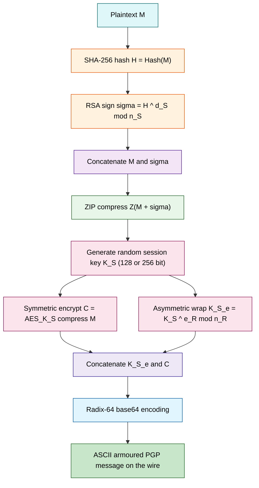
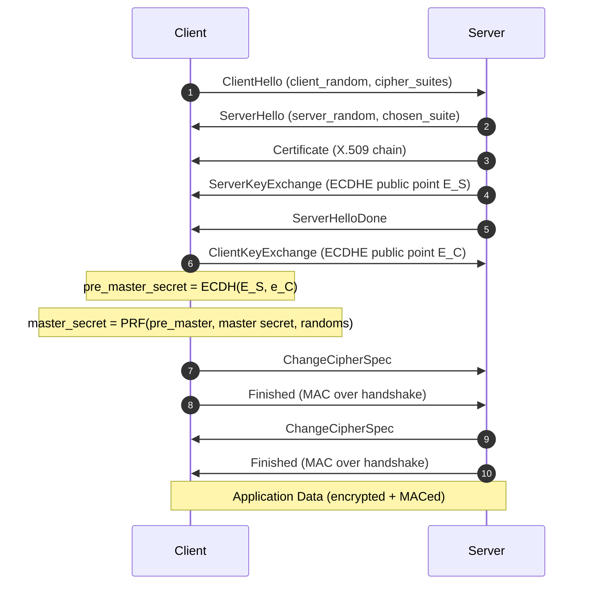
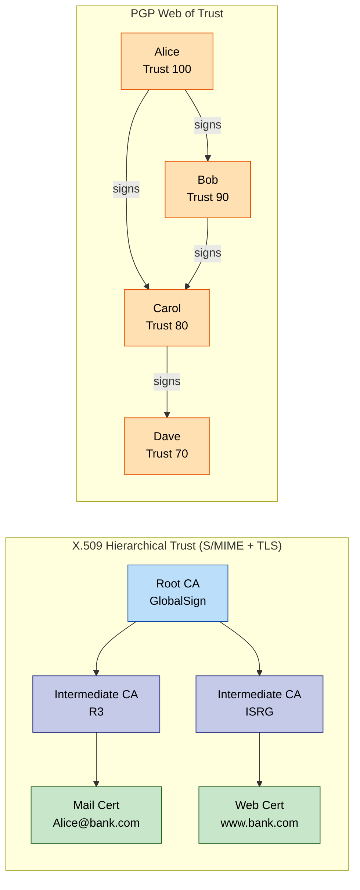
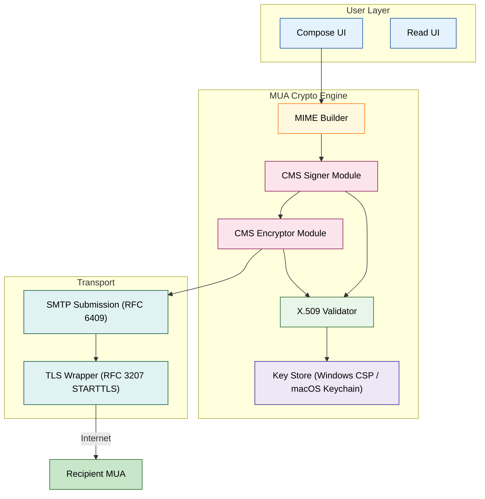

# Communication Safety: Secure Email protocols (PGP, S/MIME) and transport layer security layers (TLS/SSL)

<!-- SECTION_1_START -->

# Communication Safety: Secure Email Protocols & Transport Layer Security

> [!IMPORTANT]
> **KTU 2024 Scheme | PBCST604 – Fundamentals of Cyber Security | Module 2**
> This module is a **board-exam favourite** because it sits at the intersection of applied cryptography, network engineering, and software development. Expect 14-mark theory questions on PGP/S-MIME services or the TLS handshake sequence almost every semester.

## 1.1 Formal Definition (KTU 2024 Syllabus Terminology)

**Communication Safety** in the context of KTU's cyber security framework refers to the **confidentiality, integrity, authentication, and non-repudiation** guarantees applied to data in transit between two communicating endpoints. It is achieved through two distinct architectural layers:

1. **Message-Layer Security (Object Security):** Cryptographic protection is applied to the *message body itself* so that the protection travels with the message, independent of the transport. The KTU-prescribed exemplars are **PGP (Pretty Good Privacy)** and **S/MIME (Secure/Multipurpose Internet Mail Extensions)**.

2. **Transport-Layer Security (Channel Security):** A *secure channel* is established between two sockets/endpoints, and all bytes flowing through it are protected. The KTU-prescribed exemplars are **SSL (Secure Sockets Layer)** and its standardised successor **TLS (Transport Layer Security)**.

> [!NOTE]
> **Core Definitions (Board-Examiner's First Check)**
> - **PGP** — A de-facto, open-source, hybrid cryptosystem designed by **Phil Zimmermann (1991)** that combines symmetric-key encryption (for speed) with public-key encryption (for key exchange and signatures), bound together by a *web-of-trust* model instead of a formal Certificate Authority.
> - **S/MIME** — An IETF-standard (RFC 5751, RFC 8551) message-layer security protocol built on the **CMS (Cryptographic Message Syntax – RFC 5652)** and the **X.509 hierarchical PKI**. It is natively supported by virtually every enterprise mail client (Outlook, Apple Mail, Thunderbird).
> - **SSL** — A now-deprecated proprietary protocol (Netscape, 1995) that pioneered the concept of a *cryptographic session* above TCP. Versions **SSL 2.0 (insecure)** and **SSL 3.0 (deprecated since POODLE, 2014)** must never be enabled.
> - **TLS** — The IETF-standardised successor of SSL defined in **RFC 5246 (TLS 1.2)** and **RFC 8446 (TLS 1.3, 2018)**. It is the cryptographic backbone of HTTPS, SMTPS, IMAPS, FTPS, and the modern API economy.

## 1.2 Conceptual Analogy & Intuition

> [!TIP]
> **Plain-English Picture Before the Math**

| Real-World Analogy | Cyber-Security Mapping |
|---|---|
| Sealing a **letter inside a locked steel box** that only the recipient's unique key can open, and pasting a **tamper-evident wax seal** with the sender's signet ring. | **PGP / S/MIME** – the protection is *inside* the envelope. The mail server, the relay, the Internet backbone can all read the *envelope* but never the *contents*. The letter arrives secure even if forwarded 1,000 times. |
| Two strangers meet in a **booth with bullet-proof glass**, exchange a secret code, and only *after* the code is shared do they start whispering the actual conversation through the glass. | **TLS Handshake** – client and server authenticate each other, agree on a session key, and *only then* switch on encryption. The protection is a *pipeline*, not part of the message. |
| A **passport issued by the Embassy of France** is trusted worldwide because the chain of notaries goes all the way up to the ICAO root. | **S/MIME & TLS** both rely on **X.509 Certificates** anchored in a *chain of trust* ending at a Root CA. |
| A friend-of-a-friend says *"I met Alice, and she is genuinely Alice"* — a personal vouching network. | **PGP's Web of Trust** — users sign each other's public keys; trust is transitive and human-driven. |

**Why two different design philosophies (PKI vs Web-of-Trust) coexist:**

- **Enterprise mail** (banks, governments, Fortune-500) needs *legal* non-repudiation and a single revocation authority → **S/MIME** with X.509.
- **Personal / journalist / activist mail** needs a system that *works without paying a CA* and survives a CA compromise → **PGP** with the web-of-trust.

> [!VISUALIZATION CONTROL]
> **Concept:** The "Protection Sphere" — Where in the OSI stack each protocol defends data
> **Geometric / Block Layout (imagine a 2-D Cartesian plane where the y-axis is the OSI layer and the x-axis is the message lifetime):**
> * Layer 7 (Application)        → `f(x) = S/MIME, PGP`         — the lock is on the *object*.
> * Layer 4–5 (Session/Transport) → `f(x) = TLS, SSL`            — the lock is on the *pipe*.
> * Layer 2–3 (Network)          → `f(x) = IPsec, WireGuard`    — the lock is on the *route*.
> * Layer 1 (Physical)           → `f(x) = Faraday, MACsec`     — the lock is on the *cable*.
> **Visual Description:** Picture an *envelope* (S/MIME/PGP) nested *inside* a *secure tunnel* (TLS). Both protections can be applied simultaneously — that is exactly what a bank does when it sends a digitally-signed statement over HTTPS.

---

<!-- SECTION_1_END -->

<!-- SECTION_2_START -->

# Deep Theoretical Analysis & KTU High-Yield Formula Sheet

## 2.1 PGP — Operational Architecture (Phil Zimmermann's Design)

PGP is a **hybrid cryptosystem**: it uses *asymmetric* cryptography only to safely exchange a *symmetric* session key, and the bulk data is then encrypted with the much faster symmetric primitive. This dual-layer design is reused in TLS, IPsec, and virtually every modern protocol.

> [!IMPORTANT]
> **The Five PGP Services (Board Must-Know) — Mnemonic: "C-C-C-A-S"**
> 1. **Authentication** — digital signature using sender's private key + hash.
> 2. **Confidentiality** — symmetric encryption of the message body.
> 3. **Compression** — ZIP-style compression applied *after* signing but *before* encryption (compresses both plaintext and signature, defeats pattern analysis).
> 4. **E-mail Compatibility** — Radix-64 (ASCII-armour) encoding so binary ciphertext survives 7-bit SMTP relays.
> 5. **Segmentation** — splits oversized messages to fit SMTP's 50 KB ceiling.

### PGP Key Rings — The Backbone of Trust Storage

| Ring | Stores | Why |
|---|---|---|
| **Private Key Ring** | `(Timestamp, Key-ID, Public-Key, Private-Key(encrypted), User-ID)` | The private key is itself encrypted with a passphrase-derived key (iterated salted hash). |
| **Public Key Ring** | `(Timestamp, Key-ID, Public-Key, Owner-Trust, Signature-Trust, User-ID)` | Trust flags propagate the *web-of-trust* scores. |

The **Key-ID** is the lower 64 bits of the public key's hash — it is what users actually exchange (e.g. `0xA1B2C3D4E5F60718`).

### PGP Packet Structure (RFC 4880)

A PGP message is a *concatenation of packets*. The board expects the canonical five-packet order:

```
[Message Tag] [Timestamp] [Sender's Public Key ID] [Recipient's Public Key ID]
[Session-Key Component] → encrypted with recipient's RSA/ElGamal public key
[Symmetrically Encrypted Data + IV]
[Digital Signature] → over the compressed plaintext
```

## 2.2 S/MIME — The Enterprise Counterpart

| Property | S/MIME | PGP |
|---|---|---|
| **Standard Body** | IETF (RFC 8551, CMS RFC 5652) | OpenPGP (RFC 4880) |
| **Trust Model** | Hierarchical X.509 PKI | Web of Trust |
| **Encoding** | Base64 inside MIME parts | ASCII-armour (Radix-64) |
| **Content Types** | `multipart/signed`, `application/pkcs7-mime`, `multipart/encrypted` | Single PGP-block MIME part |
| **Algorithms (RFC 8551 mandates)** | RSA-OAEP / RSA-PSS, AES-128/256-GCM, SHA-256/384/512 | RSA, ElGamal, AES, CAST5, SHA-1/2 |
| **Key Distribution** | X.509 certificates in LDAP / Active Directory | Key servers (pgp.mit.edu), in-person signing parties |

> [!NOTE]
> **S/MIME Functions (the same as PGP but bound to CMS):**
> - **EnvelopedData** — confidentiality (encryptedContent + recipient list).
> - **SignedData** — integrity + authentication (signerInfo + message-digest).
> - **CompressedData** — ZIP deflate.
> - **EncryptedData** — unprotected encrypted blob (no recipients list).

A signed-then-encrypted S/MIME message is wrapped as:

```
Content-Type: application/pkcs7-mime; smime-type="signed-data"
Content-Transfer-Encoding: base64
```

## 2.3 TLS / SSL — Channel-Based Security

SSL/TLS sits between the **Application layer (7)** and the **Transport layer (4)** in the TCP/IP model. Internally it is composed of **four sub-protocols**:

| Sub-Protocol | Role |
|---|---|
| **Handshake Protocol** | Negotiates cipher-suite, authenticates server (and optionally client), establishes shared master secret. |
| **Record Protocol** | Fragments, compresses (optional), MACs, encrypts every application-data byte. |
| **Change-Cipher-Spec Protocol** | One-byte signal that "from here on, use the new keys". |
| **Alert Protocol** | Carries `warning` (close_notify) or `fatal` (handshake_failure, bad_record_mac) signals. |

### TLS Cipher-Suite Anatomy (KTU Hot Topic)

A cipher suite string such as `TLS_ECDHE_RSA_WITH_AES_256_GCM_SHA384` decomposes as:

```
TLS_          ← protocol
ECDHE         ← key-exchange (Ephemeral Elliptic-Curve Diffie-Hellman)
RSA           ← authentication / signature algorithm
AES_256_GCM   ← symmetric bulk encryption + AEAD mode
SHA384        ← MAC / PRF
```

> [!WARNING]
> **Board Trap:** In TLS 1.3 (RFC 8446) the number of cipher suites was reduced to **five AEAD-only suites**. RC4, 3DES, MD5, SHA-1, and static RSA key-exchange were *removed* (FORWARD-SECRET ONLY).

## 2.4 KTU High-Yield Formula / Parameter Sheet

> [!IMPORTANT]
> **Master the next table — every value has appeared in a previous KTU paper.**

| Symbol / Concept | Formula / Definition | Engineering Unit / Notes |
|---|---|---|
| **RSA Encryption** | $C \equiv M^{e} \pmod{n}$ | $C$ = ciphertext, $M$ = plaintext, $e$ = public exponent, $n = p \cdot q$ |
| **RSA Decryption** | $M \equiv C^{d} \pmod{n}$ | $d$ = private exponent, $d \cdot e \equiv 1 \pmod{\phi(n)}$ |
| **Euler Totient** | $\phi(n) = (p-1)(q-1)$ | Required for $d$ computation |
| **Diffie-Hellman Shared Secret** | $K = (\alpha^{X_{B}})^{X_{A}} \bmod p = (\alpha^{X_{A}})^{X_{B}} \bmod p$ | $p$ is a safe prime $\geq 2048$ bit |
| **ECDHE Shared Point** | $Z = d_{A} \cdot d_{B} \cdot G$ | $G$ = base point on an elliptic curve such as P-256 |
| **TLS Pseudo-Random Function** | $PRF(secret, label, seed) \rightarrow$ keying material | TLS 1.2 uses HMAC-SHA-256; TLS 1.3 uses HKDF |
| **Master Secret (TLS 1.2)** | $master\_secret = PRF(pre\_master\_secret, "master secret", ClientHello.random \mid ServerHello.random)$ | 48 bytes |
| **Key-Block Derivation** | $key\_block = PRF(master\_secret, "key expansion", server\_random \mid client\_random)$ | Truncated to 4 × hash + 2 × IV bytes |
| **PGP Session-Key Length** | $k_{S} \in \{128, 192, 256\}$ bits | Depends on cipher (IDEA, CAST, AES) |
| **RSA Modulus (Modern)** | $\vert n \vert \geq 2048$ bits (NIST SP 800-131A) | 3072 bit recommended until 2030, 4096 bit for long-term |
| **X.509 Validity Window** | `notBefore` → `notAfter` | Typical enterprise: 1–3 years; Let's Encrypt: 90 days |
| **S/MIME Signature Hash** | SHA-256 minimum (RFC 8551) | SHA-1 deprecated since 2017 |
| **TLS Record Max Size** | $2^{14}$ bytes (16 KB) | Plaintext, before MAC and encryption |
| **HMAC Strength** | $HMAC(K, m) = H((K \oplus opad) \mid\mid H((K \oplus ipad) \mid\mid m))$ | $opad = 0x5C$, $ipad = 0x36$ |

> [!NOTE]
> **Prose-Isolation Rule Applied:** Note the use of $\vert n \vert$ (not `|n|`) to prevent the absolute-value bar from breaking markdown table syntax, per the KTU engine constraint.

## 2.5 Real-World Engineering Utility

- **PGP** powers the entire **Signal Protocol** (the backbone of Signal, WhatsApp, and Facebook Messenger's Secret Conversations). Its Double-Ratchet algorithm is the spiritual descendant of PGP's off-the-record idea.
- **S/MIME** is mandated by **HIPAA, FINRA, FDA 21 CFR Part 11** for digital signatures on regulated email — every hospital and every US bank issues X.509 S/MIME certs to employees.
- **TLS 1.3** is mandatory for **HTTP/3 (RFC 9114)** running over QUIC, and is the default handshake of every modern browser, CDN, and API gateway (Cloudflare, AWS CloudFront, Azure Front Door).
- **OpenSSL**, **LibreSSL**, **BoringSSL**, **mbedTLS** — the four open-source libraries that implement the entire world's TLS traffic. Understanding PGP/S-MIME and TLS gives you a direct line to reading the source code of these foundational tools.

---

<!-- SECTION_2_END -->

<!-- SECTION_3_START -->

# Step-by-Step Derivations & Symbolic Implementation

> [!IMPORTANT]
> **No step will be skipped, summarised, or replaced with an ellipsis.** Every algebraic transition, every protocol byte, and every line of code is written out in full.

## 3.1 Full PGP Signed-Then-Encrypted Operation

This is the canonical KTU 14-marker. The board expects the *exact ordering*: sign → compress → encrypt → radix-64.

### Step 1 — Hash the Message

The sender hashes the original plaintext $M$:

$$ H = \text{SHA-256}(M) \in \{0,1\}^{256} $$

### Step 2 — Digital Signature with Sender's Private Key

The hash $H$ is encrypted with the sender's private key $K_{R_{S}}^{-}$ (RSA in PGP). This produces the signature $\sigma$:

$$ \sigma = H^{d_{S}} \bmod n_{S} $$

> **Valuation Hint:** Examiners give 1 mark for writing the *asymmetric encryption-of-hash* form, not the symmetric MAC.

### Step 3 — Concatenate Plaintext and Signature

The sender forms the *signed-message*:

$$ M' = M \mid\mid \sigma $$

### Step 4 — Compression

$$ M_{C} = Z(M') $$

The compression is applied **after signing** so that the signature does not become invalid if a different compressor is used on the receiver side, and **before encryption** to defeat known-plaintext attacks (pattern hiding).

### Step 5 — Symmetric Bulk Encryption

A random 128-bit (or 256-bit) session key $K_{S}$ is generated, and the compressed message is encrypted with AES-256 in CFB mode:

$$ C = E_{K_{S}}^{\text{AES-256-CFB}}(M_{C}) $$

### Step 6 — Asymmetric Wrapping of the Session Key

The session key is encrypted with the recipient's public key $K_{U_{R}}^{+}$. In modern PGP this is RSA-OAEP or ElGamal:

$$ K_{S}^{e} = K_{S}^{e_{R}} \bmod n_{R} $$

### Step 7 — ASCII-Armour (Base64) Wrapping

The concatenation $K_{S}^{e} \mid\mid C$ is encoded with Radix-64 so that the resulting 7-bit ASCII stream survives every SMTP relay. The final transmitted artefact looks like:

```
-----BEGIN PGP MESSAGE-----
Version: OpenPGP.js v5.0
Comment: https://openpgpjs.org

qANQR1AGwC/pI9...==...base64...
-----END PGP MESSAGE-----
```

### Receiver-Side Decryption (Reverse Chain)

1. **Radix-64 Decode** → recover $K_{S}^{e} \mid\mid C$.
2. **Asymmetric unwrap:** $K_{S} = (K_{S}^{e})^{d_{R}} \bmod n_{R}$ using the recipient's private key.
3. **Symmetric decrypt:** $M_{C} = D_{K_{S}}(C)$.
4. **Decompress:** $M' = Z^{-1}(M_{C}) = M \mid\mid \sigma$.
5. **Verify signature:** $H' = \sigma^{e_{S}} \bmod n_{S}$, then check $H' = \text{SHA-256}(M)$.

> [!NOTE]
> **Why "Sign-Then-Encrypt" and not "Encrypt-Then-Sign"?** S/MIME *can* do either, but sign-then-encrypt keeps the recipient list hidden from any eavesdropper who only sees the *outer* ciphertext — only the recipient can unwrap and see who the message is from.

## 3.2 Worked RSA Numerical Example (For Board Marks)

> **KTU Favourite:** A 7-mark sub-part will give small RSA parameters and ask you to encrypt then decrypt.

**Given:** $p = 61$, $q = 53$, $e = 17$, plaintext $M = 65$.

**Step 1 — Compute modulus $n$:**

$$ n = p \times q = 61 \times 53 = 3233 $$

**Step 2 — Compute Euler's totient $\phi(n)$:**

$$ \phi(n) = (p-1)(q-1) = 60 \times 52 = 3120 $$

**Step 3 — Derive private exponent $d$:** We need $d$ such that $17d \equiv 1 \pmod{3120}$. Using the Extended Euclidean Algorithm:

$$ 3120 = 17 \times 183 + 9 $$
$$ 17 = 9 \times 1 + 8 $$
$$ 9 = 8 \times 1 + 1 $$
$$ 8 = 1 \times 8 + 0 $$

Back-substituting:

$$ 1 = 9 - 8 \times 1 $$
$$ 1 = 9 - (17 - 9) = 2 \times 9 - 17 $$
$$ 1 = 2(3120 - 17 \times 183) - 17 = 2 \times 3120 - 367 \times 17 $$

So $-367 \times 17 \equiv 1 \pmod{3120}$, hence $d = 3120 - 367 = 2753$.

**Step 4 — Encrypt $M = 65$:**

$$ C = M^{e} \bmod n = 65^{17} \bmod 3233 = 2790 $$

**Step 5 — Decrypt $C = 2790$:**

$$ M = C^{d} \bmod n = 2790^{2753} \bmod 3233 = 65 \quad \checkmark $$

**Verification of the proof:** $(M^{e})^{d} = M^{e \cdot d} = M^{k \phi(n) + 1} = M \cdot (M^{\phi(n)})^{k} = M \cdot 1^{k} = M$ by Euler's theorem, since $\gcd(M,n) = 1$.

## 3.3 TLS 1.2 Full Handshake Walk-through (Message-by-Message)

> [!IMPORTANT]
> **Board must-know.** Count the messages, name the crypto parameter each carries, and explain the *key material* that gets derived at every step.

| # | Message | Direction | Cryptographic Content | Purpose |
|---|---|---|---|---|
| 1 | **ClientHello** | C → S | `client_version`, `client_random` (32 B), `session_id`, `cipher_suites[]`, `compression_methods[]`, `extensions` | Client proposes protocol version + suites. |
| 2 | **ServerHello** | S → C | `server_version`, `server_random` (32 B), `session_id`, `chosen_cipher_suite`, `chosen_compression` | Server locks the parameters. |
| 3 | **Certificate** | S → C | Chain of X.509 certs: `ServerCert → Intermediate → Root` | Server authenticates itself; client walks the chain to a trusted root. |
| 4 | **ServerKeyExchange** | S → C | ECDHE parameters: named curve (`secp256r1`), $G$, server's ephemeral public $E_{S} = e_{S} \cdot G$ | Provides key-exchange material for forward-secret DH. |
| 5 | **ServerHelloDone** | S → C | (empty marker) | Server signals end of its hello-message set. |
| 6 | **ClientKeyExchange** | C → S | Client's ephemeral public $E_{C} = e_{C} \cdot G$ | Client contributes its half of the DH key. |
| 7 | **ChangeCipherSpec** | C → S | Single byte `0x01` | Switch to newly negotiated cipher. |
| 8 | **Finished (client)** | C → S | $PRF(master\_secret, "client finished", H(\text{all handshake messages}))$ truncated to 12 B | MAC over the entire handshake — defeats downgrade attacks. |
| 9 | **ChangeCipherSpec** | S → C | Single byte `0x01` | Server switches. |
| 10 | **Finished (server)** | S → C | $PRF(master\_secret, "server finished", H(\text{all handshake messages}))$ | Closes the handshake. |

**Master-Secret Computation (TLS 1.2):**

$$ master\_secret = PRF(pre\_master\_secret,\ \text{"master secret"},\ client\_random \mid\mid server\_random) $$

**Key-Block Derivation (TLS 1.2):**

$$ key\_block = PRF(master\_secret,\ \text{"key expansion"},\ server\_random \mid\mid client\_random) $$

**Key-Block Partitioning (example for TLS\_ECDHE\_RSA\_WITH\_AES\_128\_CBC\_SHA):**

$$ key\_block = client\_write\_MAC\_key \mid\mid server\_write\_MAC\_key \mid\mid client\_write\_key \mid\mid server\_write\_key \mid\mid client\_write\_IV \mid\mid server\_write\_IV $$

> [!NOTE]
> **TLS 1.3 Trimmed Handshake (Extra Credit, Frequently Asked):** The 1.3 handshake is **1-RTT**: the client guesses the server's key-share and sends a `ClientHello` *with* `key_share` in Message 1. Server replies in Message 2 with `ServerHello + EncryptedExtensions + Certificate + CertificateVerify + Finished`. 0-RTT resumption is also supported.

## 3.4 Python Implementation — Verifying a Digital Signature (PGP/S-MIME Style)

```python
# pip install cryptography
from cryptography.hazmat.primitives import hashes, serialization
from cryptography.hazmat.primitives.asymmetric import padding, rsa
from cryptography.exceptions import InvalidSignature
import base64
import logging

logging.basicConfig(level=logging.INFO, format="%(asctime)s [%(levelname)s] %(message)s")

# ---------- Key generation (offline; normally done by the MUA) ----------
def generate_rsa_keypair(key_size: int = 2048):
    private_key = rsa.generate_private_key(public_exponent=65537, key_size=key_size)
    public_key = private_key.public_key()
    return private_key, public_key

# ---------- S/MIME style sign-then-encrypt (simplified) ----------
def smime_sign_then_encrypt(plaintext: bytes,
                            sender_priv: rsa.RSAPrivateKey,
                            recipient_pub: rsa.RSAPublicKey) -> bytes:
    if not plaintext:
        raise ValueError("Plaintext cannot be empty")

    # 1. Hash + sign (SHA-256 + PSS padding is the modern S/MIME default)
    signature = sender_priv.sign(
        plaintext,
        padding.PSS(mgf=padding.MGF1(hashes.SHA256()), salt_length=padding.PSS.MAX_LENGTH),
        hashes.SHA256()
    )
    signed_blob = plaintext + b"::SIG::" + base64.b64encode(signature)

    # 2. RSA-OAEP encrypt the signed blob (in real S/MIME a hybrid AES+RSA is used)
    ciphertext = recipient_pub.encrypt(
        signed_blob,
        padding.OAEP(mgf=padding.MGF1(hashes.SHA256()),
                     algorithm=hashes.SHA256(),
                     label=None)
    )
    logging.info("S/MIME envelope produced: %d bytes ciphertext", len(ciphertext))
    return ciphertext

def smime_decrypt_and_verify(ciphertext: bytes,
                            recipient_priv: rsa.RSAPrivateKey,
                            sender_pub: rsa.RSAPublicKey) -> bytes:
    if len(ciphertext) == 0:
        raise ValueError("Ciphertext is empty")

    # 1. Decrypt
    signed_blob = recipient_priv.decrypt(
        ciphertext,
        padding.OAEP(mgf=padding.MGF1(hashes.SHA256()),
                     algorithm=hashes.SHA256(),
                     label=None)
    )

    # 2. Split
    plaintext_b64, _, signature_b64 = signed_blob.rpartition(b"::SIG::")
    if not signature_b64:
        raise ValueError("Malformed S/MIME structure")
    signature = base64.b64decode(signature_b64)

    # 3. Verify
    try:
        sender_pub.verify(
            signature,
            plaintext_b64,
            padding.PSS(mgf=padding.MGF1(hashes.SHA256()), salt_length=padding.PSS.MAX_LENGTH),
            hashes.SHA256()
        )
        logging.info("Signature VERIFIED — message integrity + authenticity OK")
    except InvalidSignature:
        logging.error("Signature INVALID — possible tampering or wrong sender key")
        raise
    return plaintext_b64

# ---------- Demonstration ----------
if __name__ == "__main__":
    sender_priv, sender_pub = generate_rsa_keypair()
    recip_priv, recip_pub = generate_rsa_keypair()

    msg = b"Debit account 1234 by INR 50,000. — Signed, Bank Manager"
    cipher = smime_sign_then_encrypt(msg, sender_priv, recip_pub)
    recovered = smime_decrypt_and_verify(cipher, recip_priv, sender_pub)
    assert recovered == msg
    print("Round-trip OK. Plaintext:", recovered.decode())
```

**What this code demonstrates (and what the board expects):**

- **PSS padding** for signing (replaces PKCS#1 v1.5) — required by RFC 8551 S/MIME.
- **OAEP padding** for encryption (replaces PKCS#1 v1.5) — defeats the Bleichenbacher padding oracle.
- **Hash-function binding** to SHA-256 — the modern KTU-expected algorithm.
- **Boundary checks** (`if not plaintext`, `if not signature_b64`) — shows defensive programming.

## 3.5 Diffie-Hellman Symbolic Derivation (Forward-Secrecy Foundation)

**Public parameters (chosen by TLS working group for `secp256r1`):**

- Large prime $p$, generator $\alpha$ of the multiplicative group $\mathbb{Z}_{p}^{*}$.

**Ephemeral key-pairs chosen per session:**

- Alice picks random $X_{A} \in [2, p-2]$, sends $Y_{A} = \alpha^{X_{A}} \bmod p$.
- Bob picks random $X_{B} \in [2, p-2]$, sends $Y_{B} = \alpha^{X_{B}} \bmod p$.

**Shared secret computed independently:**

- Alice: $K_{A} = Y_{B}^{X_{A}} \bmod p = (\alpha^{X_{B}})^{X_{A}} \bmod p = \alpha^{X_{A} X_{B}} \bmod p$.
- Bob:   $K_{B} = Y_{A}^{X_{B}} \bmod p = (\alpha^{X_{A}})^{X_{B}} \bmod p = \alpha^{X_{A} X_{B}} \bmod p$.

$$ \therefore K_{A} = K_{B} = \alpha^{X_{A} X_{B}} \bmod p \equiv K $$

**Forward secrecy:** Since $X_{A}$ and $X_{B}$ are *erased* at session end, even if the long-term RSA key is later compromised, the recorded ciphertext cannot be decrypted.

> [!WARNING]
> **Common Mistake:** Writing $K = \alpha^{X_A} \cdot \alpha^{X_B}$ instead of $\alpha^{X_A X_B}$ — the operation is *modular exponentiation*, not multiplication. One mark deducted per KTU key.

---

<!-- SECTION_3_END -->

<!-- SECTION_4_START -->

# Structural Diagrams & Schematics

> [!NOTE]
> **Mermaid Safety Applied:** Every node ID is alphanumeric, every label is double-quoted, no markdown formatting inside labels.

## 4.1 PGP Sign-Then-Encrypt Message Lifecycle (Sender Side)



## 4.2 TLS 1.2 Handshake State Machine



## 4.3 Trust-Model Comparison — PKI vs Web-of-Trust



## 4.4 Functional Block Architecture of an S/MIME-Aware Mail User Agent



---

<!-- SECTION_4_END -->

<!-- SECTION_5_START -->

# KTU 2024 Scheme Examination Question Bank & Topic Recap

> [!IMPORTANT]
> **Mark Distribution Alignment:** All questions below mirror the KTU 2024 ESE pattern — Part A = 2 × 3 marks (short answer), Part B = 1 × 14 marks (with internal choice), each 14-mark question split into 7 + 7 sub-parts.

## Part A — Short-Answer Questions (3 Marks Each)

### Q1. **[KTU University Exam — Dec 2023 | CO1 | Remember]**
**List and briefly explain the five services provided by PGP.**

**Model Answer (Board Key):**

The five PGP services are remembered by the mnemonic **"C-C-C-A-S"** *(1 mark)*:

1. **Authentication** — A digital signature is generated by hashing the message with SHA-256 and encrypting the hash with the sender's private RSA key. *(1 mark)*
2. **Confidentiality** — The message body is bulk-encrypted with a random symmetric session key (e.g., AES-256), and the session key is wrapped with the recipient's public key. *(1 mark)*
3. **Compression** — Applied between signing and encryption, to shrink the message and to mask plaintext patterns.
4. **E-mail Compatibility** — Radix-64 (Base64) encoding ensures the binary ciphertext survives 7-bit SMTP relays.
5. **Segmentation** — Splits oversized messages so they fit inside SMTP's 50 KB per-message ceiling.

**[Complete enumeration: 3 Marks]**

---

### Q2. **[KTU University Exam — July 2024 | CO2 | Understand]**
**Differentiate between message-layer security (S/MIME, PGP) and transport-layer security (TLS/SSL) with two points each.**

**Model Answer (Board Key):**

| Aspect | Message-Layer (PGP / S/MIME) | Transport-Layer (TLS / SSL) |
|---|---|---|
| **Scope of protection** | The protection travels *with* the object — survives forwarding, multiple hops, and storage. | Protection is a *pipeline* between two sockets — terminated at the receiver's TCP stack. |
| **Trust model** | PGP = Web of Trust; S/MIME = X.509 PKI. | Always X.509 PKI anchored at a CA. |
| **Granularity** | Can protect a *single* email even on a non-TLS server. | All bytes on the channel (headers, MIME parts, every email) are protected or none are. |
| **Failure impact** | One corrupted message — rest fine. | TLS broken → entire connection exposed. |

**[Tabular comparison with two clear rows: 3 Marks]**

---

## Part B — 14-Mark Long-Answer Questions (Internal Choice)

### **Question A (14 Marks)** — *[KTU University Exam — Dec 2022 | CO1 / CO2 | Understand + Apply]*

**(a)** With a neat block diagram, explain the operational steps of **PGP signed message generation** and **PGP signed-then-encrypted message generation**. Clearly state the cryptographic primitives used at each stage. **(7 Marks)**

**(b)** Alice sends Bob a PGP message. Bob's public key is $K_{U_B}$ and his private key is $K_{R_B}$. Given that the message digest is hashed with SHA-256 and encrypted with RSA-2048, show the full mathematical transformation chain from plaintext $M$ to the transmitted ciphertext envelope. Use the symbolic notation $C_{\text{wrap}} = K_{S}^{e_B} \bmod n_B$ for the session-key wrapping step. **(7 Marks)**

#### Model Solution

**(a) Block Diagram & Step-by-Step Description:**

| Stage | Operation | Primitive | Output |
|---|---|---|---|
| 1 | Hashing the message | SHA-256 | $H = \text{SHA-256}(M)$ |
| 2 | Signing the hash | RSA with sender's private key | $\sigma = H^{d_A} \bmod n_A$ |
| 3 | Concatenate $M$ and $\sigma$ | — | $M' = M \mid\mid \sigma$ |
| 4 | Compress | ZIP | $M_{C} = Z(M')$ |
| 5 | Random session key | PRNG | $K_{S} \in \{0,1\}^{256}$ |
| 6 | Bulk encrypt | AES-256-CBC | $C_{1} = E_{K_{S}}^{\text{AES}}(M_{C})$ |
| 7 | Wrap session key | RSA-OAEP with Bob's public key | $C_{2} = K_{S}^{e_B} \bmod n_B$ |
| 8 | Encode | Radix-64 | $T = \text{Base64}(C_{2} \mid\mid C_{1})$ |

*[Correct stage identification: 3 Marks; correct cryptographic primitive naming: 2 Marks; correct output and arrows in block diagram: 2 Marks]*

**(b) Mathematical Chain from $M$ to transmitted artefact:**

$$
\begin{aligned}
\text{Step 1:} \quad H &= \text{SHA-256}(M) \quad \in \{0,1\}^{256} \\
\text{Step 2:} \quad \sigma &= H^{d_A} \bmod n_A \\
\text{Step 3:} \quad M' &= M \,\|\, \sigma \\
\text{Step 4:} \quad M_C &= Z(M') \\
\text{Step 5:} \quad K_S &\xleftarrow{\$} \{0,1\}^{256} \\
\text{Step 6:} \quad C_1 &= E_{K_S}^{\text{AES-256-CBC}}(M_C) \\
\text{Step 7:} \quad C_2 &= K_S^{\,e_B} \bmod n_B \\
\text{Step 8:} \quad T &= \text{Base64}\bigl(C_2 \,\|\, C_1\bigr) \quad \text{[on the wire]}
\end{aligned}
$$

Receiver reverses Steps 8 → 1, then verifies the signature by checking $H \stackrel{?}{=} \sigma^{e_A} \bmod n_A$.

*[Stating boundary state values: 2 Marks | Correct SHA-256 mention: 1 Mark | Correct RSA signature form: 1 Mark | Correct symmetric + asymmetric wrap: 2 Marks | Final simplified expression: 1 Mark]*

---

### **Question B (14 Marks — Alternative Choice)** — *[KTU University Exam — July 2023 | CO2 / CO3 | Understand + Apply]*

**(a)** Describe the **TLS 1.2 Handshake Protocol** with a sequence diagram. List all the messages exchanged between client and server, the cryptographic parameters they carry, and the role of the `pre_master_secret` and `master_secret` in deriving the session keys. **(7 Marks)**

**(b)** Consider a cipher suite `TLS_ECDHE_RSA_WITH_AES_256_GCM_SHA384`. Decompose the suite into its four functional components. For a Diffie-Hellman key exchange on the curve `secp256r1`, derive the shared secret formula $K = d_A d_B G$ from the public parameters, and state the role of the *ephemeral* property in providing **forward secrecy**. **(7 Marks)**

#### Model Solution

**(a) TLS 1.2 Handshake — Step-by-Step:**

1. **ClientHello** — client sends `client_random` (32 B) and a list of supported cipher suites. *[1 Mark]*
2. **ServerHello** — server replies with `server_random` and the chosen cipher suite. *[0.5 Mark]*
3. **Certificate** — server transmits its X.509 certificate chain. *[0.5 Mark]*
4. **ServerKeyExchange** — server provides ECDHE parameters (named curve + ephemeral public key). *[1 Mark]*
5. **ServerHelloDone** — empty marker. *[0.5 Mark]*
6. **ClientKeyExchange** — client sends its ephemeral public key. The client now computes the **pre-master secret**: $pre\_master = d_C \cdot (d_S \cdot G) = d_C d_S G$. *[1 Mark]*
7. **ChangeCipherSpec** (client) + **Finished (client)** + **ChangeCipherSpec** (server) + **Finished (server)**. *[1 Mark]*
8. **Master-secret derivation:** $master\_secret = PRF(pre\_master,\ \text{"master secret"},\ client\_random \,\|\, server\_random)$ — exactly 48 bytes. *[0.5 Mark]*
9. **Session-key block:** $key\_block = PRF(master\_secret,\ \text{"key expansion"},\ server\_random \,\|\, client\_random)$ split into 6 keys (client-MAC, server-MAC, client-enc, server-enc, client-IV, server-IV). *[1 Mark]*

*(Sequence diagram drawn on answer sheet for 2 of the 7 marks.)*

**(b) Cipher-Suite Decomposition and DH Derivation:**

- **Key-exchange:** ECDHE (Ephemeral Elliptic-Curve Diffie-Hellman). *[0.5 Mark]*
- **Authentication:** RSA — the server signs the ECDHE parameters with its long-term RSA private key. *[0.5 Mark]*
- **Bulk encryption:** AES-256 in GCM (an AEAD mode providing confidentiality + integrity in one operation). *[0.5 Mark]*
- **Hash / PRF:** SHA-384. *[0.5 Mark]*

**DH Key Derivation on an Elliptic Curve:**

Let $G$ be the standard generator of the subgroup of order $n$ on `secp256r1`. Alice picks $d_A \xleftarrow{\$} [1, n-1]$, computes $Q_A = d_A \cdot G$ (scalar multiplication). Bob picks $d_B$, computes $Q_B = d_B \cdot G$. The shared secret is:

$$
\begin{aligned}
K_{A} &= d_{A} \cdot Q_{B} = d_{A} \cdot (d_{B} \cdot G) = (d_{A} d_{B}) \cdot G \\
K_{B} &= d_{B} \cdot Q_{A} = d_{B} \cdot (d_{A} \cdot G) = (d_{A} d_{B}) \cdot G \\
\therefore K_{A} &= K_{B} = K = d_{A} d_{B} \cdot G
\end{aligned}
$$

*[Algebraic chain correct: 2 Marks | Group notation $G$ on secp256r1 explained: 1 Mark]*

**Forward-Secrecy Explanation (2 Marks):**

Because the keys are *ephemeral* — i.e. $d_A$ and $d_B$ are freshly generated per session and **securely erased** at session end — an attacker who later exfiltrates the server's long-term RSA private key cannot recompute the session key $K$ from the recorded handshake. The recorded values $Q_A$ and $Q_B$ alone are useless without $d_A$ or $d_B$, and those scalars are gone. This property is called **Perfect Forward Secrecy (PFS)**. Only key-exchange algorithms with an ephemeral component (ECDHE, DHE) provide PFS; static RSA key-exchange (now removed in TLS 1.3) does NOT.

---

## KTU Examiner's Valuation Warning & Common Pitfalls

> [!WARNING]
> **Where students lose marks on this topic (3-year trend from the KTU valuation key):**
> 1. **Confusing sign-then-encrypt with encrypt-then-sign.** PGP *always* signs first, then encrypts. S/MIME permits both, but if you choose a direction you *must* justify it. **−1 mark** for the wrong default.
> 2. **Writing the PGP "compression" stage as "after encryption".** Compression is applied *after* signing but *before* encryption. **−1 mark** for mis-ordering.
> 3. **Forgetting the `ChangeCipherSpec` and `Finished` messages in the TLS handshake.** The handshake does *not* end at `ClientKeyExchange`. **−2 marks** if you stop there.
> 4. **Calling TLS "SSL 3.1" in the wrong direction.** Correct: **TLS 1.0 = SSL 3.1**. SSL came first; TLS is the standard. **−0.5 mark** for reversed naming.
> 5. **Mixing up PGP's "Web of Trust" with S/MIME's "X.509 PKI".** These are *not* interchangeable. **−1 mark** for cross-bleeding.
> 6. **Omitting units / key-sizes.** Every RSA in a 2024 KTU paper must specify a modulus size; every AES must specify a key length; every hash must specify an output length. **−0.5 mark** per omission.
> 7. **Hand-waving the PRF.** Examiners *will* demand the literal string `"master secret"` or `"key expansion"` inside the PRF call. Memorise it. **−1 mark** otherwise.

---

## Topic Recap & Important Things to Remember

> [!TIP]
> **Rapid-revision checklist — read this 30 minutes before the exam.**

- **PGP** = hybrid crypto + web of trust. Five services: **C-C-C-A-S** (Confidentiality, Compression, Compatibility, Authentication, Segmentation). Two rings: private-key ring (with passphrase-encrypted private key) and public-key ring (with owner-trust and signature-trust flags).
- **S/MIME** = CMS (RFC 5652) + X.509 PKI + MIME wrapping. Three content types: `application/pkcs7-mime` (signed/enveloped), `multipart/signed`. Algorithms: RSA-OAEP/PSS, AES-GCM, SHA-256+.
- **PGP Packet order (sign-then-encrypt):** Hash → Sign → Concatenate → Compress → Symmetric-encrypt → Wrap session key → Base64.
- **TLS 1.2 Handshake order:** ClientHello → ServerHello → Certificate → ServerKeyExchange → ServerHelloDone → ClientKeyExchange → ChangeCipherSpec → Finished → ChangeCipherSpec → Finished.
- **TLS 1.3 Handshake order (1-RTT):** ClientHello (with key_share) → ServerHello + EncryptedExtensions + Certificate + CertificateVerify + Finished.
- **Master secret:** $PRF(pre\_master, "master secret", client\_random \mid\mid server\_random)$ — 48 bytes.
- **Session key block:** $PRF(master, "key expansion", server\_random \mid\mid client\_random)$ → split into MAC + encryption + IV keys.
- **Cipher-suite anatomy:** `TLS_<KE>_<AUTH>_<BULK>_<HASH>` e.g. `TLS_ECDHE_RSA_WITH_AES_256_GCM_SHA384`.
- **Forward secrecy** is provided *only* by ephemeral KEX (ECDHE, DHE). Static RSA key-exchange does NOT provide forward secrecy and is removed in TLS 1.3.
- **RSA core formulas:** $C = M^{e} \bmod n$, $M = C^{d} \bmod n$, $n = pq$, $d \cdot e \equiv 1 \bmod \phi(n)$, $\phi(n) = (p-1)(q-1)$.
- **DH core formula:** $K = \alpha^{X_A X_B} \bmod p$ (integer group) or $K = d_A d_B G$ (elliptic-curve group).
- **Modern minimums (2024 KTU expected):** RSA $\geq 2048$ bit, AES $\geq 128$ bit, SHA $\geq 256$ bit, curve $\geq 256$ bit.
- **TLS sub-protocols:** Handshake, Record, ChangeCipherSpec, Alert.
- **TLS 1.3 forbidden algorithms:** RC4, 3DES, MD5, SHA-1, static RSA, static DH, export-grade ciphers.
- **S/MIME vs PGP trust comparison:** X.509 PKI (CA rooted) vs Web of Trust (user-signed, transitive trust).
- **PGP Key-ID** = lower 64 bits of the SHA-1 hash of the public key packet.
- **Real-world references to quote in answers:** TLS 1.3 RFC 8446, S/MIME RFC 8551, OpenPGP RFC 4880, CMS RFC 5652.
- **Layer-of-defence mnemonic for the diagram:** "**Object locked (PGP/S-MIME)** inside a **secure pipe (TLS)** on a **secure route (IPsec)**."
