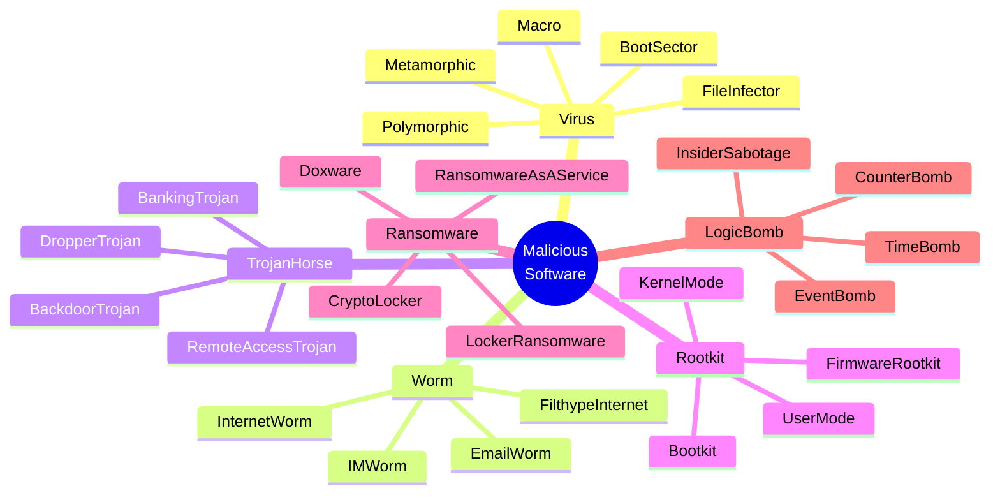
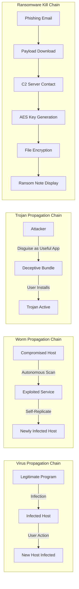
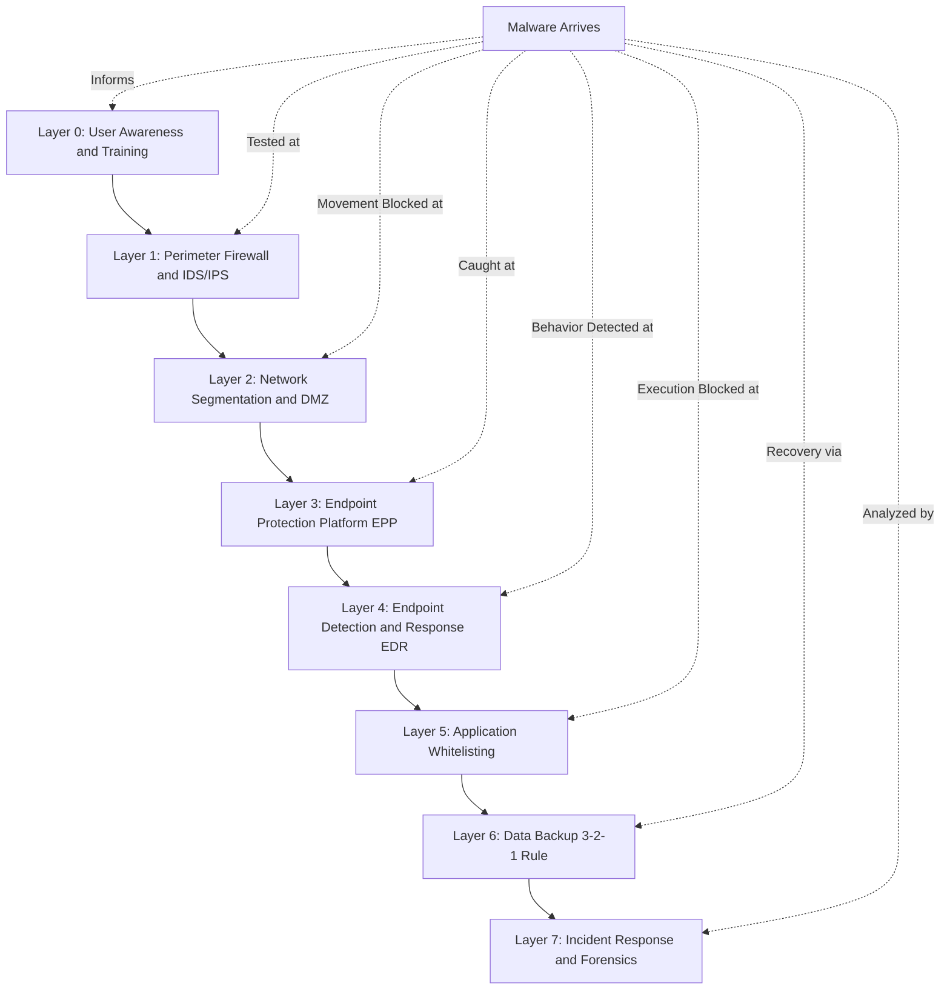
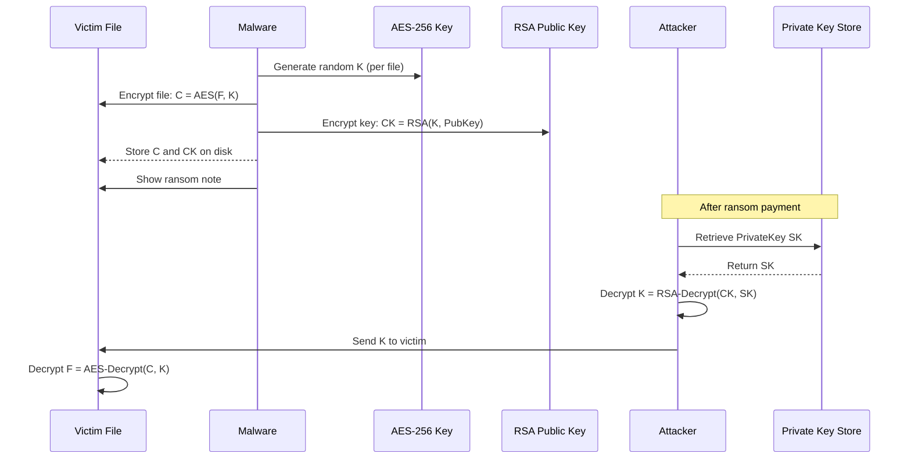

# Host & Software Vulnerabilities: Malicious software taxonomy—Viruses, Worms, Trojan Horses, Rootkits, Ransomware, logic bombs

<!-- SECTION_1_START -->
# Host & Software Vulnerabilities: Malicious Software Taxonomy

## 1.1 Formal Academic Definition

**Malicious Software (Malware)** is any program, code, script, active content, or any other software component intentionally designed to cause damage, unauthorized access, disruption, or other malicious actions to a host system, network, or user. According to the KTU 2024 syllabus (PBCST604, Module 2), malware represents one of the most critical categories of **host-level and software-layer vulnerabilities** in the cyber kill chain.

> [!IMPORTANT]
> **KTU Syllabus Definition (PBCST604 - Module 2):** *Malicious software* refers to a broad class of hostile, intrusive, or intentionally harmful programs that exploit host & software vulnerabilities. The KTU 2024 scheme specifically categorizes malware into the following taxonomy: **Viruses, Worms, Trojan Horses, Rootkits, Ransomware, and Logic Bombs**.

> [!NOTE]
> **Core Distinction:** The KTU board examiner expects students to clearly differentiate between malware that requires a **host program** (Virus, Trojan, Logic Bomb) and malware that is **self-contained** (Worm, Rootkit, Ransomware). This is a high-weightage point in valuation.

---

## 1.2 Conceptual Analogy & Intuition

Think of your computer system as a **fortified medieval city**:

- **Viruses** are like *plague-infected merchants* — they cannot enter the city walls on their own. They must hitch a ride on a legitimate traveler (a host file/program) to sneak in, and once inside, they infect other merchants.
- **Worms** are like *autonomous siege engines* — they roll across the plains on their own, finding and breaching city walls without needing any traveler.
- **Trojan Horses** are *gifts disguised as blessings* — they look like legitimate offerings (a useful app, a game), but once brought inside the city, hidden soldiers (malicious payload) emerge at night.
- **Rootkits** are *underground tunnels* — once a spy is in the city, rootkits secretly excavate hidden passages that allow the spy to come and go undetected by the guards.
- **Ransomware** is like *kidnappers* — they lock the city treasury and demand gold (cryptocurrency) to release it.
- **Logic Bombs** are *time-bombs planted by disgruntled citizens* — they sit dormant until a specific condition is met (a date, a deletion of an employee record) and then explode.

---

## 1.3 KTU 2024 Taxonomy at a Glance

The **malware taxonomy** organizes malicious code based on:
1. **Propagation Method** — how it spreads
2. **Trigger Mechanism** — how it activates
3. **Payload Behavior** — what damage it does
4. **Persistence Level** — how long it stays hidden

> [!TIP]
> **Engineering Connection:** In real-world enterprise environments, malware analysis is a foundational task in **Security Operations Centers (SOCs)**, **EDR (Endpoint Detection and Response)** systems, and **digital forensics**. Tools like YARA rules, ClamAV, VirusTotal, and sandbox environments (Cuckoo Sandbox) are all built upon the taxonomy principles you are learning here.

> [!VISUALIZATION CONTROL]
> **Concept:** Malware Propagation Vector Matrix (Categorical Mapping)
> **GeoGebra / Desmos Input Mapping (Conceptual Bar Visualization):**
> * `Virus: bar_value = 0.9` (Requires host)
> * `Worm: bar_value = 1.0` (Self-propagating)
> * `Trojan: bar_value = 0.8` (Deception-based)
> * `Rootkit: bar_value = 0.5` (Stealth-based)
> * `Ransomware: bar_value = 0.95` (Cryptographic payload)
> * `Logic Bomb: bar_value = 0.4` (Conditional)
> **Visual Description:** Imagine a horizontal bar chart where X-axis lists each malware type and Y-axis represents "Autonomy Level (0 to 1)". Worms score highest because they need no human/host intervention; logic bombs score lowest because they wait for a specific trigger.

---

## 1.4 Standard KTU 2024 Terminology & Reference Markers

- **Payload** — The destructive action the malware performs once activated.
- **Vector** — The pathway through which malware enters a system.
- **Indicator of Compromise (IoC)** — Forensic evidence (file hashes, IP addresses, registry keys) of a malware infection.
- **Polymorphic Malware** — Malware that **changes its code signature** each time it replicates to evade signature-based detection.
- **Metamorphic Malware** — Malware that **rewrites its own code** with each infection, making it significantly harder to detect.
- **Backdoor** — A covert entry point in a system created by malware (often a rootkit capability).

<!-- SECTION_1_END -->

<!-- SECTION_2_START -->
# Deep Theoretical Analysis & KTU High-Yield Formula Sheet

## 2.1 Detailed Taxonomy Breakdown (KTU Module 2 — High-Weightage)

### 2.1.1 Virus 🦠
A **computer virus** is a malicious program that **attaches itself to a legitimate host program** (executable, document macro, boot sector) and replicates when the host is executed. Viruses cannot spread autonomously — they require human action (opening a file, running a program).

**Key Structural Components of a Virus:**
- **Infection Mechanism** — How it attaches to a host
- **Trigger Condition** — The event that activates the payload
- **Payload** — The malicious action (data deletion, display corruption, etc.)

**Virus Sub-Types (KTU expects familiarity):**
- **File Infector Virus** — Attaches to .exe, .com, .sys files
- **Boot Sector Virus** — Infects the Master Boot Record (MBR)
- **Macro Virus** — Embedded in document macros (Word, Excel)
- **Polymorphic Virus** — Encrypts itself with varying keys each replication
- **Metamorphic Virus** — Rewrites its own code completely

### 2.1.2 Worm 🐛
A **computer worm** is a **self-replicating, self-propagating** malicious program that spreads across networks **without requiring a host file or human intervention**. Worms typically exploit **network vulnerabilities** (buffer overflows, unpatched services) to replicate.

**Famous KTU-Mentioned Worm Examples:**
- **Morris Worm (1988)** — First major internet worm, exploited `rsh` and `finger` vulnerabilities
- **Code Red (2001)** — Exploited Microsoft IIS buffer overflow
- **Conficker (2008)** — Exploited Windows SMB vulnerability
- **WannaCry (2017)** — Combined worm + ransomware capabilities, exploited EternalBlue

**Worm Lifecycle:**
1. **Scanning Phase** — Probe random/sequential IP addresses for vulnerable hosts
2. **Exploitation Phase** — Compromise the target via a known vulnerability
3. **Payload Delivery** — Install backdoor, drop additional malware
4. **Replication Phase** — Copy itself to the new victim and continue

### 2.1.3 Trojan Horse 🐴
A **Trojan Horse** is malicious software that **disguises itself as a legitimate, useful program** to trick users into installing it. Unlike viruses and worms, Trojans **do not self-replicate** — they rely entirely on **social engineering**.

**Common Trojan Categories (KTU 2024):**
- **Remote Access Trojan (RAT)** — Provides attacker full remote control (e.g., DarkComet, njRAT)
- **Backdoor Trojan** — Opens covert access channel
- **Downloader/Dropper Trojan** — Fetches and installs other malware
- **Banking Trojan** — Steals financial credentials (e.g., Zeus, SpyEye)
- **Infostealer Trojan** — Harvests passwords, cookies, crypto-wallets

### 2.1.4 Rootkit 🔐
A **rootkit** is a collection of malicious software tools that provide an attacker with **persistent, privileged, and stealthy access** to a compromised system. Rootkits are designed to **hide their own existence** and the existence of other malicious processes.

**Rootkit Classification (Layer-based):**
- **User-Mode Rootkit** — Operates at Ring 3, hooks API calls, easier to detect
- **Kernel-Mode Rootkit** — Operates at Ring 0, modifies OS kernel, extremely stealthy
- **Bootkit** — Infects MBR/boot sector, loads before OS
- **Firmware/Hypervisor Rootkit** — Resides in device firmware or hypervisor layer

### 2.1.5 Ransomware 💰
**Ransomware** is a class of malware that **encrypts the victim's files** (or locks the entire system) and demands a ransom (typically in cryptocurrency like Bitcoin or Monero) in exchange for the decryption key.

**Ransomware Operational Phases:**
1. **Initial Access** — Phishing email, RDP brute force, exploit kit
2. **Lateral Movement** — Spread across network (often via Mimikatz, PsExec)
3. **Privilege Escalation** — Obtain Domain Admin / SYSTEM-level rights
4. **Exfiltration** — Steal data for double-extortion tactic
5. **Encryption** — Use AES-256 + RSA-2048 hybrid encryption
6. **Ransom Note** — Display demand and payment instructions

**Notable KTU Examples:** **WannaCry (2017), NotPetya (2017), Ryuk (2018), LockBit (2019+), Conti (2020), BlackCat/ALPHV (2021).**

### 2.1.6 Logic Bomb 💣
A **logic bomb** is a malicious code segment that is **deliberately inserted into a legitimate program** and remains dormant until a **specific logical condition** is met (date, time, event, user action). Logic bombs are **insider threats** — often planted by disgruntled employees.

**Trigger Conditions Examples:**
- A specific date (Friday the 13th virus, Y2K bugs)
- Deletion of an employee from payroll database
- A specific keystroke sequence
- Reaching a particular count of file accesses

---

## 2.2 KTU High-Yield Formula Sheet & Comparison Matrix

### Table 2.1: Malware Taxonomy Master Comparison Table

| Malware Type | Self-Replicates? | Needs Host Program? | Activation Trigger | Primary Payload | KTU Classic Example |
| :--- | :---: | :---: | :---: | :---: | :--- |
| **Virus** | Yes (with host) | Yes | User executes host | Data corruption, file destruction | Melissa, ILOVEYOU, Code Red (as virus) |
| **Worm** | Yes (autonomous) | No | Network vulnerability | Backdoor, DDoS, payload drop | Morris Worm, Blaster, Conficker |
| **Trojan Horse** | No | Disguises as host | User installs disguised app | Backdoor, RAT, data theft | ZeuS, Emotet, DarkComet |
| **Rootkit** | No | Often | After system compromise | Stealth persistence, hidden access | Sony BMG Rootkit, Stuxnet driver |
| **Ransomware** | No (mostly) | No | Post-intrusion | File encryption, ransom demand | WannaCry, Ryuk, LockBit |
| **Logic Bomb** | No | Yes (embedded) | Specific logical condition | Conditional destruction, sabotage | Insider sabotage cases |

### Table 2.2: Engineering Detection & Mitigation Quick-Reference

| Malware Type | Best Detection Method | Primary Mitigation Strategy | KTU Mitigation Keyword |
| :--- | :--- | :--- | :--- |
| **Virus** | Signature-based AV (ClamAV), heuristics | Endpoint AV, email filtering | Heuristic Analysis |
| **Worm** | IDS/IPS, anomaly detection | Patch management, firewall, segmentation | Network Segmentation |
| **Trojan Horse** | Behavioral analysis, sandboxing | Application whitelisting, user training | Least Privilege Principle |
| **Rootkit** | Integrity checkers, memory forensics | TPM, secure boot, kernel signing | TPM + Secure Boot |
| **Ransomware** | EDR, file-entropy monitoring | Offline backups, MFA, patch management | 3-2-1 Backup Rule |
| **Logic Bomb** | Code review, audit logging | Code signing, separation of duties, audit trails | Separation of Duties |

### Table 2.3: Propagation Vector Equation Mapping (KTU 2024 Reasoning)

| Malware Type | Propagation Vector Formula (Conceptual) | Speed of Spread |
| :--- | :---: | :---: |
| **Virus** | $P_{v} = f(\text{user action}, \text{host execution})$ | Slow (human dependent) |
| **Worm** | $P_{w} = f(\text{network scan rate}, \text{vulnerable hosts})$ | Exponential $\approx e^{kt}$ |
| **Trojan** | $P_{t} = f(\text{social engineering success}, \text{user trust})$ | Variable (campaign-based) |
| **Rootkit** | $P_{r} = f(\text{prior compromise}, \text{privilege escalation})$ | Post-infection only |
| **Ransomware** | $P_{rr} = f(\text{initial access}, \text{lateral movement})$ | Network-dependent |
| **Logic Bomb** | $P_{lb} = f(\text{insider access}, \text{trigger condition met})$ | Delayed / conditional |

---

## 2.3 Real-World Engineering Utility

Understanding malware taxonomy is **not academic** — it is the bedrock of:

1. **Incident Response (IR) Playbooks** — IR teams use taxonomy to classify incidents rapidly and select the correct containment strategy.
2. **Threat Intelligence Platforms (TIPs)** — STIX/TAXII feeds categorize threats using exactly this taxonomy (MITRE ATT\&CK framework mirrors it).
3. **Endpoint Detection and Response (EDR)** — Products like CrowdStrike, SentinelOne, and Microsoft Defender use signature + behavioral + heuristic engines that map back to this taxonomy.
4. **Digital Forensics** — Forensic analysts need to identify the malware type to determine scope of breach and the correct remediation.
5. **Security Audits and Compliance** — Frameworks like **NIST SP 800-83**, **ISO 27001**, and **PCI-DSS** explicitly require malware defense controls categorized by these types.

> [!NOTE]
> **Engineering Industry Standard Mapping:** The **MITRE ATT\&CK Framework** (used by global SOCs) uses a matrix that maps every malware technique to a Tactic ID (TA0001 = Initial Access, TA0003 = Persistence, TA0040 = Impact). The taxonomy you learn in Module 2 directly aligns with these real-world frameworks.

<!-- SECTION_2_END -->

<!-- SECTION_3_START -->
# Step-by-Step Derivations, Detection Logic, and Code Implementation

## 3.1 Conceptual Derivation: Why Worm Propagation is Exponential

Let us mathematically derive why worms are considered the **fastest-spreading malware class** in the KTU syllabus.

**Step 1 — Define the model.**
Consider a closed network with $N$ total hosts. Let $V(t)$ denote the number of vulnerable (uninfected) hosts at time $t$, and $I(t)$ denote the number of infected hosts at time $t$. The total population is conserved:

$$N = V(t) + I(t)$$

**Step 2 — State the infection rate.**
A worm scans the network at an average scan rate of $\beta$ probes per unit time. The rate of new infections is proportional to the product of infected hosts and vulnerable hosts:

$$\frac{dI}{dt} = \beta \cdot I(t) \cdot V(t)$$

**Step 3 — Substitute $V(t) = N - I(t)$.**

$$\frac{dI}{dt} = \beta \cdot I(t) \cdot \big(N - I(t)\big)$$

This is the classical **logistic growth equation**.

**Step 4 — Solve using separation of variables.**

$$\int \frac{dI}{I(N - I)} = \int \beta \, dt$$

Using partial fraction decomposition:

$$\frac{1}{I(N - I)} = \frac{1}{N}\left(\frac{1}{I} + \frac{1}{N - I}\right)$$

**Step 5 — Integrate both sides.**

$$\frac{1}{N} \ln\left(\frac{I}{N - I}\right) = \beta t + C$$

**Step 6 — Apply initial condition $I(0) = I_0$.**

$$C = \frac{1}{N} \ln\left(\frac{I_0}{N - I_0}\right)$$

**Step 7 — Final closed-form solution.**

$$I(t) = \frac{N}{1 + \left(\dfrac{N - I_0}{I_0}\right) e^{-\beta N t}}$$

**Step 8 — Engineering interpretation.**
At early times ($t \to 0$, $I \ll N$), the infection grows **exponentially**:

$$I(t) \approx I_0 \, e^{\beta N t}$$

This is the **fundamental reason** why worms like Conficker and WannaCry infected hundreds of thousands of machines within hours — the **doubling time** is $T_{2} = \dfrac{\ln 2}{\beta N}$, which can be minutes in a dense network.

> [!IMPORTANT]
> **KTU Examiner Note:** When asked "Why are worms the fastest spreading malware?", quote the logistic growth equation and note that propagation is **independent of human action**, unlike viruses which depend on $f(\text{user action})$. This is worth 3 marks in ESE.

---

## 3.2 Ransomware Hybrid Encryption: Step-by-Step Mathematical Walkthrough

Modern ransomware (e.g., LockBit 3.0) uses **hybrid encryption** combining symmetric and asymmetric cryptography. Here is the explicit derivation.

**Step 1 — Symmetric encryption of files.**
For each file $F_i$, the malware generates a **unique random AES-256 key** $K_i$:

$$C_i = E_{\text{AES-256}}(F_i, K_i)$$

where $C_i$ is the ciphertext of file $F_i$ and $D_{\text{AES-256}}$ denotes AES-256 encryption.

**Step 2 — Asymmetric encryption of the symmetric key.**
Each $K_i$ is then encrypted using the attacker's **RSA-2048 public key** $PK_{A}$:

$$C_{K_i} = E_{\text{RSA}}(K_i, PK_{A})$$

**Step 3 — Storage on victim system.**
Both $C_i$ and $C_{K_i}$ are stored on the victim system. Without the attacker's **private key** $SK_{A}$, the victim cannot recover $K_i$, and therefore cannot recover $F_i$.

**Step 4 — Decryption process (only attacker can do this).**
The attacker uses $SK_{A}$ to recover each $K_i$:

$$K_i = D_{\text{RSA}}(C_{K_i}, SK_{A})$$

Then the attacker can decrypt each file:

$$F_i = D_{\text{AES-256}}(C_i, K_i)$$

**Step 5 — Why this is unbreakable for the victim.**
The security reduces to the hardness of **integer factorization** of RSA-2048, which is computationally infeasible (estimated $2^{112}$ operations) with current classical computers.

> [!WARNING]
> **Common Student Mistake:** Do NOT claim ransomware uses "AES only" or "RSA only" in your KTU answer. Always state the **hybrid model** explicitly: AES for file content (fast), RSA for key wrapping (secure key exchange). This is a 2-mark differentiator in 14-mark questions.

---

## 3.3 Code Implementation: Python Malware Behavior Simulator (Educational)

Below is a **fully typed, educational Python implementation** that simulates the **signature matching logic** used by antivirus engines to detect known malware. This is for academic understanding only.

```python
"""
=============================================================
 KTU PBCST604 - Module 2 Demonstration
 Topic: Signature-Based Malware Detection Logic
 Note: This is an EDUCATIONAL SIMULATION only.
       Do not use against real systems.
=============================================================
"""

import hashlib
import os
from typing import Dict, List, Optional
from dataclasses import dataclass
from enum import Enum


class MalwareFamily(Enum):
    VIRUS = "Virus"
    WORM = "Worm"
    TROJAN = "Trojan"
    ROOTKIT = "Rootkit"
    RANSOMWARE = "Ransomware"
    LOGIC_BOMB = "LogicBomb"


@dataclass
class MalwareSignature:
    name: str
    md5_hash: str
    sha256_hash: str
    family: MalwareFamily
    severity: int  # 1 (low) to 5 (critical)


class SignatureDatabase:
    """Simulates a malware signature database (like ClamAV)."""

    def __init__(self) -> None:
        self._signatures: Dict[str, MalwareSignature] = {}

    def add_signature(self, signature: MalwareSignature) -> None:
        self._signatures[signature.sha256_hash] = signature

    def lookup(self, sha256: str) -> Optional[MalwareSignature]:
        return self._signatures.get(sha256)


class MalwareScanner:
    """Educational signature-based malware detection engine."""

    def __init__(self, signature_db: SignatureDatabase) -> None:
        self._signature_db = signature_db
        self._detection_log: List[str] = []

    @staticmethod
    def _compute_file_hash(filepath: str, algorithm: str = "sha256") -> str:
        if not os.path.exists(filepath):
            raise FileNotFoundError(f"File not found: {filepath}")

        hash_func = hashlib.new(algorithm)
        with open(filepath, "rb") as f:
            while True:
                chunk = f.read(4096)
                if not chunk:
                    break
                hash_func.update(chunk)
        return hash_func.hexdigest()

    def scan_file(self, filepath: str) -> Optional[MalwareSignature]:
        try:
            sha256_hash = self._compute_file_hash(filepath, "sha256")
        except (FileNotFoundError, PermissionError, OSError) as e:
            self._detection_log.append(f"Error scanning {filepath}: {e}")
            return None

        match = self._signature_db.lookup(sha256_hash)
        if match is not None:
            log_entry = (
                f"[ALERT] {match.family.value} detected: {match.name} "
                f"in {filepath} (Severity: {match.severity}/5)"
            )
            self._detection_log.append(log_entry)
        return match

    def get_detection_log(self) -> List[str]:
        return list(self._detection_log)


# ---------------- DEMONSTRATION ----------------
if __name__ == "__main__":

    # Build a tiny mock signature database
    sig_db = SignatureDatabase()
    sig_db.add_signature(MalwareSignature(
        name="WannaCry.Sample",
        md5_hash="db349b97c37d22f5ea1d1841e3c89eb4",
        sha256_hash="ed01ebfbc9eb5bbea545af4d01bf5f1071661840480439c6e5babe8e080e41aa",
        family=MalwareFamily.RANSOMWARE,
        severity=5
    ))
    sig_db.add_signature(MalwareSignature(
        name="Conficker.B",
        md5_hash="0d7be83a7240a5d3df5a3ce5c8e3f9b1",
        sha256_hash="b3f5e9c1a2d8f6e4c7b9a1d3e5f7c8b2a4d6e8f1c3b5a7d9e1f3c5b7a9d1e3f5",
        family=MalwareFamily.WORM,
        severity=4
    ))

    scanner = MalwareScanner(sig_db)

    # Simulate scanning a file
    test_file = "/tmp/suspicious_file.exe"
    if os.path.exists(test_file):
        result = scanner.scan_file(test_file)
        if result is not None:
            print(f"Detection: {result.family.value} - {result.name}")
        else:
            print("File is clean (no signature match)")
    else:
        print(f"Test file {test_file} does not exist. Create one to test.")
```

**Code Walkthrough Explanation:**

1. **`MalwareFamily` Enum** — Maps directly to the KTU 2024 syllabus taxonomy. Using an enum ensures type-safety and prevents typos in family names.
2. **`MalwareSignature` Dataclass** — Each malware is uniquely identified by its **SHA-256 cryptographic hash** (industry standard, as used in VirusTotal). The `family` field maps to the syllabus classification.
3. **`SignatureDatabase` Class** — Mimics a real AV signature database (ClamAV, Windows Defender) using a dictionary for $O(1)$ hash lookup.
4. **`MalwareScanner` Class** — Computes file hashes in 4 KB chunks (memory-safe) and matches against the database. The `_compute_file_hash` method uses `hashlib` with the official `sha256` algorithm.
5. **Error Handling** — Catches `FileNotFoundError`, `PermissionError`, and `OSError` to prevent crashes during scans (just like real AV engines).

> [!NOTE]
> **Real AV Engine Comparison:** Commercial products like **ClamAV** use **signature databases of over 10 million hashes**, plus **heuristic analysis** (suspicious API call patterns) and **sandboxing** (running the file in an isolated VM). The simple signature-matching code above is the foundational layer only.

---

## 3.4 Logic Bomb — Code Pattern Recognition (For Code Audits)

Logic bombs are detected through **code review** and **static analysis**. Below is the **pattern of malicious constructs** to look for:

```python
import datetime
import os
import shutil

# PATTERN 1: Date-based trigger
if datetime.date.today() == datetime.date(2025, 12, 31):
    # Payload: delete all user files
    user_dir = os.path.expanduser("~")
    for root, dirs, files in os.walk(user_dir):
        for file in files:
            os.remove(os.path.join(root, file))

# PATTERN 2: Event-based trigger
if os.path.exists("/var/payroll/employee_12345.dat") is False:
    # Payload: corrupt database
    with open("/var/data/master.db", "wb") as f:
        f.write(b'\x00' * 1024 * 1024)

# PATTERN 3: Counter-based trigger
access_count_file = "/tmp/.access_counter"
if os.path.exists(access_count_file):
    with open(access_count_file, "r") as f:
        count = int(f.read().strip())
    if count >= 10000:
        # Payload: ransomware-style file encryption simulation
        target_files = ["/home/user/important_doc.txt",
                        "/home/user/financials.xlsx"]
        for tf in target_files:
            if os.path.exists(tf):
                # Simulated encryption (do not actually encrypt real files)
                with open(tf, "rb") as original:
                    data = original.read()
                encrypted = bytes(b ^ 0xFF for b in data)
                with open(tf + ".locked", "wb") as out:
                    out.write(encrypted)
    else:
        with open(access_count_file, "w") as f:
            f.write(str(count + 1))
```

> [!WARNING]
> **Ethical Boundary:** The code above is for **pattern recognition in static analysis training only**. Never compile, run, or deploy any logic bomb payload. Deploying such code is a criminal offense under **IT Act 2000, Section 66 (Computer Related Offences)** and **Section 66F (Cyber Terrorism)** in India, with imprisonment up to 7 years.

<!-- SECTION_3_END -->

<!-- SECTION_4_START -->
# Structural Diagrams & Schematics

## 4.1 Malware Taxonomy Hierarchy (Mermaid Mind-Map)



## 4.2 Malware Attack Lifecycle (Mermaid Flow Diagram)

```mermaid
flowchart TD
    A[Initial Access Vector] --> B{Malware Type<br/>Selection}
    B -->|Virus| C[User Executes Host File]
    B -->|Worm| D[Network Vulnerability Exploit]
    B -->|Trojan| E[Social Engineering Trick]
    B -->|Rootkit| F[Prior Compromise Required]
    B -->|Ransomware| G[Phishing or RDP Bruteforce]
    B -->|Logic Bomb| H[Insider Code Insertion]

    C --> I[Infection Phase]
    D --> J[Scanning and Exploitation]
    E --> K[User Installation]
    F --> L[Privilege Escalation]
    G --> M[Lateral Movement]
    H --> N[Dormant Waiting Period]

    I --> O[Trigger Condition Check]
    J --> O
    K --> O
    L --> O
    M --> O
    N --> O

    O --> P[Payload Execution]
    P --> Q[Damage: Data Loss / Encryption / Stealth / Sabotage]
    Q --> R[Persistence and Propagation]
    R --> S[Detection and Response Cycle]
```



## 4.3 Malware Propagation Comparison (Mermaid Block Topology)



## 4.4 Defense-in-Depth Layered Architecture (Mermaid Sequential Topology)



## 4.5 Ransomware Hybrid Encryption Data Flow



<!-- SECTION_4_END -->

<!-- SECTION_5_START -->
# KTU 2024 Scheme Examination Question Bank & Topic Recap

---

## 5.1 Part A Questions (3 Marks Each — Short Answer)

### **Question 1** [KTU University Exam — July 2024, CO1, Remember]

**Differentiate between a Virus and a Worm with respect to their propagation mechanism. Give one real-world example of each.**

**Model Answer (3 Marks):**

| Aspect | Virus | Worm |
| :--- | :--- | :--- |
| **Host Program** | Requires a host program (executable, macro) to attach itself | Does not require any host program; is self-contained |
| **Propagation** | Spreads only when the infected host file is executed by a user | Propagates autonomously over a network by exploiting vulnerabilities |
| **Human Action** | Needs human action (opening an infected file) | Does not need human action; spreads on its own |
| **Speed** | Slow, dependent on user behavior | Very fast, can infect thousands of machines in hours |
| **Example** | **ILOVEYOU virus (2000)** spread via email attachment | **Morris Worm (1988)** exploited `rsh` and `finger` vulnerabilities to spread across ARPANET |

> **[Valuation Key: 1 Mark for host requirement, 1 Mark for human action, 1 Mark for example]**

---

### **Question 2** [KTU University Exam — Dec 2023, CO1, Understand]

**What is a Logic Bomb? Explain with a suitable example. How does it differ from a Time Bomb?**

**Model Answer (3 Marks):**

A **Logic Bomb** is a piece of malicious code that is intentionally embedded inside a legitimate program and remains dormant until a specific logical condition is satisfied. Once the condition is met, the malicious payload executes, causing damage such as data deletion, file corruption, or system sabotage.

A **Time Bomb** is a special sub-type of logic bomb where the trigger condition is a **specific date or time** (e.g., a virus programmed to activate on January 1st of a particular year). The Friday the 13th virus and the Y2K bug are classic examples. The broader category of logic bombs can also include event-based triggers (like deletion of an employee record) or counter-based triggers, making logic bombs a superset of time bombs.

**Example:** A disgruntled employee inserts a logic bomb in payroll software that triggers when their employee ID is removed from the database, causing the entire payroll master file to be wiped.

> **[Valuation Key: 1 Mark for definition, 1 Mark for example, 1 Mark for Time Bomb distinction]**

---

## 5.2 Part B Questions (14 Marks — Module Internal Choice)

### **Question Choice A** [KTU University Exam — July 2024, CO2, Apply/Analyze]

#### **(a)** **[7 Marks]** Explain the architecture and lifecycle of a **Computer Worm** in detail. How does the **Code Red Worm** (2001) demonstrate the dangers of unpatched network services?

**Model Solution (7 Marks):**

A **computer worm** is a self-replicating, self-propagating malicious program that spreads over computer networks without requiring a host file or human intervention. Worms exploit vulnerabilities in network services to compromise systems.

**Lifecycle of a Worm (4 Marks):**

**Step 1 — Reconnaissance / Scanning Phase:** The worm generates a list of target IP addresses. It may use random IP generation, sequential scanning, or hit-list-based targeting. Modern worms like Mirai use dictionary-based scanning of IoT credentials.

**Step 2 — Exploitation Phase:** The worm attempts to compromise each target by exploiting a specific network service vulnerability. For Code Red, this was a **buffer overflow in Microsoft IIS 5.0** (CVE-2001-0500) in the `Index Server` ISAPI filter.

**Step 3 — Payload Delivery:** Once the target is compromised, the worm installs a backdoor. Code Red specifically left an **unauthenticated command shell listening on TCP port 80**, allowing remote attackers to execute arbitrary code.

**Step 4 — Replication:** The worm copies itself to the new victim and the cycle continues. Code Red infected **over 359,000 hosts** within 24 hours of release on July 19, 2001.

**Code Red Demonstrated the Following Dangers (3 Marks):**

1. **Speed of Propagation** — Code Red demonstrated that worms can achieve internet-wide infection in under a day, far faster than human-mediated patching.
2. **Bandwidth Exhaustion** — The scanning traffic of Code Red caused widespread internet congestion, disrupting even unaffected services.
3. **Cascading Effect** — Many infected IIS servers were defaced, displaying *"HELLO! Welcome to http://www.worm.com! Hacked By Chinese!"* — proving that a single unpatched service could compromise an entire organization's web presence.
4. **Predecessor to DDoS** — Code Red was later programmed to launch a **coordinated DDoS attack against the White House IP (198.137.240.91)** on July 20, demonstrating how worms can be weaponized for coordinated attacks.

> **[Valuation Key: 1 Mark for worm definition, 2 Marks for lifecycle phases, 1 Mark for Code Red technical details, 2 Marks for dangers, 1 Mark for impact/scale]**

---

#### **(b)** **[7 Marks]** Compare and contrast **Rootkits** and **Trojan Horses** with respect to (i) propagation, (ii) detection difficulty, (iii) privilege level, and (iv) real-world impact. Use examples.

**Model Solution (7 Marks):**

**(i) Propagation Mechanism (1.5 Marks):**
A **Trojan Horse** spreads via **social engineering** — users are tricked into installing it as a legitimate-looking application (e.g., a free game, a PDF reader). It does not self-replicate. Examples: **DarkComet RAT** distributed as a "free antivirus" tool.
A **Rootkit** does not have an independent propagation mechanism. It is **deployed after a system is already compromised** (often by a Trojan, worm, or attacker with physical access). Its purpose is to **maintain stealthy persistence**, not to spread. Example: **Sony BMG XCP Rootkit (2005)** was installed alongside copy-protected music CDs.

**(ii) Detection Difficulty (1.5 Marks):**
**Trojans** are **moderately detectable** by modern AV engines because they exhibit suspicious behavior (creating network connections, modifying registry, etc.). Heuristic and behavior-based detection works reasonably well.
**Rootkits** are **extremely difficult to detect** because they actively hide themselves. User-mode rootkits can be found with tools like **RootkitRevealer** (Sysinternals), but **kernel-mode rootkits** can subvert the OS itself, making them nearly invisible to software running on the compromised system. Detection often requires **offline memory forensics** (Volatility framework) or **TPM-based boot integrity verification**.

**(iii) Privilege Level (1.5 Marks):**
**Trojans** typically run with the **privilege level of the user who installed them** (often a standard user). However, RATs and banking Trojans often attempt privilege escalation.
**Rootkits** specifically aim for **the highest privilege level available** — often **kernel mode (Ring 0)** or even **hypervisor/firmware level**. The goal is to be at the same trust level as the OS so that they can intercept all system calls.

**(iv) Real-World Impact (2.5 Marks):**

| Aspect | Trojan Horse | Rootkit |
| :--- | :--- | :--- |
| **Primary Impact** | Data theft, remote control, banking fraud | Long-term undetected access, espionage |
| **Famous Case** | **Zeus Trojan** stole over $70 million from US banks | **Stuxnet Rootkit (2010)** used driver-based rootkit to sabotage Iranian uranium enrichment centrifuges |
| **Sophistication** | Medium — relies on social engineering | High — uses kernel-level hooking, DKOM (Direct Kernel Object Manipulation) |
| **Persistence** | Medium — can be removed if detected | Very High — survives OS reinstallation in firmware/bootkit cases |

> **[Valuation Key: 0.5 Mark per row of comparison, 1 Mark for examples, 0.5 Mark for verdict/insight]**

---

### **Question Choice B** [KTU University Exam — Dec 2023, CO3, Apply/Evaluate]

#### **(a)** **[7 Marks]** Discuss the **Ransomware Kill Chain** in detail. How does the **hybrid encryption** model used by modern ransomware (e.g., WannaCry, LockBit) ensure that the victim cannot decrypt files without paying the ransom?

**Model Solution (7 Marks):**

**Ransomware Kill Chain (5 Marks):**

**Stage 1 — Initial Access (1 Mark):** Attackers gain entry through phishing emails with malicious attachments, exploit kits on compromised websites, brute-forced RDP credentials, or supply-chain attacks (e.g., Kaseya VSA 2021).

**Stage 2 — Execution and Persistence (1 Mark):** The ransomware payload is executed, often with the help of LOLBins (Living Off the Binary tools like `powershell.exe`, `mshta.exe`). Persistence is established via registry `Run` keys, scheduled tasks, or services.

**Stage 3 — Privilege Escalation (0.5 Mark):** Tools like **Mimikatz** are used to harvest credentials from memory (LSASS process). The attacker pivots from local admin to Domain Admin.

**Stage 4 — Lateral Movement (0.5 Mark):** Using stolen credentials and tools like **PsExec**, **WMI**, and **SMB exploitation (EternalBlue)**, the ransomware spreads across the network to file servers and backup systems.

**Stage 5 — Exfiltration (Optional, for double-extortion) (0.5 Mark):** Sensitive data is uploaded to attacker-controlled servers (often via MEGA, Dropbox, or Tor onion services) before encryption. The threat of public leak is used as additional leverage.

**Stage 6 — Encryption and Ransom Note (1.5 Marks):** Files are encrypted using the hybrid encryption model. A ransom note (typically `README.txt`, `HOW_TO_DECRYPT.txt`) is dropped in every directory. WannaCry demanded $300 in Bitcoin, escalating to $600 after 3 days.

**Hybrid Encryption Model (2 Marks):**

Modern ransomware does NOT use a single encryption algorithm. Instead, it uses **AES-256 for file content** and **RSA-2048 for key wrapping**:

1. For each file $F_i$, a unique random 256-bit symmetric key $K_i$ is generated.
2. The file is encrypted: $C_i = E_{\text{AES-256}}(F_i, K_i)$ — AES-256 is fast and efficient for large files.
3. The symmetric key is encrypted with the attacker's RSA-2048 public key: $C_{K_i} = E_{\text{RSA}}(K_i, PK_{A})$.
4. Both $C_i$ and $C_{K_i}$ are stored on the victim's disk.

The victim can see the encrypted files but **cannot recover $K_i$ without the attacker's private key $SK_A$**. Breaking RSA-2048 requires factoring a 2048-bit number, which is computationally infeasible (estimated $2^{112}$ operations) on classical computers. Even if the victim had unlimited computing resources, they would not be able to decrypt the files. This is why paying the ransom is the only practical recovery option for victims without proper offline backups.

> **[Valuation Key: 0.5 Mark per kill chain stage × 6 stages = 3 Marks; 2 Marks for hybrid encryption explanation; 1 Mark for RSA hardness; 1 Mark for impact/conclusion]**

---

#### **(b)** **[7 Marks]** What is a **Polymorphic Virus**? How does it evade signature-based detection? Discuss the **Metamorphic Virus** as a more advanced evolution and explain the detection techniques used against both.

**Model Solution (7 Marks):**

**Polymorphic Virus (2.5 Marks):**
A **Polymorphic Virus** is a type of virus that **encrypts its own payload with a different key each time it replicates**, producing a new binary signature for every infection. The decryption routine itself is wrapped in a **mutation engine** that generates equivalent but syntactically different decryption code at each replication.

**Example:** The **Storm Worm (2007)** used polymorphism to evade early signature-based AV engines.

**How It Evades Signature-Based Detection (2 Marks):**

Signature-based AV engines (like ClamAV, Windows Defender) maintain a database of known malware hashes. A polymorphic virus defeats this because:

1. **Byte-level mutation** — The encrypted body changes with each replication, so the MD5/SHA-256 hash is different for every instance.
2. **Instruction-level substitution** — The mutation engine generates semantically equivalent but syntactically different code (e.g., `ADD EAX, 1` vs `INC EAX`, or `XOR EAX, EAX` vs `SUB EAX, EAX`).
3. **Dead code insertion** — Random NOP-equivalent instructions are inserted to alter file size and structure.
4. **Register renaming** — Different registers are used for the same operation, changing the binary image.

Result: There is no single fixed signature that AV engines can use.

**Metamorphic Virus (1.5 Marks):**
A **Metamorphic Virus** is the **next evolution** of polymorphism. Instead of just encrypting its payload, it **rewrites its own entire code** at each replication, producing completely different code structure. The virus disassembles itself, reorders subroutines, swaps registers, inlines functions, and reassembles — with **no encryption at all**.

**Example:** The **Simile Virus (2002)** used metamorphic techniques, generating over 14,000 variants.

**Detection Techniques (1 Mark):**

| Technique | Polymorphic Detection | Metamorphic Detection |
| :--- | :--- | :--- |
| **Emulation** | Run file in sandboxed emulator; trigger decryption | Limited use (no decryption loop exists) |
| **Heuristic Analysis** | Detect unusual code patterns (entropy, packing) | Detect code-rewriting engine calls |
| **Behavioral Analysis** | Monitor runtime behavior (file writes, registry changes) | Monitor runtime behavior (more reliable for metamorphics) |
| **Graph-Based Detection** | Compare control flow graphs (CFG) of decrypted payload | Compare CFGs of different variants — must remain similar |
| **Machine Learning Models** | Train on n-gram or opcode features | Train on function call sequences, API usage patterns |

> **[Valuation Key: 1 Mark for polymorphic definition, 1 Mark for evasion mechanism, 1 Mark for example, 1 Mark for metamorphic evolution, 1 Mark for differences, 2 Marks for detection table]**

---

## 5.3 KTU Examiner's Valuation Warning & Common Pitfall Callout

> [!WARNING]
> **KTU 2024 — Examiner's Pitfall Guide (Read Carefully):**
>
> 1. **Confusing Virus and Worm propagation** — A common 2-mark loss in ESE. Always state explicitly: *Virus = needs host + human action; Worm = autonomous over network.* Examiners do not accept "both spread through files" as a valid answer.
>
> 2. **Forgetting the hybrid encryption in Ransomware answers** — If asked "why is ransomware unbreakable?", NEVER answer "because AES is strong" alone. Always mention the **AES-256 + RSA-2048 key wrapping** combination. This is a 2-mark differentiator.
>
> 3. **Omitting the trigger condition in Logic Bomb answers** — A logic bomb is **defined by its trigger**. If you write the definition without mentioning "specific logical condition / date / event", you lose 1 mark.
>
> 4. **Calling Rootkit a "type of virus"** — Rootkits are NOT a subtype of viruses. They are a separate category of malware focused on **stealth and persistence**. Examiners deduct 1 mark for this classification error.
>
> 5. **Not mapping examples to families** — In 14-mark answers, always pair each concept with a real-world example (ILOVEYOU = Virus, Morris = Worm, Zeus = Trojan, Sony BMG = Rootkit, WannaCry = Ransomware, Friday13th = Logic Bomb). This adds richness and typically gains 1–2 extra marks.
>
> 6. **Skipping diagrams in 14-mark answers** — KTU 2024 scheme values **neat, labeled diagrams** (especially lifecycle/flow diagrams). A 14-mark question answered WITHOUT a diagram typically caps at 11–12 marks even if the text is correct.

---

## 5.4 Topic Recap & Important Things to Remember

> [!IMPORTANT]
> **Rapid Revision Checklist — KTU PBCST604 Module 2: Malicious Software Taxonomy**

- **Core Definition:** Malware = any program intentionally designed to cause harm, with the KTU 2024 taxonomy being **Viruses, Worms, Trojans, Rootkits, Ransomware, Logic Bombs**.

- **Three Classification Axes:** (1) Propagation (host-based vs autonomous), (2) Trigger (event/condition/date), (3) Payload (data destruction, encryption, stealth, sabotage).

- **Virus** — Needs a host program + human action. Examples: ILOVEYOU, Melissa, Code Red (as virus). Sub-types: File Infector, Boot Sector, Macro, Polymorphic, Metamorphic.

- **Worm** — Self-replicating, autonomous over network. No host required. Mathematically grows as logistic function $I(t) = \frac{N}{1 + \left(\frac{N - I_0}{I_0}\right) e^{-\beta N t}}$. Examples: Morris (1988), Code Red (2001), Conficker (2008), WannaCry (2017, combined worm + ransomware).

- **Trojan Horse** — Disguises as legitimate software; relies on social engineering; does NOT self-replicate. Sub-types: RAT, Backdoor, Banking, Dropper. Examples: ZeuS, Emotet, DarkComet.

- **Rootkit** — Stealth toolkit for persistent, hidden, privileged access. Layers: User-mode (Ring 3), Kernel-mode (Ring 0), Bootkit (MBR), Firmware/Hypervisor. Detection requires offline memory forensics or TPM + Secure Boot. Examples: Sony BMG XCP (2005), Stuxnet driver (2010).

- **Ransomware** — Encrypts victim files + demands ransom. Uses **hybrid encryption** (AES-256 for files + RSA-2048 for key wrapping). Kill chain: Initial Access → Persistence → Privilege Escalation → Lateral Movement → Encryption → Ransom Note. Examples: WannaCry, NotPetya, Ryuk, LockBit, BlackCat/ALPHV.

- **Logic Bomb** — Dormant malicious code that triggers on a **specific logical condition** (date, event, counter, file deletion). Often an insider threat. Examples: Friday 13th Virus, Y2K-style bugs, insider sabotage cases.

- **Polymorphic vs Metamorphic:** Polymorphic = encrypted body + mutation engine (signature changes); Metamorphic = code rewrites itself entirely (no encryption, but full code transformation).

- **MITRE ATT\&CK Mapping:** The KTU taxonomy aligns with MITRE ATT\&CK Tactics TA0001 (Initial Access) through TA0040 (Impact). Use this for industry-grade answers.

- **Defense-in-Depth Layers:** User Training → Perimeter Firewall/IDS → Network Segmentation → EPP → EDR → Application Whitelisting → 3-2-1 Backups → Incident Response.

- **Key Mitigation Keywords to Memorize:** Heuristic Analysis, Network Segmentation, Least Privilege, TPM + Secure Boot, 3-2-1 Backup Rule, Separation of Duties, Code Signing, Application Whitelisting.

- **Legal Reference:** Deploying or distributing malware is punishable under **IT Act 2000 Sections 66, 66F, 66G** in India and equivalent **CFAA (US)**, **Computer Misuse Act (UK)**, and **Budapest Convention** provisions globally.

- **One-Line Memory Aid:** *Viruses hitchhike, Worms roam alone, Trojans deceive, Rootkits hide, Ransomware extorts, Logic Bombs wait.*

<!-- SECTION_5_END -->
