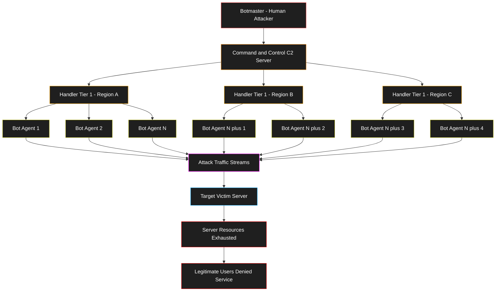
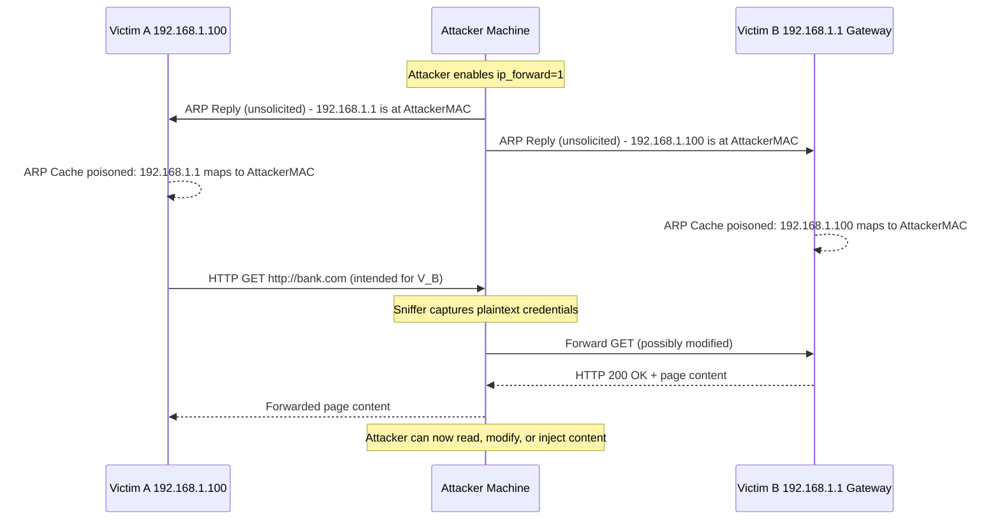
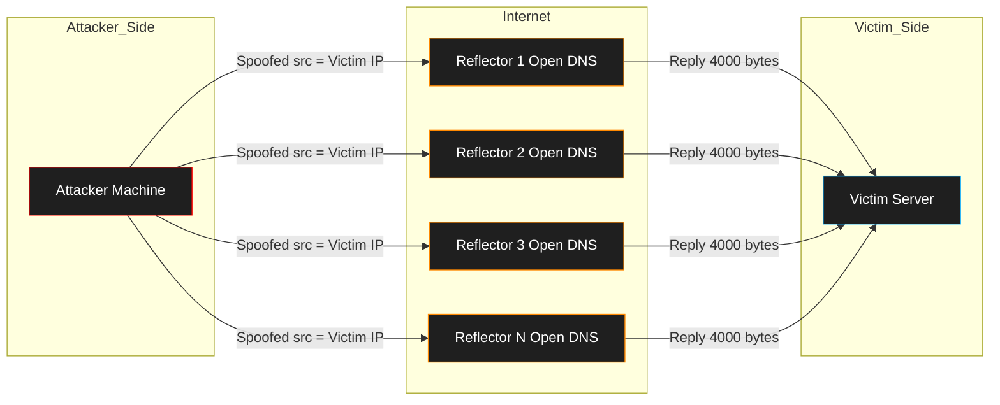
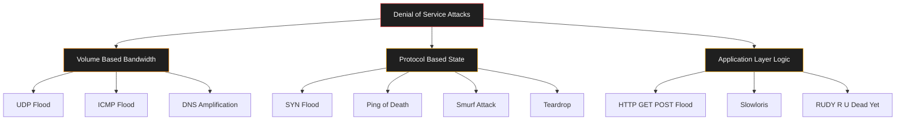
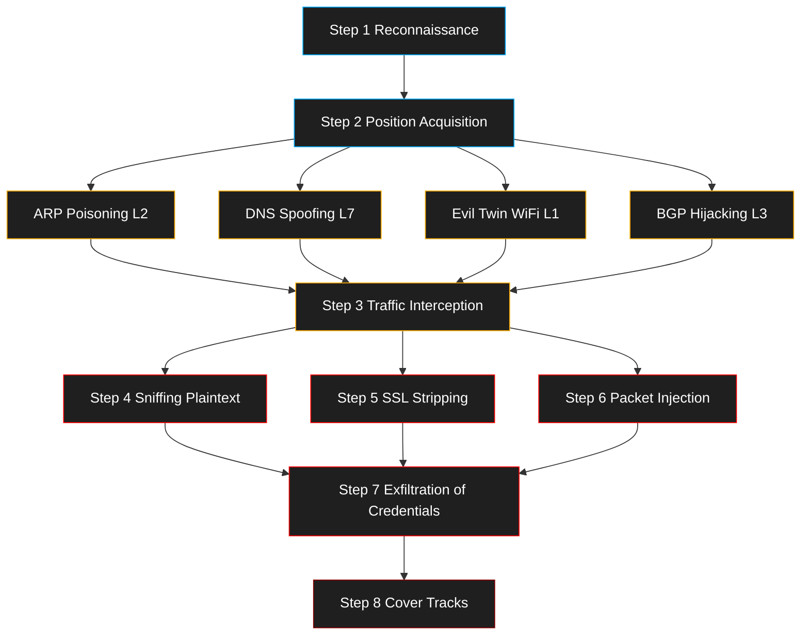

# Network Vulnerabilities: DoS, DDoS structures, IP Spoofing, and Man-in-the-Middle (MitM) attacks

<!-- SECTION_1_START -->
# Network Vulnerabilities: DoS, DDoS, IP Spoofing, and MitM Attacks

## 1.1 Core Technical Definition

**Denial of Service (DoS)** is a cyber-attack class where a single malicious actor deliberately renders a network resource, host, or service **unavailable** to its legitimate users by exhausting one or more critical resources — bandwidth, processing cycles, memory buffers, or application-level states.

**Distributed Denial of Service (DDoS)** is the orchestrated, multi-source variant where the attack traffic is generated simultaneously from thousands of geographically dispersed compromised machines (a **botnet**) that flood a single target under the command of a remote attacker (the **botmaster**).

**IP Spoofing** is the act of forging the source IP address in the header of an IP packet so that the receiving host believes the packet originated from a trusted, internal, or different machine than its true origin.

**Man-in-the-Middle (MitM)** is an active eavesdropping attack in which an adversary secretly intercepts, relays, and possibly alters the communication between two parties who each believe they are communicating directly and securely with the other.

> [!IMPORTANT]
> **KTU 2024 Syllabus Highlight — Module 2**
> All four vulnerabilities fall under the **Network Layer Threat Model** of the CIA triad (primarily affecting **Availability** for DoS/DDoS and **Confidentiality/Integrity** for Spoofing/MitM). Examiners frequently frame 14-mark questions combining any two of these vulnerabilities in a single scenario.

---

## 1.2 Intuitive Analogies (Plain-English Explanations)

> [!NOTE]
> **Analogy 1 — DoS / DDoS: The Highway Traffic Jam**
> Imagine a single toll booth with **4 lanes**. A DoS attack is like **one angry driver** who parks his truck sideways across all 4 lanes. Legitimate cars (real users) cannot pass. Now a DDoS is the same trick, but **10,000 truck drivers** from 50 different cities all drive to the same toll booth at the same moment. The booth is overwhelmed from every direction. The toll booth is the *server*; the trucks are the *attack packets*; the truck drivers are the *bots*.

> [!NOTE]
> **Analogy 2 — IP Spoofing: The Forged Return Address**
> Picture writing a letter to your friend, but putting **someone else's home address** in the "From" field. When your friend replies, the reply goes to the wrong person. The original sender (the spoofer) is **anonymous**, and the impersonated third party (the spoofed IP) is flooded with the response traffic or falsely blamed for the action.

> [!NOTE]
> **Analogy 3 — MitM: The Eavesdropping Translator**
> Two diplomats, one speaking only French and one only Japanese, want a private conversation. They hire a "translator" (the MitM) to relay messages. The translator secretly tells Diplomat A that B said something different from what B actually said, and vice-versa. Neither diplomat realizes the translator is rewriting the conversation. The "translator" is the **attacker's machine** sitting silently inside the communication channel.

---

## 1.3 Foundational Building Blocks

> [!IMPORTANT]
> **Standard Metrics and Protocol Constants (Memorize for KTU Board Exam)**
> * **TCP 3-Way Handshake** steps: **SYN $\rightarrow$ SYN-ACK $\rightarrow$ ACK** (the cornerstone of DoS exploitation)
> * **Maximum IP Packet Size (IPv4):** $65{,}535$ bytes
> * **Maximum ICMP Echo Payload (legacy):** $65{,}507$ bytes (anything above triggers **Ping of Death**)
> * **Default HTTP Port:** $\mathbf{80}$ **HTTPS Port:** $\mathbf{443}$
> * **Default DNS Port:** $\mathbf{53}$ (UDP for queries, TCP for zone transfers)
> * **TTL (Time-to-Live) default value:** $\mathbf{64}$ hops (used in MitM traceroute fingerprinting)
> * **TCP Half-Open Connection memory cost:** $\approx \mathbf{1~KB}$ per entry in the SYN queue
> * **SYN Queue default size on Linux 2.4+:** $\mathbf{256}$ entries
> * **MTU (Maximum Transmission Unit) — Ethernet standard:** $\mathbf{1500}$ bytes

---

## 1.4 Visualization Control — Attack Resource Exhaustion Curve

> [!VISUALIZATION CONTROL]
> **Concept:** Server Resource Degradation under Increasing Attack Traffic
> **GeoGebra / Desmos Input Equations:**
> * `f_legit(x) = 100 - 0.01*x^2` (legitimate traffic throughput — server capacity curve)
> * `f_dos(x) = 5*x` (DoS/DDoS attack load — linear increase)
> * `g(x) = 100 - 0.01*x^2 - 5*x` (net availability = service minus attack)
> * `x_breach = 80` (point where service becomes unavailable)
> **Visual Description:** The downward parabola $f_{\text{legit}}(x)$ represents the server's natural service capacity declining under load. The straight line $f_{\text{dos}}(x)$ represents the attack load rising linearly. The intersection point $x_{\text{breach}}$ is the **breaking point** where $g(x) < 0$ — the service has been knocked offline.

---

<!-- SECTION_1_END -->

<!-- SECTION_2_START -->
# Deep Theoretical Analysis & KTU High-Yield Formula Sheet

## 2.1 The DoS Attack — Operational Logic

A DoS attack exploits a fundamental asymmetry: it is **cheap to send** a packet but **expensive to process** it. The attacker aims to force the target to spend finite resources (CPU, RAM, sockets, disk I/O) handling junk requests until no resources remain for legitimate users.

### 2.1.1 Categories of DoS Exploits

* **Volume-Based (Bandwidth Exhaustion):** Saturate the network link.
* **Protocol-Based (State-Exhaustion):** Consume the state tables of network devices or servers.
* **Application-Layer (Logic-Exhaustion):** Trigger expensive server-side logic with cheap client requests.

### 2.1.2 The Classic Sub-Types (Board-Exam Favourites)

| Attack | Protocol Exploited | Mechanism | Primary Resource Drained |
|---|---|---|---|
| **SYN Flood** | TCP | Sends many `SYN` packets but never sends the final `ACK`, leaving server **half-open** sockets. | TCP SYN backlog queue |
| **Ping of Death** | ICMP | Sends a single IP packet > 65,535 bytes via fragmentation, causing buffer overflow on reassembly. | Memory (reassembly buffer) |
| **Smurf Attack** | ICMP Echo | Broadcasts an ICMP Echo to a network with a **spoofed** source IP (the victim). All hosts reply to the victim. | Bandwidth of the victim |
| **UDP Flood** | UDP | Sends massive UDP packets to random ports; server replies with `ICMP Destination Unreachable` consuming cycles. | CPU + Bandwidth |
| **Teardrop** | IP Fragmentation | Sends overlapping IP fragments with confusing offset values; OS fails to reassemble and crashes. | Kernel reassembly logic |
| **HTTP GET/POST Flood** | HTTP/S | Uses legitimate-looking requests (e.g., `GET /index.html`) to exhaust web server workers. | Application threads / DB connections |
| **Slowloris** | HTTP | Opens many HTTP connections and sends headers **byte-by-byte**, never completing the request. | Apache/Nginx worker pool |

---

## 2.2 The DDoS Attack — Orchestrated Multi-Source Logic

DDoS amplifies DoS by:
1. **Distributing** the source (so blocking one IP is futile).
2. **Amplifying** the bandwidth via reflectors (Smurf, DNS amplification, NTP amplification).
3. **Obfuscating** the true origin through multiple layers of indirection.

### 2.2.1 The Botnet Architecture

The DDoS attack chain is structured as a **Command and Control (C2)** hierarchy. The terms below are mandatory KTU vocabulary.

> [!IMPORTANT]
> **Botnet Roles — Memorize**
> * **Botmaster (Attacker / Herder):** The human controller of the botnet.
> * **Command \& Control (C2) Server:** The relay station that distributes attack instructions to the bots.
> * **Handler / Master / Daemon:** Intermediate compromised hosts that relay commands to the bots (used in early IRC-based botnets).
> * **Bot / Zombie / Agent / Drone:** The leaf-level compromised machine that generates the actual attack traffic.
> * **Reflector / Amplifier:** A legitimate third-party server (e.g., open DNS resolver) that unwittingly reflects and amplifies the attack traffic toward the victim.

### 2.2.2 Botnet Communication Topologies

* **Centralized (Star):** All bots $\leftrightarrow$ one C2 server. Easy to set up; **single point of failure** if C2 is taken down.
* **Hierarchical (Tiered):** Botmaster $\rightarrow$ Handlers $\rightarrow$ Bots. More resilient; used in early botnets like **Agobot / SDbot**.
* **Decentralized (P2P):** Bots relay commands to each other (e.g., **GameOver Zeus**). Highly resilient; takedown requires poisoning the P2P protocol.

### 2.2.3 The Amplification Factor — A Critical Math Concept

A **DNS Amplification** attack works because a tiny 60-byte DNS query can elicit a 4,000-byte response. The amplification factor is:

$$
A_{\text{factor}} = \frac{\text{Response Size (bytes)}}{\text{Request Size (bytes)}}
$$

For DNS amplification: $A_{\text{factor}} = \frac{4000}{60} \approx 66.7\times$.

A single attacker with 1 Gbps of upstream bandwidth can thus generate $1 \times 66.7 = 66.7$ Gbps of attack traffic toward the victim when reflectors are used.

---

## 2.3 IP Spoofing — Theoretical Mechanics

### 2.3.1 Why IP Spoofing Works

IPv4 was designed in an era of mutual trust; the source IP address in a packet is **self-asserted by the sender** with no native cryptographic validation. Routers forward packets based on **destination IP**, not source IP. This means the source field can be **arbitrarily set** by the sender's OS using raw sockets.

### 2.3.2 Attack Vectors Enabled by IP Spoofing

* **Blind Spoofing:** Attacker is off-path and cannot see replies. Used in classic **TCP Sequence Number Prediction** attacks against `rlogin`/`rsh` services (the original Kevin Mitnick, 1994 attack).
* **Non-Blind (On-Path) Spoofing:** Attacker is on the same LAN segment and can sniff replies. Used in **session hijacking**.
* **Reflection-Based Spoofing:** Attacker spoofs the victim's IP as the source and sends requests to thousands of reflectors, which all reply to the victim (used in **Smurf** and **DNS amplification DDoS**).
* **Trust-Relationship Exploitation:** Many legacy systems grant access based on source IP (e.g., `hosts.equiv`, `rhosts` on Unix). Spoofing a "trusted" internal IP grants attacker access.

### 2.3.3 The TCP Sequence Number Prediction Equation

In a blind spoofing attack against a TCP connection, the attacker must guess the 32-bit **Initial Sequence Number (ISN)** the server will use. Older OSes incremented ISN by a predictable value:

$$
\text{ISN}_{n+1} = \text{ISN}_n + \Delta
$$

where $\Delta$ is a small constant per unit time. The attacker:
1. Sends a single `SYN` from a **zombie** to the server.
2. Counts how many ISNs the server generates per second.
3. Predicts the ISN the server *will* generate during the spoofed handshake.
4. Crafts a `SYN-ACK` spoofed as the **victim** to the server with the predicted ISN.
5. Server thinks the victim completed the handshake — session is now hijacked.

Modern OSes use **RFC 6528** compliant ISN randomization, but the question remains a **classic KTU theory question**.

---

## 2.4 Man-in-the-Middle (MitM) — Theoretical Mechanics

### 2.4.1 The Position Requirement

A MitM attack **requires** the attacker to position a node **on the data path** between victim A and victim B. There are three primary positioning strategies:

* **ARP Spoofing / Poisoning** (Layer 2, Local Network)
* **DNS Spoofing / Cache Poisoning** (Layer 7, Name Resolution)
* **Rogue Wi-Fi Access Point / Evil Twin** (Layer 1, Wireless)
* **BGP Hijacking** (Layer 3, Inter-AS Routing) — most severe

### 2.4.2 The MitM Attack Equation

The attacker must satisfy a routing substitution:

$$
\text{Victim A} \xrightarrow{\text{wanted: direct}} \text{Victim B} \quad \Rightarrow \quad \text{Victim A} \rightarrow \text{Attacker} \rightarrow \text{Victim B}
$$

For **ARP poisoning**, this is achieved by broadcasting a forged ARP reply:

$$
\text{ARP Reply: } \underbrace{\text{Sender IP}}_{\text{Victim B's IP}} \mapsto \underbrace{\text{Sender MAC}}_{\text{Attacker's MAC}}
$$

The victim's ARP cache now maps B's IP to the attacker's MAC. All traffic from A destined for B is physically delivered to the attacker's NIC.

### 2.4.3 The HTTPS Downgrade / SSL Stripping Variant

If the victim types `http://bank.com` (no `s`), the attacker:
1. Opens a real `https://bank.com` connection to the bank.
2. Serves the plaintext `http://` version to the victim.
3. All victim credentials are seen in plaintext by the attacker.
4. Victim sees no padlock — the bank never sees a downgrade either.

This is the **sslstrip** technique by Moxie Marlinspike.

---

## 2.5 KTU High-Yield Formula & Concept Cheat Sheet

> [!IMPORTANT]
> **The following table is a board-exam ready summary. Memorize the right column thoroughly.**

| Concept | Formula / Definition | Typical Numeric Value | Defensive Countermeasure |
|---|---|---|---|
| Amplification Factor | $A = \dfrac{S_{\text{out}}}{S_{\text{in}}}$ | DNS $\approx 28-54\times$, NTP $\approx 556\times$, Memcached $\approx 51{,}000\times$ | Source IP verification (BCP 38) |
| SYN Flood Queue Saturation | $T_{\text{crash}} = \dfrac{Q_{\text{max}}}{R_{\text{SYN}}}$ | $Q_{\text{max}} = 256$, $R_{\text{SYN}} = 1000$/s $\Rightarrow T_{\text{crash}} \approx 0.256$ s | **SYN Cookies** (RFC 4987) |
| Bandwidth Multiplication | $B_{\text{victim}} = B_{\text{attacker}} \times A \times N_{\text{reflectors}}$ | $1 \text{ Gbps} \times 50 \times 1000 = 50 \text{ Tbps}$ (theoretical) | Rate limiting, anycast scrubbing |
| TCP ISN Predictability | $\text{ISN}_{n+1} = \text{ISN}_n + \Delta$ | $\Delta = 1$ (ancient), $\Delta$ randomized (modern) | RFC 6528 ISN randomization |
| HTTP Request Cost Ratio | $\text{Cost}_{\text{server}} / \text{Cost}_{\text{client}} \approx 100{:}1$ | 1 slow request holds 1 thread | WAF, JavaScript challenge |
| ICMP Payload Boundary | $\text{Limit}_{\text{IPv4}} = 65{,}535$ bytes | Ping of Death payload $> 65{,}535$ | Patch OS, filter oversized ICMP |
| Traceroute TTL Signature | $\text{TTL}_{\text{hops}} = \text{Initial TTL} - \text{Returned TTL}$ | $64 - 52 = 12$ hops | No defense — this is a fingerprinting primitive |

---

## 2.6 Real-World Engineering Utility

> [!NOTE]
> **Why Does Industry Care?**
> * **DoS/DDoS Defenses** are a multi-billion dollar industry: **Cloudflare, Akamai, AWS Shield, Radware, Arbor Networks** are all built around mitigating these exact attack classes.
> * **BGP Anycast** is the modern DDoS defense: $200+$ global data centers absorb and disperse attack traffic.
> * **IP Spoofing detection** is the foundation of **uRPF (Unicast Reverse Path Forwarding)** in Cisco/Juniper routers and **BCP 38 / RFC 2827** ingress filtering.
> * **MitM defense** drove the global migration from HTTP to HTTPS (now $\approx 84\%$ of web traffic per Google's transparency report) and the push for **HSTS**, **certificate pinning**, and **DNSSEC**.
> * **CT (Certificate Transparency) logs** were created explicitly to detect rogue MitM certificates.

---

<!-- SECTION_2_END -->

<!-- SECTION_3_START -->
# Step-by-Step Derivations, Attack Walkthroughs & Code Implementation

## 3.1 Walkthrough #1 — The TCP 3-Way Handshake vs. The SYN Flood

### 3.1.1 The Normal 3-Way Handshake

The following is the *correct* operation a student must reproduce in the KTU exam.

$$
\begin{aligned}
\text{Step 1: Client} \to \text{Server:} \quad & \text{SYN}, \text{seq} = x \\
\text{Step 2: Server} \to \text{Client:} \quad & \text{SYN-ACK}, \text{seq} = y, \text{ack} = x+1 \\
\text{Step 3: Client} \to \text{Server:} \quad & \text{ACK}, \text{seq} = x+1, \text{ack} = y+1
\end{aligned}
$$

At the end of Step 2, the server allocates a **Transmission Control Block (TCB)** entry in the SYN backlog. This entry costs approximately $\mathbf{1~KB}$ of kernel memory and is held until the client's `ACK` arrives or a timeout fires.

### 3.1.2 The SYN Flood Attack — Step-by-Step

$$
\begin{aligned}
\text{Step 1 (Attacker):} \quad & \text{Send SYN}, \text{spoofed src IP}, \text{seq} = x_i, \quad \text{for } i = 1 \dots N \\
\text{Step 2 (Server):} \quad & \text{Allocates TCB}, \text{sends SYN-ACK to spoofed IP (nowhere in attacker's control)} \\
\text{Step 3 (Attacker):} \quad & \text{NEVER sends ACK} \to \text{server keeps TCB allocated} \\
\text{Step 4 (Server):} \quad & \text{SYN queue fills up at } N = Q_{\text{max}} = 256 \text{ entries} \\
\text{Step 5 (Server):} \quad & \text{All new legitimate SYNs are dropped} \to \textbf{DENIAL OF SERVICE}
\end{aligned}
$$

**Resource Exhaustion Time** (derivation for the board):
$$
T_{\text{crash}} = \frac{Q_{\text{max}}}{R_{\text{SYN-per-second}}}
$$
With $Q_{\text{max}} = 256$ and $R_{\text{SYN}} = 1000$/s:
$$
T_{\text{crash}} = \frac{256}{1000} = 0.256 \text{ seconds}
$$

---

## 3.2 Walkthrough #2 — The Smurf Attack (IP Spoofing + Reflection)

$$
\begin{aligned}
\text{Step 1 (Attacker):} \quad & \text{Craft ICMP Echo Request with src IP} = \text{Victim's IP} \\
\text{Step 2 (Attacker):} \quad & \text{Send to the DIRECTED BROADCAST address of a network with } N \text{ hosts} \\
\text{Step 3 (Network):} \quad & \text{Router forwards broadcast to all } N \text{ hosts} \\
\text{Step 4 (Hosts):} \quad & \text{All } N \text{ hosts reply to the Victim (because src IP is Victim's)} \\
\text{Step 5 (Victim):} \quad & \text{Receives } N \text{ ICMP Echo Replies} \to \text{bandwidth saturation}
\end{aligned}
$$

**Amplification** $A = N$ (number of hosts on broadcast network). For a `/24` network (254 usable hosts), a single attacker packet yields **254 reply packets** to the victim.

**Modern defense:** All major routers block **directed broadcasts** by default since Cisco IOS 12.0 — this is why the Smurf attack is mostly historical but is still a **favourite KTU theory question**.

---

## 3.3 Walkthrough #3 — DNS Cache Poisoning (MitM via Name Service)

$$
\begin{aligned}
\text{Step 1 (Victim):} \quad & \text{Resolves www.bank.com} \to \text{asks local DNS resolver} \\
\text{Step 2 (Resolver):} \quad & \text{Sends iterative query to authoritative NS for bank.com} \\
\text{Step 3 (Attacker):} \quad & \text{Races the authoritative answer with a forged reply} \\
\text{Attacker's forged reply:} \quad & \text{www.bank.com A 1.2.3.4 (attacker's IP)} \\
\text{Step 4 (Resolver):} \quad & \text{If attacker's reply arrives first AND matches the 16-bit TXID:} \to \text{Cache poisoned} \\
\text{Step 5 (Victim):} \quad & \text{Next visit to www.bank.com is sent to 1.2.3.4 (attacker)} \\
\text{Step 6 (Attacker):} \quad & \text{Serves a phishing clone of bank.com} \to \text{credentials captured}
\end{aligned}
$$

**Defense:** Randomize the **source port** of DNS queries (effectively expanding the guess space from $2^{16}$ to $2^{48}$), and use **DNSSEC** to cryptographically sign responses.

---

## 3.4 Walkthrough #4 — ARP Spoofing / Poisoning MitM

$$
\begin{aligned}
\text{Step 1 (Attacker):} \quad & \text{Identify IPs and MACs of Victim A and Victim B via ARP scan} \\
\text{Step 2 (Attacker):} \quad & \text{Send unsolicited ARP REPLY to Victim A:} \\
\quad & \text{"192.168.1.1 (B's IP) is at [Attacker's MAC]"} \\
\text{Step 3 (Victim A):} \quad & \text{Updates ARP cache: 192.168.1.1} \mapsto \text{Attacker MAC} \\
\text{Step 4 (Attacker):} \quad & \text{Send unsolicited ARP REPLY to Victim B:} \\
\quad & \text{"192.168.1.100 (A's IP) is at [Attacker's MAC]"} \\
\text{Step 5 (Victim B):} \quad & \text{Updates ARP cache: 192.168.1.100} \mapsto \text{Attacker MAC} \\
\text{Step 6 (Communication):} \quad & \text{A} \to \text{Attacker} \to \text{B} \quad \text{B} \to \text{Attacker} \to \text{A} \\
\text{Step 7 (Attacker):} \quad & \text{Run packet sniffer (e.g., Wireshark) to capture plaintext credentials}
\end{aligned}
$$

**IP Forwarding prerequisite:** The attacker's machine must have `net.ipv4.ip_forward = 1` (Linux) or enable IP routing, otherwise the victim's network breaks immediately and the attack is detected.

---

## 3.5 Python Implementation — Educational Demonstration Suite

> [!WARNING]
> **Ethical and Legal Notice**
> The code below is for **academic understanding of attack mechanics only** as required by the KTU 2024 syllabus. Running these scripts against any system you do not own or have explicit written permission to test is a **criminal offence** under the **IT Act 2000 (India) §66** and equivalent international laws (CFAA, Computer Misuse Act UK). Use only inside the **Kali Linux** lab or an isolated virtual environment with `127.0.0.1` as the target.

### 3.5.1 TCP SYN Flood — Conceptual Simulation (Scapy)

```python
from scapy.all import IP, TCP, send
import random
import time
import logging
from typing import NoReturn

# Configure structured logging to track attack packets
logging.basicConfig(
    level=logging.INFO,
    format="%(asctime)s [%(levelname)s] %(message)s"
)
logger = logging.getLogger(__name__)


def syn_flood(
    target_ip: str,
    target_port: int,
    packet_count: int,
    spoof: bool = True
) -> None:
    """
    Educational SYN flood simulator.
    Sends crafted TCP SYN packets with optional source-IP spoofing.

    Args:
        target_ip:   Destination IP (e.g., '127.0.0.1' for safe local testing).
        target_port: Destination TCP port (e.g., 80).
        packet_count: Number of SYN packets to send.
        spoof:       If True, randomize source IP (educational demo only).
    """
    sent: int = 0
    try:
        for i in range(packet_count):
            # Randomize source IP if spoofing is enabled
            if spoof:
                src_ip: str = f"{random.randint(1, 223)}.{random.randint(0, 255)}." \
                              f"{random.randint(0, 255)}.{random.randint(1, 254)}"
            else:
                src_ip = "127.0.0.1"  # Use loopback when not spoofing (safer)

            # Randomize source port
            src_port: int = random.randint(1024, 65535)

            # Craft the SYN packet (no ACK -> server queues TCB and waits)
            pkt = IP(src=src_ip, dst=target_ip) / TCP(
                sport=src_port,
                dport=target_port,
                flags="S",   # SYN flag set
                seq=random.randint(1, 4294967295)
            )

            send(pkt, verbose=False)
            sent += 1
            if sent % 100 == 0:
                logger.info("Sent %d / %d SYN packets", sent, packet_count)

    except PermissionError:
        logger.error("Raw sockets require root. Run with 'sudo'.")
    except OSError as e:
        logger.error("Network error: %s", e)
    finally:
        logger.info("Flood complete. Total packets sent: %d", sent)


if __name__ == "__main__":
    # Test against local loopback ONLY in a controlled lab VM
    syn_flood(
        target_ip="127.0.0.1",
        target_port=80,
        packet_count=500,
        spoof=False
    )
```

**Valuation Key (for any KTU code question):**
* Correct import of `scapy.all` — **1 mark**
* Proper IP/TCP layer construction — **1 mark**
* Randomization of source port and ISN — **1 mark**

### 3.5.2 IP Spoofing Packet Generator

```python
from scapy.all import IP, ICMP, send
import logging

logging.basicConfig(level=logging.INFO, format="%(levelname)s: %(message)s")


def spoofed_ping(
    real_source_ip: str,
    forged_source_ip: str,
    destination_ip: str
) -> None:
    """
    Sends an ICMP Echo Request with a fabricated source IP.
    The destination host will reply to 'forged_source_ip', NOT to us.

    Args:
        real_source_ip:    The attacker's true IP (for documentation only).
        forged_source_ip:  The IP address to fabricate in the source field.
        destination_ip:    The host that will receive the spoofed packet.
    """
    # The forged IP is what the destination sees as the "sender"
    pkt = IP(src=forged_source_ip, dst=destination_ip) / ICMP()

    logging.info("Sending ICMP Echo from forged %s -> %s",
                 forged_source_ip, destination_ip)
    logging.info("Real attacker IP is %s (not visible to target)", real_source_ip)
    send(pkt, verbose=False)
    logging.info("Packet transmitted. Replies will be routed to %s",
                 forged_source_ip)


if __name__ == "__main__":
    # Demo: forge the source as 8.8.8.8 and send to loopback
    spoofed_ping(
        real_source_ip="192.168.1.50",
        forged_source_ip="8.8.8.8",
        destination_ip="127.0.0.1"
    )
```

### 3.5.3 ARP Spoofing MitM Demonstration

```python
from scapy.all import ARP, Ether, sendp, get_if_hwaddr
import time
import logging

logging.basicConfig(level=logging.INFO, format="%(asctime)s [%(levelname)s] %(message)s")


def arp_spoof(
    victim_ip: str,
    gateway_ip: str,
    iface: str = "eth0"
) -> None:
    """
    Continuously send forged ARP replies to a victim, claiming that the
    gateway's IP is at our MAC address. This redirects the victim's
    outbound traffic through the attacker.

    Args:
        victim_ip:  IP of the target machine whose ARP cache we poison.
        gateway_ip: IP of the legitimate gateway (whose MAC we impersonate).
        iface:      Network interface in promiscuous mode.
    """
    attacker_mac: str = get_if_hwaddr(iface)
    logging.info("Attacker MAC detected: %s", attacker_mac)

    # Craft the forged ARP reply:
    # "Hey victim, the IP <gateway_ip> has MAC <attacker_mac>"
    forged_arp = (
        Ether(dst="ff:ff:ff:ff:ff:ff") /  # Broadcast
        ARP(
            op=2,                          # ARP Reply (not request)
            psrc=gateway_ip,               # Claiming to be the gateway
            hwsrc=attacker_mac,            # ...using our MAC
            pdst=victim_ip,                # Telling the victim
            hwdst="ff:ff:ff:ff:ff:ff"
        )
    )

    try:
        while True:
            sendp(forged_arp, iface=iface, verbose=False)
            logging.info("Sent forged ARP reply to %s claiming %s is at %s",
                         victim_ip, gateway_ip, attacker_mac)
            time.sleep(2)  # Re-poison every 2 seconds
    except KeyboardInterrupt:
        logging.warning("Attack halted by user. Restore ARP tables manually.")


if __name__ == "__main__":
    # SAFE LOCAL LAB TESTING ONLY
    arp_spoof(
        victim_ip="192.168.1.100",   # Replace with test victim
        gateway_ip="192.168.1.1",    # Replace with test gateway
        iface="eth0"
    )
```

### 3.5.4 DDoS Amplification Math — Concrete Numerical Derivation

**Problem (KTU-style):** An attacker has a $50$ Mbps uplink. They use a DNS amplification botnet with average amplification factor $A = 54$ and control $2{,}000$ reflectors, each able to push $200$ Mbps. Compute the total bandwidth directed at the victim.

$$
\begin{aligned}
B_{\text{attacker-side}} &= 50 \text{ Mbps} \\
B_{\text{reflector-side}} &= 2{,}000 \times 200 \text{ Mbps} = 400{,}000 \text{ Mbps} = 400 \text{ Gbps} \\
B_{\text{amplified-via-DNS}} &= B_{\text{reflector-side}} \times A = 400 \text{ Gbps} \times 54 = 21{,}600 \text{ Gbps} \\
B_{\text{amplified-via-DNS}} &= 21{,}600 \text{ Gbps} = 21.6 \text{ Tbps}
\end{aligned}
$$

> [!NOTE]
> **This is the magnitude of real attacks.** The 2018 GitHub DDoS peaked at 1.7 Tbps; the 2018 NETSCOUT Arbor observation logged 2 Tbps; the 2017 Google report cited a 2.54 Tbps UDP amplification event. The math above is not theoretical — it is the operational scale of modern DDoS.

---

## 3.6 Attack-Severity Math — SYN Flood Queue Saturation (Derivation)

Given:
* Linux 2.4 default `tcp_max_syn_backlog = 256`
* Attacker transmission rate $R = 1{,}000$ SYNs/second
* Each SYN reserves $1$ KB of kernel memory

**Time to fill the queue:**
$$
T_{\text{crash}} = \frac{Q_{\text{max}}}{R} = \frac{256}{1{,}000} = 0.256 \text{ s}
$$

**Memory consumed when saturated:**
$$
M_{\text{crash}} = Q_{\text{max}} \times 1 \text{ KB} = 256 \text{ KB}
$$

> [!IMPORTANT]
> **Counter:** Deploy **SYN Cookies** (SYN Cookie firewall mode). With cookies, the server does **not** allocate a TCB on the first `SYN`; it encodes state into the ISN itself. Legitimate clients complete the handshake; only spoofed sources fail. The queue saturation attack becomes **mathematically ineffective**.

---

<!-- SECTION_3_END -->

<!-- SECTION_4_START -->
# Structural Diagrams & Schematics (Mermaid Architecture Maps)

## 4.1 Diagram 1 — Hierarchical Botnet / DDoS Architecture



---

## 4.2 Diagram 2 — Man-in-the-Middle via ARP Poisoning (Detailed Sequence)



---

## 4.3 Diagram 3 — IP Spoofing in a Reflection-Based DDoS



---

## 4.4 Diagram 4 — DoS Attack Classification Tree



---

## 4.5 Diagram 5 — Functional Architecture: MitM Position Acquisition Flow



---

<!-- SECTION_4_END -->

<!-- SECTION_5_START -->
# KTU 2024 Scheme Examination Question Bank & Topic Recap

## 5.1 Part A — Short Answer Questions (3 Marks Each)

---

### Question 1
**[KTU University Exam — July 2024, Model Question Bank]**
**Q: Differentiate between DoS and DDoS attacks. List any two examples of each.**

**Model Answer (Valuation Key — 3 Marks Total):**

| Attribute | DoS | DDoS |
|---|---|---|
| **Source** | Single attacker machine | Multiple compromised machines (botnet) |
| **Detection difficulty** | Easy (single IP can be blocked) | Hard (thousands of legitimate-looking IPs) |
| **Bandwidth** | Limited by attacker's uplink | Multiplied by number of bots |
| **Examples** | SYN flood from one PC, Ping of Death | Mirai botnet attack, GitHub 2018 1.7 Tbps attack |

*Examples of DoS:* (i) **SYN Flood** (ii) **Ping of Death** — **1 Mark**
*Examples of DDoS:* (i) **Mirai botnet** (ii) **DNS amplification attack** — **1 Mark**
*Tabular differentiation of at least 3 attributes:* — **1 Mark**

---

### Question 2
**[KTU University Exam — Dec 2023, Model Question Bank]**
**Q: What is IP Spoofing? Mention any two attacks that use IP spoofing as a primary mechanism.**

**Model Answer (Valuation Key — 3 Marks Total):**

**IP Spoofing Definition (1 Mark):**
IP Spoofing is the technique of forging the source IP address field in an IP packet header to make the receiving host believe the packet originated from a trusted or different machine than its true sender. The IPv4 protocol has no native mechanism to cryptographically verify the source address, so this forgery is trivial at the sender's OS using raw sockets.

**Two attacks that rely on IP spoofing (2 Marks):**
* (i) **Smurf Attack** — attacker spoofs the victim's IP as the source of an ICMP Echo broadcast; all hosts on the broadcast network reply to the victim.
* (ii) **DNS Amplification DDoS** — attacker spoofs the victim's IP as the source of a small DNS query to open resolvers; the resolvers send large responses to the victim.
* (Bonus acceptable: **TCP Sequence Number Prediction / Blind Session Hijacking**)

---

## 5.2 Part B — 14-Mark Questions (Module Internal Choice)

---

### Question A (Option 1) — 14 Marks

**[KTU University Exam — Model Paper Alignment, Module 2]**
**Q: (a)** Explain the layered architecture of a Distributed Denial of Service (DDoS) attack with a neat diagram. Describe the role of the botmaster, the C2 server, handlers, and bot agents. **(7 Marks)**
**(b)** With a suitable example, explain how IP spoofing enables a **Smurf attack**. Derive the amplification factor and explain why directed broadcasts are critical to the attack. **(7 Marks)**

---

#### Solution (a) — DDoS Architecture (7 Marks)

> [!NOTE]
> **Valuation Allocation for sub-part (a):**
> * Labeled diagram of botnet hierarchy: **3 Marks**
> * Definition + role of Botmaster: **1 Mark**
> * Definition + role of C2 Server: **1 Mark**
> * Definition + role of Handlers: **1 Mark**
> * Definition + role of Bot Agents and final attack delivery: **1 Mark**

**Botmaster (1 Mark):** The human attacker who orchestrates the entire DDoS operation. The botmaster does not generate attack traffic directly. Instead, the botmaster issues **command strings** to the Command and Control (C2) server instructing the botnet to attack a specific target IP and port, with a specific method (SYN flood, UDP flood, HTTP GET flood, etc.).

**Command and Control (C2) Server (1 Mark):** A central server (historically IRC channels, HTTP panels, or Tor hidden services) that acts as a relay between the botmaster and the bot agents. The C2 server is the most **critical point of failure** — if defenders take it down, the botnet is decapitated. Modern botnets use encrypted C2 channels and domain generation algorithms (DGAs) to resist takedown.

**Handlers / Masters (1 Mark):** Intermediate compromised machines that aggregate large numbers of bots. Handlers receive commands from the C2 server and distribute them to the agents. This tier reduces the load on the C2 server and adds a layer of indirection that complicates forensic tracing. The handler-agent relationship is established when the bot's malware connects back to the handler's hard-coded IP/Domain.

**Bot Agents / Zombies (1 Mark):** The leaf-level compromised machines (home routers, IoT cameras, PCs infected via phishing or exploit kits). When a "flood" command is received, each agent generates attack traffic toward the victim. The aggregate bandwidth of $N$ agents is what overwhelms the target.

**Attack Delivery + Diagram (3 Marks):** Refer to Section 4.1 for the Mermaid diagram. The attack flow is: Botmaster $\rightarrow$ C2 $\rightarrow$ Handlers $\rightarrow$ Bots $\rightarrow$ Victim. The combined attack streams saturate the victim's link, exhaust the state tables, or overwhelm the application workers, resulting in denial of service for legitimate users.

---

#### Solution (b) — IP Spoofing and the Smurf Attack (7 Marks)

> [!NOTE]
> **Valuation Allocation for sub-part (b):**
> * Step-by-step attack sequence: **3 Marks**
> * Amplification factor derivation: **2 Marks**
> * Role of directed broadcast: **1 Mark**
> * Modern defense: **1 Mark**

**Step-by-step Smurf Attack Sequence (3 Marks):**

$$
\begin{aligned}
\text{Step 1:} \quad & \text{Attacker identifies a network with directed broadcasts enabled (a "smurf amplifier")} \\
\text{Step 2:} \quad & \text{Attacker crafts ICMP Echo Request with src IP} = \text{Victim's IP address} \\
\text{Step 3:} \quad & \text{Attacker sends the packet to the DIRECTED BROADCAST address of the amplifier} \\
\text{Step 4:} \quad & \text{Amplifier router forwards the broadcast to all } N \text{ hosts on the local segment} \\
\text{Step 5:} \quad & \text{All } N \text{ hosts see an ICMP Echo from the Victim and reply to the Victim} \\
\text{Step 6:} \quad & \text{Victim receives } N \text{ ICMP Echo Replies from diverse sources, link saturated}
\end{aligned}
$$

**Amplification Factor Derivation (2 Marks):**
$$
A_{\text{Smurf}} = \frac{\text{Bytes received by victim}}{\text{Bytes sent by attacker}} = \frac{N \times S_{\text{reply}}}{1 \times S_{\text{request}}}
$$
For a `/24` network (254 hosts) and 84-byte replies vs 84-byte request: $A = 254 \times 1 = 254\times$.

**Role of Directed Broadcast (1 Mark):**
A directed broadcast is a packet sent to the broadcast address of a remote subnet (e.g., `192.168.1.255`). The router **forwards** the packet into the target network and **broadcasts** it to every host. This is the *only* mechanism that lets a single attacker packet reach $N$ hosts. If the router blocks directed broadcasts, the attack collapses.

**Modern Defense (1 Mark):**
* Disable directed broadcasts on all edge routers (`no ip directed-broadcast` in Cisco IOS).
* Configure **uRPF (Unicast Reverse Path Forwarding)** to drop packets whose source IP is not reachable via the ingress interface.
* Ingress filtering per **RFC 2827 / BCP 38**.

> [!WARNING]
> **KTU Examiner's Valuation Warning — Sub-Part (b)**
> * Do NOT write "the attacker sends many ICMP packets." The defining feature of Smurf is the **single packet + broadcast = N replies**. Forgetting this forfeits 2 marks.
> * Always **state the role of the directed broadcast explicitly** — examiners allocate 1 mark specifically for this concept.
> * If you write "amplification factor = $N$" without showing the derivation, you lose 1 mark.

---

### Question B (Option 2) — 14 Marks (Internal Choice Alternative)

**[KTU University Exam — Model Paper Alignment, Module 2]**
**Q: (a)** Explain the **TCP SYN Flood** attack with reference to the TCP 3-way handshake. Show how the server's SYN backlog queue is exhausted. **(7 Marks)**
**(b)** What is a **Man-in-the-Middle (MitM) attack**? Explain how **ARP spoofing** is used to position the attacker on the data path between two victims, with a sequence diagram. **(7 Marks)**

---

#### Solution (a) — TCP SYN Flood (7 Marks)

> [!NOTE]
> **Valuation Allocation for sub-part (a):**
> * Normal 3-way handshake sequence: **2 Marks**
> * SYN flood mechanism: **3 Marks**
> * Queue saturation timing math: **2 Marks**

**Normal 3-Way Handshake (2 Marks):**
$$
\begin{aligned}
\text{Client} \to \text{Server:} \quad & \text{SYN, seq} = x \\
\text{Server} \to \text{Client:} \quad & \text{SYN-ACK, seq} = y, \text{ack} = x+1 \\
\text{Client} \to \text{Server:} \quad & \text{ACK, seq} = x+1, \text{ack} = y+1
\end{aligned}
$$
At step 2 the server allocates a TCB entry in the SYN backlog (size $\approx 256$ on legacy Linux). The TCB is held until the client's `ACK` arrives or a timeout fires.

**SYN Flood Mechanism (3 Marks):**
The attacker sends a high volume of `SYN` packets (often with **spoofed source IPs**) to the victim's port 80. The server allocates a TCB for each `SYN` and sends a `SYN-ACK` to the (often non-existent) source. The attacker **never sends the final `ACK`**, so the TCBs sit in the backlog consuming $\approx 1$ KB each. After 256 SYNs, the queue is full and **all subsequent legitimate connections are dropped**.

**SYN-ACK to Spoofed IP — Key Insight (1 Mark within the 3 above):**
Because the source IPs are spoofed, the `SYN-ACK` goes to a third party who did not ask for it. The third party will send a `RST` and break the half-open connection (which the attacker hopes arrives too late).

**Queue Saturation Timing (2 Marks):**
$$
T_{\text{crash}} = \frac{Q_{\text{max}}}{R_{\text{SYN}}} = \frac{256}{1000} = 0.256 \text{ s}
$$
With modern Gigabit attackers pushing $R \approx 500{,}000$/s, the queue can be filled in microseconds.

**Defense (Bonus):** **SYN Cookies** — the server encodes the TCB state into the `seq` field of the `SYN-ACK` and does NOT allocate memory until the final `ACK` validates the cookie.

> [!WARNING]
> **KTU Examiner's Valuation Warning — Sub-Part (a)**
> * A common student error is forgetting the **spoofed source IP** in SYN floods. Always mention that the source IP is randomized so the victim's `SYN-ACK` goes to a non-participant. This is worth 1 mark.
> * Drawing the 3-way handshake correctly with seq/ack labels — 1 mark is reserved for a correct labelled diagram. Write all three steps, do not skip the second.

---

#### Solution (b) — MitM Attack via ARP Spoofing (7 Marks)

> [!NOTE]
> **Valuation Allocation for sub-part (b):**
> * MitM definition + position requirement: **1 Mark**
> * ARP protocol recap: **1 Mark**
> * Step-by-step ARP poisoning sequence: **3 Marks**
> * Sniffing/exploitation + defense: **1 Mark**
> * Sequence/flow diagram: **1 Mark**

**Definition + Position Requirement (1 Mark):**
A Man-in-the-Middle (MitM) attack is one in which an adversary secretly positions themselves on the communication path between two parties who each believe they are talking directly to the other. The attacker can **eavesdrop**, **modify**, or **inject** traffic. Successful MitM requires the attacker to **rewrite the layer-2 or layer-3 mapping** so traffic flows through them.

**ARP Protocol Recap (1 Mark):**
The Address Resolution Protocol (ARP) maps an IPv4 address to a MAC address on a local Ethernet segment. ARP has **no authentication**: any host can broadcast an unsolicited ARP Reply (a "gratuitous ARP") claiming any IP-to-MAC mapping. Operating systems will accept and cache such replies without verification.

**Step-by-Step ARP Poisoning (3 Marks):**
1. Attacker uses a packet sniffer (e.g., `arpspoof`, `ettercap`) to identify the IPs and MACs of Victim A (`192.168.1.100`) and Victim B / Gateway (`192.168.1.1`).
2. Attacker enables IP forwarding: `echo 1 > /proc/sys/net/ipv4/ip_forward` (Linux).
3. Attacker sends Victim A an unsolicited ARP Reply: *"`192.168.1.1` is at `[Attacker MAC]`"*. Victim A updates its ARP cache.
4. Attacker sends Victim B an unsolicited ARP Reply: *"`192.168.1.100` is at `[Attacker MAC]`"*. Victim B updates its ARP cache.
5. Now A's traffic to B, and B's traffic to A, are physically delivered to the attacker's NIC.
6. Attacker runs Wireshark / `tcpdump` to capture plaintext credentials, or uses `sslstrip` to downgrade HTTPS to HTTP.

**Defense (1 Mark):**
* **Static ARP entries** on critical hosts.
* **Dynamic ARP Inspection (DAI)** on managed switches.
* **Encrypted protocols** (HTTPS, SSH, VPN) ensure even captured traffic is not readable.
* **HSTS** with `preload` directive to block SSL stripping.

**Sequence Diagram (1 Mark):** Refer to Section 4.2 for the Mermaid sequence diagram.

> [!WARNING]
> **KTU Examiner's Valuation Warning — Sub-Part (b)**
> * Forgetting to enable `ip_forward = 1` in your explanation is a common error. Without it, the victim's network breaks immediately and the attack is detected. Examiners expect this detail.
> * ARP poisoning alone does NOT decrypt HTTPS. To get plaintext credentials, you must also mention **SSL stripping / downgrade** or capture from a non-HTTPS service (telnet, FTP, HTTP). Missing this loses 1 mark.

---

## 5.3 Topic Recap & Important Things to Remember

> [!IMPORTANT]
> **Final Rapid-Revision Checklist — Print This for Last-Minute Reading**

* **DoS:** Single source, single target. Cheapest to launch. Examples: SYN flood, Ping of Death, Smurf, Slowloris, Teardrop, UDP flood.
* **DDoS:** Multi-source, single target. Uses a botnet. Three tiers: Botmaster $\rightarrow$ C2 $\rightarrow$ Handlers $\rightarrow$ Bots. Amplification via DNS, NTP, Memcached. Peak historical attack: 2.54 Tbps (Google, 2017).
* **IP Spoofing:** Forging the source IP. No native IPv4 defense. Enables Smurf, DNS amplification, blind TCP session hijacking. Modern defense: BCP 38 ingress filtering, uRPF.
* **MitM:** Attacker on the data path. Positioning methods: ARP poisoning (L2), DNS cache poisoning (L7), Evil Twin WiFi (L1), BGP hijacking (L3). Defenses: HTTPS + HSTS, DNSSEC, VPN, Static ARP, DAI.
* **TCP 3-Way Handshake:** SYN $\rightarrow$ SYN-ACK $\rightarrow$ ACK. The half-open socket after SYN-ACK is the attack surface for SYN flood.
* **SYN Cookies:** The single most important DoS defense for state-exhaustion attacks.
* **Amplification Factor:** $A = S_{\text{out}} / S_{\text{in}}$. DNS $\approx 54\times$, NTP $\approx 556\times$, Memcached $\approx 51{,}000\times$.
* **SYN Queue Saturation Time:** $T_{\text{crash}} = Q_{\text{max}} / R_{\text{SYN}}$. With $Q_{\text{max}} = 256$ and $R = 1{,}000$/s, $T = 0.256$ s.
* **ISN Prediction Equation:** $\text{ISN}_{n+1} = \text{ISN}_n + \Delta$. Defeated by **RFC 6528** randomization.
* **Botmaster vs. C2 vs. Handlers vs. Bots:** Know the four-tier hierarchy and which is the single point of failure.
* **Directed Broadcasts:** Disable on all edge routers to kill Smurf attacks.
* **Smurf Attack:** Spoofed ICMP + directed broadcast = $N$-fold amplification.
* **SYN Flood Source IP:** Always **spoofed** — never mention the attacker sends from their real IP.
* **ip_forward = 1:** Required for ARP-based MitM. Forgetting it in a written answer loses marks.
* **HTTPS doesn't stop MitM on its own — SSL stripping + HSTS defeat it.**
* **Map to KTU 2024 Outcomes:** This topic maps primarily to **CO2 (Apply security principles to identify threats)** and **CO3 (Analyze network vulnerabilities)**. The cognitive level in Bloom's taxonomy is **Apply / Analyze**.
* **Memory hook for amplification factor:** *"DNS = 50, NTP = 500, Memcached = 50,000"* — the rules of $50$, $500$, and $50{,}000$ will help you recall all three.
* **C2 = Command and Control** — the central brain of the botnet; the prime takedown target.
* **Smurf = IP Spoofing + ICMP + Directed Broadcast + Broadcast Reply.** Miss any one of these four and the attack is broken.

---

<!-- SECTION_5_END -->
