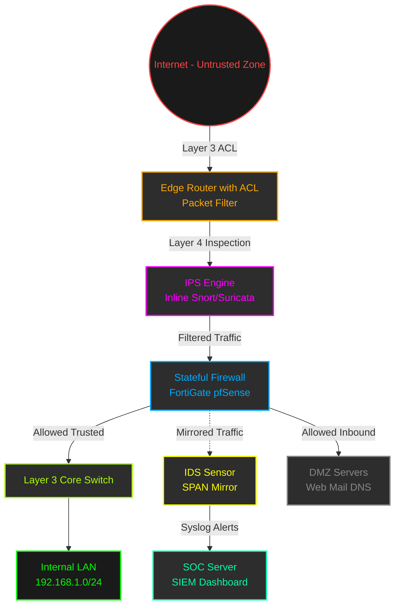
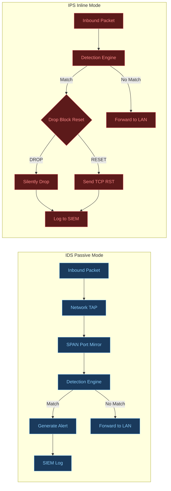
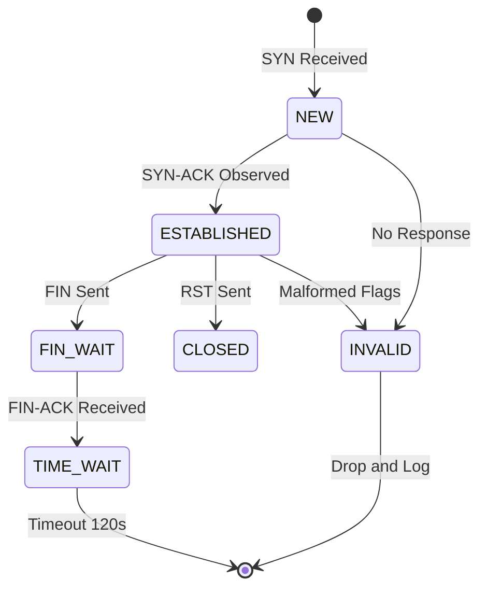
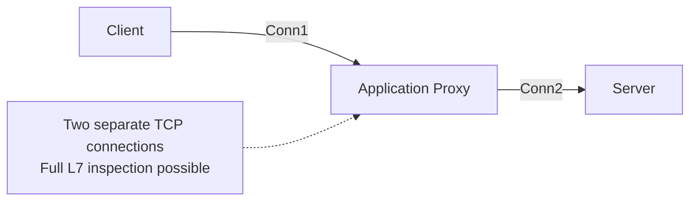
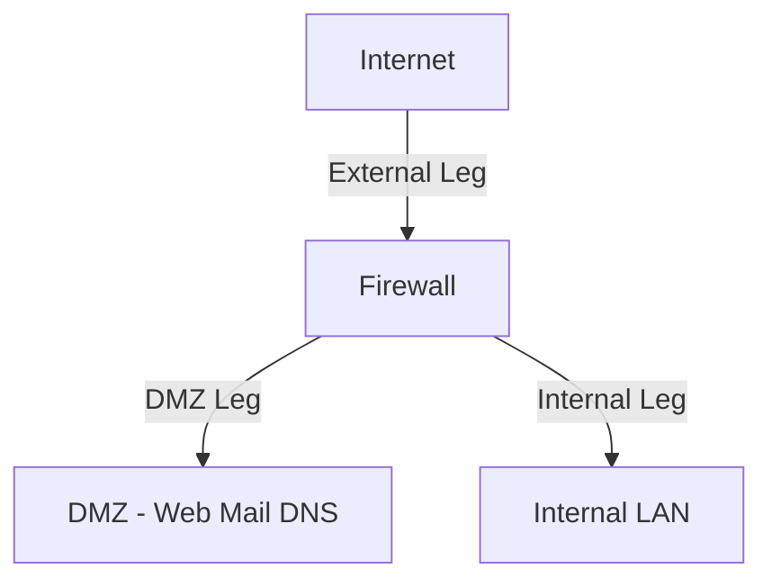

# Perimeter Defenses: Firewall architectures (Packet filtering, Stateful inspection, Application proxy), IDS/IPS

<!-- SECTION_1_START -->

# Perimeter Defenses: Firewalls and IDS/IPS

## 1.1 Core Technical Definition

**Perimeter Defense** refers to the collection of security mechanisms positioned at the boundary of a trusted internal network and an untrusted external network (typically the Internet). It forms the first line of defense in a **Defense-in-Depth (DiD)** strategy, designed to inspect, filter, and control traffic based on pre-defined security policies.

According to the **NIST SP 800-41 Rev. 1** guidelines, a **Firewall** is a device or program that controls the flow of network traffic between networks or hosts that employ differing security postures. The three classical firewall architectures recognized by the **KTU 2024 Scheme (PBCST604)** syllabus are:

1. **Packet Filtering Firewall** (Stateless Inspection)
2. **Stateful Inspection Firewall** (Circuit-level / Stateful Filtering)
3. **Application Proxy Firewall** (Application-Level Gateway / ALG)

Complementing the firewall, two reactive monitoring systems are essential:

- **Intrusion Detection System (IDS)**: A passive monitoring system that analyzes traffic for malicious activity and generates alerts.
- **Intrusion Prevention System (IPS)**: An active control system that not only detects but also blocks malicious traffic in real time.

> [!IMPORTANT]
> **KTU 2024 Syllabus Highlight (Module 2):**
> Students must be able to *differentiate* between packet filtering, stateful inspection, and application proxy firewalls. They must also clearly distinguish IDS from IPS, citing detection methodology (signature-based vs. anomaly-based) and operational mode (inline vs. passive).

> [!NOTE]
> **Key Terminology Anchor:**
> - **Trusted Zone**: Internal LAN (e.g., 192.168.1.0/24)
> - **Untrusted Zone**: Public Internet
> - **DMZ (Demilitarized Zone)**: Semi-trusted buffer network hosting public-facing servers
> - **ACL (Access Control List)**: Ordered set of permit/deny rules

## 1.2 Conceptual Analogy / Intuition

Imagine a high-security corporate office building:

- A **Packet Filtering Firewall** is like a **basic turnstile gate** that only checks your **employee badge number** and the **door you came from**. It doesn't remember if you just walked in two minutes ago.
- A **Stateful Inspection Firewall** is like a **smart security guard** who keeps a **visitor logbook**. He remembers that you entered through Gate A, so he only allows you to leave through Gate A. He tracks the **state of every connection**.
- An **Application Proxy Firewall** is like a **personal concierge**. You give him your request, he walks inside on your behalf, fetches the document, and brings it back. He never lets you talk directly to the internal mail room.

Now imagine a **CCTV camera** mounted on the wall:
- It watches everything (**IDS**), records suspicious behavior, and notifies the security desk.
- If you connect that camera to an **automatic door lock** that slams shut the moment it sees a thief (**IPS**), you have an Intrusion Prevention System.

> [!VISUALIZATION CONTROL]
> **Concept:** Firewall Position and Traffic Filtering Topology
> **GeoGebra / Desmos Input Equations:**
> * Use the Graphing Calculator to plot: $f(x) = \begin{cases} \text{ALLOW} & \text{if } x \in \text{ACL}_{\text{permit}} \\ \text{DENY} & \text{otherwise} \end{cases}$ where $x$ is the packet header tuple $(S_{IP}, D_{IP}, S_{port}, D_{port}, Protocol)$.
> **Visual Description:** Plot a step function on the x-axis where the x-coordinate represents the policy rule index $n$ (Rule 1, Rule 2, ..., Rule N) and the y-coordinate represents the action (1 = ALLOW, 0 = DENY). The first-match-wins nature of ACLs is clearly visible as a horizontal step.

<!-- SECTION_1_END -->

<!-- SECTION_2_START -->

# Deep Theoretical Analysis & KTU High-Yield Formula Sheet

## 2.1 Architecture 1: Packet Filtering Firewall (Stateless)

The oldest and fastest firewall type. It operates at **OSI Layer 3 (Network)** and **Layer 4 (Transport)**. Each packet is inspected **independently**, without any memory of previous packets.

### Operating Logic (Step-by-Step)
1. The firewall extracts the 5-tuple from the packet header: $(S_{IP}, D_{IP}, S_{port}, D_{port}, Protocol)$.
2. The 5-tuple is compared against an ordered **Access Control List (ACL)**.
3. The first matching rule is applied — this is the **First-Match-Wins** principle.
4. If no rule matches, the default policy (implicit deny) is applied.

### Advantages & Limitations

| Aspect | Detail |
|---|---|
| Speed | Extremely high throughput (hardware accelerated) |
| Cost | Low — built into most routers (e.g., Cisco ACL) |
| Visibility | Cannot inspect Layer 7 payload (e.g., HTTP URI, DNS query) |
| Vulnerability | Susceptible to **IP spoofing** and stateless attacks like **SYN flood** |

> [!NOTE]
> **Stateless Limitation Example:** A rule permitting inbound TCP to port 80 will allow ANY external host to send a TCP SYN with a spoofed source IP. The firewall has no memory that the internal host never initiated a connection to that spoofed source.

## 2.2 Architecture 2: Stateful Inspection Firewall

Introduced by **Check Point Software (Nir Zuk, 1994)**. Also called **Stateful Packet Inspection (SPI)**. It operates at Layers 3, 4, and partially 5 (Session). It maintains a **State Table** (also called the **Connection Tracking Table** or **conntrack**).

### The State Table (conntrack) Structure

$$
\text{State Entry} = \langle S_{IP}, D_{IP}, S_{port}, D_{port}, Protocol, \text{State}, \text{Timeout}, \text{Bytes} \rangle
$$

The state machine tracks TCP flags to determine the connection state. The standard states are:

- `NEW`: First packet of a connection (SYN)
- `ESTABLISHED`: Connection is open (SYN-ACK/ACK exchange complete)
- `RELATED`: Packet belongs to a new connection that is related to an existing one (e.g., FTP data channel)
- `INVALID`: Packet does not belong to any tracked connection
- `CLOSED` / `TIME_WAIT`: Termination handshake observed

### Operating Logic
1. Inspect the first packet (SYN). If it matches a `NEW` rule, create an entry in the state table.
2. For all subsequent packets in that flow, look up the state table.
3. If the packet matches an `ESTABLISHED` or `RELATED` entry, allow it without re-evaluating ACLs.
4. If `INVALID`, drop and log.

## 2.3 Architecture 3: Application Proxy Firewall (ALG)

Operates at **OSI Layer 7 (Application)**. It acts as a **man-in-the-middle** between the client and the destination server. Two distinct TCP connections are established:

$$
\text{Client} \longleftrightarrow \text{Proxy} \longleftrightarrow \text{Server}
$$

The proxy terminates the client connection, inspects the entire application payload (e.g., HTTP headers, URI, FTP commands, DNS queries), enforces protocol-specific rules, and then initiates a *separate* connection to the destination.

### Sub-Types
- **Forward Proxy**: Used for outbound traffic (clients accessing Internet).
- **Reverse Proxy**: Used for inbound traffic (clients accessing internal web servers, e.g., NGINX, HAProxy).
- **Transparent Proxy**: Intercepts traffic without requiring client configuration.

### Advantages & Limitations

| Aspect | Detail |
|---|---|
| Security | Highest — can inspect Layer 7 content, block malware in attachments, enforce DLP |
| Performance | Slower (full payload inspection) |
| Scalability | One proxy per protocol (HTTP proxy ≠ FTP proxy) |
| Compatibility | May break encrypted traffic (TLS/SSL) — requires TLS interception/MITM |

## 2.4 IDS vs. IPS: Detection Methodology

Both IDS and IPS analyze traffic using two primary detection engines:

### A. Signature-Based Detection (Misuse Detection)
- Uses a database of known attack patterns (signatures, like antivirus definitions).
- Example tools: **Snort**, **Suricata**, **Zeek**.
- Rule format follows the **Snort Rule Syntax**.

$$
\text{Alert} = \begin{cases} \text{TRUE} & \text{if } \text{sim}(\text{Packet}, \text{Signature}_i) \geq \theta \\ \text{FALSE} & \text{otherwise} \end{cases}
$$

Where $\text{sim}$ is a pattern-matching function (often Aho-Corasick or Boyer-Moore) and $\theta$ is the match threshold.

### B. Anomaly-Based Detection
- Builds a statistical profile of "normal" traffic (e.g., mean packet size, connection rate).
- Triggers an alert when deviation exceeds a threshold.

$$
\text{Anomaly Score} = \frac{\vert x_i - \mu \vert}{\sigma}
$$

If score $> 3$, flag as anomaly (3-sigma rule).

### IDS vs IPS — Operational Difference

| Parameter | IDS (Intrusion Detection System) | IPS (Intrusion Prevention System) |
|---|---|---|
| Mode | **Passive** (out-of-band, mirrored traffic) | **Active** (inline, in the data path) |
| Action | Alerts, logs, emails | Drops, blocks, resets TCP connection |
| Failure Impact | Failure = blind spot (no traffic disruption) | Failure = network outage (single point of failure) |
| Placement | TAP or Switch Port Analyzer (SPAN) mirror | Inline with firewall |
| Latency | Low (copy of traffic) | Higher (every packet must pass through) |
| Example | Snort (IDS mode), OSSEC | Suricata (IPS mode), Cisco Firepower |

> [!IMPORTANT]
> **IPS Deployment Note:** Because an IPS is in the data path, it must be deployed in **fail-open** mode (allows traffic on hardware failure) for availability-critical networks, or **fail-closed** for high-security enclaves. This is a common 3-mark KTU question.

## 2.5 KTU High-Yield Formula Sheet & Comparison Table

| Feature | Packet Filter | Stateful Inspection | Application Proxy | IDS | IPS |
|---|---|---|---|---|---|
| **OSI Layer** | L3, L4 | L3, L4, L5 | L7 (App) | L2–L7 | L2–L7 |
| **State Awareness** | None (Stateless) | Full conntrack table | Full app session | Stateful | Stateful |
| **Payload Inspection** | No | No (basic) | Yes (deep) | Yes | Yes |
| **Performance** | Very High | High | Low–Medium | Medium | Medium |
| **Spoofing Defense** | Weak | Strong | Strong | Detects | Detects + Blocks |
| **Encryption Handling** | N/A | N/A | Requires MITM cert | Inline (TLS termination) | Inline (TLS termination) |
| **Example** | Linux `iptables`, Cisco ACL | Linux `nftables`, pfSense, Check Point | Squid (HTTP), HAProxy, NGINX | Snort (passive) | Suricata (inline) |
| **Default Action** | Implicit DENY | Implicit DENY | Per-protocol DENY | Alert | DROP / RESET |

### Real-World Engineering Utility

- **Packet Filtering**: Embedded in every ISP edge router. First line of mass filtering.
- **Stateful Inspection**: Default in modern enterprise firewalls (Fortinet FortiGate, Palo Alto, pfSense).
- **Application Proxy**: Used in **Cloud WAF (Web Application Firewalls)** such as AWS WAF, Cloudflare, Akamai to protect against **OWASP Top 10** (SQLi, XSS).
- **IDS**: Deployed in **SOC (Security Operations Centers)** for forensic analysis and compliance (PCI-DSS, ISO 27001 mandate logging).
- **IPS**: Deployed inline at **data center edges** to block known exploits in real time (e.g., **WannaCry**, **EternalBlue** signatures).

<!-- SECTION_2_END -->

<!-- SECTION_3_START -->

# Step-by-Step Derivations & Code/Symbolic Implementation

## 3.1 Lab 1: Linux Packet Filtering with `iptables`

The Linux kernel's `netfilter` framework implements a stateful inspection firewall. Below is a fully commented, production-grade script for a typical KTU lab exercise.

```bash
#!/bin/bash
# ============================================================
# File: perimeter_firewall.sh
# Purpose: Stateful firewall configuration for a Linux gateway
# Course: PBCST604 - Fundamentals of Cyber Security
# ============================================================

# 1. Flush all existing rules to start from a clean slate
iptables -F
iptables -X
iptables -t nat -F
iptables -t mangle -F

# 2. Set default (implicit) policies
iptables -P INPUT   DROP
iptables -P FORWARD DROP
iptables -P OUTPUT  ACCEPT

# 3. Enable kernel-level state tracking (loads conntrack module)
modprobe nf_conntrack
echo 1 > /proc/sys/net/ipv4/ip_forward

# 4. Allow loopback traffic (essential for local services)
iptables -A INPUT  -i lo -j ACCEPT
iptables -A OUTPUT -o lo -j ACCEPT

# 5. Allow established and related connections (THE STATEFUL RULE)
#    This single rule permits ALL response traffic for sessions
#    initiated by the internal host.
iptables -A INPUT -m state --state ESTABLISHED,RELATED -j ACCEPT
iptables -A FORWARD -m state --state ESTABLISHED,RELATED -j ACCEPT

# 6. Allow SSH (TCP/22) from internal network 192.168.1.0/24 only
iptables -A INPUT -p tcp -s 192.168.1.0/24 --dport 22 \
         -m state --state NEW -j ACCEPT

# 7. Allow inbound HTTP (TCP/80) and HTTPS (TCP/443) to DMZ server
iptables -A FORWARD -p tcp -d 10.10.10.0/24 \
         --match multiport --dports 80,443 \
         -m state --state NEW,ESTABLISHED,RELATED -j ACCEPT

# 8. Anti-spoofing rule: drop packets claiming to be from internal
#    networks that arrive on the external interface (eth1)
iptables -A INPUT -i eth1 -s 192.168.0.0/16 -j DROP
iptables -A INPUT -i eth1 -s 10.0.0.0/8      -j DROP
iptables -A INPUT -i eth1 -s 127.0.0.0/8     -j DROP

# 9. Log all dropped packets for forensic analysis (rate-limited)
iptables -A INPUT -m limit --limit 5/min -j LOG \
         --log-prefix "DROPPED-INPUT: " --log-level 4

# 10. Verify the active rule set
iptables -L -n -v --line-numbers
```

### Detailed Walkthrough of Each Line
- **Step 1** clears all custom chains to ensure reproducibility in lab exams.
- **Step 2** applies the **Default-Deny** principle — the most secure posture.
- **Step 5** is the *defining* line of stateful inspection. Without it, the firewall would be stateless.
- **Step 8** demonstrates a **stateless anti-spoofing rule** that even stateful firewalls still need.

## 3.2 Lab 2: Snort IDS Rule Authoring

Snort is the de-facto open-source IDS. Its rules are evaluated top-to-bottom (first-match-wins like ACLs).

```
# ============================================================
# File: /etc/snort/rules/local.rules
# ============================================================

# Rule 1: Detect ICMP ping sweeps (reconnaissance)
alert icmp 10.10.10.0/24 any -> $HOME_NET any \
  (msg:"ICMP Ping Detected"; \
   itype:8; \
   sid:1000001; rev:1; \
   classtype:icmp-event;)

# Rule 2: Detect a buffer overflow attempt in HTTP URIs
alert tcp $EXTERNAL_NET any -> $HOME_NET 80 \
  (msg:"HTTP NOP-sled Buffer Overflow Attempt"; \
   flow:to_server,established; \
   content:"|90 90 90 90 90|"; \
   http_uri; \
   classtype:web-application-attack; \
   sid:1000002; rev:1;)

# Rule 3: Detect Telnet login attempt (insecure protocol abuse)
alert tcp $EXTERNAL_NET any -> $HOME_NET 23 \
  (msg:"TELNET Login Attempt - Possible Brute Force"; \
   flow:to_server,established; \
   content:"login"; nocase; \
   threshold:type both, track by_src, count 5, seconds 60; \
   sid:1000003; rev:1;)
```

### Rule Header vs. Rule Options — Detailed Breakdown

| Field | Value in Rule 2 | Meaning |
|---|---|---|
| Action | `alert` | Generate alert (other options: `log`, `drop`, `reject`, `sdrop`) |
| Protocol | `tcp` | Matches L4 protocol |
| Source | `$EXTERNAL_NET any` | Any external IP, any port |
| Direction | `->` | Unidirectional flow |
| Destination | `$HOME_NET 80` | Internal web server, port 80 |
| `flow:to_server,established` | State context | Only inspect established connections to the server |
| `content:"\|90 90 90 90 90\|"` | Binary pattern (hex) | NOP-sled signature of a shellcode exploit |
| `http_uri` | Modifier | Only search the URI buffer (not raw payload) |
| `sid:1000002` | Snort ID | Unique rule identifier (must be $\geq 1000000$ for local rules) |
| `classtype` | Category | Used for priority weighting |

## 3.3 Architectural Decision Table: When to Use What

| Scenario | Recommended Defense |
|---|---|
| ISP-grade edge router, 10 Gbps link, basic filtering | **Packet Filter** (line-rate hardware ACL) |
| Enterprise perimeter with thousands of concurrent flows | **Stateful Inspection** (FortiGate, Palo Alto) |
| Public-facing e-commerce website with PCI-DSS | **Reverse Application Proxy** (Cloudflare, AWS WAF) + **Stateful** backend |
| SOC requiring forensic visibility and SIEM integration | **IDS (Snort)** with SPAN port mirror |
| Datacenter protecting against zero-day exploits and WannaCry | **IPS (Suricata inline)** with signature feed |
| IoT/OT network where patch cycles are long | **IPS** with virtual patching (Trend Micro, Claroty) |

<!-- SECTION_3_END -->

<!-- SECTION_4_START -->

# Structural Diagrams & Schematics

## 4.1 Mermaid Diagram 1: Enterprise Perimeter Defense Topology



## 4.2 Mermaid Diagram 2: IDS vs IPS Operational Flow



## 4.3 Mermaid Diagram 3: TCP State Machine Tracked by Stateful Firewall



## 4.4 Sequential Processing Topology Matrix

| Stage | Component | OSI Layer | Action | Performance Cost |
|---|---|---|---|---|
| 1 | Edge Router ACL | L3/L4 | Stateless deny of RFC 1918, broadcast, multicast | Negligible (ASIC) |
| 2 | IPS Engine | L2–L7 | Deep packet inspection, signature matching | 200–800 µs per packet |
| 3 | Stateful Firewall | L3/L5 | Conntrack lookup, policy enforcement | 50–200 µs per packet |
| 4 | Application Proxy | L7 | Protocol parsing, DLP, TLS interception | 1–10 ms per request |
| 5 | IDS (Out-of-band) | L2–L7 | Forensics, behavioral baselining | No impact on live traffic |

<!-- SECTION_4_END -->

<!-- SECTION_5_START -->

# KTU 2024 Scheme Examination Question Bank & Topic Recap

## 5.1 Part A Questions (3 Marks Each)

### Question 1 [KTU University Exam - July 2024, Model Question Paper]
**Differentiate between a Packet Filtering Firewall and a Stateful Inspection Firewall. Mention any two advantages of stateful inspection over stateless filtering.** *(CO2, Understand)*

**Model Answer (3 Marks Distribution):**
- **[1 Mark]** Packet filtering inspects each packet in isolation (stateless) using only header fields $(S_{IP}, D_{IP}, S_{port}, D_{port}, Protocol)$. It cannot determine whether a packet belongs to a legitimate ongoing session.
- **[1 Mark]** Stateful inspection maintains a state table (conntrack) that records the status of every TCP/UDP connection (NEW, ESTABLISHED, RELATED, INVALID). It tracks the 3-way handshake and only allows response packets that belong to a tracked session.
- **[1 Mark]** *Two advantages:*
    1. Defeats IP spoofing and SYN flood attacks (because unsolicited packets are not in the state table).
    2. Supports complex protocols like FTP that use dynamic ports (RELATED state tracking).

---

### Question 2 [KTU University Exam - Dec 2023]
**Explain the fundamental operational difference between an Intrusion Detection System (IDS) and an Intrusion Prevention System (IPS). Which one is deployed inline and why?** *(CO2, Understand)*

**Model Answer (3 Marks Distribution):**
- **[1 Mark]** An IDS is a **passive** monitoring system. It receives a copy of network traffic via a SPAN port or network TAP, analyzes it for malicious patterns, and generates alerts/logs. It **does not sit in the data path** and cannot block traffic.
- **[1 Mark]** An IPS is an **active** control system. It is deployed **inline** (in the actual data flow path) and can **drop, block, or reset** malicious packets in real time before they reach the target.
- **[1 Mark]** The IPS is deployed inline because, unlike an IDS which only needs visibility, an IPS must be able to **physically interrupt the packet flow** to enforce prevention. This is why IPS devices must support **fail-open** behavior to avoid becoming a single point of failure.

---

## 5.2 Part B Questions (14 Marks Each) — Module Internal Choice

### Question A (14 Marks) [KTU University Exam - July 2024, Model Paper]

**(a) [7 Marks]** With a neat diagram, explain the three classical firewall architectures: Packet Filtering, Stateful Inspection, and Application Proxy. For each, specify the OSI layer, one advantage, and one limitation. *(CO2, Understand)*

**(b) [7 Marks]** An organization has the IP block 203.0.113.0/24. Design a set of stateful `iptables` rules to achieve the following:
- Block all inbound traffic by default.
- Allow established and related connections to return.
- Permit inbound HTTP (port 80) and HTTPS (port 443) to a public web server at 203.0.113.50.
- Permit inbound SSH (port 22) only from the admin workstation 198.51.100.25.
- Log all dropped packets with the prefix "FIREWALL-DROP". *(CO3, Apply)*

---

### Model Answer for Question A (a) — 7 Marks

**[1 Mark — Packet Filtering (OSI L3/L4)]** Packet filtering examines the 5-tuple of each packet against a static rule list. It is the fastest firewall but cannot inspect the payload or remember previous packets.

**[1 Mark — Advantage/Limitation]** Advantage: extremely fast (hardware-accelerated). Limitation: vulnerable to IP spoofing and stateless attacks.

**[1 Mark — Stateful Inspection (OSI L3/L4/L5)]** Maintains a state table (conntrack) that records the state of every connection. It uses the `NEW`, `ESTABLISHED`, `RELATED`, `INVALID` state machine.

**[1 Mark — Advantage/Limitation]** Advantage: blocks SYN floods and spoofed packets. Limitation: still cannot inspect Layer 7 payload.

**[1 Mark — Application Proxy (OSI L7)]** Terminates the client connection, inspects the full application payload, and creates a second connection to the destination. It acts as a man-in-the-middle.

**[1 Mark — Advantage/Limitation]** Advantage: deep payload inspection, DLP, blocks application-layer attacks (SQLi, XSS). Limitation: high latency, requires per-protocol proxies.

**[1 Mark — Diagram]**



---

### Model Answer for Question A (b) — 7 Marks

```bash
# 1. Flush and set default-deny policies  [1 Mark]
iptables -F
iptables -P INPUT   DROP
iptables -P FORWARD DROP
iptables -P OUTPUT  ACCEPT

# 2. Allow loopback  [1 Mark]
iptables -A INPUT -i lo -j ACCEPT

# 3. Stateful rule for return traffic  [1 Mark]
iptables -A INPUT -m state --state ESTABLISHED,RELATED -j ACCEPT

# 4. Allow HTTP and HTTPS to web server  [2 Marks]
iptables -A INPUT -p tcp -d 203.0.113.50 \
         --match multiport --dports 80,443 \
         -m state --state NEW -j ACCEPT

# 5. Allow SSH only from admin workstation  [1 Mark]
iptables -A INPUT -p tcp -s 198.51.100.25 --dport 22 \
         -m state --state NEW -j ACCEPT

# 6. Log and drop everything else  [1 Mark]
iptables -A INPUT -m limit --limit 5/min -j LOG \
         --log-prefix "FIREWALL-DROP: "
iptables -A INPUT -j DROP
```

---

### Question B (14 Marks) Alternative [KTU University Exam - Dec 2023]

**(a) [7 Marks]** What is a Demilitarized Zone (DMZ)? With a neat three-legged firewall diagram, explain how a DMZ protects internal servers while hosting public services. Why is the IDS placed on the SPAN port of the firewall rather than inline? *(CO2, Understand)*

**(b) [7 Marks]** Write a Snort rule to detect an SQL injection attempt targeting the URI of a web application. The web server is at 203.0.113.100. The attack signature is the string `UNION SELECT` appearing in the URI, case-insensitive. The rule must generate an alert with message "SQL Injection Attempt Detected" and SID 1000005. Explain each field of your rule. *(CO3, Apply)*

---

### Model Answer for Question B (a) — 7 Marks

**[1 Mark — Definition]** A DMZ is a perimeter network segment that sits between the untrusted Internet and the trusted internal LAN. It hosts public-facing services (web, mail, DNS) that must be reachable from outside.

**[3 Marks — Diagram]** A three-legged firewall has three interfaces: External (untrusted), DMZ (semi-trusted), Internal (trusted). The firewall enforces distinct rule sets for each leg.



**[2 Marks — Why IDS is on SPAN Port]** The IDS is placed on the **SPAN (Switched Port Analyzer)** port of the firewall (or inline via a TAP) because:
1. It is **non-disruptive** — a failed IDS does not bring down the network.
2. It allows **forensic analysis** of malicious traffic that *did* pass through, useful for post-incident review.
3. It provides **full visibility** of inter-zone traffic without affecting latency.

**[1 Mark — Protection Logic]** If a DMZ web server is compromised, the attacker still cannot reach the internal LAN because the firewall's internal leg enforces strict deny-by-default rules for traffic originating from the DMZ.

---

### Model Answer for Question B (b) — 7 Marks

```
# Complete Snort Rule  [2 Marks]
alert tcp $EXTERNAL_NET any -> 203.0.113.100 80 \
  (msg:"SQL Injection Attempt Detected"; \
   flow:to_server,established; \
   content:"UNION SELECT"; nocase; \
   http_uri; \
   classtype:web-application-attack; \
   sid:1000005; rev:1;)
```

**Field-by-Field Explanation [5 Marks — 1 Mark each group]:**
1. **Header (alert tcp ... -> 203.0.113.100 80):** Defines the action (alert), protocol (TCP), source (any external host), and destination (web server on HTTP port 80).
2. **`flow:to_server,established`:** Optimizes the rule by only inspecting client-to-server traffic in established sessions, avoiding false positives on server responses.
3. **`content:"UNION SELECT"; nocase;`:** The signature to match. `nocase` makes it case-insensitive (matches `union select`, `Union Select`, etc.).
4. **`http_uri;`:** Restricts the content match to the **HTTP URI buffer** only, preventing false positives in packet headers or other payload areas.
5. **`classtype` and `sid`:** `classtype` categorizes the alert for priority weighting. `sid:1000005` is a unique local rule ID (SIDs $\geq 1000000$ are reserved for user-defined rules).

---

> [!WARNING]
> **KTU Examiner's Valuation Warning — Common Pitfalls**
> 1. **Do not forget the Stateful rule** (`-m state --state ESTABLISHED,RELATED -j ACCEPT`). Without it, the firewall becomes effectively stateless, and no return traffic will be allowed. This alone can cost **2–3 marks**.
> 2. **Do not use `--dport` without specifying `-p tcp/udp`.** Modern `iptables` requires explicit protocol matching. The correct syntax is `iptables -A INPUT -p tcp --dport 80 -j ACCEPT`.
> 3. **Snort rules require a semicolon after every option.** A missing semicolon causes the entire rule to fail to load silently.
> 4. **For DMZ diagrams, always label all three legs** (External, DMZ, Internal). Examiners award a mark specifically for showing the three-legged topology.
> 5. **Do not confuse IDS with IPS placement.** If a question asks for *prevention*, you must justify **inline** deployment. If it asks for *detection*, justify **passive/SPAN/TAP** deployment.

---

## 5.3 Topic Recap & Important Things to Remember

- **Defense in Depth (DiD)**: Perimeter defense is the *first* layer, not the *only* layer. Combine with endpoint security, EDR, SIEM, and zero-trust.
- **Default Deny**: The most secure firewall posture. Only allow what is explicitly permitted.
- **First-Match-Wins**: ACLs and Snort rules are evaluated top-to-bottom. Order matters critically.
- **Stateful vs Stateless — Key Differentiator**: Presence of a **conntrack table**. If you see `state ESTABLISHED,RELATED` in a rule, it is stateful.
- **Application Proxy = Two TCP Connections**: Client↔Proxy and Proxy↔Server. This is the defining architectural trait.
- **IDS = Passive, IPS = Active**: IDS watches and alerts; IPS watches and **acts** (drops/resets).
- **IPS Failure Mode**: Must be **fail-open** in production (default), **fail-closed** in high-security enclaves.
- **Signature vs Anomaly**: Signature-based needs an updated rule database (like antivirus). Anomaly-based needs a learning period and produces more false positives.
- **DMZ Purpose**: Isolates public-facing servers so a compromise does not pivot into the LAN.
- **SPAN/TAP for IDS**: These are the two methods to provide a copy of traffic to an out-of-band IDS.
- **`iptables` modules to remember**: `state`, `multiport`, `limit`, `mac`, `iprange`, `comment`.
- **Snort rule fields to remember**: `msg`, `sid` ($\geq 1000000$ for local), `rev`, `classtype`, `content`, `nocase`, `http_uri`, `flow`, `threshold`.
- **Standard Ports (KTU favorites)**: HTTP=80, HTTPS=443, SSH=22, FTP=21, Telnet=23, DNS=53, SMTP=25.
- **Key Performance Trade-off**: As you move from Packet Filter → Stateful → Application Proxy, **security increases but throughput decreases**.
- **Encryption Caveat**: None of these firewalls can inspect **TLS-encrypted** payload without performing **TLS interception** (deploying a CA cert and re-encrypting). This is why **Cloud WAFs** require DNS or BGP rerouting to terminate TLS at the edge.

<!-- SECTION_5_END -->
