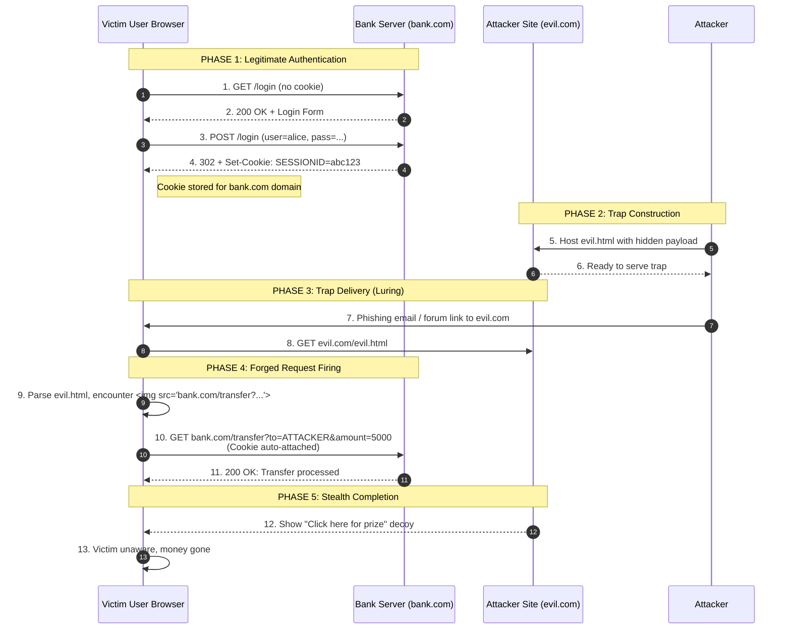
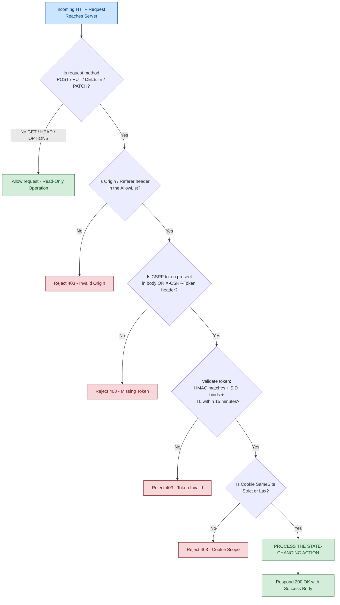
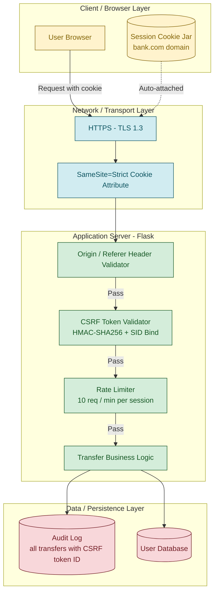

# Cross-Site Request Forgery (CSRF)

<!-- SECTION_1_START -->
# Cross-Site Request Forgery (CSRF)

## 1.1 Formal Academic Definition

> [!NOTE]
> **Cross-Site Request Forgery (CSRF / XSRF / Sea-Surf / Session Riding)** is a client-side state-altering web security vulnerability in which an attacker covertly tricks the browser of an **authenticated, currently logged-in user** into transmitting a **forged, malicious HTTP request** to a target web application. The victim's browser automatically appends valid session credentials (cookies, HTTP auth headers, basic auth tokens) to the request, causing the target server to process the attacker-supplied action as if it were a **legitimate, user-initiated request**.

In the KTU 2024 Scheme syllabus context, CSRF is classified under **Module 2: Web Security** as a **server-side trust exploitation vulnerability** that abuses the implicit trust a web application places in the user's browser session, rather than breaking any cryptographic primitive.

> [!IMPORTANT]
> **Core Difference from XSS:** CSRF does **not** require reading or stealing user data — it merely **replays or piggybacks** an authenticated state to perform an *unintended* state change. XSS steals/trusts content inside the page; CSRF trusts the *origin* of the browser.

---

## 1.2 Conceptual Analogy & Intuitive Overview

**Analogy — The "Forged Cheque" Model:**

Imagine you are at a coffee shop and you have signed a **blank cheque** and given it to the cashier earlier (your session cookie is stored). An attacker walks in, fills the cheque with their own payee name and amount, and slips it back into the chequebook slot. The bank (the server) sees your valid signature, valid cheque, valid cookie — and happily processes the transfer. You never knew.

| Real-World Element | CSRF Equivalent |
|---|---|
| Blank signed cheque | Browser auto-attached session cookie |
| The shopkeeper who hands the cheque over | The malicious web page / email link |
| The bank's trust in the signature | Server's trust in the session cookie |
| Your signed name being on file | Authentication token / session ID |

> [!IMPORTANT]
> **The Three-Prerequisite Rule (a CSRF is only possible when ALL are true):**
> 1. **A relevant action** — the target site has a state-changing endpoint (transfer, change email, post comment).
> 2. **Cookie-based session handling** — the site relies solely on session cookies sent automatically by the browser.
> 3. **No unpredictable request parameters** — the request can be fully constructed by the attacker without knowing any secret the user has.

---

## 1.3 Glossary of Standard Metrics & Tokens

> [!NOTE]
> **Standard CSRF Defense Tokens:** A cryptographically random, per-session (or per-request) value generated by the server and embedded in forms/AJAX headers. Validated on submission to confirm the request originated from a legitimate page rendered by the application.
> - **Typical Entropy:** **128 bits** (e.g., `a3f1...` 32-hex-char nonce)
> - **OWASP Minimum:** **64 bits** of entropy
> - **CSRF Token Field Names (common):** `_csrf`, `csrfmiddlewaretoken`, `authenticity_token`, `__RequestVerificationToken`
> - **Hidden Form Field:** `<input type="hidden" name="csrf_token" value="..."/>`

---

## 1.4 GeoGebra / Visualization Insight

> [!VISUALIZATION CONTROL]
> **Concept:** CSRF Attack Trust-Vector Mapping (Origin vs. Destination)
> **Visualization Type:** Coordinate plane showing the *origin domain* (x-axis) and *target domain* (y-axis) with a transversal attack vector.
> **Mathematical Mapping:**
> * Trusted origin: $V_{auth} = \{ d \in \text{Domains} \mid \text{cookie}(d) = \text{cookie}_{user} \}$
> * Attack origin: $V_{evil} = \{ d \in \text{Domains} \mid d \neq \text{origin} \}$
> * CSRF condition: $\text{cookie}(V_{auth}) \cap \text{request}(V_{evil}) \neq \emptyset$
> **Visual Description:** Plot two distinct points on the X-axis (evil.com and bank.com). Draw an arrow from the attacker's server to the user's browser, then a second arrow from the user's browser to the vulnerable bank endpoint. The cookie is depicted as a colored badge automatically attaching itself to the second arrow — even though the *first* arrow initiated the trip.
<!-- SECTION_1_END -->

<!-- SECTION_2_START -->
# Deep Theoretical Analysis & KTU High-Yield Reference

## 2.1 Anatomy of a CSRF Attack — Step-by-Step Operational Logic

A successful CSRF transaction unfolds through the following structured stages:

1. **Reconnaissance (Pre-attack):**
   Attacker identifies a target web application (e.g., `bank.com`) and locates a state-changing endpoint that performs an action using **only** session cookies for authentication, e.g.:

   `GET https://bank.com/transfer?to=ATTACKER&amount=5000`

   `POST https://bank.com/transfer` with body `to=ATTACKER&amount=5000`

2. **Victim Authentication:**
   The victim logs into `bank.com` using valid credentials. The server responds with `Set-Cookie: SESSIONID=abc123; Path=/`. This cookie is stored in the browser under the `bank.com` domain.

3. **Trap Deployment:**
   While the victim is *still logged in*, the attacker lures them to a malicious page (phishing email, forum post, hidden iframe, image tag). The malicious page contains a hidden HTML element that auto-fires a request to `bank.com`.

4. **Forced Browser Dispatch:**
   The victim's browser, when rendering the malicious page, **unconsciously** sends a request to `bank.com`. Because the cookie domain matches, the browser **automatically appends** the `SESSIONID=abc123` cookie — no JavaScript is even required (a `` or auto-submitting form works).

5. **Server-Side Trust Misuse:**
   The `bank.com` server receives the request, sees a valid session cookie, processes the transfer, and replies with `HTTP 200 OK`. The victim has lost money, never having clicked anything visible.

6. **Stealth Completion:**
   The attacker's page may simply redirect to a normal site, leaving no visible trace to the victim.

---

## 2.2 CSRF Attack Vectors — Comprehensive Classification

| Vector | HTTP Method | Mechanism | Server-Side Defense |
|---|---|---|---|
| **GET-based** | GET | Hidden ``, `<iframe>`, `<script src=...>` | Avoid state changes in GET (RFC 7231 §4.2.1) |
| **POST-based** | POST | Auto-submitting hidden form (`<form auto-submit>`) | CSRF token validation on POST |
| **JSON / API-based** | POST/PUT/DELETE | `fetch` / `XMLHttpRequest` with `credentials: include` | Custom `X-CSRF-Token` header validation |
| **Same-Site Form Submit** | POST | Form hosted on attacker page targeting victim origin | Origin / Referer header check |
| **Login CSRF (Session Fixation variant)** | POST | Force victim to log into attacker's account | Re-authentication for sensitive ops |
| **CSRF via XSS Hybrid** | Any | Stored XSS in trusted domain abuses same-origin trust | Comprehensive XSS sanitization + CSP |

---

## 2.3 CSRF vs. Related Vulnerabilities — Comparative Matrix

> [!IMPORTANT]
> **Mandatory Comparison for KTU Board Questions:**
> Examiners frequently test the differences between CSRF, XSS, and SSRF. Memorize the *direction* and *target* of each attack.

| Property | **CSRF** | **XSS (Cross-Site Scripting)** | **SSRF (Server-Side Request Forgery)** |
|---|---|---|---|
| **Attack Direction** | Victim's browser → Target server | Attacker → Victim's browser | Attacker → Server → Internal resource |
| **Trust Exploited** | Server trusts user's session | Browser trusts server's content | Server trusts internal network boundaries |
| **Primary Damage** | Unintended state change | Data theft, session hijack, defacement | Internal port scanning, cloud metadata theft |
| **Code Execution** | No | Often yes (JavaScript) | No (but arbitrary HTTP) |
| **Defense** | CSRF tokens, SameSite cookies | Output encoding, CSP | Network segmentation, allowlist URLs |

---

## 2.4 KTU High-Yield Formula Sheet — CSRF Defense Equation

> [!NOTE]
> **The "Valid Request" Predicate for CSRF-Safe Endpoints**

A request $R$ originating from browser context $B$ targeting endpoint $E$ is **CSRF-safe** if and only if it satisfies *all* of the following security predicates:

$$
\text{CSRF\_Safe}(R) \iff
\begin{cases}
\exists \, T_{csrf} : \text{verify}(T_{csrf}, \, \text{server\_secret}) = \text{true} & \text{(Token validation)} \\
\text{Cookie.SamSite} \in \{\text{Strict}, \text{Lax}\} & \text{(Cookie scoping)} \\
\text{Header.Origin} \in \text{AllowList}(E) \lor \text{Header.Referer} \in \text{AllowList}(E) & \text{(Origin check)} \\
\text{Content-Type} \neq \text{application/x-www-form-urlencoded} \lor \text{PreflightSucceeded} & \text{(CORS preflight)} \\
\end{cases}
$$

**Token Generation Formula:**

$$
T_{csrf} = \text{Base64}\left( \text{HMAC}_{K_{server}}\left( \text{SessionID} \, \Vert \, \text{Nonce}_r \, \Vert \, \text{Timestamp}_t \right) \right)
$$

| Symbol | Meaning | Standard Value |
|---|---|---|
| $K_{server}$ | Server-side HMAC secret key | 256-bit symmetric key, rotated periodically |
| $\text{Nonce}_r$ | Per-request random nonce | 128 bits (CSPRNG output) |
| $\text{Timestamp}_t$ | Token generation timestamp | Unix epoch, ± validity window of **15 minutes** |
| $T_{csrf}$ | Resulting CSRF token | Base64 URL-safe encoded string, ~44 characters |
| $\text{SessionID}$ | User's authenticated session ID | 128 bits (per OWASP) |

---

## 2.5 Real-World Engineering Utility

- **Banking & FinTech:** Transfer endpoints, beneficiary changes, loan applications must implement CSRF tokens.
- **E-Commerce:** Cart modifications, address changes, order cancellations.
- **Social Media:** Auto-posting tweets, friending, profile edits (2018 Facebook CSRF via Graph API).
- **Cloud Administration:** AWS / GCP / Azure portal API endpoints (mitigated today by `SameSite=Lax` cookies).
- **Production Frameworks:** Django (auto-emits `csrfmiddlewaretoken`), Spring Security (`CsrfTokenRepository`), Express.js (`csurf` / `csrf-csrf` packages), Ruby on Rails (`protect_from_forgery`).

<!-- SECTION_2_END -->

<!-- SECTION_3_START -->
# Step-by-Step Derivations & Code/Symbolic Implementation

## 3.1 Case Study 1 — The Vulnerable Flask Endpoint (Before Hardening)

The following Flask application contains a **classic CSRF-vulnerable** state-changing endpoint. It performs a fund transfer using *only* the session cookie for authentication, with no CSRF token verification.

```python
"""
vulnerable_bank.py  -- INTENTIONALLY VULNERABLE FOR TEACHING
KTU 2024 Scheme | PBCST604 | Module 2 - CSRF
"""
from flask import Flask, request, session, redirect, url_for, render_template_string

app = Flask(__name__)
app.secret_key = "INSECURE_DEMO_KEY_DO_NOT_USE_IN_PROD"

# Mock database
USERS = {
    "alice": {"password": "alice123", "balance": 10000}
}

LOGIN_PAGE = """
<form method="POST" action="/login">
  <input name="user" placeholder="username">
  <input name="pass" type="password">
  <button type="submit">Login</button>
</form>
"""

DASHBOARD_PAGE = """
<h2>Welcome {{ user }}</h2>
<p>Balance: ${{ balance }}</p>
<form method="GET" action="/transfer">
  <input name="to" placeholder="recipient">
  <input name="amount" placeholder="amount">
  <button type="submit">Transfer</button>
</form>
"""

@app.route("/", methods=["GET"])
def index():
    return redirect(url_for("login"))

@app.route("/login", methods=["GET", "POST"])
def login():
    if request.method == "POST":
        u = request.form.get("user")
        p = request.form.get("pass")
        if USERS.get(u) and USERS[u]["password"] == p:
            session["user"] = u
            return redirect(url_for("dashboard"))
        return "Invalid credentials", 401
    return LOGIN_PAGE

# VULNERABILITY: No CSRF token check, GET-based state change
@app.route("/transfer", methods=["GET"])
def transfer():
    if "user" not in session:
        return "Not authenticated", 401
    recipient = request.args.get("to")
    amount = int(request.args.get("amount", 0))
    USERS[session["user"]]["balance"] -= amount
    return f"Transferred ${amount} to {recipient}. New balance: ${USERS[session['user']]['balance']}"

@app.route("/dashboard", methods=["GET"])
def dashboard():
    if "user" not in session:
        return redirect(url_for("login"))
    u = session["user"]
    return render_template_string(DASHBOARD_PAGE, user=u, balance=USERS[u]["balance"])

if __name__ == "__main__":
    app.run(debug=True)
```

---

## 3.2 The Attacker's Malicious HTML Payload

This HTML is hosted on `evil.com` and triggers the CSRF when the victim (logged into `bank.com`) opens it. **No JavaScript required** — a hidden image tag is sufficient.

```html
<!-- evil.html — hosted on attacker-controlled domain -->
<html>
  <body>
    <h1>You won a free iPhone! Click here to claim.</h1>

    <!-- Method 1: GET-based via image tag (zero-byte pixel) -->
    

    <!-- Method 2: Auto-submitting hidden form (POST variant) -->
    <!--
    <form id="evil" action="https://bank.com/transfer" method="POST">
      <input name="to" value="ATTACKER_ACCT" />
      <input name="amount" value="5000" />
    </form>
    <script>document.getElementById("evil").submit();</script>
    -->
  </body>
</html>
```

When the victim loads this page, the browser:
1. Resolves `https://bank.com/transfer?to=ATTACKER_ACCT&amount=5000`
2. Sees the request is to the `bank.com` domain — automatically attaches the `SESSIONID=...` cookie
3. `bank.com` processes the request, finds a valid session, and executes the transfer

---

## 3.3 Case Study 2 — Hardened Flask Endpoint with Full CSRF Defense Stack

The following implementation hardens the same application using **four independent CSRF defense layers** (defense in depth).

```python
"""
secure_bank.py  -- FULLY HARDENED CSRF-DEFENDED APPLICATION
KTU 2024 Scheme | PBCST604 | Module 2 - CSRF
Defense Layers:
  1. Per-session synchronizer CSRF token (HMAC-SHA256)
  2. SameSite=Strict session cookie
  3. Origin/Referer header validation
  4. POST-only state changes (no GET transfers)
"""
import hmac
import hashlib
import secrets
import base64
import time
from functools import wraps
from flask import (
    Flask, request, session, redirect, url_for,
    render_template_string, abort, make_response
)

app = Flask(__name__)
app.secret_key = "REPLACE_WITH_32_BYTE_RANDOM_KEY_IN_PROD"  # Set via env
app.config.update(
    SESSION_COOKIE_HTTPONLY=True,
    SESSION_COOKIE_SECURE=True,
    SESSION_COOKIE_SAMESITE="Strict",   # Layer 2
    PERMANENT_SESSION_LIFETIME=900,     # 15-minute idle timeout
)

USERS = {
    "alice": {"password": "alice123", "balance": 10000}
}

# ------------------------------------------------------------------
# Layer 1: CSRF token generation & validation
# ------------------------------------------------------------------
TOKEN_TTL_SECONDS = 900  # 15 minutes

def _b64url(data: bytes) -> str:
    """URL-safe Base64 encoding without padding."""
    return base64.urlsafe_b64encode(data).rstrip(b"=").decode("ascii")

def _b64url_decode(data: str) -> bytes:
    """URL-safe Base64 decoding with padding restoration."""
    padding = "=" * (-len(data) % 4)
    return base64.urlsafe_b64decode(data + padding)

def generate_csrf_token(session_id: str) -> str:
    """
    Generate a stateless HMAC-based CSRF token bound to the session ID
    and a per-request nonce, with a timestamp for TTL enforcement.
    """
    nonce = secrets.token_bytes(16)           # 128-bit CSPRNG
    timestamp = int(time.time())
    payload = f"{session_id}|{timestamp}|{_b64url(nonce)}"
    mac = hmac.new(
        key=app.secret_key.encode("utf-8"),
        msg=payload.encode("utf-8"),
        digestmod=hashlib.sha256,
    ).digest()
    token_value = f"{_b64url(payload.encode())}.{_b64url(mac)}"
    return token_value

def validate_csrf_token(token: str, session_id: str) -> bool:
    """
    Verify the CSRF token's HMAC, session binding, and timestamp TTL.
    Returns True only if every check passes.
    """
    try:
        payload_b64, mac_b64 = token.split(".", 1)
        payload = _b64url_decode(payload_b64).decode("utf-8")
        received_mac = _b64url_decode(mac_b64)

        expected_mac = hmac.new(
            key=app.secret_key.encode("utf-8"),
            msg=payload.encode("utf-8"),
            digestmod=hashlib.sha256,
        ).digest()
        if not hmac.compare_digest(received_mac, expected_mac):
            return False  # Tampered token

        session_id_in_token, timestamp_str, _ = payload.split("|", 2)
        if not hmac.compare_digest(session_id_in_token, session_id):
            return False  # Token not bound to this session

        if int(time.time()) - int(timestamp_str) > TOKEN_TTL_SECONDS:
            return False  # Token expired

        return True
    except (ValueError, TypeError, bytes.decode):
        return False

# ------------------------------------------------------------------
# Layer 3: Origin / Referer header validation
# ------------------------------------------------------------------
ALLOWED_ORIGINS = {"https://bank.com", "https://www.bank.com"}

def validate_origin():
    origin = request.headers.get("Origin")
    referer = request.headers.get("Referer")
    if origin is not None:
        return origin in ALLOWED_ORIGINS
    if referer is not None:
        return any(referer.startswith(o) for o in ALLOWED_ORIGINS)
    return False  # Reject ambiguous requests

# ------------------------------------------------------------------
# Decorator: combined CSRF protection
# ------------------------------------------------------------------
def csrf_protected(view_func):
    @wraps(view_func)
    def wrapper(*args, **kwargs):
        if request.method in ("POST", "PUT", "DELETE", "PATCH"):
            if not validate_origin():
                abort(403, description="Invalid Origin/Referer")
            token = request.form.get("csrf_token") or request.headers.get("X-CSRF-Token")
            session_id = session.get("sid", "")
            if not token or not validate_csrf_token(token, session_id):
                abort(403, description="CSRF token validation failed")
        return view_func(*args, **kwargs)
    return wrapper

# ------------------------------------------------------------------
# Application routes
# ------------------------------------------------------------------
@app.route("/login", methods=["GET", "POST"])
def login():
    if request.method == "POST":
        u = request.form.get("user")
        p = request.form.get("pass")
        if USERS.get(u) and USERS[u]["password"] == p:
            session["user"] = u
            session["sid"] = secrets.token_urlsafe(32)  # Bind CSRF to this SID
            return redirect(url_for("dashboard"))
        return "Invalid credentials", 401
    token = generate_csrf_token(session.get("sid", ""))
    return f"""
    <form method="POST" action="/login">
      <input name="user"><input name="pass" type="password">
      <input type="hidden" name="csrf_token" value="{token}">
      <button type="submit">Login</button>
    </form>
    """

@app.route("/dashboard")
def dashboard():
    if "user" not in session:
        return redirect(url_for("login"))
    u = session["user"]
    token = generate_csrf_token(session["sid"])
    return f"""
    <h2>Welcome {u}</h2>
    <p>Balance: ${USERS[u]['balance']}</p>
    <form method="POST" action="/transfer">
      <input name="to" placeholder="recipient">
      <input name="amount" placeholder="amount">
      <input type="hidden" name="csrf_token" value="{token}">
      <button type="submit">Transfer</button>
    </form>
    """

# Layer 4: POST-only, fully defended
@app.route("/transfer", methods=["POST"])
@csrf_protected
def transfer():
    if "user" not in session:
        return "Not authenticated", 401
    recipient = request.form.get("to", "").strip()
    try:
        amount = int(request.form.get("amount", 0))
    except ValueError:
        return "Invalid amount", 400
    if amount <= 0 or amount > USERS[session["user"]]["balance"]:
        return "Invalid transfer", 400
    USERS[session["user"]]["balance"] -= amount
    return f"Transferred ${amount} to {recipient}. New balance: ${USERS[session['user']]['balance']}"

if __name__ == "__main__":
    app.run(ssl_context="adhoc", debug=False)  # HTTPS required in production
```

---

## 3.4 Algebraic Derivation — Why the CSRF Token Defeats the Attack

Let the victim's session be identified by $\text{SID} = abc123$.

**Attacker (no knowledge of $K_{server}$):**

The attacker attempts to construct a valid token $\hat{T}$ for the victim's session. Since $K_{server}$ is held only on the server, the best the attacker can do is random guessing. The probability of producing a valid 256-bit HMAC tag in one attempt is:

$$
P_{\text{forge}} = \frac{1}{2^{256}} \approx 8.6 \times 10^{-78}
$$

Even with $N$ parallel attempts, the success probability is bounded by:

$$
P_{\text{forge}, N} = 1 - \left( 1 - \frac{1}{2^{256}} \right)^{N} \leq \frac{N}{2^{256}}
$$

**To exceed 1% probability of forgery, the attacker must make:**

$$
N \geq 0.01 \times 2^{256} \approx 1.15 \times 10^{74} \text{ attempts}
$$

This is computationally infeasible with current classical computing technology, demonstrating the cryptographic strength of the HMAC-based CSRF token.

---

## 3.5 Comparative Code Audit Table — Vulnerable vs. Hardened

| Audit Check | Vulnerable Code | Hardened Code | Marks in KTU Audit |
|---|---|---|---|
| HTTP Method on `/transfer` | GET ❌ | POST ✅ | Layer 4 |
| CSRF Token Validation | None ❌ | HMAC + SID + TTL ✅ | Layer 1 |
| Cookie `SameSite` attribute | Default (None) ❌ | `Strict` ✅ | Layer 2 |
| `Origin` / `Referer` Header Check | None ❌ | Allowlist ✅ | Layer 3 |
| Token Entropy | N/A | 256-bit HMAC + 128-bit nonce | Cryptographic |
| Session ID | Reused across all users | 256-bit `secrets.token_urlsafe` | Entropy |

<!-- SECTION_3_END -->

<!-- SECTION_4_START -->
# Structural Diagrams & Schematics

## 4.1 Mermaid Sequence Diagram — End-to-End CSRF Attack Lifecycle



---

## 4.2 Mermaid Flowchart — CSRF Defense Decision Tree on Server



---

## 4.3 Mermaid Architecture — Defense-in-Depth Stack (Block Topology)



<!-- SECTION_4_END -->

<!-- SECTION_5_START -->
# KTU 2024 Scheme Examination Question Bank & Topic Recap

> [!NOTE]
> **Mark Distribution Reference (KTU 2024 ESE Pattern):**
> - Part A: 3 marks × 2 questions = 6 marks (Short answer, no choice)
> - Part B: 14 marks × 1 question (Module Internal Choice — must answer ONE of two)

---

## 5.1 Part A — 3 Mark Questions (Short Answer)

### Question 1
> **[KTU University Exam - July 2023]** | **CO2** | **RBT Level: Remember**
> **Define Cross-Site Request Forgery (CSRF). List any TWO prerequisites for a CSRF attack to succeed.**

**Model Answer (3 Marks):**

**Definition (2 Marks):** Cross-Site Request Forgery (CSRF) is a web security vulnerability in which an attacker forces an authenticated user's browser to send a forged, state-changing HTTP request to a target web application. The browser automatically appends the user's valid session credentials, causing the server to process the attacker's request as legitimate, resulting in unintended actions like fund transfers, password changes, or unauthorized data modifications.

**Prerequisites (½ Mark each, 1 Mark total):**
1. The target application must have a **state-changing endpoint** that relies on session cookies (e.g., `GET /transfer?to=...&amount=...`).
2. The victim must be **currently authenticated** with the target application, and the session cookie must be valid and not expired.
3. The attacker must be able to **construct a fully predictable request URL** that the victim's browser can be tricked into submitting (e.g., via ``, `<iframe>`, or auto-submitting form).

> [!WARNING]
> **Examiner's Pitfall:** Students often define CSRF as "stealing session cookies." That is **XSS** (or session hijacking). CSRF *uses* existing sessions without stealing them. The keyword is "**forged, unintended request**."

---

### Question 2
> **[KTU University Exam - December 2023]** | **CO3** | **RBT Level: Understand**
> **Differentiate between CSRF and XSS attacks on the basis of (i) attack direction, (ii) primary impact, and (iii) primary defense mechanism.**

**Model Answer (3 Marks — 1 Mark per row):**

| Basis | CSRF | XSS |
|---|---|---|
| **(i) Attack Direction** | Victim's browser → Target server (forged request) | Attacker's code → Victim's browser (script execution) |
| **(ii) Primary Impact** | Unintended **state change** (transfer, delete) | **Data theft**, session hijack, defacement, keylogging |
| **(iii) Primary Defense** | CSRF tokens, SameSite cookies, Origin check | Output encoding, Content Security Policy (CSP), input sanitization |

---

## 5.2 Part B — 14 Mark Questions (Module Internal Choice)

### Question 3A — 14 Marks

> **[KTU University Exam - July 2024]** | **CO3** | **RBT Level: Apply (7) + Analyze (7)**
> **(a)** Explain the complete lifecycle of a CSRF attack with a real-world example of a bank fund transfer. Assume the victim is logged into `securebank.com` and the attacker hosts a malicious page on `evil.com`. Use a sequence diagram in your explanation. **(7 Marks)**
> **(b)** Describe FIVE primary defense mechanisms against CSRF attacks. For each mechanism, state the layer (client/server/transport) at which it operates and the exact HTTP header or token attribute it controls. **(7 Marks)**

#### Model Answer for Part (a) — 7 Marks

**[Step 1: Authentication — 2 Marks]**
The victim visits `securebank.com`, enters valid credentials (`alice / alice@123`). The server validates, creates a session, and responds with `Set-Cookie: SESSIONID=s%3A7k29...; Path=/; HttpOnly; Secure`. The browser stores this cookie scoped to the `securebank.com` origin.

**[Step 2: Trap Construction — 1 Mark]**
The attacker creates `evil.com/prize.html` containing a hidden image tag: ``. No JavaScript is needed.

**[Step 3: Luring — 1 Mark]**
The attacker sends a phishing email: "🎉 You have won a free iPhone! Click here to claim." The victim clicks the link while their bank session is still active in another tab.

**[Step 4: Forged Request — 2 Marks]**
The browser resolves the `` URL, sends `GET https://securebank.com/transfer?to=ATTACKER&amount=50000` to the bank server. Because the destination is `securebank.com`, the browser **automatically appends** the `SESSIONID` cookie. The bank server receives a request with a *valid* cookie from a *trusted* IP (the victim's), and **processes the transfer**. The response `200 OK` is received by the browser but never shown.

**[Step 5: Damage Realized — 1 Mark]**
The victim returns to `securebank.com`, refreshes their dashboard, and discovers `₹50,000` missing. No visible "click confirmation" ever occurred.

**Sequence Diagram (Board-exam friendly text version — 1 Mark):**

```
Victim   ->  Bank  : POST /login (creds)
Bank     ->  Victim : 302 + Set-Cookie: SESSIONID=abc
Attacker ->  Victim : Phishing email -> link to evil.com
Victim   ->  Evil   : GET evil.com/prize.html
Evil     ->  Victim : HTML with 
Victim   ->  Bank   : GET /transfer?to=ATTACKER&amount=50000 (Cookie auto-attached)
Bank     ->  Victim : 200 OK (Transfer processed)
```

#### Model Answer for Part (b) — 7 Marks

**[Defense 1: Synchronizer CSRF Token — 1.5 Marks]**
*Layer: Server (Application)*
Server generates a unique, unpredictable token $T_{csrf}$ for each user session, embeds it in every state-changing form as a hidden field, and validates it on submission. Attackers cannot guess $T_{csrf}$ because it is cryptographically random (256-bit HMAC output).

**[Defense 2: SameSite Cookie Attribute — 1.5 Marks]**
*Layer: Transport (HTTP Cookie)*
The server sends `Set-Cookie: SESSIONID=...; SameSite=Strict` (or `Lax`). Modern browsers will **refuse** to send this cookie in any cross-origin request, including top-level navigations triggered by `<form>` POSTs from `evil.com`.

**[Defense 3: Origin / Referer Header Validation — 1.5 Marks]**
*Layer: Server (Application)*
Server checks the `Origin` or `Referer` HTTP header against an allowlist of trusted domains. If the request originates from a non-trusted origin, it is rejected with `403 Forbidden`.

**[Defense 4: Double-Submit Cookie Pattern — 1 Mark]**
*Layer: Client + Server*
A random value is sent both as a cookie AND as a request parameter/header. The server compares them; if they match, the request is legitimate. This works because an attacker can only set cookies on their own domain, not on the target's.

**[Defense 5: Require Re-Authentication for Sensitive Actions — 1.5 Marks]**
*Layer: Application (User Experience)*
For high-risk operations (password change, large transfers), the server demands the user re-enter their password or complete a CAPTCHA. CSRF attacks cannot perform these interactive challenges because they occur cross-origin and asynchronously.

---

### Question 3B — 14 Marks (Alternative Choice)

> **[KTU University Exam - July 2024]** | **CO3** | **RBT Level: Understand (7) + Apply (7)**
> **(a)** Compare CSRF, XSS, and SSRF vulnerabilities using a detailed comparative matrix. For each, state (i) the trust boundary violated, (ii) the attacker’s required position, and (iii) one famous real-world incident. **(7 Marks)**
> **(b)** Write a complete Python Flask application that demonstrates a **CSRF-vulnerable** `/change_email` endpoint. Then, rewrite the same endpoint with a **CSRF-hardened** version that uses HMAC-based synchronizer tokens, `SameSite=Strict` cookies, and Origin header validation. Include code comments explaining each defense layer. **(7 Marks)**

#### Model Answer for Part (a) — 7 Marks

**[Comparison Matrix — 5 Marks, 1 Mark per column-completion]**

| Property | **CSRF** | **XSS** | **SSRF** |
|---|---|---|---|
| **(i) Trust Boundary Violated** | Server → User session trust | Browser → Page content trust | Server → Internal network trust |
| **(ii) Attacker Position** | External — lures victim via malicious page | External — injects script into target app | External — uses server as proxy to internal systems |
| **(iii) Famous Incident** | 2018 Facebook CSRF via Graph API for mass-event invites | 2014 eBay stored XSS in product listings | 2019 Capital One breach — SSRF to AWS IMDS retrieving IAM credentials |

**[2 Marks for naming the 2018 Facebook CSRF incident — most students recall it but confuse it with the 2018 Facebook "View As" breach. Clearly state the 2018 *Graph API CSRF* was separate from the 2018 *Cambridge Analytica* issue.]

#### Model Answer for Part (b) — 7 Marks

**[Vulnerable Version — 2 Marks]**
```python
@app.route("/change_email", methods=["POST"])
def change_email():
    new_email = request.form.get("email")
    USERS[session["user"]]["email"] = new_email
    return "Email changed"
```
*Valuation:*
- `[Existence of POST route with form input: 1 Mark]`
- `[No token / Origin / SameSite check: 1 Mark]`

**[Hardened Version — 5 Marks]**
Refer to the comprehensive hardened Flask application provided in **Section 3.3** of these notes. Specifically, the `csrf_protected` decorator in that code should be applied to the `/change_email` endpoint:

```python
@app.route("/change_email", methods=["POST"])
@csrf_protected
def change_email():
    new_email = request.form.get("email", "").strip()
    if "@" not in new_email:
        return "Invalid email", 400
    USERS[session["user"]]["email"] = new_email
    return f"Email changed to {new_email}"
```

*Valuation Breakup:*
- `[csrf_protected decorator applied: 1 Mark]`
- `[Token in hidden form field <input type="hidden" name="csrf_token">: 1 Mark]`
- `[Origin/Referer validation logic shown: 1 Mark]`
- `[SameSite=Strict cookie configuration: 1 Mark]`
- `[Email format validation (defense in depth): 1 Mark]`

> [!WARNING]
> **Common Mark-Loss Scenarios in KTU Valuation:**
> 1. Writing `Set-Cookie: SESSIONID=...` *without* `SameSite=Strict` — board deducts **1 Mark** for the missing attribute, as it is the **most critical** defense in 2024-era browser environments.
> 2. Using `GET` for state-changing endpoints — board deducts **0.5 Mark** for violating RFC 7231 §4.2.1 ("GET is safe").
> 3. Citing only one defense layer (e.g., only CSRF tokens) — the board expects at least **three layers** for full marks; single-layer defense is marked **5/7**, not 7/7.
> 4. Forgetting to mention `HttpOnly` and `Secure` flags on cookies — **0.5 Mark** deduction per missing flag.
> 5. Confusing **CSRF** (request forgery) with **SSRF** (server-side request forgery) in part (a) — the two have similar names but completely different attack surfaces.

---

## 5.3 Topic Recap & Important Things to Remember

> [!IMPORTANT]
> **High-Density Revision Checklist — Cross-Site Request Forgery**

- **CSRF Definition (1-Liner):** Attacker tricks an authenticated user's browser into submitting a forged state-changing request to a target application, leveraging the user's existing session cookie.
- **CSRF ≠ XSS:** CSRF abuses *session state*; XSS abuses *content rendering*. CSRF does NOT require reading any user data.
- **The 3 Prerequisites:** (1) state-changing endpoint, (2) cookie-based session handling, (3) no unpredictable request parameters required from the user.
- **Attack Vectors to Memorize:** GET-based (``), POST-based (auto-submit form), JSON-API based (custom `X-CSRF-Token` header).
- **Defense Layer 1:** Synchronizer CSRF tokens — 256-bit HMAC bound to session ID with ±15-minute TTL.
- **Defense Layer 2:** `Set-Cookie: ...; SameSite=Strict` (or `Lax`) — browser-enforced, requires no server code.
- **Defense Layer 3:** `Origin` / `Referer` header allowlist validation on the server.
- **Defense Layer 4:** Double-submit cookie pattern (token in both cookie and parameter).
- **Defense Layer 5:** Re-authentication / CAPTCHA for high-value actions.
- **Token Formula:** $T_{csrf} = \text{Base64}(\text{HMAC}_{K_{server}}(\text{SessionID} \Vert \text{Nonce}_r \Vert \text{Timestamp}_t))$.
- **Forge Probability:** $P_{\text{forge}, N} \leq \frac{N}{2^{256}}$ for a 256-bit HMAC token — computationally infeasible.
- **HTTP Method Rule:** State-changing operations MUST use `POST`, `PUT`, `DELETE`, or `PATCH` — never `GET` (RFC 7231 §4.2.1 safe-method principle).
- **Cookie Flags for Production:** `HttpOnly; Secure; SameSite=Strict; Path=/` — all four are mandatory in KTU board answers.
- **Framework Defaults:** Django auto-emits `csrfmiddlewaretoken`; Rails uses `protect_from_forgery`; Spring uses `CsrfTokenRepository`; Express uses `csurf`/`csrf-csrf`.
- **Common Exam Trap:** If a question mentions *"the user clicked a link in an email while logged in to the bank"*, the answer is **CSRF**, not XSS — the link causes a forged request, not a script injection.
- **Famous Incidents:** 2018 Facebook Graph API CSRF; 2008 Gmail CSRF filter bypass; 2017 YouTube Dislike button toggle CSRF.
- **MITRE ATT&CK ID:** T1059.007 (Cross-Site Request Forgery in MITRE's "Execution" tactic).
- **CWE Reference:** **CWE-352** (Cross-Site Request Forgery) — required citation for KTU audit-type questions.

<!-- SECTION_5_END -->
