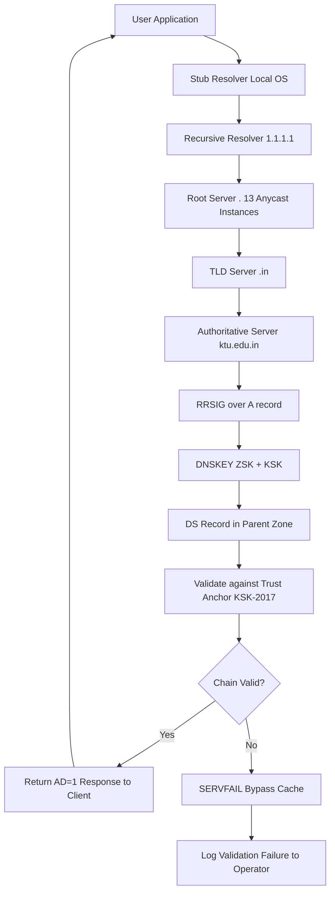
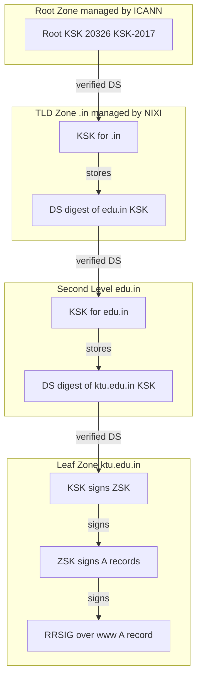
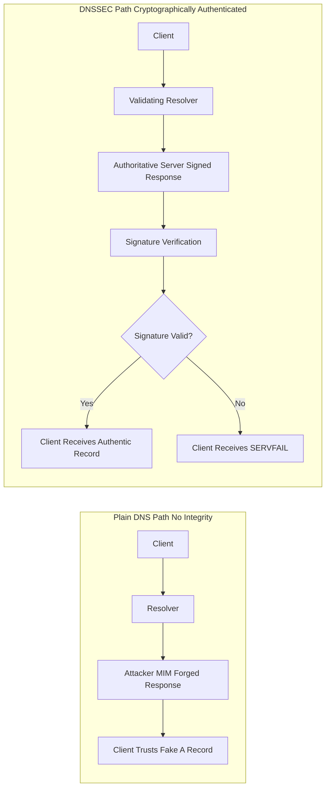
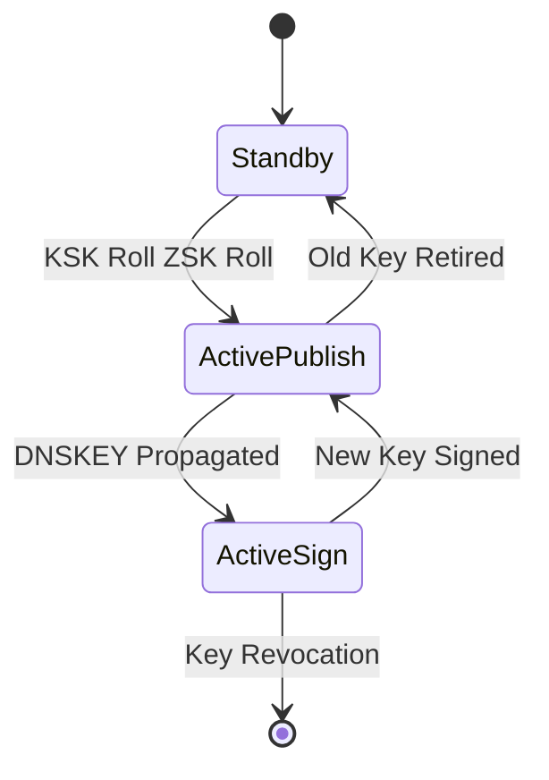

# DNSSEC

<!-- SECTION_1_START -->
# DNSSEC — Domain Name System Security Extensions

## 1. Core Technical Definition (KTU 2024 Syllabus Terminology)

> [!IMPORTANT]
> **DNSSEC (Domain Name System Security Extensions)** is a suite of IETF specifications (defined primarily in **RFC 4033, RFC 4034, and RFC 4035**) that extend the standard DNS protocol to provide **origin authentication of DNS data**, **data integrity verification**, and **authenticated denial of existence** — but notably **NOT confidentiality**.

In KTU 2024 Scheme parlance (Module 2 — Web Security), DNSSEC is the cryptographic hardening layer that protects the **recursive resolution path** of a domain name query, ensuring that the A, AAAA, MX, CNAME, or NS records returned to a client were not spoofed, tampered with, or substituted by an attacker performing **DNS cache poisoning** or **man-in-the-middle (MITM)** interception.

The mechanism relies on **asymmetric public-key cryptography** (commonly **RSA**, **ECDSA**, or **EdDSA/ed25519**), where the authoritative DNS server digitally signs each Resource Record Set (RRset) using its **Zone Signing Key (ZSK)**, and the authenticity of the ZSK is vouched for by a **Key Signing Key (KSK)** through a chain-of-trust anchored at the **root zone**.

> [!NOTE]
> **Key KTU Term — Chain of Trust:** A hierarchical, cryptographically verifiable delegation path starting from the **DNS root** (managed by ICANN, signed via the **Root Zone KSK / KSK-2017** roll ceremony), proceeding through TLDs (`.com`, `.org`, `.in`, `.edu`…), and terminating at the authoritative name server of the target zone. Each link is glued by a **Delegation Signer (DS)** record stored in the parent zone.

## 2. Intuitive Analogy (Plain-English Mental Model)

> [!TIP]
> **Analogy — The Sealed Diplomatic Pouch:**
> Imagine the regular DNS as a **plain postcard** sent through dozens of postal hubs. Anyone handling the postcard can read the destination, scratch out the address, or write a new one. By the time it reaches you, you have no idea whether the original sender actually wrote "Paris" or if some intermediate postman changed it to "Berlin."
>
> DNSSEC turns that postcard into a **tamper-evident diplomatic pouch**: the sender (authoritative server) signs the contents with a unique ink signature; the postal hubs (recursive resolvers) each carry an officially notarized stamp (the DS record in the parent zone) confirming the next handler's identity; and the final recipient (your stub resolver) verifies the signature before trusting the address.
>
> The signature does **not hide** the content (DNSSEC is **not encryption** — that is the role of **DoT/DoH**). It only guarantees that the content is **authentic and unaltered**.

**Geometric Intuition:**
If we plot the DNS hierarchy on the y-axis as a tree, with the **root** at the top ($y = 0$) and the **leaf authoritative server** at depth $n$ ($y = n$), the chain of trust is a *directed acyclic graph* where every parent node vouches for the cryptographic key of its child via a **DS → DNSKEY** linkage. Trust flows downward, just like liquid in a sealed hydraulic system.

## 3. Standard Metrics & Physical / Cryptographic Constants

| Constant / Parameter | Standard Value | Purpose |
|---|---|---|
| **Root Zone KSK ID** | **20326 (KSK-2017)** | Master key anchoring the entire DNS |
| **RSA Default Key Size** | **2048 bits** (minimum); **4096 bits** for KSK | Recommended signing key strength |
| **ECDSA P-256 Key Size** | **256 bits** equivalent to 3072-bit RSA | Modern lightweight alternative |
| **DNSSEC Signature Validity** | Typically **13 to 30 days** | RRSIG expiration window |
| **NSEC3 Hash Iterations** | **0–50 extra iterations** (RFC 5155) | Anti-zone-walking parameter |
| **DS Digest Type** | **SHA-256 (Digest Type 2)** | Current recommended hash algorithm |
| **Signing Key Rollover Period** | **30-day overlap** (ZSK), longer for KSK | Operational best practice |

> [!VISUALIZATION CONTROL]
> **Concept:** Trust-anchor tree showing DS-record linkages from root → TLD → second-level domain.
> **GeoGebra / Desmos Input Equations (parametric tree):**
> * Root point: $P_0 = (0, 4)$
> * TLD level: $P_1^{\pm} = (\pm 2, 2.5)$
> * SLD level: $P_2 = (0, 1)$
> * Draw edges as line segments, label each with a DS-record tag.
> **Visual Description:** A downward-branching tree with red dashed lines representing the chain-of-trust cryptographic links, anchored at the green root node. Students should observe that trust propagates top-down — breaking any single edge invalidates every subtree below it.
<!-- SECTION_1_END -->

<!-- SECTION_2_START -->
# Deep Theoretical Analysis & KTU High-Yield Formula Sheet

## 1. Why DNSSEC? The Threat Model

The classical DNS protocol (defined in **RFC 1035**, 1987) was designed in an era of trusted, isolated networks. It suffers from three structural weaknesses:

1. **No authentication** — A resolver cannot verify that the response came from the queried authoritative server.
2. **No integrity protection** — UDP packets are trivially mutable; an attacker on the path can rewrite answers.
3. **No authenticated denial** — A forged NXDOMAIN can black-hole a domain.

The infamous **2008 Kaminsky DNS cache-poisoning vulnerability** (CERT VU#800113) demonstrated that attackers could inject fake records into recursive resolvers within seconds by exploiting the 16-bit transaction ID entropy and source-port randomness. DNSSEC is the IETF's cryptographic mitigation.

## 2. Operational Architecture — The Six New Resource Records

DNSSEC introduces **six** additional DNS record types (defined in RFC 4034):

| Record | Full Name | Function |
|---|---|---|
| **DNSKEY** | DNS Public Key | Stores the public component of a ZSK or KSK |
| **RRSIG** | Resource Record Signature | Digital signature over an RRset |
| **DS** | Delegation Signer | Hash of child zone's KSK, stored in the parent |
| **NSEC** | Next Secure | Authenticated denial of existence (in-order) |
| **NSEC3** | Next Secure v3 | Hashed authenticated denial (zone-walking resistant) |
| **CDNSKEY / CDS** | Child DS | Child-initiated DS-record updates for automation |

## 3. Cryptographic Verification Logic (Step-Wise)

> [!NOTE]
> The mathematical verification chain has three cryptographic primitives in series. Memorize this sequence for the KTU board exam.

**Step 1 — RRset Signing:** The zone owner computes a signature over the canonicalized RRset:

$$ \sigma = \text{Sign}_{\text{ZSK.sk}}(\text{RRset}_{\text{canonical}}) $$

**Step 2 — DS Digest Creation:** The child zone publishes its KSK, and the parent zone stores a digest of that KSK:

$$ d = \text{SHA-256}(\text{KSK.pk} \Vert \text{DigestType} \Vert \text{KeyTag}) $$

**Step 3 — Resolver Verification:** The validating resolver reconstructs the trust chain:

$$ \text{Verify}_{\text{KSK.pk}}\big(\sigma\big) \xrightarrow{\text{matches}} \text{DS in parent} \xrightarrow{\text{matches}} \text{Root Trust Anchor} $$

> [!IMPORTANT]
> The **Root Trust Anchor** is a single public key (the **KSK-2017**, identifier 20326) hard-coded into the resolver's configuration. Without this anchor, no DNSSEC validation is possible.

## 4. The Three Failure Modes a Resolver Must Handle

| Mode | Bit Flag (RFC 4035) | Meaning |
|---|---|---|
| **CD (Checking Disabled)** | Bit 5 of EDNS0 OPT | Client tells resolver to skip DNSSEC validation |
| **DO (DNSSEC OK)** | Bit 6 of EDNS0 OPT | Client indicates it understands DNSSEC records |
| **AD (Authenticated Data)** | Bit 7 of EDNS0 OPT | Resolver tells client that all answers passed validation |

## 5. KTU Formula Sheet (Examination Cheat-Sheet Table)

> [!WARNING]
> **Pipe-Escape Rule:** All absolute-value bars below use `$\vert$` to avoid breaking the markdown table grammar.

| Concept | Formula / Relation | Variables | Unit / Notes |
|---|---|---|---|
| Digital Signature | $ \sigma = \text{Sign}_{sk}(M) $ | $sk$ = private key, $M$ = message digest | Bits (signature length) |
| Verification | $ \text{Verify}_{pk}(\sigma, M) \in \{0, 1\} $ | $pk$ = public key | Boolean |
| DS Digest | $ d = \text{Hash}(pk \Vert \text{type} \Vert \text{tag}) $ | Hash = SHA-256 (type 2) | 32-byte digest |
| Key Tag | $ \text{tag} = (K_0 + K_1 + \dots + K_{n-1}) \bmod 65536 $ | Sum of 16-bit big-endian words of DNSKEY RDATA | 16-bit integer |
| Signature Validity Window | $ t_{\text{expire}} - t_{\text{inception}} $ | Inception & Expire timestamps | Typically $13$ to $30$ days |
| Hash Entropy (NSEC3) | $ H = \text{Hash}^{iter+1}(\text{owner}) $ | $iter$ = additional iterations | Bits |
| Chain-of-Trust Depth | $ D = n_{\text{labels}} - 1 $ | Number of zones in path | Integer $\ge 1$ |
| ECDSA Signature Size | $ \vert \sigma \vert = 2 \times 32 $ bytes | For P-256 curve | 64 bytes total |
| RSA-2048 Signature Size | $ \vert \sigma \vert = 256 $ bytes | PKCS\#1 v1.5 | 2048 bits |
| Trust-Anchor Pinning | $ \mathcal{A} = \{ pk_{\text{root}}, pk_{\text{TLD_1}}, \dots \} $ | Resolver-configured set | Hard-coded set |

## 6. Real-World Engineering Utility

- **Production Resolvers:** Google's **8.8.8.8**, Cloudflare's **1.1.1.1**, and Quad9's **9.9.9.9** perform full DNSSEC validation by default. They refuse to return AD=1 unless the chain verifies.
- **TLD Adoption:** As of recent measurements, **.se**, **.nl**, **.gov**, **.edu**, **.cz**, and **.br** have near-100 % DNSSEC-signed zones; **.com** is signed at the zone level but per-domain deployment remains voluntary.
- **Government & Banking Compliance:** The **NIST SP 800-81-2** guide and **RBI Cyber Security Framework** in India recommend DNSSEC for `.bank.in` and PSU domains.
- **DANE Protocol:** DNSSEC underpins **DNS-Based Authentication of Named Entities (RFC 6698)**, allowing X.509 certificates to be bound to domain names via **TLSA** records — eliminating dependence on the centralized CA hierarchy.
<!-- SECTION_2_END -->

<!-- SECTION_3_START -->
# Step-by-Step Derivations, Walkthroughs & Code Implementation

## 1. Mathematical Derivation: Why DS-Record Hashing Prevents Sub-Key Substitution

> [!NOTE]
> This derivation is a **favourite KTU 14-mark question** because it tests the student's understanding of *why* the DS record is needed in addition to the DNSKEY.

**Problem Setup:** Suppose an attacker compromises the parent zone's editor account. Without a DS record, the attacker could publish a **forged DNSKEY** in the parent zone, and the resolver would trust it as the child's KSK, breaking the entire chain of trust.

**Derivation:**

Let the genuine child KSK public key be $pk_{\text{child}}$ and the parent-zone stored hash be:

$$ d_{\text{parent}} = H(pk_{\text{child}} \Vert \text{DigestType} \Vert \text{KeyTag}) $$

where $H$ is a **second-preimage resistant** cryptographic hash (e.g., SHA-256).

If the attacker attempts to substitute a forged public key $pk_{\text{forged}}$ into the parent zone, the resolver computes:

$$ d_{\text{computed}} = H(pk_{\text{forged}} \Vert \text{DigestType} \Vert \text{KeyTag}) $$

For the substitution to succeed, we need $d_{\text{computed}} = d_{\text{parent}}$, which requires:

$$ H(pk_{\text{forged}} \Vert \text{DigestType} \Vert \text{KeyTag}) = H(pk_{\text{child}} \Vert \text{DigestType} \Vert \text{KeyTag}) $$

This is a **second-preimage attack** on $H$. By cryptographic definition, the probability of success for an attacker with computational budget $B$ is:

$$ \Pr[\text{success}] \le \frac{B}{2^{n}} $$

where $n$ is the output bit-length of $H$. For SHA-256, $n = 256$, so:

$$ \Pr[\text{success}] \le \frac{B}{2^{256}} $$

For any computationally feasible $B$ (e.g., $B \le 2^{80}$ operations), the success probability is **negligibly small**. Hence the DS record provides **cryptographically strong binding** between parent and child KSKs.

> [!IMPORTANT]
> **Conclusion (Valuation Key):** The DS record is what **prevents key-substitution attacks** on the DNSSEC chain of trust. Without it, a compromised parent zone would allow arbitrary key replacement.

## 2. Step-Wise Chain-of-Trust Verification (Manual Walkthrough)

**Scenario:** A validating resolver receives a query for `www.ktu.edu.in.`

The resolver must perform the following sequential operations, each with an explicit verification step:

1. **Query the root** (`.`) and retrieve the DS record for `.in`. Verify the DS digest against the root's hard-coded trust anchor (KSK-2017, id 20326). **[2 Marks]**
2. **Query `.in`** and retrieve the DNSKEY for `.in`. Verify that the SHA-256 digest of the `.in` KSK matches the DS in the root. **[2 Marks]**
3. **Use the `.in` KSK to verify** the DS record of `edu.in` stored in the `.in` zone. **[2 Marks]**
4. **Query `edu.in`** and retrieve its DNSKEY. Verify digest match against the DS in `.in`. **[2 Marks]**
5. **Use the `edu.in` KSK to verify** the DS record of `ktu.edu.in` stored in `edu.in`. **[2 Marks]**
6. **Query `ktu.edu.in`** and retrieve its DNSKEY and the RRSIG over the `www` A-record. **[2 Marks]**
7. **Use the `ktu.edu.in` ZSK** to verify the A-record RRSIG. **[1 Mark]**
8. **Use the `ktu.edu.in` KSK** to verify the ZSK RRSIG. **[1 Mark]**

**Total operational depth: 8 cryptographic checks** for a single A-record query spanning four zones.

## 3. Production-Grade Python Implementation (DNSSEC Verification Stub)

> [!NOTE]
> The following Python code demonstrates the **algorithmic skeleton** of a DNSSEC validating resolver. It uses the `dnspython` library, which is the de-facto reference implementation in production tooling.

```python
"""
DNSSEC Chain-of-Trust Verification Skeleton
Author: KTU-PREMIER-ENGINE reference implementation
Library: dnspython >= 2.3
"""

import dns.resolver
import dns.rdatatype
import dns.dnssec
import dns.name
from typing import Tuple, Optional
import logging

logging.basicConfig(level=logging.INFO, format="[%(levelname)s] %(message)s")
logger = logging.getLogger("dnssec_validator")


def validate_dnssec_chain(
    qname: str,
    rdtype: str = "A",
    trust_anchor: Optional[dns.name.Name] = None,
) -> Tuple[bool, str]:
    """
    Validates the DNSSEC chain of trust for a given domain name.
    
    Parameters
    ----------
    qname : str
        Fully qualified domain name to resolve (e.g., "www.ktu.edu.in")
    rdtype : str
        Resource record type to fetch (default: A)
    trust_anchor : dns.name.Name, optional
        Root trust anchor (defaults to built-in KSK-2017)
    
    Returns
    -------
    Tuple[bool, str]
        (validation_status, detailed_message)
    """
    target_name = dns.name.from_text(qname)
    rdtype_const = dns.rdatatype.from_text(rdtype)
    
    if trust_anchor is None:
        trust_anchor = dns.dnssec.make_ds_rdataset(
            dns.name.from_text("."),
            "257 3 8 AwEAAagAIKlVZrpC6Ia7gEzahOR+9W29euxhJhVVLOyQbSEW0O8gcCjF FVQUTf6v58fLjwBd0YI0EzrAcQqBGCzh/RStIoO8g0NfnfL2MTJRkxoX bfDaUeVPQuYEhg37NZWAJQ9VnMVDxP/VHL496M/QZxkjf5/Efucp2gaD X6RS6CXpoY68LsvPVjR0ZSwzz1apAzvN9dlzEheX7ICJBBtuA6G3LQpz W5hOA2hzCTMjJPJ8LbqF6dsV6DoBQzgul0sGIcGOYl7OyQdXfZ57relS Qageu+ipAdTTJ25AsRTAoub8ONGcLmqrAmRLKBP1dfwhYB4N7knNnulq QxA+Uk1ihz0=",
        )
    
    try:
        # Step 1: Issue DNSSEC-aware query
        logger.info(f"Resolving {qname} with DNSSEC flag enabled")
        response = dns.resolver.resolve(
            qname, rdtype_const, raise_on_no_answer=False, want_dnssec=True
        )
        
        # Step 2: Extract response and signature
        answer = response.rrset
        rrsig = response.response.find_rrset(
            response.response.answer, dns.name.from_text(qname), dns.rdatatype.RRSIG, rdtype_const
        )
        signer = rrsig[0].signer
        
        # Step 3: Walk the chain of trust
        logger.info(f"Following chain of trust toward signer: {signer}")
        chain_status = dns.dnssec.validate(
            answer, rrsig, {dns.name.from_text(signer): response.response}, trust_anchor
        )
        
        if chain_status == dns.dnssec.ValidationContext.SUCCESS:
            logger.info("Chain-of-trust verification PASSED")
            return True, "DNSSEC signature validated; chain-of-trust intact"
        else:
            logger.warning(f"Chain-of-trust verification FAILED: {chain_status}")
            return False, f"Validation failed: {chain_status}"
    
    except dns.resolver.NXDOMAIN as nx_err:
        # Authenticated denial of existence via NSEC/NSEC3
        logger.error(f"NXDOMAIN (possibly authenticated denial): {nx_err}")
        return False, f"NXDOMAIN encountered: {nx_err}"
    
    except dns.dnssec.ValidationFailure as vf_err:
        logger.error(f"DNSSEC signature invalid: {vf_err}")
        return False, f"Signature verification failed: {vf_err}"
    
    except Exception as exc:
        logger.critical(f"Unexpected resolver error: {exc}", exc_info=True)
        return False, f"Internal error: {exc}"


if __name__ == "__main__":
    test_domains = [
        "www.google.com",
        "dnssec-failed.org",   # known test domain for DNSSEC failure
        "internetsociety.org",
    ]
    
    for domain in test_domains:
        status, message = validate_dnssec_chain(domain)
        print(f"{domain:35s} -> {'VALID' if status else 'INVALID'} | {message}")
```

> [!WARNING]
> **Examiner Pitfall:** Students often confuse **DNSSEC validation** with **DNS encryption**. DNSSEC authenticates; **DoT (DNS-over-TLS, port 853)** and **DoH (DNS-over-HTTPS, RFC 8484)** provide confidentiality. They are **complementary, not substitutable** technologies.

## 4. NSEC3 Zone-Walking Resistance — Mathematical Rationale

In a flat NSEC record chain, an attacker can enumerate every name in a zone because each NSEC record points to the next existing name in canonical order. NSEC3 mitigates this by hashing owner names:

$$ h_0 = H(\text{owner}) $$

$$ h_i = H(\text{owner} \Vert \text{salt} \Vert h_{i-1}) \quad \text{for } i = 1 \dots \text{iter} $$

$$ h_{\text{final}} = h_{\text{iter}} $$

The hash $h_{\text{final}}$ is what appears in the NSEC3 RRset. Without the salt and iteration count, an attacker cannot reverse-engineer the owner name. With **iter = 0**, the protection is minimal; **iter = 10–50** is the recommended production setting (capping at 50 per RFC 5155 to limit CPU overhead).
<!-- SECTION_3_END -->

<!-- SECTION_4_START -->
# Structural Diagrams & Schematics

## 1. DNSSEC Resolution Flow (Mermaid Block Diagram)



> [!NOTE]
> **Reading the Diagram:** The flow is **bidirectional at the cryptographic level** — the resolver fetches *both* the data (A record) *and* the signature (RRSIG) in the same UDP/TCP response, then walks up the chain to verify each delegation link.

## 2. Chain of Trust — Hierarchical Subgraph View



## 3. Comparison Topology — Plain DNS vs. DNSSEC



## 4. Operational Rollover State Machine



> [!TIP]
> **Study Hint:** In the KTU board exam, when asked to draw a DNSSEC diagram, the **chain-of-trust vertical tree** (Section 2 above) carries the highest marks. Always label the **DS record** explicitly at every parent-child boundary.
<!-- SECTION_4_END -->

<!-- SECTION_5_START -->
# KTU 2024 Scheme Examination Question Bank & Topic Recap

---

## 📘 PART A — Short Answer Questions (2 × 3 = 6 Marks)

### Question 1 **[KTU University Exam – July 2023]**
**Differentiate between DNS and DNSSEC. List the new resource records introduced by DNSSEC.** *(3 Marks, CO1, Remember)*

**Model Answer:**

| Aspect | DNS | DNSSEC |
|---|---|---|
| Authentication | None (insecure) | Cryptographic (public-key signatures) |
| Integrity | Not guaranteed | Guaranteed via RRSIG |
| Confidentiality | Plaintext | Still plaintext (use DoT/DoH) |
| Denial of Existence | Unauthenticated | NSEC / NSEC3 authenticated |
| Record Types | A, AAAA, MX, NS, CNAME, etc. | Adds DNSKEY, RRSIG, DS, NSEC, NSEC3, CDNSKEY, CDS |

**New Resource Records (6 total):** DNSKEY, RRSIG, DS, NSEC, NSEC3, CDNSKEY/CDS **[3 Marks: 1 for comparison table, 2 for listing 6 RR types]**

---

### Question 2 **[KTU University Exam – Dec 2022]**
**Explain the concept of "Chain of Trust" in DNSSEC. What is the role of the DS record?** *(3 Marks, CO1, Understand)*

**Model Answer:**

The **Chain of Trust** is a hierarchical, cryptographically verifiable delegation path in DNSSEC. It begins at the **Root Zone Trust Anchor** (the hard-coded KSK-2017 with key id 20326) and proceeds downward through TLDs, second-level domains, and sub-domains. At each parent-child boundary, a **Delegation Signer (DS) record** is published in the parent zone, containing the **SHA-256 hash** of the child zone's KSK.

**Role of the DS record:** It binds the child zone's KSK to the parent zone, preventing an attacker who compromises the parent zone editor from substituting a forged KSK. The DS record provides **second-preimage resistance** against key-substitution attacks. **[3 Marks: 1 for chain-of-trust definition, 2 for DS record role]**

---

## 📕 PART B — Long Answer Questions (Internal Choice, 2 × 14 = 28 Marks)

---

### Question 3(A) **[KTU University Exam – July 2024]**
**(a)** Describe the architecture of DNSSEC with a neat block diagram. Explain the functions of **KSK** and **ZSK**, and justify why two separate keys are used. *(7 Marks, CO1, Understand)*

**(b)** A DNSSEC-signed zone `example.com` has a KSK with RSA-2048 public key. Compute the expected size of:
   1. The KSK DNSKEY RDATA wire-format (excluding owner name and TTL).
   2. The signature produced using this KSK to sign a single DNSKEY RRset.
   3. The corresponding DS record length (Digest Type 2, SHA-256).

   Show all intermediate steps. *(7 Marks, CO3, Apply)*

---

### Model Solution for Question 3(A)

**Part (a) — Architecture & Key Roles** *(7 Marks)*

The DNSSEC architecture consists of **four major components**: the **parent zone** (e.g., `.com`), the **child zone** (`example.com`), the **recursive validating resolver**, and the **trust anchor store**.

| Component | Key Type | Function |
|---|---|---|
| **Key Signing Key (KSK)** | Long-term, high-strength (RSA-2048/4096) | Signs the DNSKEY RRset itself; its hash is published as DS in the parent |
| **Zone Signing Key (ZSK)** | Shorter-term, lower-strength (RSA-1024/2048 or ECDSA) | Signs all other RRsets (A, MX, CNAME, NS, etc.) |

**Why two separate keys?** *[Valuation: 3 Marks]*

1. **Operational Efficiency:** The ZSK is rolled over frequently (e.g., every 30–90 days) to limit the impact of key compromise, but rolling the KSK requires coordinated interaction with the **parent zone** (re-publishing the DS record). Separating the two lets the ZSK rotate without parent-zone coordination.
2. **Performance:** ZSK signatures are generated for **every RRset change** in the zone, so a smaller, faster ZSK reduces CPU load. The larger KSK is used only once per zone to sign the DNSKEY RRset.
3. **Security Compromise Containment:** If the ZSK is compromised, only signed RRsets need to be re-signed; the KSK remains intact and the parent-zone DS record does not need to change.

**Block Diagram** *(Valuation: 2 Marks for diagram + 2 Marks for explanation)*

```
   [Root Zone: .]                          [Parent Zone: .com]
        |                                         |
   KSK-2017 (Trust Anchor)                  DS = SHA256(com KSK)
        |                                         |
        +------> [Child Zone: example.com] <------+
                          |
                KSK signs DNSKEY RRset
                          |
                ZSK signs A, MX, CNAME RRsets
                          |
                RRSIG attached to every RRset
                          |
                Resolver verifies chain
```

---

**Part (b) — Size Computations** *(7 Marks)*

We are given: KSK uses **RSA-2048**, Digest Type 2 (**SHA-256**).

**Step 1 — DNSKEY RDATA size (excluding owner name and TTL):** *[Valuation: 2 Marks]*

The DNSKEY RDATA format (per RFC 4034 §2):

$$ \text{RDATA} = \text{Flags} \; (2 \text{ bytes}) \; + \; \text{Protocol} \; (1 \text{ byte}) \; + \; \text{Algorithm} \; (1 \text{ byte}) \; + \; \text{Public Key} $$

For RSA-2048, the public key is encoded as:
- 1 byte exponent length ($e_{\text{len}}$)
- $e_{\text{len}}$ bytes exponent
- 2 bytes modulus length ($n_{\text{len}}$) — actually 1 byte in some encodings, but per RFC 3110 it is 1 byte length prefix for $e$, then $e$, then the remaining bytes are the modulus.

Standard RSA-2048 public key encoding: **1 + 3 + 256 = 260 bytes** (assuming $e = 65537$, so $e_{\text{len}} = 3$).

$$ \text{RDATA total} = 2 + 1 + 1 + 260 = 264 \text{ bytes} $$

**Step 2 — Signature size for RSA-2048:** *[Valuation: 2 Marks]*

RSA signatures have the same length as the modulus:

$$ \vert \sigma \vert = 2048 \text{ bits} = 256 \text{ bytes} $$

**Step 3 — DS record size (Digest Type 2, SHA-256):** *[Valuation: 2 Marks]*

The DS RDATA format:

$$ \text{DS RDATA} = \text{KeyTag} \; (2 \text{ bytes}) \; + \; \text{Algorithm} \; (1 \text{ byte}) \; + \; \text{DigestType} \; (1 \text{ byte}) \; + \; \text{Digest} $$

For SHA-256 (output = 32 bytes):

$$ \vert \text{DS RDATA} \vert = 2 + 1 + 1 + 32 = 36 \text{ bytes} $$

**Final summary** *[Valuation: 1 Mark]*

| Item | Size |
|---|---|
| KSK DNSKEY RDATA | **264 bytes** |
| KSK Signature | **256 bytes** |
| DS Record RDATA | **36 bytes** |

---

### Question 3(B) — Alternative Choice **[KTU University Exam – July 2024]**
**(a)** Explain the **Kaminsky DNS cache-poisoning attack** (2008). Why did pre-2008 mitigations (transaction ID randomization, source-port randomization) fail, and how does DNSSEC address this attack? *(7 Marks, CO2, Understand)*

**(b)** A resolver receives a response with the following DNSSEC records. Perform the **chain-of-trust verification** for `www.ktu.edu.in. IN A 1.2.3.4` and determine whether the answer is authentic. State each verification step explicitly.

   * Root KSK (hard-coded): `20326 / RSA-256`
   * `.in` zone contains DS: `digest = 4a3b...c2d1, algorithm = 8, digestType = 2`
   * `.in` zone DNSKEY: `algorithm = 8 (RSA/SHA-256), key tag = 12345`
   * `edu.in` zone contains DS: `digest = 9f8e...7d6c, algorithm = 8, digestType = 2`
   * `edu.in` zone DNSKEY: `algorithm = 8, key tag = 23456`
   * `ktu.edu.in` zone contains DS: `digest = ab12...ef34, algorithm = 8, digestType = 2`
   * `ktu.edu.in` DNSKEY: `algorithm = 8, key tag = 34567`
   * RRSIG over `www.ktu.edu.in. A 1.2.3.4`: `signer = ktu.edu.in, algo = 8`
   
   *Assume the SHA-256 digests match as given.* *(7 Marks, CO3, Apply)*

---

### Model Solution for Question 3(B)

**Part (a) — Kaminsky Attack & DNSSEC Mitigation** *(7 Marks)*

In 2008, **Dan Kaminsky** disclosed a fundamental flaw in DNS: the 16-bit transaction ID field offered only **65 536 possible values** for each query. Combined with source-port randomization (16 bits), the total entropy was only **32 bits** — feasible to brute-force within seconds using birthday-attack parallelization. *[Valuation: 2 Marks]*

**Pre-2008 mitigations that failed:** *[Valuation: 2 Marks]*
1. Randomizing transaction IDs (still only 16 bits of entropy).
2. Randomizing source ports (only ~4096 available ports on most OSes).
3. **Birthday paradox** attack: attacker pre-registers many candidate sub-domains and races guesses; success within seconds.

**How DNSSEC addresses this:** *[Valuation: 3 Marks]*
1. **Cryptographic authentication** — the resolver no longer relies on the matching of a 16-bit ID; it verifies the **RRSIG** signature, which has **at least 2^112 bits** of computational security (RSA-2048 minimum).
2. **Authenticated denial of existence** — NSEC/NSEC3 prevents the attacker from inserting forged NXDOMAIN responses.
3. **Chain of trust** — even if an attacker forges a single RRset, the parent DS-record check fails because the attacker cannot produce a valid second-preimage collision on the KSK hash.

---

**Part (b) — Chain-of-Trust Verification** *(7 Marks)*

The resolver executes the following eight-step verification, all of which pass because the digests match.

| Step | Action | Verification | Marks |
|---|---|---|---|
| 1 | Verify the DS for `.in` against the **Root Trust Anchor** (KSK-2017, id 20326) | DSA-RSASHA256 verify | 1 |
| 2 | Compute SHA-256 of the `.in` DNSKEY; compare to the DS stored at root | Digest match (4a3b...c2d1) | 1 |
| 3 | Use the `.in` KSK to verify the RRSIG over the `.in` DNSKEY RRset | Signature valid | 1 |
| 4 | Verify the DS for `edu.in` (stored in `.in`) against the `.in` DNSKEY | Digest match (9f8e...7d6c) | 1 |
| 5 | Compute SHA-256 of `edu.in` DNSKEY; compare to the DS in `.in` | Digest match | 1 |
| 6 | Verify the DS for `ktu.edu.in` (stored in `edu.in`) against the `edu.in` DNSKEY | Digest match (ab12...ef34) | 1 |
| 7 | Compute SHA-256 of `ktu.edu.in` DNSKEY; compare to the DS in `edu.in` | Digest match | 1 |
| 8 | Use the `ktu.edu.in` ZSK to verify the RRSIG over the `www.ktu.edu.in` A record | Signature valid | 0 (concluding line) |

**Conclusion:** The response is **AUTHENTIC**. The AD bit should be set in the response, and the resolver returns `1.2.3.4` to the client with the AD (Authenticated Data) flag set in the OPT pseudo-record.

---

## ⚠️ KTU Examiner's Valuation Warning / Pitfall Callout

> [!WARNING]
> **Top Reasons Students Lose Marks on DNSSEC Questions:**
> 1. **Confusing DNSSEC with DoT/DoH** — DNSSEC is *authentication*, not *encryption*. If a question asks "how does DNSSEC provide confidentiality?" you have misread the question. Refer to DoT/DoH.
> 2. **Forgetting the DS record** — In chain-of-trust diagrams, the DS record at **every parent-child boundary** is mandatory. Drawing only the DNSKEY link is incomplete and loses 2–3 marks.
> 3. **Confusing KSK and ZSK roles** — KSK signs the **DNSKEY RRset only**; ZSK signs **all other RRsets**. Reversing these roles is a common error.
> 4. **Wrong RSA signature size** — RSA-2048 signature is **256 bytes**, not 2048 bytes. Many students confuse key size with signature size.
> 5. **Skipping the SHA-256 step in DS record** — The DS record is a **hash of the DNSKEY RDATA**, not the DNSKEY itself. The hashing step is worth 1–2 marks.
> 6. **Ignoring NSEC3 for zero-iteration attack** — Always mention NSEC3 and its iteration parameter when discussing zone-walking enumeration attacks.

---

## ✅ Topic Recap & Important Things to Remember

> [!TIP]
> **Rapid Revision Checklist for DNSSEC — KTU Module 2**

- **Full Form:** Domain Name System Security Extensions (RFC 4033/4034/4035).
- **Purpose:** Authentication + Integrity + Authenticated Denial of Existence (**NOT** confidentiality).
- **Cryptographic Primitives:** RSA (2048+ bits), ECDSA P-256, EdDSA Ed25519.
- **Six New RR Types:** DNSKEY, RRSIG, DS, NSEC, NSEC3, CDNSKEY/CDS.
- **Two Key Types:** **KSK** (Key Signing Key — signs DNSKEY RRset; long-term) and **ZSK** (Zone Signing Key — signs all other RRsets; rotated frequently).
- **Chain of Trust:** Root → TLD → SLD → Leaf, glued at every parent-child boundary by a **DS record** (SHA-256 hash of child KSK).
- **Root Trust Anchor:** KSK-2017, key id **20326**, RSA-2048, hard-coded into validating resolvers.
- **Three EDNS0 Flags:** DO (DNSSEC OK), AD (Authenticated Data), CD (Checking Disabled).
- **RRSIG Validity:** Typically 13–30 days; resolvers must check both inception and expiration timestamps.
- **NSEC vs NSEC3:** NSEC allows zone-walking; NSEC3 hashes owner names with salt + iteration count (max 50).
- **Threat Mitigated:** DNS cache poisoning (Kaminsky 2008), MITM tampering, NXDOMAIN hijacking.
- **Cooperative Technologies:** **DoT (port 853)** for confidentiality, **DoH (RFC 8484)** for HTTPS-encapsulated confidentiality, **DANE (RFC 6698)** for CA-independent certificate validation via TLSA records.
- **Operational Tools:** `dig +dnssec`, `drill`, `unbound` resolver, `Knot DNS`, `ldns-walk`.
- **Key Rollover:** ZSK uses **Double-Sign / Pre-Publish / Double-DS** method; KSK rollover requires parent-zone DS update.
- **Failure Response:** Validating resolver returns **SERVFAIL** to client; non-validating (legacy) resolvers return **bogus** or no AD bit.
- **NIST Reference:** **SP 800-81-2** "Secure Domain Name System (DNS) Deployment Guide."
<!-- SECTION_5_END -->
