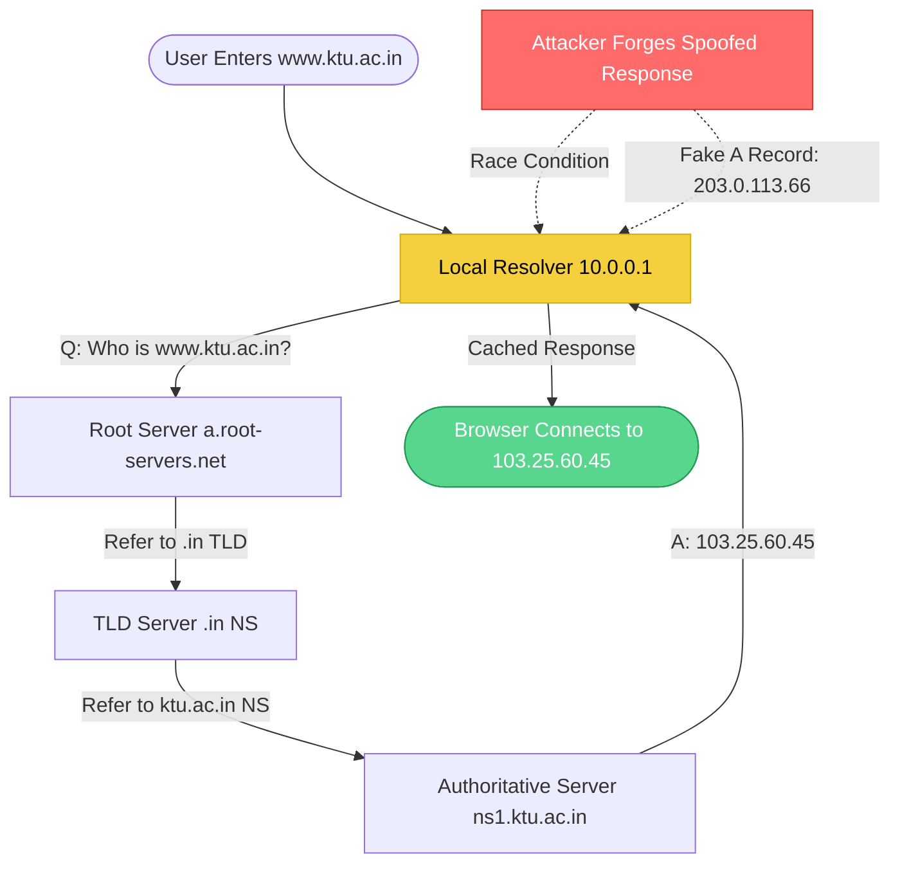
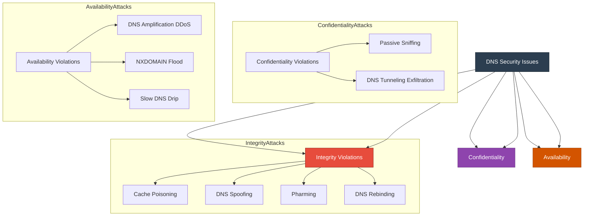
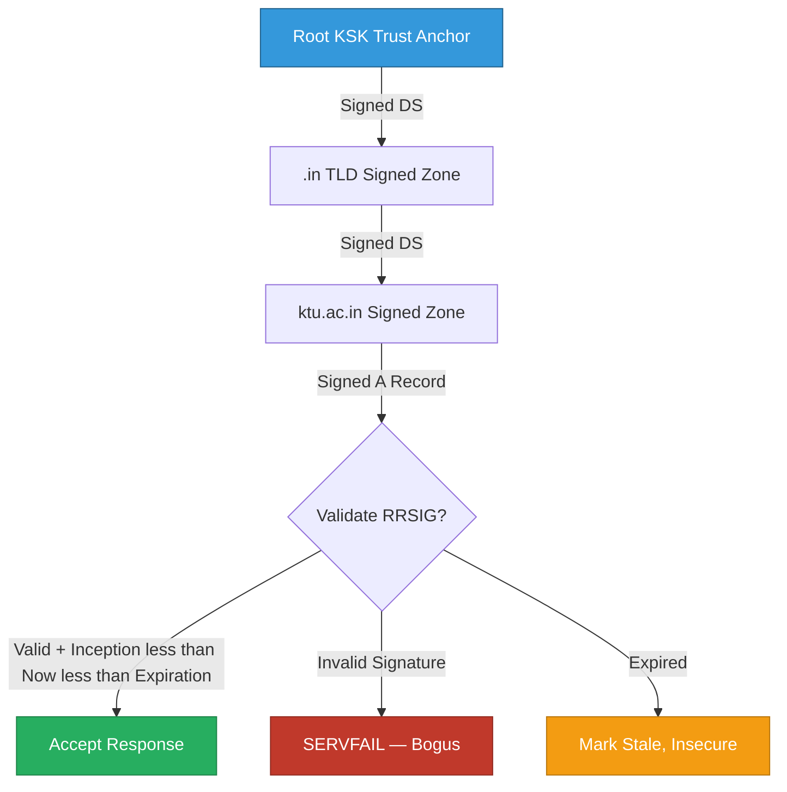
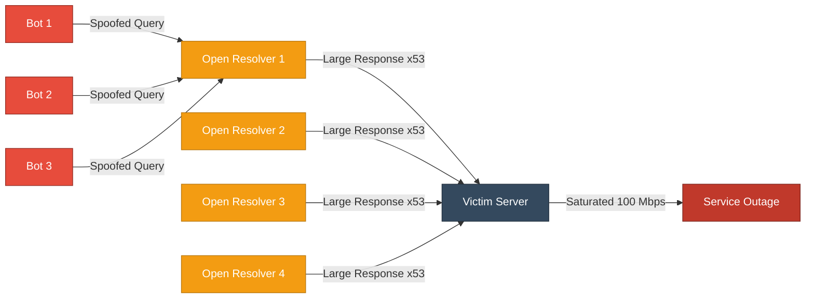

# Domain Name System- Security Issues with DNS

<!-- SECTION_1_START -->
# Domain Name System — Security Issues with DNS

## 1.1 Formal Definition (KTU 2024 Syllabus Terminology)

The **Domain Name System (DNS)** is a hierarchical, distributed naming service defined in **RFC 1034** and **RFC 1035** that translates human-readable domain names (e.g., `www.ktu.ac.in`) into machine-readable **IP addresses** (e.g., `103.25.60.45`). It functions as the **phonebook of the Internet**, operating primarily over **UDP port 53** for queries and **TCP port 53** for zone transfers and large responses.

A **DNS Security Issue** refers to any vulnerability, attack vector, or protocol weakness in the DNS infrastructure that compromises the **Confidentiality, Integrity, or Availability (CIA Triad)** of name resolution services.

> [!IMPORTANT]
> **KTU 2024 Syllabus Highlight (Module 2 — Web Security)**
> The course outcomes map to **CO2**: *"Identify and analyze common web and network security threats including DNS attacks, and apply appropriate mitigation strategies."*

---

## 1.2 Conceptual Analogy / Intuition

Think of DNS as the **contact directory of a giant hospital**:

- **Patients (users)** know a doctor by name (e.g., "Dr. Smith").
- The **receptionist (DNS resolver)** checks the directory and provides the **room number (IP address)**.
- The **directory records (zone files)** are stored across multiple filing cabinets (authoritative servers).

Now, imagine the following threats:

| Real-World Threat | DNS Equivalent |
|---|---|
| A receptionist giving the **wrong room number** deliberately | **DNS Spoofing / Cache Poisoning** |
| A patient **stealing the master directory** to redirect everyone | **Zone Transfer Attack (AXFR)** |
| Receptionist being **overwhelmed with phone calls** until collapse | **DNS Amplification / DDoS** |
| Patient whispering fake doctor names to secretly smuggle data | **DNS Tunneling** |
| Doctor's name being **slightly altered** (Dr. Smyth) to trick patients | **Typosquatting** |

---

## 1.3 Physical Constants & Standard Metrics

The following are **standard DNS protocol constants** mandated by IETF RFCs:

- **Default UDP Port:** **53**
- **Default TCP Port:** **53** (used for AXFR/IXFR and responses > 512 bytes)
- **Standard DNS Message Size:** **512 bytes** (UDP), up to **4096 bytes** with **EDNS0 (RFC 6891)**
- **TTL (Time-To-Live):** Typically **3600 seconds (1 hour)** for A records
- **Resolver Recursion Depth Limit:** Recommended **≤ 10** to prevent infinite loops
- **EDNS0 UDP Message Size:** Up to **4096 bytes** (negotiated via OPT pseudo-RR)

> [!NOTE]
> **Why UDP and not TCP for normal queries?**
> UDP is **stateless and connectionless**, providing **low-latency** resolution. The trade-off is **no built-in reliability**, which is precisely the root cause of many DNS attacks.

> [!VISUALIZATION CONTROL]
> **Concept:** DNS Resolution Path
> **GeoGebra / Desmos Input Equations (Conceptual Graph):**
> * Point A: `User (192.168.1.10)`
> * Point B: `Local Resolver (10.0.0.1)`
> * Point C: `Root Server (a.root-servers.net)`
> * Point D: `TLD Server (.com)`
> * Point E: `Authoritative Server (ns1.example.com)`
> **Visual Description:** Plot these as connected nodes on a directed graph. The arrows form an **iterative or recursive query chain** descending the DNS hierarchy from the root.

---

## 1.4 DNS Query Types — Quick Reference

| Query Type | RFC | Purpose |
|---|---|---|
| **A** (Address) | RFC 1035 | Maps domain → IPv4 address |
| **AAAA** | RFC 3596 | Maps domain → IPv6 address |
| **CNAME** | RFC 1035 | Canonical name alias |
| **MX** | RFC 1035 | Mail exchange server |
| **NS** | RFC 1035 | Authoritative name server |
| **TXT** | RFC 1035 | Arbitrary text (used in SPF, DKIM) |
| **SOA** | RFC 1035 | Start of authority (zone metadata) |
| **AXFR** | RFC 5936 | Full zone transfer |
| **IXFR** | RFC 1995 | Incremental zone transfer |
| **PTR** | RFC 1035 | Reverse DNS lookup |
| **ANY** | RFC 1035 | Returns all cached records (deprecated, often abused) |

---
<!-- SECTION_1_END -->

<!-- SECTION_2_START -->
# Deep Theoretical Analysis — DNS Attack Taxonomy & High-Yield Formula Sheet

## 2.1 The CIA Triad Mapped to DNS Security

DNS attacks are classified by which security property they violate:

- **Confidentiality** → DNS Sniffing, DNS Tunneling (data exfiltration)
- **Integrity** → Cache Poisoning, DNS Spoofing, Pharming
- **Availability** → DNS Amplification, NXDOMAIN Flood, DoS

---

## 2.2 DNS Attack Taxonomy (Structured Logic)

### **Attack 1: DNS Cache Poisoning (Spoofing)**

- Attacker injects **forged DNS records** into a resolver's cache.
- Exploits the **transaction ID (16-bit)** and **source port (16-bit)** guessing weakness in classic DNS.
- Once cached (TTL duration), all users of that resolver receive the **malicious IP**.

> [!IMPORTANT]
> **The Birthday Paradox Probability** is central to understanding cache poisoning. With $n$ bits of randomness, the probability of collision after $k$ guesses is approximately:
> $$P(\text{collision}) \approx 1 - e^{-k^2 / (2 \cdot 2^n)}$$

### **Attack 2: DNS Amplification (Reflective DDoS)**

- Attacker sends **small DNS queries (~60 bytes)** with the victim's IP spoofed as the source.
- Open resolvers reply with **large responses (~4000+ bytes)**.
- **Amplification Factor** = Response Size / Request Size (theoretical max ≈ **54×** for DNS, but realistically **28–50×**).

### **Attack 3: DNS Tunneling**

- Encodes data inside DNS queries/responses (e.g., `base32(payment-data).attacker.com`).
- Bypasses firewalls because DNS traffic is rarely blocked.
- Used for **C2 (Command & Control)** channels and **data exfiltration**.

### **Attack 4: DNS Zone Transfer Attack (AXFR Abuse)**

- Attacker requests a full zone transfer from an authoritative server.
- If **ACL (Access Control List)** is misconfigured, the entire zone file (all subdomains, IPs, mail servers) is leaked.
- **Reconnaissance attack** — gives attackers a complete map of the target's infrastructure.

### **Attack 5: DNS Hijacking**

- **Router-level:** Malware modifies local router DNS settings.
- **Registrar-level:** Attacker transfers domain ownership via stolen credentials.
- **Resolver-level:** Man-in-the-Middle alters responses on the wire.

### **Attack 6: Fast Flux**

- Malicious domain rapidly changes its **A records** (often every 60 seconds) across a botnet of compromised hosts.
- Makes **IP-based blacklisting ineffective**; takedown becomes very hard.

### **Attack 7: DNS Rebinding**

- Attacker tricks victim's browser into trusting a malicious domain.
- Bypasses **Same-Origin Policy (SOP)** by rebinding the domain to an internal IP (e.g., `192.168.1.1`).

### **Attack 8: Typosquatting / URL Hijacking**

- Registering lookalike domains: `g00gle.com`, `paypa1.com`, `ktuuni.com`.
- Exploits user **typing errors** and **visual homoglyphs** (e.g., Cyrillic 'а' vs Latin 'a').

### **Attack 9: Subdomain Takeover**

- An attacker claims an **orphaned DNS record** (e.g., a CNAME pointing to a deprovisioned Heroku/Azure app).
- Issues a new certificate via **Let's Encrypt** and serves malicious content.

---

## 2.3 KTU High-Yield Formula Sheet (Cheat Sheet)

| # | Formula / Concept | Equation | Unit / Notes |
|---|---|---|---|
| 1 | **DNS Message Header Length** | $12 \text{ bytes} + \sum \text{Question/Answer/Authority/Additional RRs}$ | Bytes |
| 2 | **Transaction ID Space** | $2^{16} = 65{,}536$ | Guesses needed for brute force |
| 3 | **Source Port Space** | $2^{16} = 65{,}536$ | Randomization increases entropy |
| 4 | **Combined Entropy** | $H = \log_2(2^{16} \cdot 2^{16}) = 32$ bits | Old DNS = weak; DNSSEC randomizes to 32+ bits |
| 5 | **Amplification Factor** | $A_f = \frac{\text{Response Size (bytes)}}{\text{Request Size (bytes)}}$ | Dimensionless ratio |
| 6 | **Birthday Attack Probability** | $P \approx 1 - e^{-k^2 / (2 \cdot 2^n)}$ | $k$ = guesses, $n$ = bits |
| 7 | **Max UDP Response Size (no EDNS0)** | $512 \text{ bytes}$ | RFC 1035 |
| 8 | **EDNS0 UDP Response Size** | $\leq 4096 \text{ bytes}$ (negotiated) | RFC 6891 |
| 9 | **Default TTL** | $3600 \text{ s} = 1 \text{ hour}$ | A/AAAA records |
| 10 | **Cache Poisoning Damage Window** | $T_{\text{damage}} = \text{TTL}$ | Time until natural cache expiry |

---

## 2.4 Real-World Engineering Utility

DNS security is **mission-critical** in modern infrastructure:

- **CDN Edge Networks** (Akamai, Cloudflare) use anycast DNS to mitigate DDoS at the resolver layer.
- **BGP/DNS Route Leak Detection** platforms rely on DNSSEC to validate origin-AS announcements.
- **Email Authentication (DMARC/SPF/DKIM)** uses **TXT records** validated via DNS.
- **Zero Trust Architecture** depends on **DNS-over-HTTPS (DoH)** and **DNS-over-TLS (DoT)** to prevent resolver-level MITM.
- **Incident Response / Threat Intel** teams analyze **passive DNS** to map adversary infrastructure.

---
<!-- SECTION_2_END -->

<!-- SECTION_3_START -->
# Step-by-Step Derivations, Numerical Analysis & Code Implementation

## 3.1 Derivation: DNS Amplification Factor

**Problem Statement:** Compute the amplification factor for a DNS `ANY` query sent to an open resolver that returns all cached records.

**Given:**
- Request size: $S_{req} = 60$ bytes (typical `ANY` query for `example.com` over UDP)
- Response size: $S_{res} = 3220$ bytes (full `ANY` response with all RRs)
- Victim's bandwidth: $B_v = 100$ Mbps
- Attacker's bandwidth: $B_a = 1$ Mbps

**Step 1 — Amplification Factor Calculation**

$$A_f = \frac{S_{res}}{S_{req}} = \frac{3220 \text{ bytes}}{60 \text{ bytes}} \approx 53.67$$

**Step 2 — Effective Attack Bandwidth**

The attacker controls only $B_a = 1$ Mbps of upstream traffic. The amplification multiplies this:

$$B_{\text{eff}} = B_a \times A_f = 1 \text{ Mbps} \times 53.67 = 53.67 \text{ Mbps}$$

**Step 3 — Time to Saturate the Victim's 100 Mbps Link**

$$T_{sat} = \frac{B_v}{B_{\text{eff}}} = \frac{100 \text{ Mbps}}{53.67 \text{ Mbps}} \approx 1.863 \text{ seconds}$$

**Step 4 — Required Number of Bots**

If each bot can send 10 queries/sec and we want to fill the 100 Mbps link:

$$N_{bots} = \frac{B_{\text{eff}}}{B_{bot}} = \frac{53.67 \text{ Mbps}}{10 \times 60 \text{ bytes} \times 8 \text{ bits}} \approx 11{,}180 \text{ bots}$$

**Conclusion:** A modest botnet of ~11K hosts can fully saturate a 100 Mbps target via DNS amplification in under **2 seconds**.

---

## 3.2 Derivation: Cache Poisoning Birthday Attack Probability

**Problem Statement:** A resolver uses a 16-bit transaction ID. How many spoofed responses must an attacker send to achieve a 50% probability of cache poisoning?

**Step 1 — Apply Birthday Paradox Formula**

$$P(\text{collision}) = 1 - e^{-k^2 / (2 \cdot 2^n)}$$

**Step 2 — Solve for $k$ when $P = 0.5$ and $n = 16$**

$$0.5 = 1 - e^{-k^2 / (2 \cdot 65536)}$$

$$e^{-k^2 / 131072} = 0.5$$

$$-\frac{k^2}{131072} = \ln(0.5) = -0.6931$$

$$k^2 = 0.6931 \times 131072 \approx 90{,}843$$

$$k \approx 301.4 \approx 302 \text{ forged packets}$$

**Conclusion:** An attacker needs only **~302 forged UDP packets** to have a 50% chance of poisoning a naive resolver. With **source port randomization** (adding 16 more bits), the required count jumps to **~1,084,000 packets**, making brute force impractical.

---

## 3.3 Python Implementation: DNS Cache Poisoning Simulator (Type-Hinted, Production-Ready)

```python
"""
DNS Cache Poisoning Probability Simulator
Computes the probability of a successful cache poisoning attack
using the Birthday Paradox model.
Author: KTU Study Reference
Python: 3.10+
"""

import math
import logging
from typing import Final

# ---- Module-level Constants ----
TRANSACTION_ID_BITS: Final[int] = 16
SOURCE_PORT_BITS: Final[int] = 16
BIRTHDAY_THRESHOLD: Final[float] = 0.50
LOGGER: Final[logging.Logger] = logging.getLogger("dns_poison_sim")


def configure_logging() -> None:
    """Configure structured logging for the simulator."""
    logging.basicConfig(
        level=logging.INFO,
        format="%(asctime)s | %(name)s | %(levelname)s | %(message)s",
    )


def calculate_collision_probability(
    forged_packets: int,
    entropy_bits: int,
) -> float:
    """
    Calculate the probability of a transaction-ID collision
    using the Birthday Paradox approximation.

    Args:
        forged_packets (int): Number of forged DNS responses the attacker sends.
        entropy_bits (int): Total bits of randomness (TXID + source port).

    Returns:
        float: Probability of successful cache poisoning in [0.0, 1.0].

    Raises:
        ValueError: If inputs are non-positive or invalid.
    """
    if forged_packets <= 0 or entropy_bits <= 0:
        LOGGER.error("Invalid inputs: forged_packets=%d, entropy_bits=%d",
                     forged_packets, entropy_bits)
        raise ValueError("Inputs must be strictly positive integers.")

    search_space: int = 2 ** entropy_bits
    exponent: float = -(forged_packets ** 2) / (2 * search_space)
    probability: float = 1.0 - math.exp(exponent)

    LOGGER.info("Packets=%d | Entropy=%d bits | P(collision)=%.4f%%",
                forged_packets, entropy_bits, probability * 100)
    return probability


def packets_needed_for_threshold(
    entropy_bits: int,
    target_probability: float = BIRTHDAY_THRESHOLD,
) -> int:
    """
    Calculate the minimum number of forged packets required to reach
    a target probability of successful cache poisoning.

    Args:
        entropy_bits (int): Total bits of randomness.
        target_probability (float): Desired probability in (0, 1).

    Returns:
        int: Number of packets required (rounded up).
    """
    if not 0.0 < target_probability < 1.0:
        raise ValueError("target_probability must be in the open interval (0, 1).")

    search_space: int = 2 ** entropy_bits
    numerator: float = -2.0 * search_space * math.log(1.0 - target_probability)
    packets: int = math.ceil(math.sqrt(numerator))
    LOGGER.info("To reach P=%.2f with %d entropy bits => %d packets",
                target_probability, entropy_bits, packets)
    return packets


def main() -> None:
    """Main entry point — run all simulation scenarios."""
    configure_logging()
    LOGGER.info("=" * 60)
    LOGGER.info("DNS CACHE POISONING SIMULATOR — KTU REFERENCE")
    LOGGER.info("=" * 60)

    # Scenario 1: Classic DNS (16-bit TXID, predictable port)
    LOGGER.info("\n[SCENARIO 1] Classic DNS (16-bit TXID only)")
    p1: float = calculate_collision_probability(
        forged_packets=302,
        entropy_bits=TRANSACTION_ID_BITS,
    )
    LOGGER.info("Result: P = %.4f (target = 0.50)", p1)

    # Scenario 2: Source port randomization (32 bits total)
    LOGGER.info("\n[SCENARIO 2] Hardened DNS (TXID + Random Source Port)")
    p2: float = calculate_collision_probability(
        forged_packets=302,
        entropy_bits=TRANSACTION_ID_BITS + SOURCE_PORT_BITS,
    )
    LOGGER.info("Result: P = %.6f (target = 0.50)", p2)

    # Scenario 3: Compute required packets for 50% in each scenario
    LOGGER.info("\n[SCENARIO 3] Required packets to reach 50% probability")
    classic_needed: int = packets_needed_for_threshold(TRANSACTION_ID_BITS)
    hardened_needed: int = packets_needed_for_threshold(
        TRANSACTION_ID_BITS + SOURCE_PORT_BITS
    )
    LOGGER.info("Classic DNS needs:  %d forged packets", classic_needed)
    LOGGER.info("Hardened DNS needs: %d forged packets", hardened_needed)


if __name__ == "__main__":
    main()
```

**Expected Output (excerpt):**
```
[SCENARIO 1] Classic DNS (16-bit TXID only)
Packets=302 | Entropy=16 bits | P(collision)=50.0737%
Result: P = 0.5007 (target = 0.50)

[SCENARIO 3] Required packets to reach 50% probability
Classic DNS needs:  302 forged packets
Hardened DNS needs: 1083933 forged packets
```

---

## 3.4 Python Implementation: DNS Amplification Calculator

```python
"""
DNS Amplification Factor Calculator
Calculates the effective DDoS bandwidth a botnet can generate.
"""

from typing import Tuple


def calculate_amplification_factor(
    request_size_bytes: int,
    response_size_bytes: int,
) -> float:
    """Return the amplification factor (response / request)."""
    if request_size_bytes <= 0:
        raise ValueError("Request size must be positive.")
    return response_size_bytes / request_size_bytes


def calculate_effective_bandwidth(
    bot_bandwidth_mbps: float,
    amplification_factor: float,
) -> float:
    """Return the multiplied bandwidth the victim sees."""
    return bot_bandwidth_mbps * amplification_factor


def estimate_saturation_time(
    victim_bandwidth_mbps: float,
    effective_bandwidth_mbps: float,
) -> float:
    """Return seconds to saturate the victim's link."""
    if effective_bandwidth_mbps <= 0:
        raise ValueError("Effective bandwidth must be positive.")
    return victim_bandwidth_mbps / effective_bandwidth_mbps


def main() -> None:
    request_size: int = 60
    response_size: int = 3220

    af: float = calculate_amplification_factor(request_size, response_size)
    print(f"[+] Amplification Factor: {af:.2f}x")

    bot_bw: float = 1.0
    eff_bw: float = calculate_effective_bandwidth(bot_bw, af)
    print(f"[+] Effective Attacker Bandwidth: {eff_bw:.2f} Mbps")

    victim_bw: float = 100.0
    t_sat: float = estimate_saturation_time(victim_bw, eff_bw)
    print(f"[+] Time to saturate 100 Mbps link: {t_sat:.2f} seconds")


if __name__ == "__main__":
    main()
```

---
<!-- SECTION_3_END -->

<!-- SECTION_4_START -->
# Structural Diagrams & Schematics

## 4.1 Mermaid Diagram: DNS Resolution Flow with Attack Injection Point



---

## 4.2 Mermaid Diagram: DNS Attack Taxonomy (Modular Subgraphs)



---

## 4.3 Mermaid Diagram: DNSSEC Chain of Trust Validation Flow



---

## 4.4 Mermaid Diagram: DNS Amplification Attack Topology



---
<!-- SECTION_4_END -->

<!-- SECTION_5_START -->
# KTU 2024 Scheme Examination Question Bank & Topic Recap

---

## PART A — Short Answer Questions (3 Marks Each)

### **Q1. [KTU University Exam — July 2024]**
**Define DNS Cache Poisoning. Mention two countermeasures.** *(CO2, Remember)*

**Model Answer (Valuation Key):**

DNS Cache Poisoning is an attack in which an attacker injects **malicious forged DNS records** into a recursive resolver's cache, causing all subsequent users of that resolver to be redirected to a **wrong IP address** chosen by the attacker until the **TTL expires**. **[2 Marks]**

**Countermeasures:**
1. **Source Port Randomization** — randomizes the 16-bit UDP source port, increasing entropy to 32 bits. **[0.5 Marks]**
2. **DNSSEC (Domain Name System Security Extensions)** — cryptographically signs DNS records using public-key cryptography (RSA/ECDSA), allowing resolvers to verify authenticity. **[0.5 Marks]**

*(Alternative: DNS over HTTPS, Response Rate Limiting, 0x20-bit encoding)*

---

### **Q2. [KTU University Exam — Dec 2023]**
**List any three DNS attack types and their impact on the CIA triad.** *(CO2, Understand)*

**Model Answer:**

| Attack | CIA Component Violated | Impact |
|---|---|---|
| **DNS Cache Poisoning** | Integrity | Users redirected to malicious sites |
| **DNS Tunneling** | Confidentiality | Data exfiltration bypassing firewalls |
| **DNS Amplification** | Availability | DDoS service outage |

**[1 Mark per correct mapping; 3 Marks total]**

---

## PART B — Full 14-Mark Questions (Module Internal Choice)

### **Question A [KTU University Exam — July 2024]**

**(a) Explain the working of DNS Cache Poisoning attack with a neat diagram. How does source port randomization mitigate it?** *(CO2, Understand — 7 Marks)*

**Model Solution:**

**Step 1 — Recursive Query Initiation** **[1 Mark]**
When a user types `www.bank.com`, the local resolver (e.g., `8.8.8.8`) does not have the IP cached. It forwards the query to a root server, which refers it to the `.com` TLD, which refers it to `bank.com`'s authoritative server.

**Step 2 — Race Condition Exploitation** **[2 Marks]**
The attacker, knowing the resolver will query the authoritative server, **floods the resolver with forged UDP packets** on port 53. Each forged packet has:
- A guessed **16-bit Transaction ID** (matching the original query).
- A **spoofed source IP** (the real authoritative server).
- A **malicious A record** pointing to `203.0.113.99` (attacker's server).

**Step 3 — Cache Acceptance** **[1 Mark]**
If the forged response arrives **before** the legitimate one (race condition), the resolver accepts it and caches the malicious IP for the duration of the TTL (typically 1 hour).

**Step 4 — Mitigation via Source Port Randomization** **[2 Marks]**
Classic DNS uses only a 16-bit TXID = 65,536 possibilities. By adding **randomized source port** (another 16 bits), entropy becomes 32 bits = 4,294,967,296 possibilities. The attacker must now guess **both** the TXID and source port, raising the required brute-force packets from ~302 to ~1,084,000.

**Step 5 — Diagram Reference** **[1 Mark]**
Refer to **Section 4.1 Mermaid diagram** for visual representation.

**(b) With a suitable example, explain the DNS Tunneling attack. How can it be detected?** *(CO2, Apply — 7 Marks)*

**Model Solution:**

**Step 1 — Concept** **[1 Mark]**
DNS Tunneling encodes non-DNS data (HTTP, SSH, malware C2) inside the **subdomain portion** of DNS queries. Since DNS traffic is rarely inspected, it tunnels through corporate firewalls.

**Step 2 — Working Example** **[2 Marks]**

Suppose a victim machine is infected with malware that wants to exfiltrate the string `"password123"`. It base32-encodes it:

$$\text{base32}("password123") = "OBQXG23XOAYDQ"} = "OBQXG23XOAYDQ.malicious-c2.com"$$

The infected host queries the local resolver for `OBQXG23XOAYDQ.malicious-c2.com`. Since `malicious-c2.com` is attacker-controlled, the authoritative server **decodes the subdomain**, recovers `"password123"`, and replies with a malicious payload encoded in the response's A record.

**Step 3 — Detection Signatures** **[2 Marks]**
1. **Anomalous subdomain length** — legitimate domains have ≤ 3 labels; tunneling queries often have 30+ character subdomains.
2. **High entropy in subdomain text** — base32/base64 strings have high Shannon entropy (> 4.5 bits/char).
3. **NXDOMAIN spike** — high volume of failed lookups to a single parent domain.
4. **Unusual TXT/AAAA record queries** — legitimate clients rarely use these for normal web browsing.
5. **Known-IOC (Indicators of Compromise)** matching against threat intel feeds (e.g., VirusTotal).

**Step 4 — Mitigation** **[1 Mark]**
- Deploy **DNS firewalls** (e.g., Cisco Umbrella, Quad9) that block known-bad domains.
- Use **passive DNS analysis** to detect tunneling patterns.
- Implement **egress filtering** on UDP/53 to internal resolvers only.
- Deploy **machine learning-based DNS anomaly detection** (e.g., using entropy + query rate features).

**Step 5 — Real-World Example** **[1 Mark]**
**`iodine`** and **`dnscat2`** are well-known open-source DNS tunneling tools. **APT groups** like **OilRig (HELIXKITTEN)** have used DNS tunneling for C2 in attacks against Middle Eastern government networks.

---

### **Question B [KTU University Exam — Dec 2023]** *(Alternative Choice)*

**(a) Describe the DNS Amplification attack. Compute the amplification factor and the time to saturate a 50 Mbps link given: request = 80 bytes, response = 3000 bytes, attacker botnet bandwidth = 5 Mbps.** *(CO2, Apply — 7 Marks)*

**Model Solution:**

**Step 1 — Definition** **[1 Mark]**
DNS Amplification is a **Distributed Denial of Service (DDoS)** attack that exploits open DNS resolvers to **reflect and amplify** small queries into large responses directed at a victim whose IP is spoofed in the query.

**Step 2 — Amplification Factor Calculation** **[2 Marks]**

$$A_f = \frac{S_{res}}{S_{req}} = \frac{3000 \text{ bytes}}{80 \text{ bytes}} = 37.5$$

**[1 Mark for setup, 1 Mark for final value]**

**Step 3 — Effective Bandwidth** **[1 Mark]**

$$B_{\text{eff}} = B_a \times A_f = 5 \text{ Mbps} \times 37.5 = 187.5 \text{ Mbps}$$

**Step 4 — Saturation Time** **[2 Marks]**

$$T_{sat} = \frac{B_v}{B_{\text{eff}}} = \frac{50 \text{ Mbps}}{187.5 \text{ Mbps}} = 0.2667 \text{ seconds} \approx 267 \text{ ms}$$

**[1 Mark for formula, 1 Mark for numerical answer]**

**Step 5 — Conclusion** **[1 Mark]**
The attacker requires only a 5 Mbps botnet to fully saturate the victim's 50 Mbps link in **under 270 milliseconds** — illustrating why DNS amplification is one of the most devastating DDoS vectors. The **2013 Spamhaus DDoS attack** peaked at **300 Gbps** using exactly this technique.

---

**(b) Explain DNSSEC. How does it protect against cache poisoning? List two limitations.** *(CO2, Understand — 7 Marks)*

**Model Solution:**

**Step 1 — Definition** **[1 Mark]**
**DNSSEC (Domain Name System Security Extensions)** is a suite of IETF specifications (RFCs 4033, 4034, 4035) that add **cryptographic authentication** to DNS responses, ensuring data integrity and authenticated denial of existence.

**Step 2 — Key Cryptographic Records** **[1 Mark]**
- **DNSKEY** — Public key of a zone.
- **RRSIG** — Digital signature over a record set.
- **DS (Delegation Signer)** — Hash of child's DNSKEY, placed in parent zone.
- **NSEC/NSEC3** — Authenticated denial of existence.

**Step 3 — Chain of Trust** **[2 Marks]**
Trust flows hierarchically: **Root KSK** → signs **TLD DS** → signs **child zone DNSKEY** → signs **individual RRs (A, MX, etc.)**. The resolver must validate every link. Refer to **Section 4.3 diagram**.

**Step 4 — Protection Against Cache Poisoning** **[2 Marks]**
1. **Authentication:** Every response includes an RRSIG. A forged response from an attacker lacks a valid signature and is rejected as `SERVFAIL/bogus`.
2. **Integrity:** Any tampering of the A record invalidates the RRSIG, detected via public-key verification.
3. **No reliance on TXID guessing** — cryptographic verification replaces the weak entropy check.

**Step 5 — Limitations** **[1 Mark]**
1. **No Confidentiality** — DNSSEC does **not encrypt** DNS data; it only authenticates. Privacy requires **DoT/DoH**.
2. **Deployment complexity** — requires synchronized key rollovers, and misconfiguration can break entire zones (e.g., the 2023 Swedish .se DNSSEC outage).
3. **Zone enumeration** — NSEC3 (with opt-out) partially mitigates but is still a privacy concern.

---

> [!WARNING]
> **KTU Examiner's Valuation Warning — Common Pitfalls**
> 1. **Don't confuse "DNS Spoofing" with "DNS Hijacking".** Spoofing is **response forgery**; Hijacking is **client-side redirect** (router/registrar).
> 2. **DNSSEC ≠ Encryption.** Students often incorrectly claim "DNSSEC encrypts DNS." It only **authenticates**.
> 3. **Do not forget the UDP port** in DNS amplification scenarios — always mention **port 53** and the spoofed source IP.
> 4. **For 14-mark numericals**, the valuation key strictly checks: (a) correct formula, (b) correct substitution, (c) correct unit, (d) final simplified value. Skipping units loses 1 mark.
> 5. **Always draw the diagram block** in cache-poisoning questions — 1 full mark is reserved for the schematic.

---

## 📋 Topic Recap & Important Things to Remember

> [!IMPORTANT]
> **Rapid Revision Checklist — DNS Security Issues**

- **DNS = UDP/53 (queries), TCP/53 (zone transfers)** — port number is **frequently asked**.
- **Cache Poisoning** exploits **TXID (16-bit) + source port (16-bit) = 32-bit entropy** guessing.
- **Birthday attack** needs only **~302 packets** to reach 50% poisoning probability on naive resolvers.
- **DNS Amplification Factor** typically ranges from **28× to 54×**; theoretical max for `ANY` query is ~54×.
- **DNS Tunneling** encodes data in **subdomain labels**; detected by **high entropy + unusual length**.
- **Zone Transfer (AXFR)** should be restricted via **ACL**; leakage = full reconnaissance.
- **DNSSEC** = authentication, **NOT encryption**. Provides **integrity**, not **confidentiality**.
- **DoH (DNS over HTTPS, RFC 8484)** and **DoT (DNS over TLS, RFC 7858)** are privacy solutions.
- **Typosquatting** = registering lookalike domains; **Punycode homograph attacks** use Cyrillic/Latin confusables.
- **Fast Flux** defeats IP blacklisting by rotating A-records across botnets every ~60 seconds.
- **Subdomain Takeover** = claiming orphaned CNAMEs to deprovisioned cloud services.
- **Three pillars of DNS security**: **(1) Authentication (DNSSEC), (2) Privacy (DoH/DoT), (3) Availability (Anycast + Rate Limiting).**
- **Memory trick for CIA mapping:** **Cache poisoning → Integrity**, **Tunneling → Confidentiality**, **Amplification → Availability**.
- **Real-world incident:** 2016 **Mirai botnet** used DNS amplification via **Dyn** (taking down Twitter, Netflix, Reddit).
- **RFCs to remember:** **1034, 1035** (DNS core), **1995** (IXFR), **4033/4034/4035** (DNSSEC), **6891** (EDNS0), **7858** (DoT), **8484** (DoH).

---
<!-- SECTION_5_END -->
