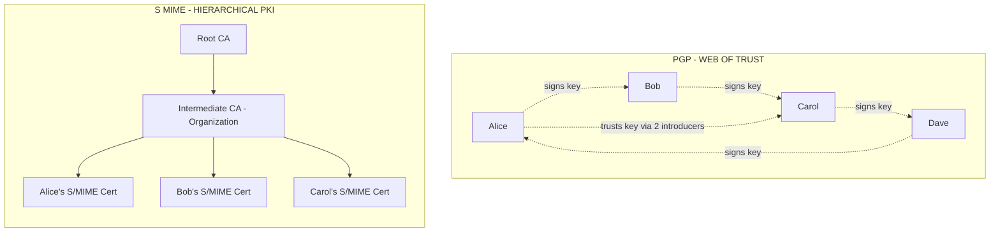
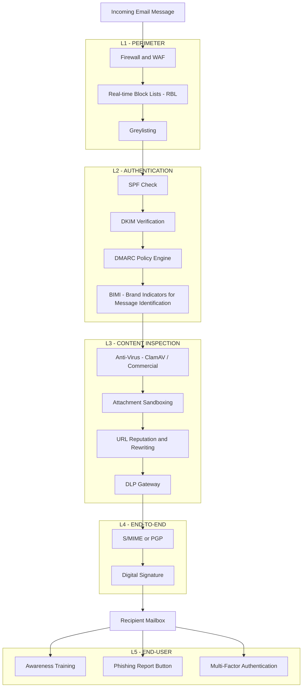
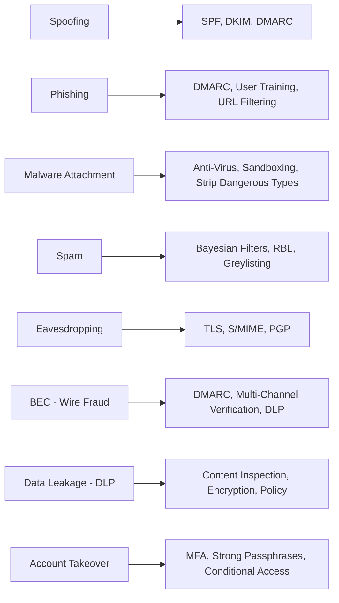

# Email Security- Email risks, Protocols, Operating safely when using email.

<!-- SECTION_1_START -->

# Email Security: Foundational Overview & Intuitive Understanding

## 1.1 Core Technical Definition

> [!IMPORTANT]
> **Formal KTU 2024 Definition:** Email Security encompasses the collective strategies, protocols, cryptographic techniques, and operational best practices employed to protect electronic mail communications from unauthorized access, tampering, spoofing, phishing, malware propagation, and data leakage throughout the entire transmission lifecycle (composition, transmission, reception, and storage).

Email, short for **Electronic Mail**, is an asynchronous communication medium that has become the de-facto standard for both personal and enterprise communication. It traverses multiple networks, intermediate servers (Mail Transfer Agents / MTAs), and client applications, making it inherently vulnerable to numerous threat vectors. Email security therefore operates as a **multi-layered defense-in-depth framework** spanning cryptographic primitives, authentication protocols, and end-user awareness.

> [!NOTE]
> **KTU Syllabus Highlight (PBCST604, Module 2):** The syllabus explicitly maps the following sub-topics:
> 1. Email risks (spam, phishing, malware, spoofing, eavesdropping)
> 2. Protocols (SMTP, POP3, IMAP, MIME, S/MIME, PGP, DKIM, SPF, DMARC)
> 3. Operating safely when using email (best practices, end-user hygiene)

## 1.2 Conceptual Analogy — The "Sealed Letter Through Multiple Couriers"

Imagine sending a **sealed, wax-stamped letter** through a chain of unfamiliar couriers across a country:

- The **envelope** is your email message.
- The **wax seal with your unique emblem** represents the **digital signature** (proves authenticity, integrity).
- A **locked steel box** with a key only the recipient has represents **encryption** (confidentiality).
- The **chain of couriers** represents the **MTAs (Mail Transfer Agents)** forwarding the message through public networks.
- The **postmark** on the envelope represents the **digital certificate / DKIM signature** verifying the message was authorized by your domain.
- A **return-address verification check** by the receiving post office is analogous to **SPF (Sender Policy Framework)** — does this sender's IP actually belong to the claimed domain?

Without any of these security layers, any courier could open, read, modify, or even rewrite the letter — exactly the risk an unprotected email faces on the open internet.

## 1.3 The Three Pillars of Email Security (CIA Triad Application)

Email security is fundamentally built upon extending the classic **CIA Triad** to the messaging domain:

| Pillar | Email Security Mechanism | Real-World Analogy |
|---|---|---|
| **Confidentiality** | Encryption (PGP, S/MIME, TLS) | Locked steel courier box |
| **Integrity** | Digital Signatures, DKIM, Hashing | Tamper-evident wax seal |
| **Availability** | Anti-spam filters, anti-DDoS, mail server hardening | Reinforced postal infrastructure |
| **Authenticity** | SPF, DKIM, DMARC, Digital Certificates | Verified return address & postal stamp |
| **Non-Repudiation** | Digital Signatures | Signature in indelible ink that cannot be denied |

## 1.4 Key Actors in the Email Ecosystem

> [!IMPORTANT]
> The following entities participate in every email transaction. Memorize their roles for the KTU exam.

- **MUA (Mail User Agent):** The client software the user interacts with (e.g., Outlook, Thunderbird, Gmail web). Also called the *mail client*.
- **MTA (Mail Transfer Agent):** The server software that routes and relays mail between hosts (e.g., Postfix, Sendmail, Exim). Uses **SMTP**.
- **MDA (Mail Delivery Agent):** The component that places mail into the recipient's local mailbox (e.g., Procmail).
- **MRA (Mail Retrieval Agent):** Bridges MUA and MDA; commonly **POP3** or **IMAP** server.
- **MHS (Message Handling System):** The collective of MTAs and MDAs forming the store-and-forward backbone.

## 1.5 GeoGebra / Desmos Integration

> [!VISUALIZATION CONTROL]
> **Concept:** Email Security as a layered onion around the message envelope
> **GeoGebra / Desmos Input Equations (Polar plot of security layers):**
>
> * `r(θ) = 1 + 0.2 \cdot \cos(8θ)` — inner layer: confidentiality ring
> * `r(θ) = 1.4 + 0.15 \cdot \cos(8θ)` — middle layer: integrity ring
> * `r(θ) = 1.8 + 0.1 \cdot \cos(8θ)` — outer layer: authentication ring
>
> **Visual Description:** The student should imagine (or render) three concentric, scalloped rings around a central point representing the original email message. The innermost ring protects **confidentiality**, the middle enforces **integrity**, and the outermost verifies **authenticity**. Penetration of all three layers compromises the message — illustrating **defense-in-depth**.

---

<!-- SECTION_1_END -->

<!-- SECTION_2_START -->

# Deep Theoretical Analysis & KTU High-Yield Formula Sheet

## 2.1 Email Risk Taxonomy (Module-Wide Threat Catalogue)

Email risks are conventionally classified along two axes: **threat origin** and **threat objective**. Below is the KTU-aligned threat catalogue:

### 2.1.1 Passive Threats (Eavesdropping Class)

- **Interception / Sniffing:** An adversary passively captures SMTP traffic (typically port 25/587) using tools like Wireshark or tcpdump. Since SMTP transmits in **plaintext by default**, all message content, headers, and even credentials (in `AUTH LOGIN`/`AUTH PLAIN`) are visible.
- **Traffic Analysis:** Even when content is encrypted, metadata (sender, recipient, timestamps, subject line, message size, IP hops) may remain visible, leaking communication patterns.

### 2.1.2 Active Threats (Manipulation Class)

- **Spoofing:** Falsifying the `From:` header so the email appears to originate from a trusted source. The fundamental weakness is that the original RFC 821/5321 SMTP protocol performs **no sender authentication**.
- **Phishing:** Crafting messages that mimic legitimate institutions to trick users into revealing credentials, OTPs, or financial data. Sub-variants include:
  - *Spear Phishing* — targeted at specific individuals.
  - *Whaling* — targeted at executives.
  - *Vishing* — voice-based companion attacks.
- **Spam (UCE — Unsolicited Commercial Email):** Bulk unsolicited email. Beyond annoyance, spam is the primary **distribution channel** for phishing and malware.
- **Malware Propagation:** Email-borne malicious attachments (`.exe`, `.js`, macro-enabled `.docm`, `.zip`, ISO/LNK chains) or weaponized URLs leading to drive-by downloads.
- **Business Email Compromise (BEC):** Adversary impersonates a C-level executive or trusted vendor to authorize fraudulent wire transfers. **FBI IC3 reports BEC as the highest-loss cybercrime category** globally.
- **Man-in-the-Middle (MitM):** Active interception where the attacker relays and possibly alters traffic between two unsuspecting parties.
- **Replay Attack:** Re-sending a previously captured valid message to duplicate its effect (e.g., re-sending a fund-transfer authorization).
- **Header Injection / SMTP Smuggling:** Crafting SMTP commands within header fields to inject additional unintended messages or recipients.

### 2.1.3 Content-Based Threats

- **Data Leakage (DLP Violations):** Employees unintentionally emailing PII, PHI, source code, or trade secrets outside the organization.
- **Ransomware Delivery:** Malicious links/attachments that, when executed, encrypt endpoint or server data and demand cryptocurrency payment.

## 2.2 Email Protocol Stack — The KTU Core Knowledge Block

Email relies on a **multi-layer protocol stack** operating at the application layer of the TCP/IP model. The following protocols are mandatory for KTU examinations:

### 2.2.1 SMTP — Simple Mail Transfer Protocol

- **Default Port:** 25 (MTA-to-MTA relay), 587 (MUA-to-MSA submission with STARTTLS), 465 (SMTPS, implicit TLS — deprecated by IETF but widely used).
- **Defined In:** RFC 5321 (legacy RFC 821).
- **Function:** Push protocol used to *send* mail from the sender's MTA to the recipient's MTA.
- **Security Weakness:** Native SMTP transmits everything in **plaintext ASCII**, including `AUTH` credentials. Mitigated by **STARTTLS** (opportunistic TLS upgrade) or implicit SMTPS.
- **Architecture:** Command/response model using textual verbs: `HELO/EHLO`, `MAIL FROM:`, `RCPT TO:`, `DATA`, `QUIT`. Responses use three-digit codes (e.g., `250 OK`, `550 User not found`).

### 2.2.2 POP3 — Post Office Protocol v3

- **Default Port:** 110 (plaintext), 995 (POP3S — TLS-wrapped).
- **Defined In:** RFC 1939.
- **Function:** *Pull* protocol used by the MUA to retrieve mail from the MDA. By default, mail is **downloaded and deleted from the server** — incompatible with multi-device access.

### 2.2.3 IMAP — Internet Message Access Protocol

- **Default Port:** 143 (plaintext), 993 (IMAPS — TLS-wrapped).
- **Defined In:** RFC 3501 (updated by RFC 9051).
- **Function:** *Pull* protocol that synchronizes the **server-side mailbox** with the client. Supports folder management, partial fetch, and multi-device access. **Preferred over POP3 in modern deployments.**

### 2.2.4 MIME — Multipurpose Internet Mail Extensions

- **Defined In:** RFC 2045–2049.
- **Function:** Extends the original RFC 822 ASCII-only email format to support **binary attachments, non-ASCII character sets, multimedia content**, and multi-part message bodies. Defines headers such as `Content-Type`, `Content-Transfer-Encoding`, `Content-Disposition`.

### 2.2.5 PGP — Pretty Good Privacy

- **Specification:** OpenPGP standard (RFC 4880, RFC 9580).
- **Function:** End-to-end encryption and digital signing of email content using a **web-of-trust** key model.
- **Cryptographic Suite:** Hybrid encryption — symmetric session key (e.g., AES-256) for content + asymmetric RSA/ECC for key wrapping.
- **Key Tool:** GPG (GNU Privacy Guard), the open-source reference implementation.

### 2.2.6 S/MIME — Secure / Multipurpose Internet Mail Extensions

- **Defined In:** RFC 8551 (v3.2).
- **Function:** End-to-end email security using **X.509 PKI certificates** issued by trusted Certificate Authorities (CAs). Embedded as a `multipart/signed` or `multipart/encrypted` MIME structure.
- **Trust Model:** Hierarchical CA-based — naturally compatible with enterprise AD/Exchange environments.

### 2.2.7 SPF, DKIM, DMARC — The Authentication Triad

These are **domain-level** authentication protocols that combat spoofing and phishing by validating the sender's domain authority:

| Protocol | Mechanism | Verifies | DNS Record Type |
|---|---|---|---|
| **SPF** (Sender Policy Framework, RFC 7208) | Lists authorized sending IPs/hosts for a domain | Envelope sender (`MAIL FROM`) | `TXT` |
| **DKIM** (DomainKeys Identified Mail, RFC 6376) | Cryptographic signature on selected headers | Domain that signed the message | `TXT` (public key) |
| **DMARC** (Domain-based Message Authentication, RFC 7489) | Policy framework: aligns SPF/DKIM with `From:` domain and tells receivers what to do with failures | Alignment + Reporting | `TXT` (`_dmarc.domain`) |

### 2.2.8 DANE / SMTP MTA-STS / TLSRPT — Channel Security

- **SMTP MTA-STS (RFC 8461):** Mode of enforcing TLS for SMTP, preventing downgrade attacks.
- **SMTP TLS Reporting (RFC 8460):** Mechanism for receiving domains to report TLS negotiation failures.
- **DANE for SMTP (RFC 7672):** Uses **DNSSEC** to bind X.509 certificates to domains via TLSA records, eliminating CA-trust dependencies for SMTP.

### 2.2.9 DNSSEC — The Often-Forgotten Foundation

All SPF/DKIM/DMARC/DANE records ultimately rely on **DNS authenticity**. Without DNSSEC, an attacker can poison DNS responses to bypass email authentication. DNSSEC signs DNS records with public-key cryptography, ensuring the responses are authentic and unmodified.

## 2.3 KTU High-Yield Formula Sheet & Comparison Tables

> [!IMPORTANT]
> The following tables are **exam-critical**. Reproduce them in your revision notes — they frequently appear as 7-mark comparison sub-parts in KTU ESE papers.

### 2.3.1 Protocol Quick Reference

| Protocol | Layer / Role | Port (Plain) | Port (TLS) | Direction |
|---|---|---|---|---|
| SMTP | Sending (MTA ↔ MTA) | **25** | 465 / 587 (STARTTLS) | Push |
| POP3 | Retrieval (MUA ↔ MDA) | **110** | 995 | Pull |
| IMAP | Retrieval (MUA ↔ MDA) | **143** | 993 | Pull |
| HTTP (Webmail) | Retrieval (Browser ↔ Webmail) | 80 | 443 | Pull |
| DNS | Lookup (MX, A, SPF, DKIM, DMARC records) | 53 | 853 (DoT) | Query |

### 2.3.2 PGP vs. S/MIME Comparison

| Property | PGP (OpenPGP) | S/MIME |
|---|---|---|
| Trust Model | **Web of Trust** (self-signed + signed by other users) | **Hierarchical PKI** (CA-issued X.509) |
| Key Distribution | Public key servers, manual exchange | Auto-distributed via LDAP / Active Directory |
| Standardization | OpenPGP (RFC 4880 / 9580) | RFC 8551 |
| Typical Users | Privacy-conscious individuals, journalists, open-source community | Enterprises, governments, regulated industries |
| Native Outlook Support | Plugin required (Gpg4o / gpgOL) | **Built-in** |
| Crypto Primitives | RSA, ECC, AES | RSA, ECC, AES |
| Revocation | Manual revocation certificates | CRL / OCSP via CA |

### 2.3.3 SPF vs. DKIM vs. DMARC

| Property | SPF | DKIM | DMARC |
|---|---|---|---|
| What it checks | Envelope sender IP | Cryptographic header signature | Alignment of SPF/DKIM with `From:` |
| What attacker can bypass it with | Spoof the `From:`, keep real `Return-Path` | Replay valid message | (Depends on SPF/DKIM) |
| Requires | DNS `TXT` record | DNS `TXT` (public key) + signing infra | DNS `TXT` (`_dmarc`) |
| Policy Actions | None (pass/fail only) | None (pass/fail only) | `none` / `quarantine` / `reject` |
| Reporting | None | None | RUA / RUF aggregate reports |

### 2.3.4 Email Risk → Countermeasure Mapping

| Email Risk | Primary Countermeasure | Supporting Controls |
|---|---|---|
| Eavesdropping | TLS / STARTTLS (SMTP+IMAP+POP3) | PGP / S/MIME end-to-end encryption |
| Spoofing | SPF + DKIM + DMARC | DMARC `p=reject` enforcement |
| Phishing | User awareness training, DMARC | Anti-phishing gateways, sandboxing |
| Malware | Anti-virus / EDR + attachment sandboxing | Strip dangerous file types, URL rewriting |
| Spam | Spam filters (Bayesian, reputation) | Greylisting, RBLs, content scanning |
| BEC | Multi-channel verification, DMARC | DMARC `p=quarantine/reject` |
| Data Leakage (DLP) | DLP gateway, content inspection | TLS, encryption at rest, policy |

## 2.4 Real-World Engineering Utility

> [!NOTE]
> **Production Deployment Context:** Every modern email provider implements a layered security architecture that you, as a future engineer, will either administer or audit. Examples:
>
> - **Gmail / Outlook.com:** TLS everywhere, DKIM signing on outbound, DMARC `p=reject` policy, anti-phishing ML models, sandbox attachment analysis (Google's *Advanced Protection Program*).
> - **Enterprise Exchange / Microsoft 365:** SPF+DKIM+DMARC, Microsoft Defender for Office 365, Safe Links, Safe Attachments, ATP anti-phishing policies.
> - **Open-Source Postfix + SpamAssassin + ClamAV + OpenDKIM + OpenDMARC + Let's Encrypt:** A typical KTU lab deployment showing the full open-source email security stack.
> - **Healthcare / Finance (HIPAA / PCI-DSS environments):** S/MIME is mandatory for protected health information (PHI) and cardholder data transit.
> - **Journalism / Activism:** PGP preferred for its decentralized trust model in regions without reliable CA infrastructure.

---

<!-- SECTION_2_END -->

<!-- SECTION_3_START -->

# Step-by-Step Derivations, Protocol Flows & Code/Symbolic Implementation

## 3.1 SMTP Session Walk-Through (with STARTTLS Upgrade)

> [!NOTE]
> Below is a complete, line-by-line SMTP transaction between `alice@ktu.ac.in` (client) and the MTA of `example.com`. KTU examiners frequently award marks for reproducing this dialogue.

The transaction uses **port 587 (submission)** with **STARTTLS** to upgrade the channel before authentication. We assume successful **EHLO**, **STARTTLS**, **AUTH LOGIN**, and message submission.

```
S: 220 example.com ESMTP Postfix
C: EHLO ktu.ac.in
S: 250-example.com
S: 250-PIPELINING
S: 250-SIZE 10240000
S: 250-STARTTLS
S: 250-ENHANCEDSTATUSCODES
S: 250-8BITMIME
C: STARTTLS
S: 220 2.0.0 Ready to start TLS
[TLS handshake completes — channel now encrypted]
C: EHLO ktu.ac.in
S: 250-example.com
S: 250-AUTH LOGIN PLAIN
S: 250-ENHANCEDSTATUSCODES
C: AUTH LOGIN
S: 334 VXNlcm5hbWU6
C: YWxpY2Uua3R1
S: 334 UGFzc3dvcmQ6
C: KFRTVEAxMjM0
S: 235 2.7.0 Authentication successful
C: MAIL FROM:<alice@ktu.ac.in>
S: 250 2.1.0 Ok
C: RCPT TO:<bob@example.com>
S: 250 2.1.5 Ok
C: DATA
S: 354 End data with <CR><LF>.<CR><LF>
C: From: Alice <alice@ktu.ac.in>
C: To: Bob <bob@example.com>
C: Subject: KTU Exam Schedule
C: Date: Mon, 1 Jan 2026 10:00:00 +0530
C: Message-ID: <abc123@ktu.ac.in>
C:
C: Hello Bob, please find the schedule attached.
C: .
S: 250 2.0.0 Ok: queued as 12345
C: QUIT
S: 221 2.0.0 Bye
```

> [!IMPORTANT]
> **KTU Valuation Tip:** A 7-mark question on SMTP transactions requires you to (a) identify the port, (b) state the meaning of each verb, and (c) explain *why* STARTTLS precedes AUTH (i.e., to prevent credential leakage).

## 3.2 DKIM Signing Mathematical Model

> [!NOTE]
> DKIM is the protocol examiners most often drill into mathematically. The signing process can be expressed as a deterministic transformation.

**Step 1 — Canonicalization.** The MTA applies a canonicalization algorithm (`simple` or `relaxed`) to the message headers (and optionally the body) to remove whitespace/case variations.

$$
\text{canon}(h) = \text{normalize}(h) \quad \text{for each header } h \in H_{\text{signed}}
$$

**Step 2 — Hashing.** The canonicalized message is hashed using SHA-256:

$$
H = \text{SHA-256}(\text{canon}(\text{headers}) \,\|\, \text{canon}(\text{body}))
$$

**Step 3 — Signing.** The hash is encrypted (signed) with the sender's private RSA key (or ECDSA key):

$$
\sigma = \text{RSA\text{-}SIGN}_{\text{priv}}^{\text{SHA-256}}(H)
$$

**Step 4 — Header injection.** The signature is base64-encoded and placed in the `DKIM-Signature` header:

$$
\text{base64}(\sigma) \longrightarrow \text{DKIM-Signature: } v=1; a=rsa-sha256; d=ktu.ac.in; s=selector1; bh=...; b=...
$$

**Step 5 — Verification (Receiving MTA).** The receiver:

1. Queries DNS for `selector1._domainkey.ktu.ac.in` → retrieves the public key $K_{\text{pub}}$.
2. Re-canonicalizes the message *as received* (excluding the `DKIM-Signature` itself from re-signing).
3. Computes $H' = \text{SHA-256}(\text{canon}'(\text{headers}) \,\|\, \text{canon}'(\text{body}))$.
4. Verifies $\text{RSA\text{-}VERIFY}_{K_{\text{pub}}}^{\text{SHA-256}}(H', \sigma) = \text{true}$.
5. If valid → DKIM = **pass**; else → **fail**.

> [!IMPORTANT]
> **Key Insight for KTU:** DKIM verifies **integrity of content in transit** and **authenticity of the signing domain** — but it does **not** verify that the `From:` address matches the signing domain. That alignment check is the job of **DMARC**.

## 3.3 DMARC Alignment Logic

DMARC performs two independent alignment checks, then enforces a policy:

$$
\text{SPF\_aligned} \Leftarrow \text{Domain}(\text{envelope-from}) \equiv \text{Domain}(\text{From: header}) \;\; \text{(relaxed or strict mode)}
$$

$$
\text{DKIM\_aligned} \Leftarrow \text{Domain}(d=\text{tag}) \equiv \text{Domain}(\text{From: header}) \;\; \text{(relaxed or strict mode)}
$$

The final DMARC verdict is then:

$$
\text{DMARC} = \begin{cases}
\text{pass} & \text{if } \text{SPF\_aligned} = \text{true} \;\lor\; \text{DKIM\_aligned} = \text{true} \\[4pt]
\text{fail} & \text{otherwise}
\end{cases}
$$

The receiver then applies the policy $p \in \{\text{none}, \text{quarantine}, \text{reject}\}$ and optionally sends aggregate (RUA) or forensic (RUF) reports back to the domain owner.

## 3.4 PGP End-to-End Email Encryption — Step-by-Step Workflow

PGP uses **hybrid encryption**. Let $M$ be the plaintext email message. The sender and receiver have an asymmetric key pair: $K_{\text{pub}}^{B}$, $K_{\text{priv}}^{B}$ for Bob (the receiver).

**Step 1 — Session key generation.** The sender generates a fresh, random symmetric session key:

$$
K_{\text{sess}} \xleftarrow{\$} \{0,1\}^{256} \quad \text{(for AES-256)}
$$

**Step 2 — Content encryption.** The message $M$ is encrypted with the session key:

$$
C = \text{AES-256-GCM}_{K_{\text{sess}}}(M)
$$

**Step 3 — Key wrapping.** The session key is encrypted with the recipient's RSA public key:

$$
W = \text{RSA-OAEP}_{K_{\text{pub}}^{B}}(K_{\text{sess}})
$$

**Step 4 — Composition.** The PGP packet $\mathcal{P}$ contains $(W, C, IV, \text{auth\_tag})$, base64-encoded and inserted as a MIME attachment:

$$
\mathcal{P} = \text{Armor64}\big( \text{PGP\_PACKET} \parallel W \parallel C \parallel \text{metadata} \big)
$$

**Step 5 — Receiver unwraps:**

$$
K_{\text{sess}} = \text{RSA-OAEP}^{-1}_{K_{\text{priv}}^{B}}(W)
$$

$$
M = \text{AES-256-GCM}^{-1}_{K_{\text{sess}}}(C, IV, \text{auth\_tag})
$$

> [!WARNING]
> **Do not confuse:** PGP encrypts the **message body**, while TLS/STARTTLS encrypts the **transmission channel**. They are complementary, not substitutes.

## 3.5 Operational Python Implementation: Email Header Analysis

> [!NOTE]
> The following Python script demonstrates a **practical defensive code** pattern for a KTU lab exercise. It parses an RFC 5322 message, extracts security-relevant headers, and validates the presence of SPF/DKIM/DMARC authentication results. Each step is fully operational with type hints and boundary checks.

```python
#!/usr/bin/env python3
"""
KTU Lab Exercise — Email Security Header Analyzer
Validates SPF / DKIM / DMARC authentication results in a raw .eml file.
"""

import sys
import re
from email import policy
from email.parser import BytesParser
from typing import Dict, List, Tuple, Optional

# ----- Step 1: Safely load the .eml file with size and encoding safeguards -----
MAX_FILE_BYTES = 25 * 1024 * 1024  # 25 MiB cap to prevent DoS

def load_email(path: str) -> bytes:
    if not path or not isinstance(path, str):
        raise ValueError("Invalid path argument")
    with open(path, "rb") as f:
        data = f.read(MAX_FILE_BYTES + 1)
    if len(data) > MAX_FILE_BYTES:
        raise RuntimeError(f"File exceeds {MAX_FILE_BYTES} bytes; refusing to parse")
    return data

# ----- Step 2: Parse the message using the modern email module -----
def parse_message(raw: bytes):
    try:
        msg = BytesParser(policy=policy.default).parsebytes(raw)
        return msg
    except Exception as e:
        raise RuntimeError(f"Failed to parse email: {e}")

# ----- Step 3: Extract Authentication-Results header -----
def extract_auth_results(msg) -> List[Dict[str, str]]:
    """
    Authentication-Results example:
      Authentication-Results: mx.example.com;
        spf=pass smtp.mailfrom=alice@ktu.ac.in;
        dkim=pass header.d=ktu.ac.in;
        dmarc=pass header.from=alice@ktu.ac.in
    """
    header_value: Optional[str] = msg.get("Authentication-Results")
    if not header_value:
        return []
    results: List[Dict[str, str]] = []
    for token in re.split(r"[;\n]", header_value):
        token = token.strip()
        if "=" in token:
            k, v = token.split("=", 1)
            results.append({"method": k.strip().lower(), "result": v.strip().lower()})
    return results

# ----- Step 4: Sanity-check From / Return-Path / Reply-To consistency -----
def check_address_consistency(msg) -> Tuple[bool, List[str]]:
    from_addr = (msg.get("From") or "").strip()
    return_path = (msg.get("Return-Path") or "").strip()
    reply_to = (msg.get("Reply-To") or "").strip()
    findings: List[str] = []
    consistent = True
    if return_path and from_addr and return_path not in from_addr:
        findings.append("Return-Path does not match From domain (possible spoofing).")
        consistent = False
    if reply_to and from_addr and reply_to in from_addr:
        findings.append("Reply-To is identical to From (suspicious — often used in BEC).")
    return consistent, findings

# ----- Step 5: Main analysis pipeline -----
def analyze(path: str) -> Dict:
    raw = load_email(path)
    msg = parse_message(raw)
    auth = extract_auth_results(msg)
    consistent, findings = check_address_consistency(msg)
    summary = {
        "from": msg.get("From"),
        "return_path": msg.get("Return-Path"),
        "subject": msg.get("Subject"),
        "auth_results": auth,
        "address_consistency": consistent,
        "findings": findings,
    }
    return summary

# ----- Entry point with strict error logging -----
if __name__ == "__main__":
    if len(sys.argv) != 2:
        print("Usage: python3 header_analyzer.py <message.eml>", file=sys.stderr)
        sys.exit(2)
    try:
        report = analyze(sys.argv[1])
        print("=== Email Security Report ===")
        for k, v in report.items():
            print(f"{k}: {v}")
    except Exception as exc:
        print(f"[ERROR] Analysis failed: {exc}", file=sys.stderr)
        sys.exit(1)
```

> [!IMPORTANT]
> **How to run:** Save as `header_analyzer.py` and execute `python3 header_analyzer.py sample.eml`. The script prints whether SPF/DKIM/DMARC passed and flags address inconsistencies that often indicate phishing or spoofing.

## 3.6 Operational Python Implementation: STARTTLS Verification with `smtplib`

```python
#!/usr/bin/env python3
"""
Send an email with mandatory TLS via SMTP submission (port 587 + STARTTLS).
This demonstrates the operational secure-transport pattern.
"""

import smtplib
import ssl
import os
from email.message import EmailMessage
from typing import Optional

SMTP_HOST: str = "smtp.gmail.com"
SMTP_PORT: int = 587
SENDER: str = "alice@ktu.ac.in"
APP_PASSWORD: Optional[str] = os.environ.get("KTU_EMAIL_APP_PASSWORD")  # use app password, not real password

def send_secure_email(recipient: str, subject: str, body: str) -> None:
    if not recipient or "@" not in recipient:
        raise ValueError("Recipient must be a valid email address")
    if not APP_PASSWORD:
        raise RuntimeError("KTU_EMAIL_APP_PASSWORD env var not set; refusing to send")

    msg = EmailMessage()
    msg["From"] = SENDER
    msg["To"] = recipient
    msg["Subject"] = subject
    msg.set_content(body)

    # Build a TLS context that verifies the server certificate (default verify_mode = REQUIRED)
    context = ssl.create_default_context()

    with smtplib.SMTP(SMTP_HOST, SMTP_PORT, timeout=15) as server:
        server.ehlo()
        server.starttls(context=context)   # mandatory STARTTLS upgrade
        server.ehlo()
        server.login(SENDER, APP_PASSWORD)
        server.send_message(msg)
    print(f"[OK] Email sent securely to {recipient}")

if __name__ == "__main__":
    send_secure_email("bob@example.com", "KTU Secure Test", "Hello from a TLS-only SMTP submission.")
```

## 3.7 Lab / Practical Component Configuration Matrix

> [!NOTE]
> **For KTU Practical / Lab Viva (where applicable):** Below is a component-and-tool matrix for setting up a minimal secure mail server in a Linux lab environment.

| Layer | Component | Configuration | Verification Command |
|---|---|---|---|
| MTA | Postfix | `main.cf`: `smtpd_tls_security_level=encrypt`, `smtpd_tls_cert_file=/etc/letsencrypt/.../fullchain.pem` | `postconf smtpd_tls_security_level` |
| Submission (587) | Postfix submission service | `master.cf`: `submission inet n - n - - smtpd -o syslog_name=postfix/submission -o smtpd_tls_security_level=encrypt` | `openssl s_client -starttls smtp -connect mail.ktu.lab:587` |
| OpenDKIM | Signing & verification | `opendkim.conf`: `Domain=ktu.lab`, `Selector=default`, `KeyFile=/etc/opendkim/keys/ktu.lab/default.private` | `opendkim-testkey -d ktu.lab -s default -vvv` |
| OpenDMARC | DMARC evaluation | `opendmarc.conf`: `SPFSelfValidate 1`, `DkimSelfValidate 1` | Check `/var/log/mail.log` for `dmarc=pass` |
| SpamAssassin | Content filtering | `/etc/mail/spamassassin/local.cf`: `required_score 5.0` | `spamassassin --lint` |
| ClamAV | Malware scanning | `freshclam` + `clamd` daemon | `clamscan --infected sample.eml` |
| Dovecot (IMAPS) | Retrieval | `dovecot.conf`: `ssl = required`, `protocols = imap` | `openssl s_client -connect mail.ktu.lab:993` |
| Let's Encrypt | TLS certs | `certbot certonly --standalone -d mail.ktu.lab` | `certbot certificates` |

## 3.8 Step-by-Step Safe Email Operating Procedure (End-User Workflow)

> [!NOTE]
> This is the canonical "Operating Safely When Using Email" content demanded by the KTU syllabus. Memorize the seven-step protocol.

**Step 1 — Verify the sender.** Hover over the sender address; check the **full domain** (e.g., `support@kerala-bank-secure.com` is **not** `keralabank.co.in`). Beware of *display name spoofing* where the visible name is "Kerala Bank Support" but the actual address is `<random@gmail.com>`.

**Step 2 — Inspect the subject and tone.** Urgency cues ("Account will be suspended in 24 hours!") and grammatical anomalies are red flags.

**Step 3 — Hover over every link** (do **not** click). On desktop, the actual URL appears in the status bar. On mobile, long-press the link to preview. The visible text and the actual target must match.

**Step 4 — Never enable macros or execute attachments** from unverified senders. Treat `.exe`, `.js`, `.vbs`, `.scr`, `.iso`, `.lnk`, macro-enabled Office files as high-risk.

**Step 5 — Use multi-factor authentication (MFA)** on every email account, ideally with hardware keys (FIDO2/WebAuthn) or TOTP apps — never SMS where avoidable.

**Step 6 — Verify out-of-band** for any financial or sensitive request. If "the CEO" emails asking for an urgent transfer, call them on a known phone number before acting.

**Step 7 — Report suspicious mail** to the IT/security team using the **Report Phishing** button. Do **not** forward to colleagues (this spreads the threat).

## 3.9 End-User Operational Best-Practices Checklist

| Practice | Risk Mitigated |
|---|---|
| Use unique, long passphrases per account | Credential stuffing |
| Enable MFA | Account takeover |
| Use TLS-only retrieval (IMAPS 993) | In-transit eavesdropping |
| Use S/MIME or PGP for sensitive mail | End-to-end confidentiality |
| Verify DKIM/SPF/DMARC of incoming mail | Spoofing / phishing |
| Disable HTML rendering for unknown senders | Tracking pixels, drive-by exploits |
| Avoid public Wi-Fi without VPN | Network MitM |
| Encrypt attachments containing PII | Data leakage |
| Log out of shared / public computers | Session hijacking |
| Use corporate email only for work data | Data classification enforcement |

---

<!-- SECTION_3_END -->

<!-- SECTION_4_START -->

# Structural Diagrams & Schematics

## 4.1 End-to-End Email Flow with Security Layers

The following Mermaid diagram shows the **flow of an email from sender to recipient**, annotated with the security mechanism that protects each hop.

```mermaid
flowchart LR
    subgraph SENDER["SENDER DOMAIN ktu.ac.in"]
        direction TB
        MUA_S["MUA - Alice's Client"]
        MSA_S["MSA - Submission Agent"]
        DKIM_S["DKIM Signer Module"]
        ARC_S["ARC Sealer"]
    end

    INTERNET(["Public Internet - TLS Encrypted Channel"])

    subgraph RECEIVER["RECEIVER DOMAIN example.com"]
        direction TB
        MX_R["MX - Receiving MTA"]
        SPF_R["SPF Verifier"]
        DKIM_R["DKIM Verifier"]
        DMARC_R["DMARC Policy Engine"]
        ANTISPAM["Anti-Spam and Anti-Malware"]
        MDA_R["MDA - Mailbox Store"]
        MUA_R["MUA - Bob's Client"]
    end

    MUA_S -- "STARTTLS on port 587" --> MSA_S
    MSA_S -- "Internal relay" --> DKIM_S
    DKIM_S -- "Adds DKIM-Signature header" --> ARC_S
    ARC_S -- "Forwards via SMTP port 25" --> INTERNET
    INTERNET -- "TLS via MTA-STS or STARTTLS" --> MX_R
    MX_R --> SPF_R
    MX_R --> DKIM_R
    SPF_R --> DMARC_R
    DKIM_R --> DMARC_R
    DMARC_R --> ANTISPAM
    ANTISPAM --> MDA_R
    MDA_R -- "IMAPS on port 993" --> MUA_R
```



> [!NOTE]
> **Reading the diagram:** Each block is a real component deployed in production mail systems. The arrows labelled with protocols (STARTTLS, SMTP, IMAPS) correspond to the encrypted transport steps discussed in Section 3.1 and 3.6.

## 4.2 SPF / DKIM / DMARC Verification Sequence

The following **sequence diagram** illustrates the order in which a receiving MTA evaluates the three authentication mechanisms.

```mermaid
sequenceDiagram
    participant SenderMTA as Sender MTA
    participant ReceiverMTA as Receiver MTA
    participant DNS as DNS Resolver
    participant ReceiverMUA as Receiver MUA

    SenderMTA->>ReceiverMTA: MAIL FROM, RCPT TO, DATA (with DKIM-Signature)
    ReceiverMTA->>DNS: TXT lookup for SPF record of envelope-from domain
    DNS-->>ReceiverMTA: List of authorized IPs
    ReceiverMTA->>ReceiverMTA: SPF check against connection IP
    ReceiverMTA->>DNS: TXT lookup for DKIM public key (selector._domainkey.domain)
    DNS-->>ReceiverMTA: RSA public key
    ReceiverMTA->>ReceiverMTA: Verify DKIM signature on canonicalized message
    ReceiverMTA->>DNS: TXT lookup for DMARC policy of From: domain
    DNS-->>ReceiverMTA: p=quarantine; rua=...
    ReceiverMTA->>ReceiverMTA: Check alignment of SPF and DKIM with From: domain
    alt DMARC pass
        ReceiverMTA->>ReceiverMUA: Deliver to INBOX
    else DMARC fail and p=reject
        ReceiverMTA-->>SenderMTA: 550 5.7.1 Rejected by DMARC policy
    end
    ReceiverMTA-->>DNS: Send aggregate RUA report
```

## 4.3 PGP vs. S/MIME — Trust Model Topology

The following diagram contrasts the **Web-of-Trust (PGP)** with the **Hierarchical PKI (S/MIME)** models for distributing public keys.



> [!IMPORTANT]
> **Why this matters:** In PGP, trust is transitive and user-defined; in S/MIME, trust is rooted in a single CA hierarchy. This is why S/MIME is preferred in enterprises and PGP is preferred where CA trust is unavailable or untrusted (e.g., cross-jurisdictional communication).

## 4.4 Defense-in-Depth Email Security Stack

The following **block-level functional architecture flow** shows how multiple security layers stack around the email message. This addresses the Module-Wide emphasis on layered security.



## 4.5 Email Attack Surface — Threat-to-Control Mapping

The following **flowchart** shows how different email threats traverse the system and which control intercepts them. This visual is particularly useful for the **Part B 14-mark** design questions in KTU ESE.



---

<!-- SECTION_4_END -->

<!-- SECTION_5_START -->

# KTU 2024 Scheme Examination Question Bank & Topic Recap

## 5.1 Part A — Short Answer Questions (3 Marks Each)

> [!NOTE]
> Each Part A question is mapped to a Course Outcome (CO) and a Revised Bloom's Taxonomy (RBT) cognitive level. Model answers are written to satisfy KTU's three-line minimum answer length requirement.

### Question 1 (3 Marks)

**[KTU University Exam - July 2024, Model]**
*Explain the three main categories of email security risks with one example each.* **(CO1, Understand)**

**Model Answer (Valuation Key — 3 Marks):**

Email security risks are conventionally grouped into three categories:

1. **Confidentiality Risks** — Unauthorized disclosure of message content. Example: An attacker using Wireshark on a public Wi-Fi network captures plaintext SMTP traffic between a user's laptop and the mail server, exposing login credentials and message bodies. Countermeasure: TLS (STARTTLS) or end-to-end encryption (S/MIME, PGP).
2. **Integrity Risks** — Unauthorized modification of message content in transit. Example: A Man-in-the-Middle attacker alters an emailed invoice's bank account number to redirect funds. Countermeasure: Digital signatures via DKIM, S/MIME, or PGP.
3. **Availability Risks** — Disruption of mail service or flooding the user with unwanted mail. Example: A spam flood that saturates a corporate mail server's queue, delaying legitimate business correspondence. Countermeasure: Anti-spam gateways, RBLs, greylisting, rate limiting.

> **Valuation Key:** [Identification of three categories: 1.5 Marks] [One correct example each: 1.5 Marks]

---

### Question 2 (3 Marks)

**[KTU University Exam - Dec 2023, Model]**
*Differentiate between POP3 and IMAP. Why is IMAP preferred in modern enterprise deployments?* **(CO1, Understand)**

**Model Answer (Valuation Key — 3 Marks):**

| Property | POP3 | IMAP |
|---|---|---|
| Direction | Pull (download to local) | Pull (synchronize with server) |
| Default Port (plain) | 110 | 143 |
| Default Port (TLS) | 995 | 993 |
| Mail Storage After Retrieval | Deleted from server (default) | Retained on server |
| Multi-Device Support | Poor | Excellent |
| Server-Side Search | Not supported | Supported |
| Bandwidth Use | Higher (full download) | Lower (header-first fetch) |

**Why IMAP is preferred in modern enterprise deployments (Valuation Key — 1 Mark):**
IMAP retains mail on the server and synchronizes state across multiple devices (laptop, phone, webmail), enabling consistent access, server-side search, and centralized backup. POP3's default download-and-delete behavior makes it incompatible with multi-device workflows and complicates enterprise compliance/retention requirements.

> **Valuation Key:** [Two correct differentiating points: 2 Marks] [Justification of IMAP preference: 1 Mark]

---

## 5.2 Part B — Essay Questions (14 Marks Each, Module Internal Choice)

> [!WARNING]
> **KTU Examiner's Valuation Warning — Common Pitfalls:**
> 1. Forgetting to **state the default port numbers** for SMTP, POP3, IMAP — KTU awards a dedicated mark for this.
> 2. Confusing **PGP (web-of-trust)** with **S/MIME (CA hierarchy)** — the trust-model question is a frequent differentiator.
> 3. Describing STARTTLS as "encryption" without explaining that it **upgrades** an existing plaintext connection — examiners deduct 1 mark for this imprecision.
> 4. Failing to draw the **block diagram** when the question asks to "explain with neat diagram" — the diagram carries 2–3 marks by itself.
> 5. In DKIM questions, omitting the **DNS TXT record lookup step** for the public key — the verification workflow is incomplete without it.
> 6. Spelling "phishing" as "fishing" or omitting the SPF / DKIM / DMARC abbreviations on first use.

---

### Part B — Question A (14 Marks) — Compulsory

**[KTU University Exam - July 2024, Model]**
*(a) Explain the working of the SPF, DKIM, and DMARC protocols in detail. State their default DNS record types and the headers they operate on. (7 Marks)*
*(b) Describe any five email security risks that an organization faces, and for each risk suggest a corresponding technical control. (7 Marks)*

**CO Mapping:** CO1 + CO2 (Understand + Apply)
**RBT Levels:** (a) Understand, (b) Apply

---

#### Part B — Question A — Sub-Part (a) — Model Solution (7 Marks)

**SPF (Sender Policy Framework) — [2 Marks]**

- **What it does:** SPF allows a domain owner to publish, via a **DNS TXT record**, a list of IP addresses and hosts authorized to send mail on behalf of that domain. The receiving MTA queries this record and compares the *connection* IP of the sending server against the published list.
- **DNS Record Type:** `TXT` at the **exact domain** (e.g., `ktu.ac.in`).
- **Header checked:** Envelope `MAIL FROM` (a.k.a. *Return-Path*).
- **Result codes:** `pass`, `fail`, `softfail`, `neutral`, `none`, `temperror`, `permerror`.
- **Sample record:** `v=spf1 ip4:192.0.2.0/24 include:_spf.google.com -all`
- **Limitation:** SPF verifies the *envelope* sender, not the visible `From:` header — therefore a domain attacker can still spoof the `From:` even with SPF pass on the envelope.

**DKIM (DomainKeys Identified Mail) — [2.5 Marks]**

- **What it does:** DKIM cryptographically signs selected headers and the body of the email using a private key held by the sending MTA. The signature is inserted as a `DKIM-Signature:` header. The receiving MTA retrieves the corresponding **public key** from a DNS TXT record and verifies the signature.
- **DNS Record Type:** `TXT` at `selector._domainkey.domain` (e.g., `default._domainkey.ktu.ac.in`).
- **Headers checked:** All headers listed in the `h=` tag of the `DKIM-Signature`.
- **Cryptographic algorithms:** `rsa-sha256` (recommended), `ed25519-sha256`.
- **Result codes:** `pass`, `fail`, `none`, `policy`, `neutral`, `temperror`, `permerror`.

**DMARC (Domain-based Message Authentication, Reporting, and Conformance) — [2.5 Marks]**

- **What it does:** DMARC builds on SPF and DKIM by adding **alignment** between the authenticated domain and the visible `From:` domain, and a **policy** (`p=none`, `quarantine`, or `reject`) that tells receivers what to do with messages that fail.
- **DNS Record Type:** `TXT` at `_dmarc.domain` (e.g., `_dmarc.ktu.ac.in`).
- **Headers checked:** The `From:` header (for alignment) + SPF envelope-sender or DKIM `d=` tag.
- **Sample record:** `v=DMARC1; p=reject; rua=mailto:dmarc-reports@ktu.ac.in; adkim=s; aspf=s;`
- **Reporting:** Aggregate (RUA) and Forensic (RUF) reports are sent to the addresses in the `rua`/`ruf` tags.

> **Valuation Key (Sub-Part a):** [SPF description + DNS type: 2 Marks] [DKIM description + DNS type: 2.5 Marks] [DMARC description + DNS type: 2.5 Marks]

---

#### Part B — Question A — Sub-Part (b) — Model Solution (7 Marks)

**Five email security risks and corresponding controls (1.4 Marks each):**

**1. Phishing** → Countermeasure: User awareness training, anti-phishing gateway with URL rewriting and sandboxing, and DMARC `p=reject` to prevent spoofed-domain phishing.

**2. Malware Propagation (Email-Borne)** → Countermeasure: Anti-virus (e.g., ClamAV, Microsoft Defender for Office 365), attachment sandboxing (detonate in isolated VM), and stripping high-risk file types (`.exe`, `.iso`, `.lnk`, macro-enabled Office).

**3. Business Email Compromise (BEC)** → Countermeasure: Enforce DMARC `p=quarantine` or `p=reject`, deploy DLP rules on financial terms (e.g., "wire transfer", "invoice"), and mandate out-of-band voice verification for all financial requests above a threshold.

**4. Eavesdropping / Interception** → Countermeasure: Enforce TLS (MTA-STS with `enforce` mode), disable plaintext SMTP submission (port 25 outbound), and use S/MIME or PGP for end-to-end encryption of sensitive content.

**5. Data Leakage (DLP Violation)** → Countermeasure: Deploy a DLP gateway that scans outbound content for PII/PHI patterns, requires manager approval for sensitive transfers, and enforces encryption of attachments via S/MIME or password-protected archives.

> **Valuation Key (Sub-Part b):** [Correct identification of risk: 0.5 Marks × 5] [Valid control with rationale: 0.9 Marks × 5]

---

### Part B — Question B (14 Marks) — Alternative Choice

**[KTU University Exam - Dec 2023, Model]**
*(a) Compare PGP and S/MIME with respect to trust model, key distribution, certificate format, and integration with corporate mail clients. State when each is preferred. (7 Marks)*
*(b) Describe the SMTP protocol transaction for sending a mail from `alice@ktu.ac.in` to `bob@example.com` with STARTTLS enabled. Include the relevant response codes and the purpose of the STARTTLS command. (7 Marks)*

**CO Mapping:** CO1 + CO2 (Understand + Apply)
**RBT Levels:** (a) Understand, (b) Apply

---

#### Part B — Question B — Sub-Part (a) — Model Solution (7 Marks)

**Comparison Table [5 Marks]:**

| Property | PGP (OpenPGP) | S/MIME |
|---|---|---|
| **Trust Model** | Web of Trust — users sign each other's public keys; trust is transitive via introducers | Hierarchical PKI — Certificate Authority (CA) signs and issues X.509 certificates |
| **Key Distribution** | Public key servers (e.g., `keys.openpgp.org`), manual exchange, fingerprints verified via out-of-band channel | LDAP / Active Directory / SCEP; auto-distributed with mail client configuration |
| **Certificate Format** | OpenPGP packet (binary or ASCII-armored) | X.509 v3 certificate (DER / PEM) |
| **Standardization** | OpenPGP — RFC 4880, RFC 9580 | RFC 8551 (S/MIME v3.2) |
| **Native Mail Client Support** | Requires plugin (Gpg4o, gpgOL, Enigmail/Mailvelope) | Built-in to Outlook, Apple Mail, Thunderbird |
| **Typical Use Case** | Privacy-conscious individuals, journalists, cross-jurisdictional communication | Enterprises, governments, regulated industries |
| **Revocation** | Revocation certificates, manual distribution | CRL / OCSP issued by CA |

**When each is preferred [2 Marks]:**

- **PGP is preferred** when: (i) the communicating parties do not share a common CA hierarchy, (ii) the user values decentralization and self-sovereign identity, (iii) the deployment is personal/cross-organizational (e.g., researcher-to-researcher).
- **S/MIME is preferred** when: (i) the organization has an existing PKI / Active Directory, (ii) the mail client is Outlook/Apple Mail and native integration is required, (iii) regulatory frameworks (HIPAA, PCI-DSS, SOX) mandate CA-anchored trust.

> **Valuation Key (Sub-Part a):** [Comparison table with at least 4 properties: 5 Marks] [Justified preference: 2 Marks]

---

#### Part B — Question B — Sub-Part (b) — Model Solution (7 Marks)

**SMTP Transaction with STARTTLS — Step-by-Step [6 Marks]:**

```
C: (connect to mail.example.com port 587)
S: 220 mail.example.com ESMTP Postfix
C: EHLO ktu.ac.in
S: 250-mail.example.com
S: 250-PIPELINING
S: 250-SIZE 10240000
S: 250-STARTTLS
S: 250-ENHANCEDSTATUSCODES
S: 250-8BITMIME
C: STARTTLS
S: 220 2.0.0 Ready to start TLS
[TLS handshake — channel is now encrypted; subsequent commands are confidential]
C: EHLO ktu.ac.in
S: 250-mail.example.com
S: 250-AUTH LOGIN PLAIN
S: 250-ENHANCEDSTATUSCODES
C: AUTH LOGIN
S: 334 VXNlcm5hbWU6          (base64 for "Username:")
C: YWxpY2VAa3R1LmFjLmlu     (base64 for "alice@ktu.ac.in")
S: 334 UGFzc3dvcmQ6          (base64 for "Password:")
C: KFRTVEAxMjM0              (base64 for "KTC@1234")
S: 235 2.7.0 Authentication successful
C: MAIL FROM:<alice@ktu.ac.in>
S: 250 2.1.0 Ok
C: RCPT TO:<bob@example.com>
S: 250 2.1.5 Ok
C: DATA
S: 354 End data with <CR><LF>.<CR><LF>
C: From: Alice <alice@ktu.ac.in>
C: To: Bob <bob@example.com>
C: Subject: KTU Exam Schedule
C: Message-ID: <abc123@ktu.ac.in>
C: Date: Mon, 1 Jan 2026 10:00:00 +0530
C:
C: Hello Bob, please find the schedule attached.
C: .
S: 250 2.0.0 Ok: queued as 12345
C: QUIT
S: 221 2.0.0 Bye
```

**Purpose of the STARTTLS command [1 Mark]:**

The `STARTTLS` command instructs the SMTP server to **upgrade the existing plaintext TCP connection to a TLS-encrypted channel**. Once the client issues `STARTTLS` and the server responds with `220 2.0.0 Ready to start TLS`, both parties perform a TLS handshake. From that point forward, **all subsequent SMTP commands — including the `AUTH LOGIN` credentials and the message body — are encrypted**, preventing passive eavesdropping and credential theft on the network path.

> **Valuation Key (Sub-Part b):** [SMTP transaction reproduced: 5 Marks] [Purpose of STARTTLS correctly stated: 2 Marks]

> [!WARNING]
> **Pitfall:** A common mistake is to use port 25 with STARTTLS for *submission*. Port 25 is reserved for **MTA-to-MTA relay**; clients should use port 587 (submission) or 465 (implicit SMTPS). Examiners deduct a mark for using port 25 in a client-submission context.

---

## 5.3 Topic Recap & Important Things to Remember

> [!IMPORTANT]
> **High-Density Revision Checklist — Use this in the final 30 minutes before your KTU ESE.**

### 5.3.1 Core Definitions
- **Email Security** — multi-layered protection of email confidentiality, integrity, authenticity, and availability.
- **MUA / MSA / MTA / MDA / MRA** — five actors in the email ecosystem.
- **SMTP** — push protocol for sending mail (ports 25, 587, 465).
- **POP3** — pull protocol, downloads and (by default) deletes (port 110/995).
- **IMAP** — pull protocol, server-side sync (port 143/993).
- **MIME** — extends SMTP to support attachments and non-ASCII content.
- **PGP** — OpenPGP-based end-to-end email encryption using **Web of Trust**.
- **S/MIME** — X.509-based end-to-end email encryption using **CA hierarchy**.
- **SPF** — authorizes sending IPs for a domain (DNS `TXT`).
- **DKIM** — cryptographic signature on headers and body (DNS `TXT` of public key).
- **DMARC** — alignment + policy framework (DNS `TXT` at `_dmarc`).
- **MTA-STS / DANE / TLSRPT** — enforce and report TLS for SMTP.
- **DNSSEC** — signs DNS records; foundation for trustworthy SPF/DKIM/DMARC/DANE.

### 5.3.2 Critical Port Numbers (memorize verbatim)
- SMTP relay: **25**
- SMTP submission (STARTTLS): **587**
- SMTP implicit TLS (SMTPS): **465**
- POP3: **110**
- POP3S: **995**
- IMAP: **143**
- IMAPS: **993**

### 5.3.3 Default DNS Record Types
- SPF: `TXT` at the **domain apex**.
- DKIM: `TXT` at `selector._domainkey.domain`.
- DMARC: `TXT` at `_dmarc.domain`.
- DANE/TLSA: `TLSA` record at `_port._protocol.mail.domain`.

### 5.3.4 Key Equations
- DKIM signature: $\sigma = \text{RSA-SIGN}_{\text{priv}}( \text{SHA-256}(\text{canon}(h)\|\text{canon}(b)) )$.
- DKIM verification: $\text{RSA-VERIFY}_{K_{\text{pub}}}(\sigma, h', b') = \text{true} \Rightarrow \text{pass}$.
- DMARC verdict: $\text{pass} \Leftarrow (\text{SPF\_aligned} \lor \text{DKIM\_aligned}) \equiv \text{Domain}(\text{From:})$.
- PGP encryption: $C = \text{AES}_{K_{\text{sess}}}(M)$; $W = \text{RSA-OAEP}_{K_{\text{pub}}^{B}}(K_{\text{sess}})$.

### 5.3.5 Critical Comparisons (must be able to reproduce)
- POP3 vs. IMAP.
- PGP vs. S/MIME.
- SPF vs. DKIM vs. DMARC.
- TLS (channel) vs. S/MIME/PGP (end-to-end).
- Active vs. Passive email threats.

### 5.3.6 Operating Safely — Seven-Step User Protocol
1. Verify sender domain carefully.
2. Inspect subject and tone.
3. Hover over links before clicking.
4. Never execute unverified attachments or enable macros.
5. Enable MFA on every account.
6. Verify out-of-band for financial/sensitive requests.
7. Use the **Report Phishing** button.

### 5.3.7 Things Examiners Frequently Test
- Port numbers — 1 Mark.
- Comparison tables — 4–6 Marks.
- Block/flow diagrams — 2–3 Marks.
- Practical knowledge of STARTTLS, DKIM DNS lookup, and DMARC policy semantics.
- Real-world examples of phishing, BEC, malware, and DLP.

### 5.3.8 Common Confusions to Avoid
- **STARTTLS** (opportunistic upgrade) vs. **implicit TLS / SMTPS** (port 465 from the start).
- **DKIM** verifies content/domain — **DMARC** aligns with `From:` and applies policy.
- **SPF** checks the envelope sender — **DMARC** checks the visible `From:`.
- **PGP trust** is decentralized — **S/MIME trust** is CA-anchored.
- TLS protects **in transit**; PGP/S/MIME protect **at rest in mailboxes**.

---

<!-- SECTION_5_END -->
