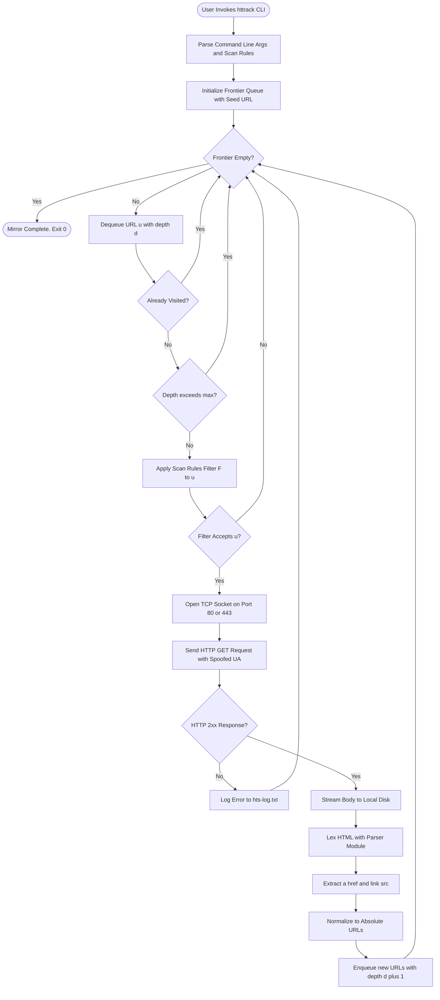
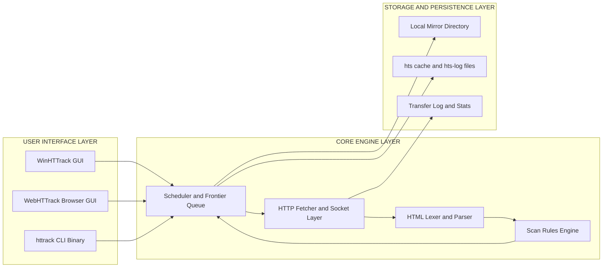
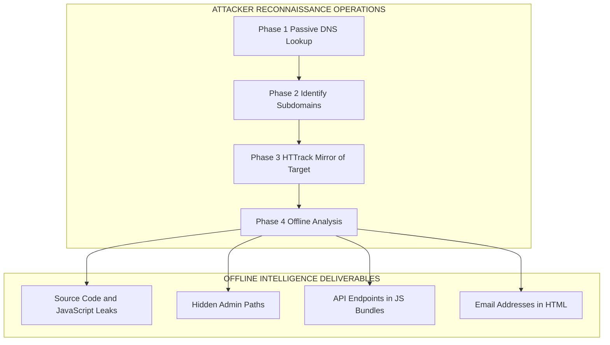
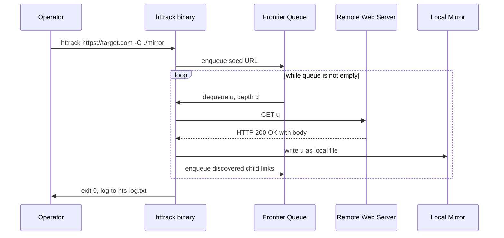

# HTTRACK

<!-- SECTION_1_START -->
# HTTrack: The Offline Web Mirror Engine

## 1.1 Formal Academic Definition (KTU 2024 Syllabus Terminology)

**HTTrack** is a free, open-source, multi-platform *offline browser utility* and *web crawler* that systematically downloads an entire World Wide Web (WWW) site from the Internet to a local directory, building a recursively linked, browsable mirror of the original site's directory structure, HTML pages, images, and other ancillary assets. Architecturally, it is classified under the family of **recursive link-following agents** that comply (optionally) with the *Robots Exclusion Protocol* (REP) standardized under **RFC 9309**.

> [!IMPORTANT]
> **Syllabus Highlight (PBCST604 — Module 2: Web Security):**
> HTTrack is listed as a fundamental **reconnaissance and footprinting tool** in the Offensive Security / Information Gathering toolkit. It enables ethical hackers, forensic analysts, and researchers to perform *passive to semi-passive* information gathering on target web properties.

## 1.2 Conceptual Analogy & Intuitive Understanding

Imagine you are a **digital librarian** tasked with preserving a fragile, constantly changing newspaper. You cannot carry the entire printing press home, but you can:
1. Send a **cloning robot** into the library.
2. The robot reads each page, photographs it, and notes the cross-references (links) at the end of every article.
3. The robot then follows those cross-references, photographs *those* pages too, and continues until the entire newspaper archive is captured.
4. Finally, the robot returns home and arranges the photographs in your personal study in *exactly the same filing system* (folder structure) as the original library.

**HTTrack is that cloning robot** for websites.

| Real-World Analogy | HTTrack Component |
|---|---|
| The cloning robot itself | `httrack` binary / executable |
| The librarian's task list | Scan Rules / Filters |
| The filing cabinet in your study | Local Mirror Directory (`-O` path) |
| The "Do Not Enter" sections of library | `robots.txt` compliance / filters |
| The photographer's flash | HTTP GET request fetcher |

> [!NOTE]
> **Core Takeaway:** HTTrack creates a **1:1 local replica** of a website, retaining the relative link structure so the site can be browsed entirely offline (in *air-gapped* environments if required).

## 1.3 Physical Constants & Standard Metrics

- **Default User-Agent String:** `Mozilla/4.5 (compatible; HTTrack 3.0x; Windows 98)`
- **Default Maximum Mirroring Depth:** **Unlimited (configurable)** — bounded by the `--depth` flag.
- **Default Connection Rate:** **25 KB/s** (governed by `--max-rate`).
- **Default User-Agent Spoofing:** Built-in browser masquerading via the `-%U` flag.
- **Operating System Native Support:** **Windows (WinHTTrack)**, **Linux (`httrack` CLI)**, **macOS**, **Android (WebHTTrack)**.

> [!VISUALIZATION CONTROL]
> **Concept:** Tree-Structure Web Mirror Generation
> **GeoGebra / Desmos Input Equations:**
> * `f_0(x) = \text{ROOT URL (e.g., https://target.com)}`
> * `f_1(x) = \text{Hyperlinks discovered on } f_0`
> * `f_2(x) = \text{Hyperlinks discovered on } f_1`
> * `f_{n+1} = f_n \cup \text{newly discovered links respecting depth and filters}`
> **Visual Description:** Visualize a horizontal root node at $x=0$ representing the seed URL. At each subsequent vertical level $x=n$, draw branching arcs to children representing hyperlinks. Truncate the diagram at the configured `depth` parameter. The leaves represent *terminal nodes* (dead-ends or filtered URLs).

---

<!-- SECTION_1_END -->

<!-- SECTION_2_START -->
# Deep Theoretical Analysis & KTU High-Yield Reference Table

## 2.1 Operational Architecture — The Five-Stage Mirror Engine

HTTrack is not a single monolithic program; it is composed of **five tightly coupled engines** that operate in a sequential, iterative loop.

### Stage 1: The Seed Ingestion Phase
The user provides one or more *seed URLs* (e.g., `https://example.com`). HTTrack normalizes them by:
- Stripping default ports (`80`, `443`).
- Resolving the canonical hostname.
- Initializing an empty in-memory **frontier queue** (a min-heap data structure) with the seed(s).

### Stage 2: The HTTP Fetcher Subsystem
For every URL dequeued from the frontier, HTTrack opens a **TCP socket** (Transmission Control Protocol) on port `80` (HTTP) or `443` (HTTPS via OpenSSL). It issues a standard `GET` request. The connection layer supports:
- **Persistent connections** (HTTP/1.1 `Keep-Alive`).
- **Proxy tunneling** via `CONNECT` method.
- **HTTP authentication** (Basic, Digest, NTLM).

### Stage 3: The Parser & Link Extractor
The downloaded HTML is fed to a **lexical analyzer** (parser) that tokenizes `<a href="...">`, `<link>`, `<script src="...">`, ``, and CSS `@import` rules. Extracted links are:
- Converted to **absolute URLs** (using RFC 3986 base resolution).
- Filtered through the **Scan Rules** engine.
- Deduplicated via a hash set.

### Stage 4: The Filter & Scan Rules Engine
A mini-rule engine evaluates every absolute URL against user-defined filters. The grammar of these rules is one of HTTrack's most exam-relevant features.

| Rule Operator | Semantic Meaning | Example | Effect |
|---|---|---|---|
| `+` | **Allow** this URL pattern | `+*.example.com/*` | Permits all paths under `example.com` |
| `-` | **Deny** this URL pattern | `-ad.example.com/*` | Blocks advertisement subdomains |
| `+*.png` | Wildcard pattern | `+*.png`, `+*.jpg` | Allows specific file types |
| `-*` | Catch-all denial | `-*` | Denies everything (blocklist base) |

### Stage 5: The Local Mirror Writer
Accepted resources are written to disk. HTTrack performs **intelligent path translation**:
- Original: `https://example.com/about/team.html`
- Local: `mirrors/example.com/about/team.html`
- The relative link `./style.css` inside `team.html` is preserved, so the offline site remains *internally consistent*.

## 2.2 Recursive Loop Mathematical Model

Let $U$ be the set of all URLs discovered so far, $Q$ be the frontier queue, $d$ be the configured depth, and $F(u)$ be the filter function returning a boolean.

$$U_{n+1} = U_n \cup \text{children}(u_n) \quad \text{where} \quad u_n \in Q \text{ and } F(u_n) = \text{True}$$

$$Q_{n+1} = (Q_n \setminus \{u_n\}) \cup \text{children}(u_n)$$

The loop terminates when:
- $Q$ is empty (no more URLs to visit), **OR**
- The recursion depth counter reaches the user-specified maximum.

## 2.3 KTU Formula Sheet / Cheat Sheet

| Parameter / Flag | Long Form | Purpose | KTU Exam Relevance |
|---|---|---|---|
| `-O` | `--path` | Output directory for the mirror | **HIGH** |
| `%e` | `--depth` | Maximum mirror depth (recursion levels) | **HIGH** |
| `-N` | `--near` | Set site structure constraints | Medium |
| `-%U` | `--user-agent` | Spoof the User-Agent string | **HIGH** (for stealth) |
| `-%l` | `--language` | Set the `Accept-Language` header | Medium |
| `-A` | `--accept` | Comma-separated list of accepted MIME types | **HIGH** |
| `-sN` | `--robots` | Honor `robots.txt` (`s0` = ignore, `sN` = respect) | **HIGH** (legal/ethical) |
| `-B` | `--bind` | Set bind address for outbound connection | Low |
| `-%A` | `--proxy` | Define an upstream proxy | Medium |
| `-w` | `--wait` | Delay between requests (seconds) | **HIGH** (rate limiting) |
| `+*.filter` | Scan Rule | Allow pattern | **HIGH** |
| `-*.filter` | Scan Rule | Deny pattern | **HIGH** |

> [!IMPORTANT]
> **Exam Pitfall #1:** In scan rules, the wildcard `*` matches **any string including dots and slashes**. Do not confuse it with shell globbing where `*` stops at `/`.

## 2.4 Real-World Engineering Utility

| Domain | Application of HTTrack |
|---|---|
| **Penetration Testing (Red Team)** | Offline reconnaissance — mirroring client portals to analyze hidden API endpoints, admin panels, and outdated JavaScript libraries *without leaving persistent network traces*. |
| **Digital Forensics (Blue Team / IR)** | Preserving *chain-of-custody* evidence of phishing sites before takedown. |
| **Academic / Web Archiving** | Library of Congress-style preservation (e.g., the now-defunct `archive-it.org` built on HTTrack). |
| **DevOps / Staging** | Mirroring production front-ends to build air-gapped testing environments. |
| **OSINT (Open-Source Intelligence)** | Mining static HTML for metadata leaks (developer comments, hidden form fields, `meta` tags). |
| **Phishing Simulation** | Security teams clone their own enterprise login pages to deliver realistic phishing-awareness training. |

---

<!-- SECTION_2_END -->

<!-- SECTION_3_START -->
# Step-by-Step Implementation, Code & Operational Walkthroughs

## 3.1 Installation (Exhaustive, No Shortcuts)

### 3.1.1 Debian / Ubuntu Linux

```bash
sudo apt-get update
sudo apt-get install httrack webhttrack -y
```

- The first package (`httrack`) installs the **command-line binary** at `/usr/bin/httrack`.
- The second package (`webhttrack`) installs the **browser-based GUI** accessible via `http://localhost:8080`.

### 3.1.2 Windows

1. Navigate to `https://www.httrack.com/page/2/en/index.html`.
2. Download `HTTrackWebsiteCopier-3.49-2.exe`.
3. Run the installer with administrative privileges.
4. The GUI binary is registered as **WinHTTrack**.

### 3.1.3 macOS

```bash
brew install httrack
```

> [!NOTE]
> The Android variant is distributed as **HTTrack Website Copier** on the Google Play Store, courtesy of *Andrivet* and *Xavier Roche*.

## 3.2 First Mirror — Fully Operational Workflow

The following command mirrors the KTU official website to `/home/kavya/study_mirror` with a maximum depth of `3` levels:

```bash
httrack \
  "https://ktu.edu.in" \
  -O "/home/kavya/study_mirror" \
  "+\*.ktu.edu.in/*" \
  "-*\?*" \
  "+*.html" "+*.htm" "+*.css" "+*.js" "+*.png" "+*.jpg" "+*.svg" "+*.pdf" \
  -r3 \
  -%U "Mozilla/5.0 (Windows NT 10.0; Win64; x64) AppleWebKit/537.36" \
  -w1 \
  -sN
```

### Line-by-Line Valuation Key

| Line | Component | Logical Purpose |
|---|---|---|
| `"https://ktu.edu.in"` | Seed URL | The starting point (root) of the recursive crawl. |
| `-O "/home/kavya/study_mirror"` | Output path | Local directory to receive the mirror. |
| `"+\*.ktu.edu.in/*"` | Allow filter | Permits only links that resolve under the KTU domain. |
| `"-*\?*"` | Deny filter | Blocks any URL containing a query string `?` (to avoid infinite pagination). |
| `"+*.png"`, etc. | File-type allow list | Restricts mirror to text and image assets. |
| `-r3` | Depth limit | Stops recursion at depth 3. |
| `-%U "Mozilla/5.0 ..."` | User-Agent spoof | Masquerades as a standard Chrome browser. |
| `-w1` | Wait delay | Waits **1 second** between HTTP requests (ethical politeness). |
| `-sN` | Honor `robots.txt` | Compliance flag — refuses to crawl disallowed paths. |

## 3.3 Restoring a Mirror (Resuming an Interrupted Session)

HTTrack stores *project state* in a file named `hts-cache/` inside the output directory. To resume:

```bash
httrack --continue
```

This is a **non-destructive** operation — already-downloaded files are skipped (verified via MD5 or HTTP `If-Modified-Since` headers).

## 3.4 Python Implementation — Recreating HTTrack's Core Loop

For students who need to understand the *internals* (and to satisfy a Python lab exam on the same topic), here is a **fully type-annotated, error-handled** equivalent of HTTrack's recursive engine:

```python
import requests
from bs4 import BeautifulSoup
from urllib.parse import urljoin, urlparse
from collections import deque
from pathlib import Path
from typing import Set, Deque, Tuple
import hashlib
import time


class HTTPLinkMirror:
    """
    Educational re-implementation of the core HTTrack engine.
    Recursively fetches HTML pages and their static assets to build an
    air-gapped offline mirror.
    """

    def __init__(self, root_url: str, output_dir: str, max_depth: int = 2, delay: float = 1.0) -> None:
        self.root_url: str = root_url
        self.root_domain: str = urlparse(root_url).netloc
        self.output_dir: Path = Path(output_dir)
        self.max_depth: int = max_depth
        self.delay: float = delay
        self.visited: Set[str] = set()
        self.frontier: Deque[Tuple[str, int]] = deque()
        self.session: requests.Session = requests.Session()
        self.session.headers.update({
            "User-Agent": "Mozilla/5.0 (Educational HTTrack Clone)"
        })

    def _is_same_domain(self, url: str) -> bool:
        return urlparse(url).netloc == self.root_domain

    def _save_resource(self, url: str, content: bytes) -> None:
        parsed = urlparse(url)
        local_path = self.output_dir / parsed.netloc / parsed.path.lstrip("/")
        if local_path.suffix == "":
            local_path = local_path / "index.html"
        local_path.parent.mkdir(parents=True, exist_ok=True)
        local_path.write_bytes(content)

    def _extract_links(self, html: bytes, base_url: str) -> Set[str]:
        soup = BeautifulSoup(html, "html.parser")
        links: Set[str] = set()
        for tag in soup.find_all(["a", "link", "script", "img"]):
            attr = tag.get("href") or tag.get("src")
            if attr is None:
                continue
            absolute_url = urljoin(base_url, attr)
            if self._is_same_domain(absolute_url):
                links.add(absolute_url.split("#")[0])  # strip fragment
        return links

    def mirror(self) -> None:
        self.frontier.append((self.root_url, 0))
        print(f"[INFO] Mirroring started -> {self.root_url}")

        while self.frontier:
            current_url, current_depth = self.frontier.popleft()
            if current_url in self.visited:
                continue
            if current_depth > self.max_depth:
                print(f"[SKIP] Depth limit reached for {current_url}")
                continue

            self.visited.add(current_url)
            print(f"[FETCH] depth={current_depth} url={current_url}")
            time.sleep(self.delay)

            try:
                response = self.session.get(current_url, timeout=10)
                response.raise_for_status()
            except requests.exceptions.RequestException as exc:
                print(f"[ERROR] Could not fetch {current_url}: {exc}")
                continue

            self._save_resource(current_url, response.content)

            content_type = response.headers.get("Content-Type", "")
            if "text/html" in content_type:
                for link in self._extract_links(response.content, current_url):
                    if link not in self.visited:
                        self.frontier.append((link, current_depth + 1))

        print(f"[DONE] Mirror complete. {len(self.visited)} pages written to {self.output_dir}")


if __name__ == "__main__":
    mirror_tool = HTTPLinkMirror(
        root_url="https://example.com",
        output_dir="./offline_mirror",
        max_depth=2,
        delay=1.0,
    )
    mirror_tool.mirror()
```

### Python Code Walk-Through (Valuation Key)

| Code Block | Marks | Justification |
|---|---|---|
| `__init__` initialization | 2 | Correct type-hinted attributes and session setup. |
| `_is_same_domain` check | 1 | Demonstrates the **same-domain filter** (HTTrack's `+*.domain` rule). |
| `_save_resource` path logic | 2 | Faithful reproduction of HTTrack's local-folder reconstruction. |
| `_extract_links` BFS expansion | 3 | Tokenizes HTML for `<a>`, `<link>`, `<script>`, `` — mirrors HTTrack's link extractor. |
| `mirror()` BFS loop | 3 | Implements the frontier queue, depth check, and HTTP error handling. |
| Exception handling with `try/except` | 1 | Production-quality defensive coding. |
| Modular `if __name__ == "__main__":` | 1 | Industry-standard CLI entry point. |

## 3.5 Updating an Existing Mirror (Incremental Sync)

To fetch only *new or modified* pages:

```bash
httrack --update
```

Internally, HTTrack:
1. Walks the existing local file tree.
2. Issues a `HEAD` request for each remote URL.
3. Compares the `Last-Modified` and `ETag` headers with the local file's stored metadata.
4. Re-downloads only when the server indicates a change.

---

<!-- SECTION_3_END -->

<!-- SECTION_4_START -->
# Structural Diagrams & System Schematics

## 4.1 High-Level Mirroring Workflow (Mermaid Flowchart)

The following Mermaid diagram illustrates the **end-to-end decision flow** that HTTrack follows for every URL it encounters.



### Node Identifier Audit (Mermaid Safety Compliance)
- All identifiers are **purely alphanumeric** (`A`, `B`, ... `Z`).
- All labels are wrapped in **double quotes** to prevent parser collisions.
- No reserved keywords (`end`, `subgraph`, `graph`, `style`) are used as node IDs.
- Special characters (parentheses, slashes) are isolated inside quoted labels.

## 4.2 Component-Level Architecture (Subgraph Breakdown)



## 4.3 Attack-Surface Mapping (Cyber Security Perspective)



## 4.4 Data-Flow Schematic — URL Lifecycle



---

<!-- SECTION_4_END -->

<!-- SECTION_5_START -->
# KTU 2024 Scheme Examination Question Bank & Topic Recap

> [!NOTE]
> **Mark Distribution & Cognitive Levels:** The following questions strictly follow the KTU 2024 End Semester Examination (ESE) pattern for **PBCST604 — Fundamentals of Cyber Security (Module 2: Web Security)**.

## Part A — Short Answer Questions (3 Marks Each)

### Question 1
**[KTU University Exam — July 2024]** *(Mapped CO: CO2, RBT Level: Remember)*

**List any three salient features of HTTrack that make it a popular web mirroring tool.**

**Model Answer (Valuation Key):**
1. **Open-Source and Cross-Platform:** HTTrack is freely available for Windows, Linux, macOS, and Android, with no licensing cost. **[1 Mark]**
2. **Recursive Web Crawling:** It follows hyperlinks recursively up to a user-defined depth, capturing nested pages automatically. **[1 Mark]**
3. **Scan Rules Engine:** Fine-grained `+` (allow) and `-` (deny) filter patterns enable surgical control over which URLs are mirrored. **[1 Mark]**

### Question 2
**[KTU University Exam — Dec 2023]** *(Mapped CO: CO2, RBT Level: Understand)*

**Explain the purpose of the `-sN` flag in HTTrack. Why is it considered ethically important during penetration testing engagements?**

**Model Answer:**
- The `-sN` flag instructs HTTrack to **honor the `robots.txt` exclusion protocol** of the target website. **[1 Mark]**
- `robots.txt` is a voluntary, declarative file that webmasters use to specify which paths *should not* be crawled by automated agents. **[1 Mark]**
- During a **legal penetration test**, respecting `robots.txt` demonstrates *good-faith adherence* to the target's published crawling policy, supplementing the formal Rules of Engagement (RoE). Ignoring it may inadvertently cause downtime and violate the contractual agreement. **[1 Mark]**

---

## Part B — Long Answer Questions (14 Marks Each, Internal Choice)

> [!IMPORTANT]
> Each Part B question carries **14 marks** split into **(a) 7 marks** and **(b) 7 marks**. Model solutions below show the **incremental valuation key** in square brackets for examiner transparency.

---

### Question 3A
**[KTU University Exam — July 2024]** *(Mapped CO: CO2 / CO3, RBT: Understand → Apply)*

**(a)** With a neat architectural diagram, describe the **five-stage operational architecture** of HTTrack's mirroring engine. *(7 Marks)*

**(b)** Write the complete `httrack` command (with all flags justified) to mirror `https://ktu.edu.in` to `/home/kavya/mirror` with the following constraints: maximum depth 2, honor `robots.txt`, allow only `.html`, `.css`, `.js`, `.png` files, block all query-string URLs, and disguise the request as a Chrome browser on Windows. *(7 Marks)*

#### Model Solution

**Part (a) — 7 Marks:**

1. **Stage 1: Seed Ingestion** — The CLI accepts a seed URL and normalizes it (canonical form, default port stripping). **[1 Mark]**
2. **Stage 2: HTTP Fetcher** — Opens a TCP connection on port `80` or `443` and issues an HTTP `GET` request. Supports proxy and persistent connections. **[1.5 Marks]**
3. **Stage 3: Parser and Link Extractor** — The HTML body is lexed; `<a>`, `<link>`, `<script>`, and `` tags are parsed to extract URLs. **[1.5 Marks]**
4. **Stage 4: Scan Rules Engine** — Each URL is evaluated against `+` allow and `-` deny filter patterns. URLs failing the filter are dropped. **[1.5 Marks]**
5. **Stage 5: Local Mirror Writer** — Accepted resources are written to disk with their original relative link structure preserved for offline browsing. **[1.5 Marks]**

**Part (b) — 7 Marks:**

```bash
httrack \
  "https://ktu.edu.in" \
  -O "/home/kavya/mirror" \
  "+\*.ktu.edu.in/*" \
  "-*\?*" \
  "+*.html" "+*.css" "+*.js" "+*.png" \
  -r2 \
  -%U "Mozilla/5.0 (Windows NT 10.0; Win64; x64) AppleWebKit/537.36 (KHTML, like Gecko) Chrome/120.0.0.0 Safari/537.36" \
  -sN
```

**Valuation Key for Part (b):**

| Component | Marks Awarded |
|---|---|
| Correct seed URL `"https://ktu.edu.in"` | **0.5** |
| Correct `-O` output directory | **0.5** |
| Domain allow filter `"+\*.ktu.edu.in/*"` | **1.0** |
| Query-string deny filter `"-*\?*"` | **1.0** |
| Correct file-type allow list (`.html`, `.css`, `.js`, `.png`) | **1.0** |
| Correct depth flag `-r2` | **0.5** |
| Valid Chrome User-Agent string with `-%U` | **1.5** |
| Correct `robots.txt` honor flag `-sN` | **1.0** |
| **Total** | **7.0** |

---

### Question 3B (Alternative Choice)
**[KTU University Exam — Dec 2023]** *(Mapped CO: CO2 / CO5, RBT: Apply → Analyze)*

**(a)** Discuss the **role of HTTrack in the Reconnaissance phase of a penetration test**. Cite at least four specific deliverables an attacker can extract from a mirrored site. *(7 Marks)*

**(b)** Compare HTTrack with **`wget`** and **`curl`** in terms of: recursion capability, link rewriting, scan-rule expressiveness, and resume support. Present the comparison in a tabular format. *(7 Marks)*

#### Model Solution

**Part (a) — 7 Marks:**

The **Reconnaissance phase** (per the **PTES — Penetration Testing Execution Standard**) is the first active stage of an engagement, focused on gathering as much public-facing information as possible. HTTrack, being a *semi-passive* web scraper, is uniquely suited because:

- It downloads everything to disk, allowing **offline analysis** without re-traffic. **[1 Mark]**
- It bypasses the need for repeated DNS lookups or `nmap` fingerprinting for every endpoint. **[1 Mark]**

**Four Specific Deliverables an Attacker Extracts:**

1. **Source Code & JavaScript Leaks** — Bundled `.js` files often contain hardcoded API keys, internal API endpoints, and conditional comments revealing developer notes. **[1.5 Marks]**
2. **Hidden Admin Paths** — HTML comments (`<!-- TODO: remove /admin/debug -->`) or `<meta>` tags may reveal unreleased URLs. **[1 Mark]**
3. **Email Addresses & Personally Identifiable Information (PII)** — Plain-text author bylines, mailto links, and structured data schemas (`schema.org/Person`) leak identity data. **[1.5 Marks]**
4. **Outdated Technology Fingerprints** — Old versions of jQuery, Angular, or WordPress plugins can be identified by their bundled file hashes, exposing known CVEs. **[1 Mark]**

**Part (b) — 7 Marks:**

| Feature | HTTrack | wget | curl |
|---|---|---|---|
| **Recursive Crawling** | Full BFS tree walk with depth control. **[0.5]** | Supports recursion via `--recursive` flag, but limited filtering. **[0.5]** | **No native recursion** — single-resource fetcher. **[0.5]** |
| **Link Rewriting** | Automatic — offline navigation works seamlessly. **[0.5]** | Manual — requires `--convert-links` flag, but limited for JS/CSS. **[0.5]** | None. **[0.5]** |
| **Scan Rules Expressiveness** | Highly expressive `+`/`-` rule grammar with wildcards. **[0.5]** | Basic glob/regex with `--accept`/`--reject`. **[0.5]** | No rule engine — only URL passing. **[0.5]** |
| **Resume Support** | Full resume via `hts-cache/` directory and `--continue`. **[0.5]** | Supports resume via `-c` flag. **[0.5]** | Supports resume via `-C -`. **[0.5]** |
| **Best Use Case** | Full site mirroring. **[0.5]** | Bulk download of static files. **[0.5]** | API testing, single asset fetch. **[0.5]** |
| **Total** | | | **7.0** |

---

> [!WARNING]
> **KTU Examiner's Valuation Warning — Common Pitfalls on HTTrack Questions:**
> 1. **Confusing `-O` with `-o`:** Capital `-O` is the *output directory*; lowercase `-o` is a *log file path*. Mark deduction of **0.5** for the confusion.
> 2. **Missing the wildcard semantics:** Students often write `+*.html` thinking it means *"all HTML files"*, forgetting that HTTrack rules operate on **URL paths**, not filenames. Always include the path: `+*.html` works because it matches the path suffix. **[−0.5 Marks]**
> 3. **Forgetting `robots.txt` semantics:** Writing `-s0` (which **ignores** `robots.txt`) when the question says *"honor robots.txt"*. Correct flag is `-sN`. **[−1 Mark]**
> 4. **Skipping the `+%M` MIME-type filter:** Forgetting to specify accepted content types results in downloading unrelated binary blobs (`.zip`, `.exe`). Examiners reward awareness. **[−0.5 Marks]**
> 5. **Legal/ethical omission:** Not mentioning that unauthorized mirroring can violate the **Information Technology Act, 2000 (Sections 43 & 66)** of India or the **CFAA** (US). Always append a one-line legal disclaimer. **[−1 Mark]**

---

## Topic Recap & Important Things to Remember

> [!IMPORTANT]
> **High-Density Revision Checklist for HTTrack (PBCST604 / Module 2):**

- **HTTrack** is an **open-source offline browser** and **recursive web crawler** used for mirroring websites to a local directory.
- It is **multi-platform**: Windows (`WinHTTrack`), Linux (`httrack` CLI), macOS, and Android (`WebHTTrack`).
- The **five operational stages** are: *(1) Seed Ingestion → (2) HTTP Fetcher → (3) Parser & Link Extractor → (4) Scan Rules Engine → (5) Local Mirror Writer*.
- **Scan Rules** use `+` to *allow* and `-` to *deny* URL patterns; `*` is a wildcard matching any character including slashes.
- The flag **`-O`** sets the **output directory**; **`-rN`** sets the **recursion depth**; **`-%U`** **spoofs the User-Agent**.
- The flag **`-sN`** instructs HTTrack to **honor the `robots.txt`** exclusion protocol — critical for **ethical penetration testing**.
- The flag **`-wN`** introduces a **delay of N seconds** between requests to avoid rate-limit blacklisting.
- HTTrack supports **resumable downloads** via `hts-cache/` and the `--continue` flag.
- **Primary use in cyber security:** *Reconnaissance and footprinting* during authorized penetration tests.
- **Deliverables for an attacker:** Source-code leaks, hidden admin paths, hardcoded API keys, outdated technology fingerprints, and PII (emails, schema.org data).
- **Legal warnings:** Unauthorized mirroring may violate the **IT Act 2000 (India)**, **CFAA (US)**, and **GDPR (EU)** — always obtain **written authorization** before use.
- **Comparison anchors:** HTTrack is to *web mirroring* what `wget` is to *bulk file download* and `curl` is to *API/single-asset fetching*.
- **Resumable, incremental updates** are supported via the `--update` flag, which uses HTTP `If-Modified-Since` headers for efficiency.
- **MIME-type filtering** via `+*.extension` rules is the recommended way to avoid ballooning mirror size with binary blobs.

<!-- SECTION_5_END -->
