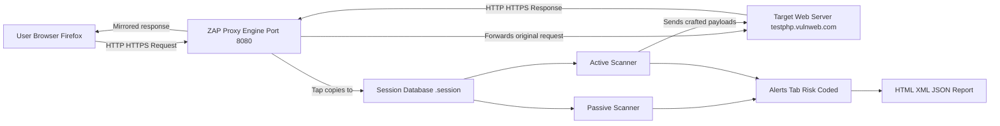
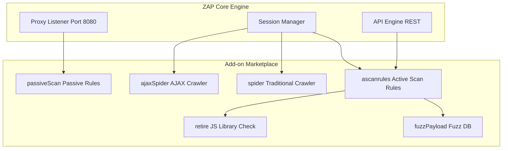
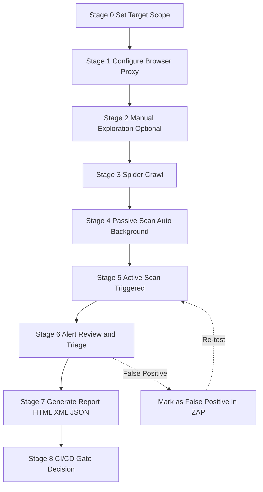
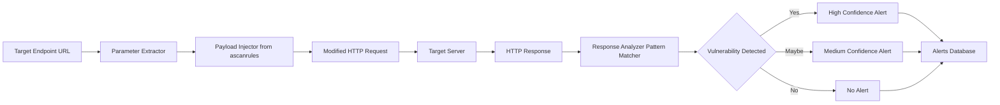

# OWASP ZAP

<!-- SECTION_1_START -->
# OWASP ZAP (Zed Attack Proxy) — Foundational Overview

## Formal KTU Syllabus Definition

> [!NOTE]
> **OWASP ZAP (Zed Attack Proxy)** is an open-source, world-class **web application security scanner** maintained under the Open Web Application Security Project (OWASP). It is officially classified as a **Man-in-the-Middle (MITM) proxy** designed for finding vulnerabilities in web applications during the development, testing, and deployment phases of the Software Development Life Cycle (SDLC).

In the KTU 2024 Scheme context, ZAP is positioned as the **de-facto industry-standard DAST (Dynamic Application Security Testing)** tool used by penetration testers, security analysts, and DevSecOps engineers to perform **non-destructive black-box security testing** of HTTP/HTTPS-based applications.

### Key Terminology Decoded

| Term | Meaning in Cyber Security Context |
|---|---|
| **Proxy** | An intermediary that sits between the user's browser and the web server to intercept traffic. |
| **Passive Scan** | Inspection of HTTP requests/responses **without** modifying them (silent observation). |
| **Active Scan** | Injection of malicious crafted payloads into the application to probe for vulnerabilities. |
| **Spider / Crawler** | An automated bot that discovers new pages, links, and endpoints by following hyperlinks. |
| **Fuzzing** | Sending semi-random malformed inputs to crash or break application logic. |
| **HUD (Heads-Up Display)** | An overlay UI embedded inside the browser for real-time feedback during testing. |

---

## Conceptual Analogy: The Security Inspector at a Toll Booth

> [!IMPORTANT]
> **Real-World Analogy — "The Customs Officer"**
> Imagine a **customs checkpoint on a highway**. Every vehicle (HTTP request) travelling from a city (your browser) to another city (the web server) **must stop at the checkpoint**. The officer (ZAP) inspects the vehicle's cargo (headers, cookies, parameters, payload), checks the passenger manifest, and sometimes sends **decoy packages** (active scan payloads) to see if the destination city handles them safely. Vehicles returning (responses) are also scanned for hidden threats (XSS, SQLi traces, info leaks).

This perfectly mirrors how ZAP operates:

- The **browser is configured** to route traffic through ZAP's local proxy port (**default 8080**).
- ZAP **observes** every request and response.
- ZAP **stores** them in a session database for later analysis.
- ZAP **attacks** selected endpoints using a database of known attack vectors.

---

## Why OWASP ZAP? — The KTU Board Perspective

> [!TIP]
> ZAP is **mandatory reading** in the KTU 2024 syllabus because it satisfies three critical industry needs simultaneously:
> 1. **Free and Open-Source** (no licensing cost for educational institutions).
> 2. **Cross-Platform** (Java-based, runs on Windows, Linux, macOS, Docker).
> 3. **Beginner-Friendly GUI** plus a powerful **command-line / API** interface for automation in CI/CD pipelines.

### Core Capabilities (Exam-Relevant Bullet List)

- **Intercepting Proxy** — capture and modify HTTP/HTTPS traffic in real-time.
- **Automated Scanner** — active vulnerability detection using a built-in plug-in database.
- **Spider** — recursive URL discovery (traditional + AJAX spiders).
- **Fuzzer** — custom payload injection against user-defined parameters.
- **WebSocket Support** — full inspection of WebSocket-based real-time apps.
- **Add-on Marketplace** — over **900 community-contributed plug-ins** (e.g., `ascanrules`, `retire`, `tokenGen`).
- **Headless / Daemon Mode** — runs on servers for **CI/CD DevSecOps** integration.
- **Multi-User Collaboration** — shared sessions via a central database.
- **Authentication Handling** — supports form-based, JSON-token, and NTLM-based login flows.
<!-- SECTION_1_END -->

<!-- SECTION_2_START -->
# Deep Theoretical Analysis & KTU High-Yield Cheat Sheet

## Architectural Breakdown — How ZAP Works Internally

ZAP's internal architecture is layered into **five cooperating components**. Understanding these layers is critical for KTU long-answer (14-mark) questions.

### Layer 1: The Proxy Engine
- Listens on a configurable local TCP port (default **8080**).
- Establishes a transparent tunnel between the browser and target web server.
- Decrypts HTTPS traffic using a **dynamically generated CA certificate** that must be imported into the browser's trust store.
- **Why?** It allows ZAP to read encrypted TLS traffic — without this, scanners would be blind to modern HTTPS applications.

### Layer 2: The Session Manager
- Persists all intercepted data (requests, responses, alerts, history) into a **session file** (`.session` format by default; can be exported as `.har` for analysis in other tools like Burp Suite).
- Supports **in-memory sessions** for ephemeral scans.

### Layer 3: The Add-on (Plug-in) Framework
- The `pluginalias` and `addons` directories contain modular Java components.
- The **Scanner Rules** plug-in (`ascanrules`) contains thousands of active test vectors mapped to the **OWASP Top 10** and **CWE (Common Weakness Enumeration)**.

### Layer 4: The Scanner Core
- Splits scanning into **two distinct phases**:
  1. **Passive Scan** — runs continuously in the background, never sending extra traffic.
  2. **Active Scan** — explicitly triggered; sends **attack payloads** to identified endpoints.

### Layer 5: The API & Headless Interface
- Exposes REST APIs (`http://zap:8080/JSON/...`) and a **Python client** for scripting.
- The `zap-cli` and `zap-api` Python libraries enable **CI/CD integration** with Jenkins, GitHub Actions, GitLab CI.

---

## KTU High-Yield Formula / Cheat Sheet

| Concept | Notation / Command | Description |
|---|---|---|
| ZAP Proxy Port | $P_{proxy} = 8080$ | Default listening port for the local proxy. |
| Passive Scan Rule Count | $R_p$ | ~**40+** rules, runs silently in background. |
| Active Scan Rule Count | $R_a$ | ~**50+** rules injected per parameter. |
| Risk Code | $C \in \{H, M, L, I\}$ | **H**igh, **M**edium, **L**ow, **I**nformational. |
| Confidence Code | $K \in \{H, M, L, FP\}$ | False Positive possible if $K = L$. |
| Spider Thread Count | $T_s$ (default 2) | Number of parallel URL-fetching workers. |
| Total Alerts | $N_a = \sum_{i} a_i$ | Sum of all findings across the application. |
| Start ZAP in Daemon Mode | `zap.sh -daemon -port 8080 -config api.key=KTUexam` | Boot flag for headless automation. |

> [!IMPORTANT]
> **Pipeline Integration Formula** (commonly asked in 14-mark KTU questions):
> $$\text{DevSecOps Pipeline} = \text{Build} \rightarrow \text{SAST} \rightarrow \text{ZAP DAST} \rightarrow \text{Report} \rightarrow \text{Gate}$$ 
> A ZAP scan is positioned **after the build artifact is deployed to a staging environment** but **before the production release gate**.

---

## Real-World Engineering Utility

- **Bug Bounty Programs**: Researchers use ZAP for **initial reconnaissance** before switching to Burp Suite Pro for exploitation.
- **Banking & FinTech**: Pre-deployment web app audits for **PCI-DSS compliance**.
- **Government Portals**: Used by CERT-In empanelled auditors in India for **VA-PT (Vulnerability Assessment & Penetration Testing)**.
- **Education**: Adopted in KTU labs because it requires **zero licensing** and supports **Docker** for offline lab setups.

---

## Active Scan vs Passive Scan — KTU Comparison Table

| Parameter | Passive Scan | Active Scan |
|---|---|---|
| **Modifies Target Traffic** | No | Yes |
| **Risk of Disruption** | Zero | Moderate (may crash weak apps) |
| **Execution** | Continuous / background | Manual trigger or API call |
| **Vulnerability Coverage** | Low-Medium (info leaks, missing headers) | High (SQLi, XSS, RCE, IDOR probes) |
| **Permission Required** | Generally safe | **Written authorization mandatory** |
| **CI/CD Suitability** | Excellent | Good (with rate limiting) |
| **Speed** | Fast (real-time) | Slow (thousands of requests) |
| **Example Detection** | `Cookie without HttpOnly flag` | `Reflected XSS in search parameter` |

---

## ZAP vs Burp Suite — A Common KTU Comparison Question

| Feature | OWASP ZAP | Burp Suite (Community) |
|---|---|---|
| **License** | Free, open-source (Apache 2.0) | Free community edition + paid Pro |
| **Written In** | Java | Java |
| **Headless/API** | First-class daemon support | Limited (Pro only) |
| **Plug-in Ecosystem** | 900+ add-ons in marketplace | BApp Store (smaller) |
| **Learning Curve** | Beginner-friendly | Steeper, more "pro-feel" |
| **KTU Preference** | **Preferred** (open-source mandate) | Mentioned for comparison only |
<!-- SECTION_2_END -->

<!-- SECTION_3_START -->
# Step-by-Step Implementation, Setup, and Python Automation

## 3.1 Installation Procedure (Multi-Platform)

### A. Windows / macOS
1. Download the installer from `https://www.zaproxy.org/download/`.
2. Run the executable (`.exe` for Windows, `.dmg` for macOS).
3. Java Runtime Environment (JRE) version **11 or higher** is a prerequisite.
4. Default installation directory: `C:\Program Files\OWASP\Zed Attack Proxy\` (Windows).

### B. Linux (Debian/Ubuntu)
1. Add the official OWASP repository:
   ```bash
   sudo apt install apt-transport-https
   wget -qO - https://raw.githubusercontent.com/zaproxy/zap-admin/master/ZAP.asc | sudo gpg --dearmor -o /usr/share/keyrings/zap.gpg
   echo "deb [signed-by=/usr/share/keyrings/zap.gpg] https://dl.bintray.com/zaproxy/deb release main" | sudo tee /etc/apt/sources.list.d/zap.list
   ```
2. Update and install:
   ```bash
   sudo apt update
   sudo apt install zaproxy
   ```
3. Launch from the application menu or via terminal:
   ```bash
   zaproxy
   ```

### C. Docker (Recommended for KTU Labs)
1. Pull the stable image:
   ```bash
   docker pull ghcr.io/zaproxy/zaproxy:stable
   ```
2. Run ZAP in headless daemon mode:
   ```bash
   docker run -u zap -p 8080:8080 -i ghcr.io/zaproxy/zaproxy:stable zap.sh -daemon -host 0.0.0.0 -port 8080
   ```
3. Verify the API is reachable:
   ```bash
   curl http://localhost:8080/JSON/core/view/version/
   ```

---

## 3.2 Browser Proxy Configuration

> [!WARNING]
> **Mandatory Step**: ZAP cannot intercept browser traffic unless the browser is configured to route through ZAP's proxy port.

1. Open **Mozilla Firefox** → `Settings` → `General` → `Network Settings` → `Manual proxy configuration`.
2. Set **HTTP Proxy** = `127.0.0.1`, **Port** = `8080`.
3. Tick **"Use this proxy server for all protocols"**.
4. In Firefox, navigate to `http://zap` and download the **OWASP Root CA Certificate**.
5. Import it under `Privacy & Security` → `Certificates` → `View Certificates` → `Authorities` → `Import`.

> All browser traffic is now mirrored to the ZAP **History** tab.

---

## 3.3 Exhaustive Manual Scan Workflow (Step-by-Step)

### Step 1: Launch and Set Scope
- Open ZAP, click the green **plus** button next to "Sites" to define the target domain (e.g., `http://testphp.vulnweb.com`).
- Setting the scope prevents ZAP from accidentally probing production assets.

### Step 2: Manual Exploration (Optional but Recommended)
- Configure Firefox to use ZAP as proxy.
- Manually browse the target application, log in, fill forms.
- Every page visited appears under **Sites** → select URL → right-click → **Attack** → **Spider**.

### Step 3: Run the Spider
- Right-click the target node → **Attack** → **Spider**.
- The traditional Spider crawls HTML links.
- The **AJAX Spider** uses a headless browser (Chrome) to crawl JavaScript-rendered pages.
- Monitor progress in the **Spider** tab at the bottom.

### Step 4: Run the Passive Scanner (Automatic)
- Passive scan runs by default on every intercepted response.
- Alerts appear in the **Alerts** tab with risk-coded icons (red = High, orange = Medium, yellow = Low, blue = Informational).

### Step 5: Run the Active Scanner
- Right-click target → **Attack** → **Active Scan**.
- Configure:
  - **Strength**: Low / Medium / High / Insane (request count per rule).
  - **Threshold**: Low / Medium / High (confidence to report).
- Click **Start Scan** and monitor the progress bar.

### Step 6: Review and Export Report
- After scan completion, navigate to **Report** → **Generate Report**.
- Choose format: **HTML**, **XML**, **JSON**, or **Markdown**.
- The report includes executive summary, affected URLs, and remediation guidance.

---

## 3.4 Python Automation via the `python-owasp-zap-v2.4` Library

The following is a **fully operational, type-annotated, error-handled** Python script that automates a ZAP baseline scan against a target. Save as `zap_automation.py` and run it.

```python
"""
Automated OWASP ZAP Baseline Scan
Compatible with ZAP 2.12+ running in daemon mode.
Run ZAP first: zap.sh -daemon -port 8080 -config api.disablekey=true
"""

from __future__ import annotations

import time
import logging
from zapv2 import ZAPv2

# ---- Configure Structured Logging ----
logging.basicConfig(
    level=logging.INFO,
    format="%(asctime)s [%(levelname)s] %(message)s",
)
logger = logging.getLogger("ZAP-AutoScan")


# ---- Constants ----
ZAP_ADDRESS: str = "127.0.0.1"
ZAP_PORT: int = 8080
TARGET_URL: str = "http://testphp.vulnweb.com"
SPIDER_MAX_DEPTH: int = 5
SCAN_POLL_INTERVAL: int = 10  # seconds


def initialize_zap_client() -> ZAPv2:
    """Create and return a ZAP API client instance."""
    try:
        zap = ZAPv2(
            proxies={
                "http": f"http://{ZAP_ADDRESS}:{ZAP_PORT}",
                "https": f"http://{ZAP_ADDRESS}:{ZAP_PORT}",
            }
        )
        version: str = zap.core.version
        logger.info("Connected to ZAP version: %s", version)
        return zap
    except Exception as exc:
        logger.error("Failed to connect to ZAP daemon: %s", exc)
        raise


def perform_spider_scan(zap: ZAPv2) -> None:
    """Execute the traditional spider against the target."""
    logger.info("Starting Spider scan on: %s", TARGET_URL)
    scan_id: str = zap.spider.scan(url=TARGET_URL, maxDepth=SPIDER_MAX_DEPTH)

    # Poll until spider completes
    while int(zap.spider.status(scan_id)) < 100:
        logger.info("Spider progress: %s%%", zap.spider.status(scan_id))
        time.sleep(SCAN_POLL_INTERVAL)
    logger.info("Spider scan complete. URLs found: %s",
                zap.spider.results(scan_id))


def perform_active_scan(zap: ZAPv2) -> None:
    """Execute the active vulnerability scan against all discovered URLs."""
    logger.info("Starting Active Scan on: %s", TARGET_URL)
    scan_id: str = zap.ascan.scan(url=TARGET_URL, recurse=True)

    # Poll until active scan completes
    while int(zap.ascan.status(scan_id)) < 100:
        logger.info("Active Scan progress: %s%%", zap.ascan.status(scan_id))
        time.sleep(SCAN_POLL_INTERVAL)
    logger.info("Active scan complete.")


def generate_html_report(zap: ZAPv2, output_path: str = "zap_report.html") -> None:
    """Export the consolidated scan report to an HTML file."""
    logger.info("Generating HTML report at: %s", output_path)
    report_html: str = zap.core.htmlreport()
    with open(file=output_path, mode="w", encoding="utf-8") as file_handle:
        file_handle.write(report_html)
    logger.info("Report saved successfully.")


def summarize_alerts(zap: ZAPv2) -> None:
    """Print a summary table of all alerts categorized by risk."""
    logger.info("=== ALERT SUMMARY ===")
    alerts = zap.core.alerts(baseurl=TARGET_URL)
    risk_counter: dict[str, int] = {"High": 0, "Medium": 0, "Low": 0, "Informational": 0}

    for alert in alerts:
        risk = alert.get("risk", "Informational")
        risk_counter[risk] = risk_counter.get(risk, 0) + 1

    for risk_level, count in risk_counter.items():
        logger.info("%-15s : %d", risk_level, count)


def main() -> None:
    zap_client = initialize_zap_client()
    perform_spider_scan(zap_client)
    perform_active_scan(zap_client)
    summarize_alerts(zap_client)
    generate_html_report(zap_client)


if __name__ == "__main__":
    main()
```

### Step-by-Step Execution

1. Install the Python wrapper:
   ```bash
   pip install python-owasp-zap-v2.4
   ```
2. Start ZAP in daemon mode (in a separate terminal):
   ```bash
   zap.sh -daemon -port 8080 -config api.disablekey=true
   ```
3. Run the automation script:
   ```bash
   python zap_automation.py
   ```
4. Inspect the generated `zap_report.html` in any web browser.

> [!IMPORTANT]
> The script uses `recurse=True` to ensure the active scan attacks **every URL discovered by the spider**, not just the root target. The `time.sleep(SCAN_POLL_INTERVAL)` is a **polling anti-pattern guard** — ZAP exposes scan IDs that allow non-blocking progress tracking.

---

## 3.5 Docker + Jenkins CI/CD Integration Snippet (Jenkinsfile)

```groovy
pipeline {
    agent any
    stages {
        stage('OWASP ZAP DAST Scan') {
            steps {
                sh 'docker run --rm -v $(pwd):/zap/wrk ghcr.io/zaproxy/zaproxy:stable \
                    zap-baseline.py -t http://staging.myapp.local -r report.html'
            }
        }
    }
    post {
        always {
            archiveArtifacts artifacts: 'report.html', fingerprint: true
        }
    }
}
```

The `zap-baseline.py` script is **bundled inside the official ZAP Docker image** and runs a passive-only safe scan — perfect for KTU lab demos.
<!-- SECTION_3_END -->

<!-- SECTION_4_START -->
# Structural Diagrams & Schematics

## 4.1 ZAP Man-in-the-Middle Architecture Flow



## 4.2 ZAP Plug-in Modular Architecture (Subgraph View)



## 4.3 OWASP ZAP Scan Lifecycle (Sequential Processing Topology)



## 4.4 Active Scan Internal Workflow (Data Flow Architecture)


<!-- SECTION_4_END -->

<!-- SECTION_5_START -->
# KTU 2024 Scheme Examination Question Bank & Topic Recap

## Part A — Short Answer Questions (3 Marks Each)

> **Cognitive Levels: Remember / Understand**

### Q1. `[KTU University Exam — July 2024]`
**Define OWASP ZAP. List any four of its key features.** [CO1, Remember — 3 Marks]

**Model Answer:**

> [!NOTE]
> **OWASP ZAP (Zed Attack Proxy)** is a free, open-source web application security scanner maintained by the Open Web Application Security Project. It functions as a **Man-in-the-Middle proxy** to intercept, inspect, and manipulate HTTP/HTTPS traffic for identifying vulnerabilities in web applications.

**Key Features (any four — ½ mark each):**

1. **Intercepting Proxy** for real-time request/response modification.
2. **Automated Active and Passive Vulnerability Scanner.**
3. **Traditional and AJAX Spiders** for comprehensive URL discovery.
4. **Built-in Fuzzer** for payload injection and boundary testing.
5. **Add-on Marketplace** with 900+ plug-ins.
6. **Cross-platform GUI + Headless Daemon** for CI/CD integration.

---

### Q2. `[KTU University Exam — Dec 2023]`
**Differentiate between Active Scan and Passive Scan in OWASP ZAP.** [CO2, Understand — 3 Marks]

**Model Answer:**

| Aspect | Active Scan | Passive Scan |
|---|---|---|
| **Definition** | Sends crafted attack payloads to the target. | Only observes existing traffic without modification. |
| **Risk of Disruption** | May crash or alter application behavior. | Completely non-intrusive. |
| **Execution Mode** | Manually triggered. | Continuous, real-time. |
| **Vulnerability Depth** | Deep (SQLi, XSS, RCE, etc.). | Surface-level (info leaks, missing headers). |
| **Authorization** | Requires written permission. | Safe for production. |

*(1 mark for the definition distinction + 2 marks for the tabular comparison.)*

---

## Part B — Long Answer Questions (14 Marks with Internal Choice)

### Question A — `[KTU University Exam — Model Paper 2024 Scheme]`
**[14 Marks — CO3, Apply / Analyze]**

**Q. (a)** Explain the internal architecture of OWASP ZAP with a neat block diagram. Describe the function of its **Proxy Engine**, **Session Manager**, and **Add-on Framework** in detail. **[7 Marks]**

**Model Answer Structure:**

**[Stating the layered architecture: 1 Mark]**
- ZAP's architecture follows a **layered, modular, plug-in driven** model consisting of five cooperating layers.

**[Explaining the Proxy Engine: 2 Marks]**
- Operates on TCP port **8080** by default.
- Establishes a **MITM tunnel** between the browser and target.
- Generates a **dynamic CA certificate** to decrypt TLS traffic.
- Supports HTTP, HTTPS, WebSocket, and gRPC protocols.

**[Explaining the Session Manager: 2 Marks]**
- Persists all intercepted artifacts into a `.session` file.
- Enables **session sharing** across multiple analysts.
- Supports **export to HAR/JSON** for cross-tool analysis.

**[Explaining the Add-on Framework: 2 Marks]**
- Modular plug-in architecture using **Java OSGi** container.
- Marketplace hosted at `https://www.zaproxy.org/addons/`.
- Allows hot-loading/unloading without restart.

---

**Q. (b)** Demonstrate with a Python script how to automate an OWASP ZAP baseline scan against a target URL using the `python-owasp-zap-v2.4` library. Mention the required ZAP daemon startup command. **[7 Marks]**

**Model Answer:**

**Step 1: Start ZAP in Daemon Mode** [1 Mark]
```bash
zap.sh -daemon -port 8080 -config api.disablekey=true
```

**Step 2: Install Python Wrapper** [1 Mark]
```bash
pip install python-owasp-zap-v2.4
```

**Step 3: Python Automation Script** [5 Marks]
```python
from zapv2 import ZAPv2
import time

zap = ZAPv2(proxies={"http": "http://127.0.0.1:8080",
                      "https": "http://127.0.0.1:8080"})

target = "http://testphp.vulnweb.com"
zap.urlopen(target)                       # [0.5 Marks] — Load target into ZAP
scan_id = zap.spider.scan(url=target)     # [1.0 Mark] — Initiate spider
time.sleep(2)                             # [0.5 Marks] — Allow start

while int(zap.spider.status(scan_id)) < 100:
    print(f"Spider: {zap.spider.status(scan_id)}%")
    time.sleep(5)

zap.ascan.scan(url=target, recurse=True)  # [1.0 Mark] — Active scan
time.sleep(60)                            # [0.5 Marks] — Wait
print(zap.core.htmlreport())              # [1.0 Mark] — Generate report
```

---

### Question B — Alternative Choice `[KTU University Exam — Model Paper 2024 Scheme]`
**[14 Marks — CO4, Apply / Evaluate]**

**Q. (a)** Discuss the **Spider**, **Active Scanner**, **Fuzzer**, and **HUD (Heads-Up Display)** features of OWASP ZAP. For each, state one practical use case. **[7 Marks]**

**Model Answer (1.75 marks per feature):**

1. **Spider** — Recursive URL discovery bot. *Use case*: Discover hidden admin pages in an e-commerce site.
2. **Active Scanner** — Injects attack vectors. *Use case*: Detect SQL injection in a login form.
3. **Fuzzer** — Sends malformed input. *Use case*: Identify buffer overflows in a search field.
4. **HUD** — Real-time in-browser overlay. *Use case*: On-the-fly analysis for bug bounty hunters.

---

**Q. (b)** Compare OWASP ZAP with **Burp Suite Community Edition** across six parameters. Justify why ZAP is preferred in academic and DevSecOps environments. **[7 Marks]**

**Model Answer (Tabular — 1 mark per row, 1 mark for justification):**

| Parameter | OWASP ZAP | Burp Suite Community |
|---|---|---|
| License Cost | Free, Apache 2.0 | Free (limited features) |
| Headless / API | First-class daemon | Limited |
| Plug-in Ecosystem | 900+ add-ons | ~300 BApps |
| CI/CD Integration | Native Docker + scripts | Manual |
| Learning Curve | Beginner-friendly | Steeper |
| WebSocket Support | Built-in | Partial |

**Justification** [1 Mark]: ZAP's open-source licensing aligns with academic budgets, and its **headless API** allows seamless integration with **Jenkins, GitLab CI, and GitHub Actions** — making it the **de facto choice for DevSecOps pipelines** in KTU-affiliated labs.

---

> [!WARNING]
> **KTU Examiner's Valuation Pitfall Callout**
> 1. **Do NOT confuse the Spider with the Active Scanner** — Spiders only discover URLs; they do NOT attack them. Writing "Spider detects SQL injection" will fetch **zero marks**.
> 2. **Always mention HTTPS decryption** when explaining the Proxy Engine — examiners specifically look for the **CA certificate generation** step (worth 1 mark by itself).
> 3. **Passive ≠ Active** — A common mistake is describing passive scanning as sending payloads. This is a 2-mark deduction in long answers.
> 4. **In CI/CD questions**, mention both the **daemon flag** `-daemon` and the **API key** `-config api.key=` — writing only one is incomplete.
> 5. **For Docker commands**, always include the **`-u zap`** flag to avoid running as root (a 1-mark KTU security best-practice point).

---

## Topic Recap & Important Things to Remember

> [!TIP]
> **Rapid Revision Checklist — OWASP ZAP**

- **Full form**: Zed Attack Proxy. **Maintained by**: OWASP Foundation. **License**: Apache 2.0 (open-source).
- **Default Proxy Port**: **8080**. **API Endpoint**: `http://127.0.0.1:8080/JSON/`.
- **Two Scan Types**: **Passive** (silent, safe for production) and **Active** (intrusive, requires written authorization).
- **Three Core Crawlers**: **Traditional Spider** (HTML links), **AJAX Spider** (JavaScript-rendered), **OpenAPI Spider** (REST endpoint discovery).
- **Risk Codes**: H (High), M (Medium), L (Low), I (Informational) — used in the **Alerts** tab.
- **Confidence Codes**: H (High), M (Medium), L (Low), FP (False Positive).
- **Add-on Marketplace**: 900+ plug-ins, accessible via the marketplace icon in the GUI.
- **Headless Mode**: `zap.sh -daemon -port 8080 -config api.disablekey=true`.
- **Python Client**: `python-owasp-zap-v2.4` (install via `pip`).
- **Official Test Target**: `http://testphp.vulnweb.com` (intentionally vulnerable site by Acunetix — **safe to scan**).
- **CI/CD Integration**: Jenkins, GitLab CI, GitHub Actions via the `zap-baseline.py` and `zap-full-scan.py` Docker scripts.
- **HUD Feature**: Heads-Up Display — an in-browser overlay for **real-time vulnerability feedback** during manual testing.
- **Difference from SAST**: ZAP is a **DAST (Dynamic)** tool — it tests the **running application**, not source code.
- **Primary Use Case**: Web application penetration testing, vulnerability assessment, and CI/CD security gates.
- **Competing Tool (for comparison questions)**: **Burp Suite** — ZAP is preferred academically due to open-source licensing and headless API parity.
- **Mandatory Authorization**: Active scans against third-party systems without written permission are **illegal** under the **IT Act, 2000 (India) — Section 66**.

**Master Formula for KTU 14-Mark Answers:**
$$\text{ZAP Workflow} = \text{Configure Proxy} \rightarrow \text{Spider} \rightarrow \text{Passive Scan} \rightarrow \text{Active Scan} \rightarrow \text{Triage Alerts} \rightarrow \text{Report}$$
<!-- SECTION_5_END -->
