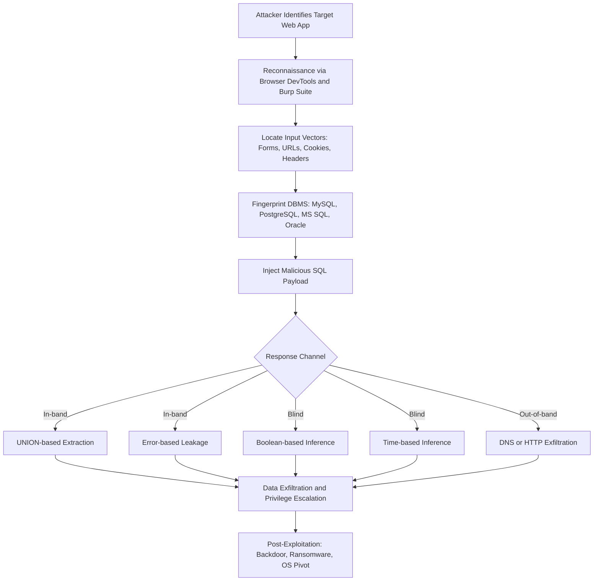
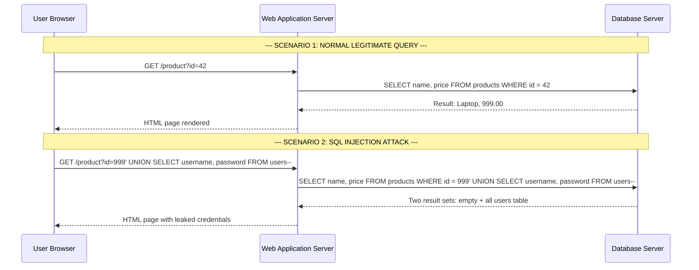
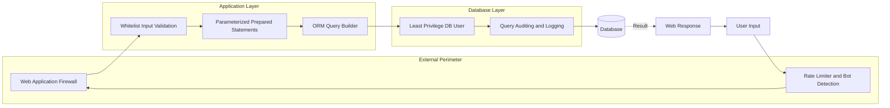
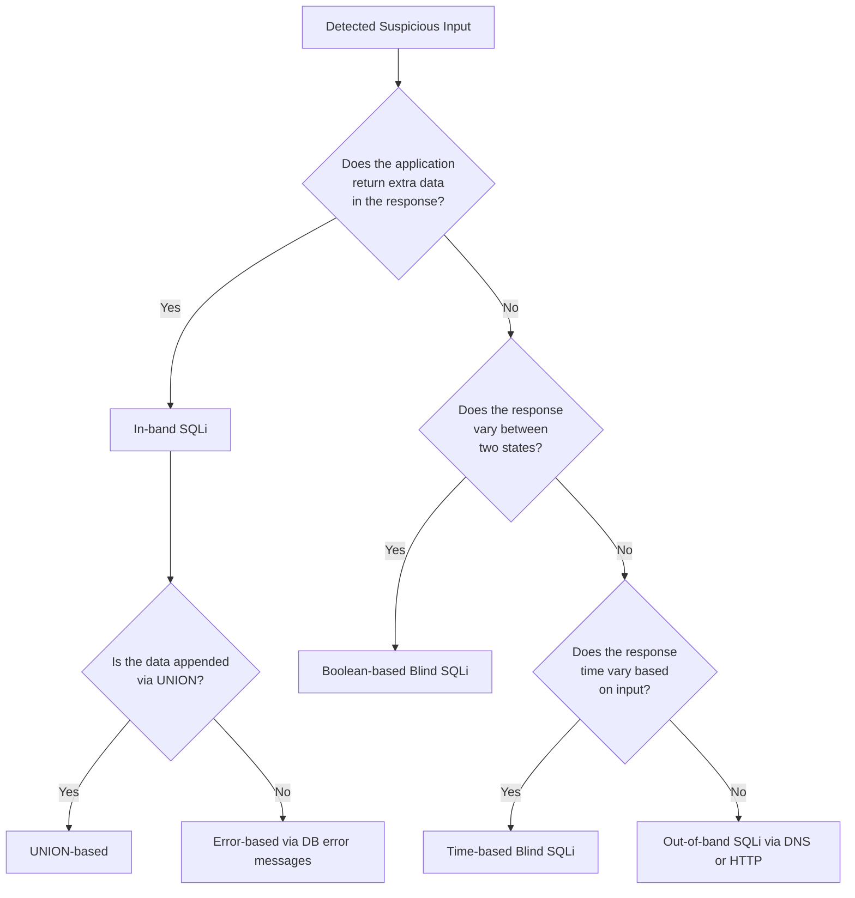

# Web Attacks- SQL Injection Attacks

<!-- SECTION_1_START -->
# 1. Core Technical Definition & Intuitive Overview

## 1.1 Formal Academic Definition (KTU 2024 Syllabus Terminology)

**SQL Injection (SQLi)** is a server-side code injection attack technique in which an attacker inserts (or "injects") malicious Structured Query Language (SQL) statements into an input field (such as a login form, URL parameter, search bar, or API request) that is subsequently passed to the backend relational database for execution. The vulnerability exists when user-supplied input is improperly validated, filtered, or sanitized, and is directly concatenated into a dynamically constructed SQL query string.

According to the **OWASP Top 10 (2021)**, SQL Injection is listed under **A03:2021 – Injection**, and is historically rated as one of the most critical and prevalent web application vulnerabilities (present in the OWASP Top 10 for over two decades). In the **MITRE CWE registry**, it is catalogued as **CWE-89: Improper Neutralization of Special Elements used in an SQL Command**.

> [!IMPORTANT]
> **KTU 2024 Definition (Board Standard):**  
> *SQL Injection is a web-based attack in which an adversary manipulates the data input fields of a web application to alter the logical structure of backend SQL queries, enabling unauthorized access, data exfiltration, modification, or destruction of database records.*

## 1.2 Conceptual Analogy / Intuition

Imagine a highly disciplined bank vault that opens **only** when a security guard hears the exact phrase:  
> *"Open the vault for account number 1001."*

A normal user politely says the correct phrase, and the vault opens safely for their own account.  
Now imagine a **trickster** customer who says:

> *"Open the vault for account number 1001. Oh, and also for account number 1002, 1003, and 1004... actually, just open it for EVERYONE."*

If the guard is **inattentive** and simply repeats back whatever the customer says into his radio to the vault control room (i.e., **concatenates user input into the command**), the vault will obediently unlock for *every* account. This is essentially what happens in SQL Injection — the **database is the vault**, the **user input is the trickster's phrase**, and the **poorly coded application is the inattentive guard**.

A safer design would force the guard to **separately verify** the customer's identity and the intended account number, ignoring any extra instructions smuggled into the phrase. This is the principle behind **parameterized queries / prepared statements** — the most effective defense.

## 1.3 Key Standard Metrics & Constants

- **CWE-89** — Common Weakness Enumeration identifier for SQL Injection.
- **CVSS v3.1 Base Score Range** for typical SQLi vulnerabilities: **7.5 – 9.8 (High to Critical)**.
- **OWASP Top 10 Rank (2021):** **#3** under the Injection category.
- **Default SQL Port:** TCP **1433** (MS SQL Server), **3306** (MySQL/MariaDB), **5432** (PostgreSQL), **1521** (Oracle).
- **Common vulnerable endpoints:** Login pages, search forms, URL query parameters (`?id=`), HTTP POST body fields, HTTP headers (`User-Agent`, `Cookie`, `X-Forwarded-For`).

> [!NOTE]
> **KTU Board Highlight:** Examiners frequently award marks when students explicitly mention **CWE-89**, **OWASP Top 10 (A03)**, and the **CIA Triad violation** (primarily *Confidentiality* and *Integrity*) caused by SQLi.

## 1.4 Visualization Control (Concept Map)

> [!VISUALIZATION CONTROL]
> **Concept:** High-level taxonomy of SQL Injection attack vectors.
> **Suggested Drawing:** Draw a **root node "SQL Injection"** with three child branches — *"In-band (UNION, Error-based)"*, *"Inferential / Blind (Boolean, Time-based)"*, and *"Out-of-band (DNS, HTTP)"*. Use colour-coding: Red for In-band (easiest to detect), Orange for Blind (harder to detect), Yellow for Out-of-band (rare but powerful).
> **Visual Description:** On paper, the root sits at the top, three thick arrows branch downwards to the three sub-categories, and small icons next to each branch indicate the *response channel* used by the attacker (band = direct channel, blind = no direct channel).

<!-- SECTION_1_END -->

<!-- SECTION_2_START -->
# 2. Deep Theoretical Analysis & KTU High-Yield Formula Sheet

## 2.1 Operational Anatomy of a SQL Injection Attack

The lifecycle of an SQL Injection attack can be broken down into **five sequential logical phases**:

1. **Reconnaissance & Surface Identification** — The attacker probes the target web application to identify input vectors (login forms, search bars, URL parameters, cookies, HTTP headers). Tools used include browser DevTools, Burp Suite, OWASP ZAP, and manual inspection.
2. **Fingerprinting the DBMS** — The attacker identifies the backend database engine (MySQL, PostgreSQL, MS SQL Server, Oracle, SQLite) by analyzing error messages, banner disclosures, or behavioural differences. Each DBMS has unique syntax, functions, and metadata tables.
3. **Payload Crafting & Injection** — The attacker constructs a malicious SQL fragment and injects it via the identified vector. Classic payloads include `' OR '1'='1`, `'; DROP TABLE users; --`, and `UNION SELECT username, password FROM users--`.
4. **Exploitation & Data Exfiltration** — The injected query is executed by the database, and the result is either returned directly (In-band), inferred via boolean/time differences (Blind), or exfiltrated via a side channel (Out-of-band).
5. **Post-Exploitation** — The attacker escalates privileges, exfiltrates sensitive data, modifies records, plants backdoors, pivots to the OS (e.g., via `xp_cmdshell` in MS SQL), or delivers ransomware.

## 2.2 The "Why" Behind the Vulnerability

The root cause is a **violation of the trust boundary**. User input is classified as *untrusted* data, but the application treats it as *trusted code* by string-concatenating it into a SQL command. The database engine has no way to distinguish between the developer's intended code and the attacker's injected code because they are syntactically merged.

> [!IMPORTANT]
> **The Golden Rule of Secure Database Interaction:**  
> *Code and Data must NEVER share the same channel.*  
> Parameterized queries enforce this by sending code and data through **separate channels** to the DBMS.

## 2.3 Classification of SQL Injection Types

| **Class** | **Sub-Class** | **Mechanism** | **Detection Difficulty** |
| :--- | :--- | :--- | :--- |
| **In-band (Classic)** | **Error-based** | DBMS error messages leak schema/data directly. | Easy for attacker, easy for defender (visible logs). |
| | **UNION-based** | `UNION SELECT` appends attacker query to original result set. | Easy for attacker. |
| **Inferential (Blind)** | **Boolean-based** | Attacker infers data from TRUE/FALSE response differences. | Hard — no direct data leak. |
| | **Time-based** | Attacker uses `SLEEP()` or `WAITFOR DELAY` to infer data. | Hardest — only timing differences. |
| **Out-of-band** | **DNS / HTTP exfiltration** | Data exfiltrated via external DNS or HTTP requests initiated by DBMS. | Rare, used when in-band and blind fail. |

## 2.4 Common Malicious Payloads (Board-Relevant)

| **Payload** | **Intent** |
| :--- | :--- |
| `' OR '1'='1` | Bypass authentication (always-true clause). |
| `' OR 1=1--` | Same as above with SQL comment to ignore rest of query. |
| `'; DROP TABLE users; --` | Inject destructive DDL command. |
| `' UNION SELECT username, password FROM users--` | Append extra result set to extract data. |
| `' AND 1=CONVERT(int, (SELECT TOP 1 table_name FROM information_schema.tables))--` | Trigger error revealing table name (Error-based). |
| `' OR IF(1=1, SLEEP(5), 0)--` | Time-based blind payload (MySQL). |
| `'; EXEC xp_cmdshell('whoami'); --` | OS command execution on MS SQL Server. |

## 2.5 KTU High-Yield Formula & Cheat Sheet

> [!IMPORTANT]
> **Board Valuation Tip:** The following table is the **single most important reference** for SQL Injection questions in KTU ESE. Memorize every row.

| **Concept** | **Formula / Pattern / Rule** | **Notes** |
| :--- | :--- | :--- |
| Vulnerable code pattern | `"SELECT * FROM users WHERE id = '" + userInput + "'";` | String concatenation = vulnerability. |
| Safe code pattern | `PreparedStatement("SELECT * FROM users WHERE id = ?")` | Code and data sent separately. |
| Boolean blind inference | If page loads normally → `TRUE` branch; if empty/errored → `FALSE` branch. | Used when no data is returned. |
| Time-based blind inference | Page delays $\geq$ $5\,\text{seconds}$ → condition was `TRUE`. | $T_{\text{response}} - T_{\text{baseline}} \geq \Delta t$. |
| UNION column count | `' ORDER BY 1--` (increment until error). | Number of columns = last successful ORDER BY. |
| MySQL version probe | `' UNION SELECT @@version--` | Returns `5.7.x`, `8.0.x`, etc. |
| PostgreSQL version probe | `' UNION SELECT version()--` | Returns full version string. |
| MS SQL version probe | `' UNION SELECT @@version--` | Returns `Microsoft SQL Server 20xx`. |
| Information schema (MySQL) | `information_schema.tables`, `information_schema.columns` | Standardized metadata since SQL:2003. |
| Authentication bypass | `' OR '1'='1' -- ` | Closing quote neutralizes developer quote. |
| Stacked queries | `'; <second query>; --` | Enabled by default in some DBMS (e.g., PostgreSQL). |
| Comment terminator (MySQL/SQL Server) | `-- ` (note trailing space) or `/* ... */` | `--` requires a space or newline. |
| Comment terminator (MySQL only) | `#` | Hash symbol. |
| CWE Reference | **CWE-89** | Mandatory in definitions. |
| OWASP Reference | **A03:2021 – Injection** | Mandatory in definitions. |

## 2.6 Real-World Engineering Utility

SQL Injection is not merely an academic concept — it is the attack vector behind some of the **largest data breaches in history**:

- **Heartland Payment Systems (2008)** — SQLi led to exposure of **130 million** credit card numbers.
- **TalkTalk (2015)** — SQLi on a legacy web portal exposed **157,000** customer records; fined £400,000 by ICO.
- **7-Eleven (2022)** and multiple US universities — SQLi led to multi-million record exposures.

In **production engineering**, SQLi knowledge is essential for:
- **Secure SDLC implementation** (writing secure backend code).
- **Penetration testing** (authorized ethical hacking).
- **DevSecOps pipelines** (integrating SAST/DAST tools like SonarQube, SQLMap).
- **Compliance auditing** (PCI-DSS Requirement 6.5.1, ISO 27001 control A.14.2.5).

<!-- SECTION_2_END -->

<!-- SECTION_3_START -->
# 3. Step-by-Step Derivations, Code, and Symbolic Implementation

## 3.1 Worked Example 1 — The Classic Authentication Bypass

### 3.1.1 Vulnerable Backend (Python + SQLite)

```python
# --- VULNERABLE CODE (DO NOT USE IN PRODUCTION) ---
# File: login_vulnerable.py
import sqlite3

def authenticate_vulnerable(username: str, password: str) -> bool:
    """
    Authenticates a user via string-concatenated SQL.
    THIS FUNCTION IS INTENTIONALLY VULNERABLE FOR TEACHING.
    """
    connection: sqlite3.Connection = sqlite3.connect("users.db")
    cursor: sqlite3.Cursor = connection.cursor()

    # DANGER: user input concatenated directly into the query string.
    query: str = (
        "SELECT id FROM users "
        f"WHERE username = '{username}' AND password = '{password}'"
    )
    print(f"[DEBUG] Executing query: {query}")

    cursor.execute(query)
    result = cursor.fetchone()
    connection.close()
    return result is not None
```

### 3.1.2 The Attack — Step-by-Step Trace

**Attacker input on the login form:**

```
Username:  admin' --
Password:  anything
```

**Step 1 — Input substitution** into the query template:

$$\text{Query template} = \texttt{SELECT id FROM users WHERE username = '} \oplus \text{userInput} \oplus \texttt{' AND password = '} \oplus \text{userInput} \oplus \texttt{'}$$

**Step 2 — Substituting `admin' --` for the username field:**

$$\text{Final query} = \texttt{SELECT id FROM users WHERE username = 'admin' --' AND password = 'anything'}$$

**Step 3 — SQL parser interpretation:**

$$
\begin{aligned}
\text{Valid clause:} \quad & \texttt{WHERE username = 'admin'} \\
\text{Comment starts at:} \quad & \texttt{--} \\
\text{Therefore ignored:} \quad & \texttt{' AND password = 'anything'} \\
\end{aligned}
$$

**Step 4 — Effective query executed by the database:**

$$\texttt{SELECT id FROM users WHERE username = 'admin'}$$

**Step 5 — Outcome:** The database returns the `id` of the `admin` user. The password check is **completely bypassed**, granting the attacker administrative access. The `authenticate_vulnerable()` function returns `True`.

> [!NOTE]
> **Even simpler payload — `' OR '1'='1`:** This makes the WHERE clause unconditionally true, logging the attacker in as the **first user** in the table (often the admin).

### 3.1.3 The Defense — Parameterized Query (Board Gold Standard)

```python
# --- SECURE CODE (PRODUCTION-READY) ---
# File: login_secure.py
import sqlite3
import logging

# Configure strict security logging
logging.basicConfig(level=logging.INFO, format="%(asctime)s [%(levelname)s] %(message)s")

def authenticate_secure(username: str, password: str) -> bool:
    """
    Authenticates a user via a parameterized prepared statement.
    SAFE AGAINST SQL INJECTION BY DESIGN.
    """
    if not username or not password:
        logging.warning("Empty credentials rejected.")
        return False

    # Defensive length checks to prevent resource exhaustion
    if len(username) > 64 or len(password) > 128:
        logging.error(f"Oversized input from username of length {len(username)}.")
        return False

    try:
        connection: sqlite3.Connection = sqlite3.connect("users.db")
        cursor: sqlite3.Cursor = connection.cursor()

        # SAFE: '?' placeholders are sent to the DBMS as data, not code.
        query: str = "SELECT id FROM users WHERE username = ? AND password = ?"
        cursor.execute(query, (username, password))

        result = cursor.fetchone()
        connection.close()
        return result is not None

    except sqlite3.DatabaseError as db_err:
        logging.exception(f"Database error during authentication: {db_err}")
        return False
```

**Why the secure version works:**  
The DBMS receives two separate packets — the SQL template (code) and the user input (data). Because the input is bound to a parameter channel, the single quote `'`, the `--` comment, and the `OR` keyword are treated as **literal characters**, not as SQL syntax.

## 3.2 Worked Example 2 — UNION-Based Data Exfiltration

### 3.2.1 Target Query (assumed)

$$\texttt{SELECT name, price FROM products WHERE id = \{id\}}$$

### 3.2.2 Step 1 — Discover the Column Count

Attacker tests in sequence:

$$\texttt{'} \ \texttt{ORDER BY 1--} \rightarrow \text{Success}$$
$$\texttt{'} \ \texttt{ORDER BY 2--} \rightarrow \text{Success}$$
$$\texttt{'} \ \texttt{ORDER BY 3--} \rightarrow \text{Error}$$

**Conclusion:** The query has **2 columns**. *(Error implies the third column does not exist in the original `SELECT` list.)*

### 3.2.3 Step 2 — Construct the UNION Attack

Attacker submits:

```
?id=999' UNION SELECT username, password FROM users--
```

**Resulting query:**

$$
\texttt{SELECT name, price FROM products WHERE id = 999' UNION SELECT username, password FROM users--}
$$

**Database returns two result sets:** the (empty) product row + the entire `users` table. The application displays this in the product page — **all credentials leaked**.

### 3.2.4 Step 3 — Enumerate the DBMS Version (MySQL)

```
?id=999' UNION SELECT @@version, database()--
```

Returns, for example, `8.0.32` and `shopdb`, confirming the DBMS fingerprint.

## 3.3 Worked Example 3 — Time-Based Blind SQL Injection

### 3.3.1 Vulnerable Endpoint

The endpoint returns the *same* response regardless of input (no error messages, no extra data). Only timing can be observed.

### 3.3.2 Payload to Test if Database is MySQL

```
?id=1' AND IF(1=1, SLEEP(5), 0)--
```

**Step 1 — Attacker measures baseline response time** $T_{\text{baseline}} \approx 0.05\,\text{s}$.

**Step 2 — Attacker submits payload above.** Server delays for **5 seconds**.

**Step 3 — Inference:** Because the page took $\geq 5$ seconds, the inner condition `1=1` was evaluated as **TRUE**, the `SLEEP(5)` was executed, and the database is **MySQL/MariaDB**.

### 3.3.3 Step 4 — Extract Data One Character at a Time

```
?id=1' AND IF(SUBSTRING(@@version,1,1)='8', SLEEP(5), 0)--
```

If response is delayed → first character of version is `'8'`. The attacker iterates through ASCII values using a binary search algorithm — a single character can be extracted in at most **7 requests**.

$$
\text{Characters extracted per minute} = \frac{60}{7} \approx 8.57 \text{ chars/min}
$$

## 3.4 Worked Example 4 — Real-World Lab: Exploiting with `sqlmap` (Conceptual)

The industry-standard automated SQLi tool is `sqlmap`. A typical command:

```bash
sqlmap -u "http://target.com/product?id=1" \
       --batch \
       --dbs \
       --random-agent \
       --level=3 \
       --risk=2
```

| **Flag** | **Function** |
| :--- | :--- |
| `-u` | Target URL with injectable parameter. |
| `--batch` | Non-interactive mode. |
| `--dbs` | Enumerate databases. |
| `--random-agent` | Randomize User-Agent header to evade WAF. |
| `--level=3` | Increase test depth (default is 1). |
| `--risk=2` | Include riskier payloads (e.g., time-based heavy queries). |

> [!WARNING]
> **Legal & Ethical Warning:** `sqlmap` must **only** be used against systems for which you have **explicit written authorization** (e.g., bug bounty programs, owned lab VMs like DVWA, HackTheBox, TryHackMe). Unauthorized use is a criminal offence under the **IT Act 2000 (India) §66**, the **Computer Misuse Act 1990 (UK)**, and equivalent statutes worldwide.

## 3.5 Comprehensive Prevention Matrix (Board-Relevant)

| **Defense Layer** | **Mechanism** | **Effectiveness** | **Implementation Cost** |
| :--- | :--- | :--- | :--- |
| **Parameterized Queries / Prepared Statements** | Code-data separation at the protocol level. | ★★★★★ (Gold Standard) | Low |
| **Stored Procedures** | Pre-compiled SQL on the DBMS. | ★★★★ (if not dynamically built) | Medium |
| **Input Validation (Whitelist)** | Reject inputs not matching a strict regex/pattern. | ★★★★ (defense-in-depth) | Low |
| **Escaping / Sanitization** | Manually escape quotes, backslashes. | ★★ (error-prone) | Low |
| **Object-Relational Mappers (ORMs)** | E.g., SQLAlchemy, Hibernate — generates SQL internally. | ★★★★ (if used correctly) | Medium |
| **Web Application Firewall (WAF)** | Signature-based payload blocking. | ★★★ (bypassable) | Medium |
| **Principle of Least Privilege (DB users)** | App account has only required permissions. | ★★★★ (limits blast radius) | Low |
| **Disable Verbose Error Messages** | Prevent error-based information leakage. | ★★★ (UX trade-off) | Low |
| **Regular Patching & SAST/DAST** | Static/Dynamic Application Security Testing. | ★★★★ (continuous) | High |

> [!IMPORTANT]
> **KTU Board Examiner's Note:** The *single most important* defense to write in any SQL Injection answer is **Parameterized Queries (Prepared Statements)**. The *second most important* is **Input Validation**. Always state *both* for full marks.

<!-- SECTION_3_END -->

<!-- SECTION_4_START -->
# 4. Structural Diagrams & Schematics

## 4.1 Attack Flow Diagram — SQL Injection Lifecycle



## 4.2 Sequence Diagram — Normal Query vs. SQL Injection Query



## 4.3 Architecture Diagram — Defense-in-Depth Stack



## 4.4 Decision Tree — Identifying the SQL Injection Type



## 4.5 Conceptual Mapping — Vulnerability, Attack, Impact, Defense

| **Vulnerability Layer** | **Specific Weakness** | **Attack Exploited** | **CIA Triad Impact** | **Recommended Defense** |
| :--- | :--- | :--- | :--- | :--- |
| Input validation | Unsanitized form field | `' OR '1'='1` | Confidentiality, Integrity | Whitelist regex |
| Query construction | String concatenation | UNION SELECT injection | Confidentiality | Parameterized queries |
| Error handling | Verbose error messages | Error-based schema leak | Confidentiality | Suppress error display |
| Authentication | Password check in WHERE clause | `--` comment bypass | Authentication broken | Hash + parameterized check |
| Authorization | No role check after login | Privilege escalation | Integrity, Availability | Server-side role enforcement |
| Database user | Over-privileged `sa` / `root` | `xp_cmdshell` OS pivot | All three (CIA) | Least privilege principle |
| Network egress | DBMS allowed outbound DNS | DNS exfiltration | Confidentiality | Egress firewall rules |

<!-- SECTION_4_END -->

<!-- SECTION_5_START -->
# 5. KTU 2024 Scheme Examination Question Bank & Topic Recap

## 5.1 Part A — Short Answer Questions (3 Marks Each)

### Question 1 (3 Marks) `[KTU University Exam – July 2024, CO1, Remember]`

**Q: Define SQL Injection. Mention any two impacts of SQL Injection on a web application's security.**

**Model Answer (Board-Standard):**

> **Definition:** SQL Injection (SQLi) is a code injection attack in which an attacker inserts malicious SQL statements into input fields that are processed by the backend database, exploiting improper input validation and string concatenation in query construction. *(2 Marks)*
>
> **Impacts:** *(Any two of the following for 1 Mark)*
> 1. **Confidentiality breach** — unauthorized disclosure of sensitive data such as usernames, passwords, and credit card numbers.
> 2. **Integrity violation** — unauthorized modification or deletion of database records.
> 3. **Authentication bypass** — login mechanisms defeated by always-true clauses.
> 4. **Remote code execution / OS compromise** — via DBMS features like `xp_cmdshell` (MS SQL).
> 5. **Complete database destruction** — via `DROP TABLE` injection.

---

### Question 2 (3 Marks) `[KTU University Exam – Dec 2023, CO1, Understand]`

**Q: Differentiate between In-band SQL Injection and Inferential (Blind) SQL Injection with suitable examples.**

**Model Answer:**

> **In-band SQLi:** The attacker uses the **same communication channel** to launch the attack and gather results. Data is returned directly in the HTTP response.
> *Example:* `UNION SELECT username, password FROM users--` — the stolen credentials appear directly in the rendered page. *(1.5 Marks)*
>
> **Inferential (Blind) SQLi:** No data is transferred via the web application. The attacker reconstructs information by observing **side effects** — either boolean differences in response or time delays.
> *Example:* `' AND IF(1=1, SLEEP(5), 0)--` — a 5-second delay confirms a TRUE condition; the attacker iteratively extracts the database version character-by-character. *(1.5 Marks)*

---

## 5.2 Part B — Long Answer Questions (14 Marks Each, Internal Choice)

### Question A (14 Marks) `[KTU University Exam – July 2024, CO2, Apply + Analyze]`

**Q: (a)** Explain the working of SQL Injection attack with a neat diagram. Describe the different types of SQL Injection. *(7 Marks)*

**(b)** Consider the following vulnerable authentication query in a web application:

```sql
SELECT id FROM users WHERE username = '<USERNAME>' AND password = '<PASSWORD>';
```

An attacker submits the following values in the login form:

- **Username:** `admin' OR '1'='1' -- `
- **Password:** `anything`

Demonstrate with step-by-step working how the attacker bypasses authentication. Suggest and justify the most effective countermeasure. *(7 Marks)*

---

#### Model Solution

**Part (a) — Working and Types (7 Marks):**

*Working of SQL Injection — step-by-step:*

1. **Identification of input vector:** The attacker identifies a form, URL parameter, or header that is reflected in a backend SQL query. *(1 Mark)*
2. **Payload construction:** A malicious SQL fragment is crafted (e.g., `' OR '1'='1`). *(1 Mark)*
3. **Injection and execution:** The input is concatenated into the SQL string and sent to the database, which executes both the developer's intended code and the attacker's injected code. *(1 Mark)*
4. **Result extraction:** Depending on the type, data is returned in-band or inferred through blind techniques. *(1 Mark)*

*Types of SQL Injection (any 3 types for 3 Marks):*

- **In-band (UNION-based / Error-based):** Data is extracted in the same channel.
- **Inferential Blind (Boolean / Time-based):** Data is inferred from response differences or timing.
- **Out-of-band:** Data is exfiltrated via external channels (DNS, HTTP) initiated by the DBMS.

*(Full 7 marks: 4 marks for working + 3 marks for types.)*

**Part (b) — Authentication Bypass Demonstration (7 Marks):**

**Step 1 — Identify the vulnerable query:**

$$\texttt{SELECT id FROM users WHERE username = '<USERNAME>' AND password = '<PASSWORD>';}$$

**[Stating the vulnerable query: 1 Mark]**

**Step 2 — Substitute the attacker's inputs:**

$$\texttt{SELECT id FROM users WHERE username = 'admin' OR '1'='1' -- ' AND password = 'anything';}$$

**[Substitution: 1 Mark]**

**Step 3 — SQL parser evaluation:**

$$
\begin{aligned}
\text{Clause 1:} \quad & \texttt{username = 'admin'} \\
\text{Clause 2:} \quad & \texttt{OR '1'='1'} \quad \Rightarrow \text{always TRUE} \\
\text{Remainder:} \quad & \texttt{-- ' AND password = 'anything';} \quad \Rightarrow \text{commented out} \\
\end{aligned}
$$

**[Logical analysis: 2 Marks]**

**Step 4 — Effective executed query:**

$$\texttt{SELECT id FROM users WHERE username = 'admin' OR '1'='1'}$$

**[Final simplified query: 1 Mark]**

**Step 5 — Outcome:** The WHERE clause is always TRUE, so the database returns the `id` of the first user — the attacker is logged in without supplying a valid password. **[Result: 1 Mark]**

**Step 6 — Countermeasure:**

> **Recommended Defense: Parameterized Prepared Statements.**  
> The query should be rewritten as:
> ```sql
> SELECT id FROM users WHERE username = ? AND password = ?;
> ```
> The `?` placeholders are bound to user-supplied values as **data**, not code. The DBMS treats single quotes, `OR`, and `--` as literal characters, rendering the injection harmless.
>
> **Justification:** Parameterized queries enforce a **strict separation of code and data** at the DBMS protocol level, are **performance-optimized** (pre-compiled execution plans), and are **language-agnostic** (available in JDBC, PDO, psycopg2, sqlite3, etc.). They are the OWASP-recommended primary defense. **[Countermeasure + justification: 1 Mark]**

---

### Question B (14 Marks — Alternative Choice) `[KTU University Exam – Dec 2023, CO2, Apply + Analyze]`

**Q: (a)** Compare and contrast In-band, Inferential, and Out-of-band SQL Injection with a comparative table. Mention the appropriate defense mechanisms for each. *(7 Marks)*

**(b)** With a suitable example, explain how a **Time-based Blind SQL Injection** attack is performed to extract the database version of a MySQL server. Show the relevant payloads and the inference logic. *(7 Marks)*

---

#### Model Solution

**Part (a) — Comparative Table (7 Marks):**

| **Parameter** | **In-band** | **Inferential (Blind)** | **Out-of-band** |
| :--- | :--- | :--- | :--- |
| **Data Channel** | Same channel as attack. | No direct channel — inferred. | External channel (DNS/HTTP). |
| **Speed** | Fast. | Slow (many requests). | Variable. |
| **Detection by Defender** | Easier (visible in logs). | Harder. | Hardest. |
| **Example Technique** | UNION SELECT, Error-based. | Boolean, Time-based. | `LOAD_FILE()`, `INTO OUTFILE`, DNS lookups. |
| **Prerequisite** | Verbose errors or visible data. | Consistent response behaviour. | Egress network access. |
| **Defense Mechanism** | Suppress error messages + parameterized queries. | Parameterized queries + WAF. | Egress firewall + parameterized queries. |

**[Table construction with at least 5 valid rows: 5 Marks]**  
**[Defenses correctly mapped: 2 Marks]**

**Part (b) — Time-Based Blind SQLi (7 Marks):**

**Step 1 — Confirm time-based vulnerability:**

$$\texttt{Payload: } \texttt{id=1' AND SLEEP(5)--}$$

If the response is delayed by $\geq 5$ seconds, the injection point is confirmed and the DBMS is MySQL. **[1 Mark]**

**Step 2 — Identify version length:**

$$\texttt{Payload: } \texttt{id=1' AND IF(LENGTH(@@version)=6, SLEEP(5), 0)--}$$

If delayed, MySQL version string is 6 characters long (e.g., `8.0.32`). **[1 Mark]**

**Step 3 — Binary search for first character:**

$$\texttt{Payload: } \texttt{id=1' AND IF(ASCII(SUBSTRING(@@version,1,1))=56, SLEEP(5), 0)--}$$

If delayed, the ASCII value is 56, which corresponds to the character `'8'`. The attacker repeats this for each of the 6 characters. **[2 Marks]**

**Step 4 — Inference logic:**

$$
\text{Response time } T \geq T_{\text{baseline}} + 5\,\text{s} \;\Rightarrow\; \text{condition is TRUE}
$$

$$
\text{Response time } T \approx T_{\text{baseline}} \;\Rightarrow\; \text{condition is FALSE}
$$

**[Inference rule clearly stated: 2 Marks]**

**Step 5 — Countermeasure:** Apply parameterized queries; the `SLEEP()` function will never receive attacker-controlled input. **[1 Mark]**

---

## 5.3 KTU Examiner's Valuation Warning / Pitfall Callout

> [!WARNING]
> **Common Mark-Deduction Pitfalls in KTU Valuation:**
> 1. **Defining SQLi without mentioning CWE-89 or OWASP** — Examiners explicitly award 0.5 to 1 mark for citing these standards. Do not omit them.
> 2. **Writing only "use input validation" as the defense** — This is a *secondary* defense. The *primary* answer must be **Parameterized Queries / Prepared Statements**. Writing only the secondary defense caps your marks at 50%.
> 3. **Failing to show the substituted query** — When asked to demonstrate an attack, you **must** write the *final injected query* in full, then comment-trace it. Skipping this step loses 2–3 marks.
> 4. **Confusing `--` with `#`** — `--` is the SQL standard comment (requires a trailing space); `#` is MySQL-specific. Examiners penalize this technical inaccuracy.
> 5. **Forgetting to state the impact on the CIA Triad** — Every web attack question in KTU expects you to map the attack to **Confidentiality / Integrity / Availability** explicitly.
> 6. **Skipping the diagram in 7-mark questions** — A neat labelled diagram (Mermaid-style or hand-drawn flowchart) of the attack flow earns 1–2 easy marks. Always include one.

---

## 5.4 Topic Recap & Important Things to Remember

- **SQL Injection (SQLi)** is a server-side code injection attack exploiting unsanitized user input concatenated into SQL queries — catalogued as **CWE-89** and listed under **OWASP A03:2021 – Injection**.
- The **root cause** is the failure to separate **code** (SQL template) from **data** (user input) at the application layer.
- The **three primary categories** are **In-band** (UNION, Error-based), **Inferential / Blind** (Boolean, Time-based), and **Out-of-band** (DNS, HTTP exfiltration).
- The **most iconic payload** is `' OR '1'='1' -- `, which neutralizes the closing quote and comments out the password check.
- **UNION-based** attacks require determining the **column count** of the original query using `ORDER BY n--` increments until error.
- **Time-based** attacks use `SLEEP()` (MySQL), `WAITFOR DELAY` (MS SQL), or `pg_sleep()` (PostgreSQL) to infer data when no visible channel exists.
- The **Gold Standard defense** is **Parameterized Queries (Prepared Statements)** — the `?` placeholder transmits data through a separate protocol channel.
- **Secondary defenses** include Whitelist Input Validation, ORM frameworks, Stored Procedures, WAFs, suppression of verbose error messages, and the **Principle of Least Privilege** for database accounts.
- The **CIA Triad impact** is primarily on **Confidentiality** (data theft) and **Integrity** (data modification/deletion), with potential **Availability** impact (e.g., `DROP TABLE`).
- **Real-world impact:** SQLi has caused some of the largest data breaches in history (Heartland 2008 — 130M cards; TalkTalk 2015 — 157K records).
- **The comment terminators** are `--` (with trailing space) and `/* ... */` (multi-line) — `#` is **MySQL-specific**.
- **DBMS-specific version functions** to remember: MySQL → `@@version` / `version()`; PostgreSQL → `version()`; MS SQL → `@@version`.
- **Legal context:** Unauthorized SQLi testing is a criminal offence under the **IT Act 2000 (India) §66**, the **Computer Fraud and Abuse Act (US)**, and the **Computer Misuse Act 1990 (UK)**.
- **Tools of the trade:** Burp Suite, OWASP ZAP (reconnaissance), sqlmap (automated exploitation), SonarQube (SAST), Invicti/Netsparker (DAST).

<!-- SECTION_5_END -->
