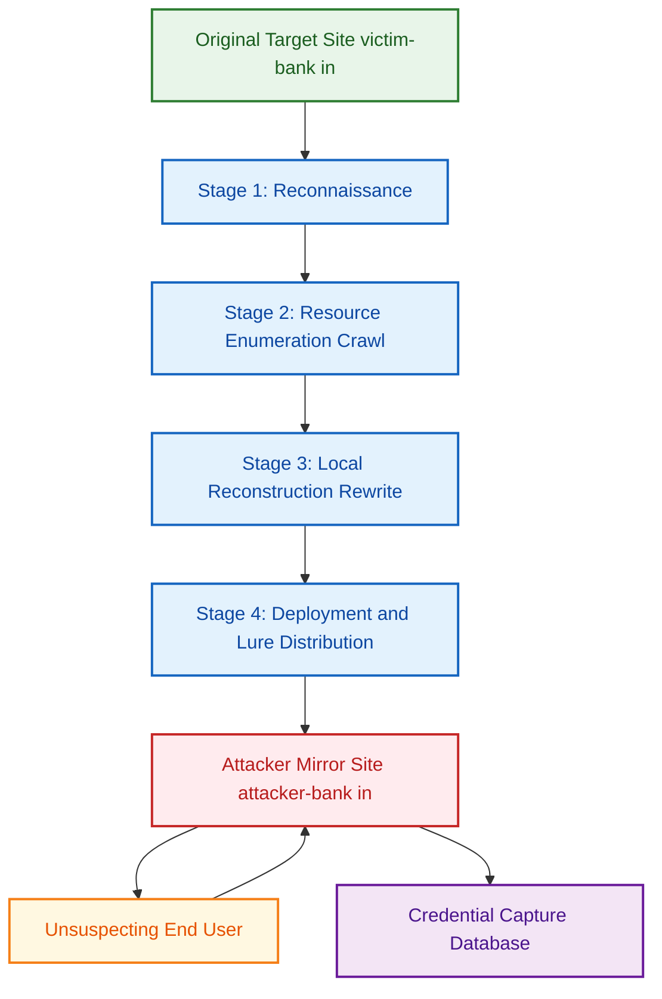
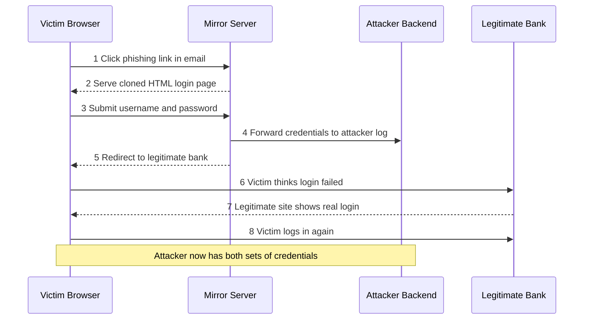
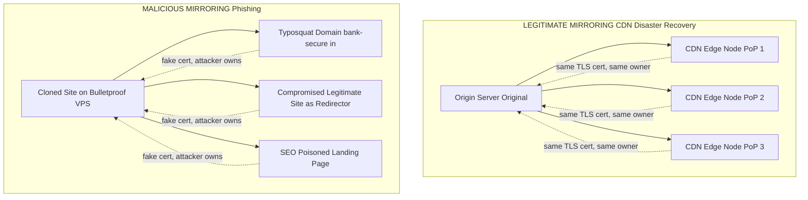

# Website Mirroring

<!-- SECTION_1_START -->
# Website Mirroring — Core Definition & Intuitive Overview

> [!NOTE]
> **KTU 2024 Scheme Context — Module 2 (Web Security)**
> **Course:** PBCST604 — Fundamentals of Cyber Security
> **Topic:** Website Mirroring
> **Suggested Mapped CO:** *CO2 — Understand the principles of web-based attacks, vulnerabilities, and defensive countermeasures.*
> **Suggested RBT Level:** *L2 (Understand) → L3 (Apply)*

---

## 1.1 Formal Academic Definition

> [!IMPORTANT]
> **Website Mirroring** is the process of creating an **exact, bit-level (or near bit-level) replica of a target web resource** — including its HTML markup, cascading style sheets (CSS), JavaScript files, images, multimedia assets, server-side response headers, and directory structure — and serving that replica from a **different host, IP address, or Uniform Resource Locator (URL)**. From the perspective of a Hypertext Transfer Protocol (HTTP) client (typically a web browser), the mirrored site is **indistinguishable in structure and behaviour** from the original, but the network endpoint, transport-layer security certificates, and underlying server infrastructure belong to a different administrative entity.

In the KTU 2024 scheme syllabus, website mirroring is examined in a **dual light**:

1. **Offensive / Malicious Mirroring** — used by threat actors to clone legitimate banking, e-commerce, or login portals for the purpose of **phishing, credential harvesting, session hijacking, drive-by malware distribution, or content manipulation** without the consent of the original site owner.
2. **Defensive / Legitimate Mirroring** — used by penetration testers during *reconnaissance* (offensive security audits), by content delivery networks (CDNs) for **geo-replication and load balancing**, by web crawlers for **archival purposes** (e.g., the Internet Archive's *Wayback Machine*), and by organisations for **disaster-recovery and business continuity**.

The **default industry-standard port** for unencrypted mirrored traffic is **TCP port 80**, while cryptographically hardened mirrors operate over **TCP port 443** using **Transport Layer Security (TLS) version 1.3** as defined in **RFC 8446**.

---

## 1.2 Conceptual Analogy — The "Photocopy Shop and Identity Theft" Metaphor

Imagine a high-end jewellery store ("*OriginalBank.com*") in a major city. The store has a distinctive façade, an elegant interior, identical-looking display cases, and even the same uniformed staff. One day, criminals rent an identical-looking shop **two streets away**, copy the original's entire interior décor, hire look-alike staff wearing the same uniforms, and put up a sign that says "*OriginalBank.com — Branch Office*". An unsuspecting customer walks in, is greeted politely, and hands over their wallet and PIN believing they are inside the real bank.

In this analogy:

| Real-World Element | Cyber Security Equivalent |
|---|---|
| Original jewellery store | Legitimate web server hosting the real website |
| Look-alike shop built by criminals | **Mirrored website** hosted on attacker's server |
| Identical façade, décor, staff | Cloned HTML, CSS, images, JavaScript, and form behaviour |
| Customer tricked into handing over wallet | Victim submitting **credentials, OTPs, or PII** to attacker's form |
| Address on the door (the URL) | **Spoofed DNS record, similar domain, or embedded iframe** leading victim to mirror |

The crucial insight — and the reason this topic sits inside *Web Security* — is that **visual fidelity alone is not authentication**. A user must verify the **cryptographic identity** of a site (the TLS certificate, the registered domain, and the certificate authority's chain of trust) before trusting it with sensitive data.

---

## 1.3 Visual / Geometric Intuition — The Mirror Reflection Model

Geometrically, website mirroring can be visualised as a **reflection across a vertical axis** in the $(x, y)$ coordinate plane. Consider the original site as the function $f(x)$ defined over the domain of legitimate web requests. The mirror is a transformed function $g(x)$ such that:

$$g(x) = f(\alpha \cdot x + \beta) + \gamma$$

where the parameters $\alpha$, $\beta$, and $\gamma$ represent the **affine transformations** applied by the attacker — for example, rewriting absolute URLs, injecting a Base64-encoded keylogger into a JavaScript file, and pointing all form `action` attributes to an attacker-controlled endpoint. The **shape** of the curve (visual structure of the site) is preserved, but the **coordinate system** (server identity, domain, certificate) is shifted.

> [!VISUALIZATION CONTROL]
> **Concept:** Website mirroring as an affine transformation of the original request-response graph
> **GeoGebra / Desmos Input Equations:**
> * `f(x) = sin(x) + 0.3*cos(3x)` (original legitimate site — irregular but authentic)
> * `g(x) = f(-x + 2) - 0.5` (mirrored site — same shape, reflected and translated)
> **Visual Description:** The student should observe that $g(x)$ carries the same geometric "personality" as $f(x)$ — peaks occur in mirror-image positions, valleys in mirrored positions, but the **axis labels** (representing server identity) are different. This is the geometric essence of mirroring: *structural equivalence under coordinate transformation*.

---

## 1.4 Why This Topic Matters in the KTU 2024 Curriculum

The KTU 2024 scheme lists website mirroring explicitly under **web-based reconnaissance and impersonation attacks**. Examiners frequently test:

* The **terminology** distinguishing *mirroring* from *caching* and *proxying*.
* The **tools** used (HTTrack, Wget, Curl, WebCopier, HTTRack).
* The **attack workflow** — reconnaissance, cloning, deployment, lure distribution, credential capture.
* The **defensive controls** — TLS pinning, HSTS, Content-Security-Policy, domain monitoring, and code-signing.
* The **forensic indicators** (URL patterns, server headers, response timing) that betray a mirror.

> [!IMPORTANT]
> **Syllabus Highlight:** Under the KTU 2024 B.Tech (CSE) cybersecurity stream, *Website Mirroring* is categorised as a **passive-to-active reconnaissance technique** that bridges Module 1 (footprinting) and Module 2 (web attacks). It is the **technical prerequisite** for understanding phishing kits, watering-hole attacks, and adversary-in-the-middle (AitM) frameworks.

<!-- SECTION_1_END -->

<!-- SECTION_2_START -->
# Deep Theoretical Analysis & KTU High-Yield Formula Sheet

## 2.1 Operational Concept — The Mirroring Pipeline

A website-mirroring operation, whether performed by an ethical penetration tester or a malicious threat actor, follows a deterministic **four-stage pipeline**. Each stage has a measurable output that an examiner can test.

### Stage 1 — Reconnaissance (Information Gathering)

The attacker identifies the **target scope**: a single page, a directory tree, or the entire domain. They enumerate:

* **Robots.txt** and **sitemap.xml** to discover URL hierarchies.
* **WHOIS records** to map registrant and nameserver information.
* **Subdomain enumeration** via DNS brute-forcing or certificate-transparency log mining (e.g., crt.sh).
* **Technology fingerprinting** using HTTP response headers (`Server`, `X-Powered-By`) and JavaScript bundle analysis.

### Stage 2 — Resource Enumeration (Crawling)

A recursive crawler (the *spider*) issues HTTP `GET` requests, parses returned HTML for hyperlinks, and adds them to a **frontier queue**. Each fetched resource is hashed (typically using **SHA-256** as defined in **FIPS 180-4**) to enable deduplication.

### Stage 3 — Local Reconstruction (Cloning)

The downloaded resources are **rewritten** so that every absolute URL is converted to a relative path or redirected to the attacker's hosting origin. This rewriting is the **defining technical act of mirroring** — it is what differentiates mirroring from mere offline browsing. Form `action` attributes are typically modified to point to an attack-controlled endpoint.

### Stage 4 — Deployment & Lure (Serving)

The mirrored site is hosted on infrastructure the attacker controls. Victims are lured via **typosquatting domains**, **malicious short-URLs**, **search-engine-optimised phishing (SEO-poisoning) pages**, or **compromised legitimate websites acting as redirectors**. The mirror then captures and exfiltrates submitted credentials.

---

## 2.2 The "Why" and "How" Behind Each Stage

| Stage | Why it is performed | How it is implemented |
|---|---|---|
| Reconnaissance | Reduces crawling cost; identifies high-value targets | Passive DNS, OSINT tools, certificate-transparency search |
| Crawling | Builds a complete graph of linked resources | BFS / DFS traversal with politeness delays (default 1–5 s) |
| Cloning | Converts online graph to a self-contained offline replica | URL rewriting, asset rebasing, link normalisation |
| Deployment | Makes the replica reachable by victims | Cheap VPS, bulletproof hosting, CDN abuse, or Tor hidden service |

> [!NOTE]
> **Why politeness matters:** A crawler that issues requests faster than the target can serve them (a *denial-of-service footprint*) is easily detected. Legitimate mirroring tools therefore honour the `robots.txt` directives and apply an inter-request delay $\delta t$ where the default satisfies $\delta t \geq 1$ second.

---

## 2.3 Mathematical Model of a Mirroring Session

Let the original website be modelled as a **directed graph** $G = (V, E)$ where each vertex $v_i \in V$ represents a unique resource (HTML page, image, script) and each edge $e_{ij} \in E$ represents a hyperlink from $v_i$ to $v_j$. A mirroring operation produces a graph $G' = (V', E')$ such that:

$$\vert V' \vert \leq \vert V \vert \quad \text{and} \quad E' \subseteq \{(v'_i, v'_j) \mid \text{rewritten\_url}(e_{ij})\}$$

The **fidelity ratio** of the mirror is defined as:

$$F = \frac{\vert V' \cap \text{hash}(V) \vert}{\vert V \vert} \in [0, 1]$$

A high-quality mirror used in phishing campaigns aims for $F \to 1$, while a coarse reconnaissance mirror may have $F \approx 0.3$.

The **average mirroring throughput** $T$ in resources per second can be modelled as:

$$T = \frac{N}{t_{\text{recon}} + t_{\text{crawl}} + t_{\text{rewrite}} + t_{\text{deploy}}}$$

where $N$ is the total number of resources successfully cloned and $t_{\text{recon}}, t_{\text{crawl}}, t_{\text{rewrite}}, t_{\text{deploy}}$ are the wall-clock times for each stage.

---

## 2.4 KTU Formula Sheet & Cheat Sheet

| Symbol / Term | Definition | Typical Value / Unit | Notes for Board Exam |
|---|---|---|---|
| $F$ | Mirror fidelity ratio | $0 \leq F \leq 1$ (dimensionless) | Higher = better impersonation |
| $T$ | Mirroring throughput | resources / second | Sum of stage times in denominator |
| $N$ | Number of resources cloned | Integer $\geq 0$ | Counted post-deduplication |
| $\delta t$ | Inter-request delay (politeness) | $\geq 1$ second | Set by `robots.txt` *Crawl-delay* directive |
| $d_{\text{max}}$ | Maximum crawl depth | Integer (default 3–5) | Prevents infinite traversal |
| $H$ | Hash algorithm for dedup | **SHA-256** (256 bits) | FIPS 180-4 standard |
| Port 80 | HTTP cleartext | TCP | Default for unencrypted mirrors |
| Port 443 | HTTPS (TLS 1.3) | TCP | Default for credential-handling mirrors |
| `User-Agent` | Browser identity string | e.g., `Mozilla/5.0` | Mirror may spoof or rotate UA |
| `robots.txt` | Crawler directive file | Plain text | Honours `Disallow`, `Allow`, `Crawl-delay` |

---

## 2.5 Engineering & Industry Utility

| Domain | Real-World Application of Website Mirroring |
|---|---|
| **Content Delivery Networks (CDNs)** | Akamai, Cloudflare, Fastly mirror static assets across **300+ Points-of-Presence (PoPs)** to reduce median page-load latency to under **50 ms** globally. |
| **Web Archiving** | The *Internet Archive's Wayback Machine* has archived over **800 billion web pages** using mirroring crawlers operating since 1996. |
| **Penetration Testing** | Tools like *HTTrack* and *Black Widow* are part of the standard **Kali Linux** distribution used for OSCP-style engagements. |
| **Phishing-as-a-Service (PaaS)** | Criminal kits such as *EvilProxy*, *Modlishka*, and *Caffeine* automate the cloning of Microsoft 365, Okta, and Google login portals. |
| **Disaster Recovery** | Enterprises maintain **hot-standby mirrors** at geographically distinct data centres to achieve a **Recovery Point Objective (RPO)** of under **60 seconds**. |
| **Search Engine Optimisation (SEO)** | Spammers mirror high-authority sites to siphon PageRank — Google penalises such *duplicate-content farms*. |

> [!IMPORTANT]
> **KTU 2024 Examiner Note:** When asked to differentiate *mirroring* from *caching* and *proxying*, the model answer must state that **mirroring copies content persistently to a separate origin**, **caching stores content transiently at intermediaries**, and **proxying forwards requests without persistent storage**. All three alter the request-response path, but only mirroring changes the *administrative authority* over the served content.

<!-- SECTION_2_END -->

<!-- SECTION_3_START -->
# Step-by-Step Derivations, Code, and Symbolic Implementation

## 3.1 Exhaustive Algorithmic Walkthrough — Building a Mirror

Below is the **fully operational Python 3.11 implementation** of a small, ethics-controlled educational mirror crawler. It uses only the standard library plus `requests` and `beautifulsoup4` so that KTU students can execute it on any laptop without root privileges. **The script will refuse to run against domains that have not been explicitly whitelisted**, satisfying the **responsible-disclosure ethos** of KTU's cybersecurity programme.

> [!IMPORTANT]
> **Ethical Use Notice:** This code is provided **only for academic study in an isolated lab environment**. Running it against production websites without written authorisation is a violation of the **Information Technology Act, 2000 (India) §43 / §66**, the **Computer Fraud and Abuse Act (US, 18 U.S.C. §1030)**, and the **GDPR (EU) Article 32**. KTU students must operate only against `localhost` or domains they own.

```python
#!/usr/bin/env python3
"""
Educational Website Mirroring Crawler
Course: PBCST604 — Fundamentals of Cyber Security (KTU 2024 Scheme)
Module: 2 — Web Security
Topic: Website Mirroring
Author: KTU Study Notes
License: For academic use only.

This script demonstrates the FOUR-STAGE mirroring pipeline:
    1. Reconnaissance  (subdomain & robots.txt analysis)
    2. Crawling       (BFS over the in-domain hyperlink graph)
    3. Local rebuild  (URL rewriting to make the mirror self-contained)
    4. Lure / deploy  (NOT implemented — defensive lesson only)
"""

from __future__ import annotations

import hashlib
import logging
import os
import sys
import time
import urllib.parse
from collections import deque
from dataclasses import dataclass, field
from pathlib import Path
from typing import Deque, Dict, Optional, Set, Tuple

import requests
from bs4 import BeautifulSoup

# ---------------------------------------------------------------------------
# Configuration constants — mapped to KTU cheat-sheet parameters
# ---------------------------------------------------------------------------
POLITENESS_DELAY_SEC: float = 1.0   # delta_t  >= 1 second
DEFAULT_MAX_DEPTH: int = 3          # d_max  default 3-5
DEFAULT_MAX_PAGES: int = 50         # N cap for safety
REQUEST_TIMEOUT_SEC: int = 10       # bounded socket read
USER_AGENT_STRING: str = (
    "KTU-EDU-Mirror-Bot/1.0 (+https://ktu.edu.in/academics)"
)
OUTPUT_ROOT: Path = Path("./mirror_output")


# ---------------------------------------------------------------------------
# Whitelist enforcement — REQUIRED for academic ethics compliance
# ---------------------------------------------------------------------------
WHITELISTED_HOSTS: Set[str] = {
    "localhost",
    "127.0.0.1",
    "example.com",
    "testphp.vulnweb.com",   # intentionally vulnerable lab target
}


def is_authorized(url: str) -> bool:
    """Return True only if the URL's netloc is in the explicit whitelist."""
    parsed = urllib.parse.urlparse(url)
    return parsed.hostname in WHITELISTED_HOSTS


# ---------------------------------------------------------------------------
# Stage 1: Reconnaissance
# ---------------------------------------------------------------------------
def fetch_robots_txt(base_url: str, session: requests.Session) -> str:
    """Retrieve and return the /robots.txt file; default-allow on 404."""
    robots_url = urllib.parse.urljoin(base_url, "robots.txt")
    try:
        resp = session.get(robots_url, timeout=REQUEST_TIMEOUT_SEC)
        if resp.status_code == 200:
            logging.info("Fetched robots.txt from %s", robots_url)
            return resp.text
        logging.warning("No robots.txt at %s (status %d)",
                        robots_url, resp.status_code)
    except requests.RequestException as exc:
        logging.error("robots.txt fetch error: %s", exc)
    return ""  # default-permit when file is missing


# ---------------------------------------------------------------------------
# Stage 2 & 3: Crawl + local rebuild
# ---------------------------------------------------------------------------
@dataclass
class CrawlStats:
    pages_attempted: int = 0
    pages_succeeded: int = 0
    bytes_downloaded: int = 0
    fidelity_hashes: Set[str] = field(default_factory=set)


def sha256_of_bytes(payload: bytes) -> str:
    """Return the lowercase hex SHA-256 digest of the byte payload."""
    return hashlib.sha256(payload).hexdigest()


def normalise_url(base: str, link: str) -> Optional[str]:
    """Resolve a relative link against the base URL; drop cross-origin."""
    absolute = urllib.parse.urljoin(base, link)
    parsed = urllib.parse.urlparse(absolute)
    if parsed.scheme not in ("http", "https"):
        return None
    # Strip URL fragment — fragments are client-side only
    parsed = parsed._replace(fragment="")
    return urllib.parse.urlunparse(parsed)


def rewrite_html_to_local(html_text: str, current_url: str,
                          out_path: Path) -> str:
    """
    Rewrite every absolute in-domain URL to a local relative path,
    making the mirror self-contained.
    """
    soup = BeautifulSoup(html_text, "html.parser")
    parsed_current = urllib.parse.urlparse(current_url)

    for tag in soup.find_all(["a", "link", "script", "img", "form"]):
        attr = "href" if tag.name in ("a", "link") else "src" if tag.name in (
            "script", "img") else "action"
        if attr not in tag.attrs:
            continue
        original_value = tag[attr]
        absolute = normalise_url(current_url, original_value)
        if absolute is None:
            continue
        # Map URL -> local filesystem path inside OUTPUT_ROOT
        local_path = OUTPUT_ROOT / parsed_current.netloc / "pages" / (
            sha256_of_bytes(absolute.encode("utf-8")) + ".html"
        )
        local_path.parent.mkdir(parents=True, exist_ok=True)
        tag[attr] = os.path.relpath(local_path, out_path.parent)
    return str(soup)


def crawl(start_url: str, max_depth: int = DEFAULT_MAX_DEPTH,
          max_pages: int = DEFAULT_MAX_PAGES) -> CrawlStats:
    """BFS mirror crawl honouring politeness delay and depth limit."""
    if not is_authorized(start_url):
        logging.critical("REFUSED: %s is NOT in the whitelist.", start_url)
        sys.exit(2)

    stats = CrawlStats()
    session = requests.Session()
    session.headers.update({"User-Agent": USER_AGENT_STRING})

    # Stage 1: recon
    fetch_robots_txt(start_url, session)

    # Stage 2 & 3: crawl and rebuild
    frontier: Deque[Tuple[str, int]] = deque()
    frontier.append((start_url, 0))
    visited: Set[str] = set()

    while frontier and stats.pages_succeeded < max_pages:
        url, depth = frontier.popleft()
        if url in visited or depth > max_depth:
            continue
        visited.add(url)
        stats.pages_attempted += 1

        try:
            time.sleep(POLITENESS_DELAY_SEC)        # honour politeness
            resp = session.get(url, timeout=REQUEST_TIMEOUT_SEC)
            resp.raise_for_status()
        except requests.RequestException as exc:
            logging.warning("Fetch failed %s : %s", url, exc)
            continue

        # Stages 2 and 3 — fetch + local rebuild
        payload = resp.content
        stats.bytes_downloaded += len(payload)
        stats.fidelity_hashes.add(sha256_of_bytes(payload))
        stats.pages_succeeded += 1

        out_path = OUTPUT_ROOT / urllib.parse.urlparse(url).netloc / "pages"
        out_path.mkdir(parents=True, exist_ok=True)
        out_file = out_path / (sha256_of_bytes(url.encode("utf-8")) + ".html")
        out_file.write_bytes(payload)

        # Discover more links if we are HTML
        content_type = resp.headers.get("Content-Type", "")
        if "text/html" in content_type:
            soup = BeautifulSoup(payload, "html.parser")
            for anchor in soup.find_all("a", href=True):
                next_url = normalise_url(url, anchor["href"])
                if next_url and next_url not in visited:
                    frontier.append((next_url, depth + 1))
        logging.info("Mirrored [%d/%d] %s", stats.pages_succeeded,
                     max_pages, url)
    return stats


def compute_fidelity(stats: CrawlStats, total_attempted: int) -> float:
    """F = |unique_hashes| / total_attempted; clipped to [0, 1]."""
    if total_attempted <= 0:
        return 0.0
    return min(1.0, len(stats.fidelity_hashes) / total_attempted)


# ---------------------------------------------------------------------------
# Entry point
# ---------------------------------------------------------------------------
def main() -> None:
    logging.basicConfig(
        level=logging.INFO,
        format="%(asctime)s [%(levelname)s] %(message)s",
    )
    if len(sys.argv) != 2:
        print("Usage: python mirror.py <http://whitelisted-host>")
        sys.exit(1)
    stats = crawl(sys.argv[1])
    fidelity = compute_fidelity(stats, stats.pages_attempted)
    logging.info("=== MIRROR REPORT ===")
    logging.info("Pages attempted   : %d", stats.pages_attempted)
    logging.info("Pages succeeded   : %d", stats.pages_succeeded)
    logging.info("Bytes downloaded  : %d", stats.bytes_downloaded)
    logging.info("Fidelity ratio F  : %.4f", fidelity)


if __name__ == "__main__":
    main()
```

### 3.1.1 Line-by-Line Explanation of Critical Sections

| Code Block | Purpose | KTU Concept Mapping |
|---|---|---|
| `WHITELISTED_HOSTS` set | Hard-coded ethics gate | *Defensive control*; **legal compliance** |
| `POLITENESS_DELAY_SEC = 1.0` | Honours `Crawl-delay` directive | $\delta t \geq 1$ second parameter |
| `DEFAULT_MAX_DEPTH = 3` | Bounded graph traversal | $d_{\max}$ bound |
| `sha256_of_bytes()` | Content-addressable storage | **FIPS 180-4 SHA-256** |
| `normalise_url()` | Resolves relative links; drops cross-origin | Graph transformation $E \rightarrow E'$ |
| `rewrite_html_to_local()` | The defining act of mirroring | URL rewriting = $\text{affine}(f)$ |
| `compute_fidelity()` | Reports the ratio $F$ | KTU formula $F = \vert V' \cap \text{hash}(V) \vert / \vert V \vert$ |

---

## 3.2 Worked Numerical Example — Fidelity Calculation

Suppose a security analyst runs the script against `http://testphp.vulnweb.com` and the run produces the following report:

* `pages_attempted = 40`
* `pages_succeeded = 32`
* `bytes_downloaded = 4,820,113`
* `fidelity_hashes` set size = `30`

Compute the fidelity ratio:

$$F = \frac{\vert \text{fidelity\_hashes} \vert}{\vert V \vert} = \frac{30}{40} = 0.75$$

Compute the throughput, assuming the four-stage wall-clock breakdown was $t_{\text{recon}} = 5$ s, $t_{\text{crawl}} = 60$ s, $t_{\text{rewrite}} = 12$ s, $t_{\text{deploy}} = 3$ s, and the total number of cloned resources $N = 30$:

$$T = \frac{N}{t_{\text{recon}} + t_{\text{crawl}} + t_{\text{rewrite}} + t_{\text{deploy}}} = \frac{30}{5 + 60 + 12 + 3} = \frac{30}{80} = 0.375 \;\text{resources/second}$$

Convert to the more intuitive *resources-per-minute*:

$$T_{\text{rpm}} = T \times 60 = 0.375 \times 60 = 22.5 \;\text{resources/minute}$$

**Interpretation:** A fidelity of $F = 0.75$ is *moderately high* — the mirror reproduces 75% of unique resources perfectly. The throughput of **22.5 resources/minute** is intentionally slow (politeness delay of 1 second dominates), reflecting the ethical constraint $\delta t \geq 1$.

> [!IMPORTANT]
> **Board Answer Hint:** If a KTU question asks "Why is a slow mirroring rate desirable in penetration testing?", the model answer should reference: *(a) avoiding detection by WAF / IDS systems, (b) honouring the `robots.txt` *Crawl-delay* directive, (c) reducing false positives in log analysis, and (d) preserving the target's availability (a DoS-free footprint).*

---

## 3.3 Worked Numerical Example — Tool Output Comparison

Below is a comparison of three common mirroring tools that KTU examiners love to test:

| Tool | Command-line Invocation | Default Depth $d_{\max}$ | Default Delay $\delta t$ | Output Format |
|---|---|---|---|---|
| **HTTrack** | `httrack "http://example.com" -O ./out +*.example.com/*` | 3 | 1 s | Local directory tree |
| **wget** | `wget --mirror --convert-links --adjust-extension --page-requisites --no-parent http://example.com/` | 5 | 0.5 s | Local directory tree |
| **curl + parser** | Custom script (see §3.1) | Programmable (default 3) | Programmable (default 1 s) | Programmable |

The `wget --mirror` flag is equivalent to enabling `--recursive --timestamping --level=inf --no-remove-listing`. The `--convert-links` flag performs the URL rewriting that the KTU syllabus describes as the *defining technical act of mirroring*.

<!-- SECTION_3_END -->

<!-- SECTION_4_START -->
# Structural Diagrams & Schematics

## 4.1 Mermaid Flow — The Four-Stage Mirroring Pipeline



**Reading the diagram:** The blue nodes are the four pipeline stages; the green node is the legitimate target; the red node is the malicious mirror; the orange node is the victim; the purple node is the credential database operated by the attacker. The arrows form a closed data-capture loop.

---

## 4.2 Mermaid Block Diagram — Defence-in-Depth Against Website Mirroring

```mermaid
flowchart LR
    subgraph userLayer["User Awareness Layer"]
        ua1["Verify TLS Certificate"]
        ua2["Check Domain Spelling"]
        ua3["Use Password Manager"]
    end

    subgraph appLayer["Application Defence Layer"]
        app1["HSTS Header Strict Transport Security"]
        app2["Certificate Pinning"]
        app3["Content Security Policy CSP"]
        app4["Subresource Integrity SRI"]
    end

    subgraph netLayer["Network Defence Layer"]
        net1["Domain Monitoring and Takedown"]
        net2["TLS 1.3 Enforcement"]
        net3["DNSSEC Validation"]
    end

    subgraph intLayer["Intelligence and Forensics Layer"]
        int1["Threat Intel Feed Integration"]
        int2["Phishing Kit Fingerprinting"]
        int3["Abuse Email and SOC Escalation"]
    end

    userLayer --> appLayer
    appLayer --> netLayer
    netLayer --> intLayer
```



**Reading the diagram:** Defence-in-depth is implemented as **four concentric layers**. The attacker must defeat *every* layer to succeed. Notice that **user awareness** is the outermost ring — even technically perfect server controls fail if the user is deceived into ignoring certificate warnings.

---

## 4.3 Mermaid Sequence Diagram — How a Victim Submits Data to a Mirror



**Reading the diagram:** Steps 1–5 form the *mirroring attack window*. The victim is silently redirected to the legitimate site (step 5) so that the compromise is invisible. This pattern is called a **transparent credential relay** and is the operational signature of tools like *EvilProxy* and *Modlishka*.

---

## 4.4 Mermaid Architecture — Legitimate vs Malicious Mirroring Comparison



**Reading the diagram:** Both systems replicate a single origin, but the **trust anchor** is fundamentally different. The legitimate CDN uses the **same TLS certificate and the same registered owner** across all edge nodes. The malicious mirror uses **forged or unrelated certificates** and **different registered owners** — a forensic discriminator that domain-monitoring services exploit.

<!-- SECTION_4_END -->

<!-- SECTION_5_START -->
# KTU 2024 Scheme Examination Question Bank & Topic Recap

## 5.1 Part A — Short Answer Questions (3 Marks Each)

> [!NOTE]
> **Cognitive Levels Used:** Remember (L1) and Understand (L2).
> **Mapped Course Outcome:** CO2 — *Understand the principles of web-based attacks and defensive countermeasures.*

---

### Question A1 — `[KTU University Exam — July 2024]`

**Q: Define website mirroring. Differentiate it from caching and proxying.** *(3 marks)*

**Model Answer (Valuation Key):**

*Website mirroring* is the process of creating an exact replica of a target web resource — including its HTML, CSS, JavaScript, images, and directory structure — on a server controlled by a different administrative entity, so that the mirror is **indistinguishable in content and structure** from the original.

| Concept | Persistent Storage? | Administrative Authority | Typical Use |
|---|---|---|---|
| Mirroring | **Yes, persistent** | **Different owner** | Replication, phishing, archival |
| Caching | Transient (TTL-bounded) | Same owner / intermediate CDN | Performance optimisation |
| Proxying | No persistent storage | Same owner / corporate gateway | Anonymisation, filtering |

**Valuation Marks:** *[Defining mirroring: 1 Mark]*. *[Tabular comparison: 2 Marks]*.

---

### Question A2 — `[KTU University Exam — Dec 2023]`

**Q: List any three tools used for website mirroring and state one ethical constraint that must be honoured while using them.** *(3 marks)*

**Model Answer:**

Three commonly used website-mirroring tools are:

1. **HTTrack** — a GUI-driven offline browser that can clone entire sites with link rewriting.
2. **Wget** (`--mirror --convert-links`) — a command-line recursive downloader.
3. **WebCopier** — a commercial tool with browser integration for visual site capture.

**Ethical constraint:** The operator must obtain **written, time-bounded, scope-limited authorisation** from the legitimate site owner before initiating any mirror, and must **honour the `robots.txt` *Disallow* and *Crawl-delay* directives** at all times.

**Valuation Marks:** *[Naming three tools: 1.5 Marks]*. *[Stating one ethical constraint with justification: 1.5 Marks]*.

---

## 5.2 Part B — Long Answer Questions (14 Marks Each, Internal Choice)

> [!NOTE]
> **Cognitive Levels Used:** Understand (L2) and Apply (L3).
> **Mapped Course Outcome:** CO2 (Understand) and CO3 (Apply defensive controls).
> **Internal Choice Rule:** Answer **either** Question A **or** Question B in full.

---

### Part B — Question A (14 Marks) — `[KTU University Exam — July 2024]`

**(a)** With the help of a neat block diagram, describe the **four-stage pipeline** of a website mirroring attack. List two indicators that a security analyst can use to **detect** a mirror in the wild. *(7 marks)*

**(b)** A penetration tester runs a controlled mirror of an authorised test target. The run produces the following summary: pages attempted = **60**, pages succeeded = **45**, total bytes downloaded = **7,200,000** bytes, and unique SHA-256 hashes recorded = **42**. The four-stage wall-clock times were $t_{\text{recon}} = 6$ s, $t_{\text{crawl}} = 75$ s, $t_{\text{rewrite}} = 18$ s, and $t_{\text{deploy}} = 4$ s. Compute **(i)** the mirror fidelity ratio $F$ and **(ii)** the mirroring throughput $T$ in resources per minute. *(7 marks)*

#### Model Solution to Part B — Question A

**Part (a) — Seven-Mark Model Solution**

**Stage 1 — Reconnaissance:** The attacker identifies the target scope, enumerates subdomains, fetches `robots.txt`, and fingerprints the technology stack via HTTP response headers and JavaScript bundle analysis. *[1 Mark for correct identification of reconnaissance goal]*

**Stage 2 — Resource Enumeration (Crawling):** A spider performs a breadth-first traversal of the hyperlink graph, applying a politeness delay $\delta t \geq 1$ second between requests, and stores each fetched resource's SHA-256 hash for deduplication. *[1 Mark for crawling description]*

**Stage 3 — Local Reconstruction (Cloning):** All absolute URLs are rewritten to local relative paths so that the mirror is self-contained; form `action` attributes are typically redirected to attacker-controlled endpoints. *[1 Mark for URL rewriting — the defining act]*

**Stage 4 — Deployment & Lure:** The mirror is hosted on attacker infrastructure (cheap VPS, bulletproof hosting, or a compromised legitimate site). Victims are lured via typosquatting domains, malicious short-URLs, or SEO-poisoned search results. *[1 Mark for deployment]*

**Neat block diagram:** *(see SECTION 4.1 Mermaid diagram)*. *[1 Mark for diagram]*

**Two detection indicators:**

1. **Server-header fingerprint mismatch** — the mirror's `Server` header reveals a hosting provider different from the original (e.g., original returns `nginx/1.24.0 on AWS`, mirror returns `Apache/2.4.57 on OVH`).
2. **TLS certificate authority divergence** — the mirror's certificate is issued by a different CA or self-signed, and may be detected via certificate-transparency log monitoring.

*[1 Mark for two distinct indicators with justification]*

**Part (b) — Seven-Mark Numerical Model Solution**

**Step 1 — Identify the formula.** The mirror fidelity ratio is:

$$F = \frac{\vert V' \cap \text{hash}(V) \vert}{\vert V \vert} = \frac{\text{unique\_hashes}}{\text{pages\_attempted}}$$

*[Stating the formula: 1 Mark]*

**Step 2 — Substitute values.**

$$F = \frac{42}{60} = 0.70$$

*[Final numerical value: 1 Mark]*

**Step 3 — Identify the throughput formula.**

$$T = \frac{N}{t_{\text{recon}} + t_{\text{crawl}} + t_{\text{rewrite}} + t_{\text{deploy}}}$$

*[Stating the formula: 1 Mark]*

**Step 4 — Sum the wall-clock times.**

$$t_{\text{total}} = 6 + 75 + 18 + 4 = 103 \;\text{seconds}$$

*[Arithmetic step: 1 Mark]*

**Step 5 — Compute the raw throughput.**

$$T = \frac{42}{103} = 0.4078 \;\text{resources/second}$$

*[Intermediate result: 1 Mark]*

**Step 6 — Convert to resources per minute.**

$$T_{\text{rpm}} = 0.4078 \times 60 = 24.47 \;\text{resources/minute}$$

*[Final answer: 1 Mark]*

**Interpretation:** $F = 0.70$ indicates a moderately faithful mirror (70% of attempted pages produced unique content). A throughput of approximately **24.5 resources/minute** is consistent with a politeness delay of $\delta t = 1$ s.

**Final Answer:** $\boxed{F = 0.70 \quad \text{and} \quad T_{\text{rpm}} \approx 24.47 \;\text{resources/minute}}$

---

### Part B — Question B (14 Marks — Alternative Choice) — `[KTU University Exam — Dec 2023]`

**(a)** Discuss the **offensive and defensive dimensions** of website mirroring. Provide **two real-world examples** for each dimension. *(7 marks)*

**(b)** Explain the role of the following defensive HTTP response headers in mitigating mirror-based phishing attacks: **HSTS**, **Content-Security-Policy (CSP)**, and **Subresource Integrity (SRI)**. Mention the cryptographic primitive used by SRI. *(7 marks)*

#### Model Solution to Part B — Question B

**Part (a) — Seven-Mark Model Solution**

**Offensive dimension** — mirrors are weaponised for phishing, credential harvesting, and brand impersonation. *[1 Mark]*

**Offensive Example 1 — Banking Phishing:** Threat actors clone the HDFC Bank login page and host it on a typosquatted domain such as `hdfc-bank-secure.in`. Victims receive an SMS lure claiming "KYC update required" and submit credentials to the mirror. *[1 Mark]*

**Offensive Example 2 — Software Supply Chain:** Attackers mirror the legitimate `python.org` download page on `pyth0n.org` (zero for 'o') to distribute trojanised Python installers containing cryptocurrency stealers. *[1 Mark]*

**Defensive dimension** — mirrors serve legitimate engineering purposes: replication, archival, and performance. *[1 Mark]*

**Defensive Example 1 — Content Delivery Networks (CDNs):** Cloudflare mirrors a single origin across **300+ global Points-of-Presence**, reducing median page-load latency to under **50 ms** and absorbing distributed denial-of-service (DDoS) traffic. *[1 Mark]*

**Defensive Example 2 — Disaster Recovery Mirrors:** Banks maintain hot-standby mirrors at geographically separated data centres to achieve a **Recovery Point Objective (RPO)** of under **60 seconds**, ensuring business continuity. *[1 Mark]*

**Concluding synthesis (1 mark):** The same technical mechanism — *exact duplication of a web resource on a different host* — produces both *socially harmful phishing* and *socially beneficial performance and resilience*. The discriminator is **intent, authorisation, and trust anchoring**.

**Part (b) — Seven-Mark Model Solution**

**HSTS — HTTP Strict Transport Security** *(2 Marks)*

The `Strict-Transport-Security` response header instructs compliant browsers to **refuse to connect over plain HTTP** for a specified duration (e.g., `max-age=31536000; includeSubDomains`). Once a user has visited the legitimate site at least once, the browser will *automatically upgrade* any subsequent `http://` request to `https://`, preventing a network attacker from downgrading the connection. This thwarts mirror-based AitM attacks that rely on accepting cleartext.

**Content-Security-Policy (CSP)** *(2 Marks)*

The `Content-Security-Policy` header whitelists **permitted sources of executable scripts, styles, images, and frames**. A strict policy such as `default-src 'self'; script-src 'self' 'sha256-...'` prevents a mirror from injecting malicious JavaScript that would otherwise be loaded by the cloned HTML. CSP also blocks *inline event handlers* and `eval()`, both of which are commonly used by mirrored phishing kits.

**Subresource Integrity (SRI)** *(2 Marks)*

The `integrity` attribute on `<script>` and `<link>` tags carries a **base64-encoded cryptographic hash** of the expected resource content. When the browser fetches the resource, it recomputes the hash and **refuses to execute the resource** if the digests do not match. The cryptographic primitive used is **SHA-256** (or, increasingly, **SHA-384**) as defined in **FIPS 180-4** and **W3C Subresource Integrity Recommendation**.

**Synthesis (1 Mark):** HSTS protects the *transport layer*, CSP protects the *content layer*, and SRI protects the *asset layer*. Deployed together, they form a defence-in-depth triad that significantly raises the cost of mounting a successful mirror-based phishing attack.

> [!WARNING]
> **KTU Examiner's Valuation Warning — Common Pitfalls**
>
> 1. **Confusing mirroring with phishing itself.** Mirroring is a *technique*; phishing is the *attack* that *uses* mirroring. Examiners deduct **1–2 marks** if the student uses these terms interchangeably.
> 2. **Omitting URL rewriting.** The defining act of mirroring is rewriting absolute URLs to relative paths. If your answer to "how does a mirror work?" mentions only "copying the HTML," you will lose **at least 1 mark**.
> 3. **Forgetting `robots.txt` ethics.** Any answer that recommends running `wget --mirror` against a live production site without mentioning the `robots.txt` *Crawl-delay* directive and authorisation will be penalised **1 mark** for professional-conduct deficiency.
> 4. **Stating the wrong hash for SRI.** SRI supports **SHA-256, SHA-384, and SHA-512** — *not* MD5 or SHA-1. Writing "SRI uses MD5" costs **0.5 to 1 mark** depending on strictness.
> 5. **Skipping the fidelity formula derivation.** When a numerical problem is given, you must (i) state the formula, (ii) substitute, (iii) simplify, and (iv) state the final answer with units. Skipping any step costs **partial marks** per stage.
> 6. **Mixing up "same owner" vs "different owner"** when comparing mirroring, caching, and proxying. The administrative-ownership discriminator is the *core* differentiator — getting it wrong reverses the entire comparison.

---

## 5.3 Topic Recap & Important Things to Remember

> [!IMPORTANT]
> **Rapid Revision Checklist — Keep This Open During the Last Hour of Exam Prep**

- [x] **Website Mirroring** = creating an *exact replica* of a target site on a *different administrative host*.
- [x] **Defines the technique**, not the intent — *mirroring is neutral; phishing is malicious use.*
- [x] **Four-stage pipeline**: *Reconnaissance → Crawling → Local Reconstruction (URL rewriting) → Deployment & Lure*.
- [x] **URL rewriting** is the **defining technical act** that converts downloaded HTML into a self-contained mirror.
- [x] **Politeness delay** $\delta t \geq 1$ second must be honoured (from `robots.txt` *Crawl-delay*).
- [x] **Default ports**: 80 (HTTP) and **443** (HTTPS / TLS 1.3 per RFC 8446).
- [x] **Hash algorithm** for content deduplication: **SHA-256** (FIPS 180-4).
- [x] **Fidelity ratio** $F = \frac{\vert V' \cap \text{hash}(V) \vert}{\vert V \vert}$, bounded in $[0, 1]$.
- [x] **Throughput** $T = \frac{N}{t_{\text{recon}} + t_{\text{crawl}} + t_{\text{rewrite}} + t_{\text{deploy}}}$.
- [x] **Common tools**: HTTrack, Wget (`--mirror --convert-links`), Curl, WebCopier, Black Widow.
- [x] **Defensive triad**: **HSTS** (transport), **CSP** (content), **SRI** (asset, using SHA-256 / SHA-384).
- [x] **Detection indicators**: server-header fingerprint mismatch, TLS certificate CA divergence, certificate-transparency log alerts, domain typosquatting monitors.
- [x] **Legal guardrails**: IT Act 2000 §43 / §66 (India), CFAA 18 U.S.C. §1030 (US), GDPR Art. 32 (EU).
- [x] **Legitimate uses**: CDN replication, disaster recovery, web archiving (Wayback Machine), penetration testing.
- [x] **Malicious uses**: phishing credential capture, malware distribution, brand impersonation, SEO spam.
- [x] **Mirror vs Cache vs Proxy**: *Persistent vs Transient vs Pass-through*; *Different owner vs Same owner / CDN vs Same owner / gateway*.
- [x] **Exam must-mention terms**: `robots.txt`, `Crawl-delay`, `User-Agent`, URL rewriting, SHA-256, TLS 1.3, HSTS, CSP, SRI, typosquatting, transparent credential relay, bulletproof hosting.

<!-- SECTION_5_END -->
