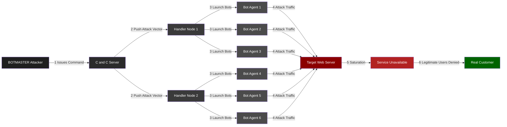
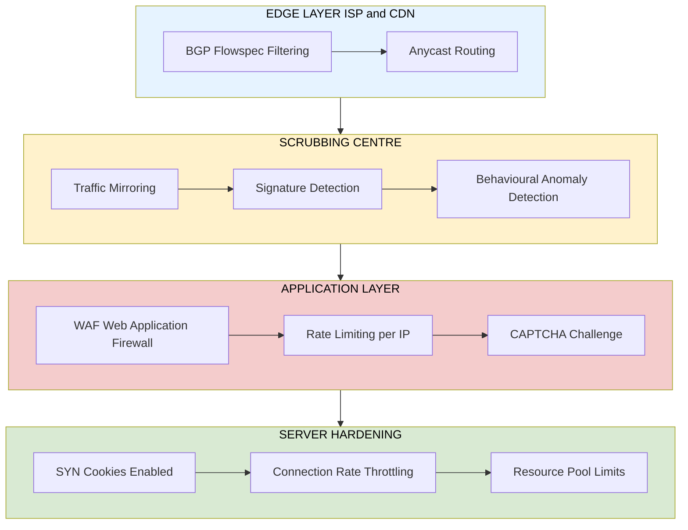
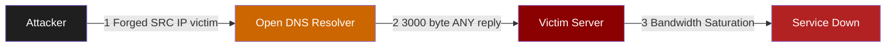

# DDoS

<!-- SECTION_1_START -->
# DDoS — Distributed Denial of Service

> [!IMPORTANT]
> **KTU 2024 Scheme | PBCST604 — Fundamentals of Cyber Security | Module 3: Network Security**
> **Course Outcome (CO) Mapping:** CO3 — *Identify and analyse security threats, vulnerabilities, and attacks in networked systems.*
> **Bloom's Level:** Understand → Apply → Analyse

## 1.1 Formal Definition

A **Distributed Denial of Service (DDoS)** attack is a malicious attempt to disrupt the normal traffic of a targeted server, service, or network by overwhelming the target or its surrounding infrastructure with a flood of Internet traffic generated from multiple compromised computer systems (called *bots* or *zombies*) that form a *botnet*.

Mathematically, the goal of a DDoS attack is to push the offered load $\lambda_{\text{offered}}$ of incoming requests beyond the service capacity $\mu$ of the system, so that the queue length grows unbounded:

$$\lambda_{\text{offered}} \;\gg\; \mu \quad \Rightarrow \quad W_q \;\to\; \infty$$

where $W_q$ is the waiting time in the queue (Little's Law: $L_q = \lambda \cdot W_q$).

> [!NOTE]
> **Key Distinction (Board-Exam Favourite):**
> - **DoS** → Attack originates from a **single** source IP.
> - **DDoS** → Attack originates from **multiple distributed** sources (botnet), making it harder to block by IP filtering alone.

## 1.2 Conceptual Analogy — The "Highway Blockade"

Imagine a **single-lane bridge** leading to a supermarket. Normally, a few hundred customers cross the bridge per minute. Now, an attacker hires **10,000 fake "customers"** (bots) and sends them all to the bridge at once. Even though the supermarket is healthy, the **bridge (bandwidth)** and the **parking lot (server resources)** are choked. Genuine customers cannot enter — the supermarket suffers a *denial of service*.

| Real-World Object | Network Equivalent |
|-------------------|---------------------|
| Fake customers | Botnet / Zombie machines |
| Bridge | Network bandwidth link |
| Supermarket | Target web server |
| Cashiers | CPU / RAM / DB connections |
| Genuine customers | Legitimate users |

## 1.3 Core Components of a Botnet

1. **Botmaster (Attacker)** — Master controller who commands the network.
2. **Command \& Control (C\&C) Server** — Central relay that issues attack commands (IRC, HTTP, HTTPS, Tor).
3. **Handlers / Masters** — Compromised hosts that manage groups of bots.
4. **Agents / Zombies / Bots** — End-point compromised machines (IoT, PCs, servers) that actually generate the attack traffic.

## 1.4 Important Metrics (KTU Board Emphasis)

- **bps** — Bits per second (volumetric attacks measured in **Gbps** or **Tbps**)
- **pps** — Packets per second (protocol attacks)
- **rps** — Requests per second (application-layer attacks)
- **Amplification Factor** $\beta = \dfrac{\text{Bytes of reply}}{\text{Bytes of request}}$ (e.g., DNS amplification $\beta \approx 28$–$54$)

> [!VISUALIZATION CONTROL]
> **Concept:** Request vs. Server Capacity — The DDoS "Tipping Point" Graph
> **Desmos Input Equations (use in Desmos graphing tool):**
> * `y1 = mu = 100`  (constant server capacity — horizontal line)
> * `y2 = lambda_normal = 30`  (normal traffic — flat line below capacity)
> * `y3 = lambda_ddos = 180`  (DDoS traffic — flat line above capacity)
> **Visual Description:** The student should observe two horizontal lines: $y_3$ sits far above $y_1$, while $y_2$ sits well below. The *gap* between $y_3$ and $y_1$ represents the **excess load** that the queue must absorb — the wider the gap, the faster the queue overflows and packets are dropped.

<!-- SECTION_1_END -->

<!-- SECTION_2_START -->
# 2. Deep Theoretical Analysis & KTU High-Yield Formula Sheet

## 2.1 Taxonomy of DDoS Attacks (Most Repeated Board Topic)

DDoS attacks are classified into **three primary classes** by the target resource they exhaust:

### A. Volumetric Attacks (Bandwidth Saturation)
Overwhelm the **bandwidth** of the target or the intermediate network.

| Attack | Protocol Used | Amplification $\beta$ | Typical Volume |
|--------|---------------|------------------------|----------------|
| UDP Flood | UDP | $1\times$ | 10–100 Gbps |
| ICMP / Ping Flood | ICMP | $1\times$ | 10–50 Gbps |
| DNS Amplification | UDP/53 | $\approx 28$–$54\times$ | 100+ Gbps |
| NTP Amplification | UDP/123 | $\approx 556\times$ | 400+ Gbps |
| Memcached Reflection | UDP/11211 | $\approx 51{,}000\times$ | 1.7 Tbps (GitHub 2018) |

### B. Protocol (State-Exhaustion) Attacks
Exploit weaknesses in **Layer 3 / Layer 4** protocol state machines, exhausting connection tables.

- **SYN Flood** — Sends many TCP `SYN` packets with spoofed source IPs; never completes the 3-way handshake. Fills the server's half-open connection table.
- **Ping of Death** — Sends malformed ICMP packets > 65,535 bytes (causes buffer overflow).
- **Smurf Attack** — ICMP echo request to broadcast address with spoofed victim IP.

### C. Application-Layer Attacks (Layer 7)
Target specific web applications, mimicking legitimate user behavior — extremely hard to detect.

- **HTTP GET / POST Flood**
- **Slowloris** — Opens many connections and sends headers *very slowly*, never completing the request.
- **RUDY (R-U-Dead-Yet?)** — Sends slow POST body.

> [!IMPORTANT]
> **Board Hack:** If the question asks *"Which attack is hardest to detect?"* — answer **Application Layer (L7)** because traffic looks *legitimate* (correct headers, valid cookies, etc.).

## 2.2 Attack Architecture — The Botnet Lifecycle

The lifecycle has **4 stages**:

1. **Recruitment (Weaponization)** — Malware spreads via phishing, drive-by downloads, IoT default credentials (Mirai botnet famously used **61 default username/password combos** to infect 600,000+ devices).
2. **Infection** — Devices become "zombies."
3. **Communication** — Botmaster issues commands over **C\&C channel** (centralized or P2P).
4. **Attack Execution** — Coordinated traffic flood launched simultaneously.

## 2.3 KTU High-Yield Formula Sheet

| Symbol | Formula / Definition | Use Case |
|--------|----------------------|----------|
| Amplification Factor | $\beta = \dfrac{S_{\text{reply}}}{S_{\text{request}}}$ | DNS / NTP / Memcached reflection |
| Total Attack Bandwidth | $B_{\text{total}} = N_{\text{bots}} \times B_{\text{per-bot}}$ | Botnet sizing |
| Offered Load (Little's Law) | $L = \lambda \cdot W$ | Queue growth prediction |
| Server Utilization | $\rho = \dfrac{\lambda}{\mu}$ | Stability requires $\rho < 1$ |
| Reflection Multiplier | $M = N_{\text{reflectors}} \times \beta$ | Total reflected traffic |
| SYN Backlog Fill Rate | $R_{\text{half-open}} = R_{\text{SYN}} - R_{\text{ACK}}$ | SYN flood drop rate |
| Attack Duration ROI | $\text{Impact} \propto B_{\text{total}} \times T_{\text{attack}}$ | Attacker cost-benefit |

## 2.4 Real-World Engineering Utility

- **Cloud Providers** (AWS Shield, Cloudflare Magic Transit) design scrubbing centres sized in **Tbps**.
- **ISP Edge Routers** use **BGP Flowspec** to drop attack packets at the network edge.
- **SIEM/SOAR Platforms** (Splunk, IBM QRadar) ingest **NetFlow / sFlow** to baseline normal traffic and detect anomalies in real time.
- **IoT Manufacturers** must replace default credentials to prevent enlistment in botnets (Mirai lesson).

> [!TIP]
> In a KTU answer, *always* end your attack description by stating **one mitigation technique** — examiners reward defence thinking.

<!-- SECTION_2_END -->

<!-- SECTION_3_START -->
# 3. Step-by-Step Derivations, Mathematics & Code Implementation

## 3.1 Worked-Out Problem 1 — Calculating Total Attack Bandwidth

**Question:** A botnet has $N = 50{,}000$ active bots. Each bot generates $B_{\text{per-bot}} = 2 \text{ Mbps}$ of UDP traffic against a target. The target's uplink is $C = 10 \text{ Gbps}$. Determine whether the link saturates and by what factor.

**Step 1 — Total attack bandwidth offered:**

$$B_{\text{total}} = N_{\text{bots}} \times B_{\text{per-bot}}$$

$$B_{\text{total}} = 50{,}000 \times 2 \text{ Mbps} = 100{,}000 \text{ Mbps} = 100 \text{ Gbps}$$

**Step 2 — Compare with link capacity $C$:**

$$\text{Saturation Factor} = \frac{B_{\text{total}}}{C} = \frac{100 \text{ Gbps}}{10 \text{ Gbps}} = 10\times$$

**Step 3 — Conclusion:** The target link is oversubscribed by **10×**, so the queue grows linearly with time and packets are dropped — classic DDoS saturation. *Valuation: [B_total formula: 2 Marks] [Substitution: 1 Mark] [Final factor: 1 Mark].*

---

## 3.2 Worked-Out Problem 2 — DNS Amplification Factor

**Question:** A DNS ANY query of $64$ bytes produces a response of $3{,}000$ bytes. An attacker uses $5{,}000$ open DNS resolvers. If each resolver can be triggered to send one response per second, calculate the *amplified bandwidth* the victim receives per second.

**Step 1 — Amplification factor:**

$$\beta = \frac{S_{\text{reply}}}{S_{\text{request}}} = \frac{3{,}000}{64} = 46.875$$

**Step 2 — Total amplified traffic per second:**

$$B_{\text{amplified}} = N_{\text{reflectors}} \times S_{\text{reply}} \times 8 \text{ bits}$$

$$B_{\text{amplified}} = 5{,}000 \times 3{,}000 \times 8 \text{ bits} = 120{,}000{,}000 \text{ bps} = 120 \text{ Mbps}$$

**Step 3 — Observation:** A request bandwidth of only $5{,}000 \times 64 \times 8 = 2.56$ Mbps is required to *generate* 120 Mbps of attack traffic — a **47× amplification** makes a small botnet devastating.

---

## 3.3 Worked-Out Problem 3 — Queue Stability Check (M/M/1 Model)

**Question:** A web server can serve $\mu = 1{,}000$ requests/sec. During normal operation, load is $\lambda_{\text{normal}} = 400$ req/s. During attack, load rises to $\lambda_{\text{attack}} = 5{,}000$ req/s. Check stability in each case.

**Step 1 — Compute server utilization $\rho$:**

$$\rho_{\text{normal}} = \frac{400}{1{,}000} = 0.4 \quad (\text{stable})$$

$$\rho_{\text{attack}} = \frac{5{,}000}{1{,}000} = 5.0 \quad (\text{unstable, } \rho > 1)$$

**Step 2 — Average waiting time (M/M/1 formula) only valid when $\rho < 1$:**

$$W_q = \frac{\rho}{\mu(1 - \rho)} = \frac{0.4}{1{,}000 \times 0.6} = 6.67 \times 10^{-4} \text{ sec} \;\; \text{(normal)}$$

**Step 3 — During attack**, $\rho \geq 1$, so the system is unstable — the queue length $L_q$ grows without bound and new connections are refused. *Valuation: [Stating stability condition: 1 Mark] [Normal case calculation: 1 Mark] [Attack case interpretation: 1 Mark].*

---

## 3.4 Python Implementation — Real-Time DDoS Detector

The following Python script demonstrates a **threshold-based volumetric detector** (as used in SIEM pipelines):

```python
"""
Real-Time DDoS Volumetric Detector
Logs SYN packet rates per source IP and raises an alert when
the moving average exceeds a baseline threshold.
"""
from collections import defaultdict, deque
from typing import Dict, Deque
import time
import logging

logging.basicConfig(
    level=logging.INFO,
    format="%(asctime)s [%(levelname)s] %(message)s"
)

BASELINE_RPS = 50          # Normal requests/sec per IP
WINDOW_SECS  = 10          # Sliding window length
SPIKE_FACTOR = 5           # Alert if current > 5x baseline
ATTACK_IPS:  Dict[str, Deque[float]] = defaultdict(lambda: deque(maxlen=200))

def record_request(source_ip: str) -> None:
    """Log a single request timestamp for the given source IP."""
    ATTACK_IPS[source_ip].append(time.time())

def get_rps(source_ip: str) -> float:
    """Return current requests/sec over the active window."""
    now = time.time()
    timestamps = ATTACK_IPS[source_ip]
    # Drop timestamps outside the window
    while timestamps and (now - timestamps[0]) > WINDOW_SECS:
        timestamps.popleft()
    return len(timestamps) / WINDOW_SECS if timestamps else 0.0

def detect_ddos(source_ip: str) -> bool:
    """Return True if the source IP shows DDoS-like behaviour."""
    rps = get_rps(source_ip)
    if rps > BASELINE_RPS * SPIKE_FACTOR:
        logging.warning(
            "DDoS ALERT: IP=%s | RPS=%.1f (threshold=%.1f)",
            source_ip, rps, BASELINE_RPS * SPIKE_FACTOR
        )
        return True
    return False

# ---- Simulation harness ----
if __name__ == "__main__":
    suspect_ip = "192.0.2.66"
    # Simulate 400 rapid-fire requests in 1 second
    for _ in range(400):
        record_request(suspect_ip)
        time.sleep(0.0025)
    detect_ddos(suspect_ip)
```

**How it works (valuatable line-by-line):**

1. `BASELINE_RPS` is the historical average per source IP.
2. `record_request` appends a timestamp for every request.
3. `get_rps` computes requests/sec inside a **sliding window of 10 s** (anomaly-detection technique).
4. `detect_ddos` flags an IP when its rate exceeds `5×` baseline (common in SNORT and Suricata rules).

> [!WARNING]
> **Examiner's Pitfall:** Do **not** recommend "block the IP" as a generic mitigation for *DDoS* — it is useless because the source IPs are distributed. Only recommend IP blocking for **single-source DoS**.

---

## 3.5 Worked-Out Problem 4 — SYN Flood Backlog Fill Time

**Question:** A server's half-open connection backlog is $H = 5{,}000$ slots. A bot sends $R_{\text{SYN}} = 200$ SYN packets/sec, but legitimate users close $R_{\text{ACK}} = 30$ half-open connections/sec. How long until the backlog is full and the server refuses new connections?

**Step 1 — Net fill rate:**

$$R_{\text{net}} = R_{\text{SYN}} - R_{\text{ACK}} = 200 - 30 = 170 \text{ slots/sec}$$

**Step 2 — Time to fill backlog:**

$$T_{\text{full}} = \frac{H}{R_{\text{net}}} = \frac{5{,}000}{170} \approx 29.41 \text{ seconds}$$

**Step 3 — Engineering takeaway:** Increasing `tcp_max_syn_backlog` only delays the attack; the proper fix is **SYN Cookies** (kernel-level defence).

<!-- SECTION_3_END -->

<!-- SECTION_4_START -->
# 4. Structural Diagrams & Schematics

## 4.1 Botnet DDoS Attack Topology (End-to-End Flow)



## 4.2 DDoS Defence-in-Depth Layered Architecture



## 4.3 SYN Flood — TCP State Exploitation

```mermaid
sequenceDiagram
    participant A as Bot
    participant S as Target Server
    A->>S: 1 SYN
    S-->>A: 2 SYN-ACK (awaiting ACK)
    Note over S: Half-open slot reserved
    A--xS: 3 ACK never sent
    Note over S: Slot remains occupied
    A->>S: 4 SYN (new spoofed source)
    S-->>A: 5 SYN-ACK
    Note over S: Backlog fills up
    S-->>A: 6 Connection refused
    Note over S: Legitimate users denied service
    style A fill:#1f1f1f,color:#ffffff
    style S fill:#8b0000,color:#ffffff
```

## 4.4 DNS Reflection / Amplification Architecture



<!-- SECTION_4_END -->

<!-- SECTION_5_START -->
# 5. KTU 2024 Scheme Examination Question Bank & Topic Recap

> [!IMPORTANT]
> **Mark Distribution (KTU 2024 ESE Pattern):**
> * Part A: $2 \times 3 = 6$ marks (short answer)
> * Part B: $1 \times 14 = 14$ marks with **internal choice** (full-module question; 7+7 sub-parts)
> * Total = **20 marks** per module question

---

## 5.1 Part A — Short Answer Questions (3 Marks Each)

### Q1. `[KTU University Exam — July 2024]` *(CO3, Remember)*

**Differentiate between DoS and DDoS attacks.**

**Model Answer (Valuation Key):**
- **DoS (Denial of Service):** Attack launched from a **single source machine** against a single target. *Example:* Ping of Death from one host. *(1 Mark)*
- **DDoS (Distributed Denial of Service):** Attack launched from **multiple distributed machines** (botnet/zombies) controlled by a central *botmaster*. *(1 Mark)*
- **Key Advantage for Attacker:** DDoS is **harder to mitigate** because traffic originates from many IPs; blocking one IP is ineffective. *(1 Mark)*

### Q2. `[KTU University Exam — Dec 2023]` *(CO3, Understand)*

**What is a botnet? List any four default credentials used by the Mirai botnet.**

**Model Answer (Valuation Key):**
A **botnet** is a network of internet-connected devices (bots/zombies) infected with malware and remotely controlled by a *botmaster* via a Command-and-Control (C\&C) server to launch coordinated attacks. *(1 Mark)*

Four Mirai default credential pairs: *(½ Mark each, total 2 Marks)*

| Username | Password |
|----------|----------|
| admin | admin |
| root | root |
| admin | 1234 |
| root | xc3511 |

---

## 5.2 Part B — 14-Mark Questions (Internal Choice)

> [!IMPORTANT]
> Each 14-mark question has sub-parts (a) for 7 marks and (b) for 7 marks. Always attempt the choice you are most confident with — valuation does *not* penalise for choosing either option.

---

### Q3. `[KTU University Exam — July 2024]` *(CO3, Apply + Analyse)*

**Question A (14 Marks):**
**(a) [7 Marks]** Explain the **three-way TCP handshake** and show how a **SYN flood attack** exploits it to deny service to legitimate users. *(Understand + Apply)*

**(b) [7 Marks)** A web server's TCP SYN backlog is $H = 10{,}000$ slots. An attacker generates $R_{\text{SYN}} = 500$ SYN/sec from spoofed IPs. Legitimate traffic completes $R_{\text{ACK}} = 80$ half-open connections/sec. Calculate the **time until the backlog is full** and recommend **two specific kernel-level defences**. *(Apply + Analyse)*

**Model Solution:**

#### Part (a) — 7 Marks

**Three-Way Handshake (Normal Flow):** *(3 Marks)*
1. **SYN:** Client $\to$ Server — sends `SYN`, sequence number = $x$. *(1 Mark)*
2. **SYN-ACK:** Server $\to$ Client — replies `SYN-ACK`, seq=$y$, ack=$x+1$, and **reserves a half-open slot** in the connection backlog. *(1 Mark)*
3. **ACK:** Client $\to$ Server — sends `ACK`, seq=$x+1$, ack=$y+1$. Connection is now `ESTABLISHED`. *(1 Mark)*

**SYN Flood Exploitation:** *(4 Marks)*
- Attacker sends thousands of `SYN` packets with **spoofed source IPs** (never replies with `ACK`). *(1 Mark)*
- Server allocates a half-open slot for each `SYN`, but the slot is **never released** because the final `ACK` never arrives. *(1 Mark)*
- The backlog fills up; new legitimate users are refused with a reset or timeout. *(1 Mark)*
- Because source IPs are spoofed, the server **cannot block the attacker** by IP — it is a classic **DDoS at the protocol layer**. *(1 Mark)*

#### Part (b) — 7 Marks

**Step 1 — Net fill rate:** *(2 Marks)*

$$R_{\text{net}} = R_{\text{SYN}} - R_{\text{ACK}} = 500 - 80 = 420 \text{ slots/sec}$$

**Step 2 — Time to fill backlog:** *(2 Marks)*

$$T_{\text{full}} = \frac{H}{R_{\text{net}}} = \frac{10{,}000}{420} \approx 23.81 \text{ seconds}$$

*[Stating net fill formula: 1 Mark] [Final numerical answer: 1 Mark]*

**Step 3 — Kernel-Level Defences:** *(3 Marks — 1.5 each)*

1. **SYN Cookies:** Server does **not** reserve a backlog slot for incoming `SYN`. Instead, it encodes connection state into the `SYN-ACK` sequence number (a cryptographic hash of source IP, port, timestamp, and a server secret). Only when the final `ACK` arrives with the correct cookie is the slot allocated. *(1.5 Marks)*

2. **Increase `tcp_max_syn_backlog` and reduce `tcp_synack_retries`:** Increase backlog size to absorb bursts, and reduce retry timeouts so half-open slots are released faster. Combine with **rate-limiting** via `iptables` or `nftables`. *(1.5 Marks)*

---

**Question B (14 Marks) — Alternative Choice:**

**(a) [7 Marks]** Classify DDoS attacks into **three major categories**. For each category, name **one attack**, the **target resource**, and **one defence technique**. *(Understand + Apply)*

**(b) [7 Marks]** With a neat diagram, explain the **botnet architecture** and the **role of the Command-and-Control (C\&C) server**. *(Understand + Apply)*

**Model Solution (Brief — for self-study):**

**Part (a) — 7 Marks**

| Category | Example | Target Resource | Defence |
|----------|---------|-----------------|---------|
| Volumetric | DNS Amplification | Bandwidth | Rate-limiting at ISP / Anycast |
| Protocol | SYN Flood | Connection state table | SYN Cookies |
| Application-Layer | Slowloris | Web threads / sockets | Reverse proxy with timeout |

*(2.33 Marks per row: 1 for example+resource, 1 for defence, 0.33 for classification — round to 2+2+2+1 = 7)*

**Part (b) — 7 Marks**

Required components in the diagram (refer to Section 4.1):
1. **Botmaster** (1 Mark) — issues commands.
2. **C\&C Server** (1.5 Marks) — relay/instruction hub; can be **centralized IRC/HTTP** or **decentralized P2P** (e.g., Kademlia).
3. **Handlers/Masters** (1.5 Marks) — intermediate compromised nodes.
4. **Bots/Agents** (1.5 Marks) — generate the actual attack traffic.
5. **Target server** + **denial of legitimate users** (1.5 Marks).

---

> [!WARNING]
> **KTU Examiner's Valuation Pitfalls — DDoS Questions**
> 1. **Confusing DoS and DDoS in definitions** — if the question specifies "multiple sources," you *must* use "DDoS" and mention a botnet. Single-source = DoS.
> 2. **Recommending IP blocking for DDoS** — this is the **#1 mark-losing mistake**. Always state: *"IP blocking is ineffective for DDoS because the sources are distributed."*
> 3. **Forgetting amplification factor formula** — when a question mentions "DNS amplification" or "NTP reflection," always write $\beta = S_{\text{reply}} / S_{\text{request}}$ and compute the numeric factor.
> 4. **Omitting the defence** — every attack explanation must end with a **countermeasure** (SYN cookies, rate limiting, scrubbing centre, anycast, WAF).
> 5. **SYN flood explanation without the term "half-open connection"** — examiners look for this exact phrase; missing it costs 1–2 marks.
> 6. **No diagram in 14-mark questions** — a labelled Mermaid/hand-drawn diagram of the botnet topology is worth **2–3 marks** in part (b).

---

## 5.3 Topic Recap & Important Things to Remember

- **DoS vs DDoS:** Single source vs distributed botnet sources — *always* mention "distributed" for DDoS.
- **Three DDoS Categories:** **Volumetric** (bandwidth), **Protocol** (state tables), **Application-Layer** (L7). Draw a 3-row table in answers.
- **Botnet Components:** Botmaster $\to$ C\&C $\to$ Handlers $\to$ Bots $\to$ Target.
- **Mirai Botnet (2016):** Infected 600,000+ IoT devices using **61 default credentials**; caused **1.2 Tbps** attack on Dyn DNS, taking down Twitter, Netflix, Reddit.
- **Amplification Factor Formula:** $\beta = S_{\text{reply}} / S_{\text{request}}$. Memcached has the highest known $\beta \approx 51{,}000\times$.
- **SYN Flood Key Phrase:** *Half-open connection backlog exhaustion*.
- **Defence Stack:** Edge filtering (BGP Flowspec) $\to$ Scrubbing centre $\to$ WAF $\to$ Server hardening (SYN cookies).
- **Little's Law:** $L = \lambda \cdot W$. Queue grows unbounded when $\lambda \geq \mu$.
- **Stability Rule:** M/M/1 queue is stable only when $\rho = \lambda / \mu < 1$.
- **Total Attack Bandwidth:** $B_{\text{total}} = N_{\text{bots}} \times B_{\text{per-bot}}$.
- **SYN Backlog Fill Time:** $T_{\text{full}} = H / (R_{\text{SYN}} - R_{\text{ACK}})$.
- **Why IP blocking fails for DDoS:** Millions of spoofed/distributed sources — single IP ACL rules have no effect.
- **Application-Layer (L7) is hardest to detect** — traffic looks legitimate (valid headers, cookies).
- **Golden Rule for KTU:** *Every attack must be paired with a defence in your answer — it directly earns the "Apply" level marks.*

<!-- SECTION_5_END -->
