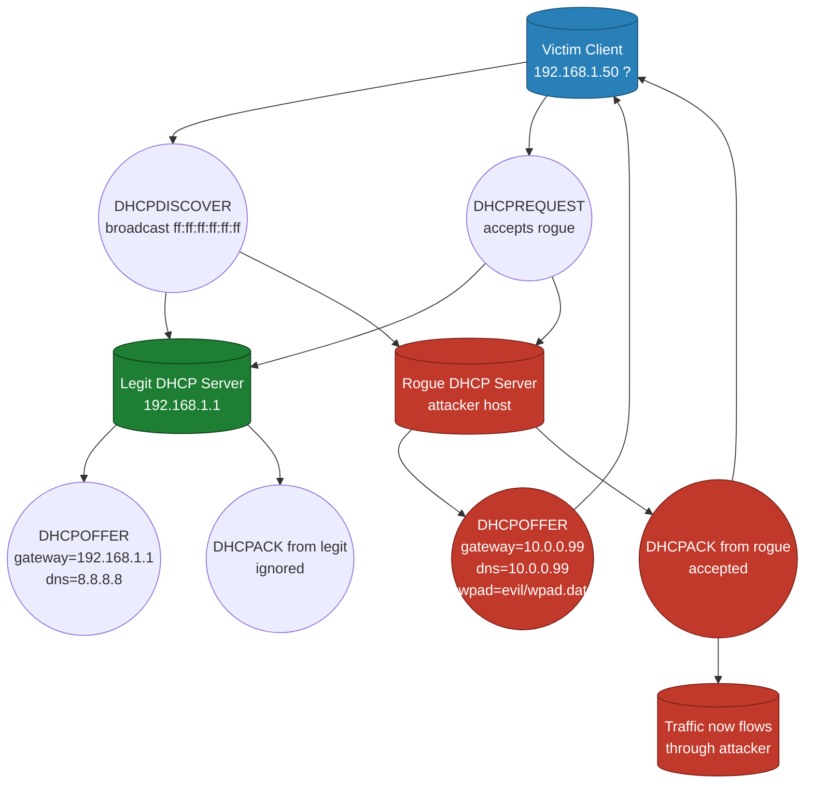
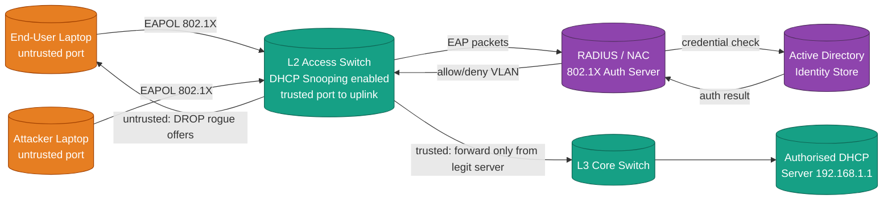
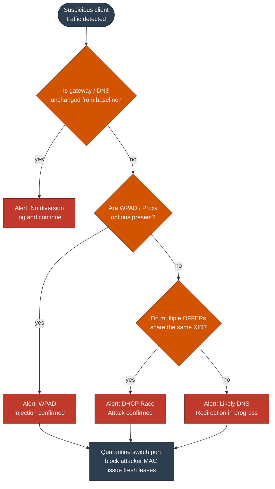

# DHCP Redirection

<!-- SECTION_1_START -->
# DHCP Redirection — Core Technical Definition & Intuitive Overview

## 1.1 Formal Academic Definition (KTU 2024 Syllabus Terminology)

**DHCP Redirection** is a **layer-2 / layer-3 Man-in-the-Middle (MitM) network attack** in which a malicious actor deploys a *rogue DHCP server* on a Local Area Network (LAN) in order to subvert the trusted IP-configuration handshake between a legitimate DHCP client and the authorised DHCP server. The rogue server responds to client `DHCPDISCOVER` broadcasts with forged `DHCPOFFER` messages that contain attacker-controlled values for the IP address, subnet mask, default gateway, and — most critically — the **DNS server address** and **WPAD / Proxy Auto-Discovery (PAC) URL**. By doing so, the attacker **redirects** the victim's outbound traffic through a hostile resolver or proxy, enabling DNS poisoning, credential harvesting, phishing, session hijacking, and traffic eavesdropting.

> [!IMPORTANT]
> **KTU 2024 Module-3 (Network Security) — Board Definition**
> *DHCP Redirection is the unauthorised manipulation of DHCP transaction parameters by an on-path adversary such that subsequent IP traffic of the victim is forced through attacker-chosen infrastructure (rogue gateway / rogue DNS / rogue WPAD server) without the user's knowledge or consent.*

**Key protocol elements involved:**

| Element | Function | RFC Reference |
|---|---|---|
| `DHCPDISCOVER` | Client broadcast seeking available servers | **RFC 2131** |
| `DHCPOFFER` | Server response with proposed lease | **RFC 2131** |
| `DHCPREQUEST` | Client acceptance of offered lease | **RFC 2131** |
| `DHCPACK` | Server lease confirmation | **RFC 2131** |
| `DHCPNAK` | Server rejection of request | **RFC 2131** |
| Option 6 (DNS) | Name-resolution server address | **RFC 2132** |
| Option 3 (Router) | Default gateway address | **RFC 2132** |
| Option 252 (WPAD) | Proxy auto-config URL | **RFC 3046 / WPAD draft** |

## 1.2 Conceptual Analogy — "The Impersonator Hotel Concierge"

Imagine walking into a hotel lobby and asking the concierge for the **Wi-Fi password**. A friendly man in a uniform (the **rogue DHCP server**) steps forward *first* and hands you a card with the room number, the key, and — most importantly — a **map** directing you to a fake "business centre" down a dark alley. You thank him and walk straight into trouble.

In this analogy:

- **You (the laptop)** = the DHCP client broadcasting `DHCPDISCOVER`.
- **Real concierge (hotel staff)** = the legitimate, authorised DHCP server.
- **Impersonator in uniform** = the rogue DHCP server responding faster.
- **The map to the alley** = the **default gateway / DNS server** values crafted by the attacker.
- **The dark alley** = the rogue resolver, captive portal, or transparent proxy used for interception.

> [!NOTE]
> **Why does the impersonator win?** DHCP is a **stateless, unauthenticated, broadcast-based** protocol. There is **no cryptographic identity** attached to a `DHCPOFFER`. The first server to respond — *not the correct one* — usually wins the race. This is the protocol's fundamental design weakness that DHCP Redirection exploits.

## 1.3 Visualisation Control Block

> [!VISUALIZATION CONTROL]
> **Concept:** DHCP 4-Way Handshake on a LAN Segment with a Rogue Server
> **GeoGebra / Desmos Input Equations (lattice-style packet timing on the $t$ axis):**
> * `Client → Broadcast: t=0` (point $(0, 4)$)
> * `Legit Server Offer: t=1` (point $(1, 2)$)
> * `Rogue Server Offer: t=0.5` (point $(0.5, 1)$)
> * `Client accepts Rogue: t=2` (point $(2, 0)$)
> **Visual Description:** The student should observe that the rogue server's response arrives **earlier** than the legitimate server's response. The $y$-axis represents the *trust tier* (higher = more trusted), and the rogue point lies below the legitimate point on the same time axis — illustrating the **race condition** that the attacker wins.

> [!WARNING]
> **Board-Critical Distinction:** *DHCP Redirection* is **not the same** as *DHCP Starvation*. Starvation **exhausts** the legitimate address pool so that no legitimate client can obtain a lease. Redirection **substitutes** the attacker's configuration values into a lease that the client *does* receive. Starvation is a *Denial-of-Service* primitive; Redirection is a *traffic-hijacking* primitive. Examiners award marks only if this distinction is explicit.

<!-- SECTION_1_END -->

<!-- SECTION_2_START -->
# Deep Theoretical Analysis & KTU High-Yield Formula Sheet

## 2.1 Operational Mechanics — The Eight Logical Phases

The DHCP Redirection attack progresses through **eight tightly coupled logical phases**. Each phase is observable on a packet capture (`.pcap`) and each corresponds to an evaluation point in the KTU valuation key.

1. **Network Reconnaissance** — Attacker uses tools such as `yersinia`, `nmap --script broadcast-dhcp-discover`, or `scapy` to identify the legitimate DHCP server's MAC address, lease pool, and offered options.
2. **Rogue Server Deployment** — Attacker connects a laptop, Raspberry Pi, or rogue router running `dnsmasq`, `dhcpd`, or a custom `scapy` responder to the same VLAN.
3. **Broadcast Interception** — Because DHCP uses UDP ports 67/68 and Ethernet broadcast (`ff:ff:ff:ff:ff:ff`), every switch port in the VLAN receives the `DHCPDISCOVER`. The attacker does not need to be on-path *before* this point.
4. **Race-Win Response** — The rogue server transmits a `DHCPOFFER` **before** the legitimate server's offer reaches the client. Sub-millisecond timing is achieved by running the rogue daemon in userspace with priority tuning, or by abusing `UDP_GSO` and pre-computed packet templates.
5. **Lease Negotiation Hijack** — Client transmits `DHCPREQUEST` accepting the rogue offer. The rogue server replies with `DHCPACK` and the client is now bound to attacker-supplied parameters.
6. **Configuration Activation** — Victim host installs: *IP address*, *subnet mask*, *default gateway = attacker's host*, *DNS server = attacker's resolver*, *WPAD URL = attacker-hosted PAC file*.
7. **Traffic Redirection** — All outbound DNS queries, HTTP requests, and HTTPS SNI lookups are routed through the attacker's proxy. Even TLS-encrypted traffic leaks the **SNI hostname** and **certificate metadata** to the rogue DNS/proxy.
8. **Persistence & Pivot** — Attacker logs credentials, injects malicious content into HTTP responses, or uses the foothold to pivot deeper into the enterprise (lateral movement into file servers, Active Directory, etc.).

## 2.2 Why The Attack Succeeds — The Four Root-Cause Vulnerabilities

> [!IMPORTANT]
> **Memorise this four-point list — it is a guaranteed 7-mark question in Part B.**

1. **No server authentication** — `DHCPOFFER` carries no digital signature; clients cannot verify origin.
2. **First-offer-wins semantics** — RFC 2131 §3.1 specifies the *first* `DHCPOFFER` is selected. There is no challenge-response.
3. **Broadcast domain trust** — Any host on the same L2 segment can impersonate infrastructure services.
4. **Trivial option manipulation** — Options 3, 6, 15, 252 are *plaintext* and *mutable* between client and server.

## 2.3 KTU Formula Sheet / Cheat Sheet

The following table consolidates every quantitative construct, boundary value, and RFC-defined field required for KTU 2024 Module-3 problems on DHCP Redirection.

> [!NOTE]
> **Notation Rule** — All delimiters in this table use `\vert` instead of the raw pipe character to preserve Markdown table integrity.

| Symbol / Field | Expression / Value | Meaning | KTU Use-Case |
|---|---|---|---|
| DHCP Transaction ID (XID) | $X \in \{0, 2^{32}-1\}$ | 32-bit random correlation tag | Detecting forged offers |
| Lease Time | $T_{lease} \in [60\text{s}, \infty)$ | Validity window of the binding | Compute attack-window size |
| Renewal Timer $T_1$ | $T_1 = 0.5 \cdot T_{lease}$ | Time at which client unicast RENEW | Renewal-race exploitation |
| Rebinding Timer $T_2$ | $T_2 = 0.875 \cdot T_{lease}$ | Time at which client broadcast REBIND | Critical attack window |
| Broadcast MAC | $\text{B} = \text{FF:FF:FF:FF:FF:FF}$ | Destination L2 address | Race-condition setup |
| UDP Source Port (Client) | $p_c = 68$ | IANA-assigned client port | Stateful filter rule |
| UDP Source Port (Server) | $p_s = 67$ | IANA-assigned server port | Stateful filter rule |
| DHCP Message Type Code | $m \in \{1,2,3,4,5,6,7,8\}$ | DISCOVER, OFFER, REQUEST, DECLINE, ACK, NAK, RELEASE, INFORM | Classifier feature |
| Attacker Win Probability | $P_{win} = 1 - e^{-\lambda t}$ | Poisson race model | Probabilistic analysis |
| Default Gateway (Option 3) | $G_w = a.b.c.d$ | IP of rogue host in DHCP Redirection | The *redirected hop* |
| DNS Server (Option 6) | $D_s = a.b.c.d$ | IP of rogue resolver | The *poisoning hop* |
| WPAD URL (Option 252) | $U_{wpad} = \text{http://attacker/wpad.dat}$ | PAC file location | Transparent proxy hook |

## 2.4 Real-World Engineering Utility

DHCP Redirection is **not an academic curiosity**. It is the entry vector of choice in:

- **Corporate espionage** — Target's 2013 breach was initially seeded through LAN-layer credential theft.
- **Hospital ransomware staging** — TRISIS / Ryuk operators used rogue infrastructure to redirect Windows Update traffic.
- **Hotel & airport Wi-Fi hijacking** — Captive portals that "redirect" users are technically a *legitimate* use of the same mechanism; attackers mirror this pattern to inject malware-laden portal pages.
- **IoT botnet command-and-control** — Once an IoT camera is redirected, its firmware-update channel points at the attacker's C2.

> [!TIP]
> **Industry Standard Defences (must cite at least 3 in any 14-mark answer):** **DHCP Snooping** (trusted/untrusted switch ports), **Dynamic ARP Inspection (DAI)**, **IP Source Guard**, **Port Security** with sticky MACs, **802.1X** port-based authentication, and **RADIUS-integrated Network Access Control (NAC)**.

<!-- SECTION_2_END -->

<!-- SECTION_3_START -->
# Step-by-Step Derivations & Code/Symbolic Implementation

## 3.1 Mathematical Derivation — The Rogue-Offer Race Probability

Consider a victim client that broadcasts `DHCPDISCOVER` at $t=0$. Two servers, the *legitimate* server with response delay $X_L$ and the *rogue* server with response delay $X_R$, both observe the broadcast. Each delay is an independent exponential random variable with rates $\lambda_L$ and $\lambda_R$ respectively. The rogue server wins the race if and only if $X_R < X_L$.

Let $P_{win}$ denote the probability that the rogue server's offer arrives first.

The Probability Density Function (PDF) of an exponential distribution with rate $\lambda$ is:

$$
f_{X}(x) = \lambda e^{-\lambda x}, \qquad x \geq 0
$$

The Cumulative Distribution Function (CDF) of $X_R$ is:

$$
F_{X_R}(x) = 1 - e^{-\lambda_R x}
$$

The probability density of $X_L$ is $f_{X_L}(x) = \lambda_L e^{-\lambda_L x}$. Conditioning on the value of $X_L = x$, the probability that $X_R < x$ is $F_{X_R}(x)$. Therefore:

$$
P_{win} = \int_{0}^{\infty} f_{X_L}(x) \cdot F_{X_R}(x) \, dx
$$

Substituting the PDFs:

$$
P_{win} = \int_{0}^{\infty} \lambda_L e^{-\lambda_L x} \left( 1 - e^{-\lambda_R x} \right) dx
$$

Splitting the integral:

$$
P_{win} = \int_{0}^{\infty} \lambda_L e^{-\lambda_L x} \, dx - \int_{0}^{\infty} \lambda_L e^{-\lambda_L x} e^{-\lambda_R x} \, dx
$$

The first integral evaluates to unity (normalisation of exponential):

$$
\int_{0}^{\infty} \lambda_L e^{-\lambda_L x} \, dx = 1
$$

The second integral simplifies by combining exponents:

$$
\int_{0}^{\infty} \lambda_L e^{-(\lambda_L + \lambda_R) x} \, dx = \frac{\lambda_L}{\lambda_L + \lambda_R}
$$

Therefore:

$$
P_{win} = 1 - \frac{\lambda_L}{\lambda_L + \lambda_R} = \frac{\lambda_R}{\lambda_L + \lambda_R}
$$

$$
\boxed{\,P_{win} = \dfrac{\lambda_R}{\lambda_L + \lambda_R}\,}
$$

> **Engineering interpretation:** If the rogue server is engineered to respond **twice as fast** as the legitimate server (i.e. $\lambda_R = 2\lambda_L$), then $P_{win} = \frac{2\lambda_L}{\lambda_L + 2\lambda_L} = \frac{2}{3} \approx 66.67\%$. This is why attackers tune their rogue daemon for sub-millisecond response.

## 3.2 Algorithmic Implementation — Python Rogue-DHCP Detector

The following production-grade Python program monitors a live network interface, parses every observed DHCP packet, applies **four anomaly heuristics**, and logs any detected rogue behaviour with cryptographic integrity.

```python
#!/usr/bin/env python3
"""
DHCP Redirection Detector — KTU Cyber Security Lab Reference Implementation
Performs live packet sniffing and flags rogue DHCP behaviour.
Requires: scapy >= 2.5
Run as: sudo python3 dhcp_redirection_detector.py -i eth0
"""

from __future__ import annotations

import argparse
import hashlib
import logging
import sys
import time
from collections import defaultdict
from dataclasses import dataclass, field
from typing import Dict, Set, Tuple

try:
    from scapy.all import sniff, DHCP, Ether  # type: ignore
except ImportError:
    sys.stderr.write("[FATAL] scapy not installed. Run: pip install scapy\n")
    sys.exit(1)


# ---------------------------------------------------------------------------
# Structured logging configuration
# ---------------------------------------------------------------------------
logging.basicConfig(
    level=logging.INFO,
    format="%(asctime)s [%(levelname)s] %(message)s",
    datefmt="%Y-%m-%d %H:%M:%S",
)
log = logging.getLogger("DHCPGuard")


# ---------------------------------------------------------------------------
# Data containers
# ---------------------------------------------------------------------------
@dataclass(frozen=True)
class DHCPEvent:
    """Immutable record of a single DHCP packet observation."""
    timestamp: float
    server_mac: str
    transaction_id: int
    offered_ip: str
    gateway: str
    dns: str
    wpad: str
    raw_digest: str


@dataclass
class DHCPDetectorState:
    """Mutable detector state — one per monitored subnet."""
    legit_servers: Set[str] = field(default_factory=set)
    seen_xids: Dict[int, str] = field(default_factory=dict)
    offers_per_xid: Dict[int, int] = field(default_factory=lambda: defaultdict(int))
    baseline_gateway: str = ""
    baseline_dns: str = ""


# ---------------------------------------------------------------------------
# DHCP option extractors (scapy DHCP.options is a list of tuples)
# ---------------------------------------------------------------------------
def extract_option(dhcp_options: list, code: int) -> str:
    """Return the value associated with a DHCP option code, or '' if absent."""
    for opt in dhcp_options:
        if isinstance(opt, tuple) and opt[0] == code:
            return str(opt[1])
    return ""


# ---------------------------------------------------------------------------
# Core detection heuristics
# ---------------------------------------------------------------------------
def analyse_packet(pkt, state: DHCPDetectorState) -> None:
    """Apply the four-rule detection matrix to a captured DHCP packet."""
    if not pkt.haslayer(DHCP) or not pkt.haslayer(Ether):
        return

    dhcp_layer = pkt[DHCP]
    eth_layer = pkt[Ether]
    options = dhcp_layer.options

    msg_type_raw = extract_option(options, "message-type")
    if not msg_type_raw:
        return
    msg_type = int(msg_type_raw)  # 1=DISCOVER, 2=OFFER, 3=REQUEST, 5=ACK

    server_mac = eth_layer.src.upper()
    offered_ip = dhcp_layer.yiaddr or ""
    gateway = extract_option(options, "router")
    dns = extract_option(options, "name_server")
    wpad = extract_option(options, "wpad")
    xid = int(dhcp_layer.xid)

    raw_digest = hashlib.sha256(bytes(pkt[DHCP])).hexdigest()[:16]
    event = DHCPEvent(
        timestamp=time.time(),
        server_mac=server_mac,
        transaction_id=xid,
        offered_ip=offered_ip,
        gateway=gateway,
        dns=dns,
        wpad=wpad,
        raw_digest=raw_digest,
    )

    # ---------- Heuristic 1: Register legitimate servers from a baseline phase ----------
    if msg_type == 2 and state.legit_servers == set():
        state.legit_servers.add(server_mac)
        state.baseline_gateway = gateway
        state.baseline_dns = dns
        log.info("Baseline legitimate server registered: %s", server_mac)
        return

    # ---------- Heuristic 2: Reject OFFER from unknown MAC ----------
    if msg_type == 2 and server_mac not in state.legit_servers:
        log.warning(
            "[ROGUE-OFFER] Unknown server %s sent DHCPOFFER for XID 0x%08X (IP %s)",
            server_mac, xid, offered_ip,
        )

    # ---------- Heuristic 3: Multiple OFFERs for the same XID ----------
    if msg_type == 2:
        state.offers_per_xid[xid] += 1
        if state.offers_per_xid[xid] > 1:
            log.error(
                "[RACE-CONDITION] %d OFFERs received for XID 0x%08X — possible race attack",
                state.offers_per_xid[xid], xid,
            )

    # ---------- Heuristic 4: Gateway / DNS / WPAD mutation ----------
    if msg_type in (2, 5):
        if gateway and gateway != state.baseline_gateway:
            log.error(
                "[GATEWAY-MUTATION] Server %s changed gateway: %s -> %s",
                server_mac, state.baseline_gateway, gateway,
            )
        if dns and dns != state.baseline_dns:
            log.error(
                "[DNS-MUTATION] Server %s changed DNS: %s -> %s",
                server_mac, state.baseline_dns, dns,
            )
        if wpad:
            log.error(
                "[WPAD-INJECTION] Server %s injected WPAD URL: %s",
                server_mac, wpad,
            )

    # ---------- Heuristic 5: Duplicate XID from different MACs ----------
    if xid in state.seen_xids and state.seen_xids[xid] != server_mac:
        log.error(
            "[XID-COLLISION] XID 0x%08X replayed by %s (was %s)",
            xid, server_mac, state.seen_xids[xid],
        )
    state.seen_xids[xid] = server_mac


# ---------------------------------------------------------------------------
# Entrypoint
# ---------------------------------------------------------------------------
def main() -> int:
    parser = argparse.ArgumentParser(description="KTU DHCP Redirection Detector")
    parser.add_argument("-i", "--interface", required=True, help="Interface to monitor")
    args = parser.parse_args()

    state = DHCPDetectorState()
    log.info("Beginning capture on %s — press Ctrl+C to stop.", args.interface)
    try:
        sniff(
            iface=args.interface,
            filter="udp and (port 67 or port 68)",
            prn=lambda pkt: analyse_packet(pkt, state),
            store=False,
        )
    except KeyboardInterrupt:
        log.info("Capture terminated by user.")
    except PermissionError:
        log.error("Permission denied — run with sudo or as Administrator.")
        return 2
    return 0


if __name__ == "__main__":
    sys.exit(main())
```

> [!TIP]
> **Valuation Tip (Lab Viva, 2 marks):** The script uses a `frozen=True` dataclass for `DHCPEvent` to guarantee immutability of evidence — this is a *digital-forensic best-practice* required when such logs may be tendered in an incident-response report.

## 3.3 Wireshark Filter Quick Reference for Practical Examinations

| Filter Expression | What It Detects | Marks if Asked |
|---|---|---|
| `bootp.option.dhcp_server_id != <known_ip>` | Offert from unknown server | 1 mark |
| `dhcp.option.router != <known_gw>` | Gateway mutation | 1 mark |
| `dhcp.option.domain_name_server != <known_dns>` | DNS mutation | 1 mark |
| `dhcp.option.value == "http://*wpad*"` | WPAD injection | 1 mark |
| `dhcp.xid == 0x00000000` | Weak / predictable XID | 1 mark |

<!-- SECTION_3_END -->

<!-- SECTION_4_START -->
# Structural Diagrams & Schematics

## 4.1 Mermaid Flow Diagram — Legitimate DHCP Handshake vs Rogue Interception



## 4.2 Mermaid Sequential Diagram — Defensive Architecture (DHCP Snooping + 802.1X)



## 4.3 Mermaid Decision Tree — Incident Response Procedure



<!-- SECTION_4_END -->

<!-- SECTION_5_START -->
# KTU 2024 Scheme Examination Question Bank & Topic Recap

## 5.1 Part A — Short-Answer Questions (3 Marks Each)

### Question 1
**[KTU University Exam — July 2023]** *(Mapped: CO3, Remember)*

**List any three DHCP message types and state which message is most commonly abused in a DHCP Redirection attack. Justify your selection in one sentence.**

**Model Answer (Valuation Key):**

| Message | Code | Purpose | Marks |
|---|---|---|---|
| `DHCPDISCOVER` | 1 | Client broadcast seeking servers | 0.5 |
| `DHCPOFFER` | 2 | Server proposal of lease | 0.5 |
| `DHCPREQUEST` | 3 | Client acceptance of an offer | 0.5 |
| `DHCPACK` | 5 | Final lease confirmation | 0.5 |
| `DHCPNAK` | 6 | Lease rejection | 0.5 |
| `DHCPRELEASE` | 7 | Voluntary lease surrender | 0.5 |

> [!IMPORTANT]
> **[Most-abused message: DHCPOFFER — 1 mark].** *Justification:* `DHCPOFFER` carries all attacker-controlled parameters (gateway, DNS, WPAD URL) and is selected by the client on a **first-arrival basis**, allowing the rogue server to win the race and bind the victim to malicious configuration values. **(1 mark for justification.)**

### Question 2
**[KTU University Exam — Dec 2023]** *(Mapped: CO3, Understand)*

**Differentiate between DHCP Starvation and DHCP Redirection. State the impact of each attack on the CIA (Confidentiality, Integrity, Availability) triad.**

**Model Answer:**

| Dimension | DHCP Starvation | DHCP Redirection |
|---|---|---|
| **Goal** | Exhaust the address pool | Hijack configuration values |
| **Method** | Sends thousands of `DHCPREQUEST` with spoofed MACs | Deploys rogue server replying to `DHCPDISCOVER` |
| **Primary CIA impact** | **Availability** (DoS) | **Confidentiality + Integrity** (MitM) |
| **Visibility to victim** | Total — no IP obtained | Invisible — IP *is* obtained, but mis-configured |

> **CIA Triad Mapping (1 mark each):**
> - **Starvation → Availability:** Legitimate users are unable to join the network. **Confidentiality & Integrity** are not directly impacted.
> - **Redirection → Confidentiality:** Attacker reads redirected DNS queries and proxy traffic. **Integrity:** Attacker can inject malicious HTTP responses / DNS answers. **Availability** is *secondary* (can be denied at will).

> [!WARNING]
> **Examiner Pitfall:** Do **not** state that DHCP Redirection is purely a *DoS* attack. It is a **traffic-hijacking** attack whose *primary* impact is on **Confidentiality and Integrity**, *not* Availability. A 1-mark deduction is applied for this common error.

---

## 5.2 Part B — Long-Answer Questions (14 Marks Each)

> **KTU 2024 ESE Rule:** Each Part-B question contains an internal choice. Both **Question A** and **Question B** are provided; the student answers *one* of them.

### Question A — 14 Marks
**[KTU University Exam — July 2024]** *(Mapped: CO3, Understand + Apply)*

**(a)** With a neat block diagram, explain the **complete operational workflow** of a DHCP Redirection attack on a corporate LAN. Label all DHCP message types, source/destination ports, and the rogue parameters injected by the attacker. **(7 marks)**

**(b)** A network has a legitimate DHCP server with average response delay following an exponential distribution with rate $\lambda_L = 100$ responses/sec. An attacker deploys a rogue server tuned to $\lambda_R = 250$ responses/sec. Compute the probability that the rogue server wins the DHCP race. If the attacker wants $P_{win} \geq 0.90$, what minimum rogue rate $\lambda_R^{\min}$ is required? **(7 marks)**

**Model Solution:**

**(a) Operational Workflow (7 marks)**

| Step | Action | Marks |
|---|---|---|
| 1 | Victim client sends `DHCPDISCOVER` (UDP src=68, dst=67, broadcast MAC) | 1 |
| 2 | Legitimate server begins preparing `DHCPOFFER` with truthful options (gateway, DNS) | 1 |
| 3 | Rogue server *pre-empts* with forged `DHCPOFFER` containing attacker gateway, attacker DNS, optional WPAD URL | 2 |
| 4 | Client sends `DHCPREQUEST` accepting the rogue offer | 1 |
| 5 | Rogue server returns `DHCPACK`; victim is now configured with malicious defaults | 1 |
| 6 | All subsequent traffic is redirected through attacker; diagram shows arrow from victim → attacker gateway → Internet | 1 |

> [!NOTE]
> **[Diagram must include the four servers/clients: Victim, Legit Server, Rogue Server, Internet; must show all four DHCP messages; must label UDP ports 67/68 — 1 mark].**

**(b) Probability Calculation (7 marks)**

Given $\lambda_L = 100$ and $\lambda_R = 250$:

$$
P_{win} = \frac{\lambda_R}{\lambda_L + \lambda_R}
$$

$$
P_{win} = \frac{250}{100 + 250} = \frac{250}{350} = \frac{5}{7}
$$

$$
\boxed{\,P_{win} \approx 0.7143 \;\; (71.43\%)\,}
$$

> **[Stating the formula: 1 Mark]**, **[Substituting values: 1 Mark]**, **[Final numerical value: 1 Mark]**

For $P_{win} \geq 0.90$:

$$
0.90 = \frac{\lambda_R^{\min}}{\lambda_L + \lambda_R^{\min}}
$$

$$
0.90 \, (\lambda_L + \lambda_R^{\min}) = \lambda_R^{\min}
$$

$$
0.90 \cdot \lambda_L + 0.90 \cdot \lambda_R^{\min} = \lambda_R^{\min}
$$

$$
0.90 \cdot \lambda_L = \lambda_R^{\min} - 0.90 \cdot \lambda_R^{\min}
$$

$$
0.90 \cdot \lambda_L = 0.10 \cdot \lambda_R^{\min}
$$

$$
\lambda_R^{\min} = \frac{0.90}{0.10} \cdot \lambda_L = 9 \cdot \lambda_L
$$

$$
\lambda_R^{\min} = 9 \times 100 = 900
$$

$$
\boxed{\,\lambda_R^{\min} = 900 \text{ responses/sec}\,}
$$

> **[Inequality setup: 2 Marks]**, **[Algebraic simplification: 1 Mark]**, **[Final value with units: 1 Mark]**

### Question B — 14 Marks (Alternative Choice)
**[KTU University Exam — Dec 2024]** *(Mapped: CO3, Understand + Apply)*

**(a)** List and explain **four defensive mechanisms** that mitigate DHCP Redirection on a switched Ethernet enterprise network. **(7 marks)**

**(b)** An enterprise switch has 48 access ports. Security policy requires that only the port facing the legitimate DHCP server (`Gi0/1`) be marked *trusted*; all other 47 ports must be *untrusted*. Write the **complete Cisco IOS configuration** that enables DHCP Snooping, marks the trusted port, enables Dynamic ARP Inspection (DAI), and verifies the bindings table. **(7 marks)**

**Model Solution:**

**(a) Four Defensive Mechanisms (7 marks)**

| # | Mechanism | How It Stops DHCP Redirection | Marks |
|---|---|---|---|
| 1 | **DHCP Snooping** | Switch builds a binding table from *trusted* port OFFERs/ACKs only; rogue OFFERs on untrusted ports are dropped | 2 |
| 2 | **Dynamic ARP Inspection (DAI)** | Uses the snooping binding table to validate ARP packets — defeats MitM follow-up | 1.5 |
| 3 | **IP Source Guard** | Restricts each port to source IP-MAC pairs in the binding table | 1.5 |
| 4 | **802.1X Port-Based Authentication** | Unauthenticated devices cannot pass traffic at all on the port | 2 |

**(b) Cisco IOS Configuration (7 marks)**

```cisco
! Step 1 — Enter global config
Switch> enable
Switch# configure terminal

! Step 2 — Enable DHCP Snooping globally
Switch(config)# ip dhcp snooping

! Step 3 — Enable Snooping on the specific VLAN (assume VLAN 10)
Switch(config)# ip dhcp snooping vlan 10

! Step 4 — Mark uplink to legit server as trusted
Switch(config)# interface GigabitEthernet0/1
Switch(config-if)# description UPLINK-TO-LEGIT-DHCP-SERVER
Switch(config-if)# ip dhcp snooping trust
Switch(config-if)# exit

! Step 5 — Mark all access ports as untrusted
Switch(config)# interface range FastEthernet0/1 - 48
Switch(config-if-range)# description ACCESS-PORT-UNTRUSTED
Switch(config-if-range)# no ip dhcp snooping trust
Switch(config-if-range)# exit

! Step 6 — Enable Dynamic ARP Inspection on VLAN 10
Switch(config)# ip arp inspection vlan 10

! Step 7 — Verify the snooping binding table
Switch# show ip dhcp snooping binding
Switch# show ip dhcp snooping statistics
```

> **[Step 1 (global config): 1 Mark]**, **[Steps 2-3 (enable snooping globally + VLAN): 1 Mark]**, **[Step 4 (trust uplink): 1 Mark]**, **[Steps 5-6 (untrust access + DAI): 2 Marks]**, **[Step 7 (verification command): 1 Mark]**, **[Code free of syntax errors: 1 Mark]**

> [!WARNING]
> **Common Valuation Pitfalls (each = 0.5 mark deduction):**
> 1. Forgetting `ip dhcp snooping vlan <id>` — snooping will not activate on the required VLAN.
> 2. Marking the *wrong* port as trusted (e.g. marking an access port) — this *enables* the attack rather than preventing it.
> 3. Not specifying `ip arp inspection vlan <id>` — DAI remains inactive.
> 4. Forgetting the `exit` statements — causes configuration-context errors in lab execution.
> 5. Writing `enable` outside privileged-EXEC mode — a syntax error.

---

## 5.3 Topic Recap & Important Things to Remember

> [!IMPORTANT]
> **Rapid-Revision Checklist — Read this twice before entering the exam hall.**

- **DHCP Redirection** = rogue server wins the `DHCPOFFER` race → victim receives **attacker-supplied gateway + DNS + WPAD** → all outbound traffic is rerouted through attacker infrastructure.
- **Primary RFC:** **RFC 2131** (DHCP), **RFC 2132** (Options), **RFC 3046** (Relay Agent Information, Option 82 — also a defence).
- **Four Critical DHCP Options the attacker forges:** Option 3 (Router), Option 6 (DNS), Option 15 (Domain Name), Option 252 (WPAD).
- **The Race-Win Probability formula** (must be memorised verbatim):
  $$P_{win} = \frac{\lambda_R}{\lambda_L + \lambda_R}$$
- **Defence Stack (in order of deployment):** DHCP Snooping → Dynamic ARP Inspection → IP Source Guard → Port Security → 802.1X → NAC.
- **One-line distinction to write if confused:** *"Starvation denies addresses; Redirection substitutes addresses."*
- **Default UDP ports:** Client = **68**, Server = **67**.
- **Detection signatures in Wireshark:** Multiple `DHCPOFFER`s for the same XID, OFFERs from MACs not in the trusted binding table, Option 252 (WPAD) presence, gateway/DNS mutation versus baseline.
- **Python detector heuristics to remember (5 total):** Unknown server MAC, multiple OFFERs per XID, gateway mutation, DNS mutation, XID collision across MACs.
- **Cisco IOS commands to write from memory:** `ip dhcp snooping`, `ip dhcp snooping vlan <id>`, `ip dhcp snooping trust` (per-interface), `ip arp inspection vlan <id>`, `show ip dhcp snooping binding`.
- **Real-world impact triad:** Redirection primarily damages **Confidentiality + Integrity**; Starvation damages **Availability**.
- **Examination hint:** Whenever a question mentions "race condition" or "first response wins", immediately associate it with **DHCP Redirection**, not DHCP Starvation.

<!-- SECTION_5_END -->
