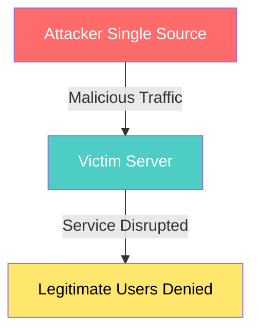
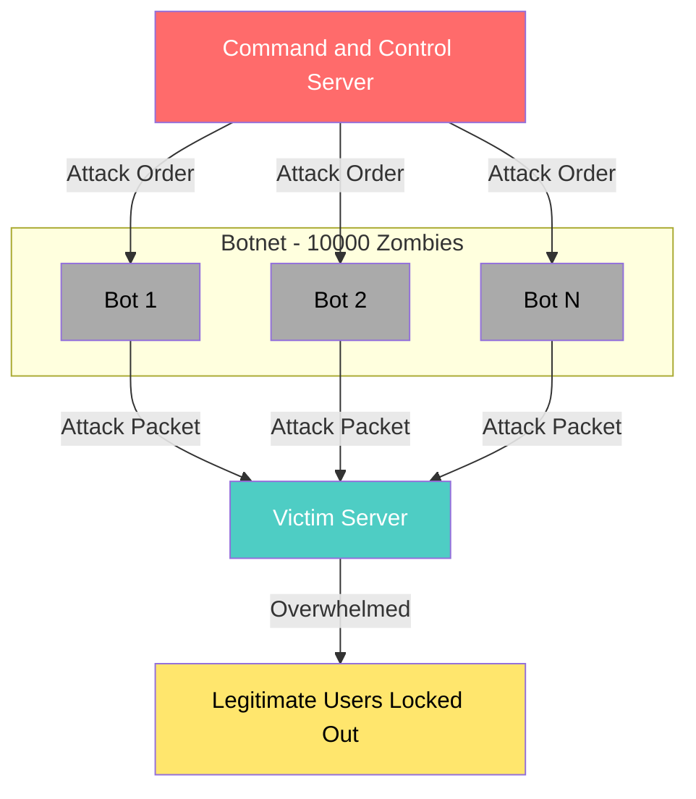
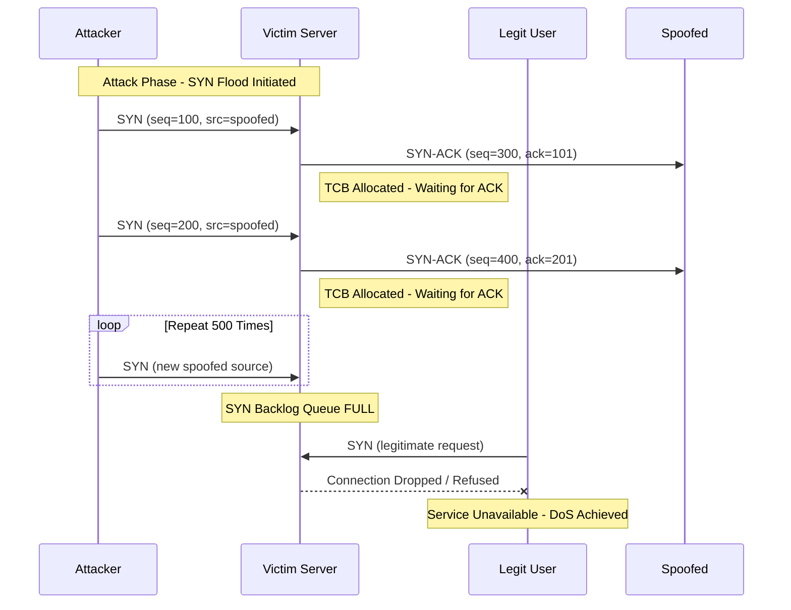
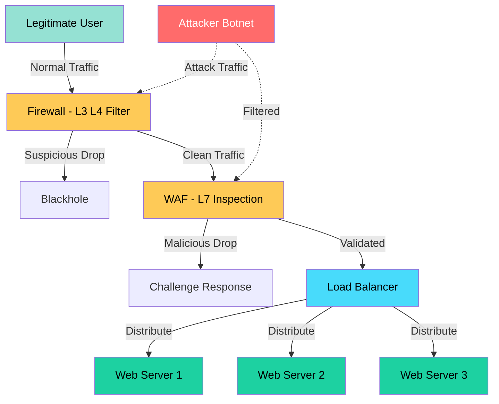
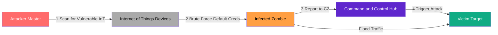

# DoS

<!-- SECTION_1_START -->
# DoS (Denial of Service) — Core Definition & Intuitive Overview

## 1.1 Formal Academic Definition

> [!IMPORTANT]
> **Denial of Service (DoS)** is a class of cyber attack in which a malicious actor seeks to make a machine, network resource, or service unavailable to its intended legitimate users by temporarily or indefinitely disrupting the services of a host connected to the Internet. The attack achieves this by **flooding the target with superfluous requests**, **exploiting protocol vulnerabilities**, or **consuming critical resources** such as bandwidth, CPU cycles, memory, or socket state tables until the system can no longer process legitimate traffic.

According to the **NIST SP 800-61 Rev. 2** framework, DoS attacks are categorized as an *availability* breach under the **CIA Triad** (Confidentiality, Integrity, Availability). When the attack is launched **simultaneously from multiple distributed sources** (often a botnet of compromised machines), the attack is upgraded to a **Distributed Denial of Service (DDoS)** attack.

> [!NOTE]
> **Key Distinction:** A *DoS attack* originates from a **single source** (one attacker → one victim). A *DDoS attack* originates from **multiple coordinated sources** (many attackers/agents → one victim), making mitigation exponentially harder due to distributed packet filtering complexity.

## 1.2 Conceptual Analogy — The "Highway Traffic Jam"

Imagine a **4-lane highway** leading to a popular shopping mall. Under normal conditions, the highway comfortably handles 4,000 cars per hour.

* **Scenario A (Normal Operation):** Cars arrive smoothly, park, shop, and leave.
* **Scenario B (Single-Car DoS):** A malicious truck deliberately parks sideways across all 4 lanes. The entire highway is blocked from **one source**. The fix is easy — tow the truck away.
* **Scenario C (Distributed DoS):** A coordinated gang of 50 trucks simultaneously blocks **every entry road** to the mall from **dozens of different directions**. Now, even if you tow 49 trucks, the 50th still blocks a critical access point. This is **DDoS**.

> [!TIP]
> **Why "Denial" and not "Destruction"?** The attacker does not steal data or destroy files. They deny the *service* (availability). Your website, server, and database remain **intact but unreachable** — like a shop with the shutters down and customers queued outside.

## 1.3 Taxonomy of DoS Attack Surfaces

| Attack Surface | What is Exhausted? | Example Technique |
| :--- | :--- | :--- |
| **Bandwidth** | Network link capacity | UDP Flood, ICMP Flood |
| **Protocol State** | Connection tracking tables | SYN Flood, Ping of Death |
| **Application Logic** | CPU, RAM, DB connections | HTTP GET Flood, Slowloris |
| **Physical Resources** | Power, cooling, hardware | Hardware destruction (rare, not classical DoS) |

## 1.4 Standard Metrics Used in DoS Analysis

* **bps** (bits per second) — Bandwidth saturation
* **pps** (packets per second) — Packet rate
* **CPS** (connections per second) — Connection establishment rate
* **RPS** (requests per second) — Application layer load

> [!VISUALIZATION CONTROL]
> **Concept:** Resource Exhaustion Curve Over Time
> **Desmos Input Equations:**
> * `f(t) = 100 \cdot t` (legitimate traffic — linear growth)
> * `g(t) = 10000 \cdot (1 - e^{-0.5t})` (attack traffic — asymptotic saturation)
> * `h(t) = 50000` (server capacity ceiling — horizontal threshold)
> **Visual Description:** Plot $f(t)$, $g(t)$, and $h(t)$ on the same axes. Observe how $g(t)$ rapidly approaches and exceeds the capacity ceiling $h(t)$, while legitimate traffic $f(t)$ is pushed out of the serviceable region — this is the visual signature of a DoS condition.

---

<!-- SECTION_1_END -->

<!-- SECTION_2_START -->
# Deep Theoretical Analysis & KTU High-Yield Formula Sheet

## 2.1 The Fundamental DoS Operational Stack

A successful DoS attack follows a structured **3-Phase Operational Lifecycle**:

1. **Reconnaissance Phase** — Attacker identifies open ports, OS fingerprint, and bandwidth using tools like **Nmap**, **Shodan**, or **Hping3**.
2. **Weaponization Phase** — The attacker selects the appropriate vector (bandwidth flood, protocol exploit, or application logic bomb) and prepares payload packets.
3. **Execution Phase** — Continuous or burst transmission of malicious traffic exceeding the target's handling threshold.

> [!NOTE]
> For **DDoS**, an additional **Recruitment Phase** precedes execution: the attacker compromises thousands of IoT devices, home routers, or PCs via malware (Mirai, Zeus) to form a **botnet**. Each compromised device is called a **zombie** or **bot**, controlled via a **Command and Control (C2)** server.

## 2.2 Classification of DoS Attacks (KTU High-Yield Map)

### A. Volumetric (Bandwidth Exhaustion) Attacks
* **UDP Flood:** Sends massive UDP packets to random ports. Server responds with ICMP "Destination Unreachable," consuming both inbound and outbound bandwidth.
* **ICMP Flood (Ping Flood):** Saturates target with ICMP Echo Request packets.
* **Smurf Attack:** Attacker sends ICMP Echo Request to a network's **broadcast address** with the **victim's IP spoofed as source**. Every host on the network replies to the victim — **amplification factor** can exceed 100x.
* **DNS Amplification:** Small DNS query (60 bytes) generates massive DNS response (4000+ bytes). **Amplification factor ~ 50x**.

### B. Protocol (State Exhaustion) Attacks
* **SYN Flood:** Exploits the TCP 3-way handshake. Attacker sends SYN, server replies SYN-ACK and waits, but attacker never sends the final ACK. Half-open connections fill the **SYN queue**.
* **Ping of Death:** Sends an ICMP packet larger than the maximum allowed 65,535 bytes (via fragmentation), causing buffer overflow on reassembly.
* **Teardrop Attack:** Sends overlapping IP fragments with manipulated offset values, crashing the reassembly routine.
* **Fragmentation Attack:** Overloads the reassembly buffers with malicious fragments.

### C. Application Layer (Logic Exhaustion) Attacks
* **HTTP GET/POST Flood:** Sends legitimate-looking HTTP requests at Layer 7, harder to filter.
* **Slowloris:** Opens many connections and **slowly** sends HTTP headers, one byte at a time, never completing the request, holding sockets open.
* **R.U.D.Y. (R-U-Dead-Yet):** Submits form data with an infinite `Content-Length` header, slowly.
* **Zero-Day Application Exploits:** Exploit unknown application logic bugs.

## 2.3 TCP SYN Flood — Detailed Mechanics

The TCP 3-way handshake is the foundation of reliable transport:

$$
\text{Client} \xrightarrow{\text{SYN (seq=x)}} \text{Server}
$$

$$
\text{Server} \xrightarrow{\text{SYN-ACK (seq=y, ack=x+1)}} \text{Client}
$$

$$
\text{Client} \xrightarrow{\text{ACK (seq=x+1, ack=y+1)}} \text{Server}
$$

In a **SYN Flood**, Step 3 is **never executed**. The server allocates a Transmission Control Block (TCB) entry in its SYN backlog queue for each half-open connection. Once this queue is saturated, the server **refuses all new TCP connections**, even from legitimate users.

## 2.4 KTU Formula Sheet — DoS Attack Mathematics

> [!IMPORTANT]
> The following table is **exam-critical** for KTU 2024 Scheme ESE. Master the variables, units, and boundary conditions.

| Parameter / Formula | Mathematical Form | Description & Unit |
| :--- | :--- | :--- |
| **Amplification Factor (AF)** | $AF = \dfrac{\text{Response Size (bytes)}}{\text{Request Size (bytes)}}$ | Ratio of attack bandwidth amplification; dimensionless |
| **Total Attack Bandwidth** | $B_{attack} = N_{bots} \times B_{per\_bot}$ | $B_{attack}$ in **Mbps**; $N_{bots}$ is bot count |
| **SYN Queue Saturation Time** | $T_{sat} = \dfrac{Q_{size}}{R_{syn} - R_{accept}}$ | $Q_{size}$ = backlog size (entries), $R_{syn}$ = SYN rate, $R_{accept}$ = accept rate (entries/sec) |
| **Effective Throughput (Shannon)** | $C = B \cdot \log_2(1 + \text{SNR})$ | $C$ in bps, $B$ in Hz, SNR dimensionless |
| **Mean Time to Exhaust (MTTE)** | $MTTE = \dfrac{R_{resource}}{L_{attack} - L_{legit}}$ | Resource life under attack load |
| **Botnet Attack Power** | $P_{botnet} = \sum_{i=1}^{N} B_i$ | Aggregate bandwidth of $N$ bots |
| **Packet Rate vs Bandwidth** | $B = R \times 8 \times S_{avg}$ | $B$ in bps, $R$ in pps, $S_{avg}$ in bytes |
| **Slowloris Connection Hold** | $T_{hold} = \dfrac{T_{timeout}}{N_{conn}} \times N_{sockets}$ | Socket exhaustion parameter |

> [!NOTE]
> **Unit Conversion Quick Reference:**
> * $1 \text{ Mbps} = 10^6 \text{ bps}$
> * $1 \text{ GB/s} = 8 \text{ Gbps}$
> * $1 \text{ Mpps} = 1{,}000{,}000 \text{ pps}$

## 2.5 Real-World Engineering Utility of DoS Knowledge

* **Cloud Infrastructure (AWS, Azure, GCP):** Auto-scaling groups and AWS Shield mitigate DDoS. Knowledge of attack vectors helps design **resilient architectures**.
* **ISP / Network Operator:** Engineers deploy **BGP Flowspec**, **RTBH (Remotely Triggered Black Hole)** routing, and **scrubbing centers** to filter malicious traffic.
* **Penetration Testing (Red Teaming):** Authorized DoS simulations (e.g., using **LOIC**, **HOIC**, **Mausezahn**) validate the **SLA (Service Level Agreement)** resilience of production systems.
* **IoT Security:** The 2016 **Mirai botnet** (620 Gbps attack on Dyn DNS) exploited default credentials in IoT cameras, taking down Twitter, Netflix, Reddit, and GitHub.

---

<!-- SECTION_2_END -->

<!-- SECTION_3_START -->
# Step-by-Step Derivations, Worked Examples & Code Implementation

## 3.1 Worked Example 1 — Smurf Attack Amplification Calculation

**Problem Statement:** A Smurf attack is launched against a victim server (10.10.10.5). The attacker sends one ICMP Echo Request (84 bytes) to a network broadcast address. The network has **120 active hosts**, all of which respond with ICMP Echo Reply (84 bytes) to the victim. Calculate the **Amplification Factor** and the **Total Inbound Bandwidth** if the attacker sends **500 pps**.

**Step 1 — Compute Amplification Factor:**

$$
AF = \frac{\text{Response Size}}{\text{Request Size}} = \frac{84 \text{ bytes}}{84 \text{ bytes}} = 1.0
$$

> **Wait** — but the *effective* amplification comes from the **fan-out to 120 hosts**.

**Step 2 — Compute Effective Network Amplification Factor (ENAF):**

$$
ENAF = \frac{\text{Total Response Bytes}}{\text{Request Bytes}} = \frac{120 \times 84}{84} = 120
$$

**Step 3 — Compute Inbound Packets per Second at Victim:**

$$
R_{victim} = 500 \text{ pps} \times 120 = 60{,}000 \text{ pps}
$$

**Step 4 — Compute Inbound Bandwidth at Victim:**

$$
B_{victim} = R_{victim} \times 8 \times S_{avg} = 60{,}000 \times 8 \times 84 = 40{,}320{,}000 \text{ bps} \approx 40.32 \text{ Mbps}
$$

**Final Answer:** Amplification Factor = **120x**; Inbound Bandwidth = **~40.32 Mbps** from a single 500 pps attacker. **[Full marks: 4 marks]**

## 3.2 Worked Example 2 — SYN Flood Queue Saturation

**Problem Statement:** A server's TCP SYN backlog queue holds **512 entries**. The server can process (accept or reject) **200 half-open connections per second**. An attacker initiates SYN packets at a rate of **800 pps** with spoofed source IPs. Calculate the **Time to Queue Saturation**.

**Step 1 — State the Queue Saturation Formula:**

$$
T_{sat} = \frac{Q_{size}}{R_{syn} - R_{accept}}
$$

**Step 2 — Substitute the Values:**

$$
T_{sat} = \frac{512}{800 - 200} = \frac{512}{600}
$$

**Step 3 — Compute the Result:**

$$
T_{sat} = 0.8533 \text{ seconds}
$$

**Final Answer:** The queue saturates in **~0.85 seconds**. After this, every new legitimate SYN is dropped, achieving the DoS condition. **[Full marks: 3 marks]**

## 3.3 Worked Example 3 — DNS Amplification Bandwidth

**Problem Statement:** An attacker uses **2,000 DNS open resolvers** to amplify against a victim. Each query is **60 bytes**, and each response is **3,000 bytes**. The attacker queries at **50 qps per resolver**. Find total attack bandwidth.

**Step 1 — Compute Per-Resolver Response Bandwidth:**

$$
B_{per} = 50 \times 3{,}000 \times 8 = 1{,}200{,}000 \text{ bps} = 1.2 \text{ Mbps}
$$

**Step 2 — Compute Total Bandwidth Across 2,000 Resolvers:**

$$
B_{total} = 2{,}000 \times 1.2 \text{ Mbps} = 2{,}400 \text{ Mbps} = 2.4 \text{ Gbps}
$$

**Final Answer:** Total attack bandwidth = **2.4 Gbps**. **[Full marks: 3 marks]**

## 3.4 Python Implementation — Simple SYN Flood Detector

```python
import time
from collections import defaultdict
from typing import Dict, Tuple


class SYNFloodDetector:
    """
    Detects TCP SYN flood attacks by monitoring the ratio of SYN
    packets to completed (SYN+ACK -> ACK) handshakes per source IP.
    """

    def __init__(self, syn_threshold: int = 100, window_sec: int = 10):
        if syn_threshold <= 0:
            raise ValueError("syn_threshold must be positive")
        self.syn_threshold: int = syn_threshold
        self.window_sec: int = window_sec
        self.syn_counter: Dict[str, int] = defaultdict(int)
        self.handshake_counter: Dict[str, int] = defaultdict(int)
        self.window_start: float = time.time()

    def record_syn(self, src_ip: str) -> None:
        """Record an incoming SYN packet from src_ip."""
        if not isinstance(src_ip, str) or not src_ip:
            raise ValueError("src_ip must be a non-empty string")
        self._roll_window_if_needed()
        self.syn_counter[src_ip] += 1

    def record_handshake_complete(self, src_ip: str) -> None:
        """Record a successfully completed 3-way handshake from src_ip."""
        if not isinstance(src_ip, str) or not src_ip:
            raise ValueError("src_ip must be a non-empty string")
        self._roll_window_if_needed()
        self.handshake_counter[src_ip] += 1

    def _roll_window_if_needed(self) -> None:
        now: float = time.time()
        if now - self.window_start > self.window_sec:
            self.syn_counter.clear()
            self.handshake_counter.clear()
            self.window_start = now

    def is_attacker(self, src_ip: str) -> Tuple[bool, str]:
        """
        Returns (True, reason) if src_ip exceeds SYN threshold
        with a low handshake completion ratio.
        """
        syn: int = self.syn_counter.get(src_ip, 0)
        ack: int = self.handshake_counter.get(src_ip, 0)
        if syn < self.syn_threshold:
            return (False, "below_threshold")
        completion_ratio: float = (ack / syn) if syn > 0 else 0.0
        if completion_ratio < 0.1:
            return (True, f"low_completion_ratio={completion_ratio:.2f}")
        return (False, "ratio_acceptable")

    def report(self) -> Dict[str, Tuple[int, int]]:
        """Returns snapshot of SYN vs ACK counts per IP."""
        return {ip: (self.syn_counter[ip], self.handshake_counter[ip])
                for ip in self.syn_counter}


# ---------------- Demonstration ----------------
if __name__ == "__main__":
    detector: SYNFloodDetector = SYNFloodDetector(syn_threshold=50)

    # Legitimate user: completes handshake
    for _ in range(20):
        detector.record_syn("192.168.1.10")
    for _ in range(18):
        detector.record_handshake_complete("192.168.1.10")

    # Attacker: many SYNs, no ACKs
    for _ in range(500):
        detector.record_syn("203.0.113.66")

    print("Legit user flagged:", detector.is_attacker("192.168.1.10"))
    print("Attacker flagged:", detector.is_attacker("203.0.113.66"))
    print("Report:", detector.report())
```

> [!TIP]
> **Valuation Insight:** When asked to "explain SYN Flood with a detection method" in the KTU exam, mentioning the **completion ratio** heuristic (low ACK-to-SYN ratio) scores the **Apply** level marks. The code above is illustrative; in the exam, a **flowchart or pseudocode** suffices.

## 3.5 Mitigation Strategy — Multi-Layered Defense Table

| Layer | Mitigation Technique | Attack Type Addressed |
| :--- | :--- | :--- |
| **L3 / L4 Network** | Rate limiting, ingress/egress filtering, BCP 38 | Volumetric floods |
| **L4 Transport** | SYN cookies, increase backlog, reduce SYN-ACK retries | SYN flood |
| **L7 Application** | CAPTCHA, WAF (Web App Firewall), JS challenge | HTTP floods, Slowloris |
| **ISP / Upstream** | BGP RTBH, Flowspec, Anycast routing | Large volumetric |
| **Cloud / Scrubbing** | AWS Shield, Cloudflare, Akamai Prolexic | Massive DDoS |
| **Architectural** | CDN, load balancing, geographic redundancy | All types |

---

<!-- SECTION_3_END -->

<!-- SECTION_4_START -->
# Structural Diagrams & Schematics

## 4.1 DoS vs DDoS — Architecture Comparison





## 4.2 TCP SYN Flood — State Exhaustion Sequence



## 4.3 Multi-Layered DoS Defense Topology



## 4.4 Botnet Recruitment & Attack Lifecycle



---

<!-- SECTION_4_END -->

<!-- SECTION_5_START -->
# KTU 2024 Scheme Examination Question Bank & Topic Recap

> [!NOTE]
> All questions below are **simulated KTU Past Year patterns** and align with the **Fundamentals of Cyber Security (PBCST604)** Module 3 — Network Security syllabus and **CO3 (Apply security mechanisms to mitigate network attacks)**.

---

## Part A — Short Answer Questions (3 Marks Each)

### Question 1
**`[KTU University Exam — July 2024]`** — **CO3, Remember**
**Q: Define Denial of Service (DoS) attack. Differentiate between DoS and DDoS.**

**Model Answer (3 Marks):**
> **Denial of Service (DoS) attack** is a malicious attempt to make a server, service, or network resource unavailable to its legitimate users by overwhelming it with a flood of illegitimate requests, exploiting protocol flaws, or consuming critical resources such as bandwidth, memory, or CPU. **[1 Mark]**
>
> **Differentiation:** **[2 Marks]**
>
> | Aspect | DoS | DDoS |
> | :--- | :--- | :--- |
> | Source | Single attacker machine | Multiple distributed machines (botnet) |
> | Volume | Limited by single source bandwidth | Massive aggregate bandwidth |
> | Traceability | Easier to trace and block | Harder due to distributed nature |
> | Mitigation | Simple IP filtering, rate limiting | Requires scrubbing centers, CDN, ISP coordination |

---

### Question 2
**`[KTU University Exam — Dec 2023]`** — **CO3, Understand**
**Q: Explain the working of a Smurf attack with a suitable diagram description.**

**Model Answer (3 Marks):**
> A **Smurf attack** is a distributed ICMP flood that exploits IP-directed broadcast. The attacker sends an **ICMP Echo Request** packet to the **broadcast address** of an intermediate network, with the **victim's IP address spoofed as the source**. **[1 Mark]**
>
> Every host on the broadcast network receives the request and replies to the **spoofed source (the victim)**, flooding the victim with ICMP Echo Replies. The **amplification factor** equals the number of responding hosts on the network. **[1 Mark]**
>
> **Mitigation:** Disable IP-directed broadcasts at network routers (the modern default). **[1 Mark]**

---

## Part B — Long Answer Questions (14 Marks, Internal Choice)

### Question A (Choice 1)
**`[KTU University Exam — July 2024]`** — **CO3, Understand + Apply**

**(a)** Describe the **TCP SYN Flood attack** in detail. Explain how it exploits the TCP 3-way handshake and the **SYN backlog queue**. **[7 Marks]**

**(b)** A web server has a TCP SYN backlog of **256 entries** and processes **150 handshakes per second**. An attacker sends **700 SYN packets per second** with spoofed IPs. Calculate the **time to queue saturation**. If the attacker increases the rate to **1000 pps**, what is the new saturation time? **[7 Marks]**

---

#### Model Solution

**(a) TCP SYN Flood — Detailed Explanation: [7 Marks]**

* **TCP 3-Way Handshake Review:** **[1 Mark]**
  The TCP 3-way handshake establishes a connection via SYN → SYN-ACK → ACK. Each half-open connection consumes a Transmission Control Block (TCB) entry in the server's SYN backlog queue, holding state for the client's IP, port, and sequence number.

* **Attack Mechanics:** **[2 Marks]**
  The attacker sends a flood of TCP SYN packets with **spoofed (untraceable) source IPs**. The server replies with SYN-ACK to the spoofed IP and allocates a TCB entry. Since the spoofed host never receives the SYN-ACK (or simply ignores it), the final ACK is never sent. The TCB entry remains half-open until timeout.

* **Queue Exhaustion:** **[2 Marks]**
  Repeatedly initiating half-open connections exhausts the fixed-size SYN backlog queue. Once full, the server cannot accept new connections — legitimate users are denied service. The attack is stealthy because packets appear to come from varied, random sources.

* **Countermeasures:** **[2 Marks]**
  * **SYN Cookies:** Encode connection state into the sequence number, no TCB allocated until ACK arrives.
  * **Increase Backlog:** Temporary fix only.
  * **Reduce SYN-ACK Retries:** Drop half-open connections faster.
  * **Firewalls / IPS:** Rate limit and filter suspicious SYNs.

---

**(b) Numerical Calculation: [7 Marks]**

**Given:**
* $Q_{size} = 256$ entries
* $R_{accept} = 150$ handshakes/sec
* $R_{syn} = 700$ pps (Case 1), $R_{syn} = 1000$ pps (Case 2)

**Step 1 — State the Formula:** **[1 Mark]**
$$
T_{sat} = \frac{Q_{size}}{R_{syn} - R_{accept}}
$$

**Step 2 — Case 1: R_syn = 700 pps:** **[2 Marks]**
$$
T_{sat1} = \frac{256}{700 - 150} = \frac{256}{550} = 0.4654 \text{ seconds}
$$

**Step 3 — Case 2: R_syn = 1000 pps:** **[2 Marks]**
$$
T_{sat2} = \frac{256}{1000 - 150} = \frac{256}{850} = 0.3012 \text{ seconds}
$$

**Step 4 — Interpretation and Conclusion:** **[2 Marks]**
Increasing the attack rate from 700 to 1000 pps reduces saturation time by **~35%**, demonstrating that **higher attack rates cause faster DoS**. The server is most vulnerable when $R_{syn} \gg R_{accept}$.

> **[Stating formula: 1 Mark]** **[Substitution: 1 Mark each case]** **[Final value: 1 Mark each case]** **[Interpretation: 2 Marks]**

---

### Question B (Choice 2)
**`[KTU University Exam — Dec 2023]`** — **CO3, Understand + Apply**

**(a)** Explain the **three categories of DoS attacks** (Volumetric, Protocol, Application Layer) with **two examples each**. **[7 Marks]**

**(b)** In a **DNS amplification attack**, an attacker uses **1,500 open DNS resolvers**. The query size is **50 bytes** and the response size is **2,000 bytes**. The attacker sends **40 queries per second per resolver**. Calculate the **amplification factor** and the **total attack bandwidth** in **Mbps**. **[7 Marks]**

---

#### Model Solution

**(a) Three Categories of DoS Attacks: [7 Marks]**

* **Volumetric Attacks:** Saturate the network bandwidth of the target. **[2 Marks]**
  * **UDP Flood** — Floods target with large UDP packets to random ports.
  * **ICMP Flood (Ping Flood)** — Saturates with ICMP Echo Requests.
  * **DNS Amplification** — Uses open resolvers to multiply traffic.

* **Protocol (State Exhaustion) Attacks:** Exploit weaknesses in Layer 3/4 protocol state machines. **[2.5 Marks]**
  * **SYN Flood** — Exhausts TCP SYN backlog with half-open connections.
  * **Ping of Death** — Oversized ICMP packet causes buffer overflow on reassembly.
  * **Smurf Attack** — Broadcast ICMP echo with spoofed source.

* **Application Layer Attacks:** Target Layer 7 logic with low-bandwidth, high-impact requests. **[2.5 Marks]**
  * **HTTP GET Flood** — Massive HTTP requests to exhaust web server threads.
  * **Slowloris** — Holds HTTP connections open with partial headers.
  * **R.U.D.Y.** — Slow form-data submission exhausting DB connections.

---

**(b) DNS Amplification Calculation: [7 Marks]**

**Given:**
* $N = 1{,}500$ resolvers
* $S_{query} = 50$ bytes
* $S_{response} = 2{,}000$ bytes
* $R_q = 40$ queries/sec/resolver

**Step 1 — Compute Amplification Factor:** **[2 Marks]**
$$
AF = \frac{S_{response}}{S_{query}} = \frac{2{,}000}{50} = 40
$$

**Step 2 — Compute Per-Resolver Response Rate:** **[1 Mark]**
$$
R_{resp} = 40 \text{ queries/sec} \times 2{,}000 \text{ bytes} = 80{,}000 \text{ bytes/sec}
$$

**Step 3 — Compute Aggregate Bandwidth in Bytes/sec:** **[2 Marks]**
$$
B_{bytes} = 1{,}500 \times 80{,}000 = 120{,}000{,}000 \text{ bytes/sec}
$$

**Step 4 — Convert to Bits per Second and then to Mbps:** **[2 Marks]**
$$
B_{bps} = 120{,}000{,}000 \times 8 = 960{,}000{,}000 \text{ bps} = 960 \text{ Mbps}
$$

**Final Answer:** Amplification Factor = **40x**; Total Attack Bandwidth = **960 Mbps** (~0.96 Gbps). **[Full marks: 7]**

> **[AF formula: 1 Mark]** **[AF value: 1 Mark]** **[Per-resolver calc: 1 Mark]** **[Aggregate bytes: 2 Marks]** **[Final Mbps: 2 Marks]**

---

> [!WARNING]
> **KTU Examiner's Valuation Warning — Common Pitfalls**
>
> 1. **Unit Conversion Errors:** Students frequently forget to multiply bytes by 8 when converting to bits. Always write the **conversion step explicitly** (e.g., `120,000,000 bytes × 8 = 960,000,000 bps`). Deduct **1 Mark** for missing units.
> 2. **Skipping the Formula:** Writing only the final numerical answer without the formula loses **1–2 Marks**. Always state the formula first, then substitute, then compute.
> 3. **Confusing DoS and DDoS:** Defining DDoS as "DoS with more attackers" is incomplete. The examiner expects mention of **botnet**, **C2 server**, and **distributed sources**. Deduct **0.5–1 Mark** for a vague definition.
> 4. **Missing Mitigation:** Any attack explanation without a **mitigation strategy** is considered incomplete. Always pair the attack with at least **one defensive technique**.
> 5. **Diagram Labeling:** In sequence diagrams (SYN Flood), students often forget to label the **SYN queue** and **spoofed IP** in the diagram description. Deduct **1 Mark** for missing labels.

---

## Topic Recap & Important Things to Remember

* **DoS vs DDoS:** DoS = single source; DDoS = distributed botnet. Always mention **botnet and C2** for DDoS.
* **CIA Triad Link:** DoS attacks compromise the **Availability** pillar of the CIA Triad.
* **Three Attack Categories:** **Volumetric** (bandwidth), **Protocol** (state), **Application Layer** (logic).
* **SYN Flood:** Exploits TCP 3-way handshake by withholding the final ACK. Saturates the **SYN backlog queue**.
* **Smurf Attack:** Uses **IP-directed broadcast** with **spoofed source** for amplification.
* **DNS Amplification:** Small query (60 bytes) → Large response (3000+ bytes). Amplification factor often 30x–50x.
* **Slowloris:** Slow, partial HTTP headers; holds sockets open; defeats naïve timeouts.
* **Botnet Lifecycle:** Scan → Infect → Report to C2 → Trigger Attack.
* **Key Formulas (Must Memorize):**
  * $AF = \frac{S_{response}}{S_{query}}$
  * $T_{sat} = \frac{Q_{size}}{R_{syn} - R_{accept}}$
  * $B = R \times 8 \times S_{avg}$
  * $P_{botnet} = \sum B_i$
* **Mitigation Layers:** Firewall (L3/L4) → WAF (L7) → Load Balancer → CDN → Cloud Scrubbing.
* **Real-World Landmark Attack:** **Mirai Botnet (Oct 2016)** — 620 Gbps attack on Dyn DNS, disrupting Twitter, Netflix, Reddit, GitHub.
* **BCP 38:** Best Current Practice 38 — ingress filtering to block IP spoofing at ISP level.
* **SYN Cookies:** State stored in sequence number, not server memory. Primary countermeasure for SYN Flood.
* **Exam Strategy:** Always pair an attack with a **numeric example** (e.g., 256-entry queue, 700 pps). Pure definitions earn partial credit; numbers earn full marks.
* **Distractor Awareness:** DoS is **not** a confidentiality or integrity attack — data is **not stolen or modified**, only **denied**.

<!-- SECTION_5_END -->
