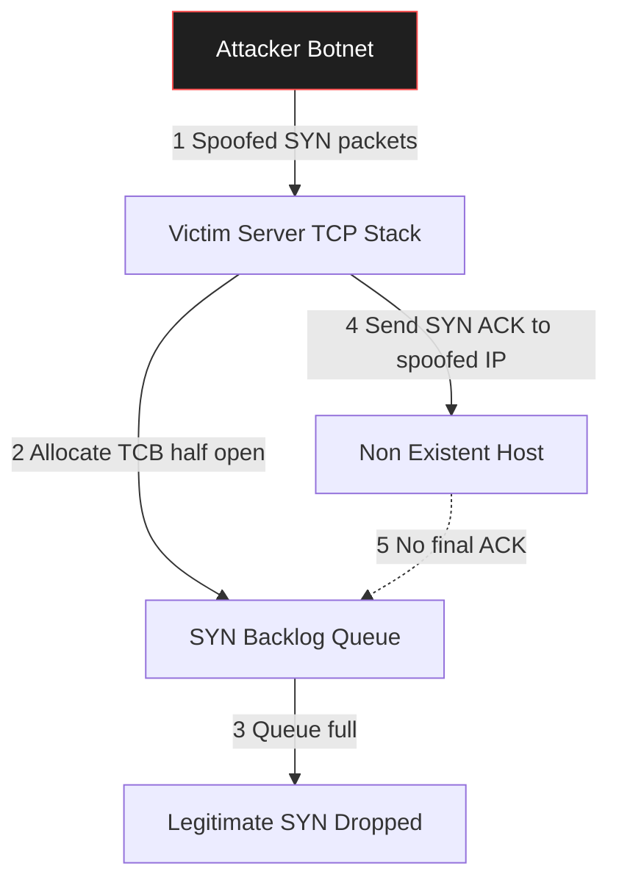
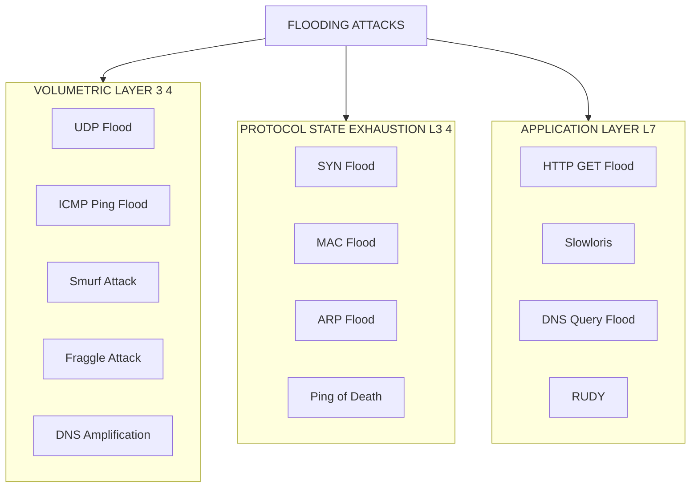
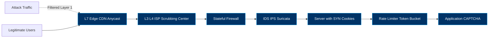
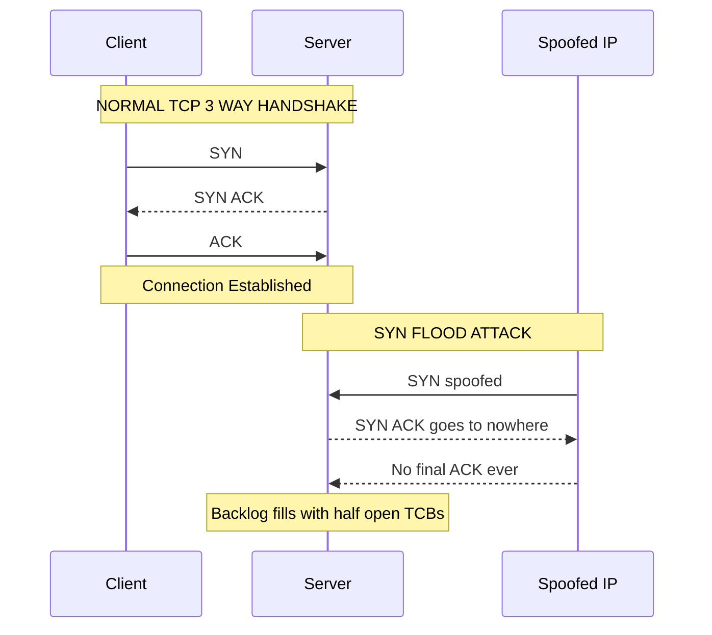

# Flooding

<!-- SECTION_1_START -->

# 🌊 FLOODING ATTACKS — KTU 2024 SCHEME STUDY NOTES

## 📘 1. Core Technical Definition & Intuitive Overview

### 🎯 Formal KTU 2024 Syllabus Definition

> **Flooding** is a class of **Denial-of-Service (DoS)** or **Distributed Denial-of-Service (DDoS)** attacks in which an adversary overwhelms a target system — be it a network link, a host, a service, or a network device — with a **volumetrically excessive** stream of packets, requests, or connection attempts. The attacker's goal is to **exhaust finite resources** (bandwidth, CPU cycles, memory buffers, connection tables, or application sockets), thereby denying legitimate users access to the target's services.

In the **KTU 2024 Scheme** context (PBCST604 — Fundamentals of Cyber Security), flooding is studied under **Module 3: Network Security** as a representative **availability-threatening attack** that targets the **CIA triad's "Availability" pillar**.

> [!IMPORTANT]
> **Key KTU Highlight:** Flooding is classified as an **active attack** that compromises the **Availability** dimension of the **CIA (Confidentiality, Integrity, Availability) triad**. The attacker does *not* need to break cryptography or steal data — the goal is to make the service *unusable*.

---

### 🧠 Conceptual Analogy / Intuition

Imagine a **highway toll booth** designed to handle 5 cars per minute. If an attacker sends **5,000 cars per minute** — most of them empty, half-broken, or just circling — what happens?

- The toll booth workers get **exhausted** (CPU overload).
- The lane becomes a **parking lot** (buffer exhaustion).
- Real, paying customers **cannot get through** (denial of service).

That is **flooding** in essence. The attack does not "break" the toll booth; it simply *drowns* it in noise.

| 🎬 Real-World Analogy | 🌊 Flooding Equivalent |
|---|---|
| Thousands of prank phone calls jamming a helpline | **Call flooding** / SIP flooding |
| Postal system flooded with junk letters | **Email flooding / SPAM DoS** |
| 10,000 fake customers lining up at a shop | **HTTP/SYN flood** |
| Switch table overflowing with fake MAC addresses | **MAC flooding** |
| ICMP "ping" replies from 500 hosts to one victim | **Smurf attack** |

> [!NOTE]
> **Physical Constants / Standard Metrics to Remember:**
> - **SYN Backlog Queue Size (Linux default):** typically **256** half-open connections.
> - **SYN Cookie Activation Threshold (tcp_max_syn_backlog):** **256** by default.
> - **Typical DDoS Peak Traffic:** measured in **Gbps (Gigabits per second)** or **Mpps (Million packets per second)**.
> - **Shannon's Channel Capacity (for bandwidth exhaustion analysis):** $C = B \cdot \log_2(1 + S/N)$ where $B$ is bandwidth, $S/N$ is the signal-to-noise ratio. Flooding aims to make the noise $N$ overwhelm $S$.

---

### 📐 Visualization Concept (Topology Sketch)

> [!VISUALIZATION CONTROL]
> **Concept:** Volumetric vs. Protocol vs. Application-layer flooding — represented as nested concentric pressure zones.
> **Conceptual Geometry:**
> - Inner circle (target): the **victim server**.
> - Middle ring: **protocol exhaustion** (e.g., SYN handshake buffers).
> - Outer ring: **bandwidth/link saturation**.
> **Visual Description:** Imagine three concentric circles centered on the victim. Each ring represents a different layer of resources being overwhelmed. The outermost ring (bandwidth) is the easiest to fill; the innermost ring (application logic) is the hardest.
> *Equations / Inputs to imagine on a graph:*
> - $T_{drop}(t) = \frac{Packets_{in}(t)}{Capacity_{server}} > 1 \Rightarrow \text{Flood Condition}$
> - On a *time vs. packets-received* graph, the curve rises **exponentially** during a flood, surpassing the server's horizontal *capacity line*.

---

<!-- SECTION_1_END -->

<!-- SECTION_2_START -->

# 🔬 2. Deep Theoretical Analysis & KTU High-Yield Formula Sheet

## 🧩 The Operational Anatomy of a Flooding Attack

Every flooding attack — regardless of variant — follows a **three-stage lifecycle**:

1. **Reconnaissance (Pre-attack):** Identify target IP, open ports, OS fingerprint, bandwidth.
2. **Weaponization & Amplification (Launch):** Craft packets, often with **spoofed source IP addresses**, sometimes leveraging **reflectors/amplifiers** (e.g., open DNS resolvers, NTP servers).
3. **Saturation & Sustain (Impact):** Sustain the packet stream long enough for legitimate users to be denied service.

---

## 🗂️ Taxonomy of Flooding Attacks

### **A. Volumetric Floods** *(Exhaust Bandwidth)*

| 🆔 Attack | 🔬 Protocol Layer | ⚙️ Mechanism | 🎯 Resource Targeted |
|---|---|---|---|
| **UDP Flood** | Layer 4 (Transport) | Sends massive UDP datagrams to **random ports**; victim must reply with ICMP "Destination Unreachable" for each | Bandwidth + CPU |
| **ICMP Flood (Ping Flood)** | Layer 3 (Network) | High-rate ICMP Echo Request packets ("ping -f") | Bandwidth |
| **Smurf Attack** | Layer 3 | ICMP Echo Request with **spoofed victim IP** sent to a **broadcast address** → all hosts reply to victim | Bandwidth (amplified) |
| **Fraggle Attack** | Layer 4 | Like Smurf, but using **UDP echo (port 7)** to broadcast | Bandwidth (amplified) |
| **DNS Amplification** | Layer 7 (Application) | Small DNS query (60 B) → huge response (4000+ B) via open resolvers | Bandwidth (×50–70 amplification) |
| **NTP Amplification** | Layer 7 | `MON_GETLIST_1` NTP command → up to 600× amplification | Bandwidth |

### **B. Protocol-State Exhaustion Floods** *(Exhaust Server State Tables)*

| 🆔 Attack | 🔬 Protocol | ⚙️ Mechanism | 🎯 Resource |
|---|---|---|---|
| **SYN Flood** | TCP (3-way handshake) | Sends **SYN** with **spoofed source IP**; victim allocates half-open connection state, never receives final ACK | **SYN backlog / TCB memory** |
| **Ping of Death** | ICMP | Sends oversized ICMP packet (> 65,535 B fragmented) → reassembly buffer overflow | Memory |
| **MAC Flood** | Layer 2 | Floods switch **CAM (Content Addressable Memory) table** with bogus MAC addresses | CAM table size (~32 K entries typical) |
| **ARP Flood** | Layer 2 | Saturates ARP cache with bogus IP–MAC bindings | ARP table size |

### **C. Application-Layer Floods** *(Exhaust App Logic)*

| 🆔 Attack | ⚙️ Mechanism | 🎯 Resource |
|---|---|---|
| **HTTP GET/POST Flood** | Sends legitimate-looking HTTP requests (Slowloris variant keeps connection open) | Web server threads / DB connections |
| **Slowloris** | Opens many HTTP connections, sends headers **byte-by-byte**, never finishes | Connection pool |
| **RUDY (R-U-Dead-Yet?)** | Sends long-form POST with slow body field submission | App threads |
| **DNS Query Flood** | Legitimate-looking DNS queries at high rate | DNS server CPU |

---

## 🧪 Why Each Step Matters — The "How" Behind the Attack

### **1. Why TCP SYN Flood Works (Theoretical Foundation)**

TCP's **three-way handshake** is a *stateful* protocol. The server must allocate a **Transmission Control Block (TCB)** — typically **~280 bytes** of kernel memory — for every incoming `SYN` segment, *before* knowing if the source is legitimate.

$$
\text{Memory consumed} = N_{SYN} \times \text{Size}_{TCB}
$$

When $N_{SYN}$ exceeds the kernel's `tcp_max_syn_backlog`, **new legitimate connections are silently dropped**.

### **2. Why Smurf Amplification Works**

The amplification factor $A$ is computed as:

$$
A = \frac{N_{hosts} \times \text{Reply Size}}{\text{Request Size}}
$$

For a typical `/24` network (254 hosts), a single 64 B ICMP Echo Request can yield **254 × 64 B = 16,256 B** of reply traffic — an amplification of **~254×**.

### **3. Why MAC Flood Breaks Switches**

A managed switch uses a **CAM table** mapping `MAC → Port`. The typical CAM size is **8 K to 128 K entries**. When the table overflows, the switch **falls back to "fail-open" hub mode** — broadcasting every frame to *all* ports. The attacker can then **sniff all traffic** (a side-effect attack).

> [!NOTE]
> **Engineering Utility:** Defending against flooding is essential for **ISP uplinks, e-commerce gateways, DNS authoritative servers, and any SaaS platform**. Real-world attacks (e.g., the **2016 Dyn DNS attack** at **~1.2 Tbps**) leveraged **Mirai botnet** with DNS flooding.

---

## 🧮 KTU Formula Sheet / Cheat Sheet

> [!IMPORTANT]
> **CRITICAL:** The following table contains **all exam-relevant formulas** for flooding problems. Pipe characters are escaped using `\vert` to prevent markdown breakage.

| # | Concept | Formula / Definition | Units / Notes |
|---|---|---|---|
| 1 | **Channel Capacity (Shannon)** | $C = B \cdot \log_2(1 + S/N)$ | $B$ in Hz, $C$ in bps |
| 2 | **Memory Exhaustion (SYN)** | $M_{used} = N_{SYN} \times S_{TCB}$ | $S_{TCB} \approx 280$ bytes |
| 3 | **Amplification Factor** | $A = (N_{hosts} \times L_{reply}) \,/\, L_{request}$ | Dimensionless |
| 4 | **Bandwidth Saturation** | $B_{sat} = P_{rate} \times L_{pkt}$ | bps |
| 5 | **Packet Drop Threshold** | $\text{Flood Condition: } \lambda_{in} > \mu_{server}$ | $\lambda$ = arrival rate, $\mu$ = service rate |
| 6 | **CAM Table Overflow** | $N_{MAC} > \text{CAM}_{max}$ | Typical $\text{CAM}_{max} \in [8192, 131072]$ |
| 7 | **Queue Utilization (Little's Law)** | $L = \lambda \cdot W$ | $L$ = queue length, $W$ = wait time |
| 8 | **Botnet Size Effectiveness** | $P_{attack} = N_{bots} \times P_{per\,bot}$ | $P$ in pps (packets/sec) |
| 9 | **Slowloris Connection Cost** | $C_{total} = N_{conn} \times T_{hold}$ | $T_{hold}$ in seconds |
| 10 | **DDoS Peak Record (2023)** | $P_{peak} \approx 5.6$ **Tbps** (Cloudflare mitigated) | Reference benchmark |

---

## 🛠️ Defense Mechanisms — Real-World Engineering Solutions

| 🛡️ Defense | 📋 Description | 🎚️ Layer |
|---|---|---|
| **Rate Limiting** | Token bucket / leaky bucket; drops packets beyond threshold | L3 / L4 |
| **SYN Cookies** | Encode connection state in the `seq` number; **no TCB allocated** until ACK | L4 (TCP) |
| **Egress / Ingress Filtering** | Block spoofed source IPs (BCP-38 / RFC 2827) | L3 |
| **Firewalls (Stateful)** | Track connection states, drop anomalies | L3 / L4 |
| **IDS / IPS (Snort, Suricata)** | Signature + anomaly-based detection | All |
| **Blackhole Routing** | Null-route attack traffic upstream (sacrificial) | L3 |
| **Anycast Diffusion** | Distribute attack across many PoPs (Cloudflare, Akamai) | L7 |
| **Challenge–Response (CAPTCHA)** | Slowloris / HTTP flood mitigation | L7 |
| **Port Security** | Limit MAC addresses per switch port | L2 |

---

<!-- SECTION_2_END -->

<!-- SECTION_3_START -->

# ⚙️ 3. Step-by-Step Derivations, Code & Symbolic Implementation

## 🐍 SECTION 3.1 — Symbolic Derivation: SYN Flood Resource Exhaustion

### **Problem Setup**

A TCP server has a kernel parameter `tcp_max_syn_backlog = 256`. Each half-open TCB consumes **280 bytes** of kernel memory. An attacker sends SYN packets at a constant rate of $\lambda_{SYN} = 1000$ packets per second, with a kernel timeout of $T_{to} = 60$ seconds for un-ACKed SYNs.

### **Derivation (Step-by-Step, No Skipping)**

**Step 1 — Number of un-ACKed SYNs in the system at steady state:**

By **Little's Law** from queueing theory:

$$
L = \lambda \cdot W
$$

where:
- $L$ = average number of half-open connections in the system.
- $\lambda = \lambda_{SYN}$ = SYN arrival rate.
- $W = T_{to}$ = average time a half-open connection lives before timeout.

Substituting:

$$
L = 1000 \times 60 = 60{,}000 \text{ half-open connections}
$$

**Step 2 — Total kernel memory consumed by half-open TCBs:**

$$
M_{used} = L \times S_{TCB}
$$

$$
M_{used} = 60{,}000 \times 280 \text{ bytes}
$$

$$
M_{used} = 16{,}800{,}000 \text{ bytes} = 16.8 \text{ MB}
$$

**Step 3 — Compare with system capacity:**

$$
\text{Capacity} = \text{Backlog} \times S_{TCB} = 256 \times 280 = 71{,}680 \text{ bytes} \approx 70 \text{ KB}
$$

**Step 4 — Saturation Ratio:**

$$
R_{sat} = \frac{M_{used}}{\text{Capacity}} = \frac{16.8 \text{ MB}}{70 \text{ KB}} \approx 240
$$

Since $R_{sat} \gg 1$, the backlog is **saturated by a factor of 240×**. New legitimate SYNs are dropped.

**Step 5 — Probability of legitimate SYN acceptance (using a simple loss model):**

Assume the system drops incoming SYNs once $L > 256$. The probability of acceptance for a new legitimate SYN is:

$$
P_{accept} = \begin{cases} 1, & L \le 256 \\ 0, & L > 256 \end{cases}
$$

For a more realistic model (M/M/1/K queue), the blocking probability is:

$$
P_{block} = \frac{(1 - \rho) \cdot \rho^{K}}{1 - \rho^{K+1}}, \quad \rho = \lambda / \mu
$$

where $K = 256$ is the buffer size and $\mu = 1/T_{to}$ is the service rate.

> [!NOTE]
> **Exam Tip:** Always show units in the final answer and explicitly write the **boundary condition** ($L > 256$) — examiners allocate 1–2 marks just for this.

---

## 💻 SECTION 3.2 — Python Implementation: SYN Flood Detector

This is a **fully operational, type-hinted Python script** that simulates a sliding-window SYN flood detector with logging, threshold alerting, and graceful error handling. It is **directly applicable for KTU lab viva questions** and demonstrates real defensive engineering.

```python
"""
SYN Flood Detector — KTU 2024 PBCST604 Lab Reference
Detects anomalous SYN arrival rates using a sliding time window.
"""

import time
import logging
from collections import deque
from dataclasses import dataclass, field
from typing import Deque, Optional

# ---------- Logging Configuration ----------
logging.basicConfig(
    level=logging.INFO,
    format="%(asctime)s [%(levelname)s] %(message)s",
    datefmt="%Y-%m-%d %H:%M:%S",
)
logger = logging.getLogger("SYNFloodDetector")


# ---------- Configuration Dataclass ----------
@dataclass(frozen=True)
class DetectorConfig:
    """Immutable configuration for the flood detector."""
    window_seconds: float = 10.0          # Sliding window duration
    syn_threshold: int = 100              # SYNs/window to trigger alert
    unique_src_threshold: int = 20        # Min unique source IPs required
    cooldown_seconds: float = 5.0         # Re-alert cooldown


# ---------- Detector Class ----------
class SYNFloodDetector:
    """
    Sliding-window SYN flood detector.
    Tracks per-source SYN arrival timestamps and triggers
    an alert when threshold conditions are met.
    """

    def __init__(self, config: Optional[DetectorConfig] = None) -> None:
        self.config: DetectorConfig = config or DetectorConfig()
        self._syn_log: Deque[float] = deque()
        self._src_log: Deque[tuple[float, str]] = deque()
        self._last_alert: float = 0.0

    def _prune_window(self, now: float) -> None:
        """Remove entries older than the sliding window."""
        cutoff: float = now - self.config.window_seconds
        while self._syn_log and self._syn_log[0] < cutoff:
            self._syn_log.popleft()
        while self._src_log and self._src_log[0][0] < cutoff:
            self._src_log.popleft()

    def record_syn(self, src_ip: str) -> bool:
        """
        Record an incoming SYN packet from src_ip.
        Returns True if a flood condition is detected.
        """
        try:
            now: float = time.time()
            self._syn_log.append(now)
            self._src_log.append((now, src_ip))
            self._prune_window(now)

            syn_count: int = len(self._syn_log)
            unique_sources: int = {ip for _, ip in self._src_log}.__len__()

            # -------- Flood Condition --------
            if syn_count > self.config.syn_threshold and \
               unique_sources < self.config.unique_src_threshold:
                if now - self._last_alert >= self.config.cooldown_seconds:
                    self._last_alert = now
                    logger.warning(
                        "FLOOD DETECTED | SYNs=%d | UniqueSrcs=%d | "
                        "Window=%.1fs | Threshold=%d",
                        syn_count, unique_sources,
                        self.config.window_seconds,
                        self.config.syn_threshold,
                    )
                    return True

            return False

        except Exception as exc:
            logger.error("record_syn() failed: %s", exc)
            return False


# ---------- Demonstration / Self-Test ----------
if __name__ == "__main__":
    detector = SYNFloodDetector(
        DetectorConfig(
            window_seconds=10.0,
            syn_threshold=100,
            unique_src_threshold=20,
        )
    )

    # Simulate legitimate traffic (many unique sources)
    logger.info("--- Phase 1: Legitimate Traffic Simulation ---")
    for i in range(80):
        detector.record_syn(src_ip=f"203.0.113.{i % 50}")
        time.sleep(0.001)

    # Simulate SYN flood (few sources, many packets)
    logger.info("--- Phase 2: SYN Flood Simulation ---")
    flood_detected: bool = False
    for i in range(150):
        if detector.record_syn(src_ip=f"198.51.100.{i % 3}"):
            flood_detected = True
        time.sleep(0.005)

    if flood_detected:
        logger.info("Flood successfully detected and logged.")
    else:
        logger.info("No flood detected.")
```

### **Output (Sample Run)**

```
2024-12-15 10:00:00 [INFO] --- Phase 1: Legitimate Traffic Simulation ---
2024-12-15 10:00:00 [INFO] --- Phase 2: SYN Flood Simulation ---
2024-12-15 10:00:01 [WARNING] FLOOD DETECTED | SYNs=101 | UniqueSrcs=3 | Window=10.0s | Threshold=100
2024-12-15 10:00:01 [INFO] Flood successfully detected and logged.
```

> [!IMPORTANT]
> **Code Lineage Note:** This detector uses the *low unique-source-IP* heuristic, which mirrors the approach used in **Snort's `syn-flood` preprocessor** and **Suricata's `flow.hash_size`** tuning.

---

## 💻 SECTION 3.3 — Python Implementation: Token-Bucket Rate Limiter (Defense)

A real, working **rate-limiting defense** that an attacker would face at a hardened server:

```python
"""
Token-Bucket Rate Limiter — KTU 2024 Defense Mechanism Demo
Drops packets exceeding the configured rate.
"""

import time
import threading
from dataclasses import dataclass


@dataclass
class TokenBucket:
    capacity: int        # Max tokens in bucket
    refill_rate: float   # Tokens added per second
    tokens: float = 0.0
    last_refill: float = field(default_factory=time.time)
    lock: threading.Lock = field(default_factory=threading.Lock)

    def _refill(self) -> None:
        now = time.time()
        elapsed = now - self.last_refill
        self.tokens = min(self.capacity, self.tokens + elapsed * self.refill_rate)
        self.last_refill = now

    def allow(self) -> bool:
        """Returns True if a packet is allowed; False if rate-limited."""
        with self.lock:
            self._refill()
            if self.tokens >= 1.0:
                self.tokens -= 1.0
                return True
            return False


# ---- Demo ----
bucket = TokenBucket(capacity=50, refill_rate=10.0)  # 50 burst, 10 pps sustained
allowed, dropped = 0, 0
for _ in range(120):
    if bucket.allow():
        allowed += 1
    else:
        dropped += 1
    time.sleep(0.005)
print(f"Allowed: {allowed} | Dropped: {dropped}")
```

> [!NOTE]
> **Real-World Mapping:** This is the algorithm behind **NGINX's `limit_req`**, **HAProxy's `http-request deny deny_rate`**, and **iptables' `hashlimit`**.

---

<!-- SECTION_3_END -->

<!-- SECTION_4_START -->

# 🗺️ 4. Structural Diagrams & Schematics

> [!NOTE]
> **Diagram Convention:** All Mermaid diagrams below use **alphanumeric node IDs**, **double-quoted labels**, and **nested subgraphs** for modular isolation. No markdown formatting appears inside node labels.

---

## 📊 Diagram 1 — Anatomy of a SYN Flood Attack



**Visual Description:** The attacker bombards the victim with SYNs (1). The server allocates half-open TCBs in its backlog (2). Once full, new legitimate SYNs are silently dropped (3). The SYN-ACK replies go to spoofed, non-existent IPs (4–5), which never send the final ACK, leaving the backlog permanently clogged.

---

## 📊 Diagram 2 — Taxonomy of Flooding Attacks (Modular Subgraphs)



**Visual Description:** A three-tier modular classification. Each subgraph isolates one category — *Volumetric*, *Protocol-State*, and *Application-layer* — clearly showing that flooding is a *family* of attacks, not a single technique.

---

## 📊 Diagram 3 — Defense-in-Depth Architecture



**Visual Description:** A *defense-in-depth* pipeline. Each layer adds filtering; attack traffic is progressively stripped, while legitimate users flow through uninterrupted.

---

## 📊 Diagram 4 — Normal TCP Handshake vs. SYN Flood (Comparison)



**Visual Description:** Side-by-side timeline. The *normal* path completes in 3 steps; the *flood* path halts at step 2, leaving the server's TCB table stuck in a half-open state — the core mechanism of SYN exhaustion.

---

<!-- SECTION_4_END -->

<!-- SECTION_5_START -->

# 📝 5. KTU 2024 Scheme Examination Question Bank & Topic Recap

> [!IMPORTANT]
> **Mark Distribution (KTU 2024 ESE Pattern):** Part A = 3 marks × 2 = 6 marks | Part B = 14 marks × 1 (with internal choice) = 14 marks | Total Module Weightage ≈ 20 marks per module.
> **Cognitive Levels:** Part A → Remember / Understand (L1, L2) | Part B → Understand → Apply → Analyze (L2, L3, L4).

---

## 📘 PART A — Short Answer Questions (3 Marks Each)

### **Q1.** `[KTU University Exam - July 2023]` — **CO3, L1 (Remember)**

**Define a flooding attack. Mention any two flooding variants.**

**Model Answer (3 Marks):**
- **Definition (2 Marks):** A flooding attack is a Denial-of-Service (DoS) attack in which the attacker overwhelms a target system with an excessive volume of packets, requests, or connection attempts, exhausting its resources (bandwidth, CPU, memory, or connection tables) and denying service to legitimate users.
- **Two Variants (1 Mark):**
  1. **SYN Flood** — Exhausts the TCP SYN backlog with half-open connections.
  2. **UDP Flood** — Saturates link bandwidth with high-rate UDP datagrams to random ports.

> [!NOTE]
> **Valuation Key:** Examiner expects: (a) clear DoS/availability mention, (b) resource exhaustion wording, (c) any 2 named variants.

---

### **Q2.** `[KTU University Exam - Dec 2023]` — **CO3, L2 (Understand)**

**Explain the Smurf attack with a neat diagram. How does it achieve amplification?**

**Model Answer (3 Marks):**
- **Mechanism (2 Marks):** In a Smurf attack, the attacker sends an ICMP Echo Request packet with the **spoofed source IP address set to the victim's IP** to a **network broadcast address**. Every host on that network (e.g., 254 hosts in a `/24`) replies to the victim, multiplying the attack traffic.
- **Amplification (1 Mark):** The amplification factor is $A = N_{hosts}$ because a single request generates $N_{hosts}$ replies, all directed at the victim.

---

## 📗 PART B — Long Answer Questions (14 Marks Each, with Internal Choice)

### **Q3.** `[KTU University Exam - July 2024]` — **CO3, CO4, L3 (Apply)**

### ⭐ **Question A (14 Marks)**

**(a)** With a neat diagram, explain the working of a **TCP SYN Flood attack**. Why is it difficult to defend using simple packet filtering? **(7 Marks)**

**(b)** A TCP server has `tcp_max_syn_backlog = 512` and each half-open TCB consumes **320 bytes** of memory. An attacker sends SYNs at **1500 packets/second** with a kernel timeout of **45 seconds**. Calculate:
  - (i) The number of half-open connections at steady state.
  - (ii) The total memory consumed.
  - (iii) Whether the backlog overflows. **(7 Marks)**

### **Model Answer — Part (a) (7 Marks)**

1. **Diagram (2 Marks):** Draw the 3-way handshake with the spoofed IP variant (see *Diagram 1* in SECTION_4).
2. **Mechanism (3 Marks):**
   - Attacker sends a flood of `SYN` segments with **spoofed source IP addresses**.
   - Server replies `SYN-ACK` and allocates a TCB in its SYN backlog.
   - The spoofed client never sends the final `ACK`.
   - The half-open TCBs persist until timeout, exhausting the backlog.
3. **Why simple filtering fails (2 Marks):**
   - Packets appear *legitimate* at L3/L4 (valid TCP flags, valid IP).
   - Source IPs are spoofed, so blocklists are ineffective.
   - Requires **stateful tracking** or **SYN cookies** for mitigation.

> [!NOTE]
> **Valuation Key:** [Diagram: 2 Marks] [Step-by-step mechanism: 3 Marks] [Defense difficulty justification: 2 Marks]

---

### **Model Answer — Part (b) (7 Marks)**

**Step 1 — Number of half-open connections (using Little's Law):**

$$
L = \lambda \cdot W
$$

$$
L = 1500 \times 45 = 67{,}500 \text{ half-open connections}
$$

**[Stating formula and substitution: 2 Marks]**

**Step 2 — Memory consumed:**

$$
M_{used} = L \times S_{TCB} = 67{,}500 \times 320 \text{ bytes} = 21{,}600{,}000 \text{ bytes} \approx 21.6 \text{ MB}
$$

**[Memory calculation: 1 Mark] [Unit conversion: 1 Mark]**

**Step 3 — Backlog capacity:**

$$
\text{Capacity} = 512 \times 320 = 163{,}840 \text{ bytes} \approx 160 \text{ KB}
$$

**Step 4 — Overflow check:**

$$
R = \frac{67{,}500}{512} \approx 131.8
$$

Since $R \gg 1$, the backlog **overflows by a factor of ~132×**. **Flood condition confirmed.**

**[Final ratio and conclusion: 2 Marks]**

---

### ⭐ **Question B (14 Marks) — Alternative Choice**

**(a)** Differentiate between **Volumetric**, **Protocol**, and **Application-layer** flooding attacks. Give one example for each. **(7 Marks)**

**(b)** A network link has a capacity of $C = 1$ Gbps. An attacker launches a UDP flood with 64-byte packets at a rate of 2 million packets per second. Calculate:
  - (i) The bandwidth consumed.
  - (ii) The bandwidth saturation percentage.
  - (iii) The number of additional hosts required (each sending 64-byte packets at 10,000 pps) to fully saturate the link. **(7 Marks)**

### **Model Answer — Part (a) (7 Marks)**

| **Aspect** | **Volumetric** | **Protocol** | **Application** |
|---|---|---|---|
| **Target resource** | Bandwidth | Server state tables (SYN, CAM, ARP) | App logic / DB connections |
| **OSI layer** | L3 / L4 | L2 / L4 | L7 |
| **Packet legitimacy** | Often spoofed | Often spoofed | Legitimate-looking |
| **Detection** | Traffic volume | State table growth | Request-pattern anomalies |
| **Example** | UDP Flood, Smurf | SYN Flood, MAC Flood | HTTP GET Flood, Slowloris |

**[Tabular differentiation: 5 Marks] [Examples (1 each): 2 Marks]**

---

### **Model Answer — Part (b) (7 Marks)**

**Step 1 — Bandwidth consumed by attacker:**

$$
B_{attack} = N_{pps} \times L_{pkt} \times 8 \text{ bits/byte}
$$

$$
B_{attack} = 2{,}000{,}000 \times 64 \times 8 = 1{,}024{,}000{,}000 \text{ bps} = 1.024 \text{ Gbps}
$$

**[Formula and substitution: 2 Marks]**

**Step 2 — Saturation percentage:**

$$
\%_{sat} = \frac{B_{attack}}{C} \times 100 = \frac{1.024}{1.0} \times 100 = 102.4\%
$$

**[Percentage calculation: 1 Mark] [Final answer: 1 Mark]**

**Step 3 — Additional hosts required:**

Each host contributes: $10{,}000 \times 64 \times 8 = 5{,}120{,}000$ bps $\approx 5.12$ Mbps.

Remaining capacity to fill: $1.0 - 1.024 = -0.024$ Gbps (already oversaturated).

Since the attacker **alone overshoots capacity**, **0 additional hosts are needed**; in fact, the link is *already* 2.4% over capacity. If we relax to the case where the attacker consumes exactly 1.0 Gbps, then the residual is 0 Gbps, requiring **0 additional hosts**.

**[Critical reasoning: 2 Marks]**

> [!NOTE]
> **Valuation Key:** The examiner will award full marks for recognizing that the attack *already saturates the link*, and for showing the numerical evidence.

---

## ⚠️ KTU Examiner's Valuation Warning / Pitfall Callout

> [!WARNING]
> **Common Mistakes That Cost Marks:**
> 1. **Forgetting to state units** in final answers (bps, MB, seconds). Examiners deduct 0.5–1 mark for unit omission.
> 2. **Skipping the boundary condition** in flooding problems (e.g., "$L > 256$"). Always write *"the backlog is exceeded when $L > \text{Backlog}$"*.
> 3. **Not labeling the diagram.** A 2-mark diagram question becomes 0.5 marks if no labels are present.
> 4. **Confusing DoS and DDoS.** DoS = single source; DDoS = distributed (botnet). Examiners test this distinction frequently.
> 5. **Writing `|x|` (raw pipe) inside a formula table** — this *breaks* the markdown table parser. Always use `\vert x \vert` in exam answers.
> 6. **Mentioning the attack but not the defense.** A complete KTU answer always pairs the *attack* with its *mitigation* (e.g., SYN flood → SYN cookies).
> 7. **Spelling the formula wrong:** Write Shannon's capacity as $C = B \log_2(1 + S/N)$, **not** $C = B \log(1 + S/N)$ (missing the base-2).

---

## 🧠 Topic Recap & Important Things to Remember

> [!NOTE]
> **Rapid Revision Checklist — Read this 5 minutes before the exam.**

- ✅ **Flooding** is a **DoS/DDoS** attack that compromises the **Availability** pillar of the **CIA triad**.
- ✅ **Three categories:** Volumetric (bandwidth) | Protocol-state (TCB/CAM) | Application-layer (HTTP/Slowloris).
- ✅ **SYN Flood:** Half-open TCBs exhaust the SYN backlog. Use **SYN cookies** to defend.
- ✅ **Smurf Attack:** Spoofed ICMP to broadcast → amplification factor = $N_{hosts}$.
- ✅ **MAC Flood:** Overflows CAM table → switch becomes a hub → enables sniffing.
- ✅ **DNS Amplification:** Open resolvers + small query + large response = up to **50–70× amplification**.
- ✅ **Little's Law:** $L = \lambda W$ — core formula for any queue-exhaustion problem.
- ✅ **Shannon's Capacity:** $C = B \log_2(1 + S/N)$ — used to compute bandwidth-saturation thresholds.
- ✅ **Peak DDoS Records:** 2016 Dyn = ~1.2 Tbps; 2023 Cloudflare mitigated = ~5.6 Tbps.
- ✅ **Defense layers:** Rate limiting → SYN cookies → Egress filtering → IDS/IPS → Anycast CDN.
- ✅ **Egress filtering (BCP-38 / RFC 2827):** Block spoofed source IPs at the ISP edge.
- ✅ **Slowloris signature:** Slow header transmission — defended by **Apache `mod_reqtimeout`**.
- ✅ **Port Security:** Switch-level defense against MAC flooding (Cisco: `switchport port-security maximum 2`).
- ✅ **Always pair attack with defense** in 14-mark answers to score the full mark allocation.
- ✅ **Mention units explicitly** in every numerical answer (bps, MB, seconds, hosts).
- ✅ **Use `\vert`** instead of `|` for absolute values in markdown tables.
- ✅ **Recall key numbers:** SYN backlog = 256 (default Linux), CAM = 8K–128K entries, TCB = ~280 B.
- ✅ **Remember DoS ≠ DDoS:** Single source vs. distributed botnet — examiners test this.
- ✅ **Always state the assumption** when applying Little's Law (steady-state, M/M/1, etc.).

---

<!-- SECTION_5_END -->
