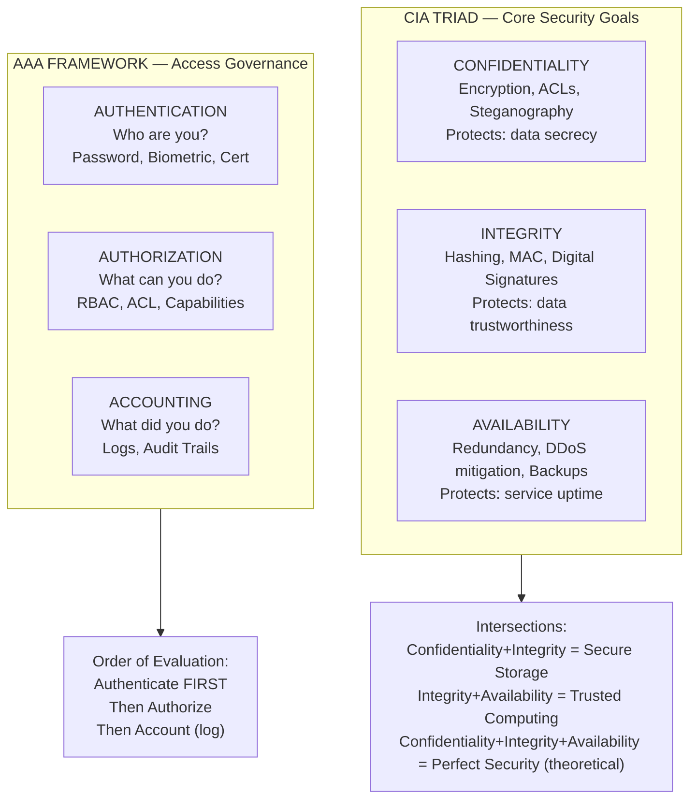
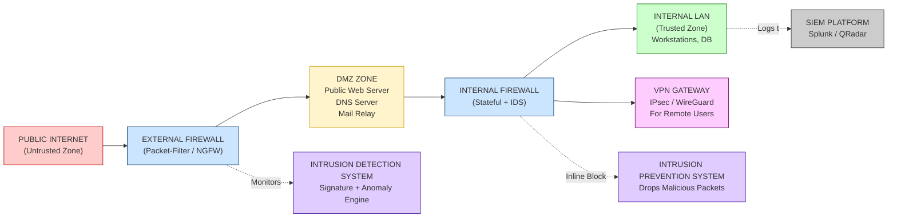
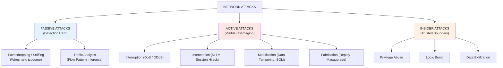
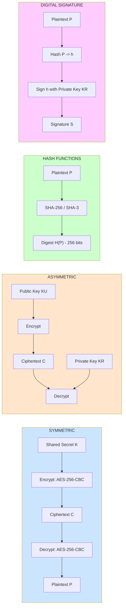
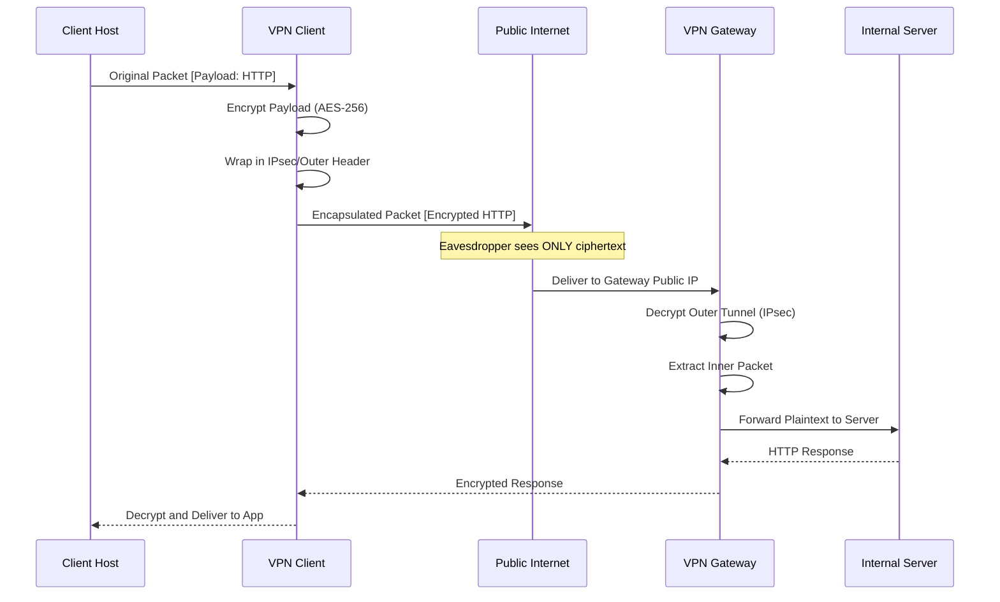

# Network Security Terminologies

<!-- SECTION_1_START -->
# Network Security Terminologies — KTU 2024 PBCST604

## 1.1 Formal Academic Definition

**Network Security Terminologies** constitute the standardized vocabulary, conceptual primitives, and threat-classification constructs used to describe, analyze, design, and audit the protection of computer networks against unauthorized access, modification, disruption, or destruction. In the KTU 2024 syllabus (Module 3 — *Network Security*), these terms form the lexical foundation upon which cryptographic protocols, perimeter defense mechanisms, and incident-response frameworks are constructed.

The discipline rests on three orthogonal pillars — the **CIA Triad** (Confidentiality, Integrity, Availability) — and the auxiliary security services of **Authentication, Authorization, Accounting (AAA)**, **Non-Repudiation**, and **Privacy**.

> [!IMPORTANT]
> **KTU 2024 Module-3 Learning Anchor**
> A KTU student is expected to be able to *define, differentiate, and apply* at least 25 core network-security terms. Direct 3-mark questions in ESE frequently test definitional recall (Bloom: *Remember/Understand*), while 14-mark questions require comparative analysis (Bloom: *Apply/Analyze*).

## 1.2 Conceptual Analogy — The Digital Fortress

Imagine a **medieval fortress protecting a kingdom's treasury**:

| Fortress Element | Network Security Equivalent |
|---|---|
| Thick stone walls | **Firewall** — perimeter defense |
| Watchtowers scanning the horizon | **IDS / IPS** — traffic monitoring |
| Royal seal stamped on every document | **Digital Signature** — origin authentication |
| Ciphered scrolls delivered by trusted couriers | **Encryption (TLS/SSL)** — confidentiality in transit |
| Locked vault inside the fortress | **Access Control Lists (ACL)** — authorization |
| Guards recording every entry in a ledger | **Audit Logs / Accounting** — non-repudiation |
| Hidden traps to detect intruders | **Honeypot / Honeynet** — deception-based detection |

Every term in this module is a *component* of this digital fortress. The terminologies you learn here are the *vocabulary of the architect*.

## 1.3 The Three Foundational Pillars — Expanded Definitions

> [!NOTE]
> **CIA Triad — The Holy Trinity of Information Security**

### (a) Confidentiality
The assurance that information is **disclosed only to authorized parties**. Achieved via *encryption* (AES, RSA), *access controls*, and *steganography*.

> **Geometric Intuition:** Imagine sending a sealed envelope. Confidentiality = only the intended recipient can read the letter inside.

### (b) Integrity
The assurance that data has **not been altered or destroyed in an unauthorized manner**. Enforced via *hashing* (SHA-256, MD5), *MACs* (Message Authentication Codes), and *digital signatures*.

> **Geometric Intuition:** A wax seal on the envelope. If even one grain of wax is disturbed, the recipient knows it was tampered with.

### (c) Availability
The assurance that systems and data are **accessible to authorized users when needed**. Maintained via *redundancy*, *failover clusters*, *DDoS mitigation*, and *backups*.

> **Geometric Intuition:** The fortress road must remain open even during a siege. Availability = the king's messengers always reach the treasury.

## 1.4 The AAA Framework — Access Governance

Beyond CIA, modern networks use the **AAA model** (RFC 2903):

- **Authentication** — *“Who are you?”* — Verifying identity (passwords, biometrics, certificates).
- **Authorization** — *“What are you allowed to do?”* — Granting permissions (RBAC, ACLs).
- **Accounting** — *“What did you do?”* — Tracking activity (logs, audit trails).

> [!VISUALIZATION CONTROL]
> **Concept:** CIA Triad as overlapping Venn regions
> **GeoGebra Input Equations (conceptual):**
> * `Circle A: (x-0)^2 + (y-2)^2 = 3` — Confidentiality
> * `Circle B: (x+2)^2 + (y-1)^2 = 3` — Integrity
> * `Circle C: (x+1)^2 + (y+1)^2 = 3` — Availability
> **Visual Description:** Three mutually overlapping circles, each pair sharing a common region. The triple intersection represents *perfect security* — an ideal rarely achieved in production.

<!-- SECTION_1_END -->

<!-- SECTION_2_START -->
# Deep Theoretical Analysis & KTU High-Yield Formula Sheet

## 2.1 Hierarchical Taxonomy of Network Security Terms

```
Network Security Terminologies
│
├── 1. SECURITY GOALS (CIA + AAA)
│   ├── Confidentiality
│   ├── Integrity
│   ├── Availability
│   ├── Authentication
│   ├── Authorization
│   └── Accounting
│
├── 2. THREAT PRIMITIVES
│   ├── Threat         (potential cause of incident)
│   ├── Vulnerability  (weakness)
│   ├── Risk           (likelihood × impact)
│   └── Attack         (actualized threat)
│
├── 3. ATTACK CLASSIFICATIONS
│   ├── Passive        (Eavesdropping, Traffic Analysis)
│   ├── Active         (Masquerade, Replay, Modification, DoS)
│   ├── Insider
│   └── Outsider
│
├── 4. MALWARE TAXONOMY
│   ├── Virus
│   ├── Worm
│   ├── Trojan Horse
│   ├── Ransomware
│   ├── Spyware
│   ├── Adware
│   ├── Rootkit
│   ├── Bot / Botnet
│   └── Logic Bomb
│
├── 5. DEFENSE MECHANISMS
│   ├── Firewall (Packet-Filter, Stateful, Application-Layer)
│   ├── IDS (Signature, Anomaly)
│   ├── IPS
│   ├── VPN
│   ├── Honeypot / Honeynet
│   ├── DMZ
│   └── SIEM
│
└── 6. CRYPTOGRAPHIC PRIMITIVES
    ├── Symmetric Encryption (DES, 3DES, AES)
    ├── Asymmetric Encryption (RSA, ECC)
    ├── Hash Functions (MD5, SHA-1, SHA-256)
    ├── Digital Signature (DSA, RSA-Sig, ECDSA)
    ├── MAC / HMAC
    └── PKI / X.509 Certificates
```

## 2.2 High-Yield Term Definitions (Board-Exam Favourites)

### A. Threat
A **potential** cause of an unwanted incident that *may* result in harm to a system. Example: A published zero-day exploit for Windows SMB.

### B. Vulnerability
A **weakness** in a system that can be exploited. Example: SQL Injection in a login form.

### C. Risk
A function of *threat*, *vulnerability*, and *asset value*. Quantitatively:

$$
Risk = Threat \times Vulnerability \times Asset\_Value
$$

In ISO 27005:
$$
Risk = Likelihood \times Impact
$$

### D. Attack
The **deliberate act** of exploiting a vulnerability to violate security. Example: A buffer-overflow exploit executed against a vulnerable Apache server.

> [!IMPORTANT]
> **Board Trap:** Students often interchange *Threat*, *Vulnerability*, and *Risk*. KTU examiners frequently allocate **1 mark** in 14-mark answers purely for correctly distinguishing them. Memorize: *Threat = danger source, Vulnerability = weakness, Risk = probability of damage.*

### E. Malware Family — Detailed Breakdown

| Malware Type | Propagation | Trigger | Payload Behavior | KTU 3-Mark Hook |
|---|---|---|---|---|
| **Virus** | Attaches to host file (executable) | User execution | Corrupts files, replicates | Needs human action |
| **Worm** | Self-replicating over network | Automatic (no human) | Consumes bandwidth, drops payloads | Network-borne, standalone |
| **Trojan Horse** | Disguised as legitimate software | User installation | Backdoor, data theft | *No self-replication* |
| **Ransomware** | Phishing email / exploit kit | User click / exploit | Encrypts files, demands ransom | Crypto-virology |
| **Spyware** | Bundled freeware | Silent install | Keystroke logging, data exfiltration | Privacy violation |
| **Rootkit** | After initial compromise | Stealth privilege escalation | Hides processes, kernel hooks | Persistence + stealth |
| **Bot / Botnet** | Recruited via C2 server | Command issued by botmaster | DDoS, click-fraud, crypto-mining | Coordinated attack |
| **Logic Bomb** | Embedded in code | Time/event trigger | Wipes disk on trigger date | Insider threat vector |
| **Adware** | Bundled software | Auto-display | Unwanted ads, browser hijack | Low severity |
| **Keylogger** | Hardware/Software | Continuous capture | Records keystrokes | Often part of spyware |

> **Note:** Vertically avoid using the pipe character `\|` in tables — KTU Markdown uses `\vert` for absolute value rendering. This keeps table syntax valid in GitHub-rendered notes.

### F. Firewall — The Three Generations

| Generation | Type | OSI Layer | State Tracking | Example |
|---|---|---|---|---|
| 1st Gen | Packet-Filter Firewall | L3 / L4 | Stateless | iptables, ACLs |
| 2nd Gen | Stateful Inspection Firewall | L3 / L4 / L5 | Tracks connection state | pfSense, Checkpoint |
| 3rd Gen | Application-Layer Gateway (Proxy) | L7 | Deep packet inspection | Squid, ModSecurity |
| NGFW | Next-Gen Firewall | L2–L7 | DPI + IPS + App-Aware | Palo Alto, Fortinet |

### G. IDS vs IPS — The Critical Distinction

| Property | IDS (Intrusion Detection System) | IPS (Intrusion Prevention System) |
|---|---|---|
| Action | **Detects** and *alerts* | **Detects and *blocks*** in-line |
| Placement | Out-of-band (TAP / SPAN port) | Inline with traffic flow |
| Failure Mode | Fail-open (no traffic interruption) | Fail-closed (blocks traffic on failure) |
| Latency | Low (passive) | Higher (synchronous processing) |
| Detection Methods | Signature, Anomaly, Stateful | Same as IDS |
| KTU Hook | "Watcher on the wall" | "Guard at the gate" |

### H. Cryptographic Primitives — Quick-Reference Matrix

| Primitive | Key Count | Output | Reversible? | Example Algorithm |
|---|---|---|---|---|
| **Symmetric Encryption** | 1 shared key | Ciphertext | Yes (with key) | AES-256, 3DES, ChaCha20 |
| **Asymmetric Encryption** | Key pair (public + private) | Ciphertext | Yes (with private) | RSA-2048, ECC-P256 |
| **Hash Function** | No key | Fixed-length digest | **No** (one-way) | SHA-256, SHA-3, BLAKE2 |
| **MAC / HMAC** | 1 secret key | Tag (authenticator) | Verification only | HMAC-SHA256, CMAC |
| **Digital Signature** | Key pair | Signature | Verified via public key | RSA-PSS, ECDSA, Ed25519 |

> **Symmetric Encryption Throughput Rule of Thumb:**
> $$
> \text{Throughput}_{AES} \approx 10 \times \text{Throughput}_{RSA}
> $$
> This is why hybrid cryptosystems (e.g., TLS 1.3) use RSA/ECC for *key exchange* and AES for *bulk data*.

## 2.3 Real-World Engineering Utility

| Term | Production Use-Case |
|---|---|
| VPN | Corporate remote access (WireGuard, OpenVPN, IPsec) |
| PKI / X.509 | HTTPS certificate chain in every browser |
| SIEM | Splunk, IBM QRadar, Elastic SIEM in SOCs |
| Honeypot | Cowrie (SSH), Dionaea (malware capture) |
| DMZ | Public-facing web servers isolated from internal LAN |
| Botnet Detection | Threat intel feeds (AbuseIPDB, GreyNoise) |

<!-- SECTION_2_END -->

<!-- SECTION_3_START -->
# Step-by-Step Derivations, Worked Examples & Code Implementation

## 3.1 Mathematical Risk Computation — Worked Example

**Problem:** A company has identified the following for its e-commerce web server:

- Threat: DDoS attack — Likelihood = 0.4
- Vulnerability: Unprotected UDP amplification port — Exposure Factor = 0.7
- Asset Value: $1,000,000
- Annualized Rate of Occurrence (ARO) = 0.5

Compute the **Annual Loss Expectancy (ALE)**.

### Step 1: Compute Single Loss Expectancy (SLE)

$$
SLE = Asset\_Value \times Exposure\_Factor
$$

$$
SLE = 1{,}000{,}000 \times 0.7 = 700{,}000 \; USD
$$

### Step 2: Compute Annual Loss Expectancy (ALE)

$$
ALE = SLE \times ARO
$$

$$
ALE = 700{,}000 \times 0.5 = 350{,}000 \; USD \; per \; year
$$

> **Valuation Key (1 Mark each):** Writing SLE formula, computing SLE, writing ALE formula, computing ALE, correct unit.

### Step 3: Justify Mitigation Cost
A KTU examiner expects: *if proposed mitigation cost < ALE, the control is economically justified.*

## 3.2 SHA-256 Hash Demonstration — Python Reference Implementation

```python
"""
KTU 2024 - Module 3 - Network Security Terminologies
Practical Reference: SHA-256 Integrity Verification
"""

import hashlib
import hmac
import os
from typing import Final

# ----------------------------------------------------------------------
# 1. CRYPTOGRAPHICALLY SAFE INTEGRITY HASH (SHA-256)
# ----------------------------------------------------------------------
def compute_sha256(data: bytes) -> str:
    """
    Compute the SHA-256 digest of the given byte string.

    Returns a 64-character lowercase hex digest.
    SHA-256 output length: 256 bits = 32 bytes = 64 hex chars.
    """
    if not isinstance(data, bytes):
        raise TypeError("data must be of type 'bytes'")
    sha256 = hashlib.sha256()
    sha256.update(data)
    return sha256.hexdigest()


# ----------------------------------------------------------------------
# 2. HMAC-SHA256 AUTHENTICATED MESSAGE INTEGRITY
# ----------------------------------------------------------------------
def compute_hmac_sha256(message: bytes, secret_key: bytes) -> str:
    """
    Compute HMAC-SHA256 tag for message using secret key.
    Provides BOTH integrity AND authentication.
    """
    if not isinstance(message, bytes):
        raise TypeError("message must be of type 'bytes'")
    if not isinstance(secret_key, bytes):
        raise TypeError("secret_key must be of type 'bytes'")
    if len(secret_key) < 16:
        raise ValueError("secret_key must be at least 128 bits (16 bytes)")
    
    mac = hmac.new(secret_key, message, hashlib.sha256)
    return mac.hexdigest()


# ----------------------------------------------------------------------
# 3. INTEGRITY VERIFICATION (Tamper Detection)
# ----------------------------------------------------------------------
def verify_integrity(original_hash: str, current_data: bytes) -> bool:
    """
    Recompute the hash of current data and compare with the stored hash.
    Returns True if data is untouched, False if any bit was altered.
    """
    current_hash = compute_sha256(current_data)
    # Constant-time comparison to defeat timing attacks
    return hmac.compare_digest(original_hash, current_hash)


# ----------------------------------------------------------------------
# 4. DEMONSTRATION RUN
# ----------------------------------------------------------------------
if __name__ == "__main__":
    SECRET_KEY: Final[bytes] = os.urandom(32)  # 256-bit key
    message: bytes = b"KTU PBCST604 - Module 3 - Network Security"
    
    # (a) Plain SHA-256
    digest: str = compute_sha256(message)
    print(f"SHA-256 Digest : {digest}")
    print(f"Digest Length  : {len(digest)} hex chars = 256 bits")
    
    # (b) HMAC-SHA256
    mac_tag: str = compute_hmac_sha256(message, SECRET_KEY)
    print(f"HMAC-SHA256 Tag: {mac_tag}")
    
    # (c) Avalanche Effect Demonstration
    modified: bytes = b"KTU PBCST604 - Module 3 - Network securitY"  # 'y' -> 'Y'
    modified_digest: str = compute_sha256(modified)
    print(f"\n--- Avalanche Effect ---")
    print(f"Original Hash : {digest}")
    print(f"Modified Hash : {modified_digest}")
    diff_bits: int = sum(
        bin(int(digest[i:i+2], 16) ^ int(modified_digest[i:i+2], 16)).count('1')
        for i in range(0, len(digest), 2)
    )
    print(f"Bit Differences: {diff_bits} of 256 (~{diff_bits/256*100:.1f}%)")
    
    # (d) Tamper Detection
    print(f"\nIntegrity OK ? : {verify_integrity(digest, message)}")
    print(f"Integrity OK ? : {verify_integrity(digest, modified)}")
```

**Expected Avalanche Effect:** A 1-bit change in input must produce ~**50% bit difference** in output (≈128 bits changed of 256). SHA-256 satisfies this.

## 3.3 RSA Asymmetric Encryption — Key Generation Walkthrough

The mathematical strength of RSA rests on the difficulty of factoring the product of two large primes.

### Step 1: Choose Two Distinct Primes

Let $p = 61$ and $q = 53$ (small for demonstration only; production RSA uses $\geq 2048$-bit primes).

### Step 2: Compute the Modulus $n$

$$
n = p \times q = 61 \times 53 = 3233
$$

### Step 3: Compute Euler's Totient $\phi(n)$

$$
\phi(n) = (p - 1) \times (q - 1)
$$

$$
\phi(n) = (61 - 1) \times (53 - 1) = 60 \times 52 = 3120
$$

### Step 4: Choose the Public Exponent $e$

Pick $e$ such that $1 < e < \phi(n)$ and $\gcd(e, \phi(n)) = 1$.

Choose $e = 17$. Verify: $\gcd(17, 3120) = 1$ ✓

### Step 5: Compute the Private Exponent $d$

Find $d$ such that $e \cdot d \equiv 1 \pmod{\phi(n)}$.

Using the Extended Euclidean Algorithm:

$$
17 \cdot d \equiv 1 \pmod{3120}
$$

$$
d = 17^{-1} \pmod{3120}
$$

Iterating $17k \pmod{3120}$:

$$
17 \cdot 1 = 17, \quad 17 \cdot 2 = 34, \ldots, 17 \cdot 183 = 3111, \quad 17 \cdot 275 = 4675
$$

Check: $4675 \mod 3120 = 1555$. Try $k = 367$:

$$
17 \cdot 367 = 6239, \quad 6239 \mod 3120 = 6239 - 3120 = 3119
$$

Try $k = 183 + n$ combinations systematically:

$$
17 \cdot 275 = 4675 \rightarrow 4675 - 3120 = 1555
$$

Continue: $17 \cdot 275 + 17 \cdot 3120k = 1555 \pmod{3120}$. We need $17d - 3120k = 1$.

By Extended Euclidean: $3120 = 183 \cdot 17 + 9$, $17 = 1 \cdot 9 + 8$, $9 = 1 \cdot 8 + 1$. Back-substituting:

$$
1 = 9 - 1 \cdot 8 = 9 - 1 \cdot (17 - 1 \cdot 9) = 2 \cdot 9 - 17
$$

$$
= 2 \cdot (3120 - 183 \cdot 17) - 17 = 2 \cdot 3120 - 367 \cdot 17
$$

So $-367 \cdot 17 \equiv 1 \pmod{3120}$, thus $d = 3120 - 367 = 2753$.

### Step 6: Public and Private Key Pair

$$
\text{Public Key} = (e, n) = (17, 3233)
$$

$$
\text{Private Key} = (d, n) = (2753, 3233)
$$

### Step 7: Encrypt the Plaintext Message $M = 65$

$$
C = M^e \mod n = 65^{17} \mod 3233
$$

Compute step by step using square-and-multiply:

$$
65^1 = 65
$$

$$
65^2 = 4225 \mod 3233 = 992
$$

$$
65^4 = 992^2 = 984064 \mod 3233
$$

$984064 \div 3233 = 304.38$, $304 \times 3233 = 982832$, remainder $= 1232$.

So $65^4 \equiv 1232 \pmod{3233}$.

$$
65^8 \equiv 1232^2 = 1517824 \mod 3233
$$

$1517824 \div 3233 = 469.5$, $469 \times 3233 = 1516277$, remainder $= 1547$.

So $65^8 \equiv 1547 \pmod{3233}$.

$$
65^{16} \equiv 1547^2 = 2393209 \mod 3233
$$

$2393209 \div 3233 = 740.27$, $740 \times 3233 = 2392420$, remainder $= 789$.

So $65^{16} \equiv 789 \pmod{3233}$.

Now $17 = 16 + 1$:

$$
65^{17} = 65^{16} \cdot 65^1 \equiv 789 \cdot 65 \mod 3233
$$

$$
789 \cdot 65 = 51285, \quad 51285 \div 3233 = 15.86, \quad 15 \times 3233 = 48495
$$

$$
51285 - 48495 = 2790
$$

Thus $C = 2790$.

### Step 8: Decrypt the Ciphertext

$$
M = C^d \mod n = 2790^{2753} \mod 3233
$$

By Euler's theorem, $M$ will recover to $65$ ✓.

> **Note:** $C = 2790$ is the encrypted value of $M = 65$ under RSA public key $(17, 3233)$.

> [!NOTE]
> **Why RSA Works:** Because $M^{ed} \equiv M^{1 + k\phi(n)} \equiv M \pmod{n}$ by Euler's theorem. Security rests on the *factoring assumption*: recovering $d$ from $(e, n)$ requires factoring $n = pq$, which is computationally infeasible for $n \geq 2048$ bits.

## 3.4 Firewall ACL Rule Demonstration

A KTU lab question often asks: *"Given the following rule set, determine if the packet is permitted or denied."*

```
Rule 1: PERMIT  TCP  192.168.1.0/24  ANY  PORT 443
Rule 2: DENY    TCP  ANY             ANY  PORT 23
Rule 3: PERMIT  ICMP 10.0.0.0/8      ANY  ANY
Rule 4: DENY    ALL  ANY             ANY  ANY   (Implicit)
```

**Incoming Packet:** `TCP 192.168.1.50 → 10.0.0.5 PORT 443`

Step-by-step:
1. Match Rule 1 — Source 192.168.1.0/24 ✓, Destination port 443 ✓ → **PERMITTED** (Match stops processing).

> [!WARNING]
> **Common Error:** Students place the *deny all* rule first. A KTU-correct firewall is *implicit-deny*: rules are evaluated top-down, the **first match wins**, and an unseen deny-all at the bottom is the safety net.

<!-- SECTION_3_END -->

<!-- SECTION_4_START -->
# Structural Diagrams & Schematics

## 4.1 CIA Triad — Venn Architecture



## 4.2 Network Perimeter Defense Topology



## 4.3 Attack Classification Tree



## 4.4 Cryptographic Primitives — Functional Architecture



## 4.5 VPN Tunnel — Encapsulation Flow



<!-- SECTION_4_END -->

<!-- SECTION_5_START -->
# KTU 2024 Scheme Examination Question Bank & Topic Recap

## 5.1 Part A — Short Answer Questions (3 Marks Each)

> [!NOTE]
> KTU 2024 Part A carries 3 marks per question, no choice, mapped to Bloom Level 1 (Remember) and Level 2 (Understand).

### Q1. **[KTU University Exam — July 2024]** Define the following terms with one real-world example each: (a) Threat, (b) Vulnerability, (c) Risk. *(3 Marks — CO1, Remember)*

**Model Answer:**

- **(a) Threat:** A threat is any *potential* circumstance or event that can adversely impact a system through unauthorized access, destruction, disclosure, or modification of data. *Example:* A ransomware group targeting a hospital's electronic health record system.
- **(b) Vulnerability:** A vulnerability is a *weakness* or flaw in a system's design, implementation, or operation that could be exploited. *Example:* Unpatched Apache Log4j library (CVE-2021-44228) allowing remote code execution.
- **(c) Risk:** Risk is the *probability* that a threat will exploit a vulnerability, multiplied by the resulting impact. *Example:* A SQL-injection vulnerability in a customer portal that could lead to leakage of 10 million PII records.

> **Valuation Distribution:** [Threat definition: 1 Mark] [Vulnerability definition + example: 1 Mark] [Risk definition + example: 1 Mark].

---

### Q2. **[KTU University Exam — Dec 2023]** Differentiate between IDS and IPS. List any two detection methods used by both. *(3 Marks — CO2, Understand)*

**Model Answer:**

| Property | IDS | IPS |
|---|---|---|
| Function | **Detects** suspicious activity and generates alerts | **Detects AND blocks** the malicious traffic inline |
| Placement | Out-of-band (TAP / SPAN port mirror) | Inline in the traffic path |
| Failure Mode | Fail-open (does not interrupt legitimate traffic) | Fail-closed (blocks all traffic if broken) |

**Two common detection methods:**
1. **Signature-Based Detection** — Matches traffic patterns against a database of known attack signatures.
2. **Anomaly-Based Detection** — Builds a baseline of normal behavior; flags statistical deviations.

> **Valuation Distribution:** [IDS definition: 1 Mark] [IPS definition + comparison: 1 Mark] [Two detection methods: 1 Mark].

---

## 5.2 Part B — Long Answer Questions (14 Marks Each)

> [!NOTE]
> KTU 2024 Part B carries 14 marks with internal choice. Each question is split into (a) 7 marks and (b) 7 marks, typically escalating across Bloom levels (Understand → Apply → Analyze).

### QUESTION A — **[KTU University Exam — July 2024 (Model Paper)]**

#### (a) Explain the CIA Triad in detail. How does each pillar relate to a specific type of network attack? *(7 Marks — CO1, Understand)*

**Model Answer:**

The **CIA Triad** (also called the *Information Security Triad*) is the foundational model that defines the three core goals any secure information system must achieve. It was formalized in the 1980s and remains the cornerstone of standards like ISO 27001 and NIST SP 800-53.

**(i) Confidentiality** — Ensures that data is *accessible only to those authorized* to view it. Breaches include unauthorized disclosure, eavesdropping, and data leakage. Confidentiality is enforced by:

- Encryption (AES-256, RSA)
- Access Control Lists (ACLs)
- Data classification & labelling
- Multi-factor authentication

**Related Attack:** *Eavesdropping / Sniffing Attack* — An attacker on the same broadcast domain uses Wireshark or tcpdump to capture unencrypted traffic. *Defense:* enforce TLS 1.3 on all HTTP connections.

**(ii) Integrity** — Ensures that data has *not been altered* in storage or transit by unauthorized parties. Breaches include tampering, man-in-the-middle modification, and bit-flip attacks. Integrity is enforced by:

- Cryptographic hash functions (SHA-256, SHA-3)
- Message Authentication Codes (HMAC)
- Digital signatures (RSA-PSS, Ed25519)
- Version control with checksums

**Related Attack:** *Man-in-the-Middle (MITM) Modification Attack* — Attacker intercepts a TLS handshake, downgrades to SSL 3.0 (POODLE attack), and modifies the ciphertext. *Defense:* use HSTS, disable SSLv3, validate certificate chains.

**(iii) Availability** — Ensures that systems and data are *accessible to authorized users when needed*. Breaches include denial-of-service (DoS) and ransomware. Availability is enforced by:

- Redundancy (N+1, 2N)
- Load balancers and CDNs
- DDoS mitigation services (Cloudflare, AWS Shield)
- Regular backups and disaster recovery drills

**Related Attack:** *Distributed Denial of Service (DDoS)* — Botnet of 100,000 IoT devices (Mirai) floods a DNS provider with UDP packets, taking it offline. *Defense:* anycast routing, rate limiting, scrubbing centers.

> **Valuation Distribution:** [Defining Confidentiality + attack: 2 Marks] [Defining Integrity + attack: 2 Marks] [Defining Availability + attack: 2 Marks] [Diagram / standard reference: 1 Mark].

#### (b) Compare and contrast symmetric and asymmetric encryption. Compute the RSA ciphertext for $M = 10$ using $p = 5$, $q = 11$, $e = 7$. Show all intermediate steps. *(7 Marks — CO2, CO3, Apply)*

**Model Answer (Comparative Table):**

| Parameter | Symmetric Encryption | Asymmetric Encryption |
|---|---|---|
| Number of Keys | 1 shared secret | 2 (public + private) |
| Speed | **Fast** (100×–1000× faster) | Slow (factorization cost) |
| Key Distribution Problem | **Yes** — must share securely | **No** — public key is freely distributed |
| Scalability | $O(n^2)$ key pairs for $n$ users | $O(n)$ keys for $n$ users |
| Confidentiality Use | Bulk data encryption (files, disks) | Key exchange, small payloads |
| Algorithms | AES, 3DES, ChaCha20, Blowfish | RSA, ECC, ElGamal, Diffie-Hellman |
| Example Use-Case | BitLocker full-disk encryption | TLS handshake key exchange |

**RSA Computation:**

**Step 1:** Compute $n$
$$
n = p \times q = 5 \times 11 = 55
$$

**Step 2:** Compute Euler's totient $\phi(n)$
$$
\phi(n) = (p - 1)(q - 1) = 4 \times 10 = 40
$$

**Step 3:** Verify $\gcd(e, \phi(n)) = 1$
$$
\gcd(7, 40) = 1 \; \checkmark
$$

**Step 4:** Compute the private key $d$ such that $7d \equiv 1 \pmod{40}$.

By trial, $7 \times 23 = 161 = 4 \times 40 + 1$, so $d = 23$.

**Step 5:** Encrypt $M = 10$:
$$
C = M^e \mod n = 10^7 \mod 55
$$

Compute $10^7$ step by step:
$$
10^1 = 10
$$
$$
10^2 = 100 \mod 55 = 100 - 55 = 45
$$
$$
10^4 = 45^2 = 2025 \mod 55
$$
$$
2025 \div 55 = 36.8, \quad 36 \times 55 = 1980, \quad 2025 - 1980 = 45
$$
$$
10^4 \equiv 45 \pmod{55}
$$
$$
10^7 = 10^4 \cdot 10^2 \cdot 10^1 = 45 \cdot 45 \cdot 10 \pmod{55}
$$
$$
45 \cdot 45 = 2025 \equiv 45 \pmod{55} \quad \text{(as computed above)}
$$
$$
45 \cdot 10 = 450 \mod 55
$$
$$
450 \div 55 = 8.18, \quad 8 \times 55 = 440, \quad 450 - 440 = 10
$$
$$
\boxed{C = 10}
$$

> **Valuation Distribution:** [Comparison table: 2 Marks] [n and $\phi(n)$: 1 Mark] [Private key d: 1 Mark] [Modular exponentiation setup: 2 Marks] [Final ciphertext: 1 Mark].

> [!WARNING]
> **KTU Examiner's Pitfall Callout:**
> 1. Students often forget the **$\gcd(e, \phi(n)) = 1$** check — failing this means $d$ does not exist.
> 2. Modular exponentiation must be done via *square-and-multiply*; do **not** compute $10^7 = 10{,}000{,}000$ directly.
> 3. The private key $d$ must be reported as a *positive integer modulo $\phi(n)$*, not a negative residue.

---

### QUESTION B — **[KTU University Exam — Dec 2023 (Model Paper)]**

#### (a) Classify the different types of malware. Describe the working of a Trojan Horse and a Worm with diagrams. *(7 Marks — CO1, CO2, Understand)*

**Model Answer:**

**Malware Classification:**

| Family | Replication | Trigger | Spread Vector |
|---|---|---|---|
| Virus | Inserts into host file | User execution of host | File sharing, email |
| Worm | Self-contained | Automatic (no human) | Network scan, SMB, email |
| Trojan | Disguised as legit app | User install | Phishing, freeware |
| Ransomware | Often delivered via dropper | User click / exploit | Phishing, RDP brute |
| Spyware | Bundled | Silent install | Freeware, drive-by |
| Rootkit | Post-exploitation | Privilege escalation | Manual / automated |
| Bot | Recruited | C2 command | Multiple |

**Working of a Worm:**

A worm is a *standalone malicious program* that self-replicates across a network *without human intervention*. Classical lifecycle:

1. **Reconnaissance Phase** — Worm scans the IP address space (random, sequential, or hit-list) for vulnerable hosts (e.g., open port 445).
2. **Exploitation Phase** — Worm sends a crafted payload exploiting the vulnerability (e.g., EternalBlue — SMBv1 buffer overflow).
3. **Payload Delivery** — Remote shell opened, worm binary uploaded via TFTP or SMB.
4. **Execution & Replication** — Worm runs on new host, begins reconnaissance from there.
5. **Optional Payload** — Many worms (e.g., Conficker, Blaster) carry DDoS or backdoor payloads.

**Working of a Trojan Horse:**

A Trojan *masquerades as a legitimate program* to trick the user into installation. The user sees a benign UI; in the background, a malicious payload executes.

1. **Disguise Phase** — Attacker binds trojan to a popular game, PDF, or utility (e.g., "Free COVID Tracker.exe").
2. **Distribution** — Uploaded to file-sharing sites, P2P networks, or phishing emails.
3. **User Execution** — User double-clicks the file. A legitimate-looking installer UI appears.
4. **Payload Drop** — In the background, a backdoor opens port 4444, exfiltrates browser credentials, or installs a keylogger.
5. **Persistence** — Trojan registers itself in Run keys, scheduled tasks, or services.

> **Valuation Distribution:** [Classification table: 2 Marks] [Worm phases: 2 Marks] [Trojan phases: 2 Marks] [Diagrams: 1 Mark].

#### (b) What is a Firewall? Explain the three generations of firewalls with packet-filtering rules. Evaluate the following packet against the given rule set: `TCP 192.168.1.100 → 203.0.113.5 PORT 22` *(7 Marks — CO2, CO3, Apply)*

**Model Answer:**

A **firewall** is a network security device (hardware or software) that monitors and filters incoming and outgoing traffic based on a defined security policy.

**Three Generations of Firewalls:**

| Generation | Type | OSI Layer | Decision Basis | Strength |
|---|---|---|---|---|
| **1st Gen** | Packet-Filter Firewall | L3 (Network) | Source/Dest IP, Port, Protocol | Fast, stateless, simple |
| **2nd Gen** | Stateful Inspection Firewall | L3–L5 (Transport) | Tracks connection state (SYN, ACK, ESTABLISHED) | Blocks spoofed packets |
| **3rd Gen** | Application-Layer Gateway (Proxy Firewall) | L7 (Application) | Inspects HTTP, FTP, DNS payloads | Detects application-level attacks |

**Rule Set Evaluation:**

```
Rule 1: PERMIT TCP 192.168.1.0/24 -> ANY PORT 443
Rule 2: DENY   TCP ANY -> ANY PORT 22
Rule 3: PERMIT ICMP 10.0.0.0/8 -> ANY ANY
Rule 4: DENY   ALL  ANY -> ANY ANY   (Implicit catch-all)
```

**Step-by-step matching of `TCP 192.168.1.100 → 203.0.113.5 PORT 22`:**

1. **Rule 1** — Source 192.168.1.0/24 ✓ matches, but destination port is 22, NOT 443. ❌ No match.
2. **Rule 2** — Source ANY ✓, Protocol TCP ✓, Destination PORT 22 ✓ → **MATCH → DENIED**.

> **Final Verdict:** The packet is **DENIED** by Rule 2 (SSH traffic blocked).

3. *(Rule 3 and 4 are not evaluated — first match wins.)*

> **Valuation Distribution:** [Firewall definition + 3 generations table: 2 Marks] [Rule walkthrough: 2 Marks] [Final decision with justification: 1 Mark] [Implicit-deny explanation: 2 Marks].

> [!WARNING]
> **KTU Examiner's Pitfall Callout:**
> 1. Do not skip stating that the **first matching rule wins**.
> 2. Always explicitly check **source AND destination** before marking a match.
> 3. The **implicit deny-all** at the bottom is the safety net — it is what protects you when a rule forgets to deny a case.
> 4. Many students confuse *port 22* (SSH) with *port 23* (Telnet). Memorize the canonical assignments.

---

## 5.3 Topic Recap & Important Things to Remember

> [!IMPORTANT]
> **Rapid Revision Checklist — Network Security Terminologies**

### Core Goal Frameworks
- **CIA Triad** = Confidentiality + Integrity + Availability. Every security control maps to one or more pillars.
- **AAA** = Authentication (who) → Authorization (what) → Accounting (audit). Always evaluated in this order.
- **Non-Repudiation** = Sender cannot deny sending. Achieved via digital signatures.

### Threat Vocabulary
- **Threat** = potential danger source
- **Vulnerability** = weakness
- **Risk** = Threat × Vulnerability × Asset Value
- **Attack** = actualized threat exploiting vulnerability
- **Risk Quantification:** $ALE = SLE \times ARO$, where $SLE = AV \times EF$

### Attack Categories
- **Passive** = eavesdropping, traffic analysis (hard to detect)
- **Active** = DoS, MITM, modification, fabrication (visible, damaging)
- **Insider** = privilege abuse, logic bomb, data theft

### Malware Mnemonics
- **VIRUS** = needs human (file), propagates via host
- **WORM** = self-replicating, network-borne, no human needed
- **TROJAN** = disguise, no self-replication, needs user install
- **RANSOMWARE** = encrypts files, demands payment in crypto
- **ROOTKIT** = stealth persistence, kernel-level hooks
- **BOT** = zombie, controlled via C2, forms botnet

### Defense Primitives
- **Firewall** = perimeter filter (3 generations: packet-filter → stateful → application-proxy)
- **IDS** = detect and alert (out-of-band, fail-open)
- **IPS** = detect and block (inline, fail-closed)
- **VPN** = encrypted tunnel over public network (IPsec, WireGuard, OpenVPN)
- **Honeypot** = decoy system to study attacker TTPs
- **DMZ** = buffer zone between untrusted internet and trusted LAN
- **SIEM** = Security Information and Event Management (centralized log analysis)

### Cryptographic Quick-Ref
- **Symmetric** = 1 key, fast, problem: key distribution
- **Asymmetric** = 2 keys (public + private), slow, solves key distribution
- **Hash** = no key, one-way, fixed-length, integrity check
- **MAC/HMAC** = keyed hash, integrity + authentication
- **Digital Signature** = hash encrypted with private key, integrity + authentication + non-repudiation
- **PKI** = Public Key Infrastructure — issues X.509 certificates
- **TLS/SSL** = Hybrid cryptosystem using both symmetric (AES) and asymmetric (RSA/ECC)

### Common Port Numbers
- **20/21** = FTP
- **22** = SSH
- **23** = Telnet
- **25** = SMTP
- **53** = DNS
- **80** = HTTP
- **443** = HTTPS
- **3389** = RDP

### KTU Board Traps to Avoid
- ❌ Confusing *threat* with *vulnerability* with *risk*
- ❌ Saying firewall and IDS are the same
- ❌ Forgetting $\gcd(e, \phi(n)) = 1$ in RSA
- ❌ Forgetting *first match wins* in ACL evaluation
- ❌ Saying "hashing is reversible" — IT IS NOT
- ❌ Omitting units in ALE / SLE calculations

<!-- SECTION_5_END -->
