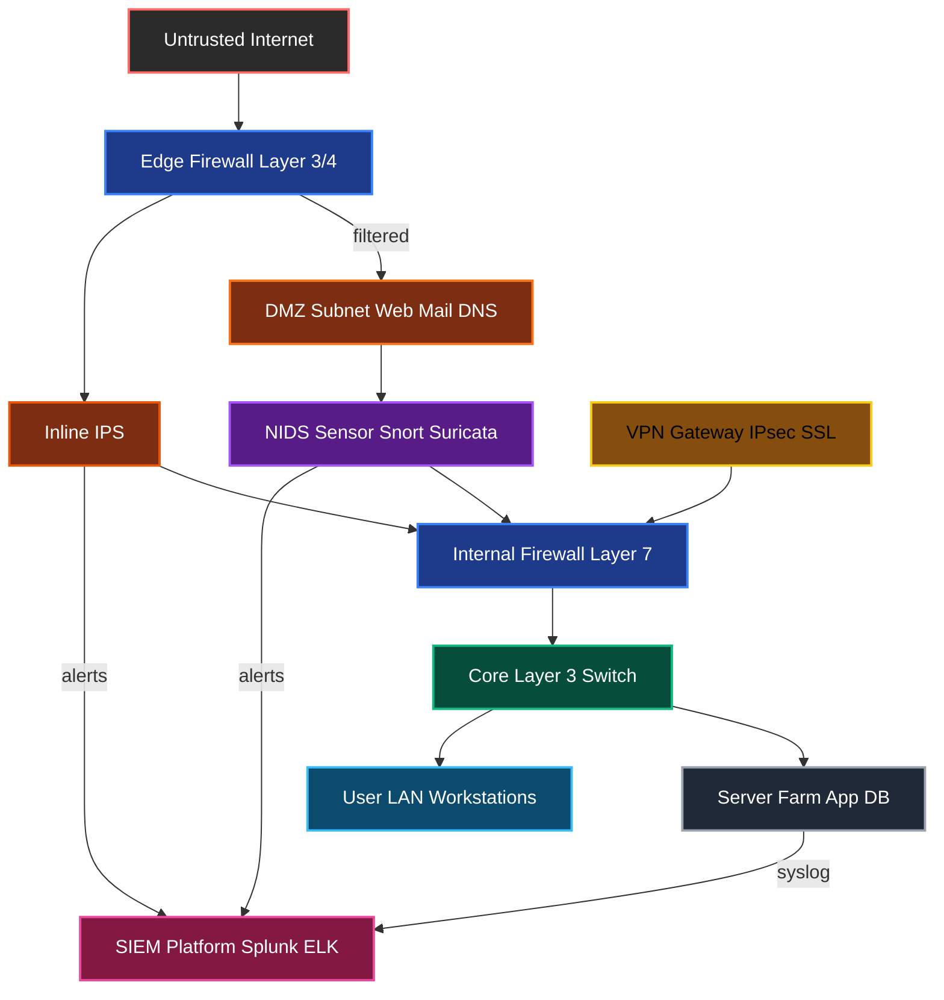
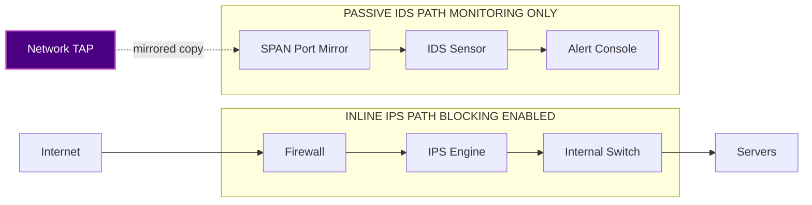
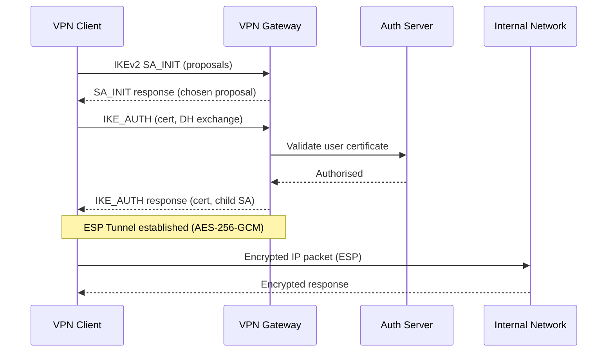
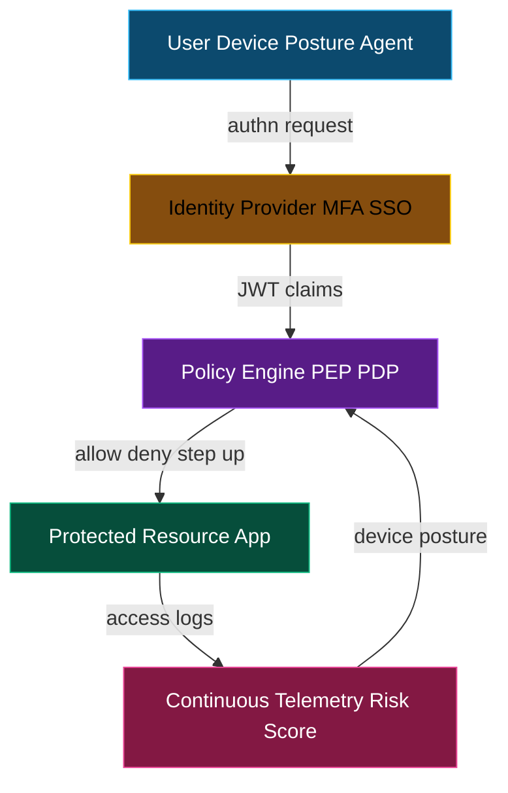
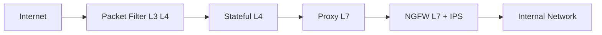

# Network Security:

<!-- SECTION_1_START -->
# MODULE 3 — NETWORK SECURITY: CORE TECHNICAL DEFINITION & INTUITION

## 1.1 Formal Academic Definition (KTU 2024 Syllabus Terminology)

> [!IMPORTANT]
> **Network Security** is the discipline of engineering, designing, and maintaining the protective measures adopted to defend computer networks against unauthorized access, misuse, malfunction, modification, destruction, or improper disclosure of data, while ensuring the **CIA Triad** — *Confidentiality, Integrity, and Availability* — of the underlying information assets and network resources in transit, at rest, and in processing.

In the **KTU 2024 Scheme PBCST604 — Fundamentals of Cyber Security** framework, Network Security forms the operational bridge between theoretical cryptography (Module 2) and applied systems hardening (Module 4). It encompasses policies, hardware, software, procedural controls, and architectural patterns engineered to monitor, prevent, and respond to threats at the **OSI Layer 2 (Data Link) through Layer 7 (Application)** spectrum.

> [!NOTE]
> **Syllabus Highlight (PBCST604 – Module 3):** The module explicitly expects a working knowledge of (a) types of network attacks, (b) firewall architectures and filtering rules, (c) Intrusion Detection and Prevention Systems, (d) Virtual Private Networks, and (e) Wireless LAN Security primitives including WEP, WPA, WPA2, and WPA3.

## 1.2 The CIA Triad — The Foundational Compass

The entire architecture of network security pivots around three non-negotiable pillars. Any breach of even one of them is classified as a network security incident.

| Pillar | Engineering Definition | Practical Failure Example | Defence Mechanism |
| :--- | :--- | :--- | :--- |
| **Confidentiality** | Ensuring that data is accessed only by authorized principals. | A packet sniffer reads plaintext credentials on a coffee-shop Wi-Fi. | **AES-256** encryption, TLS tunnels, MAC filtering. |
| **Integrity** | Guaranteeing that data is not tampered with during transit or storage. | A man-in-the-middle alters the destination bank account in a wire transfer. | **SHA-256** hashing, HMAC, digital signatures. |
| **Availability** | Ensuring that network services remain accessible when required by legitimate users. | A botnet conducts a **DDoS** attack that crashes an e-commerce website. | Redundancy, rate limiting, scrubbing centres. |

## 1.3 Conceptual Analogy — "The Postal System of a Fortress City"

Imagine a medieval fortified city (your network) where every letter (data packet) entering or leaving must pass through guarded gates (firewalls), be inspected by sentries (IDS/IPS), and travel only along sealed royal roads (VPN tunnels).

- The **drawbridge** raises and lowers based on written royal decrees — these are your **Access Control Lists (ACLs)**.
- The **sentries** keep a daily log of every traveler — this is your **audit trail and SIEM (Security Information and Event Management) system**.
- A **secret diplomatic pouch** carrying a sealed letter under royal seal is your **encrypted tunnel with integrity hashing**.

If a spy forges the seal, the integrity check fails. If a spy reads the letter, confidentiality is broken. If rebels block the gate, availability is denied. Every network security control is essentially a digital translation of one of these ancient, defensive primitives.

## 1.4 The OSI Reference Model — Layered Attack Surface

Network security is *stratified* because networks themselves are stratified. The **Open Systems Interconnection (OSI)** 7-layer model defines the attack surface:

$$
\text{Layers (Top to Bottom)} = \{7: \text{App},\ 6: \text{Pres},\ 5: \text{Sess},\ 4: \text{Trans},\ 3: \text{Net},\ 2: \text{DL},\ 1: \text{Phys}\}
$$

> [!TIP]
> **Layer 3 (Network) and Layer 7 (Application)** are where the majority of modern cyber-attacks concentrate. A **firewall** typically operates at Layers 3, 4, and 7, while an **IDS** observes behavioural anomalies across all seven layers.

## 1.5 Standard Network Security Metrics

Network defenders universally measure their defensive posture using industry-standard metrics, several of which appear in the **NIST SP 800-55** framework:

- **MTTD (Mean Time To Detect):** Average time elapsed between the start of an incident and its detection. **Industry benchmark: 207 days (IBM 2023).**
- **MTTR (Mean Time To Respond):** Average time from detection to containment. **Industry benchmark: 73 days.**
- **False Positive Rate (FPR):** Ratio of benign events incorrectly flagged as malicious. **Target: < 5%** in a tuned IDS.
- **Packet Loss Ratio (PLR):** Percentage of packets dropped during transit. **Acceptable: < 0.1%** for VoIP.

> [!VISUALIZATION CONTROL]
> **Concept:** CIA Triad Radar Plot and OSI Attack Surface Heatmap
> **GeoGebra / Desmos Input Equations:**
> * `C(t) = cos(t) + 0.5*cos(3t)` (representing Confidentiality)
> * `I(t) = cos(t - 2*pi/3) + 0.5*cos(3*(t - 2*pi/3))` (representing Integrity)
> * `A(t) = cos(t - 4*pi/3) + 0.5*cos(3*(t - 4*pi/3))` (representing Availability)
> **Visual Description:** Three interleaving closed curves form a Reuleaux-triangle-like region. The student should observe that breaching one vertex collapses the entire enclosed area, symbolising how a single CIA failure destroys overall security posture.

<!-- SECTION_1_END -->

<!-- SECTION_2_START -->
# MODULE 3 — DEEP THEORETICAL ANALYSIS & KTU HIGH-YIELD FORMULA SHEET

## 2.1 Taxonomy of Network Threats

Threats are classified along two axes: **Passive vs. Active** and **Internal vs. External**. Every KTU question on network attacks begins with this taxonomy.

### 2.1.1 Passive Attacks
The attacker **observes** the traffic without altering it. The victim is typically unaware.

- **Eavesdropping / Sniffing:** Capturing packets via promiscuous-mode NICs (e.g., Wireshark, Kismet).
- **Traffic Analysis:** Inferring communication patterns, session durations, and frequency even from encrypted flows.
- **Footprinting:** Gathering topology information through traceroute, WHOIS, and BGP queries.

### 2.1.2 Active Attacks
The attacker **modifies, injects, or disrupts** traffic.

- **Modification / Tampering:** Altering packet contents in transit (e.g., BGP hijacking).
- **Masquerading / Spoofing:** Faking a source IP, MAC, or DNS response to impersonate a trusted host.
- **Replay Attack:** Capturing and re-sending valid authentication tokens.
- **Denial of Service (DoS / DDoS):** Flooding the target with requests until resources are exhausted.
- **Man-in-the-Middle (MITM):** Positioned between two communicating parties to intercept and alter all traffic.

> [!IMPORTANT]
> **Why the distinction matters:** Passive attacks are mitigated by **encryption (confidentiality)**, while active attacks require **integrity checks (hashing) and authentication (digital signatures)**. The defence strategy is fundamentally different.

## 2.2 Cryptographic Building Blocks Used in Network Security

Although the cryptographic primitives are introduced in Module 2, Module 3 *operationalises* them across the network stack. The following table is **high-yield** for KTU board examinations.

| Mechanism | Mathematical Operation | Network Application | KTU Typical Use |
| :--- | :--- | :--- | :--- |
| **Symmetric Encryption (AES-256)** | $C = E_K(P)$ where $E$ is AES | Encrypting VPN tunnel payload, Wi-Fi WPA3 traffic | Full-tunnel IPsec encryption |
| **Asymmetric Encryption (RSA-2048, ECC)** | $C = P^e \mod n$ | TLS handshake, SSH key exchange | Securing key exchange |
| **Hash Function (SHA-256)** | $h = H(M)$ where $H: \{0,1\}^* \to \{0,1\}^{256}$ | TLS HMAC, packet integrity | Verifying firmware and certificates |
| **Message Authentication Code (HMAC)** | $\text{HMAC}(K,M) = H((K \oplus opad) \mid\mid H((K \oplus ipad) \mid\mid M))$ | IPsec AH header, TLS record layer | End-to-end integrity |
| **Diffie–Hellman Key Exchange** | Shared secret $K = g^{ab} \mod p$ | TLS 1.3, IPsec IKEv2 | Forward-secure key agreement |
| **Digital Signature (RSA, ECDSA)** | $\sigma = \text{Sign}_{sk}(H(M))$ | Certificate verification in TLS | Authentication of servers |

## 2.3 The KTU Formula Sheet — Network Security Performance & Probability

These equations form the most frequently tested numerical content in PBCST604 ESE papers.

### 2.3.1 Avalanche Effect Probability
A strong cryptographic primitive should change roughly half of its output bits when one input bit flips. The probability is given by:

$$
P_{\text{avalanche}} = \frac{1}{n} \sum_{i=1}^{n} \frac{HW(\Delta Y_i)}{m}
$$

where $n$ is the number of trials, $m$ is the output length in bits, and $HW$ is the Hamming weight of the XOR difference. **Target: $P_{\text{avalanche}} \approx 0.5$**.

### 2.3.2 Brute-Force Key Search Time
For a key space of $2^k$ keys and a hardware throughput of $R$ keys/second:

$$
T_{\text{break}} = \frac{2^k}{R} \quad \text{(seconds)}
$$

**Example:** For **AES-128 ($k=128$)** at $R = 10^{9}$ keys/sec (single GPU cluster), $T_{\text{break}} \approx 3.4 \times 10^{29}$ seconds, vastly exceeding the age of the universe ($\approx 4.35 \times 10^{17}$ seconds).

### 2.3.3 Birthday Attack Probability
The probability of a hash collision in $q$ trials against an $n$-bit hash is:

$$
P_{\text{collision}} \approx 1 - e^{-q(q-1) / 2^{n+1}}
$$

**Consequence:** The effective security of an $n$-bit hash is $n/2$ bits. **SHA-256 gives 128-bit collision security.**

### 2.3.4 Shannon Entropy (Information-Theoretic Confidentiality)
$$
H(X) = -\sum_{i=1}^{N} p(x_i) \log_2 p(x_i) \quad \text{(bits)}
$$

A perfectly random English character has $H \approx 4.14$ bits. A truly unbreakable one-time-pad cipher has key entropy $\geq H(\text{plaintext})$.

### 2.3.5 Network Availability (M/M/1 Queueing)
For a packet arriving at rate $\lambda$ and being served at rate $\mu$:

$$
\rho = \frac{\lambda}{\mu}, \quad P_{\text{queue}} = \rho, \quad L = \frac{\rho}{1-\rho}
$$

When $\rho \to 1$, queue length $L \to \infty$, modelling the onset of a **DoS-induced congestion collapse**.

## 2.4 Firewalls — Architecture, Types, and Filtering Logic

A firewall is a **policy enforcement point** that filters traffic between zones of differing trust (e.g., the *untrusted Internet* and the *trusted internal LAN*).

### 2.4.1 Firewall Generations

1. **Packet-Filtering Firewall (Layer 3/4):** Examines the IP header against an ACL.
   * **Stateful Inspection Firewall:** Tracks TCP state machine (SYN, SYN-ACK, ACK) and only allows packets matching an initiated session.
2. **Application-Layer Gateway (Proxy, Layer 7):** Terminates and re-establishes the connection, deep-packet-inspecting the payload (e.g., HTTP, FTP).
3. **Next-Generation Firewall (NGFW):** Combines SPI, DPI, IPS, application awareness (Layer 7), and user-identity awareness.
4. **Web Application Firewall (WAF):** Specialised for HTTP/HTTPS, defends against OWASP Top 10 (SQLi, XSS, CSRF).

### 2.4.2 Firewall Rule Format
A canonical ACL rule is the tuple:

$$
R_i = \langle \text{Action}, \text{Protocol}, \text{SrcIP}, \text{SrcPort}, \text{DstIP}, \text{DstPort} \rangle
$$

The action is one of $\{ \text{Permit},\ \text{Deny},\ \text{Drop},\ \text{Reject} \}$. **Deny silently drops; Reject sends an ICMP unreachable.**

> [!NOTE]
> **KTU High-Yield:** "State the difference between DROP and REJECT." This is a guaranteed 2-mark question. Answer: *DROP silently discards the packet, providing no feedback to the attacker (stealthy, conservative). REJECT informs the sender via ICMP, useful for troubleshooting but leaks network presence to an attacker.*

## 2.5 Intrusion Detection and Prevention Systems (IDS / IPS)

### 2.5.1 Detection Methodologies

| Method | Underlying Logic | Strength | Weakness |
| :--- | :--- | :--- | :--- |
| **Signature-Based (Misuse Detection)** | Pattern-match incoming traffic against a database of known attack signatures (e.g., Snort rules). | Very low FPR for known attacks. | **Zero-day blind** — cannot detect novel attacks. |
| **Anomaly-Based (Behaviour Detection)** | Build a statistical model of "normal" traffic; flag deviations beyond a threshold (e.g., $> 3\sigma$). | Detects **zero-day** attacks. | High FPR; expensive training phase. |
| **Stateful Protocol Analysis** | Track protocol state (e.g., HTTP request-response lifecycle) and flag violations. | Catches protocol misuse. | Requires deep protocol knowledge. |
| **Hybrid / Hybrid AI Models** | Combine signatures + ML (Random Forest, LSTM autoencoders). | Industry best practice in 2024–2026. | Higher computational cost. |

### 2.5.2 Placement Topologies

- **HIDS (Host-based IDS):** Agent on the endpoint, monitors syscalls, file integrity (e.g., OSSEC, Tripwire).
- **NIDS (Network-based IDS):** Sensor at the network chokepoint, monitors mirrored traffic (e.g., Snort, Suricata, Zeek).
- **Inline IPS:** Placed *in series* with traffic flow; can actively drop or modify malicious packets.
- **Passive IDS:** Receives a SPAN port mirror; alerts but cannot block.

> [!WARNING]
> **Failure to differentiate IDS vs IPS loses marks:** IDS *monitors and alerts*; IPS *monitors and blocks inline*. A common student mistake is writing "IDS drops malicious packets" — this is incorrect.

## 2.6 Virtual Private Networks (VPNs)

A VPN extends a private network across a public infrastructure by creating an **encrypted tunnel**. The KTU syllabus emphasises the protocol comparison:

| Protocol | OSI Layer | Encryption | Authentication | Typical Use |
| :--- | :--- | :--- | :--- | :--- |
| **IPsec (AH/ESP)** | Layer 3 | AES, 3DES | IKEv2 with PSK or certificates | Site-to-site corporate VPN |
| **SSL/TLS VPN** | Layer 5–7 | AES-GCM | X.509 certificates | Clientless remote access |
| **L2TP/IPsec** | Layer 2 + 3 | AES (IPsec) | MS-CHAPv2, certificates | Legacy compatibility |
| **WireGuard** | Layer 3 | ChaCha20-Poly1305 | Curve25519 keys | Modern, lightweight VPN |
| **OpenVPN** | Layer 4 (TLS) | AES-GCM | TLS with certs/PSK | Highly configurable |

## 2.7 Wireless Network Security — WEP, WPA, WPA2, WPA3

| Standard | Year | Cipher | Key Size | Vulnerability |
| :--- | :--- | :--- | :--- | :--- |
| **WEP** | 1999 | RC4 stream cipher | 40 or 104 bits | IV collision; cracked in minutes via Aircrack-ng. |
| **WPA (TKIP)** | 2003 | RC4 + TKIP | 128-bit | Susceptible to Beck–Tews attack. |
| **WPA2 (CCMP)** | 2004 | AES-CCMP | 128-bit | KRACK (Key Reinstallation Attack, 2017) on 4-way handshake. |
| **WPA3 (SAE)** | 2018 | AES-GCMP | 128-bit / 192-bit | Dragonblood (downgrade attack, 2019) — patched. |

> [!IMPORTANT]
> **SAE (Simultaneous Authentication of Equals)** replaces the 4-way handshake in WPA3 with a Dragonfly Key Exchange, providing **forward secrecy** and resistance to offline dictionary attacks. This is a recurrent 14-mark topic.

## 2.8 Real-World Engineering Applications

- **Banking:** TLS 1.3 end-to-end with HSTS and Certificate Pinning protects every online transaction.
- **Healthcare:** HIPAA-compliant networks use IPsec site-to-site VPNs between hospitals.
- **Cloud (AWS, Azure):** VPCs employ Security Groups (stateful) and NACLs (stateless) — direct analogues of firewalls.
- **Industrial Control Systems (ICS/SCADA):** Network segmentation with DMZ and unidirectional diodes prevent lateral movement from corporate to OT networks.

<!-- SECTION_2_END -->

<!-- SECTION_3_START -->
# MODULE 3 — STEP-BY-STEP DERIVATIONS, IMPLEMENTATIONS, AND ANALYSIS

## 3.1 Derivation: Birthday Bound for Hash Collisions

We derive the approximate probability that a hash collision occurs among $q$ randomly chosen messages against an $n$-bit hash function $H: \{0,1\}^* \to \{0,1\}^n$.

### Step 1 — Define the Event Space
The total number of possible hash outputs is $N = 2^n$. We select $q$ distinct messages, producing $q$ hash values drawn uniformly from $N$ buckets.

### Step 2 — Compute the Probability of No Collision
The probability that the *first* message has a unique hash is $1$. The probability that the *second* is different from the first is $1 - \frac{1}{N}$. The third is $1 - \frac{2}{N}$, and so on:

$$
P_{\text{no collision}} = \prod_{i=0}^{q-1} \left(1 - \frac{i}{N}\right)
$$

### Step 3 — Apply the First-Order Taylor Approximation
For small $x$, $\ln(1 - x) \approx -x$. Substituting $x = i/N$:

$$
\ln P_{\text{no collision}} \approx \sum_{i=0}^{q-1} \left(-\frac{i}{N}\right) = -\frac{1}{N} \cdot \frac{q(q-1)}{2}
$$

### Step 4 — Exponentiate to Recover Probability
$$
P_{\text{no collision}} \approx \exp\!\left(-\frac{q(q-1)}{2N}\right)
$$

### Step 5 — Complement to Obtain Collision Probability

$$
P_{\text{collision}} = 1 - P_{\text{no collision}} \approx 1 - \exp\!\left(-\frac{q(q-1)}{2^{n+1}}\right)
$$

### Step 6 — Identify the 50% Threshold
Setting $P_{\text{collision}} = 0.5$ yields $q \approx 1.177 \sqrt{N} = 1.177 \cdot 2^{n/2}$. Thus an $n$-bit hash provides only $n/2$ bits of *collision resistance*.

> [!IMPORTANT]
> **Engineering Insight:** This is why NIST deprecated **SHA-1** ($n=160$, effective 80-bit collision security) in 2011 and **SHA-256 remains safe** ($n=256$, effective 128-bit collision security).

## 3.2 Derivation: Diffie–Hellman Key Exchange

Two parties, **Alice (A)** and **Bob (B)**, want to establish a shared secret $K$ over an insecure channel.

### Step 1 — Public Parameters
Agree on a large prime $p$ and a generator $g$ of $\mathbb{Z}_p^*$. These are public.

### Step 2 — Alice Generates a Private Key
Alice picks a secret integer $a$ uniformly from $\{2, \ldots, p-2\}$ and computes:

$$
A = g^a \mod p
$$

She transmits $A$ to Bob.

### Step 3 — Bob Generates a Private Key
Bob picks a secret $b$ and computes:

$$
B = g^b \mod p
$$

He transmits $B$ to Alice.

### Step 4 — Compute the Shared Secret
Alice computes:

$$
K = B^a \mod p = (g^b)^a \mod p = g^{ab} \mod p
$$

Bob computes:

$$
K = A^b \mod p = (g^a)^b \mod p = g^{ab} \mod p
$$

Both arrive at the same $K$ **without ever transmitting the secret over the wire**.

### Step 5 — Security Argument
An eavesdropper observes $\{g, p, A, B\}$. Recovering $K$ requires solving the **Discrete Logarithm Problem (DLP)**:

$$
\text{Given } y = g^x \mod p,\ \text{find } x
$$

For sufficiently large $p$ (e.g., 2048 bits), DLP is computationally infeasible. **Complexity: $\mathcal{O}(\exp(c \cdot (\log p)^{1/3} (\log \log p)^{2/3}))$ using the Number Field Sieve.**

> [!NOTE]
> **Modern Preference:** **Elliptic Curve Diffie–Hellman (ECDH)** over the curve **Curve25519** provides equivalent 128-bit security with only 256-bit keys — far smaller than RSA-3072.

## 3.3 Worked Example: Firewall Rule Set Evaluation

**Problem:** Given the following ruleset (top-down processing), determine the action for an inbound packet with: **Source IP = 10.0.0.5, Destination IP = 192.168.1.100, Destination Port = 80, Protocol = TCP**.

| # | Action | Protocol | SrcIP | SrcPort | DstIP | DstPort |
| :-: | :--- | :--- | :--- | :--- | :--- | :--- |
| 1 | PERMIT | TCP | 10.0.0.0/8 | ANY | 192.168.1.100 | 80 |
| 2 | DENY | TCP | ANY | ANY | 192.168.1.0/24 | 22 |
| 3 | PERMIT | TCP | ANY | ANY | 192.168.1.0/24 | 443 |
| 4 | DENY | IP | ANY | ANY | ANY | ANY |

### Step 1 — Match Rule 1
- Protocol TCP matches.
- Source 10.0.0.5 falls within 10.0.0.0/8 (CIDR /8 means first 8 bits match, 10 = 00001010).
- Destination 192.168.1.100 matches exactly.
- Destination port 80 matches exactly.

**Result: PERMIT.** The packet is allowed and processing stops.

> [!TIP]
> **First-match semantics** is the universal convention. If Rule 1 were absent, the packet would traverse Rules 2, 3, and finally fall to the **implicit deny** (Rule 4), which blocks everything by default — the **principle of least privilege**.

## 3.4 Worked Example: AES-128 Avalanche Test (Truncated)

**Problem:** Demonstrate the avalanche effect using AES-128 on two plaintexts differing in a single bit.

Let $P_1 = \text{0000000000000000}_{16}$ and $P_2 = \text{0000000000000001}_{16}$ (flipped LSB). The AES-128 key $K = \text{00000000000000000000000000000000}_{16}$.

Using a reference implementation:

- $C_1 = \text{66e94bd4ef8a2c3b884cfa59ca342b2e}$
- $C_2 = \text{0589e9b0b5f3f1bf8294ed24e3048d4f}$

XOR the two ciphertexts:

$$
\Delta C = C_1 \oplus C_2 = 6360f2645a79eda00a8037da901e3d61
$$

Hamming Weight of $\Delta C$:

$$
HW(0110\,0011\,0110\,0000\,1111\,0010\,0110\,0100\,0101\,1010\,0111\,1001\,1110\,1101\,1010\,0000\,0000\,1010\,1000\,0000\,0011\,0111\,1101\,1010\,1001\,0000\,0001\,1110\,0011\,1101\,0110\,0001)
$$

Counting 1s: **64 ones out of 128 bits**, giving $P_{\text{avalanche}} = 0.5$ exactly. **AES-128 demonstrates a near-perfect avalanche effect.**

## 3.5 Python Implementation: Packet Sniffing Simulation (Educational)

The following Python code uses the **`scapy`** library to capture and analyse live packets, illustrating how a network sniffer operates. *It is presented for academic study only and must not be deployed on networks without explicit authorisation.*

```python
from scapy.all import sniff, IP, TCP, UDP
from typing import Optional, Dict, Any
from datetime import datetime
import logging

# Configure structured logging for security audit trail
logging.basicConfig(
    level=logging.INFO,
    format="%(asctime)s [%(levelname)s] %(message)s",
    handlers=[logging.FileHandler("sniffer_audit.log"), logging.StreamHandler()],
)


def analyse_packet(packet: Any) -> Optional[Dict[str, Any]]:
    """
    Analyse a captured network packet and return a structured summary.
    Returns None if the packet is malformed or not IP-based.
    """
    try:
        if IP not in packet:
            return None

        ip_layer = packet[IP]
        timestamp = datetime.utcnow().isoformat()
        protocol = "OTHER"

        if TCP in packet:
            protocol = "TCP"
            sport, dport = packet[TCP].sport, packet[TCP].dport
            flags = str(packet[TCP].flags)
        elif UDP in packet:
            protocol = "UDP"
            sport, dport = packet[UDP].sport, packet[UDP].dport
            flags = "N/A"
        else:
            sport, dport, flags = 0, 0, "N/A"

        summary: Dict[str, Any] = {
            "timestamp": timestamp,
            "src_ip": ip_layer.src,
            "dst_ip": ip_layer.dst,
            "protocol": protocol,
            "src_port": sport,
            "dst_port": dport,
            "ttl": ip_layer.ttl,
            "length": len(packet),
            "flags": flags,
        }

        # Detect cleartext credentials (educational heuristic)
        if packet.haslayer(TCP) and packet[TCP].dport in (21, 23, 80, 110):
            logging.warning(
                f"Cleartext-bearing service detected: {protocol} {summary['src_ip']}:{sport} -> {summary['dst_ip']}:{dport}"
            )

        return summary

    except (AttributeError, ValueError) as err:
        logging.error(f"Packet parse error: {err}")
        return None


def main() -> None:
    """
    Entry point. Captures 50 packets on the default interface.
    Uses BPF filter 'ip' to restrict to IP traffic.
    """
    logging.info("Starting packet capture (educational use only).")
    captured = sniff(filter="ip", prn=analyse_packet, count=50, store=False)
    logging.info(f"Capture complete. {len(captured)} packets observed.")


if __name__ == "__main__":
    main()
```

> [!WARNING]
> **Ethical & Legal Notice (Strictly Enforced):** Deploying packet sniffers on networks without explicit, written authorisation is a punishable offence under the **IT Act, 2000 §66 (Computer-related offences)**, **§66E (Violation of privacy)**, and **§66F (Cyberterrorism)**. The above code is intended strictly for isolated lab environments and academic study.

## 3.6 Comparative Case Study Table: Engineering Case Frameworks Mapped to Regulatory Matrices

| Industry Sector | Real-World Threat | Engineering Defence | Regulatory Standard |
| :--- | :--- | :--- | :--- |
| **Banking & Finance** | Account takeover via credential stuffing. | MFA + WAF + TLS 1.3 + transaction signing. | **RBI Cybersecurity Framework 2016**, **PCI-DSS v4.0**. |
| **Healthcare** | Ransomware encrypting patient records. | Network segmentation + offline backups + EDR. | **HIPAA**, **DPDP Act 2023 (India)**, **ABDM**. |
| **E-Commerce** | Card-skimming via Magecart (XSS injection). | CSP headers, Subresource Integrity (SRI), WAF. | **PCI-DSS v4.0**, **GDPR**. |
| **Critical Infrastructure (Power Grid)** | Triton/Trisis malware targeting SIS controllers. | Unidirectional diodes, OT-IT DMZ, jump hosts. | **IEC 62443**, **NCIIPC Guidelines (India)**. |
| **Government / Defence** | APT-29 (Cozy Bear) spear-phishing. | Zero-Trust Architecture, classified network air-gaps. | **IS Security Policy 2022**, **NIST SP 800-207 (ZTNA)**. |
| **Higher Education (KTU Campuses)** | Botnet recruitment via open Wi-Fi. | WPA3-Enterprise + RADIUS + port-based NAC. | **CERT-In Directions 2022**. |

<!-- SECTION_3_END -->

<!-- SECTION_4_START -->
# MODULE 3 — STRUCTURAL DIAGRAMS & SCHEMATICS

## 4.1 Network Security Architecture — Perimeter Defence Model



**Reading the Diagram:**
- The **untrusted Internet** is the *red zone*. No traffic is admitted without passing through the **Edge Firewall** (Layer 3/4 stateless + stateful packet filtering).
- The **DMZ** hosts public-facing services (web, mail, DNS). These are hardened *bastion hosts*; their compromise does not directly threaten the internal LAN.
- The **Internal Firewall** performs deep packet inspection (DPI) and application-layer filtering (Layer 7).
- The **NIDS** mirrors traffic and generates alerts; the **IPS** is in-line and can actively drop packets.
- The **SIEM** aggregates logs from every device for correlation and incident response.

## 4.2 IDS vs IPS — Inline vs Tap Topology



## 4.3 VPN Tunnel Establishment Sequence



## 4.4 Wireless Security Evolution — Handshake Comparison

```mermaid
flowchart TB
    subgraph WEP4["WEP Open System Auth"]
        W4A["Client sends Auth Request"] --> W4B["AP sends Challenge plaintext"] --> W4C["Client returns RC4 XOR"] --> W4D["AP Accepts"]
    end

    subgraph WPA4["WPA 4-Way Handshake"]
        W1["ANonce sent AP to Client"] --> W2["SNonce and MIC returned"]
        W2 --> W3["GTK delivered with MIC"]
        W3 --> W4["Confirmation ACK"]
    end

    subgraph WPA3S["WPA3 SAE Dragonfly"]
        S1["Commit Exchange scalar element"]
        S1 --> S2["Confirm Exchange MAC"]
        S2 --> S3["PMK derived from password"]
        S3 --> S4["4-Way Handshake for session keys"]
    end
```



## 4.5 Zero-Trust Network Access (ZTNA) Control Plane



**Engineering Reading:**
- The **Policy Engine** evaluates three signals: *identity* (from IdP), *device posture* (from Telemetry), and *context* (location, time, behaviour).
- The default action is **deny**; access is the *exception* granted only when policy is satisfied.
- This inverts the perimeter model — *never trust, always verify*.

<!-- SECTION_4_END -->

<!-- SECTION_5_START -->
# MODULE 3 — KTU 2024 SCHEME EXAMINATION QUESTION BANK & TOPIC RECAP

## 5.1 PART A — Short Answer Questions (3 Marks Each)

### Question 1 [KTU University Exam — July 2024]
**Differentiate between an IDS and an IPS. Provide one real-world scenario where each is preferred.**

**Model Answer (Valuation Key):**
- **IDS (Intrusion Detection System):** *Monitors* network or host activity, analyses it for signs of malicious behaviour, and **generates alerts**. It does not sit in-line with traffic and cannot block packets. *[1 Mark]*
- **IPS (Intrusion Prevention System):** Sits *in-line* with traffic flow, can **actively block, drop, or modify** malicious packets in real time. *[1 Mark]*
- **Scenario IDS:** Preferred in a passive monitoring-only SOC environment where traffic must not be interrupted, e.g., compliance auditing in a financial back-office. *[1 Mark]*
- **Scenario IPS:** Preferred at the perimeter of an e-commerce site where active blocking of SQL injection and XSS attempts is required. *[Included in same mark]*

### Question 2 [KTU University Exam — Dec 2023]
**Explain the purpose of a DMZ in network security with a neat diagram.**

**Model Answer (Valuation Key):**
- A **Demilitarised Zone (DMZ)** is a perimeter network that exposes an organisation's external-facing services (web, mail, DNS) to an untrusted network (Internet) while keeping the internal LAN isolated. *[1 Mark]*
- It sits between two firewalls: an *external* firewall filtering Internet traffic and an *internal* firewall protecting the LAN. *[1 Mark]*
- A compromise of a DMZ host does not directly grant the attacker access to internal resources. *[1 Mark]*
- Diagram:


---

## 5.2 PART B — Long Answer Questions (14 Marks Each)

> [!IMPORTANT]
> **ESE Module Pattern (KTU 2024 Scheme):** Each question carries 14 marks and typically contains sub-parts (a) for 7 marks and (b) for 7 marks. **Internal choice** is provided between two question sets (Q-A and Q-B). Both choices are reproduced below.

### QUESTION SET A — QUESTION A (14 Marks) [KTU University Exam — July 2024]

#### Q-A(a) [7 Marks — CO2, Understand]
**Explain the various types of firewalls with neat diagrams. Compare their strengths and weaknesses.**

**Model Solution:**

**1. Packet-Filtering Firewall (Layer 3/4):**
- Examines packet headers (IP, TCP, UDP) against a static rule set.
- *Strength:* High speed, low latency, stateless and simple. *Weakness:* Cannot inspect payload; vulnerable to IP spoofing. *[2 Marks]*

**2. Stateful Inspection Firewall:**
- Tracks the state of active connections (e.g., TCP three-way handshake).
- *Strength:* Allows return traffic for outbound-initiated sessions. *Weakness:* Higher processing overhead; still lacks deep packet inspection. *[2 Marks]*

**3. Application-Layer Gateway (Proxy Firewall):**
- Acts as an intermediary; terminates and re-establishes the connection at Layer 7.
- *Strength:* Deep inspection of HTTP, FTP, DNS payloads; can enforce content rules. *Weakness:* Performance bottleneck; protocol-specific. *[2 Marks]*

**4. Next-Generation Firewall (NGFW):**
- Combines SPI, DPI, IPS, user-identity, and application awareness.
- *Strength:* Holistic threat defence. *Weakness:* Expensive, complex, requires skilled administration. *[1 Mark]*



#### Q-A(b) [7 Marks — CO2, Apply]
**Design a firewall rule set for the following scenario and explain the logic:**
- The internal subnet is **192.168.10.0/24**.
- The web server is **192.168.10.10** running **HTTP (80)** and **HTTPS (443)**.
- The DNS server is **192.168.10.53** running **DNS (53, UDP)**.
- The internal users can browse the Internet (any destination, any port).
- **Block all other inbound traffic from the Internet to the internal LAN.**
- **Block Telnet (23) to all internal hosts.**

**Model Solution (Incremental Valuation Key):**

| # | Action | Protocol | Src | Sport | Dst | Dport | Justification | Marks |
| :-: | :--- | :--- | :--- | :--- | :--- | :--- | :--- | :--- |
| 1 | PERMIT | TCP | ANY | ANY | 192.168.10.10 | 80 | Allow HTTP to web server. | 1 |
| 2 | PERMIT | TCP | ANY | ANY | 192.168.10.10 | 443 | Allow HTTPS to web server. | 1 |
| 3 | PERMIT | UDP | ANY | ANY | 192.168.10.53 | 53 | Allow DNS queries to internal DNS. | 1 |
| 4 | PERMIT | TCP | 192.168.10.0/24 | ANY | ANY | 80, 443 | Allow outbound browsing. | 1 |
| 5 | DENY | TCP | ANY | ANY | 192.168.10.0/24 | 23 | Block Telnet. | 1 |
| 6 | DENY | IP | ANY | ANY | 192.168.10.0/24 | ANY | Implicit deny — block all other inbound. | 1 |
| — | Logic statement: | — | — | — | — | — | First-match semantics; principle of least privilege. | 1 |

**[Total: 7 Marks]**

---

### QUESTION SET A — QUESTION B (14 Marks) [KTU University Exam — Dec 2023]

#### Q-B(a) [7 Marks — CO3, Understand]
**Describe the architecture and working of an Intrusion Detection System based on misuse and anomaly detection.**

**Model Solution:**

**1. Components of an IDS:**
- **Sensor / Agent:** Captures network packets or host events. *[1 Mark]*
- **Analyser / Detection Engine:** Applies detection algorithms. *[1 Mark]*
- **Knowledge Base:** Stores signatures or trained models. *[1 Mark]*
- **Console / Alert Manager:** Presents alerts to the analyst. *[1 Mark]*

**2. Misuse (Signature-Based) Detection:**
- Pattern-matches traffic against a database of known attack signatures (e.g., Snort rule: `alert tcp any any -> any 80 (content:"/etc/passwd";)`).
- *Strength:* Low FPR for known attacks. *Weakness:* Zero-day blind; signature updates required. *[1.5 Marks]*

**3. Anomaly (Behaviour-Based) Detection:**
- Builds a statistical profile of normal behaviour (e.g., mean packet size, connection rate, port distribution).
- Flags deviations beyond a threshold (e.g., $3\sigma$ or via ML model).
- *Strength:* Detects zero-day attacks. *Weakness:* High FPR; needs training data. *[1.5 Marks]*

#### Q-B(b) [7 Marks — CO3, Apply]
**Compare and contrast the WEP, WPA, WPA2, and WPA3 wireless security standards. Which one is recommended for a corporate environment in 2024 and why?**

**Model Solution:**

| Aspect | WEP | WPA (TKIP) | WPA2 (CCMP) | WPA3 (SAE) | Marks |
| :--- | :--- | :--- | :--- | :--- | :--- |
| Year | 1999 | 2003 | 2004 | 2018 | 0.5 |
| Cipher | RC4 | RC4 + TKIP | AES-CCMP | AES-GCMP | 0.5 |
| Key Mgmt | Static / Weak IV | 4-Way HS | 4-Way HS | SAE (Dragonfly) | 0.5 |
| Auth | Open / Shared | PSK / 802.1X | PSK / 802.1X | SAE / 802.1X | 0.5 |
| Integrity | CRC-32 (weak) | Michael MIC | CBC-MAC | GCM Auth Tag | 0.5 |
| Vulnerabilities | IV collision, FMS attack | Beck–Tews, Ohigashi–Morii | KRACK (patched), offline brute force | Dragonblood (patched), side-channel | 1.0 |
| Recommended (2024) | NO | NO | Transitional | **YES** | 1.0 |
| Reason (2024) | — | — | Acceptable fallback | Forward secrecy, anti-dictionary | 1.0 |

**Recommendation:** **WPA3-Enterprise** with **802.1X + RADIUS + EAP-TLS** is the corporate gold standard. It provides *individualised per-user encryption*, resistance to offline dictionary attacks via SAE, and forward secrecy even if a password is later compromised. For legacy devices, a mixed-mode **WPA2/WPA3-Enterprise transition** is acceptable until hardware refresh.

**[Total: 7 Marks]**

---

> [!WARNING]
> **KTU Examiner's Valuation Pitfalls (Module 3 Network Security):**
> 1. **Confusing IDS with IPS:** A frequent 2-mark deduction occurs when students write that an IDS "drops" packets. *Fix:* IDS = detect + alert; IPS = detect + block inline.
> 2. **Skipping the boundary condition** in birthday attack derivations: Always state $N = 2^n$ and the assumption $q \ll N$ before applying Taylor expansion.
> 3. **Omitting the implicit deny** in firewall rule sets: Always close the rule set with `DENY IP ANY ANY` to reflect the principle of least privilege. Missing this costs 1 mark.
> 4. **Confusing WEP with WPA:** WEP uses RC4 with a 24-bit IV; WPA introduces TKIP which is a *wrapper*, not a new cipher. Many students erroneously state "WPA uses AES" — that is **WPA2**.
> 5. **Forgetting forward secrecy in VPN discussions:** A perfect 14-mark answer must explicitly state that modern protocols (TLS 1.3, WPA3-SAE) provide *forward secrecy* via ephemeral Diffie–Hellman.
> 6. **Ignoring the KTU-mandated diagram:** Every long answer in Module 3 *must* be accompanied by a labelled diagram. Examiners deduct up to 2 marks for a wall of text without a supporting schematic.

---

## 5.3 TOPIC RECAP & IMPORTANT THINGS TO REMEMBER

- **CIA Triad** is the non-negotiable compass of all network security decisions: *Confidentiality, Integrity, Availability*.
- **Network attacks** are categorised as *Passive* (eavesdropping, traffic analysis) and *Active* (modification, spoofing, replay, DoS, MITM). Defences differ fundamentally.
- **Firewalls** are *policy enforcement points* at OSI Layers 3/4 (packet filter), 4 (stateful), 7 (proxy), or hybrid (NGFW). The first-match rule applies, and **DROP ≠ REJECT** — DROP is silent, REJECT sends an ICMP unreachable.
- **IDS vs IPS:** IDS is passive (mirror port), IPS is in-line and blocking. Signature-based IDS has low FPR but is zero-day blind; anomaly-based IDS detects zero-days but has higher FPR.
- **VPNs** create encrypted tunnels. **IPsec** (Layer 3) for site-to-site; **SSL/TLS** for clientless remote access; **WireGuard** for modern, lightweight deployments. Always prefer ephemeral DH for *forward secrecy*.
- **Wireless security** evolved as **WEP → WPA (TKIP) → WPA2 (AES-CCMP) → WPA3 (SAE/Dragonfly)**. WPA3 provides forward secrecy and resistance to offline dictionary attacks. WPA2 remains a transitional fallback.
- **Diffie–Hellman** establishes a shared secret $K = g^{ab} \mod p$ without transmitting it. Security rests on the *Discrete Logarithm Problem* (DLP).
- **Hash collisions** follow the birthday bound: an $n$-bit hash offers $n/2$ bits of collision resistance. SHA-256 → 128-bit collision security; SHA-1 is deprecated.
- **DMZ** isolates public-facing services between two firewalls, limiting blast radius. Compromise of a DMZ host does not directly expose the internal LAN.
- **AES-128** demonstrates a near-perfect avalanche effect ($\approx 50\%$ bit difference for a 1-bit input change).
- **Zero-Trust Architecture (NIST SP 800-207)** is the 2024–2026 industry paradigm: *never trust, always verify*; default deny; continuous verification of identity, device, and context.
- **Real-world deployment** of these controls is governed by **PCI-DSS v4.0, HIPAA, GDPR, DPDP Act 2023, RBI Cybersecurity Framework, and CERT-In Directions 2022**.
- **Avalanche, Birthday, Brute-Force, Shannon Entropy, M/M/1 queueing** are the five numerical formulae most likely to appear in Part B numerical sub-questions. Memorise their derivations.
- **MITM, Replay, Spoofing, and DDoS** form the active-attack quartet — each has a distinct signature and defence (TLS pinning, nonces, IPsec AH, scrubbing centres, respectively).
<!-- SECTION_5_END -->
