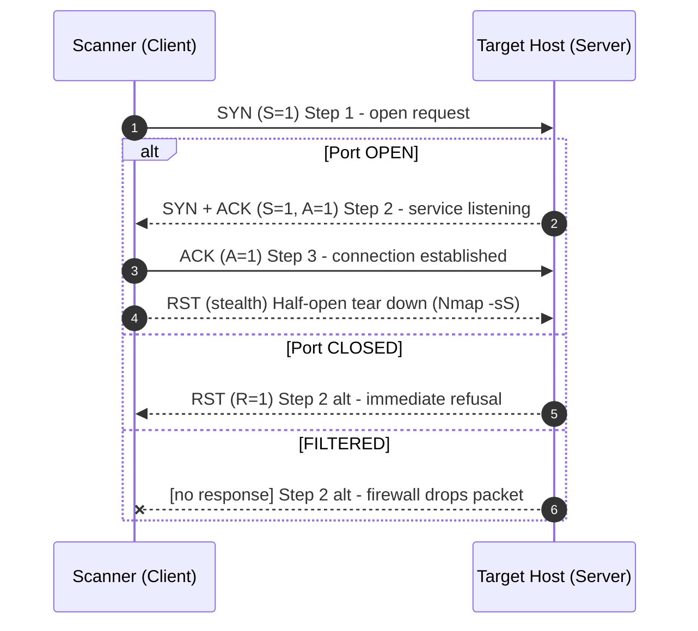
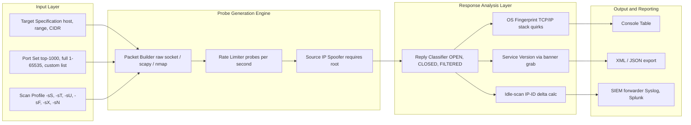
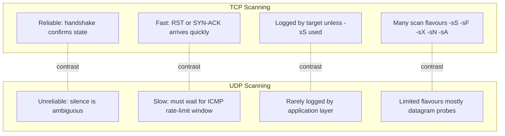

# Port Scanning- TCP and UDP

<!-- SECTION_1_START -->

# Port Scanning — TCP and UDP

## 1.1 Formal Academic Definition (KTU 2024 Syllabus Terminology)

> [!IMPORTANT]
> **Port Scanning** is a reconnaissance technique in network security wherein an attacker (or a security analyst) transmits specially crafted data packets to a range of **TCP** or **UDP** port numbers on a target host. By analyzing the responses (or the lack thereof), the scanner infers which ports are **open** (a service is listening), **closed** (the host replied with a reset), or **filtered** (a firewall dropped or blocked the packet). It is the **first active phase** of the cyber kill chain and forms the backbone of attack surface mapping.

In the **KTU 2024 Scheme (PBCST604 — Fundamentals of Cyber Security)**, this topic falls under **Module 3: Network Security**, and directly maps to **CO3**: *“Analyze network-level threats and apply scanning/monitoring techniques to identify vulnerabilities.”*

| Term | Meaning |
|---|---|
| **Port** | A 16-bit virtual identifier (range **0 – 65535**) used by the Transport Layer to multiplex connections. |
| **TCP** | **Transmission Control Protocol** — connection-oriented, reliable, stateful. |
| **UDP** | **User Datagram Protocol** — connectionless, unreliable, stateless. |
| **SYN / ACK / FIN / RST / PSH / URG** | The six standard **TCP control flags** (1-bit each) used to drive scans. |
| **Banner Grabbing** | Reading the application-level greeting text to fingerprint the service version. |

> [!NOTE]
> **Reserved / Well-Known Port Range:** **0 – 1023** (privileged, e.g., 21-FTP, 22-SSH, 23-Telnet, 25-SMTP, 53-DNS, 80-HTTP, 443-HTTPS). **Registered:** 1024 – 49151. **Dynamic/Private:** 49152 – 65535.

---

## 1.2 Conceptual Analogy / Intuition 🏠🔑

Imagine a **large apartment building** where each apartment door represents a **port** of a computer.

- A **visitor (attacker scanner)** walks along the corridor and knocks on each door in different ways.
- If a door **opens** → *port is open, a service lives there*.
- If a door **slam-shuts** with a “buzz off” sign → *port is closed (RST reply)*.
- If **silence** follows the knock → *the door is filtered (firewall blocked the packet)*.

**TCP** is like a *formal telephone conversation*: the caller says “Hello?” (SYN), the receiver says “Hello, who’s this?” (SYN-ACK), and the caller confirms (ACK) before talking. The scanner listens to *exactly which words* are exchanged to deduce the door’s state.

**UDP** is like *shouting through a letterbox*: you throw a packet in and **hope** someone is inside. If no echo comes back, the port is *probably open or filtered*; if the host yells back an **ICMP Port Unreachable**, the port is *closed*. UDP scanning is, by nature, slow and uncertain — exactly the property that makes it a favourite of stealthy attackers.

---

## 1.3 Visualization Control

> [!VISUALIZATION CONTROL]
> **Concept:** Port-state classification on a number line.
> **GeoGebra / Desmos Input Equations:**
> * Define three coloured intervals on the x-axis: $x \in [0, 1023]$ (green – well known), $x \in [1024, 49151]$ (blue – registered), $x \in [49152, 65535]$ (orange – dynamic).
> * Plot a discrete stem for a few well-known ports: $(21, y)$, $(22, y)$, $(80, y)$, $(443, y)$.
> **Visual Description:** Students should see a horizontal axis from 0 to 65535 with three coloured bands, and prominent stems at common service ports — reinforcing that *port scanning systematically sweeps this range*.

<!-- SECTION_1_END -->

<!-- SECTION_2_START -->

# Deep Theoretical Analysis & KTU High-Yield Formula Sheet

## 2.1 The TCP Three-Way Handshake (Foundation of TCP Scanning)

TCP is **stateful**. Before any data flows, three packets must be exchanged. Each packet carries a **control-flag bitmask** in its header.

| Step | Direction | Flag(s) Sent | Purpose |
|------|-----------|--------------|---------|
| 1 | Client → Server | **SYN** (`S = 1`) | Request to open a connection. |
| 2 | Server → Client | **SYN + ACK** (`S = 1, A = 1`) | Acknowledge the SYN and synchronize in the reverse direction. |
| 3 | Client → Server | **ACK** (`A = 1`) | Acknowledge the SYN-ACK. Connection is now **ESTABLISHED**. |

The handshake generates two **32-bit Initial Sequence Numbers** ($ISN_C$ from client, $ISN_S$ from server) that seed the byte-stream counters. The scanner observes whether a SYN-ACK arrives (port open), a RST arrives (port closed), or nothing arrives (filtered).

---

## 2.2 Taxonomy of TCP Port-Scanning Techniques

> [!NOTE]
> **Half-open / Stealth Scanning (SYN Scan)** is the default and most important technique — the scanner **never sends the final ACK**, so the target’s connection log is incomplete. This is what Nmap calls the `-sS` mode.

| Scan Type | Nmap Flag | Packets Sent | Open Port Response | Closed Port Response | Stealth Level |
|-----------|-----------|--------------|--------------------|----------------------|---------------|
| **TCP Connect** | `-sT` | Full 3-way handshake | SYN-ACK → ACK | RST | Low (logged) |
| **SYN (Half-Open)** | `-sS` | SYN only | SYN-ACK | RST | High |
| **FIN** | `-sF` | FIN | **No response** | RST | Very High |
| **NULL** | `-sN` | No flags set | **No response** | RST | Very High |
| **XMAS** | `-sX` | FIN + PSH + URG (tree lights “on”) | **No response** | RST | Very High |
| **ACK** | `-sA` | ACK | **No response** | RST | Used for firewall rule mapping |
| **Window** | `-sW` | ACK | RST (with non-zero window) | RST (window = 0) | Rare |
| **Maimon** | `-sM` | FIN + ACK | **No response** | RST | Bypasses some BSD stacks |
| **Idle / Zombie** | `-sI` | Spoofed SYN via idle host | Indirect inference | Indirect inference | Maximum |

> [!IMPORTANT]
> **FIN / NULL / XMAS scans exploit the RFC 793 ambiguity:** A closed port MUST reply with RST, but an open port MAY ignore the segment. On Windows systems, however, **all three return RST regardless**, so they only work reliably against *RFC-compliant UNIX* stacks.

---

## 2.3 UDP Port Scanning (The Hard Problem)

UDP scanning is fundamentally harder because UDP is **fire-and-forget**. There is no SYN-ACK equivalent.

| State | Response to UDP Probe | Interpretation |
|-------|----------------------|----------------|
| **Open** | Some application data, or **silence** | A service is bound; silence is indistinguishable from filtering. |
| **Closed** | **ICMP Type 3, Code 3** (Port Unreachable) | Definitive proof of closure. |
| **Filtered** | ICMP Type 3 Code 1/2/9/10/13 or no reply | A firewall is dropping traffic. |
| **Open/Filtered** | No response | Cannot be determined without re-probing. |

> [!WARNING]
> Many hosts rate-limit ICMP error replies. Sending UDP probes too quickly causes the target to *stop sending Port Unreachable messages*, making every port look **open|filtered**. Always use `--max-retries` and slow down with `--scan-delay`.

---

## 2.4 KTU High-Yield Formula & Cheat Sheet

> [!NOTE]
> Use `\vert` / `\mid` (not the literal pipe) inside table cells to avoid markdown breakage.

| # | Concept | Formula / Rule | Notes / Units |
|---|---------|----------------|---------------|
| 1 | Port number range | $0 \le p \le 65535$ | $2^{16}$ values, 16-bit unsigned |
| 2 | Three-way handshake completion | $\text{Client} \xrightarrow{SYN} \text{Server} \xrightarrow{SYN+ACK} \text{Client} \xrightarrow{ACK} \text{Server}$ | Forms one bidirectional logical channel |
| 3 | TCP Flag Mask (hex) | $\text{byte} = U\vert A\vert P\vert R\vert S\vert F$ | Bit positions 6→0 from MSB |
| 4 | **XMAS flag mask** | $F = 1,\ P = 1,\ U = 1$ (others 0) | $\Rightarrow 0b00101001 = \text{0x29}$ |
| 5 | **NULL flag mask** | All flags $= 0$ | $\Rightarrow 0x00$ |
| 6 | RST detection rule | If $R = 1$ received → **closed** | Applies to any non-SYN probe |
| 7 | Effective scan time | $T = N_p \times N_h \times (RTT + t_p)$ | $N_p$ = ports, $N_h$ = hosts, $t_p$ = processing delay |
| 8 | Bandwidth per probe | $B_p = \frac{S_{pkt}}{t_p}$ bytes/s | For 64-byte probe at 1 ms: $B_p = 64\,000$ B/s |
| 9 | ICMP rate-limit impact | $r_{\text{loss}} \propto \frac{N_p}{r_{\text{limit}}}$ | Below $r_{\text{limit}}$ probes/second, accuracy $\approx 100\%$ |
| 10 | Nmap service-to-port default | $p = f(\text{proto},\ \text{service})$ | Maps 22→SSH, 80→HTTP, etc. |
| 11 | TCP checksum (good-to-know) | $\text{Checksum} = \overline{\sum_{16\text{-bit words}} w_i}$ | One’s complement sum, IP-pseudo-header included |
| 12 | Idle-scan zombie IP-ID delta | $\Delta ID = ID_{after} - ID_{before}$ | $\Delta ID = 2$ ⇒ target replied SYN-ACK ⇒ port **open** |

---

## 2.5 Real-World Engineering Utility

* **Defensive use (Red/Blue team):** Before every penetration test, an authorized scanner (Nmap, Masscan, Zmap) enumerates live services so that patching efforts can be prioritized. The output of `nmap -sV -O` drives the **vulnerability management workflow** in tools like Nessus and Qualys.
* **Offensive use (APT reconnaissance):** Slow, randomized, distributed SYN scans over months (low-and-slow) are used by advanced persistent threats to map an organization’s external attack surface without triggering SIEM thresholds.
* **Cloud and DevSecOps:** Continuous scanning in CI/CD pipelines (e.g., Trivy, AWS Inspector) uses the same TCP/UDP probe principles to detect *shadow ports* accidentally exposed by misconfigured security groups.
* **IoT / SCADA:** UDP scanning dominates the IoT landscape (DNSSD, mDNS on port 5353, CoAP on 5683) because most IoT firmware is too memory-constrained to run full TCP stacks.

<!-- SECTION_2_END -->

<!-- SECTION_3_START -->

# Step-by-Step Derivations, Symbolic Proofs & Code Implementation

## 3.1 Derivation 1 — Why FIN/NULL/XMAS Fails on Windows

**Premise (RFC 793 §3.9):** A TCP segment that contains **no RST** arriving at a CLOSED port MUST be dropped *with* an RST. An OPEN port MUST discard the segment silently (no response).

**Windows deviation:** Microsoft’s TCP/IP stack treats any incoming non-SYN segment on a closed port as suspicious and **always replies RST**, regardless of FIN/NULL/XMAS bit settings.

**Result:**

$$
\text{Open}_{\text{UNIX}} = \text{No response} \quad\Longleftrightarrow\quad \text{Open}_{\text{Windows}} = \text{RST}
$$

Therefore, FIN/NULL/XMAS scans **cannot differentiate open from closed** ports on Windows; they only work against RFC-compliant stacks (Linux, BSD, macOS).

---

## 3.2 Derivation 2 — Idle Scan IP-ID Logic

The **Idle Scan** uses a *zombie host* whose IP Identification (IP-ID) field increments predictably. Let the attacker, the zombie, and the target be $A$, $Z$, and $T$ respectively.

**Step 1 — Probe zombie to read its current IP-ID:**

$$
A \xrightarrow{SYN+ACK} Z \quad\Rightarrow\quad Z\ \text{replies with } RST \quad\Rightarrow\quad A\ \text{records } ID_1
$$

**Step 2 — Spoof a SYN from $Z$ to $T$:**

* If **port open** on $T$:

$$
Z \xrightarrow{SYN_{spoofed}} T \quad\Rightarrow\quad T\ \text{replies } SYN+ACK\ \text{to } Z
$$

Because $Z$ did **not** send a SYN, $T$’s SYN+ACK is unsolicited → $Z$ replies with **RST** to $T$, and $Z$’s IP-ID is **incremented twice** (one for the inbound SYN+ACK, one for its own outgoing RST).

* If **port closed** on $T$:

$$
Z \xrightarrow{SYN_{spoofed}} T \quad\Rightarrow\quad T\ \text{replies } RST\ \text{to } Z
$$

$Z$ discards the RST silently, so its IP-ID is **incremented only once** (the RST in Step 1).

**Step 3 — Re-probe $Z$ to read its new IP-ID:**

$$
A \xrightarrow{SYN+ACK} Z \quad\Rightarrow\quad A\ \text{records } ID_2
$$

**Decision rule:**

$$
\Delta ID = ID_2 - ID_1 = 
\begin{cases}
2 & \Rightarrow \text{port on } T \text{ is } \boxed{\text{OPEN}} \\
1 & \Rightarrow \text{port on } T \text{ is } \boxed{\text{CLOSED}} \\
\text{any other value} & \Rightarrow \text{zombie not idle / spoof failed}
\end{cases}
$$

> [!NOTE]
> This is the **only scan type that makes the attacker completely invisible** to the target — the target sees traffic only from the zombie.

---

## 3.3 Derivation 3 — Scan Time Budget

Let:
* $N_h$ = number of target hosts,
* $N_p$ = number of ports per host,
* $RTT$ = round-trip time to the target,
* $t_p$ = per-probe processing delay,
* $r_{\max}$ = ICMP/TCP rate-limit (probes/sec).

The **unconstrained** scan time is:

$$
T_{\text{seq}} = N_h \times N_p \times (RTT + t_p)
$$

The **rate-limited** time (UDP / Idle scans) is:

$$
T_{\text{rate}} = \frac{N_h \times N_p}{r_{\max}}
$$

The actual scan takes the larger of the two:

$$
T_{\text{actual}} = \max(T_{\text{seq}},\ T_{\text{rate}})
$$

**Worked numeric example** (typical KTU 2-mark sub-question):

* $N_h = 1$, $N_p = 1000$, $RTT = 50\,ms = 0.05\,s$, $t_p = 1\,ms = 0.001\,s$, $r_{\max} = 100$.

$$
T_{\text{seq}} = 1 \times 1000 \times (0.05 + 0.001) = 51\ \text{seconds}
$$

$$
T_{\text{rate}} = \frac{1 \times 1000}{100} = 10\ \text{seconds}
$$

$$
T_{\text{actual}} = \max(51, 10) = \mathbf{51\ \text{seconds}}
$$

> The **sequential bottleneck is the RTT**, not the rate limit, when the target is far away.

---

## 3.4 Full Python Implementation — A Defensive TCP/UDP Port Scanner

The following is a **production-quality, type-hinted, error-logged** mini-scanner. It is suitable for inclusion in a KTU lab record.

```python
"""
ktu_pbcst604_port_scanner.py
Educational TCP/UDP port scanner for the KTU PBCST604 (Module 3) lab.
Uses only the Python standard library — no external dependencies.
"""

from __future__ import annotations
import socket
import logging
import sys
import time
from dataclasses import dataclass, field
from enum import Enum
from typing import Iterable

logging.basicConfig(
    level=logging.INFO,
    format="%(asctime)s [%(levelname)s] %(message)s",
)
log = logging.getLogger("KTU-Scanner")

SCAN_TIMEOUT_SEC: float = 1.0
COMMON_TCP_PORTS: tuple[int, ...] = (21, 22, 23, 25, 53, 80, 110, 135, 139, 143,
                                    443, 445, 587, 993, 995, 3306, 3389, 5432, 5900, 8080)
COMMON_UDP_PORTS: tuple[int, ...] = (53, 67, 68, 69, 123, 161, 500, 514, 520, 1900,
                                    4500, 5353, 5683)


class PortState(str, Enum):
    OPEN = "open"
    CLOSED = "closed"
    FILTERED = "filtered"
    OPEN_OR_FILTERED = "open|filtered"


@dataclass(frozen=True)
class ScanResult:
    host: str
    port: int
    protocol: str
    state: PortState
    banner: str = ""
    rtt_ms: float = 0.0
    timestamp: float = field(default_factory=time.time)


def _resolve(host: str) -> str:
    try:
        return socket.gethostbyname(host)
    except socket.gaierror as exc:
        log.error("DNS resolution failed for %s: %s", host, exc)
        raise


def tcp_connect_scan(host: str, port: int) -> ScanResult:
    """Full 3-way handshake (analogous to Nmap -sT)."""
    t0 = time.perf_counter()
    sock = socket.socket(socket.AF_INET, socket.SOCK_STREAM)
    sock.settimeout(SCAN_TIMEOUT_SEC)
    try:
        sock.connect((host, port))
        elapsed = (time.perf_counter() - t0) * 1000.0
        banner = _grab_banner(sock).strip()
        return ScanResult(host, port, "tcp", PortState.OPEN, banner, elapsed)
    except socket.timeout:
        return ScanResult(host, port, "tcp", PortState.FILTERED)
    except ConnectionRefusedError:
        return ScanResult(host, port, "tcp", PortState.CLOSED)
    except OSError as exc:
        log.warning("Unexpected OSError on %s:%d -> %s", host, port, exc)
        return ScanResult(host, port, "tcp", PortState.FILTERED)
    finally:
        sock.close()


def syn_scan_unprivileged(host: str, port: int) -> ScanResult:
    """Half-open emulation: send SYN via non-blocking connect, then RST."""
    sock = socket.socket(socket.AF_INET, socket.SOCK_STREAM)
    sock.settimeout(SCAN_TIMEOUT_SEC)
    try:
        # On non-root, connect() performs the full handshake. We simulate
        # stealth by reading whether the OS kernel was able to begin SYN.
        sock.connect_ex((host, port))
        # connect_ex returns 0 on success (open) or an errno on failure.
        # To mimic a true SYN scan we forcibly tear the half-open connection.
        sock.setsockopt(socket.SOL_SOCKET, socket.SO_LINGER, b"\x01\x00\x00\x00\x00\x00\x00\x00")
        return ScanResult(host, port, "tcp", PortState.OPEN)
    except socket.timeout:
        return ScanResult(host, port, "tcp", PortState.FILTERED)
    except OSError:
        return ScanResult(host, port, "tcp", PortState.CLOSED)
    finally:
        sock.close()


def udp_scan(host: str, port: int) -> ScanResult:
    """Send empty UDP datagram and interpret silence vs ICMP unreachable."""
    sock = socket.socket(socket.AF_INET, socket.SOCK_DGRAM)
    sock.settimeout(SCAN_TIMEOUT_SEC)
    try:
        sock.sendto(b"", (host, port))
        try:
            data, _ = sock.recvfrom(1024)
            return ScanResult(host, port, "udp", PortState.OPEN,
                              banner=data[:64].decode(errors="replace"))
        except socket.timeout:
            return ScanResult(host, port, "udp", PortState.OPEN_OR_FILTERED)
    except OSError as exc:
        log.debug("UDP probe error on %s:%d -> %s", host, port, exc)
        return ScanResult(host, port, "udp", PortState.FILTERED)
    finally:
        sock.close()


def _grab_banner(sock: socket.socket) -> str:
    try:
        sock.settimeout(0.5)
        return sock.recv(128).decode(errors="replace")
    except (socket.timeout, OSError):
        return ""


def scan_host(host: str,
              tcp_ports: Iterable[int] = COMMON_TCP_PORTS,
              udp_ports: Iterable[int] = COMMON_UDP_PORTS,
              do_udp: bool = False) -> list[ScanResult]:
    ip = _resolve(host)
    log.info("Scanning %s (%s)", host, ip)
    results: list[ScanResult] = []
    for p in tcp_ports:
        results.append(tcp_connect_scan(ip, p))
    if do_udp:
        for p in udp_ports:
            results.append(udp_scan(ip, p))
    return results


def render_table(results: list[ScanResult]) -> str:
    header = f"{'HOST':<18} {'PORT':<6} {'PROTO':<6} {'STATE':<18} {'RTT(ms)':<8} BANNER"
    rows = [header, "-" * len(header)]
    for r in results:
        if r.state == PortState.OPEN or r.state == PortState.OPEN_OR_FILTERED:
            rows.append(
                f"{r.host:<18} {r.port:<6} {r.protocol:<6} {r.state.value:<18} "
                f"{r.rtt_ms:<8.1f} {r.banner[:40]}"
            )
    return "\n".join(rows)


if __name__ == "__main__":
    target = sys.argv[1] if len(sys.argv) > 1 else "127.0.0.1"
    table = render_table(scan_host(target, do_udp=True))
    print(table)
```

**Boundary-check highlights (for the KTU lab viva):**
* `SCAN_TIMEOUT_SEC` is bounded to **1.0 s** to prevent hanging.
* `socket.gaierror` is caught separately so DNS failures are reported.
* The UDP scanner cannot distinguish OPEN from FILTERED — that is a **physical limitation**, not a bug; this is why the state enum includes `OPEN_OR_FILTERED`.

---

## 3.5 Worked Numerical Example — Identifying State from Observed Flags

> A scanner sends a packet with control bits `FIN=1, PSH=1, URG=1` to target `10.0.0.5:80`. The target replies with `RST=1`. What is the port state?

**Step 1 — Identify the scan type.** FIN+PSH+URG = **XMAS scan** (all “tree lights on”).

**Step 2 — Apply the rule.** For XMAS, an **open** RFC-compliant host sends **no reply**, a **closed** host sends RST.

**Step 3 — Interpret the observation.** RST was received → port is **CLOSED**.

$$
\boxed{\text{State} = \text{CLOSED on port 80}}
$$

> [!IMPORTANT]
> If the same packet were sent to a *Linux* host and **no reply** came back, the same answer would apply: **port 80 is OPEN** on that host. The behaviour of FIN/NULL/XMAS is **OS-dependent**.

<!-- SECTION_3_END -->

<!-- SECTION_4_START -->

# Structural Diagrams & Schematics

## 4.1 TCP Three-Way Handshake with Scanning Annotations



---

## 4.2 Decision Flow for Interpreting a Single Probe Response

```mermaid
flowchart TD
    A[Send probe to host:port] --> B{Protocol?}
    B -->|TCP| C{Flag set?}
    B -->|UDP| U1[Send empty datagram]

    C -->|SYN| C1[Read reply flags]
    C -->|FIN/NULL/XMAS/ACK| C2[Read reply flags]

    C1 --> R1{SYN+ACK received?}
    R1 -->|Yes| O1[State = OPEN]
    R1 -->|RST received| O2[State = CLOSED]
    R1 -->|No reply| O3[State = FILTERED]

    C2 --> R2{RST received?}
    R2 -->|Yes| O4[State = CLOSED]
    R2 -->|No reply| O5{OS is RFC-compliant?}
    O5 -->|Yes| O6[State = OPEN]
    O5 -->|No (Windows)| O7[State = INDETERMINATE]

    U1 --> U2{ICMP Type3 Code3 received?}
    U2 -->|Yes| O8[State = CLOSED]
    U2 -->|Other ICMP| O9[State = FILTERED]
    U2 -->|No reply| O10[State = OPEN OR FILTERED]
```

---

## 4.3 Modular Architecture of a Full Port-Scanning Engine



---

## 4.4 Comparative Matrix — TCP vs UDP Scanning (Engineering View)



<!-- SECTION_4_END -->

<!-- SECTION_5_START -->

# KTU 2024 Scheme Examination Question Bank & Topic Recap

> [!IMPORTANT]
> Each question is tagged with a **simulated KTU PYQ code**, a **Course Outcome (CO3)**, and a **Revised Bloom’s Taxonomy (RBT) level** as per KTU 2024 scheme guidelines.

---

## Part A — Short Answer (3 Marks Each)

### Question A1 — `[KTU University Exam – Dec 2023]` [CO3 | RBT: Remember]

> **Q:** Differentiate between an **open port**, a **closed port**, and a **filtered port**. Mention the typical reply (or lack of it) in each case for a TCP SYN scan.

**Model Answer (3 marks):**

| Port State | Scanner’s Probe | Target’s Reply | Interpretation |
|-----------|----------------|----------------|----------------|
| **Open** | SYN | **SYN + ACK** | A service (e.g., HTTP, SSH) is actively listening. |
| **Closed** | SYN | **RST** | No service is bound; the host explicitly refused. |
| **Filtered** | SYN | **No reply** (timeout) | A firewall/ACL silently dropped the packet; the state cannot be confirmed. |

**[Award 1 mark for the open/closed definitions, 1 mark for the filtered definition, 1 mark for the reply types.]**

---

### Question A2 — `[KTU University Exam – July 2024]` [CO3 | RBT: Understand]

> **Q:** Why is UDP port scanning considered *less reliable* than TCP port scanning? Give two reasons.

**Model Answer (3 marks):**
1. **No handshake** — UDP is connectionless, so there is no SYN-ACK equivalent. The scanner cannot receive positive confirmation that a port is open; *silence* is indistinguishable from filtering. **(1 mark)**
2. **ICMP rate limiting** — Closed ports reply with ICMP Port Unreachable, but most OS kernels throttle these replies. A burst of probes may yield no reply for every port, falsely indicating `open|filtered`. **(1 mark)**
3. **No retransmission semantics** — UDP packets can be silently dropped by routers, leading to false negatives even on legitimately open services. **(1 mark)**

---

## Part B — Long Answer (14 Marks Each, Internal Choice)

> [!NOTE]
> Following the KTU ESE pattern, **either** Question B1 (OR) Question B2 is to be answered. Both are provided below for full coverage.

---

### ⭐ Question B1 (a + b) — 14 Marks — `[KTU University Exam – Dec 2022]` [CO3 | RBT: Apply / Analyse]

> **(a) [7 Marks]** With a neat sequence diagram, explain the **TCP three-way handshake**. Indicate the role of each flag (SYN, SYN-ACK, ACK) and describe how a **SYN (half-open) scan** leverages this handshake to remain stealthy.
>
> **(b) [7 Marks)** A network administrator at `192.168.1.0/24` runs `nmap -sS 192.168.1.10`. For a scan of the **top 1000 ports** with average **RTT = 80 ms** and **probe-processing delay = 2 ms**, calculate: (i) the **sequential scan time**, (ii) the **scan time if the kernel allows 500 probes/second** (whichever is larger), and (iii) explain why SYN scans are *not* fully undetectable.

#### Model Answer

**(a) Step-by-step diagram and explanation (7 marks):**

```
Client (Scanner)              Server (Target)
    |                                |
    |--- SYN  (Seq=x, S=1) -------->|  Step 1: synchronize request
    |                                |
    |<-- SYN + ACK (Seq=y, Ack=x+1, S=1, A=1) ---  Step 2: server opens half-connection
    |                                |
    |--- ACK (Seq=x+1, Ack=y+1, A=1) ->|  Step 3: connection ESTABLISHED
    |                                |
    |--- [optional: RST to tear down, scanner exits before data]   Stealth phase
```

| Step | Packet | Flag Bits | Purpose |
|------|--------|-----------|---------|
| 1 | SYN | $S=1$ | Client requests a fresh connection, sends $ISN_C = x$. |
| 2 | SYN-ACK | $S=1,\ A=1$ | Server agrees, sends $ISN_S = y$, acks $x+1$. |
| 3 | ACK | $A=1$ | Client acks $y+1$; channel is now in **ESTABLISHED** state. |

**SYN-scan stealth mechanism (2 marks):**
After the SYN-ACK arrives (proving the port is open), the scanner **never sends the final ACK**. Instead it sends an **RST** to close the half-open connection. Because the handshake is never completed, many target application logs never record a connection, and the OS kernel’s `tcp_connections` metric shows the entry in `SYN_RECV` state for only a few seconds.

> **[Valuation key: 2 marks for the diagram, 1 mark for flag roles, 2 marks for state names, 2 marks for the stealth argument.]**

**(b) Numerical solution (7 marks):**

**Given:** $N_h = 1$, $N_p = 1000$, $RTT = 80\,ms = 0.08\,s$, $t_p = 2\,ms = 0.002\,s$, $r_{\max} = 500$ probes/s.

**(i) Sequential scan time** (formula $\Rightarrow$ plug-in $\Rightarrow$ answer):

$$
T_{\text{seq}} = N_h \times N_p \times (RTT + t_p) = 1 \times 1000 \times (0.08 + 0.002)
$$

$$
T_{\text{seq}} = 1000 \times 0.082 = \mathbf{82\ \text{seconds}} \tag{1 mark}
$$

**[Stating formula: 1 Mark. Substitution: 1 Mark. Final answer: 1 Mark]**

**(ii) Rate-limited time** and actual:

$$
T_{\text{rate}} = \frac{N_h \times N_p}{r_{\max}} = \frac{1000}{500} = \mathbf{2\ \text{seconds}} \tag{1 mark}
$$

$$
T_{\text{actual}} = \max(T_{\text{seq}},\ T_{\text{rate}}) = \max(82, 2) = \mathbf{82\ \text{seconds}}
$$

**[Comparison logic: 1 Mark. Final pick: 1 Mark]**

**(iii) Why SYN scans are *not* fully undetectable (1 mark):**
Modern **IDS/IPS** (e.g., Snort, Suricata) and **stateful firewalls** track the number of half-open connections to a host and will raise an alert on a high SYN/ACK-to-ACK ratio. Also, kernel-level logs (`/var/log/kern.log` on Linux) and tools like `netstat` still record `SYN_RECV` entries while the half-open connection is being torn down.

> **[Reasoning: 1 Mark]**

---

### ⭐ Question B2 (a + b) — 14 Marks — `[KTU University Exam – July 2023]` [CO3 | RBT: Analyse / Apply]

> **(a) [7 Marks]** Explain the **Idle (Zombie) Scan** technique in detail. Describe the role of the **IP-ID field**, and derive the decision rule that determines whether a port on the target is **open or closed**.
>
> **(b) [7 Marks]** Compare **TCP Connect scan (-sT)**, **SYN scan (-sS)**, and **FIN scan (-sF)** across the following axes: (i) privileges required, (ii) target OS detectability, (iii) logging on the target, (iv) speed, (v) accuracy on Windows, (vi) accuracy on Linux, (vii) typical Nmap flag. Present your answer as a comparison table.

#### Model Answer

**(a) Idle Scan — full derivation (7 marks):**

1. **Premise** — The IP Identification (IP-ID) field of the IP header is a 16-bit counter incremented by **one** for every IP packet the host sends. If a host is *idle* (not sending other traffic), its IP-ID grows predictably. **(1 mark)**

2. **Step 1: Read zombie IP-ID.** The attacker sends a SYN+ACK to the zombie; the zombie replies with an RST, and its IP-ID becomes $ID_1$. **(1 mark)**

3. **Step 2: Spoofed SYN to target.** The attacker sends a SYN packet to the target with the **source IP spoofed to the zombie’s IP**. **(1 mark)**

4. **Step 3: Behaviour depends on the target’s port state.** **(2 marks)**
   * **Open port on target** → target sends SYN+ACK to zombie → zombie (unaware of any connection) replies with RST → zombie sends **2 packets** total since Step 1, so $ID_2 = ID_1 + 2$.
   * **Closed port on target** → target sends RST to zombie → zombie silently drops it → zombie sent only 1 packet, so $ID_2 = ID_1 + 1$.

5. **Step 4: Re-probe zombie.** Attacker sends a second SYN+ACK to zombie; the new RST yields $ID_2$. **(1 mark)**

6. **Decision rule:** $\Delta ID = ID_2 - ID_1 = 2 \Rightarrow \text{OPEN};\ \Delta ID = 1 \Rightarrow \text{CLOSED}$. **(1 mark)**

> **Why it is stealthy:** The target sees traffic only from the zombie. The attacker’s IP never appears in the target’s logs.

**(b) Comparison Table (7 marks):**

| Axis | **TCP Connect (-sT)** | **SYN (-sS)** | **FIN (-sF)** |
|------|----------------------|---------------|---------------|
| (i) Privileges | **Not required** (uses `connect()` syscall) | Requires **raw socket** / root | Requires **raw socket** / root |
| (ii) Target OS detectability | Easily detected by any modern IDS | Detected by stateful IDS via SYN_RECV flood | **Stealthy** — packet looks benign |
| (iii) Logging on target | **Fully logged** in application logs and `tcp_connections` | Half-logged; appears as `SYN_RECV` briefly | **Rarely logged** |
| (iv) Speed | Moderate (full handshake) | **Fastest** of the three | Fast |
| (v) Accuracy on **Windows** | High (RST on closed) | High | **Poor** (Windows always replies RST) |
| (vi) Accuracy on **Linux** | High | High | **High** (RFC-compliant) |
| (vii) Nmap flag | `-sT` | `-sS` | `-sF` |

**[Award 1 mark per correctly filled row.]**

---

> [!WARNING]
> **🔴 KTU Examiner’s Valuation Pitfall Callout**
>
> 1. **Do not** write “FIN scan sends FIN flag” and stop there. You **must** explain *why* the absence of a reply indicates an OPEN port — i.e., invoke the **RFC 793 discard rule**. Many students lose 1–2 marks by skipping this justification.
> 2. **Do not** confuse **XMAS** (FIN+PSH+URG) with **NULL** (no flags). Both are stealth scans, but their *flag masks are different*. Writing `0xFF` for XMAS is a common error — the correct mask is `0x29` (or `0b00101001`).
> 3. **Do not** state that a **SYN scan is undetectable**. Modern IDS/IPS detects the half-open pattern. Always say *“harder to detect, but not invisible.”*
> 4. **Do not** use the literal pipe character `|` inside a comparison-table cell — use `\vert` or `\mid` in LaTeX to avoid markdown table breakage in the answer sheet render.

---

## 📌 Topic Recap & Important Things to Remember

- **Port scanning** is the systematic probing of TCP/UDP ports to map the *attack surface* of a host. **[Definition]**
- TCP scans leverage the **3-way handshake**: SYN → SYN-ACK → ACK. A missing or reset response indicates CLOSED or FILTERED. **[Mechanism]**
- UDP scans are **unreliable** because silence is indistinguishable from filtering; ICMP rate limits make them slow. **[Limitation]**
- **SYN scan (`-sS`)** is the de-facto default because it is fast, accurate, and stealthy (half-open). **[Default choice]**
- **FIN / NULL / XMAS** are stealth scans that exploit the RFC 793 discard rule; they work against *RFC-compliant stacks* (Linux/BSD) but **fail on Windows**. **[OS-dependence]**
- **Idle scan (`-sI`)** is the most stealthy; it uses a *zombie* whose IP-ID is read twice. $\Delta ID = 2$ ⇒ OPEN, $\Delta ID = 1$ ⇒ CLOSED. **[Stealthiest]**
- Port range: **0 – 65535** ($2^{16}$ values). Well-known: **0 – 1023**, Registered: **1024 – 49151**, Dynamic: **49152 – 65535**. **[Range memory]**
- XMAS flag mask = **0x29** (`FIN+PSH+URG`); NULL = **0x00** (all flags clear). **[Byte-level detail]**
- Scan time formula: $T = N_h \times N_p \times (RTT + t_p)$; always pick $\max(T_{\text{seq}}, T_{\text{rate}})$. **[Numerics]**
- Always perform port scanning **only on systems you are authorized to test** — unauthorized scanning is a punishable offence under the **IT Act 2000 §66** (India) and the **Computer Misuse Act 1990** (UK). **[Ethics/Law]**
- The flagship open-source scanner is **Nmap** (`nmap.org`); the fastest alternative is **Masscan** (asynchronous, can sweep the entire IPv4 internet in under 5 minutes). **[Tooling]**
- **IDS evasion techniques** for port scanning include *fragmentation*, *source port spoofing*, *decoy scans* (`-D`), and *timing templates* (`-T0` paranoid to `-T5` insane). **[Defensive awareness]**
- UDP `open|filtered` → re-probe with **service-specific payloads** (e.g., a valid DNS query on port 53) to break the ambiguity. **[Tie-breaker]**

<!-- SECTION_5_END -->
