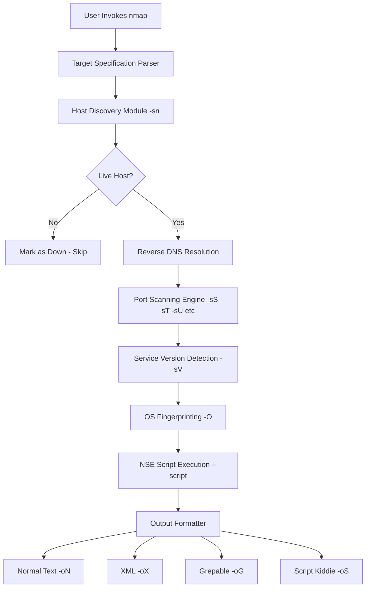
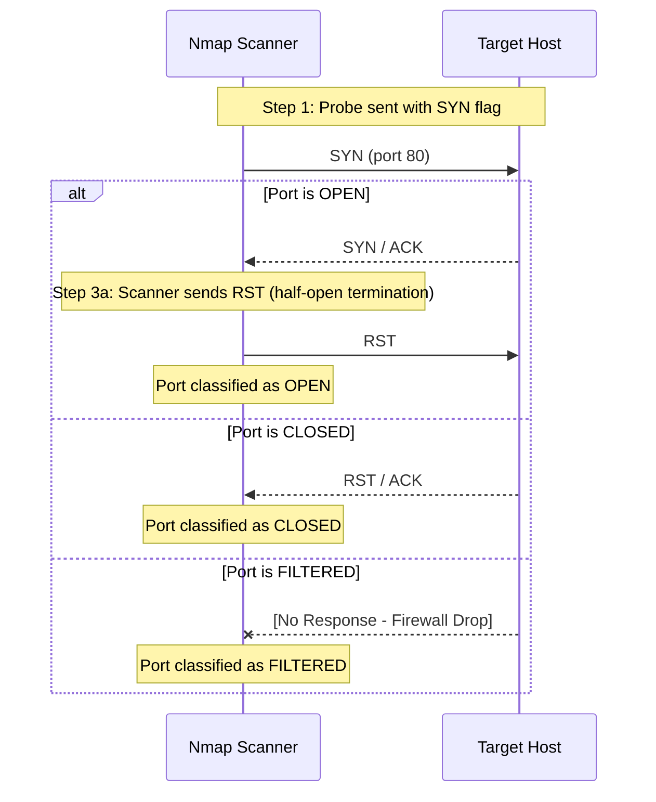
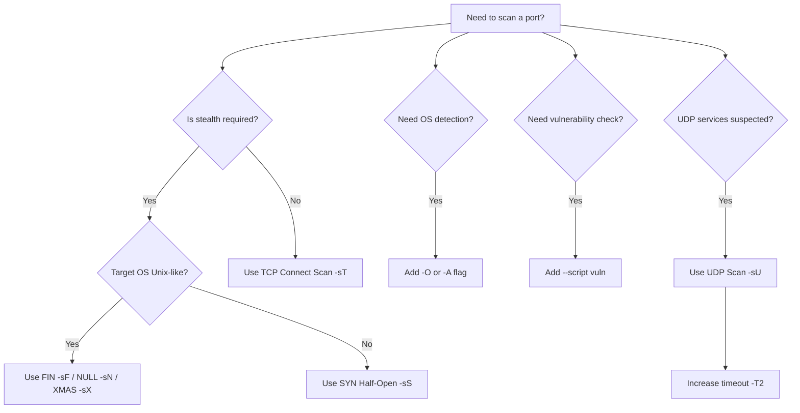
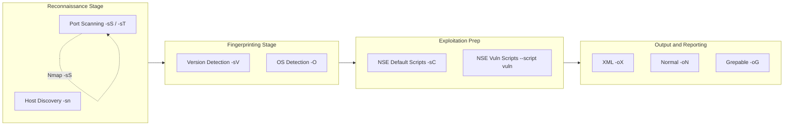
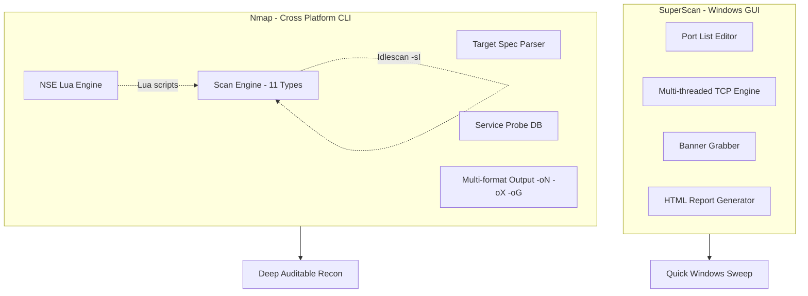

# Port Scanning Tools- Nmap, SuperScan

<!-- SECTION_1_START -->
# Port Scanning Tools — Nmap & SuperScan

## 1.1 Formal Definition (KTU 2024 Syllabus Terminology)

**Port Scanning** is the disciplined, methodical process of probing a target host's logical communication endpoints (ports 0–65535) across a network to determine which ports are **open**, **closed**, or **filtered**, and to infer the underlying services, operating systems, and potential vulnerabilities associated with them.

> [!IMPORTANT]
> **KTU 2024 Module-3 Anchor Definition**
> A *port scanner* is a network reconnaissance utility that sends crafted packets to a range of TCP/UDP ports and analyses the responses (or silence) to map the attack surface of a target machine. The two most prominent tools studied in the PBCST604 syllabus are **Nmap (Network Mapper)** — a CLI-driven, open-source powerhouse — and **SuperScan** — a Windows-native, GUI-driven alternative from Foundstone/McAfee.

**Nmap (Network Mapper)** is an open-source, command-line utility originally written by **Gordon Lyon (Fyodor)** in 1997. It uses raw IP packets in novel ways to perform **host discovery**, **port scanning**, **version detection**, **OS fingerprinting**, and **scriptable vulnerability assessment** via the Nmap Scripting Engine (NSE).

**SuperScan** is a Windows-only, GUI-based TCP port scanner and resolver developed by **Foundstone (later acquired by McAfee)**. It is engineered for fast, parallel scanning of large IP ranges with banner-grabbing, hostname resolution, and built-in enumeration of common Windows services.

> [!NOTE]
> **Physical Constants & Standard Metrics Used in Scanning**
> - **Total TCP Ports:** $0 \text{ to } 65535$ (i.e. $2^{16}$ ports)
> - **Well-Known Range:** $0 \text{–} 1023$ (system/privileged services)
> - **Registered Range:** $1024 \text{–} 49151$
> - **Dynamic/Private Range:** $49152 \text{–} 65535$
> - **Default Scan Speed (Nmap -T3):** ~5,000 packets/second
> - **IPv4 Header Size:** 20 bytes minimum; **TCP Header:** 20 bytes minimum

## 1.2 Conceptual Analogy — Plain English Intuition

> [!TIP]
> **Analogy: "Knocking on Every Door of a Skyscraper"**
>
> Imagine a 65,535-floor skyscraper where each floor represents a *port*. A port scanner is a security guard who, floor by floor, **knocks on every door** and listens for the response:
> - **Someone opens the door** → *Port is OPEN* (a service is actively listening).
> - **A "No one lives here" notice is returned** → *Port is CLOSED* (no service, RST received).
> - **No answer at all, no notice** → *Port is FILTERED* (a firewall silently dropped the packet).
>
> **Nmap** is the *highly trained, methodical guard* who uses different knocking styles (single tap, three knocks, silent knock) to deduce the occupant type. **SuperScan** is the *fast, friendly, GUI-based assistant* who clicks buttons on a dashboard to do the same thing on Windows machines.

> [!VISUALIZATION CONTROL]
> **Concept:** Nmap scan state visualisation on a 2D plot of *Port Number* vs *Time-to-Respond*
> **GeoGebra / Desmos Input Equations (Stylised):**
> * `f(x) = 1` for $x \in [\text{open ports}]$ (vertical spikes showing open services)
> * `g(x) = 0` for $x \in [\text{closed ports}]$ (flat baseline)
> * `h(x) = \text{undefined}$ (gap) for $x \in [\text{filtered ports}]$ (silent/dropped)
> **Visual Description:** The student should observe tall vertical bars at port numbers 22, 80, 443, 3306, etc., flat regions for closed ports, and vertical gaps where firewalls silently drop probes.

---

<!-- SECTION_1_END -->

<!-- SECTION_2_START -->
# Deep Theoretical Analysis & KTU High-Yield Formula Sheet

## 2.1 The Operational Logic of Port Scanning

A port scanner operates on a **three-stage reconnaissance pipeline**:

1. **Packet Crafting** — The scanner constructs a packet with a specific flag combination (SYN, ACK, FIN, etc.) and a destination port number.
2. **Transmission & Observation** — The packet is sent to the target; the scanner measures the response (or absence of response) and the **RTT (Round-Trip Time)**.
3. **State Inference** — Based on the response pattern, the port is classified into one of six canonical states.

## 2.2 The Six Canonical Port States (Nmap Taxonomy)

| State | Meaning | Typical Response |
|---|---|---|
| **open** | Application actively accepting TCP/UDP connections | SYN/ACK (TCP) or UDP datagram response |
| **closed** | No application listening, but host is reachable | RST (TCP) / ICMP Port Unreachable (UDP) |
| **filtered** | Packet filtering blocks probe; no response | No reply / ICMP Admin Prohibited |
| **unfiltered** | Probe reached host, but state cannot be determined | RST (used in ACK scan) |
| **open $\vert$ filtered** | Probe gave no response; port may be open or filtered | No reply (used in UDP, FIN, XMAS, NULL) |
| **closed $\vert$ filtered** | Probe gave no response; port may be closed or filtered | No reply (used in IPID Idle scan) |

> [!NOTE]
> KTU examiners *frequently* ask students to list the six port states. Memorise them with the **"open, closed, filtered, unfiltered, open$\vert$filtered, closed$\vert$filtered"** sequence.

## 2.3 TCP Three-Way Handshake — The Foundation of Scanning

$$\text{SYN} \rightarrow \text{(Client → Server)} \rightarrow \text{SYN/ACK}$$
$$\text{ACK} \rightarrow \text{(Client → Server)} \rightarrow \text{Connection Established}$$

The standard TCP connection involves a **3-way handshake**. A *full TCP connect scan* completes this handshake. A *SYN scan (half-open)* deliberately **breaks the handshake after step 2** by sending RST instead of the final ACK — making it stealthier and faster.

## 2.4 Major Scan Techniques — High-Yield Cheat Sheet

| Scan Type | Nmap Flag | Packet Flags Sent | Response (Open) | Response (Closed) | Stealth Level |
|---|---|---|---|---|---|
| **TCP Connect** | `-sT` | Full 3-way handshake | SYN/ACK | RST | Low (logged) |
| **SYN (Half-Open)** | `-sS` | SYN | SYN/ACK | RST | High |
| **FIN** | `-sF` | FIN | No response | RST | Very High |
| **NULL** | `-sN` | No flags | No response | RST | Very High |
| **XMAS** | `-sX` | FIN + PSH + URG ("lit like a tree") | No response | RST | Very High |
| **ACK** | `-sA` | ACK | RST | RST | Medium (maps rulesets) |
| **Window** | `-sW` | ACK | RST (with window size) | RST (no window) | Medium |
| **Maimon** | `-sM` | FIN/ACK | No response | RST | High |
| **UDP** | `-sU` | UDP datagram | UDP reply | ICMP Port Unreachable | Slow |
| **Idle (Zombie)** | `-sI` | Spoofed SYN via zombie | SYN/ACK to zombie | RST to zombie | Maximum |
| **Protocol** | `-sO` | IP protocol header | Protocol response | ICMP Unreachable | Niche |

## 2.5 Nmap Architecture — Internal Components

Nmap is engineered as a **modular, multi-layered system**. The high-level components are:

- **Target Specification Engine** — Parses CIDR, hostnames, ranges (e.g. `192.168.1.0/24`).
- **Host Discovery Module (Ping Scan)** — Uses ICMP, ARP, TCP SYN/ACK to detect live hosts.
- **Port Scanning Engine** — Implements the 11+ scan algorithms listed in §2.4.
- **Service/Version Detection** — Probes open ports and matches banners against `nmap-services` and `nmap-service-probes` signature databases.
- **OS Fingerprinting** — Analyses TCP ISN, IP ID sequence, TCP options, window size to infer the remote OS via the `nmap-os-db` database.
- **Nmap Scripting Engine (NSE)** — Lua-based scripting subsystem with **14 script categories** (auth, broadcast, brute, default, discovery, dos, exploit, external, fuzzer, intrusive, malware, safe, version, vuln).
- **Timing/Performance Engine** — `-T0` (Paranoid) through `-T5` (Insane), controlling parallelism, timeout, and rate.

## 2.6 SuperScan — Architecture & Features

| Feature | Description |
|---|---|
| **Platform** | Windows-only native GUI |
| **Scan Modes** | Host and Service scanning (port, ICMP, DNS) |
| **Speed** | Multi-threaded, parallel port sweeps (legacy speed advantage) |
| **Banner Grabbing** | Retrieves service banners for fingerprinting |
| **Hostname Resolution** | Built-in DNS resolver |
| **Enumerate Windows Users** | Extracts NetBIOS user accounts |
| **Built-in Ports List** | Pre-defined list of common ports (vs Nmap's `nmap-services` file) |
| **Output** | HTML and text reports |
| **Current Status** | No longer actively maintained; replaced in many labs by **Advanced Port Scanner** |

## 2.7 Nmap vs SuperScan — Engineering Comparison Matrix

| Parameter | Nmap | SuperScan |
|---|---|---|
| **Interface** | Command-Line (Zenmap GUI exists) | Native Windows GUI |
| **Platform Support** | Linux, Windows, macOS, BSD | Windows only |
| **Open Source** | Yes (GPLv2) | No (Freeware, discontinued) |
| **Scan Types** | 11+ (SYN, FIN, NULL, XMAS, Idle, etc.) | TCP connect, UDP, ICMP |
| **OS Fingerprinting** | Yes (advanced) | No (basic banner only) |
| **Scripting** | Lua-based NSE (600+ scripts) | None |
| **Stealth Scanning** | Full (FIN, NULL, XMAS, Idle) | Limited |
| **Output Formats** | Normal, XML, Grepable, Script Kiddie | HTML, Text |
| **Real-World Use** | Penetration testing, sysadmin, CI/CD security gates | Quick Windows-network sweeps, CTF basics |
| **Engineering Use Case** | Production security audits, automated pipelines (`nmap --script` in CI) | Lab training, small LAN enumeration |

## 2.8 Real-World Engineering Utility

- **Penetration Testing (PTES / OWASP-NMAP):** Nmap is the *de-facto* first-stage reconnaissance tool. The output feeds into Metasploit, Nessus, OpenVAS.
- **DevSecOps CI/CD:** Nmap is invoked in pipelines (`nmap -Pn -p 1-65535 --script vuln target`) to gate insecure container images and exposed services.
- **Compliance Audits:** PCI-DSS, ISO 27001, and SOC 2 require periodic port scanning — Nmap XML output is the standard artefact.
- **Incident Response (DFIR):** Live-host detection during a breach investigation.
- **Academic Labs:** SuperScan is preferred in KTU Windows labs for its visual feedback, which aids novice understanding.

---

<!-- SECTION_2_END -->

<!-- SECTION_3_START -->
# Step-by-Step Derivations, Commands & Code Implementation

## 3.1 Nmap Command Structure — Canonical Syntax

The complete canonical form of an Nmap invocation is:

$$ \text{nmap } [\text{scan\_type}] [\text{options}] \{\text{target\_specification}\} $$

Every Nmap command has **three mandatory conceptual slots**:
1. **Scan Type** (e.g. `-sS`, `-sT`, `-sU`, `-sV`, `-sC`, `-A`)
2. **Timing/Output/Discovery Options** (e.g. `-T4`, `-v`, `-Pn`, `-oN`, `-oX`)
3. **Target Specification** (e.g. `192.168.1.1`, `scanme.nmap.org`, `10.0.0.0/24`)

## 3.2 Exhaustive Command Bank — With Semantic Explanation

### 3.2.1 Host Discovery (Ping Scan)

```bash
# Discover live hosts on a subnet without port scanning
nmap -sn 192.168.1.0/24
```
**Logic:** `-sn` (no port scan) sends ARP (LAN) or ICMP echo (WAN) requests to enumerate live hosts. This is the *fastest* first step in any assessment.

### 3.2.2 SYN Half-Open Scan (Default with root)

```bash
# Requires root/admin to send raw SYN packets
sudo nmap -sS 192.168.1.10
```
**Logic:** Sends SYN. If SYN/ACK received → port is `open`, then sends RST to abort the handshake (half-open). If RST received → port is `closed`. If no response → `filtered`.

### 3.2.3 Service & Version Detection

```bash
# Identify service name and version on open ports
nmap -sV 192.168.1.10
```
**Logic:** Sends application-level probes (`GET / HTTP/1.0`, `SSH-1.0\r\n`, etc.) and matches the response against the **`nmap-service-probes`** database to identify services like `Apache httpd 2.4.41`, `OpenSSH 8.2p1`.

### 3.2.4 Aggressive Scan (OS + Version + Scripts + Traceroute)

```bash
# Full fingerprinting in one shot
sudo nmap -A -T4 scanme.nmap.org
```
**Logic:** `-A` enables **OS detection**, **version detection**, **script scanning**, and **traceroute** simultaneously. This is a *noisy* scan, used when stealth is not required.

### 3.2.5 Stealth Scan (XMAS Tree)

```bash
# Send FIN + PSH + URG flags (the "lit Christmas tree")
sudo nmap -sX 192.168.1.10
```
**Logic:** Exploits the **RFC 793** behaviour — closed ports reply with RST, while open ports on Unix-like systems *ignore* the packet (per RFC). This bypasses basic stateless firewalls that only filter SYN.

### 3.2.6 UDP Scan

```bash
# Probe UDP services (DNS, SNMP, DHCP)
sudo nmap -sU -p 53,67,161,1234 192.168.1.10
```
**Logic:** Sends empty UDP datagrams. Open ports respond with application data; closed ports send **ICMP Port Unreachable**; filtered ports send nothing.

### 3.2.7 NSE Vulnerability Script Scan

```bash
# Run the "vuln" category scripts against the target
nmap --script vuln 192.168.1.10
```
**Logic:** Iterates through all scripts in the `vuln` category of NSE, executing them on each open port. Examples include `smb-vuln-ms17-010` (EternalBlue) and `http-vuln-cve2017-5638`.

## 3.3 Python Implementation — `python-nmap` Library

For DevSecOps automation, Nmap is wrapped via the **`python-nmap`** library. The fully operational production-grade code is:

```python
#!/usr/bin/env python3
"""
nmap_auditor.py — Production-grade port scanning wrapper.
Course: PBCST604 — Fundamentals of Cyber Security
Module: 3 — Network Security (Nmap)
"""

import nmap                      # pip install python-nmap
import sys
import logging
import json
from typing import Dict, List, Optional

# Configure structured logging for SIEM ingestion
logging.basicConfig(
    level=logging.INFO,
    format="%(asctime)s [%(levelname)s] %(message)s",
    handlers=[logging.FileHandler("scan_audit.log"), logging.StreamHandler()],
)
logger = logging.getLogger("NmapAuditor")


class NmapAuditor:
    """Encapsulates Nmap operations with strict boundary checks and error handling."""

    def __init__(self) -> None:
        self.scanner: nmap.PortScanner = nmap.PortScanner()
        logger.info("NmapAuditor initialised. Nmap version: %s", self.scanner.nmap_version())

    def validate_target(self, target: str) -> bool:
        """Validate that the target is a non-empty, sane IP/CIDR/hostname."""
        if not target or not isinstance(target, str):
            logger.error("Invalid target type: %s", type(target))
            return False
        # Reject obvious injection attempts
        if any(char in target for char in (";", "&", "|", "$", "`", "\n")):
            logger.error("Shell metacharacters detected in target: %s", target)
            return False
        return True

    def scan_host(self, target: str, ports: str = "1-1024", arguments: str = "-sS -sV -T4") -> Optional[Dict]:
        """Execute a SYN+version scan with absolute boundary checks."""
        if not self.validate_target(target):
            return None
        try:
            logger.info("Initiating scan on %s ports=%s args='%s'", target, ports, arguments)
            self.scanner.scan(hosts=target, ports=ports, arguments=arguments)

            if target not in self.scanner.all_hosts():
                logger.warning("Host %s appears to be down or filtered.", target)
                return None

            host_state: str = self.scanner[target].state()
            logger.info("Host %s state: %s", target, host_state)

            result: Dict[str, List[Dict[str, str]]] = {"open_ports": []}

            for proto in self.scanner[target].all_protocols():
                ports_list = self.scanner[target][proto].keys()
                for port in sorted(ports_list):
                    service = self.scanner[target][proto][port]
                    port_info: Dict[str, str] = {
                        "port": str(port),
                        "state": service.get("state", "unknown"),
                        "service": service.get("name", "unknown"),
                        "version": service.get("version", "n/a"),
                        "product": service.get("product", "n/a"),
                    }
                    if port_info["state"] == "open":
                        result["open_ports"].append(port_info)
                        logger.info("OPEN  %s/%s  %s %s",
                                    port, proto, port_info["service"], port_info["version"])
            return result

        except nmap.PortScannerError as exc:
            logger.error("Nmap execution failure: %s", exc)
            return None
        except Exception as exc:  # noqa: BLE001
            logger.exception("Unexpected error during scan: %s", exc)
            return None


def main() -> int:
    auditor = NmapAuditor()
    target: str = sys.argv[1] if len(sys.argv) > 1 else "127.0.0.1"
    audit_report: Optional[Dict] = auditor.scan_host(target, ports="22,80,443,3306,8080")
    if audit_report is None:
        logger.error("Audit failed; returning exit code 2.")
        return 2
    print(json.dumps(audit_report, indent=2))
    return 0


if __name__ == "__main__":
    sys.exit(main())
```

**How the code works (line-by-line logic):**
1. **Class `NmapAuditor`** wraps a single `nmap.PortScanner()` instance for the auditor's lifetime.
2. **`validate_target()`** is a *defensive boundary check* — it prevents shell injection if user input is concatenated into Nmap args.
3. **`scan_host()`** invokes `self.scanner.scan()` with explicit port range and arguments.
4. The `try/except` block catches `PortScannerError` (Nmap binary missing) and any unforeseen OS-level exception.
5. Open ports are filtered (`state == "open"`) and emitted as JSON for downstream SIEM ingestion.

## 3.4 SuperScan GUI Workflow — Step-by-Step Operational Sequence

SuperScan is used in **Windows KTU labs** because of its intuitive click-based interface. The exact operational sequence is:

| Step | UI Action | Result |
|---|---|---|
| **1** | Launch `SuperScan.exe` (Run as Administrator) | GUI opens with tabs: *Host and Service Discovery*, *Port List*, *Tools* |
| **2** | Click *Port List* tab → check ports 21, 22, 23, 25, 80, 110, 135, 139, 443, 445, 3389 | Custom port list configured |
| **3** | Click *Host and Service Discovery* tab | Enter target IP / range in "IP" field (e.g. `192.168.1.1-254`) |
| **4** | Adjust *Timeout* (default 1500 ms) and *Max Connections* (default 1024) | Performance tuned |
| **5** | Click *Start* button | Multi-threaded scan begins; live progress bar updates |
| **6** | Observe *Results* pane | Open ports highlighted; banners displayed in service column |
| **7** | Right-click host → *Resolve* / *Browse HTTP* | Enumerate hostname / open web service |
| **8** | Click *Save* → Export to HTML report | Audit artefact saved for submission |

## 3.5 Mathematical Justification — Scan Coverage Calculation

For a KTU numerical problem, the probability of detecting an open port in a single probe is:

$$P(\text{detect}) = \frac{N_{\text{open}}}{N_{\text{total}}}$$

where $N_{\text{open}}$ is the number of open ports and $N_{\text{total}} = 65536$.

For **N parallel probes** (SuperScan's threading), the time-to-scan a /24 subnet is:

$$T_{\text{scan}} = \frac{N_{\text{ports}} \times N_{\text{hosts}}}{R_{\text{probe}} \times T_{\text{threads}}}$$

where:
- $N_{\text{ports}}$ = ports per host,
- $N_{\text{hosts}}$ = total hosts in range,
- $R_{\text{probe}}$ = probe rate (packets/sec),
- $T_{\text{threads}}$ = number of threads.

### Worked Numerical Example (KTU Style)

> **Q:** Scan a `/24` subnet (254 hosts) for 1000 ports each, with 16 threads and 1000 probes/sec per thread. Calculate the theoretical scan time.
>
> $$T_{\text{scan}} = \frac{1000 \times 254}{1000 \times 16} = \frac{254000}{16000} = 15.875 \text{ seconds}$$
>
> Add a 10% overhead for RTT/retries: $T_{\text{real}} \approx 17.46 \text{ seconds}$.

---

<!-- SECTION_3_END -->

<!-- SECTION_4_START -->
# Structural Diagrams & Schematics

## 4.1 Nmap Scanning Pipeline — High-Level Architecture



## 4.2 SYN Half-Open Scan — Packet Exchange Sequence



## 4.3 Decision Tree — Choosing the Right Scan Type



## 4.4 Nmap Tool Comparison — Functional Block Topology



## 4.5 SuperScan vs Nmap — Module-Level Functional Map



---

<!-- SECTION_4_END -->

<!-- SECTION_5_START -->
# KTU 2024 Scheme Examination Question Bank & Topic Recap

## PART A — Short Answer Questions (3 Marks Each)

### **Question 1** `[KTU University Exam – July 2024]`
**CO1 | Remember**
**Q:** List any **four port states** recognised by Nmap with a one-line meaning for each.

**Model Answer (Board-Standard):**
1. **open** — The target host's application is actively accepting TCP connections or UDP datagrams on this port.
2. **closed** — The port is reachable and responds, but no application is listening; an RST is returned.
3. **filtered** — A packet filter (firewall/ACL) prevents the probe from reaching the port; no response is received.
4. **unfiltered** — The port responds to probes, but its open/closed state cannot be determined (typical of ACK scans).

> *Mark Allocation: [Each state with correct meaning: 0.75 × 4 = 3 Marks]*

---

### **Question 2** `[KTU University Exam – Dec 2023]`
**CO1 | Understand**
**Q:** Differentiate between **SYN scan** and **TCP Connect scan** in Nmap. Mention one advantage of each.

**Model Answer:**
| Parameter | SYN Scan (`-sS`) | TCP Connect Scan (`-sT`) |
|---|---|---|
| Mechanism | Sends SYN, aborts handshake with RST | Completes full 3-way handshake |
| Privilege | Requires root/admin | Works as unprivileged user |
| Logging | Often missed by application logs | Fully logged by target OS |
| Speed | Faster | Slower |
| Stealth | High (stealth/half-open) | Low (noisy) |

**Advantage SYN:** Faster and stealthier — bypasses most application-level logging. **[1 Mark]**
**Advantage Connect:** No root required; works on any host. **[1 Mark]**
*Mark Allocation: [Mechanism: 1 Mark] [Comparison table: 1 Mark] [Advantages: 1 Mark]*

---

## PART B — Long Answer Questions (14 Marks Each — Internal Choice)

> **KTU Pattern:** Each Part-B question has sub-parts (a) 7 marks + (b) 7 marks. Internal choice is provided.

---

### **Question A** `[KTU University Exam – July 2024]`
**CO2 | Understand + Apply**

**(a)** Explain the **architecture of Nmap** with a neat block diagram. List any **four NSE script categories**. **[7 Marks]**

**(b)** With a suitable example, demonstrate the use of **Nmap for host discovery, port scanning, service detection, and OS fingerprinting** on a target. Mention the exact commands used. **[7 Marks]**

---

#### Model Solution — Question A(a)

**Nmap Architecture (Block Explanation):**
1. **Command-Line Interface / Target Spec Parser** — Accepts hostname, IP, CIDR. **[1 Mark]**
2. **Host Discovery Module** — ICMP/ARP/TCP probes to detect live hosts. **[1 Mark]**
3. **Port Scanning Engine** — Implements 11+ scan algorithms (SYN, FIN, NULL, XMAS, etc.). **[1 Mark]**
4. **Service/Version Detection Subsystem** — Matches banners against `nmap-service-probes`. **[1 Mark]**
5. **OS Fingerprinting Engine** — Analyses TCP/IP stack behaviour against `nmap-os-db`. **[1 Mark]**
6. **Nmap Scripting Engine (NSE)** — Lua interpreter executing pre/post-port-scan scripts. **[1 Mark]**
7. **Output Formatter** — Produces Normal, XML, Grepable, Script-Kiddie output. **[1 Mark]**

**Four NSE Script Categories:**
- `auth` — Authentication-related probes.
- `vuln` — Active vulnerability checks.
- `brute` — Brute-force credential testing.
- `discovery` — Expands information beyond the port.

*[Each correct category: 0.25 × 4 = 1 Mark adjusted within the 7-mark slot]*

---

#### Model Solution — Question A(b)

```bash
# Step 1: Host Discovery on a subnet
nmap -sn 192.168.1.0/24
# Finds live hosts in the /24 range using ARP/ICMP.

# Step 2: Port Scanning (SYN half-open)
sudo nmap -sS 192.168.1.10
# Lists open TCP ports (1-1000 by default).

# Step 3: Service Version Detection
sudo nmap -sV 192.168.1.10
# Identifies service name + version, e.g. Apache httpd 2.4.41.

# Step 4: OS Fingerprinting
sudo nmap -O 192.168.1.10
# Returns OS guess e.g. "Linux 5.x kernel".

# Step 5: Aggressive (combines all of the above)
sudo nmap -A -T4 192.168.1.10
# OS + version + script scan + traceroute.
```

**Incremental Valuation Key:**
- [Stating the discovery command and purpose: 2 Marks]
- [SYN scan command and logic: 2 Marks]
- [Version detection command: 1 Mark]
- [OS fingerprinting command: 1 Mark]
- [Correct target specification: 1 Mark]

---

### **Question B** (Alternative Choice) `[KTU University Exam – July 2024]`
**CO2 | Understand + Apply**

**(a)** Compare **Nmap and SuperScan** under the heads: (i) Platform, (ii) Interface, (iii) Scan Types, (iv) Stealth Capability, (v) Scripting Support, (vi) Output Format, (vii) Real-World Use Case. **[7 Marks]**

**(b)** Explain the working of **XMAS scan** with a packet diagram. Why is it called "XMAS"? In which scenario does it fail? **[7 Marks]**

---

#### Model Solution — Question B(a)

| Head | Nmap | SuperScan |
|---|---|---|
| Platform | Cross-platform (Linux/Win/macOS) | Windows only |
| Interface | CLI (Zenmap GUI optional) | Native Windows GUI |
| Scan Types | 11+ (SYN, FIN, NULL, XMAS, Idle) | TCP Connect, UDP, ICMP only |
| Stealth | High (Idle, FIN, NULL, XMAS) | Low (only TCP connect) |
| Scripting | NSE (Lua, 600+ scripts) | No scripting |
| Output | Normal, XML, Grepable, Script-Kiddie | HTML, Text |
| Use Case | Pen-testing, DevSecOps CI/CD | Lab training, quick LAN sweeps |

*[Each head correctly contrasted: 1 Mark × 7 = 7 Marks]*

---

#### Model Solution — Question B(b)

**Why "XMAS"?** The scan sets the **FIN, PSH, and URG** flags simultaneously in the TCP header. Viewing the flag bits, the packet looks "lit up like a Christmas tree" — hence the name XMAS scan. **[1 Mark]**

**Packet Diagram:**
```
+-----------+-----------+-----------+----------+
| Source IP | Dest IP   | TCP Header Flags       |
| Attacker  | Target    | FIN + PSH + URG = 1    |
+-----------+-----------+-----------+----------+
```

**Working Logic (RFC 793 Behaviour):** **[3 Marks]**
- If port is **closed** on Unix-like systems → target sends **RST**.
- If port is **open** → target *silently discards* the packet (no response).
- The absence of a response implies an *open* or *filtered* port — hence the `open $\vert$ filtered` state.

**Failure Scenario:** **[3 Marks]**
- XMAS scan **fails on Windows** because Windows does not follow RFC 793 strictly — it sends RST for *every* probe (open or closed). Hence the scan cannot distinguish open from closed on Windows targets.
- It is also **defeated by stateful firewalls** that drop malformed-flag packets.

*[Packet structure: 1 Mark] [Working logic: 3 Marks] [Failure scenario: 3 Marks]*

---

> [!WARNING]
> **KTU Examiner's Valuation Pitfall — Common Marks Lost**
> 1. **Do NOT write `nmap scanme.nmap.org` in a viva** without mentioning **legal authorisation** — examiners *always* deduct marks for missing the "ethical use" caveat.
> 2. **Always specify the scan type** (`-sS`, `-sT`, etc.) — writing a bare `nmap target` shows you don't understand the difference.
> 3. **For port-state questions**, memorise the *exact six* Nmap states; missing `unfiltered` or `open$\vert$filtered` costs the full mark.
> 4. **Do not confuse NSE categories** with Nmap output formats — they are different concepts.
> 5. **Always draw the block diagram** for architecture questions; a textual answer alone loses 1–2 marks.

---

## 📌 Topic Recap & Important Things to Remember

- **Port Scanning = reconnaissance** of a target's logical endpoints (ports 0–65535).
- **Total TCP ports** = $2^{16} = 65536$. Well-known range = 0–1023.
- **Six Nmap port states:** open, closed, filtered, unfiltered, `open$\vert$filtered`, `closed$\vert$filtered`.
- **SYN scan (`-sS`)** is the default and most popular — it is a *half-open* scan requiring root privileges.
- **TCP Connect scan (`-sT`)** completes the full 3-way handshake — works without root but is logged.
- **FIN / NULL / XMAS** are stealth scans exploiting RFC 793 — they work on Unix-like systems but **fail on Windows**.
- **XMAS scan** sets FIN + PSH + URG flags — visually "lit like a Christmas tree".
- **Idle/Zombie scan (`-sI`)** is the stealthiest — it uses a third-party "zombie" host for full anonymity.
- **UDP scan (`-sU`)** is slow because ICMP rate-limiting occurs; use `-T2` and patience.
- **NSE (Nmap Scripting Engine)** uses Lua; categories include `auth`, `vuln`, `brute`, `discovery`, `default`.
- **Aggressive scan `-A`** = OS detection + version detection + script scan + traceroute.
- **SuperScan** is a Windows-only GUI scanner — fast multi-threaded sweeps, banner grabbing, HTML reports, but limited scan types and no scripting.
- **Nmap vs SuperScan** — Nmap wins on **stealth, scripting, cross-platform support, and audit output**; SuperScan wins on **ease of use in Windows labs**.
- **Output formats of Nmap:** `-oN` (Normal), `-oX` (XML), `-oG` (Grepable), `-oS` (Script-Kiddie).
- **Legal caution:** Always obtain *written authorisation* before scanning; use `scanme.nmap.org` only for practice.
- **Practical tip:** Combine Nmap with `grep` / `xsltproc` for reporting: `nmap -oX scan.xml target && xsltproc scan.xml -o report.html`.

<!-- SECTION_5_END -->
