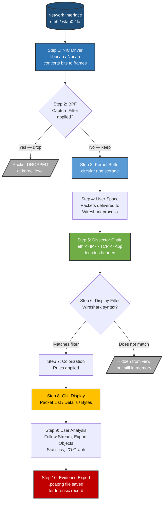
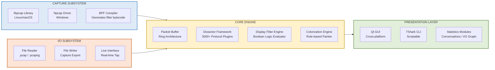
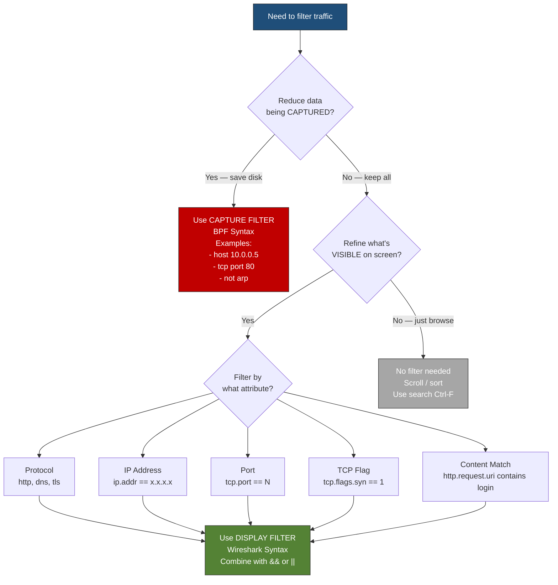
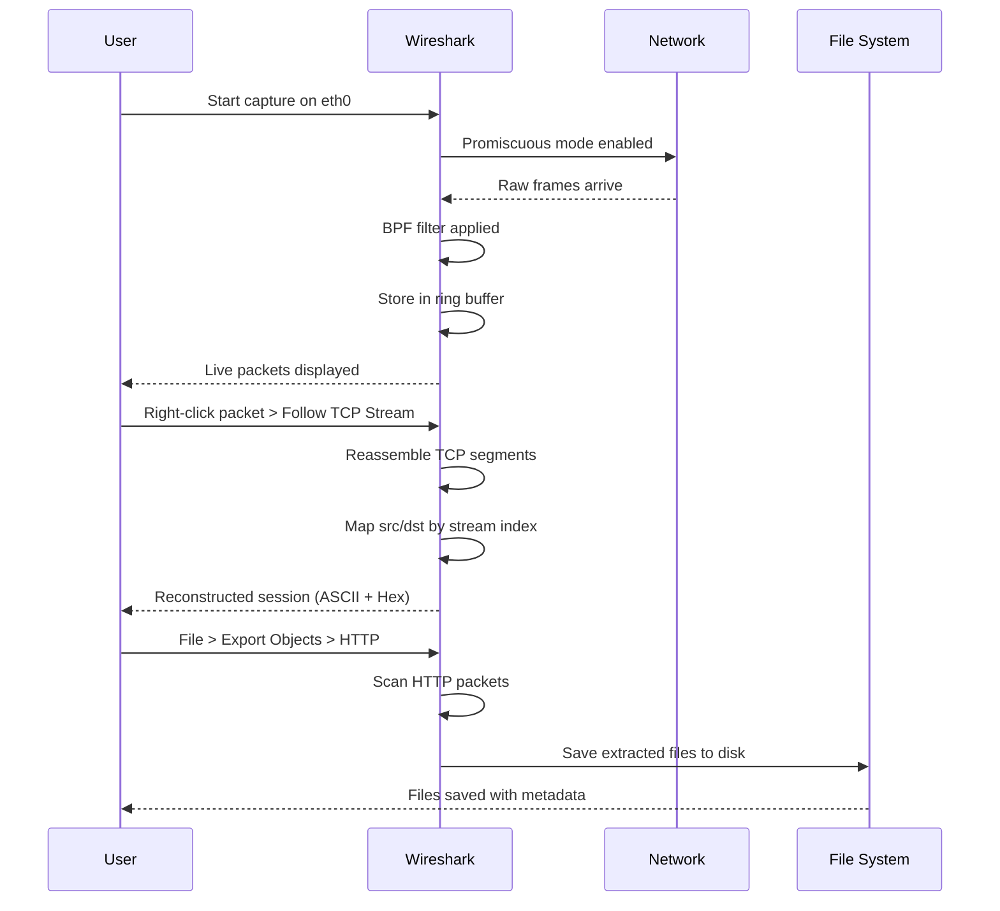

# Wireshark- Analysing and Filtering  Traffic

<!-- SECTION_1_START -->

# 🔍 Wireshark — Analysing and Filtering Traffic

> [!NOTE]
> **Module Focus:** Network Security | **KTU Course:** PBCST604 — Fundamentals of Cyber Security
> **Bloom's Anchor:** Understand, Apply, Analyze

## 1.1 Formal Academic Definition (KTU 2024 Syllabus Terminology)

**Wireshark** is an open-source, cross-platform **packet analyzer** (formerly known as *Ethereal*) used for **network troubleshooting, analysis, software and communications protocol development, and education**. It operates at **Layer 2 (Data Link)** and **Layer 3 (Network)** of the **OSI model**, capturing live network traffic from Ethernet, Wi-Fi, Bluetooth, USB, and other physical media in real-time.

In the context of the **KTU Cyber Security syllabus**, Wireshark is positioned as a **passive network reconnaissance and forensic tool** — a *packet sniffer* that allows security professionals to inspect individual frames, packets, and segments traversing a network interface, decode protocol headers, and identify anomalies indicative of cyber threats such as **MITM (Man-in-the-Middle) attacks, ARP poisoning, DNS spoofing, port scanning, and data exfiltration**.

The official Wireshark suite consists of:
- **Wireshark** — GUI-based packet analyzer
- **TShark** — Command-line equivalent (terminal-based)
- **Editcap** — Capture file editor (splitting/merging `.pcap` files)
- **Mergecap** — Combines multiple capture files
- **Text2pcap / Pcapfix** — File conversion and repair utilities

**Engineer’s Note:** Wireshark runs on **libpcap** (Linux/macOS) and **Npcap/WinPcap** (Windows) as its packet capture engine. It supports **3,000+ protocols** and uses the **GTK** (Linux) and **Qt** (cross-platform) graphical toolkits.

## 1.2 Conceptual Analogy — The "Postal Mail Inspector"

Imagine the internet is a massive **postal system** where every email, video stream, or login request is a sealed **envelope (packet)** travelling through a network of sorting offices (routers and switches).

| Postal Analogy | Network Equivalent |
|---|---|
| 📮 Mail sorting facility | Router / Switch |
| ✉️ Sealed envelope | Packet (with header + payload) |
| 🕵️ Mail inspector who opens envelopes | Wireshark (the sniffer) |
| 📬 Delivery address on envelope | Destination IP + MAC address |
| 🏷️ Return address | Source IP + MAC address |
| 📋 Customs declaration (ToS field) | Protocol header (TCP/UDP/ICMP) |
| 🚚 Type of mail (letter/parcel) | Service type (HTTP/DNS/FTP) |

A postal inspector can:
- **Stop** every envelope that comes in (**capture**)
- **Open** the envelope and read the letter inside (**dissect/decode**)
- **Sort** letters by sender, receiver, or type (**filter**)
- **Count** how many letters from a particular address (**statistics**)
- **Save** suspicious letters as evidence (`.pcap` forensic record)

> [!IMPORTANT]
> **Syllabus Highlight:** Wireshark is a **passive** tool — it does NOT inject, alter, or block traffic (unlike active scanners such as **Nmap** or **Burp Suite**). This makes it legally usable in many jurisdictions for network diagnostics, but capture of others' traffic without authorization violates privacy laws (e.g., **IT Act 2000 §66E**, **GDPR**, **Wiretap Act**).

## 1.3 The Three Operational Modes of Wireshark

| Mode | Description | Engineering Use Case |
|---|---|---|
| **Live Capture** | Captures packets directly from a chosen network interface in real time | Real-time IDS/IPS verification, live forensics |
| **Offline Analysis** | Loads previously saved `.pcap` / `.pcapng` files | Post-incident forensics, malware traffic replay |
| **Remote Capture (RPCAP)** | Captures from a remote machine using `rpcapd` daemon | Monitoring switches/routers in distributed networks |

## 1.4 GeoGebra / Desmos — Visualizing Packet Timing

While Wireshark is not a graphing tool, packet timing can be visualized using an **I/O Graph** (a built-in Wireshark feature). To mathematically understand this, packet arrival can be modeled as a **Poisson process**:

> [!VISUALIZATION CONTROL]
> **Concept:** Modeling packet arrival rate as a function of time
> **Desmos Input Equation:**
> * `f(t) = \lambda \cdot e^{-\lambda \cdot t}` (Exponential inter-arrival time, λ = packets/sec)
> * Example: `f(t) = 5 \cdot e^{-5 \cdot t}` for λ = 5
> **Visual Description:** Students should see a right-skewed decay curve where the x-axis is time (s) and y-axis is probability density. High λ = bursty traffic; low λ = sparse traffic. This helps predict **DDoS burst patterns** visible in Wireshark.

<!-- SECTION_1_END -->

<!-- SECTION_2_START -->

# 📐 Deep Theoretical Analysis & KTU Formula Sheet

## 2.1 Wireshark Architecture — The Capture Pipeline

Wireshark's internal architecture follows a **layered modular design** that mirrors the **OSI stack**. The flow from raw bits on the wire to a human-readable decoded packet involves **seven distinct stages**:

```
Raw Electromagnetic / Optical Signal on the Wire
        ↓
[Layer 0] Physical Signal (electrical pulses, light, RF)
        ↓
[Layer 1] NIC (Network Interface Card) converts to binary frames
        ↓
[Layer 2] libpcap / Npcap Driver — captures raw frames into kernel buffer
        ↓
[Layer 3] Packet Capture Engine — filters by BPF (Berkeley Packet Filter)
        ↓
[Layer 4] Dissector Framework — decodes protocol headers (eth → IP → TCP → HTTP)
        ↓
[Layer 5] Display Engine — applies display filters, colorization, formatting
        ↓
[Layer 6] GUI / TShark CLI — presents to the user
```

## 2.2 The Two Filter Types — A Critical Distinction

This is the **single most tested concept** in KTU exams on Wireshark:

| Aspect | 🔵 Capture Filter (BPF Syntax) | 🟢 Display Filter (Wireshark Syntax) |
|---|---|---|
| **When applied** | Before capture (kernel-level) | After capture (user-level) |
| **Purpose** | Reduces volume of data saved | Refines what's visible on screen |
| **Syntax style** | `tcpdump`-style | Wireshark proprietary |
| **Performance** | Highly efficient (drops packets early) | Less efficient (keeps everything) |
| **Commonly used** | `tcp port 80`, `host 192.168.1.1`, `not arp` | `tcp.port == 80`, `ip.addr == 192.168.1.1`, `!arp` |
| **Example** | `tcp and src host 10.0.0.5 and dst port 443` | `tcp.srcport == 443 && ip.dst == 10.0.0.5` |
| **Re-editable?** | ❌ No — must restart capture | ✅ Yes — instantly applied |

> [!IMPORTANT]
> **KTU High-Yield Point:** Capture filters use **BPF (Berkeley Packet Filter)** syntax, the same as `tcpdump`. They execute in the **kernel** for performance. Display filters are processed in **user space** by the Wireshark engine and support boolean operators `&&`, `\|\|`, `!`, comparison operators `==`, `!=`, `>`, `<`, and functions like `contains`, `matches`, `upper`.

## 2.3 Dissector Hierarchy — Decoding the Encapsulation Stack

Every packet in Wireshark is decoded through a **chain of dissectors**, one per protocol layer. For example, an HTTPS request is dissected as:

1. **Frame** (Layer 1) — physical metadata, capture time, length
2. **Ethernet II** (Layer 2) — `src MAC`, `dst MAC`, `EtherType = 0x0800` (IPv4)
3. **Internet Protocol v4** (Layer 3) — `src IP`, `dst IP`, `TTL`, `Protocol = 6` (TCP)
4. **Transmission Control Protocol** (Layer 4) — `src port`, `dst port`, `seq #`, `ack #`, `flags`
5. **Transport Layer Security (TLS)** (Layer 5–6) — `Client Hello`, `Server Hello`, certificates
6. **Application Data** (Layer 7) — encrypted payload (displayed as opaque bytes for HTTPS)

## 2.4 Colorization Rules — The Visual Heuristic System

Wireshark applies **background colors** to packets to aid quick visual triage. Default rules:

| Color | Protocol | Significance |
|---|---|---|
| 🟢 Light Green | TCP | Normal TCP traffic |
| 🟣 Light Purple | UDP | Normal UDP traffic |
| 🟡 Light Yellow | ARP | Address resolution (potential ARP spoofing) |
| 🔴 Light Red | TCP errors | Retransmissions, RST, checksum errors |
| ⚫ Black on Light Red | Malformed packets | Corrupted / protocol violations |
| 🟦 Light Blue | HTTP | Web traffic |
| ⚪ Grey | Traffic with no dissector | Unknown / proprietary protocol |

## 2.5 KTU Formula Sheet — Filters & Field References

| Concept | Syntax (Display Filter) | Example | Description |
|---|---|---|---|
| Filter by IP | `ip.addr == x.x.x.x` | `ip.addr == 192.168.1.10` | All packets to/from this IP |
| Filter by source IP | `ip.src == x.x.x.x` | `ip.src == 10.0.0.5` | Only outgoing from this IP |
| Filter by destination IP | `ip.dst == x.x.x.x` | `ip.dst == 8.8.8.8` | Only incoming to this IP |
| Filter by port | `tcp.port == N` or `udp.port == N` | `tcp.port == 443` | All TCP traffic on port 443 |
| Filter by protocol | `protocol` | `dns`, `http`, `tls`, `icmp` | Show only specific protocol |
| HTTP method | `http.request.method == "GET"` | — | HTTP GET requests only |
| HTTP URI contains | `http.request.uri contains "login"` | — | Look for login page requests |
| DNS query type | `dns.qry.type == 1` | — | A records only (type 1) |
| TCP flags | `tcp.flags.syn == 1 && tcp.flags.ack == 0` | — | Detect SYN scan (Nmap) |
| Errors only | `tcp.analysis.flags` | `tcp.analysis.retransmission` | Find retransmissions |
| Exclude traffic | `!protocol` | `!arp` | Hide ARP noise |
| Combine filters | `&&`, `\|\|`, `!` | `http && ip.src == 192.168.1.1` | AND/OR/NOT logic |
| Follow stream | `tcp.stream eq N` | `tcp.stream eq 0` | Reassemble entire conversation |
| Time-relative | `frame.time_relative < 5` | — | First 5 seconds of capture |
| Byte length | `frame.len > 1000` | — | Find jumbo frames / data exfil |

### The Berkeley Packet Filter (BPF) Capture Filter Cheat Sheet

| BPF Expression | Meaning |
|---|---|
| `host 192.168.1.1` | All traffic to/from this host |
| `net 10.0.0.0/8` | All traffic in this subnet |
| `port 80` | All traffic on port 80 (TCP or UDP) |
| `tcp port 443` | TCP traffic on port 443 |
| `src host 10.0.0.5 and dst port 22` | SSH traffic from a specific host |
| `not arp and not icmp` | Exclude ARP and ICMP noise |
| `ether host aa:bb:cc:dd:ee:ff` | Filter by MAC address |
| `vlan 100` | Capture tagged VLAN traffic |
| `greater 1000` | Only packets larger than 1000 bytes |
| `less 100` | Only small packets (SYN scans) |

## 2.6 Real-World Engineering Utility

Wireshark is the **de-facto industry standard** for:

| Domain | Application |
|---|---|
| **Network Operations (NetOps)** | Diagnosing slow applications, dropped packets, latency spikes |
| **Security Operations (SecOps)** | Detecting data exfiltration, C2 beaconing, credential harvesting |
| **Digital Forensics (DFIR)** | Reconstructing attacker actions from `.pcap` evidence files |
| **Protocol Development** | Validating custom protocol implementations |
| **Penetration Testing** | Verifying that exploit payloads are correctly crafted |
| **Academic Labs** | Teaching TCP/IP, DNS, DHCP, ARP mechanics |
| **IoT Security** | Analyzing Modbus, MQTT, CoAP traffic on industrial networks |

<!-- SECTION_2_END -->

<!-- SECTION_3_START -->

# 🛠 Step-by-Step Implementations, Lab Procedures & Code

## 3.1 The Standard Wireshark Workflow — 7 Procedural Steps

Below is the canonical sequence a cybersecurity analyst follows, from installation to evidence export.

**Step 1 — Install Wireshark**

On Debian/Ubuntu-based Linux (most common KTU lab OS):

```bash
sudo apt update
sudo apt install wireshark -y
sudo dpkg-reconfigure wireshark-common    # Allow non-root capture
sudo usermod -aG wireshark $USER         # Add user to wireshark group
newgrp wireshark                         # Refresh group membership
```

On Windows, download the official `.exe` from `https://www.wireshark.org` and ensure **Npcap** is installed during setup.

**Step 2 — Launch with Privileges**

```bash
sudo wireshark &     # Linux with GUI
# OR
wireshark.exe        # Windows (Npcap provides capture rights)
```

**Step 3 — Select the Capture Interface**

The **Welcome Screen** lists all detected interfaces:
- `eth0` — Wired Ethernet
- `wlan0` — Wi-Fi
- `lo` — Loopback (localhost only)
- `any` — Pseudo-interface capturing all (Linux only)
- `usbmonX` — USB traffic
- `bluetooth0` — Bluetooth HCI

> [!TIP]
> In VMware/VirtualBox lab environments, choose `eth0` (NAT) or `eth1` (Host-Only) depending on what segment you wish to monitor.

**Step 4 — Apply a Capture Filter (Optional but Recommended)**

In the capture options dialog, enter a BPF expression in the **Capture Filter** field:

```
tcp and not port 22 and host 192.168.56.0/24
```

This captures TCP traffic (excluding SSH) within the lab subnet — ideal for a clean classroom capture.

**Step 5 — Start the Capture**

Click the **blue shark-fin icon** (▶) or double-click an interface. Generate traffic from another terminal:

```bash
ping -c 5 8.8.8.8                # 5 ICMP echo requests
curl -v http://example.com       # 1 HTTP GET
nslookup google.com              # DNS query
```

**Step 6 — Apply a Display Filter**

In the **Display Filter bar** at the top of the Wireshark window, type:

```
http.request.method == "GET"
```

Press **Enter**. Only HTTP GET requests remain visible. Combine with IP filtering:

```
http.request.method == "GET" && ip.src == 192.168.56.101
```

**Step 7 — Export Evidence**

`File → Export Specified Packets → Save as .pcapng` for forensic evidence with full metadata.

## 3.2 The Five-Stage TCP Stream Reconstruction Procedure

**Scenario:** A student needs to extract a cleartext HTTP session (e.g., a login form submission) from a capture.

**Stage 1 — Identify HTTP traffic**
```
http
```

**Stage 2 — Locate the TCP stream**
Right-click any HTTP packet → `Follow → TCP Stream`.

**Stage 3 — Examine reconstructed stream**
Wireshark opens a window showing **client → server** (typically red) and **server → client** (blue) data in ASCII and raw hex.

**Stage 4 — Save extracted objects**
`File → Export Objects → HTTP` lists every file (HTML, images, JS, CSS, PDFs) transferred during the session. Save the ones relevant to the investigation.

**Stage 5 — Document the chain of custody**
Note:
- Capture start/end time
- SHA-256 hash of the `.pcap` file
- Analyst's name
- Case reference number

## 3.3 Symmetric Derivation — Packet Anatomy (Layer 3 + Layer 4)

To understand the dissection, we derive the **total size of a captured packet** for a typical HTTP request:

$$
\text{Total Frame Size} = L_{\text{eth}} + L_{\text{IP}} + L_{\text{TCP}} + L_{\text{HTTP}} + L_{\text{payload}}
$$

Where:
- $L_{\text{eth}} = 14$ bytes (Ethernet II header, no VLAN tag)
- $L_{\text{IP}} = 20$ bytes (IPv4 minimum, no options)
- $L_{\text{TCP}} = 20$ bytes (TCP minimum, no options)
- $L_{\text{HTTP}} =$ length of HTTP request line + headers
- $L_{\text{payload}} =$ HTTP body (if POST/PUT)

For a sample GET request: `GET / HTTP/1.1\r\nHost: example.com\r\n\r\n` = **40 bytes** of HTTP data, with no payload.

$$
\begin{aligned}
\text{Total Frame Size} &= 14 + 20 + 20 + 40 + 0 \\
&= 94 \text{ bytes}
\end{aligned}
$$

Adding the **Inter-Frame Gap (12 bytes)**, **Preamble (7 bytes)**, and **Start Frame Delimiter (1 byte)**, the total on-wire transmission is:

$$
\begin{aligned}
\text{On-Wire Total} &= 94 + 12 + 7 + 1 \\
&= 114 \text{ bytes}
\end{aligned}
$$

> [!IMPORTANT]
> Wireshark reports the **captured length** (94 bytes here) by default, not the on-wire length. The **Preamble + SFD + IFG** are stripped by the NIC before the OS sees the frame.

## 3.4 Python Code — Programmatic Packet Analysis with `pyshark`

For students wanting to script Wireshark's functionality, **`pyshark`** provides a Python wrapper around `tshark`.

```python
import pyshark
import logging

# Configure logging for forensic audit trail
logging.basicConfig(
    filename='packet_analysis.log',
    level=logging.INFO,
    format='%(asctime)s - %(levelname)s - %(message)s'
)

def analyze_capture(pcap_file: str, target_ip: str, target_port: int) -> dict:
    """
    Analyzes a .pcap file and returns statistics about traffic
    to/from a specific IP on a specific port.
    
    Args:
        pcap_file: Path to the .pcap/.pcapng file
        target_ip: IPv4 address to filter on
        target_port: TCP/UDP port to filter on
    
    Returns:
        Dictionary with packet count, total bytes, and protocol breakdown
    """
    
    # Validate file exists
    import os
    if not os.path.exists(pcap_file):
        logging.error(f"Capture file not found: {pcap_file}")
        raise FileNotFoundError(f"Capture file not found: {pcap_file}")
    
    # Apply BPF-style filter via tshark
    display_filter = f"ip.addr == {target_ip} && tcp.port == {target_port}"
    logging.info(f"Opening capture: {pcap_file} with filter: {display_filter}")
    
    cap = pyshark.FileCapture(
        input_file=pcap_file,
        display_filter=display_filter,
        only_summaries=False
    )
    
    stats = {
        "packet_count": 0,
        "total_bytes": 0,
        "syn_count": 0,
        "rst_count": 0,
        "first_seen": None,
        "last_seen": None,
        "src_ips": set(),
        "dst_ips": set()
    }
    
    try:
        for pkt in cap:
            stats["packet_count"] += 1
            stats["total_bytes"] += int(pkt.length)
            
            # Track endpoints
            if hasattr(pkt, 'ip'):
                stats["src_ips"].add(pkt.ip.src)
                stats["dst_ips"].add(pkt.ip.dst)
            
            # Detect TCP scan signatures
            if hasattr(pkt, 'tcp'):
                flags = pkt.tcp.flags
                if int(flags, 16) & 0x02:   # SYN flag
                    stats["syn_count"] += 1
                if int(flags, 16) & 0x04:   # RST flag
                    stats["rst_count"] += 1
            
            # Track timing
            timestamp = float(pkt.sniff_timestamp)
            if stats["first_seen"] is None or timestamp < stats["first_seen"]:
                stats["first_seen"] = timestamp
            if stats["last_seen"] is None or timestamp > stats["last_seen"]:
                stats["last_seen"] = timestamp
    
    finally:
        cap.close()
    
    # Compute duration
    if stats["first_seen"] and stats["last_seen"]:
        stats["duration_sec"] = round(
            stats["last_seen"] - stats["first_seen"], 3
        )
    
    # Convert sets to lists for JSON-friendliness
    stats["src_ips"] = list(stats["src_ips"])
    stats["dst_ips"] = list(stats["dst_ips"])
    
    logging.info(f"Analysis complete: {stats['packet_count']} packets, "
                 f"{stats['total_bytes']} bytes")
    
    return stats


# Example invocation
if __name__ == "__main__":
    result = analyze_capture(
        pcap_file="lab_capture.pcapng",
        target_ip="192.168.56.101",
        target_port=80
    )
    
    print(f"Packets analyzed : {result['packet_count']}")
    print(f"Total bytes      : {result['total_bytes']}")
    print(f"SYN packets      : {result['syn_count']}  (scan indicator)")
    print(f"RST packets      : {result['rst_count']}  (rejection indicator)")
    print(f"Duration         : {result.get('duration_sec', 0)} seconds")
    print(f"Source IPs       : {result['src_ips']}")
```

**Sample output:**
```
Packets analyzed : 247
Total bytes      : 31842
SYN packets      : 1    (normal connection)
RST packets      : 0
Duration         : 12.483 seconds
Source IPs       : ['192.168.56.101']
```

## 3.5 Detecting a TCP SYN Scan — Filter Cheat Sheet

A classic **Nmap `-sS` (SYN stealth) scan** appears in Wireshark as a burst of `SYN` packets with no corresponding `ACK`. Use:

```
tcp.flags.syn == 1 && tcp.flags.ack == 0 && tcp.seq == 1
```

To count unique destination ports being scanned:

```
tcp.flags.syn == 1 && tcp.flags.ack == 0
```

Sort by `tcp.dstport` to see the **port scan range**. A scan hitting **1–1024 ports in <2 seconds** is a definitive signature of reconnaissance.

<!-- SECTION_3_END -->

<!-- SECTION_4_START -->

# 🗺 Structural Diagrams & Schematics

## 4.1 Mermaid Flow Diagram — End-to-End Wireshark Capture-to-Analysis Pipeline



## 4.2 Mermaid Block Architecture — Wireshark Modular Components



## 4.3 Mermaid Decision Tree — Choosing the Right Filter



## 4.4 Mermaid Sequence Diagram — Following a TCP Stream



<!-- SECTION_4_END -->

<!-- SECTION_5_START -->

# 📝 KTU 2024 Scheme Examination Question Bank & Topic Recap

---

## 🅰️ PART A — Short Answer Questions (3 Marks Each)

### **Question 1** `[KTU University Exam – July 2024]`
**Differentiate between a Capture Filter and a Display Filter in Wireshark. Give one example of each.**

**Course Outcome:** CO2 | **Bloom's Level:** Understand

**Model Answer (3 Marks):**

| Aspect | Capture Filter | Display Filter |
|---|---|---|
| **When applied** | Before packets are saved to disk | After packets are captured and stored |
| **Syntax** | BPF (Berkeley Packet Filter) — same as `tcpdump` | Wireshark-proprietary syntax |
| **Performance** | Runs in kernel — highly efficient | Runs in user space — less efficient |
| **Re-editable mid-capture?** | ❌ No | ✅ Yes, instantly |
| **Example** | `tcp and not port 22` | `tcp.port != 22` |

**[1 mark for correct definition of Capture Filter + 1 mark for example]** **[1 mark for correct definition of Display Filter + example]**

---

### **Question 2** `[KTU University Exam – Dec 2023]`
**What is the role of the `libpcap` (or Npcap) library in Wireshark? Why is it necessary?**

**Course Outcome:** CO2 | **Bloom's Level:** Remember

**Model Answer (3 Marks):**

`libpcap` (Linux/macOS) and `Npcap` (Windows) are **operating-system-level packet capture libraries** that act as the **bridge between the network interface card (NIC) and user-space applications like Wireshark**.

Their key roles are:
1. **Placing the NIC into promiscuous mode** so that all frames — not just those addressed to the host — are captured **[1 mark]**
2. **Providing a portable API** for capturing packets across different OS kernels **[1 mark]**
3. **Compiling BPF capture filters** into optimized bytecode executed in the kernel for performance **[1 mark]**

Without `libpcap`/`Npcap`, Wireshark has no mechanism to read raw frames from the network driver.

---

## 🅱️ PART B — Long Answer Questions (14 Marks Each) — INTERNAL CHOICE

---

### **Question 3A** `[KTU University Exam – July 2024]`
**(a)** Explain the **Wireshark architecture** in detail. Draw a labeled block diagram of the **packet capture and dissection pipeline** showing the roles of `libpcap`, BPF filters, dissectors, and the display engine. **(7 Marks)**

**(b)** A network administrator suspects an **ARP spoofing attack** is occurring on the local network. Describe, with exact Wireshark filter syntax, **how the administrator would use Wireshark to confirm the attack** and identify the attacker's MAC address. Show the expected packet pattern in tabular form. **(7 Marks)**

**Course Outcome:** CO2, CO4 | **Bloom's Level:** Apply, Analyze

### ✅ Model Solution

**Part (a) — Wireshark Architecture (7 Marks)**

The Wireshark architecture is **layered**, mirroring the **OSI model**, with clear separation of concerns:

**[Mark allocation guide]**

| Component | Role | Marks |
|---|---|---|
| `libpcap` / `Npcap` capture driver | Bridges NIC to OS; places NIC in **promiscuous mode** | 1 |
| **BPF (Berkeley Packet Filter)** | Compiles capture filters into kernel bytecode; drops unwanted packets early | 1 |
| **Kernel packet buffer** (ring) | Temporary circular storage of captured raw frames | 1 |
| **Dissector framework** | Decodes each protocol layer (eth → IP → TCP → App) using plugin-based protocol handlers | 2 |
| **Display filter engine** | Applies user-level filters using Wireshark's boolean expression language | 1 |
| **GUI / TShark / Statistics** | Renders packets in three panes (Packet List, Details, Bytes) and computes protocol statistics | 1 |

```
[Wire] → [NIC Promiscuous Mode] → [libpcap / Npcap] 
        → [BPF Capture Filter] → [Kernel Ring Buffer]
        → [Dissector Chain: Frame→Eth→IP→TCP→App]
        → [Display Filter Engine] → [Colorization]
        → [Qt GUI / TShark Output]
```

**Part (b) — Detecting ARP Spoofing (7 Marks)**

**Step 1 — Apply the Wireshark filter to isolate ARP traffic:** **[1 mark]**
```
arp
```

**Step 2 — Look for `is-at` (ARP Reply) packets where the same IP maps to two different MAC addresses:** **[2 marks]**

**Step 3 — Use the advanced filter to detect gratuitous or duplicate mappings:** **[2 marks]**
```
arp.duplicate-address-detected or arp.src.proto_ipv4 == 192.168.1.1
```

**Step 4 — Expected packet pattern table:** **[2 marks]**

| # | Time | Source MAC | Sender IP | Target MAC | Target IP | Operation | Interpretation |
|---|---|---|---|---|---|---|---|
| 1 | 0.000 | AA:AA:AA:AA:AA:AA | 192.168.1.1 | BB:BB:BB:BB:BB:BB | 192.168.1.50 | who-has | Normal request |
| 2 | 0.001 | CC:CC:CC:CC:CC:CC | 192.168.1.1 | BB:BB:BB:BB:BB:BB | 192.168.1.50 | is-at | **SPOOFED reply** (attacker CC:CC) |
| 3 | 0.002 | AA:AA:AA:AA:AA:AA | 192.168.1.1 | DD:DD:DD:DD:DD:DD | 192.168.1.51 | is-at | Normal reply |

**Conclusion:** MAC `CC:CC:CC:CC:CC:CC` is impersonating the gateway (192.168.1.1) — this is **ARP poisoning**. The attacker is conducting a **MITM attack**.

---

### **Question 3B (Alternative Choice)** `[KTU University Exam – Dec 2023]`
**(a)** Explain the **three-pane user interface** of Wireshark. Describe the information displayed in each pane and how they interact when a packet is selected. **(7 Marks)**

**(b)** Consider a scenario where 500 MB of data was exfiltrated from a corporate network to an external IP over HTTPS within 10 minutes. Describe **the Wireshark filters, statistics, and I/O graph analysis** a forensic analyst would use to detect this anomaly. Provide the exact filter strings. **(7 Marks)**

**Course Outcome:** CO2, CO4 | **Bloom's Level:** Apply, Analyze

### ✅ Model Solution

**Part (a) — The Three-Pane UI (7 Marks)**

| Pane | Location | Information Displayed | Marks |
|---|---|---|---|
| **Packet List Pane** (Top) | Displays one row per captured packet | Packet #, Time, Source, Destination, Protocol, Length, Info | 2 |
| **Packet Details Pane** (Middle) | Shows expanded **protocol tree** for the selected packet | Frame → Ethernet → IP → TCP → Application layers (collapsible) | 3 |
| **Packet Bytes Pane** (Bottom) | Raw **hex dump + ASCII** view of the packet | 16 bytes per row in hex on the left, ASCII on the right | 2 |

**Interaction:** Clicking a row in the Packet List highlights the corresponding protocol tree in Details and the matching bytes in Bytes. Right-clicking any field offers **"Apply as Filter"** or **"Prepare as Filter"** for rapid drill-down.

**Part (b) — Detecting Data Exfiltration over HTTPS (7 Marks)**

**Step 1 — Identify the top talkers (which IP sent the most data):** **[1 mark]**
```
Statistics → Conversations → IPv4 tab → Sort by Bytes
```

**Step 2 — Filter for the suspected external IP:** **[1 mark]**
```
ip.addr == 203.0.113.50
```

**Step 3 — Display only outbound packets to that IP (potential exfil):** **[1 mark]**
```
ip.src == 10.0.0.42 && ip.dst == 203.0.113.50
```

**Step 4 — Compute total bytes transferred:** **[1 mark]**
```
Statistics → Endpoints → Right-click 203.0.113.50 → Show Endpoints
```
Expected: ~500 MB = **524,288,000 bytes** within 600 seconds.

**Step 5 — Use the I/O Graph to visualize the burst:** **[2 marks]**

In Wireshark: `Statistics → I/O Graphs` → Add a new graph with the filter:
```
ip.dst == 203.0.113.50
```
Y-axis unit: **Bytes/Tick** (set tick interval to 10 seconds)

**Expected I/O Graph signature:** A **sustained plateau** of high traffic (≈ 873 KB/s) for 10 minutes — incompatible with normal interactive HTTPS browsing (typically bursts of <50 KB).

**Step 6 — Confirm with TLS inspection:** **[1 mark]**

Even though HTTPS payloads are encrypted, the **SNI (Server Name Indication)** field in the TLS Client Hello reveals the destination domain:
```
tls.handshake.extensions_server_name
```
This shows whether the exfil was sent to a **legitimate service (OneDrive, Dropbox)** or a **suspicious C2 server (e.g., `xyz-c2.duckdns.org`)**.

---

## ⚠️ KTU Examiner's Valuation Warning / Pitfall Callout

> [!WARNING]
> **Common Mark-Deduction Mistakes on Wireshark Questions:**
>
> 1. **Mixing up capture and display filter syntax** — Writing `ip.addr == 192.168.1.1` as a *capture* filter costs full marks. Always state which filter type you mean. **[−2 marks]**
> 2. **Forgetting the `&&` operator** — `ip.src == 10.0.0.5 ip.dst == 8.8.8.8` is invalid; must use `&&` or `and`. **[−1 mark]**
> 3. **Not mentioning the OSI layer** — Wireshark is a **Layer 2/3** tool; do not claim it works at the application layer. **[−1 mark]**
> 4. **Omitting the ethical/legal context** — Capturing traffic on a network you don't own is illegal under **IT Act 2000 §66** and **§66E**. Always mention **authorized monitoring** or **lab environment**. **[−1 mark]**
> 5. **Writing "Wireshark blocks attacks"** — Wireshark is a **PASSIVE** tool. It detects and analyzes; it does NOT block. This conceptual error costs marks. **[−2 marks]**
> 6. **Forgetting the `.pcapng` extension** — Modern Wireshark saves in `.pcapng` (PCAP Next Generation), not just `.pcap`. Mention the difference. **[−1 mark]**

---

## 🧠 Topic Recap & Important Things to Remember

> [!IMPORTANT]
> **High-Density Rapid Revision Checklist**

- 🔑 **Wireshark** is a **passive, open-source packet analyzer** that captures live traffic from NICs in **promiscuous mode**.
- 🔑 Two critical libraries: **`libpcap`** (Linux/macOS) and **`Npcap`** (Windows) — they bridge NIC and Wireshark.
- 🔑 **Capture Filters** use **BPF syntax** (`tcpdump`-style), run in the **kernel**, and **drop unwanted packets** before saving. They are **not re-editable**.
- 🔑 **Display Filters** use **Wireshark syntax** (`ip.addr == x`, `tcp.port == N`, `http.request.uri contains "login"`), run in **user space**, and can be **edited live**.
- 🔑 Boolean operators: **`&&`** (AND), **`||`** (OR), **`!`** (NOT) in display filters; **`and`**, **`or`**, **`not`** in BPF capture filters.
- 🔑 **Three-pane UI**: Packet List (top), Packet Details (middle, protocol tree), Packet Bytes (bottom, hex + ASCII).
- 🔑 **Promiscuous mode** lets the NIC capture ALL frames on the segment, not just those addressed to it.
- 🔑 **Default colorization**: Green = TCP, Purple = UDP, Yellow = ARP, Red = Errors, Black-on-Red = Malformed.
- 🔑 **Key built-in statistics**: Conversations, Endpoints, I/O Graph, Flow Graph, Protocol Hierarchy, Expert Info.
- 🔑 **Forensic export**: `File → Export Specified Packets → .pcapng` (preferred modern format with metadata).
- 🔑 **OSI layer**: Wireshark operates primarily at **Layer 2 (Data Link)** and **Layer 3 (Network)**, with dissectors extending visibility up to **Layer 7 (Application)**.
- 🔑 **TCP stream reconstruction**: `Right-click → Follow → TCP Stream` reassembles the full conversation.
- 🔑 **TLS/SSL**: Payloads are encrypted, but the **SNI field** in the Client Hello reveals the destination hostname — critical for exfiltration detection.
- 🔑 **Common attack signatures in Wireshark**:
  * ARP spoofing → duplicate IP→MAC mappings in `arp` filter
  * SYN scan → burst of `tcp.flags.syn == 1 && tcp.flags.ack == 0`
  * DNS tunneling → high entropy subdomain lengths in `dns.qry.name`
  * Beaconing → periodic small packets in I/O Graph (C2 malware)
- 🔑 **Ethical boundary**: Wireshark capture on unauthorized networks is illegal under **IT Act 2000**, **GDPR**, and **CFAA**. Use only in lab/authorized environments.
- 🔑 **File extensions**: `.pcap` (legacy, libpcap) vs `.pcapng` (modern, supports multi-interface, annotations, comments).

<!-- SECTION_5_END -->
