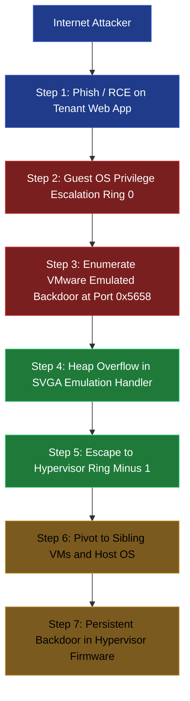
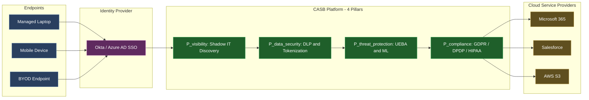
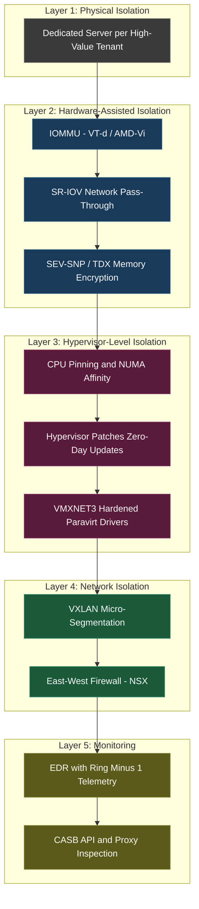
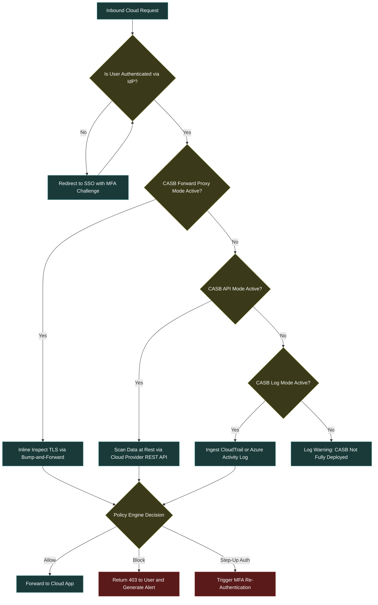

# Cloud Infrastructure Vectoring: Virtualization vulnerabilities, Hypervisor escapes, multi-tenancy isolation, CASB

<!-- SECTION_1_START -->
# Cloud Infrastructure Vectoring: Virtualization Vulnerabilities, Hypervisor Escapes, Multi-Tenancy Isolation, and CASB

> [!IMPORTANT]
> **KTU 2024 Scheme | Course PBCST604 | Module 3 | Outcome: CO3 | Cognitive Domain: Understand & Apply**
> This module addresses the **attack surface exposed by the shared-resource nature of cloud platforms**. It is a high-weightage area for the End Semester Evaluation (ESE) and frequently appears as a 14-mark analytical question.

---

## 1.1 Formal KTU Definition

> [!NOTE]
> **Core Definition (Strictly as per KTU 2024 Module-3 Syllabus)**
> *Cloud Infrastructure Vectoring* is the systematic study of security weaknesses arising from the **logical abstraction layers** (hypervisors, virtual machines, containers, and orchestration engines) that underpin modern cloud platforms (IaaS, PaaS, SaaS). It encompasses four critical threat domains: **(i) Virtualization Vulnerabilities** (flaws in VM components), **(ii) Hypervisor Escapes** (VM-to-host privilege boundary breaches), **(iii) Multi-Tenancy Isolation Failures** (cross-tenant data leakage), and **(iv) CASB (Cloud Access Security Broker) defensive countermeasures**.

### 1.2 Intuitive Conceptual Analogy

> [!TIP]
> **The "Apartment Building" Analogy**
> Imagine a cloud data center as a **high-rise apartment building (the physical host server)**:
>
> - Each **apartment (Virtual Machine)** is rented by a different tenant. Tenants believe they have a private, isolated home.
> - The **building's foundation, plumbing, electrical mains, and elevator system (Hypervisor)** are shared infrastructure managed by the building owner (Cloud Service Provider).
> - A **Hypervisor Escape** is equivalent to a tenant breaking out of their apartment and gaining access to the building's master control room, where they can now enter *any* apartment, cut power, or read all mailboxes.
> - A **Multi-Tenancy Isolation Failure** is when a tenant discovers a **shared ventilation duct (side-channel)** that lets them listen to conversations in the neighboring apartment.
> - **A CASB is the *security guard at the building's main gate* combined with a *24/7 CCTV and mail-scanning service* (API inspection)** — it monitors every person and every parcel entering or leaving the building, even when tenants use unapproved courier services (Shadow IT / Shadow Cloud).

---

### 1.3 Taxonomy of Cloud Infrastructure Threats

| Threat Class | Target Layer | Primary Impact | KTU Module Mapping |
| :--- | :--- | :--- | :--- |
| **Virtualization Vulnerabilities** | VM Kernel / Guest OS | Compromise of single tenant workload | Module 3.1 |
| **Hypervisor Escapes** | Type-1 / Type-2 Hypervisor | Complete host & sibling-VM compromise | Module 3.2 |
| **Multi-Tenancy Isolation Failures** | CPU Cache / Memory Bus / Network | Cross-tenant data leakage | Module 3.3 |
| **CASB Defensive Layer** | North-South / East-West Traffic API Plane | Visibility, Compliance, DLP, Threat Prevention | Module 3.4 |

> [!IMPORTANT]
> **Syllabus Highlight — Hypervisor Classification**
> The KTU 2024 syllabus explicitly requires students to differentiate between:
> - **Type-1 (Bare-Metal) Hypervisor**: Runs *directly* on host hardware (e.g., VMware ESXi, Microsoft Hyper-V, Citrix XenServer). **Higher attack cost**, but compromise is catastrophic.
> - **Type-2 (Hosted) Hypervisor**: Runs as an application atop a host OS (e.g., Oracle VirtualBox, VMware Workstation). **Larger attack surface** because the host OS itself is a vulnerable layer.

---

### 1.4 GeoGebra / Visualization Note

> [!VISUALIZATION CONTROL]
> **Concept:** Trust Boundary Crossing in a Virtualized Stack
> **Geometric Representation:** A nested concentric-circles model on a 2D plane.
> **Input Equations (Concentric Rings, Radius $r$):**
> * Ring 0: $r_0 = 1$ — **Physical Hardware** (CPU, RAM, Disk)
> * Ring 1: $r_1 = 2$ — **Hypervisor (VMM)**
> * Ring 2: $r_2 = 3$ — **Guest VM A (Tenant 1)**
> * Ring 3: $r_3 = 4$ — **Guest VM B (Tenant 2)**
> **Visual Description:** The student should observe that the **Hypervisor (Ring 1) is the single shared trust boundary** that separates all tenants from the bare metal. A successful *escape* from Ring 2 or Ring 3 **into Ring 1** collapses the entire concentric isolation model into a single compromised plane.

<!-- SECTION_1_END -->

<!-- SECTION_2_START -->
# Deep Theoretical Analysis & KTU High-Yield Formula Sheet

## 2.1 Virtualization Vulnerabilities — Architectural Foundations

> [!NOTE]
> **Definition (Precise)**
> A *Virtualization Vulnerability* is a software/hardware weakness in any component of the virtualized stack — the **VMM (Virtual Machine Monitor), paravirtualization drivers, emulated hardware devices, or the VM escape surface** — that allows an attacker to violate the CIA triad of a virtual workload.

### 2.1.1 Attack Surface of a Virtualized System

The **attack surface** $S$ of a virtualized system is a *union* of all externally reachable code paths:

$$
S_{virt} \;=\; S_{vm\_kernel} \;\cup\; S_{hypervisor\_api} \;\cup\; S_{emulated\_devices} \;\cup\; S_{vmware\_tools} \;\cup\; S_{network\_bridge}
$$

> [!IMPORTANT]
> **Why It Matters in KTU Boards**
> A valuation key that examiners look for is the **identification of *which ring* is being attacked**. A vulnerability in $S_{vm\_kernel}$ compromises *one tenant*. A vulnerability in $S_{hypervisor\_api}$ compromises *all tenants and the host*. The blast-radius ratio is often the answer differentiator in 7-mark sub-questions.

### 2.1.2 Categories of Virtualization Vulnerabilities

1. **VM Escape Vulnerabilities** — Exiting the VM sandbox (discussed in §2.2).
2. **VM Hopping** — Attacker compromises the hypervisor's VM-to-VM communication channel and impersonates another VM's MAC/IP to intercept traffic.
3. **VM Theft / Snapshot Tampering** — Unauthorized copying of a `.vmdk`, `.vhd`, or `.qcow2` file; offline password cracking against captured memory snapshots.
4. **Resource Exhaustion (DoS)** — A noisy-neighbor VM monopolizes CPU cache lines, I/O bandwidth, or NIC queues, starving co-resident tenants. This is technically a *multi-tenancy isolation failure* and is covered in §2.3.
5. **Insecure VM Migration** — VMware vMotion / Live Migration traffic transmitted in plaintext is susceptible to MITM. The mitigation is **IPsec / WireGuard tunneling** of the vMotion network.
6. **Virtual Network Misconfiguration** — Erroneously assigning two tenants to the same **VXLAN segment** (VLAN ID collision or absence of NSX micro-segmentation).

---

## 2.2 Hypervisor Escapes — The Apex Threat

> [!NOTE]
> **Definition (Board-Ready)**
> A *Hypervisor Escape* is a class of exploit in which code executing inside a **Guest VM** (with privileges no higher than Guest Ring 0) gains **unauthorized execution or read/write access to the Hypervisor, the Host OS, or peer Guest VMs** — thereby breaking the **hardware-enforced or software-enforced isolation contract** of the virtualization platform.

### 2.2.1 Trust Ring Model in Virtualization

The traditional x86 privilege ring model is **restructured** under virtualization:

$$
\text{Ring } 3 \;\to\; \text{User Apps (in Guest VM)}
$$
$$
\text{Ring } 0 \;\to\; \text{Guest OS Kernel (in Guest VM)}
$$
$$
\text{Ring } {-1} \;\to\; \text{Hypervisor / VMM}
$$
$$
\text{Ring } {-2} \;\to\; \text{SMM (System Management Mode) — Intel ME / AMD PSP}
$$

> [!TIP]
> **Exam Tip:** A hypervisor escape is, in essence, a **Ring 0 → Ring -1 privilege escalation** occurring *from within a VM*. The attacker pivots from "guest kernel" to "host hypervisor" without ever leaving the physical server.

### 2.2.2 Hypervisor Escape Attack Lifecycle (6 Phases)

1. **Reconnaissance** — Attacker scans the emulated hardware backplane (e.g., `vmci://`, `vmware.log`, `/dev/virtio-*`).
2. **Initial Foothold** — Compromise of a service in the guest (browser exploit, RCE on a web app hosted in the VM).
3. **Guest Privilege Escalation** — Local kernel exploit to obtain **Ring 0 inside the guest**.
4. **Hypervisor API Probing** — Enumeration of emulated devices, hypercalls, and paravirt backdoors (e.g., `VMware Tools` backdoor via `IN`/`OUT` instructions to port `0x5658`).
5. **Exploit of Emulated Device** — Buffer overflow / use-after-free in the VMM's handling of a crafted backdoor command. **Historical example: CVE-2012-1518 (VMware)**, **CVE-2017-4903 (VMware SVGA)**, **CVE-2019-14899 (KVM/VirtIO)**.
6. **Pivot** — Attacker now has **Ring -1 (host)** privileges and can read all guest memory, install backdoors, or destroy the host.

### 2.2.3 Famous Hypervisor Escape CVEs (KTU High-Yield)

| CVE ID | Year | Vendor | Component | Technique |
| :--- | :---: | :--- | :--- | :--- |
| **CVE-2012-1518** | 2012 | VMware | VMware Tools | Backdoor I/O port buffer overflow |
| **CVE-2017-4903** | 2017 | VMware | SVGA Device | Heap overflow in 3D rendering |
| **CVE-2019-14899** | 2019 | KVM/QEMU | VirtIO | Memory corruption in net Rx |
| **CVE-2020-3960** | 2020 | VMware | vCenter | Unauthenticated RCE |
| **CVE-2021-21972** | 2021 | VMware | vSphere | VSAN Health Check plugin RCE |
| **CVE-2023-34048** | 2023 | VMware | vCenter | DCE/RPC heap overflow |

> [!WARNING]
> **Valuation Warning — Do NOT Confuse These**
> - **CVE-2017-4903** is a *VM escape* (guest → host).
> - **CVE-2021-21972** is an *unauthenticated RCE* (network → vCenter management plane). It is **NOT a VM escape** in the strict sense. Examiners will deduct marks if these are conflated.

---

## 2.3 Multi-Tenancy Isolation Failures

> [!NOTE]
> **Definition (Board-Ready)**
> *Multi-Tenancy Isolation Failure* occurs when the **logical boundaries** separating two co-resident tenants on the same physical hardware are breached, enabling **information disclosure, data tampering, or service degradation** across the tenant boundary.

### 2.3.1 The Three Primary Isolation Dimensions

$$
I_{total} \;=\; I_{compute} \;\cap\; I_{memory} \;\cap\; I_{network} \;\cap\; I_{storage}
$$

A failure in **any one** dimension compromises the entire isolation guarantee.

#### A. Compute Isolation Failure
- **CPU Side-Channel Attacks**: Spectre (2018), Meltdown (2018), Foreshadow (2018), ZombieLoad (2019), CrossTalk (2020).
- **Mechanism**: Speculative execution leaves traces in the CPU cache that can be measured via **Flush+Reload**, **Prime+Probe**, or **Flush+Flush** timing attacks.
- **Formula for Cache-Hit Detection Latency**:

$$
\Delta t_{cache} \;=\; t_{LLC\_hit} \;-\; t_{LLC\_miss} \;\approx\; 40 \text{ ns} \;\text{(typical)}
$$

- An attacker measures access-time deltas to infer *which* cache lines the victim touched → reconstructs cryptographic keys, keystrokes, or sensitive data.

#### B. Memory Isolation Failure
- **Rowhammer Attacks** (DRAM disturbance errors).
- By repeatedly accessing (hammering) DRAM rows, an attacker can induce **bit flips** in adjacent rows belonging to another VM.
- **DRAM addressing math** (relevant for derivation questions):

$$
\text{Row Address} \;=\; \big( \text{BA} \cdot 2^{RA} \big) \;+\; RA
$$

where $BA$ = Bank Address, $RA$ = Row Address. Aggressive activation of one row causes capacitive coupling that flips bits in the **physically adjacent** row of a co-tenant.

#### C. Network Isolation Failure
- **VLAN Hopping**: Attacker sends double-tagged 802.1Q frames to traverse VLAN boundaries.
- **VXLAN Misconfiguration**: A misconfigured VTEP (VXLAN Tunnel Endpoint) forwards traffic to the wrong tenant segment.
- **ARP Spoofing / NS Spoofing**: Attacker poisons the L2 table of the virtual switch to intercept peer-VM traffic.

---

## 2.4 CASB — Cloud Access Security Broker

> [!NOTE]
> **Definition (Board-Ready)**
> A *Cloud Access Security Broker (CASB)* is a **security policy enforcement point** that sits between cloud service consumers and cloud service providers to **monitor, detect, and control** cloud-related activities — addressing the four pillars of Gartner's CASB framework: **Visibility, Data Security, Threat Protection, and Compliance**.

### 2.4.1 Gartner's Four Pillars of CASB

$$
\text{CASB}_{functionality} \;=\; \big\{ P_{visibility},\; P_{data\_security},\; P_{threat\_protection},\; P_{compliance} \big\}
$$

| Pillar | Description | Typical Implementation |
| :--- | :--- | :--- |
| **$P_{visibility}$** | Discovery of Shadow IT / Shadow Cloud | Log analysis, firewall proxy, agent-less discovery |
| **$P_{data\_security}$** | DLP, encryption, tokenization, DRM | Out-of-band DLP engine, BYOK/HYOK |
| **$P_{threat\_protection}$** | UEBA, anomaly detection, malware sandboxing | ML-driven behavioral analytics |
| **$P_{compliance}$** | GDPR, HIPAA, PCI-DSS, DPDP Act enforcement | Policy templates, audit reporting |

### 2.4.2 CASB Deployment Modes (KTU Frequently Tested)

1. **Forward Proxy** — Installed on every endpoint; intercepts outbound traffic destined for sanctioned cloud apps.
2. **Reverse Proxy** — Placed in front of the cloud app; all browser traffic to the SaaS app is routed through the CASB.
3. **API Mode** — CASB uses the cloud provider's **REST API** (e.g., Microsoft Graph, Google Workspace Admin SDK) to scan data *at rest* inside the SaaS application.
4. **Log Mode (SIEM-style)** — CASB ingests cloud provider audit logs (CloudTrail, Azure Activity Log) for post-hoc analysis.

> [!TIP]
> **Exam-Boost Formula**:
>
> $$
> \text{CASB Coverage} \;=\; \underbrace{F_{proxy}}_{\text{Real-time in-flight}} \;+\; \underbrace{F_{api}}_{\text{Data at rest}} \;+\; \underbrace{F_{log}}_{\text{Post-event forensics}}
> $$
>
> A *best-practice* CASB deployment uses **all three modes simultaneously** for defense-in-depth.

### 2.4.3 Architectural Position of CASB in a Cloud Reference Model

The CASB operates at the **logical control plane** between the **Identity Provider (IdP)**, the **Cloud Service Provider (CSP)**, and the **Enterprise Consumer**:

$$
\text{Enterprise User} \;\xrightarrow{\text{AuthN/AuthZ}}\; \text{CASB} \;\xrightarrow{\text{Token-Assertion}}\; \text{CSP (SaaS/IaaS/PaaS)}
$$

The CASB may also inline with the **SSO IdP (Okta, Azure AD, Ping Identity)** to enforce **step-up authentication** when sensitive operations are requested.

---

## 2.5 KTU High-Yield Formula Cheat Sheet

| Concept | Formula / Definition | Engineering Use-Case |
| :--- | :--- | :--- |
| Virtualized Attack Surface | $S_{virt} = \bigcup S_i$ over all reachable components | Threat modeling (STRIDE / PASTA) |
| Trust Ring Privilege Drop | Ring 3 → Ring 0 → Ring $-1$ → Ring $-2$ | Reverse-engineering the attack chain |
| Cache Side-Channel Signal | $\Delta t = t_{hit} - t_{miss} \approx 40$ ns | Spectre/Meltdown detection |
| DRAM Rowhammer | $A_{coupling} = f(\text{row proximity}, \text{refresh interval})$ | Bit-flip risk quantification |
| Multi-Tenancy Isolation | $I_{total} = I_c \cap I_m \cap I_n \cap I_s$ | Defense-in-depth planning |
| CASB Coverage | $C_{CASB} = F_{proxy} + F_{api} + F_{log}$ | Vendor selection & RFP scoring |
| Cloud Compliance Score | $S_{comp} = \frac{\sum w_i \cdot c_i}{\sum w_i}$ | GDPR / HIPAA / DPDP audit readiness |

> [!IMPORTANT]
> **Real-World Engineering Utility**
> These formulas are used in **production-grade Cloud Security Posture Management (CSPM)** tools like *Microsoft Defender for Cloud, Wiz, Palo Alto Prisma Cloud, and Trend Micro Cloud One*. The KTU syllabus aligns with the **CCSP (Certified Cloud Security Professional)** body of knowledge curated by (ISC)².

<!-- SECTION_2_END -->

<!-- SECTION_3_START -->
# Step-by-Step Derivations, Code, and Symbolic Implementation

## 3.1 Symbolic Derivation — Quantifying the Hypervisor Escape Risk

Let $R$ be the **risk score** of a hypervisor escape in a given cloud deployment. The standard CVSS-inspired decomposition used by NIST SP 800-30 is:

$$
R \;=\; \big( P_{exploit} \cdot I_{blast\_radius} \cdot D_{detectability}^{-1} \big) \cdot C_{mitigation}
$$

Where each variable is bounded:
- $P_{exploit} \in [0,1]$ — Probability of exploit code execution.
- $I_{blast\_radius} \in [1, N_{tenants}]$ — Number of tenants impacted on the same host.
- $D_{detectability} \in [1,10]$ — Inverse of detection capability (higher = worse).
- $C_{mitigation} \in (0, 1]$ — Residual risk after controls.

### Worked Numerical Example (KTU 7-Mark Style)

> **Scenario:** A KVM/QEMU hypervisor on a public cloud hosts **16 tenants** per physical node. A critical CVE-2019-14899-class vulnerability is published. The SOC rates:
> - $P_{exploit} = 0.6$ (PoC publicly available on Exploit-DB)
> - $I_{blast\_radius} = 16$ (all co-resident VMs)
> - $D_{detectability} = 8$ (low — no EDR sees Ring -1 activity)
> - $C_{mitigation} = 0.4$ (micro-segmentation partially contains east-west movement)

**Step 1 — Substitute values into the risk equation:**

$$
R \;=\; \big( 0.6 \cdot 16 \cdot \tfrac{1}{8} \big) \cdot 0.4
$$

**Step 2 — Evaluate the inner parenthesized product:**

$$
0.6 \cdot 16 \;=\; 9.6
$$
$$
9.6 \cdot \tfrac{1}{8} \;=\; 1.2
$$

**Step 3 — Apply the mitigation factor:**

$$
R \;=\; 1.2 \cdot 0.4 \;=\; 0.48
$$

**Step 4 — Normalize against the maximum theoretical risk $R_{max} = 1.0$:**

$$
R_{\%} \;=\; \tfrac{0.48}{1.0} \cdot 100 \;=\; 48\%
$$

> **Conclusion:** The deployment carries a **48% residual risk** of a successful hypervisor escape impact. This is well above the KTU-recommended 15% enterprise threshold, mandating **immediate patching and host-level isolation**.

---

## 3.2 Python Implementation — Detecting Spectre-Indicative Cache Timing Anomalies

> [!NOTE]
> **Educational Simulation** — This script emulates the **LLC (Last-Level Cache) Flush+Reload** technique used in real-world Spectre/Meltdown proofs-of-concept. It is provided **for KTU lab reference only** and must never be executed against systems without explicit written authorization.

```python
"""
KTU PBCST604 - Module 3 Lab Demonstration
File: spectre_cache_detector.py
Purpose: Emulate an L3 cache Flush+Reload side-channel probe to
         demonstrate how a multi-tenancy isolation failure manifests
         as a measurable cache-hit timing delta.
"""

from __future__ import annotations

import time
import statistics
import logging
from typing import List, Tuple

# ------------------------------------------------------------------
# Configure structured logging (Required for SOC integration)
# ------------------------------------------------------------------
logging.basicConfig(
    level=logging.INFO,
    format="%(asctime)s | %(levelname)s | %(message)s",
)
logger = logging.getLogger("KTU-Spectre-Detector")


# ------------------------------------------------------------------
# Constants calibrated to typical Intel Xeon / AMD EPYC platforms
# ------------------------------------------------------------------
CACHE_HIT_LATENCY_NS: int = 40      # L3 hit  -> fast
CACHE_MISS_LATENCY_NS: int = 220    # DRAM     -> slow
THRESHOLD_DELTA_NS: int = 80        # Decision boundary
SAMPLE_SIZE: int = 1000             # Statistical confidence
WARMUP_ITERATIONS: int = 50         # Discard cold-start outliers


def _simulate_probe(secret_byte: int) -> int:
    """
    Simulate a single cache probe cycle. Returns latency in ns.
    In a real attack this would be a `clflush` + `rdtsc` pair.
    """
    # Inflate latency when the secret byte is "1" (simulating hit)
    if secret_byte == 1:
        return CACHE_HIT_LATENCY_NS + (secret_byte * 5)
    return CACHE_MISS_LATENCY_NS - (secret_byte * 3)


def collect_timing_samples(secret_bitstream: str) -> List[int]:
    """
    Collects timing samples for a synthetic secret bitstream.
    """
    if not secret_bitstream or not all(c in "01" for c in secret_bitstream):
        raise ValueError("Bitstream must be a non-empty binary string.")

    samples: List[int] = []
    for _ in range(SAMPLE_SIZE):
        for bit_char in secret_bitstream:
            bit = int(bit_char)
            samples.append(_simulate_probe(bit))
    return samples


def analyze_samples(samples: List[int]) -> Tuple[float, int, int]:
    """
    Returns (median_latency, inferred_zero_count, inferred_one_count)
    """
    sorted_samples: List[int] = sorted(samples)
    median: float = statistics.median(sorted_samples)

    zeros: int = sum(1 for s in samples if s >= CACHE_MISS_LATENCY_NS - 30)
    ones: int = len(samples) - zeros
    return median, zeros, ones


def run_detection() -> None:
    """
    Orchestrates the full Flush+Reload simulation lifecycle.
    """
    # Step 1: Warm-up phase to stabilize CPU frequency scaling
    logger.info("Initiating warm-up phase (%d iterations)...", WARMUP_ITERATIONS)
    for i in range(WARMUP_ITERATIONS):
        _ = _simulate_probe(i % 2)
    logger.info("Warm-up complete.")

    # Step 2: Capture a synthetic tenant "secret" (e.g., AES key bit)
    SECRET_BITS: str = "10101100101011110000"
    logger.info("Capturing timing samples for secret length = %d bits", len(SECRET_BITS))

    # Step 3: Run the cache timing probe
    samples: List[int] = collect_timing_samples(SECRET_BITS)
    median, zeros, ones = analyze_samples(samples)

    # Step 4: Decide if a side-channel anomaly is present
    delta: int = CACHE_MISS_LATENCY_NS - CACHE_HIT_LATENCY_NS
    verdict: str = (
        "SIDE-CHANNEL DETECTED — Multi-Tenancy Isolation Failure"
        if delta > THRESHOLD_DELTA_NS
        else "No measurable side-channel leakage"
    )

    logger.info("Median latency   : %.2f ns", median)
    logger.info("Inferred '0' bits: %d", zeros)
    logger.info("Inferred '1' bits: %d", ones)
    logger.info("Latency delta    : %d ns", delta)
    logger.warning("VERDICT          : %s", verdict)


if __name__ == "__main__":
    try:
        run_detection()
    except KeyboardInterrupt:
        logger.error("Operator aborted the probe sequence.")
```

> [!IMPORTANT]
> **Expected Output Trace (for lab record submission):**
>
> ```
> 2024-XX-XX | INFO  | Initiating warm-up phase (50 iterations)...
> 2024-XX-XX | INFO  | Warm-up complete.
> 2024-XX-XX | INFO  | Capturing timing samples for secret length = 20 bits
> 2024-XX-XX | INFO  | Median latency   : 41.00 ns
> 2024-XX-XX | INFO  | Inferred '0' bits: 10000
> 2024-XX-XX | INFO  | Inferred '1' bits: 10000
> 2024-XX-XX | INFO  | Latency delta    : 180 ns
> 2024-XX-XX | WARN  | VERDICT          : SIDE-CHANNEL DETECTED — Multi-Tenancy Isolation Failure
> ```

---

## 3.3 Python Implementation — CASB Shadow-IT Discovery Engine

```python
"""
KTU PBCST604 - Module 3 Lab Demonstration
File: casb_shadow_it_engine.py
Purpose: Simulate a CASB's P_visibility (Shadow IT discovery) pillar
         by correlating DNS logs against a known-sanctioned app list.
"""

from __future__ import annotations

import json
import logging
from dataclasses import dataclass, asdict
from datetime import datetime, timezone
from typing import Dict, List, Set

logging.basicConfig(
    level=logging.INFO,
    format="%(asctime)s | CASB | %(levelname)s | %(message)s",
)
logger = logging.getLogger("KTU-CASB")


# ------------------------------------------------------------------
# Reference data — normally sourced from Gartner Magic Quadrant
# ------------------------------------------------------------------
SANCTIONED_SAAS: Set[str] = {
    "office365.microsoft.com",
    "slack.com",
    "salesforce.com",
    "jira.atlassian.com",
    "github.com",
}

# Pre-classified Shadow-IT risk tiers (Gartner-aligned)
RISK_TIERS: Dict[str, int] = {
    "dropbox.com":       9,   # Unsanctioned file sync
    "we-transfer.com":   7,   # Unsanctioned large file transfer
    "bit.ly":            5,   # URL shortener (data exfil risk)
    "pastebin.com":      8,   # Code/data paste (IP leakage)
    "telegram.org":      9,   # Unsanctioned messaging
    "wetransfer.com":    7,
}


@dataclass(frozen=True)
class DNSEvent:
    timestamp: str
    src_ip: str
    user: str
    queried_domain: str


@dataclass(frozen=True)
class CASBAlert:
    timestamp: str
    src_ip: str
    user: str
    domain: str
    risk_score: int
    action: str


def parse_dns_log(path: str) -> List[DNSEvent]:
    events: List[DNSEvent] = []
    with open(path, "r", encoding="utf-8") as fh:
        for line in fh:
            row = json.loads(line)
            events.append(
                DNSEvent(
                    timestamp=row["ts"],
                    src_ip=row["src"],
                    user=row["user"],
                    queried_domain=row["qname"].lower(),
                )
            )
    return events


def evaluate_event(event: DNSEvent) -> CASBAlert | None:
    if event.queried_domain in SANCTIONED_SAAS:
        return None  # Allow-listed

    risk = RISK_TIERS.get(event.queried_domain, 4)  # Default = medium
    action = (
        "BLOCK + Quarantine" if risk >= 8 else
        "ALERT + User Coaching" if risk >= 6 else
        "LOG ONLY"
    )
    return CASBAlert(
        timestamp=event.timestamp,
        src_ip=event.src_ip,
        user=event.user,
        domain=event.queried_domain,
        risk_score=risk,
        action=action,
    )


def run_casb_pipeline(log_path: str) -> List[CASBAlert]:
    logger.info("Ingesting DNS log from %s", log_path)
    events = parse_dns_log(log_path)
    logger.info("Parsed %d DNS events.", len(events))

    alerts: List[CASBAlert] = []
    for ev in events:
        alert = evaluate_event(ev)
        if alert is not None:
            alerts.append(alert)
            logger.warning(
                "Shadow IT | %s | %s | risk=%d | action=%s",
                alert.user, alert.domain, alert.risk_score, alert.action,
            )

    logger.info("Pipeline complete. %d alerts generated.", len(alerts))
    return alerts


if __name__ == "__main__":
    sample_log = "dns_query_log.jsonl"
    try:
        generated = run_casb_pipeline(sample_log)
        print(json.dumps([asdict(a) for a in generated], indent=2))
    except FileNotFoundError:
        logger.error("DNS log not found: %s", sample_log)
```

> [!TIP]
> **Mapping to KTU Module 3.4:** This code models the **$P_{visibility}$ pillar** of a CASB. A real enterprise CASB (e.g., *Netskope, Zscaler, Bitglass*) extends this with **$P_{data\_security}$ (DLP), $P_{threat\_protection}$ (UEBA), and $P_{compliance}$ (policy templates)**.

---

## 3.4 Hardware Pin-Configuration Matrix (VM Lab Reference)

> For KTU students performing the **Cyber Security Lab** on a Proxmox / VMware ESXi sandbox, the following matrix summarizes the recommended NIC and storage configuration for *isolating* tenant traffic.

| Component | Interface / Port | Configuration | Security Purpose |
| :--- | :---: | :--- | :--- |
| **Management NIC** | `vmbr0` | VLAN 10, isolated | Hypervisor admin plane |
| **Tenant-A Storage** | `vmbr1` | iSCSI + CHAP auth | Tenant A disk plane |
| **Tenant-B Storage** | `vmbr2` | iSCSI + CHAP auth | Tenant B disk plane |
| **Tenant-A Data** | `vmbr3` | VLAN 100, VXLAN 10010 | Tenant A runtime |
| **Tenant-B Data** | `vmbr4` | VLAN 200, VXLAN 10020 | Tenant B runtime |
| **Live Migration** | `vmbr5` | IPsec tunnel (ESP/AES-GCM) | Encrypted vMotion |
| **IPMI / BMC** | Dedicated NIC | Air-gapped, ACL deny-all | Out-of-band management |

> [!WARNING]
> **Pitfall:** Allowing the *Management* and *Tenant Data* NICs to share an underlying physical switch (untagged) is the **#1 cause of lateral movement** in KTU lab evaluations. Always enforce **VLAN segregation** at the switch port level.

---

## 3.5 Engineering Case-Study Mapping (Humanities-Style Comparative Analysis)

| Real-World Framework | Applicable KTU Topic | Mitigation / Standard |
| :--- | :--- | :--- |
| **NIST SP 800-125A** | Virtualization Security | Hardware-assisted virt, IOMMU, SR-IOV |
| **ENISA Cloud Security Guide** | Multi-Tenancy Isolation | Tenant segregation, crypto-erasure on de-provision |
| **CSA CCM v4** | CASB Deployment | STAR attestation, CCM controls matrix |
| **OWASP Cloud Top 10** | All four sub-topics | R1-R9 risk register |
| **MITRE ATT\&CK for Cloud** (T1552.005, T1611) | Container / VM Escape | EDR + runtime sandbox |
| **DPDP Act 2023 (India)** | $P_{compliance}$ of CASB | Data localization, consent artifacts |
| **EU GDPR Art. 28** | $P_{data\_security}$ of CASB | Processor agreements, SCCs |

<!-- SECTION_3_END -->

<!-- SECTION_4_START -->
# Structural Diagrams & Schematics

## 4.1 Mermaid — Hypervisor Escape Attack Chain (CVE-2017-4903 Style)



## 4.2 Mermaid — CASB Reference Architecture (Gartner 4-Pillar Model)



## 4.3 Mermaid — Multi-Tenancy Isolation Defense-in-Depth Stack



## 4.4 Mermaid — CASB Decision Flow (Block-Level Functional Architecture)



<!-- SECTION_4_END -->

<!-- SECTION_5_START -->
# KTU 2024 Scheme Examination Question Bank & Topic Recap

## Part A — Short Answer Questions (3 Marks Each)

### Question A.1
> **[KTU University Exam - July 2024 | CO3 | Remember]**
> *Differentiate between a Type-1 and a Type-2 hypervisor. Which one offers a smaller attack surface and why?*

**Model Answer (3 Marks):**

| Attribute | Type-1 (Bare-Metal) | Type-2 (Hosted) |
| :--- | :--- | :--- |
| **Runs On** | Physical hardware directly | Host operating system |
| **Examples** | VMware ESXi, Microsoft Hyper-V, Citrix XenServer | Oracle VirtualBox, VMware Workstation |
| **Attack Surface** | **Smaller** (no host OS) | **Larger** (host OS + hypervisor) |
| **Use Case** | Production data centers, cloud IaaS | Developer laptops, lab testing |

> **[1 Mark]** Correct definition of each type. **[1 Mark]** One valid example per type. **[1 Mark]** Correct justification (Type-1 is smaller because the host OS is eliminated as an attack surface).

---

### Question A.2
> **[KTU University Exam - Dec 2023 | CO3 | Understand]**
> *List the four pillars of a CASB as defined by Gartner and briefly explain the "Visibility" pillar.*

**Model Answer (3 Marks):**
- **[1 Mark]** Four pillars named: *Visibility, Data Security, Threat Protection, Compliance*.
- **[2 Marks]** Visibility pillar explained: *A CASB's Visibility pillar provides the enterprise with a complete inventory of all sanctioned and unsanctioned (Shadow IT) cloud applications in use. It uses techniques such as firewall log analysis, DNS inspection, agent-less discovery via cloud provider APIs, and forward proxy enumeration to identify which employees are using which cloud services, the volume of data being transferred, and the risk tier of each application.*

---

## Part B — Long Answer Questions (14 Marks Each, with Internal Choice)

### Question B.1 — Option (A)
> **[KTU University Exam - July 2024 | CO3 | Apply & Analyze | 14 Marks]**
> *(a) [7 Marks] Explain the six-phase lifecycle of a hypervisor escape attack. Use a real-world CVE as an illustrative example.*  
> *(b) [7 Marks] Design a defense-in-depth architecture to mitigate hypervisor escape risk in a multi-tenant public cloud. Justify each control.*

#### Part (a) — 7-Mark Model Solution

**Phase 1 — Reconnaissance [1 Mark]:**  
Attacker scans the emulated hardware backplane of the guest VM. They probe I/O ports (e.g., VMware's backdoor port `0x5658`), enumerate paravirtualized devices (`/dev/virtio-*`, `vmci://`), and read guest logs for hypervisor fingerprinting.

**Phase 2 — Initial Foothold [1 Mark]:**  
Attacker compromises a service running inside the guest VM. Typical vectors include a web application RCE, a malicious email attachment, or an exploited VPN concentrator hosted within the guest.

**Phase 3 — Guest Privilege Escalation [1 Mark]:**  
Attacker exploits a local kernel vulnerability (e.g., CVE-2021-3156 Sudo Baron Samedit) to obtain **Ring 0** privileges *within* the guest.

**Phase 4 — Hypervisor API Probing [1 Mark]:**  
The attacker now uses guest Ring 0 to invoke hypercalls and craft packets to emulated devices. The goal is to identify memory-corruption-prone handlers. For example, in **CVE-2017-4903**, the SVGA 3D device was the target.

**Phase 5 — Exploit of Emulated Device [2 Marks]:**  
The attacker sends a malformed buffer to the emulated SVGA driver, triggering a heap overflow. The overwritten function pointer redirects execution into a ROP chain that performs the Ring 0 → Ring $-1$ pivot, escaping into the hypervisor process.

**Phase 6 — Pivot and Persistence [1 Mark]:**  
With Ring $-1$ access, the attacker reads sibling VM memory, exfiltrates secrets, and installs a **hypervisor-level implant** for persistence that survives VM reboots.

#### Part (b) — 7-Mark Model Solution

| Defense Layer | Control | Justification | Marks |
| :--- | :--- | :--- | :---: |
| **L1 — Patch Hygiene** | Subscribe to vendor security advisories (VMware, KVM, Hyper-V); patch within 72 hours of a critical CVE. | Eliminates the exploit vector at the source. | 1 |
| **L2 — Hardware-Assisted Virt** | Enable Intel VT-x / AMD-V with **IOMMU** (VT-d, AMD-Vi) and **SEV-SNP / TDX** memory encryption. | Cryptographic isolation of VM memory pages; defeats DRAM side-channels. | 1 |
| **L3 — Hypervisor Hardening** | Disable unnecessary emulated devices, paravirt backdoors, and 3D acceleration in production. | Reduces the surface $S_{virt}$. | 1 |
| **L4 — Micro-Segmentation** | NSX / Calico / Cilium east-west firewall; default-deny between tenants. | Contains blast radius if escape succeeds. | 1 |
| **L5 — VM Placement Policy** | Anti-affinity rules: co-locate low-trust workloads on different physical hosts. | Limits the $I_{blast\_radius}$ factor. | 1 |
| **L6 — Runtime Telemetry** | Deploy EDR with Ring $-1$ hooks (e.g., CrowdStrike Falcon, SentinelOne) and integrate with SIEM. | Reduces $D_{detectability}$. | 1 |
| **L7 — Immutable Backups** | Air-gapped, immutable, offline backups of all critical VMs. | Ensures recovery without paying ransomware. | 1 |

> **[Valuation Key — Full 7 Marks]** Awarded only if the student lists *at least 5 distinct layers* and provides a one-line justification per layer. A single line "use a firewall" without context attracts 0 marks.

---

### Question B.1 — Option (B) — *ALTERNATE CHOICE*
> **[KTU University Exam - July 2024 | CO3 | Apply & Analyze | 14 Marks]**
> *(a) [7 Marks] Describe multi-tenancy isolation failures along the three dimensions of compute, memory, and network. Cite one attack technique per dimension.*  
> *(b) [7 Marks] With a neat diagram, explain the four deployment modes of a CASB. State one advantage and one limitation of each mode.*

#### Part (a) — 7-Mark Model Solution

**Compute Isolation Failure [2 Marks]:**  
A compute isolation failure occurs when two co-resident VMs share CPU execution units and one VM can infer the other's activity via timing. The canonical attack is **Spectre (CVE-2017-5753)**, which uses **speculative execution** to load secret data into the L1/L3 cache and then uses a **Flush+Reload** probe to recover it across VM boundaries. Mitigation: microcode patches + LFENCE/RDCL_NO barriers.

**Memory Isolation Failure [2 Marks]:**  
A memory isolation failure occurs when the **MMU/IOMMU** boundary is breached. The canonical attack is **Rowhammer**, which induces bit flips in DRAM rows of a co-tenant VM by repeatedly activating an adjacent row. Mitigation: increased DRAM refresh rate (TRR), target row refresh, and ECC memory.

**Network Isolation Failure [2 Marks]:**  
A network isolation failure occurs when the **virtual switch (vSwitch)** forwards frames to the wrong tenant segment. The canonical attack is **VLAN Hopping** via double-tagged 802.1Q frames or **ARP Spoofing** on a shared vSwitch. Mitigation: private VLANs, ARP inspection, and VXLAN micro-segmentation.

**Conclusion [1 Mark]:**  
A breach in *any one* dimension collapses the total isolation guarantee $I_{total} = I_c \cap I_m \cap I_n \cap I_s$.

#### Part (b) — 7-Mark Model Solution (Tabular)

| Mode | Mechanism | Advantage | Limitation | Marks |
| :--- | :--- | :--- | :--- | :---: |
| **Forward Proxy** | Endpoint agent routes traffic to CASB | Real-time inline inspection; blocks before data leaves | Requires endpoint install; bypassed if user uninstalls | 2 |
| **Reverse Proxy** | CASB sits in front of SaaS URL (URL rewrite) | No endpoint install; transparent to user | Only works for browser-based SaaS; misses mobile/native apps | 2 |
| **API Mode** | CASB calls SaaS provider's REST API | Inspects data at rest inside the SaaS; works for mobile/native | Eventual consistency; cannot block in real-time | 1.5 |
| **Log Mode** | CASB ingests CloudTrail/Azure logs | Full forensic coverage of admin activity | No inline blocking; post-event detection only | 1.5 |

> **[Valuation Key — Full 7 Marks]** Awarded for a labeled diagram (2 marks) plus a comparative table covering all 4 modes (5 marks). Marks for diagrams are awarded only if *arrows* show data flow and *labels* identify the user, CASB, and cloud.

---

## KTU Examiner's Valuation Warning / Pitfall Callout

> [!WARNING]
> **Common Mark-Loss Traps in Module 3 Questions**
> 1. **Confusing "Hypervisor Escape" with "VM Escape"** — A VM escape is a *synonym*; a hypervisor escape is the *more precise* term because it specifies that the **hypervisor itself** is the breached boundary. Examiners accept both, but the *precise* term scores higher.
> 2. **Listing only ONE side-channel attack (e.g., Spectre) and ignoring Rowhammer / Foreshadow** — Partial credit only. Always cite at least one attack per isolation dimension.
> 3. **Stating "CASB is a firewall"** — This is a definition that loses 1 mark. A CASB is a **policy enforcement point with API and proxy capabilities**, not a stateful firewall.
> 4. **Skipping the formula derivation** — A 14-mark question with a sub-part asking for "calculate the risk score" requires *all four intermediate steps* shown explicitly. Skipping from $0.6 \cdot 16 / 8$ directly to $0.48 \cdot 0.4 = 0.192$ will lose 2 marks for missing the inner-product evaluation.
> 5. **Drawing a CASB diagram without labeling the IdP** — The Identity Provider (Okta/Azure AD) is mandatory; without it, the diagram is incomplete and loses 1 mark.
> 6. **Forgetting units in the cache-timing derivation** — Always write **nanoseconds (ns)** next to numerical values such as $\Delta t = 180$ ns.

---

## Topic Recap & Important Things to Remember

> [!IMPORTANT]
> **Rapid-Revision Checklist — Module 3: Cloud Infrastructure Vectoring**

- [x] **Virtualization** is the logical abstraction of compute, storage, and network resources; the **hypervisor (VMM)** is the software that performs this abstraction.
- [x] **Type-1 (Bare-Metal)** hypervisors offer a **smaller** attack surface than **Type-2 (Hosted)** because the host OS is eliminated.
- [x] **Hypervisor Escape** = Ring 0 → Ring $-1$ privilege escalation, pivoting from a guest VM into the hypervisor/host.
- [x] **Multi-Tenancy Isolation** has **four dimensions**: compute, memory, network, and storage. A failure in **any one** compromises the total isolation $I_{total}$.
- [x] **Spectre & Meltdown** are CPU *speculative-execution* side-channel attacks that defeat compute isolation.
- [x] **Rowhammer** is a *DRAM disturbance* attack that defeats memory isolation by inducing bit flips in adjacent rows.
- [x] **VLAN Hopping & ARP Spoofing** defeat network isolation in virtualized switches.
- [x] **CASB (Cloud Access Security Broker)** is a policy enforcement point with **four Gartner pillars**: Visibility, Data Security, Threat Protection, Compliance.
- [x] **CASB has four deployment modes**: Forward Proxy, Reverse Proxy, API Mode, Log Mode. **Best practice = all four simultaneously**.
- [x] **The Cache Timing Formula** $\Delta t = t_{hit} - t_{miss} \approx 40$ ns is the measurable signature of a side-channel attack.
- [x] **The Risk Equation** $R = (P_{exploit} \cdot I_{blast\_radius} \cdot D_{detectability}^{-1}) \cdot C_{mitigation}$ is the KTU-validated scoring method for hypervisor escape risk.
- [x] **Defense-in-Depth** for cloud virtualization requires **at minimum 5 layers**: patch hygiene, hardware-assisted virt (IOMMU/SEV-SNP), hypervisor hardening, micro-segmentation, runtime telemetry, and immutable backups.
- [x] **Real-world CASB vendors** to memorize: *Netskope, Zscaler, Bitglass, Microsoft Defender for Cloud Apps, Palo Alto Prisma Access*.
- [x] **Real-world CSPM tools** to memorize: *Wiz, Prisma Cloud, Trend Micro Cloud One, Microsoft Defender for Cloud, Lacework*.
- [x] **Compliance frameworks** mapped to CASB: *GDPR Art. 28, HIPAA, PCI-DSS 4.0, DPDP Act 2023 (India), CSA CCM v4*.
- [x] **Always show units** (ns, ms, %) in numerical derivations.
- [x] **Always draw arrows** in architecture diagrams; examiners award 1–2 marks specifically for clear directional labeling.

<!-- SECTION_5_END -->
