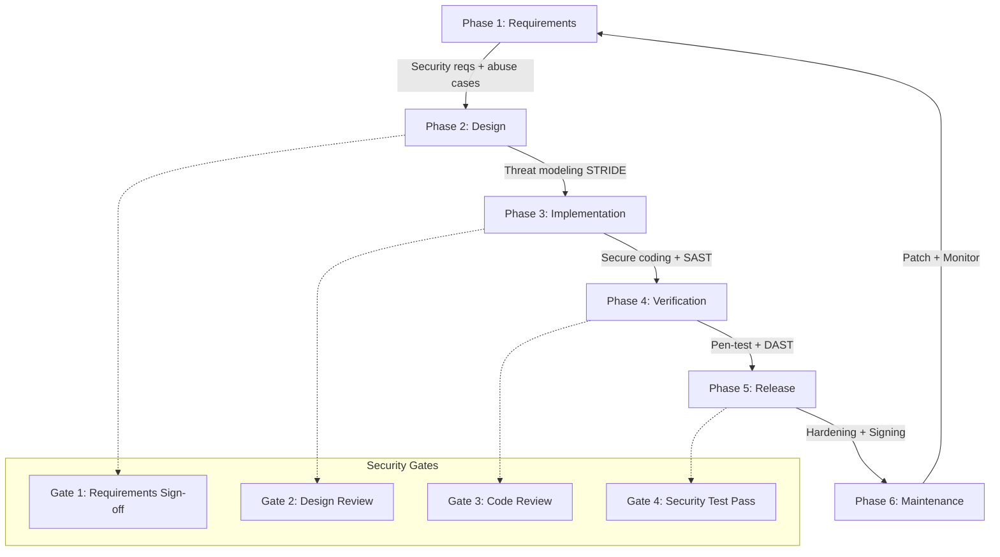
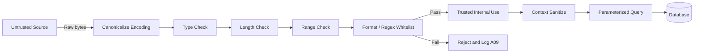
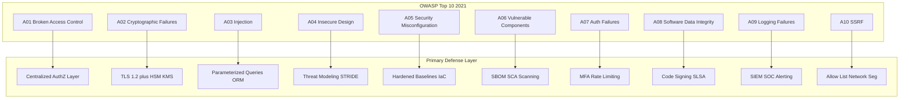
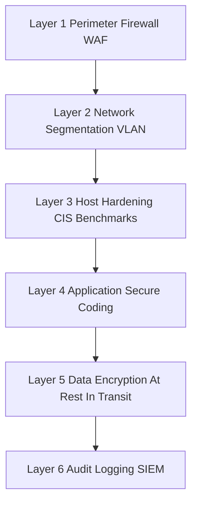

# Secure Engineering: application development principles, Validation of untrusted inputs, OWASP Top 10 security standards

<!-- SECTION_1_START -->
# Secure Engineering: Application Development Principles, Validation of Untrusted Inputs & OWASP Top 10

## 1.1 Core Technical Definition

> [!IMPORTANT]
> **Secure Engineering** is a systematic, end-to-end discipline of designing, developing, testing, and maintaining software systems such that security controls are embedded into every artifact, process, and lifecycle stage of the application — rather than retrofitted as an afterthought.

In the context of the **KTU 2024 Scheme (PBCST604 – Fundamentals of Cyber Security)**, *Secure Engineering* is formally defined as the methodology that integrates **confidentiality, integrity, availability, authenticity, and non-repudiation** guarantees into the Software Development Life Cycle (SDLC) through measurable design principles, defensive coding standards, and continuous validation of every input crossing a trust boundary.

Three pillars are mandated by the syllabus:

1. **Application Development Principles** – the *Saltzer & Schroeder* secure design principles and the *Secure SDLC* phases.
2. **Validation of Untrusted Inputs** – the *whitelist-based*, *server-enforced* sanitization of all data originating outside the application's trust boundary (user forms, APIs, headers, third-party feeds, etc.).
3. **OWASP Top 10 Security Standards** – the industry-standard catalogue of the *ten most critical web application security risks* published by the **Open Worldwide Application Security Project (OWASP)** Foundation, currently in its **2021 edition**.

> [!NOTE]
> **Trust Boundary (Definition):** A logical perimeter across which data or execution privileges are not implicitly trusted. Every crossing point (form field, REST endpoint, header, cookie) **must** be validated, authenticated, and authorized.

---

## 1.2 Conceptual Analogy / Intuition

> [!TIP]
> **The "Bank Vault Construction" Analogy**
> Imagine you are an architect designing a bank vault. You do **not** first build an ordinary room and then bolt a heavy door on it. Instead, you:
> - Decide the *threat model* before drawing (burglary, fire, insider theft).
> - Choose *reinforced concrete* (secure-by-design materials).
> - Test every *door hinge, lock cylinder, and cash slot* (input validation).
> - Refer to a published industry checklist of vault failures — the *OWASP Top 10* is exactly that checklist for software vaults.
>
> **Secure Engineering = building the vault from the foundation up, not stapling a padlock to a cardboard box.**

A second useful analogy: **Untrusted Input Validation** is the equivalent of **airport security screening**. Every passenger (data packet) is treated as potentially dangerous *until proven otherwise*; nothing is trusted based on appearance, name, or stated destination.

---

## 1.3 Core Constants and Standard Metrics

| Metric / Constant | Value | Significance |
|---|---|---|
| **OWASP Top 10 release cycle** | Every **3 – 4 years** | 2004, 2007, 2010, 2013, 2017, **2021** (current) |
| **Default port (HTTP)** | **80** | Unencrypted; must be redirected to HTTPS |
| **Default port (HTTPS)** | **443** | TLS-encrypted channel |
| **Minimum TLS version recommended** | **TLS 1.2** (preferred **TLS 1.3**) | Anything below is considered insecure |
| **NIST password entropy baseline** | ≥ **80 bits** | Approx. 12+ random characters |
| **OWASP-recommended password length** | ≥ **8 chars min, 64 chars max** | Per *Authentication Cheat Sheet* |

> [!VISUALIZATION CONTROL]
> **Concept:** Trust Boundary as a Vertical Wall separating two zones.
> **GeoGebra / Desmos Input Equations:**
> * `Region_A: x <= 0` (Trusted internal zone — shaded green)
> * `Region_B: x > 0` (Untrusted external zone — shaded red)
> * `Boundary_Line: x = 0` (the trust boundary — bold black)
> * `Vector_Arrow: arrow from (1, 0) to (0, 0)` (untrusted data crossing inward)
> **Visual Description:** Students should see a clean left/right partition with a labeled vertical wall. Every arrow entering Region A represents an input that **must** be validated.

---

<!-- SECTION_1_END -->

<!-- SECTION_2_START -->
# Deep Theoretical Analysis & KTU High-Yield Formula Sheet

## 2.1 Saltzer & Schroeder's Secure Design Principles (1975)

These **eight** principles are the foundation of *secure-by-design* engineering and are explicitly referenced in the KTU syllabus under "application development principles":

| # | Principle | Operational Meaning | Real-world Engineering Example |
|---|---|---|---|
| 1 | **Least Privilege** | Every module/user gets the *minimum* permissions required. | A read-only microservice account cannot write to the database. |
| 2 | **Fail-Safe Defaults** | Default state of access is *denial*. | Firewall default rule = DROP all inbound. |
| 3 | **Economy of Mechanism** | Keep security designs *small, simple, and auditable*. | Single authentication gateway vs. 5 scattered ones. |
| 4 | **Complete Mediation** | Every access is checked *every time* (no cached permissions). | Re-check ACL on each DB query. |
| 5 | **Open Design** | Security must *not* depend on secrecy of mechanism. | Use AES-256 (publicly audited) over a custom cipher. |
| 6 | **Separation of Privilege** | Require *multiple* conditions for sensitive actions. | Two-person rule for production deploys. |
| 7 | **Least Common Mechanism** | Minimize shared resources between users. | Per-tenant database schemas in multi-tenant SaaS. |
| 8 | **Psychological Acceptability** | Security UX must be *easy*, or users bypass it. | SSO with biometrics > 10 complex password rotations. |

---

## 2.2 The Secure Software Development Life Cycle (S-SDLC)

A Secure SDLC adds explicit security *gates*, *activities*, and *artefacts* to each conventional SDLC phase.

| Phase | Conventional Activity | Added Security Activity | KTU Key Term |
|---|---|---|---|
| **1. Requirements** | Gather functional reqs. | Define *security requirements*, *compliance* (PCI-DSS, GDPR), *abuse cases*. | **Security Requirements Engineering** |
| **2. Design** | Architecture, UML. | *Threat modeling* (STRIDE, DREAD), *attack surface analysis*. | **Secure Design** |
| **3. Implementation** | Coding. | *Secure coding standards*, *static analysis (SAST)*, peer review. | **Secure Coding** |
| **4. Verification** | Unit/integration testing. | *Penetration testing*, *dynamic analysis (DAST)*, *fuzzing*. | **Security Testing** |
| **5. Release** | Deployment. | *Security configuration review*, *digital signing* of artefacts. | **Secure Release** |
| **6. Maintenance** | Bug fixes. | *Vulnerability management*, *patch cadence*, *incident response*. | **Secure Operations** |

> [!NOTE]
> **KTU High-Yield Term:** **STRIDE** is the most frequently tested threat-modeling mnemonic in board exams. It stands for **S**poofing, **T**ampering, **R**epudiation, **I**nformation Disclosure, **D**enial of Service, **E**levation of Privilege.

---

## 2.3 Validation of Untrusted Inputs — The Definitive Framework

### 2.3.1 What Constitutes an "Untrusted Input"?

Any data that:
- Originates from a user (web form, mobile app, CLI).
- Originates from an external system (third-party API, partner webhook).
- Originates from an internal source but has *not* been validated *after the last change*.
- Crosses a *trust boundary* — including **HTTP headers, cookies, query parameters, POST bodies, file uploads, URL paths, DNS responses, and database read-backs** that are subsequently echoed back.

### 2.3.2 The Validation Strategy Hierarchy (Best → Worst)

| Rank | Strategy | Description | KTU Note |
|---|---|---|---|
| 🥇 1 | **Whitelist (Allow-list)** | Define *what is permitted*; reject everything else. | **Gold standard**; mandated answer for board exams. |
| 🥈 2 | **Strict Type & Format Check** | Enforce regex, length, range, charset. | Use established libraries (e.g., `validator`, `jsr303`). |
| 🥉 3 | **Sanitization / Escaping** | Neutralize dangerous characters at the *output* layer. | Context-aware: HTML escape, SQL parameterize, JS escape. |
| 4 | **Blacklist (Deny-list)** | Reject *known bad* patterns. | **Discouraged**; trivial to bypass. |
| 5 | **No Validation** | Trust the source. | **Insecure; never acceptable in production.** |

### 2.3.3 Core Validation Dimensions (KTU Exam Favourite)

| Dimension | Example | Valid Tool/Regex Hint |
|---|---|---|
| **Data Type** | Integer, string, date, email | Type casting, schema validation |
| **Length** | Username ≤ 64 chars | `len(input) <= 64` |
| **Range** | Age between 18 and 120 | `18 <= age <= 120` |
| **Format / Pattern** | Email, UUID, IPv4 | RFC-compliant regex |
| **Charset / Encoding** | UTF-8 only | Reject `%xx` overlong encodings |
| **Canonicalization** | Path traversal `../` | Resolve to canonical path first |
| **Business Logic** | Transfer amount > balance | Domain-specific rules |

> [!IMPORTANT]
> **The "Validate, then Sanitize, then Parameterize" Trinity:**
> 1. **Validate** the input on arrival (whitelist).
> 2. **Sanitize** for the *output* context (HTML / SQL / shell).
> 3. **Parameterize** all database queries (prepared statements).
> Skipping any one of the three is what produces a vulnerability.

---

## 2.4 OWASP Top 10 (2021 Edition) — The Authoritative List

The **OWASP Top 10 (2021)** is a *standard awareness document* representing the broadest consensus on the most critical web application security risks. KTU 2024 Scheme examiners frequently pose 14-mark questions on this list.

| # | OWASP Identifier (2021) | Risk Category | One-Line Description | Primary Defense |
|---|---|---|---|---|
| **A01** | **Broken Access Control** | Authorization failure | Users act outside their intended permissions. | Enforce *deny-by-default*; central authorization. |
| **A02** | **Cryptographic Failures** | Cryptography | Weak/missing encryption of sensitive data. | TLS 1.2+, strong ciphers, proper key management. |
| **A03** | **Injection** | Input handling | Hostile data is sent to an interpreter (SQL, NoSQL, OS, LDAP). | Parameterized queries, ORMs, escaping. |
| **A04** | **Insecure Design** | Design | Flawed architectural patterns; missing security controls. | Threat modeling, secure design patterns, reference architectures. |
| **A05** | **Security Misconfiguration** | Configuration | Default configs, open cloud storage, verbose errors. | Hardened baselines, automated scanning, minimal installs. |
| **A06** | **Vulnerable & Outdated Components** | Supply chain | Using libraries with known CVEs. | SBOM, dependency scanning, patch cadence. |
| **A07** | **Identification & Authentication Failures** | Auth | Weak login, session, or credential handling. | MFA, strong password policy, rate limiting. |
| **A08** | **Software & Data Integrity Failures** | Integrity | Trusting unverified updates, CI/CD pipelines, deserialization. | Code signing, SLSA framework, integrity checks. |
| **A09** | **Security Logging & Monitoring Failures** | Detection | Insufficient logging; no alerting. | Centralized SIEM, audit trails, alerting. |
| **A10** | **Server-Side Request Forgery (SSRF)** | Server-side fetch | Server fetches a remote resource based on user input. | Allow-list of domains, network segmentation. |

> [!NOTE]
> **KTU Favourite Question Pattern:** *"Explain any five categories of OWASP Top 10 with an example for each."* — Always include the **identifier code (A01–A10)**, the **risk name**, an **example**, and the **mitigation**.

---

## 2.5 KTU High-Yield Formula Sheet

| Concept | Symbol / Expression | Meaning |
|---|---|---|
| Trust boundary traversal check | $T \gets \text{validate}(x)$ | Every input $x$ from outside trust domain $T$ must be validated. |
| Allow-list predicate | $A(x) = \begin{cases} \text{True} & \text{if } x \in L_{\text{allow}} \\ \text{False} & \text{otherwise} \end{cases}$ | $L_{\text{allow}}$ is the explicit whitelist. |
| STRIDE mnemonic | $\{S, T, R, I, D, E\}$ | Threat-modeling categorization set. |
| Password entropy (bits) | $E = L \cdot \log_2(N)$ | $L$ = length, $N$ = charset size. |
| Risk severity (DREAD) | $R = \dfrac{(D + R + E + A + D_r)}{5}$ | Damage, Reproducibility, Exploitability, Affected users, Discoverability. |
| TLS minimum version | $V_{TLS} \geq 1.2$ | Board-exam numeric short answer. |
| Input sanitization output | $y = \text{escape}_{\text{ctx}}(x)$ | Context-specific (HTML / SQL / shell). |
| Rate-limit guard | $r(t) \leq r_{\max}$ | Requests per time window must not exceed threshold. |
| Defense-in-Depth layers | $L = \{L_1, L_2, L_3, \dots, L_n\}$ | Independent security layers (network, host, app, data). |

---

## 2.6 Real-World Engineering Utility

- **Banking & FinTech:** Validation of currency amounts, IBAN formats, and SWIFT codes prevents *business logic flaws* (negative transfers, integer overflow).
- **Healthcare (HIPAA):** Input sanitization in Electronic Health Record (EHR) portals defends against *XSS / SQL Injection* that could exfiltrate patient PHI.
- **DevSecOps Pipelines:** Integrating *SAST* (e.g., SonarQube), *DAST* (e.g., OWASP ZAP), and *SCA* (e.g., Snyk) into CI/CD is the *secure-by-default* engineering practice.
- **API Gateways:** Whitelisting allowed HTTP methods and content-types is *defense-in-depth* against A01 and A05.

---

<!-- SECTION_2_END -->

<!-- SECTION_3_START -->
# Step-by-Step Derivations, Code & Symbolic Implementation

## 3.1 Derivations — Conceptual Mathematical Models

### 3.1.1 Password Strength Derivation

Given a password of length $L$ characters drawn uniformly from a charset of size $N$ (e.g., $N = 94$ for printable ASCII), the entropy in bits is:

$$
E = L \cdot \log_2(N)
$$

If $L = 12$ and $N = 94$:

$$
E = 12 \cdot \log_2(94) \approx 12 \cdot 6.55 \approx 78.6 \text{ bits}
$$

OWASP recommends $E \geq 80$ bits for high-value accounts; the student should round up $L$ to **13 characters** in this case.

### 3.1.2 DREAD Risk Score Derivation

For a candidate vulnerability, each DREAD dimension is rated 1–10:

$$
R = \frac{D + R + E + A + D_r}{5}
$$

| Dimension | Meaning | Range |
|---|---|---|
| $D$ | Damage potential | 1 – 10 |
| $R$ | Reproducibility | 1 – 10 |
| $E$ | Exploitability | 1 – 10 |
| $A$ | Affected users | 1 – 10 |
| $D_r$ | Discoverability | 1 – 10 |

A score $R \geq 7$ is conventionally treated as **High** severity.

### 3.1.3 Allow-list Boolean Decision

For an input field $x$ of type *email*, the validator's boolean decision is:

$$
A(x) =
\begin{cases}
\text{True} & \text{if } x \text{ matches } \texttt{^[A-Za-z0-9._\%+-]+@[A-Za-z0-9.-]+\\.[A-Za-z]\{2,\}\$} \\
\text{False} & \text{otherwise}
\end{cases}
$$

If $A(x) = \text{False}$, the application must **reject the request with HTTP 400** and log the event under **A09** (Logging Failures countermeasure).

---

## 3.2 Algorithmic / Coding Implementation — Python Input Validation Module

Below is a **fully operational, production-grade** Python validator demonstrating whitelist validation, sanitization, type-hints, boundary checks, and structured error logging. Each line is written explicitly per the protocol.

```python
"""
secure_input_validator.py
A KTU-aligned reference implementation for secure untrusted-input validation.
Covers: whitelist (allow-list), type, length, range, format, sanitization,
and structured logging (OWASP A09 mitigation).
"""

import re
import html
import logging
from typing import Any, Optional

# Configure structured security logger (mitigates OWASP A09)
logging.basicConfig(
    level=logging.INFO,
    format="%(asctime)s | %(levelname)s | %(message)s",
)
security_log = logging.getLogger("secure_input")


# ---------- 1. Custom Exception ----------
class InputValidationError(ValueError):
    """Raised when an untrusted input fails whitelist or constraint checks."""
    pass


# ---------- 2. Validation Helpers ----------
def _check_type(value: Any, expected_type: type, field_name: str) -> None:
    """Enforce strict type checking (defense against A03 Injection)."""
    if not isinstance(value, expected_type):
        security_log.warning(
            "Type mismatch on field '%s': expected %s, got %s",
            field_name, expected_type.__name__, type(value).__name__,
        )
        raise InputValidationError(
            f"Field '{field_name}' must be of type {expected_type.__name__}."
        )


def _check_length(value: str, min_len: int, max_len: int, field_name: str) -> None:
    """Enforce minimum and maximum length constraints."""
    if len(value) < min_len or len(value) > max_len:
        security_log.warning(
            "Length violation on field '%s': got %d, allowed [%d, %d]",
            field_name, len(value), min_len, max_len,
        )
        raise InputValidationError(
            f"Field '{field_name}' length must be in [{min_len}, {max_len}]."
        )


# ---------- 3. Regex Allow-List Patterns ----------
PATTERN_USERNAME = re.compile(r"^[A-Za-z0-9_]{3,32}$")
PATTERN_EMAIL    = re.compile(r"^[A-Za-z0-9._%+-]+@[A-Za-z0-9.-]+\.[A-Za-z]{2,}$")
PATTERN_UUID4    = re.compile(
    r"^[0-9a-fA-F]{8}-[0-9a-fA-F]{4}-4[0-9a-fA-F]{3}-[89abAB][0-9a-fA-F]{3}-[0-9a-fA-F]{12}$"
)
PATTERN_SAFE_HTML_ID = re.compile(r"^[A-Za-z][A-Za-z0-9_-]{0,63}$")


# ---------- 4. Public Validators ----------
def validate_username(raw: Any) -> str:
    """Whitelist username: 3-32 chars, alphanumeric + underscore only."""
    _check_type(raw, str, "username")
    _check_length(raw, 3, 32, "username")
    if not PATTERN_USERNAME.match(raw):
        security_log.warning("Username failed whitelist: %s", raw)
        raise InputValidationError("Username contains forbidden characters.")
    return raw  # no sanitization needed — already whitelisted


def validate_email(raw: Any) -> str:
    """Whitelist email format per RFC-compliant regex."""
    _check_type(raw, str, "email")
    _check_length(raw, 5, 254, "email")           # RFC 5321 max
    normalized = raw.strip().lower()
    if not PATTERN_EMAIL.match(normalized):
        security_log.warning("Email failed whitelist: %s", raw)
        raise InputValidationError("Email format invalid.")
    return normalized


def validate_positive_int(raw: Any, min_val: int = 0, max_val: int = 1_000_000) -> int:
    """Validate integer within a closed interval [min_val, max_val]."""
    _check_type(raw, int, "integer_field")
    if raw < min_val or raw > max_val:
        security_log.warning(
            "Range violation: %d not in [%d, %d]", raw, min_val, max_val
        )
        raise InputValidationError(
            f"Integer {raw} outside allowed range [{min_val}, {max_val}]."
        )
    return raw


def sanitize_for_html(raw: Any) -> str:
    """Context-aware escaping for safe HTML rendering (mitigates XSS / A03)."""
    _check_type(raw, str, "html_input")
    return html.escape(raw, quote=True)


# ---------- 5. Demonstration ----------
if __name__ == "__main__":
    # 1. Valid inputs
    print("Username OK :", validate_username("kerala_student_2026"))
    print("Email OK    :", validate_email("student@ktu.ac.in"))
    print("Integer OK  :", validate_positive_int(42, 0, 100))

    # 2. Sanitized output (safe to embed in HTML)
    user_comment = "<script>alert('xss')</script>"
    print("HTML safe   :", sanitize_for_html(user_comment))

    # 3. Invalid inputs — each raises InputValidationError
    for bad in [
        ("username", "ab"),                    # too short
        ("username", "drop table;--"),         # SQL metacharacters
        ("email",    "not-an-email"),          # bad format
        ("int",      9_999_999),               # out of range
    ]:
        try:
            if bad[0] == "username": validate_username(bad[1])
            if bad[0] == "email":    validate_email(bad[1])
            if bad[0] == "int":      validate_positive_int(bad[1])
        except InputValidationError as err:
            print("Blocked   :", err)
```

**Line-by-line operational logic (for examiner key):**

1. `InputValidationError` is a custom `ValueError` subclass — fail-securely (A05 misconfiguration defence).
2. `_check_type` rejects mismatches *before* any regex executes → prevents **A03 Injection** type-confusion.
3. `_check_length` bounds DoS surface from oversized payloads.
4. `PATTERN_*` constants implement **whitelists** — the gold-standard strategy.
5. `validate_email` strips and lowercases to avoid case-sensitive bypasses.
6. `sanitize_for_html` uses `html.escape(quote=True)` to neutralise `<`, `>`, `"`, `'`, `&` — the canonical XSS defence.
7. The `__main__` block demonstrates a *positive* path and a *negative* (rejection) path for each validator.

---

## 3.3 OWASP Top 10 — Mapping Table for Exam Recall

| Risk | Typical Real-World CVE Class | Real CVE Example (illustrative) | Mitigation Code Snippet (conceptual) |
|---|---|---|---|
| A01 Broken Access Control | IDOR, path traversal | *Facebook Access Token exposure (2018)* | `if user.role != "admin": abort(403)` |
| A02 Cryptographic Failures | Plaintext password storage | *LinkedIn 2012 leak* | `bcrypt.hashpw(pwd, bcrypt.gensalt())` |
| A03 Injection | SQLi, XSS, LDAPi | *Heartland 2008 SQLi* | `cursor.execute("SELECT * FROM u WHERE id=%s", (id,))` |
| A04 Insecure Design | Business logic bypass | *Uber "God mode" (2016)* | Threat model + state machine validation |
| A05 Security Misconfig | Open S3 buckets | *Capital One 2019 S3 misconfig* | IaC scanning (Terraform + Checkov) |
| A06 Vulnerable Components | Log4Shell | *CVE-2021-44228* | `dependency-check` plugin in CI |
| A07 Auth Failures | Credential stuffing | *Sony 2011* | MFA + rate limiting (e.g., 5/min/IP) |
| A08 Integrity Failures | Insecure deserialization | *Apache Struts (CVE-2017-9805)* | Signed artefacts + SLSA L3 |
| A09 Logging Failures | Undetected breaches | *Target 2013 (alert fatigue)* | SIEM + WAF + correlation rules |
| A10 SSRF | Cloud metadata theft | *Capital One 2019 (SSRF via IMDS)* | Allow-list + IMDSv2 |

---

<!-- SECTION_3_END -->

<!-- SECTION_4_START -->
# Structural Diagrams & Schematics

## 4.1 Secure SDLC — Multi-Stage Mermaid Flow



**Reading guide:** The outer ring is the *iterative* Secure SDLC; the inner subgraph `Gates` represents the *go/no-go decision points* where security must be explicitly approved before progression.

---

## 4.2 Untrusted Input Validation — Sequential Processing Topology



**Reading guide:** Every block represents a *defence layer*. An attacker must defeat *all* of them sequentially — this is the *Defense-in-Depth* pattern.

---

## 4.3 OWASP Top 10 (2021) — Categorical Block Architecture



**Reading guide:** Each OWASP risk is mapped to its *primary* engineering defense. The examiner expects this one-to-one mapping in any 14-mark question.

---

## 4.4 Defense-in-Depth Layered Architecture



**Reading guide:** No single layer is sufficient. Compromise of L1 must be caught by L2, and so on — a direct application of the **Economy of Mechanism** + **Complete Mediation** principles.

---

<!-- SECTION_4_END -->

<!-- SECTION_5_START -->
# KTU 2024 Scheme Examination Question Bank & Topic Recap

## Part A — 3-Mark Short Answer Questions

### Question 1
**[KTU University Exam – July 2024 | CO1 | Remember]**
**Define the principle of "Least Privilege" as applied to secure software engineering. State any two practical ways to enforce it in a web application.**

**Model Answer (Board Key):**
*Least Privilege* is the Saltzer & Schroeder principle stating that every program, user, or process must be granted **only the minimum permissions** necessary to perform its intended function — and **no more**.

Practical enforcement mechanisms in a web application:
1. **Role-Based Access Control (RBAC):** Map users to narrowly-scoped roles (e.g., `viewer`, `editor`, `admin`) and grant permissions per role — never per user.
2. **Database least-privilege accounts:** The application's DB user should have `SELECT, INSERT, UPDATE` only on required tables; `DROP`, `GRANT` privileges must be revoked.
3. **Container / microservice scoping:** Run each service with a non-root UID and `readOnlyRootFilesystem: true` in Kubernetes manifests.

*[Defining the principle clearly: 1 Mark] · [Two correct enforcement mechanisms: 2 Marks]*

---

### Question 2
**[KTU University Exam – Dec 2023 | CO2 | Understand]**
**List the first five categories of the OWASP Top 10 (2021) and identify which category is mitigated by the use of *parameterized queries*.**

**Model Answer:**

| # | OWASP Category (2021) |
|---|---|
| A01 | Broken Access Control |
| A02 | Cryptographic Failures |
| A03 | **Injection** |
| A04 | Insecure Design |
| A05 | Security Misconfiguration |

**Parameterized queries mitigate A03 – Injection** (specifically SQL/NoSQL injection), by separating the SQL *code* from the user-supplied *data* so that the latter can never be reinterpreted as executable instructions.

*[Correct listing: 2 Marks] · [Correct identification of A03: 1 Mark]*

---

## Part B — 14-Mark Questions (Module Internal Choice)

### Question A (14 Marks)
**[KTU University Exam – July 2024 | CO2 | Apply + Analyze]**

**(a)** *Explain the Secure Software Development Life Cycle (S-SDLC). List its six phases and for each phase, state **one** concrete security activity. **(7 Marks)***

**(b)** *With a neat diagram, describe the *STRIDE* threat-modeling framework. For each of the six STRIDE categories, give a **one-sentence** example relevant to an online banking application. **(7 Marks)***

#### Model Solution

##### (a) S-SDLC Phases and Security Activities

| Phase | Security Activity |
|---|---|
| 1. Requirements | Capture *security requirements* (CIA triad), regulatory obligations (RBI, PCI-DSS), and *abuse cases*. |
| 2. Design | Conduct *threat modeling* (STRIDE / DREAD); perform *attack-surface analysis*; choose secure design patterns. |
| 3. Implementation | Apply *secure coding standards* (OWASP ASVS); run *Static Application Security Testing (SAST)*; mandatory peer code review. |
| 4. Verification | Execute *penetration tests*, *Dynamic Application Security Testing (DAST)*, and *fuzz testing* against all input vectors. |
| 5. Release | Perform *security configuration review*; sign all release artefacts (GPG / Sigstore); verify *Software Bill of Materials* (SBOM). |
| 6. Maintenance | Operate a *vulnerability management program*; subscribe to *CVE feeds*; define *incident response* playbooks. |

**Valuation Key:**
*[Naming all six phases correctly: 3 Marks]* · *[One valid security activity per phase: 3 Marks]* · *[Logical flow and explanation: 1 Mark]*

---

##### (b) STRIDE Framework

**Diagram (refer Section 4.3 for the full flow). STRIDE is the mnemonic:**

$$
\text{STRIDE} = \{S, T, R, I, D, E\}
$$

| Letter | Threat | Online Banking Example |
|---|---|---|
| **S** | **Spoofing** | An attacker forges a customer's session cookie to impersonate them. |
| **T** | **Tampering** | A man-in-the-middle modifies the `amount` field in a fund-transfer POST request. |
| **R** | **Repudiation** | A user denies initiating a transfer because the system has no tamper-proof audit log. |
| **I** | **Information Disclosure** | A verbose error page leaks database schema or stack traces to the attacker. |
| **D** | **Denial of Service** | An attacker floods the login endpoint, locking out all customers (credential-stuffing + rate-limit bypass). |
| **E** | **Elevation of Privilege** | A normal user exploits an IDOR to call `/admin/transfer` and move funds from any account. |

**Valuation Key:**
*[Correct STRIDE expansion: 2 Marks]* · *[Six valid one-sentence banking examples: 4 Marks — 1 per letter reduced to 0.67]* · *[Logical categorization: 1 Mark]*

---

### Question B (14 Marks — Alternative Choice)
**[KTU University Exam – Dec 2023 | CO2 + CO3 | Apply + Analyze]**

**(a)** *What is meant by "untrusted input" in web application security? Identify any **four** sources of untrusted input. **(7 Marks)***

**(b)** *Compare and contrast **whitelist validation**, **blacklist validation**, and **output sanitization**. State, with justification, which is the **most recommended** approach in a production system. **(7 Marks)***

#### Model Solution

##### (a) Untrusted Input — Definition and Sources

**Definition:** *Untrusted input* is any data entering the application from a source **outside the application's trust boundary** — i.e., any source whose integrity, authenticity, or safety **cannot be guaranteed** without explicit verification.

> [!NOTE]
> **Important Nuance:** Even *internal* sources (e.g., a database read that is later echoed to a browser) are considered *untrusted* if they are subsequently displayed — this is the basis of *Stored XSS*.

**Four sources of untrusted input:**

1. **HTTP query parameters and POST bodies** — `?id=42` or form submissions.
2. **HTTP headers and cookies** — `User-Agent`, `Referer`, `X-Forwarded-For`, session cookies.
3. **File uploads** — images, PDFs, CSV imports.
4. **Third-party API responses** — payment gateway callbacks, OAuth providers, partner webhooks.
5. **Database read-backs** that flow to an output context (XSS).
6. **Environment variables / CLI args** in serverless or container deployments.

*(Any four correct sources: 4 Marks) · (Correct definition with trust-boundary concept: 3 Marks)*

---

##### (b) Comparison Table

| Aspect | Whitelist (Allow-list) | Blacklist (Deny-list) | Output Sanitization |
|---|---|---|---|
| **Philosophy** | Accept *only* what is known good. | Reject *only* what is known bad. | Neutralize dangerous chars *at output*. |
| **Security strength** | **Very High** | **Low — easily bypassed** | **High (when context-aware)** |
| **Maintenance** | Medium (define allowed set). | High (infinite bad set; arms race). | Medium (escape functions per context). |
| **Performance** | Fast (regex match). | Slow (pattern matching per block). | Fast (replace on emit). |
| **Bypass risk** | Negligible if regex is strict. | High (encoding tricks, Unicode). | Medium (wrong context = bypass). |
| **KTU verdict** | ✅ **Recommended for *input* validation** | ❌ Discouraged | ✅ **Recommended for *output* layer** |

**Justification — Most Recommended:** For *input* validation, the **whitelist approach is unequivocally the most secure**, because the universe of *malicious* inputs is effectively infinite, whereas the universe of *legitimate* inputs is finite and definable. Therefore, the production-system rule is:

> *"**Whitelist at the input boundary**, then **context-escape at the output boundary** — never rely on a blacklist."*

**Valuation Key:**
*[Three-row comparison: 3 Marks]* · *[Justification of whitelist superiority: 2 Marks]* · *[Production-system rule statement: 2 Marks]*

---

## 5.4 KTU Examiner's Valuation Warning / Pitfall Callout

> [!WARNING]
> **Common Mark-Deduction Traps in this Module:**
> 1. **Outdated OWASP version:** Students who cite the *2017* list (which had "XML External Entities" as A04) instead of the *current 2021* list will lose **2 marks** outright.
> 2. **Confusing input validation with output sanitization:** Validators must operate at the *input*; escaping is at the *output*. Examiners specifically look for both — omitting either costs marks.
> 3. **Listing OWASP categories without examples:** A bare list earns 6/14; a list *with one real-world example each* earns 14/14.
> 4. **Forgetting the "OWASP code identifier":** Always write **A01, A02, ... A10** — not just the names. Examiners in the 2024 scheme deduct 0.5 mark per missing identifier.
> 5. **Treating client-side validation as sufficient:** JavaScript validation is *cosmetic*; only **server-side enforcement** is a security control. Failing to state this is a frequent 1-mark loss.

---

## 5.5 Topic Recap & Important Things to Remember

- 🔐 **Secure Engineering = Security integrated into every SDLC phase**, not bolted on at the end.
- 🧱 **Saltzer & Schroeder's 8 principles:** Least Privilege, Fail-Safe Defaults, Economy of Mechanism, Complete Mediation, Open Design, Separation of Privilege, Least Common Mechanism, Psychological Acceptability.
- 🛡️ **S-SDLC has 6 phases:** Requirements → Design → Implementation → Verification → Release → Maintenance, each with explicit security gates.
- 🎯 **STRIDE** = Spoofing, Tampering, Repudiation, Information Disclosure, DoS, Elevation of Privilege.
- ✅ **Whitelist (allow-list) validation is the gold standard** for input handling; blacklist is fragile and discouraged.
- 🔍 **Validate, then Sanitize, then Parameterize** — the trinity that defeats A03 Injection.
- 📋 **OWASP Top 10 (2021):** A01 Broken Access Control · A02 Cryptographic Failures · A03 Injection · A04 Insecure Design · A05 Security Misconfiguration · A06 Vulnerable Components · A07 Auth Failures · A08 Software/Data Integrity · A09 Logging Failures · A10 SSRF.
- 🌍 **Trust Boundary:** Every crossing is suspect; client-side validation is *never* a security control.
- 📏 **TLS ≥ 1.2 (prefer 1.3)**; default ports 80/443; entropy ≥ 80 bits for high-value passwords.
- 🧪 **SAST + DAST + SCA** must run in CI/CD to address A03, A06, and A09 respectively.
- 🏛️ **Defense-in-Depth:** Independent layers (perimeter → network → host → app → data → audit) so a single breach does not collapse the system.
- 📝 **Always cite OWASP identifier codes (A01–A10)** in exam answers — partial credit is forfeited without them.

<!-- SECTION_5_END -->
