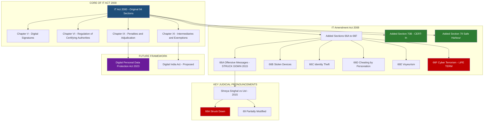
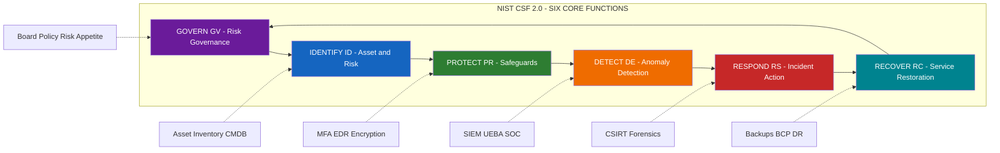
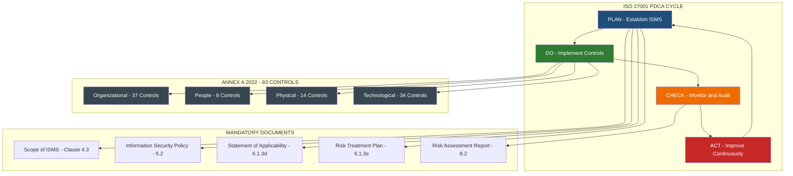
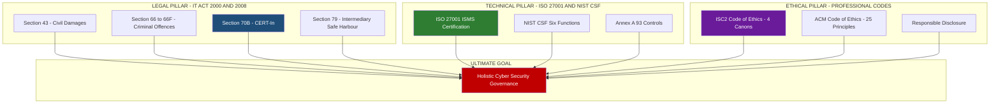

# Cyber Regulations: The Information Technology (IT) Act with amendments, international standards (ISO 27001, NIST), ethics

<!-- SECTION_1_START -->

# Cyber Regulations: The IT Act, International Standards, and Ethics

## 1.1 The Information Technology Act, 2000 (India)

> [!IMPORTANT]
> **Formal Definition (KTU Syllabus Standard):**
> The **Information Technology Act, 2000** (Act No. 21 of 2000), notified on 9 June 2000 and enforced from 17 October 2000, is the **primary cyber law of India**. It provides the legal infrastructure for **e-commerce, e-governance, digital signatures, cybercrime prevention, and data protection** in India. The Act was substantially amended by the **Information Technology (Amendment) Act, 2008** to align it with the **Budapest Convention on Cybercrime (2001)** and to address new forms of digital offences arising from the proliferation of the internet, mobile communications, and social media.

> [!NOTE]
> **Conceptual Analogy — "The Constitution of the Digital Highway":**
> Think of the internet as a massive highway system. Just as physical highways need traffic laws, signal codes, vehicle registration rules, and a licensing authority (the RTO), the **digital world needs a legal framework** to define what is allowed, what is criminal, and who is the "digital police." The **IT Act, 2000** is exactly that — it is the **Motor Vehicles Act for cyberspace**, with amendments acting as periodic "toll-revision" notices that update the law to handle new vehicles (technologies) entering the road. Before 2000, India had no specific law for computers — crimes were prosecuted under the antiquated **Indian Penal Code (IPC), 1860**, which did not even mention the word "computer." The IT Act filled that vacuum, much like a new traffic rulebook that the highway police could finally enforce.

### 1.1.1 Need and Genesis of the IT Act

| Trigger Event | Year | Impact on Law |
|---|---|---|
| **UNCITRAL Model Law on E-Commerce** | 1996 | India adopted it via the IT Act 2000 |
| **Global e-commerce boom (dot-com era)** | 1999–2000 | Legal recognition of digital contracts became urgent |
| **Lack of cyber-specific law in IPC 1860** | Pre-2000 | New statute mandated |
| **Budapest Convention on Cybercrime** | 2001 (signed) | Pushed India to amend the Act in 2008 |
| **26/11 Mumbai attacks & social media misuse** | 2008 | Strengthened surveillance and intermediary rules |
| **Section 66A struck down (Shreya Singhal v. UoI)** | 2015 | Struck down — highlighted need for **Digital India Act** |
| **Personal Data Protection Bill (later DPDP Act 2023)** | 2019–2023 | Partially superseded IT Act provisions on data |

> [!IMPORTANT]
> **Territorial & Extra-Territorial Jurisdiction (Section 1 & 75):**
> The IT Act applies to the **whole of India** *and* to **offences committed outside India by any person, irrespective of nationality**, if the act involves a **computer, computer system, or computer network located in India**. This is similar to how a person shooting a gun across a border into another country can still be tried by the country that was harmed.

### 1.1.2 The IT (Amendment) Act, 2008 — Key Drivers

The 2008 amendment was passed after a thorough study of the **Budapest Convention** and consultation with **NASSCOM, CBI, and the Ministry of Home Affairs**. The drivers were:

- Introduction of **Section 66A–66F** (offences like sending offensive messages, identity theft, cyber terrorism)
- Recognition of **electronic signatures** as legally equivalent to physical signatures
- Creation of the **Indian Computer Emergency Response Team (CERT-In)** with statutory authority under **Section 70B**
- Empowerment of **intermediaries** with **"safe harbour"** protection under Section 79, provided they observed due diligence
- Strengthening of **digital forensic admissibility** under Sections 65B (Section 65B Certificate for electronic evidence)

> [!VISUALIZATION CONTROL]
> **Concept:** Chronological evolution of the IT Act, 2000 and its amendments.
> **GeoGebra / Desmos Input Equations:** N/A (Timeline concept — use conceptual timeline figure).
> **Visual Description:** A horizontal timeline marker showing the key milestones from the **UNCITRAL Model Law (1996) → IT Act, 2000 → IT (Amendment) Act, 2008 → Shreya Singhal Judgement (2015) → Personal Data Protection Bill, 2019 → Digital Personal Data Protection Act, 2023**.

---

## 1.2 International Standards for Cyber Security

> [!IMPORTANT]
> **Formal Definition — ISO/IEC 27001:2022:**
> **ISO/IEC 27001** is the world's leading international standard for **Information Security Management Systems (ISMS)**, published by the **International Organization for Standardization (ISO)** and the **International Electrotechnical Commission (IEC)**. It specifies the requirements for establishing, implementing, maintaining, and continually improving an **ISMS** within the context of an organization's overall business risks. It follows the **Annex SL** high-level structure (10 clauses), making it compatible with other ISO management standards (ISO 9001 for Quality, ISO 14001 for Environment).

> [!IMPORTANT]
> **Formal Definition — NIST Cybersecurity Framework (CSF):**
> The **NIST Cybersecurity Framework (CSF)**, originally published in 2014 by the **U.S. National Institute of Standards and Technology (NIST)**, is a voluntary, risk-based framework consisting of **standards, guidelines, and best practices** to manage **cybersecurity risk**. Its latest version, **NIST CSF 2.0 (released February 26, 2024)**, expanded its scope beyond Critical Infrastructure to **all organizations**, and introduced a new **"Govern"** function as a sixth core function alongside the original five.

> [!NOTE]
> **Conceptual Analogy — "The Cyber Security Rulebook vs. The Cyber Security Toolkit":**
> Imagine cyber security as **building a fortress**.
> - **ISO 27001** is the **rulebook** that tells the king *how to design, build, audit, and certify the fortress*. It is a *certifiable management standard* — the "ISO 27001 certified" stamp is the fortress's quality certificate.
> - **NIST CSF** is the **toolkit** that gives the fortress-builder a structured set of **Identify → Protect → Detect → Respond → Recover → Govern** tools, without requiring a formal certification. The U.S. government uses it like an architect's blueprint for federal buildings.
> In short: **ISO 27001 = Certified Management System**, **NIST CSF = Risk-Based Practical Framework**.

> [!VISUALIZATION CONTROL]
> **Concept:** The three pillars of any robust cyber regulation framework (Legal + Technical + Ethical).
> **GeoGebra / Desmos Input Equations:** N/A (Conceptual Venn Diagram).
> **Visual Description:** A 3-circle Venn diagram where Circle A represents the **IT Act 2000/2008** (Legal pillar), Circle B represents **ISO 27001 / NIST CSF** (Technical/Pillar), and Circle C represents **Professional Ethics** (Ethical pillar). The intersection of all three is labelled **"Holistic Cyber Security Governance"** — the ultimate goal of an organization.

---

## 1.3 Cyber Security Ethics

> [!IMPORTANT]
> **Formal Definition — Cyber Ethics:**
> **Cyber ethics** is the branch of applied ethics that examines the **moral, legal, and professional dilemmas** arising from the use of information and communication technologies. It governs the conduct of information security professionals, ethical hackers, data handlers, and digital citizens in areas such as **privacy, intellectual property, freedom of speech, digital surveillance, and responsible disclosure**. The two most widely accepted codes are the **(ISC)² Code of Ethics** (for certified cyber professionals like CISSPs) and the **ACM Code of Ethics** (for computing professionals).

> [!NOTE]
> **Conceptual Analogy — "The Doctor's Hippocratic Oath for Hackers":**
> Just as doctors follow the **Hippocratic Oath** ("First, do no harm"), cyber security professionals follow a similar **ethical oath** to ensure their skills are used for **defence, not destruction**. A **Certified Ethical Hacker (CEH)** is legally and contractually bound to obtain **written authorization** before testing any system, much like a surgeon needs patient consent before an operation. **Black-hat hackers** skip the consent step, while **grey-hat hackers** operate in ambiguous zones (e.g., notifying a company of a vulnerability without permission). Ethics draws a clear line between a **security researcher** and a **cyber criminal**.

---

<!-- SECTION_1_END -->

<!-- SECTION_2_START -->

# 2. Deep Theoretical Analysis & KTU High-Yield Material

## 2.1 The IT Act, 2000 — Structural Anatomy

The Act is organized into **13 Chapters, 94 Sections, and 4 Schedules**. For KTU, the high-yield chapters are **Chapter IX (Sections 65–78)** which contain the **penalties and offences**, and **Chapter XI (Sections 79–80)** which deal with **intermediaries and exemptions**.

### 2.1.1 Key Sections — The "Must-Know" Cheat Sheet

> [!IMPORTANT]
> **The following table consolidates the most frequently examined sections of the IT Act for KTU. Memorize the section numbers along with the offence name — the examiner specifically checks this pairing.**

| Section | Offence / Provision | Punishment (Imprisonment) | Fine (Maximum) | KTU Exam Relevance |
|---|---|---|---|---|
| **Section 43** | Damage to computer, computer system, etc. | Civil | Up to ₹1 Crore (compensation) | High — frequently asked |
| **Section 65** | Tampering with computer source documents | Up to **3 years**, or fine, or both | — | High |
| **Section 66** | Computer-related offences (hacking with intent to cause harm) | Up to **3 years**, or fine, or both | Up to ₹5 Lakh | Very High |
| **Section 66A** *(Struck down, 2015)* | Sending offensive messages through communication service | — | — | High — *Examiner often asks why it was struck down* |
| **Section 66B** | Receiving stolen computer or communication device | Up to **3 years**, or fine, or both | — | Medium |
| **Section 66C** | Identity theft (using password/electronic signature of another person) | Up to **3 years**, or fine, or both | — | Very High |
| **Section 66D** | Cheating by personation using communication device/computer resource | Up to **3 years**, or fine, or both | — | Very High |
| **Section 66E** | Publishing/ transmitting obscene material in electronic form (voyeurism) | Up to **3 years**, or fine, or both | — | High |
| **Section 66F** | **Cyber terrorism** | **Life imprisonment** (mandatory) | — | Very High |
| **Section 67** | Publishing information which is obscene in electronic form | First offence: 3 years; Second: 5 years | First: ₹5 Lakh; Second: ₹10 Lakh | Very High |
| **Section 67A** | Publishing material containing sexually explicit act | First: 5 years; Second: 7 years | First: ₹10 Lakh; Second: ₹15 Lakh | High |
| **Section 67B** | Publishing child pornography in electronic form | First: 5 years; Second: 7 years | — | High |
| **Section 69** | Government's power to intercept, monitor, or decrypt information | — | — | High |
| **Section 69A** | Power to block public access to any information (Takedown orders) | — | — | High |
| **Section 69B** | Power to authorize monitoring and collection of traffic data / metadata | — | — | Medium |
| **Section 70** | Protected systems (e.g., national critical infrastructure) | Up to **10 years** (rigorous) | — | Medium |
| **Section 70B** | Establishment of **CERT-In** (Indian Computer Emergency Response Team) | — | — | Very High |
| **Section 71** | Penalty for misrepresentation (suppressing material fact while obtaining licence) | Up to **2 years**, or fine, or both | — | Low |
| **Section 72** | Breach of confidentiality and privacy | Up to **2 years**, or fine, or both | — | High |
| **Section 72A** | Disclosure of information in breach of lawful contract | Up to **3 years**, or fine, or both | Up to ₹5 Lakh | Medium |
| **Section 73** | Publishing false digital signature certificate | Up to **2 years**, or fine, or both | — | Low |
| **Section 74** | Publication of digital signature certificate for fraudulent purpose | Up to **2 years**, or fine, or both | — | Low |
| **Section 75** | **Extra-territorial jurisdiction** of the Act | Same as the corresponding offence | Same | Very High |
| **Section 78** | Power to investigate offences — **Police Officer not below the rank of Inspector** | — | — | Medium |
| **Section 79** | **Intermediaries — "Safe Harbour" protection** | Conditional exemption | — | Very High |
| **Section 80** | Power of Court to grant injunction | — | — | Low |
| **Section 80A** | Overriding effect (IT Act prevails over other laws) | — | — | High |
| **Section 81** | Power of the State Government to give directions | — | — | Low |
| **Section 84** | Power of the Central Government to make rules | — | — | Low |
| **Section 85** | Constitution of the **Cyber Appellate Tribunal** (later merged with TDSAT/HCs) | — | — | Medium |
| **Section 87** | Offences by companies — liability of directors/employees | — | — | High |
| **Section 88** | Confiscation of property | — | — | Low |

> [!NOTE]
> **Rule of Thumb for KTU Numericals/Definitions:**
> - **"Life" imprisonment** → only **Section 66F (Cyber Terrorism)**.
> - **"10 years rigorous"** → only **Section 70 (Protected Systems)**.
> - **"3 years"** is the most common punishment (Sections 66, 66B, 66C, 66D, 66E, 72A, 65).
> - **"2 years"** → Sections 71, 72, 73, 74.

### 2.1.2 The Shreya Singhal v. Union of India (2015) Case — Critical for KTU

This judgement is **one of the highest-weightage topics** in Module 4.

| Aspect | Detail |
|---|---|
| **Case** | Shreya Singhal v. Union of India |
| **Year** | 24 March 2015 |
| **Court** | Supreme Court of India (Constitution Bench) |
| **Petitioner** | Shreya Singhal (advocate) |
| **Respondent** | Union of India |
| **Issue** | Whether **Section 66A** of the IT Act violated **Article 19(1)(a)** (Freedom of Speech) and **Article 14** (Right to Equality) of the Indian Constitution |
| **Verdict** | **Section 66A was struck down as unconstitutional** — *"unreasonably restrictive"* and *"chilling effect on free speech"* |
| **Sections affected** | Section 66A, Section 69 (partial), and Rule 3(2) of the IT (Procedure and Safeguards for Blocking) Rules 2009 |
| **Reasoning** | The phrase *"grossly offensive"*, *"menacing"*, *"annoying"*, *"inconvenient"* in 66A were vague, overbroad, and could lead to arbitrary arrests |

> [!IMPORTANT]
> **Why this matters for KTU:**
> The examiner loves to ask: *"Discuss the impact of the Shreya Singhal judgement on the IT Act."* The expected answer must mention: (1) **Section 66A struck down** (2) **Right to free speech protected online** (3) **Section 79 intermediary guidelines strengthened** (4) **Need for future legislation like the Digital India Act**.

### 2.1.3 Section 79 — Intermediary "Safe Harbour" (Most Tested)

> [!IMPORTANT]
> **Definition — Intermediary (Section 2(1)(w)):**
> An **intermediary** is any person who, on behalf of another person, **receives, stores, or transmits** electronic records or provides any service in respect of such records. Examples include **telecom operators (Jio, Airtel), ISPs (BSNL), web hosting providers (GoDaddy), social media platforms (Meta, X/Twitter), search engines (Google), and online marketplaces (Amazon, Flipkart)**.

For an intermediary to claim **safe harbour protection** (immunity from third-party content), it must satisfy:

1. **The intermediary's role must be limited to providing access to a communication system** (mere conduit).
2. **It must not initiate the transmission, select the receiver, or modify the information contained in the transmission**.
3. **It must observe due diligence while discharging its duties** (as prescribed under the IT (Intermediary Guidelines and Digital Media Ethics Code) Rules, 2021).
4. **It must remove or disable access to unlawful content within 24–72 hours** of receiving a court order or government notification.
5. **It must appoint a Chief Compliance Officer, a Nodal Contact Person, and a Resident Grievance Officer** in India (per the 2021 Rules).
6. **It must publish monthly compliance reports** and assist law enforcement agencies.

> [!NOTE]
> **Analogy:** An intermediary is like a **shopping mall owner**. If a shop inside the mall sells illegal goods, the mall owner is *not* automatically liable — but if the mall owner *knew* about the illegal activity and *did nothing*, the mall owner loses the protection. Same applies to Twitter, YouTube, or Instagram.

---

## 2.2 International Standards — ISO 27001 & NIST CSF

### 2.2.1 ISO/IEC 27001:2022 — The ISMS Architecture

The current edition of the standard is **ISO/IEC 27001:2022** (published 25 October 2022). It introduces a major update called the **"Annex A 2022"** revision, where the previous 114 controls (in 14 domains) have been **consolidated into 93 controls across 4 themes**:

1. **Organizational Controls (37 controls)** — Policies, roles, asset management, supplier relationships, incident management, business continuity, compliance.
2. **People Controls (8 controls)** — Screening, employment terms, awareness, training, disciplinary process.
3. **Physical Controls (14 controls)** — Physical perimeter security, entry controls, securing offices, equipment maintenance, secure disposal.
4. **Technological Controls (34 controls)** — User endpoint devices, authentication, access control, cryptography, system security, network security, logging, data leakage prevention, secure coding.

> [!IMPORTANT]
> **The Plan-Do-Check-Act (PDCA) Cycle applied to ISO 27001:**
> - **Plan:** Establish the ISMS scope, risk assessment methodology, Statement of Applicability (SoA), and risk treatment plan.
> - **Do:** Implement and operate the controls, conduct training, manage operations.
> - **Check:** Monitor, measure, conduct internal audits, and review the ISMS effectiveness.
> - **Act:** Take corrective actions, continually improve the ISMS based on audit findings.

**The Certification Process (3 stages):**
1. **Stage 1 Audit** — Documentation review (the auditor checks your SoA, policies, and scope).
2. **Stage 2 Audit** — On-site/remote audit (the auditor verifies actual implementation and evidence).
3. **Surveillance Audits** — Annual after certification; full re-certification every **3 years**.

### 2.2.2 NIST CSF 2.0 — The Six Core Functions

The **NIST CSF 2.0** (released February 2024) organizes cyber risk management around **six functions**, each with **categories and subcategories**:

| Function | Purpose | Example Categories |
|---|---|---|
| **GOVERN (GV)** | Establish & monitor cyber risk governance | Organizational context, risk management strategy, roles, policies |
| **IDENTIFY (ID)** | Understand assets & risks | Asset management, business environment, governance, risk assessment |
| **PROTECT (PR)** | Implement safeguards | Identity & authentication, awareness & training, data security, platform security, technology infrastructure resilience |
| **DETECT (DE)** | Identify occurrence of cyber events | Anomalies & events, continuous monitoring, detection processes |
| **RESPOND (RS)** | Take action on detected events | Incident management, incident analysis, response communication, mitigation |
| **RECOVER (RC)** | Restore capabilities & services | Incident recovery plan, recovery communications, improvements |

> [!NOTE]
> **Tiers of Implementation (NIST CSF):**
> - **Tier 1 (Partial)** — Ad-hoc, reactive, no risk-aware culture.
> - **Tier 2 (Risk-Informed)** — Risk practices approved by management but not organization-wide.
> - **Tier 3 (Repeatable)** — Formally approved policies, regular updates.
> - **Tier 4 (Adaptive)** — Continuous improvement, predictive, real-time risk decisions.

### 2.2.3 ISO 27001 vs. NIST CSF — The High-Yield Comparison

| Parameter | **ISO 27001** | **NIST CSF** |
|---|---|---|
| **Issuer** | ISO + IEC (International) | U.S. NIST (National) |
| **Type** | Management system standard (certifiable) | Framework (voluntary, not certifiable) |
| **Structure** | 10-clause Annex SL + 93 Annex A controls | 6 Functions → Categories → Subcategories |
| **Risk Methodology** | Mandatory risk assessment with SoA | Flexible — choose any risk methodology |
| **Certification** | Yes — by accredited certification bodies (e.g., BSI, TÜV) | No formal certification, but **CMMC** uses NIST for U.S. DoD |
| **Scope** | Any organization globally | Originally U.S. critical infrastructure; **2.0 expanded to all** |
| **Mandatory for** | Contractual obligations (e.g., EU GDPR, BFSI in India) | Federal U.S. agencies, contractors |
| **Maturity Model** | Implicit (via certification levels) | Explicit — 4 Tiers (Partial → Adaptive) |
| **Updates** | ISO/IEC 27001:2022 (latest) | NIST CSF 2.0 (Feb 2024) |
| **Relationship** | Can be used to satisfy NIST controls mapping | Can be aligned with ISO 27001 |

> [!IMPORTANT]
> **In Practice (Industry):**
> Many organizations implement **both** standards. A typical strategy is: use **NIST CSF** as the **operational blueprint** (what to do), and use **ISO 27001** as the **management system** (how to manage, audit, certify). The two are **complementary**, not competing.

---

## 2.3 Cyber Security Ethics — Professional Codes

### 2.3.1 (ISC)² Code of Ethics (for CISSP, CCSP, CSSLP holders)

> [!IMPORTANT]
> **Four Canons (Memorize in order):**
> 1. **Protect society, the common good, necessary public trust and confidence, and the infrastructure.**
> 2. **Act honorably, honestly, justly, responsibly, and legally.**
> 3. **Provide diligent and competent service to principles.**
> 4. **Advance and protect the profession.**

> [!NOTE]
> **Exam Favourite Question:**
> *"A security professional discovers a critical vulnerability in their bank's online system. They inform their manager, but the manager refuses to act. The professional then publicly discloses the vulnerability on Twitter to 'force' the bank to act."* — Is this ethical under (ISC)² Code?
> **Answer:** No. Canon 1 requires protecting the common good (which includes bank's customers), but Canon 2 requires acting "honorably and legally." Public disclosure without coordination violates responsible disclosure. The professional should escalate to **CISO → Board → Regulator (RBI)** before any public disclosure.

### 2.3.2 ACM Code of Ethics (2018 Update)

The **Association for Computing Machinery (ACM) Code of Ethics** has **3 parts and 25 ethical principles**. The three parts are:

1. **General Ethical Principles** (1–7) — e.g., Contribute to society, Avoid harm, Be honest & trustworthy, Be fair, Respect privacy, Honor confidentiality.
2. **Professional Responsibilities** (8–14) — e.g., Strive for high quality, Know & respect laws, Manage resources responsibly.
3. **Leadership Principles** (15–25) — e.g., Articulate responsibilities, Manage personnel fairly, Take responsibility for one's work.

### 2.3.3 Pillars of Cyber Ethics (Summary Diagram Topics)

The key ethical issues in cyber security that KTU expects you to discuss are:

- **Privacy vs. National Security** (e.g., Aadhaar data collection vs. surveillance concerns)
- **Digital Piracy & Intellectual Property** (e.g., torrent websites, software cracking)
- **Free Speech vs. Hate Speech** (e.g., content moderation on social media)
- **Ethical Hacking & Bug Bounty Programs** (e.g., HackerOne, Bugcrowd)
- **Whistle-blowing & Responsible Disclosure** (e.g., Edward Snowden case)
- **AI Ethics in Cyber Security** (e.g., deepfakes, autonomous weapons)
- **Data Ownership & Informed Consent** (e.g., GDPR's "right to be forgotten")

> [!IMPORTANT]
> **Real-World Application:**
> In India, the **CERT-In Directions of 28 April 2022** mandate that all **intermediaries, data centres, body corporates, and government organizations** report cyber incidents within **6 hours** of detection. This operational rule aligns with **NIST CSF Respond** and **ISO 27001 Annex A.5.24 (Information security incident management planning)**.

---

<!-- SECTION_2_END -->

<!-- SECTION_3_START -->

# 3. Step-by-Step Derivations, Worked Examples, and Implementations

## 3.1 Worked Example 1 — Classifying a Cyber Crime Under the IT Act

> [!IMPORTANT]
> **Problem Statement (KTU Sample Question Pattern):**
> *"A cyber criminal uses phishing emails to steal the credit card numbers of 5,000 customers of a popular e-commerce website. He then uses these cards to make fraudulent purchases worth ₹25 Lakhs. Identify the relevant sections of the IT Act, 2000 (as amended) under which the criminal can be prosecuted. Also mention the role of CERT-In in this case."*

### Step-by-Step Legal Mapping

**Step 1 — Identify the Acts (Phishing + Data Theft):**

The criminal **obtained the credit card numbers through deception** (phishing). This is **Identity Theft** — a person using the **electronic signature, password, or any unique identification feature of another person**.

> **Legal Mapping:** This is a direct violation of **Section 66C of the IT Act, 2000 (as amended in 2008)**.
> **Punishment:** Imprisonment up to **3 years**, or fine up to ₹1 Lakh, or both.

**Step 2 — Identify the Second Act (Online Fraud):**

The criminal then **used the stolen identity (credit card numbers)** to **make fraudulent purchases**. This constitutes **cheating by personation** using a computer resource.

> **Legal Mapping:** This violates **Section 66D of the IT Act, 2000**.
> **Punishment:** Imprisonment up to **3 years**, or fine, or both.

**Step 3 — Identify any IPC / Bharatiya Nyaya Sanhita (BNS) Sections:**

In addition, since the act involves **cheating** (the essence of fraud), the criminal can also be prosecuted under:
- **Section 420 IPC** (Cheating) / **Section 318 BNS 2023** (Cheating)
- **Section 66 of the Indian Contract Act** (coercion/unfair means in contracts) — if used in the e-commerce transaction.

**Step 4 — Role of CERT-In:**

- **CERT-In (Indian Computer Emergency Response Team)** is the **national nodal agency** under **Section 70B** of the IT Act.
- In this case, the e-commerce company must **report the breach to CERT-In within 6 hours** (per the 28 April 2022 Directions).
- CERT-In will coordinate with the affected banks, **issue advisories**, **block the phishing infrastructure (URLs, IPs)**, and **assist law enforcement** (CBI, state cyber cell) in **digital forensic analysis**.

**Step 5 — Statement of Final Liability:**

| Action | Section | Punishment |
|---|---|---|
| Identity theft (stealing credit card numbers) | **66C** | 3 years + fine |
| Cheating by personation (fraudulent purchases) | **66D** | 3 years + fine |
| Reporting obligation (e-commerce site → CERT-In) | **70B(6)** | Mandatory within 6 hours |
| Compensation claim by victims | **43 + 45** | Up to ₹1 Crore from the criminal |

> [!NOTE]
> **Valuation Key Points (KTU Style):**
> - *Correctly identifying 66C: 2 Marks*
> - *Correctly identifying 66D: 2 Marks*
> - *Mentioning CERT-In role under 70B: 2 Marks*
> - *Mentioning reporting timeline (6 hours): 1 Mark*
> - *Including IPC/BNS cross-reference: 1 Mark*
> - *Total: 8 Marks (followed by additional related sub-question for 6 more marks)*

---

## 3.2 Worked Example 2 — Implementing an ISO 27001 ISMS (Roadmap)

> [!IMPORTANT]
> **Scenario:**
> *"XYZ Bank, a mid-sized Indian private sector bank, has 5,000 employees and handles sensitive customer financial data. The RBI has mandated compliance with cyber security guidelines. Explain how XYZ Bank can implement an ISO 27001:2022 ISMS in 8 steps."*

### The 8-Step ISMS Implementation Roadmap

**Step 1 — Obtain Top Management Commitment & Define Scope**
- The **Board of Directors** must approve the ISMS and allocate a budget of approximately ₹50 Lakhs (for a bank of this size, industry estimate).
- The scope must be documented: *"Information security of XYZ Bank's retail banking IT systems, including mobile banking, internet banking, core banking server, and 50 branch networks."*

**Step 2 — Conduct Risk Assessment**
- Identify assets (servers, customer databases, ATMs, applications).
- Identify threats (ransomware, insider threats, phishing, DDoS).
- Calculate risk = **Threat × Vulnerability × Impact**.
- Example: Ransomware on core banking server = $High\ Threat \times High\ Vulnerability \times High\ Impact = \mathbf{HIGH\ RISK}$.

**Step 3 — Develop the Risk Treatment Plan (RTP)**
- For each HIGH risk, choose one of: **Mitigate, Transfer, Avoid, Accept**.
- Example: For ransomware → implement **daily backups + EDR (Endpoint Detection and Response) + cyber insurance** = **Mitigate + Transfer**.

**Step 4 — Prepare the Statement of Applicability (SoA)**
- The SoA is a **mandatory document** under **Clause 6.1.3(d)** of ISO 27001:2022.
- It lists **all 93 Annex A controls** with: *(a) Whether the control is applicable*; *(b) Justification for inclusion/exclusion*; *(c) Implementation status*.
- Example entry: *"A.5.7 Threat intelligence — Applicable. Status: Implemented via subscription to CERT-In advisories and OSINT feeds."*

**Step 5 — Implement Controls (Annex A 2022)**
- Example controls for a bank:
  - **A.5.15 Access control** → Role-Based Access Control (RBAC)
  - **A.8.24 Use of cryptography** → AES-256 for data at rest, TLS 1.3 for data in transit
  - **A.5.24 Incident management** → 6-hour reporting to CERT-In
  - **A.8.16 Monitoring activities** → SIEM (Security Information and Event Management) with 24×7 SOC

**Step 6 — Conduct Awareness Training**
- All 5,000 employees must complete a **mandatory 2-hour cyber awareness module**.
- Phishing simulation every quarter.
- CISO conducts monthly townhalls on emerging threats.

**Step 7 — Internal Audit & Management Review**
- An **internal auditor** (trained on ISO 27001 Lead Auditor course) audits each department.
- **Non-conformities (NCs)** are documented and corrective actions taken within 30 days.
- **Management Review Meeting** is held quarterly to review the ISMS.

**Step 8 — Certification Audit by External Body**
- Hire a **certification body** (e.g., TÜV SÜD, BSI, DNV).
- **Stage 1 Audit** (2–3 days) — documentation review.
- **Stage 2 Audit** (5–7 days) — on-site verification.
- On successful completion, **ISO 27001:2022 certificate** is issued, valid for **3 years**, with annual surveillance audits.

> [!NOTE]
> **Typical Timeline:** 6–12 months for first-time certification. **Cost:** ₹20–80 Lakhs depending on organization size.

---

## 3.3 Worked Example 3 — Mapping NIST CSF Functions to a Real Ransomware Attack

> [!IMPORTANT]
> **Scenario:**
> *"On 12 May 2024, XYZ Corp's servers are encrypted by the LockBit ransomware group. The attackers demand $5 Million in Bitcoin. The CISO activates the incident response plan."* — **Map the response to NIST CSF 2.0 functions.**

### NIST CSF 2.0 Function-by-Function Mapping

| Function | Action Taken by XYZ Corp |
|---|---|
| **GOVERN (GV)** | The **Board** had pre-approved a $500,000 ransom-negotiation limit; **CISO** activated the **Crisis Management Plan**; legal team engaged external counsel. |
| **IDENTIFY (ID)** | The **asset inventory** (CMDB) showed 47 servers affected. The **business impact analysis** prioritized restoring the billing server first. |
| **PROTECT (PR)** | EDR and email filtering had been deployed (reduced the spread). **Multi-factor authentication** (MFA) limited lateral movement. |
| **DETECT (DE)** | The **SIEM** (Splunk) detected the encryption activity within **8 minutes** via anomalous CPU + file rename patterns. The SOC L1 analyst escalated to L2. |
| **RESPOND (RS)** | **Incident response team** isolated the 47 affected servers from the network. Forensic images were taken. **CERT-In and RBI** were notified within 6 hours. Public statement issued within 24 hours. |
| **RECOVER (RC)** | Backups (offline + immutable) were used to restore servers in **72 hours**. The company did **not pay the ransom** (per policy). Customer communication plan was executed. |

---

## 3.4 Symbolic Implementation — Python Code for Classifying a Cyber Crime

```python
"""
cyber_crime_classifier.py
A simplified Python implementation that maps a cyber crime description
to relevant sections of the IT Act, 2000 (as amended in 2008).
Used for KTU educational purposes only.
"""

from enum import Enum
from typing import List, Dict
from dataclasses import dataclass


class CyberCrimeType(Enum):
    """Enumeration of common cyber crime categories."""
    HACKING = "hacking"
    IDENTITY_THEFT = "identity_theft"
    PHISHING = "phishing"
    CYBER_TERRORISM = "cyber_terrorism"
    OBSCENE_PUBLICATION = "obscene_publication"
    DATA_THEFT = "data_theft"
    INTERMEDIARY_ABUSE = "intermediary_abuse"


@dataclass
class ITActSection:
    """Data class representing an IT Act section with its key parameters."""
    section_number: str
    description: str
    max_imprisonment_years: int
    max_fine_inr: int
    is_struck_down: bool = False

    def __repr__(self) -> str:
        status = " [STRUCK DOWN]" if self.is_struck_down else ""
        return (f"Section {self.section_number}: {self.description} | "
                f"Max Jail: {self.max_imprisonment_years} years | "
                f"Max Fine: ₹{self.max_fine_inr:,}{status}")


# Knowledge base — mapping from crime type to IT Act sections
KNOWLEDGE_BASE: Dict[CyberCrimeType, List[ITActSection]] = {
    CyberCrimeType.HACKING: [
        ITActSection("66", "Computer-related offences (hacking)", 3, 500_000),
        ITActSection("43", "Damage to computer systems (civil liability)", 0, 10_000_000),
    ],
    CyberCrimeType.IDENTITY_THEFT: [
        ITActSection("66C", "Identity theft (password / digital signature theft)", 3, 100_000),
        ITActSection("66D", "Cheating by personation using computer", 3, 100_000),
    ],
    CyberCrimeType.PHISHING: [
        ITActSection("66C", "Identity theft (stealing credentials via phishing)", 3, 100_000),
        ITActSection("66D", "Cheating by personation", 3, 100_000),
    ],
    CyberCrimeType.CYBER_TERRORISM: [
        ITActSection("66F", "Cyber terrorism (LIFE IMPRISONMENT)", 99, 0),
        ITActSection("70", "Attack on protected systems (10 years rigorous)", 10, 0),
    ],
    CyberCrimeType.OBSCENE_PUBLICATION: [
        ITActSection("67", "Publishing obscene material in electronic form", 5, 1_000_000),
        ITActSection("67A", "Publishing sexually explicit material", 7, 1_500_000),
    ],
    CyberCrimeType.DATA_THEFT: [
        ITActSection("66", "Computer-related offences", 3, 500_000),
        ITActSection("72", "Breach of confidentiality and privacy", 2, 0),
    ],
    CyberCrimeType.INTERMEDIARY_ABUSE: [
        ITActSection("79", "Intermediary safe harbour conditions violated", 0, 0),
    ],
}


def classify_cyber_crime(crime_type: CyberCrimeType) -> List[ITActSection]:
    """Returns the list of applicable IT Act sections for the given crime."""
    if crime_type not in KNOWLEDGE_BASE:
        raise ValueError(f"Unknown crime type: {crime_type}")
    return KNOWLEDGE_BASE[crime_type]


def display_classification(crime_type: CyberCrimeType) -> None:
    """Pretty-prints the IT Act classification of a given cyber crime."""
    print(f"\n{'=' * 70}")
    print(f"CYBER CRIME CLASSIFICATION REPORT")
    print(f"{'=' * 70}")
    print(f"Crime Type: {crime_type.value.upper()}")
    print(f"{'-' * 70}")
    for idx, section in enumerate(classify_cyber_crime(crime_type), start=1):
        print(f"  [{idx}] {section}")
    print(f"{'=' * 70}\n")


# --- Driver code for demonstration ---
if __name__ == "__main__":
    test_crimes = [
        CyberCrimeType.PHISHING,
        CyberCrimeType.CYBER_TERRORISM,
        CyberCrimeType.OBSCENE_PUBLICATION,
    ]
    for crime in test_crimes:
        display_classification(crime)
```

### Expected Output Structure (when executed)

```
======================================================================
CYBER CRIME CLASSIFICATION REPORT
======================================================================
Crime Type: PHISHING
----------------------------------------------------------------------
  [1] Section 66C: Identity theft (stealing credentials via phishing)
      Max Jail: 3 years | Max Fine: ₹100,000
  [2] Section 66D: Cheating by personation using computer
      Max Jail: 3 years | Max Fine: ₹100,000
======================================================================
```

---

## 3.5 Step-by-Step Mapping of an Ethical Dilemma (Worked Example)

> [!IMPORTANT]
> **Scenario:**
> *"Ravi, a junior penetration tester at SecureCorp, discovers that one of his client's competitor is running an unpatched Apache server. He tests the server (without authorization), finds a vulnerability, and notifies the competitor anonymously. He feels he has done a 'public good.'"*

### Ethical Analysis Using (ISC)² Code

**Step 1 — Identify the ethical violation:**
- Ravi **accessed a system without written authorization**. This violates **Canon 2** of (ISC)²: *"Act honorably, honestly, justly, responsibly, and legally."*
- Ravi also violated **Indian IT Act Section 66** (unauthorized access to computer systems), which is a **criminal offence**, not just an ethical lapse.

**Step 2 — Apply the alternative correct procedure:**
- Ravi should have **disclosed the vulnerability to CERT-In** or the **Indian Cyber Crime Coordination Centre (I4C)** — not tested it himself.
- Or, he should have joined the competitor's **public bug bounty program** (e.g., HackerOne) if one existed.

**Step 3 — Consequences of the unethical act:**
- Ravi can be **criminally prosecuted** under Section 66.
- SecureCorp's reputation is at risk; their **NDAs** with clients may be affected.
- Ravi's **(ISC)² certification (if any)** can be **revoked** for violating the Code of Ethics.

> [!NOTE]
> **Conclusion:**
> Even if Ravi's *intent* was good, his *action* was **illegal, unauthorized, and unethical**. Ethics emphasizes **process and authorization**, not just outcome. This is the difference between a **White-Hat** (authorized) and **Grey-Hat** (good intent, no authorization) hacker.

---

<!-- SECTION_3_END -->

<!-- SECTION_4_START -->

# 4. Structural Diagrams & Schematics

## 4.1 Mermaid Diagram — The IT Act, 2000 (Amended in 2008) — High-Level Architecture



## 4.2 Mermaid Diagram — NIST CSF 2.0 Six Core Functions (Sequential Processing Topology)



## 4.3 Mermaid Diagram — ISO 27001:2022 PDCA Cycle with Annex A Themes



## 4.4 Mermaid Diagram — Three Pillars of Cyber Regulation (Functional Architecture)



---

<!-- SECTION_4_END -->

<!-- SECTION_5_START -->

# 5. KTU 2024 Scheme Examination Question Bank & Topic Recap

## 5.1 Part A — 3-Mark Questions (Short Answer)

> **Q1.** **[KTU University Exam — July 2023]** — *Define the term "Cyber Terrorism" as per the IT Act, 2000 (amended). What is the punishment prescribed?*
>
> **Model Answer (3 Marks):**
> According to **Section 66F of the IT Act, 2000 (as amended in 2008)**, **cyber terrorism** is defined as any act committed with the intent to **threaten the unity, integrity, security, or sovereignty of India**, or to **strike terror in the people**, by:
> - Denying access to any computer resource, or
> - Attempting to penetrate or access a computer resource without authorization, or
> - Introducing or causing to be introduced any **computer contaminant** (virus, malware), or
> - Causing damage or destruction of any property, or
> - Disrupting essential services, by using a computer resource.
> **Punishment:** Imprisonment which may extend to **life imprisonment** (the only section in the IT Act that prescribes life imprisonment as the maximum penalty).
> **[Valuation Key — 1 Mark: Section number, 1 Mark: Any two ingredients, 1 Mark: Punishment]**

> **Q2.** **[KTU University Exam — December 2022]** — *Briefly explain the "Safe Harbour" protection available to intermediaries under the IT Act, 2000.*
>
> **Model Answer (3 Marks):**
> **Section 79** of the IT Act, 2000 (as amended in 2008) provides **conditional immunity** to **intermediaries** (e.g., telecom operators, ISPs, social media platforms) for third-party content hosted or transmitted through their platform. The intermediary is **not liable** for any third-party information or data, provided it:
> (i) Acts only as a **mere conduit** of information (does not initiate transmission or modify content),
> (ii) Observes **due diligence** as prescribed under the **IT (Intermediary Guidelines and Digital Media Ethics Code) Rules, 2021**,
> (iii) Removes or disables access to unlawful content within **24–72 hours** of receiving a court order or government notification,
> (iv) Appoints a **Chief Compliance Officer**, **Nodal Contact Person**, and **Resident Grievance Officer** in India.
> **[Valuation Key — 1 Mark: Section 79, 1 Mark: Definition, 1 Mark: Any two conditions]**

---

## 5.2 Part B — 14-Mark Questions (Module Internal Choice)

### Question Choice A — 14 Marks

> **Q.A. [KTU University Exam — July 2024]** — *(a) Explain the salient features of the IT Act, 2000. Discuss the major amendments introduced in 2008. (7 Marks)*
> *(b) Describe the structure of the IT Act in terms of its chapters, and explain the offences under Sections 65, 66, 66C, 66D, 66E, 66F, and 67 with their punishments. (7 Marks)*

#### Model Solution — Part (a) (7 Marks)

**Salient Features of the IT Act, 2000:**

1. **Legal recognition of electronic records and digital signatures** (Sections 3, 3A, 4, 5).
2. **Regulation of Certifying Authorities (CAs)** to issue digital signature certificates (Chapter VI).
3. **Establishment of the Cyber Appellate Tribunal (CyAT)** (later merged with TDSAT) to hear appeals.
4. **Penalties for computer-related offences** — Section 43 (civil damages) and Section 66 (criminal hacking).
5. **Definition of "computer", "computer system", "computer network", "data", "information"** in Section 2.
6. **Provision for digital signatures on government records** under Section 6.

**Major Amendments in 2008:**

1. **New offences introduced (66A–66F):** Identity theft (66C), cheating by personation (66D), voyeurism (66E), cyber terrorism (66F).
2. **Section 66A added** — offensive messages via computer/communication device (later **struck down in Shreya Singhal v. UoI, 2015**).
3. **Section 70B** added — Establishment of **CERT-In** as the national agency for cyber incident response.
4. **Section 79** — Safe harbour protection for intermediaries.
5. **Section 43A** — Compensation for failure to protect data (precursor to the DPDP Act 2023).
6. **Strengthening of digital evidence rules** under Section 65B.

**Valuation Key Points:**
- *Listing 4 salient features: 2 Marks*
- *Listing 4 major amendments: 2 Marks*
- *Mentioning Shreya Singhal: 1 Mark*
- *Mentioning CERT-In under 70B: 1 Mark*
- *Any cross-reference to DPDP Act 2023: 1 Mark*

#### Model Solution — Part (b) (7 Marks)

| Section | Offence | Punishment (Max) | Key Notes |
|---|---|---|---|
| **65** | Tampering with computer source documents | 3 years OR fine OR both | Covers hiding/destroying source code |
| **66** | Computer-related offences (hacking with intent) | 3 years OR fine OR both | General hacking offence |
| **66C** | Identity theft | 3 years OR fine OR both | Uses another's password, e-signature, ID |
| **66D** | Cheating by personation | 3 years OR fine OR both | Fraud through fake identity online |
| **66E** | Publishing/transmitting obscene material (voyeurism) | 3 years OR fine OR both | Capturing/streaming private acts |
| **66F** | Cyber terrorism | **Life imprisonment** | Most serious IT Act offence |
| **67** | Publishing obscene material in electronic form | First: 3 yrs; Second: 5 yrs | First fine up to ₹5L; second up to ₹10L |

**Valuation Key Points:**
- *Correct section numbers: 2 Marks (½ per correct mapping)*
- *Correct punishments for 4 sections: 2 Marks*
- *Explaining 66F special status (life): 1 Mark*
- *Distinguishing 67 vs 67A: 1 Mark*
- *Example for at least 2 sections: 1 Mark*

---

### Question Choice B — 14 Marks

> **Q.B. [KTU University Exam — December 2023]** — *(a) Describe the ISO/IEC 27001:2022 standard in detail. Explain the Plan-Do-Check-Act (PDCA) cycle and the structure of Annex A 2022. (7 Marks)*
> *(b) Explain the NIST Cybersecurity Framework 2.0 (CSF 2.0). Compare it with ISO 27001 in terms of structure, certification, and applicability. (7 Marks)*

#### Model Solution — Part (a) (7 Marks)

**ISO/IEC 27001:2022 — Detailed Description:**

1. **Full Name:** ISO/IEC 27001:2022 — *Information security, cybersecurity and privacy protection — Information security management systems — Requirements*.
2. **Published:** 25 October 2022 (replacing ISO/IEC 27001:2013).
3. **Structure:** 10 Clauses (Clauses 0–3 are introductory; Clauses 4–10 are mandatory for certification).
4. **Mandatory Requirements (Clauses 4–10):**
   - Clause 4: Context of the organization (defining ISMS scope, interested parties)
   - Clause 5: Leadership (top management commitment, policy)
   - Clause 6: Planning (risk assessment, risk treatment, SoA)
   - Clause 7: Support (resources, competence, awareness, communication)
   - Clause 8: Operation (operational planning, risk treatment implementation)
   - Clause 9: Performance evaluation (monitoring, internal audit, management review)
   - Clause 10: Improvement (non-conformity, corrective action)

**PDCA Cycle:**

| Stage | Key Activities |
|---|---|
| **PLAN** | Establish ISMS scope, risk assessment, risk treatment plan, SoA |
| **DO** | Implement controls, conduct training, manage resources |
| **CHECK** | Monitor, measure, conduct internal audits, review effectiveness |
| **ACT** | Correct non-conformities, take corrective actions, improve continually |

**Annex A 2022 (93 Controls in 4 Themes):**

1. **Organizational controls** — 37 controls (e.g., A.5.1 Policies for information security)
2. **People controls** — 8 controls (e.g., A.6.3 Awareness, education, training)
3. **Physical controls** — 14 controls (e.g., A.7.1 Physical security perimeter)
4. **Technological controls** — 34 controls (e.g., A.8.24 Use of cryptography)

**Valuation Key Points:**
- *Mentioning clauses 4–10 are mandatory: 2 Marks*
- *PDCA mapping to each clause: 2 Marks*
- *Listing 4 Annex A themes with control counts: 2 Marks*
- *Mentioning any 2 specific controls: 1 Mark*

#### Model Solution — Part (b) (7 Marks)

**NIST CSF 2.0 — Detailed Description:**

1. **Full Name:** NIST Cybersecurity Framework 2.0.
2. **Published:** 26 February 2024.
3. **Scope:** Originally U.S. critical infrastructure (2014); expanded to **all organizations** in 2.0.
4. **Six Core Functions:**
   - **GOVERN (GV)** — *New in 2.0* — Establishes and monitors the organization's cyber risk governance, strategy, and supply chain risk.
   - **IDENTIFY (ID)** — Asset management, business environment, risk assessment.
   - **PROTECT (PR)** — Identity management, authentication, awareness, data security, platform security.
   - **DETECT (DE)** — Anomalies, continuous monitoring, detection processes.
   - **RESPOND (RS)** — Incident management, analysis, mitigation, communication.
   - **RECOVER (RC)** — Recovery planning, improvements, communication.

5. **Tiers of Implementation:** 1 (Partial), 2 (Risk-Informed), 3 (Repeatable), 4 (Adaptive).

**Comparison Table: ISO 27001 vs. NIST CSF 2.0**

| Parameter | ISO 27001:2022 | NIST CSF 2.0 |
|---|---|---|
| **Issuer** | ISO + IEC (International) | U.S. NIST (National) |
| **Type** | Management system (certifiable) | Framework (not certifiable) |
| **Structure** | 10 Clauses + 93 Annex A Controls | 6 Functions → Categories → Subcategories |
| **Certification** | Yes (TÜV, BSI, DNV) | No (no formal certification) |
| **Risk Methodology** | Mandatory | Flexible |
| **Mandatory for** | Contractual (GDPR, BFSI) | U.S. Federal agencies |
| **Govern Function** | Part of Clauses 5 and 6 | New, dedicated function in 2.0 |
| **Recent Update** | 2022 (Annex A revised) | 2024 (CSF 2.0 with GOVERN) |

**Valuation Key Points:**
- *Listing the 6 functions in order: 2 Marks*
- *Explaining the new GOVERN function: 1 Mark*
- *Comparison table with at least 4 parameters: 2 Marks*
- *Mentioning NIST's voluntary nature vs. ISO's certifiability: 1 Mark*
- *Mentioning NIST CSF 2.0 release (Feb 2024): 1 Mark*

---

## 5.3 KTU Examiner's Valuation Warning / Pitfall Callout

> [!WARNING]
> **Common Mistakes That Cost Marks in Module 4:**
>
> 1. **Confusing Section 66 and Section 66A.** Section 66 is the **general hacking provision** (still in force); Section 66A was about *"offensive messages"* and was **STRUCK DOWN in 2015**. Writing "Section 66A is part of the IT Act" without mentioning its **invalidation** will cost you 2 marks.
>
> 2. **Writing the IT Act was passed in 2008.** Wrong — it was **2000**. The **amendment** was in 2008. Examiners specifically test this year confusion.
>
> 3. **Forgetting the punishment for Section 66F (Cyber Terrorism).** Many students write "up to 3 years" — the correct answer is **"imprisonment which may extend to life"**. Section 66F is the ONLY section with life imprisonment.
>
> 4. **Calling ISO 27001 a "tool" or "software".** ISO 27001 is a **management system standard (MSS)**, not a tool. The auditor certifies your *ISMS*, not the tool.
>
> 5. **Writing "NIST CSF is mandatory globally".** Wrong — NIST CSF is **voluntary and not certifiable** (only U.S. federal agencies are mandated to use it).
>
> 6. **Not mentioning CERT-In under Section 70B.** Many students discuss the IT Act in general but forget that the **statutory backing of CERT-In** is **Section 70B**. Always pair the agency with the section number.
>
> 7. **Confusing the IT Act 2000 with the DPDP Act 2023.** The IT Act 2000 is **NOT a data protection law**. The **DPDP Act, 2023** is India's first dedicated personal data protection law. The IT Act's Section 43A only gives a *limited* right to compensation for data breaches.
>
> 8. **Skipping the Practical Application.** When asked about ISO 27001, write at least **one real-world example** (e.g., "A bank uses ISO 27001 to obtain RBI compliance and BSI certification"). Generic definitions get partial marks.
>
> 9. **Not mentioning the 6-hour reporting timeline under CERT-In Directions 2022.** This is a **recent and high-weightage update**. Always include it when discussing incident response.
>
> 10. **In ethics questions, taking sides without justification.** A good answer presents **both perspectives** (e.g., whistleblower vs. company) and applies the **Code of Ethics Canon** before reaching a conclusion.

---

## 5.4 Topic Recap & Important Things to Remember

> [!NOTE]
> **RAPID REVISION CHECKLIST — Module 4: Cyber Regulations (PBCST604)**

**A. IT Act, 2000 (as amended in 2008):**
- IT Act 2000 = Primary Indian cyber law; enforced from 17 October 2000; **amended in 2008** (not 2009 or 2010).
- **Section 43** — Civil damages (compensation up to ₹1 Crore); no jail.
- **Section 65** — Tampering with source documents (3 years).
- **Section 66** — General hacking / computer-related offence (3 years + ₹5 Lakh).
- **Section 66A** — *Struck down in 2015 (Shreya Singhal v. UoI)* — Free speech violation.
- **Section 66B** — Receiving stolen computer/device (3 years).
- **Section 66C** — Identity theft (3 years).
- **Section 66D** — Cheating by personation (3 years).
- **Section 66E** — Voyeurism / obscene material publishing (3 years).
- **Section 66F** — **Cyber terrorism = Life imprisonment** (most serious).
- **Section 67** — Publishing obscene material (1st: 3 yrs/₹5L; 2nd: 5 yrs/₹10L).
- **Section 67A** — Sexually explicit act (1st: 5 yrs; 2nd: 7 yrs).
- **Section 67B** — Child pornography (1st: 5 yrs; 2nd: 7 yrs).
- **Section 70B** — **CERT-In is the national cyber incident response agency** (established 2004, statutory backing in 2008).
- **Section 79** — Intermediary **Safe Harbour** (with conditions: 24-72hr takedown, Grievance Officer in India, due diligence per 2021 Rules).
- **Section 80A** — IT Act overrides all other laws for electronic records.

**B. International Standards:**
- **ISO/IEC 27001:2022** = ISMS standard; **certifiable**; 10 mandatory clauses; **93 Annex A controls** in 4 themes (37 Org + 8 People + 14 Physical + 34 Tech).
- **Certification Body Examples:** TÜV SÜD, BSI, DNV, Intertek, PwC Cert.
- **Statement of Applicability (SoA)** is a mandatory document under Clause 6.1.3(d).
- **NIST CSF 2.0** released **26 February 2024**; voluntary; not certifiable; **6 functions** (Govern, Identify, Protect, Detect, Respond, Recover).
- **Govern (GV)** is the *NEW* function in CSF 2.0 (was 5 functions in 1.1).
- **NIST CSF Tiers:** Partial → Risk-Informed → Repeatable → Adaptive.

**C. Cyber Ethics:**
- **(ISC)² Code of Ethics** has 4 Canons (memorize in order: Society → Honorably → Service → Profession).
- **ACM Code of Ethics (2018)** has 3 parts: General Principles, Professional Responsibilities, Leadership Principles (25 total).
- **Responsible Disclosure** = Notify vendor FIRST; give reasonable time (90 days typical); then public disclosure.
- **Whistleblower Protection** = Indian Companies Act 2013, Section 17(9) + SEBI (PIT) Regulations + IT Act Section 70B(6) for cyber incidents.
- **CERT-In Directions of 28 April 2022** = Report cyber incidents to CERT-In within **6 hours** of detection (this is the most updated real-world rule).

**D. Real-World & Recent Updates (Frequently Tested):**
- **DPDP Act 2023** — India's first dedicated data protection law (in force from 11 August 2023, with phased implementation).
- **Digital India Act** — Proposed successor to the IT Act 2000 (under consultation).
- **Indian Cyber Crime Coordination Centre (I4C)** — Established under the Ministry of Home Affairs (2018).
- **Cyber Swachhta Kendra** (Botnet Cleaning and Malware Analysis Centre) — Operated by CERT-In.

> [!IMPORTANT]
> **One-Line Exam Mantra:**
> *If a cyber crime is asked — pair it with the **section number + punishment + reporting obligation (CERT-In, 6 hours)**. If an international standard is asked — pair it with **issuer + structure + year of latest version + certification status**. If ethics is asked — pair it with **Canon number + responsible disclosure timeline + real-world example**.*

---

<!-- SECTION_5_END -->
