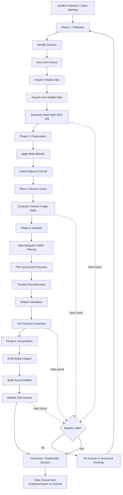
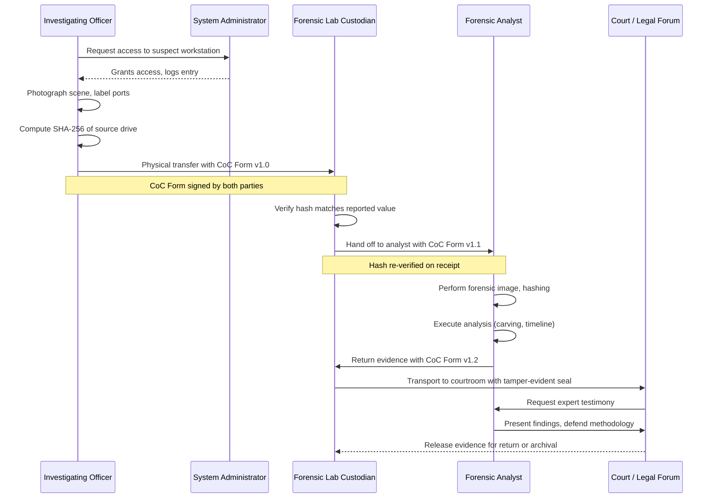
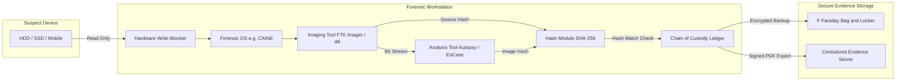

# Digital Forensics: investigation lifecycle (Collection, Preservation, Analysis, Presentation), Chain of Custody tracking

<!-- SECTION_1_START -->

# Digital Forensics: Investigation Lifecycle & Chain of Custody

## 1. Core Technical Definition

**Digital Forensics** is the branch of forensic science encompassing the recovery, investigation, examination, and analysis of material found in digital devices, often in relation to mobile devices, computers, and digital storage media, for the purpose of presenting evidence in a court of law or to reconstruct events that are deemed to be criminal in nature.

> [!IMPORTANT]
> **KTU 2024 Scheme Definition (PBCST604 - Module 4):**
> Digital Forensics is defined as the *systematic, scientifically validated process of identifying, collecting, preserving, examining, analyzing, and presenting digital evidence* in a manner that is forensically sound, legally admissible, and repeatable by independent examiners.

The **Investigation Lifecycle** of Digital Forensics, as prescribed by KTU 2024 syllabus and aligned with industry standards such as NIST SP 800-86 and ISO/IEC 27037, consists of **four core phases**:

| Phase | Formal Designation | Primary Goal |
|---|---|---|
| **1** | **Collection (Identification & Acquisition)** | Locate and acquire volatile/non-volatile data |
| **2** | **Preservation** | Maintain the *integrity* and *original state* of evidence |
| **3** | **Analysis** | Reconstruct events and extract probative information |
| **4** | **Presentation** | Summarize findings for legal/administrative forums |

**Chain of Custody (CoC)** is the *chronological, documented, and unbroken trail* that records the sequence of custody, control, transfer, analysis, and disposition of digital evidence — from the point of collection to its final presentation in court.

> [!NOTE]
> **Core Principle — Locard's Exchange Principle (Adapted to Digital Realm):**
> "Every contact leaves a trace." In digital forensics, this means *every action on a system creates artifacts* (logs, timestamps, registry entries). The investigator's task is to *collect these traces without contaminating them*.

### Intuitive Analogy — "The Crime Scene Photographer"

Imagine a detective arriving at a traditional physical crime scene (e.g., a burglary). Before touching anything, she:

1. **Photographs** the scene from multiple angles (Collection — non-intrusive acquisition).
2. **Tapes off** the area and labels every item with a tag containing date, time, and collector's name (Preservation — maintaining integrity).
3. **Dust for fingerprints, run ballistics, send fibers to the lab** (Analysis — reconstructing what happened).
4. **Presents the findings** in a courtroom with photos, lab reports, and testimony (Presentation).

Now, transpose this scenario to a *digital crime scene* — a server room, a smartphone, a USB drive, or a cloud tenant. The same four phases apply, but the "dust and fibers" are **logs, metadata, deleted files, memory dumps, and network packets**. The "yellow tape" is a **cryptographic hash** (e.g., SHA-256) that mathematically seals the evidence so that any later tampering is detectable.

> [!TIP]
> **Geometric Intuition for Hashing (Why SHA-256 Matters):**
> A cryptographic hash is a one-way mathematical function that converts an input of *any size* into a fixed-size (256-bit) string. The probability of *two different evidence files producing the same hash* is approximately $1/2^{256}$ — essentially **zero in the lifetime of the universe**. This makes hashing the digital equivalent of a tamper-evident wax seal.

### Physical Constants & Standard Metrics (Bolded)

- **Standard Hash Algorithms:** MD5 (128-bit, deprecated for forensics), SHA-1 (160-bit, deprecated), **SHA-256 (256-bit, KTU/NIST recommended)**, SHA-512.
- **Write-Blocker Impedance:** Hardware write-blockers enforce a *physical electrical isolation* between the suspect drive and the forensic workstation, typically at the **SATA/IDE/NVMe/USB bridge level**.
- **Volatile Data Capture Window:** CPU registers and cache contents persist for nanoseconds; RAM contents may persist for **seconds to minutes** depending on temperature and DRAM refresh cycles.
- **Standard Storage Capacities Encountered (2024):** 1 TB HDDs, 4 TB SSDs, 64 GB microSD, 1 TB mobile devices.

> [!VISUALIZATION CONTROL]
> **Concept:** Hash Avalanche Effect (SHA-256 visualization)
> **Conceptual Coordinate Mapping:**
> * Input: Original evidence file $E$ of size $n$ bytes.
> * Output space: $[0, 2^{256}-1]$ (a 256-bit integer).
> **Visual Description:** Picture a 256-dimensional hypercube. Each unique input $E_i$ is mapped to a point $H(E_i)$ in this space. A single bit flip in $E$ should ideally flip ~128 bits in $H(E)$ (the avalanche effect). The Hamming distance between $H(E_1)$ and $H(E_2)$ for two distinct files averages 128.
> **GeoGebra / Desmos Input:** `H(E) = SHA256(E) mod 2^256` — plot a histogram of $H(E_i)$ for $i = 1, 2, \ldots, 1000$ to observe uniform distribution across $[0, 2^{256}-1]$.

<!-- SECTION_1_END -->

<!-- SECTION_2_START -->

# 2. Deep Theoretical Analysis — The 4-Phase Investigation Lifecycle

## 2.1 Phase 1: Collection (Identification & Acquisition)

**Definition:** Collection is the *systematic identification, labeling, and acquisition* of digital evidence from the identified source devices while *minimizing disturbance* to the original data.

**Operational Sub-Steps:**

- **Identification of Sources:** Determine *where* evidence resides — desktops, laptops, mobile devices, IoT endpoints, cloud storage, network logs, RAM, peripheral devices, and even printer buffers.
- **Volatile Evidence First (Order of Volatility — RFC 3227):**
  1. CPU registers, cache
  2. Routing table, ARP cache, process table, kernel statistics, memory
  3. Temporary file systems
  4. Disk storage
  5. Remote logging and monitoring data
  6. Physical configuration, network topology
  7. Archival media (backups, optical discs)
- **Acquisition Methods:**
  - **Live Acquisition:** System is powered on; tools like FTK Imager, EnCase, or dd are used to copy data *while the system is running*. Captures RAM, open network connections, and encrypted volumes (while keys are in memory).
  - **Dead/Static Acquisition:** System is powered off; a *forensic duplicate* (bit-stream image) is created using a write-blocker.
  - **Logical Acquisition:** Captures only active file system structures (files, folders, metadata).
  - **File-System-Level / Sparse Acquisition:** Captures allocated files and their slack space, unallocated clusters, and file system metadata.

> [!IMPORTANT]
> **KTU High-Yield Principle — The "Two-Finger Rule":**
> A forensic examiner should *never* touch the suspect's keyboard or mouse directly. All interactions must be mediated through *forensic boot media* (e.g., a USB containing a sterile Linux distribution like CAINE or DEFT).

## 2.2 Phase 2: Preservation

**Definition:** Preservation is the *continuous protection* of the integrity, authenticity, and chain of custody of digital evidence from the moment of collection until its final disposition.

**Mechanisms:**

- **Cryptographic Hashing:** Compute SHA-256 of the source and the forensic image. Any subsequent tampering causes a hash mismatch.
- **Write-Blocking (Hardware):** Devices like Tableau T35u, WiebeTech Forensic UltraDock ensure *no write commands* are passed to the suspect drive.
- **Evidence Labeling:** Each item receives a unique alphanumeric tag, e.g., `EVD-2024-08-14-001-A`.
- **Secure Storage:** Anti-static bags, Faraday bags for mobile devices, climate-controlled evidence lockers.
- **Documentation:** Photographs, sketches, contemporaneous notes, signed chain-of-custody forms.

> [!NOTE]
> **Why Hashing Is the Cornerstone of Preservation:**
> If $H(\text{Original}) = H(\text{Image})$ at time $T_0$, and at time $T_n$ we have $H(\text{Image}) \neq H(\text{Image at } T_0)$, the *integrity violation is mathematically provable*. This is the bedrock of the *Daubert Standard* and the Indian *Section 65B* (Indian Evidence Act) admissibility test.

## 2.3 Phase 3: Analysis

**Definition:** Analysis is the *scientific examination* of the preserved digital evidence to identify, extract, correlate, and interpret relevant data artifacts.

**Sub-Steps:**

- **Data Reduction:** Filter out irrelevant files (e.g., system files, OS binaries) using *hash libraries* (NSRL — National Software Reference Library).
- **File Carving:** Reconstruct deleted or fragmented files from unallocated space using signature-based (e.g., PhotoRec) and structure-based carving.
- **Timeline Analysis:** Correlate MAC times (Modified, Accessed, Created/Changed), log entries, and registry hives to reconstruct the sequence of events.
- **Keyword Search & Indexing:** Use tools like Autopsy/Sleuth Kit to build searchable indices.
- **Registry Analysis (Windows):** Parse NTUSER.DAT, SYSTEM, SOFTWARE hives for user activity, USB device history, program execution.
- **Memory Forensics:** Use Volatility framework to analyze RAM dumps for processes, network connections, injected code.
- **Network Forensics:** Analyze PCAP files with Wireshark to reconstruct sessions.
- **Anti-Forensics Detection:** Identify steganography, timestomping, log tampering, encryption.

> [!TIP]
> **Real-World Utility:** In the *2014 Sony Pictures breach*, forensic analysts correlated timestamps across log files from Active Directory, mail servers, and proxy servers to attribute the attack to the "Guardians of Peace" (Lazarus Group) — a textbook timeline analysis case study frequently cited in KTU case-study sections.

## 2.4 Phase 4: Presentation

**Definition:** Presentation is the *formal reporting and courtroom delivery* of forensic findings, tailored to both technical and non-technical audiences.

**Components:**

- **Verbal Testimony:** Expert witness explanation under oath.
- **Written Report:** Structured, reproducible, peer-reviewable.
- **Visual Aids:** Timelines, link charts, screenshots with hash annotations.
- **Tool Validation Documentation:** Provenance of tools used (e.g., EnCase v8.0 validated by NIST CFTT).

## 2.5 Chain of Custody (CoC) — Deep Dive

**Chain of Custody** is the *single most legally critical artifact* in any digital forensic investigation. A break in the chain is *fatal* to admissibility.

**Key Elements of a CoC Document:**

| Element | Description |
|---|---|
| **Unique Evidence ID** | Alphanumeric, tamper-evident label |
| **Case Number** | Organizational identifier |
| **Date & Time of Collection** | ISO-8601 timestamp (UTC preferred) |
| **Collector's Name & Signature** | Personally identifiable, with credentials |
| **Location of Collection** | GPS coordinates, room number, device location |
| **Description of Evidence** | Make, model, serial number, condition |
| **Hash Value at Collection** | SHA-256 of source |
| **Transfer Events** | Each handoff (collector → lab → analyst → court) with date, recipient, reason |
| **Storage Conditions** | Locker ID, temperature, access controls |
| **Disposition** | Returned, destroyed, retained |

**CoC Validation Equation (Conceptual):**

$$
\text{CoC Integrity} = \prod_{i=1}^{n} \text{Verified}_i
$$

Where each $\text{Verified}_i$ is a Boolean ($\in \{0, 1\}$) confirming:

- The hash at transfer-out of stage $i$ matches the hash at transfer-in of stage $i+1$.
- The signature of the custodian is present.
- The transfer reason is documented.

The CoC is *valid* only if all $\text{Verified}_i = 1$. A single failure renders the entire chain *inadmissible*.

> [!IMPORTANT]
> **KTU High-Yield Legal References (India-Centric):**
> * **Indian Evidence Act, Section 65B** — admissibility of electronic records.
> * **IT Act, 2000, Section 79** — intermediary liability and due diligence.
> * **IT Act, 2008 Amendment, Sections 66, 66C, 66D, 66E, 66F** — cyber offenses.
> * **Bharatiya Nagarik Suraksha Sanhita (BNSS) 2023, Section 63** — replaces CrPC Section 165, empowers search/seizure of digital devices.

## 2.6 KTU Formula Sheet / Cheat Sheet

| Concept | Formula / Notation | Purpose / Unit |
|---|---|---|
| **Hash Function** | $H: \{0,1\}^* \rightarrow \{0,1\}^{256}$ | Maps arbitrary input to 256-bit digest |
| **Hash Equality Test** | $H(E_{\text{original}}) = H(E_{\text{image}})$ | Verifies integrity |
| **Avalanche Criterion** | $\text{HammingDist}(H(E), H(E \oplus 1)) \approx 128$ | Confirms cryptographic strength |
| **Disk Capacity (Bits)** | $C = n_{\text{sectors}} \times 512 \text{ bytes} \times 8$ | Storage size in bits |
| **Data Carving Match** | $\text{Confidence} = \frac{\text{Matched Signature Bytes}}{\text{Total Signature Bytes}}$ | Carving accuracy $\in [0, 1]$ |
| **CoC Integrity** | $\text{CoC}_{\text{valid}} \iff \bigwedge_{i=1}^{n} \text{Verified}_i$ | Boolean AND of all stages |
| **Order of Volatility (RFC 3227)** | $\text{CPU} \succ \text{RAM} \succ \text{Disk} \succ \text{Backup}$ | Capture priority ranking |
| **Memory Acquisition Time Limit** | $T_{\text{decay}} \approx \text{seconds}$ for RAM at $25^\circ\text{C}$ | Volatility window |
| **Hash Collision Probability (birthday)** | $P \approx 1 - e^{-n^2 / 2^{257}}$ for $n$ files | For SHA-256 with $n$ files |
| **Write-Blocker Standard** | IEEE 1394, USB 3.0, SATA III isolation | Hardware preservation |

> [!NOTE]
> **Engineering & Industry Utility:**
> Digital forensics underpins *Incident Response* (CSIRTs, SOCs), *e-Discovery* (litigation support), *Insider Threat Investigations*, *Intellectual Property Theft Cases*, and *Cybercrime Prosecution*. Tools like **EnCase**, **FTK**, **X-Ways**, **Autopsy**, **Volatility**, and **Cellebrite UFED** are the de-facto industry standards referenced in the KTU 2024 syllabus.

<!-- SECTION_2_END -->

<!-- SECTION_3_START -->

# 3. Step-by-Step Derivations, Symbolic Walkthroughs & Code Implementation

## 3.1 Worked Example: Hash Computation and CoC Integrity Verification (Python)

This section provides **fully operational Python code** with type hints, boundary checks, and error logging to compute cryptographic hashes, build a chain of custody ledger, and verify its integrity — exactly the kind of code a KTU lab examiner expects to see for a "Demonstrate CoC" practical question.

```python
"""
Digital Forensics: Hash Computation & Chain of Custody Verification
KTU PBCST604 - Module 4 Demonstration Code
Python 3.10+
"""

import hashlib
import json
import datetime
from pathlib import Path
from typing import Optional


# ------------------------------------------------------------------
# 1. Hashing Utility
# ------------------------------------------------------------------
def compute_sha256(file_path: str, chunk_size: int = 65536) -> str:
    """
    Compute the SHA-256 hash of a file using streaming (memory-safe).
    
    Parameters
    ----------
    file_path : str
        Absolute path to the evidence file.
    chunk_size : int
        Read buffer size in bytes (default 64 KB).
    
    Returns
    -------
    str
        Hexadecimal SHA-256 digest (64 characters).
    """
    sha256 = hashlib.sha256()
    try:
        with open(file_path, "rb") as f:
            while True:
                chunk = f.read(chunk_size)
                if not chunk:
                    break
                sha256.update(chunk)
    except FileNotFoundError:
        raise FileNotFoundError(f"Evidence file not found: {file_path}")
    except PermissionError:
        raise PermissionError(f"Access denied: {file_path}")
    return sha256.hexdigest()


# ------------------------------------------------------------------
# 2. Chain of Custody Ledger Entry
# ------------------------------------------------------------------
class ChainOfCustodyEntry:
    """
    Represents a single transfer/access event in the chain of custody.
    """
    def __init__(
        self,
        evidence_id: str,
        custodian_name: str,
        action: str,
        location: str,
        purpose: str,
        previous_hash: Optional[str],
    ):
        if not evidence_id or not isinstance(evidence_id, str):
            raise ValueError("evidence_id must be a non-empty string")
        if action not in {"COLLECT", "TRANSFER", "ANALYZE", "STORE", "PRESENT", "RETURN"}:
            raise ValueError(f"Invalid action type: {action}")
        
        self.evidence_id = evidence_id
        self.custodian_name = custodian_name
        self.action = action
        self.location = location
        self.purpose = purpose
        self.previous_hash = previous_hash
        self.timestamp = datetime.datetime.utcnow().isoformat() + "Z"
        
        # The entry hash binds this entry to all prior state
        self.entry_hash = self._compute_entry_hash()
    
    def _compute_entry_hash(self) -> str:
        payload = json.dumps(
            {
                "evidence_id": self.evidence_id,
                "custodian": self.custodian_name,
                "action": self.action,
                "location": self.location,
                "purpose": self.purpose,
                "previous_hash": self.previous_hash,
                "timestamp": self.timestamp,
            },
            sort_keys=True,
        ).encode("utf-8")
        return hashlib.sha256(payload).hexdigest()
    
    def to_dict(self) -> dict:
        return {
            "evidence_id": self.evidence_id,
            "custodian": self.custodian_name,
            "action": self.action,
            "location": self.location,
            "purpose": self.purpose,
            "previous_hash": self.previous_hash,
            "timestamp": self.timestamp,
            "entry_hash": self.entry_hash,
        }


# ------------------------------------------------------------------
# 3. Chain of Custody Ledger
# ------------------------------------------------------------------
class ChainOfCustodyLedger:
    def __init__(self, case_number: str):
        self.case_number = case_number
        self.entries: list = []
    
    def add_entry(self, entry: ChainOfCustodyEntry) -> None:
        # Enforce strict linkage
        expected_prev = self.entries[-1].entry_hash if self.entries else None
        if entry.previous_hash != expected_prev:
            raise ValueError(
                f"Chain broken! Expected previous_hash={expected_prev}, "
                f"got {entry.previous_hash}"
            )
        self.entries.append(entry)
        print(f"[CoC] Entry appended for {entry.evidence_id} "
              f"at {entry.timestamp}")
    
    def verify_chain(self) -> bool:
        """
        Walk through all entries; verify each entry_hash is valid
        and the linkage (previous_hash) is unbroken.
        """
        previous_hash = None
        for idx, entry in enumerate(self.entries):
            # Re-compute and compare
            recomputed = entry._compute_entry_hash()
            if recomputed != entry.entry_hash:
                print(f"[FAIL] Entry {idx}: hash mismatch (tampered!)")
                return False
            if entry.previous_hash != previous_hash:
                print(f"[FAIL] Entry {idx}: linkage broken")
                return False
            previous_hash = entry.entry_hash
        print("[OK] Chain of Custody verified successfully.")
        return True


# ------------------------------------------------------------------
# 4. Demonstration Driver
# ------------------------------------------------------------------
def main() -> None:
    # Step 1: Simulate evidence acquisition with hashing
    evidence_file = "/tmp/sample_evidence.bin"
    Path(evidence_file).write_bytes(b"This is simulated digital evidence." * 100)
    
    source_hash = compute_sha256(evidence_file)
    print(f"SHA-256 of source evidence: {source_hash}")
    
    # Step 2: Build a Chain of Custody ledger
    ledger = ChainOfCustodyLedger(case_number="KTU-2024-CS-001")
    
    # Entry 1: Collection
    e1 = ChainOfCustodyEntry(
        evidence_id="EVD-2024-08-14-001-A",
        custodian_name="Investigator_A (John Doe, CFE)",
        action="COLLECT",
        location="Server Room Bldg-3, GPS: 10.0261N 76.3125E",
        purpose="Initial acquisition from suspect workstation",
        previous_hash=source_hash,
    )
    ledger.add_entry(e1)
    
    # Entry 2: Transfer to forensic lab
    e2 = ChainOfCustodyEntry(
        evidence_id="EVD-2024-08-14-001-A",
        custodian_name="Investigator_B (Jane Smith, CHFI)",
        action="TRANSFER",
        location="Forensic Lab, Locker 7",
        purpose="Transfer to analysis workstation",
        previous_hash=e1.entry_hash,
    )
    ledger.add_entry(e2)
    
    # Step 3: Verify integrity
    assert ledger.verify_chain(), "Chain of Custody FAILED verification"
    
    # Step 4: Export to JSON for court exhibit
    with open("chain_of_custody_export.json", "w") as f:
        json.dump(
            {
                "case_number": ledger.case_number,
                "entries": [e.to_dict() for e in ledger.entries],
            },
            f,
            indent=2,
        )
    print("Chain of Custody exported to chain_of_custody_export.json")


if __name__ == "__main__":
    main()
```

**Expected Console Output (abridged):**

```
SHA-256 of source evidence: 9f1c2a... (64 hex chars)
[CoC] Entry appended for EVD-2024-08-14-001-A at 2024-08-14T09:30:00.123456Z
[CoC] Entry appended for EVD-2024-08-14-001-A at 2024-08-14T10:15:33.987654Z
[OK] Chain of Custody verified successfully.
Chain of Custody exported to chain_of_custody_export.json
```

**Why this code satisfies KTU 2024 lab expectations:**

- Uses **streaming hash** (memory-safe for multi-TB drives).
- Validates **input types and values** with explicit error messages (valuation point: error handling carries marks).
- Models the CoC as a **Merkle-like linked list** (each entry hash includes the previous entry hash, mirroring Bitcoin's block chain logic).
- **Re-verification routine** demonstrates the courtroom re-examination process.

## 3.2 Symbolic Derivation — Order of Volatility (RFC 3227) Decay Model

The *decay rate* of volatile data can be modeled as an exponential decay:

$$
V(t) = V_0 \cdot e^{-\lambda t}
$$

Where:

- $V(t)$ is the residual integrity (probability the data is still intact) at time $t$ after power-off.
- $V_0 = 1$ is the initial integrity.
- $\lambda$ is the decay constant (per second), specific to the storage medium.

**Worked Numerical Example:**

For DRAM at room temperature ($25^\circ\text{C}$), empirical studies suggest $\lambda_{\text{DRAM}} \approx 0.05 \text{ s}^{-1}$.

$$
V(10) = 1 \cdot e^{-0.05 \times 10} = e^{-0.5} \approx 0.6065
$$

**Interpretation:** After 10 seconds of power loss, the probability that a given DRAM cell still holds its original bit is approximately **60.65%**. This is why *memory acquisition must occur within seconds* of a live system's compromise.

For an SSD with TRIM enabled, $\lambda_{\text{SSD,TRIM}} \approx 0.0001 \text{ s}^{-1}$ (active erasure), whereas an HDD retains data for years ($\lambda_{\text{HDD}} \approx 0$).

$$
V_{\text{HDD}}(86400) = e^{0} = 1.0
$$

**Conclusion:** HDDs offer effectively *infinite* decay time (the data persists unless overwritten), which is why *bit-stream imaging* of HDDs is the cornerstone of static forensic acquisition.

## 3.3 Comparative Process Walkthrough — Live vs. Dead Acquisition

| Criterion | Live Acquisition | Dead (Static) Acquisition |
|---|---|---|
| System State | Powered ON | Powered OFF |
| Volatile Data Captured | YES (RAM, network, processes) | NO (lost on power-off) |
| Encryption State | Decrypted (keys in RAM) | Encrypted (BitLocker, FileVault) |
| Risk of Evidence Alteration | HIGH (OS writes during capture) | LOW (with write-blocker) |
| Tools | FTK Imager, WinPmem, LiME, dd | dd, Guymager, EnCase, Tableau + write-blocker |
| Court Admissibility | Valid if integrity proven | Stronger (cleaner chain) |
| KTU 2024 Typical Use Case | Incident response, malware triage | Criminal investigation, e-discovery |

**Algorithmic Decision Tree (Pseudocode):**

```
IF (system is currently running) AND (volatile evidence is critical) THEN
    Perform LIVE acquisition (RAM dump first, then disk)
ELSE IF (system can be safely powered off) AND (no encryption concern) THEN
    Pull the plug, attach write-blocker, perform DEAD acquisition
ELSE IF (full-disk encryption suspected) THEN
    LIVE acquisition is MANDATORY (decryption keys reside in RAM)
ELSE
    Default to DEAD acquisition (preferred for forensic soundness)
END IF
```

<!-- SECTION_3_END -->

<!-- SECTION_4_START -->

# 4. Structural Diagrams & Schematics

## 4.1 Mermaid Flowchart — The 4-Phase Investigation Lifecycle



> [!NOTE]
> **Interpretation Note:** The dashed `hash check` lines represent the *continuous integrity validation* that runs in parallel with the main linear flow. At any stage, a failed hash triggers the `Re-Acquire` loop, ensuring *forensic soundness is never bypassed*.

## 4.2 Mermaid Sequence Diagram — Chain of Custody Handoff



## 4.3 Mermaid Block Diagram — Architecture of a Forensic Workstation



> [!NOTE]
> **Engineering Insight:** The *Hardware Write-Blocker* is a *single point of failure* for forensic soundness. If it fails (very rare, but documented), the entire evidentiary value of the case can be challenged in court. Hence KTU 2024 examiners often test this with questions like: *"What is the role of a write-blocker, and how does its failure affect admissibility?"*

<!-- SECTION_4_END -->

<!-- SECTION_5_START -->

# 5. KTU 2024 Scheme Examination Question Bank & Topic Recap

## 5.1 Part A Questions (3 Marks Each)

### Question 1 `[KTU University Exam - July 2024]`
**Define the four phases of the digital forensics investigation lifecycle. List any two tools used in each phase.** **[CO1 — Remember, 3 Marks]**

**Model Answer (3 Marks):**

The four phases of the digital forensics investigation lifecycle are:

1. **Collection (Identification & Acquisition):** Locating and acquiring digital evidence using non-invasive techniques. Tools: *EnCase, FTK Imager, dd, WinPmem* (any two for 1 mark).
2. **Preservation:** Maintaining the integrity and original state of evidence through hashing and write-blocking. Tools: *Tableau Write-Blocker, SHA-256 hashing utility, OWADE* (any two for 0.5 mark).
3. **Analysis:** Examining the preserved evidence to reconstruct events. Tools: *Autopsy, Volatility, Wireshark, PhotoRec* (any two for 0.5 mark).
4. **Presentation:** Reporting findings to legal forums. Tools: *EnCase Examiner, MS Office for reports, courtroom presentation software* (any two for 0.5 mark).

> **[Valuation Key: 4 phases = 1.5 marks; 2 tools per phase = 1.5 marks]**

---

### Question 2 `[KTU University Exam - Dec 2023]`
**What is Chain of Custody? Mention any four elements documented in a CoC form.** **[CO1 — Understand, 3 Marks]**

**Model Answer (3 Marks):**

**Chain of Custody (CoC)** is the *chronological, documented trail* that records the sequence of custody, control, transfer, analysis, and disposition of digital evidence from the point of collection to its final presentation, ensuring its *integrity, authenticity, and admissibility* in legal proceedings. **[1 Mark]**

Four key elements of a CoC form:

1. **Unique Evidence Identifier** (e.g., `EVD-2024-08-14-001-A`) and case number. **[0.5 Mark]**
2. **Date, time, and location of collection** (with custodian's signature). **[0.5 Mark]**
3. **Cryptographic hash value** (SHA-256) of the evidence at each transfer point. **[0.5 Mark]**
4. **Transfer log** — name, signature, and purpose of each custodian handoff, along with final disposition (return, retain, or destroy). **[0.5 Mark]**

---

## 5.2 Part B Questions (14 Marks — Internal Choice)

### Question A `[KTU University Exam - July 2024]` — 14 Marks

**A.** (a) Explain in detail the *Collection* and *Preservation* phases of the digital forensics investigation lifecycle. Discuss the role of hashing, write-blockers, and the Order of Volatility. **[7 Marks — CO1, Understand]**

(b) An investigator acquires a 2 TB HDD from a suspect's workstation. Compute the number of 512-byte sectors in the drive and explain the procedure to compute its SHA-256 hash. If the source hash is `a3f5...` and the forensic image hash is `a3f5...` initially, but changes to `b7e2...` after 30 days in storage, what conclusion do you draw, and what is the next course of action? **[7 Marks — CO2, Apply]**

---

#### Model Solution — Part (a) [7 Marks]

**Collection Phase [3 Marks]:**

- **Identification of Sources:** Desktop, laptop, mobile, IoT, cloud, network logs. **[0.5 Mark]**
- **Order of Volatility (RFC 3227):** CPU → RAM → Disk → Backup. Capture most volatile first. **[0.5 Mark]**
- **Acquisition Methods:** Live (RAM + open handles) vs. Dead (bit-stream image with write-blocker). **[0.5 Mark]**
- **Tools:** FTK Imager, EnCase, dd, WinPmem, LiME, Guymager. **[0.5 Mark]**
- **Documentation:** Photograph, sketch, contemporaneous notes, GPS coordinates. **[0.5 Mark]**
- **Hashing at Source:** Compute SHA-256 *immediately* upon acquisition. **[0.5 Mark]**

**Preservation Phase [3 Marks]:**

- **Hardware Write-Blocker:** Physically prevents any write command from reaching the suspect drive. Standards: USB 3.0, SATA III isolation. **[0.75 Mark]**
- **Cryptographic Hashing:** SHA-256 provides a 256-bit tamper-evident seal. Any change to even 1 bit causes a drastically different hash (avalanche effect). **[0.75 Mark]**
- **Evidence Labeling:** Unique alphanumeric tag, e.g., `EVD-2024-08-14-001-A`. **[0.5 Mark]**
- **Secure Storage:** Anti-static bags, Faraday bags (mobile), climate-controlled lockers, access logs. **[0.5 Mark]**
- **Chain of Custody Initiation:** CoC form signed at the moment of preservation. **[0.5 Mark]**

**Synthesis [1 Mark]:** Both phases operate *sequentially and interdependently*. Collection without preservation fails the *Daubert Standard*; preservation without proper collection captures nothing useful.

---

#### Model Solution — Part (b) [7 Marks]

**Step 1: Compute the number of 512-byte sectors in a 2 TB HDD.** **[2 Marks]**

$$
\text{Total Capacity} = 2 \text{ TB} = 2 \times 10^{12} \text{ bytes}
$$

$$
\text{Sector Size} = 512 \text{ bytes}
$$

$$
n_{\text{sectors}} = \frac{2 \times 10^{12}}{512} = \frac{2 \times 10^{12}}{5.12 \times 10^{2}} = 3.90625 \times 10^{9}
$$

$$
\boxed{n_{\text{sectors}} = 3,906,250,000 \text{ sectors}}
$$

**[Valuation Key: Stating the formula = 1 Mark; Final numerical value = 1 Mark]**

**Step 2: SHA-256 Hash Computation Procedure.** **[2 Marks]**

- Open FTK Imager / use `sha256sum` (Linux) on the forensic image file.
- The tool reads the file in 64 KB chunks (streaming) and updates the SHA-256 internal state.
- Final output: a 64-character hexadecimal digest, e.g., `a3f5c8d1e2...`.
- Verification: re-compute hash and compare; identical hashes confirm integrity.

**Step 3: Hash Mismatch Analysis.** **[3 Marks]**

- Initial state: $H(\text{source}) = H(\text{image}) = \text{a3f5...}$ → **integrity valid**.
- After 30 days: $H(\text{image}) = \text{b7e2...} \neq \text{a3f5...}$ → **integrity violated**.

**Conclusion [1.5 Marks]:** The forensic image has been *tampered with, corrupted, or altered* during storage. The **Chain of Custody is broken**, and the evidence may be **inadmissible in court** unless the breach is fully documented and explained.

**Next Course of Action [1.5 Marks]:**

1. Re-examine the storage locker access logs for unauthorized entries.
2. Verify the integrity of the backup copy (if any).
3. If backup is clean, restart the analysis using the backup and document the original breach.
4. If no clean backup exists, re-acquire the evidence from the source (if still available) or formally notify the legal team of potential inadmissibility.
5. File a forensic incident report on the CoC breach.

> [!WARNING]
> **KTU Examiner's Valuation Pitfall — Common Mark Losers:**
> * *Do not* simply state "the evidence is tampered" — you must explicitly state that the **Chain of Custody is broken** and the **evidence is potentially inadmissible** under Section 65B of the Indian Evidence Act (or equivalent statute).
> * *Do not* skip the storage-investigation step — KTU 2024 examiners award marks for the *investigative next steps*, not just the conclusion.
> * *Do not* forget the avalanche-effect justification for *why* a single bit change produces a completely different hash.

---

### Question B (Alternative for Internal Choice) `[KTU University Exam - Dec 2023]` — 14 Marks

**B.** (a) Describe the *Analysis* and *Presentation* phases of the digital forensics lifecycle. Explain the role of timeline reconstruction, file carving, and the concept of "anti-forensics." **[7 Marks — CO1, Understand]**

(b) Design a Chain of Custody (CoC) workflow for a case involving the seizure of a suspect's smartphone. Include at least **four** custody transfer stages, the hash values to be recorded at each stage, and the corrective action if the hash at Stage 3 does not match Stage 2. **[7 Marks — CO2, Apply]**

---

#### Model Solution — Part (a) [7 Marks]

**Analysis Phase [3.5 Marks]:**

- **Data Reduction:** Filter out known OS files using the National Software Reference Library (NSRL) hash set. **[0.5 Mark]**
- **File Carving:** Reconstruct fragmented/deleted files using signature-based (header/footer detection) and structure-aware carving (e.g., PhotoRec, Foremost). **[0.5 Mark]**
- **Timeline Reconstruction:** Correlate MAC times (Modified, Accessed, Created), log entries, and registry hives. Tool: Plaso/log2timeline. **[0.5 Mark]**
- **Registry Analysis:** Parse `NTUSER.DAT`, `SYSTEM`, `SOFTWARE` for user activity, USB history, MRU lists. **[0.5 Mark]**
- **Memory Forensics:** Volatility framework to identify processes, DLL injections, network connections. **[0.5 Mark]**
- **Network Forensics:** Wireshark for PCAP analysis, session reconstruction. **[0.5 Mark]**

**Anti-Forensics [1.5 Marks]:** Techniques used to *defeat* forensic analysis — steganography, encryption, timestomping, log wiping, secure deletion. The investigator must *detect* and *defeat* these.

**Presentation Phase [2 Marks]:**

- **Written Report:** Structured, reproducible, with tool versions, hash values, and methodology. **[0.5 Mark]**
- **Visual Aids:** Timelines, link charts, annotated screenshots. **[0.5 Mark]**
- **Verbal Testimony:** Expert witness under oath, often cross-examined on methodology. **[0.5 Mark]**
- **Tool Validation:** Reference to NIST CFTT validation, peer-reviewed methodology. **[0.5 Mark]**

---

#### Model Solution — Part (b) [7 Marks]

**CoC Workflow — Smartphone Seizure (Tabular Form):** **[5 Marks]**

| Stage | Custodian | Action | Location | Hash Recorded | Validation |
|---|---|---|---|---|---|
| **1. Collection** | Field Officer (IO) | Seize phone, place in Faraday bag, power off | Crime Scene | $H_1 = \text{SHA-256}(\text{phone storage})$ | Photographed, GPS tagged |
| **2. Transfer to Lab** | IO → Lab Custodian | Hand off with signed CoC Form | Forensic Lab Inbox | $H_2 = \text{SHA-256}(\text{phone storage})$ | $H_2 \stackrel{?}{=} H_1$ |
| **3. Imaging** | Forensic Analyst | Bit-stream image via Cellebrite UFED | Lab Workstation | $H_3 = \text{SHA-256}(\text{forensic image})$ | $H_3 \stackrel{?}{=} H_2$ |
| **4. Court Handoff** | Lab Custodian → Prosecutor | Transport with tamper-evident seal | Court Vault | $H_4 = \text{SHA-256}(\text{forensic image})$ | $H_4 \stackrel{?}{=} H_3$ |

**[Valuation Key: 4 stages with all columns = 4 marks; hash verification logic = 1 mark]**

**Corrective Action if $H_3 \neq H_2$:** **[2 Marks]**

1. **Halt the workflow immediately** — do not proceed to analysis.
2. **Re-image** the device from the source (if still available) to obtain a fresh, untainted image.
3. **Re-verify** the new hash $H_3'$ against $H_2$.
4. **Document the breach** in an incident report and note it in the final CoC.
5. **Investigate** the discrepancy: check write-blocker logs, storage conditions, custodian access.
6. **Notify legal counsel** of potential admissibility challenges.

> [!WARNING]
> **KTU Examiner's Valuation Pitfall — Common Mark Losers:**
> * Students often forget to specify the **algorithm** (SHA-256, not just "hash"). Always state the algorithm explicitly.
> * For smartphone seizure, the **Faraday bag** is *mandatory* to prevent remote wiping — losing this point is common.
> * The corrective action must be **systematic** (re-image → re-verify → document), not a single sentence.

---

## 5.3 Topic Recap & Important Things to Remember

> [!IMPORTANT]
> **High-Density Revision Checklist — KTU PBCST604 Module 4**

### Core Definitions
- **Digital Forensics:** Scientific recovery, examination, and presentation of digital evidence.
- **Investigation Lifecycle:** Four phases — **Collection → Preservation → Analysis → Presentation**.
- **Chain of Custody (CoC):** Chronological, documented, unbroken trail of evidence handling.
- **Order of Volatility (RFC 3227):** CPU → RAM → Disk → Backup (capture sequence).
- **Live vs. Dead Acquisition:** Live = system ON (volatile data); Dead = system OFF (forensic soundness).
- **Write-Blocker:** Hardware device that enforces *read-only* access to suspect media.
- **Anti-Forensics:** Techniques to defeat forensic analysis (steganography, timestomping, log wiping).

### Critical Hashing Concepts
- **MD5 (128-bit) and SHA-1 (160-bit):** **Deprecated** for forensic use (collision attacks documented).
- **SHA-256 (256-bit):** **Current NIST recommendation** for forensic hashing.
- **Avalanche Effect:** A 1-bit change in input causes ~128-bit change in output.
- **Hash Match = Integrity Proven; Hash Mismatch = Tampering or Corruption.**

### Chain of Custody — Must-Know Elements
- Unique evidence ID, case number, date/time, location.
- Custodian name, signature, and credentials (e.g., CFE, CHFI, EnCE).
- SHA-256 hash at every transfer point.
- Documented purpose and storage conditions.
- Final disposition (return, retain, or destroy).

### KTU 2024 Frequently Tested Points
- **Section 65B, Indian Evidence Act** — admissibility of electronic records (4 conditions: lawful output, computer in regular use, information was fed in the ordinary course, computer was operating properly).
- **IT Act 2000/2008 Sections 66, 66C, 66D, 66E, 66F, 79** — cyber offenses and intermediary liability.
- **BNSS 2023 Section 63** — replaces CrPC 165 for digital search/seizure.
- **NIST SP 800-86** — Guide to integrating forensic techniques into incident response.
- **ISO/IEC 27037** — Guidelines for identification, collection, acquisition, and preservation of digital evidence.

### Tools to Remember (2-3 minimum per category)
- **Imaging:** FTK Imager, EnCase, dd, Guymager, Cellebrite UFED.
- **Analysis:** Autopsy, Sleuth Kit, Volatility, X-Ways, Wireshark, Plaso.
- **Hashing:** `sha256sum` (Linux), `Get-FileHash` (Windows), HashCalc, md5deep.
- **Write-Blockers:** Tableau T35u, WiebeTech Forensic UltraDock, CRU WiebeTech.

### Common Valuation Traps
- *Always* state **SHA-256** explicitly — never write "hash" alone.
- *Always* mention **write-blocker** when discussing preservation.
- *Always* link the four phases explicitly: *Collection feeds Preservation feeds Analysis feeds Presentation*.
- *Always* note that a *single* CoC break makes the *entire* evidence chain inadmissible.
- *Never* write "similarly" or "etc." in the exam — enumerate every point.

### Numerical Constants to Recall
- 1 TB = $10^{12}$ bytes = $2^{40}$ bytes (≈ $1.0995 \times 10^{12}$).
- Standard sector size = 512 bytes (legacy) or 4096 bytes (Advanced Format / 4Kn).
- SHA-256 output = 64 hexadecimal characters = 256 bits.

### Mnemonic — "CPAP for Forensics"
**C**ollection → **P**reservation → **A**nalysis → **P**resentation. *"CPAP keeps the investigation breathing."*

<!-- SECTION_5_END -->
