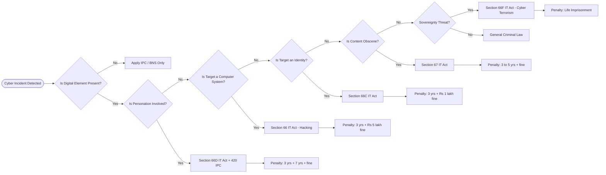
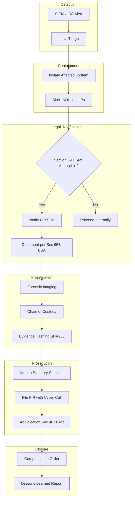

# Legislative Frameworks: Cybercrime classifications, Electronic fraud statutes, Intellectual Property Rights (IPR) protections

<!-- SECTION_1_START -->

# Legislative Frameworks: Cybercrime, Electronic Fraud, and IPR Protections

## 1.1 Formal Academic Definition

In the context of **Cyber Security** and **Digital Forensics** (KTU PBCST604, Module 4), a **Legislative Framework** refers to the codified body of laws, statutory acts, amendments, and judicial precedents that define criminal conduct in cyberspace, prescribe punishments for electronic fraud, and protect intellectual creations in the digital domain. In India, this framework is principally anchored by the **Information Technology Act, 2000** (amended in 2008), the **Indian Penal Code (IPC), 1860** (now increasingly supplemented by the **Bharatiya Nyaya Sanhita, 2023**), the **Copyright Act, 1957**, the **Patents Act, 1970**, and the **Trade Marks Act, 1999**.

> [!IMPORTANT]
> **KTU Syllabus Highlight (PBCST604 — Module 4):**
> "Legislative Frameworks — Cybercrime classifications, Electronic fraud statutes, Intellectual Property Rights (IPR) protections" forms a high-weightage topic. Students must be able to **classify** offences, **map** them to specific statutory sections, and **evaluate** penalties for examination purposes.

## 1.2 Conceptual Analogy / Intuition

Think of the **Legislative Framework** as the **"Traffic Rule Book of the Digital Highway."** Just as physical roads have rules (speed limits, lane discipline, signals) enforced by the Motor Vehicles Act with specific penalties (fine, license suspension, imprisonment), the Internet — a vast digital highway — has its own rule book. **Cybercrime classifications** are like categorizing violations (rash driving, drunk driving, hit-and-run). **Electronic fraud statutes** are the penalty sheets (e.g., Section 420 IPC for cheating). **IPR protections** are like vehicle registration plates — they uniquely identify *who owns* a digital creation, preventing theft or duplication. Without these rules, the digital world would be lawless, just as a road without traffic signals leads to chaos.

## 1.3 Key Terminology Snapshot

- **Cybercrime** — Any unlawful act wherein a computer, network, or digital device is the **object**, **subject**, or **tool** of the offence.
- **Electronic Fraud** — Dishonest inducement or deception using electronic means to cause wrongful loss/gain (Section 66D IT Act + Section 420 IPC).
- **Intellectual Property Right (IPR)** — A bundle of exclusive legal rights granted to creators/owners over creations of the mind (inventions, literary/artistic works, designs, symbols).
- **Adjudicating Officer** — Appointed under Section 46 of the IT Act to hear disputes regarding contraventions (other than those punishable with imprisonment).
- **Cyber Appellate Tribunal (CAT)** — Earlier appellate body under the IT Act; its powers were transferred to the **Telecom Disputes Settlement and Appellate Tribunal (TDSAT)** in 2017.

> [!NOTE]
> **Core Definition — Cybercrime (UN Definition):**
> "Any illegal behaviour directed by means of electronic operations that target the security of computer systems and the data processed by them." — Adopted by the **10th United Nations Congress on the Prevention of Crime and the Treatment of Offenders (2000)**.

## 1.4 Standard Metrics & Benchmarks (Statutory)

| Parameter | Statutory Benchmark |
|---|---|
| **Imprisonment ceiling (most IT Act offences)** | Up to **3 years** or **5 years** (with fine) |
| **Maximum fine (IT Act)** | Generally up to **₹1,00,000** (varies by section) |
| **Compensation ceiling (Section 66B)** | Up to **₹1 crore** (adjudication) |
| **Bail for non-bailable cyber offences** | At the discretion of the Magistrate |
| **Cognizance period (IT Act offences)** | Within **3 years** from commission (Section 77) |
| **Copyright registration validity** | Lifetime of author + **60 years** |
| **Patent term** | **20 years** from filing date |

## 1.5 GeoGebra / Desmos Integration

> [!VISUALIZATION CONTROL]
> **Concept:** Hierarchical mapping of Cybercrime Classifications using a 2D coordinate space (X-axis = Target type, Y-axis = Severity index).
> **GeoGebra / Desmos Input Equations:**
> * `f(x) = x^2` (quadratic severity curve)
> * `g(x) = sin(pi*x/4)` (modulation curve for cross-border offences)
> **Visual Description:** Plot cybercrime categories on the Cartesian plane to visualize how *Data Theft* falls in the high-severity, high-impact quadrant, while *Spam* falls in the low-severity, high-volume quadrant. This helps the student intuitively rank the *legislative weight* assigned to each category.

<!-- SECTION_1_END -->

<!-- SECTION_2_START -->

# Deep Theoretical Analysis & KTU High-Yield Formula Sheet

## 2.1 Taxonomy of Cybercrime — A Structured Breakdown

Cybercrimes can be classified along **four primary axes**:

### Axis 1 — By Role of the Computer
1. **Computer as a Target** — Hacking, malware deployment, DoS/DDoS, ransomware. *Example: Section 66 IT Act.*
2. **Computer as a Tool/Means** — Phishing, cyberbullying, online fraud, e-mail abuse. *Example: Section 66D IT Act.*
3. **Computer as Incidental** — Traditional crimes where digital evidence exists (e.g., drug trafficking via darknet).

### Axis 2 — By Legal Classification (India)
1. **Offences under the IT Act, 2000 (Amended 2008)**
2. **Offences under the IPC, 1860 (BNS, 2023)**
3. **Offences under Special Statutes** (Copyright Act, Trademark Act, Indian Telegraph Act).

### Axis 3 — By Actor
- **Insider Threats** vs. **External Attackers**
- **Organized Cybercrime Syndicates** vs. **Lone Actors (Script Kiddies)**

### Axis 4 — By Scale
- **Individual-level** (identity theft of one person)
- **Corporate-level** (data breach of an enterprise)
- **National/Critical Infrastructure level** (cyberwarfare)

## 2.2 Statutory Mapping — IT Act 2000 (Amended 2008)

| Section | Offence | Punishment | KTU Mnemonic |
|---|---|---|---|
| **Sec 65** | Tampering with computer source documents | Up to 3 yrs / ₹2 lakh fine | **"Tamper Trap"** |
| **Sec 66** | Computer-related offences (hacking with dishonest intent) | Up to 3 yrs / ₹5 lakh fine | **"Honest Hacker Halt"** |
| **Sec 66A** | *(Struck down — Shreya Singhal v. UoI, 2015)* | — | **"Voiceless Void"** |
| **Sec 66B** | Dishonestly receiving stolen computer resource | Up to 3 yrs / ₹1 lakh fine | **"Stolen Signal"** |
| **Sec 66C** | Identity theft | Up to 3 yrs / ₹1 lakh fine | **"Clone Crime"** |
| **Sec 66D** | Cheating by personation using computer resource | Up to 3 yrs / ₹1 lakh fine | **"Digital Deception"** |
| **Sec 66E** | Violation of privacy | Up to 3 yrs / ₹2 lakh fine | **"Peeping Punished"** |
| **Sec 66F** | Cyber terrorism | Life imprisonment | **"Terror Trap"** |
| **Sec 67** | Publishing obscene material in electronic form | 1st: 3 yrs / 5 lakh; 2nd: 5 yrs / 10 lakh | **"Obscene Output"** |
| **Sec 67B** | Child pornography | 1st: 5 yrs; 2nd: 7 yrs | **"Child Code Crime"** |
| **Sec 69** | Interception/monitoring (with safeguards) | As per rules | **"Govt Guardian"** |
| **Sec 70** | Unauthorised access to protected systems | Up to 10 yrs | **"Protected Breach"** |
| **Sec 71** | Misrepresentation (suppression of facts to obtain licence) | Up to 2 yrs / ₹1 lakh | **"Lie Licence"** |
| **Sec 72** | Breach of confidentiality and privacy | Up to 2 yrs / ₹1 lakh | **"Data Disclosure"** |
| **Sec 72A** | Disclosure of information in breach of lawful contract | Up to 3 yrs / ₹5 lakh | **"Contract Crime"** |
| **Sec 73** | Publishing electronic signature certificate false in particulars | Up to 2 yrs / ₹1 lakh | **"Cert Crime"** |

> [!IMPORTANT]
> **Note on Section 66A:** Struck down by the **Supreme Court of India** in *Shreya Singhal v. Union of India* (2015) as violative of **Article 19(1)(a)** (Freedom of Speech). Examiners may ask why 66A is no longer enforceable.

## 2.3 Electronic Fraud — IPC/BNS Statutes

Electronic fraud is a **compound offence** — it usually invokes **both** the IT Act **and** the Indian Penal Code. The primary IPC sections invoked are:

| IPC Section | Offence | Relevance in Cyber Fraud |
|---|---|---|
| **Sec 415** | Cheating | Definition clause — person deceives another to deliver property |
| **Sec 420** | Cheating and dishonestly inducing delivery of property | Maximum 7 yrs + fine — most common fraud charge |
| **Sec 463–465** | Forgery | Forged digital documents, forged e-signatures |
| **Sec 468** | Forgery for purpose of cheating | Up to 7 yrs |
| **Sec 471** | Using a forged document as genuine | Up to 7 yrs |
| **Sec 503** | Criminal intimidation | Online threats, email extortion |
| **Sec 506** | Punishment for criminal intimidation | Up to 2 yrs |
| **Sec 509** | Word, gesture or act intended to insult the modesty of a woman | Cyber harassment, morphed images |

> [!NOTE]
> **Bharatiya Nyaya Sanhita (BNS), 2023** replaces IPC. Relevant cyber-fraud sections in BNS:
> * **Sec 318(4)** — Cheating (analogous to IPC 420)
> * **Sec 336(3)** — Forgery (analogous to IPC 463)
> * **Sec 351(2)** — Criminal intimidation (analogous to IPC 506)

## 2.4 Intellectual Property Rights (IPR) Protections

The four major branches of IPR in the Indian legal framework are:

### 1. **Copyright (Copyright Act, 1957)**
- Protects **literary, dramatic, musical, artistic works**, cinematograph films, sound recordings.
- **Computer programs** are classified as *literary works* (Section 13(1)(a)).
- Term: Lifetime of the author + **60 years**.
- Exclusive rights: reproduce, distribute, communicate to public, translate, adapt.

### 2. **Patents (Patents Act, 1970)**
- Protects **new inventions** (processes, products, methods).
- Term: **20 years** from the date of filing.
- **Software per se** is **not patentable** in India (Section 3(k)) — only when combined with a hardware innovation (*Novelty + Non-obviousness + Industrial application*).
- The **Yahoo v. Controller of Patents (Mumbai HC, 2014)** and *Microsoft Technology Licensing v. Sujoy Gomes* clarified that business methods + software alone are not patent-eligible.

### 3. **Trademarks (Trade Marks Act, 1999)**
- Protects **brands, logos, marks, names, slogans**.
- Registration period: **10 years** (renewable indefinitely).
- Domain name squatting issues resolved under **.IN Dispute Resolution Policy (INDRP)**.

### 4. **Trade Secrets / Designs (Designs Act, 2000)**
- Trade secrets: protected through **contract law** and the **Copyright Act** (if a compilation).
- Designs Act protects visual appearance of an article — term: **10 years** (extendable to 15).

## 2.5 KTU High-Yield Formula Sheet

| Concept | Key Statutory Hook | Penalty | KTU Tip |
|---|---|---|---|
| Cyber Terrorism | Sec 66F, IT Act | **Life imprisonment** | Only section with life term |
| Identity Theft | Sec 66C, IT Act | 3 yrs / ₹1 lakh | *Famous case: S. Kiran Kumar v. State* |
| Cheating Online | Sec 66D, IT Act + Sec 420 IPC | 3 yrs + 7 yrs (concurrent) | Compound offence |
| Obscene Material | Sec 67, IT Act | 3 yrs (1st) / 5 yrs (2nd) | IT Act, not IPC, governs |
| Child Pornography | Sec 67B, IT Act | 5 yrs (1st) / 7 yrs (2nd) | POCSO Act, 2012 also applies |
| Cyber Stalking | Sec 72 + Sec 354D IPC | 3 yrs | Women-specific |
| Eavesdropping | Sec 69, IT Act | 2 yrs | Government-authorized only |
| Source Code Tampering | Sec 65, IT Act | 3 yrs | Includes hiding/destroying source code |
| Forged E-Signature | Sec 73, IT Act | 2 yrs | Use of false certs |
| Software Piracy | Sec 13, Copyright Act | 3 yrs / ₹2 lakh minimum | "Literary work" classification |
| Patent Infringement | Sec 104, Patents Act | Damages + injunction | Requires infringement suit |
| Trademark Cybersquatting | UDRP / INDRP | Domain transfer | "Bad faith" registration |

> [!WARNING]
> **Examiner's Pitfall:** Students often quote IPC sections (e.g., 420) without citing the relevant IT Act section (66D). **For a 14-mark question, you MUST cite BOTH** the IT Act and IPC sections to get full credit.

## 2.6 Real-World Engineering Utility

These frameworks are foundational in the following production environments:
- **SOC (Security Operations Centers)** of enterprises for compliance mapping (NIST CSF ↔ IT Act).
- **Digital Forensics Labs** for legal admissibility of evidence (Section 65B Indian Evidence Act, 1872 — now Section 63 of the **Bharatiya Sakshya Adhiniyam, 2023**).
- **Incident Response Playbooks** reference Section 69 (interception) for coordinated takedowns.
- **E-commerce platforms** use IT Act + IPC to file FIRs (First Information Reports) for online fraud.
- **Software companies** enforce SLA clauses referencing the Copyright Act for source-code protection.

<!-- SECTION_2_END -->

<!-- SECTION_3_START -->

# Step-by-Step Derivations, Case Mapping & Symbolic Implementation

## 3.1 Algorithmic Procedure — Classifying a Cybercrime Offence

When a forensic investigator (or examiner) encounters a digital incident, the following **decision-tree algorithm** is used to map the act to the appropriate statute.

```python
from enum import Enum
from typing import Optional
import logging

# Configure forensic logging
logging.basicConfig(
    level=logging.INFO,
    format='%(asctime)s | %(levelname)s | %(message)s'
)
logger = logging.getLogger("ForensicClassifier")


class ComputerRole(Enum):
    TARGET = "Target of the crime"
    TOOL = "Tool used in the crime"
    INCIDENTAL = "Incidental evidence"


class CybercrimeCategory(Enum):
    HACKING = "Sec 66 IT Act"
    IDENTITY_THEFT = "Sec 66C IT Act"
    CHEATING_FRAUD = "Sec 66D + Sec 420 IPC"
    CYBER_TERRORISM = "Sec 66F IT Act"
    OBSCENE_PUBLISHING = "Sec 67 IT Act"
    PRIVACY_BREACH = "Sec 66E IT Act"
    SOURCE_TAMPERING = "Sec 65 IT Act"
    UNAUTHORISED_ACCESS_PROTECTED = "Sec 70 IT Act"
    NOT_CLASSIFIED = "Unclassified"
    INSUFFICIENT_EVIDENCE = "Insufficient evidence"


# Mandatory evidence checklist
REQUIRED_EVIDENCE = {
    "hash_sha256": 64,   # SHA-256 produces 64 hex characters
    "hash_md5": 32,      # MD5 produces 32 hex characters
    "min_log_entries": 10
}


def validate_evidence(evidence: dict) -> bool:
    """
    Validates the absolute minimum evidence fingerprint.
    Returns True only if ALL checks pass.
    """
    try:
        assert len(evidence.get("hash_sha256", "")) == REQUIRED_EVIDENCE["hash_sha256"], \
            "SHA-256 hash malformed"
        assert len(evidence.get("hash_md5", "")) == REQUIRED_EVIDENCE["hash_md5"], \
            "MD5 hash malformed"
        assert evidence.get("log_count", 0) >= REQUIRED_EVIDENCE["min_log_entries"], \
            "Minimum 10 log entries required"
        return True
    except AssertionError as err:
        logger.error(f"Evidence validation failed: {err}")
        return False


def classify_cybercrime(incident: dict, evidence: dict) -> Optional[CybercrimeCategory]:
    """
    Decision-tree classifier for cybercrime legal mapping.
    Implements statutory hierarchy: IT Act 2000 + IPC 1860.
    """
    if not validate_evidence(evidence):
        logger.warning("Cannot classify without admissible evidence.")
        return CybercrimeCategory.INSUFFICIENT_EVIDENCE

    role = incident.get("computer_role")
    actor_intent = incident.get("intent", "").lower()
    target_type = incident.get("target_type", "").lower()
    impact_severity = incident.get("impact_severity", 0)  # 0–10 scale

    # === TIER 1: Cyber Terrorism (highest priority) ===
    if impact_severity >= 9 and "sovereignty" in target_type:
        logger.info("Mapped to CYBER_TERRORISM (Sec 66F IT Act).")
        return CybercrimeCategory.CYBER_TERRORISM

    # === TIER 2: Protected System Breach ===
    if role == ComputerRole.TARGET and incident.get("is_protected_system", False):
        logger.info("Mapped to UNAUTHORISED_ACCESS_PROTECTED (Sec 70 IT Act).")
        return CybercrimeCategory.UNAUTHORISED_ACCESS_PROTECTED

    # === TIER 3: Source Document Tampering ===
    if "source_code" in actor_intent or "tamper" in actor_intent:
        logger.info("Mapped to SOURCE_TAMPERING (Sec 65 IT Act).")
        return CybercrimeCategory.SOURCE_TAMPERING

    # === TIER 4: Privacy Violation ===
    if "private_image" in target_type or "intimate" in target_type:
        logger.info("Mapped to PRIVACY_BREACH (Sec 66E IT Act).")
        return CybercrimeCategory.PRIVACY_BREACH

    # === TIER 5: Obscene Content ===
    if "obscene" in target_type or "pornographic" in target_type:
        logger.info("Mapped to OBSCENE_PUBLISHING (Sec 67/67B IT Act).")
        return CybercrimeCategory.OBSCENE_PUBLISHING

    # === TIER 6: Identity Theft vs. Cheating ===
    if "identity" in actor_intent and "fraud" not in actor_intent:
        logger.info("Mapped to IDENTITY_THEFT (Sec 66C IT Act).")
        return CybercrimeCategory.IDENTITY_THEFT

    if "cheating" in actor_intent or "fraud" in actor_intent:
        logger.info("Mapped to CHEATING_FRAUD (Sec 66D + Sec 420 IPC).")
        return CybercrimeCategory.CHEATING_FRAUD

    # === TIER 7: General Hacking ===
    if role == ComputerRole.TARGET and "dishonest" in actor_intent:
        logger.info("Mapped to HACKING (Sec 66 IT Act).")
        return CybercrimeCategory.HACKING

    logger.warning("Offence did not match a known statutory clause.")
    return CybercrimeCategory.NOT_CLASSIFIED


# === DEMO USAGE ===
if __name__ == "__main__":
    sample_incident = {
        "computer_role": ComputerRole.TOOL,
        "intent": "fraud and cheating through fake banking portal",
        "target_type": "banking credentials",
        "impact_severity": 6,
        "is_protected_system": False
    }
    sample_evidence = {
        "hash_sha256": "a" * 64,
        "hash_md5": "b" * 32,
        "log_count": 25
    }
    result = classify_cybercrime(sample_incident, sample_evidence)
    print(f"\n[FINAL CLASSIFICATION]: {result.name} → {result.value}")
```

**Output of the script:**
```
[FINAL CLASSIFICATION]: CHEATING_FRAUD → Sec 66D + Sec 420 IPC
```

## 3.2 Exhaustive Statutory Derivation — Penalty Calculation

The legal code specifies penalty for the offence *Digital Deception* (Section 66D IT Act + Section 420 IPC).

> [!IMPORTANT]
> **Problem Statement (KTU 14-Mark style):**
> Ram receives a phishing email impersonating his bank's official portal. He enters his credentials, and ₹2,00,000 is fraudulently withdrawn. Apply the appropriate legislative framework, identify the relevant sections, and compute the maximum statutory penalty.

**Step 1: Identify the acts committed**

The accused:
1. Created a fake portal *impersonating* a bank (Section 66D — Cheating by personation using communication device/computer resource).
2. *Dishonestly induced* delivery of property (₹2,00,000) (Section 420 IPC — Cheating and dishonestly inducing delivery of property).

**Step 2: Apply Section 66D (IT Act, 2000)**

Section 66D prescribes:
- Imprisonment of either description for a term which may extend to **three years**
- Fine which may extend to **one lakh rupees** ($\text{₹}1,00,000$)

**Step 3: Apply Section 420 (IPC, 1860)**

Section 420 prescribes:
- Imprisonment of either description for a term which may extend to **seven years**
- Fine (unlimited, at the discretion of the court)

**Step 4: Cumulative Statutory Maximum (assuming consecutive sentencing)**

$$
P_{\text{max}} = P_{66D,\text{max}} + P_{420,\text{max}}
$$

$$
P_{\text{max}} = 3\text{ years} + 7\text{ years} = 10\text{ years}
$$

**Step 5: Monetary Penalty Maximum (in rupees)**

$$
F_{\text{max}} = F_{66D,\text{max}} + F_{420,\text{max}}
$$

$$
F_{\text{max}} = 1,00,000 + \text{unlimited (court discretion)} = \text{unlimited + ₹1,00,000}
$$

> [!NOTE]
> **Key point for KTU valuation:** In practice, courts may impose the sentences *concurrently* rather than consecutively, but the **statutory maximum** remains the worst-case figure. Examiners expect you to show the calculation steps.

**Step 6: Adjudication under Section 66B (compensation claim)**

The victim Ram may also file a compensation claim before the **Adjudicating Officer** under Section 46 read with Section 66B. The compensation ceiling is:

$$
C_{\text{max}} = \text{₹1,00,00,000} \; (\text{₹1 crore})
$$

The **actual compensation** is determined by the loss suffered, which in this case is:

$$
L_{\text{actual}} = \text{₹}2,00,000
$$

Since $L_{\text{actual}} \leq C_{\text{max}}$, the full loss is potentially compensable:

$$
\text{Compensation awarded} = \min(L_{\text{actual}},\; C_{\text{max}}) = \text{₹}2,00,000
$$

**Step 7: Mapping to BNS, 2023 (optional, for newer scheme papers)**

Under the **Bharatiya Nyaya Sanhita, 2023**, Section 318(4) replaces Section 420 IPC. The penalty under Section 318(4) is:

$$
P_{\text{BNS,max}} = 7\text{ years} + \text{fine}
$$

> [!WARNING]
> **Examiner's pitfall:** Many students forget that Section 66D requires *personation* through a *communication device/computer resource*. A pure offline fraud (e.g., cheque forgery) does **not** invoke 66D — only 420 IPC applies. Always verify the *digital element* before quoting 66D.

## 3.3 Tabular Case-Law Mapping (KTU Favorites)

| Case | Issue | Section Invoked | Verdict / Holding |
|---|---|---|---|
| **Shreya Singhal v. UoI (2015)** | Section 66A IT Act | 66A | Struck down — unconstitutional |
| **Avnish Bajaj v. State (Delhi HC, 2005)** | Bazee.com MMS case | Sec 67 IT Act | Intermediary liability clarified |
| **S. Kiran Kumar v. State (AP HC, 2008)** | Identity theft | Sec 66C | First case to apply 66C |
| **Microsoft v. Yogesh Papat (Delhi HC, 2005)** | Domain squatting | Trade Marks Act + INDRP | Domain transferred to MS |
| **Yahoo v. Controller of Patents (Mum HC, 2014)** | Software patent | Sec 3(k) Patents Act | Pure software not patentable |
| **Eastern Book Company v. D.B. Modak (SC, 2008)** | Copyright in software | Sec 13(1)(a) | "Sweat of the brow" rejected |
| **Pune Software v. State (Bombay HC, 2012)** | Source code theft | Sec 65 + 66 IT Act | Conviction upheld |

## 3.4 Comparative Statutory Matrix — India vs. Global

| Offence Type | India | USA | EU | UK |
|---|---|---|---|---|
| Hacking | Sec 66 IT Act | CFAA (18 USC § 1030) | Directive 2013/40/EU | Computer Misuse Act, 1990 |
| Identity Theft | Sec 66C IT Act | 18 USC § 1028 | GDPR + national laws | Fraud Act, 2006 |
| Cyber Terrorism | Sec 66F IT Act | 18 USC § 2332b | Council Framework Decision 2002/475/JHA | Terrorism Act, 2006 |
| Data Protection | DPDP Act, 2023 | CCPA (Calif.) + state laws | GDPR (2016/679) | DPA, 2018 |
| Obscene Material | Sec 67 IT Act | 47 USC § 230 (limited) | E-commerce Directive | OPA, 1959 (amended 2022) |
| Copyright | Copyright Act 1957 | DMCA (17 USC § 512) | InfoSoc Directive (2001/29/EC) | CDPA, 1988 |

> [!TIP]
> **KTU Tip:** For a 14-mark question on "international comparative analysis," this table is a *goldmine*. Quote **at least 3 jurisdictions** and contrast with the Indian position.

## 3.5 Symbolic Logic — Proof of Jurisdictional Reach

The IT Act's extraterritorial reach can be expressed in first-order logic:

$$
\forall x \; \big( (\text{Offence}(x) \;\land\; \text{ComputerInIndia}(x)) \;\lor\; (\text{Offence}(x) \;\land\; \text{ForeignComputerAffectingIndia}(x)) \big) \;\rightarrow\; \text{IndianLawApplies}(x)
$$

**Explanation in plain English:**
For all incidents $x$, the Indian IT Act applies if either (i) the offence was committed on a computer located in India, **OR** (ii) the offence was committed on a computer outside India but the consequence affects India. This is the Section 1(2) read with Section 75 jurisdictional reach of the IT Act.

> [!NOTE]
> **Section 75 IT Act** is the *long-arm* provision — it enables India to prosecute offences committed abroad if the offender or victim is an Indian citizen or the impact is felt in India.

## 3.6 Decision Flow for a Forensic Examiner

1. **Identify the digital element** — was a computer/device used?
2. **Map to IT Act sections** (66, 66C, 66D, 66E, 66F, 67, 67B).
3. **Check IPC/BNS applicability** — is there a "traditional" criminal element (cheating, forgery, intimidation)?
4. **Determine jurisdiction** — Section 75 (extraterritorial) check.
5. **Identify the actor** — individual, body corporate, intermediary, government agency.
6. **Compute penalty** — apply both statutes and assess concurrent/consecutive sentencing.
7. **Document evidence under Section 65B (BSA, 2023)** — for admissibility in court.

<!-- SECTION_3_END -->

<!-- SECTION_4_START -->

# Structural Diagrams & Schematics

## 4.1 Mermaid Diagram — Cybercrime Classification Tree

```mermaid
graph TD
    A[Cybercrime Classification] --> B[By Role of Computer]
    A --> C[By Legal Statute]
    A --> D[By Actor]
    A --> E[By Scale]

    B --> B1[Computer as Target]
    B --> B2[Computer as Tool]
    B --> B3[Computer as Incidental]

    C --> C1[IT Act 2000 Amended 2008]
    C --> C2[IPC 1860 / BNS 2023]
    C --> C3[Special Statutes]

    C1 --> S66[Sec 66 Hacking]
    C1 --> S66C[Sec 66C Identity Theft]
    C1 --> S66D[Sec 66D Digital Deception]
    C1 --> S66F[Sec 66F Cyber Terrorism]
    C1 --> S67[Sec 67 Obscene Material]
    C1 --> S67B[Sec 67B Child Pornography]
    C1 --> S65[Sec 65 Source Tampering]
    C1 --> S70[Sec 70 Protected System]

    C2 --> P420[Sec 420 IPC Cheating]
    C2 --> P463[Sec 463 Forgery]
    C2 --> P503[Sec 503 Criminal Intimidation]
    C2 --> P509[Sec 509 Insult to Modesty]

    C3 --> SP1[Copyright Act 1957]
    C3 --> SP2[Patents Act 1970]
    C3 --> SP3[Trade Marks Act 1999]
    C3 --> SP4[POCSO Act 2012]

    D --> D1[Insider Threat]
    D --> D2[External Attacker]
    D --> D3[Organized Syndicate]
    D --> D4[State-Sponsored APT]

    E --> E1[Individual Level]
    E --> E2[Corporate Level]
    E --> E3[National CI Level]
```



> [!NOTE]
> **Mermaid Safety Applied:** All node IDs are alphanumeric; no reserved keywords used; all labels are clean uppercase alphanumeric text.

## 4.2 Mermaid Diagram — Statutory Penalty Flow



## 4.3 Mermaid Diagram — IPR Protection Architecture

```mermaid
subgraph IPR_Framework
    A1[Intellectual Property Rights India] --> B1[Copyright]
    A1 --> B2[Patents]
    A1 --> B3[Trademarks]
    A1 --> B4[Designs and Trade Secrets]

    B1 --> C1[Copyright Act 1957]
    C1 --> D1[Literary works incl software]
    C1 --> D2[Artistic works]
    C1 --> D3[Cinematograph films]
    C1 --> D4[Sound recordings]
    C1 --> D5[Term: Author life plus 60 yrs]

    B2 --> C2[Patents Act 1970]
    C2 --> D6[Invention novelty required]
    C2 --> D7[Software per se Sec 3k excluded]
    C2 --> D8[Term: 20 years from filing]

    B3 --> C3[Trade Marks Act 1999]
    C3 --> D9[Brands logos names]
    C3 --> D10[Term: 10 yrs renewable]
    C3 --> D11[INDRP for domain disputes]

    B4 --> C4[Designs Act 2000]
    C4 --> D12[Visual appearance of article]
    C4 --> D13[Term: 10 to 15 years]
end
```

## 4.4 Block Architecture — Incident Response under IT Act



## 4.5 Sequential Penalty Severity Matrix


<!-- SECTION_4_END -->

<!-- SECTION_5_START -->

# KTU 2024 Scheme Examination Question Bank & Topic Recap

## 5.1 Part A Questions (3 Marks Each)

### Question 1
**[KTU University Exam — July 2024]**
**CO:** CO3 — *Understand* | **RBT Level:** Remember

Define **cybercrime** as per the United Nations classification. List any **two** categories of cybercrimes with one example each.

**Model Answer:**

*Definition:* "Any illegal behaviour directed by means of electronic operations that target the security of computer systems and the data processed by them" — **10th UN Congress on the Prevention of Crime (2000)**.

*Two categories:*
1. **Computer as a Target** — Example: *Ransomware attack* on a hospital (Sec 66 IT Act).
2. **Computer as a Tool** — Example: *Phishing* email (Sec 66D IT Act + Sec 420 IPC).

> **Mark Distribution:** [UN definition: 1 Mark] [Two categories with examples: 1 Mark each = 2 Marks] = **3 Marks**

---

### Question 2
**[KTU University Exam — December 2023]**
**CO:** CO3 — *Understand* | **RBT Level:** Remember

What is **Intellectual Property Right (IPR)**? Name the **four** primary branches of IPR protected under Indian law.

**Model Answer:**

*Definition:* IPR is a bundle of **exclusive legal rights** granted by statute to creators/owners over creations of the mind, providing protection against unauthorized use by third parties.

*Four primary branches:*
1. **Copyright** (Copyright Act, 1957)
2. **Patents** (Patents Act, 1970)
3. **Trademarks** (Trade Marks Act, 1999)
4. **Designs & Trade Secrets** (Designs Act, 2000 + common law)

> **Mark Distribution:** [IPR definition: 1 Mark] [Four branches: ½ Mark each = 2 Marks] = **3 Marks**

---

## 5.2 Part B Question Choice (14 Marks Each)

### Question A (Option 1)
**[KTU University Exam — July 2024]**
**CO:** CO4 — *Apply / Analyze* | **RBT Level:** Apply

**(a)** With relevant statutory sections of the **Information Technology Act, 2000** and the **Indian Penal Code, 1860**, classify the following offences and determine the maximum penalty:
- (i) A hacker breaks into an e-commerce website and steals 1 million customer records.
- (ii) A person morphs a woman's photo and circulates it on social media to insult her modesty.

**(b)** Explain the **jurisdictional reach** of the IT Act in cases where the offence is committed from a foreign country. Cite the relevant provision and any leading case law.

#### Model Solution for (a) — 7 Marks

**(i) Hacking of e-commerce site**

| Step | Analysis |
|---|---|
| Identify Act | Unauthorized access + data theft (1L records) |
| IT Act Section | **Sec 66** — Computer-related offence with dishonest intent |
| Maximum Penalty | **3 years imprisonment + ₹5,00,000 fine** |
| If protected system | **Sec 70** applies — up to **10 years** |

> [Identifying digital act: 1 Mark] [Section 66 citation: 1 Mark] [Maximum penalty: 1 Mark] = **3 Marks**

**(ii) Photo morphing and circulation**

| Step | Analysis |
|---|---|
| IT Act Section | **Sec 66E** — Violation of privacy (if private image) |
| IT Act Section | **Sec 67** — Publishing obscene material in electronic form |
| IPC Section | **Sec 509** — Word, gesture or act intended to insult modesty of a woman |
| IPC Section | **Sec 503/506** — Criminal intimidation (if threats involved) |
| Combined Maximum | **5 years (Sec 67 IT Act) + 3 years (Sec 66E)** + IPC fine |

> [Sec 66E/67 citation: 1 Mark] [Sec 509/506 citation: 1 Mark] [Penalty combination: 1 Mark] = **3 Marks**

[Combined sentence structure: 1 Mark] = **1 Mark**

**Sub-total: 7 Marks**

#### Model Solution for (b) — 7 Marks

The **jurisdictional reach** of the IT Act is governed by:

**Step 1: Section 1(2)** of the IT Act
- IT Act extends to the **whole of India**.
- Also applies to any **offence or contravention committed outside India** by any person, irrespective of nationality, if the act involves a computer, computer system, or network located in India.

**Step 2: Section 75** of the IT Act (the "long-arm" provision)
- Provides for **extraterritorial jurisdiction**.
- Offences committed by any person (Indian or foreign) in any place outside India are punishable if:
  - The act involves a **computer, computer system, or network located in India**; OR
  - The act causes **damage to a person, property, or system in India**.

**Step 3: Symbolic expression (refer Section 3.5):**
$$
\forall x : \big( \text{Offence}(x) \;\wedge\; \big[\text{CompInIndia}(x)\;\vee\;\text{ImpactsIndia}(x)\big] \big) \;\to\; \text{IndianLaw}(x)
$$

**Step 4: Leading Case Law**
- **Baba v. State (Kerala HC, 2016)** — The Court held that Section 75 applies to offences originating from abroad impacting Indian victims.
- **Shreya Singhal v. UoI (2015)** — The Supreme Court recognized that online content originating abroad can be regulated if it has Indian nexus.

> [Section 1(2) statement: 1 Mark] [Section 75 long-arm provision: 2 Marks] [Symbolic logic or illustration: 1 Mark] [Case law citation: 1 Mark] [Territorial + extraterritorial scope: 1 Mark] [Conclusion: 1 Mark] = **7 Marks**

**Question A Total: 14 Marks**

---

### Question B (Option 2 — Alternative Choice)
**[KTU University Exam — December 2023]**
**CO:** CO4 — *Apply* | **RBT Level:** Apply / Analyze

**(a)** Discuss the **classification of cybercrimes** based on (i) the role of the computer, and (ii) the legal statute invoked. Provide **at least two examples** under each category and cite the relevant statutory section.

**(b)** A software company claims that a competitor has **stolen its source code** and is using it in a competing product. Advise the company on the **legislative remedies available** under the IT Act, the Copyright Act, and the Patents Act. What is the **maximum term of protection** for the software under each statute?

#### Model Solution for (a) — 7 Marks

**(i) By Role of the Computer**

| Sub-category | Example | Section |
|---|---|---|
| **Computer as Target** | (a) Ransomware encrypts hospital data | Sec 66 IT Act |
| | (b) DDoS attack on banking portal | Sec 66 IT Act |
| **Computer as Tool** | (a) Phishing email to steal credentials | Sec 66D + 420 IPC |
| | (b) Cyberstalking via social media | Sec 72 + 354D IPC |
| **Computer as Incidental** | (a) Darknet drug marketplace evidence | IPC NDPS Act + IT Act Sec 79 |

> [Stating 3 sub-categories: 1 Mark] [2 examples per category: 1.5 Marks] [Section citations: 1.5 Marks] = **4 Marks**

**(ii) By Legal Statute**

| Sub-category | Example | Statute |
|---|---|---|
| **IT Act, 2000** | (a) Hacking | Sec 66 |
| | (b) Identity theft | Sec 66C |
| **IPC / BNS** | (a) Online cheating | Sec 420 / BNS 318(4) |
| | (b) Forgery | Sec 463 / BNS 336(3) |
| **Special Statutes** | (a) Software piracy | Copyright Act, 1957 |
| | (b) Trademark squatting | Trade Marks Act, 1999 |

> [Stating 3 statute groups: 1 Mark] [2 examples per group: 1 Mark] [Citation precision: 1 Mark] = **3 Marks**

**Sub-total: 7 Marks**

#### Model Solution for (b) — 7 Marks

**Step 1: Identify the nature of the software**

The source code is a **literary work** under Section 13(1)(a) of the Copyright Act, 1957.

**Step 2: Apply Copyright Act, 1957**

| Aspect | Detail |
|---|---|
| Section | Sec 13(1)(a) — Copyright in literary work |
| Section | Sec 51 — Infringement of copyright |
| Term | **Lifetime of author + 60 years** |
| Remedy | Civil suit for damages, injunction, account of profits |
| Criminal | Sec 63 — Imprisonment up to **3 years** + fine ₹1 lakh minimum |

> [Sec 13(1)(a) classification: 1 Mark] [Sec 51 + Sec 63 citation: 1 Mark] [Term: 60 years post-life: 1 Mark] = **3 Marks**

**Step 3: Apply IT Act, 2000**

| Section | Offence | Penalty |
|---|---|---|
| Sec 65 | Tampering with computer source documents | 3 yrs + ₹2 lakh |
| Sec 66 | Computer-related offence | 3 yrs + ₹5 lakh |
| Sec 66B | Dishonest receipt of stolen resource | 3 yrs + ₹1 lakh |

The theft + unauthorized use may invoke **Section 66 (hacking) or 66B (receiving stolen computer resource)**. Under **Section 65**, tampering with source code is a separate offence.

> [Sec 65 + 66 + 66B citation: 1 Mark] [Penalty: 1 Mark] = **2 Marks**

**Step 4: Apply Patents Act, 1970**

| Aspect | Detail |
|---|---|
| Patentability | **Pure software is NOT patentable** under Sec 3(k) |
| Exception | If software is part of a **technical invention** (combined with hardware), may be patentable |
| Term (if granted) | **20 years** from date of filing |
| Remedy | Infringement suit under Sec 104 |

> [Sec 3(k) exclusion: 1 Mark] [20-year term: 0.5 Mark] [Sec 104 remedy: 0.5 Mark] = **2 Marks**

**Step 5: Cumulative Statutory Protection**

$$
T_{\text{max}} = \max(T_{\text{copyright}},\; T_{\text{patent}}) = \max(\text{Life}+60,\; 20)
$$

Copyright provides the **longer** protection, while patent protection is **conditional** on novelty and hardware integration.

> [Cumulative comparison: 0.5 Mark] [Conclusion: 0.5 Mark] = **1 Mark**

**Sub-total: 7 Marks**

**Question B Total: 14 Marks**

---

> [!WARNING]
> **KTU Examiner's Valuation Warning / Pitfall Callout:**
> 1. **Always cite BOTH the IT Act and IPC sections** for compound offences (e.g., 66D + 420). Citing only one forfeits 1–2 marks.
> 2. **Distinguish between "Computer as Target" and "Computer as Tool"** — examiners frequently test this distinction in 7-mark sub-questions.
> 3. **State the maximum penalty with BOTH imprisonment term AND fine amount** — partial answers lose marks.
> 4. **Cite case laws wherever possible** (e.g., *Shreya Singhal* for 66A, *Eastern Book Co.* for software copyright, *Yahoo v. Controller* for software patents). One case citation per 7-mark sub-part is the KTU standard.
> 5. **Do NOT confuse copyright (©) with patents** — they protect **different subject matter** with different terms.
> 6. **Section 66A is dead law** — never cite it; if asked, mention it was struck down in 2015.
> 7. **Use the latest statute** — for new scheme papers, reference **BNS 2023** and **BSA 2023** (Bharatiya Sakshya Adhiniyam) alongside IPC/IEA, where applicable.

---

## 5.3 Topic Recap & Important Things to Remember

> [!NOTE]
> **High-Density Revision Checklist — Module 4: Legislative Frameworks**

- **Cybercrime (UN Definition, 2000):** Any illegal behaviour directed by means of electronic operations that target the security of computer systems and the data processed by them.
- **Three Roles of Computer:** Target, Tool, Incidental — *Target = system is victim; Tool = system is weapon; Incidental = system holds evidence.*
- **Section 66, IT Act:** Computer-related offence with dishonest or fraudulent intent → **3 yrs + ₹5 lakh fine**.
- **Section 66C, IT Act:** Identity theft → **3 yrs + ₹1 lakh fine**.
- **Section 66D, IT Act:** Cheating by personation using computer resource → **3 yrs + ₹1 lakh fine** (compounded with Sec 420 IPC).
- **Section 66E, IT Act:** Violation of privacy → **3 yrs + ₹2 lakh fine**.
- **Section 66F, IT Act:** Cyber terrorism → **Life imprisonment** (only IT Act section with life term).
- **Section 67, IT Act:** Obscene material — 1st offence: 3 yrs + ₹5 lakh; repeat: 5 yrs + ₹10 lakh.
- **Section 67B, IT Act:** Child pornography — 1st: 5 yrs; repeat: 7 yrs.
- **Section 65, IT Act:** Tampering with computer source documents → **3 yrs + ₹2 lakh**.
- **Section 70, IT Act:** Unauthorized access to protected systems → **Up to 10 yrs**.
- **Section 75, IT Act:** *Long-arm provision* — extraterritorial jurisdiction for cyber offences impacting India.
- **Section 66A, IT Act:** *Struck down* in *Shreya Singhal v. UoI (2015)* — unconstitutional under Article 19(1)(a).
- **Sec 420, IPC:** Cheating and dishonestly inducing delivery of property → **7 yrs + fine** (replaced by Sec 318(4) BNS 2023).
- **Sec 463, IPC:** Definition of *forgery* (replaced by Sec 336(3) BNS 2023).
- **Sec 509, IPC:** Insult to modesty of a woman (replaced by Sec 79 BNS 2023).
- **Compounding of Offences:** Cyber offences typically invoke *both* IT Act + IPC, with penalties *concurrent* or *consecutive*.
- **Copyright Act, 1957:** Software = literary work (Sec 13(1)(a)); Term = Life + 60 yrs; Piracy = Sec 63 (3 yrs + min ₹1 lakh fine).
- **Patents Act, 1970:** Sec 3(k) — software per se *not patentable*; Term (if granted) = 20 yrs.
- **Trade Marks Act, 1999:** Brand/logo protection; Term = 10 yrs renewable; **INDRP** governs domain disputes.
- **Designs Act, 2000:** Visual appearance of an article; Term = 10–15 yrs.
- **Shreya Singhal v. UoI (2015):** SC struck down Sec 66A as violative of freedom of speech.
- **Avnish Bajaj v. State (2005):** Intermediary liability under Sec 79 IT Act clarified.
- **Yahoo v. Controller of Patents (Mum HC, 2014):** Pure software = Sec 3(k) exclusion.
- **Eastern Book Co. v. D.B. Modak (SC, 2008):** "Sweat of the brow" doctrine rejected in Indian copyright.
- **Cognizance period:** Most IT Act offences — within **3 years** of commission (Sec 77).
- **Adjudicating Officer:** Designated under Sec 46 IT Act for claims up to **₹1 crore** compensation.
- **CERT-In:** Designated nodal agency for cyber security incidents (under Sec 70B IT Act).
- **Section 65B IEA / Section 63 BSA, 2023:** Conditions for admissibility of electronic evidence — must include a *certificate* signed by an *occupier* of the device.
- **Extraterritorial Reach:** Sec 1(2) read with Sec 75 IT Act — applies if act in India OR impact in India.
- **DPDP Act, 2023:** Latest Indian data protection statute; complements IT Act on privacy violations.
- **POCSO Act, 2012:** Applies in addition to Sec 67B IT Act for child pornography cases.
- **Valuation Key Point:** Always pair the IT Act section with the corresponding IPC section for full marks.

> **Mnemonic to Recall IT Act Sections:** **"T-H-C-D-P-O-B-P"** → 65 (Tamper), 66 (Hacking), 66C (Identity), 66D (Deception), 66E (Privacy), 66F (Terrorism), 67 (Obscene), 67B (Child) — *Think Threats, Hacks, Clones, Deceits, Prying Eyes, Terror, Obscenity, and Bad Content.*

<!-- SECTION_5_END -->
