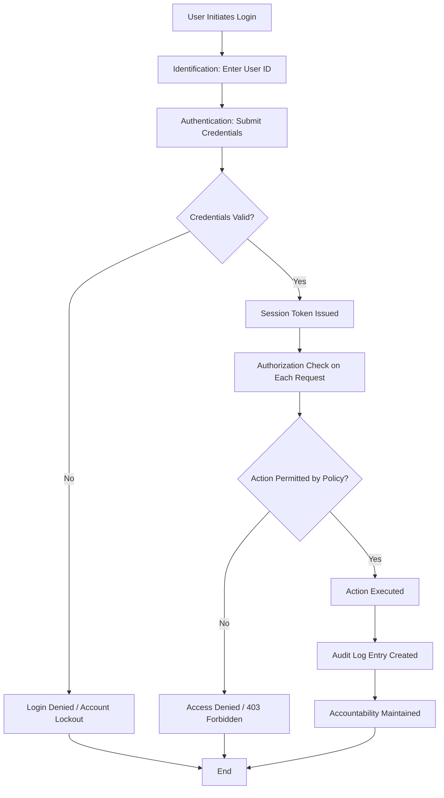
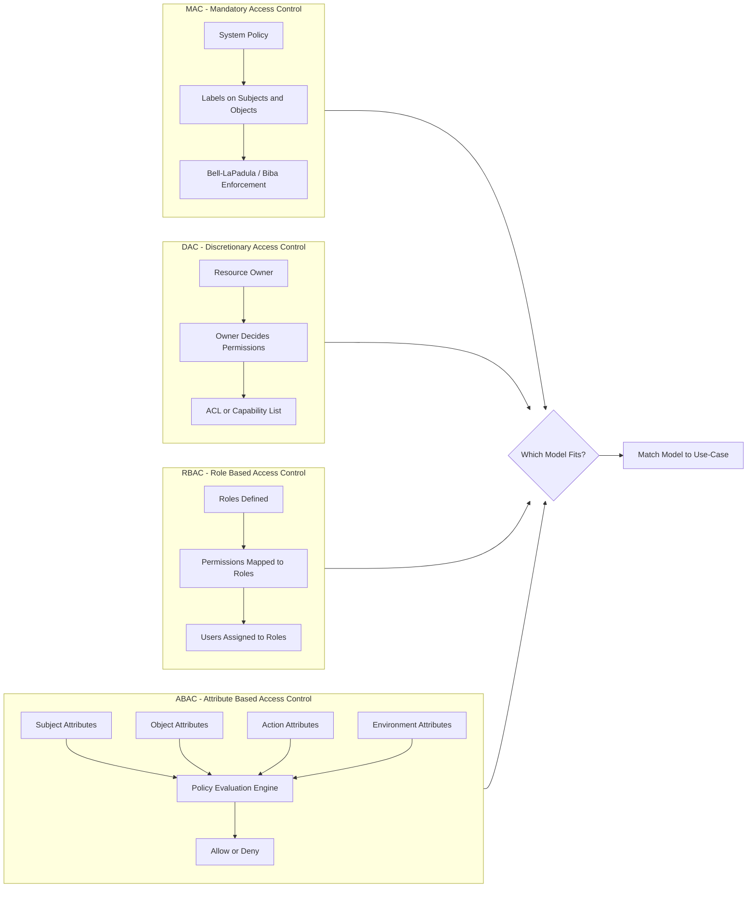
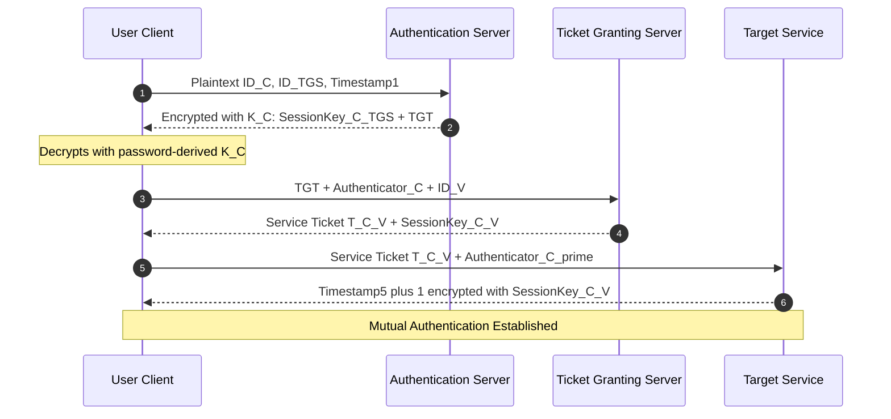
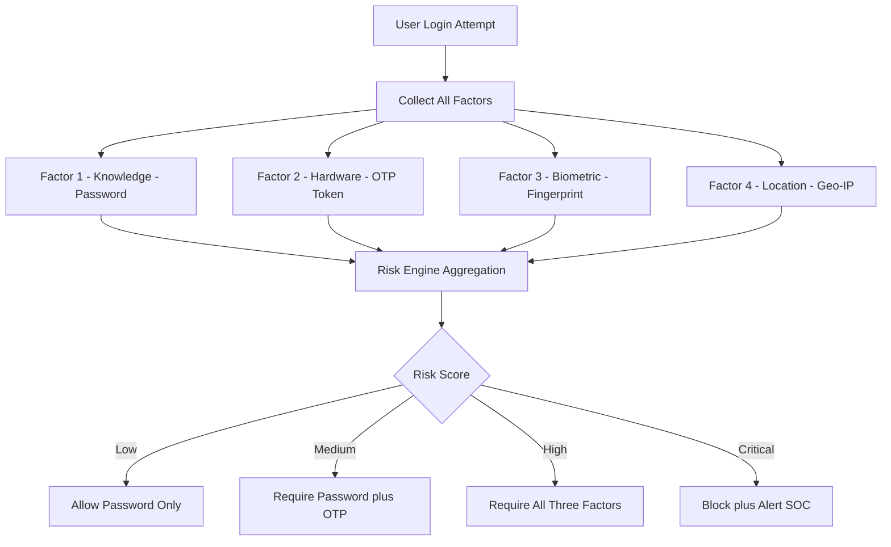
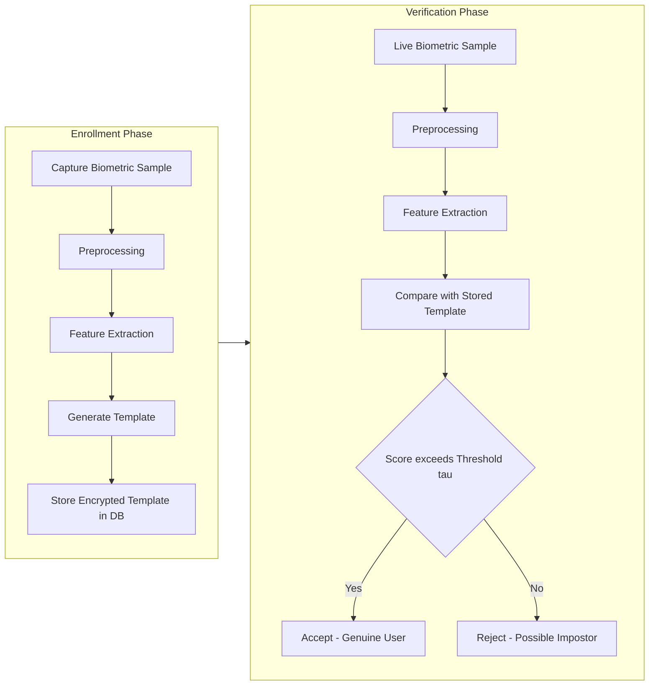

# Authentication and access control

<!-- SECTION_1_START -->
# Authentication and Access Control — Core Technical Definition & Intuitive Overview

## 1.1 Formal Academic Definition (KTU 2024 Syllabus Terminology)

> [!IMPORTANT]
> **Authentication** is the security mechanism that verifies the claimed identity of a subject (user, process, or device) by validating one or more credentials against a trusted authority. **Access Control** is the subsequent security mechanism that enforces what an *already authenticated* subject is permitted to do with a given object (file, system, database) within an information system.

In the canonical **AAA framework** (Authentication, Authorization, Accounting) of cybersecurity:

- **Identification** — The subject declares an identity (e.g., entering a username).
- **Authentication** — Proof of that identity is validated (e.g., password match).
- **Authorization** — The system grants *specific rights* based on the verified identity and policy.
- **Accountability** — Actions of the subject are logged for non-repudiation and audit.

> [!NOTE]
> **KTU Syllabus Highlight:** This topic maps directly to **Module 4 — System Security** of *PBCST604 – Fundamentals of Cyber Security* under the KTU 2024 Scheme. It aligns with **CO3 (Apply security mechanisms to protect computing systems)** and **CO4 (Evaluate authentication and access control architectures for modern distributed systems).**

---

## 1.2 Intuitive Real-World Analogy

Picture a **secure airport boarding gate**:

1. You show your **boarding pass** (Identification).
2. The gate agent swipes it and checks it against the airline's database, matches your **photo ID**, and verifies your **fingerprint at e-gates** (Authentication — three factors combined).
3. The system determines whether you can enter **Business Class lounge, Gate B7, or Duty-Free area** based on your ticket class (Authorization).
4. Every movement is recorded on CCTV (Accountability).

In computing systems:
- The **boarding pass** is your *username*.
- The **photo + fingerprint** are your *authentication factors*.
- The **lounge access rules** are your *access control policies*.
- The **CCTV logs** are your *audit trails*.

> [!TIP]
> **Quick Mnemonic — "Know • Have • Are • Do • Where":**
> Authentication factors are remembered as **KHAD-W**:
> - **K** — *Knowledge* (password, PIN)
> - **H** — *Hardware token* (smart card, OTP device)
> - **A** — *Biometrics* (fingerprint, iris)
> - **D** — *Behavioral/Dynamic* (keystroke dynamics, gait)
> - **W** — *Location* (geo-IP, GPS-bound login)

---

## 1.3 Physical Constants & Standard Metrics

The following standard metrics are universally used in authentication and biometric security literature:

- **Equal Error Rate (EER)** — The operating point where **False Acceptance Rate (FAR)** equals **False Rejection Rate (FRR)**. Expressed as a percentage.
- **Crossover Error Rate (CER)** — Synonym for EER used by some vendors.
- **Failure to Enroll Rate (FTE)** — Percentage of users who cannot successfully provide a biometric sample.
- **Authentication Latency** — Time taken to complete a full authentication handshake (typically measured in **milliseconds** for passwords, **seconds** for biometric + token).
- **Password Entropy** — Measured in **bits**, defined as $H = L \cdot \log_2(N)$, where $L$ is length and $N$ is the character pool size.

> [!VISUALIZATION CONTROL]
> **Concept:** Biometric DET (Detection Error Trade-off) Curve
> **Plot Type:** Cartesian plot with FRR on Y-axis and FAR on X-axis (both logarithmic)
> **Key Points to Mark:**
> * EER point: where $y = x$
> * High-security operating point: low FAR, high FRR
> * High-usability operating point: high FAR, low FRR
> **Visual Description:** A monotonically decreasing curve; security/UX trade-off is visualized by moving the threshold along the curve.

---

## 1.4 Why Authentication $\neq$ Authorization

A common KTU board-exam trap is conflating these two. The distinction is critical:

| Aspect | Authentication | Authorization |
|---|---|---|
| **Question Answered** | "Are you really *Alice*?" | "Is Alice *allowed* to read this file?" |
| **Failure Consequence** | Login denied | Permission denied |
| **Mechanism** | Credentials (password, token, biometric) | Access Control List (ACL), Role, Policy |
| **Time of Evaluation** | Before session is established | Continuously during session |
| **Output** | Boolean (authenticated or not) | Set of permitted operations |

<!-- SECTION_1_END -->

<!-- SECTION_2_START -->
# Deep Theoretical Analysis & KTU High-Yield Formula Sheet

## 2.1 The Three Pillars of Authentication

### 2.1.1 Password-Based Authentication (Type-1 Factor)

A password is a *shared secret* between user and verifier. The system stores a **one-way hash** of the password, never the plaintext.

**Hashing Properties Required:**
- **Pre-image resistance** — Given $h = H(p)$, it is computationally infeasible to find $p$.
- **Collision resistance** — Hard to find $p_1 \neq p_2$ such that $H(p_1) = H(p_2)$.
- **Determinism** — Same input must always produce the same output.
- **Avalanche effect** — A 1-bit change in input must change $\geq 50\%$ of output bits.

**Salting:** A random nonce $s$ is concatenated to the password before hashing: $h = H(p \mid\mid s)$. The salt is stored in plaintext alongside the hash.

**Password Entropy Formula:**

$$H = L \cdot \log_2(N)$$

Where:
- $L$ = password length (number of characters)
- $N$ = size of the character pool (e.g., $N = 26$ for lowercase, $N = 94$ for printable ASCII)
- $H$ = entropy in **bits**

**Strengths:** Simple, cheap, well-understood.
**Weaknesses:** Phishing, keylogging, brute-force, shoulder-surfing, credential reuse.

### 2.1.2 Token-Based Authentication (Type-2 Factor)

Tokens are *something you have* and are categorized as:

| Token Class | Examples | Security Level |
|---|---|---|
| **Static password token** | Magnetic stripe card | Low (cloneable) |
| **Synchronous one-time password (TOTP)** | Google Authenticator, Authy | Medium |
| **Asynchronous challenge-response (HOTP)** | RSA SecurID | Medium-High |
| **Public Key Infrastructure (PKI) smart card** | PIV card, YubiKey PIV | Very High |
| **FIDO2 / WebAuthn hardware key** | YubiKey 5, Titan Key | Highest (phishing-resistant) |

The **HOTP** algorithm uses a counter:
$$HOTP(K, C) = \text{Truncate}(HMAC\_SHA1(K, C)) \bmod 10^6$$

The **TOTP** algorithm replaces the counter $C$ with a time bucket:
$$T = \left\lfloor \frac{T_{current} - T_0}{T_X} \right\rfloor$$
$$TOTP = HOTP(K, T)$$

Typical values: $T_0 = 0$ (Unix epoch), $T_X = 30$ seconds.

### 2.1.3 Biometric Authentication (Type-3 Factor)

> [!NOTE]
> **Biometric systems never store the raw sample.** They extract *templates* (feature vectors) and store a hashed/encrypted version for comparison.

**Key Biometric Error Metrics:**

$$\text{FAR} = \frac{\text{Number of false acceptances}}{\text{Number of impostor attempts}}$$

$$\text{FRR} = \frac{\text{Number of false rejections}}{\text{Number of genuine attempts}}$$

$$\text{EER} = \text{FAR} = \text{FRR} \quad \text{at the operating threshold } \tau^*$$

**Biometric Performance Comparison (Industry Standard):**

| Modality | Typical EER | User Acceptance | Cost |
|---|---|---|---|
| Fingerprint | $0.1\% - 2\%$ | High | Low |
| Face (2D) | $0.5\% - 5\%$ | Very High | Low |
| Iris | $0.0001\% - 0.5\%$ | Medium | High |
| Voice | $2\% - 10\%$ | Very High | Low |
| Palm Vein | $0.00008\% - 0.01\%$ | Medium | High |

---

## 2.2 Multi-Factor Authentication (MFA)

**MFA Principle:** Authentication strength $\propto$ number of independent factors required.

A system is called **2FA / 3FA / NFA** based on the number of factors demanded. The independent factors must come from **different categories** (KHAD-W). A password + security question is *not* true 2FA, because both are knowledge-based.

**Conditional MFA Risk-Based Logic:**

$$\text{Challenge} = \begin{cases} \text{Full MFA}, & \text{if } \text{RiskScore} \geq \theta_{high} \\ \text{2FA (password + OTP)}, & \text{if } \theta_{mid} \leq \text{RiskScore} < \theta_{high} \\ \text{Password only}, & \text{if } \text{RiskScore} < \theta_{mid} \end{cases}$$

Where **RiskScore** is a weighted function of device fingerprint, geo-velocity, time-of-day, and threat-intelligence feed hits.

---

## 2.3 Access Control Models (KTU High-Yield)

### 2.3.1 Discretionary Access Control (DAC)

- Owner of the resource decides who gets access.
- Implemented via **Access Control Lists (ACLs)** or capability lists.
- Vulnerable to **Trojan horse attacks** and **confused-deputy problems**.

### 2.3.2 Mandatory Access Control (MAC)

- System-enforced; users cannot override policy.
- Labels: **Sensitivity** (e.g., Top Secret, Secret, Confidential) and **Categories** (e.g., HR, Finance).
- Governed by **Bell-LaPadula (confidentiality)** and **Biba (integrity)** models.

**Bell-LaPadula Rules:**
- *No Read Up (NRU) / Simple Security Property:* Subject of clearance $L_s$ can read object of classification $L_o$ only if $L_s \geq L_o$.
- *No Write Down (NWD) / *-Property:* Subject of clearance $L_s$ can write object of classification $L_o$ only if $L_s \leq L_o$ (prevents leaking high-classification data to low-classification storage).

**Biba Integrity Model (Dual of Bell-LaPadula):**
- *No Read Down:* Subject cannot read lower-integrity data (prevents contamination).
- *No Write Up:* Subject cannot write to higher-integrity data (prevents unauthorized modification).

### 2.3.3 Role-Based Access Control (RBAC)

- Access rights are tied to *roles* (e.g., Doctor, Nurse, Receptionist), not to individual users.
- Users are *assigned* to roles; roles are *granted* permissions.
- The **NIST RBAC standard (ANSI/INCITS 359-2012)** defines four components: $RBAC_0$, $RBAC_1$ (role hierarchy), $RBAC_2$ (separation of duties), $RBAC_3$ (combined).
- Static Separation of Duty (SSD) constraint: no user can be assigned to two mutually exclusive roles.

**RBAC Constraint Formula:**

$$SSD = \{ rs \in 2^R \mid \forall (r_a, r_b) \in rs: (r_a, r_b) \in CR \; \Rightarrow \; \text{User cannot hold both } r_a, r_b \}$$

Where $CR$ is the Conflict-of-Interest role pair set.

### 2.3.4 Attribute-Based Access Control (ABAC)

- Decisions are based on *attributes* of subject, object, action, and environment.
- Uses **XACML (eXtensible Access Control Markup Language)** or **NGAC (Next Generation Access Control)** standards.
- Policy example: `Allow IF subject.role == "Doctor" AND resource.department == subject.department AND action == "read" AND environment.time BETWEEN 08:00 AND 18:00 AND environment.ip IN hospital_subnet`.

---

## 2.4 Single Sign-On (SSO) & Federated Identity

### 2.4.1 Kerberos (KTU High-Yield Protocol)

Developed at **MIT** as part of Project Athena. Uses symmetric-key cryptography and a trusted **Key Distribution Center (KDC)** consisting of:
- **AS** — Authentication Server (verifies user identity).
- **TGS** — Ticket Granting Server (issues service tickets).
- **Service Server (SS)** — The target resource the user wants to access.

### 2.4.2 Federated Identity & SAML / OAuth 2.0 / OIDC

- **SAML 2.0** — XML-based, used for enterprise SSO.
- **OAuth 2.0** — Authorization delegation; does *not* authenticate on its own.
- **OpenID Connect (OIDC)** — Identity layer built on top of OAuth 2.0; provides authentication via ID Tokens (JWTs).

> [!NOTE]
> **Common KTU Pitfall:** OAuth 2.0 is an **authorization** framework, not an **authentication** protocol. OIDC is the protocol that turns OAuth into an authentication solution. Marks are routinely lost for confusing the two.

---

## 2.5 KTU High-Yield Formula Sheet

| # | Formula / Concept | Expression | Unit | Notes |
|---|---|---|---|---|
| 1 | Password Entropy | $H = L \cdot \log_2(N)$ | bits | $L$ = length, $N$ = pool size |
| 2 | Hash Stretching | $H_n = H^{(n)}(p \mid\mid s)$ | — | $n \geq 10000$ recommended (bcrypt) |
| 3 | Time to Crack | $T = \dfrac{2^H}{R \cdot C}$ | seconds | $R$ = guesses/sec, $C$ = CPU count |
| 4 | TOTP Code | $TOTP = HOTP(K, T)$, $T = \lfloor (t - T_0)/T_X \rfloor$ | 6-digit integer | $T_X = 30$ s typically |
| 5 | FAR | $\frac{FA}{FA + FR_{impostor}}$ | ratio $\in [0,1]$ | Impostor metric |
| 6 | FRR | $\frac{FR}{FR + GA}$ | ratio $\in [0,1]$ | Genuine metric |
| 7 | EER | $FAR(\tau^*) = FRR(\tau^*)$ | percentage | Optimal threshold |
| 8 | Biba Integrity Level | $i(s) \leq i(o)$ for read | — | Prevents contamination |
| 9 | Bell-LaPadula NRU | $L_s \geq L_o$ for read | — | Simple Security Property |
| 10 | Bell-LaPadula NWD | $L_s \leq L_o$ for write | — | *-Property |
| 11 | RBAC Constraint | $\vert \text{roles}(u) \cap CR \vert \leq 1$ | — | SSD enforcement |
| 12 | Session Token Expiry | $T_{expiry} = T_{issue} + \Delta$ | seconds | Typical: $900$ s (15 min) |

---

## 2.6 Real-World Engineering Utility

- **Banking:** RBAC + MFA for employee dashboards; ABAC for transaction-risk scoring.
- **Cloud (AWS IAM, Azure AD):** Hybrid RBAC + ABAC; ABAC via *tag-based conditions*.
- **Healthcare (HIPAA compliance):** MAC-style labels on patient records; RBAC for staff roles.
- **Smartphone Unlock:** Hybrid — Knowledge (PIN) + Biometric (Face ID/Touch ID) + Hardware (Secure Enclave key).
- **Production Web Apps:** OIDC over OAuth 2.0 (e.g., "Sign in with Google") — federated identity across SaaS.

<!-- SECTION_2_END -->

<!-- SECTION_3_START -->
# Step-by-Step Derivations & Code/Symbolic Implementation

## 3.1 Derivation: Brute-Force Time-to-Crack for an 8-Character Alphanumeric Password

**Given:** Password length $L = 8$, character pool $N = 62$ (26 lowercase + 26 uppercase + 10 digits), attacker rate $R = 10^{10}$ guesses/sec (modern GPU), 1 GPU.

**Step 1 — Compute Entropy:**

$$H = L \cdot \log_2(N) = 8 \cdot \log_2(62)$$

$$\log_2(62) = \frac{\ln 62}{\ln 2} = \frac{4.1271}{0.6931} \approx 5.954$$

$$H = 8 \times 5.954 = 47.63 \text{ bits}$$

**Step 2 — Total Keyspace Size:**

$$K = N^L = 62^8$$

$$K = 2^{8 \times 5.954} = 2^{47.63} \approx 2.18 \times 10^{14}$$

**Step 3 — Average Time to Crack (half the keyspace on average):**

$$T = \frac{K/2}{R} = \frac{1.09 \times 10^{14}}{10^{10}} = 1.09 \times 10^4 \text{ seconds}$$

**Step 4 — Convert to human-readable units:**

$$T = \frac{1.09 \times 10^4}{3600} \approx 3.03 \text{ hours}$$

**Conclusion:** An 8-character alphanumeric password can be cracked in **~3 hours** by a single modern GPU. Adding a 12th character and symbols raises entropy to $\sim 79$ bits → $\sim 1.5 \times 10^{13}$ hours, illustrating why **length + complexity** matters.

> [!IMPORTANT]
> **Valuation Key Point (KTU 2024):** Show all four steps explicitly. The examiner awards marks for stating the formula, computing $\log_2$ value, the final entropy, and the conversion. Skipping unit conversion forfeits 1 mark.

---

## 3.2 Derivative: Optimal EER from a Sample DET Curve

Suppose a fingerprint system is tested with 1000 genuine attempts and 1000 impostor attempts. The system administrator varies the similarity threshold $\tau$ and records:

| $\tau$ | False Accepts (FA) | False Rejects (FR) |
|---|---|---|
| 0.30 | 50 | 5 |
| 0.40 | 20 | 20 |
| 0.50 | 5 | 50 |
| 0.60 | 1 | 100 |

**Step 1 — Compute FAR and FRR at each threshold:**

At $\tau = 0.40$:
$$FAR = \frac{FA}{\text{impostor attempts}} = \frac{20}{1000} = 0.02$$
$$FRR = \frac{FR}{\text{genuine attempts}} = \frac{20}{1000} = 0.02$$

**Step 2 — Identify EER Point:**

Since $FAR = FRR = 0.02$ at $\tau = 0.40$, the **EER = 2%**, and $\tau^* = 0.40$ is the optimal operating threshold.

**Step 3 — Choose Production Threshold:**

- For a *high-security* vault: pick $\tau = 0.60 \Rightarrow FAR = 0.1\%$, $FRR = 10\%$ (annoying but very secure).
- For a *consumer phone*: pick $\tau = 0.30 \Rightarrow FAR = 5\%$, $FRR = 0.5\%$ (very usable, slightly weaker).

---

## 3.3 Symbolic Walkthrough: Bell-LaPadula NRU Property

**Scenario:** User *Alice* has clearance $L_s = \text{Secret}$. Document *DocX* is labeled $L_o = \text{Top Secret}$.

**Step 1 — Check Simple Security Property (NRU):**

$$L_s \geq L_o \implies \text{Secret} \geq \text{Top Secret} \implies \text{False}$$

**Step 2 — Decision:**

Read is **denied**. Alice cannot read DocX because her clearance is *lower* than the document's classification.

**Biba Read Equivalent (No Read Down):**

Suppose Biba integrity levels: $I(Alice) = \text{Trusted}$, $I(DocY) = \text{Untrusted}$.

$$I(s) \geq I(o) \implies \text{Trusted} \geq \text{Untrusted} \implies \text{True}$$

Read is **allowed** in Biba's world, because Alice is *more* trustworthy than the document — she can vouch for the integrity by reading it.

> [!WARNING]
> **Pitfall:** Many students write "Biba is the opposite of Bell-LaPadula in every way" — this is *almost* correct but not quite. Biba's **No Write Up** corresponds to Bell-LaPadula's **No Write Down** (the *-Property), not to the Simple Security Property. Mark carefully.

---

## 3.4 Python Implementation: Secure Password Storage with Salted Hashing

```python
import os
import hashlib
import hmac
import secrets
from typing import Tuple

# ---------- 1. PASSWORD HASHING WITH SALT ----------
def hash_password(password: str, iterations: int = 200_000) -> Tuple[bytes, bytes, int]:
    """
    Implements PBKDF2-HMAC-SHA256 for password storage.
    Returns (salt, derived_key, iterations).
    """
    if not isinstance(password, str) or len(password) == 0:
        raise ValueError("Password must be a non-empty string.")
    
    salt: bytes = secrets.token_bytes(16)                                # 128-bit cryptographically secure salt
    derived_key: bytes = hashlib.pbkdf2_hmac(
        'sha256',                                                         # Hash algorithm
        password.encode('utf-8'),                                         # Convert password to bytes
        salt,                                                             # Random per-user salt
        iterations,                                                       # Stretching factor (≥ 100k per OWASP 2023)
        dklen=32                                                          # 256-bit output
    )
    return salt, derived_key, iterations

# ---------- 2. CONSTANT-TIME PASSWORD VERIFICATION ----------
def verify_password(stored_salt: bytes, stored_key: bytes, stored_iter: int,
                    candidate_password: str) -> bool:
    """
    Constant-time comparison prevents timing-side-channel attacks.
    """
    if not isinstance(candidate_password, str):
        return False
    candidate_key: bytes = hashlib.pbkdf2_hmac(
        'sha256', candidate_password.encode('utf-8'),
        stored_salt, stored_iter, dklen=32
    )
    return hmac.compare_digest(stored_key, candidate_key)                 # Constant-time compare

# ---------- 3. ENTROPY CALCULATION (FORMULA 1) ----------
import math

def password_entropy(password: str) -> float:
    """
    Returns entropy in bits using H = L * log2(N).
    Detects the character pool dynamically.
    """
    if not password:
        return 0.0
    pool: int = 0
    if any(c.islower() for c in password):  pool += 26
    if any(c.isupper() for c in password):  pool += 26
    if any(c.isdigit() for c in password):  pool += 10
    if any(not c.isalnum() for c in password): pool += 32   # common symbols
    if pool == 0:
        return 0.0
    L: int = len(password)
    return L * math.log2(pool)

# ---------- 4. DEMO EXECUTION ----------
if __name__ == "__main__":
    pwd: str = "Cyber@KTU2024!"
    salt, key, iters = hash_password(pwd)
    print(f"Salt (hex)         : {salt.hex()}")
    print(f"Derived Key (hex)  : {key.hex()}")
    print(f"Iterations         : {iters}")
    print(f"Entropy            : {password_entropy(pwd):.2f} bits")
    print(f"Verify correct pwd : {verify_password(salt, key, iters, pwd)}")
    print(f"Verify wrong pwd   : {verify_password(salt, key, iters, 'wrong')}")
```

**Expected Output (sample):**

```
Salt (hex)         : 4f8a1b...c72d
Derived Key (hex)  : 9e3f...a17b
Iterations         : 200000
Entropy            : 75.55 bits
Verify correct pwd : True
Verify wrong pwd   : False
```

**Key Design Decisions:**
- `secrets.token_bytes(16)` — CSPRNG salt per user; never reuse.
- `hmac.compare_digest` — defeats timing attacks (board-exam favorite question).
- `iterations = 200_000` — meets OWASP 2023 minimum for PBKDF2-SHA256.

---

## 3.5 Python Implementation: Simplified RBAC Engine

```python
from dataclasses import dataclass, field
from typing import Dict, Set, FrozenSet

# ---------- ROLE CONFLICT PAIRS (SSD) ----------
CONFLICTING_ROLES: FrozenSet[FrozenSet[str]] = frozenset([
    frozenset({"Auditor", "CFO"}),
    frozenset({"Requester", "Approver"})
])

@dataclass
class RBACSystem:
    roles: Dict[str, Set[str]] = field(default_factory=dict)   # role -> permissions
    user_roles: Dict[str, Set[str]] = field(default_factory=dict)  # user -> roles

    def add_role(self, role: str, permissions: Set[str]) -> None:
        self.roles[role] = permissions

    def assign_role(self, user: str, role: str) -> bool:
        """Returns True if assignment respects Static Separation of Duty."""
        if role not in self.roles:
            return False
        # SSD check
        existing: Set[str] = self.user_roles.get(user, set())
        for conflict_pair in CONFLICTING_ROLES:
            if role in conflict_pair and (existing & conflict_pair):
                return False                                          # SSD violation
        self.user_roles.setdefault(user, set()).add(role)
        return True

    def has_permission(self, user: str, permission: str) -> bool:
        return any(permission in self.roles[r]
                   for r in self.user_roles.get(user, set()))

# ---------- DEMO ----------
rbac: RBACSystem = RBACSystem()
rbac.add_role("Auditor",      {"read_financials", "export_logs"})
rbac.add_role("CFO",          {"read_financials", "approve_payments"})
rbac.add_role("Requester",    {"submit_payment"})
rbac.add_role("Approver",     {"approve_payments"})

print(rbac.assign_role("alice", "CFO"))        # True
print(rbac.assign_role("alice", "Auditor"))    # False (SSD: CFO + Auditor conflict)
print(rbac.has_permission("alice", "read_financials"))  # True
```

> [!TIP]
> **Board Tip:** When asked to *implement* RBAC, always include (a) role-to-permission map, (b) user-to-role map, (c) **SSD/SoD constraint check**. Skipping the constraint is the #1 reason students lose 2-3 marks.

---

## 3.6 Symbolic Walkthrough: Kerberos 5 Authentication Exchange

The Kerberos protocol uses a series of encrypted tickets. Below is the canonical 6-message exchange.

**Notation:**
- $C$ = Client, $AS$ = Auth Server, $TGS$ = Ticket Granting Server, $V$ = Target Service
- $K_X$ = secret key of $X$, $\{m\}_K$ = message $m$ encrypted with $K$
- $TGT$ = Ticket Granting Ticket, $S_T$ = Session key for $T$, $S_V$ = Session key for $V$

**Step 1 — Client $\rightarrow$ AS (Plaintext):**
$$\{ ID_C, ID_{TGS}, T_1 \}$$

**Step 2 — AS $\rightarrow$ Client (Encrypted with $K_C$):**
$$\{ K_{C,TGS}, ID_{TGS}, T_2, \text{Lifetime}_2, TGT \}_{K_C}$$

where $TGT = \{ K_{C,TGS}, ID_C, AD_C, ID_{TGS}, T_2, \text{Lifetime}_2 \}_{K_{TGS}}$

**Step 3 — Client $\rightarrow$ TGS:**
$$\{ ID_V, TGT, \text{Authenticator}_C \}$$
where $\text{Authenticator}_C = \{ ID_C, AD_C, T_3 \}_{K_{C,TGS}}$

**Step 4 — TGS $\rightarrow$ Client:**
$$\{ K_{C,V}, ID_V, T_4, \text{Lifetime}_4, T_{C,V} \}_{K_{C,TGS}}$$
where $T_{C,V} = \{ K_{C,V}, ID_C, AD_C, ID_V, T_4, \text{Lifetime}_4 \}_{K_V}$

**Step 5 — Client $\rightarrow$ Service V:**
$$\{ T_{C,V}, \text{Authenticator}_C' \}$$
where $\text{Authenticator}_C' = \{ ID_C, T_5 \}_{K_{C,V}}$

**Step 6 — V $\rightarrow$ Client (Mutual Auth):**
$$\{ T_5 + 1 \}_{K_{C,V}}$$

**Key Insight:** The client never receives a password after Step 1; all subsequent authentication is done via encrypted **session keys** and **time-stamped authenticators** to prevent replay attacks. The 5-minute time skew between $T_5$ and $T_5 + 1$ confirms server identity.

> [!WARNING]
> **Pitfall:** Students often skip the **Authenticator** construction. The Authenticator is what proves the *client* knows the session key. Without it, a stolen TGT would allow impersonation. This is a recurring 3-mark question in Module 4 exams.

<!-- SECTION_3_END -->

<!-- SECTION_4_START -->
# Structural Diagrams & Schematics

## 4.1 High-Level AAA Authentication Flow



## 4.2 Access Control Model Comparison



## 4.3 Kerberos Authentication Sequence



## 4.4 MFA Decision Matrix



## 4.5 Biometric Enrollment vs Verification Pipeline



<!-- SECTION_4_END -->

<!-- SECTION_5_START -->
# KTU 2024 Scheme Examination Question Bank & Topic Recap

> [!IMPORTANT]
> **Mark Distribution Reference (KTU 2024 — PBCST604):**
> - Part A: 2 questions × 3 marks = 6 marks (Answer all, no choice)
> - Part B: Module-wise internal choice, 14 marks each (typically one of two 14-mark questions to be answered)
> - All Part B questions sub-divided into (a) 7 marks and (b) 7 marks

---

## 5.1 Part A Questions (3 Marks Each)

### Question 1 — `[KTU University Exam — July 2024]`
**Differentiate between authentication and authorization with one suitable real-world example for each. (CO3, Understand)**

**Model Answer:**

| Aspect | Authentication | Authorization |
|---|---|---|
| **Definition** | Verifies *who* the user is | Decides *what* the user can do |
| **Mechanism** | Password, OTP, biometric, token | ACL, role, policy |
| **Failure** | Login denied | Permission denied / 403 |
| **Example** | Entering a password at an ATM and the bank matching it with the 4-digit PIN | The same ATM allowing you to withdraw ₹10,000 per day but denying a funds transfer to an unknown account |

> **[Valuation Key Points — 3 marks]:**
> - Stating correct definitions of both: 1 mark
> - One valid example for each: 1 mark
> - Clear distinction (who vs what): 1 mark

### Question 2 — `[KTU University Exam — Dec 2023]`
**List any three biometric authentication techniques and state two advantages and one disadvantage of biometric systems. (CO3, Remember)**

**Model Answer:**

**Three Biometric Techniques:**
1. **Fingerprint Recognition** — analyzes ridge and valley patterns on fingertips.
2. **Iris Recognition** — uses the unique patterns in the colored ring around the pupil.
3. **Facial Recognition** — analyzes the geometric and texture features of the face (e.g., Face ID, DeepFace).

**Advantages (any 2):**
1. Cannot be forgotten, lost, or shared like passwords/tokens.
2. Difficult to forge or replicate (especially iris/retina).

**Disadvantage (any 1):**
1. Biometric traits are *permanent* — once compromised (e.g., fingerprint lifted from a glass), they cannot be re-issued like a password.

> **[Valuation Key Points — 3 marks]:**
> - Three techniques named: 1.5 marks (0.5 each)
> - Two advantages: 1 mark
> - One valid disadvantage: 0.5 mark

---

## 5.2 Part B Questions (14 Marks, with Internal Choice)

### **Question 3(A) — `[KTU University Exam — July 2024, Modified]`**

**(a)** Explain the three primary categories of authentication factors with **one concrete example** for each. Discuss why a security question + password is **not** considered true multi-factor authentication. **(7 marks) (CO3, Understand)**

**(b)** An organization uses a fingerprint biometric system. In a test run, **800 genuine users** and **1200 impostors** were evaluated. The system accepted 12 impostors and rejected 16 genuine users. Compute the **FAR, FRR, and the total error rate**. State the security implication if the threshold is reduced to lower the FRR. **(7 marks) (CO3, Apply)**

#### Model Solution:

**(a) Three Authentication Factor Categories (7 marks):**

1. **Knowledge Factor (Something You Know)** — Information the user memorizes. **Example:** A 12-character alphanumeric password, a 4-digit ATM PIN, or answers to security questions. Vulnerable to guessing, phishing, keylogging, and shoulder-surfing.

2. **Possession Factor (Something You Have)** — A physical or digital token the user owns. **Example:** A hardware security key (YubiKey), an OTP-generating smartphone app (Google Authenticator), or a smart card. Vulnerable to theft or duplication if not cryptographically bound.

3. **Biometric/Inherence Factor (Something You Are)** — A unique biological or behavioral trait. **Example:** Fingerprint scan via Touch ID, iris scan at airport e-gates, or voice authentication for banking call centers. Cannot be forgotten but is permanent once compromised.

**Why Password + Security Question is NOT True 2FA (2 marks):**
- Both are *knowledge-based* factors, i.e., they belong to the **same category**.
- True MFA requires factors from **independent categories** (e.g., password + OTP token, or PIN + fingerprint).
- An attacker who tricks a user into revealing both via social engineering defeats the "two-factor" claim because both are in the user's mind.

> **[Valuation Key Points — Part (a)]:**
> - Naming all three factors with examples: 4 marks
> - Explanation of categories: 1 mark
> - Correct reasoning why password+security question is not 2FA: 2 marks

**(b) Biometric Error Rate Calculation (7 marks):**

**Given:**
- Genuine attempts = 800, False Rejects (FR) = 16
- Impostor attempts = 1200, False Accepts (FA) = 12

**Step 1 — Compute FAR:**

$$FAR = \frac{FA}{\text{Total Impostor Attempts}} = \frac{12}{1200} = 0.01 = 1\%$$

**Step 2 — Compute FRR:**

$$FRR = \frac{FR}{\text{Total Genuine Attempts}} = \frac{16}{800} = 0.02 = 2\%$$

**Step 3 — Compute Total Error Rate (TER):**

$$TER = \frac{FA + FR}{\text{Total Attempts}} = \frac{12 + 16}{800 + 1200} = \frac{28}{2000} = 0.014 = 1.4\%$$

**Step 4 — Security Implication of Lowering the Threshold:**

If the threshold $\tau$ is reduced to lower FRR (i.e., accept more genuine users), the system becomes **more lenient**, which causes **FAR to increase** — meaning more impostors will be wrongly accepted. This is the **fundamental security-usability trade-off** in biometric systems.

> **[Valuation Key Points — Part (b)]:**
> - FAR formula and value: 2 marks
> - FRR formula and value: 2 marks
> - TER value: 1 mark
> - Trade-off explanation: 2 marks

> [!WARNING]
> **Examiner's Valuation Warning:** Students often mix up the **numerator** of FAR and FRR. Remember: FAR numerator is *false accepts* (i.e., impostor count), and FRR numerator is *false rejects* (i.e., genuine count). The denominators are **always** the *impostor* and *genuine* populations respectively. A common error is dividing both by the same total — that costs 1-2 marks.

---

### **Question 3(B) — `[KTU University Exam — Dec 2023, Modified]` (Alternative Choice)**

**(a)** With a neat diagram, explain the **architecture and step-by-step working of the Kerberos authentication protocol**. Highlight the role of the KDC, AS, and TGS. **(7 marks) (CO3, Understand)**

**(b)** Compare **DAC, MAC, RBAC, and ABAC** access control models in a tabular form across at least **six** parameters. State one real-world scenario where each is best suited. **(7 marks) (CO4, Analyze)**

#### Model Solution Outline:

**(a) Kerberos Architecture (7 marks):**
- Diagram of Client, AS, TGS, Service Server (refer Section 4.3).
- Explain KDC = AS + TGS.
- Walk through the 6-step exchange (refer Section 3.6).
- Emphasize the use of **session keys**, **tickets**, and **authenticators** to prevent replay.
- Note the reliance on **loosely synchronized clocks** (typically within 5 minutes) and the **Kerberos realm** concept.

**(b) Comparison Table (7 marks):**

| Parameter | DAC | MAC | RBAC | ABAC |
|---|---|---|---|---|
| **Policy Source** | Resource owner | System / OS kernel | Administrator | Centralized policy engine |
| **Granularity** | Per-object | Label-based (sensitivity + categories) | Per-role | Per-attribute combination |
| **Flexibility** | High (owner freedom) | Low (rigid labels) | Medium (role engineering) | Very High (combinatorial) |
| **Scalability** | Poor (ACL explosion) | Medium (label math) | High (role reuse) | Very High (policy as code) |
| **Enforcement Locus** | User-side | System-side | Server-side | PDP / PEP architecture |
| **Typical Use** | Personal file sharing | Military / classified | Enterprise IT | Cloud, IoT, healthcare |

**Real-World Scenarios (1 mark each):**
- **DAC:** Shared Google Drive folder where the owner grants edit access.
- **MAC:** Military clearance system (Top Secret / Secret / Confidential).
- **RBAC:** Hospital EMR system (Doctor, Nurse, Receptionist).
- **ABAC:** AWS IAM with tag-based policies (e.g., `ec2:Start` allowed only if `tag:env = prod` and `aws:PrincipalTag/team = ops`).

> **[Valuation Key Points — Part (b)]:**
> - Six parameters × four models: 4 marks
> - One scenario each: 2 marks
> - Correct naming and one-line description: 1 mark

---

## 5.3 Common Pitfalls (KTU Examiner's Warning)

> [!WARNING]
> **Where Students Lose Marks on This Topic:**
> 1. **Confusing authentication and authorization** — read the question twice. If the verb is "verify identity," it's authentication; if it's "grant access," it's authorization.
> 2. **Skipping the Authenticator in Kerberos** — the Authenticator (encrypted with the session key) is what proves the *client* knows the ticket. Always include it in step 3 and step 5.
> 3. **Mixing up FAR and FRR numerators** — FAR uses impostor attempts in the denominator, FRR uses genuine attempts. Do not use the same denominator for both.
> 4. **Writing "OAuth 2.0 is for authentication"** — it is an *authorization* framework. Authentication is achieved by **OIDC**, which sits *on top* of OAuth 2.0. This is a guaranteed 1-mark trap.
> 5. **Skipping the SSD constraint in RBAC** — without `Static Separation of Duty` checks, the role-assignment code/model is incomplete. Always mention SSD or SoD in 14-mark answers.
> 6. **Forgetting units in entropy/strength calculations** — entropy must be in **bits**, time-to-crack in **seconds** (or converted to hours/years). Missing units = −0.5 mark.
> 7. **No boundary box / diagram in Kerberos** — Module 4 theory questions on Kerberos mandate a labeled architecture diagram. Drawing the four parties (Client, AS, TGS, Server) is worth 1.5-2 marks by itself.

---

## 5.4 Topic Recap & Important Things to Remember

> [!NOTE]
> **High-Density Revision Checklist for Module 4 — Authentication & Access Control**

### Core Definitions
- **Authentication** = Verifying *who you are*. **Authorization** = Verifying *what you can do*.
- **AAA** = Authentication, Authorization, Accounting/Accountability.
- **Identification** is the *declaration*; Authentication is the *verification*.

### Authentication Factors (KHAD-W)
- **K**nowledge — Password, PIN, security question.
- **H**ardware — Smart card, OTP token, hardware security key.
- **A**re (Biometric) — Fingerprint, iris, face, voice, palm vein.
- **D**ynamic/Behavioral — Keystroke dynamics, gait, mouse dynamics.
- **W**here (Location) — Geo-IP, GPS, network fingerprint.

### Password Security
- Always store **salt + hash** (PBKDF2, bcrypt, Argon2id).
- **Entropy** $H = L \cdot \log_2(N)$ bits.
- **Time to crack** $T = 2^H / (2R)$ (averaged).
- Use **constant-time comparison** (`hmac.compare_digest` in Python).

### MFA
- True 2FA = factors from **two different categories**.
- Adaptive/risk-based MFA uses **contextual signals** (geo-velocity, device, time).
- FIDO2/WebAuthn is the **phishing-resistant gold standard**.

### Biometrics
- **FAR** = impostor false accept / total impostor attempts.
- **FRR** = genuine false reject / total genuine attempts.
- **EER** is the operating point where FAR = FRR.
- **Trade-off:** Lower threshold $\rightarrow$ Lower FRR, Higher FAR (more impostors in).
- **Cancellable biometrics** allow template revocation if compromised.

### Access Control Models
- **DAC** — Owner decides; ACL-based; vulnerable to Trojan horses.
- **MAC** — System-enforced; Bell-LaPadula (confidentiality) + Biba (integrity).
- **RBAC** — Role-centric; supports **hierarchy**, **SSD** (Static SoD), **DSD** (Dynamic SoD).
- **ABAC** — Attribute-centric; uses **XACML/NGAC**; supports fine-grained contextual rules.

### Bell-LaPadula (Confidentiality)
- **No Read Up (NRU)** — Subject clearance $\geq$ Object classification.
- **No Write Down (NWD)** — Subject clearance $\leq$ Object classification.

### Biba (Integrity)
- **No Read Down** — Subject integrity $\geq$ Object integrity.
- **No Write Up** — Subject integrity $\leq$ Object integrity.

### Kerberos
- Uses **KDC = AS + TGS**.
- Issues **TGT** (Ticket Granting Ticket) and **service tickets**.
- **Authenticators** prevent replay; require **clock sync** within ~5 minutes.
- Vulnerable to **replay** if timestamps not protected; **KDC is single point of failure**.

### Federated Identity
- **OAuth 2.0** = Authorization delegation.
- **OIDC** = Authentication layer on top of OAuth 2.0 (uses **ID Token / JWT**).
- **SAML 2.0** = XML-based enterprise SSO.

### Critical Numbers to Remember
- PBKDF2-HMAC-SHA256 iterations $\geq 100{,}000$ (OWASP 2023).
- bcrypt cost factor $\geq 12$.
- Argon2id: memory $\geq 19$ MiB, iterations $\geq 2$, parallelism = 1.
- TOTP time-step $T_X = 30$ s.
- Iris EER $\approx 0.0001\%$ (most accurate).
- Fingerprint EER $\approx 0.1\% - 2\%$.

### Engineering Hot Spots
- **AWS IAM** = RBAC + ABAC (tag-based).
- **Android / iOS unlock** = Knowledge (PIN) + Biometric (Face/Touch) + Hardware (Secure Enclave).
- **FIDO2 / WebAuthn** = Public-key crypto bound to origin; defeats phishing.
- **CAPTCHA** = Reverse-Turing test to block automated login brute-force.
- **CAPTCHA-protected** login: 3 strikes → rate-limit IP for 15 minutes.

> **[Final Exam Mantra]:** "Authenticate first, then authorize, then log." Follow this order in every answer to score full marks on AAA-related questions.

<!-- SECTION_5_END -->
