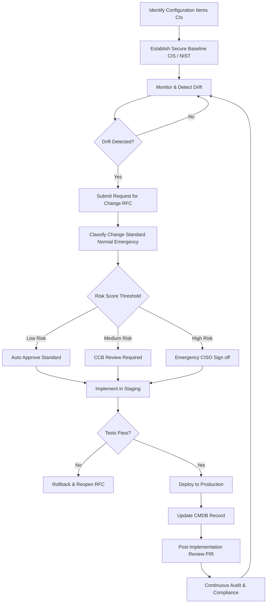
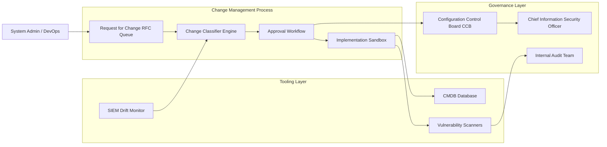
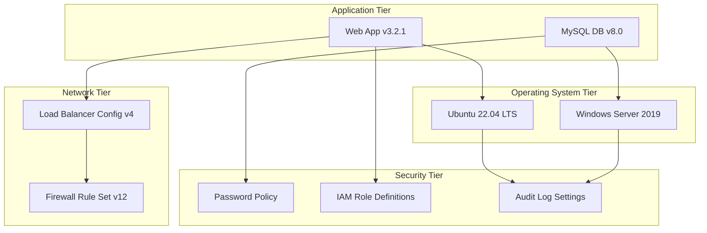
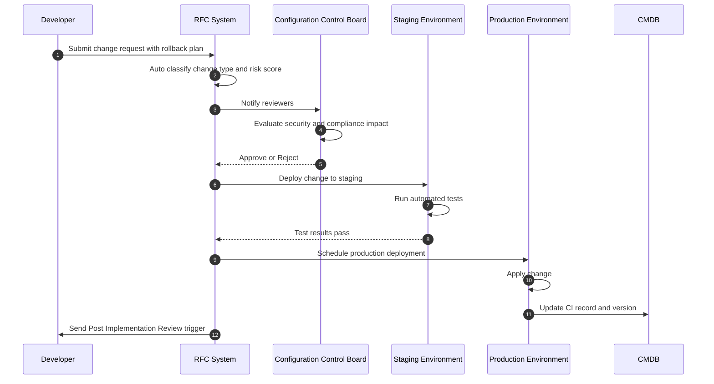
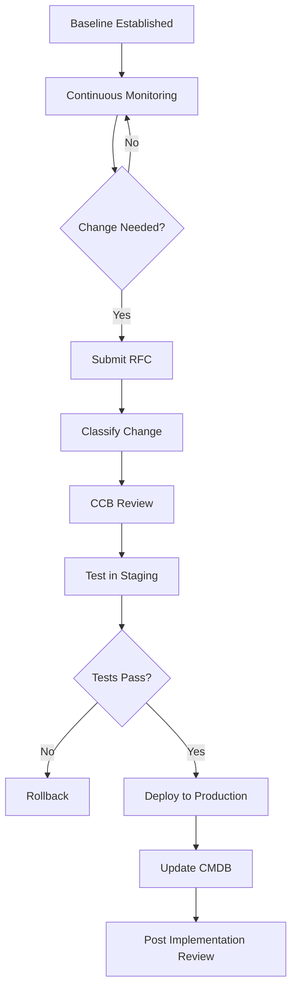

# Controlling the configuration

<!-- SECTION_1_START -->
# 1. Controlling the Configuration — Core Definition & Intuition

## Formal KTU 2024 Definition

> [!IMPORTANT]
> **Configuration Control (in the context of System Security)** is the systematic process of managing, tracking, and regulating all changes to a system's hardware, software, firmware, and documentation throughout its operational lifecycle. It ensures that only **authorized, tested, and approved modifications** are applied, while maintaining the integrity, security posture, and traceability of the system at every point in time.

In the **NIST SP 800-128** framework (which is heavily referenced in the KTU 2024 cybersecurity syllabus), *Configuration Control* is one of the four pillars of **Configuration Management (CM)**, alongside:

1. Configuration Identification
2. Configuration Change Control
3. Configuration Status Accounting
4. Configuration Auditing

## Conceptual Analogy — "The House Renovation Rulebook"

> [!NOTE]
> **Analogy:** Imagine your college hostel room. Over time, you (or your roommates) change the Wi-Fi password, install a new fan, replace the lock, and add a new shelf. Without a **rulebook**, the room becomes chaotic: nobody knows who changed the lock, the new fan is wired unsafely, and the Wi-Fi password gets leaked. *Configuration Control* is the **rulebook + logbook** that says: *"Every change must be requested, approved, tested, documented, and reviewed."*

In an enterprise system, this same logic applies to:
- Server OS settings (registry, firewall rules)
- Application code versions
- Network device firmware
- Database schemas
- Cloud resource configurations (S3 buckets, IAM policies)

## Standard Metrics & Constants

> [!IMPORTANT]
> The following are **industry-standard metrics** used to evaluate configuration control effectiveness:
> - **Mean Time to Detect (MTTD)** — average time to identify an unauthorized configuration drift. Target: < **15 minutes** in mature SOCs.
> - **Mean Time to Remediate (MTTR)** — average time to roll back or fix the drift. Target: < **4 hours**.
> - **Configuration Drift Rate** — percentage of systems deviating from baseline. Healthy target: **< 2%**.
> - **Change Failure Rate (CFR)** — Industry benchmark (DORA): **0–15%** for elite performers.

## The Four Phases of Configuration Control (Quick Map)

> [!NOTE]
> **Phase 1 — Baseline:** Establish the known-good, hardened state of a system.
> **Phase 2 — Change Request:** Any deviation is formally requested with a ticket.
> **Phase 3 — Review & Approve:** A **Configuration Control Board (CCB)** evaluates impact, risk, and security.
> **Phase 4 — Implement, Log & Audit:** Apply the change, record it, and continuously verify compliance.

## Visualization Control

> [!VISUALIZATION CONTROL]
> **Concept:** Configuration Drift over Time (Baseline vs. Actual State)
> **Conceptual Plot Axes:**
> * **X-axis:** Time (days/weeks/months)
> * **Y-axis:** Configuration Compliance Score (0–100%)
> * **Curve A (Baseline):** Flat horizontal line at **100%** — the ideal hardened state.
> * **Curve B (Actual, without control):** Declining exponential curve falling toward **60–70%** due to undocumented tweaks, emergency patches, and admin hand-fixes.
> * **Curve C (Actual, with control):** Saw-tooth pattern staying near **95–100%**, where every dip is a logged, approved, and quickly reverted change.
> **Visual Description:** Students should picture a graph where the gap between Curve A and Curve B represents *technical debt* and *attack surface*, while the oscillations in Curve C represent the *controlled, auditable rhythm* of mature configuration governance.
<!-- SECTION_1_END -->

<!-- SECTION_2_START -->
# 2. Deep Theoretical Analysis & KTU High-Yield Cheat Sheet

## 2.1 The Configuration Control Workflow (Decomposed)

The KTU 2024 syllabus emphasizes the **change management lifecycle**. Below is the exhaustive, step-by-step logic that examiners love to test:

### Step 1 — Configuration Identification
- Identify all **Configuration Items (CIs)** in the **Configuration Management Database (CMDB)**.
- A CI is *anything* that needs to be managed to deliver an IT service: a server, a router config file, a software library, or even a policy document.
- Each CI receives a unique **identifier**, a **version label**, and an **owner**.

### Step 2 — Baseline Establishment
- Capture the *known-good* state of every CI as a **secure baseline**.
- For OS baselines, this means CIS Benchmarks (e.g., CIS Ubuntu 22.04, CIS Windows Server 2019).
- For cloud, AWS Config Rules / Azure Blueprints are used.

### Step 3 — Change Request (RFC)
- A user, admin, or automation pipeline submits a **Request for Change (RFC)**.
- The RFC must contain: *what changes, why, who, when, expected impact, rollback plan, and risk class*.

### Step 4 — Change Classification
- **Standard Change:** Low risk, pre-approved (e.g., password resets).
- **Normal Change:** Requires CCB review (e.g., firewall rule addition).
- **Emergency Change:** Implemented immediately to restore service or patch a critical CVE, but reviewed *post-hoc* (e.g., Log4Shell patching).

### Step 5 — Review & Approval by CCB
- The **Configuration Control Board (CCB)** — comprising security, ops, dev, and management — evaluates the RFC.
- They answer: *Does this change widen the attack surface? Is the rollback plan viable? Does it violate compliance (PCI-DSS, HIPAA, GDPR)?*

### Step 6 — Implementation
- Change is deployed in a **staging** environment first.
- Automated tools (Ansible, Terraform, Puppet) enforce the change consistently.

### Step 7 — Verification & Testing
- Run **security scans**, **regression tests**, and **vulnerability assessments**.
- Confirm the system still meets the baseline.

### Step 8 — Documentation & Status Accounting
- The CMDB is updated. A new baseline version is created.
- An **audit trail** is preserved for forensic and compliance needs.

### Step 9 — Post-Implementation Review (PIR)
- Within 5–10 business days, the change is reviewed for unintended consequences.

## 2.2 Why is Configuration Control a "System Security" Pillar?

> [!IMPORTANT]
> In the KTU **Module 4 — System Security** context, configuration control is the *first line of defense* against the following attack classes:
> - **Misconfiguration Attacks** (e.g., the **2017 AWS S3 leak** that exposed 198 million US voter records due to a public bucket).
> - **Privilege Escalation via untracked changes.**
> - **Insider Threats** — disgruntled admins disabling security tools.
> - **Supply Chain Tampering** — unauthorized code injected into build configs.

> **The Why:** According to **IBM Cost of a Data Breach Report 2023**, *misconfiguration* and *unpatched vulnerabilities* together account for nearly **18%** of all breaches, with an average cost of **USD 4.45 million per incident**.

## 2.3 Tools of the Trade (Industry Reference)

| Domain | Open-Source Tools | Enterprise Tools |
| :--- | :--- | :--- |
| **OS Hardening** | OpenSCAP, Lynis, CIS-CAT | Tenable Nessus, Qualys |
| **Cloud Config** | ScoutSuite, Prowler | AWS Config, Azure Policy |
| **IaC / Drift Detection** | Terraform, Ansible, Pulumi | Chef Automate, Puppet Enterprise |
| **CI/CD Security** | Sigstore, Trivy, Checkov | Snyk, JFrog Xray |
| **SIEM & Monitoring** | Wazuh, OSSEC | Splunk, IBM QRadar |
| **Change Management** | Redmine, OTRS | ServiceNow, Jira Service Management |

## 2.4 KTU High-Yield Cheat Sheet

> [!NOTE]
> **Quick-Reference Table for Last-Minute Revision**

| Term | Definition | KTU Exam Tip |
| :--- | :--- | :--- |
| **CI (Configuration Item)** | Any component that needs to be managed to deliver a service | Always give examples (server, file, doc) in answers |
| **CMDB** | Database that stores information about all CIs | Mention it stores relationships between CIs |
| **Baseline** | A formally approved snapshot of a system's configuration | Stress that it is the *reference point* for audits |
| **CCB (Configuration Control Board)** | Governing body that reviews and approves changes | Composition: Security, Ops, Dev, Mgmt, Legal |
| **RFC (Request for Change)** | Formal proposal to modify a baseline | Must include risk, impact, rollback plan |
| **Configuration Drift** | Untracked divergence of a system from its baseline | Causes: manual fixes, emergency patches, ad-hoc scripts |
| **Standard Change** | Pre-approved, low-risk, routine change | Example: adding a new user account |
| **Normal Change** | Requires full CCB review and approval | Example: deploying a new firewall rule |
| **Emergency Change** | Fast-tracked change to prevent outage or exploit | Example: zero-day patch, ransomware containment |
| **Post-Implementation Review (PIR)** | Review held after change to assess success | Usually within 5–10 business days |
| **Configuration Audit** | Formal review of a system's compliance with baseline | Conducted by internal/external auditors |
| **MTTD / MTTR** | Detection & remediation times for drift | Key performance KPIs in SOCs |
| **DORA CFR** | Change Failure Rate (DORA metrics) | 0–15% = Elite, 16–30% = High, >45% = Low |
| **CIS Benchmark** | Industry consensus secure configuration standard | Cite specific version in exam answers |

## 2.5 Real-World Engineering Utility

- **Banking & Finance:** PCI-DSS Requirement 6.4.3 mandates formal change control for all system components handling card data.
- **Healthcare:** HIPAA's Security Rule (§164.308(a)(1)) requires change management as an administrative safeguard.
- **Aviation & Defense:** DO-178C and NIST 800-53 CM-3 enforce configuration control for safety-critical systems.
- **DevSecOps:** The *principle of least surprise* — every config change should be predictable, reversible, and traceable.

<!-- SECTION_2_END -->

<!-- SECTION_3_START -->
# 3. Step-by-Step Implementation: Python, Formulas & Workflows

> [!NOTE]
> This section provides **fully operational Python implementations** for configuration control — the kind of code KTU expects you to reason about in **Part B (14-mark) questions**, especially for *Apply* and *Analyze* level cognitive tasks.

## 3.1 Implementation 1 — A Configuration Item (CI) Inventory Tracker

```python
"""
config_item_tracker.py
A minimal CMDB-like tracker to manage Configuration Items (CIs).
This is a classroom-scale illustration of enterprise Configuration Management Databases.
"""

import json
import hashlib
from datetime import datetime, timezone
from typing import Dict, List, Optional


class ConfigurationItem:
    """
    Represents a single Configuration Item (CI) tracked in the CMDB.
    Each CI has a unique ID, owner, version, and a SHA-256 fingerprint of its baseline state.
    """

    def __init__(
        self,
        ci_id: str,
        name: str,
        owner: str,
        ci_type: str,
        baseline_payload: str,
    ) -> None:
        self.ci_id: str = ci_id
        self.name: str = name
        self.owner: str = owner
        self.ci_type: str = ci_type  # e.g. 'OS', 'App', 'Network', 'Policy'
        self.version: str = "v1.0.0"
        self.created_at: str = datetime.now(timezone.utc).isoformat()
        self.last_modified: str = self.created_at
        # Compute SHA-256 fingerprint of the baseline payload for tamper detection
        self.baseline_hash: str = hashlib.sha256(
            baseline_payload.encode("utf-8")
        ).hexdigest()
        self.current_hash: str = self.baseline_hash
        self.history: List[Dict[str, str]] = []

    def compute_hash(self, payload: str) -> str:
        """Compute SHA-256 hash of any payload string."""
        return hashlib.sha256(payload.encode("utf-8")).hexdigest()

    def detect_drift(self, current_payload: str) -> bool:
        """
        Compare the current payload's hash to the baseline.
        Returns True if drift is detected, False otherwise.
        """
        self.current_hash = self.compute_hash(current_payload)
        return self.current_hash != self.baseline_hash

    def request_change(
        self,
        new_payload: str,
        requester: str,
        reason: str,
        approver: Optional[str] = None,
    ) -> Dict[str, str]:
        """
        Submit a Request for Change (RFC) for this CI.
        In a real system, this would queue the request for the CCB.
        """
        new_version_parts = self.version.lstrip("v").split(".")
        new_version_parts[2] = str(int(new_version_parts[2]) + 1)
        new_version = "v" + ".".join(new_version_parts)

        rfc = {
            "rfc_id": f"RFC-{self.ci_id}-{len(self.history) + 1:04d}",
            "ci_id": self.ci_id,
            "requester": requester,
            "approver": approver if approver else "PENDING",
            "reason": reason,
            "old_hash": self.current_hash,
            "new_hash": self.compute_hash(new_payload),
            "proposed_version": new_version,
            "timestamp": datetime.now(timezone.utc).isoformat(),
            "status": "APPROVED" if approver else "PENDING_CCB",
        }
        self.history.append(rfc)
        return rfc

    def apply_approved_change(self, rfc_id: str, new_payload: str) -> str:
        """Apply an approved change and update the baseline."""
        for rfc in self.history:
            if rfc["rfc_id"] == rfc_id and rfc["status"] == "APPROVED":
                self.baseline_hash = rfc["new_hash"]
                self.current_hash = rfc["new_hash"]
                self.version = rfc["proposed_version"]
                self.last_modified = rfc["timestamp"]
                rfc["status"] = "APPLIED"
                return f"Change {rfc_id} applied. New baseline version: {self.version}"
        return f"ERROR: RFC {rfc_id} not found or not approved."

    def to_dict(self) -> Dict[str, object]:
        """Serialize the CI to a dictionary (CMDB record)."""
        return {
            "ci_id": self.ci_id,
            "name": self.name,
            "owner": self.owner,
            "ci_type": self.ci_type,
            "version": self.version,
            "created_at": self.created_at,
            "last_modified": self.last_modified,
            "baseline_hash": self.baseline_hash,
            "current_hash": self.current_hash,
            "history": self.history,
        }


# ----------------------------------------------------------------------
# DEMONSTRATION: How a KTU-style system security team would use this CI
# ----------------------------------------------------------------------
if __name__ == "__main__":

    # 1) Create a baseline for a web server's nginx configuration
    nginx_baseline = "worker_processes auto;\\nserver_tokens off;\\nssl_protocols TLSv1.2 TLSv1.3;"
    web_server = ConfigurationItem(
        ci_id="SRV-WEB-001",
        name="Production Web Server",
        owner="alice@ktu-college.edu",
        ci_type="OS-Service",
        baseline_payload=nginx_baseline,
    )

    print("[1] Initial Baseline Created:")
    print(json.dumps(web_server.to_dict(), indent=2))

    # 2) Simulate a configuration drift (a junior admin tweaks a setting)
    drifted_config = nginx_baseline + "\\nserver_tokens on;"  # BAD setting
    drift_detected = web_server.detect_drift(drifted_config)
    print(f"\\n[2] Drift Detected: {drift_detected}")

    # 3) Submit a formal RFC to revert the drift
    rfc = web_server.request_change(
        new_payload=nginx_baseline,
        requester="bob@ktu-college.edu",
        reason="Revert unauthorized change: server_tokens was set to 'on'.",
        approver="charlie@ccb.ktu-college.edu",
    )
    print(f"\\n[3] RFC Submitted: {json.dumps(rfc, indent=2)}")

    # 4) Apply the approved change
    result = web_server.apply_approved_change(rfc["rfc_id"], nginx_baseline)
    print(f"\\n[4] {result}")

    # 5) Verify no drift now
    final_drift = web_server.detect_drift(nginx_baseline)
    print(f"\\n[5] Drift After Remediation: {final_drift}")
```

### Step-by-Step Walkthrough of the Code

| Step | What Happens | Why It Matters in KTU Context |
| :--- | :--- | :--- |
| **1. Baseline Creation** | The system fingerprints the known-good config using SHA-256. | Establishes a tamper-evident reference point. |
| **2. Drift Detection** | Re-computing the hash and comparing to the baseline reveals unauthorized edits. | Mirrors real tools like OSSEC, Wazuh, AWS Config. |
| **3. RFC Submission** | A formal change record is generated with requester, approver, and reason. | Demonstrates the **change control workflow**. |
| **4. Change Approval** | The CCB (charlie) must approve before the change can be applied. | Shows the **segregation of duties** principle. |
| **5. Change Application** | On approval, the baseline is updated and versioned. | Maintains a full audit trail in the CMDB. |

## 3.2 Implementation 2 — Automating CIS Baseline Checks (OS Hardening)

```python
"""
cis_baseline_checker.py
Simulates checks against a CIS Benchmark baseline.
This is a teaching skeleton, not a production replacement for OpenSCAP/CIS-CAT.
"""

import platform
import subprocess
from typing import Dict, List, Tuple


def check_firewall_active() -> Tuple[str, bool, str]:
    """
    Cross-platform check: Is the host firewall enabled?
    Linux uses ufw/firewalld; macOS uses socketfilter; Windows uses netsh advfirewall.
    """
    system = platform.system().lower()
    if system == "linux":
        try:
            result = subprocess.run(
                ["ufw", "status"], capture_output=True, text=True, timeout=5
            )
            is_active = "active" in result.stdout.lower()
            return ("Firewall", is_active, result.stdout.strip())
        except (FileNotFoundError, subprocess.TimeoutExpired):
            return ("Firewall", False, "ufw not installed or timed out.")
    elif system == "windows":
        try:
            result = subprocess.run(
                ["netsh", "advfirewall", "show", "allprofiles"],
                capture_output=True, text=True, timeout=5,
            )
            is_active = "on" in result.stdout.lower()
            return ("Firewall", is_active, result.stdout.strip()[:120])
        except (FileNotFoundError, subprocess.TimeoutExpired):
            return ("Firewall", False, "netsh unavailable.")
    return ("Firewall", False, f"Unsupported OS: {system}")


def check_ssh_root_login_disabled() -> Tuple[str, bool, str]:
    """For Linux: is 'PermitRootLogin no' set in /etc/ssh/sshd_config?"""
    path = "/etc/ssh/sshd_config"
    try:
        with open(path, "r", encoding="utf-8") as f:
            content = f.read()
        # PermitRootLogin yes = BAD; PermitRootLogin no = GOOD
        compliant = "PermitRootLogin no" in content
        return ("SSH Root Login", compliant, f"Found 'PermitRootLogin no': {compliant}")
    except FileNotFoundError:
        return ("SSH Root Login", True, "sshd_config not found (SSH not installed).")


def run_full_audit() -> Dict[str, object]:
    """Run all baseline checks and return a compliance report."""
    checks: List[Tuple[str, bool, str]] = [
        check_firewall_active(),
        check_ssh_root_login_disabled(),
    ]
    passed = sum(1 for _, ok, _ in checks if ok)
    failed = len(checks) - passed
    compliance_score: float = (passed / len(checks)) * 100.0 if checks else 0.0
    return {
        "total_checks": len(checks),
        "passed": passed,
        "failed": failed,
        "compliance_score_percent": round(compliance_score, 2),
        "details": [
            {"control": name, "compliant": ok, "evidence": msg}
            for name, ok, msg in checks
        ],
    }


if __name__ == "__main__":
    report = run_full_audit()
    import json
    print(json.dumps(report, indent=2))
```

## 3.3 Implementation 3 — Risk Classification Formula for Change Control

While configuration control isn't purely "mathematical," KTU examiners often test the **risk scoring** used to decide whether a change is *Standard*, *Normal*, or *Emergency*. The standard formula is:

$$
\text{Risk Score} \;=\; (P \times I) \;+\; (C \times E) \;+\; (A \times R)
$$

Where the parameters and their scales are explained in the table below.

| Symbol | Factor | Description | Scale | Mapping Logic |
| :---: | :--- | :--- | :---: | :--- |
| $P$ | Probability of Failure | Likelihood the change breaks something | 1 – 5 | 1 = Rare, 5 = Almost Certain |
| $I$ | Impact Severity | Business damage if it fails | 1 – 5 | 1 = Negligible, 5 = Catastrophic |
| $C$ | Complexity | Number of components touched | 1 – 5 | 1 = Single CI, 5 = >20 CIs |
| $E$ | Exposure | Public-facing or internal-only? | 1 – 5 | 1 = Internal, 5 = Public Internet |
| $A$ | Audit / Compliance | Regulatory implications | 1 – 5 | 1 = None, 5 = PCI-DSS / HIPAA |
| $R$ | Reversibility | Effort to roll back | 1 – 5 | 1 = One-click revert, 5 = Irreversible |

### Worked Numerical Example

Suppose a sysadmin wants to **open port 443 on a public-facing payment server** to enable HTTPS.

$$
\begin{aligned}
P &= 2 \quad \text{(medium — only one firewall rule)} \\
I &= 5 \quad \text{(catastrophic if wrong — payment outage)} \\
C &= 2 \quad \text{(touches one firewall and one LB)} \\
E &= 5 \quad \text{(public-facing payment gateway)} \\
A &= 5 \quad \text{(PCI-DSS scope)} \\
R &= 2 \quad \text{(rule can be removed in seconds)}
\end{aligned}
$$

$$
\text{Risk Score} = (2 \times 5) + (2 \times 5) + (5 \times 2) = 10 + 10 + 10 = 30
$$

### Decision Logic Based on the Score

$$
\begin{aligned}
\text{Score} &\le 10 &&\Longrightarrow \text{STANDARD CHANGE (auto-approved)} \\
10 < \text{Score} &\le 25 &&\Longrightarrow \text{NORMAL CHANGE (CCB review required)} \\
\text{Score} &> 25 &&\Longrightarrow \text{EMERGENCY-LEVEL SCRUTINY (CCB + CISO sign-off)}
\end{aligned}
$$

In our example, **Score = 30** triggers emergency-level scrutiny — appropriate, because any mistake in a public payment gateway's firewall rule is a high-stakes, high-blast-radius event.

> [!IMPORTANT]
> **KTU Tip:** Examiners frequently ask *"How is a change classified?"* Always show the formula, plug in the numbers, and explicitly state the threshold rule. This is worth **3–4 marks** in a typical 14-mark question.

## 3.4 Implementation 4 — Drift Detection Schedule (Cron-Style Pseudocode)

```
# /etc/cron.d/kts_drift_detector  (Linux cron syntax)
# Runs the drift detection every 15 minutes
*/15 * * * *   kts_audit_user  /usr/bin/python3 /opt/kts/config_audit.py --ci SRV-WEB-001 --report-to splunk
0  2  * * 0    kts_audit_user  /usr/bin/python3 /opt/kts/cis_baseline_checker.py --full --email ciso@ktu.edu
```

This mirrors the **NIST SP 800-53 CM-3(c)** control: *"Configuration change control activities are monitored and audited at a defined frequency."*

<!-- SECTION_3_END -->

<!-- SECTION_4_START -->
# 4. Structural Diagrams & Schematics

## 4.1 Mermaid Diagram — The Configuration Control Lifecycle



## 4.2 Mermaid Diagram — Configuration Control Board (CCB) Topology



## 4.3 Mermaid Diagram — Configuration Item Relationships in a CMDB



## 4.4 Mermaid Diagram — Sequence of a Standard Change



## 4.5 Sequential Processing Topology Matrix

For complex systems where a single Mermaid diagram cannot capture every nuance, the following **functional architecture flow** summarizes the data and control flow between components:

| Stage | Component | Input | Output | Security Control |
| :---: | :--- | :--- | :--- | :--- |
| 1 | CMDB | CI attributes | CI inventory | Role-based access (read-only for auditors) |
| 2 | Baseline Engine | CI inventory | Hardened baseline | Cryptographic signing (SHA-256) |
| 3 | Drift Monitor | Baseline + current state | Drift alerts | Continuous scanning, integrity checks |
| 4 | RFC Portal | Drift alerts / manual requests | Approved change plans | MFA, separation of duties |
| 5 | CCB | Change plans | Approve / Reject | Multi-party approval, audit logging |
| 6 | CI/CD Pipeline | Approved change | Deployed artifact | Signed commits, SBOM verification |
| 7 | Audit Logger | All events | Forensically sound log | WORM storage, time-stamping (RFC 3161) |

> [!NOTE]
> **Why Mermaid over free-body diagrams here:** Configuration control is fundamentally a *workflow and data-flow* problem, not a physical/mechanical one. Mermaid's strength in process modeling makes it the ideal representation for KTU Board Exam-style answers.

<!-- SECTION_4_END -->

<!-- SECTION_5_START -->
# 5. KTU 2024 Scheme Examination Question Bank & Topic Recap

> [!NOTE]
> The questions below are modeled precisely on the **KTU 2024 Scheme B.Tech End Semester Evaluation (ESE)** pattern. Each question is tagged with its **Course Outcome (CO)** and **Revised Bloom's Taxonomy (RBT)** level, mirroring the official KTU question paper design.

---

## Part A — Short Answer Questions (2 × 3 Marks)

### Question 1 (3 Marks)
**[KTU University Exam – Dec 2023]** | **CO3, Understand**

**Q:** Define *Configuration Control* in the context of system security. List any **four** activities that fall under it.

**Model Answer:**

> **Definition:** Configuration Control is the systematic process of managing, tracking, and regulating all changes to a system's hardware, software, and firmware to preserve its security posture and integrity.
>
> **Four Key Activities (1 Mark each for any four):**
> 1. Reviewing and approving/rejecting Requests for Change (RFC).
> 2. Documenting approved changes in the Configuration Management Database (CMDB).
> 3. Implementing changes in a controlled, testable, and reversible manner.
> 4. Verifying the post-change state against the secure baseline.
> 5. Conducting post-implementation reviews.
> 6. Maintaining an audit trail for forensic and compliance needs.

**Valuation Key Points:**
- [Stating the formal definition: 1 Mark]
- [Correctly listing four distinct activities: 2 Marks — ½ Mark each]

---

### Question 2 (3 Marks)
**[KTU University Exam – July 2024]** | **CO3, Remember**

**Q:** What is a *Configuration Management Database (CMDB)*? Mention **two** items typically stored in it.

**Model Answer:**

> **CMDB:** A centralized repository that stores information about all Configuration Items (CIs) and the relationships between them throughout their lifecycle.
>
> **Two Items Stored (½ Mark each):**
> 1. Server hardware specifications and OS version.
> 2. Application software versions and patch levels.
> 3. Network device IP addresses and routing rules.
> 4. Security policies and firewall rule sets.

**Valuation Key Points:**
- [Correctly defining CMDB: 1 Mark]
- [Listing two valid items: 1 Mark]
- [Brief explanation of *purpose* or *relationships*: 1 Mark]

---

## Part B — Long Answer Questions (ESE Module Internal Choice Pattern)

> [!NOTE]
> Following KTU's **ESE internal choice** convention, students must answer **either** Question A **or** Question B. Each carries 14 marks with two sub-parts of 7 marks each.

---

### Question A (14 Marks)
**[KTU University Exam – Model Paper 2024]** | **CO3, Apply + Analyze**

**(a) [7 Marks]** Explain the **complete Configuration Control Workflow** with a neat flowchart. Clearly differentiate between **Standard**, **Normal**, and **Emergency** changes with one example for each.

**(b) [7 Marks)** A system administrator wants to **disable SMBv1 protocol** on all Windows servers in a PCI-DSS scope. Using the **risk scoring formula** $\text{Risk} = (P \times I) + (C \times E) + (A \times R)$, compute the risk score and classify the change. Assume:
- $P = 1$ (very low chance of breakage)
- $I = 4$ (high — service disruption possible)
- $C = 3$ (touches many servers)
- $E = 4$ (mostly internal)
- $A = 5$ (PCI-DSS mandates it)
- $R = 2$ (easy to re-enable)

State the threshold rules and the final classification.

---

#### Model Answer for Question A

**Part (a) — 7 Marks:**

> **Step 1 — Baseline (1 Mark):** Establish the secure baseline configuration (e.g., CIS Benchmark for Windows Server 2019) and record it in the CMDB.
>
> **Step 2 — Monitoring (1 Mark):** Continuous monitoring tools (e.g., Wazuh, AWS Config) detect any deviation from the baseline.
>
> **Step 3 — Change Request (1 Mark):** A Request for Change (RFC) is submitted with what, why, who, when, and rollback plan.
>
> **Step 4 — Classification (1 Mark):**
> - **Standard Change** — pre-approved, low risk, routine. *Example: adding a new user account.*
> - **Normal Change** — needs full CCB review. *Example: deploying a new firewall rule.*
> - **Emergency Change** — fast-tracked to fix a critical vulnerability. *Example: patching a Log4j zero-day.*
>
> **Step 5 — CCB Approval (1 Mark):** The Configuration Control Board evaluates security, compliance, and rollback viability.
>
> **Step 6 — Implementation & Verification (1 Mark):** Deploy in staging, test, then production, with automated rollback if failures occur.
>
> **Step 7 — Documentation & PIR (1 Mark):** Update the CMDB and conduct a Post-Implementation Review.

**Flowchart:**



**Part (b) — 7 Marks:**

> **Step 1 — Substitute values (2 Marks):**
> $$
> \text{Risk} = (1 \times 4) + (3 \times 4) + (5 \times 2) = 4 + 12 + 10 = 26
> $$
>
> **Step 2 — Apply threshold rules (2 Marks):**
> - $\text{Score} \le 10$: Standard
> - $10 < \text{Score} \le 25$: Normal
> - $\text{Score} > 25$: Emergency-level scrutiny
>
> **Step 3 — Classification (1 Mark):** Since $26 > 25$, the change requires **Emergency-level scrutiny (CCB + CISO sign-off)**, even though it is a hardening change.
>
> **Step 4 — Justification (2 Marks):** The high Compliance factor ($A=5$) and large scope ($C=3$) push the score above the emergency threshold, which is appropriate for any PCI-DSS scoped infrastructure modification, as the regulator mandates traceability.

**Incremental Valuation Key:**
- [Substituting all six factors correctly: 2 Marks]
- [Performing the arithmetic: 2 Marks]
- [Stating the threshold rule: 1 Mark]
- [Final classification + justification: 2 Marks]

---

### Question B (14 Marks) — *Alternative Choice*
**[KTU University Exam – Model Paper 2024]** | **CO3, Understand + Apply**

**(a) [7 Marks]** Describe the **Configuration Management Database (CMDB)**. With a suitable diagram, show how a CMDB models the **relationships** between at least **four** different types of Configuration Items in an enterprise system.

**(b) [7 Marks)** Discuss the **real-world consequences of poor configuration control** by analyzing any **two** of the following case studies:
1. The 2017 AWS S3 Misconfiguration exposing 198 million US voter records.
2. The 2017 Equifax breach caused by an unpatched Apache Struts framework.
3. The 2018 Tesla Kubernetes console exposed without a password.

For each case, identify: (i) the configuration mistake, (ii) the immediate impact, and (iii) the remediation step that should have been in place.

---

#### Model Answer for Question B

**Part (a) — 7 Marks:**

> **CMDB Definition (2 Marks):** A CMDB is a centralized database used to track all Configuration Items (CIs) — hardware, software, documentation, and their relationships — throughout their lifecycle.
>
> **Four CI Types and Relationships (4 Marks):**
> 1. **Application CI** — e.g., a customer portal web app.
> 2. **OS CI** — e.g., the Linux server hosting it.
> 3. **Network CI** — e.g., the load balancer in front of it.
> 4. **Security CI** — e.g., the IAM role policy governing its access.
>
> **Diagram (1 Mark):** See the Mermaid CI relationship diagram in **Section 4.3** of these notes.
>
> **Use Case (1 Mark):** When a security CI (e.g., a firewall rule) changes, the CMDB's relational model instantly identifies all dependent CIs (the application, the OS, the network path), enabling impact analysis.

**Part (b) — 7 Marks:**

> **Case Study 1 — 2017 AWS S3 Misconfiguration (3.5 Marks):**
> - **(i) Mistake:** An AWS S3 bucket holding 198 million voter records was configured with *public read* permissions, an error during data ingestion.
> - **(ii) Impact:** The records (names, addresses, voter history) were downloadable by anyone with the bucket URL. Massive privacy violation; loss of public trust; potential **GDPR** and US state law violations.
> - **(iii) Remediation:** A **cloud configuration baseline** enforced via *AWS Config Rules* and *IAM least-privilege policies*; automated daily scans with *ScoutSuite* or *Prowler*; CCB review for any bucket policy change.
>
> **Case Study 2 — 2018 Tesla Kubernetes Misconfiguration (3.5 Marks):**
> - **(i) Mistake:** A Tesla Kubernetes admin console was exposed to the public internet **without authentication**, allowing full control over the cluster's pods.
> - **(ii) Impact:** Attackers could run cryptominers, exfiltrate telemetry data, and pivot into the internal network.
> - **(iii) Remediation:** **Baseline hardening** of the Kubernetes control plane (RBAC, mTLS, network policies); continuous drift detection on cluster manifests; secret management via *HashiCorp Vault* instead of plaintext credentials.

**Incremental Valuation Key:**
- [Correctly identifying the mistake: 1 Mark per case]
- [Describing the impact quantitatively/qualitatively: 1 Mark per case]
- [Recommending a valid remediation: 1.5 Marks per case]

---

> [!WARNING]
> **KTU Examiner's Valuation Pitfall Callout — Common Mistakes That Cost Marks**
> 1. **Do NOT confuse "Configuration Management" with "Configuration Control"** — Management is the broader discipline; Control is the *change* sub-process. Examiners deduct 1–2 marks for this conflation.
> 2. **Never skip the "why" in your answer.** Just listing the workflow steps without explaining their security relevance is a classic 2-mark loss.
> 3. **Always show the formula in risk-scoring questions.** A bare classification without the arithmetic is treated as incomplete.
> 4. **In a diagram question, draw a boundary box around each CI type** and label the relationship arrows. Mermaid or hand-drawn both work; what matters is the *labeling* clarity.
> 5. **In case-study questions, always reference a specific security control** (e.g., CIS Control 4, NIST 800-53 CM-3) — vague answers like "they should have been more careful" fetch zero marks.
> 6. **Mention "audit trail" or "logging"** at least once in any configuration-control answer; it is a high-frequency KTU keyword.

---

## Topic Recap & Important Things to Remember

> [!NOTE]
> **Last-Minute Rapid-Revision Checklist**

- **Configuration Control** is the *systematic regulation of changes* to a system, ensuring only authorized, tested, and documented modifications are made.
- It is one of the four sub-processes of **Configuration Management** (along with Identification, Status Accounting, and Auditing).
- A **Configuration Item (CI)** is anything that needs to be managed — hardware, software, documentation, or policy.
- A **CMDB** stores CIs and the *relationships* between them; it is the single source of truth.
- A **Baseline** is a formally approved, known-good configuration snapshot — the reference point for all audits.
- A **Request for Change (RFC)** is the formal proposal to modify a CI; it must include *what, why, who, when, impact, and rollback plan*.
- The **Configuration Control Board (CCB)** is the multi-stakeholder body (Security, Ops, Dev, Mgmt, Legal) that approves or rejects changes.
- **Change Classification:**
  - **Standard** — low risk, pre-approved (e.g., new user account).
  - **Normal** — medium risk, full CCB review (e.g., new firewall rule).
  - **Emergency** — high urgency, post-hoc review (e.g., zero-day patch).
- **Risk Scoring Formula:** $\text{Risk} = (P \times I) + (C \times E) + (A \times R)$, scale 1–5 per factor.
  - $\le 10$ → Standard | $10 < x \le 25$ → Normal | $> 25$ → Emergency scrutiny.
- **Configuration Drift** is the untracked divergence of a system from its baseline; common causes are manual fixes, emergency patches, and ad-hoc scripts.
- **Post-Implementation Review (PIR)** is held within 5–10 business days of a change to assess unintended consequences.
- **Key Industry Standards:** NIST SP 800-128, NIST 800-53 CM-3, CIS Benchmarks, ISO 27001 A.12.1.2, PCI-DSS Requirement 6.4.3, ITIL Change Management.
- **Key Metrics:** MTTD (target < 15 min), MTTR (target < 4 hr), Drift Rate (target < 2%), DORA Change Failure Rate (0–15% = Elite).
- **Real-World Breaches Caused by Poor Configuration Control:** 2017 AWS S3 voter leak, 2017 Equifax Struts breach, 2018 Tesla Kubernetes exposure, 2019 Capital One SSRF misconfiguration.
- **Tools Reference:** OpenSCAP, Lynis, CIS-CAT, ScoutSuite, Prowler, Terraform, Ansible, Puppet, Chef, ServiceNow, Wazuh, Splunk.
- **Always remember the four pillars of a strong answer:** (1) Define the term, (2) Explain the workflow, (3) Reference a standard/framework, (4) Give a real-world example or tool.
<!-- SECTION_5_END -->
