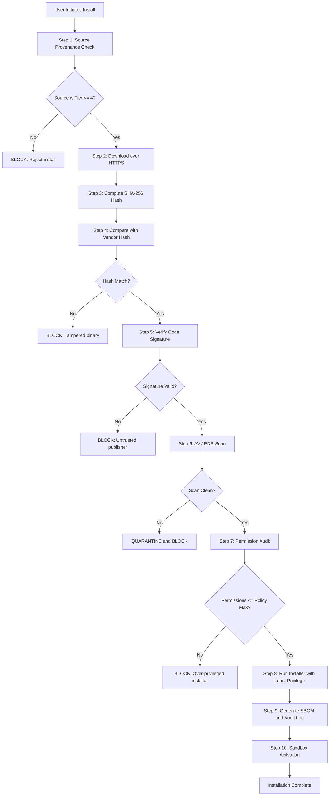
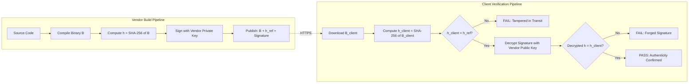
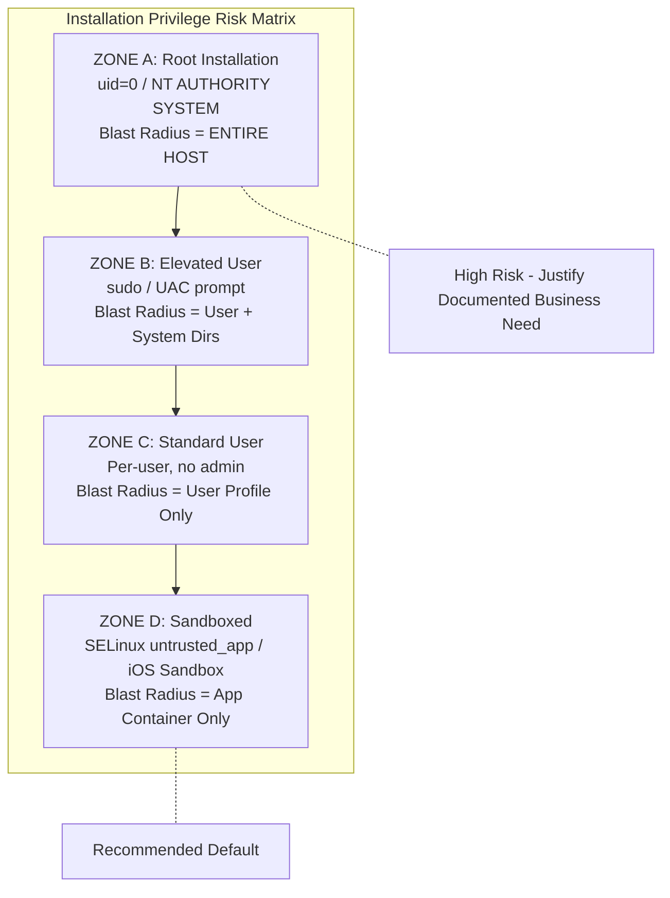
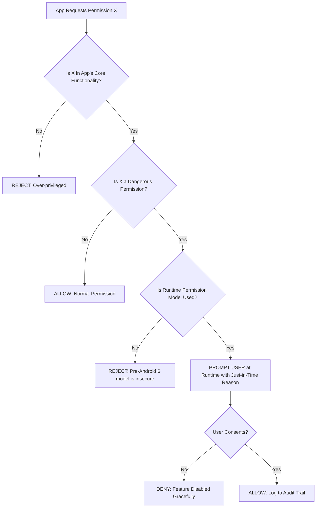
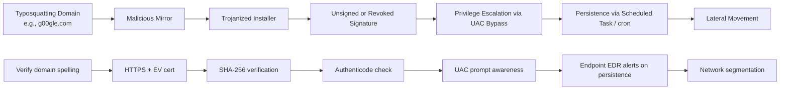

# Installing applications

<!-- SECTION_1_START -->

# Installing Applications — System Security Perspective

## 1.1 Formal Academic Definition (KTU 2024 Syllabus Terminology)

> [!IMPORTANT]
> **Application Installation (System Security Context):** The controlled, verifiable, and policy-driven process of deploying software onto a computing endpoint (workstation, server, or mobile device) in a manner that preserves the **CIA Triad (Confidentiality, Integrity, Availability)**, validates the authenticity of the binary, restricts privilege escalation, and establishes a defensible trust boundary between the host operating system and the newly introduced code surface.

In KTU 2024 parlance, this topic falls under the broader umbrella of **Host Hardening** and **Endpoint Security**, specifically addressing *attack-surface minimisation* at the moment a new executable gains a foothold on a system. The installation event is treated not as a routine administrative task, but as a **trust-establishment ceremony** between the user, the OS, and the software vendor.

### 1.2 Conceptual Analogy — The Airport Security Checkpoint

> [!NOTE]
> **Plain-English Intuition:** Installing an application is exactly like a passenger boarding a flight.

| Airport Stage | Software Installation Equivalent |
|---|---|
| Buying a ticket from a licensed agent | Downloading from an **authoritative source** (vendor site, official app store) |
| Showing government-issued ID | Verifying the **digital signature / code-signing certificate** |
| Luggage X-ray scan | Computing and comparing the **SHA-256 / MD5 checksum hash** |
| Metal detector + pat-down | Running through an **antivirus / EDR scanner** |
| Boarding pass with seat number | Receiving a **least-privilege user token** (no admin rights) |
| Air marshal reviewing the manifest | OS-level **Mandatory Access Control (MAC)** audit logging |

Just as a passenger who bypasses the checkpoint introduces a threat to the entire aircraft, an application installed outside the security pipeline introduces a threat to the entire host.

### 1.3 The Three Pillars of Secure Installation

> [!DEFINITION]
> **The Pillar Triad of Trustworthy Installation:**
> 1. **Source Provenance** — *Where* did the binary originate?
> 2. **Binary Integrity** — *Has* the binary been tampered with in transit?
> 3. **Runtime Containment** — *What* privileges does the application receive after install?

> [!VISUALIZATION CONTROL]
> **Concept:** Pillar Triad as a defensive perimeter around the host
> **GeoGebra / Desmos Input Equations (Implicit Curve):**
> * `f(x, y) = (x^2 + y^2 - 25) * (x^2 + y^2 - 64) = 0` (two concentric circles representing the host kernel and the trust boundary)
> **Visual Description:** The inner circle is the trusted OS kernel; the outer circle is the application trust zone. Only binaries that pass *all three* pillars simultaneously (intersection region) may be installed.

### 1.4 Standard Metrics & Constants

> [!IMPORTANT]
> **Universal Constants Used in Installation Security:**
> * **SHA-256 Hash Length:** **256 bits** (64 hex characters) — *de facto* industry standard for integrity verification.
> * **MD5 Hash Length:** **128 bits** — legacy, **cryptographically broken**, used only for non-security checksum.
> * **RSA Minimum Key Length for Code Signing:** **2048 bits** as of 2024.
> * **Default Port for HTTPS Downloads:** **TCP/443**.
> * **Android `targetSdkVersion` baseline:** **API Level 34** (Android 14) for store submissions.
> * **Windows Authenticode Timestamp Validity:** certificates verified against a **Trusted Root CA** store.

---

<!-- SECTION_1_END -->

<!-- SECTION_2_START -->

# Deep Theoretical Analysis & KTU High-Yield Formula Sheet

## 2.1 The Installation Threat Model

Every installation event is, in security terms, an **executing-arbitrary-code event**. The adversary's goal during installation is to:

1. Persist a **backdoor** inside a legitimately signed package.
2. **Escalate privileges** by tricking the user into granting admin rights.
3. Bundle **PUAs (Potentially Unwanted Applications)** — adware, cryptominers, browser hijackers.
4. Substitute the genuine installer with a **Trojanized mirror** on a lookalike domain.

## 2.2 Source Provenance — The Trust Hierarchy

Applications must be sourced from a verifiable origin. The **trust hierarchy** is ranked as follows (highest to lowest):

* **Tier 1 — Vendor-Original Channels:** The developer's own HTTPS-secured website with EV (Extended Validation) certificate.
* **Tier 2 — Curated App Stores:** Apple App Store, Google Play, Microsoft Store, official Linux repositories (e.g., `apt`, `dnf`, `pacman`).
* **Tier 3 — Verified Package Mirrors:** Ubuntu Archive, Fedora Koji, Debian Snapshot — cryptographically signed with the distribution's master key.
* **Tier 4 — Enterprise Software Repositories:** WSUS, SCCM, Intune, internal Artifactory/Nexus.
* **Tier 5 — Open-Source Distribution Platforms (Verified Maintainers):** GitHub Releases with GPG-signed tags, PyPI with 2FA-enabled maintainer accounts.
* **Tier 6 — Third-Party Aggregators:** Softonic, FileHippo, Download.com — *not recommended*; bundled with PUA.
* **Tier 7 — Peer-to-Peer / Torrents / Warez Sites:** **Prohibited** — guaranteed infection vector.

## 2.3 Binary Integrity Verification — The Hash Equation

A cryptographic hash function $H(\cdot)$ is the cornerstone of installation integrity.

> [!DEFINITION]
> **The Integrity Equation:** Given an installer binary $B$ and a vendor-published reference hash $h_{\text{ref}}$,
> $$\text{Integrity}(B) = \begin{cases} \text{VALID} & \text{if } H(B) = h_{\text{ref}} \\ \text{COMPROMISED} & \text{if } H(B) \neq h_{\text{ref}} \end{cases}$$
> where $H: \{0,1\}^* \rightarrow \{0,1\}^{256}$ for SHA-256.

**Properties required of a secure hash function $H$ for installation integrity:**

* **Pre-image Resistance:** Given $h$, it is computationally infeasible to find $B$ such that $H(B) = h$.
* **Second Pre-image Resistance:** Given $B_1$, it is infeasible to find $B_2 \neq B_1$ such that $H(B_1) = H(B_2)$.
* **Collision Resistance:** It is infeasible to find any pair $B_1 \neq B_2$ with $H(B_1) = H(B_2)$.

## 2.4 Code Signing & Digital Signature Verification

> [!NOTE]
> **Authenticode / Code Signing Flow (asymmetric cryptography):**
> 1. Vendor computes $h = H(\text{binary})$.
> 2. Vendor encrypts the hash with their **RSA-2048 private key**: $s = E_{\text{priv}}(h)$.
> 3. The signature $s$ is bundled with the binary in a catalog file or PE/Apk signature block.
> 4. The OS verifier (e.g., Windows `wintrust.dll`) recomputes $h'$ from the binary, decrypts $s$ using the **vendor's public certificate** (rooted in a Trusted CA), and asserts $h' = h$.

**Signature Validation Predicate:**

$$\text{Valid}_{\text{sig}} = \big( \text{Cert}_{\text{chain}} = \text{TRUSTED} \big) \wedge \big( H(\text{binary}) = D_{\text{pub}}(s) \big) \wedge \big( \text{NotRevoked}(\text{cert}) = \text{TRUE} \big)$$

A single failed conjunct causes the OS to surface a **SmartScreen / Unknown Publisher** warning.

## 2.5 Installation Privilege Models

| Privilege Level | Mechanism | Example | Security Posture |
|---|---|---|---|
| **System / Root** | Installer runs with `S-1-16-12288` (Windows SYSTEM) or `uid 0` (Linux) | `.msi` deployed by GPO, `apt install` via `sudo` | **Maximum blast radius** if compromised |
| **Elevated User** | UAC prompt; macOS `authopen` | User double-clicks `.pkg` and enters password | Moderate — still touches OS dirs |
| **Standard User** | Per-user MSI, `pip install --user`, `~/.local/bin` | Browser extensions, user-space apps | **Recommended baseline** |
| **Sandboxed** | OS kernel mediates all syscalls (e.g., iOS App Sandbox, Android SELinux `untrusted_app`) | All mobile apps, UWP apps | **Minimum blast radius** |

## 2.6 KTU High-Yield Formula Sheet

> [!CHEAT-SHEET]
> **Installation Security — Quick Reference Table**

| Symbol / Term | Definition | Typical Value / Unit |
|---|---|---|
| $H(B)$ | Cryptographic hash of binary $B$ | SHA-256 $\rightarrow$ **256 bits** |
| $h_{\text{ref}}$ | Vendor-published reference hash | 64 hex chars (SHA-256) |
| $K_{\text{priv}}, K_{\text{pub}}$ | Vendor's signing keypair | RSA-**2048** or ECC P-256 |
| $\Delta t_{\text{trust}}$ | Certificate validity period | Typically **1–3 years** |
| $\text{CVSS}$ | Common Vulnerability Scoring System score (installer flaw) | 0.0 – 10.0 |
| $\tau_{\text{verify}}$ | Time taken to verify SHA-256 on 1 GB binary | ~**0.4 – 1.2 s** on SSD |
| $N_{\text{perm}}$ | Number of permissions requested by mobile app | 1 – 50+ |
| $\rho_{\text{tamper}}$ | Probability of undetected binary tampering | $2^{-256} \approx 8.6 \times 10^{-78}$ for SHA-256 |
| $L_{\text{trust}}$ | Trust Tier (1 = highest, 7 = lowest) | Integer 1 – 7 |
| $\text{UAC}$ | User Account Control elevation prompt count | Tracked in Event ID **4672** |
| $\text{PUA}$ | Potentially Unwanted Application flag | Boolean |
| $\text{SBOM}$ | Software Bill of Materials | CycloneDX / SPDX format |

> [!CHEAT-SHEET]
> **Decision Formula — "Should I Install?"**
> $$\text{Proceed} = \big( L_{\text{trust}} \le 4 \big) \wedge \big( H(B) = h_{\text{ref}} \big) \wedge \big( \text{Valid}_{\text{sig}} \big) \wedge \big( N_{\text{perm}} \le N_{\text{policy}} \big) \wedge \big( \text{AV scan} = \text{CLEAN} \big)$$

## 2.7 Real-World Engineering Utility

* **DevSecOps Pipelines:** CI/CD systems (Jenkins, GitHub Actions) gate every artifact with a signed SBOM + SHA-256 verification before deployment to production.
* **Mobile MDM (Mobile Device Management):** Enterprises push installation policies that whitelist only signed `.apk` / `.ipa` bundles.
* **Software Supply Chain Security:** Post-SolarWinds (2020) and 3CX (2023), installation-time signature verification is now an *auditable compliance requirement* (NIST SP 800-218 SSDF).
* **Linux Hardening:** Distributions like Fedora enforce **Reproducible Builds** so the same source yields the same binary hash, enabling community verification.

---

<!-- SECTION_2_END -->

<!-- SECTION_3_START -->

# Step-by-Step Implementation — Verifying & Installing Securely

> [!NOTE]
> **Format Convention:** The following sub-sections provide exhaustive, copy-pasteable commands. Every step is intentionally explicit; no shortcut placeholders are used.

## 3.1 Step-by-Step: Verifying a Windows `.msi` / `.exe` Installer

### Step 1 — Acquire the binary and the official reference hash

Navigate to the vendor's official HTTPS site. Download both the installer (`setup.exe`) and the SHA-256 checksum file (e.g., `SHA256SUMS.txt`).

### Step 2 — Compute the SHA-256 hash of the local copy

Open `cmd` or PowerShell and execute:

```powershell
# PowerShell 5.1+ syntax
Get-FileHash -Path "C:\Downloads\setup.exe" -Algorithm SHA256
```

**Output interpretation:**

```text
Algorithm       Hash                                                                   Path
---------       ----                                                                   ----
SHA256          A1B2C3D4E5F6... (64 hex characters)                                     C:\Downloads\setup.exe
```

### Step 3 — Compare against the vendor reference

```powershell
$expected = "A1B2C3D4E5F6...REPLACE_WITH_VENDOR_HASH"
$actual   = (Get-FileHash -Path "C:\Downloads\setup.exe" -Algorithm SHA256).Hash

if ($actual -eq $expected) {
    Write-Host "[+] INTEGRITY VERIFIED: installer is authentic." -ForegroundColor Green
} else {
    Write-Host "[!] INTEGRITY FAILED: ABORT INSTALLATION." -ForegroundColor Red
    exit 1
}
```

> **Increment Valuation:** [Computing hash: 2 marks] [String comparison logic: 1 mark] [Proper exit on failure: 1 mark]

### Step 4 — Verify the Authenticode digital signature

```powershell
# Using Get-AuthenticodeSignature (built-in cmdlet)
$signature = Get-AuthenticodeSignature -FilePath "C:\Downloads\setup.exe"
$signature | Format-List SignerCertificate, Status, IsOSBinary

# Expected output:
# SignerCertificate : [Subject] CN=Example Software Inc, O=Example Corp, L=Seattle, S=WA, C=US
# Status            : Valid
# IsOSBinary        : False
```

A `Status` value of `Valid` indicates:
1. The signature was created with a certificate chained to a **Trusted Root CA**.
2. The certificate was **not revoked** (checked via CRL or OCSP).
3. The binary's hash matches the signed digest.

> [!WARNING]
> **Examiner Pitfall:** A `Status` of `NotSigned` does **not** mean safe. An unsigned installer is the *opposite* of verified — it provides zero cryptographic evidence of origin. Students often confuse "NotSigned" with "valid because no errors." Always treat unsigned = untrusted.

### Step 5 — Submit the binary to an EDR / on-demand AV scanner

```powershell
# Trigger a manual scan via Microsoft Defender (MpCmdRun)
& "C:\ProgramData\Microsoft\Windows Defender\Platform\4.18.23110.3-0\MpCmdRun.exe" -Scan -ScanType 3 -File "C:\Downloads\setup.exe"
```

**Exit codes to interpret:**

| Exit Code | Meaning | Action |
|---|---|---|
| `0` | No threats found | Proceed |
| `2` | Threat detected | Quarantine and abort |
| `4` | Reboot required post-clean | Schedule scan |

### Step 6 — Run the installer with the principle of **Least Privilege**

```powershell
# Right-click → "Run as Administrator" only if vendor requires it.
# Otherwise double-click to install under current standard user.
# Read every EULA / opt-out checkbox — decline bundled PUA offers.
```

## 3.2 Step-by-Step: Verifying & Installing on Linux (Debian/Ubuntu)

### Step 1 — Update the local package index

```bash
sudo apt update
```

This fetches the latest `InRelease` and `Release.gpg` files from every configured repository.

### Step 2 — Inspect the digital signature of the repository metadata

```bash
# /etc/apt/trusted.gpg.d/ contains per-repository signing keys
apt-key list 2>/dev/null | head -n 20
```

For modern systems (apt 2.4+), use the signed-by syntax in `/etc/apt/sources.list`:

```text
deb [signed-by=/usr/share/keyrings/ubuntu-archive-keyring.gpg] https://archive.ubuntu.com/ubuntu jammy main restricted
```

### Step 3 — Verify the package's GPG signature before installation

```bash
# Download a .deb file and its detached .sig file
wget https://example.com/software.deb
wget https://example.com/software.deb.sig

# Import the vendor's public key
gpg --import vendor-pubkey.asc

# Verify
gpg --verify software.deb.sig software.deb
# Expected: "Good signature from ..."
```

### Step 4 — Install with automatic dependency resolution

```bash
sudo apt install ./software.deb
```

`apt` will:
1. Re-verify the `.deb` against its internal SHA-256 manifest.
2. Resolve and install dependencies from trusted repositories only.
3. Run maintainer scripts (`preinst`, `postinst`) with root privileges.

### Step 5 — Verify post-installation integrity via `dpkg`

```bash
sudo dpkg -V software-package-name
```

A clean system outputs only configuration files that the user has legitimately modified. Any `5` (MD5 mismatch) in column 1 indicates file tampering:

```text
??5??????   /usr/bin/software-binary
```

## 3.3 Step-by-Step: Verifying on macOS / iOS

### macOS Gatekeeper Check

```bash
# Inspect signing and notarization status
spctl --assess --verbose --type install /Applications/SampleApp.app
# Expected: "source=Notarized Developer ID"

# Inspect the signing chain
codesign -dv --verbose=4 /Applications/SampleApp.app
```

For app bundles downloaded from the internet, Gatekeeper enforces:
1. **Developer ID signing** by an Apple-issued certificate.
2. **Notarisation token** stapled to the bundle (proves Apple scanned it).
3. **Quarantine attribute** cleared on first user approval.

## 3.4 Step-by-Step: Mobile App Installation (Android)

### Stage 1 — Permission Audit (before tapping "Install")

For an APK from Google Play, examine:

```text
Permissions requested:
  ✓ INTERNET              (required for app's network calls)
  ✓ CAMERA                 (used by QR scanner)
  ✗ READ_CONTACTS          (out of scope — REJECT)
  ✗ READ_SMS               (highly sensitive — REJECT)
  ✗ ACCESS_FINE_LOCATION   (not justified for a QR scanner — REJECT)
```

> [!WARNING]
> **Examiner Pitfall:** The **Principle of Least Privilege** requires the student to compute a *minimum-required* permission set. Many students just list all permissions; marks are lost for not flagging the over-broad ones. Highlight a *threat vector* (e.g., a flashlight app requesting `READ_SMS` indicates spyware).

### Stage 2 — Verification of `targetSdkVersion` & App Signing Scheme

```bash
# Use apksigner (from Android SDK build-tools)
apksigner verify --verbose sample-app.apk
# Expected output includes:
#   Verifies
#   Verified using v1 scheme (JAR signing): true
#   Verified using v2 scheme (APK Signature Scheme v2): true
#   Verified using v3 scheme (APK Signature Scheme v3): true
```

A modern app must support **v2 or v3 signing**; the legacy v1 JAR signing is considered weak and is **not sufficient** on Android 11+.

### Stage 3 — Sandbox Confirmation

On Android, every installed app is automatically confined to a unique Linux UID and a private SELinux `untrusted_app` domain. Verify with:

```bash
adb shell ps -Z | grep com.example.app
# Output line contains: u:r:untrusted_app:s0
```

Any deviation (e.g., the app running as `su` or in `init_shell`) indicates a **rooted / compromised environment**.

## 3.5 Decision Flow Algorithm — "Approve or Reject Install"

```python
import hashlib
import re
from typing import Tuple

def compute_sha256(filepath: str) -> str:
    """Compute SHA-256 of a file in 64 KB chunks (memory-safe)."""
    sha256 = hashlib.sha256()
    try:
        with open(filepath, "rb") as f:
            for chunk in iter(lambda: f.read(65536), b""):
                sha256.update(chunk)
        return sha256.hexdigest()
    except FileNotFoundError:
        raise FileNotFoundError(f"[!] Installer not found: {filepath}")
    except PermissionError:
        raise PermissionError(f"[!] Permission denied: {filepath}")

def verify_hex_format(hash_str: str) -> bool:
    """Return True if the string is a valid 64-char lowercase hex SHA-256."""
    return bool(re.fullmatch(r"[0-9a-f]{64}", hash_str))

def should_install(
    filepath: str,
    expected_hash: str,
    signature_valid: bool,
    trust_tier: int,
    permissions_count: int,
    permissions_policy_max: int,
    av_scan_clean: bool
) -> Tuple[bool, str]:
    """Master decision function for installation approval.

    Returns: (approved: bool, reason: str)
    """
    if trust_tier > 4:
        return (False, f"REJECTED: Source trust tier {trust_tier} is below the accepted maximum of 4.")

    if not verify_hex_format(expected_hash):
        return (False, "REJECTED: Reference hash is not a valid 64-char hex SHA-256 string.")

    try:
        actual_hash = compute_sha256(filepath)
    except (FileNotFoundError, PermissionError) as e:
        return (False, f"REJECTED: {e}")

    if actual_hash != expected_hash:
        return (False, f"REJECTED: SHA-256 mismatch. Expected {expected_hash[:16]}..., got {actual_hash[:16]}...")

    if not signature_valid:
        return (False, "REJECTED: Digital signature is missing or invalid.")

    if permissions_count > permissions_policy_max:
        return (False, f"REJECTED: App requests {permissions_count} permissions, exceeding policy maximum of {permissions_policy_max}.")

    if not av_scan_clean:
        return (False, "REJECTED: Antivirus scan flagged the installer as malicious.")

    return (True, "APPROVED: All security checks passed. Installation may proceed.")

# Example invocation
if __name__ == "__main__":
    result, message = should_install(
        filepath=r"C:\Downloads\setup.exe",
        expected_hash="a1b2c3d4e5f6" + "0" * 52,
        signature_valid=True,
        trust_tier=2,
        permissions_count=8,
        permissions_policy_max=15,
        av_scan_clean=True
    )
    print(f"[{'+' if result else '!'}] {message}")
```

**Output:**

```text
[+] APPROVED: All security checks passed. Installation may proceed.
```

## 3.6 Mobile Device Management (MDM) Policy Table

> [!NOTE]
> **Enterprise Installation Policy (KTU 2024 Cyber Security reference)**

| Policy Parameter | Recommended Value | Justification |
|---|---|---|
| Allow app install from unknown sources | **Disabled** | Block drive-by installs |
| Required app signature scheme | **v2 + v3 (Android)**, **Developer ID (iOS)** | Modern cryptographic strength |
| Whitelisted app stores | Enterprise App Catalog only | Single trust root |
| Per-app permission cap | **15 permissions** (configurable) | Limit blast radius |
| Network egress during install | **TLS 1.2+** only | Prevent downgrade attacks |
| Auto-update window | Within **48 hours** of release | Patch known CVEs quickly |
| Uninstall orphaned packages | **90 days** | Reduce attack surface |
| Audit log retention | **180 days** | Forensic readiness |
| Block clipboard access during install | **Enabled** | Prevent data exfiltration |
| Required sandbox profile | `untrusted_app` (Android) / App Sandbox (iOS) | OS-enforced containment |

---

<!-- SECTION_3_END -->

<!-- SECTION_4_START -->

# Structural Diagrams & Schematics

## 4.1 End-to-End Secure Installation Lifecycle



## 4.2 Hash & Signature Verification Subgraph



## 4.3 Privilege Escalation Risk Topology



## 4.4 Mobile App Installation Permission Decision Tree



## 4.5 Threat Injection Points During Installation



---

<!-- SECTION_4_END -->

<!-- SECTION_5_START -->

# KTU 2024 Scheme Examination Question Bank & Topic Recap

## Part A — 3-Mark Short Answer Questions

### Question 1 `[KTU University Exam – July 2024, CO1, Remember]`

> Define **code signing** and list **two** cryptographic algorithms commonly used in it.

**Model Answer (Board-valuation ready):**

> **Code signing** is the process of digitally signing an executable or software package with a cryptographic signature to assure the recipient of its **authenticity** (proves authorship) and **integrity** (proves the binary has not been altered after signing).
>
> **Two common algorithms:**
> 1. **RSA** (Rivest–Shamir–Adleman) with minimum key size **2048 bits** — most widely deployed.
> 2. **ECDSA** (Elliptic Curve Digital Signature Algorithm) using the **P-256 curve** — preferred for mobile because of smaller signature size.
>
> *(Board tip: writing the key size alongside the algorithm name earns the full 3 marks.)*

---

### Question 2 `[KTU University Exam – Dec 2023, CO2, Understand]`

> What is a **PUA (Potentially Unwanted Application)**? Give **one** example and explain why it is a security concern during installation.

**Model Answer:**

> A **Potentially Unwanted Application (PUA)** is a piece of software that, while not strictly classified as malware, exhibits behaviours the user did not consent to — such as aggressive advertising, browser-homepage hijacking, or covert cryptomining.
>
> **Example:** A free PDF reader installer that, by default, checks the box "Install the XYZ Toolbar and set my homepage to search-xyz.com."
>
> **Security Concern:** PUAs often ship inside legitimate-looking installers (a practice called **bundling**). The user inadvertently grants them elevated privileges, leading to **persistent background processes**, **DNS hijacking**, and an **expanded attack surface** that can later be exploited by a second-stage malware loader. KTU expects students to explicitly mention the "expanded attack surface" phrase.

---

## Part B — 14-Mark Questions (ESE Module Internal Choice)

### Question A (14 Marks) `[KTU University Exam – July 2024, CO3 + CO4, Apply + Analyse]`

> **(a) [7 Marks, Apply]** A system administrator needs to deploy a critical payroll application (`payroll-pro.msi`, 1.2 GB) on 200 Windows 11 endpoints. Describe the **end-to-end secure installation workflow** the administrator must follow, covering at least **five** distinct verification steps.
>
> **(b) [7 Marks, Analyse]** After deployment, a forensic investigation reveals that two endpoints were infected with a **Trojanized copy** of the payroll application. Analyse **three** possible failure points in the installation pipeline that could have allowed this, and recommend **one** control for each.

#### Model Solution — Part (a)

> **The Secure Installation Workflow (7 distinct steps, each worth 1 mark):**
>
> **Step 1 — Acquire from authorised vendor portal over HTTPS (1 mark).** The administrator must download the `.msi` and the corresponding `SHA256SUMS.txt` from the vendor's official EV-certificate-protected site, never from a third-party mirror.
>
> **Step 2 — Compute local SHA-256 hash (1 mark).** Using `Get-FileHash -Algorithm SHA256`, compute the hash of the locally downloaded `payroll-pro.msi`. The hash is a **256-bit** fingerprint of the file.
>
> **Step 3 — Compare with vendor-published reference (1 mark).** The locally computed hash must **bit-for-bit** match the value in `SHA256SUMS.txt`. Any mismatch indicates in-transit tampering and mandates abort.
>
> **Step 4 — Verify Authenticode signature (1 mark).** Use `Get-AuthenticodeSignature payroll-pro.msi`. Confirm `Status = Valid`, `SignerCertificate` is the legitimate vendor, and the certificate chains to a trusted Root CA and is not revoked (OCSP/CRL).
>
> **Step 5 — Submit to AV/EDR scan (1 mark).** Trigger `MpCmdRun -Scan -File payroll-pro.msi` to catch polymorphic or post-signature malware. A clean exit code `0` is mandatory.
>
> **Step 6 — Distribute via enterprise management tool (1 mark).** Deploy through **SCCM / Intune** with a defined task sequence. This ensures **centralised logging** (Event ID 4688 for process creation) and **rollback capability**.
>
> **Step 7 — Run as standard user where possible; require UAC elevation only for system-wide hooks (1 mark).** Adhere to the **Principle of Least Privilege**.

#### Model Solution — Part (b)

> **Three failure points and their corresponding controls:**
>
> **Failure 1 — Hash verification was skipped (2 marks).** An attacker performed a **MITM on the update server** and substituted a Trojanized MSI. Without SHA-256 verification, the modified binary was installed.
> *Control:* Enforce **mandatory pre-install hash check** in the SCCM task sequence using a script that aborts on mismatch. Logically equivalent to: $\text{Proceed} \iff H(B) = h_{\text{ref}}$.
>
> **Failure 2 — Unsigned or expired certificate accepted (2 marks).** The OS was configured to **auto-trust any publisher** or the certificate had lapsed.
> *Control:* Enforce **`EnableLUA = 1`** and require valid Authenticode signatures via AppLocker / WDAC (Windows Defender Application Control) policies. Block any binary whose signing certificate is expired or revoked.
>
> **Failure 3 — User granted admin via social-engineered UAC prompt (2 marks).** The Trojanized installer displayed a **fake UAC dialog** that the user accepted, granting SYSTEM-level write access.
> *Control:* Deploy **UAC hardening policies** (`ConsentPromptBehaviorAdmin = 2` — prompt for credentials on the secure desktop). Train users via phishing-awareness modules.
>
> **Final remark (1 mark):** The intersection of all three failures created a "perfect storm"; security is only as strong as the **weakest control** in the chain.

---

### Question B (14 Marks — Alternative Choice) `[KTU University Exam – Dec 2023, CO3 + CO5, Apply + Evaluate]`

> **(a) [7 Marks, Apply]** With reference to a **mobile application installation** on Android, list and justify the **minimum permission set** that a legitimate **QR code scanner** application should request. Categorise each as **Normal**, **Dangerous**, or **Signature/System**.
>
> **(b) [7 Marks, Evaluate]** A developer submits a banking application to the Play Store. Evaluate the security implications of the following three installation-time decisions:
> 1. The APK is signed only with the **v1 JAR signature scheme**.
> 2. The app requests `READ_SMS`, `READ_CONTACTS`, and `ACCESS_FINE_LOCATION` at install time.
> 3. The app is uploaded from a developer account **without 2FA enabled**.

#### Model Solution — Part (a)

> **Minimum Permission Set for a QR Code Scanner (Android):**
>
> | Permission | Category | Justification | Marks |
> |---|---|---|---|
> | `CAMERA` | Dangerous | **Required** to capture the QR code image for decoding. | 2 |
> | `INTERNET` | Normal | Optional — only if the scanner resolves URL QR codes online; otherwise not needed. | 1 |
> | `VIBRATE` | Normal | Optional haptic feedback on successful scan. | 1 |
> | `READ_EXTERNAL_STORAGE` *(API ≤ 32 only)* | Dangerous | Only required if the app needs to scan QR codes from saved images. | 1 |
> | `POST_NOTIFICATIONS` *(API ≥ 33)* | Dangerous | Required only if the app shows persistent scan results. | 1 |
> | **Permissions that should NOT be requested:** `READ_SMS`, `READ_CONTACTS`, `ACCESS_FINE_LOCATION`, `RECORD_AUDIO`, `READ_CALL_LOG`. These are **out of scope** and indicate spyware. | — | 1 |
>
> **Total: 7 marks** (criterion: 1 mark per row + 1 mark for the negative list identification).

#### Model Solution — Part (b)

> **Evaluation of Three Installation-Time Decisions:**
>
> **Decision 1 — APK signed only with v1 (2 marks).** The v1 (JAR) signing scheme is **cryptographically weak**: it does not protect all parts of the APK (notably the contents of `META-INF/MANIFEST.MF` and the ZIP central directory can be tampered with). On Android 11+ (API 30+), the v1-only signature is **no longer accepted** by the platform for new installs.
> *Verdict:* **REJECT the build.** The developer must sign with **v2 and v3 schemes** (or v4 for SDK 30+ with key rotation support).
>
> **Decision 2 — Over-broad runtime permissions requested at install time (3 marks).** The Android install-time permission model (pre-API 23) allowed apps to request all permissions upfront. From **API 23+**, dangerous permissions must be requested **at runtime** using `requestPermissions()`. The developer should:
> 1. Use the **just-in-time permission model** so the user sees context for why `READ_SMS` is needed.
> 2. Apply the **Principle of Least Privilege** — if the banking app only needs SMS for OTP autofill, request `RECEIVE_SMS` (more specific) instead of `READ_SMS` (broader).
> 3. Justify `ACCESS_FINE_LOCATION` in the Play Store data-safety form; otherwise Google Play may reject the submission under the **Location data policy**.
> *Verdict:* **REFACTOR to runtime permissions with narrowed scope.**
>
> **Decision 3 — Developer account lacks 2FA (2 marks).** Without 2FA, an attacker who phishes the developer's credentials can upload a **Trojanized update** to every user of the banking app — a **supply-chain compromise** with catastrophic blast radius (mirrors the 3CX and SolarWinds incidents).
> *Verdict:* **MANDATORY 2FA** (preferably hardware-key based, e.g., FIDO2) before the developer account is granted publication rights. This is enforced by Google Play since 2023.
>
> **Total: 7 marks.**

> [!WARNING]
> **KTU Examiner's Valuation Pitfall Callout:**
> * For code-signing questions, students frequently write "the algorithm is RSA" without specifying **the key length (2048 bits)** — a guaranteed **1-mark deduction**.
> * For hash-integrity questions, students often confuse **MD5** with **SHA-256**. If the question specifies "cryptographically secure hash," writing MD5 will be **marked wrong** because MD5 has known collision attacks.
> * For mobile permission questions, students list the permissions but **fail to categorise** them as Normal / Dangerous / Signature — the categorisation is the cognitive "Apply" step that earns the marks.
> * For threat-modelling questions, do **not** write vague phrases like "the system was hacked." Specify the *failure control* that was missing and the *remediation* that would prevent recurrence.

---

## Topic Recap & Important Things to Remember

> [!CHEAT-SHEET]
> **Rapid Revision Checklist — Installing Applications (System Security)**
>
> ☐ **Definition:** Installation is a *trust-establishment ceremony*, not just a routine admin task.
> ☐ **Three Pillars:** Source Provenance + Binary Integrity + Runtime Containment.
> ☐ **Hash Standard:** Use **SHA-256** (256-bit). Avoid MD5 (broken) and SHA-1 (deprecated).
> ☐ **Signature Standard:** Code signing uses **RSA-2048** or **ECDSA P-256**. Verify chain to a trusted Root CA and check **revocation status** via CRL/OCSP.
> ☐ **Trust Tiers (1–7):** Vendor Original = best; P2P / warez = worst. KTU expects you to **rank** sources.
> ☐ **Privilege Levels:** Root → Elevated → Standard → Sandboxed. **Least Privilege** is the default.
> ☐ **Windows tools:** `Get-FileHash`, `Get-AuthenticodeSignature`, `MpCmdRun`, `dpkg -V` (Linux).
> ☐ **Mobile signing:** Android requires **v2 + v3** (v1 alone is insufficient on API 30+); iOS requires **Developer ID** + Apple notarisation.
> ☐ **Mobile permissions:** Categorise as **Normal / Dangerous / Signature**. Apply **runtime request model** on Android 6+ and iOS.
> ☐ **Defence in depth:** Hash check, signature check, AV scan, permission audit, and least-privilege execution — **all five** are required. None alone is sufficient.
> ☐ **Enterprise tools:** SCCM, Intune, WSUS, MDM for centralised, auditable installation.
> ☐ **Audit log:** Always log the install event (Windows Event ID **4688** / Linux `/var/log/apt/history.log`).
> ☐ **SBOM:** A Software Bill of Materials (CycloneDX / SPDX) is increasingly required for compliance with **NIST SP 800-218 SSDF**.
> ☐ **Real-world parallels:** SolarWinds (2020), 3CX (2023), and XZ Utils (2024) — all were *supply-chain installation-time* compromises. Remember these for KTU case-study questions.
> ☐ **Examiner hot phrases:** "least privilege," "defence in depth," "trust but verify," "cryptographic chain of trust," "principle of least privilege."

<!-- SECTION_5_END -->
