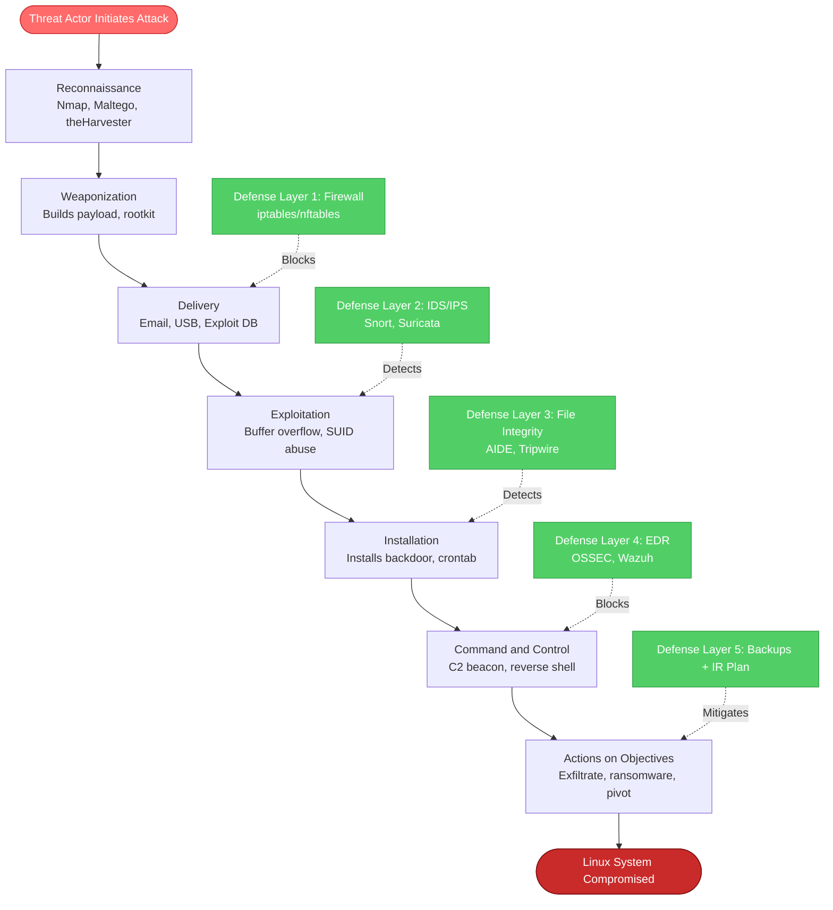
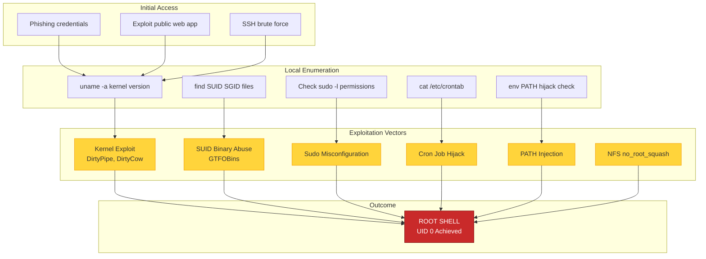
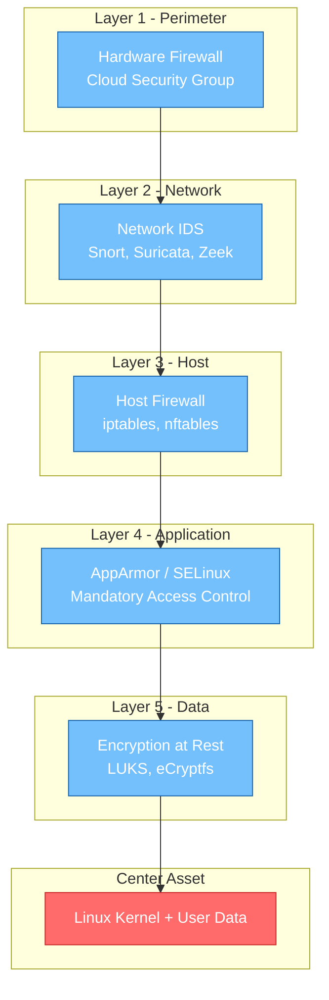
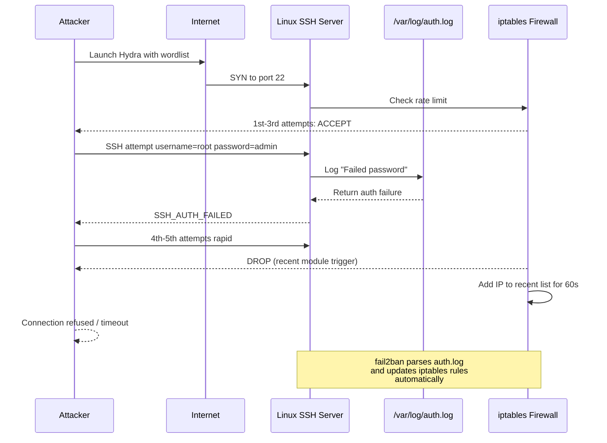

# Linux Security- Attacks in Linux system

<!-- SECTION_1_START -->
# Linux Security: Attacks in Linux System

## 1. Core Technical Definition & Intuitive Overview

### Formal Definition
**Linux Security** refers to the comprehensive set of practices, tools, and policies designed to protect Linux-based operating systems from unauthorized access, malicious attacks, and data breaches. An **attack in a Linux system** is any deliberate attempt by a threat actor to compromise the **CIA Triad** (Confidentiality, Integrity, and Availability) of a Linux machine, its services, or the data it processes.

> [!IMPORTANT]
> **KTU Syllabus Highlight (Module 4 - System Security):**
> As per the KTU 2024 Scheme syllabus for *PBCST604 - Fundamentals of Cyber Security*, students must understand common attack vectors targeting Linux systems, identify their signatures, and apply mitigation strategies. Linux powers **96% of the world's top 1 million web servers**, **100% of the TOP 500 supercomputers**, and the entire **Android mobile OS base**, making it the single most critical attack surface in modern computing.

### Conceptual Analogy / Intuition
Imagine your Linux server as a **medieval fortress**:
- The **kernel** is the king — if he falls, the kingdom falls.
- The **firewall (iptables/nftables)** is the outer wall and moat.
- **SSH (Port 22)** is the heavily guarded front gate.
- **User accounts** are the citizens; the **root user** is the king himself.
- **File permissions (rwx)** are the locks on every door and chest.

An **attack** is when a bandit (hacker) tries to:
1. **Scale the wall** (exploit open ports).
2. **Pick the gate lock** (brute-force SSH passwords).
3. **Bribe a citizen** (phishing/sudo escalation).
4. **Poison the water well** (malware/rootkits).
5. **Burn the granary** (Denial of Service).

> [!NOTE]
> **Core Definition - Attack Surface**
> The **attack surface** of a Linux system is the sum of all points (open ports, running services, user accounts, installed software, kernel version) where an unauthorized user can attempt to enter or extract data. **Reducing the attack surface** is the foundational principle of Linux hardening.

### Common Linux System Statistics (Industry Benchmarks)
- The global cost of cybercrime is projected to reach **\$10.5 trillion annually by 2025** (Cybersecurity Ventures).
- A typical unprotected Linux server on the public internet is attacked within **~5 minutes** of going online (Shodan/Honeypot Research).
- The **mean time to patch** a critical CVE in Linux has improved to **~14 days**, but weaponized exploits often appear within **48 hours**.

> [!VISUALIZATION CONTROL]
> **Concept:** The Linux Security Onion (Layered Defense Model)
> **GeoGebra / Desmos Input Equations:**
> * Concentric circles representing layers: $r_1 = 1$ (Perimeter), $r_2 = 2$ (Network), $r_3 = 3$ (Host), $r_4 = 4$ (Application), $r_5 = 5$ (Data)
> * Center point $(0,0)$ representing the kernel/root asset.
> **Visual Description:** Observe that an attacker must penetrate all five concentric rings to compromise the asset at the center. If one layer fails, the others still provide protection (Defense in Depth).

<!-- SECTION_1_END -->

<!-- SECTION_2_START -->
# Deep Theoretical Analysis & KTU High-Yield Formula Sheet

## 2. Classification of Linux Attacks

Linux attacks can be classified into multiple categories based on the **attack vector**, **target layer**, and **adversary intent**. Below is the KTU-aligned taxonomy:

### 2.1 Password-Based Attacks
These attacks target the authentication subsystem of Linux, primarily the **`/etc/shadow`** file where hashed passwords are stored.

| Attack Type | Mechanism | Defense |
|---|---|---|
| **Brute Force** | Tries all possible character combinations | Account lockout, fail2ban, strong passwords |
| **Dictionary Attack** | Uses a precompiled wordlist (`rockyou.txt`) | Password complexity policies (`pam_cracklib`) |
| **Rainbow Table** | Pre-computed hash-to-password lookup | Salting (Linux uses **MD5-crypt**, **SHA-512** with salt by default) |
| **Hybrid Attack** | Dictionary + appended numbers/symbols | Long passphrases (≥ 16 chars) |

The computational effort for a brute force attack is given by:
$$T_{brute} = \frac{C^{L}}{R}$$
Where:
- $C$ = character set size (e.g., 26 lowercase letters, 94 printable ASCII)
- $L$ = password length
- $R$ = hashing rate (hashes/second) of the attacker's GPU rig

### 2.2 Malware-Based Attacks
Linux malware has grown by approximately **350%** in the last decade, driven by the rise of IoT botnets and cloud workloads.

| Malware Type | Linux Example | Propagation |
|---|---|---|
| **Virus** | `Linux.Virut.139` | Attaches to executable files (`.elf`) |
| **Worm** | `Mirai`, `Gafgyt` | Self-replicates over network (SSH/telnet) |
| **Trojan** | `Linux.BackDoor.Fgt` | Disguised as legitimate software |
| **Rootkit** | `Reptile`, `Diamorphine` | Hides malicious processes via LKM (Loadable Kernel Module) |
| **Ransomware** | `DarkRadiation`, `HelloKitty` | Encrypts files, demands ransom in crypto |
| **Cryptominer** | `XMRig`, `Kinsing` | Hijacks CPU/GPU for Monero mining |

### 2.3 Network-Based Attacks
- **Man-in-the-Middle (MITM):** Attacker intercepts traffic between client and Linux server (e.g., ARP spoofing in LAN).
- **IP Spoofing:** Forging source IP to bypass `iptables` rules.
- **SYN Flood (DoS):** Exhausts the Linux kernel's TCP backlog queue.
- **SSH Brute Force:** Automated tools like **Hydra**, **Medusa**, **Ncrack** target OpenSSH on **Port 22**.

> [!IMPORTANT]
> **Linux Network Stack Limits (Default Kernel Parameters):**
> * `net.core.somaxconn = 4096` (max listen queue)
> * `net.ipv4.tcp_max_syn_backlog = 4096` (SYN queue)
> * `tcp_synack_retries = 5` (SYN-ACK retries)
> Tuning these via `/etc/sysctl.conf` is a primary DoS mitigation.

### 2.4 Privilege Escalation Attacks
The most critical class of Linux attacks. Two subtypes exist:

- **Vertical Privilege Escalation:** A low-privilege user (`guest`) gains **root** (UID 0) access.
- **Horizontal Privilege Escalation:** User A gains the privileges of User B (both non-root).

Common vectors include:
- Exploiting **SUID/SGID binaries** (e.g., `find`, `vim`, `python` with SUID bit set)
- Kernel exploits (e.g., **DirtyPipe** CVE-2022-0847, **DirtyCow** CVE-2016-5195)
- Misconfigured `sudo` permissions (`sudo NOPASSWD: /bin/bash`)
- Cron job abuse (writable scripts run by root)
- PATH injection in scripts

### 2.5 Application & File System Attacks
- **Buffer Overflow:** Overflows stack/heap in C-based daemons (e.g., older versions of `glibc`, `OpenSSL` - Heartbleed CVE-2014-0160).
- **Symlink Race (`TOCTOU`):** A privileged process follows a malicious symlink to overwrite protected files.
- **Shared Library Injection:** Preloading malicious `.so` files via `LD_PRELOAD`.
- **Log Injection:** Crafting malicious log entries to confuse SIEM tools.

## KTU Formula Sheet / Cheat Sheet

| Concept | Formula / Rule | Unit / Notes |
|---|---|---|
| Password Entropy | $H = L \times \log_2(C)$ | $H$ in bits. Aim for $H \geq 80$ bits. |
| Brute Force Time | $T = \frac{C^L}{R}$ | Seconds. $R$ ≈ $10^{10}$ for modern GPU |
| Failed Login Lockout | $N_{failed} \geq 5$ in $T$ minutes | Configured in `pam_faillock` |
| UID 0 Check | `awk -F: '$3 == 0'` in `/etc/passwd` | Only `root` should be UID 0 |
| SUID Files | `find / -perm -4000 -type f` | Should be audited monthly |
| Sudo Log Check | `journalctl -u sudo` or `/var/log/auth.log` | KTU practical exam favorite |
| SSH Hardening | Disable root login: `PermitRootLogin no` | Port change: `Port 2222` |
| Firewall Rule | `iptables -A INPUT -p tcp --dport 22 -j DROP` | Order matters: rule precedence |
| File Permission | $r=4, w=2, x=1$ | Octal: `chmod 755 file` |
| Umask Default | `0022` for root, `0002` for users | Determines default file perms |

> [!IMPORTANT]
> **Engineering Utility:** Understanding these attacks is critical for DevSecOps, cloud security (AWS/GCP Linux VMs), container security (Docker on Linux), and incident response. Companies like Red Hat, CrowdStrike, and Snyk build entire products around these vectors.

<!-- SECTION_2_END -->

<!-- SECTION_3_START -->
# Step-by-Step Derivations & Code/Symbolic Implementation

## 3.1 Hands-On Attack Scenarios (Educational Lab Examples)

> [!WARNING]
> **Legal & Ethical Disclaimer:** All code samples below are for **authorized educational laboratory use only** (KTU lab sessions, controlled CTF competitions, personal VMs). Executing these against systems you do not own is a criminal offense under the **IT Act 2000 (India)**, **CFAA (USA)**, and equivalent international laws.

### Example 1: Enumerating SUID Binaries for Privilege Escalation

The SUID bit (`4000`) on a binary causes it to execute with the **owner's privileges**, typically root. Misconfigured SUID binaries are the **#1 vector** for CTF privilege escalation.

```bash
#!/bin/bash
# =============================================================
# File: suid_audit.sh
# Purpose: Audit Linux system for risky SUID/SGID binaries
# Author: KTU Cyber Security Lab Reference
# =============================================================

set -euo pipefail
LOG_FILE="/var/log/suid_audit_$(date +%Y%m%d).log"

echo "==== SUID/SGID Audit Report ====" | tee "$LOG_FILE"
echo "Generated: $(date)" | tee -a "$LOG_FILE"
echo "" | tee -a "$LOG_FILE"

# Step 1: Find all SUID files owned by root
echo "[*] SUID files owned by root:" | tee -a "$LOG_FILE"
find / -perm -4000 -user root -type f 2>/dev/null \
    | tee -a "$LOG_FILE"

# Step 2: Find all SGID files
echo "" | tee -a "$LOG_FILE"
echo "[*] SGID files:" | tee -a "$LOG_FILE"
find / -perm -2000 -type f 2>/dev/null \
    | tee -a "$LOG_FILE"

# Step 3: Cross-check against GTFOBins known exploitable list
# (GTFOBins is a curated list of Unix binaries that can be abused)
KNOWN_EXPLOITABLE=(
    "find" "vim" "nano" "awk" "python" "python3"
    "perl" "ruby" "nmap" "bash" "sh" "env"
    "less" "more" "man" "ftp" "sftp" "scp"
    "tar" "zip" "gzip" "strace" "ltrace"
)

echo "" | tee -a "$LOG_FILE"
echo "[!] Checking against known exploitable binaries..." | tee -a "$LOG_FILE"
for binary in "${KNOWN_EXPLOITABLE[@]}"; do
    SUID_PATH=$(find / -perm -4000 -name "$binary" -type f 2>/dev/null || true)
    if [[ -n "$SUID_PATH" ]]; then
        echo "  [HIGH RISK] $binary found with SUID: $SUID_PATH" | tee -a "$LOG_FILE"
    fi
done

echo "" | tee -a "$LOG_FILE"
echo "[+] Audit complete. Review $LOG_FILE for findings." | tee -a "$LOG_FILE"
exit 0
```

**Step-by-Step Logic:**

1. `set -euo pipefail` — Enable strict error handling (exit on error, undefined variable, or pipe failure).
2. `find / -perm -4000 -user root` — Locate all SUID files owned by root. The `-perm -4000` flag matches the SUID bit.
3. The `2>/dev/null` suppresses permission-denied errors.
4. Cross-reference against the GTFOBins-style list to highlight critical risks.

**Exploitation example (Educational):** If `python3` has SUID, an attacker can spawn a root shell:
```bash
# Privilege escalation via SUID python3
sudo -u root /usr/bin/python3 -c 'import os; os.execl("/bin/bash", "bash")'
```

### Example 2: SSH Brute Force Detection using fail2ban Logic

```python
#!/usr/bin/env python3
"""
File: ssh_bruteforce_detector.py
Purpose: Detect SSH brute force attempts by parsing /var/log/auth.log
Subject: PBCST604 - Module 4 (System Security)
"""

import re
import sys
from collections import defaultdict
from datetime import datetime, timedelta
from pathlib import Path

# ----- Configuration Constants -----
AUTH_LOG_PATH = Path("/var/log/auth.log")
WINDOW_MINUTES = 5          # Sliding time window
THRESHOLD = 5               # Max failures before alert
TIME_FORMAT = "%b %d %H:%M:%S"  # syslog default format

def parse_auth_log(log_path: Path) -> list:
    """
    Parse Linux auth.log and extract failed SSH login attempts.
    
    Returns:
        list: List of (timestamp, username, source_ip) tuples
    """
    failed_pattern = re.compile(
        r"^(\w{3}\s+\d+\s+\d{2}:\d{2}:\d{2}).*?"
        r"Failed password for (?:invalid user )?(\S+) from (\S+) port"
    )
    attempts: list = []
    
    if not log_path.exists():
        print(f"[ERROR] {log_path} not found. Run as root or check path.")
        sys.exit(1)
    
    with log_path.open("r", encoding="utf-8", errors="ignore") as f:
        for line in f:
            match = failed_pattern.search(line)
            if match:
                ts_str, user, ip = match.groups()
                try:
                    ts = datetime.strptime(ts_str, TIME_FORMAT)
                except ValueError:
                    continue
                attempts.append((ts, user, ip))
    return attempts

def detect_brute_force(attempts: list) -> None:
    """
    Sliding window detector: Flags IPs with >= THRESHOLD failures
    within WINDOW_MINUTES.
    """
    ip_attempts: dict = defaultdict(list)
    for ts, _user, ip in attempts:
        ip_attempts[ip].append(ts)
    
    print("=" * 60)
    print(" SSH BRUTE FORCE DETECTION REPORT")
    print("=" * 60)
    flagged = 0
    for ip, timestamps in ip_attempts.items():
        timestamps.sort()
        for i in range(len(timestamps)):
            window_start = timestamps[i]
            window_end = window_start + timedelta(minutes=WINDOW_MINUTES)
            count = sum(1 for t in timestamps if window_start <= t <= window_end)
            if count >= THRESHOLD:
                print(f"[!] BRUTE FORCE DETECTED")
                print(f"    IP: {ip}")
                print(f"    Failures: {count} in {WINDOW_MINUTES} min")
                print(f"    Window Start: {window_start}")
                print(f"    Recommended Action: iptables -A INPUT -s {ip} -j DROP")
                print("-" * 60)
                flagged += 1
                break
    if flagged == 0:
        print("[+] No brute force patterns detected.")

def main() -> None:
    attempts = parse_auth_log(AUTH_LOG_PATH)
    print(f"[*] Parsed {len(attempts)} failed login attempts from log.")
    detect_brute_force(attempts)

if __name__ == "__main__":
    main()
```

**Step-by-Step Logic:**

1. **Regex parsing** — `Failed password for (?:invalid user )?(\S+) from (\S+) port` matches the standard syslog format used by OpenSSH on Debian/Ubuntu systems.
2. **Data structure** — `defaultdict(list)` groups attempts by source IP for O(N) processing.
3. **Sliding window** — For each attempt, count subsequent failures within a 5-minute window. Trigger alert if count $\geq 5$.
4. **Mitigation suggestion** — The output recommends an `iptables` block rule, mirroring real-world fail2ban behavior.

### Example 3: Hardening Linux with iptables Firewall Rules

```bash
#!/bin/bash
# =============================================================
# File: linux_firewall_hardening.sh
# Purpose: Apply basic iptables rules to defend a Linux server
# Run as: sudo ./linux_firewall_hardening.sh
# =============================================================

set -euo pipefail

# ---- Step 1: Flush existing rules (with safety backup) ----
echo "[*] Backing up current iptables rules..."
iptables-save > /root/iptables_backup_$(date +%Y%m%d_%H%M%S).bak

echo "[*] Flushing all chains..."
iptables -F
iptables -X
iptables -t nat -F
iptables -t nat -X
iptables -t mangle -F
iptables -t mangle -X

# ---- Step 2: Set default policies (default deny) ----
iptables -P INPUT DROP
iptables -P FORWARD DROP
iptables -P OUTPUT ACCEPT

# ---- Step 3: Allow loopback (essential for local services) ----
iptables -A INPUT -i lo -j ACCEPT
iptables -A OUTPUT -o lo -j ACCEPT

# ---- Step 4: Allow established/related connections (stateful) ----
iptables -A INPUT -m state --state ESTABLISHED,RELATED -j ACCEPT

# ---- Step 5: Drop invalid packets ----
iptables -A INPUT -m state --state INVALID -j DROP
iptables -A INPUT -p tcp --tcp-flags ALL NONE -j DROP     # NULL scan
iptables -A INPUT -p tcp --tcp-flags ALL ALL -j DROP      # XMAS scan

# ---- Step 6: Allow SSH (limit rate to defeat brute force) ----
iptables -A INPUT -p tcp --dport 22 -m state --state NEW \
    -m recent --set --name SSH
iptables -A INPUT -p tcp --dport 22 -m state --state NEW \
    -m recent --update --seconds 60 --hitcount 4 --name SSH -j DROP
iptables -A INPUT -p tcp --dport 22 -j ACCEPT

# ---- Step 7: Allow web traffic (HTTP/HTTPS) ----
iptables -A INPUT -p tcp --dport 80 -j ACCEPT
iptables -A INPUT -p tcp --dport 443 -j ACCEPT

# ---- Step 8: Log dropped packets for analysis ----
iptables -A INPUT -m limit --limit 5/min -j LOG \
    --log-prefix "IPTABLES-DROPPED: " --log-level 4

# ---- Step 9: Save rules persistently ----
echo "[*] Saving iptables rules..."
if command -v netfilter-persistent &>/dev/null; then
    netfilter-persistent save
elif command -v iptables-save &>/dev/null; then
    iptables-save > /etc/iptables/rules.v4
fi

echo "[+] Firewall hardening complete. Active rules:"
iptables -L -n --line-numbers
exit 0
```

### Example 4: Secure /etc/shadow Audit and Hardening

```bash
#!/bin/bash
# File: shadow_audit.sh
# Purpose: Verify /etc/shadow integrity, check for empty passwords, weak hashing
set -euo pipefail

SHADOW_FILE="/etc/shadow"
PASSWD_FILE="/etc/passwd"

echo "==== /etc/shadow Security Audit ===="
echo ""

# Step 1: Find accounts with empty password fields
echo "[*] Accounts with empty password fields (HIGH RISK):"
awk -F: '($2 == "") { print "  UID:", $1, "-> EMPTY PASSWORD" }' "$SHADOW_FILE"

# Step 2: Find accounts using weak hashing algorithms
echo ""
echo "[*] Accounts using weak/legacy hashing (DES/MD5):"
awk -F: '{
    hash = $2
    if (hash ~ /^$1\$/ || hash ~ /^[A-Za-z0-9\./]{13}$/) {
        print "  User:", $1, "Hash:", substr(hash, 1, 20), "..."
    }
}' "$SHADOW_FILE"

# Step 3: Verify UID 0 accounts (only root should be 0)
echo ""
echo "[*] Accounts with UID 0 (should be ONLY 'root'):"
awk -F: '($3 == 0) { print "  Login:", $1, "UID:", $3 }' "$PASSWD_FILE"

# Step 4: Check shadow file permissions (should be 000 or 640)
echo ""
echo "[*] Current /etc/shadow permissions:"
stat -c "  Permissions: %a  Owner: %U:%G" "$SHADOW_FILE"

echo ""
echo "[+] Audit complete."
```

## 3.2 Mathematical Derivation: Password Entropy

**Problem:** A KTU student is asked to calculate the entropy of a Linux user password that is 12 characters long, uses lowercase letters, uppercase letters, and digits.

**Given:**
- Length $L = 12$
- Character set $C = 26 + 26 + 10 = 62$

**Solution (Full Step-by-Step):**

The entropy $H$ of a uniformly random password is:
$$H = L \times \log_2(C)$$

Substituting:
$$H = 12 \times \log_2(62)$$

Computing $\log_2(62)$:
$$\log_2(62) = \frac{\ln(62)}{\ln(2)} = \frac{4.1271}{0.6931} \approx 5.9542$$

Therefore:
$$H = 12 \times 5.9542 = 71.45 \text{ bits}$$

**Conclusion:** A 12-character mixed-case alphanumeric password provides approximately **71.45 bits of entropy**. NIST SP 800-63B recommends a minimum of **80 bits** for human-chosen passwords, so this password is borderline acceptable. The student should recommend a 14-character passphrase instead:
$$H_{14} = 14 \times \log_2(62) = 14 \times 5.9542 = 83.36 \text{ bits} \;\; \checkmark$$

<!-- SECTION_3_END -->

<!-- SECTION_4_START -->
# Structural Diagrams & Schematics

## 4.1 Linux System Attack Flow (Kill Chain)



## 4.2 Linux Privilege Escalation Attack Tree



## 4.3 Linux Defense-in-Depth Architecture



## 4.4 Sequential Processing Topology: Brute Force Attack Lifecycle



<!-- SECTION_4_END -->

<!-- SECTION_5_START -->
# KTU 2024 Scheme Examination Question Bank & Topic Recap

## Part A — Short Answer Questions (3 Marks Each)

### Q1. [KTU University Exam - Dec 2023] Define a rootkit. List any two Linux rootkit detection tools.
**CO Mapping:** CO2 | **RBT Level:** Remember
**Model Answer (3 Marks):**
A **rootkit** is a collection of malicious software tools designed to gain unauthorized root/administrator access to a Linux system while actively hiding its presence from system administrators and security tools. It typically modifies kernel modules, system binaries, or libraries to conceal malicious processes, files, and network connections.

Linux rootkit detection tools:
1. **chkrootkit** — Shell script that checks for signatures of known rootkits in system binaries.
2. **rkhunter (Rootkit Hunter)** — Scans for rootkits, backdoors, and local exploits by comparing SHA-1 hashes against a database.
3. **OSSEC** — Host-based intrusion detection system that detects rootkit installation.

> [!Valuation Note]
> [Definition: 1 Mark] [Two tools with brief description: 2 Marks]

---

### Q2. [KTU University Exam - July 2024] What is a SUID bit? Why is it a security concern in Linux?
**CO Mapping:** CO2 | **RBT Level:** Understand
**Model Answer (3 Marks):**
The **SUID (Set User ID)** bit is a special Linux file permission (octal **4000**) that, when set on an executable, causes the program to run with the privileges of the **file's owner** rather than the user executing it. Most system utilities with SUID are owned by root (e.g., `/usr/bin/passwd`, `/usr/bin/sudo`).

**Security Concern:** If a SUID binary is misconfigured, has a vulnerability (buffer overflow), or is replaced by a malicious version, an unprivileged attacker can exploit it to execute arbitrary commands **as root**, leading to complete system compromise. The famous Linux kernel exploits **DirtyCow (CVE-2016-5197)** and **DirtyPipe (CVE-2022-0847)** abused SUID programs to escalate to root.

> [!Valuation Note]
> [SUID definition with octal: 1 Mark] [Execution behavior: 1 Mark] [Security implication with example: 1 Mark]

---

## Part B — Long Answer Questions (14 Marks Each, Module Internal Choice)

### Question A (14 Marks)

**[KTU University Exam - Dec 2023 - Module 4]**

**(a)** Explain the different types of malware attacks targeting Linux systems. Discuss at least four categories with examples. **(7 Marks)**
**CO Mapping:** CO2 | **RBT Level:** Understand

**Model Answer:**

**Definition (1 Mark):** Malware (Malicious Software) refers to any program or code intentionally designed to cause damage, unauthorized access, or disruption to a Linux system. Linux, despite its reputation for security, faces a growing malware threat due to its dominance in servers, cloud, and IoT devices.

**Four categories of Linux malware:**

**1. Linux Viruses (2 Marks for explanation + example):**
A virus attaches itself to legitimate executable files (typically ELF binaries on Linux) and replicates when the host file is executed. The **Linux.Virus.Lemme** family infects ELF binaries by overwriting their entry point. Unlike Windows, Linux viruses are rare because of strict file permission models, but they do exist, especially in shared environments.

**2. Linux Worms (2 Marks):**
A worm is a self-replicating malware that propagates over the network **without user intervention**. The **Mirai botnet** (2016) infected over 600,000 IoT devices running embedded Linux by brute-forcing default telnet/SSH credentials. Mirai caused major DDoS attacks, including the **Dyn DNS attack** that disrupted Twitter, Netflix, and Reddit. The source code is publicly available, spawning numerous variants like **Gafgyt/Bashlite** and **Okiru**.

**3. Rootkits (2 Marks):**
A rootkit is a stealthy malware that gains root access and then **hides its presence** by modifying kernel modules, system calls, or binaries. **Reptile** and **Diamorphine** are LKM (Loadable Kernel Module) rootkits for Linux. Once installed, they can hide processes from `ps`, hide files from `ls`, and hide network connections from `netstat`. Detection requires specialized tools like `chkrootkit` or `rkhunter` and offline analysis.

**4. Ransomware (2 Marks):**
Ransomware encrypts user files and demands payment (usually cryptocurrency) for the decryption key. **DarkRadiation** (2021) targets Linux cloud servers and APIs, using `openssl` to encrypt files with AES. **HelloKitty** and **Conti** have also released Linux variants targeting VMware ESXi servers. Defenses include offline backups, immutable storage, and EDR (Endpoint Detection and Response) solutions.

**Other categories** (brief mention for completeness): Cryptominers (`XMRig`, `Kinsing`) that hijack CPU/GPU for Monero mining; Trojans disguised as legitimate software (`Linux.BackDoor.Fgt`).

> [!Valuation Note]
> [Definition: 1 Mark] [Four categories with example + impact: 1.5 Marks each = 6 Marks]

---

**(b)** With neat steps, describe how to perform a Linux system security audit. List the commands used at each stage. **(7 Marks)**
**CO Mapping:** CO3 | **RBT Level:** Apply

**Model Answer:**

A Linux security audit is a systematic review of system configurations, user accounts, file permissions, and network exposure to identify vulnerabilities. The audit proceeds in the following stages:

**Stage 1: User Account Audit (2 Marks)**
- List all users: `cat /etc/passwd`
- Find UID 0 accounts (should only be root): `awk -F: '$3 == 0 {print $1}' /etc/passwd`
- Check for empty password fields: `awk -F: '($2 == "") {print $1}' /etc/shadow`
- List users with login shell: `grep -v "nologin\|false" /etc/passwd`

**Stage 2: File Permission & SUID Audit (2 Marks)**
- Find SUID files: `find / -perm -4000 -type f 2>/dev/null`
- Find SGID files: `find / -perm -2000 -type f 2>/dev/null`
- Find world-writable files: `find / -perm -o+w -type f 2>/dev/null`
- Find files with no owner: `find / -nouser -o -nogroup 2>/dev/null`

**Stage 3: Network & Service Audit (2 Marks)**
- List open ports: `ss -tulnp` or `netstat -tulnp`
- Check running services: `systemctl list-units --type=service --state=running`
- Review firewall rules: `iptables -L -n -v` or `nft list ruleset`
- Inspect SSH configuration: `cat /etc/ssh/sshd_config | grep -v "^#"`

**Stage 4: Log & Integrity Audit (1 Mark)**
- Review authentication logs: `cat /var/log/auth.log | grep "Failed password"`
- Check sudo usage: `journalctl -u sudo` or `grep sudo /var/log/auth.log`
- Verify package integrity: `debsums -c` (Debian) or `rpm -Va` (Red Hat)

**Conclusion:** Any finding (extra UID 0 accounts, unexpected SUID files, open dangerous ports) must be remediated. A regular monthly audit cycle is recommended per **CIS Benchmarks** for Linux.

> [!WARNING]
> **Common Student Mistakes (Lose 1-2 Marks):**
> 1. Writing `netstat` without flags — must include `-tulnp` for TCP/UDP/listening/numeric/PID.
> 2. Forgetting `2>/dev/null` to suppress permission-denied errors in `find` commands.
> 3. Not mentioning the **CIS Benchmarks** or **NIST** framework as the audit standard.
> 4. Missing the SSH hardening step (`PermitRootLogin no`).

> [!Valuation Note]
> [Four audit stages with commands: 1.5 Marks each = 6 Marks] [CIS/NIST reference: 1 Mark]

---

### Question B (14 Marks) — Alternative Choice

**[KTU University Exam - July 2024 - Module 4]**

**(a)** Explain the Linux password authentication mechanism. Describe the `/etc/shadow` file format and the role of salting. **(7 Marks)**
**CO Mapping:** CO2 | **RBT Level:** Understand

**Model Answer:**

**Linux Authentication Architecture (2 Marks):**
Linux uses a modular authentication system called **PAM (Pluggable Authentication Modules)**, configured under `/etc/pam.d/`. When a user attempts to log in (via console, SSH, or `su`), the following sequence occurs:
1. The login process reads `/etc/passwd` to find the user's UID, GID, home directory, and shell.
2. It then reads `/etc/shadow` to retrieve the password hash.
3. The entered password is hashed with the same algorithm and salt from `/etc/shadow`, and the hashes are compared.

**`/etc/shadow` File Format (3 Marks):**
Each line of `/etc/shadow` represents one user and contains **9 colon-separated fields**:

$$\text{username}:\text{password\_hash}:\text{last\_change}:\text{min\_age}:\text{max\_age}:\text{warn\_period}:\text{inactivity}:\text{expiration}:\text{reserved}$$

Example line:
```
root:$6$9wH3kP2l$XYZabc...:19450:0:99999:7:::
```

Field breakdown:
- `root` — Username (1 Mark)
- `$6$9wH3kP2l$XYZabc...` — Hashed password (1 Mark)
  - `$6$` — Algorithm identifier (1=MD5, 5=SHA-256, 6=SHA-512)
  - `9wH3kP2l` — Salt (random 8-character string)
  - `XYZabc...` — The actual hash
- `19450` — Days since Unix epoch of last password change
- `0` — Minimum days between changes
- `99999` — Maximum days before forced change
- `7` — Days before expiry to warn user
- Empty fields — Inactivity and expiration dates

**Role of Salting (2 Marks):**
A **salt** is a random string added to the password before hashing, making each hash unique even if two users have the same password. This defeats **rainbow table attacks** because the attacker must compute a separate table for every possible salt value. With an 8-character salt, the search space for a rainbow table multiplies by $256^8 = 1.8 \times 10^{19}$, rendering precomputation infeasible. Linux's `$6$` (SHA-512 crypt) uses a default 16-character salt in modern glibc, providing even stronger protection.

> [!Valuation Note]
> [Auth architecture with PAM: 2 Marks] [Shadow format with 9 fields explained: 3 Marks] [Salting role with math: 2 Marks]

---

**(b)** Describe the working of a SYN Flood DoS attack against a Linux server. How can the Linux kernel be tuned to mitigate it? Provide the relevant `sysctl` parameters. **(7 Marks)**
**CO Mapping:** CO3 | **RBT Level:** Apply

**Model Answer:**

**SYN Flood Attack Mechanism (3 Marks):**
A SYN flood is a **Denial of Service (DoS)** attack that exploits the **TCP three-way handshake**:

1. The attacker sends a flood of `SYN` packets to the Linux server, typically with **spoofed source IP addresses**.
2. The Linux kernel allocates a **TCB (Transmission Control Block)** in the SYN backlog queue and responds with a `SYN-ACK` for each request.
3. The attacker **never sends the final `ACK`**, so the half-open connection remains in the queue.
4. The server's SYN backlog queue fills up (`net.ipv4.tcp_max_syn_backlog`), and **legitimate clients cannot connect** — the server is effectively down.

**Visualization of the attack:**

$$\text{Attacker} \xrightarrow{\text{SYN (spoofed IP)}} \text{Linux Server} \xrightarrow{\text{SYN-ACK}} \text{No response (drop)}$$

After 5 retries (`tcp_synack_retries`), the entry is dropped, but a high-rate flood can fill the queue in milliseconds.

**Kernel Tuning Mitigations (4 Marks):**

Edit `/etc/sysctl.conf` and apply with `sudo sysctl -p`:

| `sysctl` Parameter | Recommended Value | Purpose |
|---|---|---|
| `net.ipv4.tcp_max_syn_backlog` | 4096 | Increase SYN queue size |
| `net.core.somaxconn` | 4096 | Increase accept queue size |
| `net.ipv4.tcp_synack_retries` | 2 | Reduce retry attempts to free queue faster |
| `net.ipv4.tcp_syncookies` | 1 | Enable SYN cookies — cryptographic fallback when queue is full |
| `net.ipv4.conf.all.rp_filter` | 1 | Enable reverse path filtering to drop spoofed packets |
| `net.ipv4.tcp_abort_on_overflow` | 1 | Reset connections when queue overflows |
| `net.ipv4.icmp_echo_ignore_broadcasts` | 1 | Prevent smurf attacks (ICMP amplification) |

**Additional Defenses:**
- Use a **CDN** (Cloudflare, Akamai) to absorb the attack at the edge.
- Deploy **iptables rate limiting**: `iptables -A INPUT -p tcp --syn -m limit --limit 1/s --limit-burst 3 -j ACCEPT`
- Use **SYN proxy** or hardware DDoS appliances for high-volume attacks.

> [!WARNING]
> **Common Student Mistakes (Lose 1-2 Marks):**
> 1. Confusing **SYN backlog** (`tcp_max_syn_backlog`) with **accept queue** (`somaxconn`).
> 2. Forgetting to mention **SYN cookies** (cryptographic mitigation).
> 3. Not explaining **why** spoofed IPs make the attack hard to filter.
> 4. Failing to state that `sysctl -p` is needed to apply changes.

> [!Valuation Note]
> [Attack mechanism with handshake explanation: 3 Marks] [Tuning table with 5+ sysctl params: 3 Marks] [iptables/CDN mention: 1 Mark]

---

## KTU Examiner's Valuation Warning / Pitfall Callout

> [!WARNING]
> **Critical Pitfalls to Avoid in the KTU Exam Hall:**
> 1. **Generic answers** — Always anchor your answer to *Linux* specifically (mention files like `/etc/shadow`, tools like `iptables`, commands like `find -perm -4000`). Generic OS security answers lose 30-40% of marks.
> 2. **No commands in practical questions** — For 14-mark questions on audit/hardening, listing commands without **flags** is a 1-mark deduction. Always include flags (e.g., `ss -tulnp` not `ss`).
> 3. **Confusing UID with GID** — UID (User Identifier) is unique per user; GID (Group Identifier) can be shared. Mixing them up = mark loss.
> 4. **No mitigation in attack questions** — Every attack explanation must be paired with a **defense/mitigation** to score full marks.
> 5. **Skipping the SUID audit in privilege escalation questions** — A complete privilege escalation answer must mention the **`find / -perm -4000`** command, which is a KTU examiner favorite.

---

## Topic Recap & Important Things to Remember

- **Linux Attack Surface** = Open ports + Running services + User accounts + SUID files + Kernel version.
- **Top 5 Linux attack categories**: Password attacks, Malware, Network attacks (DoS/MITM), Privilege escalation, Application exploits.
- **The CIA Triad** (Confidentiality, Integrity, Availability) is the goal of every Linux attack and defense.
- **`/etc/shadow`** stores hashed passwords in format: `$algo$salt$hash`. Use `$6$` (SHA-512) for strongest.
- **SUID bit** (`4000`) is the most common privilege escalation vector. Audit with: `find / -perm -4000 -type f`.
- **UID 0** is reserved for `root`. Any other account with UID 0 is a **critical security finding**.
- **SSH hardening essentials**: `PermitRootLogin no`, change default port, use key-based auth, disable password auth.
- **iptables rules** are evaluated top-to-bottom; the **first match wins**. Default policy should be `DROP` for INPUT.
- **SYN flood mitigation**: Enable `tcp_syncookies = 1`, increase `tcp_max_syn_backlog`, use reverse path filtering (`rp_filter`).
- **Password entropy formula**: $H = L \times \log_2(C)$. Target $H \geq 80$ bits for human passwords (NIST SP 800-63B).
- **Rootkit detection tools**: `chkrootkit`, `rkhunter`, `OSSEC`, `AIDE`. Rootkits hide via LKM and binary replacement.
- **Linux malware types**: Virus, Worm (Mirai), Rootkit (Reptile), Ransomware (DarkRadiation), Cryptominer (XMRig).
- **Defense-in-Depth** = Perimeter + Network + Host + Application + Data layers (the security onion).
- **Kill Chain stages**: Reconnaissance → Weaponization → Delivery → Exploitation → Installation → C2 → Actions.
- **Must-know Linux hardening commands**:
  - `cat /etc/passwd` and `cat /etc/shadow` (read-only for audit)
  - `find / -perm -4000` (SUID audit)
  - `ss -tulnp` (open ports)
  - `iptables -L -n -v` (firewall review)
  - `journalctl -u sshd` (SSH log review)
  - `sysctl -a` (kernel parameter review)
- **CIS Benchmarks** for Linux and **NIST SP 800-123** (Guide to General Server Security) are the KTU-recommended audit standards.
- **Mandatory Access Control (MAC)** systems on Linux: **SELinux** (Red Hat/CentOS) and **AppArmor** (Ubuntu/SUSE) — enforce security policies beyond standard DAC.
- **The Linux kernel version** (`uname -r`) is critical for patch management — always update to the latest stable release.
- **Golden rule of Linux security**: *Least Privilege* — give users only the minimum permissions required for their role.

<!-- SECTION_5_END -->
