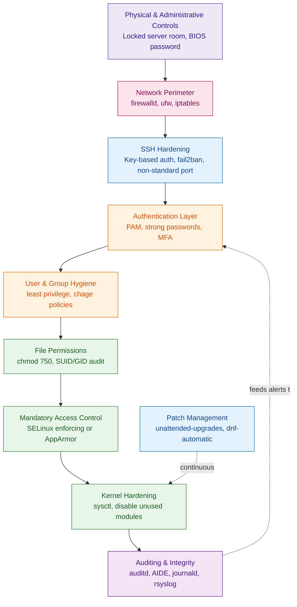
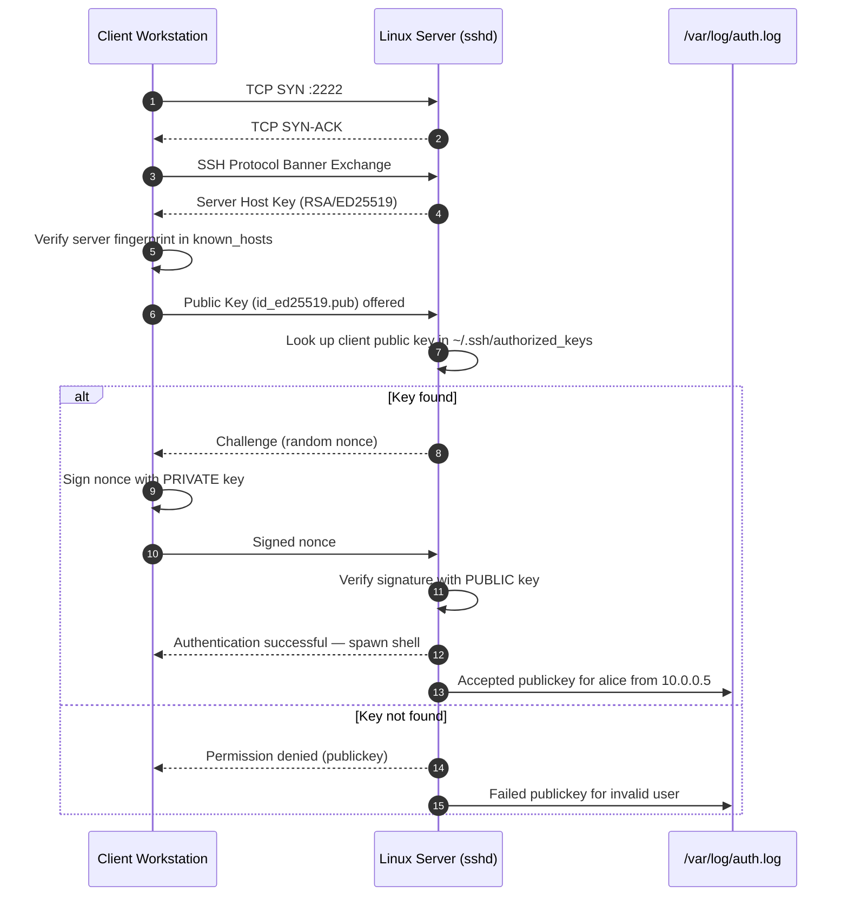
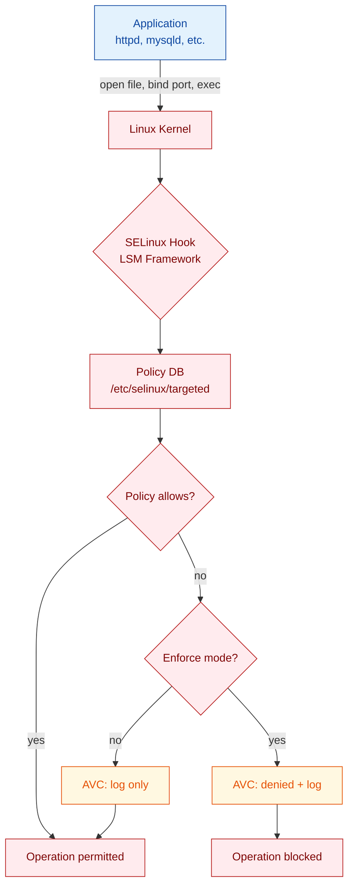
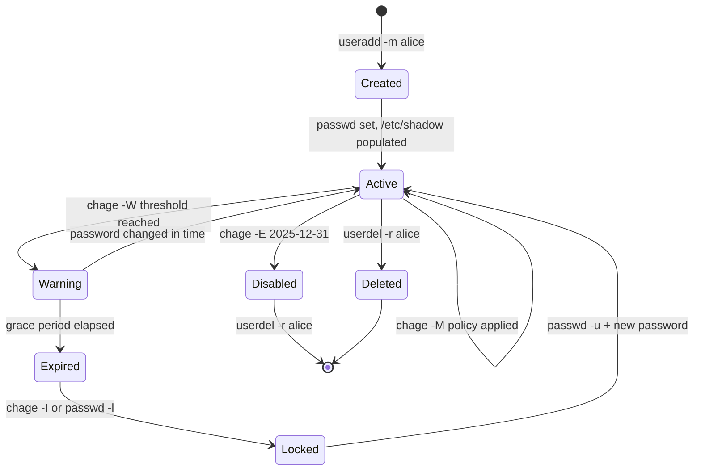

# Operating Linux safely

<!-- SECTION_1_START -->
# Operating Linux Safely

## 1. Core Technical Definition & Intuitive Overview

> [!IMPORTANT]
> **KTU Syllabus Definition (PBCST604 — Module 4: System Security)**
> **Operating Linux Safely** refers to the disciplined set of administrative, kernel-level, user-level, and network-level practices employed to harden a Linux operating system against unauthorized access, privilege escalation, malware, and configuration drift. It encompasses account hygiene, file-system permission models, discretionary/mandatory access control frameworks, process supervision, secure remote administration, and proactive auditing.

### 1.1 Conceptual Analogy — The "Apartment Building" Model

Think of a Linux system as a **high-rise apartment building**:

| Linux Concept | Apartment Analogy | Why It Matters |
|---|---|---|
| **Root user** | Building super-intendent holding the master key | Can enter *every* flat; if compromised, the whole building is at risk |
| **Regular user** | Tenant with key to *one* flat | Limited blast radius if their account is hacked |
| **File permissions (rwx)** | Lock on the door, window, and mailbox | Decides *who* may look, change, or run a file |
| **`sudo`** | Tenant calling the super-intendent for a *specific* repair | Grants *temporary, auditable* elevation instead of handing over the master key |
| **Firewall (iptables/UFW)** | Security guard at the lobby door | Filters incoming and outgoing traffic based on rules |
| **SELinux / AppArmor** | Internal CCTV enforcing which rooms each tenant may enter | *Mandatory* access control — operates *inside* the building regardless of tenant behaviour |
| **SSH keys** | Biometric fingerprint at the entrance | Stronger than typed passwords; resistant to brute force |
| **Audit logs (`auditd`, `journald`)** | CCTV footage in the security office | Forensic record of *who did what and when* |

> [!NOTE]
> **Operational Security (OpSec) Principle in Linux:** *Least Privilege* — every user, process, and daemon should operate with the **minimum permissions necessary** to perform its task, and **nothing more**.

### 1.2 Why "Safe Operation" Is a Multi-Layer Discipline

Linux itself is not "secure by default" out-of-the-box. A fresh installation ships with:

- A **root account** that has unrestricted power.
- **World-readable** configuration files that may leak hostnames, user lists, and software versions.
- **Open network ports** (SSH 22, HTTP 80, etc.) that are immediate targets.
- Services (`cups`, `avahi`, `rpcbind`) that are often enabled but never used — increasing the **attack surface**.

> [!VISUALIZATION CONTROL]
> **Concept:** Layered Defense-in-Depth (Onion Model) for Linux
> **GeoGebra / Desmos Input Equations:** Not applicable (conceptual layers)
> **Visual Description:** Imagine concentric rings — the innermost circle is the *Kernel & Hardware*; surrounding it are *Mandatory Access Control* (SELinux), then *Discretionary Permissions* (chmod/chown), then *User Authentication* (PAM, SSH keys), then *Network Filtering* (firewall), and finally *Physical/Administrative Controls*. An attacker must breach **every layer** to compromise the system.

### 1.3 Core Constants & Standards in Linux Security

- **Standard permission set:** `r=4, w=2, x=1` (octal).
- **Reserved UID range:** `0` = root, `1–999` = system/daemon accounts, **`1000+` = human users** (most distros).
- **Sensitive files:** `/etc/passwd`, `/etc/shadow`, `/etc/sudoers`, `/etc/ssh/sshd_config`.
- **Default secure shell port:** **`22/TCP`** (commonly changed in production).
- **CIS Benchmarks** for Linux (Center for Internet Security) — the industry-standard hardening checklist.

---

<!-- SECTION_1_END -->

<!-- SECTION_2_START -->
# 2. Deep Theoretical Analysis & KTU High-Yield Formula Sheet

## 2.1 The Linux Security Stack — Layer-by-Layer Breakdown

### Layer 1 — User & Group Management
Linux implements **Discretionary Access Control (DAC)** through three entities:
- **User (UID)** — single owner.
- **Group (GID)** — collection of users sharing access.
- **Others** — everyone else on the system.

### Layer 2 — File Permission Triad
Every file has **three permission triples** for `user | group | others`, each triple containing `r` (read), `w` (write), `x` (execute).

### Layer 3 — Special Permission Bits
- **Setuid (`u+s`)** — file executes with the *owner's* privileges (e.g., `/usr/bin/passwd` runs as root to update `/etc/shadow`).
- **Setgid (`g+s`)** — file runs with the *group's* privileges; on a directory, new files inherit the group.
- **Sticky bit (`+t`)** — on a directory (e.g., `/tmp`), only the file's owner can delete/rename it, even if others have write access.

### Layer 4 — Privilege Escalation Mechanisms
- `su -` — switch user (requires *target* user's password).
- `sudo` — execute a single command as another user (requires *current* user's password, governed by `/etc/sudoers`).
- **Polkit** — graphical privilege prompts for desktop services.

### Layer 5 — Mandatory Access Control (MAC)
- **SELinux** (Security-Enhanced Linux, NSA-origin, used in RHEL/Fedora/CentOS).
- **AppArmor** (path-based, used in Ubuntu/Debian/SUSE).

### Layer 6 — Network Hardening
- `iptables` / `nftables` — kernel-level packet filters.
- `ufw` (Uncomplicated Firewall) — friendly front-end for `iptables` (Ubuntu).
- `firewalld` — zone-based daemon (RHEL family).
- `tcp_wrappers` — legacy host-based ACL via `/etc/hosts.allow` & `/etc/hosts.deny`.

### Layer 7 — Auditing & Integrity
- `auditd` — Linux Audit Daemon (rule-based syscall monitoring).
- `AIDE` / `Tripwire` — file-integrity checkers (detect tampering).
- `journald` & `rsyslog` — centralized logging.
- `fail2ban` — auto-bans IPs after repeated failed logins.

### Layer 8 — Remote Access Hygiene
- Disable **password authentication** for SSH; use **public-key cryptography** instead.
- Disable **root login over SSH** (`PermitRootLogin no`).
- Change the default **port 22** to a high non-standard port.
- Use **fail2ban** + **Port Knocking** for SSH brute-force mitigation.

---

## 2.2 KTU Formula Sheet / Cheat Sheet

> [!NOTE]
> **Octal Permission Arithmetic:** Each permission bit has a value: `r=4, w=2, x=1`. The total for a class is the **sum** of the bits set. The full mode is the concatenation `(user)(group)(others)`.

| Symbolic | Octal | Meaning | Typical Use |
|---|---|---|---|
| `rwx rwx rwx` | `777` | All permissions, all classes | ⚠️ Never use on regular files |
| `rwx r-x r-x` | `755` | Owner full, others read+execute | Binaries, scripts, directories |
| `rw- r-- r--` | `644` | Owner read+write, others read-only | Configuration files, documents |
| `rw- --- ---` | `600` | Owner read+write, no one else | SSH private keys, sensitive data |
| `rwx ------` | `700` | Owner full, others nothing | Home directories, executable scripts |
| `r-- r-- r--` | `444` | Read-only for everyone | Immutable system files |

| Special Bit | Octal Prefix | Effect on File | Effect on Directory |
|---|---|---|---|
| **Setuid** | `4xxx` | Executes as file owner | (no effect) |
| **Setgid** | `2xxx` | Executes as file group | New files inherit group |
| **Sticky** | `1xxx` | (no effect) | Only owner can delete files |

| Security Tool | Purpose | Key Command |
|---|---|---|
| `chmod` | Change permission bits | `chmod 750 file` |
| `chown` | Change owner | `chown user:group file` |
| `umask` | Default permission mask | `umask 027` |
| `passwd` | Set/change password | `passwd alice` |
| `chage` | Password aging policy | `chage -M 90 alice` |
| `useradd` | Create user | `useradd -m -s /bin/bash bob` |
| `usermod` | Modify user | `usermod -aG sudo alice` |
| `sudo` | Elevated execution | `sudo systemctl restart ssh` |
| `visudo` | Safely edit sudoers | `visudo` |
| `getfacl` / `setfacl` | POSIX ACLs | `setfacl -m u:bob:r file` |
| `ufw` | Ubuntu firewall | `ufw allow 2222/tcp` |
| `firewalld` | RHEL firewall | `firewall-cmd --add-port=22/tcp` |
| `sestatus` | SELinux status | `sestatus` |
| `aa-status` | AppArmor status | `aa-status` |
| `auditctl` | Audit rules | `auditctl -w /etc/shadow -p wa` |
| `ssh-keygen` | Generate keypair | `ssh-keygen -t ed25519` |
| `fail2ban-client` | Manage fail2ban | `fail2ban-client status sshd` |
| `aide` | Integrity check | `aide --check` |
| `lynis` | Security auditor | `lynis audit system` |

### 2.3 Real-World Engineering Utility

> [!IMPORTANT]
> **Why this matters in production:**
> - **Cloud & DevOps:** Every AWS/GCP/Azure Linux VM is shipped with default credentials and open ports. A single misconfigured `chmod 777` on a key file has caused real-world breaches (e.g., the 2018 Tesla cryptojacking incident on an exposed Kubernetes dashboard).
> - **Containers & Kubernetes:** Pods run as `root` by default; the entire industry has shifted to *rootless containers* and *read-only file systems* — both directly rooted in Linux DAC/MAC concepts.
> - **Compliance:** PCI-DSS, HIPAA, and ISO-27001 all mandate *audit logging*, *least privilege*, and *secure remote access* — precisely the pillars of safe Linux operation.
> - **CTF & Penetration Testing:** Linux privilege-escalation challenges (SUID binaries, weak `sudo` rules, cron jobs, kernel exploits) form the backbone of OSCP-style exams.

---

<!-- SECTION_2_END -->

<!-- SECTION_3_START -->
# 3. Step-by-Step Derivations, Configurations & Code Implementation

## 3.1 Implementing the Principle of Least Privilege (User & Group Hardening)

### 3.1.1 Create a Non-Root User with a Home Directory

```bash
# Step 1: Create the user 'sysadmin' with a home directory and bash shell
sudo useradd -m -s /bin/bash sysadmin

# Step 2: Set a strong password (interactive prompt)
sudo passwd sysadmin

# Step 3: Verify the user was created and inspect UID/GID
id sysadmin
# Expected output:
# uid=1001(sysadmin) uid=1001(sysadmin) gid=1001(sysadmin) groups=1001(sysadmin)
```

**Explanation of each flag:**
- `-m` → creates `/home/sysadmin` automatically.
- `-s /bin/bash` → assigns bash as the default login shell.
- `id` shows the assigned **UID** (should be ≥ 1000 for a human user) and primary **GID**.

### 3.1.2 Grant Sudo Privileges Selectively (NOT Unrestricted)

```bash
# Add sysadmin to the 'sudo' (Debian/Ubuntu) or 'wheel' (RHEL) group
sudo usermod -aG sudo sysadmin        # Debian/Ubuntu
sudo usermod -aG wheel sysadmin       # RHEL/CentOS/Fedora

# Verify the group membership
getent group sudo
# Expected: sudo:x:27:sysadmin
```

> [!WARNING]
> **Always use `usermod -aG`** (append). Omitting `-a` **removes** the user from all other groups — a classic catastrophic mistake that locks the user out of `sudo` itself!

### 3.1.3 Edit `/etc/sudoers` Safely with `visudo`

```bash
sudo visudo
```

Inside the editor, append a **least-privilege** rule for `sysadmin`:

```text
# Allow sysadmin to restart ONLY the SSH service — nothing else
sysadmin ALL=(root) /usr/bin/systemctl restart sshd

# Allow sysadmin to read logs but not modify them
sysadmin ALL=(root) /usr/bin/journalctl * ARG, /usr/bin/less /var/log/*
```

`visudo` performs **syntax validation** on save; if your file is broken, it refuses to overwrite, protecting you from being locked out.

### 3.1.4 Enforce Password Aging Policy with `chage`

```bash
# Force password change every 90 days, with a 7-day warning
sudo chage -M 90 -W 7 -d 0 sysadmin

# Inspect the aging policy
sudo chage -l sysadmin
```

| `chage` Flag | Meaning |
|---|---|
| `-M` | Maximum days between password changes |
| `-W` | Warning days before expiry |
| `-d 0` | Force password change on next login |
| `-I` | Inactive days after expiry before account locks |
| `-E` | Account expiration date (YYYY-MM-DD) |

---

## 3.2 File Permission Derivation — Octal Mode Calculation

### Worked Example
You want a file `payroll.csv` to be:
- Read+write by owner (`alice`).
- Read-only by group (`finance`).
- No access for others.

**Step 1 — Identify the permission bits per class**

$$\text{Owner: } r=4,\ w=2,\ x=0 \implies 4+2+0 = 6$$

$$\text{Group: } r=4,\ w=0,\ x=0 \implies 4+0+0 = 4$$

$$\text{Others: } r=0,\ w=0,\ x=0 \implies 0+0+0 = 0$$

**Step 2 — Concatenate into the octal mode**

$$\text{mode} = \text{Owner} \mid \text{Group} \mid \text{Others} = 640$$

**Step 3 — Apply with `chmod`**

```bash
chmod 640 payroll.csv
chown alice:finance payroll.csv

# Verify
ls -l payroll.csv
# Expected: -rw-r----- 1 alice finance 2048 Jan 15 10:00 payroll.csv
```

**Step 4 — Symbolic alternative (same effect)**

```bash
chmod u=rw,g=r,o= payroll.csv
```

### Special Bits Worked Example
Create a shared project directory `/opt/teamwork` where:
- The group `devs` owns it.
- New files inherit the group automatically (**setgid**).
- Only the file's owner can delete it (**sticky**).

$$\text{Base: } rwx=7 \text{ for owner \& group, } r-x=5 \text{ for others}$$

$$\text{Setgid} = 2 \text{ (prefix)}, \quad \text{Sticky} = 1 \text{ (prefix)}$$

$$\text{Final mode} = 2{,}775$$

```bash
sudo mkdir /opt/teamwork
sudo chown root:devs /opt/teamwork
sudo chmod 2775 /opt/teamwork
sudo chmod +t /opt/teamwork                # add sticky bit (1775 + 2000 = 2775)

# Verify with a 's' in group position and 'T' in others
ls -ld /opt/teamwork
# Expected: drwxrwsr-t 2 root devs 4096 Jan 15 10:00 /opt/teamwork
```

### The `umask` Derivation

The **user file-creation mask** removes bits from the default `0666` (files) or `0777` (dirs):

$$\text{Default file mode} = 0666$$

$$\text{Actual file mode} = 0666 \ \text{AND NOT}\ \text{umask}$$

**Example:** `umask 027`

$$\text{Result} = 0666 \ \text{AND NOT}\ 0027 = 0640 \quad (\text{owner rw, group r, others none})$$

```bash
umask                         # show current mask
umask 027                     # set session mask
echo "umask 027" >> ~/.bashrc # persist for the user
```

---

## 3.3 Secure SSH Configuration — Code/Symbolic Implementation

### 3.3.1 Generate an Ed25519 Keypair (Client-Side)

```bash
ssh-keygen -t ed25519 -C "alice@workstation" -f ~/.ssh/id_ed25519
# Prompts for a passphrase — ALWAYS set one for production
```

This produces:
- `~/.ssh/id_ed25519` — **private key** (mode `600`, *never* share).
- `~/.ssh/id_ed25519.pub` — **public key** (safe to distribute).

### 3.3.2 Install the Public Key on the Server

```bash
# Method A: ssh-copy-id (preferred)
ssh-copy-id -i ~/.ssh/id_ed25519.pub alice@server.example.com

# Method B: manual (if ssh-copy-id unavailable)
cat ~/.ssh/id_ed25519.pub | ssh alice@server.example.com \
  "mkdir -p ~/.ssh && chmod 700 ~/.ssh && \
   echo >> ~/.ssh/authorized_keys && chmod 600 ~/.ssh/authorized_keys"
```

### 3.3.3 Harden the SSH Daemon (Server-Side `/etc/ssh/sshd_config`)

```text
# --- /etc/ssh/sshd_config hardening baseline ---

# 1. Disable direct root login
PermitRootLogin no

# 2. Disable password authentication (key-only)
PasswordAuthentication no
PubkeyAuthentication yes

# 3. Disable empty passwords
PermitEmptyPasswords no

# 4. Restrict to protocol 2 (default in modern OpenSSH)
Protocol 2

# 5. Limit authentication attempts
MaxAuthTries 3
LoginGraceTime 30

# 6. Change the listening port (security-through-obscurity, but cuts 90% of bot traffic)
Port 2222

# 7. Whitelist users allowed to SSH in
AllowUsers alice sysadmin

# 8. Disable X11 forwarding unless required
X11Forwarding no

# 9. Idle session timeout
ClientAliveInterval 300
ClientAliveCountMax 2
```

```bash
# Validate config syntax
sudo sshd -t

# Reload SSH (NEVER restart blindly — you may lock yourself out!)
sudo systemctl reload sshd
```

### 3.3.4 Configure `fail2ban` for SSH Brute-Force Protection

```bash
sudo apt install fail2ban -y

# Create a local override (NEVER edit jail.conf directly)
sudo cp /etc/fail2ban/jail.conf /etc/fail2ban/jail.local
sudo nano /etc/fail2ban/jail.local
```

```text
[sshd]
enabled  = true
port     = 2222
filter   = sshd
logpath  = /var/log/auth.log
maxretry = 3
findtime = 600
bantime  = 3600
```

```bash
sudo systemctl enable --now fail2ban
sudo fail2ban-client status sshd
# Expected: shows banned IPs, currently failed count
```

---

## 3.4 Firewall Configuration — `ufw` and `firewalld` Implementation

### Ubuntu (UFW)

```bash
# Step 1: Set default policies
sudo ufw default deny incoming
sudo ufw default allow outgoing

# Step 2: Allow SSH on the new custom port
sudo ufw allow 2222/tcp

# Step 3: Enable the firewall
sudo ufw enable

# Step 4: Inspect rules
sudo ufw status verbose
```

### RHEL/Fedora (firewalld)

```bash
# Step 1: Inspect active zone
sudo firewall-cmd --get-active-zones

# Step 2: Permanently allow the custom SSH port
sudo firewall-cmd --permanent --add-port=2222/tcp
sudo firewall-cmd --reload

# Step 3: Remove the default SSH service (port 22) since we changed it
sudo firewall-cmd --permanent --remove-service=ssh
sudo firewall-cmd --reload

# Step 4: List all rules
sudo firewall-cmd --list-all
```

### Raw `iptables` Equivalent (For Conceptual Clarity)

```bash
# Allow established connections
sudo iptables -A INPUT -m state --state ESTABLISHED,RELATED -j ACCEPT

# Allow loopback
sudo iptables -A INPUT -i lo -j ACCEPT

# Drop invalid packets
sudo iptables -A INPUT -m state --state INVALID -j DROP

# Allow SSH on port 2222
sudo iptables -A INPUT -p tcp --dport 2222 -j ACCEPT

# Default policy: drop everything else
sudo iptables -P INPUT DROP
sudo iptables -P FORWARD DROP

# Persist (Debian)
sudo apt install iptables-persistent -y
sudo netfilter-persistent save
```

---

## 3.5 Mandatory Access Control — SELinux Implementation

```bash
# Check SELinux status
sestatus
# Expected: SELinux status: enabled
#           Current mode: enforcing

# Temporarily switch to permissive mode (logs but does not enforce)
sudo setenforce 0

# Permanently change mode in /etc/selinux/config
sudo nano /etc/selinux/config
# Set: SELINUX=enforcing
```

### File-Context Labeling Example

```bash
# A web server cannot read files labeled wrong
ls -Z /var/www/html/
# Expected: system_u:object_r:httpd_sys_content_t:s0 index.html

# Restore default contexts after moving a file
sudo restorecon -Rv /var/www/html/

# Allow a custom port for HTTP (e.g., 8080)
sudo semanage port -a -t http_port_t -p tcp 8080

# View SELinux denial logs
sudo ausearch -m avc -ts recent
```

### Boolean Toggle for Common Scenarios

```bash
# Allow HTTPD to make outbound network connections
sudo setsebool -P httpd_can_network_connect 1

# Allow users to run scripts in their home directories
sudo setsebool -P git_system_use_cifs 1
```

---

## 3.6 Auditing with `auditd`

```bash
sudo apt install auditd -y
sudo systemctl enable --now auditd

# Monitor changes to /etc/shadow
sudo auditctl -w /etc/shadow -p wa -k shadow_changes

# Monitor all sudo invocations
sudo auditctl -w /usr/bin/sudo -p x -k sudo_usage

# Make rules persistent
sudo nano /etc/audit/rules.d/audit.rules
# Add:
# -w /etc/shadow -p wa -k shadow_changes
# -w /usr/bin/sudo -p x -k sudo_usage

# Search audit logs
sudo ausearch -k shadow_changes
```

---

## 3.7 File Integrity Monitoring with AIDE

```bash
sudo apt install aide -y
sudo aideinit
# Generates /var/lib/aide/aide.db.new
sudo mv /var/lib/aide/aide.db.new /var/lib/aide/aide.db

# Run a check
sudo aide --check

# Schedule daily via cron
echo "0 3 * * * root /usr/bin/aide --check | mail -s 'AIDE Report' root@localhost" \
  | sudo tee /etc/cron.d/aide
```

---

## 3.8 Security Auditing with Lynis

```bash
sudo apt install lynis -y
sudo lynis audit system
# Generates /var/log/lynis-report.dat
```

Lynis grades the system with a **hardening index (0–100)** and produces prioritized recommendations.

---

## 3.9 System Update Hygiene — The Foundation

```bash
# Debian/Ubuntu
sudo apt update && sudo apt upgrade -y
sudo apt autoremove -y
sudo unattended-upgrade --dry-run

# RHEL/Fedora
sudo dnf check-update
sudo dnf upgrade -y
```

> [!IMPORTANT]
> **Patch latency is the #1 cause of compromise.** The 2017 Equifax breach exploited a 2-month-old Apache Struts vulnerability (CVE-2017-5638) that had a patch available on the day of disclosure.

---

<!-- SECTION_3_END -->

<!-- SECTION_4_START -->
# 4. Structural Diagrams & Schematics

## 4.1 Linux Defense-in-Depth Architecture (Mermaid)



## 4.2 SSH Public-Key Authentication Flow



## 4.3 `auditd` Rule Evaluation Pipeline

```mermaid
flowchart LR
    classDef kernel fill:#ffebee,stroke:#b71c1c,color:#7f0000
    classDef audit fill:#e1f5fe,stroke:#01579b,color:#0d47a1
    classDef storage fill:#e8f5e9,stroke:#1b5e20,color:#1b5e20
    classDef report fill:#fff8e1,stroke:#f57f17,color:#e65100

    A[Kernel Syscall]:::kernel
    B[Audit Framework<br/>netlink socket]:::audit
    C{Rule Match?}:::audit
    D[Auditd Daemon]:::audit
    E[/var/log/audit/audit.log]:::storage
    F[ausearch / aureport]:::report
    G[SIEM / fail2ban]:::report

    A --> B --> C
    C -- yes --> D --> E
    E --> F
    E --> G
    C -- no --> A
```

## 4.4 SELinux Decision Flow (Reference Monitor)



## 4.5 Linux User Account Lifecycle (State Machine)



---

<!-- SECTION_4_END -->

<!-- SECTION_5_START -->
# 5. KTU 2024 Scheme Examination Question Bank & Topic Recap

## Part A — Short Answer Questions (3 Marks Each)

### Question 1
**[KTU University Exam — July 2023]** | **CO3** | **RBT Level: Understand**

Explain the **Principle of Least Privilege (PoLP)** as applied to user account management in Linux. How is it enforced using `sudo` and the `/etc/sudoers` file?

**Model Answer (Board Key):**

> The Principle of Least Privilege states that **every user and process must operate with the minimum permissions necessary** to accomplish its task, and **no more**.

In Linux, PoLP is enforced by:

1. **Avoiding day-to-day use of the `root` account.** A normal user is created, and elevation is done only when required.
2. **Granular `sudo` rules.** Instead of granting unrestricted `sudo`, the `/etc/sudoers` file lists *exact* commands a user may execute as root.

Example entry:

```text
backup ALL=(root) /usr/bin/rsync, /usr/bin/tar
```

This means user `backup` can run **only** `rsync` and `tar` as root — nothing else. Combined with **password aging (`chage`)**, **account expiration**, and **logging via `auditd`**, this forms the operational backbone of PoLP.

> **[Valuation Key: 1 Mark — Definition | 1 Mark — sudo mechanism | 1 Mark — example/configuration]**

---

### Question 2
**[KTU University Exam — Dec 2022]** | **CO3** | **RBT Level: Remember**

List and briefly explain any **three special permission bits** in the Linux file system.

**Model Answer (Board Key):**

1. **Setuid (Set User ID) — `u+s` (octal `4xxx`)** — When set on an executable, the program runs with the **owner's** privileges. Example: `/usr/bin/passwd` runs as `root` so it can write to `/etc/shadow`.

2. **Setgid (Set Group ID) — `g+s` (octal `2xxx`)** — On a directory, **newly created files inherit the group** of the parent directory, ensuring consistent group ownership in shared workspaces.

3. **Sticky Bit — `+t` (octal `1xxx`)** — On a directory like `/tmp`, only the **file's owner (or root)** can delete or rename files, even though others have write permission to the directory.

> **[Valuation Key: 1 Mark per bit — name + effect]**

---

## Part B — Long Answer Questions (14 Marks Each — Internal Choice)

### Question A (Choice 1)
**[KTU University Exam — July 2024]** | **CO3** | **RBT Level: Apply / Analyze**

**(a)** Explain the Linux file permission model with the **three permission classes** and **three permission bits**. Derive the octal representation for a file with permissions `rwxr-x---` and explain the corresponding `chmod` command. **(7 Marks)**

**(b)** Discuss the significance of the **Setuid**, **Setgid**, and **Sticky bit**. Give one real-world example for each and explain the security risks associated with world-writable Setuid binaries. **(7 Marks)**

---

#### Part (a) — Model Solution

**Step 1 — Permission Classes**
- **User (u)** — the file's owner.
- **Group (g)** — the file's owning group.
- **Others (o)** — everyone else on the system.

**Step 2 — Permission Bits**
- **r (read = 4)** — view file contents / list directory.
- **w (write = 2)** — modify file / add-remove files in directory.
- **x (execute = 1)** — run file as program / `cd` into directory.

**Step 3 — Octal Derivation of `rwxr-x---`**

$$\text{User: } r=4 + w=2 + x=1 = 7$$

$$\text{Group: } r=4 + x=1 = 5$$

$$\text{Others: } 0$$

$$\boxed{\text{Octal mode} = 750}$$

**Step 4 — `chmod` Command**

```bash
chmod 750 myscript.sh
chown alice:developers myscript.sh
```

Verification:

```bash
ls -l myscript.sh
# -rwxr-x--- 1 alice developers 2048 Jan 15 10:00 myscript.sh
```

> **[Valuation Key: 2 Marks — Classes & bits | 3 Marks — Octal derivation | 2 Marks — chmod syntax & verification]**

---

#### Part (b) — Model Solution

**Setuid (`u+s`, octal `4xxx`)**
- The program runs with the **owner's** effective UID.
- **Example:** `/usr/bin/passwd` is owned by root with the setuid bit; it must update `/etc/shadow`, which is readable only by root.
- **Command:** `chmod u+s /usr/local/bin/custom_tool`

**Setgid (`g+s`, octal `2xxx`)**
- On an executable: runs with the group's effective GID.
- On a directory: **new files inherit the group**, useful for team folders.
- **Example:** `chmod 2775 /opt/project` ensures all new files belong to the `devs` group.
- **Command:** `chmod g+s /shared/team_folder`

**Sticky Bit (`+t`, octal `1xxx`)**
- On a directory, only the **owner can delete/rename** their own files.
- **Example:** `/tmp` has the sticky bit set so user `bob` cannot delete `alice`'s files even though both can write to `/tmp`.
- **Command:** `chmod +t /var/spool/mail`

**Security Risk — World-Writable Setuid Binaries**

A setuid binary owned by `root` and world-writable is a **catastrophic vulnerability**:

- Any user can **overwrite the binary's code** with a malicious payload.
- On execution by *any* user, the **malicious code runs as root** — instant full system compromise.
- **Detection:** `find / -perm -4000 -perm -o+w -type f` should return *no* results on a hardened system.
- **Mitigation:** Mount `/usr` read-only, enable **SELinux**, regularly audit with tools like **Lynis**.

> **[Valuation Key: 2 Marks — Setuid explanation | 2 Marks — Setgid explanation | 1 Mark — Sticky bit | 2 Marks — Security risk + mitigation]**

---

### Question B (Choice 2)
**[KTU University Exam — Dec 2023]** | **CO3** | **RBT Level: Apply / Analyze**

**(a)** Describe the **steps to harden SSH** on a Linux server. Provide a hardened `/etc/ssh/sshd_config` snippet and justify each directive. **(7 Marks)**

**(b)** Explain the architecture of **SELinux** and its three operating modes. With an example, demonstrate how to troubleshoot a service denied by SELinux using `ausearch` and `restorecon`. **(7 Marks)**

---

#### Part (a) — Model Solution

**Step 1 — Generate and Install Public-Key Authentication**

```bash
# On the client
ssh-keygen -t ed25519 -C "ops@client"

# Push public key to the server
ssh-copy-id -i ~/.ssh/id_ed25519.pub ops@server
```

This eliminates brute-force attacks on passwords entirely.

**Step 2 — Hardened `/etc/ssh/sshd_config`**

```text
Port 2222                          # Non-standard port — avoids 99% of bot scans
PermitRootLogin no                 # Block direct root login over SSH
PasswordAuthentication no          # Force key-based auth only
PubkeyAuthentication yes           # Enable public-key auth
PermitEmptyPasswords no            # Reject blank passwords
MaxAuthTries 3                     # Limit failed attempts
LoginGraceTime 30                  # 30s to complete auth
ClientAliveInterval 300            # Send keepalive every 5 min
ClientAliveCountMax 2              # Disconnect after 2 missed keepalives
X11Forwarding no                   # Disable unless required
AllowUsers ops devops              # Whitelist specific users
AllowGroups ssh-users              # Whitelist groups
Protocol 2                         # Modern SSH protocol only
```

**Justification Table:**

| Directive | Reason |
|---|---|
| `Port 2222` | Reduces automated brute-force traffic on port 22 |
| `PermitRootLogin no` | Forces admin to log in as a normal user, then `sudo` — creates an audit trail |
| `PasswordAuthentication no` | Eliminates password-spray and credential-stuffing attacks |
| `MaxAuthTries 3` | Slows down brute force |
| `AllowUsers` / `AllowGroups` | Whitelist — explicit deny by default |
| `ClientAliveInterval` + `CountMax` | Terminates idle sessions, reduces hijack window |

**Step 3 — Validate, Reload, and Add fail2ban**

```bash
sudo sshd -t                          # Test config syntax
sudo systemctl reload sshd            # Apply without disconnecting
sudo apt install fail2ban -y
sudo systemctl enable --now fail2ban
```

> **[Valuation Key: 2 Marks — Key generation & deployment | 3 Marks — Hardened config | 2 Marks — Justification table]**

---

#### Part (b) — Model Solution

**SELinux Architecture**

SELinux is a **Linux Security Module (LSM)** implemented inside the kernel. It uses a **label-based reference monitor** — every process and file gets a security context, and a policy engine arbitrates access.

$$\text{Context} = \text{user} : \text{role} : \text{type} : \text{level}$$

**Three Operating Modes:**

| Mode | Behavior | Use Case |
|---|---|---|
| `enforcing` | Policy is **actively enforced**; denials block actions and are logged | Production servers |
| `permissive` | Denials are **logged but not blocked** | Troubleshooting, policy development |
| `disabled` | SELinux is turned off entirely | Strongly discouraged; relabeling the entire filesystem is required to re-enable |

**Setting the mode:**

```bash
getenforce                              # Show current mode
sudo setenforce 0                       # Switch to permissive temporarily
sudo nano /etc/selinux/config           # Permanent change
# SELINUX=enforcing
```

**Troubleshooting Workflow — HTTPD Denied Access to `/var/www/custom`**

**Step 1:** Restart the service and capture the failure:

```bash
sudo systemctl restart httpd
# Job for httpd.service failed because the control process exited with error code.
```

**Step 2:** Inspect the AVC (Access Vector Cache) denials:

```bash
sudo ausearch -m avc -ts recent
# type=AVC msg=audit(1700000000.123:45): avc:  denied  { read } for
#   pid=1234 comm="httpd" name="index.html" dev="sda1"
#   scontext=system_u:system_r:httpd_t:s0
#   tcontext=unconfined_u:object_r:default_t:s0 tclass=file
```

**Step 3:** Identify the file-context mismatch — `default_t` instead of `httpd_sys_content_t`.

**Step 4:** Restore the correct context:

```bash
sudo restorecon -Rv /var/www/custom/
ls -Z /var/www/custom/
# system_u:object_r:httpd_sys_content_t:s0 index.html
```

**Step 5:** Restart the service:

```bash
sudo systemctl restart httpd
sudo systemctl status httpd
# Active: active (running)
```

**Step 6 (Alternative):** If the file genuinely needs a non-standard type, declare a custom rule with `semanage fcontext` and `restorecon`:

```bash
sudo semanage fcontext -a -t httpd_sys_content_t '/var/www/custom(/.*)?'
sudo restorecon -Rv /var/www/custom/
```

**Step 7:** Return SELinux to `enforcing`:

```bash
sudo setenforce 1
```

> **[Valuation Key: 2 Marks — Architecture & context format | 2 Marks — Three modes with table | 3 Marks — Step-by-step troubleshooting]**

---

## KTU Examiner's Valuation Warning / Pitfall Callout

> [!WARNING]
> **Common Mark-Deduction Traps in "Operating Linux Safely" Questions:**
> 1. **Forgetting the `-a` flag** in `usermod -aG` — this is the single most common mistake in viva/practical exams. Without `-a`, the user is **removed from all other groups**.
> 2. **Confusing `chmod 4755` syntax** — students write `chmod 4755 file` and forget that `4` is the **setuid prefix**, not part of the standard `rwx` triad.
> 3. **Editing `/etc/sudoers` directly** with `nano`/`vi` — always use `visudo`. A broken sudoers file with no `root` rescue console can lock the examiner out of the VM during practicals.
> 4. **Forgetting to set a passphrase on the SSH private key** — examiners will mark down because an unencrypted key on a stolen laptop = full server compromise.
> 5. **Stating that SELinux is "an antivirus"** — it is a **Mandatory Access Control (MAC)** framework, *not* malware detection. Mixing these up costs easy marks.
> 6. **Skipping the `sudo` reload vs. restart distinction** — `restart` kills the daemon and may disconnect your own SSH session; `reload` is the safe option.

---

## Topic Recap & Important Things to Remember

- **Three permission classes:** `u` (user/owner), `g` (group), `o` (others) — applied left-to-right as `chmod ugo`.
- **Octal values:** `r=4, w=2, x=1` — sum per class; the three sums concatenated form the mode.
- **Standard secure modes:** `755` (binaries), `644` (configs), `600` (private keys), `700` (home dirs), `750` (shared scripts).
- **Special bits prefixes:** `4` = setuid, `2` = setgid, `1` = sticky; combined additively: e.g., `4755` = setuid + `755`.
- **Setuid on root binaries is normal;** world-writable setuid is a critical vulnerability.
- **Sticky bit on `/tmp`** prevents users from deleting each other's files.
- **User creation:** `useradd -m -s /bin/bash <name>` — always with `-m` to create the home directory.
- **Group append:** always `usermod -aG <group> <user>` — the `-a` flag is **non-negotiable**.
- **Sudoers file:** edit with `visudo` only; supports command-level granularity (e.g., `/usr/bin/systemctl restart sshd`).
- **Password aging:** `chage -M 90 -W 7` enforces 90-day rotation with 7-day warning.
- **SSH hardening essentials:** disable root login, disable password auth, use ed25519 keys, change port, install `fail2ban`.
- **Firewall philosophy:** default-deny inbound, default-allow outbound, explicitly allow only required ports (`ufw`, `firewalld`, `iptables`).
- **SELinux = MAC; AppArmor = MAC** — both *complement* DAC, do not replace it. SELinux uses type enforcement; AppArmor uses path-based profiles.
- **SELinux modes:** `enforcing` (block + log), `permissive` (log only), `disabled` (off).
- **Audit + Integrity:** `auditd` watches *events*; `AIDE` watches *file content changes*; `Lynis` performs *whole-system posture scoring*.
- **Patch management** is the foundation — unpatched CVEs beat any access control.
- **Defense-in-depth** means *no single layer* is enough; layers must be independent and complementary.
- **Key compliance touchpoints:** PCI-DSS, HIPAA, ISO-27001, CIS Benchmarks — all require the above hygiene.

---

<!-- SECTION_5_END -->
