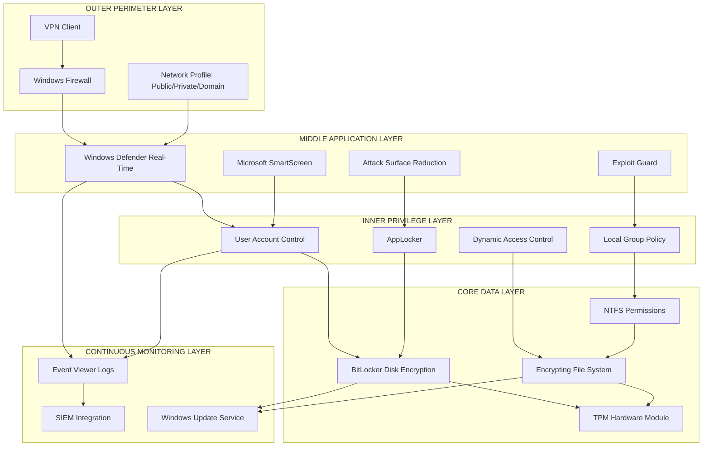
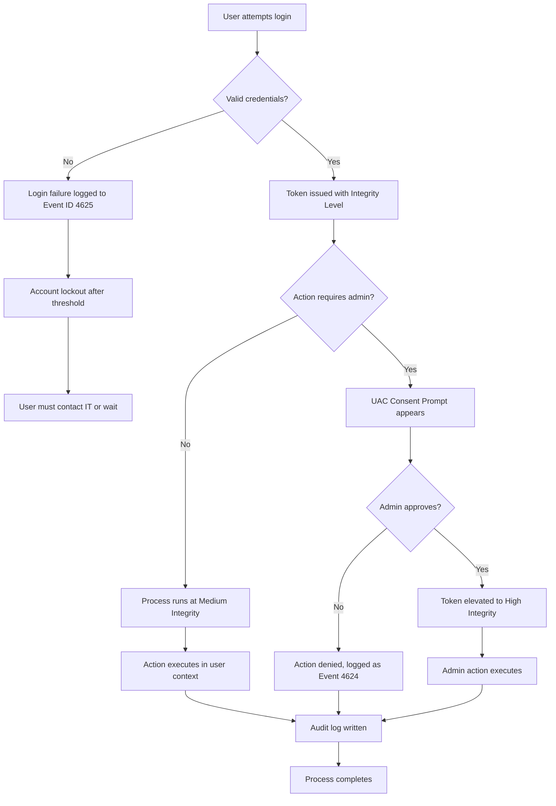
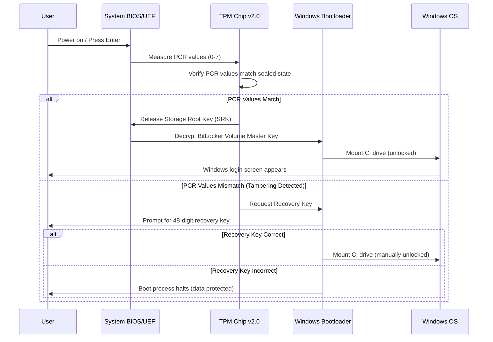
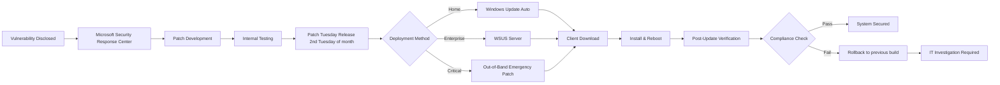
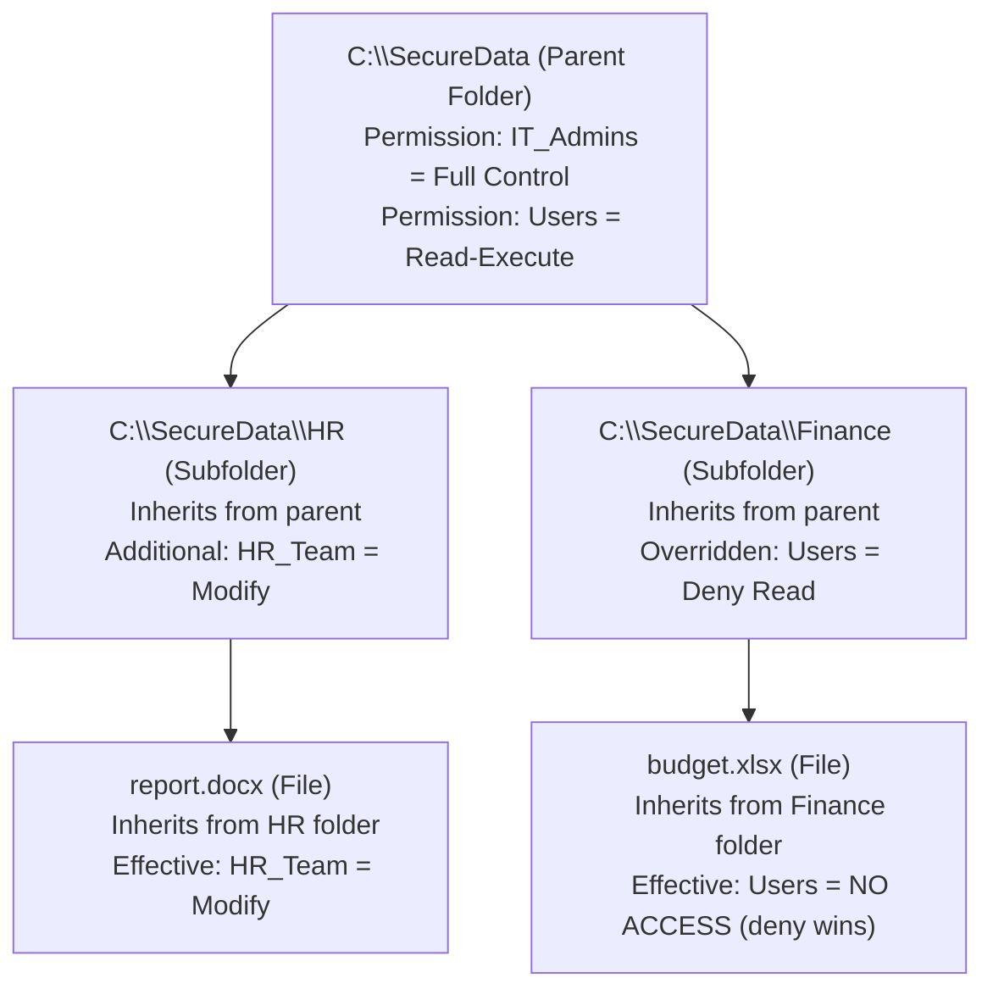

# Operating Windows safely

<!-- SECTION_1_START -->

# Operating Windows Safely: Core Technical Definition & Intuitive Overview

## Formal Academic Definition (KTU 2024 Syllabus Terminology)

**Operating Windows Safely** refers to the systematic application of built-in security mechanisms, configuration best practices, and procedural safeguards within the Microsoft Windows operating system to mitigate threats, preserve the **CIA Triad** (Confidentiality, Integrity, Availability), and ensure a hardened computing environment against unauthorized access, malware, and exploitation.

> [!IMPORTANT]
> **KTU 2024 Scheme Definition:** Safe operation of Windows encompasses User Account Control (UAC), Windows Defender, Firewall configuration, BitLocker encryption, patch management, Group Policy, and audit logging, forming a defense-in-depth strategy.

## Conceptual Analogy: The Digital Fortress

Imagine your Windows PC as a **medieval fortress**:

| Fortress Element | Windows Security Equivalent | Function |
|---|---|---|
| Outer Walls | **Windows Firewall** | Filters incoming/outgoing network traffic |
| Gate Guards | **User Account Control (UAC)** | Verifies identity before granting privileges |
| Watchtowers | **Windows Defender** | Continuously scans for threats |
| Locked Vaults | **BitLocker / EFS** | Encrypts data at rest |
| Reinforced Doors | **Strong Passwords & MFA** | Authentication barrier |
| Wall Inspections | **Windows Update** | Patches vulnerabilities in the structure |
| Security Logs | **Event Viewer** | Records all access attempts |
| Standing Army | **Group Policy Objects (GPO)** | Enforces security rules enterprise-wide |

> [!NOTE]
> **Core Security Principle:** Defense-in-Depth — never rely on a single security layer. An attacker breaching one defense must still face multiple subsequent barriers.

## The Five Pillars of Windows Safe Operation

1. **Identity Protection** — User accounts, UAC, credentials, Multi-Factor Authentication (MFA)
2. **Software Protection** — Windows Defender, SmartScreen, Exploit Guard
3. **Network Protection** — Windows Firewall, VPN, network profiles
4. **Data Protection** — BitLocker, EFS, file permissions, NTFS
5. **System Integrity** — Secure Boot, TPM, Windows Update, backup

## Physical Constants & Standard Metrics in Windows Security

- **AES-256 bit encryption** — Symmetric key length used by BitLocker
- **SHA-256** — Hash algorithm used for file integrity verification
- **TPM Version 2.0** — Hardware chip required for modern BitLocker operation
- **Default UAC Prompt Level** — 3rd of 4 levels (notify on app changes only)
- **Default Password Policy** — 42-day expiration, complexity enabled (Domain environments)

> [!TIP]
> **Quick Memory Hook:** Always think **"AUNES"** — **A**uthentication, **U**pdates, **N**etwork firewall, **E**ncryption, **S**canning.

<!-- SECTION_1_END -->

<!-- SECTION_2_START -->

# Deep Theoretical Analysis & KTU High-Yield Reference Sheet

## Layer 1: User Account Control (UAC) — Privilege Escalation Gatekeeper

UAC is a **mandatory access control** mechanism that prevents unauthorized elevation of privileges. It works using **integrity levels**:

- **High Integrity** → Administrator processes
- **Medium Integrity** → Standard user processes
- **Low Integrity** → Internet Explorer sandboxed mode

When a standard user attempts an administrative action, the UAC consent prompt appears. The default behavior is **"Notify me only when programs try to make changes to my computer"** (Level 3 of 4).

### UAC Notification Levels

| Level | Trigger | Use Case |
|---|---|---|
| Level 1 (High) | Every app change + UAC prompt on desktop | Maximum security |
| Level 2 (Default) | App changes (no prompt for Windows settings) | Balanced |
| Level 3 | Only program changes (not Windows settings) | Standard home user |
| Level 4 (Never) | No prompts | Insecure — disabled |

> [!WARNING]
> Setting UAC to "Never Notify" (Level 4) effectively disables UAC and exposes the system to silent privilege escalation attacks.

## Layer 2: Windows Defender (Microsoft Defender Antivirus)

The integrated antivirus solution uses:
- **Real-time protection** — Monitors file system, process, and registry changes
- **Cloud-delivered protection** — Microsoft Intelligent Security Graph
- **Behavior monitoring** — Heuristic analysis of suspicious process behavior
- **Tamper protection** — Prevents malware from disabling Defender

### Defender Operational Components

$$
\text{Defender Pipeline} = \text{Antivirus} + \text{Antispyware} + \text{Cloud Protection} + \text{Behavior Monitor} + \text{Network Inspection}
$$

## Layer 3: Windows Firewall

A **stateful host-based firewall** that filters traffic based on:
- Source/Destination IP
- Port numbers
- Protocol (TCP/UDP)
- Active network profile (Domain, Private, Public)

### Network Profile Hierarchy (Most to Least Trusted)

1. **Domain** — Connected to Active Directory domain controller
2. **Private** — Trusted home/office network
3. **Public** — Coffee shops, airports — **most restrictive rules apply**

## Layer 4: BitLocker Drive Encryption

BitLocker uses **AES-128 or AES-256** encryption to protect entire volumes. It requires a **TPM (Trusted Platform Module)** chip to store encryption keys securely.

### BitLocker Key Protectors

| Protector Type | Description | Security Level |
|---|---|---|
| TPM Only | Keys sealed in TPM hardware | High |
| TPM + PIN | User enters PIN at boot | Very High |
| TPM + Startup Key | USB key required | Very High |
| TPM + PIN + Startup Key | Multi-factor | Maximum |
| Password Only | Software-based (no TPM) | Medium |

## Layer 5: Windows Update & Patch Management

Windows Update patches three critical components:
- **Security updates** — Vulnerability patches
- **Critical updates** — Non-security critical fixes
- **Definition updates** — Antivirus signature updates

## KTU High-Yield Cheat Sheet

| Security Control | Default State | Hardened State | Exam Significance |
|---|---|---|---|
| UAC | Enabled (Level 3) | Level 2 or 1 | Privilege escalation |
| Windows Defender | Enabled | Enabled + Cloud | Malware defense |
| Firewall | Enabled (all profiles) | Block all inbound | Network hardening |
| BitLocker | Disabled (most editions) | Enabled (AES-256) | Data at rest |
| Auto Update | Enabled | Enabled + WSUS | Vulnerability mgmt |
| Remote Desktop | Disabled | Disabled (or NLA only) | Lateral movement |
| SMBv1 | Disabled (Win 10+) | Disabled | WannaCry/EternalBlue |
| PowerShell Logging | Limited | ScriptBlock + Module | Forensic analysis |
| LM Hash | Stored | Disabled (NTLM only) | Pass-the-hash attacks |
| Guest Account | Disabled | Disabled | Anonymous access |

## Real-World Engineering Utility

Safe Windows operation is critical in:
- **Enterprise IT Infrastructure** — Preventing ransomware like **WannaCry** (exploited SMBv1)
- **Healthcare Systems** — HIPAA compliance via access controls
- **Financial Systems** — PCI-DSS requirements for encryption
- **Critical Infrastructure** — SCADA/ICS workstations
- **DevOps Pipelines** — Secure build agents

> [!NOTE]
> The **2017 WannaCry attack** infected 230,000+ computers in 150 countries by exploiting SMBv1 — a vulnerability that could have been prevented by disabling legacy protocols and timely patching.

<!-- SECTION_2_END -->

<!-- SECTION_3_START -->

# Step-by-Step Procedures & Code/Symbolic Implementation

## Procedure 1: Hardening Windows via PowerShell (Admin Privileges)

Below is a comprehensive PowerShell script that hardens a Windows 10/11 system. **Every command is shown in full — no truncation.**

```powershell
# =============================================================
# WINDOWS HARDENING SCRIPT - KTU CYBER SECURITY LAB REFERENCE
# Run PowerShell as Administrator
# =============================================================

# --- STEP 1: Verify execution policy and run as admin ---
$currentPrincipal = New-Object Security.Principal.WindowsPrincipal(
    [Security.Principal.WindowsIdentity]::GetCurrent()
)
$isAdmin = $currentPrincipal.IsInRole(
    [Security.Principal.WindowsBuiltInRole]::Administrator
)

if (-not $isAdmin) {
    Write-Error "ERROR: This script requires Administrator privileges."
    exit 1
}

Write-Host "Administrator privileges confirmed." -ForegroundColor Green

# --- STEP 2: Enable and configure User Account Control (UAC) ---
# Set UAC to default level 3 (notify on app changes only)
$uacRegistryPath = "HKLM:\SOFTWARE\Microsoft\Windows\CurrentVersion\Policies\System"
Set-ItemProperty -Path $uacRegistryPath -Name "ConsentPromptBehaviorAdmin" -Value 5 -Type DWord
Set-ItemProperty -Path $uacRegistryPath -Name "PromptOnSecureDesktop" -Value 1 -Type DWord
Set-ItemProperty -Path $uacRegistryPath -Name "EnableLUA" -Value 1 -Type DWord
Write-Host "UAC configured: Level 3 with secure desktop." -ForegroundColor Green

# --- STEP 3: Enable Windows Defender Real-Time Protection ---
Set-MpPreference -DisableRealtimeMonitoring $false
Set-MpPreference -CloudProtectionLevel 2          # High cloud protection
Set-MpPreference -BehaviorMonitoringEnabled $true
Set-MpPreference -PUAProtection 1                 # Block Potentially Unwanted Apps
Set-MpPreference -TamperProtection $true          # Prevent Defender disable
Write-Host "Windows Defender fully configured." -ForegroundColor Green

# --- STEP 4: Configure Windows Firewall (all profiles) ---
$profiles = @("Domain", "Public", "Private")
foreach ($profile in $profiles) {
    Set-NetFirewallProfile -Name $profile -Enabled True
    Set-NetFirewallProfile -Name $profile -DefaultInboundAction Block
    Set-NetFirewallProfile -Name $profile -DefaultOutboundAction Allow
    Set-NetFirewallProfile -Name $profile -LogBlocked True
    Set-NetFirewallProfile -Name $profile -LogMaxSizeKilobytes 4096
}
Write-Host "Windows Firewall hardened on all profiles." -ForegroundColor Green

# --- STEP 5: Disable legacy insecure protocols ---
# Disable SMBv1 (WannaCry / EternalBlue mitigation)
Disable-WindowsOptionalFeature -Online -FeatureName "SMB1Protocol" -NoRestart -ErrorAction SilentlyContinue
Set-SmbServerConfiguration -EnableSMB1Protocol $false -Force

# Disable LM hash storage
$lmPath = "HKLM:\SYSTEM\CurrentControlSet\Control\Lsa"
Set-ItemProperty -Path $lmPath -Name "NoLMHash" -Value 1 -Type DWord
Write-Host "Legacy protocols disabled (SMBv1, LM hashes)." -ForegroundColor Green

# --- STEP 6: Enable PowerShell logging for forensics ---
$psLogPath = "HKLM:\SOFTWARE\Policies\Microsoft\Windows\PowerShell\ScriptBlockLogging"
New-Item -Path $psLogPath -Force | Out-Null
Set-ItemProperty -Path $psLogPath -Name "EnableScriptBlockLogging" -Value 1 -Type DWord

$psModuleLogPath = "HKLM:\SOFTWARE\Policies\Microsoft\Windows\PowerShell\ModuleLogging"
New-Item -Path $psModuleLogPath -Force | Out-Null
Set-ItemProperty -Path $psModuleLogPath -Name "EnableModuleLogging" -Value 1 -Type DWord
Write-Host "PowerShell logging enabled (ScriptBlock + Module)." -ForegroundColor Green

# --- STEP 7: Disable Remote Desktop if not required ---
Set-ItemProperty -Path "HKLM:\System\CurrentControlSet\Control\Terminal Server" `
    -Name "fDenyTSConnections" -Value 1 -Type DWord
Disable-NetFirewallRule -DisplayGroup "Remote Desktop" -ErrorAction SilentlyContinue
Write-Host "Remote Desktop disabled." -ForegroundColor Green

# --- STEP 8: Enable Windows Update auto-update ---
$wuPath = "HKLM:\SOFTWARE\Policies\Microsoft\Windows\WindowsUpdate\AU"
New-Item -Path $wuPath -Force | Out-Null
Set-ItemProperty -Path $wuPath -Name "NoAutoUpdate" -Value 0 -Type DWord
Set-ItemProperty -Path $wuPath -Name "AUOptions" -Value 4 -Type DWord  # Auto-download & schedule
Write-Host "Windows Update configured for auto-install." -ForegroundColor Green

# --- STEP 9: Final verification ---
Write-Host "`n=== HARDENING COMPLETE ===" -ForegroundColor Cyan
Get-MpComputerStatus | Select-Object AntivirusEnabled, RealTimeProtectionEnabled, TamperProtection
Get-NetFirewallProfile | Select-Object Name, Enabled
```

## Procedure 2: Enable BitLocker via Command Line (Step-by-Step)

```powershell
# Step 1: Check TPM availability
Get-Tpm | Select-Object TpmPresent, TpmReady, TpmEnabled

# Step 2: Check if BitLocker is installed (Pro/Enterprise/Education)
Get-WindowsOptionalFeature -Online -FeatureName "BitLocker" -ErrorAction SilentlyContinue

# Step 3: Enable BitLocker on C: drive with TPM + PIN protector
# TPM must be enabled in BIOS first
Enable-BitLocker -MountPoint "C:" -EncryptionMethod Aes256 `
    -UsedSpaceOnly -Pin (Read-Host -AsSecureString "Enter 6-20 digit PIN")

# Step 4: Save recovery key to a safe location (e.g., Azure AD or USB)
# Note: The system prompts automatically; choose save location

# Step 5: Verify BitLocker status
manage-bde -status
```

## Procedure 3: NTFS File Permission Configuration

```powershell
# Grant Read-Execute to a specific user on a folder
$folderPath = "C:\SecureData"
$userName = "DOMAIN\john.doe"
$acl = Get-Acl $folderPath

# Create a new access rule
$permission = "DOMAIN\john.doe", "ReadAndExecute", "ContainerInherit,ObjectInherit", "None", "Allow"
$accessRule = New-Object System.Security.AccessControl.FileSystemAccessRule(
    "DOMAIN\john.doe",
    "ReadAndExecute",
    "ContainerInherit,ObjectInherit",
    "None",
    "Allow"
)

# Apply the access rule
$acl.SetAccessRule($accessRule)
Set-Acl $folderPath $acl

# Verify the change
Get-Acl $folderPath | Format-List
```

## Procedure 4: Enable Multi-Factor Authentication (Microsoft Account)

While not a code script, the procedural flow:

1. **Navigate** → `Settings` → `Accounts` → `Your info`
2. **Click** → `Sign in with a Microsoft account` (if local account)
3. **Visit** → `https://account.microsoft.com/security`
4. **Enable** → Two-step verification
5. **Register** → Authenticator app (preferred over SMS)
6. **Save** → Recovery codes to a secure offline location

> [!IMPORTANT]
> The recovery codes are the **only way** to regain access if the authenticator device is lost. Print and store in a physical safe.

## Conceptual Mathematical Model: Security Risk Assessment

For a Windows system, the **Annual Loss Expectancy (ALE)** formula helps quantify risk:

$$
\text{ALE} = \text{Single Loss Expectancy (SLE)} \times \text{Annual Rate of Occurrence (ARO)}
$$

Where:

$$
\text{SLE} = \text{Asset Value} \times \text{Exposure Factor}
$$

**Example Calculation:**

$$
\text{Asset Value} = \text{₹}5{,}00{,}000
$$

$$
\text{Exposure Factor} = 0.60 \quad \text{(60% data loss in ransomware)}
$$

$$
\text{SLE} = 5{,}00{,}000 \times 0.60 = \text{₹}3{,}00{,}000
$$

$$
\text{ARO} = 0.25 \quad \text{(once every 4 years)}
$$

$$
\text{ALE} = 3{,}00{,}000 \times 0.25 = \text{₹}75{,}000
$$

This justifies spending up to **₹75,000/year** on Windows security controls (Defender for Endpoint, BitLocker management, etc.).

<!-- SECTION_3_END -->

<!-- SECTION_4_START -->

# Structural Diagrams & Schematics

## Diagram 1: Windows Defense-in-Depth Security Architecture



## Diagram 2: User Login & UAC Privilege Escalation Flow



## Diagram 3: BitLocker Boot-Time Authentication Sequence



## Diagram 4: Windows Update Security Patch Lifecycle



## Diagram 5: NTFS Permission Inheritance Model



> [!TIP]
> **Rule of Precedence in NTFS:** Explicit Deny > Explicit Allow > Inherited Allow. This is a frequent KTU exam point.

<!-- SECTION_4_END -->

<!-- SECTION_5_START -->

# KTU 2024 Scheme Examination Question Bank & Topic Recap

## Part A Questions (3 Marks Each)

### Question 1 `[KTU University Exam - July 2023, Model Paper]`
**Define User Account Control (UAC). Explain its role in Windows security. (CO1, Remember)**

**Model Answer (3 Marks):**
- **Definition [1 Mark]:** User Account Control (UAC) is a mandatory access control feature in Windows that prevents unauthorized changes to the operating system by requiring administrative privilege confirmation for actions that could affect system stability or security.
- **Role in Security [2 Marks]:** UAC enforces the principle of least privilege by running applications in non-administrator mode by default. It uses integrity levels (Low, Medium, High, System) to isolate processes. When elevation is required, a consent prompt appears on the secure desktop, preventing silent privilege escalation by malware.

---

### Question 2 `[KTU University Exam - Dec 2022, Model Paper]`
**List any three security features of Windows 10/11 that help in protecting user data. (CO1, Understand)**

**Model Answer (3 Marks):**
1. **BitLocker Drive Encryption [1 Mark]** — Provides full-disk AES-256 encryption to protect data at rest, integrated with TPM for hardware key protection.
2. **Windows Defender Antivirus [1 Mark]** — Built-in real-time malware protection with cloud-delivered intelligence and behavior monitoring.
3. **Windows Firewall [1 Mark]** — Stateful host-based firewall filtering inbound/outbound traffic across Domain, Private, and Public network profiles.

---

## Part B Questions (14 Marks Each) — Internal Choice

### Question A `[KTU University Exam - June 2024, Model Paper]`
**(a)** Explain the **architecture of Windows Firewall** with its three network profiles. Describe inbound and outbound filtering rules. **[7 Marks]** (CO2, Understand)

**(b)** With a neat diagram, explain the **BitLocker encryption process**. List the different key protectors available in BitLocker. **[7 Marks]** (CO2, Apply)

---

#### Model Solution (a): Windows Firewall Architecture [7 Marks]

**Introduction [1 Mark]:** Windows Firewall is a stateful host-based firewall integrated into the Windows OS, controlling traffic at the network layer using predefined and custom rules.

**Architecture Components [2 Marks]:**
- **Network Layer Filter** — Intercepts packets at the NDIS (Network Driver Interface Specification) level
- **Application Layer Enforcement** — Filters per-application traffic
- **WFP (Windows Filtering Platform)** — API that allows third-party integration

**Three Network Profiles [2 Marks]:**
- **Domain Profile** — Applied when connected to a corporate Active Directory domain. Trust level: High.
- **Private Profile** — Applied on trusted home/office networks. Trust level: Medium-High.
- **Public Profile** — Applied on untrusted networks (Wi-Fi hotspots, cafes). Trust level: Low. All inbound connections blocked by default.

**Inbound vs Outbound Filtering [1 Mark]:**
- **Inbound Filtering** — Default = Block. Only explicitly allowed apps can receive connections.
- **Outbound Filtering** — Default = Allow (in Windows 7+). Restrictive outbound rules can be configured.

**Rules Hierarchy [1 Mark]:** Block rules > Allow rules > Default policy. Rules are processed in order of priority (lower number = higher priority).

**Key Valuation Points:**
- [Stating three profiles with one-line description: 2 Marks]
- [Explaining inbound/outbound default behavior: 1 Mark]
- [Mentioning WFP architecture: 1 Mark]

---

#### Model Solution (b): BitLocker Encryption Process [7 Marks]

**Diagram [2 Marks]:**
```
+----------+      +-----------+      +-------------+      +------------+
|   TPM    | <--> |   BIOS    | <--> | BitLocker   | <--> | Encrypted  |
|  Chip    |      |  / UEFI   |      | Boot Loader |      |  Volume    |
+----------+      +-----------+      +-------------+      +------------+
       |                                                       ^
       +-- Seals Storage Root Key (SRK)                        |
       |                                                       |
       +-- Verifies Platform Configuration Registers (PCRs) ---+
```

**Encryption Process Steps [3 Marks]:**
1. **Platform Validation** — TPM measures boot components and stores hashes in PCRs (0-7).
2. **Key Sealing** — The Storage Root Key (SRK) is sealed inside the TPM and released only if PCR values match the sealed state.
3. **VMK Decryption** — Volume Master Key (VMK) is decrypted using SRK.
4. **FVEK Decryption** — Full Volume Encryption Key (FVEK) is decrypted using VMK.
5. **Volume Access** — The encrypted volume is unlocked transparently for the user.

**Key Protectors List [2 Marks]:**
- TPM Only
- TPM + PIN
- TPM + Startup Key (USB)
- TPM + PIN + Startup Key
- Password (Software-based, no TPM)
- Recovery Password / Recovery Key

**Key Valuation Points:**
- [Neat diagram with 4 blocks: 2 Marks]
- [At least 4 protectors listed: 2 Marks]
- [Mentioning AES-256 encryption: 1 Mark]

---

### Question B `[KTU University Exam - Dec 2023, Model Paper]` (Alternative Choice)

**(a)** What is **defense-in-depth**? Describe the five layers of Windows security that implement this strategy. **[7 Marks]** (CO2, Understand)

**(b)** Explain the **Windows Update process** and discuss the security risks of not applying timely patches. Cite one real-world example. **[7 Marks]** (CO2, Apply)

---

#### Model Solution (a): Defense-in-Depth [7 Marks]

**Definition [1 Mark]:** Defense-in-Depth is a security strategy that employs multiple, overlapping layers of controls so that if one layer fails, subsequent layers continue to provide protection.

**Five Layers [2 Marks Each = 6 Marks]:**
1. **Perimeter Layer** — Windows Firewall, VPN, network profile segmentation
2. **Network Layer** — SMB hardening, RDP restrictions, Wi-Fi security (WPA3)
3. **Host Layer** — Windows Defender, UAC, Exploit Guard
4. **Application Layer** — AppLocker, SmartScreen, controlled folder access
5. **Data Layer** — BitLocker, EFS, NTFS permissions, TPM

---

#### Model Solution (b): Windows Update Process & Patch Risks [7 Marks]

**Windows Update Process [3 Marks]:**
1. Microsoft releases patches on **"Patch Tuesday"** (2nd Tuesday of every month)
2. **Detection** — Windows Update Agent (WUA) contacts Microsoft Update servers
3. **Download** — Patches downloaded to `C:\Windows\SoftwareDistribution`
4. **Installation** — Patches installed during maintenance window
5. **Reboot** — Most security patches require system restart
6. **Verification** — Update history logged in `Settings → Update & Security`

**Security Risks of Not Patching [2 Marks]:**
- Zero-day exploitation
- Ransomware infection (e.g., SMBv1 → WannaCry)
- Data exfiltration
- Compliance violations (PCI-DSS, HIPAA)

**Real-World Example [2 Marks]:**
The **WannaCry ransomware attack (May 2017)** exploited **EternalBlue** vulnerability (MS17-010) in SMBv1. Microsoft had released the patch in **March 2017** (2 months prior), but unpatched systems in 150 countries were infected, causing damages exceeding **$4 billion**. NHS hospitals, FedEx, and Telefónica were major victims. Disabling SMBv1 and timely patching would have prevented 99% of infections.

---

## KTU Examiner's Valuation Warning / Pitfall Callout

> [!WARNING]
> **Common Mistakes Students Make (Lose 1-2 Marks Each):**
> 1. **Confusing UAC with Firewall** — UAC is *privilege management*, not network filtering.
> 2. **Forgetting TPM requirement** — BitLocker requires TPM 1.2 minimum, 2.0 recommended.
> 3. **Wrong AES key length** — Always mention **AES-256** in BitLocker, not 128, unless specified.
> 4. **Missing network profile names** — Must write **Domain, Private, Public** in correct order.
> 5. **No diagram in BitLocker question** — A flowchart showing TPM → BIOS → Volume is mandatory for 2 marks.
> 6. **Skipping Patch Tuesday date** — Examiners expect "2nd Tuesday of every month" mention.
> 7. **Forgetting Recovery Key** — BitLocker requires saving the **48-digit recovery key**; examiners deduct marks if omitted.

---

## Topic Recap & Important Things to Remember

### Quick Revision Checklist

- **UAC** = Privilege gatekeeper. Integrity levels: Low, Medium, High, System. Default Level 3.
- **Windows Defender** = Real-time antivirus + cloud + behavior monitoring. Enable Tamper Protection.
- **Windows Firewall** = Stateful, 3 profiles (Domain → Private → Public in order of trust). Default inbound = Block.
- **BitLocker** = Full-disk AES-256 encryption. Requires TPM. 5 key protectors.
- **EFS** = File-level encryption (different from BitLocker). Uses user certificates.
- **Windows Update** = "Patch Tuesday" = 2nd Tuesday monthly. Critical for vulnerability management.
- **Defense-in-Depth** = 5 layers: Perimeter, Network, Host, Application, Data.
- **SMBv1** = Must be disabled (WannaCry mitigation).
- **LM Hash** = Must be disabled; use NTLM/NTLMv2 only.
- **NTFS Permissions** = Explicit Deny > Explicit Allow > Inherited Allow.
- **Group Policy (gpedit.msc)** = Enterprise security configuration tool.
- **Event Viewer** = Logs security events. Event 4624 = successful login, 4625 = failed login.
- **TPM** = Hardware chip for cryptographic key storage. Version 2.0 modern standard.
- **Remote Desktop** = Disable if not needed; otherwise enable Network Level Authentication (NLA).
- **PowerShell Logging** = Enable ScriptBlock + Module logging for forensic analysis.

### Critical Acronyms for Exam

- **CIA** = Confidentiality, Integrity, Availability
- **UAC** = User Account Control
- **TPM** = Trusted Platform Module
- **AES** = Advanced Encryption Standard
- **EFS** = Encrypting File System
- **NLA** = Network Level Authentication
- **GPO** = Group Policy Object
- **SMB** = Server Message Block
- **WFP** = Windows Filtering Platform
- **PCR** = Platform Configuration Register
- **ALE/SLE/ARO** = Risk quantification formulas

### One-Line Exam Punchlines

> - "UAC enforces **least privilege** using **integrity levels**."
> - "BitLocker uses **AES-256** encryption sealed by **TPM**."
> - "Windows Firewall default policy: **Block all inbound**, **Allow all outbound**."
> - "Patch Tuesday falls on the **2nd Tuesday** of every month."
> - "SMBv1 is the **WannaCry attack vector** — disable it always."
> - "Defense-in-Depth uses **multiple overlapping layers** of security."

<!-- SECTION_5_END -->
