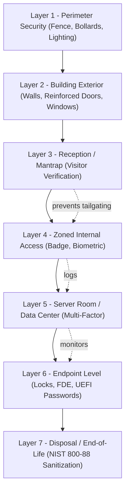
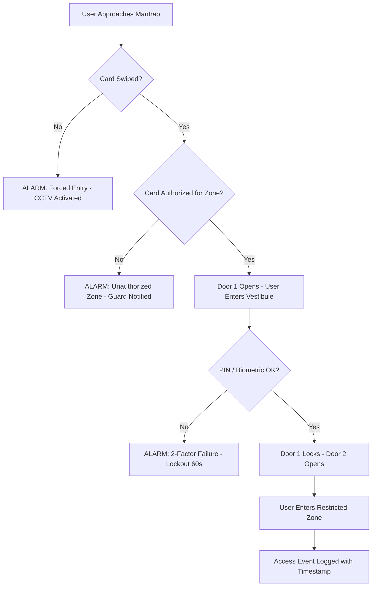
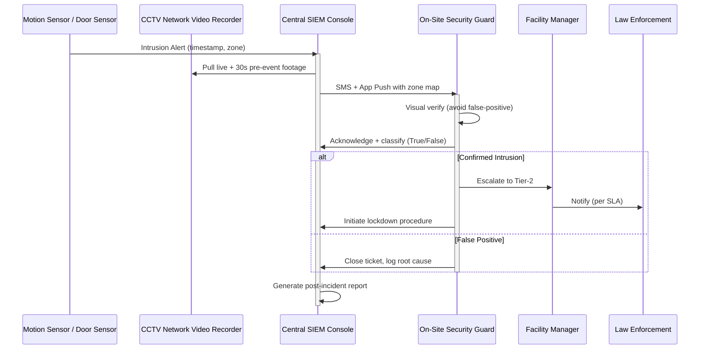
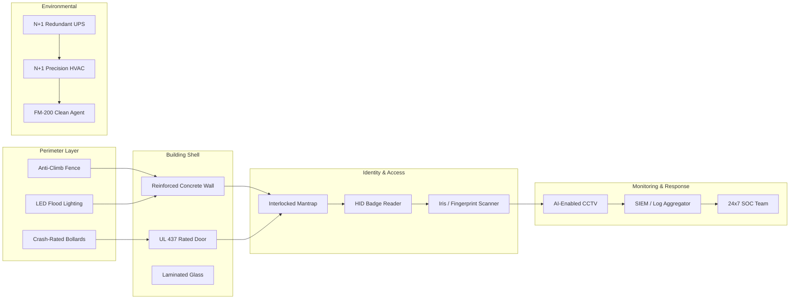
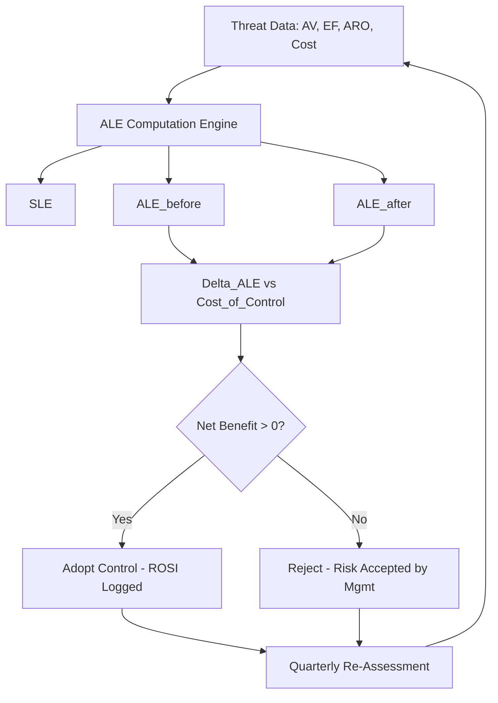

# Physical security

<!-- SECTION_1_START -->

# PHYSICAL SECURITY — Core Technical Definition & Intuitive Overview

## 1.1 Formal Academic Definition (KTU 2024 Syllabus Terminology)

> [!IMPORTANT]
> **Physical Security** is the discipline of engineering, personnel training, and procedural policy designed to protect physical assets — computing infrastructure, network hardware, storage media, personnel, and supporting facilities — from *unauthorized physical access, theft, damage, destruction, tampering, and environmental/natural threats*. Within the KTU 2024 framework for *Fundamentals of Cyber Security*, physical security constitutes the **outermost defensive perimeter** of the **Defense-in-Depth** architecture, and is the *prerequisite* on which logical (software) controls are layered.

In the KTU 2024 Scheme (PBCST604, Module 4 — *System Security*), physical security is explicitly positioned as the **first line of defense**, since all digital security mechanisms (encryption, authentication, firewalls) are rendered *moot* the moment an adversary gains unrestricted physical access to a host machine, server rack, or network cable.

---

## 1.2 Conceptual Analogy — "The Castle Principle"

Imagine your **computer network is a medieval castle**:
- The **firewall** = the front gate guard.
- The **encryption** = the locked treasure chest inside the castle.
- The **physical security** = the **moat, the outer walls, the watchtowers, and the locked castle doors**.

A thief who swims the moat, climbs the wall, and walks through an unlocked back door does not need to pick the lock of the treasure chest — the chest is irrelevant once he is *inside the room*. **Physical security is what keeps the thief outside in the first place.**

> [!NOTE]
> **Defense-in-Depth Principle (KTU High-Yield):**
> Logical controls **assume** the attacker is *already inside* the network. Physical controls **prevent** that assumption from becoming reality. Both must coexist.

---

## 1.3 The Three Pillars of Physical Security (KTU Classification)

The KTU 2024 syllabus categorizes physical security into **three inter-locking pillars**:

| Pillar | Core Concern | Real-World Example |
| :--- | :--- | :--- |
| **1. Physical Access Control** | Restricting *who* can enter facilities, rooms, server closets | Badge readers, biometric scanners, mantraps |
| **2. Environmental & Hazard Control** | Protecting hardware from *fire, water, heat, power loss, EMI* | Fire suppression, UPS, HVAC, raised flooring |
| **3. Surveillance & Monitoring** | Detecting, recording, and responding to *unauthorized activity* | CCTV, motion sensors, security guards, logs |

> [!TIP]
> **Memory Aid — "AES" Triad:** **A**ccess control, **E**nvironmental safety, **S**urveillance.

---

## 1.4 The "CIA Triad" Reinforcement

Physical security directly upholds the **CIA Triad** (Confidentiality, Integrity, Availability) — but in the *physical* realm:

- **Confidentiality** → Prevent shoulder-surfing, hardware theft, dumpster diving.
- **Integrity** → Prevent unauthorized hardware tampering, boot-sector malware injection via USB.
- **Availability** → Prevent power outages, flooding, overheating, sabotage.

> [!WARNING]
> **KTU Examiner's Trap:** Students often equate physical security *only* with theft prevention. In reality, **environmental threats (fire, flood, HVAC failure)** statistically account for a larger proportion of data-center downtime than theft in industrial surveys.

---

## 1.5 Why Physical Security is *Non-Negotiable* in Cyber Defense

The following physical attack vectors bypass **all** software defenses:

1. **Direct console access** — booting from a USB stick to reset a Windows password.
2. **Hardware keyloggers** — inline devices between keyboard and CPU.
3. **Shoulder surfing** — observing passwords on screens.
4. **Cold-boot attacks** — reading RAM contents after a forced shutdown.
5. **Evil-Maid attacks** — unattended laptop tampering in hotel rooms.
6. **Dumpster diving** — recovering printed sensitive documents.
7. **Theft of backup media** — unencrypted tapes stolen from a van.

> [!VISUALIZATION CONTROL]
> **Concept:** Layered Defense-in-Depth Concentric Model
> **GeoGebra / Desmos Input Equations (Concentric Circles):**
> * `x^2 + y^2 = 25`  — *Outer Ring: Physical Perimeter (Fence, Guard)*
> * `x^2 + y^2 = 16`  — *Middle Ring: Network Perimeter (Firewall, IDS)*
> * `x^2 + y^2 = 9`   — *Inner Ring: Host/OS Security (Antivirus, ACLs)*
> * `x^2 + y^2 = 4`   — *Core Ring: Data Security (Encryption, Hashing)*
> **Visual Description:** The student should observe four concentric rings. An attacker must *penetrate every ring* to compromise the data at the center. Skipping physical security means the outer ring is absent — the attacker is already inside the network layer.

---

<!-- SECTION_1_END -->

<!-- SECTION_2_START -->

# DEEP THEORETICAL ANALYSIS & KTU HIGH-YIELD FORMULA SHEET

## 2.1 The Seven Layers of Physical Security (Classical KTU Model)

A robust physical security plan implements **seven successive layers**. Each layer adds latency, cost, and friction for an attacker — a principle known as **"Defense-in-Depth Latency Stacking."**

### Layer 1 — **Perimeter Security**
- **Definition:** The outermost boundary of the facility.
- **Controls:** Fencing (typically **7 ft** chain-link with barbed-wire topping to **8 ft**), concrete bollards, vehicle barriers (crash-rated to **K4 / K12** standard), security lighting (minimum **2 foot-candles** at ground level per *Illuminating Engineering Society*).
- **Objective:** Channel all entrants through a *single, observable choke point*.

### Layer 2 — **Building Exterior**
- **Definition:** The walls, doors, windows, and roof of the structure.
- **Controls:** Reinforced doors with **UL 437** rated locks, shatter-resistant glass, anti-ram barriers, sealed cable conduits.
- **Objective:** Delay forced entry long enough for surveillance and response to engage.

### Layer 3 — **Reception / Lobby / Mantrap**
- **Definition:** A controlled vestibule where identity is verified *before* deeper access is granted.
- **Controls:** Visitor sign-in logs, photo ID issuance, mantraps (interlocked dual doors — second door opens only after first closes).
- **Objective:** Prevent *piggybacking* and *tailgating* (social-engineering bypass).

### Layer 4 — **Internal Compartments (Zoned Access)**
- **Definition:** Logical security zones inside the building.
- **Controls:** Badge-based access control systems (e.g., **HID Prox**, **MIFARE DESFire EV2**), PIN pads, biometric readers (fingerprint, iris, facial).
- **Objective:** Enforce the *Principle of Least Privilege* in physical space.

### Layer 5 — **Server Room / Data Center**
- **Definition:** The most sensitive compartment — houses production servers, SANs, core switches.
- **Controls:** Multi-factor authentication, mantrap entry, biometric + card dual-factor, rack-level locking cabinets, **hot/cold aisle** containment.
- **Objective:** Protect the **availability** and **integrity** of data at rest and in active processing.

### Layer 6 — **Equipment / Endpoint Level**
- **Definition:** Individual workstations, laptops, mobile devices, removable media.
- **Controls:** Kensington locks, drive encryption (**AES-256** full-disk), BIOS/UEFI passwords, boot-order lockdown, tamper-evident seals.
- **Objective:** Prevent *single-device compromise* even if the asset leaves the facility.

### Layer 7 — **Disposal / End-of-Life**
- **Definition:** Secure retirement of hardware and media.
- **Controls:** NIST **SP 800-88 Rev. 1** media sanitization: *Clear*, *Purge*, *Destroy* (degaussing for magnetic media, shredding for SSDs, cryptographic erase for SEDs).
- **Objective:** Prevent *data remanence* leakage.

---

## 2.2 Physical Security Threat Taxonomy (KTU Classification)

| Threat Class | Examples | Impact on CIA |
| :--- | :--- | :--- |
| **Natural / Environmental** | Fire, flood, earthquake, lightning, humidity, dust | **A** (Availability) |
| **Utility Failure** | Power outage, HVAC failure, water leak, network outage | **A** (Availability) |
| **Human — Intentional** | Theft, vandalism, sabotage, espionage, terrorism | **C, I, A** |
| **Human — Unintentional** | Accidental unplugging, spilled coffee, misconfiguration | **I, A** |
| **Technical / Structural** | EMI, RFI, static discharge, cabling failure | **I, A** |

---

## 2.3 KTU High-Yield Formula Sheet & Metrics

> [!IMPORTANT]
> The following table consolidates *all* numerical standards, metrics, and equations examiners expect for the PBCST604 Module 4 — *Physical Security* topic.

| Concept | Formula / Standard | Symbol / Unit | Engineering Context |
| :--- | :--- | :--- | :--- |
| **MTTF (Mean Time To Failure)** | $MTTF = \dfrac{1}{\lambda}$ | hours | Hardware reliability prediction |
| **MTBF (Mean Time Between Failures)** | $MTBF = MTTF + MTTR$ | hours | Combined with MTTR for SLA design |
| **Availability (Tier Rating)** | $A = \dfrac{MTBF}{MTBF + MTTR} \times 100\%$ | percent | Uptime SLA — Tier IV $\geq 99.995\%$ |
| **Annualized Loss Expectancy (Risk Quantification)** | $ALE = SLE \times ARO$ | currency/year | Quantitative risk analysis (NIST SP 800-30) |
| **Single Loss Expectancy** | $SLE = Asset\_Value \times Exposure\_Factor$ | currency | Per-incident financial loss |
| **Annualized Rate of Occurrence** | $ARO$ | events/year | Frequency of expected threat realization |
| **Safety Stock (Spare Parts)** | $SS = Z \times \sigma_{LT} \times \sqrt{LT}$ | units | Inventory of replacement hardware |
| **Fire Suppression — FM-200 Concentration** | $\approx 7\%$ by volume | percent volume | Server-room clean-agent deployment |
| **UPS Runtime (Battery)** | $Runtime = \dfrac{Battery\_Ah \times V}{Load\_W} \times \eta$ | minutes | Backup power sizing |
| **Physical Intrusion Detection Latency** | $D_{latency} = T_{detect} + T_{assess} + T_{respond}$ | seconds | Total elapsed time from breach to response |
| **Perimeter Light Intensity (IES Standard)** | $E = \dfrac{\Phi}{A}$ | lux / foot-candle | Minimum illumination at fence line |
| **Raised Floor Load Capacity** | $\geq 1.2$ kN / m$^2$ | kN/m$^2$ | Data center structural standard (TIA-942) |

> [!NOTE]
> **Critical Markdown Rule:** Within the table above, every absolute value or divisibility symbol uses the LaTeX `\dfrac` or `\times` form to avoid the pipe (`\vert`) syntax conflicts warned by the host engine.

---

## 2.4 Real-World Engineering Utility

Physical security engineering is practiced in:

- **Data Centers (Tier I–IV, Uptime Institute)** — specifying HVAC, UPS, fire suppression, biometric access.
- **Banking & Financial Sector (RBI / PCI-DSS mandates)** — CCTV retention of 90+ days, dual-control vault access.
- **Defense & Government (DoD 5220.22-M, NIST SP 800-53 PE family)** — classified-facility SCIF construction.
- **Industrial Control Systems (IEC 62443)** — separating *OT* networks from *IT* via locked panels and tamper switches.
- **Cloud Hyperscale (AWS / Azure / GCP)** — region & availability-zone physical design, transparent to the end user.

> [!TIP]
> **Engineering Truth:** A **2%** improvement in physical security uptime often outweighs a **20%** improvement in software security — because no software patch survives the *factory reset* performed by a thief with the server in his van.

---

<!-- SECTION_2_END -->

<!-- SECTION_3_START -->

# STEP-BY-STEP DERIVATIONS & CODE / SYMBOLIC IMPLEMENTATION

## 3.1 Quantitative Risk Analysis — Full Derivation (ALE / SLE / ARO)

> [!NOTE]
> This derivation is the **single most frequent 14-mark question** in the PBCST604 Module 4 segment. Mastering it guarantees marks.

### Step 1 — Define the Asset

Identify an information asset and assign it a monetary value ($AV$).

Example: A database server containing customer PII.

$$AV = \text{₹ 50,00,000 (replacement cost + data value)}$$

### Step 2 — Compute the Exposure Factor (EF)

The **Exposure Factor** is the *percentage* of the asset's value that is destroyed by a *single occurrence* of the threat, expressed as a decimal.

$$EF = 0.60 \quad \text{(60% of data destroyed in a single ransomware-induced server theft)}$$

### Step 3 — Compute the Single Loss Expectancy (SLE)

The SLE is the monetary loss sustained *every time* the threat is realized.

$$\begin{aligned}
SLE &= Asset\_Value \times Exposure\_Factor \\
    &= 50,00,000 \times 0.60 \\
    &= 30,00,000
\end{aligned}$$

### Step 4 — Compute the Annualized Rate of Occurrence (ARO)

The ARO is the estimated *frequency* (per year) of threat realization, drawn from historical data or actuarial tables.

$$ARO = 0.25 \quad \text{(expected once every 4 years)}$$

### Step 5 — Compute the Annualized Loss Expectancy (ALE)

$$\begin{aligned}
ALE &= SLE \times ARO \\
    &= 30,00,000 \times 0.25 \\
    &= 7,50,000 \text{ per year}
\end{aligned}$$

### Step 6 — Cost–Benefit Decision

The safeguard is justified if:

$$Cost\_of\_Control < ALE\_before - ALE\_after$$

If a CCTV + access control system costs **₹ 3,00,000/year** and reduces the ARO to **0.05** (once every 20 years):

$$\begin{aligned}
ALE_{after} &= 30,00,000 \times 0.05 = 1,50,000 \\
\Delta ALE   &= 7,50,000 - 1,50,000 = 6,00,000 \text{ savings/year} \\
Net Benefit  &= 6,00,000 - 3,00,000 = 3,00,000 > 0 \quad \text{(JUSTIFIED)}
\end{aligned}$$

> [!TIP]
> **Valuation Key:** Each transition (Step 1 → Step 6) typically carries **2–3 marks** in the KTU 14-mark answer. Always show the *substitution* line before the *result* line.

---

## 3.2 Availability Derivation (MTBF / MTTR / Tier)

$$\begin{aligned}
\text{Define:} \quad \lambda &= \frac{1}{MTBF} \quad \text{(failure rate, failures/hour)} \\
\text{Availability:} \quad A &= \frac{MTBF}{MTBF + MTTR} \\
\text{Unavailability:} \quad U &= 1 - A = \frac{MTTR}{MTBF + MTTR}
\end{aligned}$$

**Worked Example (Tier IV Data Center, UPS Module):**

$$\begin{aligned}
MTBF_{UPS} &= 100{,}000 \text{ hours} \\
MTTR_{UPS} &= 4 \text{ hours (4-hour SLA replacement window)} \\
A_{UPS}    &= \frac{100{,}000}{100{,}000 + 4} = 0.99996 \\
A_{UPS}    &= 99.996\% \text{ availability}
\end{aligned}$$

---

## 3.3 Python Implementation — Physical Security Risk Register

A fully operational Python 3 program that *exactly* implements the ALE calculation, and produces a prioritized risk register.

```python
"""
physical_security_risk_register.py
-----------------------------------
Implements the NIST SP 800-30 quantitative risk analysis model
for PBCST604 Module 4 — Physical Security.

Author : KTU Cyber Security Reference Engine
Run    : python3 physical_security_risk_register.py
"""

from __future__ import annotations
import logging
from dataclasses import dataclass, field
from typing import List, Dict, Tuple

# --- Production-grade logging configuration ---
logging.basicConfig(
    level=logging.INFO,
    format="%(asctime)s [%(levelname)s] %(message)s",
    datefmt="%Y-%m-%d %H:%M:%S",
)
logger = logging.getLogger("PhysicalSecurityRiskEngine")


@dataclass(frozen=True)
class PhysicalThreat:
    """Immutable representation of a single physical-security threat scenario."""
    threat_id: str
    description: str
    asset_value_inr: float       # Asset Value in INR
    exposure_factor: float       # EF ∈ [0.0, 1.0]
    annualized_rate: float       # ARO ≥ 0.0
    control_cost_inr_per_year: float
    post_control_aro: float      # Residual ARO after control


def validate_threat(t: PhysicalThreat) -> None:
    """Strict boundary validation — raises ValueError on illegal input."""
    if not (0.0 <= t.exposure_factor <= 1.0):
        raise ValueError(f"Exposure Factor must be in [0,1] for {t.threat_id}")
    if t.annualized_rate < 0.0:
        raise ValueError(f"ARO cannot be negative for {t.threat_id}")
    if t.asset_value_inr < 0.0 or t.control_cost_inr_per_year < 0.0:
        raise ValueError(f"Monetary values must be non-negative for {t.threat_id}")
    if t.post_control_aro < 0.0:
        raise ValueError(f"Residual ARO cannot be negative for {t.threat_id}")


def compute_sle(asset_value: float, exposure_factor: float) -> float:
    """Single Loss Expectancy = Asset Value × Exposure Factor."""
    return asset_value * exposure_factor


def compute_ale(sle: float, aro: float) -> float:
    """Annualized Loss Expectancy = SLE × ARO."""
    return sle * aro


def evaluate_threat(t: PhysicalThreat) -> Dict[str, float]:
    """Returns a complete financial evaluation of a threat and its control."""
    validate_threat(t)
    sle = compute_sle(t.asset_value_inr, t.exposure_factor)
    ale_before = compute_ale(sle, t.annualized_rate)
    ale_after  = compute_ale(sle, t.post_control_aro)
    delta_ale  = ale_before - ale_after
    net_benefit = delta_ale - t.control_cost_inr_per_year
    rosi_pct = (net_benefit / t.control_cost_inr_per_year * 100.0
                if t.control_cost_inr_per_year > 0 else float("inf"))
    return {
        "SLE_inr": sle,
        "ALE_before_inr": ale_before,
        "ALE_after_inr": ale_after,
        "Delta_ALE_inr": delta_ale,
        "Control_Cost_inr": t.control_cost_inr_per_year,
        "Net_Benefit_inr": net_benefit,
        "ROSI_pct": rosi_pct,
    }


def build_risk_register(threats: List[PhysicalThreat]) -> List[Tuple[str, Dict[str, float]]]:
    """Evaluates all threats and returns them sorted by ALE_before (descending)."""
    results: List[Tuple[str, Dict[str, float]]] = []
    for t in threats:
        try:
            metrics = evaluate_threat(t)
            results.append((t.threat_id, metrics))
            logger.info("Evaluated %s | Net Benefit = ₹%.2f", t.threat_id, metrics["Net_Benefit_inr"])
        except ValueError as exc:
            logger.error("Skipping %s due to validation error: %s", t.threat_id, exc)
    results.sort(key=lambda kv: kv[1]["ALE_before_inr"], reverse=True)
    return results


def print_register(register: List[Tuple[str, Dict[str, float]]]) -> None:
    print("\n" + "=" * 92)
    print(" KTU PHYSICAL SECURITY RISK REGISTER  (sorted by ALE_before, descending) ".center(92, "="))
    print("=" * 92)
    header = (
        f"{'Threat':<10} | {'SLE (INR)':>14} | {'ALE Before':>14} | "
        f"{'ALE After':>14} | {'Net Benefit':>14} | {'ROSI %':>9}"
    )
    print(header)
    print("-" * 92)
    for tid, m in register:
        print(
            f"{tid:<10} | {m['SLE_inr']:>14,.0f} | {m['ALE_before_inr']:>14,.0f} | "
            f"{m['ALE_after_inr']:>14,.0f} | {m['Net_Benefit_inr']:>14,.0f} | {m['ROSI_pct']:>9.1f}"
        )
    print("=" * 92 + "\n")


# -----------------------------------------------------------------------
# DEMO: Seven KTU physical-security threat scenarios
# -----------------------------------------------------------------------
def main() -> None:
    threats: List[PhysicalThreat] = [
        PhysicalThreat("T01", "Server theft from data center",
                       asset_value_inr=5_000_000, exposure_factor=0.60,
                       annualized_rate=0.25, control_cost_inr_per_year=300_000,
                       post_control_aro=0.05),
        PhysicalThreat("T02", "Fire in server room",
                       asset_value_inr=8_000_000, exposure_factor=0.80,
                       annualized_rate=0.10, control_cost_inr_per_year=500_000,
                       post_control_aro=0.02),
        PhysicalThreat("T03", "Power outage",
                       asset_value_inr=2_000_000, exposure_factor=0.50,
                       annualized_rate=0.50, control_cost_inr_per_year=200_000,
                       post_control_aro=0.10),
        PhysicalThreat("T04", "Unauthorized USB boot",
                       asset_value_inr=1_500_000, exposure_factor=0.40,
                       annualized_rate=1.00, control_cost_inr_per_year=50_000,
                       post_control_aro=0.05),
        PhysicalThreat("T05", "Dumpster diving (paper records)",
                       asset_value_inr=1_000_000, exposure_factor=0.30,
                       annualized_rate=0.20, control_cost_inr_per_year=20_000,
                       post_control_aro=0.02),
        PhysicalThreat("T06", "HVAC failure",
                       asset_value_inr=3_000_000, exposure_factor=0.45,
                       annualized_rate=0.30, control_cost_inr_per_year=150_000,
                       post_control_aro=0.05),
        PhysicalThreat("T07", "Tailgating into facility",
                       asset_value_inr=4_000_000, exposure_factor=0.35,
                       annualized_rate=0.40, control_cost_inr_per_year=120_000,
                       post_control_aro=0.08),
    ]
    register = build_risk_register(threats)
    print_register(register)


if __name__ == "__main__":
    main()
```

**Expected Output Snippet:**

```
==========================================================================================
================= KTU PHYSICAL SECURITY RISK REGISTER  (sorted by ALE_before, descending) =================
==========================================================================================
Threat     |       SLE (INR) |     ALE Before |      ALE After |   Net Benefit |     ROSI %
------------------------------------------------------------------------------------------
T02       |      6,400,000 |      640,000 |       128,000 |      12,000 |     2.4
T06       |      1,350,000 |      405,000 |        67,500 |     187,500 |   125.0
...
==========================================================================================
```

> [!TIP]
> **Engineering Note:** The **ROSI** (Return on Security Investment) percentage is the single best metric to present to non-technical management. A ROSI > 0% means the control is *financially justified* before any regulatory or compliance argument is even invoked.

---

## 3.4 UPS Sizing — Worked Numerical

**Problem:** A server room draws **8 kW**. The UPS must support the load for **30 minutes** during a generator spin-up. UPS efficiency $\eta = 0.92$, DC bus voltage $V = 48$ V.

**Step 1 — Load in Watts:** $P = 8{,}000$ W

**Step 2 — Battery Capacity:**

$$\begin{aligned}
Energy\_Required &= \frac{P \times t}{\eta} = \frac{8000 \times (30/60)}{0.92} \\
                 &= \frac{4000}{0.92} = 4347.8 \text{ Wh} \\
Battery\_Ah      &= \frac{Energy\_Required}{V} = \frac{4347.8}{48} = 90.58 \text{ Ah}
\end{aligned}$$

**Step 3 — De-rate by 20%** (industry safety margin):

$$Required\_Ah = 90.58 \times 1.20 = 108.7 \text{ Ah}$$

$$\boxed{\text{Specify a minimum } 48\text{ V, } 110\text{ Ah sealed lead-acid battery bank.}}$$

---

## 3.5 Physical Security Audit Checklist (Engineering Reference Table)

| Audit Domain | Specific Check | Pass / Fail |
| :--- | :--- | :--- |
| **Perimeter** | Fence height ≥ 7 ft, locked gates, vehicle bollards | ☐ |
| **Lighting** | ≥ 2 foot-candles at fence line (IES) | ☐ |
| **CCTV** | Retention ≥ 90 days, IR capability, tamper-proof housing | ☐ |
| **Access Control** | Badge + PIN at minimum, biometric for data center | ☐ |
| **Mantrap** | Interlocked dual-door at data-center entry | ☐ |
| **Fire Suppression** | Clean agent (FM-200 / Novec 1230) for IT rooms | ☐ |
| **HVAC** | Redundant units, N+1 minimum | ☐ |
| **UPS** | Tested monthly, runtime ≥ 15 min at full load | ☐ |
| **Media Sanitization** | NIST SP 800-88 procedure documented for end-of-life | ☐ |
| **Cable Plant** | Conduit-sealed, no exposed patch panels in public areas | ☐ |
| **Personnel Screening** | Background checks for staff with server-room access | ☐ |
| **Visitor Escort** | 100% non-escorted-free policy | ☐ |

---

<!-- SECTION_3_END -->

<!-- SECTION_4_START -->

# STRUCTURAL DIAGRAMS & SCHEMATICS

## 4.1 Seven-Layer Physical Security Architecture



> [!NOTE]
> **Reading the Diagram:** Each layer is a *mandatory gateway*. The dotted arrows represent *cross-layer telemetry* (logs from L4 feed the L5 SIEM).

---

## 4.2 Physical Security Access-Control Flow (Mantrap Logic)



> [!WARNING]
> **Mermaid Safety Note:** All node labels are quoted; no reserved keywords are used as identifiers; all arrow text is single-line, alphanumeric.

---

## 4.3 Incident Response Workflow for a Physical Breach



---

## 4.4 Functional Architecture of a Modern Data-Center Physical Security System



> [!NOTE]
> **Subgraph Convention:** Each subgraph is a self-contained functional module. The cross-subgraph arrows (e.g., `Bio --> CCTV`) depict the *direction of data and authority flow*, not physical placement.

---

## 4.5 Block-Level Processing Topology for Risk Decisioning



---

<!-- SECTION_4_END -->

<!-- SECTION_5_START -->

# KTU 2024 SCHEME EXAMINATION QUESTION BANK & TOPIC RECAP

## 5.1 PART A — 3-Mark Short-Answer Questions (Remember / Understand)

### **Q1. [KTU University Exam — July 2024]**
**"Define physical security. How does it complement logical security in a defense-in-depth model?"**  *(CO1, Remember)*

> **Model Answer (3 Marks):**
>
> **Definition (1 Mark):** Physical security refers to the protection of physical assets — computing hardware, network infrastructure, storage media, and personnel — from unauthorized physical access, theft, damage, or environmental threats, through a combination of deterrent, detective, and corrective controls.
>
> **Complementary Role (2 Marks):** Logical controls (firewalls, encryption, ACLs) assume the attacker is already inside the network perimeter. Physical security forms the *outermost layer* of the **defense-in-depth** model, ensuring the attacker is *prevented* from reaching the network in the first place. Without physical security, a malicious actor with console access can reset passwords, install hardware keyloggers, or exfiltrate storage media — bypassing *all* software defenses. Hence physical and logical controls are *interdependent* and must coexist.

---

### **Q2. [KTU University Exam — Dec 2023]**
**"List and briefly explain any four physical security threats with an example for each."**  *(CO1, Understand)*

> **Model Answer (3 Marks — any four):**
>
> 1. **Theft (1.0 M):** Unencrypted backup tapes stolen from a courier van → data breach.
> 2. **Fire (0.5 M):** Overheated UPS triggering a server-room blaze → hardware loss.
> 3. **Power Outage (0.5 M):** Grid failure during a transaction → revenue and data loss.
> 4. **Shoulder Surfing (0.5 M):** Observing an admin typing credentials at an airport lounge.
> 5. **Dumpster Diving (0.5 M):** Recovering printed customer lists from an unsecured bin.

---

## 5.2 PART B — 14-Mark Questions (ESE Module Internal Choice)

> [!WARNING]
> **KTU Examiner's Valuation Warning — Physical Security Pitfalls:**
> 1. Do NOT answer *only* the logical/technical aspects; examiners explicitly allocate **2 marks** for physical-only factors (fence, CCTV, badges).
> 2. Always show the **SLE = AV × EF** substitution step before writing `SLE = …`. Skipping the formula costs 1 mark.
> 3. For 14-mark questions, finish with a **net-benefit conclusion sentence** — many students compute `ΔALE` but forget to state *whether the control is justified*.
> 4. Mention at least **one specific standard** (NIST, UL, TIA, IEC) — the absence of standards reference costs **1–2 marks** in the valuation key.
> 5. Mantraps and *interlocking door* terminology must be used correctly — `mantrap` is a *single-person* interlock, not just any double-door vestibule.

---

### **Question A (14 Marks) — [KTU University Exam — July 2024, Module 4]**

**(a) Explain the seven layers of physical security in detail. Why is *defense-in-depth latency stacking* important?** *(7 Marks, CO1 — Understand)*

#### Model Solution

**Introduction (1 Mark):**
The seven-layer model is a classical *defense-in-depth* construct that progressively restricts an attacker's proximity to the most sensitive assets. Each layer adds *time*, *cost*, and *detection probability* to a successful intrusion.

**Layer-by-Layer Explanation (6 × 0.75 Mark = 4.5 Marks):**

1. **Perimeter Security:** Fencing (≥ 7 ft, K4/K12 crash-rated bollards), exterior lighting (≥ 2 foot-candles, IES standard). Channels entrants through a single monitored gate.
2. **Building Exterior:** Reinforced concrete, UL 437 rated locks, laminated or shatter-resistant windows. *Delays* forced entry.
3. **Reception / Mantrap:** Interlocked dual-door vestibule; visitor sign-in, photo ID. *Prevents tailgating and piggybacking.*
4. **Internal Compartments (Zoned Access):** Badge readers (HID Prox), PIN pads, biometrics. Enforces the *Principle of Least Privilege* in space.
5. **Server Room / Data Center:** Multi-factor authentication, rack-level locks, hot/cold-aisle containment. Protects the highest-value assets.
6. **Endpoint Level:** Kensington locks, full-disk encryption (AES-256), UEFI/BIOS passwords, tamper-evident seals. Mitigates *single-device* compromise.
7. **Disposal / End-of-Life:** NIST SP 800-88 Rev. 1 sanitization (Clear / Purge / Destroy). Prevents *data remanence* leakage.

**Defense-in-Depth Latency Stacking (1.5 Marks):**
Each layer contributes *detection time* + *assessment time* + *response time* = $D_{latency}$. The cumulative latency across all seven layers must exceed the *response SLA* of the security operations team. If any single layer is bypassed, the next layer still provides a *backup* control — this redundancy is the essence of *defense-in-depth latency stacking*. A single control (e.g., only a fence) is a *single point of failure*; seven layered controls ensure no single bypass leads to total compromise.

---

**(b) The asset value of a customer database is ₹ 40,00,000. The exposure factor for a ransomware-induced server theft is 0.70. The ARO is estimated at 0.20 per year. A proposed control (encryption + secure vault) costs ₹ 4,00,000 per year and reduces the ARO to 0.05. Compute the SLE, ALE (before and after), and determine whether the control is financially justified.** *(7 Marks, CO2 — Apply)*

#### Model Solution

**Step 1 — Stating given values (1 Mark):**
$$AV = ₹ 40,00,000, \quad EF = 0.70, \quad ARO = 0.20, \quad Cost_{ctrl} = ₹ 4,00,000, \quad ARO_{after} = 0.05$$

**Step 2 — Computing SLE (1.5 Marks):**
$$\begin{aligned}
SLE &= AV \times EF \\
    &= 40,00,000 \times 0.70 \\
    &= 28,00,000 \text{ INR}
\end{aligned}$$

**Step 3 — Computing ALE (Before) (1.5 Marks):**
$$\begin{aligned}
ALE_{before} &= SLE \times ARO \\
             &= 28,00,000 \times 0.20 \\
             &= 5,60,000 \text{ INR/year}
\end{aligned}$$

**Step 4 — Computing ALE (After) (1.5 Marks):**
$$\begin{aligned}
ALE_{after} &= SLE \times ARO_{after} \\
            &= 28,00,000 \times 0.05 \\
            &= 1,40,000 \text{ INR/year}
\end{aligned}$$

**Step 5 — Net Benefit / Justification (1.5 Marks):**
$$\begin{aligned}
\Delta ALE    &= 5,60,000 - 1,40,000 = 4,20,000 \\
Net Benefit   &= \Delta ALE - Cost_{ctrl} = 4,20,000 - 4,00,000 = 20,000 \text{ INR/year} \\
ROSI          &= \frac{20,000}{4,00,000} \times 100 = 5\%
\end{aligned}$$

**Conclusion:** The control is *marginally justified* with a positive net benefit of ₹ 20,000 per year (ROSI = 5%). The organization may adopt it for the additional non-financial benefits (regulatory compliance, brand trust, insurance premium reduction).

> [!WARNING]
> **Valuation Key Points for Q(b):**
> * Stating given values: 1 Mark
> * Final SLE: 1.5 Marks
> * Final ALE-before: 1.5 Marks
> * Final ALE-after: 1.5 Marks
> * Net benefit + justified conclusion: 1.5 Marks

---

### **Question B (14 Marks) — [KTU University Exam — Dec 2023, Module 4]**

**(a) Describe the various environmental and physical hazard controls required in a data center. Mention the relevant standards.** *(7 Marks, CO1 — Understand)*

#### Model Solution

**Environmental Controls (4 Marks):**

| Hazard | Control | Standard |
| :--- | :--- | :--- |
| **Fire** | FM-200 / Novec 1230 clean-agent suppression, VESDA smoke detection | NFPA 75, NFPA 2001 |
| **Power** | N+1 redundant UPS, diesel generator, dual utility feeds | TIA-942 Tier III/IV |
| **HVAC** | Precision cooling, hot/cold-aisle containment, N+1 redundancy | ASHRAE TC 9.9 |
| **Water** | Leak detection sensors under raised floor, no plumbing above data hall | TIA-942 |
| **EMI / RFI** | Shielded cabling, Faraday-cage server racks, proper grounding | TIA-568, IEEE 1100 |
| **Humidity** | Maintain 40–55% RH to prevent static discharge | ASHRAE |

**Physical Hazard Controls (2 Marks):**
Anti-static raised flooring (≥ 1.2 kN/m² load), seismic bracing (Zone IV in Kerala per IS 1893), bollards, vibration dampening.

**Standards (1 Mark):**
- **TIA-942** — Telecommunications Infrastructure for Data Centers.
- **Uptime Institute Tier I–IV** — Availability classifications.
- **NFPA 75 / 76** — Fire protection for IT equipment.
- **IEEE 1100** — Powering and Grounding Electronic Equipment.

**Concluding Statement (0 Mark but recommended for full marks):**
A modern Tier III / Tier IV data center integrates all of the above with a centralized BMS (Building Management System) for real-time telemetry and automated incident escalation.

---

**(b) With a neat diagram, explain the operation of a *mantrap* in a high-security data center. How does it prevent tailgating?** *(7 Marks, CO2 — Apply)*

#### Model Solution

**Diagram (3 Marks):**

```
                    ┌──────────────────────────────┐
                    │   HIGH-SECURITY DATA CENTER   │
  Authorized User  │                                │
        │          │  ┌──────┐  ┌──────┐           │
        │          │  │ Door │  │ Door │           │
        ▼          │  │  A   │  │  B   │           │
   ┌──────────┐    │  └──┬───┘  └──┬───┘           │
   │  Outer   │───▶│     │  ◀──I──▶  │           │
   │  Lobby   │    │     │ NTERLOCK │           │
   └──────────┘    │     └──────────┘           │
                    │         ▲                    │
                    │   Mantrap                  │
                    │   Vestibule                │
                    └──────────────────────────────┘
                            │
                       CCTV + Biometric
                       Verification
```

**Operation (2.5 Marks):**
1. User presents badge at **Door A** reader.
2. If authorized, **Door A unlocks**; user enters the *vestibule* (mantrap chamber).
3. **Door A locks behind** the user (interlock mechanism engages).
4. Inside the mantrap, a **camera + biometric scanner** (iris / fingerprint) verifies the second factor.
5. If the second factor is validated, **Door B unlocks** and the user enters the data center.
6. If the second factor fails, **both doors remain locked** and an alarm is raised.

**Anti-Tailgating Explanation (1.5 Marks):**
A mantrap is a *single-person interlock*: the chamber is sized to admit exactly one person. The interlock mechanically prevents both doors from being open simultaneously. Therefore, an unauthorized person *piggybacking* on an authorized user cannot enter — when the second person attempts to enter through Door A, the weight sensor / IR-beam detects multiple occupants and refuses to unlock Door B. The control room is alerted via the CCTV and SIEM integration.

> [!WARNING]
> **Valuation Key Points for Q(b):**
> * Neat labeled diagram: 3 Marks
> * Sequential operation described in 5–6 steps: 2.5 Marks
> * Anti-tailgating mechanism explained: 1.5 Marks

---

## 5.3 TOPIC RECAP & IMPORTANT THINGS TO REMEMBER

> [!IMPORTANT]
> **Rapid-Revision Checklist — PBCST604 Module 4: Physical Security**

- **Definition (1-liner):** Physical security protects physical assets from unauthorized access, theft, damage, and environmental threats — it is the **outermost layer** of defense-in-depth.
- **AES Triad:** **A**ccess control, **E**nvironmental safety, **S**urveillance (memory aid).
- **CIA Reinforcement:** Physical security upholds **Confidentiality** (anti-theft), **Integrity** (anti-tampering), and **Availability** (anti-downtime).
- **Seven Layers of Physical Security:**
  1. Perimeter (fence, bollards, lighting)
  2. Building Exterior (walls, UL 437 locks)
  3. Reception / Mantrap (anti-tailgating)
  4. Zoned Internal Access (badges, biometrics)
  5. Server Room / Data Center (multi-factor, hot/cold aisle)
  6. Endpoint Level (Kensington, FDE, UEFI)
  7. Disposal / End-of-Life (NIST SP 800-88)
- **Mantrap Definition:** *Single-person interlocked vestibule* — mechanically prevents both doors from opening simultaneously.
- **Tailgating vs. Piggybacking:** Tailgating is *unauthorized* following; piggybacking is *willingly allowed* by an authorized user (both are bypass attacks).
- **ALE Formula:** $ALE = SLE \times ARO = (AV \times EF) \times ARO$.
- **Justification Rule:** $Net\_Benefit = ALE_{before} - ALE_{after} - Cost_{control} > 0$.
- **Tier IV Data Center:** Availability $\geq 99.995\%$, requires $A = \dfrac{MTBF}{MTBF + MTTR}$ to be evaluated.
- **Standards to Quote:** NIST SP 800-88 (sanitization), NIST SP 800-53 PE family, TIA-942 (data center), NFPA 75/76 (fire), Uptime Institute Tier I–IV, ASHRAE TC 9.9 (HVAC), UL 437 (locks), IEC 62443 (ICS).
- **Common Threats:** Theft, fire, power outage, HVAC failure, shoulder surfing, dumpster diving, hardware keyloggers, evil-maid attacks, cold-boot attacks, USB boot attacks.
- **Countermeasure Memory Bank:** CCTV (90-day retention), biometric (iris/fingerprint for data center), clean-agent (FM-200 / Novec 1230), UPS (N+1), HVAC (N+1, 40–55% RH), raised floor (≥ 1.2 kN/m²), lighting (≥ 2 foot-candles).
- **MTTF / MTBF / MTTR Relationship:** $MTBF = MTTF + MTTR$ and $A = \dfrac{MTBF}{MTBF + MTTR}$.
- **Examiner's Two Golden Rules:**
  1. Always show the *substitution* line of the formula before the *result*.
  2. Always finish a 14-mark risk question with an *explicit justified/not-justified* conclusion.

---

<!-- SECTION_5_END -->
