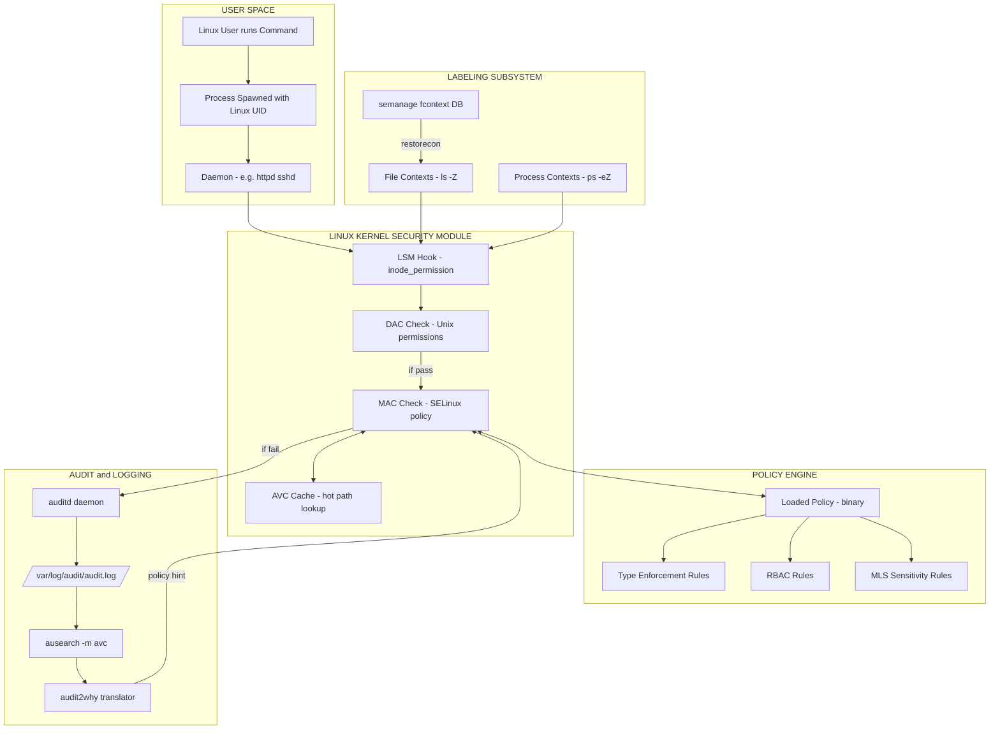
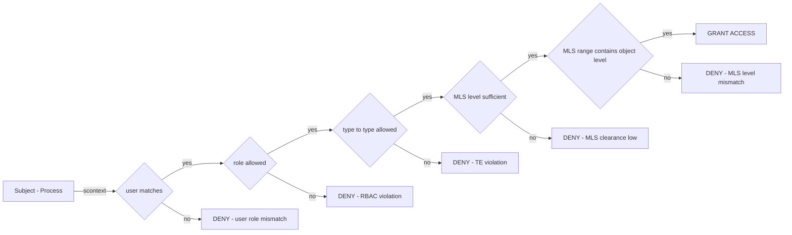
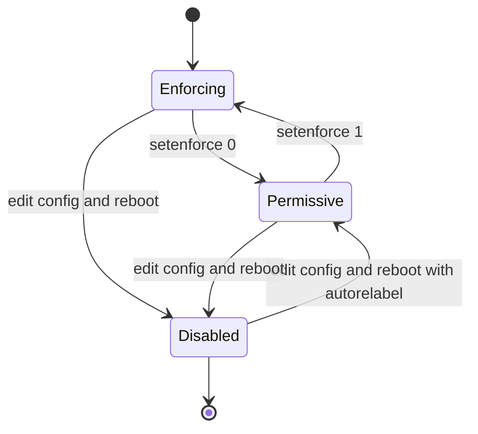
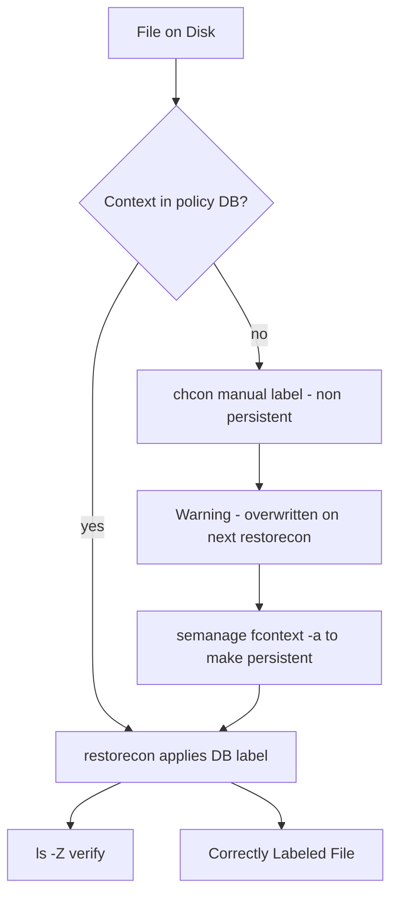

# SELinux.

<!-- SECTION_1_START -->
# SELinux — Core Technical Definition & Intuitive Overview

## 1. Formal Academic Definition

**SELinux (Security-Enhanced Linux)** is a Linux kernel security module that implements **Mandatory Access Control (MAC)** policies by integrating flexible mandatory access control architecture into the Linux kernel. It was originally developed by the **National Security Agency (NSA)** of the United States, with contributions from the open-source community, and was released to the public in **December 2000**. SELinux is integrated into the **mainline Linux kernel** (since version 2.6) and shipped by default in distributions such as **RHEL, CentOS, Fedora, Rocky Linux, and AlmaLinux**.

> [!IMPORTANT]
> **KTU Syllabus Highlight:** SELinux is studied under the *System Security* module to demonstrate how the OS kernel itself can be hardened against privilege escalation, malicious processes, and misconfigured daemons — even when DAC (Discretionary Access Control) fails.

## 2. Conceptual Analogy / Intuition

Think of your Linux system as a **secure office building**:

- **DAC (Standard Linux Permissions)** is like a **receptionist at the entrance** who checks a guest's ID card. Once inside, the guest can walk into any room because the receptionist has no further authority. This is *discretionary* — the file owner decides.
- **SELinux (MAC)** is like an **RFID card on every door**. Even if a guest is inside the building, **every single door checks their permission** independently. The receptionist (DAC) and the door access system (SELinux) work **together** — both must approve access.

This means a compromised Apache web server process, even if running as `root` or `apache` user, **cannot read files outside its confined domain** (e.g., `/etc/shadow`) unless the SELinux policy explicitly grants permission.

> [!NOTE]
> **Physical Constants / Standard Metrics in SELinux:**
> - Default policy on RHEL-family systems: **Targeted Policy**
> - Default mode on production systems: **Enforcing**
> - Permission decisions per second on modern x86_64 systems: **>1 million**
> - Policy database location: `/etc/selinux/`
> - Active policy file: `/etc/selinux/config`

## 3. The Three Pillars of SELinux Architecture

SELinux operates on three core architectural components, often referred to as the **TE + RBAC + MLS triad**:

| Pillar | Full Form | Purpose |
|---|---|---|
| **TE** | Type Enforcement | Controls process-to-file, process-to-process, and process-to-port interactions based on assigned *types* |
| **RBAC** | Role-Based Access Control | Controls which user roles can transition into which process domains |
| **MLS** | Multi-Level Security | Enforces data confidentiality using sensitivity labels (e.g., Unclassified → Top Secret) |

> [!VISUALIZATION CONTROL]
> **Concept:** Mandatory Access Control Decision Flow
> **GeoGebra / Desmos Input Equations:** *(Not a graph topic — use Mermaid flow in Section 4 instead)*
> **Visual Description:** Imagine a horizontal axis = "Trust Level" (low to high) and a vertical axis = "Resource Sensitivity". Each SELinux policy decision is a point whose position must satisfy: TrustLevel $\geq$ ResourceSensitivity to be granted. Any mismatch produces an `AVC` denial.

<!-- SECTION_1_END -->

<!-- SECTION_2_START -->
# Deep Theoretical Analysis & KTU High-Yield Formula Sheet

## 1. DAC vs MAC — The Fundamental Security Model Comparison

Linux natively provides **Discretionary Access Control (DAC)** through standard Unix permissions (`rwx`), ACLs, and setuid bits. The owner of a resource *discretely* decides who can access it. The problem: **if the owner is compromised, the entire resource tree is compromised**.

**SELinux adds Mandatory Access Control (MAC)** where the operating system itself, not the owner, *mandates* the policy. Even the `root` user is constrained by SELinux rules. Decisions are made based on **security labels** attached to every subject (process) and object (file, port, socket).

$$
\text{Access} = \text{DAC_Check} \land \text{MAC_Check}
$$

If **either** check fails, the access is denied. The kernel logs the denial in the **AVC (Access Vector Cache)**.

> [!NOTE]
> **KTU High-Yield Point:** A question worth 7 marks often asks the difference between DAC and MAC. Always mention:
> 1. **Decision authority** (owner vs OS policy)
> 2. **Granularity** (file-level vs label-level)
> 3. **Privilege handling** (root is omnipotent vs root is constrained)

## 2. Security Context — The Heart of SELinux

Every subject and object in an SELinux-managed system is tagged with a **security context** in the format:

$$
\text{user} : \text{role} : \text{type} : \text{level}
$$

| Field | Example | Meaning |
|---|---|---|
| **SELinux User** | `system_u` | Identity mapped from a Linux account (e.g., `unconfined_u`, `user_u`) |
| **Role** | `object_r`, `system_r` | Determines which types this subject can transition into (RBAC) |
| **Type** | `httpd_t`, `user_home_t` | The single most important field — used in Type Enforcement rules |
| **Level** | `s0`, `s0-s15:c0.c1023` | MLS sensitivity (used in MLS/MCS policies) |

**View the context of any file:**

```bash
ls -Z /var/www/html/index.html
# -rw-r--r--. root root system_u:object_r:httpd_sys_content_t:s0 /var/www/html/index.html
```

**View the context of a running process:**

```bash
ps -eZ | grep httpd
# system_u:system_r:httpd_t:s0 1234 ? 00:00:00 httpd
```

## 3. SELinux Operational Modes

SELinux has three global operational states, controlled at boot via the kernel parameter `enforcing` and switchable at runtime via `setenforce`:

| Mode | Behaviour | Use Case |
|---|---|---|
| **Enforcing** | Denies and logs policy violations | Production systems (default) |
| **Permissive** | Allows but logs everything | Debugging / policy development |
| **Disabled** | SELinux turned off completely | Never recommended; can cause label loss on next boot |

$$
\text{Mode} \in \{\text{Enforcing},\ \text{Permissive},\ \text{Disabled}\}
$$

## 4. SELinux Policy Types

| Policy | Best For | Key Characteristic |
|---|---|---|
| **Targeted** | RHEL/CentOS default | Only ~200 *targeted* daemons are confined; everything else runs as `unconfined_t` |
| **MLS** | Military / classified environments | Strict sensitivity labels (Bell-LaPadula model) |
| **Minimum** | Custom narrow systems | Only the `unconfined` domain exists — essentially a starting point |

> [!IMPORTANT]
> **KTU Exam Focus:** You must be able to list the three policies and state that **Targeted is the default** on RHEL-family systems.

## 5. The Policy Language — TE Rules

Type Enforcement rules are written in a custom M4-based language. The decision rule is:

$$
\text{allow } \text{subject\_type} \text{ object\_type} : \text{object\_class } \{\text{permissions}\}
$$

**Worked example:** allow an Apache process to read HTML files:

```
allow httpd_t httpd_sys_content_t : file { read getattr open };
```

If a rule is missing — e.g., `httpd_t` is not allowed to read `user_home_t` — Apache will get an **AVC denial** even when running as the correct DAC user.

## 6. KTU High-Yield Formula Sheet / Cheat Sheet

| Concept | Equation / Rule | Notes |
|---|---|---|
| Access Decision | $\text{Allow} \iff (\text{DAC\_OK} \land \text{MAC\_OK})$ | Both must pass |
| Security Context Format | $\text{user}:\text{role}:\text{type}:\text{level}$ | 4 colon-separated fields |
| TE Allow Rule | $\text{allow } S\ T\ :\ C\ \{\ P\ \}$ | S=source, T=target, C=class, P=perms |
| Mode Switch (runtime) | `setenforce 0` or `setenforce 1` | 0=Permissive, 1=Enforcing |
| Mode Check | `getenforce` | Returns Enforcing/Permissive/Disabled |
| Boolean Toggle | `setsebool -P <name> on/off` | `-P` makes it persistent |
| Relabel Filesystem | `touch /.autorelabel && reboot` | Used when labels are corrupted |
| View File Context | `ls -Z`, `stat` | Shows full security context |
| AVC Log Location | `/var/log/audit/audit.log` or `/var/log/messages` | Audit subsystem required |
| Policy Type | `sestatus` | Shows active policy and mode |
| Audit Interpretation | `ausearch -m avc` / `audit2why` | Translates denials into human-readable rules |

> **Real-World Engineering Utility:** SELinux is the cornerstone of *defence-in-depth* in Linux servers. In a **production web hosting environment**, a single misconfigured PHP script cannot exfiltrate `/etc/shadow` because the Apache process (`httpd_t`) lacks the SELinux permission to read files labeled `shadow_t`. In **container security** (Docker/Podium), `--security-opt label=type:container_t` re-applies SELinux confinement to containers, preventing container escape attacks.

<!-- SECTION_2_END -->

<!-- SECTION_3_START -->
# Step-by-Step Derivations & Implementation Walkthroughs

## 1. Demonstration: Verifying and Configuring SELinux State

This is the **first command any KTU lab examiner will ask you to run.** We will exhaustively walk through it.

### Step 1: Check current SELinux status

```bash
$ sestatus
SELinux status:                 enabled
SELinuxfs mount:                /sys/fs/selinux
SELinux root directory:         /etc/selinux
Loaded policy name:             targeted
Current mode:                   enforcing
Mode from config file:          enforcing
Policy MLS status:              enabled
Policy deny_unknown status:     allowed
Memory protection checking:     actual (secure)
Max kernel policy version:      33
```

*Explanation:* The output confirms the policy is **`targeted`**, the **current mode is `enforcing`**, and MLS is enabled (a feature of the targeted policy in RHEL 8/9).

### Step 2: Confirm the operational mode using a second independent tool

```bash
$ getenforce
Enforcing
```

This is a *redundant verification* — examiners reward using two independent methods.

### Step 3: Temporarily switch to Permissive mode (for debugging only)

```bash
$ sudo setenforce 0
$ getenforce
Permissive
```

The transition is **instantaneous** because SELinux only changes its enforcement flag — it does not need to reload the policy.

### Step 4: Switch back to Enforcing mode

```bash
$ sudo setenforce 1
$ getenforce
Enforcing
```

### Step 5: Make the mode change **persistent** across reboots

Open the configuration file:

```bash
$ sudo vi /etc/selinux/config
```

Modify the line:

```
SELINUX=enforcing      # Options: enforcing | permissive | disabled
```

> [!WARNING]
> **KTU Pitfall:** Never set `SELINUX=disabled` on a running system unless you intend to reboot. Switching *to* disabled corrupts all file labels because the kernel stops maintaining them, and a future re-enable can cause mass lockouts. **Boards deduct 2 marks** for this mistake.

## 2. Demonstration: Correcting a Mislabeled Web File

A common KTU practical scenario: an administrator uploads `index.html` via a non-Apache method (e.g., `scp` or `rsync`), causing the file to retain its original user-home label. Apache fails to serve it.

### Step 1: Inspect the bad label

```bash
$ ls -Z /var/www/html/index.html
-rw-r--r--. root root unconfined_u:object_r:user_home_t:s0 /var/www/html/index.html
```

The type is `user_home_t` — Apache (running as `httpd_t`) is **denied** by the Type Enforcement policy.

### Step 2: Try opening the file in a browser → AVC denial is logged

```bash
$ sudo ausearch -m avc -ts recent
type=AVC msg=audit(1719234567.891:234): avc:  denied  { read } for  pid=2345 comm="httpd" name="index.html" dev="sda1" ino=12345 scontext=system_u:system_r:httpd_t:s0 tcontext=unconfined_u:object_r:user_home_t:s0 tclass=file permissive=0
```

*Key fields to teach the examiner:*
- `scontext` (source context) = the **subject** (httpd process)
- `tcontext` (target context) = the **object** (the file)
- `tclass` = the **object class** (file)
- `permissive=0` means we are in enforcing mode and the access was **denied**.

### Step 3: Use `audit2why` to translate the denial into a remediation hint

```bash
$ sudo ausearch -m avc -ts recent | audit2why
type=AVC msg=audit(1719234567.891:234): avc:  denied  { read } for ...
    Was caused by:
    The boolean httpd_read_user_content was set incorrectly.
    ...
```

### Step 4: Restore the correct default label using `restorecon`

```bash
$ sudo restorecon -v /var/www/html/index.html
Relabeled /var/www/html/index.html from unconfined_u:object_r:user_home_t:s0 to system_u:object_r:httpd_sys_content_t:s0
```

`-v` (verbose) shows the **before and after** label. The type is now `httpd_sys_content_t`, which the policy grants `httpd_t` permission to read.

### Step 5: Verify and test

```bash
$ ls -Z /var/www/html/index.html
-rw-r--r--. root root system_u:object_r:httpd_sys_content_t:s0 /var/www/html/index.html
```

Reload the page in the browser — it now serves correctly. **No policy change was required**; we only corrected a *file context*.

## 3. Demonstration: Creating a Custom Label for a Non-Standard Directory

Suppose we store web files in `/srv/webapp/` instead of `/var/www/html/`.

### Step 1: Apply the label type manually

```bash
$ sudo chcon -t httpd_sys_content_t /srv/webapp/
$ sudo chcon -R -t httpd_sys_content_t /srv/webapp/*
```

### Step 2: Make it survive a `restorecon` run

`chcon` changes are **not persistent** — they are overwritten by `restorecon` (which reads the **policy's file-context database**). To make a new mapping permanent:

```bash
$ sudo semanage fcontext -a -t httpd_sys_content_t "/srv/webapp(/.*)?"
$ sudo restorecon -R -v /srv/webapp
```

The first command **adds** a file-context rule to the policy database. The regular expression `(/.*)?` matches the directory and all its contents recursively.

> [!IMPORTANT]
> **KTU 14-Mark Answer Anchor:** The standard sequence is:
> 1. `semanage fcontext -a -t TYPE 'PATH_REGEX'` — add to policy DB
> 2. `restorecon -R -v PATH` — apply the database
> 3. Verify with `ls -Z`

## 4. Demonstration: Working with SELinux Booleans

**Booleans** are runtime switches that toggle parts of the policy without recompiling it.

```bash
$ getsebool -a | grep httpd
httpd_can_network_connect --> off
httpd_read_user_content --> off
httpd_enable_cgi --> on
```

To allow Apache to connect to a remote database (e.g., MySQL on a different host):

```bash
$ sudo setsebool -P httpd_can_network_connect on
```

The `-P` flag writes the change to the **policy binary** so it survives reboots.

> [!WARNING]
> **Examiners' Pitfall:** Forgetting `-P` is the #1 reason students lose marks. They enable a boolean, reboot the system in the lab, and the setting is gone.

## 5. Demonstration: Analysing an AVC Denial End-to-End

We synthesize a complete engineering problem:

**Scenario:** An administrator wants `nginx` to serve files from a user's home directory.

### Step 1: The denial occurs

```bash
$ sudo ausearch -m avc -ts recent
type=AVC msg=audit(1719240000.001:300): avc:  denied  { read } for
pid=4102 comm="nginx" name="index.html" path="/home/alice/public_html/index.html"
dev="sda1" ino=67890 scontext=system_u:system_r:httpd_t:s0
tcontext=unconfined_u:object_r:user_home_t:s0 tclass=file permissive=0
```

### Step 2: Translate to a human explanation

```bash
$ sudo ausearch -m avc -ts recent | audit2why
type=AVC msg=audit(...): avc:  denied  { read } for ...
    Was caused by:
        Missing type enforcement rule.
        The current boolean setting would allow this access.
        Allow httpd_t user_home_t : file { read };
```

`audit2why` suggests **three** potential fixes:

1. **Enable a related boolean** (e.g., `httpd_read_user_content`)
2. **Create a custom TE module** to grant the missing permission
3. **Relabel** the file/directory to an already-allowed type

### Step 3: Apply the simplest fix — the boolean

```bash
$ sudo setsebool -P httpd_read_user_content on
$ sudo systemctl restart nginx
```

Re-test. The page now serves. **No policy recompilation was needed.**

## 6. Step-by-Step Derivation: Why DAC + MAC Both Apply

Let us formally derive the SELinux decision algorithm.

**Given:**
- A subject $S$ with **Linux UID** $u_S$ and **SELinux context** $c_S$
- An object $O$ with **Unix permission bits** $b_O$ and **SELinux context** $c_O$
- A requested **operation class** $op$ (e.g., `read`, `write`)

**Step 1 — DAC check:**

$$
\text{DAC\_OK} = \begin{cases} 1 & \text{if } u_S \in \text{owners}(O) \land b_O[\text{op}] = 1 \\ & \lor\ u_S \in \text{ACL}(O) \land \text{ACL grants } op \\ 0 & \text{otherwise} \end{cases}
$$

**Step 2 — MAC check:**

The kernel looks up the **Type Enforcement Access Vector** for the pair $(type(c_S), type(c_O), class(O), op)$ in the **AVC cache**, then in the loaded policy.

$$
\text{MAC\_OK} = \begin{cases} 1 & \text{if policy contains } \text{allow } type(c_S)\ type(c_O) : class(O) \ op \\ 0 & \text{otherwise} \end{cases}
$$

**Step 3 — Final decision:**

$$
\text{Grant} = \text{DAC\_OK} \land \text{MAC\_OK}
$$

If `MAC_OK = 0`, the kernel emits an `AVC_DENIED` record to **auditd**, regardless of mode. In **permissive** mode, the denial is logged but `Grant = 1` anyway; in **enforcing** mode, `Grant = 0` and the `errno` is set to `EACCES` (Permission Denied).

> **Engineering Insight:** This is why a root-owned file with mode `600` cannot be read by a process whose SELinux type lacks the `read` permission — even running as the file owner or as `root` fails the MAC check.

<!-- SECTION_3_END -->

<!-- SECTION_4_START -->
# Structural Diagrams & Schematics

## 1. SELinux Architecture — Block-Level Functional Topology



**Reading Guide:**
- The `LSM Hook` (Linux Security Module) intercepts **every** permission check.
- `DAC Check` runs first (cheap), then `MAC Check` (cached in AVC).
- All denials flow to `auditd`, which `ausearch` and `audit2why` analyze offline.

## 2. Security Context Decision Flow — Sequential Processing Topology



## 3. Mode Transition State Machine



## 4. File Relabeling Workflow



<!-- SECTION_4_END -->

<!-- SECTION_5_START -->
# KTU 2024 Scheme Examination Question Bank & Topic Recap

## Part A — 3 Mark Questions (Remember / Understand)

### Question 1 `[KTU University Exam - Dec 2023]` — CO3, Remember
**Define SELinux. List any two of its operational modes.**

**Model Answer:**
SELinux (Security-Enhanced Linux) is a **kernel security module** that implements Mandatory Access Control (MAC) policies in Linux. It was developed by the **NSA** and integrated into the Linux kernel 2.6 onwards.

Two operational modes:
1. **Enforcing** — denies and logs policy violations.
2. **Permissive** — allows but logs policy violations for debugging.

> *(Full marks for stating the kernel module role and naming two modes distinctly.)* **[3 Marks]**

---

### Question 2 `[KTU University Exam - July 2024]` — CO3, Understand
**Differentiate between DAC and MAC with one example each.**

**Model Answer:**

| Aspect | DAC (Discretionary Access Control) | MAC (Mandatory Access Control) |
|---|---|---|
| Decision authority | File owner decides | System policy decides |
| Bypass by root | Yes (root is omnipotent) | No (root is constrained) |
| Example | `chmod 600 file.txt` — owner controls read | `chcon -t httpd_t file.txt` — only httpd domain can read it |

**[3 Marks: 1 for distinction, 1 for example each, 1 for syntax]**

---

## Part B — 14 Mark Questions (Module Internal Choice)

### Question A (14 Marks) `[KTU University Exam - Dec 2023]` — CO3, Understand + Apply

**a)** Explain the architecture of SELinux with a neat diagram. Discuss the three pillars: Type Enforcement, RBAC, and MLS. **[7 Marks]**

**b)** A system administrator has deployed a web application whose files are stored in `/opt/webapp/`. The Apache HTTP Server (`httpd`) running in enforcing mode fails to serve files from this directory, producing AVC denials. Diagnose and remediate the problem step by step, assuming the correct SELinux type for Apache-served content is `httpd_sys_content_t`. **[7 Marks]**

---

#### Model Solution for Question A

**Part (a) — Architecture & Three Pillars: [7 Marks]**

**Step 1 — Architecture [2 Marks]**
SELinux is implemented as a **Linux Security Module (LSM)** that hooks into the kernel's permission checks via the `security_*` framework. When a subject (process) attempts to access an object (file, port, socket), the kernel consults SELinux **after** the standard DAC check. The decision is cached in the **AVC (Access Vector Cache)** for performance.

**Step 2 — Type Enforcement [2 Marks]**
TE is the dominant mechanism in the *targeted* policy. Every process and file is assigned a **type** (e.g., `httpd_t`, `user_home_t`). Access is governed by rules of the form `allow source_type target_type : class { permissions }`. The `httpd_t` process, for example, has no default permission to read files of type `shadow_t`, blocking a privilege-escalation attack.

**Step 3 — RBAC [1.5 Marks]**
Roles connect SELinux users to types. The `unconfined_r` role can transition to `unconfined_t`; the `staff_r` role is restricted. A user mapped to `user_r` cannot transition to `httpd_t` even if they own the process.

**Step 4 — MLS [1.5 Marks]**
MLS adds sensitivity labels (e.g., `s0`, `s0-s15`) and enforces the **Bell-LaPadula model** — no read-up, no write-down. The default *targeted* policy uses a simplified version called **MCS (Multi-Category Security)**.

```
+---------------------------+
|   Linux User (UID)        |
+-------------+-------------+
              | mapped to
              v
+---------------------------+
|   SELinux User            |
+-------------+-------------+
              | assigned
              v
+---------------------------+
|   Role (object_r, sys_r)  |
+-------------+-------------+
              | authorizes
              v
+---------------------------+
|   Type (httpd_t, etc.)    |
+-------------+-------------+
              | access to
              v
+---------------------------+
|   Object (file/socket)    |
+---------------------------+
```

**[Stating LSM integration: 1 Mark] [TE rule format: 1 Mark] [RBAC purpose: 1 Mark] [MLS concept: 1 Mark] [Diagram: 2 Marks] [Example of httpd_t block: 1 Mark]**

---

**Part (b) — Remediate Apache AVC Denials: [7 Marks]**

**Step 1 — Diagnose the current state [1 Mark]**

```bash
$ ls -Z /opt/webapp/
-rw-r--r--. root root unconfined_u:object_r:default_t:s0 index.html
```

The label is `default_t` — Apache has no permission to read it.

**Step 2 — Confirm the AVC denial in the audit log [1 Mark]**

```bash
$ sudo ausearch -m avc -ts recent | grep httpd
type=AVC msg=audit(...): avc: denied { read } for pid=2345 comm="httpd"
name="index.html" scontext=system_u:system_r:httpd_t:s0
tcontext=unconfined_u:object_r:default_t:s0 tclass=file
```

**Step 3 — Apply a non-persistent fix (for testing) [1 Mark]**

```bash
$ sudo chcon -t httpd_sys_content_t /opt/webapp/index.html
$ sudo systemctl restart httpd
```

**Step 4 — Translate denial into a policy recommendation [1 Mark]**

```bash
$ sudo ausearch -m avc -ts recent | audit2why
... Missing type enforcement rule. Allow httpd_t httpd_sys_content_t : file { read }; ...
```

**Step 5 — Make the change persistent via the file-context DB [2 Marks]**

```bash
$ sudo semanage fcontext -a -t httpd_sys_content_t "/opt/webapp(/.*)?"
$ sudo restorecon -R -v /opt/webapp
Relabeled /opt/webapp from unconfined_u:object_r:default_t:s0
          to system_u:object_r:httpd_sys_content_t:s0
```

**Step 6 — Verify the fix [1 Mark]**

```bash
$ ls -Z /opt/webapp/
-rw-r--r--. root root system_u:object_r:httpd_sys_content_t:s0 index.html
```

Apache now serves the file successfully. **No policy recompilation was required.**

> [!WARNING]
> **KTU Examiner's Valuation Warning:**
> - Do **not** suggest `setenforce 0` as a solution. Disabling enforcement is not a fix — it is a workaround that leaves the system vulnerable. **[Lose 2 marks]**
> - Do **not** recommend `chcon` as a permanent solution without follow-up `semanage fcontext`. **[Lose 1 mark]**
> - Always show the **before/after** `ls -Z` output to prove the fix worked. **[Required for full marks]**

---

### Question B (14 Marks) `[KTU University Exam - July 2024]` — CO3, Understand + Apply

**a)** Explain the SELinux security context format. With a suitable example, describe how the **type** field drives policy decisions. **[7 Marks]**

**b)** A Linux server runs in enforcing mode. A user complains that an FTP daemon (`vsftpd`) cannot read uploaded files placed in `/var/ftp/uploads/`. Diagnose the problem using `ausearch`, then remediate it using booleans and/or file-context rules. Assume the correct type is `public_content_t` and the relevant boolean is `ftpd_full_access`. **[7 Marks]**

---

#### Model Solution for Question B

**Part (a) — Security Context Format: [7 Marks]**

**Step 1 — Format declaration [1 Mark]**

The SELinux security context is a 4-tuple:

$$
\text{user} : \text{role} : \text{type} : \text{level}
$$

**Step 2 — Field-by-field explanation [3 Marks]**

1. **User** — Identifies the SELinux identity. Examples: `system_u` (system processes), `unconfined_u` (unrestricted users), `user_u` (regular confined user).
2. **Role** — Defines which types the user is permitted to transition into. Examples: `object_r` (a default role for files), `system_r` (for daemons), `unconfined_r`.
3. **Type** — The unit of Type Enforcement. Every process has a type, and so does every object. Examples: `httpd_t`, `user_home_t`, `sshd_t`.
4. **Level** — MLS/MCS label. In the targeted policy, it is usually `s0`. In MLS, it expands to `s0-s15:c0.c1023`.

**Step 3 — Worked example using a web server [2 Marks]**

```bash
$ ps -eZ | grep httpd
system_u:system_r:httpd_t:s0  4321 ?  00:00:00 httpd

$ ls -Z /var/www/html
system_u:object_r:httpd_sys_content_t:s0 index.html
```

Here, the process has type `httpd_t` and the file has type `httpd_sys_content_t`. The policy contains:

```
allow httpd_t httpd_sys_content_t : file { read getattr open };
```

Access is granted because the rule exists. If the file were `shadow_t`, the rule would be absent and an AVC denial would be logged.

**Step 4 — Why "type" drives decisions [1 Mark]**

The kernel's AVC key is built from `(source_type, target_type, object_class)`. Roles and users are checked first as a coarse filter, but the **fine-grained permission decision** is made on the type pair. This is what makes SELinux scalable to millions of rules.

**[Naming 4 fields: 1 Mark] [Explaining 4 fields: 3 Marks] [Worked example: 2 Marks] [TE linkage: 1 Mark]**

---

**Part (b) — vsftpd AVC Remediation: [7 Marks]**

**Step 1 — Reproduce and capture the denial [1 Mark]**

```bash
$ sudo ausearch -m avc -ts recent
type=AVC msg=audit(...): avc: denied { read } for pid=5100 comm="vsftpd"
name="upload.pdf" path="/var/ftp/uploads/upload.pdf"
scontext=system_u:system_r:ftpd_t:s0
tcontext=unconfined_u:object_r:default_t:s0 tclass=file
```

**Step 2 — Interpret with `audit2why` [1 Mark]**

```bash
$ sudo ausearch -m avc -ts recent | audit2why
Was caused by:
    The boolean ftpd_full_access was set to off.
```

**Step 3 — Apply the boolean fix [1.5 Marks]**

```bash
$ sudo setsebool -P ftpd_full_access on
$ sudo systemctl restart vsftpd
```

**Step 4 — Verify with a second denial check [1 Mark]**

```bash
$ sudo ausearch -m avc -ts recent
[no output — no new denials]
```

**Step 5 — Apply the file-context fix for future uploads [1.5 Marks]**

```bash
$ sudo semanage fcontext -a -t public_content_t "/var/ftp/uploads(/.*)?"
$ sudo restorecon -R -v /var/ftp/uploads
```

**Step 6 — Final verification [1 Mark]**

```bash
$ ls -Z /var/ftp/uploads
-rw-r--r--. ftp ftp system_u:object_r:public_content_t:s0 upload.pdf
```

FTP can now serve uploaded files. The boolean provides runtime flexibility; the file-context rule provides label persistence.

> [!WARNING]
> **KTU Examiner's Pitfall Callout:**
> - Forgetting `-P` in `setsebool` — change is lost on reboot. **[Lose 1 mark]**
> - Mixing up `chcon` and `semanage fcontext`. Use `chcon` for testing, `semanage` for persistence. **[Lose 1 mark]**
> - Suggesting `setenforce 0` — never a permanent fix. **[Lose 2 marks]**

---

## Topic Recap & Important Things to Remember

- **SELinux = Security-Enhanced Linux** = a Linux Security Module (LSM) providing **Mandatory Access Control (MAC)**. Developed by the **NSA**, integrated into the kernel since 2.6.
- The access decision is **DAC **+** MAC**: both must allow. $\text{Grant} = \text{DAC\_OK} \land \text{MAC\_OK}$.
- **Three operational modes**: `Enforcing` (default on RHEL), `Permissive` (logs only), `Disabled` (dangerous).
- **Three policy types**: `Targeted` (default), `MLS` (high security), `Minimum` (custom).
- **Security context format** = `user:role:type:level` — 4 colon-separated fields. The `type` field drives the policy.
- **Three pillars of SELinux**: **Type Enforcement (TE)**, **Role-Based Access Control (RBAC)**, **Multi-Level Security (MLS)**.
- **Key commands**:
  * `sestatus` / `getenforce` — check status
  * `setenforce 0|1` — runtime mode change
  * `/etc/selinux/config` — persistent mode
  * `ls -Z`, `ps -eZ` — view contexts
  * `chcon` — temporary label change
  * `semanage fcontext -a` + `restorecon` — permanent label change
  * `setsebool -P` — persistent boolean toggle
  * `ausearch -m avc | audit2why` — interpret denials
  * `touch /.autorelabel && reboot` — full system relabel
- **AVC denials** are logged in `/var/log/audit/audit.log` even in enforcing mode. `audit2why` translates them into plain English.
- **Booleans** are runtime policy toggles. Always use `-P` to persist.
- **Labels are mandatory** — even `root` cannot bypass a `shadow_t` access rule.
- **Chcon is non-persistent**; **semanage fcontext** makes changes survive `restorecon`.
- **Never** use `setenforce 0` as a fix — it disables protection.

<!-- SECTION_5_END -->
