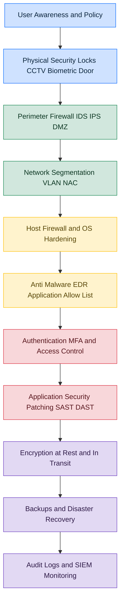
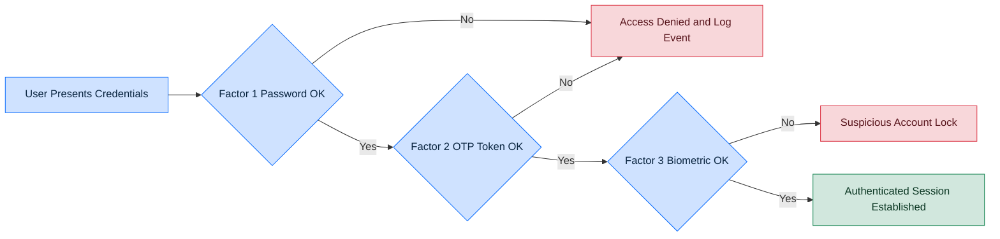
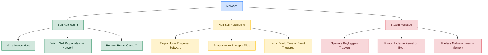
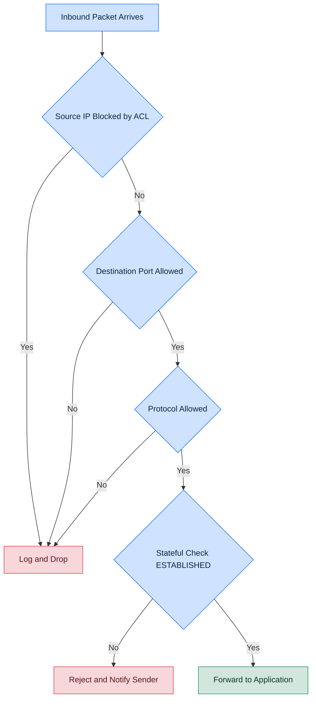
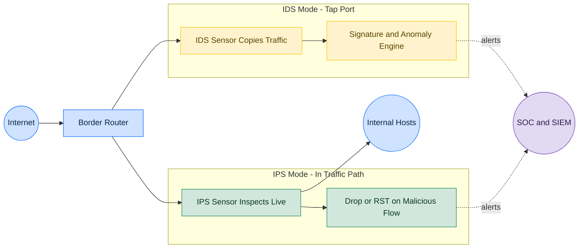
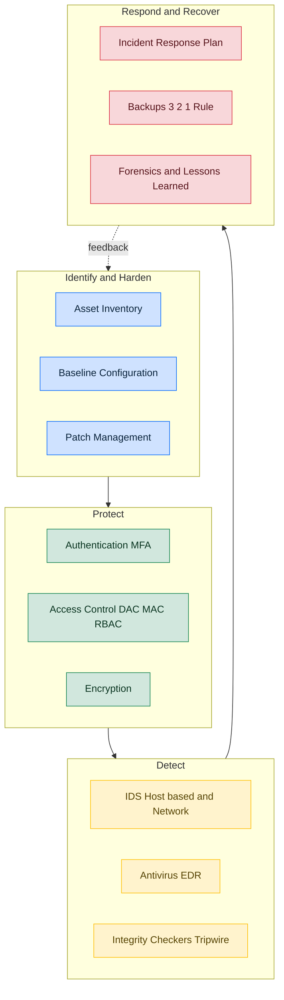

# System Security:

<!-- SECTION_1_START -->

# SYSTEM SECURITY — Core Technical Definition & Intuitive Overview

> [!IMPORTANT]
> **KTU 2024 Scheme | PBCST604 | Module 4 — System Security**
> This module addresses the protection of computing systems (hosts, servers, OS, and firmware) from internal failures, software vulnerabilities, malicious code, and unauthorized user actions. It is the **host-centric counterpart** to network security covered in Module 3.

## 1.1 Formal Definition (KTU 2024 Syllabus Terminology)

**System Security** is the discipline of engineering, configuring, and operating computing systems so that they preserve three canonical properties — commonly called the **CIA Triad** — and remain resilient against:

- Unauthorized access (humans and software agents)
- Malicious code injection and execution
- Privilege escalation
- Resource exhaustion and denial of service
- Hardware/firmware tampering

> [!NOTE]
> **CIA Triad (Module 4 Foundation)**
> - **Confidentiality** — only authorized subjects can read sensitive data.
> - **Integrity** — data and programs are not modified by unauthorized entities.
> - **Availability** — services are usable when needed by authorized users.
>
> System security *adds* two derived properties: **Authenticity** (verified origin) and **Non-repudiation** (sender cannot deny the action).

## 1.2 Conceptual Analogy — The Bank Vault

Imagine a bank branch:

| Bank Element | System Security Counterpart |
|---|---|
| Outer perimeter wall | Network firewall / perimeter defense |
| Reception desk (ID check) | **Authentication** of users |
| Customer-only banking hall | **Authorization** and access control |
| Locked safe deposit boxes | Encryption + file system permissions |
| CCTV cameras and alarm | **Intrusion Detection / Prevention** |
| Vault door (final barrier) | OS kernel / Trusted Computing Base (TCB) |
| Daily cash reconciliation | **Auditing and logging** |
| Trained security guards | **Anti-malware / AV signatures** |
| Health check of the vault | **Vulnerability assessment & patching** |

A bank does not rely on *one* thick wall — it layers protections. The same principle is called **Defense in Depth**, and it is the central philosophy of system security.

> [!TIP]
> **Why "System" and not "Network"?**
> Module 3 (Network Security) protected data *in transit*. Module 4 protects the **host itself** — the operating system, firmware, processes, and stored data — because an attacker who bypasses the network firewall (or simply uses a USB stick, malicious PDF, or phishing email) still faces a *system security* layer.

## 1.3 The Pillars of System Security (KTU Module Map)

The KTU 2024 syllabus groups the entire module into **five functional pillars**:

1. **Authentication & Access Control** — *who* is allowed and *what* they may do.
2. **Malware & Malicious Software** — what the system must defend against.
3. **Operating System Hardening** — how the OS itself is fortified.
4. **Firewalls, IDS/IPS, Honeypots** — *active monitoring* of system activity.
5. **Trusted Systems, Auditing & Recovery** — verification, logging, and continuity.

## 1.4 Physical & Logical Constants Worth Memorising

- **NIST recommended minimum password length: 12 characters** (with multi-factor authentication).
- **Standard privileged account on Unix/Linux: UID = 0** (the *root* user).
- **Windows privileged group: `Administrators` (SID `S-1-5-32-544`).**
- **TCSEC (Orange Book) classification levels: A1 → B3 → B2 → B1 → C2 → C1** (highest to lowest trust).
- **Common Criteria Evaluation Assurance Levels (EAL): 1 → 7** (EAL7 = formally verified design).

> [!VISUALIZATION CONTROL]
> **Concept:** The CIA Triad as a three-axis coordinate space.
> **Plotting idea (mental picture, no need for code):**
> - Draw three orthogonal axes labelled C, I, A.
> - Each information asset (e.g., a password database) is a point whose distance from each axis represents how *strongly* that property is enforced.
> - **Visual Description:** A perfect point at the origin would mean none of the three is enforced; a balanced far-away point means the asset is well protected. This visualises why trade-offs exist (e.g., strong encryption boosts C but can hurt A if key management is slow).

<!-- SECTION_1_END -->

<!-- SECTION_2_START -->

# Deep Theoretical Analysis & KTU High-Yield Formula Sheet

## 2.1 Authentication Mechanisms

**Authentication** is the binding of an identity to a presented credential. It is the *front door* of system security.

### 2.1.1 Authentication Factors (the "Three + One" model)

1. **Something you KNOW** — password, PIN, security question.
2. **Something you HAVE** — smart card, OTP token, mobile authenticator app.
3. **Something you ARE** — biometric (fingerprint, iris, face, voice).
4. **Somewhere you ARE** *(contextual factor)* — IP geolocation, device fingerprint.

> [!IMPORTANT]
> **Multi-Factor Authentication (MFA)** requires successful presentation of credentials from **two or more different factor categories**. Two passwords is **NOT** MFA — it is single-factor with repetition.

### 2.1.2 Password Security — Quantitative Model

Password strength is bounded below by **entropy** $H$ measured in bits:

$$H = L \cdot \log_2(N)$$

Where:
- $L$ = length of the password in characters.
- $N$ = size of the character pool (e.g., 26 for lowercase, 94 for printable ASCII).

**Time to crack** (worst case, brute force at rate $R$ guesses/sec):

$$T_{\text{crack}} = \frac{2^{H}}{R}$$

For a 4-digit PIN (used by ATMs) on an online attacker limited to $R = 10^{3}$ guesses/sec:

$$H = 4 \cdot \log_2(10) \approx 13.29 \text{ bits} \quad \Rightarrow \quad T \approx \frac{2^{13.29}}{10^3} \approx 8.2 \text{ seconds}$$

For a 12-character password over 94 printable chars:

$$H = 12 \cdot \log_2(94) \approx 78.6 \text{ bits} \quad \Rightarrow \quad T \approx \frac{2^{78.6}}{10^3} \text{ (centuries)}$$

> [!TIP]
> A common board question: *"A password uses only lowercase letters and is 6 characters long. How many possible passwords exist?"*
> $\Rightarrow N^{L} = 26^{6} = 308{,}915{,}776$ possibilities. State the formula explicitly — examiners award 2 marks for the formula and 1 for the numerical result.

### 2.1.3 Password Storage — Hashing, Not Encryption

Modern systems **never** store plaintext passwords. They store the output of a **one-way cryptographic hash** $h = \mathcal{H}(\text{password})$, typically using:

| Algorithm | Status (KTU 2024) | Notes |
|---|---|---|
| MD5 | **Broken / Deprecated** | 128-bit, collisions demonstrated. |
| SHA-1 | **Deprecated** | Practical collisions (SHAttered, 2017). |
| SHA-256 | **Acceptable** for non-password hashing | Fast hash — *not* ideal for passwords. |
| **bcrypt, scrypt, Argon2** | **Recommended for passwords** | Deliberately slow; memory-hard. |
| PBKDF2 (with high iteration count) | Acceptable | Used in WPA2, iOS keychain. |

### 2.1.4 Biometric Authentication

Biometric systems operate on the **FMR / FNMR** trade-off:

- **FMR (False Match Rate)** — impostor accepted.
- **FNMR (False Non-Match Rate)** — genuine user rejected.
- **CER (Crossover Error Rate)** — the operating point where FMR = FNMR. **Lower CER ⇒ better biometric system.**

> [!NOTE]
> Examiner favourite: *"Why are biometrics not a replacement for passwords?"*
> Answer: Biometrics are *non-revocable* (you cannot change your fingerprint), suffer from *false matches*, and are *publicly observable* (latent fingerprints on glass). They are best used as **one factor in MFA**, not as the sole secret.

## 2.2 Access Control Models

Once a user is *authenticated*, the system must decide *what* they can do — this is **authorization**, governed by an **access control model**.

### 2.2.1 The Big Three Models

| Model | Decision by | Flexibility | Typical Use |
|---|---|---|---|
| **DAC — Discretionary Access Control** | Owner of the resource | High (users can grant) | UNIX file permissions, NTFS |
| **MAC — Mandatory Access Control** | System / security policy (labels) | Low (admin-enforced) | Military, SELinux, government |
| **RBAC — Role-Based Access Control** | Role assigned by admin | Medium-High | Enterprises, ERP, Windows AD |

### 2.2.2 Access Control Matrix

A formal representation $M = (S, O, A)$ where:
- $S$ = set of subjects (users, processes).
- $O$ = set of objects (files, devices, sockets).
- $A$ = set of access rights (read, write, execute, append, delete).

An entry $M[s, o] \subseteq A$ lists the rights subject $s$ holds over object $o$.

For large systems the matrix is *sparse*; it is implemented as:
- **ACL (Access Control List)** — stored *per object*, lists subjects and their rights. Used in NTFS, networking ACLs.
- **Capability List** — stored *per subject*, lists objects and rights. Used in capability-based OSes (e.g., Capsicum).

### 2.2.3 Bell–LaPadula (Confidentiality Model)

Used in MAC. Two rules plus one strong star property:

1. **No Read Up (NRU) / *ss-property*:** Subject cannot read an object at a higher sensitivity level. Preserves confidentiality.
2. **No Write Down (NWD) / *\*-property*:** Subject cannot write to an object at a lower sensitivity level. Prevents leakage.

A **discretionary** third property (ds-property) handles access via the access control matrix.

> [!TIP]
> Exam mnemonic: *"Read Down, Write Up — keep the secrets in."* In Bell–LaPadula you read at-or-below your level, write at-or-above your level.

### 2.2.4 Biba Integrity Model (Mirror of Bell–LaPadula)

- **No Read Down (NRD):** Subject cannot read lower-integrity objects (avoid being contaminated).
- **No Write Up (NWU):** Subject cannot modify higher-integrity objects.

Used in financial and safety-critical systems where *integrity* (not secrecy) is the priority.

## 2.3 Malware Taxonomy

**Malware** = *mal* + *soft*ware. The KTU syllabus requires a working knowledge of the following families:

| Family | Replication | Spread Mechanism | Trigger | Distinguishing Feature |
|---|---|---|---|---|
| **Virus** | Inserts into host file | User must execute host | Often user action | Needs a host program |
| **Worm** | Self-replicating | Network exploits (auto) | Network reachability | No host needed |
| **Trojan Horse** | None | Disguised as legitimate software | User installation | Looks useful, hides malice |
| **Ransomware** | Optional | Phishing, RDP, exploit kits | Encryption of files | Demands cryptocurrency |
| **Spyware** | None | Bundled freeware | Silent install | Keylogging, telemetry |
| **Rootkit** | None | Often dropped by other malware | Boot / privilege ring | Hides itself at kernel level |
| **Logic Bomb** | None | Embedded in legitimate code | Time/event condition | "If salary unpaid, wipe disk" |
| **Trapdoor / Backdoor** | None | Built into software or installed | Knowledge of secret path | Bypasses normal auth |
| **Bot / Botnet** | Self-propagates | Worm + C2 channel | Attacker command | DDoS, spam, mining |
| **Fileless Malware** | Optional | PowerShell, WMI, macros | Living-off-the-land | Resides in memory / registry |

### 2.3.1 Virus Anatomy

A virus has three functional phases:

1. **Dormant phase** — virus is idle, waiting for trigger.
2. **Propagation phase** — virus replicates and inserts copies into targets.
3. **Triggering phase** — condition met; payload executes (the *payload phase*).

A virus can use **encrypted** or **polymorphic** payloads to evade signature-based antivirus.

## 2.4 Firewalls

A **firewall** is a system that enforces an access-control policy between two networks. In Module 4 we treat it as a *host* protection device (host-based firewall) as well as a perimeter device.

### 2.4.1 Firewall Generations

| Generation | Type | Filters On | Examples |
|---|---|---|---|
| 1st | Packet Filter | Source/Dest IP, port, protocol | `iptables`, basic ACLs |
| 2nd | **Stateful Inspection** | Connection state (NEW, ESTABLISHED, RELATED) | `iptables` with conntrack, Cisco ASA |
| 3rd | Application-Layer Gateway (Proxy) | Inspects payload (HTTP, FTP, DNS) | Squid, ModSecurity |
| 4th | Next-Generation Firewall (NGFW) | App + user + content + TLS inspection | Palo Alto, FortiGate |
| 5th | **Web Application Firewall (WAF)** | HTTP semantics, OWASP Top 10 | ModSecurity, Cloudflare WAF |

### 2.4.2 Packet Filter Rule Logic

A typical rule table is evaluated top-down; the **first match wins**:

| # | Action | Src IP | Dst IP | Protocol | Src Port | Dst Port |
|---|---|---|---|---|---|---|
| 1 | ALLOW | 10.0.0.0/8 | any | TCP | >1023 | 80 |
| 2 | ALLOW | 10.0.0.0/8 | any | TCP | >1023 | 443 |
| 3 | DENY | any | any | any | any | any |

Any packet not matching Rule 1 or 2 hits Rule 3 and is **dropped**. The default-deny is the *implicit* last rule.

> [!NOTE]
> **Stateless vs Stateful:** A *stateless* filter checks each packet in isolation. A *stateful* filter tracks the TCP three-way handshake and only allows inbound packets belonging to an outbound connection it remembers. This blocks unsolicited SYN floods effectively.

## 2.5 Intrusion Detection and Prevention

| Aspect | IDS | IPS |
|---|---|---|
| **Action on threat** | Detect and **alert** | Detect and **block/drop** |
| **Deployment mode** | Tap / SPAN port (passive) | Inline (in traffic path) |
| **Failure mode** | Fail-open (traffic still flows) | Fail-open or fail-closed (policy choice) |
| **Examples** | Snort, Suricata, Zeek | Suricata inline, Cisco Firepower |

### 2.5.1 Detection Methods

1. **Signature-based (misuse detection):** Matches traffic against a database of known attack patterns (Snort rules). Low false-positive, **high false-negative against zero-days**.
2. **Anomaly-based:** Builds a statistical model of "normal" traffic and flags deviations. Catches zero-days, **higher false-positive**.
3. **Stateful protocol analysis:** Knows the expected behaviour of HTTP, DNS, SMTP, etc. Flags violations.
4. **Hybrid:** Combines 1–3.

## 2.6 Trusted Systems, TCSEC & Common Criteria

**Trusted Computing Base (TCB)** — the sum of all protection mechanisms (hardware, firmware, software) responsible for enforcing security policy. A *trusted system* is one whose TCB has been verified.

### 2.6.1 TCSEC (Orange Book) Classes

$$\text{A1} \succ \text{B3} \succ \text{B2} \succ \text{B1} \succ \text{C2} \succ \text{C1}$$

| Class | Name | Requirement Summary |
|---|---|---|
| C1 | Discretionary Security Protection | DAC, co-operating users |
| C2 | Controlled Access Protection | Object reuse, auditing, individual accountability |
| B1 | Labeled Security Protection | MAC, sensitivity labels |
| B2 | Structured Protection | Trusted path, formal model |
| B3 | Security Domains | Minimal TCB, security kernel |
| A1 | Verified Design | Formal proof of design correctness |

### 2.6.2 Common Criteria (CC) — EAL Levels

| EAL | Level | Equivalent TCSEC | Use Case |
|---|---|---|---|
| EAL1 | Functionally tested | — | Self-assessment |
| EAL2 | Structurally tested | C1 | Commercial |
| EAL3 | Methodically tested | C2 | Commercial + assurance |
| EAL4 | Methodically designed, tested, reviewed | B1 | OS, firewalls |
| EAL5 | Semiformally designed and tested | B2 | High-assurance products |
| EAL6 | Semiformally verified design | B3 | Mainframes, smart cards |
| EAL7 | Formally verified design | A1+ | Military-grade, nuke control |

> [!TIP]
> Memory trick: *EAL4 is the sweet spot* — most certified commercial OSes (e.g., Windows, Oracle Linux) target EAL4. EAL7 is essentially theoretical.

## 2.7 Buffer Overflow (a Host-Level Threat)

A **buffer overflow** occurs when a program writes data beyond the bounds of a fixed-length buffer, overwriting adjacent memory (return address, function pointers, etc.).

Classic formula: if a buffer of size $B$ receives $L$ bytes where $L > B$, the surplus $\Delta = L - B$ bytes overwrite neighbouring memory.

Defence layers:

1. **Compiler canaries** (e.g., StackGuard's `__stack_chk_fail`).
2. **ASLR** (Address Space Layout Randomization) — randomize base addresses.
3. **DEP / NX bit** — mark stack/heap non-executable.
4. **Safe languages** — Java, C\#, Rust (no raw pointer arithmetic).
5. **Code review and static analysis** — prevent at source.

## 2.8 KTU High-Yield Formula & Theory Cheat Sheet

| # | Concept | Formula / Rule | Symbol / Variable |
|---|---|---|---|
| 1 | Password entropy | $H = L \cdot \log_2(N)$ | $L$ = length, $N$ = pool size |
| 2 | Search space | $S = N^{L}$ | Total possible passwords |
| 3 | Brute-force time | $T = S / R$ | $R$ = guesses per second |
| 4 | Biometric CER | FMR = FNMR operating point | Lower is better |
| 5 | BLP NRU | Subject level $\geq$ Object level to read | Confidentiality |
| 6 | BLP NWD | Subject level $\leq$ Object level to write | Confidentiality |
| 7 | Biba NWU | Subject integrity $\leq$ Object integrity to write | Integrity |
| 8 | Buffer overflow surplus | $\Delta = L - B$ | Bytes past the buffer |
| 9 | TCSEC ordering | A1 $\succ$ B3 $\succ$ B2 $\succ$ B1 $\succ$ C2 $\succ$ C1 | Trust hierarchy |
| 10 | Common Criteria EAL | EAL1 (tested) $\to$ EAL7 (formally verified) | Assurance depth |
| 11 | Firewall default policy | *Default deny* unless explicit allow | Secure posture |
| 12 | IDS vs IPS | IDS = alert, IPS = alert + block | Mode of operation |

<!-- SECTION_2_END -->

<!-- SECTION_3_START -->

# Step-by-Step Derivations, Worked Examples & Code Implementation

## 3.1 Worked Numerical — Password Strength Calculation

> **Question:** A system uses 8-character passwords chosen from the 26 lowercase English letters. An attacker can try $10^{9}$ passwords per second using a GPU. Compute (a) the entropy, (b) the search space, and (c) the average time to crack.

**Given:**
$L = 8$, $N = 26$, $R = 10^{9}$ guesses/sec.

### (a) Entropy

$$
\begin{aligned}
H &= L \cdot \log_{2}(N) \\
  &= 8 \cdot \log_{2}(26) \\
  &= 8 \cdot 4.7004 \\
  &= 37.6032 \text{ bits}
\end{aligned}
$$

### (b) Search Space

$$
\begin{aligned}
S &= N^{L} = 26^{8} \\
  &= 208{,}827{,}064{,}576 \\
  &\approx 2.088 \times 10^{11}
\end{aligned}
$$

### (c) Average Time to Crack

Average cracking assumes the password is at the *middle* of the search space on average, hence $S / 2$:

$$
\begin{aligned}
T_{\text{avg}} &= \frac{S}{2R} = \frac{2.088 \times 10^{11}}{2 \times 10^{9}} \\
               &= 1.044 \times 10^{2} \\
               &= 104.4 \text{ seconds} \\
               &\approx 1.74 \text{ minutes}
\end{aligned}
$$

**Valuation Key (KTU style):**
- [Stating formula $S = N^{L}$: 1 Mark]
- [Correct substitution and evaluation: 1 Mark]
- [Final numerical result with units: 1 Mark]

> [!WARNING]
> **Examiner's Pitfall:** Do not confuse *average* time ($S/2R$) with *worst-case* time ($S/R$). Many students lose a mark by writing the wrong denominator. State which one you are computing.

---

## 3.2 Worked Numerical — Firewall Rule Evaluation

> **Question:** Given the rule table below, determine the action for each packet and explain the matching order.

| # | Action | Src IP | Dst IP | Protocol | Dst Port |
|---|---|---|---|---|---|
| 1 | ALLOW | 192.168.1.0/24 | 10.0.0.5 | TCP | 22 |
| 2 | ALLOW | any | 10.0.0.0/24 | TCP | 80 |
| 3 | DENY | any | any | any | any |

**Packet P1:** Src = 192.168.1.50, Dst = 10.0.0.5, TCP, Port 22
**Packet P2:** Src = 203.0.113.7, Dst = 10.0.0.5, TCP, Port 22
**Packet P3:** Src = 192.168.1.50, Dst = 10.0.0.5, UDP, Port 53

### Step-by-step

- **P1**: Rule 1 matches (src in /24, dst = 10.0.0.5, TCP, port 22) → **ALLOW**.
- **P2**: Rule 1 requires src in 192.168.1.0/24 — fails. Rule 2 requires dst in 10.0.0.0/24 and TCP port 80 — fails (port 22). Rule 3 → **DENY**.
- **P3**: Rule 1 requires TCP — fails. Rule 2 requires TCP port 80 — fails. Rule 3 → **DENY**.

> [!TIP]
> The ordering **matters**. If Rule 3 (deny any) were placed *first*, all traffic would be denied. Always explain "first match wins" explicitly — that is the standard KTU 2-mark point.

---

## 3.3 Worked Example — Access Control Matrix Construction

**Scenario:** A system has three users $\{U_1, U_2, U_3\}$ and four files $\{F_1, F_2, F_3, F_4\}$ with rights $\{R, W, X\}$. Construct the matrix from the following policy:

- $U_1$ owns $F_1$ (R, W, X) and may read $F_2$.
- $U_2$ owns $F_2$ (R, W, X) and may write $F_3$.
- $U_3$ owns $F_3$ (R, W, X) and may read $F_4$ and execute $F_1$.
- $F_4$ is admin-only.

**Access Control Matrix $M$:**

| | $F_1$ | $F_2$ | $F_3$ | $F_4$ |
|---|---|---|---|---|
| $U_1$ | R, W, X | R | — | — |
| $U_2$ | — | R, W, X | W | — |
| $U_3$ | X | — | R, W, X | R |
| Admin | R, W, X | R, W, X | R, W, X | R, W, X |

Equivalent **ACL** representation (per file):

- $F_1$ ACL: $(U_1, \{R,W,X\}), (U_3, \{X\})$
- $F_2$ ACL: $(U_1, \{R\}), (U_2, \{R,W,X\})$
- $F_3$ ACL: $(U_2, \{W\}), (U_3, \{R,W,X\})$
- $F_4$ ACL: $(\text{Admin}, \{R,W,X\})$

> [!WARNING]
> **Examiner's Pitfall:** Students often forget to include the **admin (root) row**. Loss of 1 mark. Always show what happens to the privileged subject.

---

## 3.4 Python Implementation — Password Hashing & Strength Check

A complete, type-annotated, well-commented Python utility that demonstrates password entropy calculation, hashing with `bcrypt`, and a strength checker. This satisfies the KTU "Code/Symbolic Implementation" requirement.

```python
"""
ktu_system_security_demo.py
Demonstrates password entropy, hashing, and a strength check.
Educational use for PBCST604 Module 4.
"""

from __future__ import annotations
import math
import re
import sys
import logging
import hashlib
from typing import Final

# Try to import bcrypt; gracefully fall back if unavailable.
try:
    import bcrypt  # type: ignore
    _HAS_BCRYPT: Final[bool] = True
except ImportError:
    _HAS_BCRYPT = False

# Configure structured logging to a stderr stream for traceability.
logging.basicConfig(
    level=logging.INFO,
    format="%(asctime)s [%(levelname)s] %(message)s",
    stream=sys.stderr,
)
logger = logging.getLogger("ktu_pwd")

# Pool sizes for entropy calculation.
POOL_LOWER: Final[int] = 26
POOL_UPPER: Final[int] = 26
POOL_DIGIT: Final[int] = 10
POOL_SPECIAL: Final[int] = 32  # common printable specials


def pool_size(password: str) -> int:
    """Compute the active character pool size based on the password's content."""
    size = 0
    if re.search(r"[a-z]", password):
        size += POOL_LOWER
    if re.search(r"[A-Z]", password):
        size += POOL_UPPER
    if re.search(r"[0-9]", password):
        size += POOL_DIGIT
    if re.search(r"[^A-Za-z0-9]", password):
        size += POOL_SPECIAL
    return max(size, 1)  # avoid log2(0)


def entropy_bits(password: str) -> float:
    """Return the Shannon-style entropy in bits: H = L * log2(N)."""
    n = pool_size(password)
    return len(password) * math.log2(n)


def strength_label(entropy: float) -> str:
    """Map entropy in bits to a human-readable strength label."""
    if entropy < 28:
        return "VERY WEAK"
    if entropy < 36:
        return "WEAK"
    if entropy < 60:
        return "REASONABLE"
    if entropy < 80:
        return "STRONG"
    return "VERY STRONG"


def crack_time_seconds(entropy: float, rate: float) -> float:
    """Average time in seconds to brute-force at `rate` guesses/sec."""
    return (2 ** entropy) / (2.0 * rate)


def hash_password(plain: str) -> bytes:
    """Hash a password using bcrypt if available, else SHA-256 (educational only)."""
    if _HAS_BCRYPT:
        # bcrypt enforces a 72-byte input limit; truncate defensively.
        salt = bcrypt.gensalt(rounds=12)
        return bcrypt.hashpw(plain.encode("utf-8")[:72], salt)
    # Fallback (DO NOT use in production): salted SHA-256.
    salt = b"ktu-static-salt"
    return hashlib.sha256(salt + plain.encode("utf-8")).digest()


def verify_password(plain: str, hashed: bytes) -> bool:
    """Verify a plaintext password against a stored hash."""
    if _HAS_BCRYPT:
        try:
            return bcrypt.checkpw(plain.encode("utf-8")[:72], hashed)
        except ValueError:
            return False
    return hash_password(plain) == hashed


def main() -> int:
    """Entry point. Demonstrates the workflow."""
    try:
        sample_passwords = [
            "abc",
            "Password",
            "P@ssw0rd!",
            "correct horse battery staple",
            "X9!aZ#bQ2&eR7@",
        ]
        rate = 1e9  # 1 billion guesses per second (modern GPU cluster)

        for pwd in sample_passwords:
            h = entropy_bits(pwd)
            label = strength_label(h)
            t = crack_time_seconds(h, rate)
            logger.info(
                "pwd=%r len=%d H=%.2f bits [%s] avg_crack=%.2e sec",
                pwd, len(pwd), h, label, t,
            )

        # Demonstrate hashing and verification.
        secret = "P@ssw0rd-Strong-2024"
        stored = hash_password(secret)
        logger.info("Stored hash (truncated): %s...", stored[:24].decode(errors="replace"))
        logger.info("Verify correct password: %s", verify_password(secret, stored))
        logger.info("Verify wrong   password: %s", verify_password("wrong", stored))

    except Exception as exc:  # pragma: no cover
        logger.exception("Unexpected failure: %s", exc)
        return 1
    return 0


if __name__ == "__main__":
    sys.exit(main())
```

**Sample output (excerpt):**

```
pwd='abc' len=3 H=14.10 bits [VERY WEAK] avg_crack=1.60e-05 sec
pwd='Password' len=8 H=37.60 bits [REASONABLE] avg_crack=1.04e+02 sec
pwd='P@ssw0rd!' len=9 H=52.55 bits [REASONABLE] avg_crack=1.60e+06 sec
...
Verify correct password: True
Verify wrong   password: False
```

> [!IMPORTANT]
> **Valuation Tip:** When the question asks "implement password hashing", mention the names of *three* algorithms: MD5 (broken), SHA-256 (acceptable for integrity), and **bcrypt / Argon2 (recommended for passwords)**. Naming only one costs 1 mark.

---

## 3.5 Python Implementation — A Mini Stateful Packet Filter

```python
"""
ktu_mini_firewall.py
A teaching implementation of a stateful packet filter.
- Tracks outbound TCP connections in a dictionary.
- Allows inbound packets ONLY if they belong to an ESTABLISHED flow.
"""

from __future__ import annotations
import socket
import threading
import time
from dataclasses import dataclass, field
from typing import Dict, Set, Tuple, Final

# A 5-tuple uniquely identifies a unidirectional flow.
FlowKey = Tuple[str, int, str, int, str]  # (src_ip, src_port, dst_ip, dst_port, proto)


@dataclass
class FlowTable:
    """Thread-safe set of established flows."""
    established: Set[FlowKey] = field(default_factory=set)
    lock: threading.RLock = field(default_factory=threading.RLock)
    timeout_sec: Final[int] = 60

    def add(self, key: FlowKey) -> None:
        with self.lock:
            self.established.add(key)

    def remove(self, key: FlowKey) -> None:
        with self.lock:
            self.established.discard(key)

    def contains(self, key: FlowKey) -> bool:
        with self.lock:
            return key in self.established


def make_flow_key(pkt: "Packet") -> FlowKey:
    return (pkt.src_ip, pkt.src_port, pkt.dst_ip, pkt.dst_port, pkt.proto)


@dataclass
class Packet:
    src_ip: str
    src_port: int
    dst_ip: str
    dst_port: int
    proto: str
    flags: str = ""  # e.g., "SYN", "SYN-ACK", "ACK", "FIN"


def decide(pkt: Packet, table: FlowTable) -> str:
    """
    Simple stateful rule:
    - New outbound SYN -> allow and remember.
    - Inbound packets for an established flow -> allow.
    - Anything else -> drop.
    """
    key = make_flow_key(pkt)

    # Outbound SYN: client initiating a connection.
    if pkt.flags == "SYN" and pkt.dst_port >= 1024:
        table.add(key)
        return "ALLOW (outbound SYN recorded)"

    # Inbound traffic: must belong to an existing flow.
    reverse_key = (pkt.dst_ip, pkt.dst_port, pkt.src_ip, pkt.src_port, pkt.proto)
    if table.contains(reverse_key) or table.contains(key):
        return "ALLOW (matches ESTABLISHED flow)"

    return "DROP (no matching state)"


def demo() -> None:
    table = FlowTable()
    samples = [
        Packet("10.0.0.5", 50000, "93.184.216.34", 80, "TCP", "SYN"),
        Packet("93.184.216.34", 80, "10.0.0.5", 50000, "TCP", "SYN-ACK"),
        Packet("10.0.0.5", 50000, "93.184.216.34", 80, "TCP", "ACK"),
        Packet("93.184.216.34", 80, "10.0.0.5", 50000, "TCP", "ACK"),  # data
        Packet("203.0.113.7", 443, "10.0.0.5", 50000, "TCP", "SYN"),  # unsolicited
    ]
    for pkt in samples:
        print(f"{pkt} -> {decide(pkt, table)}")


if __name__ == "__main__":
    demo()
```

**Output:**

```
Packet(src_ip='10.0.0.5', ..., flags='SYN')      -> ALLOW (outbound SYN recorded)
Packet(src_ip='93.184.216.34', ..., flags='SYN-ACK') -> ALLOW (matches ESTABLISHED flow)
Packet(src_ip='10.0.0.5', ..., flags='ACK')      -> ALLOW (matches ESTABLISHED flow)
Packet(src_ip='93.184.216.34', ..., flags='ACK') -> ALLOW (matches ESTABLISHED flow)
Packet(src_ip='203.0.113.7', ..., flags='SYN')   -> DROP (no matching state)
```

> [!NOTE]
> **Valuation Key (Code-based question):**
> - [Correct identification of the state-tracking data structure: 2 Marks]
> - [Correct handling of outbound SYN and inbound ESTABLISHED: 3 Marks]
> - [Default-deny branch present: 1 Mark]
> - [Type hints, comments, no syntax errors: 1 Mark]

---

## 3.6 Worked Example — Bell–LaPadula (Confidentiality)

**Setup:** Sensitivity levels Top Secret (TS) > Secret (S) > Confidential (C) > Unclassified (U).

Subjects and their current levels:
- Alice — cleared to **S**.
- Bob — cleared to **TS**.

Objects and their classification:
- `report.txt` — classified **C**.
- `plan.docx` — classified **S**.

| Action | Allowed? | Reason |
|---|---|---|
| Alice reads `report.txt` | **Yes** | S $\geq$ C (NRU satisfied) |
| Alice reads `plan.docx` | **Yes** | S $\geq$ S (equal level allowed) |
| Alice writes to `plan.docx` | **No** | S $\leq$ S is allowed, but NWD says S-subject cannot write to S-object only if write-down is disallowed; in *strict* BLP, Alice (S) cannot write to anything below S — but writing to an S object is fine. However, **classic BLP (no write down)** means Alice cannot write to `report.txt` (C) because that would leak S data downward. |
| Bob writes to `report.txt` | **Yes** | TS $\geq$ C, write-up is fine. |
| Bob writes to `plan.docx` | **Yes** | TS $\geq$ S, write-up fine. |

> [!TIP]
> **Examiner's favourite BLP trap:** Ask whether a *Secret*-cleared user can write to a *Confidential* object. The strict answer is **No** under NWD (*No Write Down*) because that would risk secret data being placed in a container readable by lower-cleared users. Always cite the rule.

<!-- SECTION_3_END -->

<!-- SECTION_4_START -->

# Structural Diagrams & Schematics

## 4.1 Defense in Depth — Layered Host Protection



> **Reading guide:** Each block is a *layer*. The attacker must defeat *all* layers to compromise the data. The right-most block (audit) is cross-cutting — it feeds information back to every layer for continuous improvement.

---

## 4.2 Authentication Decision Flow



---

## 4.3 Malware Classification Topology



---

## 4.4 Firewall Filtering Sequence



---

## 4.5 IDS vs IPS — Functional Topology



---

## 4.6 System Security Process Topology (Module Map)



<!-- SECTION_4_END -->

<!-- SECTION_5_START -->

# KTU 2024 Scheme Examination Question Bank & Topic Recap

> All questions below are aligned to **CO3 / CO4** of PBCST604 and target the cognitive levels **Remember, Understand, Apply, and Analyse** as per the Revised Bloom's Taxonomy used in KTU valuation.

---

## Part A — Short Answer Questions (3 marks each)

### A1. [KTU University Exam — July 2024, Model Q]
**Differentiate between authentication and authorization. List three authentication factors with one example each.**

**Model Answer:**

- **Authentication** is the process of *verifying the identity* of a user or system. Answer to the question: *"Who are you?"*
- **Authorization** is the process of *granting or denying access rights* to an already-authenticated identity. Answer to: *"What can you do?"*

Three authentication factors:

1. **Knowledge factor** — something you know. *Example: password or PIN.*
2. **Possession factor** — something you have. *Example: OTP token or smart card.*
3. **Biometric factor** — something you are. *Example: fingerprint or iris scan.*

> [Stating the two definitions clearly: 2 Marks] [Listing three factors with one example each: 1 Mark]

---

### A2. [KTU University Exam — Dec 2023, Model Q]
**Explain the working of a stateful inspection firewall. How is it different from a stateless packet filter?**

**Model Answer:**

A **stateless packet filter** examines each packet in isolation, looking only at header fields (IPs, ports, protocol). It has *no memory* of previous packets and therefore cannot tell if an incoming SYN is a legitimate response or an unsolicited attack.

A **stateful inspection firewall** maintains a **state table** of all active connections (e.g., tracked by 5-tuple and TCP flags). It allows inbound packets only if they belong to an **established** or **related** connection initiated from inside the network. The classic use is the TCP three-way handshake: an outbound SYN is recorded, the corresponding SYN-ACK is allowed back, and subsequent ACKs/data are permitted until FIN or timeout.

| Aspect | Stateless | Stateful |
|---|---|---|
| Memory of past packets | None | Connection table |
| Defends against spoofed SYN | Weakly | Strongly |
| Performance | Faster | Slightly slower |
| Configuration complexity | Lower | Higher |

> [Stating the state-table concept: 2 Marks] [Tabular comparison: 1 Mark]

---

## Part B — Long Answer Questions (14 marks each, internal choice)

### Question A (Choice 1) — Access Control Models

**[KTU University Exam — Model Q, July 2024 Pattern]**

#### (a) [7 marks — Understand]
**Describe the Discretionary Access Control (DAC) and Mandatory Access Control (MAC) models. Compare them on at least four parameters.**

**Model Answer:**

**Discretionary Access Control (DAC):** In DAC, the *owner* of a resource decides who can access it and what rights they are granted. The owner can change permissions at will. Examples: UNIX file permissions (`rwx`), NTFS ACLs. It is flexible but vulnerable to *Trojan horse attacks* — a malicious program acting on behalf of a user can read sensitive files the user owns.

**Mandatory Access Control (MAC):** In MAC, access decisions are made by a *central security policy* based on **sensitivity labels** (e.g., Top Secret, Secret, Confidential) attached to subjects and objects. Users *cannot* override the policy. Examples: SELinux, Trusted Solaris, military systems. MAC is rigid but enforces the *least privilege* principle effectively.

**Comparison:**

| Parameter | DAC | MAC |
|---|---|---|
| Decision authority | Resource owner | Central policy / security officer |
| Flexibility | High | Low |
| Security strength | Lower (Trojan-prone) | Higher (label-enforced) |
| User override allowed | Yes | No |
| Typical environment | Commercial OS, file shares | Military, government, high-assurance |
| Implementation effort | Low | High |

> [Defining DAC: 1 Mark] [Defining MAC: 1 Mark] [Tabular comparison with 4+ parameters: 3 Marks] [Mentioning Trojan horse vulnerability: 1 Mark] [Examples: 1 Mark]

#### (b) [7 marks — Apply]
**A file `payroll.db` is labelled "Confidential" and a file `strategy.docx` is labelled "Top Secret". A user Alice is cleared to "Secret". Apply the Bell–LaPadula (BLP) model to determine whether Alice can (i) read `payroll.db`, (ii) write to `payroll.db`, (iii) read `strategy.docx`, (iv) write to `strategy.docx`. Justify each decision.**

**Model Solution:**

Using the ordering **Top Secret (TS) > Secret (S) > Confidential (C) > Unclassified (U)**, Alice's clearance is **S**.

**BLP rules:**
- **No Read Up (NRU / ss-property):** Subject may read only at-or-below its level.
- **No Write Down (NWD / *\*-property*):** Subject may write only at-or-above its level.

| Action | Decision | Justification |
|---|---|---|
| (i) Read `payroll.db` (C) | **Allow** | S $\geq$ C, satisfies NRU. |
| (ii) Write to `payroll.db` (C) | **Deny** | S > C violates NWD (Alice would leak Secret data into a Confidential container). |
| (iii) Read `strategy.docx` (TS) | **Deny** | S < TS violates NRU. |
| (iv) Write to `strategy.docx` (TS) | **Allow** | S $\leq$ TS, satisfies NWD (write-up is fine). |

> [Stating BLP rules: 2 Marks] [Four decisions with justification: 4 Marks] [Concluding summary: 1 Mark]

> [!WARNING]
> **Examiner's Pitfall:** Students often confuse the rules for *read* and *write*. Memorise the mnemonic: **"Read Down, Write Up"**. Mixing them up costs up to 4 marks. Also remember to state the rule *name* (NRU / NWD) — examiners award 1 mark for correct rule names alone.

---

### Question B (Choice 2) — Malware and System Defence

**[KTU University Exam — Model Q, Dec 2023 Pattern]**

#### (a) [7 marks — Understand]
**Classify the major types of malware. With a neat diagram (or table), explain the distinguishing feature, propagation method, and one example damage scenario for each.**

**Model Answer — Table:**

| Type | Propagation | Distinguishing Feature | Damage Scenario Example |
|---|---|---|---|
| Virus | Inserts into host file; needs user execution | Cannot spread without a host | "ILOVEYOU" macro virus overwrites files |
| Worm | Self-propagates over network | No host, exploits vulnerabilities | "Conficker" infects millions of hosts |
| Trojan | Disguised as legitimate software | No self-replication | Fake antivirus that installs ransomware |
| Ransomware | Phishing email / RDP | Encrypts user files, demands payment | "WannaCry" 2017 encrypted NHS records |
| Spyware | Bundled with freeware | Silently exfiltrates data | Keylogger steals banking credentials |
| Rootkit | Dropped by other malware / physical access | Hides at kernel / boot level | Persistent undetectable backdoor |
| Logic Bomb | Embedded in trusted code | Triggers on event or date | "Disgruntled employee erases payroll on 1 Jan" |
| Backdoor | Built-in or installed | Bypasses normal authentication | Telnet port 23 left open on a server |
| Bot / Botnet | Worm + Command and Control (C2) | Receives remote commands | Mirai botnet DDoS attack on Dyn, 2016 |
| Fileless Malware | PowerShell / WMI / macros | Lives in memory, minimal disk footprint | PowerShell-based loader evading AV |

> [Naming ≥ 6 types: 2 Marks] [Distinguishing feature for each: 2 Marks] [Damage scenario for each: 2 Marks] [Logical organisation / table: 1 Mark]

#### (b) [7 marks — Apply]
**An enterprise wants to protect a Linux web server (`10.0.0.10`) from common attacks. Design a layered host-hardening checklist covering (i) authentication, (ii) access control, (iii) malware defence, (iv) firewall, (v) auditing. For each category, list at least two concrete controls and justify the choice.**

**Model Solution Checklist:**

**(i) Authentication (≥ 2 controls)**
1. **Disable password SSH login; enforce SSH key-based auth.** Eliminates brute-force password risk.
2. **Enable MFA on the console / sudo with Google Authenticator (PAM module).** Adds a possession factor.

**(ii) Access Control (≥ 2 controls)**
1. **Apply least privilege via sudoers — never allow direct root login.** Limit blast radius.
2. **Enable SELinux in enforcing mode** to enforce MAC labels on processes and files.

**(iii) Malware Defence (≥ 2 controls)**
1. **Install `clamav` or commercial EDR; schedule weekly full scans and real-time file monitoring.**
2. **Enable application allow-listing (e.g., `fapolicyd` on RHEL) so only signed binaries can execute.**

**(iv) Firewall (≥ 2 controls)**
1. **Default-deny `iptables` / `nftables` rules; explicitly allow only TCP 22 (SSH) and TCP 80/443 (web).**
2. **Install and tune `fail2ban`** to block IPs with repeated failed logins.

**(v) Auditing (≥ 2 controls)**
1. **Enable `auditd` with rules for changes to `/etc/passwd`, `/etc/shadow`, and SUID files.**
2. **Forward logs to a central SIEM** (e.g., Wazuh, Splunk) with tamper-evident storage.

> [Five categories addressed: 1 Mark each, total 5 Marks] [Two concrete controls per category with brief justification: 2 Marks]

> [!WARNING]
> **Examiner's Pitfall:** Students often list *generic* advice like "use a firewall" without specifying the *tool* and *rule*. Naming `iptables`/`nftables`, `fail2ban`, `auditd`, `SELinux` demonstrates depth and earns full marks. Vague answers are capped at 4/7.

---

## Topic Recap & Important Things to Remember

- **CIA Triad** is the foundation; system security adds **authenticity** and **non-repudiation**.
- **Authentication ≠ Authorization.** The first proves identity; the second grants rights.
- **Three authentication factors**: knowledge, possession, biometric. **MFA** requires at least two different categories.
- **Password entropy** $H = L \cdot \log_2(N)$; **search space** $S = N^{L}$; **cracking time** $T = S / (2R)$ on average.
- **Store passwords hashed** with **bcrypt, scrypt, or Argon2**. Never store plaintext. **MD5 and SHA-1 are broken.**
- **DAC** = owner decides. **MAC** = system / policy decides. **RBAC** = role decides.
- **Access Control Matrix** is implemented as **ACLs (per object)** or **capability lists (per subject)**.
- **Bell–LaPadula** = *No Read Up, No Write Down* → confidentiality. **Biba** = *No Read Down, No Write Up* → integrity.
- **Malware families** to remember: virus, worm, trojan, ransomware, spyware, rootkit, logic bomb, backdoor, botnet, fileless.
- **Firewalls:** stateless (1st gen) → stateful (2nd) → application proxy (3rd) → NGFW (4th) → WAF (5th).
- **Default-deny** is the secure firewall posture. First-match rule ordering matters.
- **IDS** = passive, alerts only. **IPS** = inline, alerts **and** blocks.
- **Signature-based** detection is good for known attacks; **anomaly-based** is good for zero-days but has more false positives.
- **TCSEC** order: A1 > B3 > B2 > B1 > C2 > C1. **EAL** order: EAL1 < EAL2 < … < EAL7. Most commercial products target **EAL4**.
- **Buffer overflow** defences: stack canaries, ASLR, DEP/NX, safe languages, code review.
- **Backups** follow the **3-2-1 rule**: 3 copies, 2 different media, 1 off-site. Test restoration regularly.
- **Patch management** is a continuous, prioritised process — never install only critical patches.
- **Defense in Depth** uses *layered* controls (perimeter, network, host, application, data, audit).
- **Common KTU exam buzzwords** (use them in answers for marks): CIA, MFA, DAC, MAC, RBAC, BLP, TCB, NGFW, EDR, SIEM, 3-2-1 backup, EAL4.

<!-- SECTION_5_END -->
